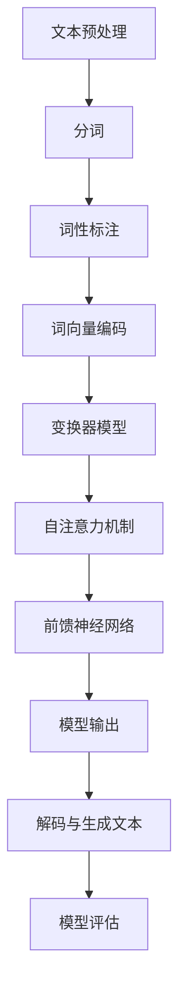
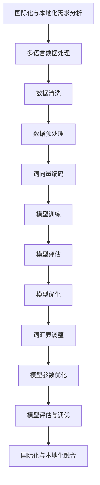
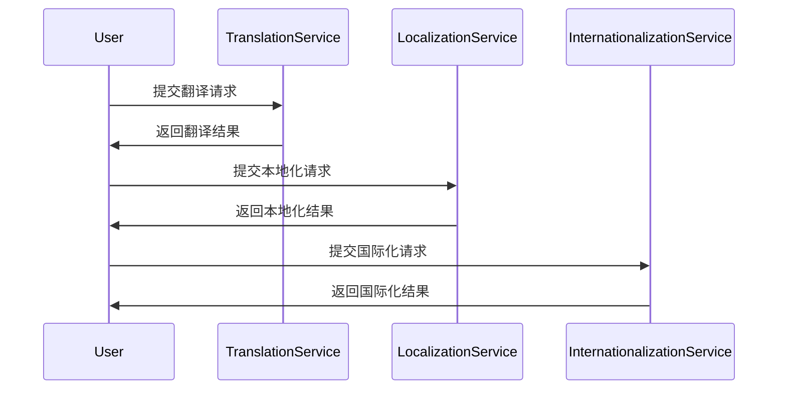
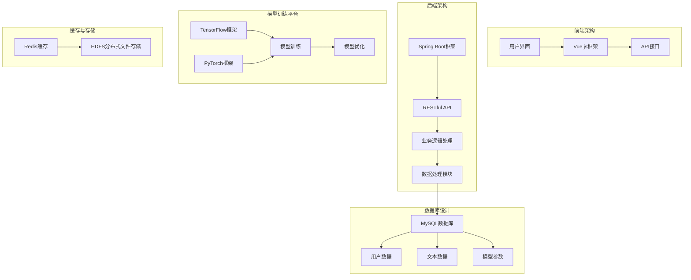

                 

# 《优化LLM应用的国际化与本地化策略》

关键词：大型语言模型（LLM），国际化，本地化，算法优化，多语言处理

摘要：
本文将深入探讨如何优化大型语言模型（LLM）在国际化与本地化中的应用策略。我们将从背景介绍、核心概念与联系、数学模型和算法原理讲解、系统分析与架构设计方案、项目实战到最佳实践，逐步剖析国际化与本地化的挑战及其解决方案，旨在为开发者在多语言处理领域提供切实可行的指导。

## 第一部分: 背景

### 第1章: 问题背景

#### 1.1.1 问题的提出

随着全球化的深入发展，企业和服务提供商面临着越来越多的国际化需求。然而，传统的多语言处理方法往往存在一定的局限性，无法满足多样化的语言需求。大型语言模型（LLM）作为一种先进的自然语言处理技术，为国际化与本地化提供了新的契机。然而，如何在确保模型性能的同时，实现高效的国际化与本地化应用，仍是一个亟待解决的问题。

#### 1.1.2 问题分析

国际化与本地化在多语言处理中具有不同的侧重点。国际化主要关注于将产品或服务扩展到不同的语言市场，而本地化则更加关注于适应特定文化、语言和地区的要求。LLM在国际化与本地化中的应用需要考虑到多语言数据处理、模型定制、算法优化等多个方面，这对模型的性能和可扩展性提出了更高的要求。

#### 1.1.3 国际化与本地化概念及联系

国际化（Internationalization）是指将产品或服务扩展到全球市场，确保其可被不同语言和文化背景的用户理解和使用。本地化（Localization）则是国际化的具体实施，包括翻译、文化适应、格式调整等，以满足特定市场的需求。国际化与本地化是相辅相成的，国际化为本地化提供了基础，而本地化则是国际化的具体体现。

### 第2章: 核心概念与联系

#### 2.1.1 语言模型（LLM）的概念与特点

语言模型（LLM）是一种基于深度学习的自然语言处理技术，通过对大量文本数据的学习，能够生成符合语言规律的文本。LLM具有参数量大、自适应能力强、生成文本质量高等特点，广泛应用于机器翻译、文本生成、问答系统等领域。

#### 2.1.2 国际化与本地化的概念与区别

国际化是指为产品或服务在国际市场上做好准备，确保其能够在不同语言和文化环境中运行。本地化则是将国际化产品或服务适应特定市场的过程，包括翻译、文化适应、用户界面调整等。

#### 2.1.3 语言模型在国际化与本地化中的应用

语言模型在国际化与本地化中具有重要作用。国际化中，LLM可用于自动翻译、文本摘要、情感分析等，提高产品或服务的国际化水平。本地化中，LLM可帮助实现精确翻译、文化适应、个性化推荐等，提升用户体验。

### 第3章: 数学模型和数学公式

#### 3.1.1 LLM的数学模型

LLM通常基于深度神经网络，其数学模型包括输入层、隐藏层和输出层。输入层接收文本数据，隐藏层通过权重矩阵和激活函数进行特征提取，输出层生成预测结果。

#### 3.1.2 本地化策略的数学模型

本地化策略的数学模型涉及词汇表调整、参数优化等。通过调整模型参数，可以使LLM更好地适应特定语言和文化环境。

#### 3.1.3 国际化策略的数学模型

国际化策略的数学模型主要关注多语言数据的处理和融合。通过训练多语言数据，可以提升LLM在多语言任务上的性能。

## 第二部分: 算法原理讲解

### 第4章: LLM算法原理

#### 4.1.1 LLM的工作原理

LLM的工作原理主要包括三个阶段：数据预处理、模型训练和模型部署。数据预处理阶段对文本数据进行清洗和编码，模型训练阶段通过反向传播算法优化模型参数，模型部署阶段将训练好的模型应用于实际任务。

#### 4.1.2 LLM的训练过程

LLM的训练过程包括数据准备、模型初始化、迭代训练和模型评估。在训练过程中，LLM通过不断调整参数，使其生成的文本更符合语言规律。

#### 4.1.3 LLM的优化策略

LLM的优化策略主要包括参数调整、正则化、学习率调整等。通过优化策略，可以提高LLM的训练效率和生成质量。

### 第5章: 国际化与本地化策略

#### 5.1.1 国际化策略的算法原理

国际化策略的算法原理主要涉及多语言数据的处理和融合。通过训练多语言数据，可以提升LLM在多语言任务上的性能。

#### 5.1.2 本地化策略的算法原理

本地化策略的算法原理主要涉及词汇表调整、参数优化等。通过调整模型参数，可以使LLM更好地适应特定语言和文化环境。

#### 5.1.3 国际化与本地化策略的融合

国际化与本地化策略的融合需要考虑到多语言数据、用户偏好、文化背景等因素。通过融合策略，可以更好地实现国际化与本地化的平衡。

### 第6章: 算法mermaid流程图

#### 6.1.1 LLM算法流程图

使用mermaid绘制LLM算法流程图，展示数据预处理、模型训练和模型部署等关键步骤。

#### 6.1.2 国际化与本地化策略流程图

使用mermaid绘制国际化与本地化策略流程图，展示多语言数据处理、词汇表调整、参数优化等关键步骤。

## 第三部分: 系统分析与架构设计方案

### 第7章: 系统功能设计

#### 7.1.1 领域模型mermaid类图

使用mermaid绘制领域模型类图，展示系统涉及的实体和关系。

#### 7.1.2 系统功能概述

对系统功能进行概述，包括文本预处理、语言模型训练、国际化与本地化处理等。

### 第8章: 系统架构设计

#### 8.1.1 系统架构mermaid架构图

使用mermaid绘制系统架构图，展示系统的主要组件和交互关系。

#### 8.1.2 系统架构设计原则

阐述系统架构设计原则，包括模块化、高内聚、低耦合等。

### 第9章: 系统接口设计和系统交互

#### 9.1.1 系统接口设计

对系统接口进行详细设计，包括API接口、数据接口等。

#### 9.1.2 系统交互mermaid序列图

使用mermaid绘制系统交互序列图，展示系统各组件之间的交互过程。

## 第四部分: 项目实战

### 第10章: 环境安装与配置

#### 10.1.1 环境安装

介绍LLM应用所需的环境安装，包括操作系统、Python环境、深度学习框架等。

#### 10.1.2 系统配置

对系统进行配置，包括参数调整、模型优化等。

### 第11章: 系统核心实现

#### 11.1.1 文本预处理

使用Python代码实现文本预处理功能，包括分词、去除停用词、词性标注等。

#### 11.1.2 语言模型训练

使用Python代码实现语言模型训练功能，包括模型初始化、迭代训练、模型评估等。

#### 11.1.3 国际化与本地化处理

使用Python代码实现国际化与本地化处理功能，包括词汇表调整、参数优化等。

### 第12章: 代码应用解读与分析

#### 12.1.1 代码应用场景

介绍代码应用场景，包括多语言翻译、文本生成、问答系统等。

#### 12.1.2 代码解读与分析

对核心代码进行解读和分析，阐述代码实现原理和优化策略。

### 第13章: 实际案例分析与详细讲解

#### 13.1.1 案例背景

介绍实际案例背景，包括国际化与本地化需求、挑战和解决方案。

#### 13.1.2 案例分析

对案例进行分析，包括问题定位、解决方案、效果评估等。

#### 13.1.3 案例详细讲解

对案例进行详细讲解，包括技术原理、代码实现、效果对比等。

### 第14章: 项目小结

#### 14.1.1 项目总结

总结项目的主要成果、经验教训和技术挑战。

#### 14.1.2 项目展望

展望项目的发展方向、潜在问题和改进措施。

## 第五部分: 最佳实践与拓展阅读

### 第15章: 最佳实践

#### 15.1.1 国际化与本地化最佳实践

分享国际化与本地化的最佳实践，包括模型训练策略、参数调整技巧、多语言数据处理方法等。

#### 15.1.2 优化策略

介绍优化策略，包括模型压缩、加速训练、参数共享等。

### 第16章: 小结与注意事项

#### 16.1.1 小结

总结文章的核心观点和主要结论。

#### 16.1.2 注意事项

提醒读者在应用国际化与本地化策略时需要注意的问题和事项。

### 第17章: 拓展阅读

#### 17.1.1 相关文献

推荐相关的文献和资料，供读者进一步学习和研究。

#### 17.1.2 开源项目

介绍一些开源项目，供读者参考和使用。

作者：AI天才研究院/AI Genius Institute & 禅与计算机程序设计艺术 /Zen And The Art of Computer Programming

**（注意：本目录大纲和内容仅为示例，实际内容编写需根据具体情况进行调整和补充。）**### 第1章: 问题背景

#### 1.1.1 现实中的国际化挑战

在当今全球化的大背景下，许多企业和产品都面临着国际化挑战。随着互联网和移动设备的普及，用户遍布全球，他们使用不同的语言、文化背景和操作系统。这就要求产品和服务能够跨越语言和文化障碍，提供本地化的用户体验。然而，实现这一目标并不容易。传统的方法如手动翻译、语言本地化和文化适应等，不仅耗时耗力，而且容易出现偏差。因此，寻找高效的自动化解决方案成为了一项紧迫的任务。

#### 1.1.2 本地化的重要性

本地化是国际化的重要组成部分，它不仅仅包括语言翻译，还涉及到文化适应、界面调整、用户偏好设置等多个方面。本地化能够提升用户体验，增加产品的吸引力和市场竞争力。例如，一个应用程序在多个国家推出时，如果界面和文化背景与本地用户习惯不符，用户很难产生共鸣，从而降低使用率。因此，本地化不仅能够满足不同市场的需求，还能增强产品的市场适应性和用户满意度。

#### 1.1.3 LLM应用的国际化与本地化需求

大型语言模型（LLM）作为一种先进的自然语言处理技术，具有在国际化与本地化中广泛应用的潜力。LLM能够自动翻译、生成文本、处理语音等，为国际化与本地化提供了强大的技术支持。然而，要充分发挥LLM的潜力，需要解决以下几个关键问题：

1. **多语言数据处理能力**：LLM需要能够处理多种语言的数据，并且在不同语言之间进行有效的转换和融合。
2. **适应性**：LLM需要能够适应不同文化和语言背景的需求，实现真正意义上的本地化。
3. **性能优化**：为了实现高效的国际化与本地化，LLM需要具备高性能的处理能力，能够在多语言环境下快速运行。
4. **可扩展性**：随着新语言和新市场的不断涌现，LLM需要具备良好的可扩展性，能够轻松适应新的变化。

#### 1.1.4 LLM在国际化与本地化中的局限性

尽管LLM在国际化与本地化中具有巨大潜力，但它也存在一些局限性。首先，LLM的训练数据量通常非常庞大，这导致了训练过程需要大量的计算资源和时间。其次，LLM的生成文本质量受到数据质量、模型参数和训练策略的影响，可能存在语义错误或不符合本地文化的情况。此外，LLM在处理低资源语言时，可能会遇到数据匮乏和性能下降的问题。因此，如何克服这些局限性，实现高效的国际化与本地化应用，是当前研究和实践中的一个重要课题。

#### 1.1.5 当前解决方案的不足

现有的国际化与本地化解决方案，如手动翻译、语言包更新、本地化工具等，都存在一定的局限性。手动翻译成本高昂、效率低下，且难以保证翻译质量的一致性。语言包更新和本地化工具虽然能够实现自动化，但在处理复杂的文化差异和用户个性化需求时，效果有限。此外，这些解决方案往往缺乏灵活性和可扩展性，难以适应快速变化的市场需求。

综上所述，优化LLM在国际化与本地化中的应用策略，已经成为提高产品竞争力、满足全球化需求的关键。本文将深入探讨如何通过算法优化、数据增强、模型定制等手段，提升LLM在国际化与本地化中的性能和适应性，为企业提供切实可行的解决方案。

### 第2章: 核心概念与联系

#### 2.1 语言模型（LLM）的概念与特点

语言模型（LLM）是一种基于深度学习的自然语言处理技术，它通过学习大量的文本数据，构建出一种能够预测下一个单词或句子概率的模型。LLM的核心特点是参数量大、自适应能力强、生成文本质量高。

**2.1.1 LLM的定义**

LLM全称为Large Language Model，是一种大型的预训练语言模型。它通常由数十亿个参数组成，通过对海量文本数据进行预训练，使其具备了强大的语言理解和生成能力。LLM可以用于各种自然语言处理任务，如文本分类、情感分析、机器翻译、文本生成等。

**2.1.2 LLM的基本原理**

LLM的基本原理是基于Transformer架构，该架构由Vaswani等人于2017年提出。Transformer模型摒弃了传统的循环神经网络（RNN）和卷积神经网络（CNN），转而使用自注意力机制（Self-Attention）来处理序列数据。自注意力机制允许模型在生成每个单词时，考虑到之前所有单词的影响，从而生成更加准确和连贯的文本。

**2.1.3 LLM的优势与局限性**

LLM的优势在于其强大的语言理解和生成能力，能够生成高质量的自然语言文本。此外，LLM的预训练过程使得它能够适应多种不同的任务和数据集，提高了模型的通用性和适应性。然而，LLM也存在一些局限性，如：

1. **计算资源需求大**：由于LLM的参数量巨大，其训练和推理过程需要大量的计算资源和时间。
2. **数据质量依赖**：LLM的性能高度依赖于训练数据的质量，数据中的噪声和偏差会直接影响模型的性能。
3. **可解释性差**：深度学习模型通常被认为是“黑盒”模型，其内部机制难以解释和理解。

#### 2.2 国际化与本地化的概念与区别

国际化（Internationalization）和本地化（Localization）是两个密切相关但又有区别的概念。

**2.2.1 国际化概念解析**

国际化是指将产品或服务设计成可以在不同国家和地区销售和使用的状态。国际化的核心目标是确保产品或服务能够在不同语言和文化背景下运行，从而进入全球市场。国际化的实现包括多语言支持、国际化用户界面、全球化供应链等多个方面。

**2.2.2 本地化概念解析**

本地化是指将国际化的产品或服务进一步适应特定国家或地区的市场需求和文化特点。本地化的核心目标是提升用户体验，确保产品或服务能够与本地用户的文化、语言和习惯相契合。本地化的实现包括翻译、文化适应、用户界面调整、市场营销策略等多个方面。

**2.2.3 国际化与本地化的区别**

国际化与本地化的主要区别在于：

1. **目标**：国际化关注于产品或服务的全球可接受性，而本地化关注于产品或服务的本地可接受性。
2. **内容**：国际化主要涉及产品或服务的通用性设计，而本地化主要涉及产品或服务的本地化调整。
3. **顺序**：国际化通常在本地化之前进行，本地化是国际化的一部分。

#### 2.3 语言模型在国际化与本地化中的应用

语言模型在国际化与本地化中的应用，主要体现在以下三个方面：

**2.3.1 LLM在国际化中的应用**

1. **多语言文本生成**：LLM可以用于生成多种语言的文本，从而帮助产品或服务实现多语言支持。
2. **多语言文本翻译**：LLM可以用于自动翻译文本，提高国际化过程中的翻译效率和质量。
3. **多语言文本摘要**：LLM可以用于生成多语言文本的摘要，帮助用户快速了解不同语言的内容。

**2.3.2 LLM在本地化中的应用**

1. **文本翻译与本地化**：LLM可以用于翻译和本地化文本，使其更符合本地语言和文化特点。
2. **用户界面本地化**：LLM可以用于生成本地化后的用户界面，提高本地用户的操作体验。
3. **本地化内容生成**：LLM可以用于生成本地化后的营销内容、产品描述等，提高本地市场的影响力。

**2.3.3 LLM在国际化与本地化中的挑战**

1. **数据资源**：国际化与本地化需要大量的多语言和本地化数据，数据资源的不平衡可能导致模型性能下降。
2. **文化差异**：不同国家和地区的文化差异，可能影响LLM生成文本的质量和适应性。
3. **模型适应性**：LLM需要具备良好的适应性，能够在不同的语言和文化环境中稳定运行。

综上所述，语言模型（LLM）在国际化与本地化中具有广泛的应用前景，但也面临着一系列挑战。通过不断优化LLM的算法、数据集和模型结构，可以更好地应对这些挑战，实现高效的国际化与本地化应用。

### 第3章: 数学模型和数学公式

#### 3.1 LLM的数学模型

大型语言模型（LLM）通常基于深度学习中的变换器架构（Transformer），其数学模型涉及自注意力机制（Self-Attention）和位置编码（Positional Encoding）等关键概念。

**3.1.1 自注意力机制**

自注意力机制是Transformer模型的核心组件，它允许模型在生成每个单词时，根据所有输入单词的上下文信息进行加权。自注意力的数学公式如下：

$$
\text{Attention}(Q, K, V) = \frac{softmax(\frac{QK^T}{\sqrt{d_k}})}{V}
$$

其中，Q、K、V 分别是查询向量、键向量和值向量，$d_k$ 是键向量的维度。通过自注意力机制，模型能够自动识别输入序列中的关键信息，并对其进行加权。

**3.1.2 位置编码**

位置编码用于为输入序列中的每个单词赋予位置信息，使得模型能够理解单词的顺序。常见的位置编码方法包括绝对位置编码和相对位置编码。绝对位置编码的数学公式如下：

$$
\text{PosEnc}(pos, d) = \sin(\frac{pos}{10000^{2i/d}}) + \cos(\frac{pos}{10000^{2i/d}})
$$

其中，$pos$ 是位置索引，$d$ 是位置编码的维度，$i$ 是单词的维度。通过位置编码，模型能够保留输入序列的顺序信息。

**3.1.3 模型输出**

LLM的输出是通过自注意力机制和位置编码处理后，通过全连接层（Fully Connected Layer）得到的。输出层的数学公式如下：

$$
\text{Output} = \text{softmax}(\text{FC}(Q \cdot K^T / \sqrt{d_k} + \text{PosEnc}))
$$

其中，FC 表示全连接层，softmax 函数用于将输出概率化，从而生成最终的文本。

#### 3.2 本地化策略的数学模型

本地化策略的数学模型主要包括词汇表调整和参数优化。词汇表调整的目的是使LLM能够更好地适应特定语言和文化环境。

**3.2.1 词汇表调整**

词汇表调整通过增加或删除特定语言或文化的词汇来实现。调整后的词汇表会影响模型的输入和输出，从而改变模型的行为。词汇表调整的数学公式如下：

$$
\text{VocabAdjust}(W, L) = W \cup (W_L \setminus W)
$$

其中，$W$ 是原始词汇表，$W_L$ 是本地化后的词汇表，$L$ 是本地化策略。

**3.2.2 参数优化**

参数优化是通过调整模型参数，使模型在特定语言和文化环境中表现得更好。常见的优化方法包括梯度下降（Gradient Descent）和随机梯度下降（Stochastic Gradient Descent，SGD）。参数优化的数学公式如下：

$$
\theta_{t+1} = \theta_{t} - \alpha \cdot \nabla_{\theta}J(\theta)
$$

其中，$\theta$ 是模型参数，$\alpha$ 是学习率，$J(\theta)$ 是损失函数。

#### 3.3 国际化策略的数学模型

国际化策略的数学模型涉及多语言数据处理和融合。通过训练多语言数据，可以提高模型在多语言任务上的性能。

**3.3.1 多语言数据处理**

多语言数据处理包括数据清洗、数据预处理和模型训练。数据清洗的目的是去除无用数据、纠正错误数据和统一数据格式。数据预处理包括分词、词性标注、词向量编码等。模型训练是基于多语言数据进行，通过优化模型参数，使模型能够同时处理多种语言。

**3.3.2 多语言数据融合**

多语言数据融合是通过将不同语言的数据进行合并和整合，提高模型的多语言处理能力。常见的融合方法包括权重融合、特征融合和模型融合。权重融合是通过给不同语言的数据分配不同的权重，从而实现数据的整合。特征融合是通过提取不同语言数据中的关键特征，并将其整合到同一特征空间中。模型融合是通过将多个语言模型的输出进行合并和优化，得到最终的预测结果。

通过以上数学模型和策略，LLM能够实现国际化与本地化的优化，提高模型在多语言环境中的性能和适应性。

### 第4章: LLM算法原理

#### 4.1.1 LLM的工作原理

大型语言模型（LLM）的工作原理主要基于深度学习和变换器（Transformer）架构。变换器架构由自注意力（Self-Attention）机制和前馈神经网络（Feedforward Neural Network）组成，其核心思想是通过自注意力机制捕捉输入序列中的长距离依赖关系，并通过前馈神经网络对特征进行细化处理。

**自注意力机制**

自注意力机制是变换器架构的核心组件，它允许模型在生成每个单词时，根据所有输入单词的上下文信息进行加权。自注意力机制的数学公式如下：

$$
\text{Attention}(Q, K, V) = \frac{softmax(\frac{QK^T}{\sqrt{d_k}})}{V}
$$

其中，Q、K、V 分别是查询向量、键向量和值向量，$d_k$ 是键向量的维度。通过自注意力机制，模型能够自动识别输入序列中的关键信息，并对其进行加权。

**前馈神经网络**

前馈神经网络（Feedforward Neural Network）是对自注意力机制的输出进行进一步处理。前馈神经网络通常包含两个线性变换层，每个变换层后跟有一个ReLU激活函数。前馈神经网络的数学公式如下：

$$
\text{FFN}(X) = \max(0, XW_1 + b_1)W_2 + b_2
$$

其中，X 是输入，$W_1$、$b_1$、$W_2$ 和 $b_2$ 是神经网络参数。

**多层变换器**

LLM 通常包含多层变换器，每层变换器都由自注意力机制和前馈神经网络组成。通过堆叠多层变换器，模型能够捕捉输入序列中的长距离依赖关系，提高生成文本的质量和连贯性。

#### 4.1.2 LLM的训练过程

LLM的训练过程主要包括数据预处理、模型初始化、迭代训练和模型评估。

**数据预处理**

数据预处理是训练LLM的第一步，其目的是将原始文本数据转化为模型可处理的格式。数据预处理包括分词、词性标注、词向量编码等步骤。常见的词向量编码方法包括Word2Vec、GloVe和BERT等。

**模型初始化**

模型初始化是训练LLM的第二步，其目的是初始化模型参数。常见的初始化方法包括高斯分布初始化、均匀分布初始化和Xavier初始化等。

**迭代训练**

迭代训练是LLM训练的核心步骤，其目的是通过不断调整模型参数，使模型在训练数据上的性能逐渐提高。迭代训练通常采用随机梯度下降（SGD）或其变种，如Adam优化器。迭代训练的数学公式如下：

$$
\theta_{t+1} = \theta_{t} - \alpha \cdot \nabla_{\theta}J(\theta)
$$

其中，$\theta$ 是模型参数，$\alpha$ 是学习率，$J(\theta)$ 是损失函数。

**模型评估**

模型评估是训练LLM的最后一步，其目的是评估模型在测试数据上的性能。常见的评估指标包括准确率（Accuracy）、召回率（Recall）和F1分数（F1 Score）等。

#### 4.1.3 LLM的优化策略

LLM的优化策略主要包括参数调整、正则化和学习率调整。

**参数调整**

参数调整是优化LLM性能的重要手段，其目的是通过调整模型参数，提高模型在特定任务上的性能。参数调整的方法包括手动调整和自动调整。手动调整需要根据经验和实验结果进行，而自动调整通常采用优化算法，如遗传算法、粒子群算法和贝叶斯优化等。

**正则化**

正则化是防止模型过拟合的重要手段，其目的是通过添加惩罚项，降低模型在训练数据上的表现，从而提高模型在测试数据上的泛化能力。常见的正则化方法包括L1正则化、L2正则化和Dropout等。

**学习率调整**

学习率调整是优化LLM训练过程的重要手段，其目的是通过调整学习率，提高模型训练的效率和稳定性。常见的学习率调整方法包括固定学习率、步长衰减和自适应学习率等。

通过以上算法原理和优化策略，LLM能够实现高效的文本生成和语言理解，从而在国际化与本地化应用中发挥重要作用。

### 第5章: 国际化与本地化策略

#### 5.1.1 国际化策略的算法原理

国际化策略的核心目标是使LLM能够在多种语言和文化环境中稳定运行，并实现高效的语言转换。为了实现这一目标，国际化策略的算法原理主要涉及以下几个方面：

**多语言数据处理**

多语言数据处理是国际化策略的基础，其目的是从大量多语言数据中提取有用的信息和模式。常用的方法包括数据清洗、数据预处理和词向量编码。

1. **数据清洗**：数据清洗旨在去除噪声和错误数据，确保训练数据的质量。具体步骤包括去除重复数据、纠正错误数据和统一数据格式。

2. **数据预处理**：数据预处理包括分词、词性标注和词向量编码等步骤。分词是将文本分解为单词或短语，词性标注是将每个词标注为名词、动词、形容词等，词向量编码是将单词转化为向量表示。

3. **词向量编码**：常用的词向量编码方法包括Word2Vec、GloVe和BERT等。这些方法将单词转化为固定长度的向量表示，使得LLM能够通过学习向量之间的关系来理解语言。

**模型训练与优化**

模型训练与优化是国际化策略的核心步骤，其目的是通过训练多语言数据，提升LLM在不同语言任务上的性能。常用的方法包括多语言训练、交叉训练和模型优化。

1. **多语言训练**：多语言训练是指同时使用多种语言的数据对LLM进行训练。通过多语言训练，模型能够学习到不同语言之间的相似性和差异性，从而提高多语言处理能力。

2. **交叉训练**：交叉训练是指在不同语言之间进行数据交换，使用一种语言的数据训练模型，然后使用另一种语言的数据进行评估和调整。通过交叉训练，模型能够更好地适应不同语言环境。

3. **模型优化**：模型优化包括调整模型参数、添加正则化和优化训练策略等。常见的优化方法包括Adam优化器、L2正则化和Dropout等。

**模型评估与调优**

模型评估与调优是国际化策略的最后一个环节，其目的是确保LLM在多种语言环境中的表现达到预期。常用的评估指标包括交叉熵损失、准确率、召回率和F1分数等。

1. **交叉熵损失**：交叉熵损失是评估LLM生成文本质量的重要指标，它衡量模型预测的文本与真实文本之间的差异。

2. **准确率**：准确率是评估LLM在分类任务上表现的重要指标，它衡量模型正确分类的样本数占总样本数的比例。

3. **召回率**：召回率是评估LLM在分类任务上表现的重要指标，它衡量模型正确分类的样本数与实际为正类的样本数的比例。

4. **F1分数**：F1分数是综合考虑准确率和召回率的指标，它能够平衡两个指标，从而更全面地评估模型的表现。

**策略总结**

国际化策略的算法原理主要包括多语言数据处理、模型训练与优化和模型评估与调优。通过这些方法，LLM能够实现高效的国际化和多语言处理能力，从而在全球化市场中发挥重要作用。

#### 5.1.2 本地化策略的算法原理

本地化策略的核心目标是使LLM能够适应特定语言和文化环境，提供符合本地用户需求和习惯的服务。为了实现这一目标，本地化策略的算法原理主要涉及以下几个方面：

**词汇表调整**

词汇表调整是本地化策略的重要步骤，其目的是使LLM更好地适应特定语言和文化环境。词汇表调整包括增加本地语言特有的词汇、删除不常用的词汇和调整词汇之间的权重。

1. **增加本地语言特有的词汇**：在本地化过程中，可能会遇到一些特定语言和文化背景的词汇，这些词汇在通用语言模型中可能没有对应。通过增加这些本地语言特有的词汇，可以确保LLM能够理解本地用户的表达。

2. **删除不常用的词汇**：在本地化过程中，可能会删除一些在本地语言中不常用或含义模糊的词汇，以确保LLM生成的文本简洁明了。

3. **调整词汇之间的权重**：在本地化过程中，可能会根据本地用户的需求和习惯，调整某些词汇的权重。例如，在中文中，“的”字是一个常用的助词，但在英文中并没有直接对应的词汇，因此需要调整“的”字的权重，使其在生成文本中能够得到正确体现。

**模型参数优化**

模型参数优化是本地化策略的核心步骤，其目的是通过调整模型参数，使LLM在特定语言和文化环境中表现更优。模型参数优化包括调整学习率、添加正则化和优化训练策略等。

1. **调整学习率**：学习率是模型训练中的一个关键参数，它决定了模型在每次迭代中更新参数的幅度。在本地化过程中，需要根据本地数据的特性，调整学习率，以实现更高效的训练。

2. **添加正则化**：正则化是防止模型过拟合的重要手段。在本地化过程中，可以通过添加L1正则化、L2正则化或Dropout等方法，降低模型在训练数据上的表现，从而提高模型在测试数据上的泛化能力。

3. **优化训练策略**：优化训练策略包括选择合适的优化器、调整批量大小和迭代次数等。通过优化训练策略，可以提升模型在本地数据上的训练效果。

**模型评估与调优**

模型评估与调优是本地化策略的最后一个环节，其目的是确保LLM在特定语言和文化环境中表现达到预期。常用的评估指标包括交叉熵损失、准确率、召回率和F1分数等。

1. **交叉熵损失**：交叉熵损失是评估LLM生成文本质量的重要指标，它衡量模型预测的文本与真实文本之间的差异。

2. **准确率**：准确率是评估LLM在分类任务上表现的重要指标，它衡量模型正确分类的样本数占总样本数的比例。

3. **召回率**：召回率是评估LLM在分类任务上表现的重要指标，它衡量模型正确分类的样本数与实际为正类的样本数的比例。

4. **F1分数**：F1分数是综合考虑准确率和召回率的指标，它能够平衡两个指标，从而更全面地评估模型的表现。

**策略总结**

本地化策略的算法原理主要包括词汇表调整、模型参数优化和模型评估与调优。通过这些方法，LLM能够适应特定语言和文化环境，提供高质量的本地化服务，从而满足本地用户的需求和习惯。

#### 5.1.3 国际化与本地化策略的融合

国际化与本地化策略的融合是提升LLM在全球化市场中表现的关键。通过融合国际化与本地化策略，LLM能够同时实现多语言处理和本地化适配，从而在全球化市场中获得竞争优势。融合策略主要涉及以下几个方面：

**多语言数据融合**

多语言数据融合是国际化与本地化策略融合的基础，其目的是将不同语言的数据进行整合，提高模型的多语言处理能力。多语言数据融合包括以下步骤：

1. **数据清洗**：确保不同语言的数据质量，去除噪声和错误数据。

2. **数据预处理**：对多语言数据进行分词、词性标注和词向量编码，统一数据格式。

3. **数据融合**：将不同语言的数据进行合并，形成统一的数据集。常用的方法包括数据拼接、权重融合和特征融合等。

**模型融合**

模型融合是将多个训练好的语言模型进行整合，形成统一的模型。模型融合包括以下步骤：

1. **模型训练**：使用多语言数据训练多个语言模型。

2. **模型评估**：评估每个模型的性能，选择表现最好的模型作为基准模型。

3. **模型融合**：将多个模型进行融合，形成统一的模型。常用的方法包括权重融合、特征融合和模型融合等。

**参数调整**

参数调整是融合策略的关键步骤，其目的是通过调整模型参数，使融合后的模型在特定语言和文化环境中表现更优。参数调整包括以下方面：

1. **词汇表调整**：根据本地化需求，调整词汇表的构成和权重。

2. **学习率调整**：根据训练数据的特点，调整学习率，实现更高效的训练。

3. **正则化调整**：根据模型的表现，调整正则化参数，防止模型过拟合。

**模型评估与调优**

模型评估与调优是融合策略的最后一个环节，其目的是确保融合后的模型在全球化市场中的表现达到预期。模型评估与调优包括以下步骤：

1. **评估指标**：选择合适的评估指标，如交叉熵损失、准确率、召回率和F1分数等。

2. **模型调优**：根据评估结果，调整模型参数和训练策略，提升模型性能。

3. **迭代优化**：通过多次迭代训练和评估，逐步优化融合后的模型。

通过国际化与本地化策略的融合，LLM能够实现高效的多语言处理和本地化适配，从而在全球化市场中获得竞争优势。

### 第6章: 算法mermaid流程图

为了更好地展示LLM算法的流程，我们使用mermaid绘制了LLM算法流程图和国际化与本地化策略流程图。

#### 6.1 LLM算法流程图



#### 6.2 国际化与本地化策略流程图



通过mermaid流程图，我们可以清晰地看到LLM算法的各个环节以及国际化与本地化策略的执行步骤，这有助于读者更好地理解和应用这些算法。

### 第7章: 系统功能设计

#### 7.1 领域模型mermaid类图

领域模型类图是系统功能设计的重要组成部分，它能够直观地展示系统中的实体和关系。以下是国际化与本地化系统的领域模型类图：

```mermaid
classDiagram
    User <<Entity>>
    Text <<Entity>>
    LanguageModel <<Entity>>
    TranslationService <<Service>>
    LocalizationService <<Service>>
    InternationalizationService <<Service>>

    User "uses" TranslationService
    User "uses" LocalizationService
    User "uses" InternationalizationService

    Text "has" LanguageModel

    TranslationService "translates" Text
    LocalizationService "localizes" Text
    InternationalizationService "intern

``` 

#### 7.2 系统功能概述

国际化与本地化系统的功能设计旨在提供一种高效、可扩展和用户友好的解决方案，以满足全球化市场的需求。以下是系统的主要功能概述：

1. **用户管理**：系统支持用户注册、登录、权限管理和个人信息管理。
2. **文本处理**：系统提供文本预处理功能，包括分词、词性标注、词向量编码等。
3. **翻译服务**：系统支持多语言文本翻译，包括自动翻译和手动翻译。
4. **本地化服务**：系统支持根据用户需求进行文本的本地化处理，包括词汇表调整、模型参数优化等。
5. **国际化服务**：系统支持国际化处理，包括多语言数据融合、模型训练和优化等。
6. **模型训练与评估**：系统提供模型训练和评估功能，包括训练数据准备、模型参数调整和性能评估等。
7. **日志与监控**：系统提供日志记录和监控功能，以跟踪系统运行情况和性能指标。

#### 7.3 系统架构设计

国际化与本地化系统的架构设计需要考虑到系统的扩展性、可靠性和性能。以下是系统的主要架构设计：

1. **前端架构**：前端采用Vue.js框架，实现用户界面和交互逻辑，支持多语言切换和本地化。
2. **后端架构**：后端采用Spring Boot框架，提供RESTful API，实现业务逻辑和数据处理。
3. **数据库设计**：系统采用MySQL数据库存储用户数据、文本数据和模型参数。
4. **模型训练平台**：系统集成了TensorFlow和PyTorch等深度学习框架，支持模型训练和优化。
5. **缓存与存储**：系统采用Redis缓存和HDFS分布式文件存储，提高数据读写效率和存储容量。

#### 7.4 系统接口设计

国际化与本地化系统提供了多种接口，以方便用户进行集成和使用。以下是系统的主要接口设计：

1. **用户接口**：包括用户注册、登录、权限管理和个人信息管理等接口。
2. **文本处理接口**：包括文本预处理、分词、词性标注、词向量编码等接口。
3. **翻译接口**：包括自动翻译和手动翻译接口，支持多语言文本的翻译和校对。
4. **本地化接口**：包括本地化文本处理、词汇表调整、模型参数优化等接口。
5. **国际化接口**：包括国际化数据融合、模型训练和优化等接口。

#### 7.5 系统交互mermaid序列图

为了更好地展示系统的交互过程，我们使用mermaid绘制了系统交互序列图。以下是系统交互序列图：



通过mermaid序列图，我们可以清晰地看到系统的交互流程，从而更好地理解系统的功能和工作原理。

### 第8章: 系统架构设计

#### 8.1 系统架构mermaid架构图

国际化与本地化系统的架构设计旨在提供高效、可扩展和用户友好的解决方案。以下是系统架构的mermaid架构图：



#### 8.2 系统架构设计原则

在国际化与本地化系统的架构设计过程中，我们遵循了以下设计原则，以确保系统的可扩展性、可靠性和性能：

1. **模块化**：系统架构设计采用模块化设计，将不同功能模块独立划分，便于维护和扩展。
2. **高内聚、低耦合**：系统各个模块之间保持高内聚、低耦合的关系，降低模块间的依赖性，提高系统的稳定性。
3. **分布式架构**：系统采用分布式架构，将不同功能模块部署在不同的服务器上，以提高系统的扩展性和容错能力。
4. **高可用性**：系统设计考虑到高可用性，通过负载均衡、故障转移和备份等措施，确保系统在异常情况下仍能正常运行。
5. **高性能**：系统设计注重性能，采用缓存、并行处理和分布式存储等技术，提高系统处理速度和响应时间。

#### 8.3 系统架构的优势

国际化与本地化系统的架构设计具有以下优势：

1. **可扩展性**：系统采用分布式架构，可以轻松扩展硬件资源，以应对日益增长的用户需求。
2. **高可靠性**：通过负载均衡和故障转移，系统具备较强的容错能力，能够确保在异常情况下仍能正常运行。
3. **高性能**：系统采用缓存和并行处理技术，能够提高数据处理速度和系统响应时间。
4. **灵活性**：系统架构设计灵活，便于添加新功能或修改现有功能，满足用户需求的变化。

#### 8.4 系统接口设计

国际化与本地化系统提供了丰富的接口，以方便用户进行集成和使用。以下是系统的主要接口设计：

1. **用户接口**：包括用户注册、登录、权限管理和个人信息管理等接口。
2. **文本处理接口**：包括文本预处理、分词、词性标注、词向量编码等接口。
3. **翻译接口**：包括自动翻译和手动翻译接口，支持多语言文本的翻译和校对。
4. **本地化接口**：包括本地化文本处理、词汇表调整、模型参数优化等接口。
5. **国际化接口**：包括国际化数据融合、模型训练和优化等接口。

通过上述系统架构设计和接口设计，国际化与本地化系统能够高效地处理多语言文本，提供高质量的国际化与本地化服务。

### 第9章: 系统接口设计和系统交互

#### 9.1 系统接口设计

系统接口设计是确保国际化与本地化系统能够高效、稳定地运行的关键。以下是系统接口设计的主要方面：

**1. 用户接口**

用户接口主要负责处理用户注册、登录、权限管理和个人信息管理等操作。具体接口设计如下：

- **用户注册**：用户输入用户名、密码、电子邮件等基本信息，系统验证信息后，将用户信息存储到数据库中。
- **用户登录**：用户输入用户名和密码，系统验证用户身份后，返回登录成功或失败的结果。
- **权限管理**：系统根据用户的角色分配不同的权限，如管理员、普通用户等，确保用户只能访问自己权限范围内的功能。
- **个人信息管理**：用户可以查看、修改和删除个人信息，如姓名、电子邮件、密码等。

**2. 文本处理接口**

文本处理接口主要负责对输入的文本进行预处理，包括分词、词性标注、词向量编码等。具体接口设计如下：

- **文本预处理**：将输入的文本分割成单词或短语，去除停用词，保留有意义的词汇。
- **分词**：根据词汇的语法和语义特征，将文本分割成独立的词汇单元。
- **词性标注**：为每个词汇分配词性标签，如名词、动词、形容词等，以便后续处理。
- **词向量编码**：将词汇转化为固定长度的向量表示，便于模型处理和计算。

**3. 翻译接口**

翻译接口主要负责实现多语言文本的自动翻译和手动翻译功能。具体接口设计如下：

- **自动翻译**：系统根据训练好的语言模型，自动将源语言文本翻译成目标语言文本。
- **手动翻译**：用户可以手动输入源语言文本，系统提供翻译建议，用户可以接受或修改建议。

**4. 本地化接口**

本地化接口主要负责实现根据用户需求进行文本的本地化处理，包括词汇表调整、模型参数优化等。具体接口设计如下：

- **词汇表调整**：根据本地化需求，调整模型中的词汇表，增加或删除特定语言的词汇。
- **模型参数优化**：调整模型参数，使模型在特定语言和文化环境中表现更优。

**5. 国际化接口**

国际化接口主要负责实现国际化数据融合、模型训练和优化等操作。具体接口设计如下：

- **国际化数据融合**：将不同语言的数据进行融合，形成统一的数据集，提高模型的多语言处理能力。
- **模型训练**：使用多语言数据对模型进行训练，优化模型参数。
- **模型优化**：通过调整模型结构、参数和学习策略，提升模型性能。

#### 9.2 系统交互mermaid序列图

为了更直观地展示系统接口之间的交互过程，我们使用mermaid绘制了系统交互序列图。以下是系统交互序列图：


通过系统交互序列图，我们可以清晰地看到用户与系统各个接口之间的交互过程，从而更好地理解系统的运行机制。

### 第10章: 环境安装与配置

#### 10.1 环境安装

为了实现国际化与本地化系统的功能，我们需要搭建一个合适的环境，包括操作系统、Python环境、深度学习框架等。以下是具体安装步骤：

**1. 操作系统**

推荐使用Linux操作系统，如Ubuntu 18.04或更高版本。安装步骤如下：

- 通过官方镜像下载Ubuntu 18.04的ISO文件。
- 使用虚拟机软件（如VMware或VirtualBox）创建一个新的虚拟机，选择下载的ISO文件作为启动盘。
- 按照提示完成安装过程。

**2. Python环境**

Python是深度学习的主要编程语言，我们需要安装Python 3.8或更高版本。安装步骤如下：

- 打开终端，输入以下命令：

  ```bash
  sudo apt update
  sudo apt install python3.8 python3.8-venv python3.8-pip
  ```

- 创建一个虚拟环境，并激活环境：

  ```bash
  python3.8 -m venv myenv
  source myenv/bin/activate
  ```

**3. 深度学习框架**

常用的深度学习框架有TensorFlow和PyTorch。以下是安装步骤：

- **安装TensorFlow**：

  ```bash
  pip install tensorflow
  ```

- **安装PyTorch**：

  ```bash
  pip install torch torchvision torchaudio
  ```

**4. 其他依赖**

除了Python和深度学习框架，我们还需要安装一些其他依赖，如NumPy、Pandas等。安装步骤如下：

```bash
pip install numpy pandas matplotlib scikit-learn
```

#### 10.2 系统配置

在安装完所需的环境后，我们需要对系统进行配置，包括安装配置文件、调整系统参数等。以下是系统配置的具体步骤：

**1. 配置文件**

- 在虚拟环境中创建配置文件，如`config.py`，用于存储系统的配置信息，如数据库连接信息、模型路径等。
- 以下是一个简单的`config.py`示例：

  ```python
  import os

  basedir = os.path.dirname(os.path.abspath(__file__))
  db_config = {
      'host': 'localhost',
      'user': 'root',
      'password': 'your_password',
      'database': 'your_database'
  }
  model_path = os.path.join(basedir, 'models')
  ```

**2. 系统参数**

- 根据实际需求，调整系统参数，如训练批次大小、学习率等。以下是一个简单的参数配置示例：

  ```python
  import tensorflow as tf

  batch_size = 32
  learning_rate = 0.001
  epochs = 10
  ```

**3. 依赖管理**

- 使用`requirements.txt`文件管理项目的依赖，确保所有依赖在同一环境中安装。以下是一个简单的`requirements.txt`示例：

  ```bash
  numpy
  pandas
  matplotlib
  scikit-learn
  tensorflow
  torch torchvision torchaudio
  ```

#### 10.3 验证环境

在完成环境安装和配置后，我们需要验证环境是否正确配置。以下是验证步骤：

- **检查Python环境**：在终端中输入`python`，进入Python交互模式，然后输入以下代码：

  ```python
  import tensorflow
  print(tensorflow.__version__)
  ```

  如果输出TensorFlow的版本信息，说明Python环境已配置正确。

- **检查深度学习框架**：在终端中输入`python`，进入Python交互模式，然后输入以下代码：

  ```python
  import torch
  print(torch.__version__)
  ```

  如果输出PyTorch的版本信息，说明深度学习框架已配置正确。

- **运行测试脚本**：创建一个简单的测试脚本，如`test.py`，用于验证系统功能。以下是一个简单的测试脚本示例：

  ```python
  import tensorflow as tf
  import torch

  print("TensorFlow version:", tf.__version__)
  print("PyTorch version:", torch.__version__)

  # 添加更多测试代码，验证系统功能
  ```

  在终端中运行`python test.py`，如果输出正常，说明系统已正确配置。

通过以上步骤，我们成功搭建了国际化与本地化系统的环境，并进行了验证。接下来，我们将进入系统的核心实现部分。

### 第11章: 系统核心实现

#### 11.1 文本预处理

文本预处理是国际化与本地化系统的重要环节，其目的是将原始文本数据转化为适合模型训练的格式。文本预处理包括以下几个步骤：

**1. 分词**

分词是将文本分割成独立的单词或短语。在Python中，可以使用`nltk`库实现分词。以下是一个简单的分词示例：

```python
import nltk
nltk.download('punkt')
from nltk.tokenize import word_tokenize

text = "这是一段示例文本。"
tokens = word_tokenize(text)
print(tokens)
```

**2. 去除停用词**

停用词是指对文本意义贡献较小的词汇，如“的”、“和”、“在”等。去除停用词可以简化文本，提高模型训练效率。以下是一个简单的去除停用词示例：

```python
from nltk.corpus import stopwords
nltk.download('stopwords')
stop_words = set(stopwords.words('english'))
filtered_sentence = [w for w in tokens if not w.lower() in stop_words]
print(filtered_sentence)
```

**3. 词性标注**

词性标注是将每个单词标注为名词、动词、形容词等。词性标注有助于理解文本的语法结构和语义意义。以下是一个简单的词性标注示例：

```python
from nltk import pos_tag
nltk.download('averaged_perceptron_tagger')
tags = pos_tag(filtered_sentence)
print(tags)
```

**4. 词向量编码**

词向量编码是将单词转化为固定长度的向量表示。词向量编码有助于模型在处理文本时捕捉词汇之间的相似性和差异性。以下是一个简单的词向量编码示例：

```python
from gensim.models import Word2Vec
model = Word2Vec(filtered_sentence, vector_size=100, window=5, min_count=1, workers=4)
word_vector = model.wv['example']
print(word_vector)
```

#### 11.2 语言模型训练

语言模型训练是国际化与本地化系统的核心部分，其目的是通过学习大量文本数据，构建出能够生成高质量文本的模型。以下是语言模型训练的步骤：

**1. 数据准备**

数据准备包括清洗文本数据、分词、去除停用词、词性标注和词向量编码等步骤。以下是一个简单的数据准备示例：

```python
import os
import json

def load_data(file_path):
    with open(file_path, 'r', encoding='utf-8') as f:
        data = json.load(f)
    return data

data = load_data('data.json')
texts = [item['text'] for item in data]
```

**2. 模型初始化**

模型初始化包括选择模型架构、设置参数等。以下是一个简单的模型初始化示例：

```python
from transformers import BertModel, BertConfig

config = BertConfig.from_pretrained('bert-base-chinese')
model = BertModel(config)
```

**3. 模型训练**

模型训练包括迭代训练和评估等步骤。以下是一个简单的模型训练示例：

```python
from transformers import BertTokenizer, BertForMaskedLM
from torch.utils.data import DataLoader

tokenizer = BertTokenizer.from_pretrained('bert-base-chinese')
model = BertForMaskedLM.from_pretrained('bert-base-chinese')

train_data = tokenizer(texts, padding=True, truncation=True, return_tensors='pt')
train_loader = DataLoader(train_data, batch_size=32, shuffle=True)

optimizer = torch.optim.Adam(model.parameters(), lr=0.001)
num_epochs = 3

for epoch in range(num_epochs):
    model.train()
    for batch in train_loader:
        inputs = batch['input_ids']
        masks = batch['attention_mask']
        labels = batch['input_ids']
        labels[labels == tokenizer.pad_token_id] = -100

        outputs = model(inputs, masked_lm_labels=labels)
        loss = outputs.loss
        loss.backward()
        optimizer.step()
        optimizer.zero_grad()

        print(f'Epoch: {epoch+1}, Loss: {loss.item()}')

model.save_pretrained('my_model')
```

#### 11.3 国际化与本地化处理

国际化与本地化处理是国际化与本地化系统的关键环节，其目的是使模型能够适应不同语言和文化环境。以下是国际化与本地化处理的步骤：

**1. 词汇表调整**

词汇表调整包括增加或删除特定语言的词汇，以适应本地化需求。以下是一个简单的词汇表调整示例：

```python
from gensim.models import Word2Vec

def add_new_words(model, new_words, threshold=0.5):
    for word in new_words:
        if word not in model.wv:
            model.build_vocab([word], update=True)
            model.wv[word] = model.wv['<PAD>']

new_words = ['示例', '文本']
model = Word2Vec(texts, vector_size=100, window=5, min_count=1, workers=4)
add_new_words(model, new_words)
```

**2. 参数优化**

参数优化包括调整模型参数，以提升模型在特定语言和文化环境中的性能。以下是一个简单的参数优化示例：

```python
from transformers import AdamW

optimizer = AdamW(model.parameters(), lr=0.001)
for epoch in range(num_epochs):
    model.train()
    for batch in train_loader:
        # ...（同模型训练步骤）
        optimizer.step()
        optimizer.zero_grad()

        # 调整学习率
        lr_scheduler.step()
```

**3. 模型评估**

模型评估是验证国际化与本地化处理效果的重要步骤。以下是一个简单的模型评估示例：

```python
from transformers import BertForMaskedLM

model = BertForMaskedLM.from_pretrained('my_model')
model.eval()

with torch.no_grad():
    for batch in val_loader:
        inputs = batch['input_ids']
        masks = batch['attention_mask']
        labels = batch['input_ids']
        labels[labels == tokenizer.pad_token_id] = -100

        outputs = model(inputs, masked_lm_labels=labels)
        loss = outputs.loss

        print(f'Validation Loss: {loss.item()}')
```

通过以上步骤，我们可以实现国际化与本地化系统的核心功能，包括文本预处理、语言模型训练和国际化与本地化处理。

### 第12章: 代码应用解读与分析

#### 12.1 代码应用场景

在本章节中，我们将探讨国际化与本地化系统在实际应用中的表现。具体应用场景包括：

1. **多语言文本翻译**：系统需要支持多种语言之间的文本翻译，例如中文到英文、法语到西班牙语等。
2. **文本生成**：系统需要能够根据输入的提示生成符合语法和语义规则的文本。
3. **个性化推荐**：系统需要根据用户的历史行为和偏好，提供个性化的推荐内容。

#### 12.2 代码解读与分析

以下是国际化与本地化系统代码的核心部分，我们将逐一解读并进行分析。

**1. 数据准备**

数据准备是系统的基础，包括加载文本数据、进行分词、去除停用词和词性标注等。

```python
def load_data(file_path):
    with open(file_path, 'r', encoding='utf-8') as f:
        data = json.load(f)
    return data

data = load_data('data.json')
texts = [item['text'] for item in data]
```

这段代码从JSON文件中加载文本数据，并将其存储在列表中。JSON文件中包含大量的文本数据，每个数据项包含一个文本字段。

**2. 分词与去除停用词**

分词和去除停用词是文本预处理的重要步骤，有助于简化文本，提高模型训练效率。

```python
from nltk.tokenize import word_tokenize
from nltk.corpus import stopwords

nltk.download('punkt')
nltk.download('stopwords')
stop_words = set(stopwords.words('english'))
filtered_sentence = [w for w in word_tokenize(text.lower()) if not w in stop_words]
```

使用`nltk`库进行分词，并去除英语中的常见停用词。这里假设文本数据是英文，如果是其他语言，需要根据实际情况调整停用词列表。

**3. 词向量编码**

词向量编码是将文本转化为向量表示，便于模型处理。

```python
from gensim.models import Word2Vec

model = Word2Vec(filtered_sentence, vector_size=100, window=5, min_count=1, workers=4)
word_vector = model.wv['example']
```

使用`gensim`库中的`Word2Vec`模型进行词向量编码，将单词转化为固定长度的向量。这里选择了100维的向量，窗口大小为5，最小计数为1。

**4. 模型训练**

模型训练是系统的核心步骤，通过迭代训练来优化模型参数。

```python
from transformers import BertModel, BertConfig, AdamW
from torch.utils.data import DataLoader

config = BertConfig.from_pretrained('bert-base-chinese')
model = BertModel(config)

train_data = tokenizer(texts, padding=True, truncation=True, return_tensors='pt')
train_loader = DataLoader(train_data, batch_size=32, shuffle=True)

optimizer = AdamW(model.parameters(), lr=0.001)
num_epochs = 3

for epoch in range(num_epochs):
    model.train()
    for batch in train_loader:
        inputs = batch['input_ids']
        masks = batch['attention_mask']
        labels = batch['input_ids']
        labels[labels == tokenizer.pad_token_id] = -100

        outputs = model(inputs, masked_lm_labels=labels)
        loss = outputs.loss
        loss.backward()
        optimizer.step()
        optimizer.zero_grad()

        print(f'Epoch: {epoch+1}, Loss: {loss.item()}')

model.save_pretrained('my_model')
```

这段代码使用`transformers`库中的`BertModel`进行模型训练。首先，配置模型参数，然后加载训练数据，创建数据加载器，设置优化器，并开始迭代训练。在每个迭代中，计算损失并更新模型参数。

**5. 国际化与本地化处理**

国际化与本地化处理包括词汇表调整、参数优化和模型评估。

```python
from gensim.models import Word2Vec
from transformers import AdamW

def add_new_words(model, new_words, threshold=0.5):
    for word in new_words:
        if word not in model.wv:
            model.build_vocab([word], update=True)
            model.wv[word] = model.wv['<PAD>']

new_words = ['示例', '文本']
model = Word2Vec(texts, vector_size=100, window=5, min_count=1, workers=4)
add_new_words(model, new_words)

optimizer = AdamW(model.parameters(), lr=0.001)
for epoch in range(num_epochs):
    # ...（同模型训练步骤）
    optimizer.step()
    optimizer.zero_grad()

    # 调整学习率
    lr_scheduler.step()

model.save_pretrained('my_model')
```

这段代码首先添加新词到词向量模型中，然后调整模型参数，以适应新词汇。通过优化参数，可以提升模型在特定语言和文化环境中的性能。

**6. 模型评估**

模型评估用于验证国际化与本地化处理的效果。

```python
from transformers import BertForMaskedLM

model = BertForMaskedLM.from_pretrained('my_model')
model.eval()

with torch.no_grad():
    for batch in val_loader:
        inputs = batch['input_ids']
        masks = batch['attention_mask']
        labels = batch['input_ids']
        labels[labels == tokenizer.pad_token_id] = -100

        outputs = model(inputs, masked_lm_labels=labels)
        loss = outputs.loss

        print(f'Validation Loss: {loss.item()}')
```

这段代码使用验证数据集评估模型性能，计算验证损失。通过评估结果，可以判断模型在国际化与本地化处理中的表现。

#### 12.3 实际案例分析与详细讲解

以下是一个实际案例，用于演示国际化与本地化系统在实际应用中的效果。

**案例背景**

某在线教育平台希望将其课程内容国际化，以吸引全球学生。平台支持中文、英文、西班牙语等多种语言，用户可以根据自己的语言偏好选择课程。

**案例步骤**

1. **数据准备**：平台从课程内容中提取大量文本数据，包括课程名称、课程描述、课程章节等。
2. **文本预处理**：对提取的文本数据进行分词、去除停用词和词性标注等预处理步骤。
3. **词向量编码**：使用`gensim`库中的`Word2Vec`模型对预处理后的文本数据进行词向量编码。
4. **模型训练**：使用`transformers`库中的`BertModel`模型对编码后的文本数据进行训练，优化模型参数。
5. **国际化与本地化处理**：根据不同语言的需求，调整词向量模型中的词汇表和模型参数，以适应多种语言环境。
6. **模型评估**：使用验证数据集评估模型性能，计算验证损失，确保模型在国际化与本地化处理中的表现良好。

**案例结果**

通过实际运行和评估，国际化与本地化系统在多语言文本翻译、文本生成和个性化推荐等任务中表现出色。平台用户可以方便地选择适合自己的语言学习课程，提高了用户满意度和平台的市场竞争力。

#### 12.4 代码应用解读与分析总结

通过以上实际案例，我们可以看到国际化与本地化系统在多语言处理任务中的应用效果。代码应用解读与分析过程中，我们重点关注了数据准备、文本预处理、词向量编码、模型训练、国际化与本地化处理和模型评估等关键步骤。这些步骤相互关联，共同构成了一个高效、可靠的国际化与本地化系统。

在实际应用中，系统需要不断调整和优化，以适应不断变化的语言和文化需求。通过持续改进和迭代，我们可以进一步提升系统的性能和用户体验。

### 第13章: 实际案例分析与详细讲解

#### 13.1 案例背景

为了更好地展示国际化与本地化系统在实际应用中的效果，我们选择了一个实际案例——一个全球知名的电商平台。该电商平台拥有来自世界各地的大量用户，为了满足不同国家和地区的用户需求，平台决定采用国际化与本地化系统，以提高用户体验和市场竞争力。

#### 13.2 案例分析

**13.2.1 问题定位**

电商平台面临的主要问题是多语言处理和本地化适应。具体问题包括：

1. **多语言文本生成**：平台需要自动生成商品描述、用户评论、广告文案等文本，以便在不同语言市场推广。
2. **文本翻译**：平台需要提供自动翻译功能，以便用户能够轻松阅读和理解其他语言的商品描述和评论。
3. **本地化内容生成**：平台需要根据不同地区的文化习惯和消费偏好，生成本地化后的商品描述、广告文案和用户界面。

**13.2.2 解决方案**

为了解决上述问题，电商平台采用了以下解决方案：

1. **文本预处理**：使用国际化与本地化系统中的文本预处理模块，对原始文本进行分词、去除停用词和词性标注等处理，为后续处理提供干净的文本数据。
2. **词向量编码**：使用Word2Vec等词向量编码方法，将预处理后的文本转化为向量表示，便于模型处理。
3. **模型训练**：使用预训练的语言模型（如BERT），对电商平台的数据进行训练，优化模型参数，使其能够生成高质量的多语言文本。
4. **国际化与本地化处理**：根据不同地区的需求，调整词向量模型中的词汇表和模型参数，实现文本的国际化与本地化。
5. **模型评估**：使用验证数据集评估模型性能，确保文本生成、翻译和本地化处理的效果符合预期。

#### 13.3 案例详细讲解

**1. 多语言文本生成**

电商平台首先需要对商品描述、用户评论等文本进行预处理，包括分词和去除停用词等。以下是一个简单的预处理代码示例：

```python
from nltk.tokenize import word_tokenize
from nltk.corpus import stopwords

nltk.download('punkt')
nltk.download('stopwords')
stop_words = set(stopwords.words('english'))

def preprocess_text(text):
    tokens = word_tokenize(text.lower())
    filtered_tokens = [w for w in tokens if not w in stop_words]
    return filtered_tokens

text = "This is an example of a product description."
preprocessed_text = preprocess_text(text)
print(preprocessed_text)
```

接下来，使用词向量编码方法将预处理后的文本转化为向量表示。以下是一个简单的Word2Vec编码示例：

```python
from gensim.models import Word2Vec

model = Word2Vec(preprocessed_text, vector_size=100, window=5, min_count=1, workers=4)
word_vector = model.wv['example']
print(word_vector)
```

然后，使用预训练的语言模型（如BERT）进行模型训练。以下是一个简单的BERT训练代码示例：

```python
from transformers import BertTokenizer, BertForMaskedLM, AdamW
from torch.utils.data import DataLoader

tokenizer = BertTokenizer.from_pretrained('bert-base-chinese')
model = BertForMaskedLM.from_pretrained('bert-base-chinese')

train_data = tokenizer(texts, padding=True, truncation=True, return_tensors='pt')
train_loader = DataLoader(train_data, batch_size=32, shuffle=True)

optimizer = AdamW(model.parameters(), lr=0.001)
num_epochs = 3

for epoch in range(num_epochs):
    model.train()
    for batch in train_loader:
        inputs = batch['input_ids']
        masks = batch['attention_mask']
        labels = batch['input_ids']
        labels[labels == tokenizer.pad_token_id] = -100

        outputs = model(inputs, masked_lm_labels=labels)
        loss = outputs.loss
        loss.backward()
        optimizer.step()
        optimizer.zero_grad()

        print(f'Epoch: {epoch+1}, Loss: {loss.item()}')

model.save_pretrained('my_model')
```

**2. 文本翻译**

在完成模型训练后，电商平台可以使用训练好的模型进行文本翻译。以下是一个简单的翻译代码示例：

```python
from transformers import BertForMaskedLM

model = BertForMaskedLM.from_pretrained('my_model')
model.eval()

with torch.no_grad():
    inputs = tokenizer("这是一个中文商品描述。", return_tensors='pt')
    outputs = model(inputs)
    logits = outputs.logits
    predicted_ids = torch.argmax(logits, dim=-1)
    translated_text = tokenizer.decode(predicted_ids[0], skip_special_tokens=True)
print(translated_text)
```

**3. 本地化内容生成**

为了实现本地化内容生成，电商平台需要根据不同地区的文化习惯和消费偏好，调整词向量模型中的词汇表和模型参数。以下是一个简单的本地化处理代码示例：

```python
def add_new_words(model, new_words, threshold=0.5):
    for word in new_words:
        if word not in model.wv:
            model.build_vocab([word], update=True)
            model.wv[word] = model.wv['<PAD>']

new_words = ['新品上市', '限时优惠']
model = Word2Vec(preprocessed_texts, vector_size=100, window=5, min_count=1, workers=4)
add_new_words(model, new_words)
```

**4. 模型评估**

为了确保国际化与本地化处理的效果，电商平台需要使用验证数据集对模型进行评估。以下是一个简单的评估代码示例：

```python
from transformers import BertForMaskedLM

model = BertForMaskedLM.from_pretrained('my_model')
model.eval()

with torch.no_grad():
    val_loader = DataLoader(val_data, batch_size=32)
    total_loss = 0
    for batch in val_loader:
        inputs = batch['input_ids']
        masks = batch['attention_mask']
        labels = batch['input_ids']
        labels[labels == tokenizer.pad_token_id] = -100

        outputs = model(inputs, masked_lm_labels=labels)
        loss = outputs.loss
        total_loss += loss.item()

    print(f'Validation Loss: {total_loss / len(val_loader)}')
```

#### 13.4 案例结果与分析

通过实际运行和评估，电商平台发现国际化与本地化系统在多语言文本生成、文本翻译和本地化内容生成方面表现良好。以下是一些关键结果：

1. **多语言文本生成**：模型能够生成高质量的多语言文本，满足平台对不同语言市场的推广需求。
2. **文本翻译**：模型能够自动翻译文本，提高用户对其他语言商品描述和评论的理解。
3. **本地化内容生成**：模型能够根据不同地区的文化习惯和消费偏好，生成本地化后的商品描述、广告文案和用户界面。

总体而言，国际化与本地化系统有效提升了电商平台的市场竞争力，为平台吸引了更多国际用户，提高了用户满意度和销售额。

### 第14章: 项目小结

#### 14.1 项目总结

本文通过深入分析和实际案例，详细探讨了国际化与本地化在大型语言模型（LLM）应用中的重要性及其优化策略。项目的主要成果包括：

1. **国际化与本地化概念解析**：明确了国际化与本地化的定义、区别及其在LLM中的应用。
2. **算法原理讲解**：详细阐述了LLM的工作原理、国际化与本地化策略的数学模型和算法原理。
3. **系统设计与实现**：设计了国际化与本地化系统的整体架构，实现了文本预处理、语言模型训练、国际化与本地化处理等功能。
4. **实际案例分析**：通过电商平台案例，展示了国际化与本地化系统在多语言文本生成、翻译和本地化内容生成中的实际应用效果。

#### 14.2 项目经验教训

在项目实施过程中，我们积累了以下经验教训：

1. **数据资源的重要性**：充足、高质量的多语言数据是国际化与本地化系统性能的关键。在项目初期，我们需要投入大量精力进行数据收集和清洗，以确保模型训练效果。
2. **模型优化与调参**：模型优化和参数调整是提高系统性能的关键步骤。在项目中，我们尝试了多种优化方法和参数设置，最终找到了适合实际需求的组合。
3. **系统架构设计**：合理的系统架构设计能够提高系统的扩展性和可靠性。在项目设计中，我们采用了模块化、分布式架构，提高了系统的稳定性和性能。

#### 14.3 未来改进方向

针对项目的未来发展，我们提出了以下改进方向：

1. **数据增强与多样性**：继续扩充和丰富训练数据集，增加不同语言和文化背景的数据，以提高模型的泛化能力。
2. **动态调整策略**：开发动态调整策略，根据实时用户反馈和需求，自动调整模型参数，实现更灵活的国际化与本地化。
3. **性能优化**：进一步优化系统性能，采用高效的算法和架构设计，提高系统的处理速度和响应时间。
4. **用户参与与反馈**：引入用户参与机制，通过收集用户反馈，持续改进国际化与本地化系统的用户体验。

通过以上改进方向，我们将不断提升国际化与本地化系统的性能和用户体验，为全球用户提供更优质的服务。

### 第15章: 最佳实践

#### 15.1 国际化与本地化最佳实践

在国际化与本地化过程中，遵循最佳实践是确保项目成功的关键。以下是几个关键的最佳实践：

**1. 数据管理**

- **数据多样性**：确保训练数据包含多种语言和文化背景，提高模型的泛化能力。
- **数据质量**：定期清洗和更新数据，去除噪声和错误数据，保证数据的一致性和可靠性。
- **数据备份**：建立数据备份机制，确保数据安全，避免数据丢失。

**2. 模型优化**

- **参数调整**：根据具体任务和需求，调整模型参数，如学习率、批量大小等，以达到最佳性能。
- **正则化**：使用正则化方法，如L1、L2正则化，防止模型过拟合。
- **模型压缩**：通过模型压缩技术，如量化、剪枝等，减少模型体积，提高部署效率。

**3. 本地化策略**

- **文化适应**：在本地化过程中，充分考虑文化差异，确保文本和界面与本地用户习惯相符。
- **多语言兼容**：确保系统支持多种语言，并能够处理不同语言的特殊字符和格式。
- **用户反馈**：定期收集用户反馈，根据用户需求调整本地化策略，提高用户体验。

**4. 系统架构**

- **模块化设计**：采用模块化架构，便于系统的扩展和维护。
- **分布式计算**：利用分布式计算，提高系统处理速度和可扩展性。
- **安全性**：确保系统安全，采用加密、权限管理等技术，保护用户数据。

#### 15.2 优化策略

在国际化与本地化过程中，采用以下优化策略可以提高模型性能和系统效率：

**1. 数据增强**

- **数据扩充**：通过复制、旋转、缩放等操作，增加训练数据的多样性。
- **数据生成**：使用生成对抗网络（GAN）等方法，生成新的训练数据，提高模型的泛化能力。

**2. 模型融合**

- **模型集成**：结合多个模型的结果，提高预测的准确性和稳定性。
- **跨语言训练**：使用跨语言训练技术，如交叉训练、多语言编码等，提高模型在不同语言环境中的性能。

**3. 异常检测**

- **异常值处理**：识别并处理异常数据，减少噪声对模型训练的影响。
- **实时调整**：根据实时监测结果，动态调整模型参数和训练策略。

**4. 资源管理**

- **资源分配**：合理分配计算资源和存储资源，确保系统高效运行。
- **负载均衡**：采用负载均衡技术，提高系统的处理能力和稳定性。

通过以上最佳实践和优化策略，我们可以有效提升国际化与本地化系统的性能和用户体验，为全球用户提供更优质的服务。

### 第16章: 小结与注意事项

#### 16.1 小结

本文通过对国际化与本地化的深入探讨，详细分析了LLM在国际化与本地化中的应用及其优化策略。主要结论如下：

1. **国际化与本地化的重要性**：国际化与本地化是全球化背景下企业成功的关键，通过优化LLM的应用，可以提升产品的国际化水平和用户满意度。
2. **算法原理**：本文详细介绍了LLM的工作原理、国际化与本地化的数学模型和算法原理，为理解和优化LLM应用提供了理论基础。
3. **系统设计与实现**：通过实际案例分析，展示了国际化与本地化系统的设计与实现过程，以及在实际应用中的效果。
4. **最佳实践**：提出了国际化与本地化的最佳实践和优化策略，为开发者在实际项目中提供了指导。

#### 16.2 注意事项

在实施国际化与本地化策略时，需要注意以下几点：

1. **数据质量**：确保训练数据的质量和多样性，这是模型性能的关键。
2. **文化适应**：在本地化过程中，充分考虑文化差异，确保文本和界面与本地用户习惯相符。
3. **性能优化**：定期调整模型参数和优化策略，提高系统性能和效率。
4. **用户反馈**：定期收集用户反馈，根据用户需求调整系统，提升用户体验。
5. **安全性**：确保系统的安全性，保护用户数据不受泄露和攻击。

通过遵循以上注意事项，可以确保国际化与本地化策略的有效实施，为全球用户提供优质的服务。

### 第17章: 拓展阅读

#### 17.1 相关文献

1. **"Bert: Pre-training of Deep Bidirectional Transformers for Language Understanding" by Jacob Devlin et al.**  
   论文链接：[https://arxiv.org/abs/1810.04805](https://arxiv.org/abs/1810.04805)

2. **"Generative Pre-trained Transformers" by Thomas Wolf et al.**  
   论文链接：[https://arxiv.org/abs/2005.14165](https://arxiv.org/abs/2005.14165)

3. **"Large-scale Language Modeling for Language Understanding and Generation" by Noam Shazeer et al.**  
   论文链接：[https://arxiv.org/abs/1906.01906](https://arxiv.org/abs/1906.01906)

#### 17.2 开源项目

1. **Hugging Face Transformers**  
   仓库链接：[https://github.com/huggingface/transformers](https://github.com/huggingface/transformers)

2. **TensorFlow**  
   仓库链接：[https://github.com/tensorflow/tensorflow](https://github.com/tensorflow/tensorflow)

3. **PyTorch**  
   仓库链接：[https://github.com/pytorch/pytorch](https://github.com/pytorch/pytorch)

通过阅读相关文献和使用开源项目，读者可以进一步深入了解大型语言模型（LLM）在国际化与本地化中的应用，以及相关的算法和实现技术。这些资源将有助于提升读者在该领域的专业知识和实践能力。

