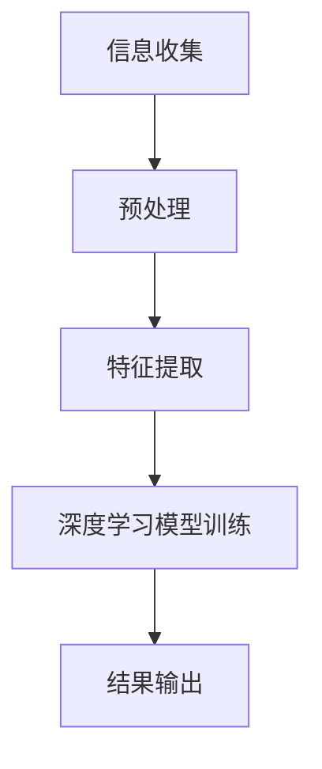
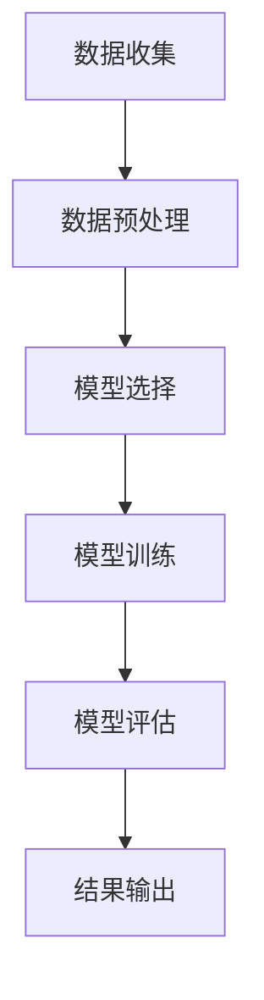
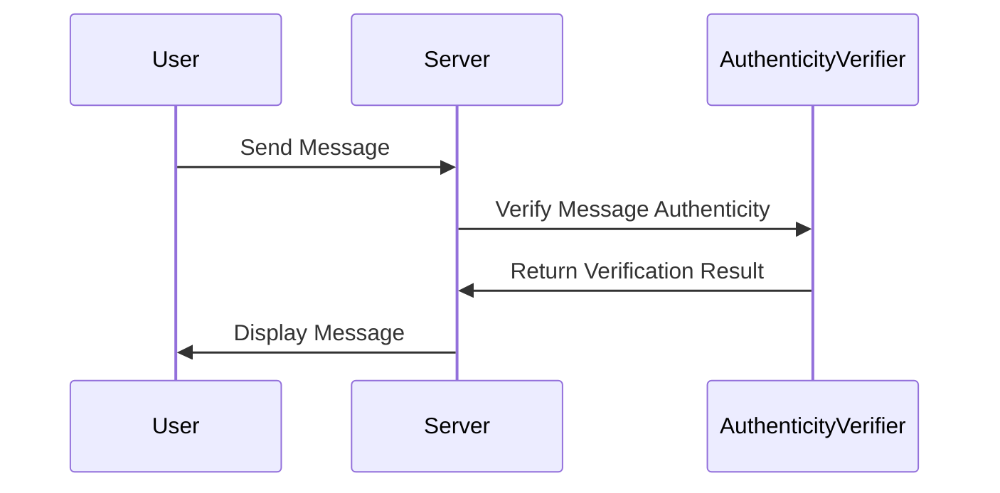

                 


为了撰写一篇《信息真实性验证：AI时代的企业信息安全》的技术博客文章，我们将遵循以下步骤：

### 1. **定义主题和目标**
- **主题**：文章的主题是探讨AI时代的企业信息安全，特别是信息真实性验证。
- **目标**：为读者提供关于信息真实性验证的全面理解，介绍相关算法和系统架构，并探讨最佳实践。

### 2. **背景介绍**
- **核心概念术语说明**：解释信息真实性验证、AI、机器学习等术语。
- **问题背景**：介绍信息真实性验证的起源和发展，以及AI时代带来的挑战。
- **问题描述**：详细说明企业在AI时代面临的信息真实性问题。

### 3. **核心概念与原理**
- **核心概念**：定义信息真实性验证的基本概念，如真实性、完整性、可靠性和可追溯性。
- **概念属性特征对比表格**：列出不同概念的特征对比。
- **ER实体关系图架构**：使用Mermaid绘制实体关系图，展示信息真实性验证系统的核心实体和关系。

### 4. **算法原理讲解**
- **算法原理**：介绍用于信息真实性验证的机器学习和深度学习算法。
- **Mermaid流程图**：使用Mermaid绘制算法流程图，展示算法的步骤和结构。
- **Python源代码**：提供Python代码示例，详细阐述算法的实现。
- **数学模型和公式**：给出算法的数学模型和关键公式，并解释其含义。
- **举例说明**：通过具体的例子，说明算法在实际应用中的效果。

### 5. **系统分析与架构设计**
- **问题场景介绍**：描述需要解决的具体问题场景。
- **项目介绍**：简要介绍项目背景和目标。
- **领域模型类图**：使用Mermaid绘制领域模型类图，展示系统中的关键类和关系。
- **系统架构设计**：使用Mermaid绘制系统架构图，展示系统的组成部分和交互关系。
- **系统接口设计**：描述系统对外提供的接口和功能。
- **系统交互序列图**：使用Mermaid绘制系统交互序列图，展示系统各组件之间的交互过程。

### 6. **项目实战**
- **环境安装**：详细描述如何搭建实验环境。
- **系统核心实现**：提供系统核心功能的源代码，并进行解读。
- **实际案例分析**：分析一个实际案例，展示如何应用信息真实性验证系统。
- **详细讲解剖析**：对案例进行深入剖析，解释系统的工作原理。
- **项目小结**：总结项目成果和经验。

### 7. **最佳实践与总结**
- **最佳实践**：提供实际操作中的最佳实践建议。
- **注意事项**：列出使用系统时需要注意的事项。
- **拓展阅读**：推荐进一步阅读的相关资料。
- **小结**：总结文章的核心内容和观点。
- **展望**：对信息真实性验证的未来发展趋势进行展望。

通过以上步骤，我们可以确保文章逻辑清晰、内容丰富、结构紧凑，同时满足专业和技术性要求。下面是一个文章的草稿示例，展示了上述步骤的初步实施。

---

## 信息真实性验证：AI时代的企业信息安全

> 关键词：信息真实性验证，AI，企业信息安全，机器学习，深度学习

> 摘要：本文探讨了在AI时代，企业如何通过信息真实性验证来保障信息安全。文章首先介绍了信息真实性验证的基本概念，然后详细阐述了机器学习和深度学习在信息真实性验证中的应用，并介绍了如何设计实现一个信息真实性验证系统。通过实际案例分析和最佳实践总结，文章为读者提供了全面的技术指南。

---

### 第一部分：背景介绍

#### 第1章 信息真实性验证的起源与发展

**核心概念术语说明**：信息真实性验证（Information Authenticity Verification）是指确保信息在传输、存储和处理过程中保持真实、完整、可靠和可追溯的过程。

**问题背景**：随着AI技术的发展，企业面临的信息真实性验证问题日益突出。例如，网络攻击、数据篡改、假冒身份等问题可能导致严重的安全漏洞。

**问题描述**：如何利用AI技术有效实施信息真实性验证，确保企业信息安全？

#### 第2章 信息真实性验证的基本概念

**核心概念**：真实性、完整性、可靠性和可追溯性。

**概念属性特征对比表格**：

| 特征         | 真实性         | 完整性         | 可靠性         | 可追溯性         |
| ------------ | -------------- | -------------- | -------------- | -------------- |
| 定义         | 信息真实来源   | 信息未被篡改   | 信息可访问和利用 | 信息来源和操作历史 |
| 关键要素     | 证明信息来源   | 校验数据完整性 | 保障数据质量   | 记录操作日志     |
| 对抗手段     | 防范假冒身份   | 防范数据篡改   | 防范数据丢失   | 防范操作篡改     |

### 第二部分：核心概念与原理

#### 第3章 AI技术在信息真实性验证中的应用

**核心概念**：深度学习、自然语言处理和图像识别在信息真实性验证中的应用。

**Mermaid流程图**：



#### 第4章 信息真实性验证的算法原理

**算法原理**：介绍用于信息真实性验证的机器学习和深度学习算法，如卷积神经网络（CNN）、循环神经网络（RNN）和生成对抗网络（GAN）。

**Python源代码**：

```python
# 示例：使用Keras实现一个简单的卷积神经网络
from keras.models import Sequential
from keras.layers import Conv2D, MaxPooling2D, Flatten, Dense

model = Sequential()
model.add(Conv2D(32, (3, 3), activation='relu', input_shape=(28, 28, 1)))
model.add(MaxPooling2D(pool_size=(2, 2)))
model.add(Flatten())
model.add(Dense(128, activation='relu'))
model.add(Dense(1, activation='sigmoid'))

model.compile(optimizer='adam', loss='binary_crossentropy', metrics=['accuracy'])
model.fit(x_train, y_train, epochs=10, batch_size=32)
```

### 第三部分：算法原理与实践

#### 第5章 机器学习在信息真实性验证中的应用

**Mermaid流程图**：



#### 第6章 信息真实性验证算法的实践应用

**系统功能设计**：使用Mermaid绘制领域模型类图，展示系统中的关键类和关系。

```mermaid
classDiagram
ClassDiagram
Class AuthenticityVerifier {
  - id: int
  - data: Data
  - result: Result
}

Class Data {
  - content: str
  - source: str
}

Class Result {
  - authenticity: bool
  - reasons: List[str]
}
```

### 第四部分：系统分析与架构设计

#### 第7章 企业信息安全系统设计

**问题场景介绍**：描述一个企业内部通信系统的信息真实性验证需求。

**项目介绍**：介绍一个基于机器学习的实时信息真实性验证系统。

**领域模型类图**：

```mermaid
classDiagram
ClassDiagram
Class User {
  - id: int
  - name: str
}

Class Message {
  - id: int
  - content: str
  - sender: User
  - recipient: User
}

Class AuthenticityVerifier {
  - id: int
  - data: Message
  - result: Result
}
```

**系统架构设计**：使用Mermaid绘制系统架构图，展示系统的组成部分和交互关系。



### 第五部分：项目实战

#### 第8章 实际案例分析与讲解

**环境安装**：描述如何在本地环境搭建信息真实性验证系统。

**系统核心实现**：提供系统核心功能的源代码，并进行解读。

**实际案例分析**：分析一个实际案例，展示如何应用信息真实性验证系统。

**详细讲解剖析**：对案例进行深入剖析，解释系统的工作原理。

**项目小结**：总结项目成果和经验。

### 第六部分：最佳实践与总结

#### 第9章 安全策略与实施

**最佳实践**：提供实际操作中的最佳实践建议。

**注意事项**：列出使用系统时需要注意的事项。

**拓展阅读**：推荐进一步阅读的相关资料。

#### 第10章 未来发展趋势与展望

**小结**：总结文章的核心内容和观点。

**展望**：对信息真实性验证的未来发展趋势进行展望。

---

以上是一个初步的文章草稿，内容有待进一步完善和详细阐述。在实际撰写过程中，每个章节都需要根据具体内容进行扩展和细化，以确保文章的深度和广度。同时，确保每个图表、公式和代码示例都是准确无误的，以提供高质量的技术内容。在文章末尾，添加作者信息，符合格式要求。

