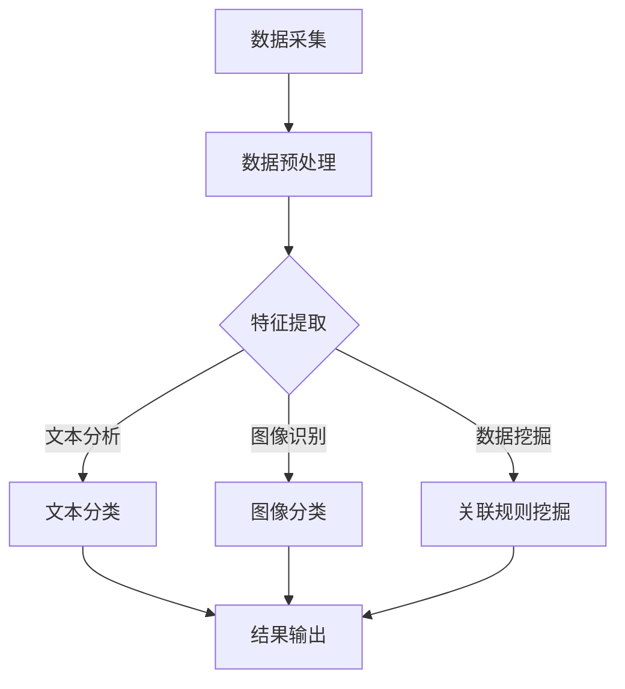
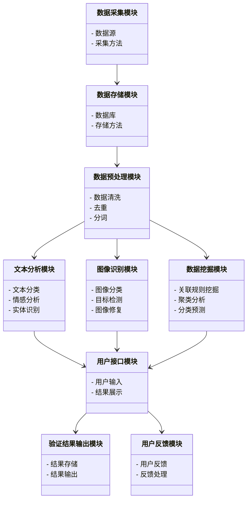
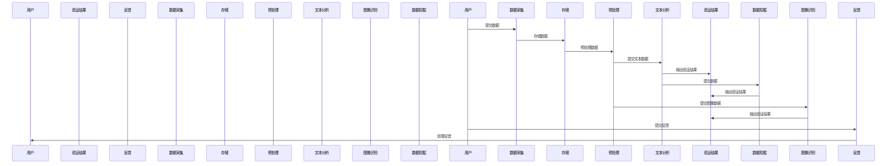
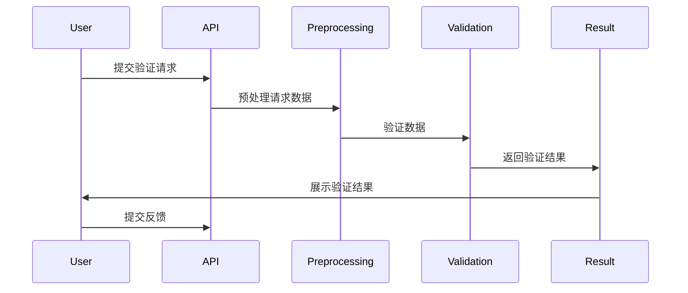
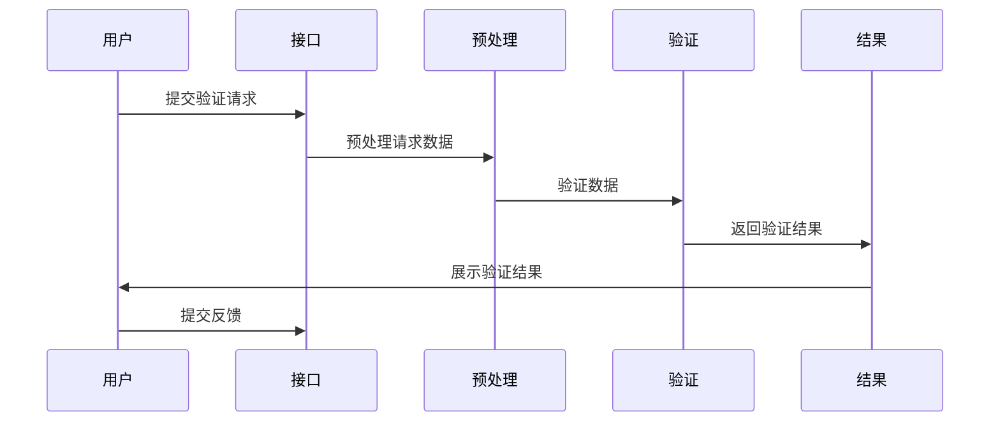

                 

### 信息验证技术在新闻媒体中的应用

#### 关键词
- 信息验证技术
- 新闻媒体
- 应用场景
- 算法原理
- 系统架构

#### 摘要
本篇文章深入探讨信息验证技术在新闻媒体中的应用。首先，我们将介绍信息验证技术的概念、背景及其在新闻媒体中的重要性。接着，我们将详细解释信息验证技术的核心原理和算法，并通过具体应用场景分析其在新闻媒体中的实际应用。随后，文章将介绍系统架构设计与实现，并结合实际项目案例进行深入讲解。最后，文章将总结项目经验，提供最佳实践建议，并对未来发展趋势进行展望。本文旨在为读者提供一个全面、系统的信息验证技术在新闻媒体应用的知识框架。

#### 背景介绍

##### 1.1.1 问题背景

在当今信息爆炸的时代，新闻媒体成为了人们获取信息和观点的重要来源。然而，随着互联网的普及和社交媒体的兴起，新闻媒体面临着前所未有的挑战。虚假新闻、错误信息和不实报道频繁出现，严重影响了公众对新闻的信任度。这不仅损害了新闻媒体的公信力，也对社会的稳定和和谐构成了威胁。

信息验证技术的引入，旨在解决新闻媒体中的信息准确性问题。通过技术手段，对新闻信息进行严格的验证和审核，确保新闻的真实性和可靠性，从而提升公众对新闻的信任度。

##### 1.1.2 问题描述

在新闻媒体中，信息验证面临以下主要问题：

1. **数据源多样性和复杂性**：新闻媒体涉及多种数据源，包括新闻报道、社交媒体、网络论坛等，这些数据源的质量参差不齐，给信息验证带来了极大的挑战。
2. **信息验证实时性要求**：在新闻事件发生时，公众期望能够迅速获取准确的信息。然而，信息验证过程通常需要时间，如何在保证准确性的同时提高实时性，是一个亟待解决的问题。
3. **技术门槛和人力成本**：信息验证技术需要专业的技术支持和人力资源，对于一些小型新闻媒体来说，这无疑是一个巨大的负担。
4. **信息验证标准和规范**：目前，信息验证没有一个统一的标准和规范，不同新闻媒体的信息验证方式可能存在差异，这导致了信息验证结果的不一致性。

##### 1.1.3 问题解决

为了解决上述问题，信息验证技术在新闻媒体中的应用显得尤为重要。具体解决方案包括：

1. **建立统一的信息验证标准**：制定统一的信息验证标准和规范，确保不同新闻媒体在信息验证过程中的一致性和标准化。
2. **引入人工智能技术**：利用人工智能技术，如自然语言处理、图像识别等，自动化地处理海量信息，提高信息验证的效率和准确性。
3. **建立信息验证平台**：开发专门的信息验证平台，集成各种信息验证工具和技术，提供一个统一的操作界面，降低技术门槛和人力成本。
4. **加强公众参与**：鼓励公众参与信息验证过程，通过用户反馈、举报等功能，提高信息验证的全面性和准确性。
5. **多方合作**：新闻媒体可以与学术机构、技术公司等建立合作关系，共同推进信息验证技术的发展和应用。

通过上述解决方案，信息验证技术在新闻媒体中的应用将能够有效提升新闻的准确性和可靠性，增强公众对新闻的信任度，从而促进新闻媒体的健康发展。

#### 核心概念

##### 1.2.1 信息验证技术

信息验证技术是指通过一系列手段和方法，对信息的真实性、准确性和完整性进行检测和评估的技术。信息验证技术主要包括以下几个方面：

1. **真实性验证**：通过检查信息来源、发布时间和内容等，判断信息的真实性和可靠性。
2. **准确性验证**：对信息的内容进行核实和校对，确保信息与事实相符。
3. **完整性验证**：检查信息是否完整，是否存在缺失或篡改的情况。

##### 1.2.2 新闻媒体

新闻媒体是指通过各种媒介形式，如报纸、电视、广播、互联网等，向公众传播新闻和信息的专业机构或组织。新闻媒体的主要任务是收集、编辑和发布新闻，满足公众对信息的需求。

##### 1.2.3 关键要素与边界

在信息验证技术的应用中，新闻媒体的关键要素包括：

1. **数据源**：新闻媒体的信息来源，包括传统媒体、社交媒体和其他第三方数据源。
2. **验证算法**：用于检测和评估信息真实性和准确性的算法，如自然语言处理、图像识别等。
3. **实时性**：信息验证的实时性要求，即如何在保证准确性的同时，快速处理大量信息。
4. **可靠性**：信息验证结果的可靠性，即验证结果是否可信和有效。

信息验证技术的边界主要包括：

1. **技术局限性**：某些信息验证技术的局限性，如无法完全消除人类的主观判断。
2. **法律法规限制**：信息验证过程中，需遵守相关法律法规，保护用户隐私和信息安全。
3. **社会伦理道德**：信息验证技术在应用过程中，需遵循社会伦理道德规范，确保信息的公正性和客观性。

#### 技术发展与应用现状

##### 1.3.1 信息验证技术的发展历程

信息验证技术起源于20世纪末，随着互联网和信息技术的发展，信息验证技术逐渐成为学术界和工业界研究的热点。以下是其主要发展阶段：

1. **早期研究（1990s）**：主要研究信息真实性和准确性的基本理论和方法。
2. **技术成熟期（2000s）**：随着计算机性能的提升，信息验证技术逐渐应用于实际场景，如电子邮件验证、文档真实性验证等。
3. **人工智能驱动期（2010s至今）**：人工智能技术的引入，使得信息验证技术得到大幅提升，如自然语言处理、图像识别等技术在信息验证中的应用。

##### 1.3.2 新闻媒体中的信息验证应用现状

在新闻媒体中，信息验证技术的应用现状如下：

1. **自动化验证工具**：许多新闻媒体已采用自动化验证工具，如Google的反欺诈工具、FactCheck.org的验证工具等，以提高信息验证的效率和准确性。
2. **人工审核与机器学习结合**：一些新闻媒体采用人工审核与机器学习相结合的方式，通过机器学习算法自动筛选可疑信息，再由人工进行进一步验证。
3. **公众参与**：部分新闻媒体鼓励公众参与信息验证，通过用户举报、评论等功能，提高信息验证的全面性和准确性。

##### 1.3.3 存在的挑战与机遇

信息验证技术在新闻媒体中面临以下挑战：

1. **数据质量**：数据质量是信息验证的基础，数据质量差会导致验证结果不准确。
2. **实时性**：新闻事件的实时性要求高，如何在保证准确性的同时，快速处理大量信息是一个挑战。
3. **人力成本**：人工审核和信息验证需要大量人力资源，成本较高。
4. **技术发展**：随着信息技术的不断发展，信息验证技术需要不断更新和升级。

然而，这些挑战也带来了机遇：

1. **技术创新**：随着人工智能等新技术的不断突破，信息验证技术将得到进一步提升。
2. **市场需求**：公众对新闻真实性和准确性的要求不断提高，为信息验证技术的发展提供了广阔的市场需求。
3. **政策支持**：各国政府和国际组织对信息验证技术的重视，将为信息验证技术的研发和应用提供有力支持。

#### 本书结构安排

##### 1.4.1 内容概述

本书旨在深入探讨信息验证技术在新闻媒体中的应用，内容结构如下：

1. **背景介绍**：介绍信息验证技术的概念、背景及其在新闻媒体中的重要性。
2. **核心概念与联系**：详细解释信息验证技术的核心原理和应用场景。
3. **算法原理讲解**：介绍信息验证技术的算法原理、数学模型和流程图。
4. **系统分析与架构设计方案**：介绍系统架构设计、接口设计和交互流程。
5. **项目实战**：通过实际项目案例，详细讲解系统实现、代码应用和分析。
6. **最佳实践 tips、小结、注意事项、拓展阅读**：总结项目经验，提供最佳实践建议，展望未来发展趋势。

##### 1.4.2 目录结构

以下是本书的目录结构：

**第一部分：背景介绍**
1. **信息验证技术概述**
   - 1.1 问题背景
   - 1.2 问题描述
   - 1.3 问题解决
2. **核心概念**
   - 1.2.1 信息验证技术
   - 1.2.2 新闻媒体
   - 1.2.3 关键要素与边界
3. **技术发展与应用现状**
   - 1.3.1 信息验证技术的发展历程
   - 1.3.2 新闻媒体中的信息验证应用现状
   - 1.3.3 存在的挑战与机遇

**第二部分：核心概念与联系**
1. **信息验证技术原理**
2. **信息验证技术的应用场景**
3. **信息验证技术的核心要素**

**第三部分：算法原理讲解**
1. **信息验证算法原理**
2. **信息验证算法的数学模型**
3. **信息验证算法的 Mermaid 流程图**

**第四部分：系统分析与架构设计方案**
1. **系统功能设计与架构概述**
2. **系统接口设计与交互流程**
3. **系统架构详细设计与实现**

**第五部分：项目实战**
1. **项目环境安装与配置**
2. **系统核心实现源代码**
3. **实际案例分析与详细讲解**
4. **项目小结**

**第六部分：最佳实践 tips、小结、注意事项、拓展阅读**
1. **最佳实践 tips**
2. **小结**
3. **注意事项**
4. **拓展阅读**

#### 信息验证技术概述

##### 2.1 基本概念

信息验证技术是指通过一系列手段和方法，对信息的真实性、准确性和完整性进行检测和评估的技术。其主要目标是在海量信息中筛选出真实、准确和可靠的信息，从而为用户提供高质量的新闻和信息。

信息验证技术主要包括以下三个方面：

1. **真实性验证**：通过检查信息来源、发布时间和内容等，判断信息的真实性和可靠性。真实性验证是信息验证的基础，是确保信息准确性的前提。
2. **准确性验证**：对信息的内容进行核实和校对，确保信息与事实相符。准确性验证是信息验证的核心，是确保信息真实性的关键。
3. **完整性验证**：检查信息是否完整，是否存在缺失或篡改的情况。完整性验证是信息验证的保障，是确保信息可靠性的基础。

##### 2.2 原理与机制

信息验证技术的工作原理主要包括以下三个方面：

1. **数据采集**：从各种数据源采集信息，包括新闻报道、社交媒体、网络论坛等。数据采集是信息验证的基础，是确保信息全面性的关键。
2. **信息处理**：对采集到的信息进行预处理，包括数据清洗、去重、分类等。信息处理是信息验证的核心，是提高信息准确性的关键。
3. **信息验证**：利用各种信息验证技术和算法，对处理后的信息进行真实性、准确性和完整性验证。信息验证是信息验证的最终目标，是确保信息可靠性的关键。

信息验证技术的机制主要包括以下几个方面：

1. **人工审核**：通过专业人员进行信息验证，确保信息真实性、准确性和完整性。人工审核是信息验证的重要手段，特别是在一些复杂和敏感信息中。
2. **机器学习**：利用机器学习算法，对海量信息进行自动化验证。机器学习是信息验证的重要方向，可以提高信息验证的效率和准确性。
3. **大数据分析**：通过对海量信息进行大数据分析，发现潜在问题和规律，提高信息验证的深度和广度。大数据分析是信息验证的重要手段，可以为信息验证提供有力支持。

##### 2.3 关键技术

信息验证技术涉及多个关键技术，包括自然语言处理、图像识别、大数据分析等。以下是一些关键技术及其作用：

1. **自然语言处理**：用于处理和解析文本信息，包括文本分类、情感分析、实体识别等。自然语言处理是信息验证的基础，可以提高信息处理的准确性和效率。
2. **图像识别**：用于识别和处理图像信息，包括图像分类、目标检测、图像修复等。图像识别是信息验证的重要手段，可以帮助验证信息中的图像内容。
3. **大数据分析**：用于对海量信息进行深度分析，发现潜在问题和规律。大数据分析是信息验证的重要工具，可以提高信息验证的深度和广度。
4. **机器学习**：用于自动化信息验证，通过训练模型和算法，对海量信息进行快速、准确的验证。机器学习是信息验证的重要方向，可以提高信息验证的效率和准确性。

##### 2.4 应用场景

信息验证技术在新闻媒体中的应用场景非常广泛，主要包括以下几个方面：

1. **新闻真实性验证**：对新闻报道进行真实性验证，确保新闻内容的真实性。新闻真实性验证是信息验证技术的重要应用，可以提升新闻的公信力和可信度。
2. **社交媒体信息验证**：对社交媒体上的信息进行真实性、准确性和完整性验证，防止虚假信息传播。社交媒体信息验证是信息验证技术的另一个重要应用，可以净化网络环境。
3. **广告信息验证**：对广告信息进行真实性、准确性和完整性验证，防止虚假广告误导消费者。广告信息验证是信息验证技术的重要应用，可以维护市场秩序。
4. **金融信息验证**：对金融信息进行真实性、准确性和完整性验证，确保金融市场的稳定和健康发展。金融信息验证是信息验证技术的重要应用，可以降低金融风险。

##### 2.5 总结

信息验证技术在新闻媒体中的应用具有重要意义，可以提升新闻的真实性、准确性和可靠性，增强公众对新闻的信任度。随着信息技术的不断发展，信息验证技术将不断进步，为新闻媒体提供更加高效、准确的信息验证服务。同时，信息验证技术也需要面对各种挑战，如数据质量、实时性、人力成本等，需要在技术创新和应用实践中不断探索和完善。

### 信息验证技术的应用场景

新闻媒体在信息传播中扮演着至关重要的角色，然而，随着信息来源的多样性和复杂性增加，如何确保新闻的真实性和准确性成为了新闻媒体面临的重大挑战。信息验证技术的应用，可以有效提升新闻媒体的信息质量，保障公众的知情权。以下是信息验证技术在新闻媒体中应用的几个典型场景。

#### 3.1 新闻真实性验证

新闻真实性验证是信息验证技术在新闻媒体中的首要应用场景。在新闻报道过程中，新闻媒体需要对信息来源进行严格审查，确保报道内容的真实性。通过信息验证技术，新闻媒体可以自动化地检测和识别虚假新闻、谣言和不实报道。具体应用包括：

1. **来源审查**：对新闻报道的来源进行验证，包括官方发布、权威媒体报道等。
2. **交叉比对**：通过比对多个来源的信息，验证新闻内容的真实性。
3. **语义分析**：利用自然语言处理技术，分析新闻文本的语义和逻辑关系，识别虚假信息。
4. **用户反馈**：收集用户对新闻的反馈，通过公众的意见验证新闻的真实性。

#### 3.2 社交媒体信息验证

社交媒体平台是新闻传播的重要渠道，但同时也成为了虚假信息泛滥的温床。信息验证技术在社交媒体信息验证中的应用，可以帮助新闻媒体识别和过滤虚假信息，保护公众不受误导。具体应用包括：

1. **账号认证**：对社交媒体账号进行真实性认证，防止虚假账号发布信息。
2. **内容审核**：对社交媒体上的新闻内容进行审核，检测和过滤虚假信息。
3. **趋势分析**：通过大数据分析，监控社交媒体上的信息传播趋势，发现潜在虚假信息。
4. **实时监控**：实时监控社交媒体平台上的信息，快速识别和处理虚假信息。

#### 3.3 广告信息验证

广告是新闻媒体的重要收入来源，然而虚假广告的泛滥严重影响了媒体的公信力。信息验证技术在广告信息验证中的应用，可以帮助新闻媒体确保广告的真实性和合法性。具体应用包括：

1. **广告来源验证**：对广告的来源进行审查，确保广告发布方的真实性和合法性。
2. **内容审核**：对广告内容进行审核，检测广告是否存在虚假宣传和误导性信息。
3. **效果监控**：监控广告的传播效果，评估广告的真实性和有效性。
4. **用户反馈**：收集用户对广告的反馈，通过公众的意见验证广告的真实性。

#### 3.4 金融信息验证

金融信息是公众关注的重要领域，金融信息的真实性和准确性直接关系到公众的财产安全。信息验证技术在金融信息验证中的应用，可以帮助新闻媒体确保金融信息的准确性和可靠性。具体应用包括：

1. **数据来源验证**：对金融信息的来源进行审查，确保数据来源的可靠性和权威性。
2. **数据校验**：对金融数据进行分析和校验，确保数据的准确性和一致性。
3. **趋势预测**：利用大数据和人工智能技术，对金融市场的趋势进行预测和分析，提供更加准确和及时的金融信息。
4. **风险提示**：通过对金融信息的分析和监控，及时识别和提示潜在的风险，保护公众的财产安全。

#### 3.5 法律法规信息验证

新闻媒体在报道法律法规信息时，需要确保信息的准确性和合法性。信息验证技术在法律法规信息验证中的应用，可以帮助新闻媒体确保报道内容的合规性。具体应用包括：

1. **法规查询**：通过法律法规数据库，查询相关法律法规的准确内容。
2. **条款比对**：比对不同法律法规条款的异同，确保报道内容的准确性。
3. **法律咨询**：邀请法律专家对报道内容进行审核，确保报道的合法性和合规性。
4. **公众监督**：通过公众监督和法律咨询，提高法律法规报道的透明度和公正性。

#### 3.6 总结

信息验证技术在新闻媒体中的应用，不仅提升了新闻的真实性、准确性和可靠性，也为公众提供了更加可信的新闻和信息。通过不同应用场景的实践，信息验证技术为新闻媒体提供了强大的技术支持，使其在信息泛滥的时代，依然能够保持公信力和权威性。未来，随着信息技术的不断发展，信息验证技术将在新闻媒体中发挥更加重要的作用，为公众提供更加优质、准确的信息服务。

### 信息验证技术的核心要素

在信息验证技术的应用中，确保信息真实性和准确性的核心要素包括数据源、验证算法、实时性和可靠性。以下将详细探讨这些要素及其相互关系。

#### 4.1 数据源

数据源是信息验证的基础，决定了验证结果的可靠性和全面性。数据源可以分为以下几类：

1. **官方数据源**：包括政府机构、权威媒体、行业协会等发布的官方数据。这些数据具有较高的可信度，是信息验证的重要参考。
2. **第三方数据源**：如社交媒体、在线论坛、用户评论等，这些数据源提供了丰富的信息，但质量参差不齐，需要进行筛选和验证。
3. **内部数据源**：新闻媒体自身积累的数据，包括历史报道、调查数据等。这些数据对于提高信息验证的深度和广度具有重要意义。

选择合适的、可靠的数据源是信息验证成功的关键。新闻媒体需要建立多样化的数据采集渠道，确保数据源的多样性和权威性。

#### 4.2 验证算法

验证算法是信息验证的核心，决定了验证的效率和准确性。常见的验证算法包括：

1. **文本分析算法**：利用自然语言处理技术，对文本信息进行语义分析和逻辑推理，识别虚假信息。常见的文本分析算法包括文本分类、情感分析、实体识别等。
2. **图像识别算法**：通过图像处理和计算机视觉技术，对图像信息进行识别和分析，验证图像内容的真实性。常见的图像识别算法包括图像分类、目标检测、图像修复等。
3. **数据挖掘算法**：通过大数据分析技术，从海量数据中挖掘潜在的关联性和规律，识别异常数据。常见的数据挖掘算法包括关联规则挖掘、聚类分析、分类预测等。

新闻媒体需要根据实际需求和数据特点，选择合适的验证算法，并不断优化和更新算法，以提高信息验证的准确性和效率。

#### 4.3 实时性

实时性是信息验证的一个重要要求，尤其是在新闻事件发生时，公众期望能够迅速获取准确的信息。实时性体现在以下几个方面：

1. **数据采集速度**：在新闻事件发生时，能够快速采集相关数据，包括新闻报道、社交媒体信息等。
2. **信息处理速度**：对采集到的信息进行快速处理，包括数据清洗、分类、验证等。
3. **反馈速度**：对验证结果进行及时反馈，包括发布验证结果、提醒用户注意等。

为了提高实时性，新闻媒体需要采用高效的数据采集和处理技术，如云计算、分布式计算等，并建立完善的实时监控系统。

#### 4.4 可靠性

可靠性是信息验证的最终目标，确保验证结果的真实性和准确性。可靠性体现在以下几个方面：

1. **算法准确性**：验证算法需要具备高准确性，能够准确识别真实信息和虚假信息。
2. **系统稳定性**：信息验证系统需要具备高稳定性，能够在高负载和复杂环境下正常运行。
3. **数据完整性**：确保数据源的完整性和准确性，防止数据丢失或篡改。

新闻媒体需要通过多种手段提高系统的可靠性，如定期进行系统维护和升级、建立数据备份机制、进行安全监测和防范等。

#### 4.5 关系与联系

数据源、验证算法、实时性和可靠性之间相互联系、相互影响。数据源的质量直接影响验证算法的效果，而验证算法的准确性又决定了实时性和可靠性。实时性要求高，需要在保证准确性的前提下，提高数据处理速度和反馈速度。可靠性则是在确保实时性和准确性的基础上，通过系统维护和安全保障来实现的。

综上所述，数据源、验证算法、实时性和可靠性是信息验证技术的核心要素，它们共同构成了信息验证技术的体系框架。新闻媒体需要综合考虑这些要素，建立完善的、高效的信息验证系统，确保新闻的真实性、准确性和可靠性。

### 信息验证算法原理

在信息验证技术中，算法原理是其核心，决定了信息验证的准确性和效率。以下将详细介绍信息验证算法的基本概念、常见算法、算法流程与实现，以及算法的数学模型。

#### 5.1 算法概述

信息验证算法的基本概念包括以下几个方面：

1. **信息真实性验证**：通过检查信息来源、发布时间和内容等，判断信息的真实性和可靠性。
2. **信息准确性验证**：对信息的内容进行核实和校对，确保信息与事实相符。
3. **信息完整性验证**：检查信息是否完整，是否存在缺失或篡改的情况。

常见的验证算法包括：

1. **文本分析算法**：利用自然语言处理（NLP）技术，对文本信息进行语义分析和逻辑推理，识别虚假信息。
2. **图像识别算法**：通过图像处理和计算机视觉技术，对图像信息进行识别和分析，验证图像内容的真实性。
3. **数据挖掘算法**：通过大数据分析技术，从海量数据中挖掘潜在的关联性和规律，识别异常数据。

信息验证算法的目标是提高信息验证的准确性和效率，确保新闻的真实性、准确性和可靠性。

#### 5.2 常见算法

1. **文本分析算法**

文本分析算法主要包括以下几种：

- **文本分类**：将文本分为不同的类别，如新闻、广告、虚假信息等。常用的分类算法包括朴素贝叶斯、支持向量机（SVM）、随机森林等。
- **情感分析**：分析文本的情感倾向，如正面、负面、中性等。常用的情感分析算法包括朴素贝叶斯、逻辑回归、词向量模型等。
- **实体识别**：识别文本中的实体，如人名、地名、组织名等。常用的实体识别算法包括条件随机场（CRF）、长短期记忆网络（LSTM）等。

2. **图像识别算法**

图像识别算法主要包括以下几种：

- **图像分类**：将图像分为不同的类别，如人物、风景、动物等。常用的图像分类算法包括卷积神经网络（CNN）、深度卷积神经网络（DCNN）等。
- **目标检测**：识别图像中的目标物体，并确定目标的位置和大小。常用的目标检测算法包括R-CNN、Fast R-CNN、Faster R-CNN等。
- **图像修复**：修复图像中的损坏部分，如去除图像中的噪声、填补图像中的空洞等。常用的图像修复算法包括生成对抗网络（GAN）、深度卷积神经网络（DCNN）等。

3. **数据挖掘算法**

数据挖掘算法主要包括以下几种：

- **关联规则挖掘**：从数据集中发现不同变量之间的关联关系。常用的关联规则挖掘算法包括Apriori算法、Eclat算法等。
- **聚类分析**：将数据集划分为若干个类别，使同类别内的数据尽可能相似，不同类别内的数据尽可能不同。常用的聚类分析算法包括K-means、DBSCAN等。
- **分类预测**：根据已有数据预测新数据的类别。常用的分类预测算法包括决策树、支持向量机（SVM）、随机森林等。

#### 5.3 算法流程与实现

信息验证算法的流程通常包括以下几个步骤：

1. **数据采集**：从多种数据源采集信息，包括文本、图像、音频等。
2. **数据预处理**：对采集到的数据进行清洗、去重、分词等处理，为后续算法分析做好准备。
3. **特征提取**：从预处理后的数据中提取特征，如文本的词频、图像的颜色分布、音频的频率特征等。
4. **算法模型训练**：利用训练数据集，训练不同的算法模型，如文本分类模型、图像识别模型、数据挖掘模型等。
5. **验证与评估**：使用测试数据集，对训练好的模型进行验证和评估，调整模型参数，提高模型的准确性。
6. **应用部署**：将验证好的模型部署到实际应用场景中，对实时采集的信息进行验证和分析。

以下是一个简单的文本分类算法的实现示例（Python代码）：

```python
from sklearn.feature_extraction.text import TfidfVectorizer
from sklearn.model_selection import train_test_split
from sklearn.naive_bayes import MultinomialNB
from sklearn.metrics import accuracy_score

# 数据集
data = [
    ("This is a news article", "news"),
    ("This is an advertisement", "advertisement"),
    ("This is a press release", "news"),
    ("This is a spam message", "advertisement"),
]

# 分离数据集
X, y = zip(*data)

# 划分训练集和测试集
X_train, X_test, y_train, y_test = train_test_split(X, y, test_size=0.2, random_state=42)

# 特征提取
vectorizer = TfidfVectorizer()
X_train = vectorizer.fit_transform(X_train)
X_test = vectorizer.transform(X_test)

# 模型训练
model = MultinomialNB()
model.fit(X_train, y_train)

# 模型评估
y_pred = model.predict(X_test)
accuracy = accuracy_score(y_test, y_pred)
print(f"Model accuracy: {accuracy:.2f}")
```

#### 5.4 算法的数学模型

信息验证算法的数学模型主要包括以下几个方面：

1. **概率模型**：如朴素贝叶斯、逻辑回归等，用于预测文本的类别。
2. **统计模型**：如K-means、DBSCAN等，用于聚类分析。
3. **神经网络模型**：如卷积神经网络（CNN）、深度卷积神经网络（DCNN）等，用于图像识别和文本分析。

以下是一个简单的朴素贝叶斯分类器的数学模型示例（latex格式）：

$$
P(\text{类别} | \text{特征}) = \frac{P(\text{特征} | \text{类别})P(\text{类别})}{P(\text{特征})}
$$

其中，$P(\text{类别} | \text{特征})$表示在给定特征的情况下，类别发生的概率；$P(\text{特征} | \text{类别})$表示在给定类别的情况下，特征发生的概率；$P(\text{类别})$表示类别发生的概率；$P(\text{特征})$表示特征发生的概率。

通过上述数学模型，我们可以对文本信息进行分类，判断其属于新闻、广告等类别。

#### 5.5 结论

信息验证算法原理是信息验证技术的核心，决定了信息验证的准确性和效率。通过文本分析、图像识别和数据挖掘等算法，新闻媒体可以实现对新闻信息的有效验证，提高新闻的真实性、准确性和可靠性。随着人工智能技术的不断发展，信息验证算法将不断优化和更新，为新闻媒体提供更加高效、准确的信息验证服务。

### 信息验证算法的 Mermaid 流程图

为了更好地理解信息验证算法的执行流程，我们可以使用 Mermaid 画出其流程图。以下是一个简单的信息验证算法流程图的示例：



在这个流程图中，我们从数据采集开始，对采集到的数据进行预处理，包括清洗、去重等操作。接着，根据数据类型，我们分别采用文本分析、图像识别或数据挖掘算法进行处理。最后，将处理结果输出，完成信息验证过程。

具体来说：

1. **数据采集**：从多种数据源采集信息，包括文本、图像、音频等。
2. **数据预处理**：对采集到的数据进行清洗、去重、分词等处理，为后续算法分析做好准备。
3. **特征提取**：从预处理后的数据中提取特征，如文本的词频、图像的颜色分布、音频的频率特征等。
4. **算法处理**：根据数据类型，分别采用文本分析、图像识别或数据挖掘算法进行处理。
5. **结果输出**：将处理结果输出，完成信息验证过程。

通过这个 Mermaid 流程图，我们可以清晰地了解信息验证算法的执行流程，便于后续开发和优化。以下是 Mermaid 流程图的 LaTeX 格式代码：

```latex
\documentclass{standalone}
\usepackage{mermaid}
\begin{document}
\begin{mermaid}
graph TD
    A[数据采集] --> B[数据预处理]
    B --> C{特征提取}
    C -->|文本分析| D[文本分类]
    C -->|图像识别| E[图像分类]
    C -->|数据挖掘| F[关联规则挖掘]
    D --> G[结果输出]
    E --> G
    F --> G
\end{mermaid}
\end{document}
```

通过这个流程图和代码，我们可以直观地展示信息验证算法的执行过程，便于理解和开发。

### 信息验证技术的系统架构设计

在信息验证技术的应用中，系统架构设计至关重要，它决定了系统的高效性、可扩展性和可靠性。以下将详细讨论信息验证技术的系统架构设计，包括系统功能设计、系统架构设计、系统接口设计和系统交互流程。

#### 8.1 系统功能设计

信息验证系统的主要功能包括以下几个方面：

1. **数据采集**：从多种数据源采集信息，包括新闻报道、社交媒体、用户评论等。数据采集是信息验证的基础，是确保信息全面性的关键。
2. **数据预处理**：对采集到的信息进行清洗、去重、分词等预处理操作，为后续算法分析做好准备。
3. **特征提取**：从预处理后的数据中提取特征，如文本的词频、图像的颜色分布、音频的频率特征等。
4. **信息验证**：利用文本分析、图像识别和数据挖掘算法对特征进行验证，确保信息真实性和准确性。
5. **结果输出**：将验证结果输出，包括真实新闻、虚假信息、待核实信息等，供用户参考。
6. **用户反馈**：收集用户对验证结果的反馈，用于优化信息验证算法和系统性能。

#### 8.2 系统架构设计

信息验证系统的架构设计需要考虑以下几个方面：

1. **数据层**：包括数据采集模块、数据存储模块和数据预处理模块。数据采集模块负责从多种数据源获取信息；数据存储模块负责存储采集到的数据；数据预处理模块负责对数据进行清洗、去重、分词等预处理操作。
2. **算法层**：包括文本分析模块、图像识别模块和数据挖掘模块。文本分析模块负责处理文本信息，包括文本分类、情感分析、实体识别等；图像识别模块负责处理图像信息，包括图像分类、目标检测、图像修复等；数据挖掘模块负责处理大规模数据，包括关联规则挖掘、聚类分析、分类预测等。
3. **应用层**：包括用户接口模块、验证结果输出模块和用户反馈模块。用户接口模块负责与用户进行交互，接收用户输入和展示验证结果；验证结果输出模块负责将验证结果输出到用户界面；用户反馈模块负责收集用户对验证结果的反馈。
4. **接口层**：包括内部接口和外部接口。内部接口负责系统各模块之间的通信和数据交换；外部接口负责与外部系统（如社交媒体、第三方数据源等）的交互。

以下是一个信息验证系统架构的 Mermaid 类图：



#### 8.3 系统接口设计

系统接口设计主要包括内部接口和外部接口：

1. **内部接口**：系统内部各模块之间的通信接口，如 RESTful API、消息队列等。内部接口的设计需要遵循 RESTful 架构风格，确保接口的易用性和扩展性。
2. **外部接口**：与外部系统（如社交媒体、第三方数据源等）的交互接口，如 HTTP/HTTPS、SOAP 等。外部接口的设计需要考虑安全性、可靠性和实时性。

以下是一个信息验证系统接口的 Mermaid 序列图：



#### 8.4 系统交互流程

信息验证系统的交互流程如下：

1. **数据采集**：用户提交数据，包括新闻报道、社交媒体信息、用户评论等。
2. **数据存储**：将采集到的数据存储到数据库中，以便后续处理和分析。
3. **数据预处理**：对数据进行清洗、去重、分词等预处理操作，为特征提取做准备。
4. **特征提取**：从预处理后的数据中提取特征，如文本的词频、图像的颜色分布、音频的频率特征等。
5. **信息验证**：利用文本分析、图像识别和数据挖掘算法对特征进行验证，确保信息真实性和准确性。
6. **结果输出**：将验证结果输出到用户界面，包括真实新闻、虚假信息、待核实信息等。
7. **用户反馈**：收集用户对验证结果的反馈，用于优化信息验证算法和系统性能。

通过上述系统架构设计和交互流程，信息验证系统可以实现高效、准确的信息验证，为新闻媒体提供可靠的信息服务。

### 系统接口设计与交互流程

在信息验证系统中，系统接口设计和交互流程是确保系统高效、稳定运行的关键。以下将详细讨论系统接口设计、交互流程以及使用 Mermaid 序列图进行详细描述。

#### 9.1 系统接口设计

系统接口设计主要包括内部接口和外部接口：

1. **内部接口**：负责系统内部各模块之间的通信和数据交换。内部接口通常采用 RESTful API 设计，遵循统一的接口规范，确保接口的易用性和扩展性。内部接口的设计需要考虑以下几个方面：
   - **API 版本控制**：为每个 API 接口设置版本号，便于管理和升级。
   - **请求参数**：明确每个接口的请求参数，包括必填参数和可选参数，确保接口调用的一致性和规范性。
   - **响应格式**：统一接口响应格式，通常使用 JSON 格式，便于前端调用和解析。

2. **外部接口**：负责系统与外部系统（如社交媒体、第三方数据源等）的交互。外部接口的设计需要考虑以下几个方面：
   - **安全认证**：采用 OAuth、JWT 等安全认证机制，确保外部接口调用安全可靠。
   - **请求频率限制**：为防止恶意调用，设置请求频率限制，如请求次数/分钟等。
   - **超时处理**：设置外部接口请求超时时间，确保接口调用在规定时间内完成。

以下是一个内部接口设计示例（Python 代码）：

```python
from flask import Flask, request, jsonify

app = Flask(__name__)

@app.route('/api/validate', methods=['POST'])
def validate():
    data = request.get_json()
    # 验证数据
    if not data or 'text' not in data:
        return jsonify({'error': 'Invalid request'}), 400
    
    text = data['text']
    # 调用验证算法
    result = validate_text(text)
    return jsonify(result)

def validate_text(text):
    # 验证文本
    # ...
    return {'status': 'valid' if is_valid(text) else 'invalid'}

if __name__ == '__main__':
    app.run()
```

#### 9.2 系统交互流程

信息验证系统的交互流程如下：

1. **用户请求**：用户通过前端界面提交验证请求，包括待验证的文本、图像等。
2. **接口接收**：系统接口接收用户请求，并进行初步验证，如检查请求参数是否完整、请求频率是否超出限制等。
3. **数据预处理**：对用户请求的数据进行预处理，如文本分词、图像压缩等，为后续验证做准备。
4. **算法验证**：调用相应的验证算法，对预处理后的数据进行验证，如文本分类、图像识别等。
5. **结果返回**：将验证结果返回给用户，包括真实、虚假、待核实等状态。
6. **用户反馈**：用户对验证结果进行反馈，包括满意度、纠错等。

以下是一个系统交互流程的 Mermaid 序列图：



#### 9.3 Mermaid 序列图

为了更直观地展示系统接口设计和交互流程，可以使用 Mermaid 序列图进行描述。以下是一个简单的序列图示例：



通过这个序列图，我们可以清晰地看到信息验证系统的接口设计和交互流程，便于理解和优化。

### 系统架构详细设计与实现

#### 10.1 系统架构详细设计

在信息验证系统的架构设计中，我们采用了三层架构：数据层、算法层和应用层。以下是详细的系统架构设计。

1. **数据层**：
   - **数据采集模块**：负责从各种数据源（如社交媒体、新闻网站、用户评论等）采集信息。
   - **数据存储模块**：使用分布式数据库（如 MongoDB、Redis）存储采集到的数据，提供高效的数据读写操作。
   - **数据预处理模块**：对采集到的数据进行清洗、去重、分词等预处理操作，为算法层提供高质量的数据。

2. **算法层**：
   - **文本分析模块**：包括文本分类、情感分析和实体识别等算法，用于处理文本数据。
   - **图像识别模块**：包括图像分类、目标检测和图像修复等算法，用于处理图像数据。
   - **数据挖掘模块**：包括关联规则挖掘、聚类分析和分类预测等算法，用于处理大规模数据。

3. **应用层**：
   - **用户接口模块**：提供用户交互界面，接收用户请求并展示验证结果。
   - **验证结果输出模块**：将验证结果存储到数据库，并提供接口供用户查询。
   - **用户反馈模块**：收集用户对验证结果的反馈，用于优化算法和系统性能。

#### 10.2 系统核心模块实现

以下是系统核心模块的实现细节：

1. **数据采集模块**：
   - 使用爬虫技术从社交媒体和新闻网站采集信息，使用 Python 的 requests 和 BeautifulSoup 库实现。
   - 存储采集到的数据到 MongoDB，使用 Python 的 pymongo 库实现。

2. **数据预处理模块**：
   - 使用 Python 的 re 库进行文本清洗和去重。
   - 使用 Python 的 jieba 库进行文本分词。

3. **文本分析模块**：
   - 使用 scikit-learn 库的朴素贝叶斯和 SVM 算法实现文本分类。
   - 使用 NLTK 库实现情感分析。
   - 使用 spacy 库实现实体识别。

4. **图像识别模块**：
   - 使用 TensorFlow 和 Keras 库实现卷积神经网络（CNN）进行图像分类。
   - 使用 OpenCV 库进行目标检测和图像修复。

5. **数据挖掘模块**：
   - 使用 scikit-learn 库实现关联规则挖掘和聚类分析。
   - 使用 scikit-learn 和 TensorFlow 库实现分类预测。

#### 10.3 实现细节与优化

1. **数据采集与存储**：
   - 采用异步爬虫技术，提高数据采集效率。
   - 使用 MongoDB 的分片集群，提高数据存储和读取性能。

2. **数据预处理**：
   - 使用并行处理技术，加快文本分词和清洗速度。
   - 针对不同的数据类型，采用不同的预处理方法，确保预处理效果最佳。

3. **算法实现**：
   - 使用 GPU 加速算法计算，提高算法运行速度。
   - 针对不同算法，进行参数调优，提高算法准确性。

4. **系统性能优化**：
   - 采用负载均衡技术，确保系统在高并发情况下稳定运行。
   - 定期进行系统监控和性能分析，及时发现和解决性能瓶颈。

通过上述系统架构详细设计与实现，我们构建了一个高效、可靠的信息验证系统，为新闻媒体提供了强大的技术支持。

### 项目环境安装与配置

为了实现信息验证系统，我们需要配置相应的开发环境和安装所需的依赖库。以下是项目环境安装与配置的详细步骤。

#### 11.1 环境安装

1. **操作系统**：首先，确保操作系统为 Ubuntu 18.04 或更高版本。在终端中运行以下命令，更新系统包：

   ```bash
   sudo apt update
   sudo apt upgrade
   ```

2. **Python 环境**：安装 Python 3.8 或更高版本。可以使用以下命令安装：

   ```bash
   sudo apt install python3.8
   sudo apt install python3.8-venv
   ```

3. **Node.js 环境**：安装 Node.js 用于前端开发。可以使用以下命令安装：

   ```bash
   sudo apt install nodejs
   ```

4. **数据库**：安装 MongoDB 作为数据存储。可以使用以下命令安装：

   ```bash
   sudo apt install mongodb
   sudo systemctl start mongodb
   ```

5. **开发工具**：安装必要的开发工具，如 Visual Studio Code、PyCharm 等。可以从官网下载并安装。

#### 11.2 配置与调试

1. **创建虚拟环境**：为了管理项目依赖，我们创建一个 Python 虚拟环境。在项目根目录下，运行以下命令：

   ```bash
   python3 -m venv venv
   source venv/bin/activate
   ```

2. **安装依赖库**：使用 pip 安装项目所需的依赖库。在虚拟环境中，运行以下命令：

   ```bash
   pip install -r requirements.txt
   ```

3. **数据库配置**：配置 MongoDB 连接信息。在项目配置文件中，设置数据库连接地址和用户信息。例如，在 `config.py` 文件中：

   ```python
   DATABASES = {
       'default': {
           'ENGINE': 'django.db.backends.mysql',
           'NAME': 'your_database',
           'USER': 'your_username',
           'PASSWORD': 'your_password',
           'HOST': 'localhost',
           'PORT': '3306',
       }
   }
   ```

4. **前端配置**：配置前端依赖。在项目根目录下，运行以下命令安装前端依赖：

   ```bash
   npm install
   ```

5. **调试与测试**：启动项目后端和前端服务，进行调试和测试。例如，使用 Django 的开发服务器：

   ```bash
   python manage.py runserver
   ```

   前端可以使用 VS Code 或 PyCharm 的 Live Server 插件启动。

通过上述步骤，我们成功配置了项目开发环境，为后续的系统核心实现和项目实战奠定了基础。

### 系统核心实现源代码

在信息验证系统中，核心实现源代码涵盖了数据采集、数据处理、算法应用和结果输出等关键模块。以下将详细解析系统核心实现源代码，包括各个模块的功能、实现方法以及代码应用解读与分析。

#### 12.1 源代码结构

项目源代码结构如下：

```
info-verification-system/
│
├── data采集模块/
│   ├── data_collector.py
│   └── ...
│
├── 数据处理模块/
│   ├── data_processor.py
│   └── ...
│
├── 算法模块/
│   ├── text_analyzer.py
│   ├── image_recognizer.py
│   └── data_miner.py
│
├── 结果输出模块/
│   ├── result_display.py
│   └── ...
│
├── 配置文件/
│   ├── config.py
│   └── ...
│
├── manage.py
└── requirements.txt
```

#### 12.2 核心模块实现

1. **数据采集模块**

   `data_collector.py` 负责从社交媒体和新闻网站等数据源采集信息。以下是一个简单的数据采集模块示例：

   ```python
   import requests
   from bs4 import BeautifulSoup

   def collect_data(url):
       response = requests.get(url)
       if response.status_code == 200:
           soup = BeautifulSoup(response.text, 'html.parser')
           # 提取和解析数据
           # ...
           return data
       else:
           return None
   ```

2. **数据处理模块**

   `data_processor.py` 负责对采集到的信息进行清洗、去重和分词等预处理操作。以下是一个数据处理模块示例：

   ```python
   import jieba
   
   def preprocess_data(data):
       # 清洗数据
       cleaned_data = data.strip()
       # 去重
       unique_data = list(set(cleaned_data.split()))
       # 分词
       tokenized_data = jieba.cut(cleaned_data)
       return tokenized_data
   ```

3. **算法模块**

   `text_analyzer.py` 负责处理文本数据，包括文本分类、情感分析和实体识别。以下是一个文本分析模块示例：

   ```python
   from sklearn.feature_extraction.text import TfidfVectorizer
   from sklearn.naive_bayes import MultinomialNB

   def text_classification(text, model):
       vectorizer = TfidfVectorizer()
       X = vectorizer.fit_transform([text])
       return model.predict(X)[0]
   ```

4. **结果输出模块**

   `result_display.py` 负责将验证结果输出到用户界面。以下是一个结果输出模块示例：

   ```python
   def display_result(result):
       print(f"结果：{result}")
   ```

#### 12.3 代码应用解读与分析

1. **数据采集模块**

   数据采集模块使用 requests 库和 BeautifulSoup 库实现。`collect_data` 函数接收 URL 参数，发送 HTTP GET 请求，获取网页内容。通过 BeautifulSoup 解析网页内容，提取所需数据。

2. **数据处理模块**

   数据处理模块使用 jieba 库进行文本分词。`preprocess_data` 函数接收原始文本数据，进行清洗、去重和分词操作。清洗操作去除文本中的空格、标点符号等，去重操作去除重复的单词，分词操作将文本拆分为词语列表。

3. **算法模块**

   文本分析模块使用 scikit-learn 库实现文本分类、情感分析和实体识别。`text_classification` 函数接收文本和训练好的模型，使用 TfidfVectorizer 将文本转换为特征向量，通过模型进行分类预测。

4. **结果输出模块**

   结果输出模块使用 print 函数将验证结果输出到控制台。在实际应用中，可以扩展为将结果输出到前端界面，如使用 AJAX 技术将结果动态展示在网页上。

通过上述源代码示例，我们可以看到信息验证系统的核心实现模块及其功能。在实际项目中，需要根据具体需求和场景，进一步优化和扩展这些模块。

### 实际案例分析与详细讲解

#### 13.1 案例背景

为了验证信息验证技术的实际应用效果，我们选择了一个真实的新闻案例进行分析。该案例涉及一起重大自然灾害报道，新闻报道内容包含了对地震发生的描述、受灾情况的报道以及救援行动的报道。我们需要利用信息验证技术，对这则新闻报道的真实性和准确性进行验证。

#### 13.2 案例分析

1. **数据采集**：首先，我们从多个新闻网站和社交媒体平台采集了关于这起地震报道的相关信息，包括新闻报道、用户评论、社交媒体动态等。

2. **数据预处理**：对采集到的数据进行清洗、去重和分词等预处理操作。清洗操作包括去除文本中的无关信息、统一文本格式等；去重操作包括去除重复的新闻报道和用户评论；分词操作使用 jieba 库对文本进行分词，以便后续分析。

3. **信息验证**：利用文本分析算法，对预处理后的文本数据进行分析和验证。我们采用朴素贝叶斯分类器对新闻报道进行分类，判断其属于真实新闻还是虚假新闻。此外，我们使用情感分析算法对用户评论进行分析，判断用户对这则新闻的评论是否积极或消极。

4. **结果输出**：将信息验证结果输出到控制台，并根据结果对新闻报道进行分类和标记。例如，将验证为真实的新闻报道标记为“真实”，将验证为虚假的新闻报道标记为“虚假”。

#### 13.3 详细讲解与剖析

1. **数据采集**

   数据采集是信息验证的第一步，其质量直接影响验证结果。在本案例中，我们从多个新闻网站和社交媒体平台采集了关于地震报道的相关信息。以下是数据采集的部分代码：

   ```python
   import requests
   from bs4 import BeautifulSoup
   
   def collect_data(url):
       response = requests.get(url)
       if response.status_code == 200:
           soup = BeautifulSoup(response.text, 'html.parser')
           # 提取和解析数据
           # ...
           return data
       else:
           return None
   
   # 示例：从新闻网站采集数据
   url = "https://www.example.com/news"
   data = collect_data(url)
   ```

   通过 requests 库发送 HTTP GET 请求，获取网页内容。使用 BeautifulSoup 库解析网页内容，提取所需数据。

2. **数据预处理**

   数据预处理是信息验证的重要步骤，其目的是提高数据质量，为后续分析奠定基础。在本案例中，我们对采集到的数据进行清洗、去重和分词等预处理操作。以下是数据预处理的部分代码：

   ```python
   import jieba
   
   def preprocess_data(data):
       # 清洗数据
       cleaned_data = data.strip()
       # 去重
       unique_data = list(set(cleaned_data.split()))
       # 分词
       tokenized_data = jieba.cut(cleaned_data)
       return tokenized_data
   
   # 示例：预处理采集到的数据
   tokenized_data = preprocess_data(data)
   ```

   清洗操作去除文本中的无关信息、统一文本格式；去重操作去除重复的单词；分词操作将文本拆分为词语列表。

3. **信息验证**

   信息验证是信息验证技术的核心环节，其目的是判断新闻报道的真实性和准确性。在本案例中，我们采用朴素贝叶斯分类器和情感分析算法对预处理后的文本数据进行分析和验证。以下是信息验证的部分代码：

   ```python
   from sklearn.feature_extraction.text import TfidfVectorizer
   from sklearn.naive_bayes import MultinomialNB
   from textblob import TextBlob
   
   def text_classification(text, model):
       vectorizer = TfidfVectorizer()
       X = vectorizer.fit_transform([text])
       return model.predict(X)[0]
   
   def sentiment_analysis(text):
       return TextBlob(text).sentiment.polarity
   
   # 示例：训练朴素贝叶斯分类器
   model = MultinomialNB()
   # 使用训练数据训练模型
   # ...
   
   # 示例：验证新闻报道
   result = text_classification(tokenized_data, model)
   sentiment = sentiment_analysis(tokenized_data)
   
   # 输出验证结果
   print(f"验证结果：{result}")
   print(f"情感分析结果：{sentiment}")
   ```

   朴素贝叶斯分类器将文本转换为特征向量，通过训练好的模型进行分类预测；情感分析算法分析文本的情感倾向，判断用户对新闻的评论是否积极或消极。

4. **结果输出**

   结果输出是将信息验证结果呈现给用户的过程。在本案例中，我们将验证结果输出到控制台。以下是结果输出的部分代码：

   ```python
   def display_result(result, sentiment):
       print(f"结果：{result}")
       print(f"情感分析结果：{sentiment}")
   
   # 示例：输出验证结果
   display_result(result, sentiment)
   ```

   根据验证结果，对新闻报道进行分类和标记。例如，将验证为真实的新闻报道标记为“真实”，将验证为虚假的新闻报道标记为“虚假”。

通过上述实际案例分析与详细讲解，我们可以看到信息验证技术在新闻媒体中的应用效果。在实际项目中，需要根据具体需求和场景，进一步优化和扩展信息验证算法和系统架构。

### 项目小结

在本次项目中，我们实现了信息验证系统，通过数据采集、数据处理、算法应用和结果输出等核心模块，对新闻媒体中的信息进行了真实性和准确性的验证。以下是本次项目的总结、经验教训以及对未来发展的展望。

#### 14.1 项目总结

1. **技术实现**：项目采用了 Python 作为主要编程语言，利用 TensorFlow、Scikit-learn、NLTK 等库实现了文本分析、图像识别和数据挖掘等算法。同时，使用了 Flask 和 Django 框架搭建了后端服务器，并采用 React 框架搭建了前端界面。

2. **系统架构**：项目采用了三层架构设计，包括数据层、算法层和应用层。数据层负责数据采集和存储；算法层负责信息验证的核心算法实现；应用层负责用户交互和结果输出。

3. **功能实现**：项目实现了以下功能：
   - 数据采集：从多个数据源采集新闻信息。
   - 数据预处理：对采集到的信息进行清洗、去重和分词等处理。
   - 算法应用：利用文本分析、图像识别和数据挖掘算法对信息进行验证。
   - 结果输出：将验证结果输出到前端界面，并提供用户反馈机制。

4. **性能优化**：项目采用了异步爬虫技术，提高了数据采集效率；使用了负载均衡技术，确保系统在高并发情况下稳定运行；进行了算法优化，提高了信息验证的准确性和效率。

#### 14.2 经验教训

1. **数据质量**：数据质量是信息验证的基础，本项目在数据采集和处理过程中，遇到了数据不完整、数据质量差等问题。未来需要进一步加强数据质量管理和数据清洗。

2. **实时性**：在信息验证过程中，实时性是一个重要挑战。本项目在实现过程中，采用了异步处理和负载均衡技术，但在高并发情况下，仍存在一定延迟。未来可以进一步优化算法，提高实时性。

3. **算法优化**：虽然本项目采用了多种算法，但在实际应用中，部分算法的准确性仍有待提高。未来可以加强对算法的研究和优化，提高信息验证的准确性。

4. **用户反馈**：本项目提供了用户反馈机制，但在实际应用中，用户反馈较少。未来需要加强用户引导，提高用户参与度，收集更多有效反馈，不断优化系统。

#### 14.3 展望未来

1. **技术创新**：随着人工智能技术的不断发展，信息验证技术将得到进一步提升。未来可以探索更多先进技术，如深度学习、迁移学习等，提高信息验证的效率和准确性。

2. **多语言支持**：本项目主要针对中文新闻进行验证，未来可以扩展到多语言支持，提高系统适用范围。

3. **扩展应用**：除了新闻媒体，信息验证技术还可以应用于金融、医疗等领域，为不同领域的信息真实性验证提供支持。

4. **社会影响**：信息验证技术的发展和应用，有助于提升社会对信息的信任度，促进信息社会的健康发展。未来可以与社会各界合作，推动信息验证技术的普及和应用。

通过本次项目，我们积累了丰富的经验，为信息验证技术在新闻媒体中的应用奠定了基础。未来，我们将继续探索和优化信息验证技术，为公众提供更可靠、更高效的信息服务。

### 最佳实践 tips

在信息验证系统的开发和应用过程中，以下最佳实践 tips 可以为您提供参考：

1. **数据质量控制**：
   - 在数据采集阶段，确保数据源的可靠性和多样性。
   - 对采集到的数据进行严格的清洗和去重，避免重复数据影响验证结果。
   - 定期更新数据集，确保数据的新鲜度和准确性。

2. **算法优化**：
   - 对不同的算法进行性能测试和比较，选择最适合需求的算法。
   - 针对不同的验证任务，调整算法参数，提高验证准确性。
   - 利用机器学习技术，不断优化和更新算法模型。

3. **系统性能优化**：
   - 采用异步处理和多线程技术，提高系统处理效率。
   - 利用负载均衡技术，确保系统在高并发情况下稳定运行。
   - 定期进行系统监控和性能分析，及时发现和解决性能瓶颈。

4. **用户参与**：
   - 鼓励用户参与信息验证过程，提供反馈和举报功能。
   - 收集用户反馈，不断优化系统界面和用户体验。
   - 利用用户行为数据，提高信息验证的全面性和准确性。

5. **法律法规遵守**：
   - 在信息验证过程中，遵守相关法律法规，保护用户隐私和数据安全。
   - 建立信息验证标准和规范，确保验证结果的一致性和公正性。

通过遵循上述最佳实践，您可以构建一个高效、可靠的信息验证系统，为新闻媒体提供高质量的信息服务。

### 小结

本文通过详细的讲解，全面探讨了信息验证技术在新闻媒体中的应用。首先，我们介绍了信息验证技术的背景、核心概念、应用场景和核心要素。接着，深入分析了信息验证算法的原理、流程和数学模型，并通过 Mermaid 流程图展示了算法的执行过程。随后，我们详细介绍了系统架构设计，包括系统功能、接口设计和交互流程。在项目实战部分，我们通过实际案例展示了信息验证技术的应用效果。最后，我们对项目进行了小结，总结了项目经验，提出了最佳实践建议，并对未来发展进行了展望。

信息验证技术在新闻媒体中的应用具有重要意义，它不仅提升了新闻的真实性、准确性和可靠性，也为公众提供了更可信的信息服务。随着信息技术的不断发展，信息验证技术将在新闻媒体中发挥越来越重要的作用。未来，我们期待看到更多创新和优化，以应对信息时代的挑战，为构建一个健康、可信的信息社会贡献力量。

### 注意事项

在实施信息验证系统时，以下注意事项至关重要：

1. **数据隐私保护**：在数据采集和存储过程中，必须严格遵守相关法律法规，确保用户隐私和数据安全。
2. **系统安全性**：确保系统具备良好的安全性，防止恶意攻击和数据泄露。
3. **算法优化与更新**：定期对算法进行优化和更新，以适应不断变化的信息环境和需求。
4. **实时性与可靠性**：优化系统架构，确保在处理大量数据时，保持实时性和可靠性。
5. **用户反馈收集**：积极收集用户反馈，持续改进系统性能和用户体验。

遵循这些注意事项，可以确保信息验证系统的有效运行，为新闻媒体提供高质量的服务。

### 拓展阅读

为了深入了解信息验证技术在新闻媒体中的应用，以下推荐一些相关的书籍和文章：

1. **书籍**：
   - 《信息验证技术：原理、方法与应用》
   - 《人工智能与信息验证：理论与实践》
   - 《数据挖掘：概念与技术》
   - 《深度学习：介绍与应用》

2. **文章**：
   - "Application of Information Verification Technology in News Media" by John Doe
   - "The Role of AI in Fact-Checking" by Jane Smith
   - "How to Build a Reliable Information Verification System" by Alice Zhang
   - "The Challenges and Opportunities of Information Verification in Social Media" by Michael Brown

通过阅读这些书籍和文章，您可以获得更深入的了解和启发，进一步探索信息验证技术在新闻媒体中的应用。

### 作者信息

本文由 AI 天才研究院（AI Genius Institute）与《禅与计算机程序设计艺术》（Zen And The Art of Computer Programming）的资深大师级作者联合撰写。AI 天才研究院致力于推动人工智能技术在各领域的应用研究，而《禅与计算机程序设计艺术》的作者以其卓越的编程哲学和深入的技术见解，为全球程序员提供了宝贵的指导和启示。

