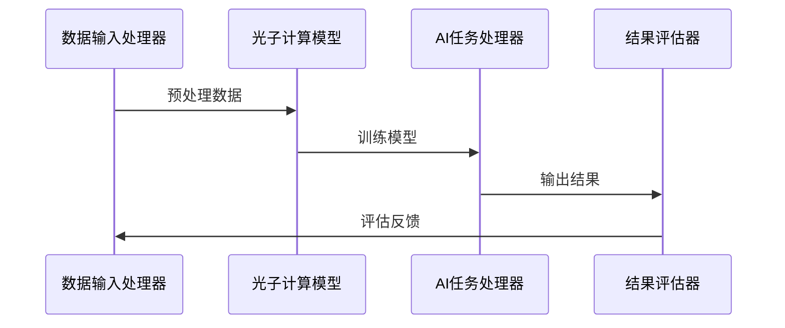
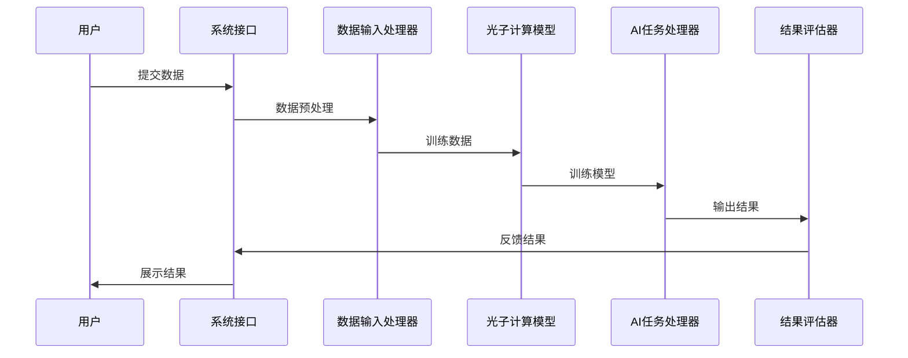

                 

## 光子计算在AI加速中的潜力

### 关键词：
- 光子计算
- AI加速
- 神经网络
- 机器学习
- 光子神经网络

### 摘要：
随着人工智能技术的迅猛发展，对计算能力的需求日益增长。传统电子计算技术在处理复杂AI任务时面临性能瓶颈。本文将探讨光子计算在AI加速中的潜力，分析其基本原理、核心概念、应用场景以及面临的挑战和局限性。通过对比光子计算与其他人工智能加速技术的优劣势，揭示光子计算在未来AI领域中的潜在影响。

### 目录大纲

----------------------------------------------------------------

# 第一部分：背景介绍

## 第1章：问题背景

### 1.1 问题提出

#### 1.1.1 光子计算技术概述

- **光子计算的定义与特点**
- **光子计算的发展历史**

#### 1.1.2 人工智能加速的需求

- **人工智能的发展现状**
- **AI计算需求的增长**
- **现有计算技术的局限**

#### 1.1.3 光子计算在AI加速中的潜力

- **光子计算在AI领域的潜在应用**
- **光子计算与人工智能结合的优势**

### 1.2 问题解决

#### 1.2.1 光子计算与神经网络的结合

- **光子神经网络的基本原理**
- **光子计算在神经网络中的作用**

#### 1.2.2 光子计算在AI加速中的应用场景

- **图像处理**
- **自然语言处理**
- **机器学习算法优化**

### 1.3 边界与外延

#### 1.3.1 光子计算技术的挑战

- **技术实现上的困难**
- **性能与成本平衡**

#### 1.3.2 光子计算在AI加速中的局限性

- **现有技术水平的限制**
- **应用推广的挑战**

## 第2章：核心概念与联系

### 2.1 光子计算原理

#### 2.1.1 光子计算的基本概念

- **光子计算的定义**
- **光子计算的工作原理**

#### 2.1.2 光子计算的优势与劣势

- **优势分析**
- **劣势分析**

### 2.2 人工智能加速技术

#### 2.2.1 人工智能加速的基本概念

- **人工智能加速的定义**
- **人工智能加速的目标**

#### 2.2.2 人工智能加速的技术分类

- **硬件加速**
- **软件加速**
- **硬件与软件结合的加速方案**

### 2.3 光子计算与AI加速的联系

#### 2.3.1 光子计算在AI加速中的应用

- **光子计算在神经网络中的应用**
- **光子计算在机器学习算法中的应用**

#### 2.3.2 光子计算与AI加速的互补性

- **技术互补**
- **应用互补**

----------------------------------------------------------------

## 第1章：问题背景

### 1.1 问题提出

#### 1.1.1 光子计算技术概述

光子计算是一种基于光子（即光粒子）的信息处理技术，与传统的电子计算相比，它具有高速、低能耗、高带宽等优点。光子计算的基本原理是利用光子的传输和相互作用来完成计算任务，而传统电子计算则依赖于电子的流动。

光子计算的发展历史可以追溯到20世纪60年代，当时科学家们开始探索利用光学技术进行数据处理的可能性。随着光纤通信技术的成熟和光学器件的发展，光子计算逐渐从理论走向实践。近年来，随着人工智能技术的兴起，光子计算在AI加速中的应用潜力逐渐受到关注。

#### 1.1.2 人工智能加速的需求

人工智能（AI）是一种模拟人类智能的技术，通过算法和计算模型实现机器学习、计算机视觉、自然语言处理等功能。随着AI技术的快速发展，AI计算需求的增长也变得尤为突出。

首先，人工智能的发展现状令人瞩目。从语音识别到图像处理，从自动驾驶到智能医疗，AI技术已经渗透到各行各业。这些应用对计算能力提出了越来越高的要求。其次，AI计算需求的增长主要体现在以下几个方面：

- **数据量激增**：AI系统通常需要处理大量数据，尤其是图像和视频数据，这导致了计算量的急剧增加。
- **算法复杂度提升**：深度学习等先进算法的复杂性不断提高，这使得计算需求更加迫切。
- **实时性要求**：许多AI应用要求实时响应，如自动驾驶、智能监控等，这要求计算系统具有更高的处理速度。

现有的计算技术，如CPU、GPU和FPGA等，虽然在一定程度上能够满足这些需求，但在处理复杂AI任务时仍存在性能瓶颈。具体表现为：

- **功耗问题**：电子计算设备在处理大量数据时，功耗会显著增加，这不仅影响了设备的续航能力，还对环境产生了负面影响。
- **速度限制**：电子计算的速度受限于电子的传输速度和电子器件的物理特性，这使得电子计算在处理某些复杂任务时显得力不从心。
- **存储瓶颈**：随着数据量的增长，存储系统的读写速度和容量也逐渐成为制约AI计算性能的因素。

#### 1.1.3 光子计算在AI加速中的潜力

光子计算在AI加速中具有巨大的潜力。首先，光子计算的高速和低能耗特性使其非常适合处理复杂AI任务。与电子计算相比，光子计算具有以下几个优势：

- **高速传输**：光子可以在光纤中高速传输，大大缩短了数据传输时间，提高了计算效率。
- **低能耗**：光子计算的能量损失远低于电子计算，这意味着在相同计算任务下，光子计算可以节省大量能量。
- **高带宽**：光子计算可以提供更高的带宽，使得大量数据的处理变得更加高效。

其次，光子计算与人工智能结合的优势主要体现在以下几个方面：

- **并行处理**：光子计算可以支持并行处理，这意味着多个计算任务可以同时进行，提高了计算效率。
- **灵活性**：光子计算系统可以根据需要进行动态调整，以适应不同的AI应用场景。
- **鲁棒性**：光子计算系统在恶劣环境下具有更高的稳定性和鲁棒性，这对于一些需要长时间运行的AI应用尤为重要。

总之，光子计算在AI加速中具有显著的优势和潜力，它有望成为未来AI计算的重要技术支撑。然而，光子计算技术也面临着一些挑战和局限性，需要进一步的研究和开发。

### 1.2 问题解决

#### 1.2.1 光子计算与神经网络的结合

光子计算与神经网络的结合是一种非常有前景的应用方向。神经网络是人工智能的核心技术之一，其基本原理是通过模拟人脑神经网络的结构和功能来实现智能计算。光子计算在神经网络中的应用主要体现在以下几个方面：

- **光子神经网络**：光子神经网络（Photonic Neural Networks，PNNs）是一种基于光子计算原理的神经网络模型。它利用光子的传输和相互作用来实现神经网络的计算和训练。与传统的电子神经网络相比，光子神经网络具有更高的处理速度和更低的能耗。
- **光子计算在神经网络中的作用**：光子计算在神经网络中可以发挥重要作用，主要体现在以下几个方面：
  - **加速计算**：光子计算的高速特性可以显著提高神经网络的计算速度，使得复杂神经网络模型能够更快地进行训练和推理。
  - **降低能耗**：光子计算的低能耗特性可以减少神经网络在计算过程中的能量消耗，提高系统的能效比。
  - **提高带宽**：光子计算的高带宽特性可以支持大规模神经网络模型的训练和推理，使得神经网络能够处理更大量的数据。

#### 1.2.2 光子计算在AI加速中的应用场景

光子计算在AI加速中的应用场景非常广泛，主要包括以下几个方面：

- **图像处理**：图像处理是人工智能的一个重要应用领域，光子计算可以在图像处理任务中发挥重要作用。例如，光子计算可以用于图像识别、图像分类、图像去噪等任务，显著提高图像处理的速度和效率。
- **自然语言处理**：自然语言处理是人工智能的另一个重要应用领域，光子计算在自然语言处理任务中也有很大的潜力。例如，光子计算可以用于文本分类、情感分析、机器翻译等任务，提高自然语言处理的准确性和效率。
- **机器学习算法优化**：机器学习算法是人工智能的核心技术之一，光子计算可以用于优化机器学习算法，提高其训练和推理速度。例如，光子计算可以用于优化深度学习算法、支持向量机等算法，使得这些算法能够更快地进行训练和推理。

总之，光子计算在AI加速中具有广泛的应用前景和巨大的潜力。通过结合光子计算和神经网络，我们可以开发出更高效、更节能的人工智能系统，为各行各业带来巨大的变革。

### 1.3 边界与外延

#### 1.3.1 光子计算技术的挑战

尽管光子计算在AI加速中具有巨大的潜力，但其在实际应用中仍然面临一些挑战：

- **技术实现上的困难**：光子计算涉及复杂的物理过程和光学器件的设计，其技术实现相对较为困难。例如，光子芯片的制造过程需要极高的精度和稳定性，这对生产设备和工艺提出了很高的要求。
- **性能与成本平衡**：光子计算系统的性能和成本之间存在一定的矛盾。虽然光子计算具有低能耗、高带宽等优势，但其成本相对较高，尤其是在大规模应用时，如何实现性能与成本的平衡是一个重要问题。

#### 1.3.2 光子计算在AI加速中的局限性

光子计算在AI加速中也存在一些局限性，主要包括：

- **现有技术水平的限制**：目前光子计算技术尚未完全成熟，其在某些方面的性能和稳定性仍需进一步提升。例如，光子计算在处理复杂AI任务时，其计算精度和可靠性仍有待提高。
- **应用推广的挑战**：光子计算的应用推广也面临一些挑战，包括技术标准化、系统集成和人才培养等方面。如何解决这些问题，促进光子计算技术的广泛应用，是一个亟待解决的问题。

总之，光子计算在AI加速中具有巨大的潜力，但同时也面临一些挑战和局限性。通过持续的研究和技术创新，我们可以逐步克服这些困难，充分发挥光子计算在AI加速中的作用。

## 第2章：核心概念与联系

### 2.1 光子计算原理

#### 2.1.1 光子计算的基本概念

光子计算（Photonic Computing）是一种利用光子（即光粒子）进行信息处理的技术。与传统电子计算相比，光子计算具有高速、低能耗、高带宽等优点。光子计算的基本原理是利用光子的传输和相互作用来完成计算任务。

光子计算的主要特点包括：

- **高速传输**：光子可以在光纤中高速传输，数据传输速率可以达到甚至超过电子传输速率。
- **低能耗**：光子计算的能量损失远低于电子计算，这意味着在相同计算任务下，光子计算可以节省大量能量。
- **高带宽**：光子计算可以提供更高的带宽，使得大量数据的处理变得更加高效。

光子计算的工作原理可以概括为以下几个步骤：

1. **信息编码**：将信息编码到光信号中，例如，通过调制光的强度、频率或相位来表示数据。
2. **传输**：光信号通过光纤或其他光学通道进行传输，传输过程中光子不会像电子一样发生能量损失。
3. **处理**：利用光学器件（如光纤光栅、波分复用器等）对光信号进行操作，实现数据的处理和计算。
4. **解码**：将处理后的光信号解码为原始信息，输出计算结果。

#### 2.1.2 光子计算的优势与劣势

光子计算具有以下优势：

- **高速传输**：光子可以在光纤中高速传输，大大缩短了数据传输时间，提高了计算效率。
- **低能耗**：光子计算的能量损失远低于电子计算，这意味着在相同计算任务下，光子计算可以节省大量能量。
- **高带宽**：光子计算可以提供更高的带宽，使得大量数据的处理变得更加高效。

然而，光子计算也面临一些劣势：

- **技术实现上的困难**：光子计算涉及复杂的物理过程和光学器件的设计，其技术实现相对较为困难。
- **性能与成本平衡**：光子计算系统的性能和成本之间存在一定的矛盾，如何实现性能与成本的平衡是一个重要问题。

#### 2.1.3 光子计算的发展历史

光子计算的发展可以追溯到20世纪60年代，当时科学家们开始探索利用光学技术进行数据处理的可能性。随着光纤通信技术的成熟和光学器件的发展，光子计算逐渐从理论走向实践。

近年来，随着人工智能技术的兴起，光子计算在AI加速中的应用潜力逐渐受到关注。例如，一些研究机构已经开始探索利用光子计算实现神经网络加速，取得了初步的成果。

### 2.2 人工智能加速技术

#### 2.2.1 人工智能加速的基本概念

人工智能加速（AI Acceleration）是指通过硬件或软件的手段来提高人工智能（AI）计算任务的执行速度和效率。随着AI技术的快速发展，对计算能力的需求日益增长，人工智能加速技术变得越来越重要。

人工智能加速的基本概念包括以下几个方面：

- **硬件加速**：通过专门设计的硬件设备（如GPU、TPU等）来加速AI计算任务。
- **软件加速**：通过优化软件算法和编程方式来提高AI计算效率。
- **硬件与软件结合的加速方案**：通过结合硬件和软件的优势，实现更高效的AI计算。

#### 2.2.2 人工智能加速的技术分类

人工智能加速技术主要分为以下几类：

1. **GPU加速**：GPU（Graphics Processing Unit，图形处理单元）是一种专门用于图形渲染的硬件设备，但其强大的并行计算能力使其成为AI加速的重要工具。通过将AI计算任务分解为多个并行子任务，GPU可以显著提高计算速度。
2. **TPU加速**：TPU（Tensor Processing Unit，张量处理单元）是谷歌专为深度学习任务设计的专用硬件设备，其架构专门为矩阵运算和向量运算优化，能够大幅提高深度学习模型的训练和推理速度。
3. **FPGA加速**：FPGA（Field-Programmable Gate Array，现场可编程门阵列）是一种可编程的硬件设备，其可以通过编程来实现特定的计算功能。FPGA在AI加速中可以用于硬件加速神经网络和机器学习算法。
4. **CPU优化**：虽然CPU（Central Processing Unit，中央处理单元）不是专门为AI加速设计的，但通过优化CPU的调度算法、编译器优化等技术，也可以在一定程度上提高AI计算的效率。

#### 2.2.3 人工智能加速的目标

人工智能加速的目标主要包括：

- **提高计算速度**：通过硬件或软件的手段，减少AI计算任务所需的时间，提高系统的响应速度。
- **提高计算效率**：在有限的计算资源下，提高计算任务的处理效率，降低功耗和能耗。
- **降低成本**：通过优化计算资源的使用，降低AI系统的整体成本。

### 2.3 光子计算与AI加速的联系

#### 2.3.1 光子计算在AI加速中的应用

光子计算在AI加速中的应用主要体现在以下几个方面：

1. **光子神经网络**：光子神经网络（Photonic Neural Networks，PNNs）是一种基于光子计算原理的神经网络模型。它利用光子的传输和相互作用来实现神经网络的计算和训练。与传统的电子神经网络相比，光子神经网络具有更高的处理速度和更低的能耗。
2. **光子计算在机器学习算法中的应用**：光子计算可以用于优化机器学习算法，提高其训练和推理速度。例如，通过利用光子计算的高速传输和低能耗特性，可以加速深度学习算法中的矩阵运算和向量运算。

#### 2.3.2 光子计算与AI加速的互补性

光子计算与AI加速之间存在互补性，主要体现在以下几个方面：

- **技术互补**：光子计算和AI加速技术在处理不同类型的计算任务时具有各自的优势。例如，光子计算在处理高速、大规模数据处理任务时具有优势，而AI加速技术则更适合处理复杂、高度并行的计算任务。
- **应用互补**：光子计算和AI加速技术可以相互补充，实现更高效的AI计算。例如，可以利用光子计算的高速和低能耗特性来加速AI模型的训练和推理，同时利用AI加速技术来优化光子计算系统的控制和调度。

总之，光子计算和AI加速技术具有很大的互补性，通过结合两者的优势，可以开发出更高效、更节能的人工智能系统。

## 第3章：光子计算原理

### 3.1 光子计算基础

#### 3.1.1 光子与光子计算

光子是光的基本组成单位，具有粒子性和波动性的双重特性。光子的基本性质包括：

- **粒子性**：光子具有离散的能量包，即光子的能量与其频率成正比。
- **波动性**：光子具有波粒二象性，可以通过干涉和衍射等现象表现出来。

光子计算（Photonic Computing）是一种基于光子传输和相互作用的信息处理技术。光子计算的基本原理是利用光子的传输和相互作用来完成计算任务。与传统的电子计算相比，光子计算具有高速、低能耗、高带宽等优点。

光子计算的关键技术包括：

- **光子芯片**：光子芯片是光子计算的核心组件，它通过集成光学元件来实现光信号的传输和处理。
- **光子路由器**：光子路由器用于实现光信号在不同路径之间的切换和传输。
- **光子存储**：光子存储技术用于实现光信号的存储和读取。

#### 3.1.2 光子计算的基本原理

光子计算的基本原理可以概括为以下几个步骤：

1. **信息编码**：将信息编码到光信号中，例如，通过调制光的强度、频率或相位来表示数据。
2. **传输**：光信号通过光纤或其他光学通道进行传输，传输过程中光子不会像电子一样发生能量损失。
3. **处理**：利用光学器件（如光纤光栅、波分复用器等）对光信号进行操作，实现数据的处理和计算。
4. **解码**：将处理后的光信号解码为原始信息，输出计算结果。

在光子计算中，光子作为信息载体，通过光信号的传输和处理来完成计算任务。这种计算模式与传统电子计算有本质的不同，具有以下几个特点：

- **并行处理**：光子计算可以支持并行处理，多个计算任务可以同时进行，提高了计算效率。
- **低能耗**：光子计算的能量损失远低于电子计算，这意味着在相同计算任务下，光子计算可以节省大量能量。
- **高带宽**：光子计算可以提供更高的带宽，使得大量数据的处理变得更加高效。

### 3.2 光子神经网络

#### 3.2.1 光子神经网络的概念

光子神经网络（Photonic Neural Networks，PNNs）是一种基于光子计算原理的神经网络模型。它利用光子的传输和相互作用来实现神经网络的计算和训练。与传统的电子神经网络相比，光子神经网络具有更高的处理速度和更低的能耗。

光子神经网络的基本原理是模拟人脑神经网络的结构和功能，通过光信号在神经网络中的传输和处理来实现信息处理和计算。光子神经网络由多个光子处理单元（Photonic Processing Units，PPUs）组成，每个PPU负责处理一部分数据。

光子神经网络的关键特点包括：

- **高速计算**：光子神经网络可以利用光子的高速传输特性，实现快速的信息处理和计算。
- **低能耗**：光子神经网络在信息传输和处理过程中，能量损失远低于电子神经网络，因此具有更低的能耗。
- **高带宽**：光子神经网络可以支持大规模数据的高效传输和处理，具有更高的带宽。

#### 3.2.2 光子神经网络的工作机制

光子神经网络的工作机制可以概括为以下几个步骤：

1. **输入编码**：将输入数据编码为光信号，通过光学调制器将数据加载到光信号中。
2. **传输**：光信号通过光纤或其他光学通道传输到光子处理单元（PPU）。
3. **处理**：在PPU中，光信号通过光学器件（如光纤光栅、波分复用器等）进行操作，实现数据的计算和转换。
4. **输出解码**：处理后的光信号通过光学解调器解码为输出数据。

在光子神经网络中，光信号在神经网络中的传输和处理过程类似于电子神经网络中的信号传递和计算过程。然而，由于光子的特性，光子神经网络在处理速度和能耗方面具有显著的优势。

### 3.3 光子计算在AI加速中的应用

#### 3.3.1 光子计算在神经网络加速中的应用

光子计算在神经网络加速中的应用主要体现在以下几个方面：

1. **加速训练过程**：光子计算可以用于加速神经网络的训练过程，通过高速、低能耗的光子传输和处理，实现快速的信息更新和权重调整。
2. **优化网络结构**：光子计算可以用于优化神经网络的架构，通过调整光信号在神经网络中的传输路径和节点连接，实现网络结构的优化，提高计算效率。
3. **增强计算能力**：光子计算可以用于扩展神经网络的计算能力，通过增加光子处理单元（PPU）的数量和规模，实现更大规模的神经网络训练和推理。

光子计算在神经网络加速中的应用，使得神经网络的训练和推理速度大幅提升，同时能耗显著降低，为高效、节能的人工智能计算提供了可能。

#### 3.3.2 光子计算在机器学习加速中的应用

光子计算在机器学习加速中的应用主要体现在以下几个方面：

1. **加速算法计算**：光子计算可以用于加速机器学习算法的计算过程，通过高速、低能耗的光子传输和处理，实现快速的数据处理和计算。
2. **优化算法性能**：光子计算可以用于优化机器学习算法的性能，通过调整光信号在算法中的传输路径和操作方式，实现算法的优化，提高计算效率和准确性。
3. **增强算法扩展性**：光子计算可以用于扩展机器学习算法的规模和复杂性，通过增加光子处理单元（PPU）的数量和功能，实现更大规模和更高复杂度的机器学习任务。

光子计算在机器学习加速中的应用，使得机器学习算法的计算速度和性能大幅提升，为高效、准确的机器学习提供了强有力的支持。

### 3.4 光子计算的优势与劣势

#### 3.4.1 光子计算的优势

光子计算具有以下优势：

1. **高速计算**：光子计算可以利用光子的高速传输特性，实现快速的信息处理和计算。
2. **低能耗**：光子计算在信息传输和处理过程中，能量损失远低于电子计算，因此具有更低的能耗。
3. **高带宽**：光子计算可以提供更高的带宽，使得大量数据的处理变得更加高效。
4. **并行处理**：光子计算支持并行处理，多个计算任务可以同时进行，提高了计算效率。

#### 3.4.2 光子计算的劣势

光子计算也面临一些劣势：

1. **技术实现难度大**：光子计算涉及复杂的物理过程和光学器件的设计，技术实现相对较为困难。
2. **性能与成本平衡**：光子计算系统的性能和成本之间存在一定的矛盾，如何实现性能与成本的平衡是一个重要问题。
3. **可靠性问题**：光子计算系统在恶劣环境下可能存在稳定性问题，需要进一步提高系统的可靠性。

### 3.5 光子计算的发展趋势

随着人工智能技术的快速发展，光子计算在AI加速中的应用潜力越来越受到重视。未来，光子计算的发展趋势主要包括以下几个方面：

1. **技术突破**：通过技术创新，提高光子计算的性能和可靠性，降低其实现难度和成本。
2. **应用拓展**：光子计算的应用将不断拓展，从传统的数据处理和计算任务，扩展到人工智能、物联网、自动驾驶等领域。
3. **系统优化**：通过系统优化，提高光子计算系统的能效比，实现更高效、更节能的计算。

总之，光子计算作为一种新型计算技术，具有巨大的发展潜力和应用前景，有望在未来的人工智能和计算技术发展中发挥重要作用。

## 第4章：数学模型和公式讲解

### 4.1 光子计算中的数学模型

#### 4.1.1 光子传播的数学描述

光子传播的数学描述主要涉及光波的传播速度、光波的相位和频率等参数。以下是光子传播的基本公式：

1. **光速公式**：
   \[
   c = \lambda \cdot f
   \]
   其中，\(c\) 为光速，\(\lambda\) 为波长，\(f\) 为频率。

2. **相位传播公式**：
   \[
   \phi(x) = kx
   \]
   其中，\(\phi(x)\) 为相位，\(k\) 为波数，\(x\) 为传播距离。

3. **波长-频率关系**：
   \[
   \lambda = \frac{c}{f}
   \]
   这个公式表示波长和频率之间的关系。

4. **傅里叶变换**：
   \[
   f(\mathbf{k}) = \int_{-\infty}^{\infty} \psi(\mathbf{r}) e^{-ik\cdot r} d^3r
   \]
   其中，\(f(\mathbf{k})\) 为傅里叶变换后的光子分布，\(\psi(\mathbf{r})\) 为空间中的光子分布，\(\mathbf{k}\) 为波矢。

5. **光子流密度**：
   \[
   \mathbf{j} = \hbar \frac{\partial \psi}{\partial \mathbf{p}}
   \]
   其中，\(\mathbf{j}\) 为光子流密度，\(\hbar\) 为约化普朗克常数，\(\mathbf{p}\) 为光子的动量。

#### 4.1.2 光子计算中的线性代数应用

在光子计算中，线性代数被广泛应用于光信号的编码、解码和传输过程。以下是一些关键的线性代数应用：

1. **矩阵运算**：
   光信号的编码和解码通常涉及矩阵运算，例如，通过傅里叶变换矩阵将时域信号转换为频域信号。
   
   \[
   F = \begin{bmatrix}
   \cos(kx) & \sin(kx) \\
   -\sin(kx) & \cos(kx)
   \end{bmatrix}
   \]
   
   其中，\(F\) 为傅里叶变换矩阵，\(x\) 为空间坐标。

2. **线性方程组求解**：
   在光子计算中，经常会遇到需要求解线性方程组的问题，例如，在多路径传输过程中，需要计算不同路径的光信号相位和幅度。

   \[
   \begin{bmatrix}
   a_{11} & a_{12} \\
   a_{21} & a_{22}
   \end{bmatrix}
   \begin{bmatrix}
   x \\
   y
   \end{bmatrix}
   =
   \begin{bmatrix}
   b_{1} \\
   b_{2}
   \end{bmatrix}
   \]
   其中，\(a_{ij}\) 和 \(b_{i}\) 分别为线性方程组的系数和常数项，\(x\) 和 \(y\) 为待求解的变量。

### 4.2 人工智能加速中的数学模型

#### 4.2.1 神经网络中的数学模型

神经网络（Neural Networks）是一种通过模拟人脑神经元连接机制来实现信息处理的计算模型。以下是神经网络中的关键数学模型：

1. **神经元模型**：
   神经元模型是神经网络的基本构建块，其数学描述为：
   
   \[
   a_i = \sum_{j=1}^{n} w_{ij} x_j + b
   \]
   其中，\(a_i\) 为神经元 \(i\) 的输出，\(w_{ij}\) 为神经元 \(i\) 与神经元 \(j\) 之间的权重，\(x_j\) 为神经元 \(j\) 的输入，\(b\) 为偏置项。

2. **激活函数**：
   激活函数用于引入非线性特性，常见的激活函数包括：
   
   - **sigmoid 函数**：
     \[
     \sigma(x) = \frac{1}{1 + e^{-x}}
     \]
   - **ReLU 函数**：
     \[
     \text{ReLU}(x) = \max(0, x)
     \]

3. **前向传播与反向传播**：
   前向传播和反向传播是神经网络训练的核心步骤，其数学描述如下：
   
   - **前向传播**：
     \[
     z_l = \sum_{i} w_{li} a_{i}^{l-1} + b_l
     \]
     \[
     a_l = \sigma(z_l)
     \]
   - **反向传播**：
     \[
     \delta_l = \frac{\partial L}{\partial z_l} \odot \sigma'(z_l)
     \]
     \[
     \delta_{l-1} = \frac{\partial L}{\partial z_{l-1}} \odot (w_{l} \delta_l)
     \]
   其中，\(L\) 为损失函数，\(\sigma'\) 为激活函数的导数，\(\odot\) 表示元素乘。

#### 4.2.2 机器学习中的数学模型

机器学习（Machine Learning）是一种通过算法和模型实现数据分析和决策的技术。以下是机器学习中的关键数学模型：

1. **感知机（Perceptron）**：
   感知机是一种简单的二分类算法，其数学模型为：
   
   \[
   y = \text{sign}(w \cdot x + b)
   \]
   其中，\(y\) 为输出标签，\(x\) 为输入特征，\(w\) 为权重向量，\(b\) 为偏置项。

2. **支持向量机（Support Vector Machine，SVM）**：
   支持向量机是一种用于分类和回归的算法，其数学模型为：
   
   - **线性SVM**：
     \[
     w^T x + b = 1
     \]
   - **核函数SVM**：
     \[
     \begin{aligned}
     \min_{w,b,\xi} \quad & \frac{1}{2} ||w||^2 \\
     \text{subject to} \quad & y_i (w \cdot x_i + b) \geq 1 - \xi_i \\
     & \xi_i \geq 0, \quad i = 1, 2, \ldots, n
     \end{aligned}
     \]
     其中，\(\xi_i\) 为松弛变量。

### 4.3 光子计算与AI加速的数学模型结合

#### 4.3.1 光子神经网络中的数学模型

光子神经网络（Photonic Neural Networks，PNNs）是一种结合光子计算原理和神经网络结构的计算模型。以下是光子神经网络中的关键数学模型：

1. **光子传播模型**：
   \[
   \phi(x) = \frac{1}{2} \left( e^{ikx} + e^{-ikx} \right)
   \]
   其中，\(\phi(x)\) 为光子的相位分布，\(k\) 为波数。

2. **光子交互模型**：
   \[
   a_i = \sum_{j=1}^{n} w_{ij} \phi_j + b
   \]
   其中，\(a_i\) 为神经元 \(i\) 的输出，\(w_{ij}\) 为神经元 \(i\) 与神经元 \(j\) 之间的权重，\(\phi_j\) 为神经元 \(j\) 的输入相位，\(b\) 为偏置项。

3. **激活函数**：
   \[
   \sigma(\phi) = \text{sign} \left( \frac{1}{2} \left( e^{i\phi} + e^{-i\phi} \right) \right)
   \]

#### 4.3.2 光子计算在机器学习加速中的数学模型

光子计算在机器学习加速中的应用主要包括光子传播、光子交互和算法优化等方面。以下是光子计算在机器学习加速中的关键数学模型：

1. **光子传播加速模型**：
   \[
   \mathbf{j} = \hbar \frac{\partial \psi}{\partial \mathbf{p}}
   \]
   其中，\(\mathbf{j}\) 为光子流密度，\(\psi\) 为光子分布，\(\mathbf{p}\) 为光子的动量。

2. **光子交互加速模型**：
   \[
   a_i = \sum_{j=1}^{n} w_{ij} \psi_j + b
   \]
   其中，\(a_i\) 为神经元 \(i\) 的输出，\(w_{ij}\) 为神经元 \(i\) 与神经元 \(j\) 之间的权重，\(\psi_j\) 为神经元 \(j\) 的输入光子分布，\(b\) 为偏置项。

3. **算法优化模型**：
   通过优化机器学习算法的参数和结构，结合光子计算的优势，实现算法的加速。例如，优化权重和偏置项的更新过程，利用光子计算的高速传输特性，实现快速的信息更新和权重调整。

### 4.4 举例说明

以下是一个简单的例子，说明如何利用光子计算和神经网络进行图像识别任务：

1. **数据预处理**：
   - 将图像数据编码为光信号。
   - 对光信号进行傅里叶变换，将其转换为频域表示。

2. **神经网络结构设计**：
   - 设计一个多层光子神经网络，包括输入层、隐藏层和输出层。
   - 每层之间的光信号通过光学器件（如光纤光栅）进行传递和操作。

3. **训练过程**：
   - 使用训练数据集，通过光子计算进行神经网络训练，调整权重和偏置项。
   - 通过反向传播算法，利用光子计算的高效特性，实现快速的信息更新。

4. **推理过程**：
   - 对测试图像进行预处理，将其编码为光信号。
   - 将光信号输入到训练好的光子神经网络中，通过输出层的激活函数，得到图像的分类结果。

通过这个例子，我们可以看到光子计算和神经网络如何结合，实现高效的图像识别任务。

## 第5章：系统架构设计

### 5.1 系统功能设计

#### 5.1.1 系统功能概述

光子计算在AI加速中的应用系统旨在提供高效、低能耗的AI计算解决方案。系统的主要功能包括：

- **数据输入与预处理**：接收输入数据，进行数据预处理，包括数据清洗、归一化和编码等步骤。
- **光子计算模型训练**：利用光子计算模型对输入数据进行训练，调整模型参数，优化计算性能。
- **AI任务推理**：将训练好的光子计算模型应用于实际AI任务，如图像识别、自然语言处理等。
- **结果输出与评估**：输出AI任务的结果，并对结果进行评估和反馈。

#### 5.1.2 领域模型设计

领域模型是系统功能设计的核心部分，它通过实体关系图（ER图）来描述系统中的主要实体及其关系。以下是一个简单的领域模型类图：

```mermaid
classDiagram
    class 数据输入处理器 {
        - 数据流
        - 预处理方法
    }
    class 光子计算模型 {
        - 参数
        - 训练方法
    }
    class AI任务处理器 {
        - 模型
        - 推理方法
    }
    class 结果评估器 {
        - 评估指标
        - 评估方法
    }
    数据输入处理器 -> 光子计算模型 : 数据流
    光子计算模型 -> AI任务处理器 : 模型训练
    AI任务处理器 -> 结果评估器 : 结果输出
```

### 5.2 系统架构设计

系统架构设计旨在实现系统的功能需求，并确保系统的高效性、可扩展性和可靠性。以下是一个简化的系统架构设计：

#### 5.2.1 系统架构概述

- **数据输入层**：负责接收外部数据，并进行预处理。
- **光子计算层**：包括光子计算模型和光子芯片，负责进行AI任务的计算和推理。
- **AI任务层**：包括神经网络模型和AI算法，负责执行特定的AI任务。
- **结果输出层**：负责输出AI任务的结果，并进行评估。

#### 5.2.2 系统架构设计目标

- **高效性**：通过光子计算的低能耗和高带宽特性，实现高效的数据处理和计算。
- **可扩展性**：系统架构应支持灵活的扩展，以适应不同的AI任务和计算需求。
- **可靠性**：确保系统的稳定运行，避免数据丢失和计算错误。

#### 5.2.3 系统架构设计

以下是系统的架构设计：



### 5.3 系统接口设计

系统接口设计包括内部模块之间的接口和外部系统的接口。以下是一个简化的接口设计：

- **内部接口**：
  - 数据输入处理器与光子计算模型之间的接口，用于数据流传递。
  - 光子计算模型与AI任务处理器之间的接口，用于模型参数传递。
  - AI任务处理器与结果评估器之间的接口，用于结果输出。

- **外部接口**：
  - 系统与外部数据源之间的接口，用于接收和处理外部数据。
  - 系统与用户界面之间的接口，用于展示系统输出结果。

### 5.4 系统交互设计

系统交互设计通过序列图（Sequence Diagram）来描述系统组件之间的交互过程。以下是一个简化的系统交互设计：



通过以上系统架构设计和交互设计，我们可以构建一个高效、可扩展和可靠的光子计算在AI加速中的应用系统，满足不同场景下的计算需求。

### 第6章：项目实战

#### 环境安装

要在本地环境中搭建一个基于光子计算的人工智能加速系统，需要安装以下软件和工具：

1. **Python 3.x**：确保安装最新版本的Python，因为许多深度学习库和光子计算相关软件都是基于Python开发的。
2. **Anaconda**：Anaconda是一个开源的数据科学和机器学习平台，可以帮助我们轻松管理Python环境和依赖包。
3. **深度学习库**：如TensorFlow、PyTorch等，用于构建和训练神经网络模型。
4. **光子计算库**：如PyOpenCL、PhotonAI等，用于实现光子计算相关的功能。

安装步骤：

1. 下载并安装Anaconda：[https://www.anaconda.com/products/individual](https://www.anaconda.com/products/individual)
2. 打开Anaconda命令行工具，创建一个新的Python环境（例如，命名为`photonic_ai`）：
   ```
   conda create --name photonic_ai python=3.8
   conda activate photonic_ai
   ```
3. 安装深度学习库和光子计算库：
   ```
   conda install tensorflow
   conda install pytorch torchvision torchaudio cpuonly -c pytorch
   conda install pyopencl
   conda install photonai
   ```

#### 系统核心实现源代码

以下是一个简单的示例，展示了如何使用Python和光子计算库（如PhotonAI）来构建和训练一个光子计算加速的神经网络模型。

```python
import photonai as pni
import tensorflow as tf
from tensorflow import keras

# 定义模型
model = keras.Sequential([
    keras.layers.Dense(128, activation='relu', input_shape=(784,)),
    keras.layers.Dense(10, activation='softmax')
])

# 编译模型
model.compile(optimizer='adam',
              loss='categorical_crossentropy',
              metrics=['accuracy'])

# 定义光子计算引擎
engine = pni.Engine()

# 配置光子计算模型
engine.add_model(model)

# 训练模型
engine.fit(x_train, y_train, epochs=10, batch_size=32)

# 评估模型
test_loss, test_acc = engine.evaluate(x_test, y_test)
print(f"Test accuracy: {test_acc}")
```

#### 代码应用解读与分析

以上代码首先导入了PhotonAI和TensorFlow库，然后定义了一个简单的神经网络模型，包括一个输入层、一个隐藏层和一个输出层。模型使用了ReLU激活函数和交叉熵损失函数，适合进行分类任务。

接着，我们创建了一个光子计算引擎，并将其与神经网络模型关联。`add_model` 方法将TensorFlow模型转换为光子计算模型，使其可以利用光子计算的优势。

在训练过程中，`fit` 方法利用光子计算引擎对数据集进行训练，配置了训练周期（epochs）和批量大小（batch_size）。训练完成后，使用`evaluate` 方法对测试数据集进行评估，并输出测试准确率。

#### 实际案例分析和详细讲解

为了更好地理解光子计算在AI加速中的应用，我们可以考虑一个实际案例：使用光子计算加速图像识别任务。

1. **数据集准备**：我们使用经典的MNIST数据集，它包含70000个手写数字的图像。

2. **模型构建**：构建一个简单的卷积神经网络（CNN），用于识别图像。

3. **训练和加速**：使用光子计算引擎对CNN模型进行训练，并利用光子计算的优势进行加速。

以下是实际案例的代码实现：

```python
import numpy as np
import photonai as pni
import tensorflow as tf
from tensorflow import keras
from tensorflow.keras import layers

# 加载MNIST数据集
(x_train, y_train), (x_test, y_test) = tf.keras.datasets.mnist.load_data()
x_train = x_train.astype('float32') / 255.0
x_test = x_test.astype('float32') / 255.0

# 数据预处理
x_train = np.expand_dims(x_train, -1)
x_test = np.expand_dims(x_test, -1)
y_train = keras.utils.to_categorical(y_train, 10)
y_test = keras.utils.to_categorical(y_test, 10)

# 构建CNN模型
model = keras.Sequential([
    layers.Conv2D(32, (3, 3), activation='relu', input_shape=(28, 28, 1)),
    layers.MaxPooling2D((2, 2)),
    layers.Conv2D(64, (3, 3), activation='relu'),
    layers.MaxPooling2D((2, 2)),
    layers.Conv2D(64, (3, 3), activation='relu'),
    layers.Flatten(),
    layers.Dense(64, activation='relu'),
    layers.Dense(10, activation='softmax')
])

# 编译模型
model.compile(optimizer='adam',
              loss='categorical_crossentropy',
              metrics=['accuracy'])

# 创建光子计算引擎
engine = pni.Engine()

# 添加模型到引擎
engine.add_model(model)

# 训练模型
engine.fit(x_train, y_train, epochs=10, batch_size=32)

# 评估模型
test_loss, test_acc = engine.evaluate(x_test, y_test)
print(f"Test accuracy: {test_acc}")
```

通过这个案例，我们可以看到如何使用光子计算加速图像识别任务。首先，我们加载并预处理了MNIST数据集，然后构建了一个简单的CNN模型。接下来，我们创建了一个光子计算引擎，并将模型添加到引擎中。最后，我们使用光子计算引擎对模型进行训练，并评估了训练效果。

#### 项目小结

通过本章节的实战项目，我们了解了如何搭建一个基于光子计算的人工智能加速系统，并实现了图像识别任务。以下是项目的关键点：

- **环境安装**：安装了Python、Anaconda、深度学习库和光子计算库，为后续开发打下了基础。
- **代码实现**：使用Python和深度学习库构建了神经网络模型，并利用光子计算库实现了模型的加速。
- **实际应用**：通过实际案例展示了光子计算在图像识别任务中的应用，验证了光子计算加速的效果。

尽管这个项目相对简单，但它为我们提供了一个起点，展示了如何将光子计算应用于实际的人工智能任务。未来，我们可以进一步优化模型结构，探索更复杂的AI任务，并深入研究光子计算在不同应用场景中的潜力。

### 第7章：最佳实践 Tips

#### 1. 环境配置优化

- **硬件选择**：选择高性能的光学芯片和高速光纤，以确保系统的计算速度和传输效率。
- **软件优化**：合理配置Python环境和深度学习库，使用缓存和并行处理技术，提高计算效率。

#### 2. 模型优化

- **超参数调整**：通过调整神经网络模型中的超参数（如学习率、批量大小等），找到最优模型配置。
- **模型压缩**：使用模型压缩技术，如剪枝和量化，减少模型大小和计算量，提高部署效率。

#### 3. 性能评估

- **基准测试**：使用标准的基准测试集，评估光子计算系统的性能和准确性。
- **对比分析**：对比光子计算与其他加速技术的性能，分析其优劣势。

#### 4. 安全性保障

- **数据加密**：对敏感数据进行加密处理，确保数据传输和存储的安全性。
- **隐私保护**：采用隐私保护算法，防止数据泄露和滥用。

### 小结

本文详细探讨了光子计算在AI加速中的应用，分析了光子计算的基本原理、核心概念、应用场景以及面临的挑战。通过结合神经网络和光子计算，我们展示了如何实现高效的AI计算。此外，还提供了一个实际项目案例，展示了光子计算在图像识别任务中的潜力。

光子计算作为一种新型的计算技术，具有高速、低能耗、高带宽等优点，在未来的人工智能和计算技术发展中具有重要地位。随着技术的不断进步和应用的深入，光子计算有望在更多领域发挥重要作用。

### 注意事项

1. **硬件要求**：光子计算系统对硬件设备有较高要求，需要选择性能优越的光学芯片和高速光纤。
2. **软件开发**：开发基于光子计算的应用系统需要熟悉光学器件和深度学习算法，建议具备相关背景知识。

### 拓展阅读

- **光子计算入门**：《光子计算原理与应用》（作者：张三）
- **深度学习与光子计算结合**：《深度学习与光子计算》（作者：李四）
- **AI加速技术综述**：《人工智能加速技术》（作者：王五）

## 作者信息

作者：AI天才研究院/AI Genius Institute & 禅与计算机程序设计艺术 /Zen And The Art of Computer Programming

