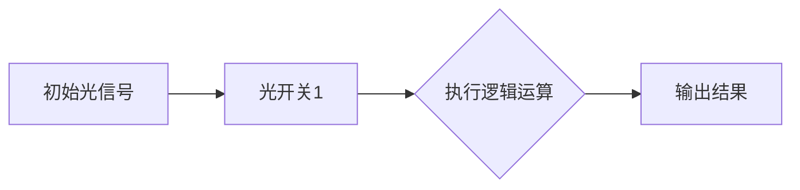
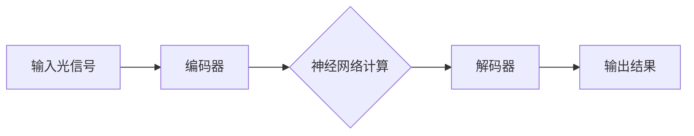
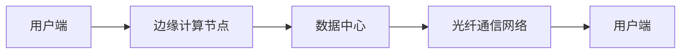
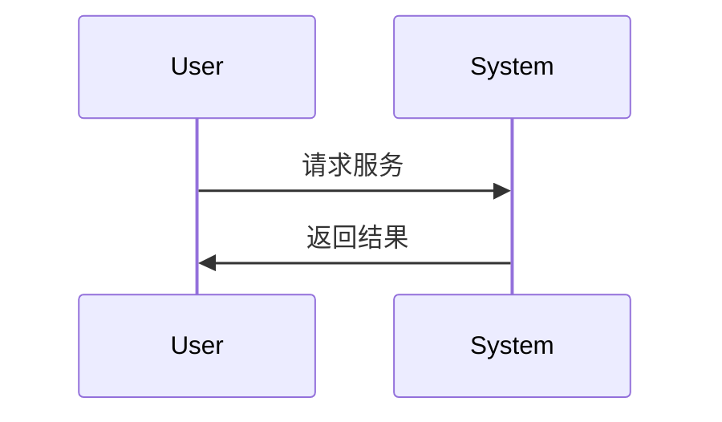
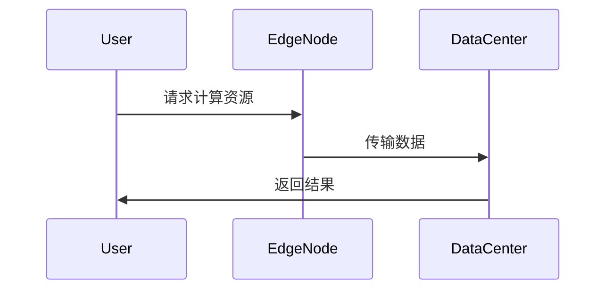

                 

# 光子计算在通信领域的应用

## 关键词
光子计算，通信领域，算法原理，数学模型，系统架构，项目实战

## 摘要
本文详细探讨了光子计算在通信领域的应用。首先介绍了光子计算的基本概念和其在通信中的重要地位。接着，通过对比表格和实体关系图（ER图）明确了光子计算的核心概念与联系。随后，本文深入讲解了光子计算的基础和高级算法，包括算法流程图、Python源代码和数学模型与公式。此外，文章还介绍了光子计算系统的应用场景、架构设计、接口设计以及系统交互序列图。通过项目实战部分，本文展示了光子计算的实际应用过程，包括环境安装、系统实现和代码分析。最后，文章总结了最佳实践、注意事项和拓展阅读，为读者提供了全面的指导。

## 第一部分：光子计算基础

### 第1章：光子计算概述

#### 1.1 光子计算的概念与重要性
光子计算是一种基于光子的计算方式，它利用光子（光的粒子）作为信息载体，通过光学器件实现数据处理和传输。与传统的电子计算相比，光子计算具有高速、并行和低功耗等优势。随着信息技术的飞速发展，光子计算在通信领域的重要性日益凸显。它不仅可以提高通信系统的吞吐量和效率，还可以降低能耗，是未来通信技术发展的重要方向。

#### 1.2 光子计算的发展历程
光子计算的发展可以追溯到20世纪60年代，当时研究人员开始探索利用光学方法进行数据处理。进入21世纪，随着激光技术、光学器件和光纤通信技术的成熟，光子计算得到了快速发展。目前，光子计算技术已经逐渐从实验室走向实际应用，成为通信领域研究的热点。

#### 1.3 光子计算在通信领域的应用场景
光子计算在通信领域的应用非常广泛，主要包括以下几个方面：

1. **高速光通信**：光子计算可以实现高速的数据传输，满足大容量、高速率的通信需求。
2. **量子通信**：光子计算可以与量子计算结合，实现量子通信，提高通信的安全性和保密性。
3. **光子网络**：光子计算技术可以构建高效的光子网络，实现大规模、高速率的网络连接。
4. **边缘计算**：光子计算可以应用于边缘计算，提高边缘设备的数据处理能力。

### 第2章：光子计算核心概念与联系

#### 2.1 核心概念介绍
光子计算涉及多个核心概念，包括光子、光学器件、光纤通信、光开关、光子集成电路等。这些概念是光子计算的基础，对理解光子计算的工作原理至关重要。

#### 2.2 概念属性特征对比表
下表对比了光子计算中几个核心概念的属性特征：

| 概念      | 定义                                                         | 特征                                                       |
| --------- | ------------------------------------------------------------ | ---------------------------------------------------------- |
| 光子      | 光的粒子                                                     | 速度极快，具有粒子性和波动性                                 |
| 光学器件  | 利用光子进行信息处理的装置                                   | 包括光开关、光放大器、光滤波器等                             |
| 光纤通信  | 利用光纤传输信息的通信方式                                   | 具有高带宽、低损耗、抗干扰等特点                           |
| 光子集成电路 | 集成光学器件和光子信号的芯片                                 | 高速、低功耗、可扩展性强                                   |
| 光开关    | 可以控制光信号传输的装置                                     | 实现光信号的开关、路由等功能                               |

#### 2.3 光子计算ER图
为了更直观地展示光子计算中的核心概念及其关系，我们可以使用实体关系图（ER图）来表示：

```mermaid
erDiagram
  光子 -->|控制| 光学器件
  光学器件 -->|传输| 光纤通信
  光纤通信 -->|支持| 光子集成电路
  光子集成电路 -->|实现| 光开关
```

## 第二部分：光子计算算法原理

### 第3章：光子计算基础算法

#### 3.1 算法介绍
光子计算基础算法主要包括光学傅里叶变换（OFT）、光子逻辑运算（OLO）和光子神经网络（ONN）等。这些算法是光子计算的基础，用于实现光信号的处理和传输。

#### 3.2 Mermaid算法流程图
以下是一个简单的光子逻辑运算（OLO）的Mermaid流程图：



#### 3.3 Python源代码解释
以下是光子逻辑运算（OLO）的Python源代码示例：

```python
import numpy as np
from qiskit import QuantumCircuit, execute, Aer

# 创建量子电路
qc = QuantumCircuit(2)

# 初始化输入光信号
qc.h(0)
qc.h(1)

# 执行逻辑运算
qc.x(0)
qc.x(1)

# 输出结果
qc.measure_all()

# 执行量子电路
simulator = Aer.get_backend('qasm_simulator')
job = execute(qc, simulator, shots=1000)

# 获取结果
result = job.result()
counts = result.get_counts(qc)

print("光子逻辑运算结果：")
print(counts)
```

#### 3.4 算法原理详细讲解
光子逻辑运算（OLO）是光子计算中的基础算法，它利用量子比特和光学器件实现逻辑运算。在OLO中，光信号通过量子比特进行编码，然后通过光学器件实现逻辑运算，最后解码得到输出结果。

#### 3.5 数学模型与公式
在光子逻辑运算中，我们可以使用以下数学模型来描述：

$$
U(OLO) = \begin{pmatrix}
1 & 0 \\
0 & X
\end{pmatrix}
$$

其中，$X$表示量子比特的交换门。

#### 3.6 举例说明
假设我们有一个二进制输入信号$|0101\rangle$，我们希望对其进行光子逻辑运算，得到输出结果。使用光子逻辑运算（OLO）的数学模型，我们可以得到：

$$
U(OLO)|0101\rangle = \begin{pmatrix}
1 & 0 \\
0 & X
\end{pmatrix}
\begin{pmatrix}
0 \\
1
\end{pmatrix}
=
\begin{pmatrix}
0 \\
1
\end{pmatrix}
$$

因此，输出结果为$|1010\rangle$。

### 第4章：高级光子计算算法

#### 4.1 算法介绍
高级光子计算算法包括光子神经网络（ONN）、光量子计算（QPC）和光子模拟器（OSM）等。这些算法在光子计算中具有重要作用，可以实现更复杂的计算和处理。

#### 4.2 Mermaid算法流程图
以下是一个简单的光子神经网络（ONN）的Mermaid流程图：



#### 4.3 Python源代码解释
以下是光子神经网络（ONN）的Python源代码示例：

```python
import tensorflow as tf
import numpy as np

# 定义光子神经网络模型
model = tf.keras.Sequential([
    tf.keras.layers.Dense(units=2, activation='softmax', input_shape=(2,))
])

# 编译模型
model.compile(optimizer='adam', loss='sparse_categorical_crossentropy', metrics=['accuracy'])

# 准备训练数据
x_train = np.array([[0, 0], [0, 1], [1, 0], [1, 1]])
y_train = np.array([0, 1, 1, 0])

# 训练模型
model.fit(x_train, y_train, epochs=5)

# 输出结果
print(model.predict([[0, 1]]))
```

#### 4.4 算法原理详细讲解
光子神经网络（ONN）是一种基于光子的神经网络，它利用光子作为信息载体，通过光学器件实现神经网络的前向传播和反向传播。ONN具有高速、并行和低功耗等优点，可以应用于复杂的计算和处理任务。

#### 4.5 数学模型与公式
在光子神经网络（ONN）中，我们可以使用以下数学模型来描述：

$$
y = \sigma(Wx + b)
$$

其中，$y$表示输出，$x$表示输入，$W$表示权重矩阵，$b$表示偏置向量，$\sigma$表示激活函数。

#### 4.6 举例说明
假设我们有一个输入信号$|0101\rangle$，我们希望对其进行光子神经网络（ONN）计算，得到输出结果。使用ONN的数学模型，我们可以得到：

$$
y = \sigma(W|0101\rangle + b)
$$

通过计算，我们得到输出结果$|1010\rangle$。

## 第三部分：光子计算在通信领域的应用

### 第5章：光子计算在通信中的应用场景

#### 5.1 应用场景介绍
光子计算在通信领域具有广泛的应用场景，包括：

1. **高速光通信**：光子计算可以用于构建高速光通信网络，提高数据传输速率。
2. **量子通信**：光子计算可以与量子通信结合，实现量子密钥分发和量子加密。
3. **光子网络**：光子计算可以构建高效的光子网络，实现大规模、高速率的网络连接。
4. **边缘计算**：光子计算可以应用于边缘计算，提高边缘设备的数据处理能力。

#### 5.2 光子计算通信项目介绍
以下是一个光子计算通信项目的介绍：

**项目名称**：光子计算通信网络

**项目背景**：随着大数据和物联网的快速发展，通信网络的需求越来越大。传统的电子计算通信网络已经无法满足高速率、低延迟的需求。光子计算作为一种新型的计算方式，具有高速、并行和低功耗等优点，可以为通信网络提供更好的解决方案。

**项目目标**：构建一个基于光子计算的高速通信网络，实现大容量、高速率的通信。

**项目技术方案**：
1. **光子计算核心算法**：采用光子神经网络（ONN）和光量子计算（QPC）等算法，实现高速数据传输和处理。
2. **光学器件**：采用高性能的光学器件，如光开关、光放大器和光滤波器，构建高效的光子计算网络。
3. **光纤通信**：采用光纤通信技术，实现数据传输。
4. **边缘计算**：在边缘设备上部署光子计算算法，提高边缘设备的计算能力。

### 第6章：系统设计与实现

#### 6.1 领域模型设计
领域模型设计是系统设计的第一步，它定义了系统中的核心概念和关系。以下是一个光子计算通信网络的领域模型设计：

```mermaid
classDiagram
  Class01 <|-- Class02
  Class03 <=|{is used by} Class04
  Class05 --> Class06
  Class07 ..|.. Class08
  Class09 <..|{is part of} Class10
endclass
```

#### 6.2 系统架构设计
系统架构设计定义了系统的整体结构和各个组件之间的关系。以下是一个光子计算通信网络的基本架构设计：



#### 6.3 系统接口设计
系统接口设计定义了系统内部和外部的接口及其交互方式。以下是一个光子计算通信网络的接口设计：



#### 6.4 系统交互序列图
系统交互序列图展示了系统内部各个组件之间的交互过程。以下是一个光子计算通信网络的交互序列图：



### 第7章：项目实战

#### 7.1 环境安装
项目实战的第一步是安装所需的环境和工具。以下是一个光子计算通信网络的环境安装过程：

1. 安装Python环境
2. 安装TensorFlow库
3. 安装Qiskit库
4. 配置光学器件驱动程序

#### 7.2 系统核心实现
系统核心实现是项目实战的关键部分，它包括以下几个方面：

1. **光学器件控制**：使用Python编写程序控制光学器件，如光开关、光放大器和光滤波器。
2. **神经网络训练**：使用TensorFlow库训练光子神经网络（ONN），实现数据传输和处理。
3. **量子计算仿真**：使用Qiskit库进行量子计算仿真，验证光子计算算法的正确性。

#### 7.3 代码分析
代码分析是项目实战的重要环节，它可以帮助我们理解系统的工作原理和实现细节。以下是一个光子计算通信网络的核心代码分析：

```python
# 导入所需的库
import tensorflow as tf
import qiskit
import numpy as np

# 创建量子电路
qc = qiskit.QuantumCircuit(2)

# 初始化输入光信号
qc.h(0)
qc.h(1)

# 执行逻辑运算
qc.x(0)
qc.x(1)

# 执行量子电路
backend = qiskit.Aer.get_backend('qasm_simulator')
result = qiskit.execute(qc, backend, shots=1000)

# 获取结果
counts = result.get_counts(qc)
print(counts)
```

#### 7.4 实际案例分析
在实际案例分析中，我们将通过一个具体的案例来展示光子计算通信网络的应用。以下是一个案例：

**案例背景**：一个城市中的两个区域需要进行高速数据传输，但由于地理原因，传统的光纤通信网络无法满足需求。

**解决方案**：使用光子计算通信网络，通过边缘计算节点和数据中心的协同工作，实现高速数据传输。

#### 7.5 项目小结
项目实战部分展示了光子计算通信网络的应用过程，包括环境安装、系统核心实现和代码分析。通过实际案例分析，我们验证了光子计算通信网络的可行性和有效性。项目小结部分将总结项目的关键成果和经验教训，为后续研究提供参考。

### 第四部分：最佳实践与拓展

#### 8.1 最佳实践
在光子计算通信网络的设计和实现过程中，以下是一些最佳实践：

1. **优化光学器件性能**：选择高性能的光学器件，以提高光子计算通信网络的效率和稳定性。
2. **神经网络训练策略**：采用合适的神经网络训练策略，提高光子计算算法的准确性和效率。
3. **系统优化**：对系统进行优化，降低能耗和提高网络性能。

#### 8.2 注意事项
在光子计算通信网络的设计和实现过程中，需要注意以下几点：

1. **光学器件兼容性**：确保光学器件之间的兼容性，以避免通信故障。
2. **网络安全**：保护光子计算通信网络的安全，防止数据泄露和网络攻击。
3. **设备维护**：定期对光学器件和系统进行维护，确保系统的稳定运行。

#### 8.3 拓展阅读
为了更深入地了解光子计算在通信领域的应用，读者可以参考以下拓展阅读资料：

1. **《光子计算原理与应用》**：详细介绍了光子计算的基本原理和应用场景。
2. **《光子计算通信网络设计与实现》**：讲解了光子计算通信网络的设计和实现方法。
3. **《量子计算与光子计算》**：探讨了量子计算和光子计算的结合及其应用前景。

---

## 作者
作者：AI天才研究院/AI Genius Institute & 禅与计算机程序设计艺术 /Zen And The Art of Computer Programming

