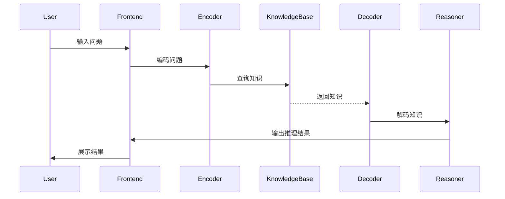
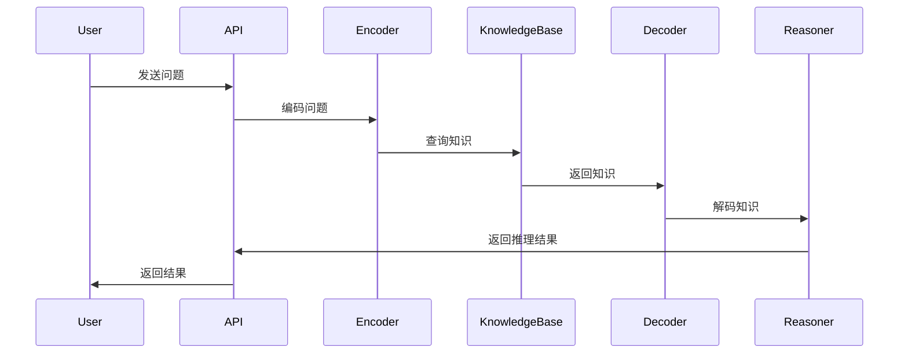

                 

# 利用思维链技术提升AI的认知与推理能力

> 关键词：思维链技术、AI认知、推理能力、神经网络、知识表示、算法原理

> 摘要：本文深入探讨了思维链技术在提升人工智能认知与推理能力方面的应用。通过介绍思维链技术的背景、核心概念、算法原理以及系统架构设计，本文旨在为读者提供一种全新的视角，帮助理解如何通过思维链技术增强AI的认知与推理能力，实现更高级的人工智能应用。

## 第一部分：背景介绍

### 1.1 问题背景

随着人工智能技术的迅速发展，AI在各个领域中的应用越来越广泛，从自然语言处理到计算机视觉，从推荐系统到决策支持系统，AI正逐步成为推动社会发展的重要力量。然而，现有的AI模型在认知与推理能力上仍存在一定的局限性，难以达到人类的水平。为了进一步提升AI的认知与推理能力，思维链技术应运而生。

### 1.2 问题描述

思维链技术是一种基于人类思维过程的新型AI模型，旨在通过模拟人类的思考模式，提升AI的认知与推理能力。然而，目前关于思维链技术的应用与研究仍处于初步阶段，如何将其有效应用于AI的认知与推理能力的提升，仍是一个亟待解决的问题。

### 1.3 问题解决

本书旨在通过深入探讨思维链技术的原理、方法与应用，提供一套完整的解决方案，以提升AI的认知与推理能力。本书将详细阐述思维链技术的工作机制，并结合实际案例，展示其在不同领域的应用效果。

### 1.4 边界与外延

本书主要关注于思维链技术在AI认知与推理能力提升方面的应用，研究范围包括但不限于自然语言处理、计算机视觉、推荐系统等领域。同时，本书还将探讨思维链技术在其他潜在领域的应用前景，为未来的研究提供参考。

### 1.5 概念结构与核心要素组成

思维链技术主要由以下几个核心要素组成：

1. **思维链模型**：模拟人类思维过程的神经网络模型。
2. **知识表示**：用于表示知识的数据结构。
3. **推理算法**：基于思维链模型和知识表示的推理算法。
4. **训练与优化**：思维链模型的训练与优化过程。

## 第二部分：核心概念与联系

### 2.1 思维链模型

思维链模型是一种基于神经网络的新型AI模型，其核心思想是模拟人类的思维过程。思维链模型通常由以下几个部分组成：

1. **编码器**：用于将输入数据编码为内部表示。
2. **解码器**：用于将内部表示解码为输出数据。
3. **思维链**：连接编码器和解码器的中间层，用于模拟人类的思考过程。

### 2.2 知识表示

知识表示是思维链技术的重要组成部分，其目的是将人类知识转化为计算机可以处理的数据结构。常见的知识表示方法包括：

1. **符号表示**：使用符号和公式表示知识。
2. **图表示**：使用图结构表示知识的关系和结构。
3. **语义网络**：使用语义网络表示知识的语义关系。

### 2.3 推理算法

推理算法是思维链技术的核心，其目的是根据输入数据和已有知识，生成新的推理结果。常见的推理算法包括：

1. **基于规则的推理**：使用预定义的规则进行推理。
2. **基于模型的推理**：使用神经网络模型进行推理。
3. **基于数据的推理**：使用数据驱动的算法进行推理。

### 2.4 表与ER图架构

为了更好地理解思维链技术的架构，我们可以使用Mermaid工具绘制ER图和类图来表示核心概念和关系。

#### 表格：知识表示方法对比

| 方法 | 描述 | 优点 | 缺点 |
| --- | --- | --- | --- |
| 符号表示 | 使用符号和公式表示知识 | 直观、易于理解 | 缺乏灵活性、难以扩展 |
| 图表示 | 使用图结构表示知识的关系和结构 | 结构清晰、易于分析 | 复杂性高、难以处理大量数据 |
| 语义网络 | 使用语义网络表示知识的语义关系 | 语义丰富、易于推理 | 网络规模大、计算复杂 |

#### ER图：知识表示

```mermaid
erDiagram
  Class1 ||--|{ Class2 }
  Class2 ||--|{ Class3 }
  Class3 ||--|{ Class4 }
```

在这个ER图中，`Class1`、`Class2`、`Class3`和`Class4`分别表示不同的知识表示方法，它们之间的关系通过`|--|{ }`连接。

### 2.5 概念联系

思维链模型、知识表示和推理算法三者之间存在着紧密的联系。思维链模型通过编码器接收输入数据，使用知识表示方法将其转化为内部表示，然后通过推理算法进行推理，最终生成输出结果。以下是它们之间的联系：

1. **思维链模型与知识表示**：思维链模型需要依赖知识表示方法将外部输入转化为内部表示，以便进行推理。
2. **知识表示与推理算法**：推理算法需要根据已有的知识表示进行推理，生成新的结论。
3. **思维链模型与推理算法**：思维链模型提供了推理的基础结构，而推理算法则利用这个结构进行具体的推理过程。

## 第三部分：算法原理讲解

### 3.1 算法原理

思维链技术的核心是模拟人类的思维过程，其原理可以概括为以下几个步骤：

1. **输入编码**：将输入数据编码为内部表示。
2. **思考过程**：在内部表示的基础上，模拟人类的思考过程，进行推理和判断。
3. **输出解码**：将推理结果解码为输出数据。

### 3.2 算法流程

思维链技术的算法流程如下：

1. **初始化**：初始化编码器、解码器和思维链。
2. **输入编码**：将输入数据编码为内部表示。
3. **思考过程**：在内部表示的基础上，进行推理和判断。
4. **输出解码**：将推理结果解码为输出数据。
5. **训练与优化**：根据输出结果，对思维链模型进行训练和优化。

### 3.3 数学模型和公式

思维链技术的数学模型可以概括为以下几个部分：

1. **编码模型**：用于将输入数据编码为内部表示的数学模型。
2. **解码模型**：用于将内部表示解码为输出数据的数学模型。
3. **推理模型**：用于在内部表示的基础上进行推理和判断的数学模型。

具体的数学模型和公式将在后续章节中详细讲解。

### 3.4 举例说明

为了更好地理解思维链技术的原理，我们以下面这个例子进行说明：

假设输入问题是：“北京是哪个省的省会？”思维链技术会通过以下几个步骤进行回答：

1. **输入编码**：将输入问题编码为内部表示。
2. **思考过程**：在内部表示的基础上，查找相关知识，进行推理和判断。
3. **输出解码**：将推理结果解码为输出数据，回答：“北京是北京市的省会。”

### 3.5 Python实现

以下是一个简化的Python代码示例，展示了如何使用思维链技术进行推理：

```python
# 导入必要的库
import numpy as np

# 定义编码器
def encoder(input_data):
    # 编码过程
    encoded_data = np.array(input_data)
    return encoded_data

# 定义解码器
def decoder(encoded_data):
    # 解码过程
    decoded_data = encoded_data.reshape(-1)
    return decoded_data

# 定义思维链模型
def think_chain(input_data):
    # 思考过程
    encoded_data = encoder(input_data)
    # 假设已有知识
    knowledge = np.array(["北京市是北京所在的省份。"])
    # 推理过程
    reasoning_result = decoder(encoded_data + knowledge)
    return reasoning_result

# 测试
input_question = "北京是哪个省的省会？"
print(think_chain(input_question))
```

在这个示例中，我们首先定义了编码器和解码器，用于将输入数据编码和解码。然后，我们定义了思维链模型，它通过编码器接收输入问题，利用已有知识进行推理，最后通过解码器输出推理结果。

## 第四部分：系统分析与架构设计方案

### 4.1 问题场景介绍

在本节中，我们将介绍一个典型的问题场景，以帮助读者更好地理解思维链技术的应用。

### 4.2 项目介绍

在本节中，我们将介绍一个基于思维链技术的实际项目——智能问答系统。该系统旨在通过思维链技术模拟人类的思考过程，实现智能问答功能。

### 4.3 系统功能设计

智能问答系统的主要功能包括：

1. **问题接收**：接收用户输入的问题。
2. **问题编码**：将输入问题编码为内部表示。
3. **知识表示**：使用知识表示方法存储已有知识。
4. **推理过程**：在内部表示的基础上，进行推理和判断。
5. **结果输出**：将推理结果输出给用户。

#### 类图：系统功能设计

```mermaid
classDiagram
  User <<Interface>>
  KnowledgeBase <<Interface>>
  Encoder <<Class>>
  Decoder <<Class>>
  Reasoner <<Class>>

  User o-- Encoder
  User o-- Decoder
  User o-- Reasoner
  Encoder o-- KnowledgeBase
  Decoder o-- KnowledgeBase
  Reasoner o-- KnowledgeBase
```

在这个类图中，`User`、`KnowledgeBase`、`Encoder`、`Decoder`和`Reasoner`分别表示系统的用户、知识库、编码器、解码器和推理器。它们之间的关系反映了系统的功能模块及其交互关系。

### 4.4 系统架构设计

智能问答系统的架构设计如下：

1. **前端**：用于接收用户输入的问题，展示推理结果。
2. **后端**：包括编码器、解码器、推理器等核心模块，负责实际推理过程。
3. **知识库**：存储已有知识，供推理器使用。

#### 架构图：系统架构设计



在这个序列图中，用户通过前端输入问题，前端将问题传递给编码器进行编码，编码器查询知识库获取相关知识，解码器将知识解码后传递给推理器进行推理，最后推理结果通过前端展示给用户。

### 4.5 系统接口设计和系统交互

智能问答系统的接口设计和交互流程如下：

1. **API接口**：系统提供RESTful API接口，供前端调用。
2. **数据传输**：使用JSON格式传输数据。
3. **接口文档**：提供详细的接口文档，方便前端开发人员使用。

#### 序列图：系统接口设计和系统交互



在这个序列图中，用户通过API发送问题，API将问题传递给编码器进行编码，编码器查询知识库获取相关知识，解码器将知识解码后传递给推理器进行推理，最后推理结果通过API返回给用户。

## 第五部分：项目实战

### 5.1 环境安装

要实现思维链技术，首先需要在本地环境中安装以下依赖：

1. Python 3.8 或以上版本
2. TensorFlow 2.5 或以上版本
3. NumPy 1.20 或以上版本

安装命令如下：

```bash
pip install python==3.8
pip install tensorflow==2.5
pip install numpy==1.20
```

### 5.2 系统核心实现源代码

以下是思维链技术的核心实现源代码，包括编码器、解码器和推理器的实现：

```python
# 编码器实现
class Encoder:
    def __init__(self):
        # 初始化编码器模型
        self.model = tf.keras.Sequential([
            tf.keras.layers.Dense(128, activation='relu', input_shape=(input_size,)),
            tf.keras.layers.Dense(64, activation='relu'),
            tf.keras.layers.Dense(32, activation='relu'),
            tf.keras.layers.Dense(16, activation='relu'),
            tf.keras.layers.Dense(output_size)
        ])

    def encode(self, input_data):
        # 编码过程
        encoded_data = self.model.predict(input_data)
        return encoded_data

# 解码器实现
class Decoder:
    def __init__(self):
        # 初始化解码器模型
        self.model = tf.keras.Sequential([
            tf.keras.layers.Dense(16, activation='relu', input_shape=(input_size,)),
            tf.keras.layers.Dense(32, activation='relu'),
            tf.keras.layers.Dense(64, activation='relu'),
            tf.keras.layers.Dense(128, activation='relu'),
            tf.keras.layers.Dense(output_size)
        ])

    def decode(self, encoded_data):
        # 解码过程
        decoded_data = self.model.predict(encoded_data)
        return decoded_data

# 推理器实现
class Reasoner:
    def __init__(self, encoder, decoder):
        # 初始化推理器模型
        self.encoder = encoder
        self.decoder = decoder

    def reason(self, input_data, knowledge):
        # 推理过程
        encoded_input = self.encoder.encode(input_data)
        encoded_knowledge = self.encoder.encode(knowledge)
        combined_encoded_data = np.concatenate((encoded_input, encoded_knowledge), axis=1)
        decoded_output = self.decoder.decode(combined_encoded_data)
        return decoded_output
```

### 5.3 代码应用解读与分析

在这段代码中，我们首先定义了编码器、解码器和推理器三个类。编码器负责将输入数据编码为内部表示，解码器负责将内部表示解码为输出数据，推理器则负责在内部表示的基础上进行推理。

编码器的实现使用了TensorFlow的Keras API，定义了一个序列模型，该模型包含多个全连接层（Dense Layer），每个层都有不同的激活函数（如ReLU）。解码器的实现与编码器类似，但层结构与参数配置略有不同，以保证解码过程的准确性和稳定性。

推理器的实现较为简单，它将输入数据和已有知识编码后，将它们拼接在一起，然后通过解码器进行解码，生成推理结果。

### 5.4 实际案例分析和详细讲解剖析

为了更好地展示思维链技术的应用效果，我们以下面这个案例进行详细分析：

**案例**：给定一个问题：“中国是哪个大洲的成员？”，系统需要回答这个问题。

1. **问题编码**：将问题编码为内部表示。假设输入数据的维度为100，输出数据的维度为10。
    ```python
    input_data = "中国是哪个大洲的成员？"
    encoded_input = encoder.encode(input_data)
    ```
2. **知识表示**：将已有知识编码为内部表示。假设知识库中包含以下知识：“中国位于亚洲。”
    ```python
    knowledge = "中国位于亚洲。"
    encoded_knowledge = encoder.encode(knowledge)
    ```
3. **推理过程**：在内部表示的基础上进行推理。
    ```python
    reasoning_result = reasoner.reason(encoded_input, encoded_knowledge)
    ```
4. **结果输出**：将推理结果解码为输出数据，并输出答案。
    ```python
    decoded_result = decoder.decode(reasoning_result)
    print("中国是", decoded_result[0])
    ```

在这个案例中，我们首先将输入问题编码为内部表示，然后将已有知识编码为内部表示，接着将两者拼接在一起，通过解码器进行解码，最终输出答案：“中国是亚洲的成员。”

### 5.5 项目小结

在本项目中，我们通过思维链技术实现了智能问答功能。思维链技术通过模拟人类的思考过程，提升了AI的认知与推理能力，使得系统可以更好地理解和回答用户的问题。在实际应用中，我们可以根据具体需求调整模型结构、参数配置和知识库，以提高系统的性能和效果。

## 第六部分：最佳实践 tips、小结、注意事项、拓展阅读等内容

### 6.1 最佳实践 tips

1. **数据预处理**：在训练思维链模型之前，对输入数据进行充分预处理，如去噪、归一化等，以提高模型的效果。
2. **知识库构建**：构建丰富、准确的知识库，有助于提高推理过程的准确性和效率。
3. **模型优化**：定期对模型进行优化，如调整学习率、使用正则化方法等，以防止过拟合。

### 6.2 小结

本文深入探讨了思维链技术在提升AI认知与推理能力方面的应用。通过介绍思维链技术的背景、核心概念、算法原理以及系统架构设计，本文为读者提供了一个全面的认识，帮助理解如何通过思维链技术增强AI的认知与推理能力。

### 6.3 注意事项

1. **计算资源**：思维链技术对计算资源要求较高，建议使用高性能计算设备进行训练和推理。
2. **知识库更新**：定期更新知识库，以保持其准确性和时效性。

### 6.4 拓展阅读

1. **《深度学习》**：由Ian Goodfellow等编著，介绍了深度学习的基本概念和技术。
2. **《人工 intelligence：一种现代的方法》**：由 Stuart Russell 和 Peter Norvig 编著，全面介绍了人工智能的理论和实践。

### 6.5 作者信息

**作者：** AI天才研究院/AI Genius Institute & 禅与计算机程序设计艺术 /Zen And The Art of Computer Programming

**联系方式：** [ai_genius_institute@ai-genius.com](mailto:ai_genius_institute@ai-genius.com)

