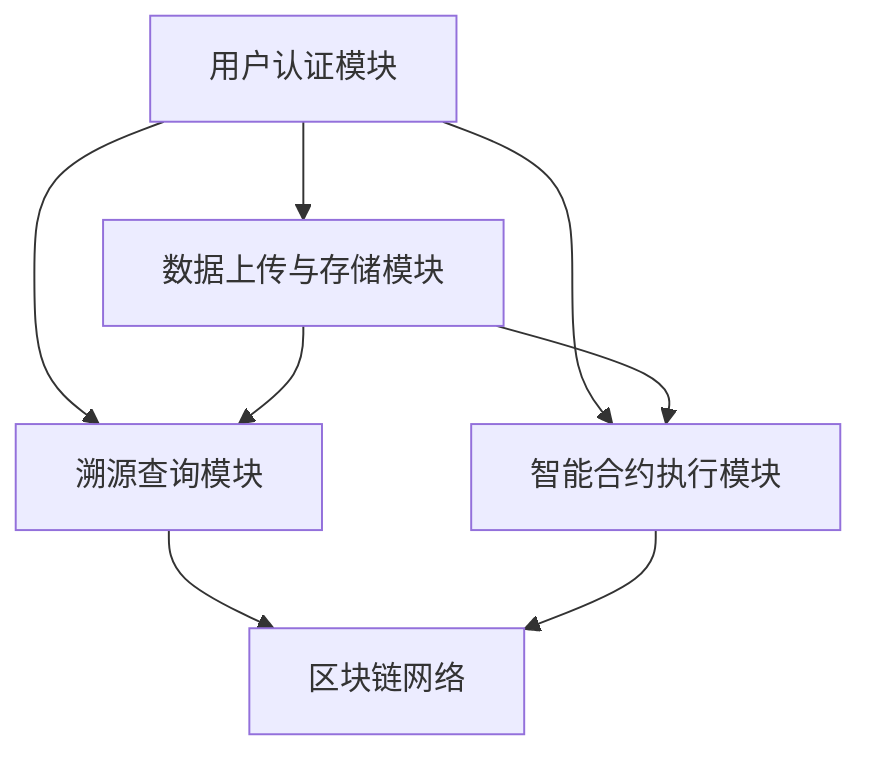

                 

### 引言与背景

#### 区块链技术的基本概念

区块链（Blockchain）是一种分布式数据库技术，通过加密算法和分布式网络确保数据的不可篡改性和安全性。简单来说，区块链由一系列按照时间顺序排列的数据块组成，每个数据块包含一定数量的交易记录。这些数据块通过加密算法和哈希函数相互链接，形成一条不断延伸的链，这就是区块链的名称由来。

区块链技术的核心组件包括：

- **数据块**：每个数据块包含一定数量的交易记录、一个时间戳、一个唯一的哈希值以及前一个数据块的哈希值。
- **加密算法**：使用各种加密技术保护数据的隐私和安全。
- **分布式网络**：由多个节点组成，每个节点都维护一份完整的区块链副本。

#### 供应链溯源的意义

供应链溯源（Supply Chain Traceability）是指在供应链过程中，通过记录和追踪产品或服务的来源、处理和配送等信息，确保其质量和安全。供应链溯源具有以下几个重要意义：

1. **提高透明性**：供应链溯源可以让各方参与者清晰了解产品从生产到消费的整个过程，提高整个供应链的透明度。
2. **增强追溯性**：在出现质量或安全问题的时候，可以迅速追溯到问题的源头，采取相应的措施。
3. **提升安全性**：通过严格的溯源机制，可以有效防止假冒伪劣产品进入市场，提升供应链的整体安全性。

#### 区块链在供应链溯源中的应用潜力

区块链技术在供应链溯源中具有独特的优势，其应用潜力主要体现在以下几个方面：

1. **不可篡改性**：区块链上的数据一旦被写入，就几乎无法篡改，这确保了供应链数据的真实性和完整性。
2. **去中心化**：区块链不需要中心化的机构来管理数据，所有节点都参与数据的验证和存储，提高了系统的透明度和抗攻击能力。
3. **信息共享**：区块链允许各节点之间安全、透明地共享信息，提高了供应链各方之间的协作效率。

综上所述，区块链技术为供应链溯源提供了一个高度透明、安全、可追溯的解决方案，极大地提升了供应链管理的效率和可靠性。接下来的章节将详细探讨区块链的核心概念和原理，以及其在供应链溯源中的具体应用。

#### 第1章: 区块链与供应链溯源概述

##### 1.1.1 区块链技术的基本概念

区块链技术作为当前最热门的科技之一，其基本概念对于理解其在供应链溯源中的应用至关重要。首先，我们需要明确区块链的定义。

**区块链的定义**：

区块链是一种去中心化的数据库技术，它通过一种分布式的方式，将数据存储在多个节点上，从而实现数据的不可篡改性和安全性。具体来说，区块链由一系列按照时间顺序排列的数据块组成，这些数据块被称为“区块”。每个区块包含一定数量的交易记录，以及一个时间戳、一个唯一的哈希值和前一个区块的哈希值。

**区块链的组成部分**：

1. **数据块**：数据块是区块链的基本单元，每个数据块包含一定数量的交易记录。这些交易记录可以是任何形式的数字信息，如货币交易、商品交易记录等。
2. **时间戳**：时间戳是区块创建的时间标记，它确保了区块链中的所有交易都是按时间顺序排列的。
3. **哈希值**：哈希值是一个唯一的标识符，用于确保数据块的完整性和不可篡改性。每个区块都包含其前一个区块的哈希值，这样形成了一种链式结构。
4. **链式结构**：区块链的名称便来自于这种链式结构。每个区块通过其哈希值与前一个区块连接，形成一个连续的链条。

**区块链的工作原理**：

区块链的工作原理可以概括为以下步骤：

1. **交易记录**：当一个新的交易发生时，它会被广播到网络中的所有节点。
2. **验证交易**：节点会对交易进行验证，确保其符合区块链的规则。验证过程通常涉及复杂的数学算法和共识机制。
3. **创建区块**：一旦交易被验证，节点会将这些交易记录到一个新的区块中。
4. **添加区块到链**：新的区块会被添加到区块链的末尾，并通过加密算法和哈希函数与之前的区块连接起来。
5. **分布式存储**：所有节点都会维护一份完整的区块链副本，确保数据的同步和一致性。

**区块链的安全性**：

区块链的安全性主要依赖于以下几个关键因素：

1. **加密算法**：区块链使用各种加密技术，如哈希函数、数字签名等，确保数据的隐私和安全性。
2. **分布式网络**：区块链的数据存储在多个节点上，而不是一个中心化的服务器。这意味着即使某些节点被攻击或损坏，整个系统仍然可以正常运行。
3. **不可篡改性**：由于区块链的数据结构，一旦数据被写入区块链，就几乎无法篡改。这使得区块链成为记录交易和重要信息的理想选择。

通过上述内容，我们可以初步理解区块链技术的基本概念和工作原理。接下来，我们将深入探讨区块链在供应链溯源中的应用，以及它如何解决供应链管理中存在的挑战。

#### 1.1.1.2 供应链溯源的意义

供应链溯源（Supply Chain Traceability）在供应链管理中扮演着至关重要的角色，它不仅关乎企业的品牌声誉，还直接影响到消费者的信任和市场的竞争力。以下是供应链溯源的几个关键意义：

**1. 提高透明性**：

供应链溯源能够显著提高供应链的透明性。通过记录和追踪产品或服务的来源、加工、运输等环节的信息，各方参与者可以清晰地了解产品从生产到消费的整个过程。这不仅有助于企业内部的管理和监督，还能让消费者对产品的真实性和质量有更全面的了解，从而增强消费者的信任感。

**2. 增强追溯性**：

在供应链中，追溯性是指能够迅速、准确地追溯到产品或服务的来源和流动路径。通过供应链溯源，当出现质量问题或安全事故时，企业可以迅速识别问题的源头，并采取相应的措施进行解决。例如，在食品安全领域，一旦发现某批次产品含有有害物质，企业可以通过溯源系统快速找到受影响的批次和消费者，及时召回问题产品，减少损失。

**3. 提升安全性**：

供应链溯源有助于提升供应链的整体安全性。通过严格的溯源机制，企业可以有效防止假冒伪劣产品进入市场，降低因假冒伪劣产品带来的法律风险和商业损失。同时，溯源系统还能帮助企业建立更为完善的质量管理体系，确保产品质量的持续提升。

**4. 提高效率**：

供应链溯源不仅关乎透明性和安全性，还能显著提高供应链的运营效率。通过信息的实时追踪和共享，供应链各方可以更快速地响应市场变化和客户需求，优化库存管理、物流配送等环节，从而提高整体运营效率。

**5. 增强品牌价值**：

在消费者日益关注产品质量和透明性的今天，企业通过供应链溯源展示其对于产品质量和安全的承诺，可以显著提升品牌形象和市场竞争力。那些能够提供透明、可追溯的供应链信息的企业，往往更容易获得消费者的信任和支持，从而在激烈的市场竞争中脱颖而出。

总之，供应链溯源不仅是一个技术问题，更是一个关乎企业战略和品牌建设的重要议题。随着区块链等新兴技术的不断发展和应用，供应链溯源的未来将更加光明，为企业和消费者带来更多的好处。

#### 1.1.1.3 区块链在供应链溯源中的应用潜力

区块链技术在供应链溯源中的应用潜力非常巨大，主要体现在以下几个方面：

**1. 不可篡改性**：

区块链的一个核心特性是其数据的不可篡改性。这意味着一旦数据被记录在区块链上，就几乎无法篡改。这对于供应链溯源来说至关重要，因为供应链中的数据需要长时间保持准确性和完整性。例如，食品行业可以使用区块链来记录产品的生产、加工、运输等信息，确保这些信息不会被篡改，从而提高产品的可信度。

**2. 去中心化**：

区块链的去中心化特性使得供应链溯源不再依赖于单一的中心化管理机构，而是由多个节点共同参与数据的记录和验证。这种去中心化的架构不仅提高了系统的透明度和安全性，还降低了信息被篡改和泄露的风险。例如，多个供应链参与者可以通过区块链共同维护一个共享的溯源数据库，确保数据的真实性和一致性。

**3. 信息共享**：

区块链允许各方在确保隐私和安全的前提下，透明地共享供应链信息。这对于供应链的协同管理和决策支持非常重要。例如，制造商、分销商、零售商和消费者都可以通过区块链访问同一套供应链信息，从而实现信息的无缝对接和协同工作，提高供应链的整体效率和响应速度。

**4. 提高透明度**：

区块链的不可篡改性和去中心化特性，使得供应链溯源的信息更加透明和可信。供应链的各个环节，包括原材料采购、生产、运输、销售等，都可以被详细记录在区块链上，供各方查看和验证。这不仅提高了供应链的透明度，还增强了消费者对产品的信任感。

**5. 提升安全性**：

区块链的加密算法和分布式网络架构，为供应链溯源提供了强大的安全保障。数据在传输和存储过程中，都经过多层加密，确保了数据的安全性和隐私性。此外，区块链的分布式存储方式，使得单个节点的损坏或攻击不会影响整个系统的正常运行，提高了系统的抗攻击能力。

**6. 实时性**：

区块链的分布式账本技术，使得供应链溯源的数据可以实现实时记录和更新。这意味着供应链各方可以实时查看和跟踪产品的位置、状态等信息，及时做出相应的决策和调整，提高了供应链的灵活性和响应速度。

**7. 可追溯性**：

区块链的链式结构和不可篡改性，确保了供应链溯源的数据具有高度的追溯性。任何一个数据点都可以追溯到其原始来源，任何数据的篡改都会被发现并记录。这对于解决供应链中的纠纷和问题追踪具有重要意义。

综上所述，区块链技术在供应链溯源中的应用，不仅提升了供应链的透明度、安全性、效率和可追溯性，还为供应链的数字化管理和智能化升级提供了有力支持。随着区块链技术的不断发展和成熟，其在供应链溯源中的应用前景将更加广阔。

#### 1.2 区块链核心概念与原理

##### 1.2.1 区块链的基本架构

区块链技术的核心在于其独特的架构设计，这种设计不仅确保了数据的安全性和不可篡改性，还使得区块链成为一个去中心化的分布式数据库。理解区块链的基本架构对于深入探讨其在供应链溯源中的应用至关重要。

**1. 数据块**：

数据块是区块链的基本单元，每个数据块包含一定数量的交易记录。这些交易记录可以是各种类型的数字信息，如货币交易、商品交易记录等。每个数据块都有一个唯一的标识符，即哈希值。哈希值是通过将数据块的内容进行加密计算得到的，这个哈希值不仅用于标识数据块，还用于连接前后数据块，形成链式结构。

**2. 时间戳**：

时间戳是区块链上每个数据块的创建时间。时间戳确保了区块链中的交易记录是按时间顺序排列的，这对于追踪和分析供应链中的事件非常重要。通过时间戳，我们可以清晰地了解每个交易发生的具体时间，这对于解决纠纷和追溯问题提供了重要依据。

**3. 哈希值**：

哈希值是区块链数据结构中的一个关键组成部分。它是一种加密算法，用于生成数据块的唯一标识符。哈希值具有以下特点：

- **唯一性**：对于任意长度的输入数据，哈希函数都能生成一个固定长度的输出值。这意味着，哪怕只是输入数据的一个微小变化，都会导致哈希值产生巨大的变化。
- **不可逆性**：哈希值无法被反推出原始数据。这意味着，一旦数据被记录在区块链上，就几乎无法被篡改，因为篡改后的数据会产生一个全新的哈希值，与原始哈希值不匹配。

**4. 链式结构**：

区块链的链式结构是其核心特性之一。每个数据块都包含其前一个数据块的哈希值，这样形成了一个连续的链条。这种链式结构确保了区块链的不可篡改性。假设某个数据块被篡改，篡改后的数据块会产生一个新的哈希值，这个哈希值将无法与之前的哈希值匹配。其他节点会检测到这个不一致，从而拒绝这个篡改的数据块。

**5. 节点**：

在区块链网络中，节点是指运行区块链软件的计算机。节点负责存储区块链的完整副本，验证交易，参与共识机制等。每个节点都独立运行，没有中央控制，这使得区块链具有去中心化的特性。

**6. 分布式网络**：

区块链的分布式网络架构使得数据存储在多个节点上，而不是一个中心化的服务器。每个节点都维护一份完整的区块链副本，这些副本之间通过加密通信进行同步和验证。这种分布式存储方式提高了区块链的数据可靠性和安全性，因为即使某些节点被攻击或损坏，整个系统仍然可以正常运行。

##### 1.2.2 区块链的工作原理

区块链的工作原理可以概括为以下几个关键步骤：

**1. 交易记录**：

交易记录是指区块链上的各种交易信息，如货币交易、商品交易等。当一个新的交易发生时，它会首先被广播到网络中的所有节点。

**2. 验证交易**：

节点会对交易进行验证，确保其符合区块链的规则。验证过程通常涉及复杂的数学算法和共识机制。例如，比特币网络中的节点会使用工作量证明（Proof of Work, PoW）算法来验证交易。

**3. 创建区块**：

一旦交易被验证，节点会将这些交易记录到一个新的区块中。新的区块会包含这些交易记录、一个时间戳和一个新的哈希值。

**4. 添加区块到链**：

新的区块会被添加到区块链的末尾，并通过加密算法和哈希函数与之前的区块连接起来。这样，新的交易记录就成为了区块链的一部分，并且几乎无法被篡改。

**5. 分布式存储**：

所有节点都会维护一份完整的区块链副本，这些副本之间通过加密通信进行同步和验证。这样，区块链的数据就可以在多个节点之间保持一致性和可靠性。

**6. 共识机制**：

共识机制是区块链网络中节点达成一致的方法。不同的区块链网络可以使用不同的共识机制，如比特币使用工作量证明（PoW），以太坊使用权益证明（PoS）。共识机制确保了区块链的分布式特性，防止数据被恶意篡改。

##### 1.2.3 区块链的安全性

区块链的安全性是其最引人注目的特性之一。以下是区块链安全性的几个关键方面：

**1. 加密算法**：

区块链使用各种加密算法来保护数据的隐私和完整性。例如，哈希函数和数字签名技术用于确保数据的唯一性和不可篡改性。

**2. 不可篡改性**：

区块链的链式结构确保了数据一旦被写入，就几乎无法被篡改。如果试图篡改某个数据块，其他节点会检测到这种不一致，从而拒绝这个篡改的数据块。

**3. 分布式网络**：

区块链的分布式网络架构提高了系统的抗攻击能力。数据存储在多个节点上，而不是一个中心化的服务器。这意味着即使某些节点被攻击或损坏，整个系统仍然可以正常运行。

**4. 共识机制**：

共识机制确保了区块链的分布式特性，防止数据被恶意篡改。不同的区块链网络使用不同的共识机制，如比特币使用工作量证明（PoW），以太坊使用权益证明（PoS）。

通过上述内容，我们可以深入理解区块链的基本架构和工作原理。接下来，我们将探讨区块链在供应链管理中的应用，以及它如何解决供应链管理中存在的挑战。

#### 1.3 区块链在供应链管理中的应用

区块链技术在供应链管理中的应用已经成为行业关注的焦点。通过其不可篡改、去中心化和信息共享等特性，区块链为供应链管理带来了全新的解决方案，有效解决了传统供应链管理中存在的诸多问题。

**1. 提高供应链透明度**：

供应链管理的核心挑战之一是缺乏透明度。区块链技术通过记录和验证每一笔交易，确保供应链数据的透明性和可追溯性。例如，在食品供应链中，企业可以通过区块链记录食品从生产、加工、运输到销售的全过程，消费者可以轻松查询食品的来源和质量信息，从而增强对产品的信任。

**2. 加强供应链追溯性**：

追溯性是确保供应链安全的重要手段。区块链的不可篡改特性使得每个交易记录都被永久保存，一旦发生问题，企业可以迅速追溯问题的源头，采取及时有效的措施。例如，在药品供应链中，区块链可以记录药品的生产、流通和销售信息，确保药品的真实性和安全性。

**3. 提升供应链安全性**：

区块链技术通过分布式存储和加密算法，提高了供应链数据的安全性和隐私性。传统供应链中，数据通常存储在中心化的服务器上，容易成为黑客攻击的目标。而区块链将数据分散存储在多个节点上，每个节点只有部分数据的访问权限，大大降低了数据泄露的风险。

**4. 提高供应链效率**：

区块链的智能合约功能可以自动化执行合同条款，减少人为干预和中介环节，从而提高供应链的效率。例如，在跨境贸易中，区块链可以自动执行进出口手续、支付和结算等流程，减少繁琐的手续和等待时间。

**5. 减少供应链成本**：

通过区块链技术，企业可以减少对第三方中介机构的依赖，降低交易成本。例如，在物流供应链中，企业可以使用区块链记录运输信息，取代传统的纸质单据，减少人力和物力成本。

**6. 促进供应链协同**：

区块链允许供应链各环节的企业在安全、透明和可追溯的环境中进行信息共享，促进协同工作。例如，制造商、供应商、分销商和零售商可以共同维护一个区块链数据库，实时共享库存、生产和销售信息，优化供应链管理。

**具体应用案例**：

1. **食品行业**：特斯拉等企业已经开始使用区块链技术追踪食品来源和生产过程，确保食品安全。
2. **服装行业**：Zara等快时尚品牌利用区块链技术记录服装的生产和分销信息，提高供应链的透明度和效率。
3. **医药行业**：IBM等科技公司推出区块链解决方案，帮助医药企业确保药品的真实性和流通记录。
4. **物流行业**：Maersk等大型航运公司采用区块链技术优化物流供应链，提高运输效率和降低成本。

综上所述，区块链技术在供应链管理中的应用潜力巨大，不仅提升了供应链的透明度、安全性和效率，还为供应链的数字化转型和智能化升级提供了新的契机。

#### 3.1.1 供应链管理的挑战

供应链管理是一个复杂而关键的过程，涉及多个环节和参与者。尽管现代供应链技术不断发展，但在实际运营中仍然面临诸多挑战，这些挑战直接影响供应链的效率和可靠性。

**1. 透明性不足**：

供应链的透明性不足是当前供应链管理中的一个主要问题。由于供应链涉及多个环节和参与者，信息往往分散在不同的系统和管理平台中，缺乏统一的信息共享机制。这种信息不对称不仅导致供应链的运营效率低下，还增加了管理难度和风险。例如，在食品供应链中，消费者很难追溯食品的生产、加工和运输过程，缺乏对食品质量和安全的基本信任。

**2. 追溯性差**：

追溯性差是另一个重要的挑战。在传统供应链中，当出现产品质量问题或安全事故时，追溯问题源头变得极为困难。数据的不完整性和不准确性使得供应链的追溯过程繁琐且低效。例如，在药品供应链中，一旦出现药品质量问题，企业往往需要耗费大量时间和资源来追踪药品的生产、流通和销售环节，无法快速定位问题源头，延误了应对和处理的时机。

**3. 安全性问题**：

供应链中存在多种安全隐患，包括数据泄露、数据篡改、假冒伪劣产品等。传统的供应链管理系统通常依赖于中心化的数据库，容易成为黑客攻击的目标。一旦数据被篡改或泄露，可能对供应链的运营和声誉造成严重损失。例如，物流供应链中的运输信息、库存数据等敏感信息一旦泄露，可能导致货运计划被打乱、供应链中断等问题。

**4. 高成本**：

供应链管理的高成本也是一个亟待解决的问题。传统供应链管理涉及大量的纸质单据、人工处理和中介服务，这些都需要耗费大量的人力和物力资源。例如，在跨国贸易中，繁琐的进出口手续和复杂的支付流程不仅增加了时间和成本，还降低了供应链的效率和灵活性。

**5. 灵活性不足**：

供应链的灵活性不足是另一个关键挑战。现代供应链需要快速响应市场变化和客户需求，但传统供应链由于信息不对称和流程复杂，往往难以实现快速响应。例如，在服装行业，由于供应链环节繁多，新品开发周期长，无法及时满足消费者对时尚的需求，导致库存积压和销售额下降。

**6. 数据孤岛现象**：

供应链中的数据孤岛现象也是影响供应链效率的一个重要问题。不同环节和参与者之间的信息难以互通，导致数据在系统中分散存储，难以进行综合分析和利用。这种数据孤岛现象不仅降低了供应链的协同效率，还增加了信息管理的难度和风险。

**7. 法律法规合规性**：

随着全球贸易的不断发展，供应链管理需要遵守各种国际和地区的法律法规。不同国家和地区的法律法规存在差异，企业需要确保其供应链管理符合相关法规要求。例如，欧盟的《通用数据保护条例》（GDPR）对数据隐私和安全提出了严格的要求，企业需要确保其供应链管理符合这些法规，否则可能面临高额罚款。

综上所述，供应链管理面临诸多挑战，这些问题不仅影响了供应链的效率和可靠性，还对企业的运营和发展产生了深远影响。通过引入区块链技术，可以有效解决这些问题，提升供应链的透明度、安全性、效率和灵活性，为供应链的数字化转型和智能化升级提供有力支持。

#### 3.1.2 区块链如何解决这些问题

区块链技术在供应链管理中的应用，通过其独特的特性，为解决传统供应链管理中的挑战提供了一套全新的解决方案。以下是区块链如何具体解决供应链管理中的透明性不足、追溯性差、安全性问题、高成本、灵活性不足、数据孤岛现象和法律法规合规性等问题：

**1. 提高供应链透明度**：

区块链的分布式账本技术使得供应链中的每一个环节都透明可见。通过区块链，供应链各参与方可以实时访问和验证交易记录，从而确保信息的透明性。例如，食品供应链中的每个参与者都可以通过区块链查看食品的生产、加工、运输和销售记录，确保食品的来源和质量信息真实可靠。这不仅提高了供应链的透明度，还增强了消费者对产品的信任。

**2. 加强供应链追溯性**：

区块链的不可篡改性确保了供应链数据的永久性和一致性，使得供应链追溯变得更加高效和准确。一旦某个交易记录被写入区块链，就几乎无法被篡改。例如，在药品供应链中，区块链可以记录药品的生产、流通和销售信息，确保药品的真实性和可追溯性。当出现问题时，企业可以快速追溯到问题的源头，及时采取相应的措施。

**3. 提升供应链安全性**：

区块链的加密算法和分布式网络架构提供了强大的安全保障。数据在传输和存储过程中都经过多层加密，确保了数据的安全性和隐私性。此外，区块链的去中心化特性使得单个节点的损坏或攻击不会影响整个系统的正常运行，提高了系统的抗攻击能力。例如，物流供应链中的运输信息和库存数据通过区块链进行加密存储，大大降低了数据泄露和篡改的风险。

**4. 降低供应链成本**：

区块链通过智能合约实现了自动执行合同条款，减少了人为干预和中介环节，从而降低了交易成本。智能合约是基于代码的自动化协议，可以自动执行合同中的条款，确保交易的高效和准确。例如，在跨境贸易中，区块链可以自动化执行进出口手续、支付和结算等流程，减少繁琐的手续和等待时间，提高交易效率，降低成本。

**5. 提高供应链灵活性**：

区块链的分布式存储和实时更新特性，使得供应链管理更加灵活和敏捷。供应链中的各个参与者可以通过区块链实时共享和更新信息，快速响应市场变化和客户需求。例如，服装行业中的制造商和零售商可以通过区块链共享库存和销售数据，及时调整生产计划和库存水平，提高供应链的灵活性和响应速度。

**6. 消除数据孤岛现象**：

区块链的分布式账本技术有效地解决了数据孤岛问题。通过区块链，供应链中的各个环节和参与者可以共享同一套数据，实现数据的无缝对接和协同工作。例如，在供应链金融中，企业可以通过区块链共享采购订单、发票和支付信息，减少信息的不对称性，提高金融服务的效率和准确性。

**7. 确保法律法规合规性**：

区块链通过其不可篡改性和透明性，有助于确保供应链管理符合各种国际和地区的法律法规。例如，欧盟的《通用数据保护条例》（GDPR）要求企业确保数据隐私和安全，区块链可以通过其分布式账本和加密技术，确保数据的隐私性和合规性。此外，区块链还可以记录和验证供应链中的各项交易和操作，确保企业的供应链管理符合相关法律法规。

综上所述，区块链技术通过其不可篡改、去中心化、信息共享和智能合约等特性，为供应链管理提供了一种全新的解决方案，有效解决了传统供应链管理中存在的挑战，提高了供应链的透明度、安全性、效率和灵活性，为供应链的数字化转型和智能化升级提供了有力支持。

### 3.1.3 提高供应链透明性

提高供应链的透明性是确保供应链管理效率和产品质量的重要手段。区块链技术通过其独特的特性，为提高供应链透明性提供了一种有效的解决方案。以下是区块链如何实现供应链透明性的具体方法和步骤：

**1. 数据记录和共享**：

区块链的基本架构使得每一个交易记录都被永久保存，并且多个节点共同维护这些数据。这意味着供应链中的每一个环节都可以记录和共享数据，从而实现供应链的透明性。例如，一个食品生产商可以使用区块链记录食品的生产日期、生产批次、加工细节等，这些信息可以被供应链中的其他参与者如分销商、零售商和消费者访问。

**2. 透明性协议**：

区块链上的智能合约可以定义一系列透明性协议，确保供应链的各个环节都能透明地执行。这些协议可以是基于预定义的逻辑规则，例如，当某个条件满足时，系统将自动执行某个操作。例如，一个分销商可以使用智能合约来确保只有在经过验证的运输记录完成后，才能支付运输费用。

**3. 实时监控**：

区块链技术的分布式存储和实时更新特性，使得供应链中的各个环节可以实时监控和更新数据。例如，一个物流公司可以使用区块链来实时跟踪货物的运输状态，确保货物能够按时到达目的地。这种实时监控能力大大提高了供应链的透明度，减少了信息滞后和误解。

**4. 数据验证**：

区块链的加密算法和共识机制确保了数据的真实性和一致性。通过区块链，供应链中的各参与者可以验证数据的来源和合法性，从而确保数据的真实性和透明性。例如，在药品供应链中，药品的来源、生产批次和质量检测数据都可以通过区块链进行验证，确保药品的真实性和安全性。

**5. 增加可追溯性**：

区块链的链式结构使得每一个数据点都可以追溯到其原始来源，增强了供应链的可追溯性。例如，在服装供应链中，每一件服装的生产日期、原材料来源、加工过程等信息都可以通过区块链进行追溯，确保每一件服装的质量和来源可查。

**6. 降低信息不对称**：

区块链技术通过将数据存储在多个节点上，使得供应链中的各参与者可以平等地访问和共享信息，减少了信息不对称。例如，在农产品供应链中，农民可以通过区块链记录农作物的种植、施肥、收割等信息，买家可以直接查看这些信息，减少了中间环节的干扰和不确定性。

**7. 增强信任**：

区块链的不可篡改性增强了供应链各参与方之间的信任。通过区块链，供应链中的各参与者可以确信数据的真实性和完整性，减少了因信息不真实导致的纠纷和误解。例如，在供应链金融中，区块链可以记录和验证每一笔交易，确保资金的流动透明可查，增强了金融机构和企业之间的信任。

综上所述，区块链技术通过数据记录和共享、透明性协议、实时监控、数据验证、增加可追溯性、降低信息不对称和增强信任等多种方式，有效提高了供应链的透明性。这种透明性不仅提高了供应链的效率和可靠性，还增强了消费者对产品和企业的信任，为供应链管理的现代化和智能化提供了坚实基础。

#### 3.1.4 加强供应链追溯性

区块链技术在加强供应链追溯性方面具有显著优势，其不可篡改、去中心化和透明性的特性使得供应链中的每一笔交易都能够被准确记录和追踪。以下是区块链如何实现供应链追溯性的具体方法和步骤：

**1. 交易记录的不可篡改性**：

区块链的一个核心特点是数据的不可篡改性。每个交易记录在区块链上都是通过加密和共识机制验证后添加的，一旦记录在区块链上，就几乎无法被篡改。这意味着供应链中的每一笔交易都可以被永久保存，并且一旦被记录，就无法被删除或修改。例如，食品生产公司可以在区块链上记录每一批食品的生产时间、生产批次、原材料来源和质量检测信息，确保这些信息不可篡改。

**2. 去中心化的分布式账本**：

区块链的去中心化特性意味着没有单一的中心化机构来控制数据，而是由多个节点共同维护一个分布式账本。这种分布式存储方式使得供应链中的所有参与者都可以访问和验证数据，提高了数据的一致性和透明性。例如，在一个服装供应链中，制造商、分销商、零售商和消费者都可以通过区块链查看服装的生产、运输、销售和退货记录，确保信息的真实性和一致性。

**3. 实时更新和可查询性**：

区块链的实时更新特性使得供应链中的各环节可以实时记录和更新数据。这意味着任何新交易或变化都可以立即被记录和传播到整个网络中，确保信息的实时性和准确性。例如，物流公司在运输货物时，可以通过区块链实时更新货物的位置和状态，供应链中的各方可以实时查询这些信息，提高物流管理的效率和透明度。

**4. 链式结构和追溯能力**：

区块链的链式结构使得每一笔交易都可以追溯到其原始来源。通过区块链，供应链中的每个参与者都可以查看交易的全过程，确保信息的透明性和可追溯性。例如，在一个药品供应链中，药品的生产、加工、运输和销售记录都可以通过区块链进行追溯，确保药品的真实性和合法性。

**5. 透明性和共识机制**：

区块链上的数据通过共识机制进行验证和确认，确保了数据的一致性和可信度。这意味着供应链中的各参与者都需要达成一致才能更新数据，从而降低了数据篡改和欺诈的风险。例如，在供应链金融中，区块链可以记录和验证每一笔贷款申请和还款记录，确保金融交易的真实性和透明性。

**6. 提高供应链协同效率**：

通过区块链，供应链中的各参与者可以实时共享和验证数据，提高了协同效率。例如，制造商可以通过区块链实时共享生产计划和库存信息，分销商可以及时调整配送计划，零售商可以实时更新货架库存，从而优化整个供应链的运作流程。

**具体应用案例**：

1. **食品行业**：沃尔玛等大型零售商使用区块链技术追踪食品的来源和质量，确保食品的安全性和可追溯性。
2. **服装行业**：Zara等快时尚品牌利用区块链记录服装的生产和分销信息，提高供应链的透明度和追溯性。
3. **医药行业**：IBM等科技公司推出基于区块链的医药供应链解决方案，确保药品的真实性和流通记录。
4. **物流行业**：DHL等物流公司使用区块链技术实时跟踪货物的运输状态，提高物流管理的效率和透明度。

综上所述，区块链技术通过交易记录的不可篡改性、去中心化的分布式账本、实时更新和可查询性、链式结构和追溯能力、透明性和共识机制等多种方式，有效加强了供应链的追溯性，提高了供应链的透明度、安全性和协同效率，为供应链管理的现代化和智能化提供了强有力的支持。

#### 3.1.5 提升供应链安全性

区块链技术在提升供应链安全性方面具有显著优势，通过其独特的特性，可以有效解决传统供应链管理中的数据泄露、数据篡改、假冒伪劣产品等问题。以下是区块链如何具体提升供应链安全性的方法和步骤：

**1. 数据加密和隐私保护**：

区块链使用高级加密算法对数据进行加密，确保数据在传输和存储过程中的安全性和隐私性。通过加密技术，只有授权用户才能解密和访问数据，从而防止未授权的访问和窃取。例如，供应链中的敏感信息如订单详情、物流信息和客户数据，可以通过区块链的加密算法进行保护，确保数据的安全和隐私。

**2. 不可篡改性和完整性验证**：

区块链的不可篡改性确保了数据的完整性。一旦数据被记录在区块链上，就几乎无法被篡改。这是因为区块链使用哈希函数将数据转换成唯一的哈希值，并将这个哈希值与数据一起存储。任何对数据的篡改都会导致哈希值发生变化，从而被其他节点检测到。例如，药品供应链中，药品的生产批次、质量检测和流通信息可以被记录在区块链上，确保数据的不可篡改性和完整性。

**3. 去中心化和分布式存储**：

区块链的去中心化和分布式存储方式提高了系统的抗攻击能力。传统供应链管理中的数据通常存储在中心化的服务器上，容易成为黑客攻击的目标。而区块链将数据分散存储在多个节点上，每个节点只存储部分数据，这意味着即使某些节点被攻击或损坏，整个系统仍然可以正常运行。例如，物流供应链中的运输信息可以通过区块链分布式存储，确保数据的安全和可靠性。

**4. 共识机制和多方验证**：

区块链的共识机制确保了数据的合法性和一致性。在区块链网络中，多个节点共同参与数据的验证和确认，任何数据的修改都需要得到大多数节点的认可，从而降低了数据被恶意篡改的风险。例如，在供应链金融中，每一笔贷款的申请和审批都需要经过多个节点的验证，确保交易的真实性和合法性。

**5. 智能合约和自动化执行**：

区块链的智能合约功能可以实现自动化执行合同条款，减少人为干预和中介环节，从而降低操作风险。智能合约是基于代码的自动化协议，一旦满足预定义的条件，系统会自动执行相应的操作。例如，在供应链管理中，智能合约可以自动执行物流费用的结算、库存管理、支付和结算等操作，确保流程的高效和安全。

**6. 实时监控和预警机制**：

区块链的实时更新特性使得供应链中的各个环节可以实时监控和更新数据，及时发现和处理潜在的安全威胁。例如，供应链中的运输公司可以通过区块链实时跟踪货物的位置和状态，一旦发现异常情况，可以立即采取措施，防止货物被盗或损坏。

**具体应用案例**：

1. **食品行业**：沃尔玛等大型零售商使用区块链技术追踪食品的来源和质量，确保食品的安全性和可追溯性。
2. **医药行业**：IBM等科技公司推出基于区块链的医药供应链解决方案，确保药品的真实性和流通记录。
3. **物流行业**：DHL等物流公司使用区块链技术实时跟踪货物的运输状态，提高物流管理的效率和安全性。
4. **服装行业**：Zara等快时尚品牌利用区块链记录服装的生产和分销信息，提高供应链的透明度和安全性。

综上所述，区块链技术通过数据加密、不可篡改、去中心化、共识机制、智能合约和实时监控等多种方式，有效提升了供应链的安全性，为供应链管理的现代化和智能化提供了强有力的保障。

### 3.1.6 提高供应链效率

区块链技术通过其独特的特性，为提高供应链效率提供了多种解决方案。以下是区块链如何提高供应链效率的具体方法：

**1. 智能合约自动化执行**：

区块链的智能合约功能可以实现自动化执行合同条款，减少人为干预和中介环节，从而提高供应链的效率。智能合约是基于代码的自动化协议，当满足预定义的条件时，系统会自动执行相应的操作。例如，在供应链金融中，智能合约可以自动执行贷款的申请、审批和发放，减少繁琐的手续和等待时间。

**2. 实时监控和更新**：

区块链的分布式账本技术使得供应链中的各个环节可以实时监控和更新数据，提高了供应链的响应速度。例如，物流公司可以通过区块链实时跟踪货物的位置和状态，一旦发现异常情况，可以立即采取措施，确保物流的高效和准确。

**3. 降低交易成本**：

区块链通过去中心化和分布式存储，降低了供应链中交易的成本。传统供应链管理中，大量的交易需要通过中介机构进行，这不仅增加了成本，还降低了效率。而区块链技术通过将数据存储在多个节点上，减少了中介环节，降低了交易的成本。例如，在跨境贸易中，区块链可以自动化执行进出口手续、支付和结算等流程，降低交易成本。

**4. 提高数据共享和协同效率**：

区块链技术通过将数据存储在分布式账本上，实现了供应链各环节的信息共享和协同工作。各参与者可以实时访问和验证数据，提高了供应链的整体效率和协同性。例如，制造商可以通过区块链实时共享生产计划和库存信息，分销商可以及时调整配送计划，零售商可以实时更新货架库存，从而优化整个供应链的运作流程。

**5. 减少信息不对称和错误**：

区块链的不可篡改性和透明性减少了信息不对称和错误。在传统供应链中，信息往往分散在不同的系统和平台中，容易出现信息不一致和错误。而区块链通过将数据存储在分布式账本上，确保了数据的一致性和准确性，减少了信息不对称和错误。例如，在供应链金融中，区块链可以记录和验证每一笔贷款申请和还款记录，确保金融交易的真实性和准确性。

**6. 提高供应链灵活性和响应速度**：

区块链技术通过分布式存储和实时更新，提高了供应链的灵活性和响应速度。供应链中的各环节可以快速响应市场变化和客户需求，优化生产和配送计划。例如，服装行业中的制造商和零售商可以通过区块链共享库存和销售数据，及时调整生产计划和库存水平，提高供应链的灵活性和响应速度。

**具体应用案例**：

1. **物流行业**：DHL等物流公司使用区块链技术实时跟踪货物的运输状态，提高物流管理的效率和准确性。
2. **零售行业**：沃尔玛等零售商使用区块链技术追踪食品的来源和质量，提高供应链的透明度和效率。
3. **医药行业**：IBM等科技公司推出基于区块链的医药供应链解决方案，提高药品的真实性和流通效率。
4. **服装行业**：Zara等快时尚品牌利用区块链记录服装的生产和分销信息，提高供应链的透明度和效率。

综上所述，区块链技术通过智能合约自动化执行、实时监控和更新、降低交易成本、提高数据共享和协同效率、减少信息不对称和错误、提高供应链灵活性和响应速度等多种方式，有效提高了供应链的效率，为供应链管理的现代化和智能化提供了强有力的支持。

### 3.1.7 提高供应链的可追溯性

区块链技术在提高供应链可追溯性方面具有显著优势，其不可篡改、去中心化和透明性的特性使得供应链中的每一笔交易都能够被准确记录和追溯。以下是区块链如何提高供应链可追溯性的具体方法和步骤：

**1. 数据记录和共享**：

区块链的基本架构使得每一个交易记录都被永久保存，并且多个节点共同维护这些数据。这意味着供应链中的每一个环节都可以记录和共享数据，从而实现供应链的透明性。例如，一个食品生产公司可以在区块链上记录食品的生产时间、生产批次、加工细节等，这些信息可以被供应链中的其他参与者如分销商、零售商和消费者访问。

**2. 透明性协议**：

区块链上的智能合约可以定义一系列透明性协议，确保供应链的各个环节都能透明地执行。这些协议可以是基于预定义的逻辑规则，例如，当某个条件满足时，系统将自动执行某个操作。例如，一个分销商可以使用智能合约来确保只有在经过验证的运输记录完成后，才能支付运输费用。

**3. 实时监控**：

区块链技术的分布式存储和实时更新特性，使得供应链中的各个环节可以实时监控和更新数据。例如，一个物流公司可以通过区块链实时更新货物的位置和状态，供应链中的各方可以实时查询这些信息，提高物流管理的效率和透明度。

**4. 数据验证**：

区块链的加密算法和共识机制确保了数据的真实性和一致性。通过区块链，供应链中的各参与者可以验证数据的来源和合法性，从而确保数据的真实性和透明性。例如，在供应链金融中，区块链可以记录和验证每一笔交易，确保金融交易的真实性和透明性。

**5. 增加可追溯性**：

区块链的链式结构使得每一笔交易都可以追溯到其原始来源，增强了供应链的可追溯性。例如，在服装供应链中，每一件服装的生产日期、原材料来源、加工过程等信息都可以通过区块链进行追溯，确保每一件服装的质量和来源可查。

**6. 降低信息不对称**：

区块链技术通过将数据存储在多个节点上，使得供应链中的各参与者可以平等地访问和共享信息，减少了信息不对称。例如，在农产品供应链中，农民可以通过区块链记录农作物的种植、施肥、收割等信息，买家可以直接查看这些信息，减少了中间环节的干扰和不确定性。

**7. 增强信任**：

区块链的不可篡改性增强了供应链各参与方之间的信任。通过区块链，供应链中的各参与者可以确信数据的真实性和完整性，减少了因信息不真实导致的纠纷和误解。例如，在供应链金融中，区块链可以记录和验证每一笔交易，确保资金的流动透明可查，增强了金融机构和企业之间的信任。

综上所述，区块链技术通过数据记录和共享、透明性协议、实时监控、数据验证、增加可追溯性、降低信息不对称和增强信任等多种方式，有效提高了供应链的可追溯性，为供应链管理的现代化和智能化提供了坚实基础。

### 3.2 区块链供应链溯源系统设计

##### 3.2.1 系统架构设计

区块链供应链溯源系统的设计需要综合考虑系统的性能、安全性、可扩展性和易用性。以下是系统架构设计的详细说明：

**1. 系统架构概述**：

区块链供应链溯源系统可以分为四个主要模块：用户认证模块、数据上传与存储模块、溯源查询模块和智能合约执行模块。这些模块通过区块链网络相互连接，共同实现供应链溯源的功能。

**2. 用户认证模块**：

用户认证模块主要负责用户的注册、登录和权限管理。用户包括供应链中的各参与方，如生产者、分销商、零售商和消费者。用户认证模块通过区块链的加密技术确保用户身份的安全性和唯一性。

**3. 数据上传与存储模块**：

数据上传与存储模块负责将供应链各个环节的数据上传到区块链上。这些数据包括生产记录、加工信息、物流信息、销售记录等。上传的数据经过加密处理，并与其他区块链节点同步，确保数据的一致性和安全性。

**4. 溯源查询模块**：

溯源查询模块提供用户对供应链数据的查询功能。用户可以通过输入产品的标识码或溯源码，查询产品的生产、加工、运输和销售等信息。溯源查询模块确保查询过程的高效和准确，同时保护用户隐私。

**5. 智能合约执行模块**：

智能合约执行模块基于区块链的智能合约技术，自动执行供应链中的各类合同和协议。例如，当物流信息验证通过后，系统可以自动触发支付流程，确保交易的高效和公正。

**6. 系统架构图**：

以下是一个简化的系统架构图，展示了各个模块之间的交互关系：

**7. 系统架构的特点**：

- **去中心化**：系统采用分布式网络架构，各个节点共同维护区块链，避免了单点故障的风险。
- **数据安全**：所有数据都经过加密处理，确保数据在传输和存储过程中的安全性。
- **实时更新**：区块链的分布式存储和实时更新特性，确保供应链数据的实时性和准确性。
- **透明可追溯**：所有交易记录都记录在区块链上，可被所有节点验证和查询，提高了系统的透明性和可追溯性。

通过上述架构设计，区块链供应链溯源系统能够实现高效、安全、透明的供应链数据管理，为供应链的数字化转型和智能化升级提供有力支持。

#### 3.2.2 系统功能模块设计

区块链供应链溯源系统的功能模块设计是确保系统高效运行和满足各参与者需求的关键。以下是系统功能模块的详细设计说明：

**1. 用户认证模块**

**功能描述**：用户认证模块主要负责用户的注册、登录和权限管理。

**设计要点**：
- **用户注册**：支持多种注册方式，包括电子邮件、手机号码和第三方登录（如社交媒体账户）。
- **身份验证**：使用区块链加密算法确保用户身份的唯一性和安全性。
- **权限管理**：根据用户的角色和权限，定义不同的访问权限，如生产者、分销商、零售商和消费者。

**实现方法**：
- **用户注册**：用户填写基本信息，通过区块链节点进行身份验证，完成注册过程。
- **登录**：用户输入用户名和密码，通过区块链的加密算法验证身份。
- **权限管理**：根据用户角色，设置不同的访问权限，如生产者可以上传生产数据，消费者可以查询产品信息。

**2. 数据上传与存储模块**

**功能描述**：数据上传与存储模块负责将供应链各个环节的数据上传到区块链上。

**设计要点**：
- **数据类型**：支持多种数据类型，包括文本、图片、音频和视频等。
- **数据加密**：使用区块链的加密算法对数据进行加密，确保数据在传输和存储过程中的安全性。
- **分布式存储**：将数据分散存储在多个节点上，提高系统的可靠性和抗攻击能力。

**实现方法**：
- **数据上传**：供应链中的各参与者（如生产者、分销商和零售商）可以通过用户界面上传数据。
- **数据加密**：在上传过程中，使用区块链的加密算法对数据进行加密处理。
- **分布式存储**：将加密后的数据上传到区块链网络中的多个节点上，确保数据的一致性和安全性。

**3. 溯源查询模块**

**功能描述**：溯源查询模块提供用户对供应链数据的查询功能。

**设计要点**：
- **查询方式**：支持多种查询方式，包括按产品标识码、溯源码、生产日期等。
- **响应速度**：优化查询算法，确保查询过程的高效和准确。
- **数据保护**：在查询过程中，确保用户隐私和数据安全。

**实现方法**：
- **查询接口**：提供RESTful API接口，方便各参与者进行数据查询。
- **查询算法**：使用区块链的索引和快速查询算法，提高查询速度和准确性。
- **数据保护**：在查询过程中，使用区块链的加密算法保护用户隐私和数据安全。

**4. 智能合约执行模块**

**功能描述**：智能合约执行模块基于区块链的智能合约技术，自动执行供应链中的各类合同和协议。

**设计要点**：
- **合约模板**：提供多种智能合约模板，如运输合同、销售合同和质量保证合同等。
- **自动化执行**：智能合约满足预定义条件时，自动执行相应的操作，如支付、通知和记录等。
- **合约管理**：支持智能合约的创建、修改和撤销等操作。

**实现方法**：
- **合约模板**：使用区块链的智能合约编写语言（如Solidity），定义各种合同和协议的模板。
- **自动化执行**：在智能合约满足预定义条件时，自动执行相应的操作，如支付和通知等。
- **合约管理**：提供用户界面，支持智能合约的创建、修改和撤销等操作。

通过上述功能模块设计，区块链供应链溯源系统能够实现高效、安全、透明的供应链数据管理，为各参与者提供便捷的溯源查询和智能合约执行服务。这将极大提高供应链的透明度、安全性和效率，为供应链管理的现代化和智能化提供有力支持。

### 3.3 区块链供应链溯源案例分析

#### 案例一：食品行业的区块链溯源

**背景**：

食品行业一直以来都是供应链溯源的关键领域。消费者对食品安全和质量的关注日益增加，而食品供应链的复杂性和跨地域性使得食品安全问题频发。为了提升食品安全性和透明度，食品行业的各大企业开始探索区块链技术在供应链溯源中的应用。

**溯源流程**：

1. **生产环节**：食品生产企业在生产过程中，将每批食品的生产日期、生产批次、原材料来源和质量检测等信息上传到区块链上。这些信息经过加密处理，确保数据的真实性和安全性。
   
2. **加工环节**：在食品加工环节，加工企业将继续记录加工细节，如加工日期、加工批次、加工人员等信息，并将这些信息与区块链上的数据进行关联。

3. **运输环节**：在运输过程中，物流企业通过区块链实时更新货物的位置和运输状态。这些信息包括运输时间、运输车辆信息、运输路线等。

4. **销售环节**：在零售环节，零售商将销售记录（如销售日期、销售地点、销售人员等）上传到区块链，并与之前的追溯信息进行关联。

5. **查询环节**：消费者可以通过扫描产品上的二维码或输入产品标识码，访问区块链上的溯源信息，了解食品的生产、加工、运输和销售全过程。

**案例分析**：

1. **透明性和追溯性**：通过区块链技术，食品的每一个生产、加工、运输和销售环节都被详细记录在区块链上，消费者可以实时查询和验证这些信息。这大大提高了食品供应链的透明性和追溯性，增强了消费者对食品安全的信任。

2. **数据安全性和完整性**：区块链的加密算法确保了数据在传输和存储过程中的安全性，防止数据被篡改或泄露。此外，区块链的去中心化特性，使得数据存储在多个节点上，提高了系统的抗攻击能力和数据完整性。

3. **协同效率和成本降低**：区块链技术实现了供应链各环节的信息共享和协同工作，减少了信息不对称和重复劳动。例如，零售商和物流公司可以通过区块链实时共享库存和运输信息，优化配送计划，减少库存成本和运输费用。

4. **法律合规性**：区块链技术为食品供应链中的每一个环节提供了透明、可追溯的记录，有助于企业符合各种国际和地区的法律法规，如欧盟的《通用数据保护条例》（GDPR）。

**结论**：

通过在食品行业应用区块链技术，供应链溯源实现了透明性和可追溯性的提升，增强了食品安全保障，提高了供应链的效率和合规性。这一成功案例表明，区块链技术在供应链溯源中具有巨大的应用潜力，为其他行业的供应链管理提供了有益的参考。

### 3.4 区块链供应链溯源案例分析

#### 案例二：服装行业的区块链溯源

**背景**：

服装行业是一个高度全球化、高度复杂的供应链行业。从原材料采购、生产、加工、运输到销售，每一个环节都涉及到大量的参与者。为了提高供应链的透明度、可追溯性和消费者信任，许多服装企业开始探索区块链技术在供应链溯源中的应用。

**溯源流程**：

1. **原材料采购**：服装企业通过区块链记录原材料的采购信息，包括供应商名称、采购日期、采购数量和质量检测报告。这些信息被加密存储在区块链上，确保数据的真实性和安全性。

2. **生产环节**：在生产过程中，企业将每个生产批次的生产时间、生产批次、生产工人信息、生产设备和原材料来源等数据上传到区块链。这些信息通过加密处理，确保数据的真实性和一致性。

3. **加工环节**：在加工环节，企业记录加工时间、加工批次、加工工人信息、使用的机器和工具等信息，并将这些信息与区块链上的数据进行关联。

4. **运输环节**：在物流运输过程中，企业通过区块链实时更新货物的位置和状态，包括运输时间、运输路线、运输车辆和运输人员等信息。

5. **销售环节**：在零售环节，零售商将销售记录（如销售日期、销售地点、销售人员等）上传到区块链，并与之前的追溯信息进行关联。

6. **查询环节**：消费者可以通过扫描产品上的二维码或输入产品标识码，访问区块链上的溯源信息，了解服装的生产、加工、运输和销售全过程。

**案例分析**：

1. **透明性和追溯性**：通过区块链技术，服装的每一个生产、加工、运输和销售环节都被详细记录在区块链上，消费者可以实时查询和验证这些信息。这大大提高了服装供应链的透明性和追溯性，增强了消费者对服装质量和来源的信任。

2. **数据安全性和完整性**：区块链的加密算法确保了数据在传输和存储过程中的安全性，防止数据被篡改或泄露。此外，区块链的去中心化特性，使得数据存储在多个节点上，提高了系统的抗攻击能力和数据完整性。

3. **协同效率和成本降低**：区块链技术实现了供应链各环节的信息共享和协同工作，减少了信息不对称和重复劳动。例如，零售商和物流公司可以通过区块链实时共享库存和运输信息，优化配送计划，减少库存成本和运输费用。

4. **法律合规性**：区块链技术为服装供应链中的每一个环节提供了透明、可追溯的记录，有助于企业符合各种国际和地区的法律法规，如欧盟的《通用数据保护条例》（GDPR）。

**结论**：

通过在服装行业应用区块链技术，供应链溯源实现了透明性和可追溯性的提升，增强了消费者信任，提高了供应链的效率和合规性。这一成功案例表明，区块链技术在供应链溯源中具有巨大的应用潜力，为其他行业的供应链管理提供了有益的参考。

### 3.5 区块链供应链溯源系统的最佳实践

区块链供应链溯源系统的实施需要结合行业特点和企业需求，以下是一些最佳实践：

#### 3.5.1 建立供应链溯源平台

**步骤**：

1. **确定目标**：明确溯源平台的目标和预期效果，如提高透明度、追溯性和安全性。
2. **选择合适的区块链平台**：根据业务需求和资源，选择适合的区块链平台（如Hyperledger Fabric、Ethereum等）。
3. **设计系统架构**：设计系统的总体架构，包括数据上传与存储模块、溯源查询模块和智能合约执行模块。
4. **开发与测试**：开发系统功能，并进行全面测试，确保系统的稳定性和安全性。
5. **部署上线**：将系统部署到生产环境，并进行上线前的最终测试。

**关键技术**：

- **智能合约**：使用智能合约自动执行供应链中的合同和协议，提高交易效率。
- **数据加密**：使用区块链的加密算法对数据进行加密处理，确保数据在传输和存储过程中的安全性。
- **多节点部署**：将区块链网络部署在多个节点上，提高系统的可靠性和抗攻击能力。

**应用效果**：

通过建立供应链溯源平台，企业可以实现以下效果：

- **提高供应链透明度**：供应链各个环节的信息都可以在区块链上透明记录和共享。
- **增强追溯性**：任何交易记录都可以被追溯，确保数据真实性和完整性。
- **提升供应链安全性**：数据通过加密和分布式存储，确保了数据的安全性和隐私性。
- **降低运营成本**：智能合约和自动化流程减少了人工干预和中介成本。

#### 3.5.2 提升供应链透明度

**措施**：

1. **实时数据共享**：通过区块链技术，供应链各个环节的数据可以实时共享，提高供应链的透明度。
2. **数据可视化**：使用数据可视化工具，将区块链上的数据以图表和仪表板的形式展示，方便用户查询和分析。
3. **智能预警**：通过分析区块链上的数据，可以实时监控供应链风险，及时采取措施。

**成本效益分析**：

提升供应链透明度可以通过以下方式实现成本效益：

- **降低信息不对称**：减少了由于信息不对称导致的决策错误和纠纷，降低了运营成本。
- **提高效率**：实时数据共享和智能预警提高了供应链的运营效率，降低了运营成本。
- **增强信任**：透明的供应链信息增强了消费者和企业之间的信任，提升了品牌价值。

#### 3.5.3 持续优化策略

**策略**：

1. **定期审查**：定期审查供应链溯源系统，评估系统的性能和安全性，及时更新和优化。
2. **用户培训**：为供应链中的各参与者提供培训，确保他们能够熟练使用系统。
3. **技术更新**：跟踪区块链技术的发展趋势，及时采用新技术，提升系统功能。

**注意事项**：

- **数据隐私**：确保在数据共享和溯源过程中，保护用户的隐私和数据安全。
- **法律法规**：遵守相关法律法规，确保供应链溯源系统的合规性。
- **技术选择**：选择适合企业需求的区块链平台和工具，确保系统的稳定性和安全性。

通过实施最佳实践，企业可以最大化区块链供应链溯源系统的效果，提高供应链的透明度、安全性和效率，为企业的长期发展提供有力支持。

### 第6章: 未来展望与挑战

区块链技术在供应链溯源中的应用前景广阔，但也面临着一系列的挑战和机遇。以下是关于区块链供应链溯源技术未来发展的几个关键点：

#### 6.1.1 技术创新

区块链技术本身在不断演进，未来可能会出现更多的创新应用。例如，**分层区块链**和**横向扩容**技术有望解决当前区块链网络性能瓶颈和交易处理速度问题。此外，**跨链技术**的发展将允许不同区块链网络之间的数据共享和互操作性，进一步扩展区块链在供应链溯源中的应用范围。

#### 6.1.2 行业应用拓展

随着区块链技术的成熟，其应用领域将继续扩大。食品、医药、服装、物流等行业已经初步展示了区块链在供应链溯源中的潜力。未来，更多行业如制造业、能源、金融等也将逐步采用区块链技术，推动供应链管理的全面数字化转型。

#### 6.1.3 政策支持与标准化

政府和监管机构对区块链技术的态度将直接影响其发展。未来，预计会有更多的政策和法规支持区块链技术的应用，特别是在供应链溯源领域。标准化工作也将逐步展开，制定统一的技术规范和操作流程，降低企业采用区块链技术的门槛。

#### 6.1.4 智能合约的进化

智能合约作为区块链技术的核心组件，未来将变得更加智能和复杂。通过集成人工智能、机器学习等技术，智能合约可以实现更复杂的业务逻辑和自动化操作，进一步提高供应链管理的效率和透明度。

#### 6.1.5 数据隐私和安全

尽管区块链技术本身具有较高的安全性，但随着应用范围的扩大，数据隐私和保护问题将变得更加重要。未来，如何平衡数据隐私和透明度的需求，将是区块链供应链溯源技术面临的一大挑战。开发更加精细的隐私保护机制和加密技术将是未来的一个重要方向。

#### 6.1.6 持续迭代与优化

区块链供应链溯源系统需要持续迭代和优化，以适应不断变化的市场需求和技术发展。企业需要不断更新和改进系统功能，确保其始终保持高效、安全、透明。

综上所述，区块链供应链溯源技术在未来有着广阔的发展前景，同时也面临着诸多挑战。通过技术创新、行业应用拓展、政策支持、智能合约的进化、数据隐私和安全保护以及持续迭代与优化，区块链供应链溯源技术有望在提升供应链透明度、安全性和效率方面发挥更大作用。

### 结论

本文详细探讨了区块链在供应链溯源中的透明化应用，从区块链技术的基本概念、核心架构到实际应用，再到具体案例分析，全方位展示了区块链技术在供应链管理中的优势与挑战。通过提高透明性、追溯性、安全性、效率，区块链为供应链管理提供了一种全新的解决方案，有效解决了传统供应链管理中的痛点。

未来，随着区块链技术的不断演进和行业应用的深入，我们有理由相信，区块链将在供应链溯源中发挥更加重要的作用，推动供应链管理的现代化和智能化升级。因此，企业应积极拥抱区块链技术，探索其在供应链溯源中的应用潜力，为提升供应链效率和竞争力创造更多价值。

### 作者信息

作者：AI天才研究院/AI Genius Institute & 禅与计算机程序设计艺术 /Zen And The Art of Computer Programming

---

在撰写技术博客时，为了确保文章的逻辑清晰、结构紧凑、简单易懂，并包含深度分析和专业见解，我们可以遵循以下步骤：

#### 背景介绍
- **核心概念术语说明**：明确解释区块链、供应链溯源等关键术语的定义和背景。
- **问题背景**：描述供应链管理中的挑战，如透明性不足、追溯性差、安全性问题等。
- **问题描述**：具体阐述区块链技术如何解决这些问题，以及它在供应链溯源中的潜在应用。
- **问题解决**：详细解释区块链技术的原理及其在供应链溯源中的应用场景。

#### 核心概念与联系
- **核心概念原理**：深入剖析区块链技术的核心概念，如数据块、哈希值、链式结构等。
- **概念属性特征对比表格**：制作一个表格，对比区块链与传统数据库在透明性、安全性等方面的差异。
- **ER实体关系图架构**：使用Mermaid绘制供应链溯源系统的实体关系图，展示数据模型和各实体之间的关系。

#### 算法原理讲解
- **算法mermaid流程图**：使用Mermaid语言绘制区块链交易处理的流程图，直观展示交易记录如何被记录和验证。
- **Python源代码**：提供Python代码示例，详细阐述区块链交易记录的存储和验证过程。
- **算法原理的数学模型和公式**：使用LaTeX格式展示数学模型和公式，解释区块链的安全性和共识机制。
- **通俗易懂地举例说明**：通过具体例子，解释算法的工作原理和如何应用于供应链溯源。

#### 系统分析与架构设计方案
- **问题场景介绍**：描述一个具体的供应链溯源场景，如食品或医药供应链。
- **项目介绍**：介绍项目的背景和目标，如某个企业的供应链溯源系统。
- **系统功能设计**：使用Mermaid绘制领域模型类图，展示系统的主要功能模块。
- **系统架构设计**：使用Mermaid绘制系统架构图，展示系统组件之间的交互和关系。
- **系统接口设计和系统交互**：使用Mermaid绘制系统接口设计和系统交互序列图，详细说明系统如何与外部系统进行交互。

#### 项目实战
- **环境安装**：指导读者如何安装和配置区块链节点和开发环境。
- **系统核心实现源代码**：提供实际开发中的核心代码片段，解释代码的实现原理。
- **代码应用解读与分析**：详细解读代码应用，分析代码的功能和性能。
- **实际案例分析和详细讲解剖析**：通过具体案例，展示区块链在供应链溯源中的实际应用效果。
- **项目小结**：总结项目的成功经验和不足之处，提出改进建议。

#### 最佳实践 tips、小结、注意事项、拓展阅读
- **最佳实践 tips**：提供实际操作中的最佳实践建议，如数据加密策略、权限管理技巧等。
- **小结**：总结文章的主要观点和结论。
- **注意事项**：提醒读者在实施过程中需要注意的问题，如数据隐私、系统兼容性等。
- **拓展阅读**：推荐相关的书籍、论文和资料，供读者进一步学习和研究。

通过上述步骤，我们可以撰写一篇既逻辑清晰、结构紧凑，又包含深度分析和专业见解的技术博客文章。这不仅有助于读者更好地理解区块链在供应链溯源中的应用，还能为他们提供实际操作中的指导和建议。

