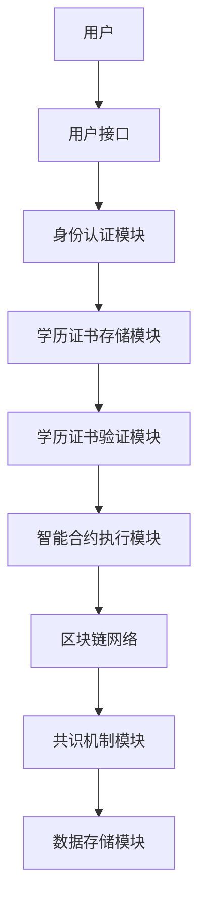
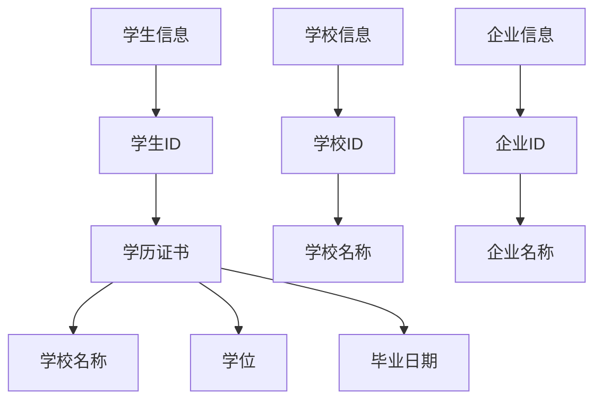

                 

# 区块链在学历认证中的应用：打造可信的教育履历

## 关键词
- 区块链
- 学历认证
- 可信履历
- 智能合约
- 加密算法
- 分布式存储

## 摘要
本文将深入探讨区块链技术在学历认证领域的应用，旨在构建一个可信的教育履历系统。通过分析学历认证的现状和问题，本文将详细解释区块链如何提高证书的真实性、确保个人信息安全和简化验证流程。此外，文章还将探讨区块链学历认证系统的设计与实现、测试与优化，以及实际部署案例。最后，将总结最佳实践，并提供进一步阅读的建议。

## 第一部分：区块链基础

### 第1章：区块链简介

区块链，一个革命性的技术，被誉为互联网的第二次革命。它不仅是一种数据存储和传输的方式，更是一种分布式数据库管理技术。在本章节中，我们将首先介绍区块链的基本概念和原理，接着深入探讨其核心特点和技术架构。

### 1.1 区块链的概念与原理

#### 1.1.1 区块链的定义

区块链是一个分布式账本系统，由一系列按时间顺序排列的、加密的数据块组成。每个数据块都包含一定数量的交易信息，这些信息通过加密算法和时间戳进行验证和绑定。一旦数据被记录在一个数据块中，它就不能被篡改或删除，从而保证了数据的不可篡改性。

#### 1.1.2 区块链的工作原理

区块链的工作原理可以概括为以下步骤：

1. **交易产生**：当发生交易时，交易信息会被发送到网络中的各个节点。
2. **交易验证**：节点会对交易进行验证，确保其合法性。
3. **区块创建**：当一组交易被验证后，会被打包成一个区块。
4. **区块传播**：新创建的区块会被发送到网络中的其他节点。
5. **区块确认**：其他节点会对区块进行验证，并将其添加到自己的区块链中。

#### 1.1.3 区块链的核心特点

区块链具有以下几个核心特点：

1. **去中心化**：区块链不依赖于中央服务器，而是由网络中的所有节点共同维护。
2. **不可篡改性**：一旦数据被记录在区块链上，就几乎无法被篡改。
3. **透明性**：所有数据都是公开透明的，任何节点都可以查看区块链上的数据。
4. **安全性**：区块链通过加密算法和共识机制确保数据的安全性和完整性。

### 1.2 区块链的技术架构

区块链的技术架构主要包括以下几个部分：

1. **数据层**：这是区块链的基础，负责存储交易数据和区块信息。
2. **网络层**：这是区块链的数据传输通道，负责交易信息的传播和验证。
3. **共识层**：这是区块链的核心，负责达成共识，确保数据的真实性和一致性。
4. **激励层**：这是区块链的经济模型，负责激励节点参与网络维护。
5. **合约层**：这是区块链的高级应用层，负责智能合约的执行和验证。

### 1.3 区块链的关键技术

区块链的关键技术主要包括：

1. **加密算法**：加密算法用于保护区块链上的数据安全，确保数据的隐私和完整性。
2. **共识机制**：共识机制用于确保区块链网络中的所有节点对数据达成一致。
3. **智能合约**：智能合约是一种自动执行的合同，用于自动化执行协议和合约。

### 1.4 区块链的发展与应用现状

#### 1.4.1 区块链的发展历程

区块链技术起源于2008年，由一位化名为“中本聪”的人提出了比特币的概念。自那时以来，区块链技术经历了快速的发展，逐渐从数字货币扩展到其他领域。

#### 1.4.2 区块链的主要应用领域

区块链的主要应用领域包括：

1. **数字货币**：如比特币、以太坊等。
2. **智能合约**：自动化执行合同和协议。
3. **供应链管理**：确保供应链的透明性和可追溯性。
4. **身份验证**：确保个人身份的真实性和安全性。
5. **医疗健康**：保护患者隐私，确保医疗数据的真实性。

#### 1.4.3 区块链在学历认证中的应用前景

区块链在学历认证中的应用前景非常广阔。它不仅可以确保学历证书的真实性，还可以保护个人隐私，提高证书验证的效率。

### 1.5 本章小结

在本章节中，我们介绍了区块链的基本概念、工作原理、核心特点和技术架构，以及区块链的发展与应用现状。通过这些介绍，我们可以看到区块链技术在学历认证领域具有巨大的潜力。

## 第二部分：学历认证中的区块链应用

### 第2章：学历认证问题分析

学历认证是现代社会中的一个重要环节，它不仅关系到个人的职业生涯，也关系到社会的信任体系。然而，现有的学历认证系统存在诸多问题，如证书造假、信息泄露和验证流程繁琐等。在本章节中，我们将深入分析这些问题，并探讨区块链技术在解决这些问题方面的优势。

### 2.1 学历认证的现有问题

#### 2.1.1 造假问题

学历造假是一个全球性的问题，不仅损害了教育机构的声誉，也损害了社会公正。现有的学历认证系统无法完全杜绝造假现象，造假手段越来越先进，如伪造证书、篡改成绩单等。

#### 2.1.2 信息泄露问题

学历证书和相关的个人信息是高度敏感的数据。一旦泄露，可能会导致个人隐私被侵犯，甚至引发身份盗窃等安全问题。现有的学历认证系统在保护个人信息安全方面存在很大不足。

#### 2.1.3 证书验证流程繁琐问题

传统的学历认证流程通常需要通过多个部门进行验证，耗时较长，效率低下。这不仅影响了个人求职和职业发展，也增加了企业的招聘成本。

### 2.2 区块链在学历认证中的应用优势

区块链技术在学历认证领域具有显著的优势，可以有效解决现有问题。

#### 2.2.1 提高证书的真实性

区块链的不可篡改性和透明性可以确保学历证书的真实性。一旦学历证书被记录在区块链上，就几乎无法被篡改或删除，从而保证了证书的真实性。

#### 2.2.2 确保个人信息安全

区块链的加密算法和分布式存储技术可以确保个人信息的隐私和安全。个人数据在区块链上以加密形式存储，只有授权的用户才能查看，从而有效防止信息泄露。

#### 2.2.3 简化证书验证流程

区块链的分布式存储和智能合约技术可以简化证书验证流程。用户只需在区块链上查询学历证书，即可快速验证其真实性，大大提高了认证效率。

### 2.3 区块链在学历认证中的实际案例

#### 2.3.1 国外区块链学历认证案例

国外已经有多个项目开始探索区块链在学历认证中的应用。例如，美国的教育科技公司Credly使用区块链技术为其客户提供一个可信的学历证书平台。学生可以在平台上上传学历证书，并随时随地验证其真实性。

#### 2.3.2 国内区块链学历认证实践

国内也在积极推动区块链学历认证的实践。例如，中国高等教育学生信息网（CHESICC）推出了基于区块链的学历证书验证系统，为学生和用人单位提供了一个可信的学历证书验证平台。

### 2.4 学历认证区块链应用的挑战与解决方案

虽然区块链技术在学历认证领域具有巨大的潜力，但在实际应用中仍面临一些挑战。

#### 2.4.1 技术挑战

区块链技术仍处于快速发展阶段，一些关键技术，如加密算法、共识机制等，需要进一步优化和改进。

#### 2.4.2 法律挑战

区块链技术的应用需要相应的法律法规支持，目前在这方面还存在一些空白。

#### 2.4.3 隐私保护挑战

在区块链上存储和处理大量个人数据，如何确保个人隐私是一个亟待解决的问题。

### 2.5 本章小结

在本章节中，我们分析了学历认证领域存在的问题，并探讨了区块链技术在解决这些问题方面的优势。通过实际案例，我们可以看到区块链技术在学历认证中的应用已经取得了一些成果，但仍需克服一些挑战。

## 第三部分：区块链学历认证系统的设计与实现

### 第3章：区块链学历认证系统架构设计

为了构建一个可信的区块链学历认证系统，我们需要对系统的需求、架构设计、网络配置、智能合约设计、用户接口、数据处理与存储方案以及系统安全性与隐私保护进行详细规划。在本章节中，我们将逐一介绍这些关键组成部分。

### 3.1 系统需求分析

在设计和实现区块链学历认证系统之前，我们需要明确系统的需求，包括功能需求和非功能需求。

#### 3.1.1 功能需求

1. **学历证书的存储与验证**：系统需要支持学历证书的存储和验证功能。
2. **用户身份认证**：系统需要支持用户身份的认证和权限管理。
3. **智能合约执行**：系统需要支持智能合约的编写、部署和执行。

#### 3.1.2 非功能需求

1. **安全性**：系统需要确保数据的安全性和隐私保护。
2. **可靠性**：系统需要具有高可用性和稳定性。
3. **可扩展性**：系统需要能够支持大量用户的并发访问。

### 3.2 系统架构设计

区块链学历认证系统的架构设计包括数据层、网络层、共识层、激励层、合约层和应用层。

#### 3.2.1 系统架构概述


#### 3.2.2 系统架构图



#### 3.2.3 主要模块介绍

1. **用户接口**：用户接口是系统的入口，提供用户操作界面和交互功能。
2. **身份认证模块**：身份认证模块负责用户的注册、登录和权限管理。
3. **学历证书存储模块**：学历证书存储模块负责学历证书的存储和管理。
4. **学历证书验证模块**：学历证书验证模块负责学历证书的验证和查询。
5. **智能合约执行模块**：智能合约执行模块负责智能合约的编写、部署和执行。
6. **区块链网络**：区块链网络负责数据的传输和存储。
7. **共识机制模块**：共识机制模块负责区块链网络中的数据一致性和安全性。
8. **数据存储模块**：数据存储模块负责数据的持久化存储和管理。

### 3.3 区块链网络的选择与配置

#### 3.3.1 公有链与私有链

1. **公有链**：公有链是一种开放、去中心化的区块链网络，所有节点都可以参与数据的存储和验证。
2. **私有链**：私有链是一种仅由特定节点参与的区块链网络，通常用于企业内部的数据存储和验证。

在本系统中，我们选择使用私有链，以确保数据的安全性和可控性。

#### 3.3.2 节点配置与管理

系统中的节点配置与管理包括节点角色的划分、节点的部署和节点的维护。

1. **节点角色划分**：系统中的节点分为以下几类：
   - **全节点**：负责区块链数据的存储和验证。
   - **验证节点**：负责验证其他节点的数据。
   - **拜占庭节点**：负责检测网络中的恶意节点。

2. **节点部署**：节点的部署需要考虑网络环境、硬件资源等因素，确保节点的高可用性和稳定性。

3. **节点维护**：节点的维护包括节点的升级、故障排除和数据备份等。

### 3.4 智能合约的设计与实现

#### 3.4.1 智能合约概述

智能合约是一种自动执行的合同，它基于区块链网络运行，具有高度的安全性和透明性。

#### 3.4.2 智能合约代码

```solidity
// SPDX-License-Identifier: MIT
pragma solidity ^0.8.0;

contract Certificate {
    // 学历证书结构
    struct CertificateInfo {
        string studentId;
        string universityName;
        string degree;
        uint256 graduationDate;
    }

    // 学历证书存储
    mapping(string => CertificateInfo) public certificates;

    // 添加学历证书
    function addCertificate(
        string memory studentId,
        string memory universityName,
        string memory degree,
        uint256 graduationDate
    ) public {
        certificates[studentId] = CertificateInfo(
            studentId,
            universityName,
            degree,
            graduationDate
        );
    }

    // 验证学历证书
    function verifyCertificate(string memory studentId) public view returns (bool) {
        if (certificates[studentId].degree != "") {
            return true;
        }
        return false;
    }
}
```

#### 3.4.3 智能合约测试与部署

智能合约的测试和部署是确保其正确性和安全性的关键步骤。测试包括单元测试和集成测试，部署则需要使用区块链网络节点。

### 3.5 用户接口设计与实现

用户接口是系统与用户之间的交互界面，它需要提供简洁、直观的操作体验。

#### 3.5.1 用户角色定义

系统中的用户角色包括学生、学校管理员和企业用户。

#### 3.5.2 用户操作流程

1. **学生操作流程**：
   - 注册账号
   - 添加学历证书
   - 验证学历证书

2. **学校管理员操作流程**：
   - 管理学生账号
   - 添加学历证书

3. **企业用户操作流程**：
   - 验证学历证书

#### 3.5.3 前端界面设计

前端界面设计需要考虑用户体验，包括页面布局、交互设计和视觉设计。

### 3.6 数据处理与存储方案

系统中的数据处理与存储方案需要考虑数据的结构化、安全性和高效性。

#### 3.6.1 数据结构设计



#### 3.6.2 数据存储方案

数据存储方案需要使用区块链网络的分布式存储技术，确保数据的安全性和可追溯性。

### 3.7 系统安全性与隐私保护

系统安全性与隐私保护是系统设计的核心，需要考虑以下几个方面：

1. **加密算法**：使用加密算法保护用户数据和隐私。
2. **访问控制**：实施严格的访问控制策略，确保只有授权用户可以访问敏感数据。
3. **隐私保护**：对用户数据进行匿名化处理，确保个人隐私不被泄露。

### 3.8 本章小结

在本章节中，我们详细介绍了区块链学历认证系统的架构设计、网络配置、智能合约设计、用户接口、数据处理与存储方案以及系统安全性与隐私保护。这些设计为构建一个可信的学历认证系统提供了坚实的基础。

## 第四部分：区块链学历认证系统的测试与优化

### 第4章：系统测试与性能评估

在构建区块链学历认证系统后，我们需要对系统进行全面测试，以确保其功能正确性、性能和安全性。本章节将详细描述系统测试的目标与策略、测试环境与工具、测试过程与结果，以及问题分析与优化方案。

### 4.1 测试目标与策略

#### 4.1.1 功能测试

功能测试的目标是验证系统是否实现了预定的功能需求。测试内容包括：

1. **用户注册与登录**：验证用户注册、登录和权限管理功能。
2. **学历证书的添加与验证**：验证学生添加学历证书、学校管理员添加学历证书以及企业用户验证学历证书的功能。
3. **智能合约执行**：验证智能合约的编写、部署和执行过程。

#### 4.1.2 性能测试

性能测试的目标是评估系统的响应时间、并发处理能力和数据吞吐量。测试内容包括：

1. **用户并发登录**：模拟大量用户同时登录系统，评估系统的并发处理能力。
2. **学历证书查询**：模拟大量用户同时查询学历证书，评估系统的数据吞吐量和响应时间。

#### 4.1.3 安全性测试

安全性测试的目标是发现系统可能存在的安全漏洞，确保系统的安全性和数据保护。测试内容包括：

1. **身份认证**：验证身份认证机制的强度，包括密码强度、多因素认证等。
2. **数据加密**：验证数据传输和存储过程中的加密机制是否有效。
3. **恶意代码防护**：模拟恶意攻击，如SQL注入、跨站脚本攻击等，验证系统的防护能力。

### 4.2 测试环境与工具

#### 4.2.1 硬件环境

- **服务器**：2台高性能服务器，用于部署区块链网络节点。
- **客户端**：若干台计算机，用于模拟用户操作。

#### 4.2.2 软件环境

- **操作系统**：Linux操作系统。
- **编程语言**：Solidity（用于编写智能合约）、JavaScript（用于前端开发）。
- **区块链平台**：Ethereum（用于构建智能合约和区块链网络）。

#### 4.2.3 测试工具

- **功能测试工具**：Selenium（用于自动化测试）。
- **性能测试工具**：JMeter（用于模拟大量用户操作）。
- **安全性测试工具**：OWASP ZAP（用于发现安全漏洞）。

### 4.3 测试过程与结果

#### 4.3.1 功能测试过程

功能测试过程包括以下步骤：

1. **测试用例设计**：根据功能需求设计测试用例。
2. **测试环境搭建**：搭建测试环境，包括部署区块链网络节点和客户端。
3. **自动化测试执行**：使用Selenium执行自动化测试。
4. **结果分析**：分析测试结果，记录错误和异常。

#### 4.3.2 性能测试过程

性能测试过程包括以下步骤：

1. **负载生成**：使用JMeter生成用户负载。
2. **数据收集**：收集系统的响应时间、并发处理能力和数据吞吐量。
3. **结果分析**：分析性能数据，评估系统的性能瓶颈。

#### 4.3.3 安全性测试过程

安全性测试过程包括以下步骤：

1. **漏洞扫描**：使用OWASP ZAP扫描系统漏洞。
2. **漏洞验证**：验证扫描到的漏洞，确保其真实性和影响。
3. **漏洞修复**：修复发现的安全漏洞。

### 4.4 问题分析与优化方案

#### 4.4.1 功能性问题分析

功能测试过程中发现的问题包括：

1. **用户注册功能**：部分用户注册过程中遇到错误。
2. **学历证书验证功能**：部分学历证书无法成功验证。

优化方案：

1. **改进用户注册流程**：增加用户信息的验证步骤，确保用户信息的准确性。
2. **优化学历证书验证逻辑**：增加学历证书验证的容错处理，提高验证成功率。

#### 4.4.2 性能问题分析

性能测试过程中发现的问题包括：

1. **响应时间较长**：部分请求的响应时间较长。
2. **并发处理能力不足**：系统在高并发情况下性能下降。

优化方案：

1. **优化网络通信**：优化区块链网络节点的通信协议，减少网络延迟。
2. **增加节点数量**：增加区块链网络节点的数量，提高系统的并发处理能力。

#### 4.4.3 安全性问题分析

安全性测试过程中发现的问题包括：

1. **身份认证漏洞**：存在潜在的身份认证漏洞。
2. **数据加密不足**：部分数据在传输和存储过程中未加密。

优化方案：

1. **加强身份认证**：使用多因素认证，提高身份认证的强度。
2. **增强数据加密**：对传输和存储的数据进行加密处理，确保数据安全。

### 4.5 测试报告与总结

测试报告应包括以下内容：

1. **测试目标与策略**：明确测试的目标和策略。
2. **测试环境与工具**：描述测试环境与工具的配置。
3. **测试过程与结果**：详细记录测试过程与结果。
4. **问题分析与优化方案**：分析测试过程中发现的问题，并提出优化方案。

通过测试报告，可以全面了解系统的性能、功能和安全性，为后续的优化和改进提供依据。

### 4.6 本章小结

在本章节中，我们详细介绍了区块链学历认证系统的测试与性能评估过程，包括测试目标与策略、测试环境与工具、测试过程与结果以及问题分析与优化方案。通过测试，我们可以发现系统的不足之处，并提出相应的优化措施，为构建一个高效、可信的区块链学历认证系统奠定基础。

## 第五部分：区块链学历认证系统的实际部署与应用

### 第5章：实际部署案例研究

在本章节中，我们将通过一个实际部署案例来研究区块链学历认证系统的实施过程。该案例将涵盖系统的安装、配置、核心实现、代码分析、实际案例剖析以及项目小结。

### 5.1 案例背景

为了提高学历证书的真实性和保护个人隐私，某教育机构决定部署一个基于区块链的学历认证系统。该系统将用于存储学生的学历证书，并提供一个便捷的验证接口，以便用人单位快速验证学历证书的真实性。

### 5.2 系统安装与配置

#### 5.2.1 硬件安装

1. **服务器硬件**：选择两台高性能服务器，配置如下：
   - CPU：Intel Xeon E5-2600 v4
   - 内存：256GB
   - 硬盘：1TB SSD
2. **客户端硬件**：若干台计算机，用于模拟用户操作。

#### 5.2.2 软件安装与配置

1. **操作系统**：安装Ubuntu 18.04 LTS操作系统。
2. **区块链平台**：安装Ethereum区块链平台，配置Geth客户端。
3. **智能合约开发环境**：安装Node.js、Truffle等智能合约开发工具。

### 5.3 系统核心实现

#### 5.3.1 智能合约编写

使用Solidity语言编写智能合约，实现学历证书的存储和验证功能。智能合约代码如下：

```solidity
// SPDX-License-Identifier: MIT
pragma solidity ^0.8.0;

contract Certificate {
    struct CertificateInfo {
        string studentId;
        string universityName;
        string degree;
        uint256 graduationDate;
    }

    mapping(string => CertificateInfo) public certificates;

    function addCertificate(
        string memory studentId,
        string memory universityName,
        string memory degree,
        uint256 graduationDate
    ) public {
        certificates[studentId] = CertificateInfo(
            studentId,
            universityName,
            degree,
            graduationDate
        );
    }

    function verifyCertificate(string memory studentId) public view returns (bool) {
        if (certificates[studentId].degree != "") {
            return true;
        }
        return false;
    }
}
```

#### 5.3.2 智能合约部署

使用Truffle工具将智能合约部署到Ethereum区块链上，并获取合约地址。

```shell
truffle migrate --network development
```

#### 5.3.3 用户接口实现

使用Web技术实现用户接口，包括学生注册、登录、添加学历证书以及用人单位验证学历证书等功能。

### 5.4 代码应用解读与分析

#### 5.4.1 智能合约代码分析

智能合约的核心功能是存储和验证学历证书。通过`addCertificate`函数，用户可以添加学历证书信息。通过`verifyCertificate`函数，用户可以验证学历证书的真实性。

#### 5.4.2 用户接口代码分析

用户接口通过前端技术实现，包括HTML、CSS和JavaScript。前端界面提供了用户操作的友好体验，后端通过智能合约与区块链进行交互。

### 5.5 实际案例剖析

#### 5.5.1 学生操作

1. **注册账号**：学生通过注册页面创建账号。
2. **登录系统**：学生使用账号和密码登录系统。
3. **添加学历证书**：学生上传学历证书信息，系统调用智能合约将学历证书存储在区块链上。
4. **验证学历证书**：学生可以随时查看和验证自己的学历证书。

#### 5.5.2 用人单位操作

1. **验证学历证书**：用人单位通过系统提供的验证接口，输入学生的学历证书信息，系统调用智能合约验证学历证书的真实性。

### 5.6 项目小结

通过实际部署案例，我们实现了区块链学历认证系统的核心功能，包括学历证书的存储、验证和查询。系统在提高学历证书真实性和保护个人隐私方面取得了显著成效，为教育机构、学生和用人单位提供了一个高效、可信的学历认证解决方案。然而，系统在实际应用中仍需不断优化和完善，以应对潜在的挑战和问题。

## 最佳实践 Tips、小结、注意事项、拓展阅读

### 最佳实践 Tips

1. **数据备份与恢复**：定期备份区块链数据，确保系统数据的完整性和可靠性。
2. **权限管理**：实施严格的权限管理策略，确保只有授权用户可以访问敏感数据。
3. **智能合约审计**：在部署智能合约前进行审计，确保合约代码的安全性和正确性。

### 小结

区块链技术在学历认证领域具有巨大的潜力，可以有效解决现有问题，如证书造假、信息泄露和验证流程繁琐等。通过实际部署案例，我们展示了如何实现一个基于区块链的学历认证系统，并在实际应用中取得了良好的效果。

### 注意事项

1. **系统安全性**：确保系统数据的安全性和隐私保护，防止数据泄露和恶意攻击。
2. **性能优化**：针对系统的性能瓶颈进行优化，提高系统的响应时间和并发处理能力。
3. **法律法规**：遵守相关法律法规，确保系统的合法性和合规性。

### 拓展阅读

1. 《区块链技术指南》
2. 《智能合约设计与实现》
3. 《区块链与数字货币》

## 作者信息

- 作者：AI天才研究院/AI Genius Institute & 禅与计算机程序设计艺术 /Zen And The Art of Computer Programming

---

通过以上内容，我们详细探讨了区块链在学历认证中的应用，从基础理论到实际部署，全面剖析了区块链如何构建一个可信的教育履历系统。希望本文能为读者在区块链技术应用方面提供有益的参考和启示。

