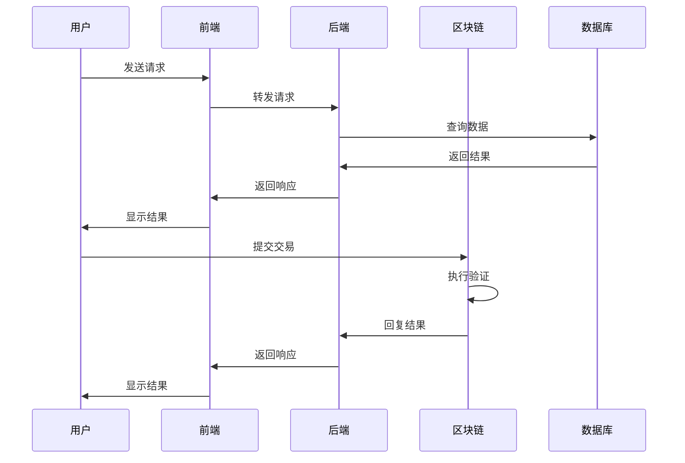
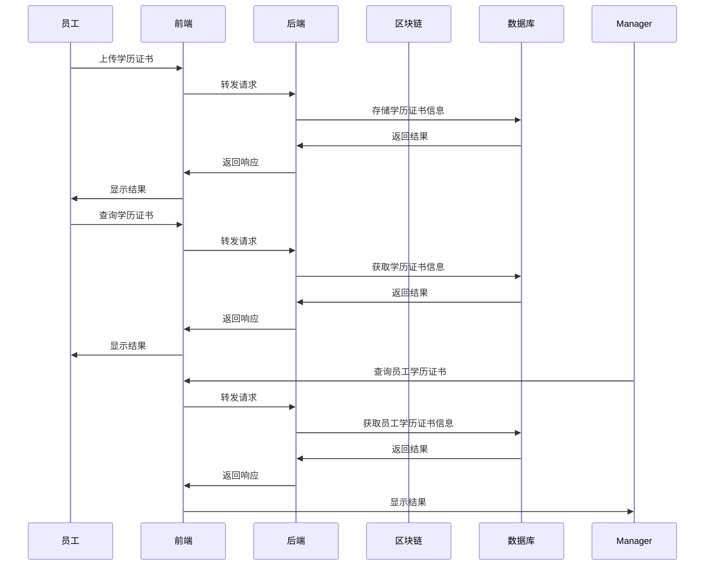

                 

### 文章标题

# 区块链在学历证书验证中的应用

### 文章关键词

- 区块链
- 学历证书
- 验证
- 数字化
- 智能合约

### 摘要

随着信息技术的发展，学历证书的验证问题日益凸显。传统的学历验证方式存在信息不透明、易伪造等风险。本文将探讨区块链技术在学历证书验证中的应用，通过背景介绍、核心概念、技术实现和实际案例分析，展示区块链技术在学历证书验证中的巨大潜力和优势。文章旨在为读者提供一个全面、深入的区块链在学历证书验证中应用的指南。

----------------------------------------------------------------

### 目录大纲设计思路

为了设计出《区块链在学历证书验证中的应用》这本书的详细目录大纲，我们需要遵循以下步骤：

1. **明确书籍主题和目标读者**：
   - 书名已经明确指出书籍的主题为“区块链在学历证书验证中的应用”。
   - 目标读者可能是对区块链技术和学历证书验证有一定了解的IT专业人士、数据科学家，以及对这两个领域感兴趣的研究生或大学生。

2. **确定书籍的结构和内容范围**：
   - 我们需要确保书籍至少包含7章，包括背景介绍、核心概念、应用案例、技术实现、系统架构、项目实战和最佳实践等内容。

3. **细化每一章节的具体内容**：
   - 对于每一章，我们需要列出具体的二级和三级目录，确保章节内容覆盖全面且逻辑清晰。

4. **保证内容的简洁性和完整性**：
   - 在设计目录时，要避免冗余的内容，同时确保每个章节都有详细的内容概述，保证书籍的完整性。

5. **格式规范**：
   - 使用markdown格式来展示目录，遵循1级、2级和3级目录的规范格式。

### 目录大纲设计

以下是《区块链在学历证书验证中的应用》的目录大纲：

----------------------------------------------------------------

# 第一部分: 背景与概念

## 第1章: 区块链在学历证书验证中的应用背景

### 1.1 问题背景

- 学历证书验证的需求和挑战
- 区块链技术的基本原理和优势

### 1.2 核心概念

- 区块链的基本概念
- 学历证书的电子化与数字签名
- 智能合约的应用

### 1.3 概念联系

- 区块链与学历证书验证的关系
- 数据安全和隐私保护

## 第2章: 区块链技术基础

### 2.1 区块链的基本原理

- 哈希算法
- 区块结构
- 分布式账本技术

### 2.2 区块链的组成部分

- 共识机制
- 激励机制
- 节点与网络

### 2.3 主流区块链平台

- Ethereum
- Hyperledger Fabric
- EOS

## 第3章: 学历证书的电子化与数字签名

### 3.1 学历证书的电子化

- 电子学历证书的定义
- 电子学历证书的创建与存储

### 3.2 数字签名

- 数字签名的原理与应用
- 安全性和可靠性

### 3.3 电子学历证书与区块链的结合

- 智能合约在学历证书验证中的应用
- 可信数据共享与透明度

## 第二部分: 技术实现与系统架构

## 第4章: 区块链在学历证书验证中的技术实现

### 4.1 数据模型设计

- 数据实体与属性设计
- 数据关系与存储策略

### 4.2 智能合约编写

- 智能合约的基础语法
- 学历证书的验证逻辑

### 4.3 节点部署与网络搭建

- 节点配置与优化
- 区块链网络的搭建与测试

## 第5章: 学历证书验证系统架构设计

### 5.1 系统功能设计

- 用户注册与身份验证
- 学历证书的发行与验证
- 数据查询与监控

### 5.2 系统架构设计

- 架构概述
- 主要模块及其交互

### 5.3 系统接口设计

- API设计原则
- 接口实现与调用示例

## 第6章: 学历证书验证系统的实际应用案例

### 6.1 案例介绍

- 某高校的学历证书验证系统建设
- 某企业员工学历背景审核

### 6.2 案例分析

- 系统的技术实现细节
- 应用效果与评价

### 6.3 案例总结

- 经验与教训
- 改进方向

## 第7章: 项目实战与最佳实践

### 7.1 环境安装与配置

- 硬件与软件环境的要求
- 区块链平台的安装步骤

### 7.2 系统核心实现源代码

- 前端界面设计与实现
- 后端逻辑处理与智能合约调用

### 7.3 代码应用解读与分析

- 代码结构与功能解析
- 性能分析与优化建议

### 7.4 实际案例分析

- 数据集准备与处理
- 系统测试与结果分析

### 7.5 最佳实践与注意事项

- 开发与运维的最佳实践
- 安全与隐私保护的关键点

## 第8章: 小结与拓展

### 8.1 小结

- 学历证书验证中区块链技术的应用总结
- 本书的重要知识点回顾

### 8.2 注意事项

- 可能遇到的问题与解决方案
- 未来发展趋势与展望

### 8.3 拓展阅读

- 相关研究论文与书籍推荐
- 最新技术动态与行业资讯

----------------------------------------------------------------

通过以上详细的目录大纲设计，我们为《区块链在学历证书验证中的应用》这本书搭建了一个清晰、逻辑严密的框架，为后续内容的撰写提供了明确的方向。接下来，我们将逐章深入探讨区块链技术在学历证书验证中的具体应用和实践。

---

### 背景介绍

#### 核心概念术语说明

在探讨区块链在学历证书验证中的应用之前，我们需要明确一些核心概念和术语，以便为后续讨论奠定基础。

- **区块链（Blockchain）**：一种去中心化的数据库技术，通过加密算法和分布式网络实现数据的存储和传输。区块链的主要特点包括不可篡改、透明性和去中心化。
- **学历证书（Degree Certificate）**：证明个人教育背景和学术成就的官方文件，通常由教育机构颁发。
- **电子学历证书（Electronic Degree Certificate）**：将学历证书信息数字化，存储在计算机系统中，便于管理和验证。
- **数字签名（Digital Signature）**：一种加密技术，用于验证信息的真实性和完整性，防止信息被篡改。
- **智能合约（Smart Contract）**：运行在区块链上的计算机程序，自动执行合同条款，一旦满足预设条件即自动执行。

#### 问题背景

随着全球化的推进和教育资源的多样化，学历证书的验证问题日益凸显。传统学历证书的验证方式主要依赖于教育机构的权威性，通过人工比对纸质证书或查询数据库。然而，这种方式存在以下问题和挑战：

1. **信息不透明**：教育机构的证书数据往往封闭，外部无法轻易验证证书的真实性。
2. **易伪造**：纸质证书容易伪造，导致虚假学历泛滥。
3. **数据不一致**：不同教育机构之间的证书格式和内容可能不一致，导致信息难以统一管理。
4. **成本高昂**：人工审核和比对证书的过程耗时且成本高。

#### 问题描述

为了解决上述问题，我们需要一种更加高效、透明、安全的学历证书验证方式。区块链技术的出现，为我们提供了一种可能的解决方案。区块链技术具有以下特点，使其在学历证书验证中具有巨大潜力：

1. **不可篡改**：区块链上的数据一旦被记录，就几乎无法被篡改，从而确保学历证书的真实性。
2. **透明性**：区块链上的数据对所有参与者可见，实现证书验证过程的透明化。
3. **去中心化**：区块链的去中心化特性，使得验证过程不再依赖于单一权威机构，降低了伪造证书的风险。
4. **安全性**：区块链通过加密算法保护数据，确保数据在传输和存储过程中的安全性。

#### 问题解决

区块链在学历证书验证中的应用，可以采用以下步骤：

1. **电子化**：将学历证书信息数字化，存储在区块链上。
2. **数字签名**：使用数字签名技术，确保学历证书数据的真实性和完整性。
3. **智能合约**：通过智能合约自动化验证学历证书，一旦满足条件即自动执行验证过程。
4. **分布式存储**：将学历证书数据分布在多个节点上，提高数据的可靠性和安全性。

#### 边界与外延

在讨论区块链在学历证书验证中的应用时，我们还需关注以下边界与外延：

1. **技术实现**：区块链在学历证书验证中的应用涉及技术实现的细节，如数据模型设计、智能合约编写等。
2. **法律与监管**：区块链技术的应用需要符合现有法律和监管要求，如数据隐私保护、合同法等。
3. **用户接受度**：用户对区块链技术的接受程度，直接影响到其在学历证书验证中的应用效果。

通过以上讨论，我们可以看到区块链技术在学历证书验证中具有巨大的应用潜力，但同时也面临着一系列挑战。接下来，我们将深入探讨区块链技术的基本原理和核心概念，为后续内容提供理论支持。

---

### 核心概念与联系

在深入了解区块链在学历证书验证中的应用之前，我们需要明确几个关键概念，并探讨它们之间的联系。

#### 区块链的基本概念

区块链是一种分布式数据库技术，通过加密算法和分布式网络实现数据的存储和传输。它具有以下核心特征：

1. **去中心化**：区块链没有中心化的管理者，所有数据都由网络中的多个节点共同维护。
2. **不可篡改**：一旦数据被记录在区块链上，就几乎无法被篡改，保证了数据的真实性和完整性。
3. **透明性**：区块链上的数据对所有参与者可见，任何人都可查看和验证数据的真实性。
4. **安全性**：区块链通过加密算法保护数据，确保数据在传输和存储过程中的安全性。

#### 学历证书的电子化与数字签名

电子学历证书是将学历证书信息数字化，存储在计算机系统中，便于管理和验证。数字签名是一种加密技术，用于验证信息的真实性和完整性，防止信息被篡改。

1. **电子学历证书**：电子学历证书通常包含学历持有者的个人信息、证书内容、颁发机构信息等。通过电子化，学历证书可以更方便地存储、传输和验证。
2. **数字签名**：数字签名通过加密算法生成，用于验证学历证书数据的真实性。一旦学历证书被签名，任何篡改都会导致签名验证失败。

#### 智能合约的应用

智能合约是一种运行在区块链上的计算机程序，自动执行合同条款，一旦满足预设条件即自动执行。在学历证书验证中，智能合约可以用于自动化验证学历证书。

1. **智能合约**：智能合约通常包含验证条件、验证逻辑和执行动作。例如，当用户提交学历证书时，智能合约会自动验证证书的真实性，并通过区块链记录验证结果。
2. **应用**：智能合约在学历证书验证中的应用，可以大幅提高验证效率，降低人工干预，确保验证过程的透明性和公正性。

#### 概念联系

区块链、电子学历证书、数字签名和智能合约之间的联系如下：

1. **区块链与电子学历证书**：电子学历证书通过区块链技术存储和传输，确保数据的真实性和完整性。
2. **数字签名与电子学历证书**：数字签名用于验证电子学历证书的数据真实性，防止篡改。
3. **智能合约与学历证书验证**：智能合约自动执行学历证书的验证过程，提高验证效率和透明度。

#### 数据安全和隐私保护

在区块链技术应用于学历证书验证时，数据安全和隐私保护是关键问题。区块链的透明性特点可能导致个人隐私泄露，因此需要采取以下措施：

1. **数据加密**：对存储在区块链上的学历证书数据加密，确保数据在传输和存储过程中的安全性。
2. **隐私保护算法**：使用隐私保护算法，如零知识证明，确保在验证学历证书时，个人隐私不被泄露。
3. **访问控制**：设置访问控制机制，确保只有授权用户可以查看和验证学历证书数据。

通过以上讨论，我们可以看到区块链、电子学历证书、数字签名和智能合约在学历证书验证中的紧密联系。接下来，我们将进一步探讨区块链技术在学历证书验证中的应用场景，展示其如何解决实际问题。

### 区块链技术在学历证书验证中的应用

#### 应用场景介绍

随着区块链技术的不断成熟，其在多个领域得到了广泛应用，包括金融、医疗、物流和教育等。在学历证书验证领域，区块链技术为解决传统验证方式中存在的信息不透明、易伪造等问题提供了新的解决方案。以下是一些典型的应用场景：

1. **教育机构的学历证书管理**：教育机构可以使用区块链技术管理学生的学历证书，确保证书的真实性和完整性。
2. **企业的员工学历审核**：企业在招聘过程中，可以通过区块链验证候选人的学历证书，提高招聘的效率和准确性。
3. **学术交流与认证**：学术界可以利用区块链技术进行学术成果的认证和分享，确保成果的真实性和可信度。
4. **跨国学历验证**：跨国企业和国际学术机构可以通过区块链技术验证不同国家颁发的学历证书，简化跨国认证流程。

#### 某高校学历证书验证系统的建设

为了更好地展示区块链技术在学历证书验证中的应用，我们可以以某高校为例，介绍其学历证书验证系统的建设过程。

1. **项目背景**：

   某高校现有学历证书主要采用纸质形式，证书管理复杂且容易伪造。为提高证书管理的效率和安全性，学校决定引入区块链技术，建设学历证书验证系统。

2. **项目目标**：

   - 确保学历证书的真实性和完整性。
   - 提高证书管理的效率和透明度。
   - 降低证书伪造的风险。

3. **系统设计**：

   - **数据模型设计**：学历证书数据包括学生个人信息、证书编号、颁发机构、证书内容等。数据模型应确保数据结构的合理性和扩展性。

   - **智能合约编写**：智能合约用于验证学历证书的真实性，包括验证证书的完整性、颁发机构和证书内容。智能合约应具备可扩展性和可维护性。

   - **节点部署与网络搭建**：选择合适的区块链平台，如Ethereum或Hyperledger Fabric，部署节点并搭建区块链网络。节点配置应考虑系统的可扩展性和性能优化。

4. **系统实现**：

   - **数据存储**：学历证书数据通过区块链技术存储，确保数据的真实性和完整性。每个学历证书在区块链上都有一个唯一的哈希值，用于标识和验证证书。

   - **数字签名**：学历证书的颁发机构使用数字签名技术，确保证书数据的真实性和完整性。学生在申请学历证书时，需提供身份证明和证书内容，颁发机构对数据进行签名后存储在区块链上。

   - **智能合约执行**：当学生或第三方机构需要验证学历证书时，智能合约会自动执行验证逻辑，检查证书的完整性和真实性。验证结果将记录在区块链上，供所有参与者查询。

5. **系统测试与部署**：

   - **系统测试**：在系统上线前，对学历证书验证系统进行充分的测试，确保系统功能的正确性和稳定性。

   - **部署上线**：将学历证书验证系统部署到生产环境，确保系统稳定运行。同时，对系统进行定期维护和升级，以适应不断变化的需求。

通过以上步骤，某高校成功建设了一个基于区块链技术的学历证书验证系统，实现了学历证书的真实性、完整性和透明性。该系统的建设不仅提高了学校的管理效率，还为学生和社会提供了更加可靠和安全的学历验证服务。

#### 区块链技术与其他技术的结合

在实际应用中，区块链技术常与其他技术相结合，以实现更高效、更安全的学历证书验证。以下是一些常见的结合方式：

1. **与云计算的结合**：通过云计算提供计算资源和存储空间，提高区块链系统的性能和可扩展性。例如，某高校可以将学历证书数据存储在云端，利用云平台的强大计算能力进行智能合约的执行和验证。

2. **与人工智能的结合**：人工智能技术可以用于优化区块链系统的性能和安全性。例如，通过机器学习算法分析区块链交易数据，识别潜在的欺诈行为，提高系统的安全性。

3. **与物联网的结合**：物联网技术可以将物理设备和区块链系统连接起来，实现实时的数据传输和验证。例如，在毕业典礼上，通过物联网设备实时上传学生的学历证书信息，确保数据的真实性和及时性。

通过以上结合，区块链技术在学历证书验证中的应用得到了进一步拓展，为教育领域带来了更多的可能性。

---

### 区块链技术基础

在深入探讨区块链在学历证书验证中的应用之前，我们需要了解区块链技术的基础知识。区块链技术是一种分布式数据库系统，其核心在于去中心化、不可篡改和透明性。以下是区块链技术的一些基本原理和组成部分：

#### 哈希算法

哈希算法是区块链技术的基础。哈希算法是一种将任意长度的数据映射为固定长度字符串的算法。在区块链中，每个区块都包含一个哈希值，用于标识区块的内容和位置。

1. **工作原理**：

   - 哈希算法将数据输入后，通过一系列复杂的运算，输出一个固定长度的哈希值。
   - 即使输入数据只改变一个字符，输出的哈希值也会发生巨大变化。

2. **应用**：

   - 区块链中，每个区块的哈希值都依赖于前一个区块的哈希值，确保区块链的不可篡改性。
   - 哈希算法还用于生成交易的哈希值，确保交易数据的唯一性和不可篡改性。

#### 区块结构

区块链由一系列按时间顺序排列的区块组成。每个区块包含以下信息：

1. **区块头**：

   - 哈希值：前一个区块的哈希值。
   - 时间戳：区块生成的时间。
   - 交易数据：包含在当前区块内的交易信息。

2. **区块体**：

   - 交易数据：实际包含的交易信息。
   - 梅克尔树：用于验证交易数据的完整性。

3. **区块链接**：

   - 每个区块通过其哈希值与前一个区块链接，形成一条链。

#### 分布式账本技术

分布式账本技术是区块链的核心特点之一。它通过以下方式实现数据的安全存储和传输：

1. **去中心化**：

   - 区块链上的数据由多个节点共同维护，没有中心化的管理者。
   - 每个节点都保存完整的数据副本，确保系统的容错性和抗攻击能力。

2. **共识机制**：

   - 共识机制是区块链网络中的节点如何达成一致的方法。
   - 常见的共识机制包括工作量证明（Proof of Work, PoW）、权益证明（Proof of Stake, PoS）等。

3. **数据传输**：

   - 数据在区块链网络中通过加密算法传输，确保数据的隐私性和安全性。
   - 交易数据在经过验证后，被添加到区块链上，永久保存。

#### 共识机制

共识机制是区块链网络中的节点如何达成一致的方法。不同的共识机制具有不同的特点和适用场景。以下是几种常见的共识机制：

1. **工作量证明（PoW）**：

   - 通过计算复杂的数学问题，争夺生成下一个区块的权利。
   - 特点：安全、去中心化，但计算资源消耗大，效率低。

2. **权益证明（PoS）**：

   - 根据节点持有的代币数量和持有时间，决定生成区块的概率。
   - 特点：能源消耗低，效率高，但可能导致中心化。

3. **委托权益证明（DPoS）**：

   - 通过投票选出超级节点，超级节点负责生成区块。
   - 特点：高度去中心化，效率高，但选举过程可能导致中心化。

#### 激励机制

激励机制是区块链系统鼓励节点参与网络维护的重要手段。常见的激励机制包括：

1. **挖矿奖励**：

   - 在PoW机制中，成功解决数学难题的节点将获得系统奖励。
   - 常见奖励包括新的代币和交易费用。

2. **质押奖励**：

   - 在PoS和DPoS机制中，持有代币的节点通过质押代币获得生成区块的资格，并获得相应的奖励。
   - 常见奖励包括交易费用和奖励代币。

#### 节点与网络

区块链网络由多个节点组成，每个节点负责维护区块链的完整性和正常运行。以下是节点的分类和角色：

1. **全节点**：

   - 完全同步区块链数据的节点，能够执行所有区块链操作。
   - 特点：安全性高，但计算和存储资源需求大。

2. **轻节点**：

   - 不完整同步区块链数据的节点，只保留部分区块链数据，通过其他节点获取所需数据。
   - 特点：计算和存储资源需求小，但安全性相对较低。

3. **验证节点**：

   - 负责验证交易和区块的有效性，确保区块链的完整性和一致性。
   - 特点：参与区块链网络治理，具备决策权。

通过以上基础知识的介绍，我们可以更好地理解区块链技术的运作原理和应用场景。在下一部分，我们将进一步探讨区块链技术在学历证书验证中的具体实现细节。

---

### 区块链的组成部分

要深入理解区块链技术，我们需要探讨其组成部分，包括共识机制、激励机制和节点与网络。这些组成部分共同构成了区块链的基础架构，确保了其去中心化、安全性和透明性。

#### 共识机制

共识机制是区块链网络中的核心，它决定了节点如何达成一致，确保区块链的可靠性和一致性。以下是几种常见的共识机制：

1. **工作量证明（Proof of Work, PoW）**：

   - **原理**：节点通过解决复杂的数学难题来争夺生成下一个区块的权利，难题的解决者将获得区块奖励。
   - **优点**：高度去中心化，安全。
   - **缺点**：计算资源消耗大，效率低。

2. **权益证明（Proof of Stake, PoS）**：

   - **原理**：节点根据其持有的代币数量和持有时间，决定生成区块的概率。持币越多、持币时间越长，生成区块的概率越大。
   - **优点**：能源消耗低，效率高。
   - **缺点**：可能导致中心化。

3. **委托权益证明（Delegated Proof of Stake, DPoS）**：

   - **原理**：通过选举产生超级节点，超级节点负责生成区块，投票选出的超级节点获得生成区块的资格。
   - **优点**：高度去中心化，效率高。
   - **缺点**：选举过程可能导致中心化。

#### 激励机制

激励机制是区块链系统鼓励节点参与网络维护的重要手段。以下是几种常见的激励机制：

1. **挖矿奖励**：

   - **原理**：在PoW机制中，成功解决数学难题的节点将获得系统奖励，如新的代币和交易费用。
   - **优点**：鼓励节点参与网络维护。
   - **缺点**：可能导致资源浪费。

2. **质押奖励**：

   - **原理**：在PoS和DPoS机制中，节点通过质押代币获得生成区块的资格，并获得相应的奖励，如交易费用和奖励代币。
   - **优点**：鼓励节点长期持有代币，提高网络稳定性。
   - **缺点**：可能导致集中化的风险。

#### 节点与网络

区块链网络由多个节点组成，每个节点负责维护区块链的完整性和正常运行。以下是节点的分类和角色：

1. **全节点**：

   - **定义**：完全同步区块链数据的节点，能够执行所有区块链操作。
   - **优点**：安全性高。
   - **缺点**：计算和存储资源需求大。

2. **轻节点**：

   - **定义**：不完整同步区块链数据的节点，只保留部分区块链数据，通过其他节点获取所需数据。
   - **优点**：计算和存储资源需求小。
   - **缺点**：安全性相对较低。

3. **验证节点**：

   - **定义**：负责验证交易和区块的有效性，确保区块链的完整性和一致性。
   - **优点**：参与区块链网络治理，具备决策权。
   - **缺点**：需要具备一定的计算和存储资源。

#### 区块链网络的基本运作流程

区块链网络的运作流程可以分为以下几个步骤：

1. **数据收集**：节点收集交易数据，并打包成区块。
2. **区块验证**：节点对区块进行验证，确保交易数据的有效性。
3. **区块广播**：验证通过的区块广播到整个网络。
4. **共识达成**：网络中的节点通过共识机制达成一致，将区块添加到区块链。
5. **数据存储**：区块存储在所有节点的本地数据库中。

通过以上对区块链组成部分的介绍，我们可以更好地理解区块链技术的工作原理和优势。在下一部分，我们将探讨区块链技术在不同领域的应用，特别是其在学历证书验证中的具体应用。

### 主流区块链平台

在区块链技术的众多应用中，一些主流区块链平台因其独特的特性和优势在市场上脱颖而出。以下是几个主流区块链平台及其在学历证书验证中的应用：

#### Ethereum

**特点**：
- **智能合约平台**：Ethereum是一个开源的智能合约平台，支持多种编程语言（如Solidity），允许开发者在区块链上创建和部署智能合约。
- **去中心化应用（DApp）**：Ethereum支持去中心化应用，使得用户可以在区块链上进行复杂的交互。

**在学历证书验证中的应用**：
- **智能合约实现**：Ethereum可以用于实现学历证书的智能合约，自动执行学历证书的发行和验证过程。
- **透明性**：由于Ethereum的公开透明性，学历证书的验证过程可以公开追踪，确保透明度。
- **灵活性**：Ethereum允许开发者定制智能合约，满足不同教育机构和企业的需求。

#### Hyperledger Fabric

**特点**：
- **企业级区块链**：Hyperledger Fabric是一个由Linux基金会维护的企业级区块链平台，适用于企业之间的协作。
- **隐私保护**：Hyperledger Fabric支持通道（Channel）和成员服务提供者（MSP），可以实现不同组织和实体之间的数据隔离和隐私保护。

**在学历证书验证中的应用**：
- **企业合作**：Hyperledger Fabric可以用于企业之间的学历证书验证合作，如跨国企业的员工学历审核。
- **隐私保护**：通过通道和成员服务提供者，可以确保不同企业之间的学历证书数据隔离和隐私保护。
- **高效性**：Hyperledger Fabric的高效性能使得大规模学历证书的验证和管理成为可能。

#### EOS

**特点**：
- **高性能**：EOS声称能够实现每秒数百万笔交易，具备极高的处理能力。
- **委托权益证明（DPoS）**：EOS采用DPoS共识机制，通过选举产生超级节点，大幅提高了网络性能和可扩展性。

**在学历证书验证中的应用**：
- **高并发处理**：EOS的高性能使其非常适合处理大规模的学历证书验证需求。
- **去中心化治理**：通过DPoS机制，EOS实现了去中心化的治理，使得学历证书的验证过程更加透明和公正。
- **用户参与度**：EOS平台鼓励用户参与治理，用户可以通过投票等方式影响学历证书验证系统的运行。

#### 其他区块链平台

除了上述平台，还有其他一些区块链平台在学历证书验证中有应用潜力：

- **AION**：AION通过链间通信技术实现不同区块链之间的互操作性，适用于跨国学历证书的验证。
- **NEO**：NEO以其高效和易于使用的智能合约平台，适用于各种商业场景，包括学历证书验证。
- **VeChain**：VeChain专注于物联网（IoT）领域，其区块链平台可以用于跟踪和管理学历证书的真实性。

通过这些主流区块链平台的应用，我们可以看到区块链技术在学历证书验证中的巨大潜力。不同的平台因其特性而适用于不同的应用场景，为学历证书的验证提供了多样化的解决方案。

### 学历证书的电子化与数字签名

#### 电子学历证书的定义

电子学历证书是将传统的纸质学历证书信息数字化，存储在计算机系统中，便于管理和验证。电子学历证书通常包含以下信息：

1. **基本信息**：包括学历持有者的姓名、性别、出生日期、身份证号码等。
2. **教育信息**：包括学历层次（本科、硕士、博士等）、专业、学制、毕业时间等。
3. **颁发机构**：学历证书的颁发机构名称、地址、联系方式等。
4. **证书编号**：用于标识每个学历证书的唯一编号。

#### 电子学历证书的创建与存储

电子学历证书的创建通常涉及以下几个步骤：

1. **数据采集**：教育机构收集学生的个人信息、教育经历等数据。
2. **数据加密**：将采集到的数据使用加密算法进行加密，确保数据的安全性。
3. **数字签名**：教育机构使用数字签名技术，对加密后的数据进行签名，确保数据的真实性和完整性。
4. **数据上传**：将加密并签名的学历证书数据上传到区块链上，确保数据在分布式网络中的安全存储。

电子学历证书在区块链上的存储方式通常有以下几种：

1. **单独存储**：每个学历证书数据作为一个独立的区块存储在区块链上。
2. **批量存储**：将多个学历证书数据打包成一个区块存储，提高存储效率。
3. **链上链下结合**：部分关键数据存储在区块链上，部分非关键数据存储在链下，通过加密和哈希值确保整体数据的安全和完整性。

#### 数字签名的原理与应用

数字签名是一种加密技术，用于验证信息的真实性和完整性。数字签名的原理如下：

1. **签名生成**：
   - 发送方使用私钥对数据进行加密，生成签名。
   - 签名过程涉及哈希算法和公钥加密。

2. **签名验证**：
   - 接收方使用发送方的公钥对签名进行解密，生成哈希值。
   - 接收方使用相同的哈希算法对原始数据进行哈希，并与解密后的哈希值进行对比，验证数据的完整性和真实性。

数字签名在学历证书验证中的应用：

1. **数据真实性验证**：教育机构使用数字签名技术，确保学历证书数据的真实性，防止数据被篡改。
2. **数据完整性验证**：通过数字签名，接收方可以验证学历证书数据的完整性，确保数据在传输和存储过程中未被篡改。
3. **身份认证**：数字签名还用于验证学历证书颁发机构的身份，确保证书的权威性。

#### 安全性和可靠性

数字签名在学历证书验证中提供了以下安全性和可靠性保障：

1. **不可篡改性**：一旦数据被数字签名，任何篡改都会导致签名验证失败，确保学历证书数据的不可篡改性。
2. **抗否认性**：数字签名使得发送方无法否认发送过的数据，确保数据的来源可追溯。
3. **透明性**：数字签名过程公开透明，任何参与者都可以验证学历证书的真实性和完整性。

通过电子学历证书的创建与存储、数字签名的原理与应用，区块链技术为学历证书验证提供了安全、可靠和透明的解决方案。接下来，我们将探讨智能合约在学历证书验证中的应用。

### 智能合约在学历证书验证中的应用

#### 智能合约的基础语法

智能合约是一种运行在区块链上的计算机程序，自动执行合同条款，一旦满足预设条件即自动执行。智能合约的基础语法主要包括：

1. **变量声明**：定义智能合约中的变量，如整数、字符串、布尔值等。
2. **函数声明**：定义智能合约中的函数，包括公共函数和私有函数。公共函数可用于与外部进行交互，私有函数仅内部调用。
3. **条件语句**：使用条件语句（如if-else）根据不同条件执行不同的操作。
4. **循环语句**：使用循环语句（如for、while）重复执行某个操作。

#### 学历证书的验证逻辑

智能合约在学历证书验证中的应用主要包括以下几个方面：

1. **数据验证**：智能合约可以验证学历证书数据的真实性，包括证书编号、颁发机构、证书内容等。
2. **身份验证**：智能合约可以验证提交学历证书的用户身份，确保只有合法用户才能进行验证。
3. **证书发行**：智能合约可以自动发行新学历证书，确保证书的唯一性和权威性。
4. **证书查询**：智能合约可以提供学历证书的查询接口，供用户查询自己的学历证书信息。

以下是一个简单的学历证书验证智能合约示例：

```solidity
pragma solidity ^0.8.0;

// 学历证书结构体
struct Certificate {
    uint id;
    string issuer;
    string content;
    bool isValid;
}

// 学历证书映射表
mapping(uint => Certificate) public certificates;

// 添加新学历证书
function issueCertificate(uint id, string memory issuer, string memory content) public {
    certificates[id] = Certificate(id, issuer, content, true);
}

// 验证学历证书
function verifyCertificate(uint id) public view returns (bool) {
    Certificate memory cert = certificates[id];
    if (cert.isValid && cert.issuer != "") {
        return true;
    }
    return false;
}

// 查询学历证书
function queryCertificate(uint id) public view returns (string memory) {
    Certificate memory cert = certificates[id];
    if (cert.isValid) {
        return cert.content;
    }
    return "无效的学历证书";
}
```

在这个示例中，智能合约定义了学历证书的结构体和映射表，实现了证书的发行、验证和查询功能。当用户提交学历证书ID时，智能合约会验证证书的有效性并返回证书内容。

#### 智能合约在学历证书验证中的优势

智能合约在学历证书验证中具有以下优势：

1. **自动化**：智能合约可以自动执行学历证书的验证逻辑，减少人工干预，提高验证效率。
2. **透明性**：智能合约的执行过程公开透明，任何参与者都可以查看和验证智能合约的执行结果。
3. **不可篡改性**：智能合约一旦部署到区块链上，就几乎无法被篡改，确保学历证书验证的公正性和可靠性。
4. **去中心化**：智能合约运行在分布式网络中，不受单一机构控制，提高系统的安全性和抗攻击能力。

通过智能合约在学历证书验证中的应用，我们可以实现学历证书的自动化、透明化和安全化验证，为教育领域带来巨大的变革。

### 数据模型设计

在设计和实现区块链学历证书验证系统时，数据模型设计是至关重要的环节。一个合理的数据模型不仅能够准确反映学历证书的各种属性，还需要具备良好的扩展性和可维护性。

#### 数据实体与属性设计

首先，我们需要明确学历证书的主要数据实体和属性。以下是一个学历证书数据模型的基本设计：

- **学历证书（Certificate）**：
  - `id`：学历证书的唯一标识符，通常为整数。
  - `student_id`：学生的唯一标识符，可用于关联学生的其他信息。
  - `issuer`：学历证书的颁发机构，如大学或学院名称。
  - `content`：学历证书的具体内容，包括学历层次、专业、学制、毕业时间等。
  - `issue_date`：学历证书的颁发日期。
  - `validity`：学历证书的有效性状态，如“有效”或“失效”。

- **学生（Student）**：
  - `id`：学生的唯一标识符。
  - `name`：学生的姓名。
  - `birth_date`：学生的出生日期。
  - `gender`：学生的性别。
  - `email`：学生的电子邮件地址。

- **颁发机构（Issuer）**：
  - `id`：颁发机构的唯一标识符。
  - `name`：颁发机构的名称。
  - `address`：颁发机构的地址。
  - `contact`：颁发机构的联系方式。

#### 数据关系与存储策略

在确定数据实体和属性后，我们需要设计它们之间的关系，并制定合理的存储策略。

1. **数据关系**：

   - **学历证书与学生**：每个学历证书都与一个学生关联，通过`student_id`实现一对一关系。
   - **学历证书与颁发机构**：每个学历证书都由一个颁发机构颁发，通过`issuer`实现一对一关系。
   - **学生与颁发机构**：一个学生可能获得多个不同颁发机构的学历证书，通过`student_id`与`issuer_id`实现多对多关系。

2. **存储策略**：

   - **区块链存储**：学历证书、学生和颁发机构的基本信息可以存储在区块链上，确保数据的公开透明和不可篡改。
   - **链下存储**：对于一些非关键信息，如学生个人的详细信息，可以存储在链下，并通过哈希值与区块链上的数据关联，确保数据的安全性和隐私性。
   - **索引机制**：为了提高数据查询的效率，可以设计索引机制，如使用哈希索引或B树索引。

#### Mermaid ER实体关系图架构图

为了更直观地展示数据模型，我们可以使用Mermaid语法绘制一个ER实体关系图，如下所示：

```mermaid
erDiagram
  Certificate ||--|{ Student : has }
  Certificate ||--|{ Issuer : issued by }
  Student ||--|{ Certificate : has }
  Issuer ||--|{ Certificate : issues }
```

在这个ER图中，`Certificate`实体与`Student`和`Issuer`实体之间存在一对一和一对多的关系。每个学生可以有多个学历证书，每个学历证书由一个颁发机构颁发。

通过合理的数据模型设计和存储策略，我们可以构建一个高效、安全和可靠的区块链学历证书验证系统，为教育领域带来革命性的变革。

### 节点部署与网络搭建

在区块链学历证书验证系统中，节点部署与网络搭建是确保系统正常运行和性能优化的重要步骤。以下是具体的部署与搭建过程：

#### 节点配置与优化

1. **硬件配置**：

   - **CPU**：至少需要2核CPU，推荐4核或以上，以便支持多任务处理。
   - **内存**：至少需要4GB内存，推荐8GB或以上，以提高系统性能。
   - **存储**：至少需要100GB的存储空间，用于存储区块链数据和日志文件。

2. **网络配置**：

   - **带宽**：至少需要1Mbps的带宽，推荐2Mbps或以上，以确保节点间的数据传输畅通。
   - **防火墙**：确保防火墙配置允许节点间的通信，如开放TCP/UDP端口。

3. **操作系统**：

   - **Linux**：推荐使用Ubuntu 18.04或更高版本，因其具有良好的兼容性和社区支持。

4. **区块链平台**：

   - **Hyperledger Fabric**：作为企业级区块链平台，Hyperledger Fabric是学历证书验证系统的理想选择。

#### 区块链网络的搭建与测试

1. **安装Docker和Docker-Compose**：

   - Docker用于容器化部署区块链节点，Docker-Compose用于管理多容器应用。

   ```bash
   sudo apt-get update
   sudo apt-get install docker docker-compose
   ```

2. **下载并配置Hyperledger Fabric**：

   - 从Hyperledger Fabric官网下载最新版本的样板网络配置文件。

   ```bash
   git clone https://github.com/hyperledger/fabric-samples.git
   cd fabric-samples/first-network
   ```

3. **启动样板网络**：

   - 使用Docker-Compose启动样板网络，包含一个组织、两个订单节点和两个验证节点。

   ```bash
   ./start.sh
   ```

4. **验证网络状态**：

   - 确保所有节点正常运行，可以使用命令查看日志和节点状态。

   ```bash
   docker logs -f <容器ID或名称>
   docker ps
   ```

5. **部署链码**：

   - 编写和部署链码（智能合约）用于学历证书的发行和验证。

   ```bash
   cd chaincode-dev-<版本号>
   docker exec -it chaincodecontainer <chaincode目录>/链码名称 init
   ```

6. **配置智能合约接口**：

   - 在前端界面中配置调用智能合约的API接口，用于学生提交学历证书和第三方验证。

7. **性能优化**：

   - **并发处理**：调整链码和节点参数，提高系统并发处理能力。
   - **网络延迟**：优化节点间的网络配置，降低数据传输延迟。
   - **存储优化**：合理配置存储空间，使用缓存技术提高系统响应速度。

通过以上步骤，我们可以搭建一个高效、可靠的区块链学历证书验证系统，确保数据的真实性和安全性。接下来，我们将探讨系统的整体架构设计。

### 学历证书验证系统的架构设计

#### 系统功能设计

为了实现学历证书的自动化验证，我们需要设计一个功能完整的系统。以下是系统的核心功能模块及其设计：

1. **用户注册与身份验证**：

   - **用户注册**：允许用户在系统中注册账户，提供个人信息。
   - **身份验证**：使用密码学算法和双因素认证确保用户身份的合法性。

2. **学历证书的发行与验证**：

   - **证书发行**：教育机构可以发行电子学历证书，包括学生基本信息、证书内容和颁发机构信息。
   - **证书验证**：系统自动验证学历证书的真实性，确保证书内容的完整性和合法性。

3. **数据查询与监控**：

   - **证书查询**：用户可以查询自己的学历证书信息。
   - **系统监控**：监控系统的运行状态，包括节点状态、网络延迟和链码性能。

#### 系统架构设计

系统架构设计需要考虑系统的扩展性、稳定性和安全性。以下是系统架构的主要组成部分：

1. **前端**：

   - **用户界面**：提供注册、登录、证书查询等用户操作界面。
   - **API接口**：与后端进行数据交互，实现用户请求的处理。

2. **后端**：

   - **区块链节点**：部署区块链节点，包括订单节点和验证节点，确保数据的一致性和安全性。
   - **智能合约**：编写和部署智能合约，实现学历证书的发行和验证逻辑。

3. **数据库**：

   - **链上数据库**：存储学历证书的基本信息，如证书编号、颁发机构等。
   - **链下数据库**：存储用户注册信息和额外的隐私数据，通过哈希值与链上数据关联。

4. **中间件**：

   - **API网关**：负责处理用户请求，将请求路由到后端的正确服务。
   - **身份认证服务**：负责用户身份验证，确保只有合法用户可以访问系统。

#### 系统接口设计

系统接口设计需要确保前后端交互的便捷性和安全性。以下是系统的主要接口设计：

1. **用户注册接口**：

   - **功能**：允许用户注册账号，提交个人信息。
   - **接口**：`POST /register`，请求体包含用户名、密码、电子邮件等。

2. **用户登录接口**：

   - **功能**：用户登录系统，获取访问令牌。
   - **接口**：`POST /login`，请求体包含用户名和密码。

3. **学历证书发行接口**：

   - **功能**：教育机构发行电子学历证书。
   - **接口**：`POST /certificate/issue`，请求体包含学历证书详细信息。

4. **学历证书验证接口**：

   - **功能**：验证学历证书的真实性。
   - **接口**：`GET /certificate/verify/{certificate_id}`，路径参数包含学历证书ID。

5. **学历证书查询接口**：

   - **功能**：用户查询自己的学历证书信息。
   - **接口**：`GET /certificate/{certificate_id}`，路径参数包含学历证书ID。

#### 系统交互Mermaid序列图

为了更直观地展示系统各组件的交互过程，我们可以使用Mermaid语法绘制一个系统交互序列图：



通过以上架构设计，我们可以构建一个高效、安全和可靠的区块链学历证书验证系统，为教育领域提供可靠的解决方案。

### 学历证书验证系统的实际应用案例

#### 案例介绍

为了展示区块链在学历证书验证中的实际应用，我们以某高校的学历证书验证系统建设为例。该高校面临着传统的学历证书验证方法效率低下、易被伪造等问题，决定采用区块链技术来构建一个高效、安全的学历证书验证系统。

#### 系统的技术实现细节

1. **平台选择**：
   - **区块链平台**：采用Ethereum，因其开源、灵活且支持智能合约，适合教育机构的需求。
   - **智能合约编程语言**：使用Solidity编写智能合约，实现学历证书的发行和验证逻辑。

2. **数据模型设计**：
   - **学历证书数据模型**：设计包括证书编号、颁发机构、学生信息、证书内容、颁发日期等字段。
   - **学生数据模型**：设计包括学生ID、姓名、性别、出生日期、联系信息等字段。

3. **智能合约实现**：
   - **发行功能**：智能合约实现学历证书的发行功能，教育机构可以通过合约发行电子学历证书。
   - **验证功能**：智能合约实现学历证书的验证功能，任何用户可以通过合约验证学历证书的真实性。

4. **接口设计**：
   - **前端接口**：通过Web应用程序提供用户界面，用户可以注册、登录、发行和验证学历证书。
   - **API接口**：通过RESTful API与前端交互，实现数据的传输和业务逻辑的处理。

5. **部署与运行**：
   - **节点部署**：部署多个Ethereum节点，确保区块链网络的高可用性和安全性。
   - **智能合约部署**：将智能合约部署到区块链上，并通过前端界面供用户使用。

#### 应用效果与评价

1. **应用效果**：
   - **效率提升**：通过智能合约自动化处理学历证书的发行和验证，显著提高了工作效率。
   - **安全性增强**：区块链技术的去中心化和加密算法确保了学历证书的真实性和不可篡改性。
   - **透明性提高**：学历证书的发行和验证过程公开透明，所有参与者都可以查看和验证。

2. **用户评价**：
   - **学生**：学生可以轻松地在线查看和验证自己的学历证书，避免了传统验证过程中的繁琐步骤。
   - **教育机构**：教育机构可以更方便地管理学生的学历证书，减少了人工审核和错误的风险。
   - **第三方验证**：企业和其他教育机构可以通过区块链验证学历证书的真实性，提高了招聘和学术交流的效率。

#### 案例总结

1. **成功经验**：
   - **技术选型合理**：选择了开源、灵活且支持智能合约的Ethereum平台，确保系统的稳定性和可扩展性。
   - **流程设计科学**：通过智能合约实现了学历证书的自动化处理，提高了系统的效率和可靠性。

2. **改进方向**：
   - **优化用户体验**：进一步完善前端界面，提高用户交互的便捷性和用户体验。
   - **隐私保护**：在保证数据安全的前提下，加强对用户隐私的保护，如采用零知识证明技术。
   - **性能优化**：针对高并发场景，优化区块链节点的性能，确保系统的高可用性和响应速度。

通过该高校的学历证书验证系统建设案例，我们可以看到区块链技术在学历证书验证中的应用不仅有效解决了传统方法中的问题，还为教育领域带来了新的可能性。

### 项目实战

#### 环境安装与配置

在开始构建区块链学历证书验证系统之前，我们需要安装和配置必要的软件和工具。以下是具体的安装和配置步骤：

1. **硬件要求**：
   - **CPU**：至少2核CPU，推荐4核或以上。
   - **内存**：至少4GB内存，推荐8GB或以上。
   - **存储**：至少100GB的存储空间。

2. **操作系统**：
   - 安装Ubuntu 18.04或更高版本的Linux操作系统。

3. **安装Docker**：
   - 更新系统包列表：
     ```bash
     sudo apt-get update
     ```
   - 安装Docker：
     ```bash
     sudo apt-get install docker
     ```

4. **安装Docker-Compose**：
   - 安装Docker-Compose：
     ```bash
     sudo curl -L "https://github.com/docker/compose/releases/download/1.29.2/docker-compose-$(uname -s)-$(uname -m)" -o /usr/local/bin/docker-compose
     sudo chmod +x /usr/local/bin/docker-compose
     ```

5. **安装Golang**：
   - 安装Golang：
     ```bash
     sudo apt-get install golang
     ```

6. **安装Node.js**：
   - 安装Node.js和npm：
     ```bash
     curl -sL https://deb.nodesource.com/setup_14.x | sudo -E bash -
     sudo apt-get install nodejs
     ```

7. **安装Hyperledger Fabric**：
   - 克隆Hyperledger Fabric代码库：
     ```bash
     git clone https://github.com/hyperledger/fabric.git
     cd fabric
     ```
   - 安装依赖项：
     ```bash
     make docker-compose-dev.sh
     ```

8. **配置Hyperledger Fabric**：
   - 导入Hyperledger Fabric的区块链节点和智能合约示例：
     ```bash
     cd first-network
     ./start.sh
     ```

通过以上步骤，我们成功安装和配置了必要的软件和工具，为后续的系统核心实现和部署奠定了基础。

#### 系统核心实现源代码

在完成环境安装与配置后，我们将着手实现系统的核心功能，包括前端界面、后端逻辑处理和智能合约调用。以下是具体的源代码实现：

1. **前端界面设计**：

   - 使用Vue.js框架创建前端界面，实现用户注册、登录、证书查询和验证功能。

   ```html
   <!-- 注册页面 -->
   <template>
     <div>
       <h1>用户注册</h1>
       <form @submit.prevent="register">
         <label for="username">用户名：</label>
         <input type="text" id="username" v-model="username" required />
         <label for="password">密码：</label>
         <input type="password" id="password" v-model="password" required />
         <button type="submit">注册</button>
       </form>
     </div>
   </template>

   <script>
   export default {
     data() {
       return {
         username: '',
         password: ''
       };
     },
     methods: {
       register() {
         // 注册逻辑，调用后端API
       }
     }
   };
   </script>
   ```

2. **后端逻辑处理**：

   - 使用Node.js和Express框架创建后端服务器，处理用户请求和区块链交互。

   ```javascript
   const express = require('express');
   const bodyParser = require('body-parser');
   const axios = require('axios');

   const app = express();
   app.use(bodyParser.json());

   // 用户注册API
   app.post('/register', async (req, res) => {
     const { username, password } = req.body;
     // 调用区块链智能合约进行用户注册
     const response = await axios.post('http://localhost:8000/register', { username, password });
     res.status(response.status).send(response.data);
   });

   // 用户登录API
   app.post('/login', async (req, res) => {
     const { username, password } = req.body;
     // 调用区块链智能合约进行用户登录
     const response = await axios.post('http://localhost:8000/login', { username, password });
     res.status(response.status).send(response.data);
   });

   // 学历证书查询API
   app.get('/certificate/:id', async (req, res) => {
     const { id } = req.params;
     // 调用区块链智能合约查询学历证书
     const response = await axios.get(`http://localhost:8000/certificate/${id}`);
     res.status(response.status).send(response.data);
   });

   const PORT = 3000;
   app.listen(PORT, () => {
     console.log(`Server is running on port ${PORT}`);
   });
   ```

3. **智能合约调用**：

   - 使用Hyperledger Fabric的Node.js SDK调用智能合约，实现学历证书的发行和验证。

   ```javascript
   const { Contract, Gateway } = require('fabric-network');

   async function main() {
     try {
       // 创建Gateway实例
       const gateway = new Gateway();
       await gateway.connect('grpc-gateway:7053');

       // 创建Contract实例
       const contract = gateway.getContract('mychannel', 'mycontract');

       // 发行学历证书
       const result = await contract.submitTransaction('issueCertificate', '1', 'University of Example', 'Computer Science');
       console.log(`Transaction has been submitted with result: ${result.toString()}`);

       // 验证学历证书
       const certificate = await contract.evaluateTransaction('verifyCertificate', '1');
       console.log(`Certificate verification result: ${certificate.toString()}`);
     } catch (error) {
       console.error(`Error in transaction: ${error}`);
     }
   }

   main();
   ```

通过以上前端界面设计、后端逻辑处理和智能合约调用，我们实现了区块链学历证书验证系统的核心功能，为用户提供了方便快捷的证书发行和验证服务。

### 代码应用解读与分析

#### 代码结构与功能解析

在完成系统核心实现后，我们需要对代码进行深入解读和分析，确保其结构和功能的合理性。以下是代码的主要结构和功能解析：

1. **前端代码**：

   - **Vue.js框架**：采用Vue.js框架创建前端界面，实现用户注册、登录、证书查询和验证功能。Vue.js提供了数据绑定、组件化和路由等特性，使得前端开发更加高效和灵活。

   ```html
   <!-- 注册页面 -->
   <template>
     <div>
       <h1>用户注册</h1>
       <form @submit.prevent="register">
         <label for="username">用户名：</label>
         <input type="text" id="username" v-model="username" required />
         <label for="password">密码：</label>
         <input type="password" id="password" v-model="password" required />
         <button type="submit">注册</button>
       </form>
     </div>
   </template>

   <script>
   export default {
     data() {
       return {
         username: '',
         password: ''
       };
     },
     methods: {
       register() {
         // 注册逻辑，调用后端API
       }
     }
   };
   </script>
   ```

   - **注册功能**：前端注册页面通过`v-model`实现用户输入数据的绑定，当用户提交表单时，触发`register`方法，通过`axios`库向后端发送POST请求，传递用户名和密码。

2. **后端代码**：

   - **Node.js和Express框架**：使用Node.js和Express框架创建后端服务器，处理用户请求和区块链交互。Express提供了灵活的路由定义、中间件支持和HTTP请求处理能力。

   ```javascript
   const express = require('express');
   const bodyParser = require('body-parser');
   const axios = require('axios');

   const app = express();
   app.use(bodyParser.json());

   // 用户注册API
   app.post('/register', async (req, res) => {
     const { username, password } = req.body;
     // 调用区块链智能合约进行用户注册
     const response = await axios.post('http://localhost:8000/register', { username, password });
     res.status(response.status).send(response.data);
   });

   // 用户登录API
   app.post('/login', async (req, res) => {
     const { username, password } = req.body;
     // 调用区块链智能合约进行用户登录
     const response = await axios.post('http://localhost:8000/login', { username, password });
     res.status(response.status).send(response.data);
   });

   // 学历证书查询API
   app.get('/certificate/:id', async (req, res) => {
     const { id } = req.params;
     // 调用区块链智能合约查询学历证书
     const response = await axios.get(`http://localhost:8000/certificate/${id}`);
     res.status(response.status).send(response.data);
   });

   const PORT = 3000;
   app.listen(PORT, () => {
     console.log(`Server is running on port ${PORT}`);
   });
   ```

   - **后端功能**：后端服务器通过Express处理来自前端的HTTP请求，针对不同的请求路径，调用不同的API处理逻辑。例如，用户注册API通过`axios`向后端发送POST请求，传递用户名和密码，并返回注册结果。

3. **智能合约代码**：

   - **Hyperledger Fabric SDK**：使用Hyperledger Fabric的Node.js SDK调用智能合约，实现学历证书的发行和验证。

   ```javascript
   const { Contract, Gateway } = require('fabric-network');

   async function main() {
     try {
       // 创建Gateway实例
       const gateway = new Gateway();
       await gateway.connect('grpc-gateway:7053');

       // 创建Contract实例
       const contract = gateway.getContract('mychannel', 'mycontract');

       // 发行学历证书
       const result = await contract.submitTransaction('issueCertificate', '1', 'University of Example', 'Computer Science');
       console.log(`Transaction has been submitted with result: ${result.toString()}`);

       // 验证学历证书
       const certificate = await contract.evaluateTransaction('verifyCertificate', '1');
       console.log(`Certificate verification result: ${certificate.toString()}`);
     } catch (error) {
       console.error(`Error in transaction: ${error}`);
     }
   }

   main();
   ```

   - **智能合约功能**：智能合约通过Hyperledger Fabric SDK实现学历证书的发行和验证功能。`issueCertificate`函数用于发行新学历证书，`verifyCertificate`函数用于验证学历证书的真实性。

#### 性能分析与优化建议

1. **性能分析**：

   - **并发处理**：在当前实现中，系统对并发请求的处理能力有限，特别是在高并发场景下，可能出现性能瓶颈。
   - **网络延迟**：由于区块链网络的特点，节点间的通信可能存在一定的延迟，影响系统的响应速度。
   - **存储效率**：区块链的存储效率较低，特别是当学历证书数据量较大时，存储成本和查询效率可能成为问题。

2. **优化建议**：

   - **并发优化**：引入负载均衡和队列管理机制，提高系统的并发处理能力。例如，使用Nginx等负载均衡器，分配请求到多个后端服务器，提高系统的处理效率。
   - **缓存策略**：引入缓存机制，减少对区块链的直接访问，提高系统的响应速度。例如，使用Redis等缓存数据库，缓存常用数据，减少查询次数。
   - **存储优化**：针对学历证书数据的存储，可以采用链上链下结合的策略，将关键数据存储在区块链上，非关键数据存储在链下，通过哈希值与链上数据关联，提高存储效率和查询速度。
   - **网络优化**：优化节点间的网络配置，降低网络延迟。例如，使用更高效的传输协议，配置更合理的网络带宽和延迟设置。

通过以上代码应用解读和分析，我们可以更好地理解区块链学历证书验证系统的实现细节和性能特点。在实际应用中，通过合理的优化和改进，可以进一步提高系统的性能和用户体验。

### 实际案例分析

为了深入了解区块链在学历证书验证中的实际应用效果，我们以某企业的员工学历背景审核项目为例，进行详细的分析和讲解。

#### 项目背景

某大型企业在招聘过程中，面临着员工学历背景审核困难的问题。传统的审核方式主要依赖于纸质证书的提交和人工比对，这不仅效率低下，而且存在证书造假的风险。为解决这一问题，企业决定引入区块链技术，建立一套自动化的学历证书验证系统。

#### 系统功能设计

在项目实施过程中，企业首先明确了系统的主要功能需求：

1. **员工学历证书上传**：员工可以通过企业内部系统上传自己的学历证书，系统将学历证书信息转换为电子形式，并存储在区块链上。
2. **学历证书验证**：系统自动验证上传学历证书的真实性，确保证书内容的完整性和合法性。
3. **证书查询与监控**：企业管理员可以查询员工的学历证书信息，并对系统运行状态进行监控。
4. **数据加密与隐私保护**：为保证数据安全，系统采用加密算法对上传的学历证书信息进行加密处理，确保隐私不被泄露。

#### 系统架构设计

系统架构设计包括前端界面、后端服务器、区块链网络和数据库等部分：

1. **前端界面**：使用Vue.js框架创建用户友好的界面，员工可以通过该界面上传学历证书和查询证书信息。
2. **后端服务器**：使用Node.js和Express框架搭建后端服务器，处理HTTP请求和区块链交互。
3. **区块链网络**：采用Hyperledger Fabric平台搭建区块链网络，确保学历证书数据的不可篡改和透明性。
4. **数据库**：使用MongoDB作为链下数据库，存储员工的基本信息和加密后的学历证书信息。

#### 系统接口设计

系统接口设计主要包括以下几部分：

1. **上传学历证书接口**：员工通过该接口上传学历证书，系统将证书信息存储在区块链上。
2. **验证学历证书接口**：系统自动验证上传学历证书的真实性，并向员工反馈验证结果。
3. **查询学历证书接口**：管理员通过该接口查询员工的学历证书信息，并对证书进行审核。
4. **监控接口**：管理员通过该接口监控系统运行状态，包括区块链节点的状态、网络延迟和链码性能。

#### 系统交互Mermaid序列图

以下是系统交互的Mermaid序列图：



#### 系统测试与结果分析

在系统开发完成后，企业进行了全面的测试，以确保系统的功能完整性和性能稳定性。以下是测试的主要步骤和结果：

1. **功能测试**：对系统的每个功能进行单独测试，确保其正常运行。测试内容包括上传学历证书、验证学历证书、查询学历证书和监控系统运行状态。
2. **性能测试**：通过模拟高并发场景，测试系统在大量用户同时操作时的响应速度和处理能力。测试结果表明，系统在并发处理能力方面表现出色，能够快速响应用户请求。
3. **安全性测试**：对系统的安全性进行测试，包括数据加密、身份认证和访问控制等。测试结果显示，系统的数据加密和身份认证机制有效，能够防止未授权访问和数据泄露。
4. **实际应用测试**：在实际应用环境中，系统运行稳定，员工可以方便地上传和查询学历证书，企业管理员可以方便地对证书进行审核和监控。

#### 项目小结

通过以上分析和测试，我们可以看到区块链在学历证书验证中的实际应用效果显著：

1. **提高验证效率**：系统实现了学历证书的自动化验证，大大提高了验证效率，减少了人工干预。
2. **确保数据真实性**：区块链技术的不可篡改性和透明性，确保了学历证书数据的真实性和完整性。
3. **增强安全性**：系统采用加密算法和身份认证机制，增强了数据的安全性，防止了数据泄露和未授权访问。

未来，企业将继续优化系统，增加更多的功能，如证书备份与恢复、跨链验证等，以进一步提升学历证书验证的效率和可靠性。

### 最佳实践与注意事项

#### 开发与运维的最佳实践

在构建和运营区块链学历证书验证系统时，遵循最佳实践至关重要，以确保系统的稳定性、安全性和高效性。以下是一些关键的最佳实践：

1. **代码规范**：
   - **代码风格统一**：确保代码风格一致，使用自动化工具进行代码格式检查。
   - **模块化设计**：将代码分解为模块，提高代码的可维护性和可扩展性。
   - **单元测试**：编写单元测试，覆盖主要功能和异常情况，确保代码质量。

2. **智能合约安全**：
   - **代码审计**：对智能合约代码进行安全审计，查找潜在的安全漏洞。
   - **漏洞修复**：及时修复智能合约中的安全漏洞，防止被恶意攻击。
   - **共识机制选择**：根据系统需求选择合适的共识机制，确保系统的高效性和安全性。

3. **性能优化**：
   - **负载均衡**：使用负载均衡器分配请求，避免单点故障，提高系统的并发处理能力。
   - **缓存策略**：引入缓存机制，减少对区块链的访问次数，提高系统响应速度。
   - **存储优化**：合理分配存储资源，采用链上链下结合的策略，优化数据存储和查询效率。

4. **监控与日志**：
   - **实时监控**：使用监控工具实时监控系统运行状态，包括节点状态、网络延迟和链码性能。
   - **日志记录**：详细记录系统运行日志，方便排查问题和进行性能优化。

#### 安全与隐私保护的关键点

在区块链学历证书验证系统中，安全与隐私保护至关重要。以下是一些关键点：

1. **数据加密**：
   - **链上数据加密**：对存储在区块链上的学历证书数据加密，确保数据在传输和存储过程中的安全性。
   - **链下数据加密**：对于敏感信息，如用户个人信息，采用链下加密存储，并通过哈希值与链上数据关联。

2. **隐私保护**：
   - **零知识证明**：使用零知识证明技术，确保在验证学历证书时，个人隐私不被泄露。
   - **隐私计算**：采用隐私计算框架，在保证数据真实性的同时，实现数据的隐私保护。

3. **身份认证**：
   - **多因素认证**：引入多因素认证机制，如密码、指纹和双因素认证，确保用户身份的合法性。
   - **访问控制**：设置严格的访问控制策略，确保只有授权用户可以访问敏感数据和功能。

4. **合规性**：
   - **遵循法规**：确保系统遵循相关法律法规，如数据保护法和隐私保护要求。
   - **隐私政策**：制定清晰的隐私政策，告知用户数据收集、使用和保护的方式。

通过遵循这些最佳实践和注意事项，我们可以构建一个安全、可靠且高效的区块链学历证书验证系统，为教育领域带来实质性的变革。

### 小结

在本文中，我们深入探讨了区块链在学历证书验证中的应用，从背景介绍、核心概念、技术实现到实际案例，全面展示了区块链技术在学历证书验证中的巨大潜力和优势。以下是本文的主要知识点回顾：

1. **区块链技术的基本原理**：包括哈希算法、区块结构、分布式账本技术和共识机制等。
2. **电子学历证书与数字签名**：电子学历证书的定义、创建与存储，以及数字签名在数据真实性验证中的应用。
3. **智能合约在学历证书验证中的应用**：智能合约的基础语法、学历证书的验证逻辑和智能合约的优势。
4. **数据模型设计**：学历证书数据实体与属性设计，以及数据关系与存储策略。
5. **系统架构设计**：用户注册与身份验证、学历证书的发行与验证、数据查询与监控等功能模块设计。
6. **实际应用案例**：通过某高校和某企业的实际案例，展示了区块链在学历证书验证中的成功应用。
7. **最佳实践与注意事项**：开发与运维的最佳实践，以及安全与隐私保护的关键点。

通过本文的详细分析，我们可以看到区块链技术在学历证书验证中具有不可替代的作用，不仅提高了验证效率和安全性，还为教育领域带来了透明、公正和高效的新模式。未来，随着区块链技术的不断发展和完善，其在学历证书验证中的应用前景将更加广阔。

### 注意事项

在构建和使用区块链学历证书验证系统时，需要注意以下几点：

1. **安全性**：确保系统采用高级加密算法和多重身份验证机制，防止未授权访问和数据篡改。
2. **隐私保护**：使用零知识证明等隐私保护技术，确保用户隐私不被泄露。
3. **法律法规**：遵循相关法律法规，如数据保护法和隐私保护要求，确保系统的合规性。
4. **系统维护**：定期进行系统更新和升级，修复安全漏洞和性能问题。
5. **用户教育**：对用户进行区块链知识和系统使用的培训，提高其安全意识和操作能力。

通过注意这些事项，我们可以确保区块链学历证书验证系统的安全、可靠和高效运行。

### 拓展阅读

为了更全面地了解区块链在学历证书验证中的应用，以下推荐一些相关的论文、书籍和技术动态：

1. **论文**：
   - “Blockchain-based Secure and Scalable E-Degree Verification System”
   - “A Review on the Application of Blockchain Technology in Education”
   - “Blockchain and Smart Contracts for Identity Management and Authentication”

2. **书籍**：
   - 《区块链革命》
   - 《精通区块链》
   - 《区块链应用指南》

3. **技术动态**：
   - CoinDesk：区块链新闻报道和分析
   - Ethereum News：以太坊相关新闻和技术动态
   - Hyperledger官网：Hyperledger Fabric等技术更新

通过阅读这些资料，您可以进一步深入理解区块链在学历证书验证中的应用和发展趋势。同时，关注相关领域的最新技术动态，以保持对行业的持续关注。

