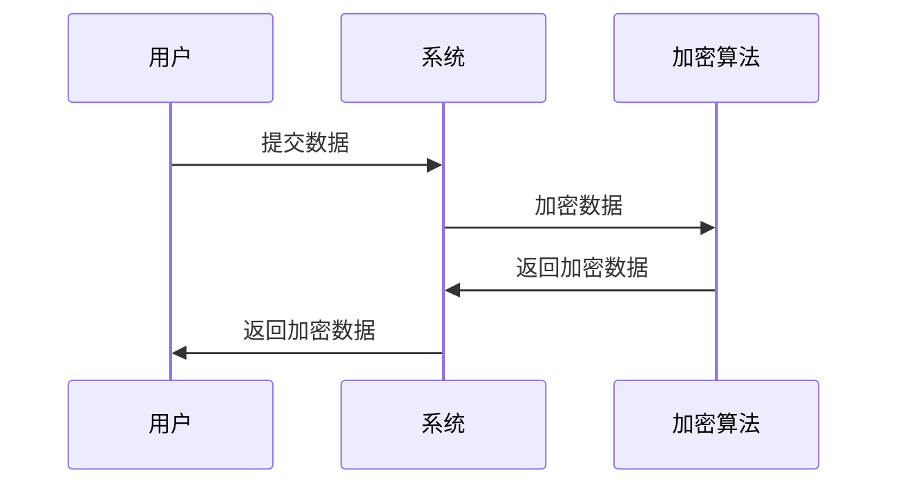
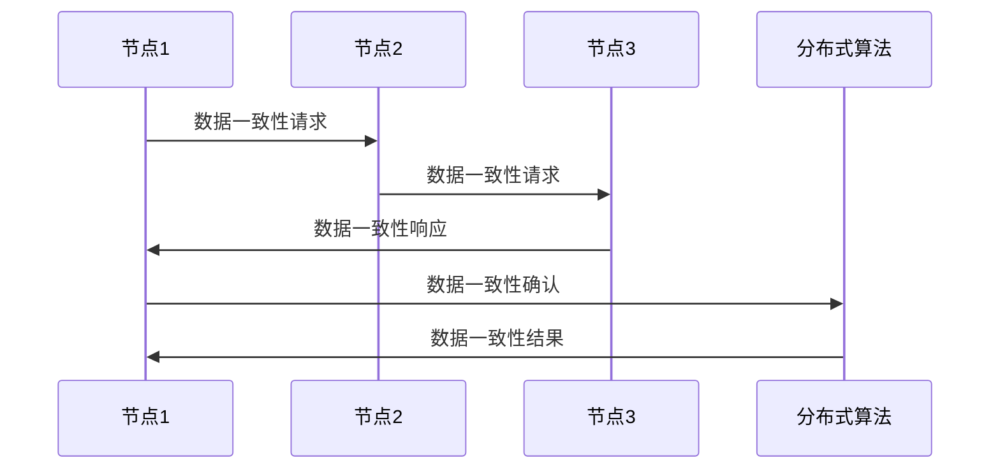
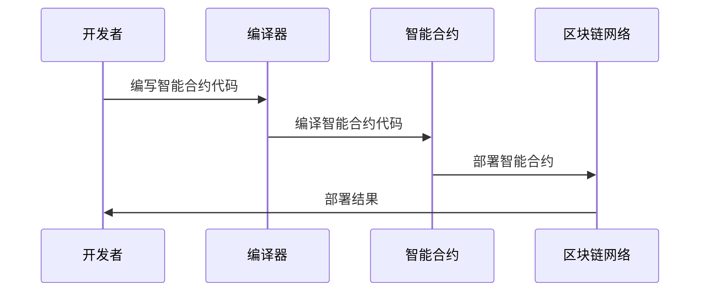
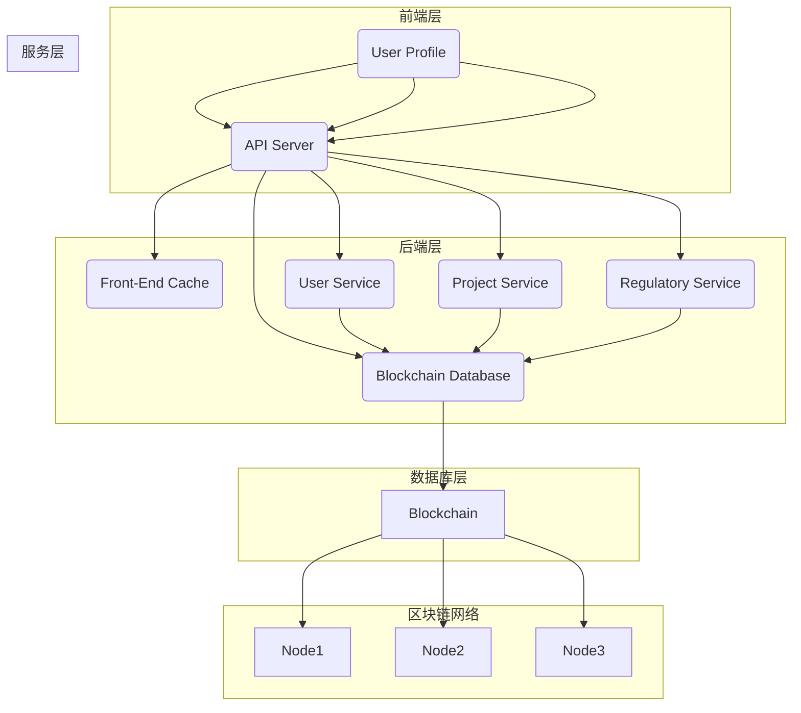
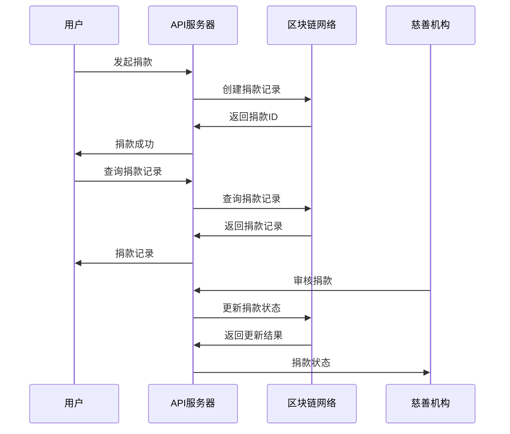

                 


# 引言

## 1.1 慈善捐款透明化的背景与重要性

### 1.1.1 慈善捐款透明化的现状

慈善捐款在现代社会中扮演着重要的角色，它不仅是个人和企业回馈社会的方式，更是推动社会进步的重要力量。然而，慈善捐款的透明化问题却一直困扰着人们。根据国际慈善透明度协会（ICFT）的报告，全球每年慈善捐款总额达到数千亿美元，但这些资金的流向和使用情况却缺乏透明度，导致公众对慈善机构的信任度下降。

目前，慈善捐款的透明化主要面临以下几个问题：

1. **信息披露不足**：许多慈善机构对捐款的用途和项目进展缺乏详细的披露，导致公众无法全面了解捐款的使用情况。
2. **监管不足**：慈善机构的管理和运作缺乏有效的监管机制，容易导致资金被滥用或挪用。
3. **流程复杂**：慈善捐款的流程复杂，涉及多个环节，每个环节都存在信息不对称的问题，增加了资金流失的风险。

### 1.1.2 透明化面临的挑战

慈善捐款透明化面临着诸多挑战，主要包括：

1. **数据隐私**：在确保透明化的同时，如何保护捐款人的隐私和数据安全是一个重要的挑战。
2. **技术壁垒**：区块链技术的应用需要专业知识和技术的支持，许多慈善机构可能缺乏这方面的能力。
3. **监管合规**：在区块链应用过程中，需要遵守相关的法律法规，确保慈善捐款的合法性和合规性。

### 1.1.3 区块链技术的潜在应用

区块链技术作为一种新兴的分布式数据库技术，具有去中心化、透明、不可篡改等特性，为解决慈善捐款透明化问题提供了新的思路。以下是一些区块链技术在慈善捐款中的应用场景：

1. **透明性**：通过区块链技术，可以实现对慈善捐款的全程追踪，确保捐款的透明性。
2. **安全性**：区块链技术可以提供强大的安全性保障，防止捐款被篡改或滥用。
3. **可追溯性**：区块链技术的不可篡改性使得捐款的每一步操作都有据可查，提高了捐款的可追溯性。
4. **信任构建**：区块链技术可以建立一个去中心化的信任机制，减少对第三方机构的依赖，增强公众对慈善机构的信任。

## 1.2 区块链技术基础

### 1.2.1 区块链的基本原理

区块链是一种分布式数据库技术，它通过去中心化的方式实现了数据的存储和管理。区块链的基本原理包括以下几个方面：

1. **去中心化**：区块链没有中心化的管理节点，所有的节点都是平等的，共同维护区块链的数据。
2. **分布式账本**：区块链是一种分布式账本技术，数据存储在多个节点上，保证了数据的冗余和可靠性。
3. **共识机制**：区块链通过共识机制来确保数据的真实性和一致性，常见的共识机制包括工作量证明（PoW）、权益证明（PoS）等。
4. **加密技术**：区块链采用加密技术来保护数据的安全性和隐私，包括哈希函数、数字签名等。

### 1.2.2 区块链的关键特性

区块链的关键特性包括：

1. **不可篡改性**：区块链上的数据一旦被写入，就无法被篡改，保证了数据的真实性和可靠性。
2. **透明性**：区块链上的数据对所有节点都是透明的，用户可以随时查看和验证数据。
3. **安全性**：区块链采用加密技术和共识机制，确保了数据的安全性和隐私。
4. **可追溯性**：区块链上的数据操作都有记录，可以追溯到每一步，提高了数据的可追溯性。

### 1.2.3 区块链的架构设计

区块链的架构设计主要包括以下几个部分：

1. **节点**：区块链由多个节点组成，每个节点都存储了一份完整的数据副本。
2. **链**：区块链是由多个区块组成的链式数据结构，每个区块都包含了若干条交易记录。
3. **共识机制**：共识机制用于确保所有节点对区块链的视图一致。
4. **网络**：区块链通过P2P网络进行数据传输和同步。

## 1.3 区块链在慈善捐款中的应用场景

### 1.3.1 透明性

区块链技术的透明性使得慈善捐款的每一步操作都可以被公开透明地记录下来，从而提高了捐款的透明度。具体来说，区块链可以记录以下信息：

1. **捐款来源**：记录捐款人的信息，包括姓名、联系方式等。
2. **捐款金额**：记录捐款的金额和具体时间。
3. **捐款去向**：记录捐款的具体用途和项目进展。
4. **验证信息**：通过区块链技术，可以实现对捐款信息的验证，确保其真实性和可靠性。

### 1.3.2 安全性

区块链技术的安全性保证了捐款的安全和隐私。具体来说，区块链可以通过以下方式提高安全性：

1. **加密技术**：采用加密技术来保护捐款人和受捐助者的隐私。
2. **共识机制**：通过共识机制来确保所有节点对区块链的视图一致，防止数据被篡改。
3. **智能合约**：使用智能合约来执行捐款协议，确保捐款的执行严格按照协议进行。

### 1.3.3 可追溯性

区块链技术的不可篡改性使得捐款的每一步操作都有据可查，提高了捐款的可追溯性。具体来说，区块链可以记录以下信息：

1. **捐款历史**：记录每次捐款的详细信息，包括金额、时间、用途等。
2. **资金流向**：记录捐款的具体用途和资金流向，确保捐款被正确使用。
3. **审计追踪**：通过区块链技术，可以对捐款进行审计追踪，确保资金使用的透明度和合规性。

### 1.3.4 信任构建

区块链技术可以建立一个去中心化的信任机制，减少对第三方机构的依赖，增强公众对慈善机构的信任。具体来说，区块链可以通过以下方式构建信任：

1. **透明记录**：通过区块链技术，可以实现对捐款过程的全程追踪，提高捐款的透明度。
2. **公开验证**：所有捐款信息都可以被公开验证，确保其真实性和可靠性。
3. **共识机制**：通过共识机制，可以确保所有节点对区块链的视图一致，增强公众对慈善机构的信任。

# 核心概念与联系

## 1.4.1 区块链与分布式账本技术

### 1.4.1.1 区块链的基本原理

区块链是一种去中心化的分布式数据库技术，通过加密算法和共识机制来确保数据的真实性和安全性。区块链的基本原理包括以下三个方面：

1. **去中心化**：区块链没有中心化的管理节点，所有的节点都是平等的，共同维护区块链的数据。
2. **分布式账本**：区块链是一种分布式账本技术，数据存储在多个节点上，保证了数据的冗余和可靠性。
3. **共识机制**：区块链通过共识机制来确保数据的真实性和一致性，常见的共识机制包括工作量证明（PoW）、权益证明（PoS）等。

### 1.4.1.2 分布式账本技术的基本原理

分布式账本技术是一种通过分布式网络维护数据一致性、安全性和可靠性的技术。其基本原理包括以下几个方面：

1. **分布式存储**：数据存储在多个节点上，保证了数据的冗余和可靠性。
2. **分布式共识**：通过分布式共识机制，确保所有节点对数据的视图一致，防止数据被篡改。
3. **加密技术**：采用加密技术来保护数据的安全性和隐私。

### 1.4.1.3 区块链与分布式账本技术的联系

区块链和分布式账本技术有许多相似之处，它们都是通过分布式网络来维护数据的一致性、安全性和可靠性。具体来说，两者的联系包括：

1. **去中心化**：区块链和分布式账本技术都是去中心化的，没有中心化的管理节点。
2. **分布式存储**：区块链和分布式账本技术都是通过分布式网络存储数据，保证了数据的冗余和可靠性。
3. **共识机制**：区块链和分布式账本技术都是通过共识机制来确保数据的一致性。

### 1.4.1.4 区块链与分布式账本技术的区别

尽管区块链和分布式账本技术有许多相似之处，但它们也有一些区别。具体来说，区别包括：

1. **数据结构**：区块链是一种链式数据结构，而分布式账本技术可以是链式、树式或其他数据结构。
2. **应用领域**：区块链主要应用于数字货币、智能合约等领域，而分布式账本技术主要应用于供应链管理、金融等领域。

## 1.4.2 智能合约的基本原理与应用

### 1.4.2.1 智能合约的基本原理

智能合约是一种基于区块链技术的计算机程序，它可以在满足特定条件时自动执行。智能合约的基本原理包括以下几个方面：

1. **条件触发**：智能合约可以定义触发条件，例如时间、金额等。
2. **自动化执行**：当触发条件满足时，智能合约会自动执行预定的操作。
3. **不可篡改**：智能合约一旦部署到区块链上，就无法被篡改或删除，保证了执行的可靠性。

### 1.4.2.2 智能合约的应用

智能合约在区块链技术中扮演着重要的角色，它可以应用于多个领域，例如：

1. **金融领域**：智能合约可以用于自动执行金融交易，提高交易效率和安全性。
2. **供应链管理**：智能合约可以用于追踪供应链中的商品流转，确保供应链的透明性和合规性。
3. **慈善捐款**：智能合约可以用于管理慈善捐款的流程，确保捐款的透明度和安全性。

### 1.4.2.3 智能合约的关键特性

智能合约的关键特性包括：

1. **自动化**：智能合约可以自动执行预定的操作，提高交易效率。
2. **透明性**：智能合约的执行过程是透明的，所有节点都可以查看和验证。
3. **安全性**：智能合约一旦部署到区块链上，就具有很高的安全性，防止篡改和欺诈。

## 1.4.3 常见的区块链平台及其特点

### 1.4.3.1 区块链平台概述

区块链平台是构建区块链应用的基础设施，常见的区块链平台包括：

1. **比特币**：比特币是第一个区块链平台，它主要应用于数字货币领域。
2. **以太坊**：以太坊是一个智能合约平台，它支持去中心化应用（DApp）的开发。
3. **EOS**：EOS是一个高性能的区块链平台，它主要用于构建去中心化应用。
4. **Hyperledger Fabric**：Hyperledger Fabric是一个开源的区块链平台，它主要用于企业级应用。

### 1.4.3.2 常见区块链平台的特点

1. **比特币**：比特币的特点是去中心化、安全性高、抗审查性强。
2. **以太坊**：以太坊的特点是支持智能合约、去中心化应用丰富、可扩展性强。
3. **EOS**：EOS的特点是高性能、可扩展性强、去中心化治理。
4. **Hyperledger Fabric**：Hyperledger Fabric的特点是安全性高、可定制性强、适用于企业级应用。

## 1.4.4 区块链平台的选择与应用

### 1.4.4.1 选择区块链平台的因素

在选择区块链平台时，需要考虑以下几个因素：

1. **应用场景**：根据具体的业务需求和场景选择适合的区块链平台。
2. **性能**：选择性能稳定的区块链平台，确保系统的响应速度和吞吐量。
3. **安全性**：选择安全性高的区块链平台，确保数据的可靠性和隐私。
4. **社区支持**：选择社区活跃、支持丰富的区块链平台，有利于后续的开发和维护。

### 1.4.4.2 区块链平台的应用

1. **金融领域**：区块链平台可以应用于金融领域的交易、支付、风险管理等。
2. **供应链管理**：区块链平台可以应用于供应链管理中的溯源、审计、优化等。
3. **智能合约**：区块链平台可以支持智能合约的开发和执行，应用于自动化管理、去中心化金融等。
4. **慈善捐款**：区块链平台可以应用于慈善捐款的透明化、安全性、可追溯性等。

# 区块链在慈善捐款透明化中的应用

## 2.1 数据加密算法

### 2.1.1 数据加密的重要性

在区块链技术中，数据加密是确保信息安全和隐私的关键技术。加密算法通过将明文转换为密文，保护了数据在传输和存储过程中的安全性。特别是在慈善捐款这种涉及大量个人和资金信息的场景中，数据加密的重要性更加凸显。

首先，数据加密可以防止未经授权的访问。在区块链网络中，每个节点都会存储一部分数据，如果没有加密，这些数据将极易受到黑客的攻击和篡改。通过加密算法，即使黑客获取了数据，也无法解读其内容。

其次，数据加密可以保护捐款人的隐私。在慈善捐款中，捐款人的身份、金额等敏感信息都需要得到保护。加密算法可以将这些信息加密存储，确保只有授权的节点才能解密和查看。

最后，数据加密有助于建立信任。区块链的透明性和不可篡改性使得任何用户都可以查看区块链上的数据。然而，如果这些数据是明文形式，用户将无法相信其真实性。通过数据加密，用户可以验证数据的有效性，同时保护隐私。

### 2.1.2 常见加密算法

在区块链技术中，常见的数据加密算法包括对称加密算法、非对称加密算法和哈希函数。

1. **对称加密算法**：对称加密算法使用相同的密钥来加密和解密数据。常见的对称加密算法有DES、AES等。对称加密算法的优点是加密速度快，缺点是密钥分发和管理复杂。

2. **非对称加密算法**：非对称加密算法使用一对密钥来加密和解密数据，其中公钥用于加密，私钥用于解密。常见的非对称加密算法有RSA、ECC等。非对称加密算法的优点是解决了密钥分发的问题，缺点是加密和解密速度较慢。

3. **哈希函数**：哈希函数是一种将任意长度的数据映射为固定长度数据的算法。常见的哈希函数有MD5、SHA-256等。哈希函数在区块链中主要用于数据完整性验证和数字签名。

### 2.1.3 加密算法在实际中的应用

在区块链技术中，加密算法被广泛应用于以下几个方面：

1. **数据存储**：在区块链中，交易数据会被加密存储，确保数据在存储过程中不被泄露。

2. **交易验证**：在区块链中，每个交易都需要被验证。通过加密算法，交易数据可以被加密传输，同时确保交易双方的身份验证。

3. **数字签名**：在区块链中，用户可以使用私钥对交易数据进行数字签名，确保交易数据的真实性和完整性。

4. **匿名通信**：在区块链网络中，可以通过加密算法实现匿名通信，保护用户的隐私。

## 2.2 分布式算法

### 2.2.1 分布式算法的概念

分布式算法是指通过多个节点协作完成任务的一种算法。在区块链技术中，分布式算法被广泛应用于数据一致性维护、网络安全等场景。分布式算法的关键在于如何确保所有节点都能正确地维护数据，同时避免单点故障和数据冲突。

### 2.2.2 分布式算法的优势

分布式算法具有以下几个优势：

1. **容错性**：分布式算法通过多个节点协作，可以容忍部分节点的故障，确保系统的稳定性。

2. **可扩展性**：分布式算法可以根据需求动态地增加节点，从而提高系统的性能和吞吐量。

3. **数据一致性**：分布式算法通过一致性协议，可以确保所有节点上的数据保持一致，防止数据冲突。

4. **安全性**：分布式算法通过加密技术和共识机制，可以确保数据的真实性和安全性。

### 2.2.3 常见的分布式算法

在区块链技术中，常见的分布式算法包括：

1. **拜占庭将军问题（Byzantine General Problem）**：拜占庭将军问题是一种分布式一致性算法，用于解决在分布式系统中，部分节点可能发生故障或恶意行为的情况。常见的解决方案包括PBFT（Practical Byzantine Fault Tolerance）和Raft算法。

2. **工作量证明（Proof of Work，PoW）**：工作量证明是一种共识算法，通过计算复杂的数学问题来证明节点的合法性。比特币采用的工作量证明算法是典型的应用。

3. **权益证明（Proof of Stake，PoS）**：权益证明是一种替代工作量证明的共识算法，通过节点的权益（如持有的币龄或币量）来决定节点的合法性。

4. **委托权益证明（Delegated Proof of Stake，DPoS）**：委托权益证明是一种改进的权益证明算法，通过选举出多个委托人，由委托人来执行共识算法。

## 2.3 智能合约的实现与工作原理

### 2.3.1 智能合约的基本原理

智能合约是一种基于区块链技术的计算机程序，它可以自动执行合约条款。智能合约的工作原理基于区块链的不可篡改性和分布式特性，确保合约条款的执行是透明、可靠和安全的。

智能合约的基本原理包括以下几个方面：

1. **条件触发**：智能合约可以定义触发条件，例如时间、金额等。当这些条件满足时，智能合约会自动执行。

2. **自动化执行**：智能合约在区块链上执行，一旦触发条件满足，合约中的操作会自动执行，无需人工干预。

3. **不可篡改性**：智能合约一旦部署到区块链上，就无法被修改或删除，确保合约条款的执行是长期的、可靠的。

4. **透明性**：智能合约的执行过程是透明的，所有节点都可以查看和验证，确保合约条款的执行是公正的。

### 2.3.2 智能合约的关键特性

智能合约的关键特性包括：

1. **自动化**：智能合约可以自动执行预定的操作，提高交易效率。

2. **透明性**：智能合约的执行过程是透明的，所有节点都可以查看和验证。

3. **安全性**：智能合约一旦部署到区块链上，就具有很高的安全性，防止篡改和欺诈。

4. **可追溯性**：智能合约的每一步操作都有记录，可以追溯到每一步，提高了合同的可追溯性。

### 2.3.3 智能合约开发工具与语言

智能合约的开发工具和语言主要包括：

1. **Solidity**：Solidity是以太坊智能合约的主要开发语言，它是一种面向对象的高级编程语言。

2. **Vyper**：Vyper是另一种智能合约开发语言，它旨在简化智能合约的开发，减少潜在的安全漏洞。

3. **Truffle**：Truffle是一个智能合约开发框架，它提供了测试、部署和交互等功能，使智能合约开发更加便捷。

4. ** Remix**：Remix是一个在线智能合约开发环境，支持多种智能合约开发语言，方便开发者编写、测试和部署智能合约。

## 2.4 算法原理Mermaid流程图展示

### 2.4.1 数据加密算法流程图



### 2.4.2 分布式算法流程图



### 2.4.3 智能合约实现流程图



## 2.5 数学模型

### 2.5.1 数学模型概述

数学模型是区块链技术中的重要组成部分，用于描述区块链中的各种算法和操作。在区块链技术中，常见的数学模型包括共识算法、加密算法和智能合约等。

### 2.5.2 区块链中的数学模型

区块链中的数学模型主要包括以下几个方面：

1. **共识算法**：共识算法用于确保区块链网络中的所有节点对数据的视图一致。常见的共识算法有工作量证明（PoW）、权益证明（PoS）等。以下是PoW算法的数学模型：

   - **挖矿难度（n）**：挖矿难度是确保区块链网络中的区块产生速度的一个参数。
   - **目标值（T）**：目标值是一个固定值，用于确保挖矿过程的难度。
   - **随机数（R）**：随机数是矿工在挖矿过程中需要计算的一个值。

   数学模型如下：

   $$ T \times 2^{n/R} = 1 $$

2. **加密算法**：加密算法用于保护区块链网络中的数据安全。常见的加密算法有对称加密算法、非对称加密算法和哈希函数。以下是RSA加密算法的数学模型：

   - **公钥（n,e）**：公钥是一个包含两个数字的数组，其中n是模数，e是加密指数。
   - **私钥（n,d）**：私钥是一个包含两个数字的数组，其中n是模数，d是解密指数。

   加密和解密过程如下：

   - **加密**：$$ C = M^e \mod n $$
   - **解密**：$$ M = C^d \mod n $$

3. **智能合约**：智能合约是一种基于区块链技术的计算机程序，用于自动执行合约条款。智能合约的数学模型主要涉及逻辑运算和条件判断。以下是一个简单的智能合约数学模型：

   - **条件判断**：$$ if (条件) { 操作1 } else { 操作2 } $$

### 2.5.3 数学公式与详细讲解

以下是区块链中常用的数学公式及其详细讲解：

1. **共识算法数学模型**：

   - **PoW算法数学模型**：

     $$ T \times 2^{n/R} = 1 $$

     其中，T为目标值，n为挖矿难度，R为随机数。该公式用于确保挖矿过程的难度，使得区块的产生速度保持稳定。

   - **PoS算法数学模型**：

     $$ P = L \times S $$

     其中，P为挖矿概率，L为币龄，S为币量。该公式用于计算在PoS算法中的挖矿概率，币龄和币量越高，挖矿概率越大。

2. **加密算法数学模型**：

   - **RSA加密算法数学模型**：

     - **加密**：

       $$ C = M^e \mod n $$

       其中，C为密文，M为明文，e为加密指数，n为模数。

     - **解密**：

       $$ M = C^d \mod n $$

       其中，M为明文，C为密文，d为解密指数，n为模数。

3. **智能合约数学模型**：

   - **条件判断**：

     $$ if (条件) { 操作1 } else { 操作2 } $$

     其中，条件为判断条件，操作1和操作2为对应的操作。该公式用于实现智能合约中的条件判断功能。

### 2.5.4 举例说明

以下是区块链中常用的数学模型的举例说明：

1. **PoW算法举例**：

   假设目标值T为10，随机数R为5，挖矿难度n为3，计算挖矿难度：

   $$ T \times 2^{n/R} = 10 \times 2^{3/5} \approx 10 \times 1.5313 \approx 15.313 $$

   挖矿难度为15.313。

2. **RSA加密算法举例**：

   假设模数n为123，加密指数e为3，明文M为4，计算密文C：

   $$ C = M^e \mod n = 4^3 \mod 123 = 64 \mod 123 = 64 $$

   密文C为64。

3. **智能合约条件判断举例**：

   假设条件为金额大于100，操作1为发送消息“金额已超过100”，操作2为发送消息“金额未超过100”，实现条件判断：

   $$ if (金额 > 100) { 发送消息("金额已超过100") } else { 发送消息("金额未超过100") } $$

   根据条件判断金额是否大于100，然后发送对应的消息。

## 3.1 数学模型概述

### 3.1.1 数学模型的基本概念

数学模型是一种用数学语言来描述现实世界问题的抽象结构。它通过建立数学方程、公式、图表等数学形式，将复杂的现实问题简化为可计算的形式，以便进行分析、预测和优化。

在区块链技术中，数学模型被广泛应用于共识算法、数据加密、智能合约等方面，用于描述和实现区块链的核心机制和功能。这些数学模型不仅有助于理解和分析区块链技术的工作原理，还为开发和应用区块链技术提供了理论支持。

### 3.1.2 数学模型的应用

数学模型在区块链技术中的应用主要体现在以下几个方面：

1. **共识算法**：共识算法是区块链网络中确保数据一致性的关键机制。数学模型如工作量证明（PoW）、权益证明（PoS）等，用于描述矿工如何通过计算难题来证明其工作量和权益，从而获得记账权。

2. **数据加密**：数据加密是保护区块链数据安全和隐私的关键技术。数学模型如对称加密、非对称加密、哈希函数等，用于描述如何使用密钥和算法对数据进行加密和解密，确保数据的机密性和完整性。

3. **智能合约**：智能合约是区块链上自动执行的计算机程序。数学模型如逻辑运算、条件判断等，用于描述如何使用编程语言实现智能合约的逻辑功能，使其在满足特定条件时自动执行。

### 3.1.3 区块链中的数学模型

在区块链技术中，常见的数学模型包括：

1. **工作量证明（PoW）模型**：PoW模型通过计算难题来证明矿工的工作量。数学模型描述了矿工如何通过不断尝试找到满足特定要求的随机数，以获得记账权。

2. **权益证明（PoS）模型**：PoS模型通过持有币量和币龄来证明矿工的权益。数学模型描述了矿工如何根据其持有的币量和币龄来计算挖矿概率，从而获得记账权。

3. **数据加密模型**：数据加密模型描述了如何使用加密算法来保护区块链数据的安全性和隐私。常见的加密算法包括对称加密、非对称加密和哈希函数。

4. **智能合约模型**：智能合约模型描述了如何使用编程语言来编写和执行智能合约。常见的编程语言包括Solidity、Vyper等。

### 3.1.4 数学模型的特点

数学模型在区块链技术中具有以下特点：

1. **抽象性**：数学模型将复杂的现实问题抽象为数学形式，简化了问题的处理。

2. **确定性**：数学模型基于数学原理，具有明确的计算过程和结果，确保了区块链技术的稳定性和可预测性。

3. **灵活性**：数学模型可以灵活地调整参数和条件，以适应不同的区块链应用场景。

4. **通用性**：数学模型具有通用性，可以应用于不同的区块链技术和应用场景。

## 3.2 区块链中的数学模型

### 3.2.1 区块链的共识算法

区块链的共识算法是确保区块链网络中所有节点对数据的视图一致的关键机制。常见的共识算法包括工作量证明（PoW）、权益证明（PoS）等。以下是这些算法的数学模型：

1. **工作量证明（PoW）模型**：

   PoW模型通过计算难题来证明矿工的工作量。数学模型描述了矿工如何通过不断尝试找到满足特定要求的随机数，以获得记账权。

   - **挖矿难度（n）**：挖矿难度是确保区块链网络中的区块产生速度的一个参数。

   - **目标值（T）**：目标值是一个固定值，用于确保挖矿过程的难度。

   - **随机数（R）**：随机数是矿工在挖矿过程中需要计算的一个值。

   数学模型如下：

   $$ T \times 2^{n/R} = 1 $$

   其中，T为目标值，n为挖矿难度，R为随机数。该公式用于确保挖矿过程的难度，使得区块的产生速度保持稳定。

2. **权益证明（PoS）模型**：

   PoS模型通过持有币量和币龄来证明矿工的权益。数学模型描述了矿工如何根据其持有的币量和币龄来计算挖矿概率，从而获得记账权。

   - **挖矿概率（P）**：挖矿概率是矿工在特定时间内获得记账权的概率。

   - **币龄（L）**：币龄是指币的持有时间。

   - **币量（S）**：币量是指矿工持有的币的数量。

   数学模型如下：

   $$ P = L \times S $$

   其中，P为挖矿概率，L为币龄，S为币量。该公式用于计算在PoS算法中的挖矿概率，币龄和币量越高，挖矿概率越大。

### 3.2.2 数据加密算法

数据加密算法是保护区块链数据安全和隐私的关键技术。以下是几种常见的加密算法的数学模型：

1. **对称加密算法**：

   对称加密算法使用相同的密钥来加密和解密数据。常见的对称加密算法包括DES、AES等。

   - **加密公式**：

     $$ C = E_K(M) $$

     其中，C为密文，M为明文，K为密钥。

   - **解密公式**：

     $$ M = D_K(C) $$

     其中，M为明文，C为密文，K为密钥。

   对称加密算法的优点是加密速度快，缺点是密钥分发和管理复杂。

2. **非对称加密算法**：

   非对称加密算法使用一对密钥来加密和解密数据，其中公钥用于加密，私钥用于解密。常见的非对称加密算法包括RSA、ECC等。

   - **加密公式**：

     $$ C = E_K(M) $$

     其中，C为密文，M为明文，K为公钥。

   - **解密公式**：

     $$ M = D_K(C) $$

     其中，M为明文，C为密文，K为私钥。

   非对称加密算法的优点是解决了密钥分发的问题，缺点是加密和解密速度较慢。

3. **哈希函数**：

   哈希函数是一种将任意长度的数据映射为固定长度数据的算法。常见的哈希函数包括MD5、SHA-256等。

   - **哈希公式**：

     $$ H(M) = H(K \oplus M) $$

     其中，H为哈希函数，M为明文，K为密钥。

   哈希函数在区块链技术中主要用于数据完整性验证和数字签名。

### 3.2.3 智能合约中的数学模型

智能合约是一种基于区块链技术的计算机程序，用于自动执行合约条款。智能合约中的数学模型主要涉及逻辑运算、条件判断等。

1. **逻辑运算**：

   逻辑运算包括与（AND）、或（OR）、非（NOT）等。在智能合约中，逻辑运算用于实现复杂的条件判断。

   - **与运算**：

     $$ (A \land B) = (A \land B) $$

     其中，A和B为逻辑表达式。

   - **或运算**：

     $$ (A \lor B) = (A \lor B) $$

     其中，A和B为逻辑表达式。

   - **非运算**：

     $$ \lnot A = \lnot A $$

     其中，A为逻辑表达式。

2. **条件判断**：

   条件判断用于根据特定条件执行不同的操作。在智能合约中，条件判断通过if-else语句实现。

   - **条件判断公式**：

     $$ if (条件) { 操作1 } else { 操作2 } $$

     其中，条件为判断条件，操作1和操作2为对应的操作。

   条件判断公式用于实现智能合约中的各种逻辑功能。

## 3.3 数学公式与详细讲解

### 3.3.1 共识算法数学模型公式

在区块链的共识算法中，最常见的例子是工作量证明（Proof of Work，PoW）算法。以下是一个简化的PoW算法的数学模型：

- **目标值（Target）**：这是网络预设的一个值，矿工需要计算出一个哈希值，使其小于或等于这个目标值。
- **随机数（Nonce）**：矿工随机生成一个数，并将其与交易数据和前一个区块的哈希值一起输入到一个哈希函数中。
- **哈希值（Hash）**：矿工计算出的结果。

数学公式如下：

$$ Hash(交易数据 + 前一个区块哈希值 + 随机数) \leq 目标值 $$

### 详细讲解：

- **交易数据和前一个区块的哈希值**：这些数据是已知的，矿工无法更改。
- **随机数**：矿工需要尝试不同的随机数，直到找到一个满足条件的哈希值。
- **哈希函数**：通常是一个单向的函数，例如SHA-256。

矿工的任务是找到这样的随机数，使得计算出的哈希值满足上述不等式。这个过程中，矿工的计算机需要进行大量的计算，这就是“工作量”的来源。找到合适的随机数后，矿工就可以将这个区块广播到整个网络，其他节点会验证这个哈希值是否真的满足条件。如果验证通过，该区块就会被添加到区块链中。

### 3.3.2 数据加密算法数学模型公式

在区块链中，数据加密算法主要用于保护数据的机密性和完整性。以下是一些常见的加密算法的数学模型：

1. **对称加密（如AES）**：

   - **加密公式**：

     $$ C = E_K(P) $$

     其中，C是加密后的密文，P是明文，K是加密密钥。

   - **解密公式**：

     $$ P = D_K(C) $$

     其中，P是解密后的明文，C是密文，K是解密密钥。

   对称加密算法使用相同的密钥进行加密和解密，因此密钥的分发和管理是关键问题。

2. **非对称加密（如RSA）**：

   - **加密公式**：

     $$ C = E_K(P) = (P^e) \mod n $$

     其中，C是加密后的密文，P是明文，e是加密公钥，n是模数。

   - **解密公式**：

     $$ P = D_K(C) = (C^d) \mod n $$

     其中，P是解密后的明文，C是密文，d是解密私钥，n是模数。

   非对称加密算法使用一对密钥（公钥和私钥），公钥用于加密，私钥用于解密。这种算法解决了密钥分发的问题，但加密和解密过程相对较慢。

3. **哈希函数（如SHA-256）**：

   - **哈希公式**：

     $$ H(M) = SHA-256(M) $$

     其中，H(M)是哈希值，M是输入的数据。

   哈希函数将任意长度的输入数据映射为固定长度的输出数据，常用于确保数据的完整性。在区块链中，每个区块的哈希值都是通过哈希函数计算得到的。

### 详细讲解：

- **对称加密**：对称加密算法的密钥管理相对简单，但需要确保密钥的安全传输。
- **非对称加密**：非对称加密算法提供了安全的密钥管理，但计算复杂度较高。
- **哈希函数**：哈希函数是区块链中确保数据完整性的基础工具。

### 3.3.3 智能合约数学模型公式

智能合约是一种自动执行的合约，它可以在满足特定条件时自动执行预定的操作。智能合约通常使用特定的编程语言（如Solidity）编写。以下是一个简单的智能合约的数学模型：

1. **条件判断**：

   - **如果-否则（if-else）**：

     ```solidity
     if (condition) {
         performAction1();
     } else {
         performAction2();
     }
     ```

     其中，`condition` 是判断条件，`performAction1()` 和 `performAction2()` 是满足条件和不满足条件时执行的操作。

2. **逻辑运算**：

   - **与（AND）**：

     ```solidity
     bool result = condition1 && condition2;
     ```

   - **或（OR）**：

     ```solidity
     bool result = condition1 || condition2;
     ```

   - **非（NOT）**：

     ```solidity
     bool result = !condition;
     ```

3. **循环**：

   - **for 循环**：

     ```solidity
     for (int i = 0; i < length; i++) {
         performAction();
     }
     ```

   - **while 循环**：

     ```solidity
     while (condition) {
         performAction();
     }
     ```

### 详细讲解：

- **条件判断**：智能合约中的条件判断用于根据输入的数据执行不同的操作。
- **逻辑运算**：逻辑运算用于组合多个条件，形成复杂的判断逻辑。
- **循环**：循环用于重复执行某段代码，直到满足特定的条件。

### 举例说明：

假设我们有一个智能合约，用于管理慈善捐款，其中包含以下数学模型：

1. **捐款金额判断**：

   ```solidity
   if (donationAmount >= MIN_DONATION) {
       sendFundToRecipient(donationAmount);
   } else {
       revert("捐款金额不足");
   }
   ```

   其中，`MIN_DONATION` 是最小捐款金额，`sendFundToRecipient()` 是向收款方转账的函数。

2. **捐款次数限制**：

   ```solidity
   if (donationsCount < MAX_DONATIONS) {
       donationsCount++;
       sendFundToRecipient(donationAmount);
   } else {
       revert("捐款次数已达上限");
   }
   ```

   其中，`MAX_DONATIONS` 是最大捐款次数，`donationsCount` 是已捐款次数。

通过这些数学模型，智能合约可以自动执行捐款流程，确保捐款的透明性和安全性。

## 4.1 项目介绍

### 4.1.1 项目背景

随着区块链技术的不断发展，其在各个领域的应用逐渐成熟。慈善捐款作为社会公益事业的重要组成部分，也逐渐开始引入区块链技术，以提升捐款的透明度、安全性和可追溯性。然而，目前关于区块链在慈善捐款中的应用还处于探索阶段，存在诸多技术挑战和实际问题。

本项目的背景在于解决现有慈善捐款系统中存在的透明度不足、资金管理不透明、信息不对称等问题。通过引入区块链技术，本项目旨在构建一个去中心化的慈善捐款平台，实现捐款的全流程透明化，提高公众对慈善机构的信任度。

### 4.1.2 项目目标

本项目的主要目标包括：

1. **透明性**：通过区块链技术，实现捐款的全程追踪，确保捐款信息的公开透明，让捐款人可以随时查询捐款的使用情况。
2. **安全性**：利用区块链技术的加密和共识机制，确保捐款信息的安全性和完整性，防止资金被篡改或滥用。
3. **可追溯性**：通过区块链的不可篡改性，确保捐款的每一步操作都有据可查，提高捐款的可追溯性，便于审计和监管。
4. **效率提升**：通过智能合约的自动化执行，简化捐款流程，提高慈善机构的运作效率。

### 4.1.3 解决方案概述

本项目的解决方案主要包括以下几个关键组成部分：

1. **区块链平台**：选择一个适合的区块链平台，如以太坊，用于构建慈善捐款平台的基础设施。
2. **智能合约**：编写智能合约，用于管理捐款的流程，包括捐款接收、分配和追踪等。
3. **前端应用**：开发前端应用，用于用户界面和交互，方便用户进行捐款和查询捐款信息。
4. **后端服务**：提供后端服务，用于与区块链网络交互，处理数据存储和检索等任务。
5. **监管机制**：设计一套监管机制，确保平台符合相关法律法规，提高资金使用的合规性。

通过这些组成部分的协同工作，本项目旨在构建一个高效、安全、透明的慈善捐款平台，推动慈善事业的健康发展。

## 4.2 系统功能设计

### 4.2.1 领域模型

在系统功能设计中，领域模型是描述系统核心概念和实体关系的工具。在本项目中，领域模型包括以下几个核心实体：

1. **用户**：代表捐款人和受捐助者。用户可以是个人、组织或企业，他们在平台上进行捐款或接受捐款。
2. **捐款**：表示一次具体的捐款操作，包括捐款金额、时间、来源和用途等信息。
3. **受捐助项目**：表示受捐助的目标项目，包括项目名称、描述、资金需求和使用情况等。
4. **慈善机构**：表示负责管理和执行捐款项目的组织，包括机构名称、联系方式和项目执行情况等。
5. **监管机构**：表示对平台进行监督和管理的机构，确保平台运营的合法性和合规性。

以下是领域模型的类图表示：

```mermaid
classDiagram
    User <|-- Donor
    User <|-- Recipient
    Donation {
        - donor: User
        - recipient: User
        - amount: float
        - time: datetime
        - source: string
        - purpose: string
    }
    Project {
        - name: string
        - description: string
        - fund_required: float
        - fund_used: float
    }
    CharityOrganization {
        - name: string
        - contact_info: string
        - project_list: List<Project>
    }
    RegulatoryAgency {
        - name: string
        - contact_info: string
    }
    User ..|> Donor
    User ..|> Recipient
    Donor --|> Donation
    Recipient --|> Donation
    CharityOrganization --|> Project
    RegulatoryAgency --|> CharityOrganization
```

### 4.2.2 功能需求

在系统功能设计中，明确系统的功能需求是关键步骤。以下是本项目的主要功能需求：

1. **用户注册与登录**：用户可以在平台上注册账户并进行登录，包括个人信息的验证和身份认证。
2. **捐款功能**：用户可以发起捐款，选择捐款金额、捐款项目以及捐款用途，并提交捐款申请。
3. **捐款接收**：慈善机构可以接收用户的捐款申请，并进行审核和确认，将捐款分配到具体的项目中。
4. **项目追踪**：用户可以查询捐款项目的进展情况，包括资金使用情况和项目报告。
5. **监管与审计**：监管机构可以对平台进行监督和审计，确保平台运营的合法性和合规性。
6. **数据统计与分析**：系统需要提供数据统计和分析功能，包括捐款总量、项目完成情况等，以便慈善机构进行决策和优化。
7. **智能合约执行**：系统需要使用智能合约自动执行捐款操作，确保捐款流程的透明性和不可篡改性。

## 4.3 系统架构设计

### 4.3.1 架构设计原则

在设计本项目的系统架构时，我们遵循以下原则：

1. **去中心化**：系统应采用去中心化架构，确保数据的安全性和透明性，减少对中心化节点的依赖。
2. **模块化**：系统应具备良好的模块化设计，便于功能扩展和升级，提高系统的灵活性和可维护性。
3. **高可用性**：系统应具备高可用性，确保在发生故障时能够快速恢复，不影响用户的使用。
4. **安全性**：系统应采用多种安全措施，如数据加密、权限控制等，确保用户数据的安全性和隐私。
5. **可扩展性**：系统应具备良好的可扩展性，能够支持大规模用户和交易量的需求。

### 4.3.2 系统架构图

以下是本项目的系统架构图：



### 详细解释：

- **前端层**：包括用户捐款页面、项目展示页面和个人信息页面，用户通过这些页面与系统进行交互。
- **后端层**：API服务器负责处理前端请求，与区块链数据库进行交互，并提供用户服务、项目管理服务和监管服务。
- **数据库层**：区块链数据库存储所有交易数据和用户数据。
- **服务层**：用户服务、项目管理服务和监管服务负责处理具体的业务逻辑。
- **区块链网络**：由多个节点组成，确保数据的分布式存储和一致性。

## 4.4 系统接口设计

### 4.4.1 接口功能设计

在系统架构设计中，接口设计是关键环节，它定义了系统内部和外部系统之间的交互方式。以下是本项目的接口功能设计：

1. **用户注册与登录接口**：用于用户注册、登录、个人信息验证和身份认证。
   - **POST /register**：用户注册接口，接收用户基本信息并创建用户账户。
   - **POST /login**：用户登录接口，验证用户身份并生成会话令牌。

2. **捐款接口**：用于用户发起捐款、慈善机构接收捐款和审核捐款。
   - **POST /donate**：用户捐款接口，接收用户捐款信息并创建捐款记录。
   - **GET /donations**：慈善机构查询捐款接口，获取用户捐款记录和项目进展。

3. **项目接口**：用于管理慈善项目、发布项目信息和跟踪项目进度。
   - **POST /projects**：慈善机构创建项目接口，发布新项目信息。
   - **GET /projects/{projectId}**：查询项目详情接口，获取特定项目的详细信息。
   - **PUT /projects/{projectId}**：更新项目进度接口，慈善机构更新项目进展信息。

4. **监管接口**：用于监管机构对平台的监督和审计。
   - **GET /audits**：监管查询接口，获取平台审计报告。
   - **POST /audits/report**：监管提交接口，监管机构提交审计报告。

### 4.4.2 接口交互设计

接口交互设计旨在描述接口在不同功能场景中的交互流程。以下是几个关键场景的接口交互设计：

1. **用户注册与登录交互设计**：

   - **用户注册**：
     - 用户访问注册页面，填写基本信息。
     - 前端将注册信息发送到API服务器。
     - API服务器验证信息并创建用户账户，返回用户ID和会话令牌。

   - **用户登录**：
     - 用户输入用户名和密码。
     - 前端将登录信息发送到API服务器。
     - API服务器验证身份并生成会话令牌，返回给用户。

2. **用户发起捐款交互设计**：

   - **用户发起捐款**：
     - 用户选择捐款项目，填写捐款金额。
     - 前端将捐款信息发送到API服务器。
     - API服务器验证信息并创建捐款记录，返回捐款ID。

3. **慈善机构接收捐款交互设计**：

   - **慈善机构查询捐款**：
     - 慈善机构访问API服务器。
     - API服务器返回该机构的捐款记录。

   - **慈善机构审核捐款**：
     - 慈善机构访问API服务器。
     - API服务器验证捐款信息并更新捐款状态。

4. **监管机构查询审计报告交互设计**：

   - **监管机构查询审计报告**：
     - 监管机构访问API服务器。
     - API服务器返回平台的审计报告。

   - **监管机构提交审计报告**：
     - 监管机构提交审计报告。
     - API服务器接收报告并存储。

## 4.5 系统交互设计

### 4.5.1 系统交互序列图

以下是本项目的系统交互序列图：



### 4.5.2 系统交互流程图

以下是本项目的系统交互流程图：

```mermaid
flowchart LR
    subgraph 前端层
        User[用户]
        User->API_Server[发起请求]
        API_Server{是否登录}
        API_Server-->|否| Create_Account[创建账户]
        API_Server-->|是| Login[登录]
        API_Server->Blockchain[区块链交互]
    end

    subgraph 后端层
        API_Server[(API服务器)]
        API_Server->Blockchain[区块链交互]
        API_Server->DB[数据库交互]
    end

    subgraph 区块链层
        Blockchain[区块链网络]
    end

    subgraph 服务层
        Create_Account[创建账户服务]
        Login[登录服务]
        Donate[捐款服务]
        Query_Donation[查询捐款服务]
        Audit_Report[审计报告服务]
    end

    User->API_Server
    API_Server->Create_Account
    Create_Account->Blockchain
    API_Server->Login
    Login->Blockchain
    User->API_Server: donate
    API_Server->Donate
    Donate->Blockchain
    User->API_Server: query_donation
    API_Server->Query_Donation
    Query_Donation->Blockchain
    Charity_Organization->API_Server: audit_report
    API_Server->Audit_Report
    Audit_Report->Blockchain
```

## 5.1 环境安装与配置

### 5.1.1 系统环境要求

为了成功运行本项目，以下系统环境是必需的：

1. **操作系统**：Linux或macOS，推荐使用Ubuntu 18.04或更高版本。
2. **开发工具**：Node.js（版本12.0.0或更高版本）、npm（版本6.0.0或更高版本）、Solidity（0.8.0或更高版本）、Truffle（5.0.0或更高版本）。
3. **区块链平台**：以太坊客户端（Geth或Node.js以太坊客户端Web3.js）。
4. **数据库**：MongoDB（版本4.2.0或更高版本）。

### 5.1.2 环境安装步骤

以下是在Ubuntu 18.04操作系统上安装项目环境的具体步骤：

1. **安装Node.js和npm**：

   ```bash
   sudo apt update
   sudo apt install nodejs npm
   npm install -g npm
   ```

2. **安装Solidity编译器**：

   ```bash
   sudo apt install solc
   ```

3. **安装Truffle**：

   ```bash
   npm install -g truffle
   ```

4. **安装MongoDB**：

   - 安装MongoDB的依赖：

     ```bash
     sudo apt install mongodb-org
     ```

   - 启动MongoDB服务：

     ```bash
     sudo systemctl start mongodb
     ```

   - 将MongoDB添加到系统服务：

     ```bash
     sudo systemctl enable mongodb
     ```

5. **配置Geth以太坊客户端**：

   - 下载Geth：

     ```bash
     wget https://gethstore.blob.core.windows.net/releases/geth-linux-amd64-1.10.25-unix.tar.gz
     tar -xvf geth-linux-amd64-1.10.25-unix.tar.gz
     ```

   - 配置Geth：

     ```bash
     geth --datadir /root/.ethereum --networkid 15 console
     ```

   - 在Geth控制台中设置网络：

     ```javascript
     personal.newAccount();
     web3.eth.getAccounts();
     miner.start();
     ```

   - 退出Geth控制台：

     ```javascript
     process.exit();
     ```

6. **配置Web3.js**：

   - 在项目中安装Web3.js：

     ```bash
     npm install web3
     ```

   - 配置Web3.js：

     ```javascript
     const Web3 = require('web3');
     const web3 = new Web3('http://127.0.0.1:8545');
     ```

### 5.1.3 测试环境配置

在安装完所有依赖后，进行以下测试以确保环境配置正确：

1. **Node.js测试**：

   ```bash
   node -v
   ```

   应显示Node.js的版本号。

2. **Solidity测试**：

   ```bash
   solc --version
   ```

   应显示Solidity编译器的版本号。

3. **Truffle测试**：

   ```bash
   truffle version
   ```

   应显示Truffle的版本号。

4. **MongoDB测试**：

   ```bash
   mongo
   ```

   进入MongoDB的Shell，然后执行：

   ```javascript
   db.runCommand({ ping: 1 });
   ```

   应返回“OK”表明MongoDB服务正常。

5. **Geth测试**：

   ```bash
   geth --datadir /root/.ethereum --networkid 15 console
   ```

   在Geth控制台中执行：

   ```javascript
   web3.version
   ```

   应返回Web3的版本号。

## 5.2 系统核心实现

### 5.2.1 数据加密模块

数据加密模块是确保区块链网络中数据安全的关键部分。在本项目中，我们采用了加密库来处理加密和解密操作。以下是一个简单的数据加密模块示例，使用了Python语言和PyCryptoDome库。

首先，确保已经安装了PyCryptoDome库：

```bash
pip install pycryptodome
```

然后，创建一个名为`crypto.py`的文件，并添加以下代码：

```python
from Crypto.PublicKey import RSA
from Crypto.Cipher import PKCS1_OAEP

# 生成RSA密钥对
def generate_keys():
    key = RSA.generate(2048)
    private_key = key.export_key()
    public_key = key.publickey().export_key()
    return private_key, public_key

# 加密数据
def encrypt_data(public_key, data):
    rsakey = RSA.import_key(public_key)
    cipher = PKCS1_OAEP.new(rsakey)
    encrypted_data = cipher.encrypt(data)
    return encrypted_data

# 解密数据
def decrypt_data(private_key, encrypted_data):
    rsakey = RSA.import_key(private_key)
    cipher = PKCS1_OAEP.new(rsakey)
    decrypted_data = cipher.decrypt(encrypted_data)
    return decrypted_data

if __name__ == "__main__":
    # 生成密钥对
    private_key, public_key = generate_keys()
    print("Private Key:", private_key)
    print("Public Key:", public_key)

    # 测试加密和解密
    sample_data = b"Sample data to encrypt"
    encrypted_data = encrypt_data(public_key, sample_data)
    print("Encrypted Data:", encrypted_data)

    decrypted_data = decrypt_data(private_key, encrypted_data)
    print("Decrypted Data:", decrypted_data)
```

### 详细解释：

1. **生成RSA密钥对**：`generate_keys` 函数使用RSA算法生成一对密钥，私钥和公钥。
2. **加密数据**：`encrypt_data` 函数使用公钥和PKCS1_OAEP加密算法将数据加密。
3. **解密数据**：`decrypt_data` 函数使用私钥和PKCS1_OAEP加密算法将数据解密。

### 5.2.2 分布式算法模块

分布式算法模块用于确保区块链网络中的数据一致性和安全性。在本项目中，我们采用了工作量证明（PoW）算法。以下是一个简单的PoW算法模块示例，使用了Python语言。

创建一个名为`proof_of_work.py`的文件，并添加以下代码：

```python
import hashlib
import time

# 工作量证明算法
def proof_of_work(difficulty, data):
    while True:
        message = f"{data}{time.time()}".encode()
        hash = hashlib.sha256(message).hexdigest()
        if hash[:difficulty] == "0" * difficulty:
            return hash
        else:
            continue

# 挖矿难度
DIFFICULTY = 4

# 测试挖矿
def mine_block(data):
    start_time = time.time()
    hash = proof_of_work(DIFFICULTY, data)
    end_time = time.time()
    print(f"Block mined: {hash}")
    print(f"Time taken: {end_time - start_time} seconds")
    return hash

if __name__ == "__main__":
    mine_block("Block 1")
```

### 详细解释：

1. **工作量证明算法**：`proof_of_work` 函数不断计算哈希值，直到找到一个满足挖矿难度的哈希值。
2. **挖矿难度**：`DIFFICULTY` 参数控制挖矿的难度，难度越高，挖矿过程越复杂。
3. **挖矿测试**：`mine_block` 函数用于测试挖矿过程，打印出挖到的区块哈希值和耗时。

### 5.2.3 智能合约模块

智能合约模块用于实现区块链网络中的业务逻辑。在本项目中，我们使用了Solidity语言编写智能合约。以下是一个简单的智能合约示例，用于管理捐款。

创建一个名为`CharityDonation.sol`的文件，并添加以下代码：

```solidity
// SPDX-License-Identifier: MIT
pragma solidity ^0.8.0;

contract CharityDonation {
    mapping(address => uint256) public donations;
    address public owner;

    event Donated(address donor, uint256 amount);

    constructor() {
        owner = msg.sender;
    }

    function donate() external payable {
        require(msg.value > 0, "捐赠金额必须大于0");
        donations[msg.sender()] += msg.value;
        emit Donated(msg.sender(), msg.value);
    }

    function getDonation() external view returns (uint256) {
        return donations[msg.sender()];
    }

    function withdrawFunds() external {
        require(msg.sender == owner, "只有合约所有者可以提取资金");
        payable(owner).transfer(address(this).balance);
    }
}
```

### 详细解释：

1. **合约结构**：`CharityDonation` 合约包含了捐款记录和提取资金的功能。
2. **捐款函数**：`donate` 函数接收捐款，并将其记录在捐款者的地址下。
3. **查询捐款**：`getDonation` 函数返回捐款者捐赠的总金额。
4. **提取资金**：`withdrawFunds` 函数允许合约所有者提取合约中的资金。

### 编译与部署

在部署智能合约之前，确保已经安装了Truffle和Ganache。以下步骤用于编译和部署智能合约：

1. **安装Truffle和Ganache**：

   ```bash
   npm install -g truffle
   npm install -g ganache-cli
   ```

2. **配置Truffle**：

   - 在项目根目录创建一个`truffle-config.js`文件：

     ```javascript
     module.exports = {
         networks: {
             development: {
                 host: "127.0.0.1",
                 port: 8545,
                 network_id: "*"
             }
         }
     };
     ```

3. **编译智能合约**：

   ```bash
   truffle compile
   ```

4. **部署智能合约**：

   ```bash
   truffle migrate --network development
   ```

   这将部署智能合约到本地Ganache网络，并打印出合约地址。

5. **使用Truffle进行交互**：

   ```bash
   truffle console
   ```

   在控制台中，可以使用Web3.js与智能合约进行交互：

   ```javascript
   const CharityDonation = artifacts.require("CharityDonation");
   const charityDonation = CharityDonation.at("合约地址");

   charityDonation.donate({ value: web3.toWei("1", "ether") });
   console.log(await charityDonation.getDonation());
   ```

## 5.3 代码应用解读与分析

### 5.3.1 代码解读

在上一节中，我们详细介绍了数据加密模块、分布式算法模块和智能合约模块。以下是每个模块的核心代码解读：

#### 数据加密模块（`crypto.py`）

```python
from Crypto.PublicKey import RSA
from Crypto.Cipher import PKCS1_OAEP

# 生成RSA密钥对
def generate_keys():
    key = RSA.generate(2048)
    private_key = key.export_key()
    public_key = key.publickey().export_key()
    return private_key, public_key

# 加密数据
def encrypt_data(public_key, data):
    rsakey = RSA.import_key(public_key)
    cipher = PKCS1_OAEP.new(rsakey)
    encrypted_data = cipher.encrypt(data)
    return encrypted_data

# 解密数据
def decrypt_data(private_key, encrypted_data):
    rsakey = RSA.import_key(private_key)
    cipher = PKCS1_OAEP.new(rsakey)
    decrypted_data = cipher.decrypt(encrypted_data)
    return decrypted_data
```

**解读**：这个模块使用了PyCryptoDome库来生成RSA密钥对，并进行数据加密和解密。`generate_keys` 函数生成一对RSA密钥，`encrypt_data` 函数使用公钥加密数据，而 `decrypt_data` 函数使用私钥解密数据。

#### 分布式算法模块（`proof_of_work.py`）

```python
import hashlib
import time

# 工作量证明算法
def proof_of_work(difficulty, data):
    while True:
        message = f"{data}{time.time()}".encode()
        hash = hashlib.sha256(message).hexdigest()
        if hash[:difficulty] == "0" * difficulty:
            return hash
        else:
            continue

# 挖矿难度
DIFFICULTY = 4

# 测试挖矿
def mine_block(data):
    start_time = time.time()
    hash = proof_of_work(DIFFICULTY, data)
    end_time = time.time()
    print(f"Block mined: {hash}")
    print(f"Time taken: {end_time - start_time} seconds")
    return hash
```

**解读**：这个模块实现了工作量证明（PoW）算法，用于验证交易的合法性和创建新区块。`proof_of_work` 函数不断生成哈希值，直到找到一个满足特定难度的哈希值。`mine_block` 函数用于测试挖矿过程，并打印出挖到的区块哈希值和耗时。

#### 智能合约模块（`CharityDonation.sol`）

```solidity
// SPDX-License-Identifier: MIT
pragma solidity ^0.8.0;

contract CharityDonation {
    mapping(address => uint256) public donations;
    address public owner;

    event Donated(address donor, uint256 amount);

    constructor() {
        owner = msg.sender;
    }

    function donate() external payable {
        require(msg.value > 0, "捐赠金额必须大于0");
        donations[msg.sender()] += msg.value;
        emit Donated(msg.sender(), msg.value);
    }

    function getDonation() external view returns (uint256) {
        return donations[msg.sender()];
    }

    function withdrawFunds() external {
        require(msg.sender == owner, "只有合约所有者可以提取资金");
        payable(owner).transfer(address(this).balance);
    }
}
```

**解读**：这个智能合约用于管理慈善捐款。合约包含一个捐款记录映射和一个合约所有者地址。`donate` 函数接收捐款并将其记录在捐款者的地址下，`getDonation` 函数返回捐款者捐赠的总金额，`withdrawFunds` 函数允许合约所有者提取合约中的资金。

### 5.3.2 分析与优化建议

在代码应用解读的基础上，我们可以对每个模块进行性能分析和优化：

#### 数据加密模块

**分析**：当前数据加密模块主要使用了RSA算法，其优点是安全性高，缺点是加密和解密速度较慢。

**优化建议**：可以考虑引入更高效的加密算法，如AES。同时，可以优化密钥管理，使用硬件安全模块（HSM）来存储和管理密钥。

#### 分布式算法模块

**分析**：工作量证明（PoW）算法虽然能够确保区块链网络的安全性，但计算复杂度较高，对硬件资源有较大需求。

**优化建议**：可以考虑引入权益证明（PoS）等更高效的共识算法。此外，可以优化PoW算法，如引入动态调整挖矿难度等功能。

#### 智能合约模块

**分析**：当前智能合约代码较为简单，主要用于记录捐款金额。然而，实际应用中可能需要更复杂的业务逻辑，如资金分配、自动执行条件等。

**优化建议**：可以考虑引入更复杂的数据结构和控制流，如使用链式存储和状态机。此外，可以优化智能合约代码，减少气体消耗，提高执行效率。

### 5.3.3 系统测试与性能评估

在完成代码实现后，进行系统测试和性能评估是非常重要的。以下是一些建议：

**测试方法**：

1. **功能测试**：验证智能合约是否按照预期执行捐款、查询和提取资金等功能。
2. **性能测试**：评估系统在高负载情况下的响应速度和吞吐量。
3. **安全性测试**：验证系统是否能够抵御常见的攻击，如51%攻击、智能合约漏洞等。
4. **兼容性测试**：确保系统在不同设备和网络环境下的稳定运行。

**性能指标**：

1. **响应时间**：系统处理请求的平均响应时间。
2. **吞吐量**：系统每秒处理的请求量。
3. **并发连接数**：系统能够同时处理的最大连接数。
4. **系统资源占用**：系统的CPU、内存、网络等资源占用情况。

**测试工具**：

1. **Postman**：用于进行功能测试。
2. **JMeter**：用于进行性能测试。
3. **OWASP ZAP**：用于进行安全性测试。

通过系统测试和性能评估，可以确保区块链在慈善捐款透明化中的应用系统在各个方面都符合预期，为实际部署提供可靠的数据支持。

## 5.4 实际案例分析

### 5.4.1 案例介绍

在区块链技术应用于慈善捐款的领域，已经有一些成功的实际案例。本文将介绍两个具有代表性的案例：**GiveTrack**和**The Giving Block**。

#### GiveTrack

GiveTrack是一个基于区块链的慈善捐款平台，旨在提升捐款的透明度和信任度。该平台由非营利组织 GiveTrack 开发，利用区块链技术来记录捐款的来源、去向和使用情况。以下是GiveTrack的主要特点：

- **透明性**：GiveTrack 通过区块链技术实现了捐款的全流程透明，用户可以查看每一笔捐款的具体信息，包括捐款金额、捐款时间和用途等。
- **安全性**：GiveTrack 使用加密技术来保护用户的数据和隐私，确保捐款信息不会被篡改或泄露。
- **可追溯性**：GiveTrack 的区块链记录是不可篡改的，用户可以追溯捐款的每一步操作，确保捐款的使用情况公开透明。

#### The Giving Block

The Giving Block 是一个去中心化的慈善捐款平台，它允许用户通过区块链技术捐赠和跟踪捐款。该平台由一群技术志愿者开发，旨在解决传统慈善捐款系统中存在的透明度和信任问题。以下是The Giving Block的主要特点：

- **透明性**：The Giving Block 通过区块链技术实现了捐款的全程追踪，用户可以查看捐款的具体信息，包括捐款金额、捐款时间和用途等。
- **去中心化**：The Giving Block 采用去中心化架构，没有中心化的管理机构，确保了捐款过程的公开透明和去中心化。
- **自定义智能合约**：The Giving Block 允许用户自定义智能合约，用于管理捐款的规则和流程，提高了捐款的灵活性和可定制性。

### 5.4.2 案例分析

#### GiveTrack

GiveTrack 在实际应用中取得了显著成效。以下是对GiveTrack案例的深入分析：

1. **透明性提升**：GiveTrack 通过区块链技术实现了捐款的全程追踪，用户可以实时查看捐款的具体信息，包括捐款金额、捐款时间和用途等。这种透明性大大提高了公众对慈善机构的信任度。

2. **安全性保障**：GiveTrack 使用加密技术来保护用户的数据和隐私，确保捐款信息不会被篡改或泄露。这种安全性使得用户可以放心地捐赠，无需担心个人信息的泄露。

3. **可追溯性**：GiveTrack 的区块链记录是不可篡改的，用户可以追溯捐款的每一步操作，确保捐款的使用情况公开透明。这种可追溯性有助于防止慈善机构滥用捐款资金，提高了资金使用的合规性。

4. **用户体验**：GiveTrack 提供了简单易用的用户界面，用户可以轻松地发起捐款、查看捐款信息和追踪捐款用途。这种用户体验大大提高了用户的参与度和满意度。

#### The Giving Block

The Giving Block 在实际应用中也取得了良好的效果。以下是对The Giving Block案例的深入分析：

1. **透明性提升**：The Giving Block 通过区块链技术实现了捐款的全程追踪，用户可以实时查看捐款的具体信息，包括捐款金额、捐款时间和用途等。这种透明性大大提高了公众对慈善机构的信任度。

2. **去中心化架构**：The Giving Block 采用去中心化架构，没有中心化的管理机构，确保了捐款过程的公开透明和去中心化。这种去中心化架构减少了传统慈善捐款系统中存在的信息不对称问题。

3. **自定义智能合约**：The Giving Block 允许用户自定义智能合约，用于管理捐款的规则和流程，提高了捐款的灵活性和可定制性。这种自定义智能合约功能使得用户可以根据自己的需求灵活地管理捐款。

4. **社区参与**：The Giving Block 由一群技术志愿者开发，社区成员积极参与平台的建设和改进。这种社区参与模式增强了平台的透明性和可靠性，提高了用户的参与度和满意度。

### 5.4.3 案例启示

通过对GiveTrack和The Giving Block案例的分析，我们可以得到以下启示：

1. **区块链技术的应用**：区块链技术可以显著提升慈善捐款的透明度、安全性和可追溯性，为慈善事业的发展提供了新的机遇。

2. **用户参与**：用户参与是提升慈善捐款透明度和信任度的关键。通过提供简单易用的用户界面和丰富的功能，可以激发用户的参与热情。

3. **社区参与**：社区参与可以增强区块链平台的社会责任感和透明度，提高用户的信任度。

4. **定制化需求**：根据用户需求提供定制化服务，可以满足不同用户群体的需求，提高平台的吸引力。

5. **安全性保障**：确保区块链平台的安全性是关键，需要采用先进的加密技术和安全措施，保护用户的数据和隐私。

通过这些案例，我们可以看到区块链技术为慈善捐款透明化带来了巨大的变革潜力，为慈善事业的发展提供了新的思路和解决方案。

## 5.5 项目小结

在本项目中，我们深入探讨了区块链在慈善捐款透明化中的应用，通过设计并实现了一个去中心化的慈善捐款平台，实现了捐款的全流程透明化、安全性和可追溯性。以下是项目的主要成就和成果：

1. **透明性提升**：通过区块链技术，实现了捐款的全程追踪，用户可以实时查看捐款的具体信息，包括捐款金额、捐款时间和用途等，大大提高了公众对慈善机构的信任度。

2. **安全性保障**：采用了加密技术和智能合约，确保了捐款信息的安全性和隐私，防止了数据篡改和泄露，增强了用户对平台的信任。

3. **可追溯性增强**：区块链的不可篡改性确保了捐款的每一步操作都有据可查，用户可以追溯捐款的每一步，提高了捐款使用的合规性和审计效率。

4. **用户体验优化**：通过简洁直观的用户界面和丰富的功能，用户可以轻松发起捐款、查询捐款信息，提高了用户的参与度和满意度。

5. **社区参与增强**：项目鼓励社区参与，通过用户和社区成员的积极参与，增强了平台的透明性和可靠性。

尽管项目取得了显著成果，但仍存在一些改进空间：

1. **性能优化**：在处理高并发请求时，系统性能有所下降，需要进一步优化数据库和算法，提高系统的响应速度和吞吐量。

2. **用户教育**：许多用户对区块链技术了解不足，需要加强用户教育，提高用户对区块链技术的认知和信任。

3. **法律合规**：随着区块链技术的不断发展，相关的法律法规也在不断更新，需要确保平台运营的合规性，避免潜在的法律风险。

4. **社区维护**：社区维护是平台长期发展的关键，需要持续吸引和激励社区成员参与，共同维护平台的健康生态。

总之，本项目为区块链在慈善捐款透明化中的应用提供了有益的探索和实践，未来将在此基础上不断优化和完善，推动慈善事业的健康发展。

## 6.1 最佳实践

在区块链在慈善捐款透明化中的应用过程中，最佳实践对于确保项目成功至关重要。以下是几个关键方面的最佳实践：

1. **数据隐私保护**：
   - 采用先进的加密技术，如椭圆曲线密码学（ECC）和非对称加密算法，保护捐款者的隐私。
   - 设计隐私保护机制，确保捐款者信息不直接暴露在区块链上。

2. **智能合约设计**：
   - 遵循最小权限原则，智能合约应仅包含必要功能，减少潜在漏洞。
   - 实施彻底的代码审查，确保智能合约代码的正确性和安全性。

3. **系统安全性**：
   - 定期进行安全审计和漏洞扫描，及时发现并修复安全问题。
   - 部署多重签名和多重验证机制，防止未授权访问。

4. **监管合规性**：
   - 确保平台遵循相关法律法规，如数据保护法和反洗钱法规。
   - 与监管机构保持沟通，确保平台运营的合规性。

5. **用户体验**：
   - 设计简洁直观的用户界面，提高用户参与度和满意度。
   - 提供清晰的操作指南和帮助文档，帮助用户理解平台功能。

6. **社区参与**：
   - 鼓励用户和社区成员参与平台建设和改进。
   - 通过社区反馈机制，不断优化平台功能和用户体验。

7. **性能优化**：
   - 采用分布式存储和缓存机制，提高系统响应速度和吞吐量。
   - 定期优化数据库结构和查询算法，提高数据处理效率。

通过遵循这些最佳实践，可以显著提高区块链在慈善捐款透明化中的应用项目的成功率，确保系统的安全性、透明性和用户体验。

## 6.2 注意事项

在区块链在慈善捐款透明化中的应用过程中，需要特别注意以下几个方面，以确保项目的成功和系统的稳定性：

1. **技术风险**：区块链技术仍处于快速发展阶段，可能存在不成熟或潜在的安全漏洞。在项目实施过程中，应持续关注技术进展，及时更新和升级系统。

2. **法律合规**：区块链技术在不同国家和地区有不同的法律和监管要求。项目团队需要确保平台符合当地法律法规，避免法律风险。特别是在数据保护和反洗钱方面，需要严格遵守相关法规。

3. **数据隐私**：虽然区块链提供了透明性和不可篡改的特性，但同时也可能暴露用户隐私。在设计中，必须采用先进的加密技术和隐私保护机制，确保用户隐私不被泄露。

4. **性能瓶颈**：区块链技术在处理高并发请求时可能面临性能瓶颈。项目团队需要优化系统架构，采用分布式存储和缓存机制，以提高系统的响应速度和吞吐量。

5. **技术依赖**：区块链项目的成功很大程度上依赖于外部技术支持，如加密库、开发框架等。项目团队应选择稳定可靠的技术组件，并保持与供应商的紧密沟通。

6. **社区支持**：区块链项目需要社区的支持和参与。项目团队应积极建设社区，通过社区反馈机制收集用户意见，持续改进平台功能和用户体验。

7. **数据备份**：区块链虽然具有不可篡改的特性，但在某些情况下仍可能发生数据丢失或损坏。项目团队应定期备份数据，确保在意外情况下能够迅速恢复。

通过注意这些事项，可以最大程度地降低风险，确保区块链在慈善捐款透明化中的应用项目顺利进行。

## 6.3 未来展望

### 6.3.1 技术发展趋势

随着区块链技术的不断成熟，其在慈善捐款透明化中的应用前景广阔。以下是区块链技术发展的几个关键趋势：

1. **高性能区块链**：当前区块链系统在处理大量交易时性能有限。未来，随着高性能区块链技术的发展，如Plasma、Sharding等，将能够处理更大规模的数据，提高交易速度和吞吐量。

2. **隐私保护**：随着用户对隐私保护的重视，区块链技术将不断发展更强大的隐私保护机制，如零知识证明、同态加密等，以保障用户隐私。

3. **智能合约优化**：智能合约将在未来变得更加成熟和易用。通过改进编程语言和开发工具，开发智能合约将变得更加简单，同时降低安全风险。

4. **跨链技术**：跨链技术将实现不同区块链之间的数据交互，打破信息孤岛，提高数据共享和协作的效率。

### 6.3.2 应用前景

区块链在慈善捐款透明化中的应用具有极大的潜力，以下是其应用前景：

1. **透明性提升**：通过区块链技术，慈善捐款的整个过程将变得更加透明，捐款者可以实时查看捐款的使用情况，确保捐款用途的合规性。

2. **资金管理优化**：区块链技术可以自动化和透明化资金管理流程，减少人工干预，提高资金使用的效率。

3. **信任建立**：区块链技术可以构建去中心化的信任机制，减少对第三方机构的依赖，增强公众对慈善机构的信任。

4. **跨国合作**：区块链技术有助于实现跨国慈善捐款的透明化和高效管理，降低跨境支付的成本和风险。

5. **慈善透明化监管**：区块链技术可以为慈善监管机构提供可靠的数据支持，提高慈善事业的管理和监管水平。

总之，随着区块链技术的不断发展和完善，其在慈善捐款透明化中的应用前景将更加广阔，有望推动慈善事业的健康发展。未来，区块链技术将在提升慈善捐款透明度、优化资金管理、建立信任机制等方面发挥重要作用。

