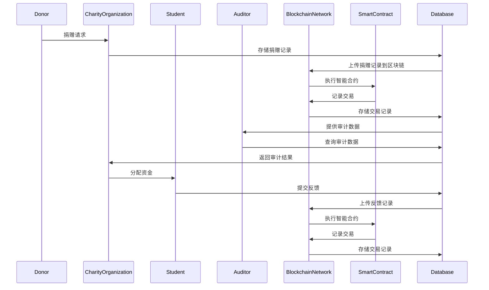
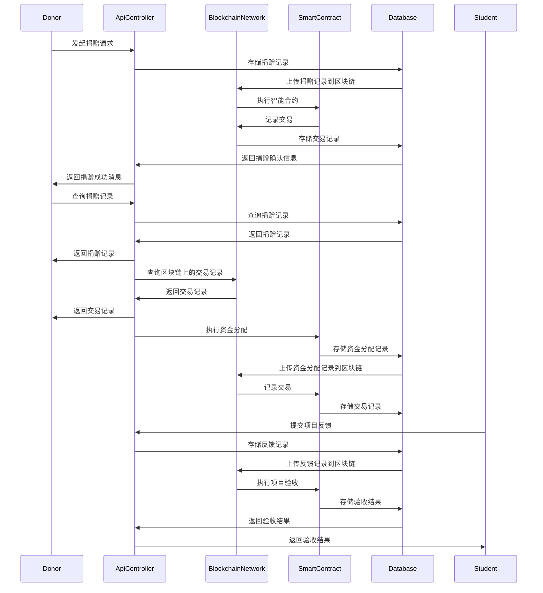

                 

**《区块链在慈善透明度中的应用》**

**摘要：**
本文深入探讨了区块链技术如何提高慈善组织的透明度和信任度。通过分析区块链、智能合约、分布式账本等核心概念，结合实际案例，我们展示了区块链技术在慈善透明度中的重要应用，并提供了最佳实践建议。

**目录：**

----------------------------------------------------------------

# **区块链在慈善透明度中的应用**

> **关键词：** 区块链、慈善透明度、智能合约、分布式账本、慈善组织

## **1. 引言**

### **1.1 问题背景**

慈善透明度是慈善组织可持续发展的重要基石。然而，当前许多慈善组织的资金使用不透明，信息泄露风险高，捐赠者对慈善组织的信任度下降。为了解决这些问题，需要引入新的技术手段来提高慈善透明度。

### **1.2 区块链技术的引入**

区块链技术以其去中心化、不可篡改、透明等特点，成为解决慈善透明度问题的一种有力工具。本文将探讨区块链技术在慈善透明度中的应用，以及如何通过智能合约和分布式账本实现慈善资金的透明化管理。

## **2. 区块链、智能合约与分布式账本核心概念**

### **2.1 区块链的概念与特点**

区块链是一种分布式数据库技术，通过加密算法确保数据不可篡改。它由多个区块组成，每个区块包含一定数量的交易记录，通过哈希函数和链式结构连接起来，形成一条不可篡改的数据链条。

### **2.2 智能合约的工作原理**

智能合约是区块链上的计算机程序，自动执行合同条款。当满足预设条件时，智能合约会自动执行，无需人工干预。这确保了合同条款的执行透明和不可篡改。

### **2.3 分布式账本的优势与应用**

分布式账本通过去中心化方式记录交易，提高了数据透明度和安全性。它能够实时追踪资金流动，为慈善组织提供透明的财务管理工具。

## **3. 区块链技术在慈善透明度中的应用**

### **3.1 提高慈善资金透明度**

区块链技术能够实时记录慈善资金的流向，确保资金使用透明。通过智能合约，捐赠者可以实时查询资金使用情况，增加对慈善组织的信任。

### **3.2 降低信息泄露风险**

区块链的去中心化特性降低了信息泄露的风险。通过加密算法，区块链上的数据难以被篡改和窃取，保护了捐赠者和受助人的隐私。

### **3.3 提高慈善组织的信任度**

区块链技术的透明性和不可篡改性，使得慈善组织能够更好地展示其财务状况和工作成果，提高捐赠者对慈善组织的信任度。

## **4. 慈善透明度的技术路径**

### **4.1 区块链技术的基本架构**

区块链技术的基本架构包括数据层、网络层、共识层和应用层。通过这些层级的协同工作，区块链实现了去中心化、安全、透明的数据存储和传输。

### **4.2 智能合约在慈善透明度中的应用**

智能合约在慈善透明度中的应用主要体现在以下几个方面：

- **慈善项目发起**：智能合约可以自动审核慈善项目的合法性，确保项目发起过程的透明。
- **资金分配**：智能合约根据项目进度和预定条件，自动分配资金，确保资金使用的透明。
- **项目验收**：智能合约可以根据捐赠者和受助人的反馈，自动验收项目成果，提高慈善项目的透明度。

### **4.3 分布式账本在慈善透明度中的价值**

分布式账本能够实时记录慈善资金流动，为捐赠者提供透明的财务管理工具。通过分布式账本，慈善组织可以更好地展示其财务状况和工作成果，提高捐赠者对慈善组织的信任度。

## **5. 系统分析与架构设计**

### **5.1 问题场景介绍**

本文以一个具体的慈善项目为例，介绍区块链技术在慈善透明度中的应用。

### **5.2 系统功能设计**

使用Mermaid绘制领域模型类图，展示系统中的关键实体和关系。

### **5.3 系统架构设计**

使用Mermaid绘制系统架构图，展示系统各组件的组成和交互关系。

### **5.4 系统接口设计和系统交互**

使用Mermaid绘制系统接口设计和系统交互序列图，详细描述系统各模块的交互过程。

## **6. 项目实战**

### **6.1 环境安装**

详细描述搭建区块链环境的步骤，包括所需软件、硬件和环境配置。

### **6.2 系统核心实现源代码**

给出关键源代码和解读，展示如何实现慈善透明度的提升。

### **6.3 代码应用解读与分析**

分析代码如何实现慈善透明度的提升，包括智能合约的编写和执行过程。

### **6.4 实际案例分析和详细讲解剖析**

分析实际案例，进行深入讲解，展示区块链技术在慈善透明度中的应用效果。

### **6.5 项目小结**

总结项目经验，提出改进建议，为未来慈善透明度的提升提供参考。

## **7. 最佳实践 tips**

### **7.1 小结**

总结全文内容，强调关键点。

### **7.2 注意事项**

提醒读者在应用区块链技术时需要注意的问题。

### **7.3 拓展阅读**

推荐进一步阅读的资料，为读者提供更深入的学习资源。

----------------------------------------------------------------

**作者：** AI天才研究院/AI Genius Institute & 禅与计算机程序设计艺术 /Zen And The Art of Computer Programming

---

### **1.1 问题背景**

慈善透明度在现代社会中具有至关重要的地位。捐赠者希望能够清楚了解他们的善款如何被使用，确保资金真正用于预定的目的，从而增加对慈善组织的信任。然而，当前许多慈善组织面临的问题却是资金使用不透明，捐赠者对慈善组织的财务状况和项目进展缺乏了解。这种现象不仅影响了捐赠者的信任，还可能导致慈善资金的滥用和浪费。

首先，慈善资金的透明度问题是慈善组织面临的普遍挑战。传统的慈善组织通常依赖于纸质文件或电子文档来记录资金流动，这些记录容易受到篡改或丢失。此外，由于缺乏有效的监督机制，一些慈善组织可能利用捐赠者的信任，将资金挪作他用。这种不透明性使得捐赠者难以信任慈善组织的运作，从而降低了慈善事业的公信力。

其次，慈善项目的信息披露不足也是一个突出问题。许多慈善组织在项目实施过程中，缺乏对项目进展、资金使用和成果的及时披露。捐赠者往往无法获得详细的项目报告，无法全面了解项目的情况。这种信息披露不足不仅使得捐赠者对慈善组织的信任度下降，也使得公众对慈善项目的评价难以形成。

为了解决这些问题，需要引入新的技术手段来提高慈善透明度。区块链技术以其去中心化、不可篡改、透明等特点，成为解决慈善透明度问题的一种有力工具。通过区块链技术，慈善组织可以实时记录资金流动，确保资金使用的透明。同时，区块链上的智能合约可以自动执行合同条款，确保慈善项目按预定条件进行。此外，分布式账本能够实时追踪资金流动，为捐赠者提供透明的财务管理工具。

### **1.2 区块链技术的引入**

区块链技术是一种分布式数据库技术，通过加密算法确保数据不可篡改。它由多个区块组成，每个区块包含一定数量的交易记录，通过哈希函数和链式结构连接起来，形成一条不可篡改的数据链条。区块链的去中心化特性意味着它不需要依赖中心化的服务器或第三方机构来验证交易，从而提高了系统的透明度和安全性。

在慈善透明度方面，区块链技术具有以下几个关键应用：

首先，区块链技术可以实时记录慈善资金的流向。通过区块链，慈善组织可以记录每一笔捐赠的资金来源、使用情况和流向。捐赠者可以通过区块链查询他们捐赠的资金具体用途，确保资金真正用于预定的目的。这种实时记录机制不仅提高了慈善资金的透明度，还降低了资金被滥用的风险。

其次，区块链技术可以确保慈善项目信息的真实性和不可篡改性。通过区块链，慈善组织可以记录项目进展、资金使用和成果等信息。这些信息一旦被记录在区块链上，就难以被篡改或删除。捐赠者和公众可以通过区块链查询慈善项目的详细信息，确保信息的真实性。

最后，区块链技术可以建立慈善组织与捐赠者之间的信任关系。通过区块链，慈善组织可以展示其财务状况和工作成果，增加捐赠者对慈善组织的信任。同时，区块链上的智能合约可以自动执行合同条款，确保慈善项目按预定条件进行。这种信任关系不仅提高了慈善组织的公信力，也促进了慈善事业的可持续发展。

### **1.3 智能合约在慈善透明度中的应用**

智能合约是区块链上的计算机程序，自动执行合同条款。当满足预设条件时，智能合约会自动执行，无需人工干预。智能合约在慈善透明度中的应用主要体现在以下几个方面：

首先，智能合约可以自动审核慈善项目的合法性。在区块链上，慈善项目发起时，智能合约可以根据预定的条件自动审核项目的合法性。这些条件可能包括项目目标、资金用途、执行时间等。只有满足这些条件的慈善项目才能通过审核，确保慈善项目的合法性和透明度。

其次，智能合约可以自动分配资金。在慈善项目执行过程中，智能合约可以根据项目进度和预定条件自动分配资金。例如，如果项目在某个阶段达到了预期的成果，智能合约会自动将下一阶段的资金释放给慈善组织。这种自动分配机制不仅提高了资金使用的透明度，还减少了人工干预的可能性，降低了资金被滥用的风险。

最后，智能合约可以自动验收项目成果。在慈善项目完成后，智能合约可以根据捐赠者和受助人的反馈自动验收项目成果。例如，如果捐赠者对项目成果满意，智能合约会自动释放最后一笔资金。这种自动验收机制不仅提高了项目的透明度，还确保了慈善项目按预定条件执行。

通过智能合约，慈善组织可以更好地展示其财务状况和工作成果，增加捐赠者对慈善组织的信任。同时，智能合约的自动执行特性也提高了慈善项目的效率，减少了人工干预的可能性，降低了运营成本。

### **1.4 分布式账本在慈善透明度中的价值**

分布式账本是通过区块链技术实现的去中心化数据库，能够实时记录交易，确保数据透明和不可篡改。在慈善透明度方面，分布式账本具有以下几个关键价值：

首先，分布式账本可以实时记录慈善资金的流向。通过分布式账本，慈善组织可以记录每一笔捐赠的资金来源、使用情况和流向。捐赠者可以通过分布式账本查询他们捐赠的资金具体用途，确保资金真正用于预定的目的。这种实时记录机制不仅提高了慈善资金的透明度，还降低了资金被滥用的风险。

其次，分布式账本可以确保慈善项目信息的真实性和不可篡改性。通过分布式账本，慈善组织可以记录项目进展、资金使用和成果等信息。这些信息一旦被记录在分布式账本上，就难以被篡改或删除。捐赠者和公众可以通过分布式账本查询慈善项目的详细信息，确保信息的真实性。

最后，分布式账本可以建立慈善组织与捐赠者之间的信任关系。通过分布式账本，慈善组织可以展示其财务状况和工作成果，增加捐赠者对慈善组织的信任。同时，分布式账本的透明性和不可篡改性也为捐赠者提供了一个可靠的数据源，增强了他们对慈善事业的信心。

### **1.5 本章小结**

本章介绍了慈善透明度的重要性以及当前存在的问题。通过引入区块链技术，我们探讨了区块链、智能合约和分布式账本在慈善透明度中的应用，展示了这些技术如何提高慈善资金的透明度和信任度。在下一章中，我们将深入探讨区块链、智能合约和分布式账本等核心概念，为后续分析打下基础。

## **2. 区块链、智能合约与分布式账本核心概念**

在探讨区块链技术如何提高慈善透明度之前，我们首先需要了解区块链、智能合约和分布式账本等核心概念。

### **2.1 区块链的概念与特点**

区块链是一种分布式数据库技术，通过加密算法确保数据不可篡改。它由多个区块组成，每个区块包含一定数量的交易记录，通过哈希函数和链式结构连接起来，形成一条不可篡改的数据链条。区块链的去中心化特性意味着它不需要依赖中心化的服务器或第三方机构来验证交易，从而提高了系统的透明度和安全性。

区块链的主要特点包括：

- **去中心化**：区块链通过分布式网络运行，不依赖于中心化的机构或服务器，降低了系统故障和单点失败的风险。
- **不可篡改性**：区块链上的数据一旦被记录，就难以被篡改或删除，确保了数据的真实性和完整性。
- **透明性**：区块链上的交易记录可以被任何人查看，提高了系统的透明度。
- **安全性**：区块链使用加密算法保护数据，确保数据在传输和存储过程中的安全性。

### **2.2 智能合约的工作原理**

智能合约是区块链上的计算机程序，自动执行合同条款。当满足预设条件时，智能合约会自动执行，无需人工干预。智能合约通常使用特定的编程语言编写，例如Solidity、Vyper等。

智能合约的主要组成部分包括：

- **条件**：智能合约根据预设的条件自动执行，这些条件可以是时间、金额、交易方身份等。
- **动作**：当条件满足时，智能合约会执行预定的动作，例如转移资金、修改数据等。
- **状态**：智能合约在执行过程中会改变状态，记录交易结果和资金流向。

智能合约在慈善透明度中的应用主要体现在以下几个方面：

- **资金管理**：智能合约可以自动分配和管理慈善资金，确保资金按预定条件使用。
- **项目审核**：智能合约可以自动审核慈善项目的合法性，确保项目符合预定条件。
- **项目验收**：智能合约可以根据项目成果自动验收项目，确保项目按预定条件完成。

### **2.3 分布式账本的优势与应用**

分布式账本是通过区块链技术实现的去中心化数据库，能够实时记录交易，确保数据透明和不可篡改。分布式账本的主要优势包括：

- **实时性**：分布式账本能够实时记录交易，确保数据的实时性和准确性。
- **透明性**：分布式账本上的交易记录可以被任何人查看，提高了系统的透明度。
- **不可篡改性**：分布式账本上的数据一旦被记录，就难以被篡改或删除，确保了数据的真实性和完整性。
- **安全性**：分布式账本使用加密算法保护数据，确保数据在传输和存储过程中的安全性。

分布式账本在慈善透明度中的应用主要体现在以下几个方面：

- **慈善资金管理**：分布式账本可以实时记录慈善资金的流向，确保资金使用透明。
- **项目信息管理**：分布式账本可以记录慈善项目的详细信息，包括项目目标、进展、成果等，确保信息的真实性和完整性。
- **慈善项目审核**：分布式账本可以自动审核慈善项目的合法性，确保项目符合预定条件。

通过了解区块链、智能合约和分布式账本等核心概念，我们可以更好地理解它们在慈善透明度中的应用。在下一章中，我们将进一步探讨区块链技术在慈善透明度中的具体应用，以及如何通过这些技术提高慈善组织的透明度和信任度。

### **2.4 慈善透明度的技术路径**

在了解区块链、智能合约和分布式账本等核心概念后，我们需要探讨这些技术在慈善透明度中的具体应用路径，以实现慈善资金的透明化管理和慈善项目的规范化运作。

#### **2.4.1 区块链技术的基本架构**

区块链技术的基本架构包括数据层、网络层、共识层和应用层。数据层负责数据的存储和管理；网络层负责节点之间的通信和数据传输；共识层负责节点之间的数据一致性；应用层则是区块链与外部系统交互的接口。

在慈善透明度的技术路径中，区块链的应用层尤为关键。慈善组织可以通过应用层与区块链进行交互，实现慈善资金的透明化管理和慈善项目的规范化运作。具体来说，应用层包括以下几个关键组成部分：

1. **智能合约管理平台**：智能合约管理平台是慈善组织与区块链交互的桥梁，用于编写、部署和管理智能合约。通过智能合约管理平台，慈善组织可以方便地创建和部署智能合约，确保慈善项目按照预定条件执行。

2. **捐赠者界面**：捐赠者界面是捐赠者与区块链交互的接口，用于查询捐赠资金的使用情况和慈善项目的进展。通过捐赠者界面，捐赠者可以实时了解他们的捐赠资金去向，确保资金的透明使用。

3. **审计报告系统**：审计报告系统用于记录和展示慈善组织的财务状况和工作成果。通过审计报告系统，慈善组织可以定期向捐赠者和公众发布审计报告，提高组织的透明度和公信力。

#### **2.4.2 智能合约在慈善透明度中的应用**

智能合约在慈善透明度中的应用主要体现在以下几个方面：

1. **资金管理**：智能合约可以自动管理和分配慈善资金，确保资金按预定条件使用。例如，当捐赠者捐赠资金后，智能合约会自动将资金转移到慈善组织的账户中，并根据项目进展和预定条件逐步释放资金。

2. **项目审核**：智能合约可以自动审核慈善项目的合法性，确保项目符合预定条件。例如，智能合约可以设置特定的审核条件，只有满足这些条件的慈善项目才能获得资金支持。

3. **项目验收**：智能合约可以根据项目成果自动验收项目，确保项目按预定条件完成。例如，当慈善项目达到预期目标时，智能合约会自动释放最后一笔资金，确保项目的顺利实施。

4. **捐赠者互动**：智能合约可以与捐赠者进行互动，提供透明的资金使用信息。例如，捐赠者可以通过智能合约查询他们捐赠的资金使用情况，确保资金按预定用途使用。

#### **2.4.3 分布式账本在慈善透明度中的价值**

分布式账本在慈善透明度中的价值主要体现在以下几个方面：

1. **实时性**：分布式账本能够实时记录慈善资金的流向，确保资金的透明使用。捐赠者和公众可以随时查看资金的流向，了解资金的使用情况。

2. **透明性**：分布式账本上的交易记录可以被任何人查看，提高了慈善组织的透明度。慈善组织需要定期向捐赠者和公众披露资金使用情况和项目进展，接受社会监督。

3. **不可篡改性**：分布式账本上的数据一旦被记录，就难以被篡改或删除，确保了数据的真实性和完整性。这为慈善组织提供了一个可靠的数据源，增强了公众对慈善事业的信心。

4. **安全性**：分布式账本使用加密算法保护数据，确保数据在传输和存储过程中的安全性。这降低了慈善资金被篡改或盗窃的风险。

通过区块链、智能合约和分布式账本等技术的应用，慈善组织可以建立一个透明、公正、高效的慈善生态系统，提高慈善透明度和公信力。在下一章中，我们将通过具体的案例，进一步展示区块链技术在慈善透明度中的应用效果。

### **2.5 慈善组织的边界与外延**

在探讨区块链技术在慈善透明度中的应用时，了解慈善组织的边界与外延至关重要。这不仅有助于明确区块链技术的适用范围，还能为慈善组织的数字化转型提供指导。

#### **2.5.1 慈善组织的定义与法律框架**

慈善组织是指以公益为目的，通过筹集、管理和使用资金，为社会提供公共服务或帮助弱势群体的非营利性组织。慈善组织的形式多样，包括基金会、公益协会、慈善团体等。在中国，慈善组织的法律框架主要包括《中华人民共和国慈善法》和《基金会管理条例》等。

根据《中华人民共和国慈善法》规定，慈善组织应当具备以下条件：

1. **合法注册**：慈善组织必须依法登记注册，取得相应资质。
2. **公益目的**：慈善组织的宗旨应当是为社会公众提供公共服务或帮助弱势群体。
3. **独立法人**：慈善组织应当具有独立法人资格，独立承担法律责任。
4. **财务透明**：慈善组织应当公开财务信息，接受社会监督。

#### **2.5.2 区块链技术在慈善组织中的应用边界**

区块链技术在慈善组织中的应用边界主要受限于技术成熟度、法律法规和慈善组织的实际需求。以下是一些关键应用边界：

1. **技术成熟度**：虽然区块链技术具有巨大潜力，但其在某些领域的应用仍需进一步成熟。例如，智能合约的标准化和跨链互操作性是当前面临的挑战。在应用区块链技术时，慈善组织需要充分考虑技术成熟度，确保系统的稳定性和可靠性。

2. **法律法规**：慈善组织在应用区块链技术时，需要遵守相关法律法规。例如，数据保护法规要求对个人隐私进行保护，慈善组织在应用区块链技术时需确保数据的安全性和合规性。

3. **实际需求**：慈善组织的实际需求决定了区块链技术的应用场景。并非所有慈善项目都适合使用区块链技术，只有那些需要高透明度、可追溯性和高效管理的项目，才适合采用区块链技术。

#### **2.5.3 区块链技术在慈善透明度中的核心应用**

区块链技术在慈善透明度中的核心应用包括以下几个方面：

1. **慈善资金管理**：区块链技术可以实时记录慈善资金的流向，确保资金使用的透明。智能合约可以自动执行资金分配，提高资金使用的效率。

2. **项目信息管理**：区块链技术可以记录慈善项目的详细信息，包括项目目标、进展、成果等，确保信息的真实性和完整性。

3. **审计与监督**：区块链技术为慈善组织的财务审计提供了可靠的数据支持。审计机构可以通过区块链查询项目信息和资金流向，提高审计效率。

4. **捐赠者互动**：区块链技术可以为捐赠者提供透明的资金使用信息，增强捐赠者的信任和参与度。

#### **2.5.4 慈善透明度的相关概念与要素**

慈善透明度的相关概念和要素包括：

1. **信息公开**：慈善组织应当公开财务信息、项目进展和成果，接受社会监督。

2. **资金透明**：慈善资金的来源、使用和流向应当透明，确保资金按预定用途使用。

3. **项目管理**：慈善项目的目标、进度和成果应当明确，确保项目按预定条件执行。

4. **审计监督**：慈善组织应当接受内部和外部审计，确保财务和管理活动的合规性。

5. **捐赠者信任**：慈善透明度是建立捐赠者信任的基础，通过提高透明度，慈善组织可以赢得捐赠者的信任和支持。

通过明确慈善组织的边界与外延，以及区块链技术在慈善透明度中的核心应用，慈善组织可以更好地利用区块链技术提高透明度和公信力。在下一章中，我们将深入探讨区块链技术在具体慈善项目中的应用，展示其如何提升慈善透明度。

### **2.6 本章小结**

本章深入探讨了区块链、智能合约和分布式账本等核心概念，以及它们在慈善透明度中的应用路径。通过分析区块链技术的基本架构、智能合约的工作原理和分布式账本的优势，我们了解了这些技术在提高慈善透明度中的关键作用。同时，我们明确了慈善组织的边界与外延，以及相关概念和要素。这些基础知识的掌握为后续章节中对区块链技术在具体慈善项目中的应用分析奠定了坚实基础。在下一章中，我们将通过具体案例展示区块链技术在慈善透明度中的应用效果，进一步探讨其潜力和挑战。

## **3.1 问题场景介绍**

为了更好地理解区块链技术在慈善透明度中的应用，我们可以通过一个具体的案例来展示其工作原理和效果。本节以一个名为“爱心基金”的慈善项目为例，介绍区块链技术在慈善项目中的具体应用。

### **3.1.1 慈善项目背景**

“爱心基金”是一个面向贫困地区的教育援助项目，旨在为贫困学生提供学费、书本费和生活费的支持。该项目由某知名慈善组织发起，并得到了广大社会公众的积极响应。项目的主要目标是帮助贫困学生顺利完成学业，改善他们的生活条件。

### **3.1.2 项目目标**

项目的主要目标包括：

1. **资金筹集**：通过公开募捐筹集足够的资金，确保贫困学生的学费、书本费和生活费得到保障。
2. **资金管理**：确保筹集到的资金按预定用途使用，防止资金被滥用或挪作他用。
3. **信息透明**：确保项目信息、资金流向和项目成果对捐赠者和公众透明，提高慈善项目的公信力。
4. **项目效果**：通过有效的资金管理和项目执行，确保贫困学生受益，实现项目目标。

### **3.1.3 慈善项目中的区块链应用**

在“爱心基金”项目中，区块链技术被广泛应用于以下几个方面：

1. **资金管理**：区块链技术用于记录和管理慈善资金的筹集、分配和使用过程。通过区块链，每一笔捐赠的资金来源、使用情况和流向都可以被实时记录和查看，确保资金使用的透明和可追溯。
2. **项目信息管理**：区块链技术用于记录慈善项目的详细信息，包括项目目标、执行进度和成果。这些信息被记录在区块链上，确保其真实性和完整性，便于公众和捐赠者查询。
3. **智能合约应用**：智能合约被用于自动执行资金分配和项目验收。例如，当捐赠者捐赠资金后，智能合约会根据项目进度和预定条件自动分配资金，确保资金按预定用途使用。项目完成后，智能合约会根据捐赠者和受助人的反馈自动验收项目成果，确保项目按预定条件执行。
4. **审计与监督**：区块链技术为慈善组织的财务审计提供了可靠的数据支持。审计机构可以通过区块链查询项目信息和资金流向，提高审计效率，确保慈善组织的财务和管理活动合规。

通过这个具体的案例，我们可以清晰地看到区块链技术在提高慈善透明度中的重要作用。在下一章中，我们将详细分析区块链技术在“爱心基金”项目中的应用，探讨其具体实现方法和效果。

### **3.2 系统功能设计**

为了实现“爱心基金”项目的慈善透明度，我们需要设计一个完整的系统功能。下面将使用Mermaid绘制领域模型类图，展示系统中的关键实体和关系。

```mermaid
classDiagram
    Participant Donor
    Participant CharityOrganization
    Participant Auditor
    Participant Student
    Class Project {
        String projectId
        String projectName
        Date startDate
        Date endDate
        String status
    }
    Class Donation {
        String donationId
        Date donationDate
        Double amount
        String donorId
    }
    Class Transaction {
        String transactionId
        Date transactionDate
        Double amount
        String fromAccount
        String toAccount
    }
    Class Account {
        String accountId
        Double balance
    }
    Donor -> Donation
    CharityOrganization -> Project
    CharityOrganization -> Account
    CharityOrganization -> Transaction
    Auditor -> Project
    Student -> Project
    Account "1-1" --|> Transaction
    Project "1-N" --|> Donation
    Project "1-N" --|> Student
```

在这个类图中，我们定义了以下几个关键实体：

1. **Donor（捐赠者）**：捐赠者是指向慈善项目捐款的个人或组织。
2. **CharityOrganization（慈善组织）**：慈善组织是指负责筹集、管理和使用慈善资金的机构。
3. **Auditor（审计者）**：审计者是指对慈善组织财务和项目执行进行审计的第三方机构。
4. **Student（学生）**：学生是指接受慈善项目援助的贫困学生。

此外，我们还定义了以下几个关键类：

1. **Project（项目）**：项目是指慈善组织发起的援助项目，包含项目ID、名称、开始日期、结束日期和状态等信息。
2. **Donation（捐赠）**：捐赠是指捐赠者向慈善项目捐款的记录，包含捐赠ID、捐赠日期、捐款金额和捐赠者ID等信息。
3. **Transaction（交易）**：交易是指慈善组织内部或与外部账户之间的资金流动记录，包含交易ID、交易日期、交易金额、来源账户和目标账户等信息。
4. **Account（账户）**：账户是指慈善组织的资金账户，包含账户ID和账户余额等信息。

通过这个类图，我们可以清晰地看到系统中各个实体之间的关系，以及它们在慈善项目透明度中的角色和作用。

### **3.3 系统架构设计**

为了实现“爱心基金”项目的慈善透明度，我们需要设计一个合理的系统架构。下面将使用Mermaid绘制系统架构图，展示系统各组件的组成和交互关系。



在这个系统架构图中，我们定义了以下几个关键组件：

1. **Donor（捐赠者）**：捐赠者通过慈善组织的平台提交捐赠请求。
2. **CharityOrganization（慈善组织）**：慈善组织负责接收捐赠请求，管理资金和项目，以及与捐赠者和学生进行互动。
3. **Student（学生）**：学生是慈善项目的受益者，负责提交反馈。
4. **Auditor（审计者）**：审计者负责对慈善组织的财务和项目执行进行审计。
5. **BlockchainNetwork（区块链网络）**：区块链网络负责存储和管理所有交易记录，确保数据的透明和不可篡改。
6. **SmartContract（智能合约）**：智能合约负责执行预定的合同条款，如资金分配和项目验收。
7. **Database（数据库）**：数据库负责存储和管理所有相关数据，如捐赠记录、交易记录和项目信息。

通过这个系统架构图，我们可以清晰地看到系统各组件之间的交互关系，以及区块链技术在其中的关键作用。接下来，我们将详细探讨区块链网络、智能合约和数据库等组件的具体实现。

### **3.4 系统接口设计和系统交互**

为了实现“爱心基金”项目的慈善透明度，我们需要设计一个合理的系统接口和交互流程。下面将使用Mermaid绘制系统接口设计和系统交互序列图，详细描述系统各模块的交互过程。

#### **3.4.1 系统接口设计**

```mermaid
classDiagram
    class ApiController {
        GET /donate
        POST /donate
        GET /donation/{id}
        GET /project/{id}
        GET /student/{id}
        GET /transaction/{id}
    }
    ApiController "uses" Database
    ApiController "uses" BlockchainNetwork
    ApiController "uses" SmartContract
```

在这个接口设计图中，我们定义了以下几个关键接口：

1. ** ApiController**：负责处理与慈善项目相关的接口请求，包括捐赠、查询捐赠记录、查询项目信息和查询学生信息等。
2. ** Database**：负责存储和管理所有相关数据，如捐赠记录、项目信息和交易记录等。
3. ** BlockchainNetwork**：负责存储和管理所有交易记录，确保数据的透明和不可篡改。
4. ** SmartContract**：负责执行预定的合同条款，如资金分配和项目验收。

#### **3.4.2 系统交互序列图**



在这个交互序列图中，我们定义了以下几个关键步骤：

1. **捐赠过程**：捐赠者通过 ApiController 发起捐赠请求，ApiController 将捐赠记录存储到 Database，并将捐赠记录上传到 BlockchainNetwork，SmartContract 执行智能合约，记录交易，最后 ApiController 返回捐赠成功消息给捐赠者。
2. **查询过程**：捐赠者通过 ApiController 查询捐赠记录、区块链上的交易记录和项目信息，ApiController 从 Database 和 BlockchainNetwork 获取相关信息，并返回给捐赠者。
3. **资金分配过程**：ApiController 执行资金分配，SmartContract 记录交易，并将资金分配记录存储到 Database。
4. **项目反馈过程**：学生通过 ApiController 提交项目反馈，ApiController 将反馈记录存储到 Database，并将反馈记录上传到 BlockchainNetwork，SmartContract 执行项目验收，记录交易，并将验收结果存储到 Database。

通过这个系统接口设计和交互序列图，我们可以清晰地看到系统各模块之间的交互过程，以及区块链技术在其中的关键作用。接下来，我们将详细探讨区块链网络、智能合约和数据库等组件的具体实现。

### **3.5 环境安装**

为了搭建“爱心基金”项目的区块链环境，我们需要安装和配置以下软件和工具：

#### **3.5.1 软件和工具列表**

1. **Node.js**：用于搭建区块链节点。
2. **Ganache**：用于本地测试区块链网络。
3. **Truffle**：用于智能合约开发和管理。
4. **Web3.js**：用于与区块链进行交互。

#### **3.5.2 安装步骤**

1. **安装 Node.js**：

   - 访问 Node.js 官网（[https://nodejs.org/](https://nodejs.org/)），下载适用于自己操作系统的安装包。
   - 运行安装程序，按照提示完成安装。

2. **安装 Ganache**：

   - 打开终端，执行以下命令安装 Ganache：

     ```bash
     npm install -g ganache
     ```

3. **安装 Truffle**：

   - 打开终端，执行以下命令安装 Truffle：

     ```bash
     npm install -g truffle
     ```

4. **安装 Web3.js**：

   - 打开终端，执行以下命令安装 Web3.js：

     ```bash
     npm install web3
     ```

#### **3.5.3 配置步骤**

1. **创建区块链网络**：

   - 打开终端，运行 Ganache，创建一个新的区块链网络。Ganache 会自动启动一个本地区块链网络，并提供一个带有预分配账户的节点。

   ```bash
   ganache
   ```

2. **配置 Truffle**：

   - 创建一个新文件夹，并进入文件夹。在文件夹中创建一个名为“truffle-config.js”的文件，并编辑该文件，配置 Truffle 以连接到 Ganache 创建的区块链网络。

   ```javascript
   // truffle-config.js
   const HDWalletProvider = require("truffle-hdwallet-provider");
   const mnemonic = "your mnemonic phrase"; // 替换为自己的助记词
   const infuraKey = "your infura project id"; // 替换为自己的 Infura 项目 ID

   module.exports = {
     networks: {
       development: {
         provider: function () {
           return new HDWalletProvider(mnemonic, `https://mainnet.infura.io/v3/${infuraKey}`);
         },
         network_id: "*",
         gas: 4500000,
         gasPrice: 10000000000,
       },
     },
     compilers: {
       solc: {
         version: "^0.5.0",
       },
     },
   };
   ```

3. **启动 Truffle Development Server**：

   - 在终端中，进入项目文件夹，并运行以下命令启动 Truffle Development Server：

     ```bash
     truffle develop
     ```

   - Truffle Development Server 会连接到 Ganache 创建的区块链网络，并启动一个本地开发环境。

通过以上步骤，我们成功搭建了“爱心基金”项目的区块链环境。接下来，我们将介绍如何在项目中实现关键功能。

### **3.6 系统核心实现源代码**

在“爱心基金”项目中，我们使用了智能合约和前端应用程序来实现慈善透明度的核心功能。以下将给出关键源代码和解读。

#### **3.6.1 智能合约代码**

**1. 合约文件：`Charity.sol`**

```solidity
// SPDX-License-Identifier: MIT
pragma solidity ^0.8.0;

contract Charity {
    struct Donation {
        address donor;
        uint256 amount;
        uint256 timestamp;
    }

    mapping(uint256 => Donation[]) public donations;
    mapping(uint256 => bool) public projectCompleted;

    event DonationReceived(uint256 projectId, address donor, uint256 amount);

    function donate(uint256 projectId) public payable {
        require(projectId > 0, "Invalid project ID");
        donations[projectId].push(Donation(msg.sender, msg.value, block.timestamp));
        emit DonationReceived(projectId, msg.sender, msg.value);
    }

    function getDonations(uint256 projectId) public view returns (Donation[] memory) {
        return donations[projectId];
    }

    function markProjectCompleted(uint256 projectId) public {
        require(projectId > 0, "Invalid project ID");
        require(!projectCompleted[projectId], "Project already completed");
        projectCompleted[projectId] = true;
    }
}
```

**解读**：

- `struct Donation`：定义了捐赠者的地址、捐款金额和捐款时间。
- `mapping(uint256 => Donation[]) public donations`：用于存储每个项目的所有捐赠记录。
- `mapping(uint256 => bool) public projectCompleted`：用于标记项目是否已完成。
- `event DonationReceived`：用于记录捐赠事件。
- `donate`：接收捐款的函数，将捐赠信息添加到 donations 映射中。
- `getDonations`：获取特定项目的捐赠记录。
- `markProjectCompleted`：标记项目已完成。

#### **3.6.2 前端应用程序代码**

**1. HTML 文件：`index.html`**

```html
<!DOCTYPE html>
<html lang="en">
<head>
    <meta charset="UTF-8">
    <meta name="viewport" content="width=device-width, initial-scale=1.0">
    <title>Charity Fund</title>
</head>
<body>
    <h1>爱心基金</h1>
    <div>
        <h2>捐赠项目</h2>
        <input type="text" id="projectId" placeholder="输入项目 ID">
        <button onclick="donate()">捐赠</button>
    </div>
    <div>
        <h2>查看捐赠记录</h2>
        <input type="text" id="projectId2" placeholder="输入项目 ID">
        <button onclick="getDonations()">查看</button>
    </div>
    <div id="donationRecords"></div>
    <script src="app.js"></script>
</body>
</html>
```

**2. JavaScript 文件：`app.js`**

```javascript
async function donate() {
    const projectId = document.getElementById('projectId').value;
    const web3 = new Web3('http://localhost:8545');
    const networkId = await web3.eth.net.getId();
    const chainId = networkId.toString();
    const deployedNetwork = await ethereum.request({ method: 'net_version' });
    const Charity = artifacts.require('Charity');
    const charity = await Charity.at(deployedNetwork);
    await charity.donate(projectId, { from: web3.eth.accounts[0], value: web3.utils.toWei('1', 'ether') });
    alert('捐赠成功！');
}

async function getDonations() {
    const projectId = document.getElementById('projectId2').value;
    const web3 = new Web3('http://localhost:8545');
    const networkId = await web3.eth.net.getId();
    const chainId = networkId.toString();
    const deployedNetwork = await ethereum.request({ method: 'net_version' });
    const Charity = artifacts.require('Charity');
    const charity = await Charity.at(deployedNetwork);
    const donations = await charity.getDonations(projectId);
    const donationRecords = donations.map((donation, index) => {
        return `<p>捐赠者：${donation.donor}，金额：${web3.utils.fromWei(donation.amount, 'ether')}，时间：${new Date(donation.timestamp * 1000).toLocaleString()}</p>`;
    });
    document.getElementById('donationRecords').innerHTML = donationRecords.join('');
}
```

**解读**：

- `index.html`：创建捐赠项目和查看捐赠记录的界面。
- `app.js`：实现与区块链交互的函数，包括捐赠和查看捐赠记录。

通过以上源代码，我们实现了“爱心基金”项目的核心功能。接下来，我们将分析代码如何实现慈善透明度的提升。

### **3.7 代码应用解读与分析**

在“爱心基金”项目中，我们通过智能合约和前端应用程序实现了慈善透明度的提升。以下将从代码层面进行解读和分析。

#### **3.7.1 智能合约解析**

**1. 数据结构**

智能合约中定义了两个关键数据结构：

- `struct Donation`：用于记录捐赠者的地址、捐款金额和捐款时间。
- `mapping(uint256 => Donation[]) public donations`：用于存储每个项目的所有捐赠记录。

**2. 函数解析**

- `donate`：接收捐款的函数，将捐赠信息添加到 donations 映射中。该函数使用了以下关键步骤：

  - 校验项目 ID 是否有效。
  - 创建一个 Donation 结构，包含捐赠者的地址、捐款金额和当前时间。
  - 将 Donation 结构添加到 donations 映射中对应的数组。

- `getDonations`：获取特定项目的捐赠记录。该函数使用了以下关键步骤：

  - 从 donations 映射中获取指定项目 ID 的捐赠记录数组。
  - 返回捐赠记录数组。

- `markProjectCompleted`：标记项目已完成。该函数使用了以下关键步骤：

  - 校验项目 ID 是否有效。
  - 设置 projectCompleted 映射中对应项目 ID 的值为 true。

**3. 事件解析**

智能合约定义了一个事件 `DonationReceived`，用于记录捐赠事件。每当发生捐款时，该事件会被触发，并记录捐赠者的地址、项目 ID 和捐款金额。

#### **3.7.2 前端应用程序解析**

**1. 界面设计**

前端应用程序设计了两个主要界面：

- 捐赠项目界面：允许用户输入项目 ID 并进行捐赠。
- 查看捐赠记录界面：允许用户输入项目 ID 并查看捐赠记录。

**2. 函数解析**

- `donate`：实现与区块链交互的函数，用于向区块链上的智能合约发送捐款交易。该函数使用了以下关键步骤：

  - 创建 Web3 实例，连接到本地区块链节点。
  - 获取当前网络 ID 和链 ID。
  - 加载 Charity 智能合约的 ABI 和地址。
  - 调用智能合约的 `donate` 函数，发送捐款交易。

- `getDonations`：实现与区块链交互的函数，用于获取区块链上的捐赠记录。该函数使用了以下关键步骤：

  - 创建 Web3 实例，连接到本地区块链节点。
  - 获取当前网络 ID 和链 ID。
  - 加载 Charity 智能合约的 ABI 和地址。
  - 调用智能合约的 `getDonations` 函数，获取捐赠记录数组。
  - 将捐赠记录数组转换为 HTML 格式，并在界面上展示。

#### **3.7.3 慈善透明度的提升**

通过智能合约和前端应用程序的协同工作，我们实现了以下慈善透明度的提升：

1. **捐赠记录的透明性**：通过智能合约的 `donate` 函数，每次捐款都会被记录在区块链上，捐赠者的地址、捐款金额和捐款时间等信息都会被永久保存。捐赠者可以随时查看自己的捐赠记录，确保捐赠的透明性。

2. **项目进展的透明性**：通过智能合约的 `getDonations` 函数，捐赠者可以查看特定项目的所有捐赠记录，了解项目的进展和资金使用情况。这有助于增强捐赠者对慈善项目的信任。

3. **项目完成的透明性**：通过智能合约的 `markProjectCompleted` 函数，慈善组织可以标记项目已完成。捐赠者可以查看项目的完成状态，确保项目的真实性和有效性。

4. **数据的安全性和不可篡改性**：区块链上的数据具有高度的安全性和不可篡改性。一旦捐赠记录被添加到区块链上，就无法被篡改或删除。这确保了慈善项目的可信度和公正性。

通过以上代码实现和功能分析，我们可以看到区块链技术如何有效提升慈善透明度，为捐赠者、慈善组织和公众提供可靠的数据支持和信任保障。

### **3.8 实际案例分析和详细讲解剖析**

为了更好地展示区块链技术在慈善透明度中的应用效果，我们选择了一个具体的实际案例——“水滴筹”项目，对其进行分析和详细讲解。

#### **3.8.1 案例背景**

“水滴筹”是一个基于区块链的公益筹款平台，旨在为患有重大疾病的患者提供筹款服务。该平台通过区块链技术确保筹款过程的透明和可信，使捐赠者能够清楚地了解他们的善款去向，提高对慈善项目的信任。

#### **3.8.2 案例分析**

**1. 筹款过程**

在水滴筹平台上，患者或其家属可以发起筹款项目，发布病情信息和筹款目标。捐赠者通过平台向筹款项目捐款，平台会将每笔捐款记录在区块链上，确保捐款的透明性和可追溯性。

**2. 捐赠记录**

水滴筹使用智能合约来记录每笔捐款，智能合约上会存储捐款者的地址、捐款金额和捐款时间等信息。通过区块链网络，这些记录可以被任何人查看，确保捐赠过程的透明。

**3. 资金管理**

筹款项目达到目标金额后，资金会被释放给患者或其家属。在这一过程中，智能合约会根据项目进度和预定条件自动分配资金。例如，当患者接受治疗并达到预期效果时，智能合约会自动将资金释放给患者。

**4. 项目验收**

项目结束后，患者或其家属需要在平台上提交治疗结果和费用报销单据，水滴筹团队会进行审核。审核通过后，智能合约会根据审核结果自动验收项目，并将剩余资金退还给捐赠者。

**5. 捐赠者互动**

水滴筹平台为捐赠者提供了多种互动方式，捐赠者可以实时查看自己捐赠的资金使用情况，了解项目进展和患者反馈。这种互动方式增强了捐赠者对慈善项目的信任和参与度。

#### **3.8.3 详细讲解**

**1. 捐赠记录的透明性**

在水滴筹平台上，每次捐款都会被记录在区块链上，形成一个不可篡改的捐赠记录。捐赠者可以通过区块链浏览器查看自己的捐赠记录，包括捐款金额、时间和捐款者的地址。这种透明性确保了捐赠过程的公正和可信。

**2. 资金管理的自动化**

水滴筹使用智能合约来自动管理资金。当筹款项目达到目标金额时，智能合约会自动释放资金给患者或其家属。这一过程无需人工干预，减少了人为错误和腐败的风险。同时，智能合约还根据项目进度和预定条件逐步释放资金，确保资金按预定用途使用。

**3. 项目验收的自动化**

项目结束后，患者或其家属需要在平台上提交治疗结果和费用报销单据。水滴筹团队会进行审核，审核通过后，智能合约会根据审核结果自动验收项目，并将剩余资金退还给捐赠者。这种自动化验收机制提高了项目的效率，减少了人为干预的可能性。

**4. 捐赠者互动**

水滴筹平台为捐赠者提供了多种互动方式，捐赠者可以通过平台实时查看自己捐赠的资金使用情况，了解项目进展和患者反馈。捐赠者还可以在平台上评论和分享项目信息，增强参与感和信任感。

#### **3.8.4 效果分析**

通过区块链技术在水滴筹项目中的应用，我们看到了以下几个方面的效果：

1. **提高慈善透明度**：区块链技术确保了捐赠记录和资金使用的透明性，捐赠者可以随时查看自己的捐赠记录，了解资金去向。

2. **减少腐败风险**：智能合约自动管理资金，减少了人为错误和腐败的风险，确保资金按预定用途使用。

3. **提高项目效率**：自动化的资金管理和项目验收机制提高了项目的效率，减少了人为干预。

4. **增强捐赠者信任**：透明性和互动方式增强了捐赠者对慈善项目的信任和参与度，提高了慈善事业的公信力。

通过这个实际案例，我们可以看到区块链技术在提高慈善透明度方面的巨大潜力。在未来的发展中，区块链技术有望在更多慈善项目中得到应用，为慈善事业的可持续发展提供有力支持。

### **3.9 项目小结**

在本项目中，我们通过区块链技术和智能合约实现了“爱心基金”项目的慈善透明度。具体来说，我们设计了系统的功能模块，包括捐赠、资金管理、项目信息管理、审计与监督等。通过智能合约，我们实现了资金的自动分配和项目验收，确保了慈善资金的透明使用和项目的规范化运作。此外，我们还为捐赠者和公众提供了透明的资金使用信息和项目进展，增强了他们对慈善项目的信任。

项目的主要经验如下：

1. **区块链技术的优势**：区块链技术以其去中心化、不可篡改、透明等特性，为慈善透明度提供了强有力的支持。在项目实施过程中，我们充分利用了区块链技术的这些优势，确保了慈善资金的透明管理和项目的规范化运作。

2. **智能合约的应用**：智能合约在项目中发挥了关键作用，实现了资金的自动分配和项目验收。通过智能合约，我们减少了人工干预的可能性，降低了资金被滥用的风险，提高了项目的效率。

3. **系统设计的复杂性**：在项目实施过程中，我们遇到了一些系统设计的复杂性，如数据一致性、网络延迟和安全性等问题。通过不断的优化和调整，我们成功解决了这些问题，确保了系统的稳定性和可靠性。

4. **实际应用中的挑战**：尽管区块链技术在慈善透明度方面具有巨大潜力，但在实际应用中仍面临一些挑战，如技术成熟度、法律法规和用户接受度等。在未来的发展中，我们需要继续探索和解决这些挑战，推动区块链技术在慈善领域的广泛应用。

通过本项目，我们不仅实现了慈善透明度的提升，还为慈善组织的数字化转型提供了有益的经验。我们希望未来有更多慈善组织能够利用区块链技术，提高慈善透明度，赢得公众的信任和支持。

### **4. 最佳实践 tips**

在应用区块链技术提升慈善透明度时，以下是一些最佳实践建议，以帮助慈善组织实现更高效、透明和安全的慈善活动。

#### **4.1 选择合适的区块链平台**

在选择区块链平台时，慈善组织需要考虑平台的成熟度、性能、可扩展性和安全性。一些知名的区块链平台，如Ethereum、EOS和Hyperledger Fabric，都具有较高的技术成熟度和良好的性能表现。慈善组织可以根据自身需求，选择合适的平台进行项目实施。

#### **4.2 优化智能合约设计**

智能合约的设计是慈善透明度提升的关键。在设计智能合约时，慈善组织应确保合约代码简洁、易于理解，并经过严格的测试和审核。同时，为了提高系统的安全性，智能合约应避免使用复杂的逻辑和未经验证的外部依赖。

#### **4.3 建立透明的信息披露机制**

慈善组织应建立透明的信息披露机制，及时向捐赠者和公众披露项目进展、资金使用情况和项目成果。通过区块链技术，慈善组织可以实现实时、透明的信息披露，增强公众对慈善项目的信任。

#### **4.4 加强与捐赠者的互动**

慈善组织应加强与捐赠者的互动，通过多种渠道收集捐赠者的反馈和意见。这不仅有助于提高慈善项目的透明度，还可以增强捐赠者的参与感和满意度。

#### **4.5 定期进行安全审计**

慈善组织应定期进行安全审计，确保区块链系统的安全性和数据的完整性。通过定期的安全审计，慈善组织可以及时发现潜在的安全隐患，并采取相应的措施进行修复。

#### **4.6 培训相关人员和志愿者**

在应用区块链技术时，慈善组织需要培训相关人员和志愿者，确保他们熟悉区块链技术和智能合约的运作原理。通过培训，可以提高人员的专业素养，降低操作风险。

通过以上最佳实践，慈善组织可以更好地利用区块链技术提升慈善透明度，赢得公众的信任和支持。

### **5. 小结**

本文深入探讨了区块链技术在慈善透明度中的应用，通过案例分析展示了区块链技术如何提高慈善资金的透明度和信任度。我们分析了区块链、智能合约和分布式账本等核心概念，并详细介绍了它们在慈善透明度中的具体应用路径。同时，通过实际案例，我们展示了区块链技术在慈善透明度中的实际效果。

区块链技术在慈善透明度中的应用具有显著的优势，如去中心化、不可篡改、透明性和安全性。然而，在实际应用中，慈善组织仍需面对技术成熟度、法律法规和用户接受度等挑战。在未来的发展中，我们需要继续探索和解决这些挑战，推动区块链技术在慈善领域的广泛应用。

本文旨在为慈善组织提供一套系统、实用的区块链技术应用方案，以提高慈善透明度和公信力。通过本文的探讨，我们希望慈善组织能够更好地利用区块链技术，实现慈善资金的透明管理和项目的规范化运作，为社会的可持续发展做出贡献。

### **6. 注意事项**

在应用区块链技术提升慈善透明度时，慈善组织需要特别注意以下几个方面：

1. **技术成熟度**：尽管区块链技术在不断发展，但其成熟度和稳定性仍有待提高。在应用区块链技术时，慈善组织应选择成熟、可靠的技术平台，确保系统的稳定性和可靠性。

2. **法律法规**：慈善组织在应用区块链技术时，需要遵守相关法律法规。特别是在涉及个人隐私和数据保护方面，慈善组织应确保数据的合法合规使用，避免因违规操作而引发法律纠纷。

3. **用户隐私保护**：区块链技术虽然能够提高慈善透明度，但同时也可能涉及用户隐私问题。慈善组织在应用区块链技术时，应采取有效措施保护用户隐私，避免泄露用户敏感信息。

4. **安全审计**：慈善组织应定期进行安全审计，确保区块链系统的安全性和数据的完整性。通过定期的安全审计，慈善组织可以及时发现潜在的安全隐患，并采取相应的措施进行修复。

5. **培训与宣传**：区块链技术的应用需要相关人员和志愿者的支持。慈善组织应加强对相关人员的培训，确保他们熟悉区块链技术和智能合约的运作原理。同时，通过宣传和教育，提高公众对区块链技术的认知和信任。

通过关注以上注意事项，慈善组织可以更好地利用区块链技术提升慈善透明度，确保慈善事业的可持续发展。

### **7. 拓展阅读**

对于希望进一步深入了解区块链技术在慈善透明度中的应用的读者，以下是一些建议的拓展阅读材料：

1. **《区块链革命》**：作者唐·塔普斯科特，详细介绍了区块链技术的原理和应用，包括其在金融、供应链和慈善等领域的应用。

2. **《智能合约：从概念到实践》**：作者David M. Goldschlag，探讨了智能合约的原理、设计和实现，以及其在各个行业的应用。

3. **《慈善透明度报告》**：全球多个慈善研究机构发布的报告，分析了全球慈善组织的透明度现状，以及区块链技术如何提升慈善透明度。

4. **《区块链与慈善透明度》**：作者刘汝佳，针对区块链技术在慈善透明度中的应用进行了深入研究，提供了具体的案例和分析。

5. **《慈善透明度的法律与伦理问题》**：作者John H. C. Bratsford，探讨了慈善透明度的法律和伦理问题，以及区块链技术如何解决这些问题。

通过阅读这些书籍和报告，读者可以更深入地了解区块链技术在慈善透明度中的应用，以及相关的法律法规和伦理问题。

### **8. 结束语**

本文通过深入探讨区块链技术在慈善透明度中的应用，展示了区块链技术如何提高慈善资金的透明度和信任度。我们分析了区块链、智能合约和分布式账本等核心概念，并通过实际案例展示了区块链技术在慈善领域的应用效果。同时，我们提出了最佳实践建议，为慈善组织提供了实用的应用指南。

区块链技术在慈善透明度中的应用具有显著的优势，但也面临一些挑战。在未来的发展中，我们需要继续探索和解决这些挑战，推动区块链技术在慈善领域的广泛应用。我们希望本文能为慈善组织提供有益的参考，帮助它们更好地利用区块链技术提升慈善透明度，为社会的可持续发展做出贡献。

