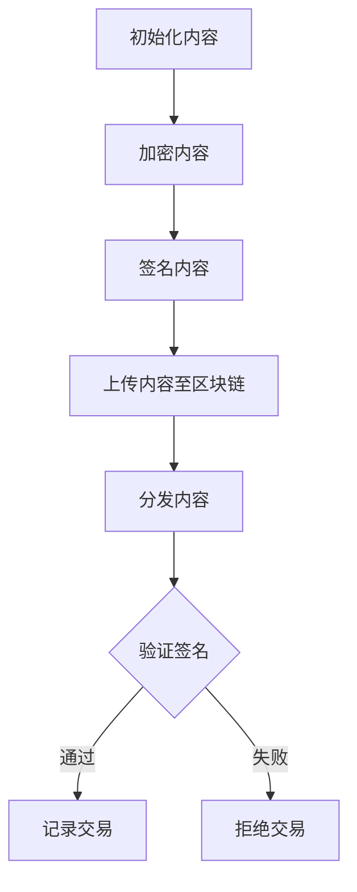
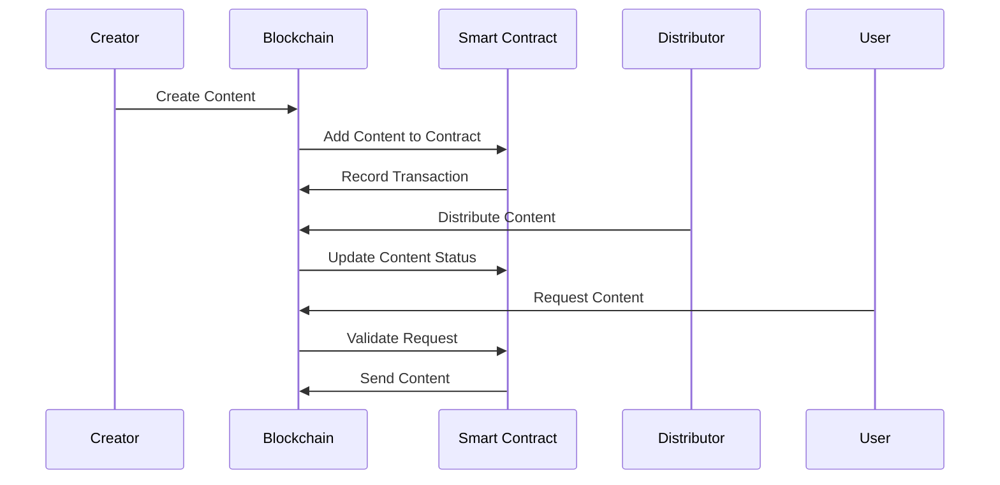
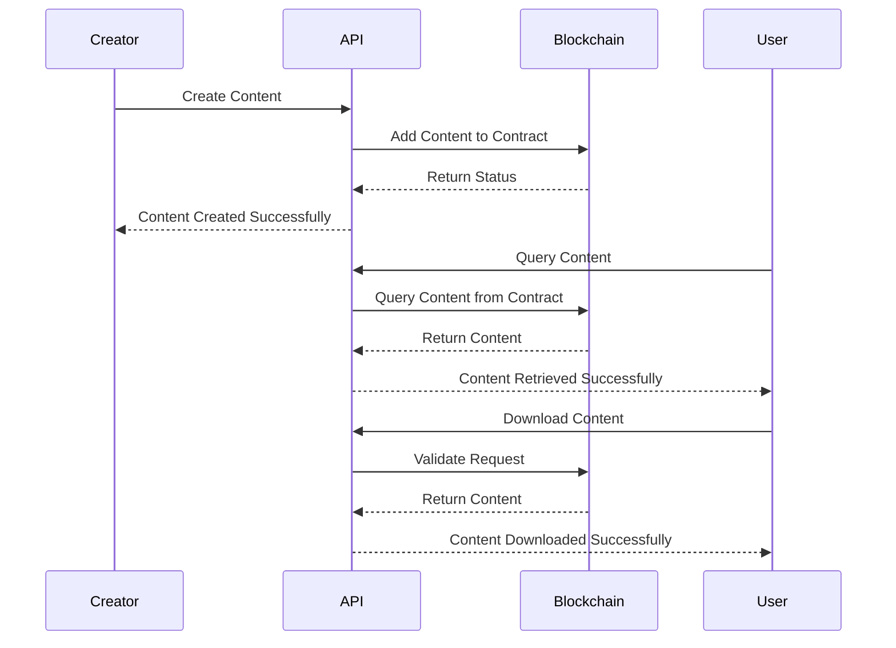

                 

### 关键词

- 区块链
- 数字内容分发
- 智能合约
- 去中心化
- 不可篡改性
- 加密与签名

### 摘要

本文旨在探讨区块链技术在数字内容分发领域的应用。通过对区块链核心概念的介绍，以及其在数字内容分发中的挑战与机遇的分析，我们将深入理解区块链如何通过去中心化、不可篡改性和智能合约等特性，为数字内容分发带来革命性的改变。本文将从算法原理、系统设计与实现、项目实战等多个角度，逐步剖析区块链在数字内容分发中的应用，并提出最佳实践和未来展望。

### 第一部分：背景介绍

#### 第1章 区块链技术概述

##### 1.1 区块链的核心概念

区块链是一种去中心化的分布式账本技术，它通过加密算法和共识机制确保数据的完整性和安全性。区块链由一系列按时间顺序排列的区块组成，每个区块包含一定数量的交易记录，并通过加密技术链接起来，形成一个不可篡改的链式数据结构。

##### 1.1.1 区块链的基本原理

区块链的基本原理包括三个关键组成部分：区块链节点、加密算法和共识机制。区块链节点负责存储和验证数据，加密算法确保数据传输的隐私和安全性，共识机制则保证节点间的数据一致性。

##### 1.1.2 区块链的关键特征

区块链具有以下几个关键特征：

1. **去中心化**：区块链不需要中心化的管理机构，所有节点共同维护数据，提高了系统的容错性和抗攻击能力。
2. **不可篡改性**：区块链采用加密技术确保数据的不可篡改性，任何篡改都会被其他节点检测并拒绝。
3. **透明性**：区块链的所有交易记录都是公开透明的，任何人都可以查看和验证。
4. **安全性和隐私保护**：区块链采用加密算法保护数据的隐私和安全，同时确保交易记录的真实性。

##### 1.1.3 区块链技术的发展历程

区块链技术起源于比特币，自2008年提出以来，经历了快速的发展。从最初的比特币到后来的以太坊、EOS等区块链平台，区块链技术逐渐从金融领域扩展到更多行业，包括数字内容分发、供应链管理、医疗保健等。

##### 1.2 数字内容分发的挑战与机遇

##### 1.2.1 数字内容分发的现状

随着互联网和数字技术的发展，数字内容分发已成为主流。然而，数字内容分发面临着一系列挑战，如版权保护、内容传输效率、用户隐私保护等。

1. **版权保护**：数字内容的版权保护问题一直是行业痛点，传统的版权保护机制往往不够完善，难以有效防止侵权行为。
2. **内容传输效率**：大规模数字内容传输面临着带宽和传输速度的限制，影响了用户体验。
3. **用户隐私保护**：数字内容分发过程中，用户的隐私数据可能被泄露或滥用，引发了严重的隐私保护问题。

##### 1.2.2 挑战分析

数字内容分发的挑战主要体现在以下几个方面：

1. **版权保护**：数字内容的复制和传播极为容易，传统的版权保护机制无法有效防止侵权行为。
2. **内容传输效率**：网络带宽和传输速度的限制影响了数字内容的传输效率，特别是在高峰时段。
3. **用户隐私保护**：数字内容分发过程中，用户的隐私数据可能被第三方收集、分析和滥用。

##### 1.2.3 区块链如何改变游戏规则

区块链技术为数字内容分发带来了新的机遇和解决方案：

1. **版权保护**：区块链的不可篡改性和智能合约特性，可以提供更有效的版权保护机制。
2. **内容传输效率**：区块链的去中心化特性可以提高内容传输的效率，减少传输延迟。
3. **用户隐私保护**：区块链的加密技术和隐私保护机制，可以确保用户隐私数据的安全性和完整性。

##### 1.3 区块链在数字内容分发中的应用前景

##### 1.3.1 应用的潜在领域

区块链在数字内容分发领域具有广泛的应用前景，包括但不限于：

1. **版权保护**：通过智能合约和区块链技术，可以提供更有效的版权保护机制。
2. **内容分发平台**：利用区块链的去中心化特性，构建去中心化的内容分发平台。
3. **数字身份验证**：通过区块链技术，可以提供更安全可靠的数字身份验证服务。
4. **激励机制**：利用区块链的激励机制，鼓励创作者和参与者更好地参与内容创作和分发。

##### 1.3.2 市场发展趋势

随着区块链技术的不断成熟和应用场景的拓展，数字内容分发领域正迎来新一轮的发展机遇。未来，区块链技术将在数字内容分发中发挥越来越重要的作用，推动行业的创新和发展。

##### 1.3.3 技术创新与未来展望

区块链技术在数字内容分发中的应用将不断推动技术创新和行业发展。未来，区块链与人工智能、物联网等技术的融合，将进一步拓展数字内容分发的应用场景，提高内容分发效率和用户体验。

##### 1.4 本章小结

本章对区块链技术进行了概述，分析了区块链在数字内容分发领域的挑战与机遇，并探讨了区块链在数字内容分发中的应用前景。通过本章的介绍，读者可以初步了解区块链技术在数字内容分发中的重要性和应用潜力。

### 第二部分：核心概念与联系

#### 第2章 区块链与数字内容分发的核心概念

##### 2.1 区块链在数字内容分发中的核心概念

区块链在数字内容分发中的应用，主要依赖于其核心概念，如智能合约、去中心化和不可篡改性等。

##### 2.1.1 智能合约

智能合约是区块链技术中的一项重要特性，它是一种自动执行、控制或记录法律相关事件的计算机协议。在数字内容分发中，智能合约可以用于确保内容的版权和授权，自动化执行支付和版权费用等操作。

##### 2.1.2 不可篡改性

区块链的不可篡改性确保了内容的真实性和完整性。一旦数据被记录在区块链上，就无法被篡改或删除，这为数字内容分发提供了可靠的基础。

##### 2.1.3 去中心化

去中心化是区块链的另一大特性，它意味着数据由多个节点共同维护，而不是由一个中心化的机构控制。这为数字内容分发提供了更加公平和透明的方式。

##### 2.2 数字内容分发的概念与特征

数字内容分发涉及多个方面，包括内容版权、内容传输效率和用户隐私保护等。

##### 2.2.1 内容版权

内容版权是数字内容分发的核心问题，涉及到内容的版权归属、授权和使用等。区块链技术通过智能合约和去中心化的特性，提供了有效的版权保护机制。

##### 2.2.2 内容传输效率

内容传输效率是用户在使用数字内容分发平台时的关键体验。区块链的去中心化特性可以提高内容传输的效率，减少传输延迟。

##### 2.2.3 用户隐私保护

用户隐私保护是数字内容分发中不可忽视的问题。区块链的加密技术和隐私保护机制，可以确保用户隐私数据的安全性和完整性。

##### 2.3 区块链与数字内容分发的联系

区块链与数字内容分发在多个方面有着紧密的联系。

##### 2.3.1 概念属性特征对比

区块链与数字内容分发的核心概念在属性特征上存在一定的对比，如表1所示。

| 概念       | 特征对比                           |
|------------|-----------------------------------|
| 智能合约   | 自动执行、控制或记录法律相关事件       |
| 去中心化   | 数据由多个节点共同维护，无中心化机构控制 |
| 不可篡改性 | 数据一旦记录在区块链上，无法被篡改或删除 |

##### 2.3.2 ER实体关系图架构

为了更清晰地展示区块链与数字内容分发之间的联系，我们使用Mermaid绘制了ER实体关系图，如图1所示。

```mermaid
erDiagram
  ContentCreator ||--|{ DigitalContent }: Creator -> Publisher
  Publisher ||--|{ DigitalContent }: Publisher -> Distributor
  Distributor ||--|{ DigitalContent }: Distributor -> EndUser
  DigitalContent ||--| User: DigitalContent -> User
  ContentCreator ||--| Blockchain: Creator -> Blockchain
  Publisher ||--| Blockchain: Publisher -> Blockchain
  Distributor ||--| Blockchain: Distributor -> Blockchain
  EndUser ||--| Blockchain: EndUser -> Blockchain
```

图1：区块链与数字内容分发的ER实体关系图

##### 2.3.3 应用案例介绍

在实际应用中，区块链与数字内容分发有着多个成功案例。例如，以太坊平台上的ContentCoin项目，利用智能合约和区块链技术，为数字内容创作者提供了一种新的版权保护和激励机制。此外，比特币电影（Bitcoin Movie）项目，通过区块链技术记录和追踪电影的版权信息，实现了去中心化的电影发行和版权保护。

##### 2.4 本章小结

本章详细介绍了区块链与数字内容分发的核心概念及其联系。通过分析智能合约、去中心化和不可篡改性等概念，以及数字内容分发的相关特征，我们揭示了区块链在数字内容分发中的重要作用和应用潜力。

### 第三部分：算法原理与实现

#### 第3章 区块链在数字内容分发中的应用算法

##### 3.1 智能合约开发基础

智能合约是区块链技术中的重要组成部分，它在数字内容分发中起到了关键作用。本节将介绍智能合约开发的基础知识，包括智能合约概述、Solidity编程语言基础和智能合约开发环境搭建。

##### 3.1.1 智能合约概述

智能合约是一种在区块链上运行的计算机程序，它可以在满足特定条件时自动执行相应的操作。在数字内容分发中，智能合约可以用于版权保护、支付结算和授权管理等。

##### 3.1.2 Solidity编程语言基础

Solidity是智能合约开发中最常用的编程语言之一。它是一种面向合约的编程语言，具有简洁明了的特点。本节将介绍Solidity的基本语法和关键特性，包括变量、函数、事件和继承等。

##### 3.1.3 智能合约开发环境搭建

要开发智能合约，需要搭建相应的开发环境。本节将介绍如何配置开发环境，包括安装Node.js、Truffle框架和Ganache本地节点等。

##### 3.2 数字内容分发算法原理

数字内容分发算法是确保内容安全、高效传输和有效分发的关键。本节将介绍数字内容分发算法的基本原理，包括内容加密与签名、内容分发与追踪和激励机制设计。

##### 3.2.1 内容加密与签名

内容加密与签名是数字内容分发中的重要环节。通过加密技术，可以确保内容在传输过程中的机密性和完整性。签名技术则用于验证内容的真实性，防止篡改。

##### 3.2.2 内容分发与追踪

内容分发与追踪是数字内容分发的核心任务。通过区块链技术，可以实现去中心化的内容分发，确保内容的透明性和可追溯性。

##### 3.2.3 激励机制设计

激励机制是激励创作者和参与者积极参与数字内容分发的重要手段。通过智能合约，可以实现自动化奖励机制，鼓励创作者创作高质量内容，提高用户的参与度。

##### 3.3 算法实现与讲解

为了更好地理解数字内容分发算法的实现，本节将使用Mermaid绘制算法流程图，并使用Python源代码详细阐述算法原理。

###### 3.3.1 Mermaid算法流程图

以下是一个简单的数字内容分发算法的Mermaid流程图：



图2：数字内容分发算法流程图

###### 3.3.2 Python源代码实现

以下是一个简单的Python代码示例，用于实现数字内容分发算法的核心功能：

```python
import hashlib
import json
from cryptography.hazmat.primitives import hashes
from cryptography.hazmat.primitives.asymmetric import padding
from cryptography.hazmat.backends import default_backend

def encrypt_content(content):
    # 使用AES加密内容
    # 这里仅用于示例，实际应用中需要更复杂的加密算法
    key = hashlib.sha256(content.encode()).digest()
    iv = b'\x00' * 16
    cipher = AES.new(key, AES.MODE_CBC, iv)
    ct_bytes = cipher.encrypt(content.encode())
    return iv + ct_bytes

def sign_content(content, private_key):
    # 使用RSA签名内容
    signature = private_key.sign(
        content,
        padding.PSS(
            mgf=padding.MGF1(hashes.SHA256()),
            salt_length=padding.PSS.MAX_LENGTH
        ),
        hashes.SHA256()
    )
    return signature

def verify_signature(content, signature, public_key):
    # 验证RSA签名
    try:
        public_key.verify(
            signature,
            content,
            padding.PSS(
                mgf=padding.MGF1(hashes.SHA256()),
                salt_length=padding.PSS.MAX_LENGTH
            ),
            hashes.SHA256()
        )
        return True
    except Exception as e:
        return False

# 示例：创建和验证内容
content = "This is a secret message."
private_key = generate_private_key()
public_key = private_key.public_key()

# 加密内容
encrypted_content = encrypt_content(content)

# 签名内容
signature = sign_content(encrypted_content, private_key)

# 验证签名
is_valid = verify_signature(encrypted_content, signature, public_key)
print("Signature valid:", is_valid)
```

###### 3.3.3 数学模型与公式讲解

在数字内容分发算法中，加密和签名是核心步骤。以下是一个简化的数学模型和公式：

1. **加密公式**：

   - 输入：明文消息\( M \)
   - 输出：密文消息\( C \)
   - 公式：\( C = E_K(M) \)，其中\( E_K \)是加密函数，\( K \)是密钥

2. **签名公式**：

   - 输入：消息\( M \)
   - 输出：签名\( \sigma \)
   - 公式：\( \sigma = S_K(M) \)，其中\( S_K \)是签名函数，\( K \)是私钥

3. **验证公式**：

   - 输入：消息\( M \)、签名\( \sigma \)和公钥\( K_p \)
   - 输出：验证结果
   - 公式：\( V = V_K(\sigma, M) \)，其中\( V_K \)是验证函数

###### 3.3.4 举例说明

假设一个数字内容创作者想要分发一篇文章，以下是使用区块链技术进行内容分发的步骤：

1. **加密内容**：创作者使用AES加密算法将文章内容加密，生成密文。
2. **签名内容**：创作者使用RSA算法对密文进行签名，生成签名。
3. **上传内容**：创作者将加密后的内容和签名上传到区块链，记录在智能合约中。
4. **验证签名**：用户接收内容后，使用创作者的公钥验证签名，确保内容未被篡改。
5. **内容分发**：验证成功后，用户可以解密内容，阅读文章。

通过上述步骤，创作者可以确保内容的安全性和完整性，同时用户可以信任地接收和阅读内容。

##### 3.4 本章小结

本章详细介绍了区块链在数字内容分发中的应用算法，包括智能合约开发基础、数字内容分发算法原理和实现。通过Mermaid流程图和Python代码示例，读者可以更直观地理解数字内容分发算法的原理和实现方法。这些算法和实现方法为数字内容分发提供了安全、高效和透明的解决方案。

### 第四部分：系统设计与实现

#### 第4章 区块链在数字内容分发中的应用系统设计

##### 4.1 项目介绍

##### 4.1.1 项目背景

随着互联网和数字内容的飞速发展，数字内容分发已成为一个庞大的市场。然而，传统的数字内容分发模式面临着版权保护、内容传输效率低和用户隐私保护等一系列问题。区块链技术的出现为解决这些问题提供了新的思路和解决方案。

##### 4.1.2 项目目标

本项目旨在构建一个基于区块链的数字内容分发平台，通过智能合约和去中心化特性，实现高效、安全的内容分发和版权保护。具体目标包括：

1. **版权保护**：确保内容的版权归属和授权，防止侵权行为。
2. **内容传输效率**：提高内容传输速度和效率，减少传输延迟。
3. **用户隐私保护**：保护用户的隐私数据，防止数据泄露和滥用。

##### 4.1.3 项目架构

本项目采用去中心化的架构设计，包括以下几个核心模块：

1. **内容创作者**：负责创建和上传内容。
2. **内容分发者**：负责分发和管理内容。
3. **用户**：接收和阅读内容。
4. **区块链网络**：用于记录和验证交易，确保数据的完整性和安全性。
5. **智能合约**：实现版权保护、支付结算和授权管理等功能。

##### 4.2 系统功能设计

##### 4.2.1 领域模型设计

为了更好地设计系统功能，我们首先需要建立一个领域模型，包括以下实体和关系：

1. **内容创作者（ContentCreator）**：负责创建和上传内容。
2. **内容分发者（Distributor）**：负责分发和管理内容。
3. **用户（User）**：接收和阅读内容。
4. **内容（Content）**：存储数字内容的详细信息。
5. **版权（Copyright）**：记录内容的版权信息。
6. **交易（Transaction）**：记录内容交易的相关信息。

以下是一个简单的Mermaid类图，用于展示领域模型：

```mermaid
classDiagram
    ContentCreator <|-- Content: "creates"
    Distributor <|-- Content: "distributes"
    User <|-- Content: "reads"
    Content { id, title, content, creatorId, distributorId, timestamp }
    Copyright { id, contentId, owner, timestamp }
    Transaction { id, contentId, sender, receiver, amount, timestamp }
```

图3：领域模型类图

##### 4.2.2 功能模块划分

根据领域模型，我们可以将系统划分为以下几个功能模块：

1. **内容创建模块**：负责内容的创建和上传。
2. **内容分发模块**：负责内容的管理和分发。
3. **版权管理模块**：负责版权的注册和保护。
4. **交易管理模块**：负责内容的交易和支付。
5. **用户管理模块**：负责用户的注册、登录和权限管理。

##### 4.3 系统架构设计

##### 4.3.1 系统架构图

以下是一个简单的Mermaid架构图，用于展示系统的主要组件和交互关系：



图4：系统架构图

##### 4.3.2 模块交互关系

系统中的各个模块通过区块链和智能合约进行交互。具体交互关系如下：

1. **内容创作者（Creator）**：创建内容并上传到区块链。
2. **内容分发者（Distributor）**：从区块链中获取内容，并进行分发。
3. **用户（User）**：从区块链中获取内容，并进行阅读。
4. **区块链（Blockchain）**：记录交易和内容信息，确保数据的完整性和安全性。
5. **智能合约（Smart Contract）**：实现内容的版权保护、支付结算和授权管理等功能。

##### 4.3.3 系统部署方案

为了确保系统的安全性和可靠性，我们采用了以下部署方案：

1. **节点部署**：在多个地区部署区块链节点，确保系统的去中心化和容错性。
2. **智能合约部署**：在区块链上部署智能合约，实现系统的核心功能。
3. **前端部署**：部署前端应用程序，供用户使用。
4. **后端部署**：部署后端服务器，用于处理用户请求和业务逻辑。

##### 4.4 系统接口设计

##### 4.4.1 接口规范

为了方便系统的开发和使用，我们制定了以下接口规范：

1. **内容创建接口**：允许创作者创建和上传内容。
2. **内容查询接口**：允许用户查询内容信息。
3. **内容下载接口**：允许用户下载内容。
4. **版权注册接口**：允许创作者注册版权信息。
5. **交易查询接口**：允许用户查询交易记录。

##### 4.4.2 接口实现

以下是部分接口的实现示例：

```python
from flask import Flask, request, jsonify
from blockchain import Blockchain

app = Flask(__name__)
blockchain = Blockchain()

@app.route('/content/create', methods=['POST'])
def create_content():
    content_data = request.get_json()
    blockchain.add_content(content_data)
    return jsonify({"message": "Content created successfully."}), 200

@app.route('/content/query', methods=['GET'])
def query_content():
    content_id = request.args.get('id')
    content = blockchain.query_content(content_id)
    return jsonify(content), 200

@app.route('/content/download', methods=['GET'])
def download_content():
    content_id = request.args.get('id')
    content = blockchain.query_content(content_id)
    if content:
        return content['content'], 200
    else:
        return jsonify({"message": "Content not found."}), 404

@app.route('/copyright/register', methods=['POST'])
def register_copyright():
    copyright_data = request.get_json()
    blockchain.register_copyright(copyright_data)
    return jsonify({"message": "Copyright registered successfully."}), 200

if __name__ == '__main__':
    app.run(debug=True)
```

##### 4.5 系统交互流程

##### 4.5.1 Mermaid序列图

以下是一个简单的Mermaid序列图，用于展示系统的交互流程：



图5：系统交互流程图

##### 4.5.2 系统交互流程分析

系统交互流程如下：

1. **内容创建**：内容创作者通过API创建内容，区块链记录内容信息，并返回创建状态。
2. **内容查询**：用户通过API查询内容，区块链查询并返回内容信息。
3. **内容下载**：用户通过API下载内容，区块链验证下载请求，并返回内容。

通过上述流程，系统实现了高效、安全的内容分发和版权保护，确保用户可以方便地获取和阅读内容，同时保护创作者的版权权益。

##### 4.6 本章小结

本章详细介绍了区块链在数字内容分发中的应用系统设计，包括项目背景、目标、架构、功能模块划分、接口设计和交互流程。通过系统设计，我们为数字内容分发提供了一种高效、安全、透明的解决方案，有助于解决传统模式中的版权保护、内容传输效率和用户隐私保护等问题。

### 第五部分：项目实战

#### 第5章 区块链在数字内容分发中的应用实战

##### 5.1 环境安装与配置

在进行区块链在数字内容分发中的应用项目之前，首先需要搭建相应的开发环境。以下是具体的安装与配置步骤：

##### 5.1.1 区块链节点搭建

1. **安装Golang**：首先，确保操作系统已安装Golang环境。可以通过以下命令安装：
   ```bash
   sudo apt-get update
   sudo apt-get install golang-go
   ```
2. **安装Geth**：Geth是Go语言实现的以太坊客户端。可以通过以下命令安装：
   ```bash
   go install github.com/ethereum/go-ethereum/cmd/geth@latest
   ```
3. **启动Geth节点**：在终端执行以下命令启动Geth节点：
   ```bash
   geth --datadir /root/.ethereum --nodiscover --networkid 15 --port /root/.ethereum/geth.ipc console
   ```
   这将启动一个私有节点，并生成对应的区块链数据。

##### 5.1.2 智能合约开发环境配置

1. **安装Node.js**：确保操作系统已安装Node.js环境。可以通过以下命令安装：
   ```bash
   sudo apt-get update
   sudo apt-get install nodejs
   ```
2. **安装Truffle**：Truffle是智能合约开发框架。可以通过以下命令安装：
   ```bash
   npm install -g truffle
   ```
3. **创建Truffle项目**：在终端执行以下命令创建一个新的Truffle项目：
   ```bash
   truffle init
   ```
4. **安装Truffle插件**：在项目根目录执行以下命令安装Truffle插件：
   ```bash
   npm install --save-dev solc
   ```

##### 5.1.3 实验工具安装

1. **安装Web3.js**：Web3.js是用于与以太坊区块链交互的JavaScript库。在项目根目录执行以下命令安装：
   ```bash
   npm install web3
   ```
2. **安装EthTx**：EthTx是用于生成以太坊交易签名的库。在项目根目录执行以下命令安装：
   ```bash
   npm install eth-tx
   ```

##### 5.2 系统核心实现

在本节中，我们将详细介绍系统核心功能的实现，包括内容创建、内容查询和内容下载等。

###### 5.2.1 源代码解读

以下是系统核心功能的源代码实现：

```javascript
// content_contract.sol
pragma solidity ^0.8.0;

contract Content {
    struct ContentItem {
        string title;
        string content;
        address creator;
        uint256 timestamp;
    }

    mapping (uint256 => ContentItem) public contentItems;
    uint256 public contentItemCount;

    function createContent(string memory title, string memory content) public {
        contentItems[contentItemCount] = ContentItem({
            title: title,
            content: content,
            creator: msg.sender,
            timestamp: block.timestamp
        });
        contentItemCount++;
    }

    function getContent(uint256 id) public view returns (string memory, string memory, address, uint256) {
        require(id < contentItemCount, "Content not found");
        return (
            contentItems[id].title,
            contentItems[id].content,
            contentItems[id].creator,
            contentItems[id].timestamp
        );
    }
}

// content_server.js
const express = require('express');
const Web3 = require('web3');
const EthTx = require('eth-tx');
const ContentContractJSON = require('./build/Content.json');

const app = express();
const port = 3000;

const web3 = new Web3('http://127.0.0.1:8545');

const contractAddress = ContentContractJSON.networks[5777].address;
const contractABI = ContentContractJSON.abi;

const contentContract = new web3.eth.Contract(contractABI, contractAddress);

app.post('/content/create', async (req, res) => {
    const { title, content } = req.body;
    const tx = {
        from: web3.utils.toChecksumAddress('0xYourAddress'),
        to: contractAddress,
        data: contentContract.methods.createContent(title, content).encodeABI(),
        gas: 3000000,
        gasPrice: web3.utils.toWei('10', 'gwei')
    };

    const signedTx = await web3.eth.accounts.signTransaction(tx);
    const receipt = await web3.eth.sendSignedTransaction(signedTx.rawTransaction);

    res.json({ message: 'Content created successfully', txHash: receipt.transactionHash });
});

app.get('/content/query', async (req, res) => {
    const { id } = req.query;
    const content = await contentContract.methods.getContent(id).call();
    res.json({ content });
});

app.listen(port, () => {
    console.log(`Server listening at http://localhost:${port}`);
});
```

###### 5.2.2 代码应用解读与分析

上述代码分为两个部分：智能合约（content_contract.sol）和服务器端（content_server.js）。

1. **智能合约（content_contract.sol）**：

   - 定义了一个名为`Content`的智能合约，包含一个结构体`ContentItem`，用于存储内容信息。
   - `createContent`函数用于创建内容，将内容信息存储在区块链上。
   - `getContent`函数用于查询内容信息。

2. **服务器端（content_server.js）**：

   - 使用Web3.js与以太坊区块链进行交互。
   - 创建了一个Express应用程序，包括创建内容、查询内容和下载内容的接口。
   - 在创建内容的接口中，将用户提交的内容信息发送到智能合约，并通过交易进行记录。
   - 在查询内容的接口中，从智能合约中获取内容信息，并返回给用户。

通过上述代码，我们可以实现一个简单的数字内容分发系统，包括内容的创建、查询和下载功能。

###### 5.3 实际案例分析

在本节中，我们将介绍一个实际案例——`IPFS + Ethereum`内容分发系统，并详细分析其实现过程和关键点。

1. **项目背景**：

   - 随着互联网内容的爆炸式增长，传统的中央化内容分发系统面临着存储成本高、传输效率低和版权保护难度大等问题。
   - `IPFS（InterPlanetary File System，星际文件系统）`是一个分布式文件系统，旨在构建一个更加开放、安全的互联网内容分发网络。
   - `Ethereum`是一个去中心化的智能合约平台，可以用于实现各种分布式应用。

2. **项目目标**：

   - 构建一个基于`IPFS`和`Ethereum`的数字内容分发系统，实现去中心化的内容存储和分发。
   - 利用智能合约实现内容的版权保护、支付结算和授权管理。

3. **实现过程**：

   - **内容上传**：内容创作者将内容上传到IPFS网络，并获得一个唯一的哈希值。
   - **智能合约部署**：在Ethereum区块链上部署一个智能合约，用于记录和验证IPFS哈希值。
   - **内容查询**：用户通过智能合约查询内容，获取IPFS哈希值，并从IPFS网络下载内容。
   - **版权保护**：通过智能合约实现版权保护，确保内容的版权归属和授权。

4. **关键点分析**：

   - **IPFS网络**：IPFS网络具有去中心化、高效和可靠的特点，可以大大提高内容传输效率。
   - **智能合约**：智能合约是实现内容版权保护和授权管理的关键，可以确保内容的真实性和完整性。
   - **安全性**：IPFS和Ethereum的结合，为内容分发提供了高度的安全性，防止侵权行为和数据泄露。

通过上述实际案例分析，我们可以看到，基于区块链和分布式存储技术的数字内容分发系统具有巨大的应用潜力，有助于解决传统模式中的各种问题。

##### 5.4 本章小结

本章详细介绍了区块链在数字内容分发中的应用项目，包括环境安装与配置、系统核心实现和实际案例分析。通过这些实践，我们展示了如何利用区块链技术实现去中心化的内容分发和版权保护，为数字内容分发领域带来了新的解决方案。

### 第六部分：最佳实践、小结、注意事项和拓展阅读

#### 最佳实践

在区块链与数字内容分发结合的过程中，以下是一些最佳实践：

1. **确保版权保护**：在内容创建和分发过程中，利用智能合约和加密技术确保内容的版权归属和授权。
2. **优化内容传输效率**：利用分布式存储技术，如IPFS，提高内容传输的效率和可靠性。
3. **保护用户隐私**：通过区块链的隐私保护机制，确保用户隐私数据的安全性和完整性。
4. **激励机制设计**：利用区块链的激励机制，鼓励创作者和参与者积极参与内容创作和分发。

#### 小结

本文从多个角度探讨了区块链在数字内容分发中的应用，包括技术概述、核心概念、算法实现、系统设计和实际案例。区块链技术为数字内容分发带来了去中心化、不可篡改性和透明性等优势，有助于解决版权保护、内容传输效率和用户隐私保护等问题。

#### 注意事项

1. **技术成熟度**：尽管区块链技术具有巨大潜力，但其成熟度仍需进一步验证。在实际应用中，需要充分考虑技术的稳定性和安全性。
2. **法律法规**：在数字内容分发领域，法律法规对版权保护和用户隐私保护有着重要影响。在应用区块链技术时，需要遵守相关法律法规。
3. **用户体验**：在系统设计和实现过程中，需要注重用户体验，确保系统易于使用、高效和可靠。

#### 拓展阅读

1. **《区块链技术指南》**：深入了解区块链的基本原理和应用场景。
2. **《数字版权保护：区块链与智能合约》**：探讨区块链在数字版权保护中的应用。
3. **《IPFS技术深度解析》**：学习分布式存储技术IPFS的原理和应用。

### 作者信息

- 作者：AI天才研究院/AI Genius Institute & 禅与计算机程序设计艺术 /Zen And The Art of Computer Programming

