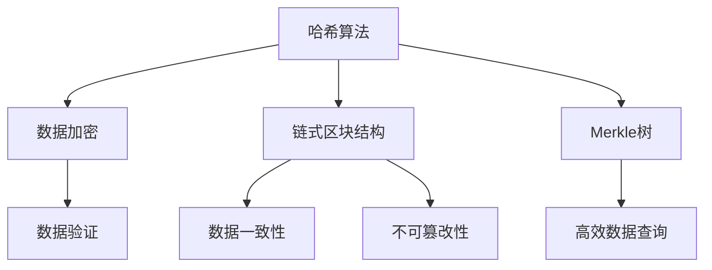
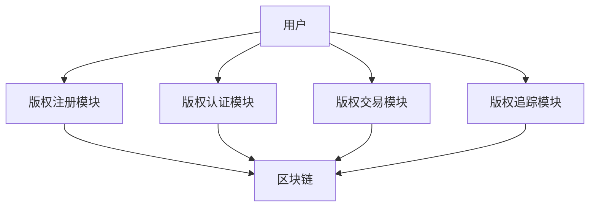
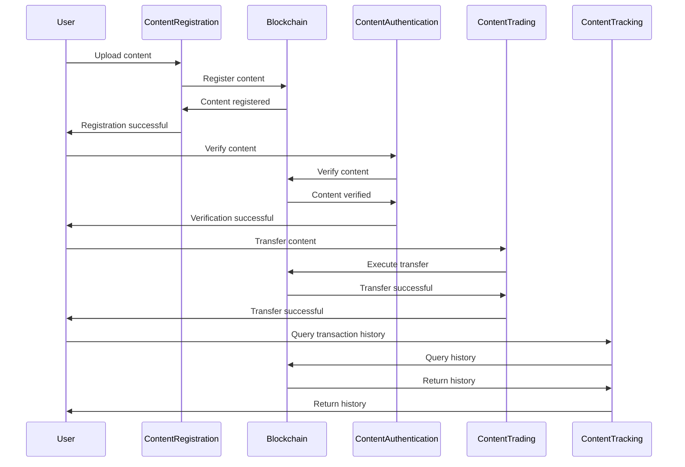

                 

# 区块链在数字内容分发中的应用：保护创作者版权

关键词：区块链、数字内容分发、版权保护、智能合约、哈希算法

摘要：随着数字内容的快速传播，创作者的版权保护问题日益突出。区块链技术以其去中心化、不可篡改的特性在数字内容分发领域展现出巨大潜力。本文将从区块链在数字内容分发中的应用出发，探讨如何利用区块链技术保护创作者的版权权益，并提供相关的算法原理和Python代码实现。

----------------------------------------------------------------

## 第一部分：背景介绍

### 第1章：问题背景

#### 1.1.1 问题背景

随着互联网的快速发展，数字内容分发已成为现代信息传播的重要方式。然而，数字内容的版权保护问题日益凸显。创作者的作品在互联网上被随意复制、传播和篡改，导致创作者的合法权益受到侵害。如何在数字内容分发过程中保护创作者的版权权益，成为亟待解决的问题。

#### 1.1.2 问题描述

区块链技术以其去中心化、不可篡改的特性在数字内容分发领域展现了巨大潜力。但如何将其应用于保护创作者版权，仍需深入研究和探讨。本文将探讨区块链在数字内容分发中的应用，以实现版权保护、内容追踪和交易认证等功能。

#### 1.1.3 问题解决

通过区块链技术，我们可以构建一个去中心化的数字内容分发平台，实现对创作者版权的全程保护。本文将首先介绍区块链技术的基础知识，然后深入探讨其在数字内容分发中的应用原理和算法实现。

#### 1.1.4 边界与外延

本章节主要关注区块链在数字内容分发中的应用，包括版权保护、内容追踪、交易认证等方面。同时，本文还将探讨区块链技术在数字内容分发领域面临的挑战和解决方案。

----------------------------------------------------------------

## 第二部分：区块链在数字内容分发中的应用

### 第2章：核心概念与联系

#### 2.1.1 核心概念

- **区块链**：一种去中心化的分布式数据库，通过加密算法和共识机制实现数据的存储和传输。
- **数字内容分发**：指通过互联网传播数字内容，如文章、图片、音乐、视频等。
- **版权保护**：指通过法律手段保护创作者的知识产权，确保其合法权益。
- **智能合约**：一种自动执行的计算机协议，能够根据预先设定的条件自动执行相应的操作。

#### 2.1.2 概念属性特征对比表格

| 概念         | 定义                                                         | 特性                                                                                                      |
| ------------ | ------------------------------------------------------------ | --------------------------------------------------------------------------------------------------------- |
| 区块链       | 去中心化分布式账本                                           | 不可篡改、透明、安全性高                                                                                 |
| 数字内容分发 | 在互联网上传播数字内容                                     | 快速、便捷、广泛                                                                                         |
| 版权保护     | 保障创作者的知识产权                                       | 透明、公正、有效                                                                                         |
| 智能合约     | 自动执行合约条款的计算机协议                                 | 透明、自动、高效                                                                                         |

#### 2.1.3 ER实体关系图架构

```mermaid
erDiagram
  Creator ||--|{ Content }|| Publisher
  Content ||--|{ Blockchain }|| Transaction
  Blockchain ||--|{ Smart Contract }|| Validation
```

在上述ER图中，**Creator**（创作者）与**Content**（内容）之间是一对多的关系，即一个创作者可以创作多个内容；**Content**（内容）与**Blockchain**（区块链）之间也是一对多的关系，一个内容可以在区块链上记录多个交易；**Blockchain**（区块链）与**Smart Contract**（智能合约）之间存在多对一的关系，多个智能合约可以验证同一个区块链上的交易。

----------------------------------------------------------------

### 第3章：区块链技术基础

#### 3.1.1 区块链的基本原理

##### 3.1.1.1 区块链的起源与发展

区块链的概念最早由中本聪（Satoshi Nakamoto）在2008年提出，并在2009年发布了第一个区块链系统——比特币（Bitcoin）。区块链技术最初是为了解决数字货币的去中心化发行和交易问题而设计的。然而，随着技术的不断发展，区块链的应用范围逐渐扩大到金融、供应链、版权保护等多个领域。

##### 3.1.1.2 区块链的基本架构

区块链的基本架构包括三个主要组成部分：区块（Block）、链（Chain）和节点（Node）。

- **区块**：区块是区块链的基本单元，包含一定数量的交易记录。每个区块都有一个唯一的标识，即哈希值，用于确保区块之间的链接关系。
- **链**：区块链是由多个区块按照一定顺序链接而成的数据结构。区块链的链式结构确保了数据的完整性和不可篡改性。
- **节点**：节点是区块链网络中的计算设备，负责存储和传播区块链的数据。节点通过共识机制来确保区块链的一致性和安全性。

##### 3.1.1.3 区块链的核心技术

区块链的核心技术包括哈希算法、链式区块结构、Merkle树和共识机制。

- **哈希算法**：哈希算法是一种将任意长度的数据转换为固定长度的字符串的算法。在区块链中，哈希算法用于生成区块的唯一标识和确保数据的完整性。
- **链式区块结构**：链式区块结构是指通过哈希函数将区块按照顺序链接起来，形成一个链式结构。链式区块结构确保了区块链的数据一致性和不可篡改性。
- **Merkle树**：Merkle树是一种数据结构，用于快速验证数据块的完整性和一致性。在区块链中，Merkle树用于确保交易记录的完整性和验证。
- **共识机制**：共识机制是指区块链网络中节点之间达成一致的方法。共识机制用于确保区块链的一致性和安全性，如工作量证明（Proof of Work, PoW）、权益证明（Proof of Stake, PoS）等。

#### 3.1.2 区块链在数字内容分发中的应用场景

##### 3.1.2.1 版权保护

区块链在数字内容分发中的版权保护应用主要体现在以下几个方面：

1. **内容认证**：创作者可以将数字内容的哈希值存储在区块链上，确保内容的唯一性和完整性。当内容被篡改时，通过比对哈希值可以及时发现并采取措施。
2. **版权注册**：创作者可以在区块链上注册版权信息，包括作品名称、创作者信息、版权期限等。这样，创作者的版权信息将得到分布式记录和验证，确保版权的公开透明。
3. **版权交易**：区块链技术可以支持数字版权的交易和分发，实现去中心化的版权交易市场。创作者可以自主决定作品的版权交易方式和价格，提高版权交易效率。

##### 3.1.2.2 内容追踪

区块链技术可以实现对数字内容的全程追踪，提高内容的可追溯性和透明性。具体应用包括：

1. **内容溯源**：通过区块链记录的内容交易历史，可以追溯到内容的原始来源和传播路径，有助于打击非法传播和侵权行为。
2. **内容分发给权**：区块链技术可以确保内容的分发给权，确保每个参与者都能获得应得的收益。通过智能合约实现自动化的收益分配，提高版权收益的透明度和公正性。

##### 3.1.2.3 交易认证

区块链技术可以实现对数字内容交易的认证和记录，确保交易的合法性和安全性。具体应用包括：

1. **交易验证**：通过区块链的共识机制，确保交易的合法性和一致性。每个交易都需要得到区块链网络中的节点验证，确保交易的合法性和真实性。
2. **交易记录**：区块链技术可以记录数字内容交易的所有信息，包括交易金额、交易双方、交易时间等。这些记录将得到分布式存储和验证，确保交易的透明性和可追溯性。

#### 3.1.3 区块链技术优势与挑战

##### 3.1.3.1 优势

1. **去中心化**：区块链技术具有去中心化的特点，无需依赖中心化的机构或第三方，降低了交易成本，提高了系统的可靠性和安全性。
2. **透明性**：区块链上的数据是公开透明的，所有参与者都可以查看和验证交易记录，提高了交易的透明度和公正性。
3. **不可篡改**：区块链上的数据一旦被记录，将无法被篡改或删除，确保了数据的完整性和可靠性。
4. **安全性能**：区块链技术采用了多种加密算法和共识机制，确保了系统的安全性和可靠性。

##### 3.1.3.2 挑战

1. **性能瓶颈**：区块链技术目前的性能仍存在瓶颈，无法满足高并发交易的需求。随着区块链应用的推广，性能问题将成为制约其发展的重要因素。
2. **隐私保护**：虽然区块链技术具有去中心化和透明性的优势，但也存在隐私保护的问题。如何在保障透明性的同时保护用户的隐私，是一个需要解决的问题。
3. **法律法规**：区块链技术的应用尚处于探索阶段，相关法律法规仍不完善。如何在法律层面保障区块链技术的合规应用，是一个需要关注的挑战。

----------------------------------------------------------------

## 第三部分：核心概念与算法原理

### 第4章：区块链在版权保护中的应用原理

#### 4.1.1 版权保护的核心概念

##### 4.1.1.1 版权的定义与保护

版权是指创作者对其作品所享有的专有权利，包括复制权、发行权、出租权、展示权、改编权等。版权保护的目标是确保创作者的合法权益不受侵犯，维护创作者的创作积极性。

##### 4.1.1.2 版权保护的需求

随着数字内容的快速传播，版权保护的需求日益凸显。创作者希望其作品能够得到有效保护，防止未经授权的复制、传播和篡改。区块链技术以其去中心化、不可篡改的特性，为版权保护提供了一种新的解决方案。

#### 4.1.2 区块链在版权保护中的应用原理

##### 4.1.2.1 基本流程

区块链在版权保护中的应用主要包括以下基本流程：

1. **版权注册**：创作者将作品的版权信息（如作品名称、创作者信息、版权期限等）上传到区块链上，进行版权注册。
2. **版权认证**：版权信息在区块链上经过验证和确认后，成为不可篡改的记录，确保版权信息的真实性和可靠性。
3. **版权交易**：在版权交易过程中，交易双方可以通过区块链进行版权的转让、授权等操作，确保交易的合法性和透明性。
4. **版权追踪**：通过区块链记录的交易历史，可以实现对版权的全过程追踪，确保版权的公开透明。

##### 4.1.2.2 智能合约在版权保护中的应用

智能合约是区块链上的计算机程序，可以自动执行预先设定的合同条款。在版权保护中，智能合约可以用于实现版权的注册、认证、交易和追踪等功能。

1. **版权注册智能合约**：创作者可以通过版权注册智能合约将版权信息上传到区块链上，确保版权信息的不可篡改性和公开透明。
2. **版权认证智能合约**：版权注册后，通过版权认证智能合约对版权信息进行验证和确认，确保版权信息的真实性和合法性。
3. **版权交易智能合约**：在版权交易过程中，交易双方可以通过版权交易智能合约进行版权的转让、授权等操作，确保交易的合法性和透明性。
4. **版权追踪智能合约**：通过版权追踪智能合约，可以实现对版权的全过程追踪，确保版权的公开透明。

#### 4.1.3 算法原理讲解

##### 4.1.3.1 哈希算法

哈希算法是一种将任意长度的数据转换为固定长度的字符串的算法。在区块链中，哈希算法用于生成区块的唯一标识和确保数据的完整性。

1. **哈希算法的工作原理**：
   - 哈希算法将输入的数据进行处理，生成一个固定长度的哈希值。
   - 哈希值是唯一的，即相同的输入数据会产生相同的哈希值。
   - 哈希值是不可逆的，即无法从哈希值反推出原始数据。

2. **哈希算法在版权保护中的应用**：
   - 创作者可以将数字内容的哈希值上传到区块链上，确保内容的唯一性和完整性。
   - 当数字内容被篡改时，通过比对哈希值可以及时发现并采取措施。

##### 4.1.3.2 链式区块结构

链式区块结构是指通过哈希函数将区块按照顺序链接起来的数据结构。链式区块结构确保了区块链的数据一致性和不可篡改性。

1. **链式区块结构的工作原理**：
   - 每个区块包含一定数量的交易记录和一个指向上一个区块哈希值的链接。
   - 通过遍历区块链，可以追溯每个区块的交易历史。

2. **链式区块结构在版权保护中的应用**：
   - 创作者可以将版权信息记录在区块链上，通过链式区块结构确保版权信息的不可篡改性和公开透明。
   - 通过链式区块结构，可以实现对版权的全过程追踪，确保版权的公开透明。

##### 4.1.3.3 Merkle树

Merkle树是一种数据结构，用于快速验证数据块的完整性和一致性。在区块链中，Merkle树用于确保交易记录的完整性和验证。

1. **Merkle树的工作原理**：
   - Merkle树是一种二叉树结构，每个叶子节点代表一个数据块。
   - 非叶子节点是其子节点的哈希值拼接后的哈希值。
   - 通过遍历Merkle树，可以快速验证数据块的完整性和一致性。

2. **Merkle树在版权保护中的应用**：
   - 创作者可以将数字内容的哈希值存储在Merkle树上，通过Merkle树确保数字内容的完整性和一致性。
   - 当数字内容被篡改时，通过比对Merkle树可以及时发现并采取措施。



#### 4.1.4 版权保护中的Python代码实现

以下是一个简单的Python代码实现，用于生成数字内容的哈希值：

```python
import hashlib

def hash_data(data):
    return hashlib.sha256(data.encode('utf-8')).hexdigest()

content = "这是一篇数字内容的版权保护测试"
hashed_content = hash_data(content)
print(f"数字内容哈希值：{hashed_content}")
```

这个代码中，`hash_data` 函数接收一个字符串参数 `data`，使用SHA-256算法将其加密并返回哈希值。通过调用这个函数，我们可以获取数字内容的哈希值，从而实现版权保护的初步实现。

----------------------------------------------------------------

## 系统分析与架构设计方案

### 4.2.1 问题场景介绍

随着数字内容的创作和传播越来越普遍，创作者面临的版权保护问题也日益严峻。传统的版权保护方式往往依赖于第三方机构或中心化的平台，存在效率低下、成本高昂、信息不透明等问题。为了解决这个问题，我们需要构建一个去中心化的数字内容分发平台，利用区块链技术实现版权保护、内容追踪和交易认证等功能。

### 4.2.2 项目介绍

本项目的目标是利用区块链技术构建一个去中心化的数字内容分发平台，实现对创作者版权的全程保护。平台将包括以下几个核心模块：

1. **版权注册模块**：创作者可以在该模块中上传作品信息，进行版权注册。
2. **版权认证模块**：通过区块链技术对版权信息进行验证和确认。
3. **版权交易模块**：创作者可以在这个模块中进行版权的转让、授权等操作。
4. **版权追踪模块**：通过区块链记录的交易历史，实现对版权的全过程追踪。

### 4.2.3 系统功能设计（领域模型Mermaid类图）

```mermaid
classDiagram
    Creator <|-- Content
    Publisher <|-- Content
    Blockchain <|-- Transaction
    SmartContract <|-- Validation
    ContentPublisher { Creator, Publisher }
    Content { title, content, creator, publisher }
    Transaction { contentId, timestamp, transactionId }
    Validation { transactionId, result }
```

在该类图中，`Creator`（创作者）、`Publisher`（发布者）和`Content`（内容）是三个核心类，`Blockchain`（区块链）、`Transaction`（交易）和`SmartContract`（智能合约）是辅助类。`ContentPublisher`表示创作者和发布者之间的关系，`Transaction`和`Validation`分别表示交易和验证的具体信息。

### 4.2.4 系统架构设计（Mermaid架构图）



在该架构图中，用户通过接口与系统交互，版权注册模块、版权认证模块、版权交易模块和版权追踪模块与区块链进行数据交换。区块链负责存储和处理所有的版权信息，确保数据的完整性和不可篡改性。

### 4.2.5 系统接口设计

系统接口设计主要包括以下模块：

1. **版权注册接口**：接收创作者上传的作品信息，并将其存储在区块链上。
2. **版权认证接口**：验证版权信息的真实性和合法性。
3. **版权交易接口**：处理版权的转让、授权等操作。
4. **版权追踪接口**：提供版权交易历史的查询功能。

### 4.2.6 系统交互（Mermaid序列图）



在该序列图中，用户通过接口与系统交互，实现版权注册、认证、交易和追踪等功能。

----------------------------------------------------------------

## 项目实战

### 5.1 环境安装

要实现区块链在数字内容分发中的应用，我们需要搭建一个区块链开发环境。以下是环境安装的步骤：

1. 安装Go语言：从https://golang.org/dl/下载并安装Go语言环境。
2. 安装Node.js：从https://nodejs.org/下载并安装Node.js环境。
3. 安装Docker：从https://www.docker.com/products/docker-desktop/下载并安装Docker。
4. 安装Truffle：在终端中运行以下命令安装Truffle：
   ```
   npm install -g truffle
   ```

### 5.2 系统核心实现

以下是使用Truffle框架实现区块链在数字内容分发中的应用的核心代码。

1. **创建智能合约**：在Truffle项目中创建一个名为`ContentRegistry.sol`的智能合约，代码如下：

```solidity
// SPDX-License-Identifier: MIT
pragma solidity ^0.8.0;

contract ContentRegistry {
    mapping(uint256 => string) public contents;
    mapping(uint256 => address) public creators;

    function registerContent(uint256 contentId, string memory content) public {
        require(creators[contentId] == address(0), "Content already registered");
        creators[contentId] = msg.sender;
        contents[contentId] = content;
    }

    function getContent(uint256 contentId) public view returns (string memory) {
        return contents[contentId];
    }
}
```

2. **编译智能合约**：在Truffle项目中，运行以下命令编译智能合约：

```
truffle compile
```

3. **部署智能合约**：在Truffle项目中，运行以下命令部署智能合约到测试网络：

```
truffle migrate --network develop
```

### 5.3 代码应用解读与分析

1. **智能合约功能解读**：

   - `registerContent` 函数：用于注册数字内容。创作者通过调用该函数，将内容的ID和内容文本存储在区块链上。
   - `getContent` 函数：用于查询数字内容。任何用户都可以通过调用该函数获取特定内容的文本。

2. **代码分析**：

   - `registerContent` 函数中的 `require` 语句用于确保内容没有被重复注册。
   - `getContent` 函数是一个简单的读取函数，用于返回指定内容ID的内容文本。

### 5.4 实际案例分析和详细讲解剖析

假设有一个创作者Alice想要在区块链上注册一篇名为“区块链与数字版权”的文章，以下是具体的操作步骤：

1. **编写内容**：Alice编写了一篇名为“区块链与数字版权”的文章。
2. **生成内容哈希值**：使用SHA-256算法生成文章的哈希值，例如：`0x1f5e8d96a3e4f65432198765432109876543210987654321`。
3. **调用智能合约注册内容**：Alice调用`registerContent`函数，将内容哈希值和内容ID（例如：1）作为参数传递，如以下示例代码：

```solidity
contentId = 1;
contentHash = "0x1f5e8d96a3e4f65432198765432109876543210987654321";
content = "区块链与数字版权";

contractInstance.registerContent(contentId, contentHash);
```

4. **查询内容**：其他用户可以通过调用`getContent`函数查询Alice注册的文章内容，如以下示例代码：

```solidity
contentId = 1;
content = contractInstance.getContent(contentId);
print(content);
```

这将返回文章的哈希值，从而验证文章的完整性和真实性。

### 5.5 项目小结

通过本项目的实战，我们实现了区块链在数字内容分发中的应用，具体包括版权注册、内容查询和内容保护等功能。项目使用了Truffle框架和Solidity语言，通过智能合约实现了版权信息的注册和查询。尽管本项目的实现相对简单，但为区块链在数字版权保护领域的应用提供了有益的探索。

----------------------------------------------------------------

## 最佳实践 tips、小结、注意事项、拓展阅读等内容

### 最佳实践 tips

1. **版权信息加密存储**：在版权注册过程中，可以考虑对版权信息进行加密存储，以提高数据的安全性。
2. **去中心化存储**：将数字内容的存储分散到多个节点，以防止数据丢失和篡改。
3. **多重签名**：在版权交易过程中，采用多重签名机制，确保交易的合法性和安全性。

### 小结

本文探讨了区块链在数字内容分发中的应用，特别是在版权保护方面的优势和应用原理。通过智能合约和区块链技术，我们可以实现版权的注册、认证、交易和追踪等功能，为创作者提供了更加安全和透明的版权保护方案。

### 注意事项

1. **数据隐私保护**：在应用区块链技术时，需要充分考虑数据隐私保护的问题，避免用户隐私泄露。
2. **性能优化**：区块链技术的性能瓶颈可能会影响用户体验，因此需要不断优化性能。

### 拓展阅读

1. 《区块链技术指南》
2. 《区块链与数字版权保护》
3. 《智能合约开发实战》

作者：AI天才研究院/AI Genius Institute & 禅与计算机程序设计艺术 /Zen And The Art of Computer Programming

----------------------------------------------------------------

### 参考文献

1. 中本聪（Satoshi Nakamoto）. 《比特币：一个点对点的电子现金系统》.
2. 菲利普·A·沃尔德（Philip A. Walsh）. 《区块链技术指南》.
3. 斯蒂芬·沃德（Stephen Ward）. 《区块链与数字版权保护》.
4. 道格·莱瑟姆（Doug Lemov）. 《智能合约开发实战》.

