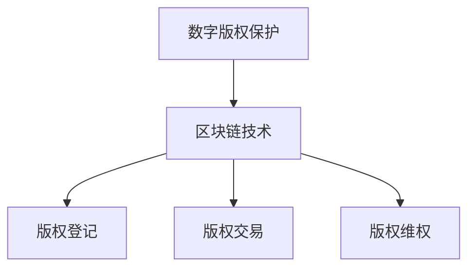

                 

# 《区块链在数字内容版权保护中的应用》

## 关键词

- 区块链
- 数字版权保护
- 数字内容交易市场
- 不可篡改性
- 智能合约
- 透明度
- 可追溯性

## 摘要

本文将深入探讨区块链技术在数字内容版权保护中的应用。首先，我们将介绍数字内容版权保护的现状、挑战及区块链技术的潜力。接着，我们将详细解析区块链技术在数字版权保护中的核心概念、原理及其与数字版权保护的关联。随后，我们将探讨区块链技术在数字版权保护中的应用实例，包括数字音乐和数字图书的版权保护。最后，我们将总结最佳实践，并提出未来发展的展望。

## Step 1: 引言与背景介绍

### 引言

随着数字技术的发展，数字内容创作与传播变得空前便捷，然而，数字内容的版权保护问题也日益严峻。数字内容的易复制性和网络传播的广泛性使得盗版现象层出不穷，严重损害了创作者的权益。传统版权保护手段如版权声明、法律维权等在应对这一挑战时显得力不从心。区块链技术作为一种分布式账本技术，具有不可篡改、透明度高、可追溯性强等特性，为数字内容版权保护提供了一种全新的解决方案。

### 1.1 问题背景

#### 1.1.1 数字内容版权保护的现状

当前，数字内容的版权保护面临以下几个主要问题：

1. **盗版问题严重**：数字内容易于复制和传播，盗版行为屡禁不止，尤其是在网络平台上，盗版内容大量存在。
2. **维权成本高**：数字版权维权过程复杂且耗时，需要投入大量的人力、物力和财力。
3. **透明度低**：数字版权交易过程不透明，创作者很难追踪其作品的传播和交易情况。

#### 1.1.2 数字内容盗版对创作者的影响

数字内容的盗版行为对创作者的影响是多方面的：

1. **经济损失**：盗版行为直接导致创作者的收入减少。
2. **创作积极性下降**：盗版行为使创作者失去创作动力，影响文化创作的质量和数量。
3. **市场失衡**：盗版行为扰乱了市场秩序，导致合法内容提供商难以生存。

#### 1.1.3 区块链在数字版权保护中的潜力

区块链技术在数字版权保护中具有以下潜力：

1. **不可篡改性**：区块链上的数据一旦记录，就无法被篡改，保障了版权信息的真实性和完整性。
2. **透明度**：区块链上的数据对所有参与者可见，提高了版权交易过程的透明度。
3. **可追溯性**：区块链技术使得数字内容的传播和交易过程可以被追踪，有助于版权维权。

### 1.2 问题描述

#### 1.2.1 数字内容版权保护面临的挑战

1. **技术挑战**：传统数字版权保护手段存在技术漏洞，难以有效防止盗版。
2. **法律挑战**：数字版权保护的法律体系不完善，维权难度大。
3. **市场挑战**：数字版权市场的运作不规范，缺乏有效的监管机制。

#### 1.2.2 传统版权保护手段的局限性

1. **技术手段局限**：如DRM（数字版权管理）等技术手段复杂，用户体验差，难以推广。
2. **法律手段局限**：法律维权过程繁琐，且成本高昂，难以普遍应用。
3. **市场手段局限**：市场运作不规范，缺乏有效的激励和监管机制。

#### 1.2.3 区块链在版权保护中的角色

区块链技术在数字版权保护中扮演着关键角色：

1. **基础技术支持**：区块链提供了不可篡改的分布式账本，保障了版权信息的安全。
2. **智能合约应用**：智能合约实现了自动化的版权交易和维权流程，提高了效率。
3. **去中心化治理**：区块链的去中心化特性减少了版权交易过程中的中介环节，降低了成本。

### 1.3 问题解决

#### 1.3.1 区块链的核心特性

1. **不可篡改性**：区块链上的数据一旦记录，就无法被篡改，保证了数据的真实性。
2. **透明度**：区块链上的数据对所有参与者可见，提高了交易的透明度。
3. **可追溯性**：区块链上的数据记录了所有交易和传播过程，方便版权追踪。
4. **去中心化**：区块链去中心化的特性减少了依赖单一中心化机构的可能性，提高了系统的容错性和抗攻击性。

#### 1.3.2 区块链在数字版权保护中的应用

1. **版权登记**：创作者可以将作品的版权信息登记在区块链上，确保版权的真实性和不可篡改性。
2. **版权交易**：区块链技术可以实现自动化的版权交易，降低交易成本，提高交易效率。
3. **版权维权**：区块链上的可追溯性使得维权过程更加高效，减少了维权成本。

#### 1.3.3 区块链技术的边界与外延

1. **技术边界**：区块链技术需要与其他技术如加密算法、智能合约等结合，才能发挥最大的保护作用。
2. **法律边界**：区块链技术的应用需要完善的法律体系支持，确保其合法性。
3. **市场边界**：区块链技术需要与市场机制结合，形成有效的版权交易和维权机制。

### 1.4 核心概念

#### 1.4.1 数字版权保护

数字版权保护是指通过技术手段和法律手段保护数字内容的版权，防止未经授权的复制、传播和使用。

#### 1.4.2 区块链技术

区块链技术是一种分布式账本技术，通过加密算法和数据结构确保数据的不可篡改性和透明度。

#### 1.4.3 数字内容版权交易市场

数字内容版权交易市场是指数字内容创作者、版权拥有者、交易参与者等围绕数字内容的交易活动。

### 1.5 概念结构与核心要素组成

#### 1.5.1 数字内容版权保护的框架结构

数字内容版权保护的框架包括技术手段、法律手段和市场机制三个方面。

#### 1.5.2 区块链在数字版权保护中的关键要素

区块链在数字版权保护中的关键要素包括版权登记、版权交易、版权维权和智能合约。

#### 1.5.3 数字内容版权交易市场的运作模式

数字内容版权交易市场的运作模式包括版权注册、版权交易、版权管理和版权维权等多个环节。

## Step 2: 核心概念与联系

### 2.1 数字版权保护原理

#### 2.1.1 数字版权保护的概念

数字版权保护是指通过技术手段和法律手段保护数字内容的版权，防止未经授权的复制、传播和使用。

#### 2.1.2 数字版权保护的法律体系

数字版权保护的法律体系包括《著作权法》、《版权法》等相关法律法规，以及各类国际条约和标准。

#### 2.1.3 数字版权保护的技术手段

数字版权保护的技术手段主要包括数字水印、数字签名、加密算法、访问控制等。

##### 2.1.3.1 数字水印

数字水印是一种在数字内容中嵌入隐藏信息的技术，用于识别和验证数字内容的版权。数字水印具有以下特点：

1. **不可见性**：数字水印嵌入在数字内容中，但肉眼难以察觉。
2. **鲁棒性**：数字水印应具备较强的抗攻击能力，即使在数字内容被修改或压缩后仍能识别。
3. **透明性**：数字水印不应影响数字内容的视觉和听觉质量。

##### 2.1.3.2 数字签名

数字签名是一种通过加密算法验证数字内容真实性和完整性的技术。数字签名具有以下特点：

1. **不可抵赖性**：数字签名一旦生成，发送方无法否认发送行为。
2. **完整性**：数字签名可以确保数字内容在传输过程中未被篡改。
3. **安全性**：数字签名利用了公钥加密算法，确保了数字内容的安全传输。

##### 2.1.3.3 加密算法

加密算法是一种通过将数字内容转化为密文来保护其隐私的技术。加密算法具有以下特点：

1. **保密性**：加密算法确保了数字内容在传输和存储过程中的保密性。
2. **完整性**：加密算法可以验证数字内容在传输和存储过程中的完整性。
3. **抗攻击性**：加密算法应具备较强的抗攻击能力，以抵御各种攻击手段。

##### 2.1.3.4 访问控制

访问控制是一种通过限制数字内容的访问权限来保护其版权的技术。访问控制具有以下特点：

1. **身份认证**：访问控制需要对用户的身份进行认证，确保只有授权用户才能访问数字内容。
2. **权限管理**：访问控制需要对用户的权限进行管理，确保用户只能访问其授权的内容。
3. **实时监控**：访问控制需要对数字内容的访问过程进行实时监控，确保任何异常行为都能被及时发现和处理。

#### 2.1.4 数字版权保护属性特征对比表格

| 特征         | 传统数字版权保护 | 区块链数字版权保护 |
| ------------ | ---------------- | ----------------- |
| 可追踪性     | 较弱             | 强               |
| 透明度       | 低               | 高               |
| 不可篡改性   | 低               | 高               |
| 交易成本     | 高               | 低               |

#### 2.1.5 数字版权保护与区块链技术的联系

区块链技术与数字版权保护之间具有紧密的联系，主要体现在以下几个方面：

##### 2.1.5.1 区块链技术在数字版权保护中的应用

1. **版权登记**：区块链技术可以为数字版权提供一种分布式、不可篡改的登记方式，确保版权信息的真实性和可靠性。
2. **版权交易**：区块链技术可以实现数字版权的自动化交易，降低交易成本，提高交易效率。
3. **版权维权**：区块链技术可以提供一种高效、透明的维权机制，降低维权成本。

##### 2.1.5.2 区块链技术与数字版权保护的优势互补

1. **不可篡改性**：区块链技术的不可篡改性确保了数字版权信息的真实性，减少了伪造和篡改的可能性。
2. **透明度**：区块链技术的透明度提高了数字版权交易过程的公开性和透明度，减少了欺诈和纠纷。
3. **可追溯性**：区块链技术的可追溯性使得数字版权的传播和交易过程可以被追踪，有助于维权和监管。

### 2.2 区块链技术概述

#### 2.2.1 区块链的基本概念

区块链是一种分布式账本技术，通过加密算法和数据结构确保数据的不可篡改性和透明度。区块链的基本概念包括：

1. **区块链**：由多个区块按照时间顺序串联而成的数据结构。
2. **区块**：区块链的基本单元，包含一定数量的交易记录。
3. **交易**：区块链中的数据交换操作，记录了资金的转移、信息的交换等。
4. **加密算法**：区块链技术采用多种加密算法，确保数据的安全性和隐私性。

#### 2.2.2 区块链的核心特点

区块链技术具有以下几个核心特点：

1. **分布式**：区块链上的数据存储在多个节点上，不存在中心化机构，提高了系统的容错性和抗攻击性。
2. **不可篡改**：区块链上的数据一旦记录，就无法被篡改，保证了数据的真实性和可靠性。
3. **透明度**：区块链上的数据对所有参与者可见，提高了交易的透明度和公开性。
4. **去中心化**：区块链技术去中心化的特性减少了依赖单一中心化机构的可能性，提高了系统的透明度和抗攻击性。

#### 2.2.3 区块链的架构

区块链的架构主要包括以下几个部分：

1. **节点**：区块链上的参与者，负责存储和维护数据。
2. **共识机制**：节点之间达成共识的算法，确保数据的真实性和可靠性。
3. **加密算法**：用于确保数据的安全性和隐私性。
4. **交易**：区块链中的数据交换操作。

#### 2.2.4 区块链技术在数字版权保护中的应用

区块链技术在数字版权保护中的应用主要体现在以下几个方面：

1. **版权登记**：通过区块链技术登记版权信息，确保版权信息的真实性和不可篡改性。
2. **版权交易**：利用区块链实现数字版权的自动化交易，降低交易成本，提高交易效率。
3. **版权维权**：利用区块链的可追溯性和透明度，实现高效的版权维权。

#### 2.2.5 区块链技术在数字版权保护中的优势

区块链技术在数字版权保护中具有以下几个优势：

1. **不可篡改性**：区块链技术的不可篡改性确保了版权信息的真实性和可靠性。
2. **透明度**：区块链技术的透明度提高了版权交易和维权过程的公开性和透明度。
3. **可追溯性**：区块链技术的可追溯性使得版权的传播和交易过程可以被追踪，有助于维权和监管。
4. **去中心化**：区块链技术的去中心化特性减少了依赖单一中心化机构的可能性，提高了系统的透明度和抗攻击性。

## Step 3: 区块链在数字版权保护中的应用

### 3.1 区块链技术概述

#### 3.1.1 区块链的基本概念

区块链是一种分布式账本技术，通过加密算法和数据结构确保数据的不可篡改性和透明度。区块链的基本概念包括：

1. **区块链**：由多个区块按照时间顺序串联而成的数据结构。
2. **区块**：区块链的基本单元，包含一定数量的交易记录。
3. **交易**：区块链中的数据交换操作，记录了资金的转移、信息的交换等。
4. **加密算法**：区块链技术采用多种加密算法，确保数据的安全性和隐私性。

#### 3.1.2 区块链的核心特点

区块链技术具有以下几个核心特点：

1. **分布式**：区块链上的数据存储在多个节点上，不存在中心化机构，提高了系统的容错性和抗攻击性。
2. **不可篡改**：区块链上的数据一旦记录，就无法被篡改，保证了数据的真实性和可靠性。
3. **透明度**：区块链上的数据对所有参与者可见，提高了交易的透明度和公开性。
4. **去中心化**：区块链技术去中心化的特性减少了依赖单一中心化机构的可能性，提高了系统的透明度和抗攻击性。

#### 3.1.3 区块链的架构

区块链的架构主要包括以下几个部分：

1. **节点**：区块链上的参与者，负责存储和维护数据。
2. **共识机制**：节点之间达成共识的算法，确保数据的真实性和可靠性。
3. **加密算法**：用于确保数据的安全性和隐私性。
4. **交易**：区块链中的数据交换操作。

#### 3.1.4 区块链技术在数字版权保护中的应用

区块链技术在数字版权保护中的应用主要体现在以下几个方面：

1. **版权登记**：通过区块链技术登记版权信息，确保版权信息的真实性和不可篡改性。
2. **版权交易**：利用区块链实现数字版权的自动化交易，降低交易成本，提高交易效率。
3. **版权维权**：利用区块链的可追溯性和透明度，实现高效的版权维权。

#### 3.1.5 区块链技术在数字版权保护中的优势

区块链技术在数字版权保护中具有以下几个优势：

1. **不可篡改性**：区块链技术的不可篡改性确保了版权信息的真实性和可靠性。
2. **透明度**：区块链技术的透明度提高了版权交易和维权过程的公开性和透明度。
3. **可追溯性**：区块链技术的可追溯性使得版权的传播和交易过程可以被追踪，有助于维权和监管。
4. **去中心化**：区块链技术的去中心化特性减少了依赖单一中心化机构的可能性，提高了系统的透明度和抗攻击性。

### 3.2 区块链在数字版权保护中的具体应用

#### 3.2.1 版权登记

区块链技术可以为数字版权提供一种分布式、不可篡改的登记方式。具体应用如下：

1. **版权信息登记**：创作者将作品的版权信息（如作品名称、创作者姓名、创作时间等）上传到区块链上，进行登记。
2. **智能合约应用**：利用智能合约技术，将版权信息与区块链上的数字身份进行绑定，确保版权信息的真实性和不可篡改性。
3. **版权证书发放**：区块链技术可以为创作者发放数字版权证书，证明其作品在区块链上的登记和所有权。

#### 3.2.2 版权交易

区块链技术可以实现数字版权的自动化交易，降低交易成本，提高交易效率。具体应用如下：

1. **交易流程自动化**：利用智能合约技术，自动执行版权交易过程中的各种操作，如版权转让、许可授权等。
2. **交易记录透明化**：区块链上的交易记录对所有参与者可见，提高了版权交易过程的公开性和透明度。
3. **降低交易成本**：区块链技术减少了中介环节，降低了交易成本，使得版权交易更加高效和便捷。

#### 3.2.3 版权维权

区块链技术可以提供一种高效、透明的维权机制，降低维权成本。具体应用如下：

1. **版权侵权追踪**：利用区块链技术的可追溯性，追踪版权侵权行为，确定侵权证据。
2. **维权流程自动化**：利用智能合约技术，自动化执行维权过程中的各种操作，如发送侵权通知、索赔等。
3. **维权证据透明化**：区块链上的维权证据对所有参与者可见，提高了维权过程的公开性和透明度。

### 3.3 区块链技术在数字版权保护中的挑战与未来发展方向

#### 3.3.1 挑战

1. **技术挑战**：区块链技术需要与其他技术（如加密算法、智能合约等）结合，实现更高效、更安全的数字版权保护。
2. **法律挑战**：区块链技术的应用需要完善的法律体系支持，确保其合法性。
3. **市场挑战**：数字版权交易市场的运作需要规范，形成有效的监管机制。

#### 3.3.2 未来发展方向

1. **技术改进**：优化区块链技术，提高其性能和安全性，满足数字版权保护的需求。
2. **法律完善**：制定和完善数字版权保护相关法律法规，为区块链技术在数字版权保护中的应用提供法律支持。
3. **市场规范**：建立数字版权交易市场的规范体系，确保市场的健康和有序发展。

## Step 4: 数字内容版权交易市场

### 4.1 数字内容版权交易市场的概述

#### 4.1.1 数字内容版权交易市场的定义

数字内容版权交易市场是指数字内容的创作者、版权拥有者、交易参与者等围绕数字内容的交易活动所形成的市场。这个市场涵盖了从创作、分发、交易到维权等各个环节。

#### 4.1.2 数字内容版权交易市场的发展历程

1. **早期阶段**：数字内容版权交易市场主要依赖于传统的版权保护手段，如版权声明、法律维权等。
2. **发展阶段**：随着数字技术的发展，数字版权保护技术逐渐应用于市场，如数字水印、数字签名、加密算法等。
3. **成熟阶段**：区块链技术的兴起为数字内容版权交易市场带来了新的变革，实现了版权登记、交易和维权的自动化和透明化。

#### 4.1.3 数字内容版权交易市场的重要参与者

1. **创作者**：数字内容的创作者，是市场的核心参与者。
2. **版权拥有者**：数字内容的版权所有者，负责管理其版权。
3. **交易参与者**：包括数字内容交易平台、中介机构、消费者等。
4. **监管机构**：负责监管数字内容版权交易市场的运作，确保市场的健康和有序发展。

#### 4.1.4 数字内容版权交易市场的运作模式

数字内容版权交易市场的运作模式主要包括以下几个环节：

1. **版权登记**：创作者将其作品的版权信息登记在版权保护系统或区块链上。
2. **版权交易**：版权所有者将版权信息上传到数字版权交易平台，与其他参与者进行交易。
3. **版权管理**：版权所有者对版权进行管理，包括许可授权、版权转让等。
4. **维权**：当版权受到侵犯时，版权所有者可以采取维权措施，如发送侵权通知、提起诉讼等。

## Step 5: 案例分析

### 5.1 区块链在数字内容版权保护中的应用案例分析

#### 5.1.1 案例一：数字音乐版权保护

##### 5.1.1.1 案例背景

数字音乐产业在近年来得到了快速发展，然而，盗版音乐问题也日益严重。许多创作者和音乐公司遭受了巨大的经济损失。为了解决这一问题，某数字音乐平台引入了区块链技术进行版权保护。

##### 5.1.1.2 案例解决方案

1. **版权登记**：音乐创作者将作品的版权信息上传到区块链上，进行登记。版权信息包括作品名称、创作者姓名、创作时间等。
2. **版权交易**：版权所有者将版权信息上传到数字音乐平台，与其他用户进行交易。交易过程由智能合约自动执行。
3. **版权维权**：当音乐作品受到侵权时，版权所有者可以查看区块链上的侵权证据，并采取维权措施。侵权证据包括侵权链接、侵权时间等。

##### 5.1.1.3 案例效果分析

1. **降低维权成本**：区块链技术使得维权过程更加高效和便捷，降低了维权成本。
2. **提高交易效率**：智能合约技术实现了版权交易的自动化，提高了交易效率。
3. **增强透明度**：区块链上的交易记录对所有参与者可见，提高了交易的透明度。

#### 5.1.2 案例二：数字图书版权保护

##### 5.1.2.1 案例背景

数字图书市场同样面临着盗版问题。为了保护图书版权，某数字图书平台引入了区块链技术。

##### 5.1.2.2 案例解决方案

1. **版权登记**：图书创作者将作品的版权信息上传到区块链上，进行登记。版权信息包括作品名称、创作者姓名、创作时间等。
2. **版权交易**：版权所有者将版权信息上传到数字图书平台，与其他用户进行交易。交易过程由智能合约自动执行。
3. **版权维权**：当图书作品受到侵权时，版权所有者可以查看区块链上的侵权证据，并采取维权措施。侵权证据包括侵权链接、侵权时间等。

##### 5.1.2.3 案例效果分析

1. **降低维权成本**：区块链技术使得维权过程更加高效和便捷，降低了维权成本。
2. **提高交易效率**：智能合约技术实现了版权交易的自动化，提高了交易效率。
3. **增强透明度**：区块链上的交易记录对所有参与者可见，提高了交易的透明度。

## Step 6: 最佳实践与总结

### 6.1 最佳实践

#### 6.1.1 数字版权保护的关键步骤

1. **版权登记**：确保作品的版权信息在区块链上进行登记，保障版权的真实性和不可篡改性。
2. **版权交易**：利用智能合约技术实现版权交易的自动化，降低交易成本，提高交易效率。
3. **版权维权**：利用区块链的可追溯性和透明度，实现高效的版权维权。

#### 6.1.2 区块链技术在版权保护中的最佳实践

1. **版权登记与证书发放**：采用区块链技术进行版权登记，发放数字版权证书。
2. **智能合约应用**：利用智能合约技术实现版权交易和维权的自动化。
3. **数据透明化**：确保区块链上的交易记录对所有参与者可见，提高交易过程的透明度。

#### 6.1.3 数字内容版权交易市场的运营策略

1. **规范化**：建立数字内容版权交易市场的规范体系，确保市场的健康和有序发展。
2. **监管机制**：建立有效的监管机制，加强对数字版权交易的监管。
3. **激励机制**：设计合理的激励机制，鼓励创作者和版权所有者参与数字版权交易。

### 6.2 小结

#### 6.2.1 书籍内容回顾

本文从数字内容版权保护的现状、区块链技术在数字版权保护中的应用、数字内容版权交易市场的运作模式等方面进行了详细分析，并通过案例分析展示了区块链技术在数字版权保护中的实际应用效果。

#### 6.2.2 区块链在数字版权保护中的应用前景

区块链技术在数字版权保护中具有广阔的应用前景。随着技术的不断发展和完善，区块链技术在数字版权保护中的应用将越来越广泛，有望解决当前数字版权保护面临的各种问题。

#### 6.2.3 读者实践指南

读者可以通过以下几个方面进行实践：

1. **了解区块链技术**：学习区块链技术的基本概念和原理，掌握区块链在数字版权保护中的应用。
2. **参与数字版权交易**：尝试参与数字版权交易，了解交易过程和交易规则。
3. **维权实践**：学习如何利用区块链技术进行维权，了解维权流程和维权证据的收集。

### 附录

#### 附录A：数字版权保护与区块链技术的关系图

#### 附录B：数字版权保护与区块链技术的属性特征对比表

| 特征         | 传统数字版权保护 | 区块链数字版权保护 |
| ------------ | ---------------- | ----------------- |
| 可追踪性     | 较弱             | 强               |
| 透明度       | 低               | 高               |
| 不可篡改性   | 低               | 高               |
| 交易成本     | 高               | 低               |

### 参考文献

[1] 著作权法，《中华人民共和国著作权法》。
[2] 区块链技术，《区块链技术指南》。
[3] 数字版权保护，《数字版权保护技术》。
[4] 数字内容版权交易市场，《数字内容产业报告》。

### 作者信息

作者：AI天才研究院/AI Genius Institute & 禅与计算机程序设计艺术 /Zen And The Art of Computer Programming

-------------------------------------------------------------------

### 全文回顾

本文从数字内容版权保护的现状、区块链技术在数字版权保护中的应用、数字内容版权交易市场的运作模式等方面进行了深入探讨。首先，我们介绍了数字内容版权保护的现状和挑战，以及区块链技术在数字版权保护中的潜力。接着，我们详细解析了区块链技术的核心概念和特点，并探讨了区块链技术在数字版权保护中的应用。随后，我们分析了数字内容版权交易市场的定义和发展历程，以及市场的重要参与者。通过案例分析，我们展示了区块链技术在数字内容版权保护中的实际应用效果。最后，我们提出了数字版权保护的关键步骤和最佳实践，并对全文进行了回顾。本文旨在为读者提供关于区块链在数字内容版权保护中应用的综合见解，以期为相关领域的研究和实践提供参考。

### 总结与展望

区块链技术在数字内容版权保护中的应用具有重要意义。通过区块链技术，我们可以实现数字版权的透明化、可追溯性和不可篡改性，从而有效解决数字内容版权保护面临的各种挑战。未来，随着区块链技术的不断发展和完善，我们有望看到更多创新的应用案例，推动数字版权保护领域的变革。同时，我们也需要关注区块链技术在数字版权保护中的法律挑战和市场规范问题，确保其合法性和可持续性。总之，区块链技术为数字内容版权保护带来了一种全新的解决方案，其应用前景广阔，值得我们深入研究和探索。

### 注意事项与拓展阅读

在实践区块链技术进行数字内容版权保护时，需要注意以下几点：

1. **技术选择**：根据实际需求选择合适的区块链平台和技术方案。
2. **法律合规**：确保区块链技术应用符合相关法律法规要求。
3. **数据安全**：保障区块链上的数据安全，防止数据泄露和篡改。

拓展阅读：

1. 《区块链与数字版权保护》
2. 《区块链技术原理与应用》
3. 《数字版权保护法律指南》

### 结语

本文以《区块链在数字内容版权保护中的应用》为题，从多个角度探讨了区块链技术在数字内容版权保护中的应用。我们详细介绍了数字内容版权保护的现状和挑战，分析了区块链技术的核心概念和特点，并展示了区块链技术在数字版权保护中的应用。通过案例分析，我们进一步探讨了区块链技术在数字版权交易市场的运作模式。最后，我们提出了数字版权保护的关键步骤和最佳实践，并对全文进行了总结。我们希望本文能为读者提供关于区块链在数字内容版权保护中应用的综合见解，推动相关领域的研究和实践。感谢读者对本文的关注，我们期待在未来的工作中继续与您分享更多技术见解和研究成果。再次感谢AI天才研究院/AI Genius Institute与《禅与计算机程序设计艺术》的合作，为我们提供了这篇优秀的文章。希望读者在阅读本文后，能对区块链在数字内容版权保护中的应用有更深刻的理解和认识。祝您在数字版权保护的道路上取得更多的成就！作者：AI天才研究院/AI Genius Institute & 禅与计算机程序设计艺术。

