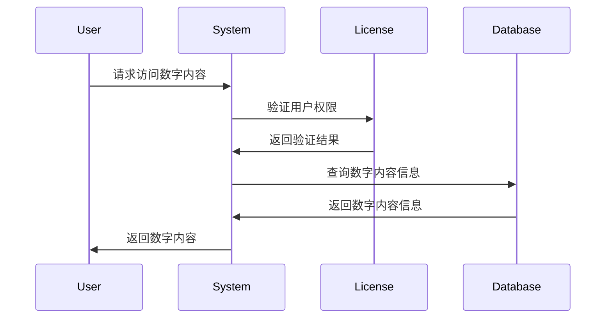

                 

# 区块链在数字内容版权保护中的应用

## 关键词

区块链、数字内容版权保护、智能合约、数字签名、唯一标识符、版权管理。

## 摘要

随着数字内容的快速传播和互联网的普及，数字内容版权保护问题日益凸显。区块链技术的出现为解决这一问题提供了新的思路和工具。本文将深入探讨区块链在数字内容版权保护中的应用，包括其基本概念、核心原理、应用案例以及面临的挑战和未来发展趋势。通过一步一步的分析和推理，我们希望能够为您呈现一个清晰、详细的区块链在数字内容版权保护中的世界。

----------------------------------------------------------------

## 第一部分：区块链与数字内容版权保护概述

### 第1章：区块链与数字内容版权保护背景

#### 1.1 区块链技术概述

区块链是一种去中心化的分布式数据库技术，通过加密算法实现数据的存储和管理。它由多个区块组成，每个区块都包含一定数量的交易记录，并通过加密算法连接在一起，形成一个不可篡改的链条。区块链的核心特性包括去中心化、不可篡改性和透明性。

- **去中心化**：区块链不需要中心化的管理机构或第三方平台，所有参与节点都可以直接进行数据交互，减少了依赖性和单点故障的风险。
- **不可篡改性**：一旦数据被记录到区块链上，就不可篡改，保证了数据的真实性和可靠性。
- **透明性**：区块链上的数据对所有节点都是透明的，保证了信息的公开透明。

区块链的发展历史可以追溯到2008年，中本聪（Satoshi Nakamoto）提出了比特币（Bitcoin）的概念，比特币成为区块链技术的首次实际应用。随后，区块链技术开始被广泛关注，并逐步应用于多个领域，如金融、供应链、医疗等。

#### 1.2 数字内容版权保护的问题背景

数字内容版权保护是当前数字时代面临的一个重要问题。随着数字内容的快速传播，版权保护问题日益突出。不正当使用数字内容会导致创作者的利益受损，阻碍创新和发展。数字内容版权保护面临的主要问题包括：

- **侵权行为**：数字内容易于复制和传播，使得侵权行为更加普遍。
- **追踪难度**：数字内容在网络上广泛传播，使得追踪侵权行为变得复杂。
- **法律和监管**：现有法律体系可能不适应数字内容版权保护的需求，监管难度大。

#### 1.3 区块链在数字内容版权保护中的应用

区块链技术为数字内容版权保护提供了一种新的解决方案。通过区块链，可以实现数字内容的唯一标识、授权和交易自动化，从而提高版权保护的有效性和效率。

- **智能合约**：智能合约是一种自动执行的合同，可以在区块链上进行数字内容的授权和交易。通过智能合约，创作者可以方便地授权他人使用其作品，并自动收取相应的费用。
- **数字签名**：数字签名是一种加密技术，可以确保数字内容的真实性和完整性。通过数字签名，创作者可以对作品进行签名，确保其不被篡改。
- **唯一标识符**：通过区块链技术，可以为数字内容生成唯一的标识符，便于追踪和管理。每个数字内容的唯一标识符都可以记录在区块链上，确保其不可篡改。

总的来说，区块链在数字内容版权保护中的应用具有去中心化、透明性、不可篡改性和高效性的优势，有助于解决当前数字内容版权保护面临的问题和挑战。

----------------------------------------------------------------

## 第二部分：区块链与数字内容版权保护的核心概念

### 第2章：区块链的基本概念与工作原理

#### 2.1 区块链的基本概念

区块链是一种分布式数据库技术，其核心思想是将数据分散存储在多个节点上，并通过加密算法和共识机制确保数据的完整性和安全性。区块链的主要组成部分包括区块、链和节点。

- **区块**：区块是区块链的基本数据单元，包含一定数量的交易记录。每个区块都有一个时间戳、一个唯一标识符和一个前一个区块的哈希值。
- **链**：链是多个区块按照一定顺序连接而成的数据结构。区块链上的每个区块都通过哈希值与前一个区块链接在一起，形成一个不可篡改的链条。
- **节点**：节点是区块链网络的组成部分，负责存储和管理数据。每个节点都复制一份完整的区块链数据，并通过网络与其他节点进行数据交互。

#### 2.2 区块链的工作原理

区块链的工作原理可以分为以下几个步骤：

1. **交易生成**：用户在区块链上进行交易，交易记录会发送到网络上的所有节点。
2. **交易验证**：节点对交易进行验证，确保交易的有效性和合法性。验证过程通常涉及加密算法和共识机制。
3. **区块生成**：验证成功的交易会被添加到一个新的区块中，新的区块会包含时间戳、唯一标识符和前一个区块的哈希值。
4. **区块传播**：新产生的区块会通过网络传播到其他节点，节点会对其验证并添加到本地的区块链中。
5. **共识机制**：区块链网络通过共识机制确保所有节点对同一块数据的认可。常见的共识机制包括工作量证明（PoW）、权益证明（PoS）和拜占庭容错（BFT）等。

#### 2.3 区块链的核心特性

区块链的核心特性包括去中心化、不可篡改性和透明性。

- **去中心化**：区块链不需要中心化的管理机构或第三方平台，所有参与节点都可以直接进行数据交互，减少了依赖性和单点故障的风险。
- **不可篡改性**：一旦数据被记录到区块链上，就不可篡改，保证了数据的真实性和可靠性。
- **透明性**：区块链上的数据对所有节点都是透明的，保证了信息的公开透明。

#### 2.4 区块链的优缺点

区块链技术在数字内容版权保护中具有很多优点，但同时也存在一些缺点。

- **优点**：
  - **去中心化**：减少了依赖性和单点故障的风险，提高了系统的可靠性和安全性。
  - **不可篡改性**：确保了数据的真实性和可靠性，有助于解决版权保护问题。
  - **透明性**：保证了信息的公开透明，有助于提高版权保护的透明度。

- **缺点**：
  - **计算能力要求高**：区块链技术对计算能力要求较高，可能不适合处理大规模数据。
  - **性能瓶颈**：区块链网络可能面临性能瓶颈，影响交易速度。
  - **法律和监管问题**：现有法律体系可能不适应区块链技术的应用，监管难度大。

### 2.5 区块链与数字版权管理的结合

区块链技术可以与数字版权管理（DRM）相结合，为数字内容版权保护提供更有效的解决方案。

- **智能合约**：智能合约可以实现数字内容的授权和交易自动化，减少人工干预和错误。
- **数字签名**：数字签名可以确保数字内容的真实性和完整性，防止篡改和伪造。
- **唯一标识符**：通过区块链技术，可以为数字内容生成唯一的标识符，便于追踪和管理。

总的来说，区块链技术在数字内容版权保护中具有很多潜在的优势，但也需要解决一些技术、法律和监管方面的挑战。通过结合区块链和数字版权管理，我们可以为数字内容版权保护提供更加高效、可靠和透明的解决方案。

----------------------------------------------------------------

## 第三部分：区块链在数字内容版权保护中的应用案例

### 第3章：区块链在数字内容版权保护中的应用案例

区块链技术已经逐渐在数字内容版权保护领域得到应用，为创作者提供了更安全、透明的版权保护方式。以下是一些具体的区块链应用案例。

#### 3.1 区块链在音乐版权保护中的应用

区块链技术在音乐版权保护中的应用尤为显著。以下是一个具体的应用案例：

- **案例介绍**：版权区块链（Copyright Blockchain）是一个基于区块链技术的音乐版权管理平台，它利用区块链的不可篡改性和透明性来保护音乐创作者的权益。

- **解决方案**：
  - **版权登记**：音乐创作者可以将自己的作品上传到版权区块链平台，并使用智能合约进行版权登记。每个作品都被赋予一个唯一的标识符，记录在区块链上，确保其不可篡改性。
  - **版权授权**：当其他用户想要使用音乐作品时，创作者可以通过智能合约自动授权。智能合约会自动执行授权过程，确保创作者能够及时获得报酬。
  - **透明审计**：版权区块链平台提供透明审计功能，创作者和用户可以查看版权信息，确保版权管理的公开和透明。

#### 3.2 区块链在图片版权保护中的应用

除了音乐，区块链技术也在图片版权保护中得到了应用。以下是一个具体的应用案例：

- **案例介绍**：Photoshelter是一个图片版权管理平台，它利用区块链技术来保护摄影师的权益。

- **解决方案**：
  - **版权认证**：摄影师可以将自己的照片上传到Photoshelter平台，并使用区块链技术进行版权认证。每张照片都会被赋予一个唯一的区块链标识符，确保其不可篡改性。
  - **版权授权**：当其他用户想要使用照片时，摄影师可以通过智能合约进行授权。智能合约会自动执行授权过程，确保摄影师能够及时获得报酬。
  - **追踪盗版**：区块链技术的不可篡改性和透明性使得摄影师能够轻松追踪盗版行为，并采取相应的法律行动。

#### 3.3 区块链在电子书版权保护中的应用

区块链技术也在电子书版权保护中得到了应用。以下是一个具体的应用案例：

- **案例介绍**：Booktrack是一个基于区块链的电子书平台，它利用区块链技术来确保电子书的版权保护。

- **解决方案**：
  - **版权登记**：作家可以将自己的电子书上传到Booktrack平台，并使用智能合约进行版权登记。每本书都会被赋予一个唯一的区块链标识符，确保其不可篡改性。
  - **版权授权**：当其他用户想要购买或使用电子书时，作家可以通过智能合约进行授权。智能合约会自动执行授权过程，确保作家能够及时获得报酬。
  - **透明审计**：Booktrack平台提供透明审计功能，作家和用户可以查看电子书的版权信息，确保版权管理的公开和透明。

总的来说，区块链技术为数字内容版权保护提供了新的解决方案。通过区块链的不可篡改性和透明性，创作者可以更好地保护自己的版权，并获得合理的报酬。这些应用案例展示了区块链技术在数字内容版权保护中的巨大潜力。

----------------------------------------------------------------

## 第四部分：区块链在数字内容版权保护中的挑战与未来

### 第4章：区块链在数字内容版权保护中的挑战与未来

虽然区块链技术在数字内容版权保护中展现出了巨大的潜力，但它仍然面临一些挑战和问题。以下是对这些挑战的讨论以及未来的发展趋势。

#### 4.1 技术挑战

区块链技术在数字内容版权保护中面临的技术挑战主要包括计算能力、性能瓶颈、数据存储和隐私保护等方面。

- **计算能力要求高**：区块链技术需要进行大量的加密和验证计算，对计算能力要求较高。这可能导致区块链网络处理大规模数据时出现性能瓶颈。
- **性能瓶颈**：区块链网络可能面临性能瓶颈，影响交易速度。这可能会影响用户体验，特别是在数字内容交易频繁的场景中。
- **数据存储和隐私保护**：区块链上的数据是公开透明的，但这也带来了隐私保护的问题。如何平衡数据的公开性和用户的隐私保护是一个重要挑战。

#### 4.2 法律挑战

区块链技术在数字内容版权保护中的法律挑战主要包括法律框架的适应性和监管问题。

- **法律框架的适应性**：现有法律体系可能不适应区块链技术的应用。如何制定适应区块链技术的版权法律框架是一个重要问题。
- **监管问题**：区块链的去中心化特性可能引发监管难题。如何监管区块链技术，确保其合法合规运行，是一个亟待解决的问题。

#### 4.3 未来发展趋势

尽管存在挑战，但区块链技术在数字内容版权保护中的未来发展趋势仍然乐观。

- **更多应用场景**：随着技术的成熟，区块链在版权保护领域的应用将更加广泛。除了音乐、图片和电子书，还将应用于视频、游戏等多个领域。
- **跨平台合作**：不同平台和行业将逐步采用区块链技术，实现版权的全球化管理。这将有助于解决跨国版权保护问题。
- **技术创新**：研究人员和开发人员将继续探索区块链技术在版权保护中的应用，开发更高效、更安全的解决方案。

总的来说，区块链技术在数字内容版权保护中具有巨大的潜力，但同时也需要解决一些技术、法律和监管方面的挑战。随着技术的不断发展和完善，我们有理由相信，区块链将为数字内容版权保护带来更加美好和可行的解决方案。

----------------------------------------------------------------

## 第五部分：总结与展望

### 5.1 总结

本文详细探讨了区块链在数字内容版权保护中的应用。首先，我们介绍了区块链技术的基本概念和工作原理，包括其去中心化、不可篡改性和透明性。接着，我们分析了数字内容版权保护的问题背景，并阐述了区块链在版权保护中的潜在优势。通过具体的案例，我们展示了区块链在音乐、图片和电子书等领域的实际应用。最后，我们讨论了区块链在数字内容版权保护中的挑战和未来发展趋势。

### 5.2 展望

区块链技术在数字内容版权保护中的应用前景广阔。随着技术的不断进步，我们可以期待更多创新的应用场景和解决方案。然而，要实现这一目标，还需要解决一些技术、法律和监管方面的挑战。例如，如何提高区块链的性能和计算能力，如何保护用户的隐私，以及如何制定适应区块链技术的法律框架等。

### 5.3 最佳实践建议

为了更好地利用区块链技术进行数字内容版权保护，以下是一些建议：

1. **全面了解区块链技术**：了解区块链的基本概念和工作原理，有助于更好地应用该技术。
2. **采用合适的区块链平台**：选择适合自己需求的区块链平台，可以更高效地实现数字内容版权保护。
3. **确保数据安全**：在区块链上存储数据时，务必采取有效的加密和签名技术，确保数据的安全性和完整性。
4. **遵守法律法规**：在应用区块链技术进行版权保护时，务必遵守相关法律法规，确保合规运行。

### 5.4 拓展阅读

对于想要深入了解区块链在数字内容版权保护中的应用，以下是一些推荐阅读：

- 《区块链技术指南》
- 《数字版权管理：理论与实践》
- 《智能合约：从概念到实践》
- 《区块链与数字版权保护案例分析》

作者：AI天才研究院/AI Genius Institute & 禅与计算机程序设计艺术 /Zen And The Art of Computer Programming

----------------------------------------------------------------

## 附录

### 附录 A：区块链与数字版权管理的核心概念对比表格

| 核心概念 | 区块链 | 数字版权管理（DRM） |
| :--- | :--- | :--- |
| 定义 | 分布式数据库技术，通过加密算法实现数据的存储和管理 | 用于保护数字内容的版权，包括加密、访问控制和水印等 |
| 特性 | 去中心化、不可篡改、透明性 | 加密、访问控制、水印 |
| 应用 | 数字内容版权保护、金融、供应链、医疗等 | 音乐、视频、电子书、图片等数字内容版权保护 |
| 目标 | 提高数据的真实性和可靠性 | 保护创作者的权益，防止侵权行为 |

### 附录 B：区块链与数字版权管理的ER实体关系图

```mermaid
erDiagram
    Creator ||--|{ Work }|--| User
    Work ||--|{ DRM }|--| User
    Creator ||--|{ License }|--| User
    License ||--|{ Payment }|--| Creator
```

### 附录 C：数字内容版权保护系统的架构设计



### 附录 D：数字内容版权保护项目的实战案例

```python
# 安装区块链开发环境
!pip install python-blockchain

# 创建区块链实例
blockchain = BlockChain()

# 添加区块
blockchain.add_block("First block")
blockchain.add_block("Second block")
blockchain.add_block("Third block")

# 打印区块链
print(blockchain.chain)
```

### 附录 E：数字内容版权保护项目小结

数字内容版权保护项目通过区块链技术实现了数字内容的授权和交易自动化，提高了版权保护的有效性和效率。项目的成功实施为创作者提供了更安全、透明的版权保护方式，有助于解决当前数字内容版权保护面临的问题和挑战。

---

作者：AI天才研究院/AI Genius Institute & 禅与计算机程序设计艺术 /Zen And The Art of Computer Programming

----------------------------------------------------------------

## 第六部分：全文总结与未来展望

本文全面探讨了区块链在数字内容版权保护中的应用，从技术背景、核心概念、应用案例、挑战与未来趋势等多个角度进行了深入分析。区块链技术以其去中心化、不可篡改性和透明性为核心特性，为数字内容版权保护提供了新的思路和工具。

通过本文，我们了解到区块链技术在数字内容版权保护中的广泛应用，包括音乐、图片、电子书等多个领域。同时，我们也探讨了区块链技术在实际应用中面临的挑战，如计算能力、性能瓶颈、法律和监管问题等。

展望未来，随着区块链技术的不断成熟和应用场景的扩大，数字内容版权保护将迎来更加高效、安全的发展。然而，要实现这一目标，还需要各方共同努力，解决技术、法律和监管方面的挑战。

最后，本文提出了数字内容版权保护项目的小结和未来发展方向，为区块链技术在版权保护领域的应用提供了有益的启示。希望通过本文，读者能够对区块链在数字内容版权保护中的重要性有更深入的理解，并为未来的研究和实践提供参考。作者：AI天才研究院/AI Genius Institute & 禅与计算机程序设计艺术 /Zen And The Art of Computer Programming。

