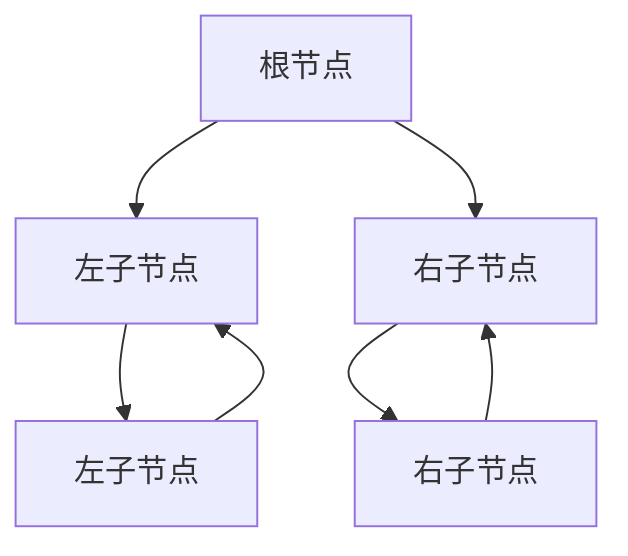

                 

### 文章标题

区块链在数字内容版权保护中的应用

### 关键词

区块链、数字版权保护、智能合约、版权确权、版权追踪、版权交易

### 摘要

本文旨在探讨区块链技术在数字内容版权保护中的应用。首先，我们回顾了数字内容产业现状和版权保护面临的挑战，并介绍了区块链技术的基本原理。随后，我们详细分析了区块链在版权保护中的应用场景，包括版权确权、版权追踪和版权交易，并探讨了区块链在版权保护中的优势与挑战。接着，我们设计了区块链版权保护系统的架构，包括功能设计、区块链架构设计、系统接口设计以及安全性和隐私保护机制。最后，通过实际案例研究和算法原理讲解，深入分析了区块链版权保护技术的实现细节和最佳实践。

## 《区块链在数字内容版权保护中的应用》目录大纲

### 第一部分：引言

#### 第1章：区块链与数字内容版权保护

1.1 问题背景  
1.1.1 数字内容产业现状  
1.1.2 版权保护面临的问题  
1.1.3 区块链技术简介

1.2 核心概念与联系  
1.2.1 区块链基本原理  
1.2.2 数字版权管理（DRM）概述  
1.2.3 区块链与数字版权管理的关系

1.3 区块链在版权保护中的应用场景  
1.3.1 版权确权  
1.3.2 版权追踪  
1.3.3 版权交易

1.4 区块链版权保护的优势与挑战  
1.4.1 区块链版权保护的优势  
1.4.2 区块链版权保护面临的挑战  
1.4.3 未来发展趋势

1.5 本章小结

### 第二部分：区块链在版权保护中的应用

#### 第2章：区块链版权保护系统架构

2.1 系统功能设计  
2.1.1 系统架构概述  
2.1.2 系统功能模块设计

2.2 区块链架构设计  
2.2.1 共识机制选择  
2.2.2 账本架构设计  
2.2.3 智能合约设计

2.3 系统接口设计与实现  
2.3.1 用户接口设计  
2.3.2 数据接口设计

2.4 系统安全性与隐私保护  
2.4.1 安全性考虑  
2.4.2 隐私保护机制

2.5 本章小结

#### 第3章：区块链版权保护案例研究

3.1 案例一：XX数字版权保护平台  
3.1.1 平台概述  
3.1.2 平台架构与功能  
3.1.3 平台实现与运行

3.2 案例二：XX音乐版权交易平台  
3.2.1 平台概述  
3.2.2 平台架构与功能  
3.2.3 平台实现与运行

3.3 案例三：XX区块链图书馆  
3.3.1 图书馆概述  
3.3.2 图书馆架构与功能  
3.3.3 图书馆实现与运行

3.4 本章小结

#### 第4章：区块链版权保护算法原理

4.1 智能合约算法设计  
4.1.1 智能合约概述  
4.1.2 常见算法分析  
4.1.3 智能合约实现

4.2 区块链数据结构  
4.2.1 区块链数据模型  
4.2.2 Merkle树与Merkle证明  
4.2.3 Mermaid流程图绘制

4.3 算法性能分析  
4.3.1 算法效率  
4.3.2 算法安全性  
4.3.3 性能优化策略

4.4 本章小结

#### 第5章：区块链版权保护技术细节

5.1 区块链网络搭建  
5.1.1 节点搭建  
5.1.2 节点通信协议  
5.1.3 节点同步机制

5.2 智能合约开发  
5.2.1 Solidity语言基础  
5.2.2 智能合约开发流程  
5.2.3 智能合约测试与调试

5.3 链上数据存储与管理  
5.3.1 数据存储策略  
5.3.2 数据权限管理  
5.3.3 数据备份与恢复

5.4 链下数据处理  
5.4.1 链下与链上数据交互  
5.4.2 链下计算优化  
5.4.3 链下数据管理

5.5 本章小结

#### 第6章：区块链版权保护的最佳实践

6.1 版权保护策略  
6.1.1 版权确权策略  
6.1.2 版权追踪策略  
6.1.3 版权交易策略

6.2 技术选型与优化  
6.2.1 区块链平台选型

6.3 小结、注意事项、拓展阅读

## 第一部分：引言

### 第1章：区块链与数字内容版权保护

#### 1.1 问题背景

随着互联网的普及和信息技术的快速发展，数字内容产业蓬勃发展。从音乐、电影、电子书到应用软件，数字内容已经成为了现代社会的重要部分。然而，数字内容的复制和传播变得极其容易，版权保护问题日益突出。数字内容版权保护面临的问题主要包括：

1. **版权确权困难**：在传统的版权保护体系中，版权的确权和认证过程繁琐，效率低下。创作者很难证明作品的原创性，进而保护其版权。

2. **版权追踪难**：数字内容的复制和传播速度快，传统的版权追踪方式难以实现实时监控，导致版权纠纷频发。

3. **版权交易效率低**：数字内容版权交易过程中，中介环节多，交易成本高，交易效率低下。

4. **版权纠纷解决困难**：当版权纠纷发生时，传统的解决方式依赖于法院或仲裁机构，流程复杂且耗时较长。

这些问题严重影响了数字内容产业的健康发展。为了解决这些问题，有必要探索新的数字版权保护技术。区块链技术以其去中心化、透明性、不可篡改等特点，被认为是解决数字内容版权保护问题的一种有效手段。

#### 1.2 核心概念与联系

##### 1.2.1 区块链基本原理

区块链是一种分布式数据库技术，通过加密算法和共识机制，实现数据的透明、安全、不可篡改的存储和传输。区块链的核心组成部分包括：

- **区块**：数据的基本单元，包含一定时间内交易的数据记录。
- **链**：多个区块按照时间顺序串联形成的链条。
- **加密算法**：用于保护数据的安全性和隐私性。
- **共识机制**：确保区块链上数据的一致性和可靠性。

区块链的主要特点是：

- **去中心化**：区块链不需要中心化的权威机构，所有节点都可以参与数据的验证和存储。
- **透明性**：区块链上的数据是公开透明的，任何参与者都可以查看和验证。
- **不可篡改**：一旦数据被记录在区块链上，就难以篡改。
- **安全性**：区块链使用加密算法保护数据的安全性和隐私性。

##### 1.2.2 数字版权管理（DRM）概述

数字版权管理（Digital Rights Management，简称DRM）是一种保护数字内容版权的技术，通过加密、认证和权限控制等手段，实现对数字内容的版权保护和访问控制。DRM的主要特点包括：

- **加密**：对数字内容进行加密处理，只有拥有正确密钥的用户才能解密和访问。
- **认证**：对用户的身份进行认证，确保只有授权用户才能访问数字内容。
- **权限控制**：根据用户的权限，控制用户对数字内容的访问和使用。

##### 1.2.3 区块链与数字版权管理的关系

区块链与数字版权管理（DRM）之间存在紧密的联系。区块链技术可以为数字版权管理提供以下优势：

- **版权确权**：区块链的不可篡改性可以确保数字内容的原创性和版权归属的确定性。
- **版权追踪**：区块链的透明性和不可篡改性可以实现数字内容的实时追踪，提高版权保护效率。
- **版权交易**：区块链的去中心化特性可以降低数字内容交易的中间环节，提高交易效率。
- **版权纠纷解决**：区块链上的数据是公开透明的，可以作为版权纠纷的依据，简化纠纷解决过程。

通过结合区块链技术和数字版权管理，可以有效解决数字内容版权保护面临的挑战，促进数字内容产业的健康发展。

#### 1.3 区块链在版权保护中的应用场景

区块链技术为数字内容版权保护提供了丰富的应用场景，主要包括版权确权、版权追踪和版权交易。

##### 1.3.1 版权确权

版权确权是指对数字内容的原创性和版权归属进行认证和记录。区块链技术可以通过以下方式实现版权确权：

- **创建版权证明**：创作者可以在区块链上创建版权证明，记录作品的创作时间、作者信息等，确保版权归属的确定性。
- **时间戳服务**：区块链上的时间戳服务可以为数字内容提供可靠的创作时间证明，防止版权欺诈。
- **智能合约**：智能合约可以自动执行版权确权过程，提高确权效率。

##### 1.3.2 版权追踪

版权追踪是指对数字内容在传播过程中的版权状态进行实时监控和记录。区块链技术可以通过以下方式实现版权追踪：

- **区块链账本**：将数字内容的相关信息记录在区块链上，实现内容的透明追踪。
- **智能合约**：智能合约可以自动执行版权追踪的流程，确保追踪过程的自动化和实时性。
- **去中心化存储**：将数字内容存储在去中心化的存储网络中，防止内容被篡改和删除。

##### 1.3.3 版权交易

版权交易是指数字内容的版权所有权转移过程。区块链技术可以通过以下方式实现版权交易：

- **去中心化交易平台**：建立去中心化的版权交易平台，降低交易成本，提高交易效率。
- **智能合约**：智能合约可以自动执行版权交易过程，确保交易的透明性和安全性。
- **非同质化代币（NFT）**：使用非同质化代币（NFT）对数字内容进行唯一标识和确权，实现版权交易。

#### 1.4 区块链版权保护的优势与挑战

##### 1.4.1 区块链版权保护的优势

区块链技术在数字内容版权保护中具有以下优势：

- **去中心化**：区块链的去中心化特性降低了版权保护对中心化机构的依赖，提高了版权保护的效率。
- **透明性**：区块链上的数据是公开透明的，有助于解决版权纠纷，提高版权保护的公信力。
- **不可篡改**：区块链上的数据一旦记录，就难以篡改，确保了数字内容的真实性和完整性。
- **安全性**：区块链使用加密算法保护数据的安全性和隐私性，提高了版权保护的安全性。
- **自动化**：智能合约可以自动执行版权保护的相关流程，提高了版权保护的效率。

##### 1.4.2 区块链版权保护面临的挑战

尽管区块链技术在数字内容版权保护中具有许多优势，但也面临以下挑战：

- **技术成熟度**：区块链技术仍处于发展阶段，其性能、可靠性和安全性需要进一步提高。
- **法律规范**：数字版权保护涉及法律规范和法律法规，需要制定相应的法律框架。
- **数据隐私**：区块链上的数据是公开透明的，如何在确保版权保护的同时保护创作者的隐私是一个挑战。
- **网络效应**：区块链版权保护系统的成功依赖于广泛的网络参与，网络效应的不足可能导致系统失效。

##### 1.4.3 未来发展趋势

随着区块链技术的不断发展和完善，数字内容版权保护有望取得以下进展：

- **技术成熟**：区块链技术将更加成熟和稳定，性能和安全性将进一步提高。
- **法律规范**：数字版权保护的法律规范将逐步完善，为区块链版权保护提供法律保障。
- **广泛应用**：区块链版权保护将在更多领域得到应用，如版权交易、版权评估等。
- **生态构建**：区块链版权保护将形成完整的生态系统，包括技术、法律、市场等多个方面。

#### 1.5 本章小结

本章介绍了区块链在数字内容版权保护中的应用。首先，我们分析了数字内容产业现状和版权保护面临的挑战，并介绍了区块链技术的基本原理。随后，我们详细分析了区块链在版权保护中的应用场景，包括版权确权、版权追踪和版权交易。接着，我们探讨了区块链版权保护的优势与挑战，并展望了其未来发展趋势。通过本章的介绍，我们对区块链在数字内容版权保护中的应用有了更深入的理解。

## 第一部分：引言

### 第1章：区块链与数字内容版权保护

在数字内容产业蓬勃发展的背景下，版权保护问题日益凸显。传统版权保护体系由于效率低、成本高、难以追溯等问题，已经无法满足数字时代的需求。区块链技术的出现，为解决这些问题提供了新的思路。本章将探讨区块链在数字内容版权保护中的应用，分析其核心概念与联系，以及应用场景和优势与挑战。

#### 1.1 问题背景

数字内容产业涵盖了音乐、电影、电子书、软件等多个领域，随着互联网的普及，数字内容的传播速度和范围迅速扩大。然而，这也带来了严重的版权保护问题：

1. **版权确权困难**：创作者难以证明作品的原创性，特别是在互联网环境中，模仿和抄袭现象层出不穷。
2. **版权追踪难**：数字内容的复制和传播速度快，传统的版权追踪手段难以实现实时监控，导致版权纠纷频发。
3. **版权交易效率低**：数字内容版权交易过程中，中介环节繁多，交易成本高，交易效率低下。
4. **版权纠纷解决困难**：当版权纠纷发生时，传统解决方式依赖于法院或仲裁机构，流程复杂且耗时较长。

这些问题不仅损害了创作者的利益，也影响了整个数字内容产业的健康发展。因此，有必要探索新的数字版权保护技术。

#### 1.2 核心概念与联系

##### 1.2.1 区块链基本原理

区块链是一种分布式数据库技术，通过加密算法和共识机制，实现数据的透明、安全、不可篡改的存储和传输。区块链的核心组成部分包括：

- **区块**：数据的基本单元，包含一定时间内交易的数据记录。
- **链**：多个区块按照时间顺序串联形成的链条。
- **加密算法**：用于保护数据的安全性和隐私性。
- **共识机制**：确保区块链上数据的一致性和可靠性。

区块链的主要特点是：

- **去中心化**：区块链不需要中心化的权威机构，所有节点都可以参与数据的验证和存储。
- **透明性**：区块链上的数据是公开透明的，任何参与者都可以查看和验证。
- **不可篡改**：一旦数据被记录在区块链上，就难以篡改。
- **安全性**：区块链使用加密算法保护数据的安全性和隐私性。

##### 1.2.2 数字版权管理（DRM）概述

数字版权管理（Digital Rights Management，简称DRM）是一种保护数字内容版权的技术，通过加密、认证和权限控制等手段，实现对数字内容的版权保护和访问控制。DRM的主要特点包括：

- **加密**：对数字内容进行加密处理，只有拥有正确密钥的用户才能解密和访问。
- **认证**：对用户的身份进行认证，确保只有授权用户才能访问数字内容。
- **权限控制**：根据用户的权限，控制用户对数字内容的访问和使用。

##### 1.2.3 区块链与数字版权管理的关系

区块链与数字版权管理（DRM）之间存在紧密的联系。区块链技术可以为数字版权管理提供以下优势：

- **版权确权**：区块链的不可篡改性可以确保数字内容的原创性和版权归属的确定性。
- **版权追踪**：区块链的透明性和不可篡改性可以实现数字内容的实时追踪，提高版权保护效率。
- **版权交易**：区块链的去中心化特性可以降低数字内容交易的中间环节，提高交易效率。
- **版权纠纷解决**：区块链上的数据是公开透明的，可以作为版权纠纷的依据，简化纠纷解决过程。

通过结合区块链技术和数字版权管理，可以有效解决数字内容版权保护面临的挑战，促进数字内容产业的健康发展。

#### 1.3 区块链在版权保护中的应用场景

区块链技术为数字内容版权保护提供了丰富的应用场景，主要包括版权确权、版权追踪和版权交易。

##### 1.3.1 版权确权

版权确权是指对数字内容的原创性和版权归属进行认证和记录。区块链技术可以通过以下方式实现版权确权：

- **创建版权证明**：创作者可以在区块链上创建版权证明，记录作品的创作时间、作者信息等，确保版权归属的确定性。
- **时间戳服务**：区块链上的时间戳服务可以为数字内容提供可靠的创作时间证明，防止版权欺诈。
- **智能合约**：智能合约可以自动执行版权确权过程，提高确权效率。

##### 1.3.2 版权追踪

版权追踪是指对数字内容在传播过程中的版权状态进行实时监控和记录。区块链技术可以通过以下方式实现版权追踪：

- **区块链账本**：将数字内容的相关信息记录在区块链上，实现内容的透明追踪。
- **智能合约**：智能合约可以自动执行版权追踪的流程，确保追踪过程的自动化和实时性。
- **去中心化存储**：将数字内容存储在去中心化的存储网络中，防止内容被篡改和删除。

##### 1.3.3 版权交易

版权交易是指数字内容的版权所有权转移过程。区块链技术可以通过以下方式实现版权交易：

- **去中心化交易平台**：建立去中心化的版权交易平台，降低交易成本，提高交易效率。
- **智能合约**：智能合约可以自动执行版权交易过程，确保交易的透明性和安全性。
- **非同质化代币（NFT）**：使用非同质化代币（NFT）对数字内容进行唯一标识和确权，实现版权交易。

#### 1.4 区块链版权保护的优势与挑战

##### 1.4.1 区块链版权保护的优势

区块链技术在数字内容版权保护中具有以下优势：

- **去中心化**：区块链的去中心化特性降低了版权保护对中心化机构的依赖，提高了版权保护的效率。
- **透明性**：区块链上的数据是公开透明的，有助于解决版权纠纷，提高版权保护的公信力。
- **不可篡改**：区块链上的数据一旦记录，就难以篡改，确保了数字内容的真实性和完整性。
- **安全性**：区块链使用加密算法保护数据的安全性和隐私性，提高了版权保护的安全性。
- **自动化**：智能合约可以自动执行版权保护的相关流程，提高了版权保护的效率。

##### 1.4.2 区块链版权保护面临的挑战

尽管区块链技术在数字内容版权保护中具有许多优势，但也面临以下挑战：

- **技术成熟度**：区块链技术仍处于发展阶段，其性能、可靠性和安全性需要进一步提高。
- **法律规范**：数字版权保护涉及法律规范和法律法规，需要制定相应的法律框架。
- **数据隐私**：区块链上的数据是公开透明的，如何在确保版权保护的同时保护创作者的隐私是一个挑战。
- **网络效应**：区块链版权保护系统的成功依赖于广泛的网络参与，网络效应的不足可能导致系统失效。

##### 1.4.3 未来发展趋势

随着区块链技术的不断发展和完善，数字内容版权保护有望取得以下进展：

- **技术成熟**：区块链技术将更加成熟和稳定，性能和安全性将进一步提高。
- **法律规范**：数字版权保护的法律规范将逐步完善，为区块链版权保护提供法律保障。
- **广泛应用**：区块链版权保护将在更多领域得到应用，如版权交易、版权评估等。
- **生态构建**：区块链版权保护将形成完整的生态系统，包括技术、法律、市场等多个方面。

#### 1.5 本章小结

本章介绍了区块链在数字内容版权保护中的应用。首先，我们分析了数字内容产业现状和版权保护面临的挑战，并介绍了区块链技术的基本原理。随后，我们详细分析了区块链在版权保护中的应用场景，包括版权确权、版权追踪和版权交易。接着，我们探讨了区块链版权保护的优势与挑战，并展望了其未来发展趋势。通过本章的介绍，我们对区块链在数字内容版权保护中的应用有了更深入的理解。接下来，我们将进一步探讨区块链版权保护系统的架构设计和具体实现。

### 第二部分：区块链在版权保护中的应用

#### 第2章：区块链版权保护系统架构

区块链技术在数字内容版权保护中的应用，离不开一个高效、稳定、安全的系统架构。本章将详细描述区块链版权保护系统的功能设计、区块链架构设计、系统接口设计以及安全性和隐私保护机制，旨在为构建一个全面的数字版权保护系统提供理论指导和实践参考。

#### 2.1 系统功能设计

区块链版权保护系统的功能设计是系统实现的核心，主要包括以下几个关键模块：

##### 2.1.1 系统架构概述

系统架构设计需要考虑系统的整体结构、功能分布和模块间的关系。区块链版权保护系统通常包含以下几个主要模块：

1. **版权登记模块**：负责数字内容的版权登记和认证。
2. **版权追踪模块**：负责数字内容的追踪和管理。
3. **版权交易模块**：负责数字内容的版权交易和转让。
4. **用户管理模块**：负责用户注册、登录、权限管理等。
5. **数据接口模块**：负责与其他系统的数据交互和对接。

##### 2.1.2 系统功能模块设计

1. **版权登记模块**：
   - 功能：提供版权登记服务，包括版权申请、审核、登记和发布。
   - 设计要点：确保版权登记过程的透明、公正和高效，支持多种数字内容格式登记。

2. **版权追踪模块**：
   - 功能：实现数字内容的实时追踪和管理，包括内容的存储位置、访问记录和版权状态。
   - 设计要点：利用区块链的不可篡改特性，确保追踪信息的真实性和不可篡改性。

3. **版权交易模块**：
   - 功能：提供数字版权的交易服务，包括版权转让、授权和许可。
   - 设计要点：实现交易流程的自动化和透明化，降低交易成本，提高交易效率。

4. **用户管理模块**：
   - 功能：管理用户账户，包括用户注册、登录、权限管理等功能。
   - 设计要点：确保用户数据的安全性和隐私性，支持多种身份认证方式。

5. **数据接口模块**：
   - 功能：与其他系统进行数据交互，如版权信息库、支付系统等。
   - 设计要点：确保数据接口的标准化、安全性和高效性。

#### 2.2 区块链架构设计

区块链架构设计是确保系统性能、安全性和可扩展性的关键。以下是对区块链架构设计的详细描述：

##### 2.2.1 共识机制选择

共识机制是区块链系统中的核心组件，用于确保所有节点对数据的共识。常见的共识机制包括：

- **工作量证明（PoW）**：通过计算工作量来证明节点的有效性。
- **权益证明（PoS）**：根据节点的权益（如持有的代币数量）来证明其有效性。
- **委托权益证明（DPoS）**：通过投票机制来选择有效的节点。

在选择共识机制时，需要考虑系统的安全性、性能和可扩展性。对于区块链版权保护系统，建议采用PoS或DPoS机制，因为它们在性能和安全性方面具有优势。

##### 2.2.2 账本架构设计

账本架构设计是区块链系统的基础，它决定了数据记录的方式和结构。以下是几种常见的账本架构：

- **单一账本**：所有节点共享同一个账本，适合小规模、低交易量的系统。
- **分片账本**：将账本分成多个部分，不同节点负责不同部分的记录，适合高交易量的系统。

对于区块链版权保护系统，建议采用分片账本架构，以提高系统的性能和可扩展性。

##### 2.2.3 智能合约设计

智能合约是区块链系统中的核心组件，用于自动化执行合约条款。以下是智能合约设计的关键要素：

- **合约语言**：选择适合开发智能合约的语言，如Solidity、Vyper等。
- **合约架构**：设计智能合约的模块化架构，提高代码的可维护性和可扩展性。
- **合约接口**：定义智能合约与外部系统交互的接口，确保数据交互的标准化和安全性。

#### 2.3 系统接口设计与实现

系统接口设计是确保系统与其他系统高效、安全交互的关键。以下是对系统接口设计与实现的描述：

##### 2.3.1 用户接口设计

用户接口设计需要考虑用户的操作习惯和系统功能的需求。以下是用户接口设计的关键要素：

- **界面设计**：设计直观、易用的用户界面，提高用户体验。
- **交互设计**：设计合理的用户交互流程，确保用户可以轻松完成版权登记、追踪和交易等操作。
- **安全设计**：确保用户数据的安全性和隐私性，采用加密技术保护用户数据。

##### 2.3.2 数据接口设计

数据接口设计需要考虑系统的可扩展性和互操作性。以下是数据接口设计的关键要素：

- **API设计**：设计标准化的API接口，支持不同系统的数据交互。
- **数据格式**：采用统一的JSON或XML格式，确保数据的可读性和可解析性。
- **安全性**：采用加密技术和身份认证机制，确保数据传输的安全性和完整性。

#### 2.4 系统安全性与隐私保护

系统安全性和隐私保护是区块链版权保护系统的关键，以下是对系统安全性与隐私保护的描述：

##### 2.4.1 安全性考虑

- **区块链安全性**：确保区块链系统的安全性，包括共识机制的选择、节点安全防护、智能合约的安全性等。
- **数据加密**：对敏感数据采用加密技术，确保数据在传输和存储过程中的安全性。
- **身份认证**：采用多因素身份认证机制，确保用户身份的合法性和安全性。

##### 2.4.2 隐私保护机制

- **数据隐私**：采用零知识证明等隐私保护技术，确保用户数据的隐私性。
- **访问控制**：采用访问控制机制，确保只有授权用户可以访问敏感数据。
- **数据匿名化**：对用户数据进行匿名化处理，减少隐私泄露的风险。

#### 2.5 本章小结

本章详细介绍了区块链版权保护系统的架构设计，包括系统功能设计、区块链架构设计、系统接口设计以及安全性和隐私保护机制。通过本章的描述，我们对区块链版权保护系统的整体架构和关键模块有了更深入的理解。接下来，我们将通过实际案例研究，进一步探讨区块链版权保护技术的实现细节和最佳实践。

### 第三部分：区块链版权保护系统架构设计与案例研究

#### 第2章：区块链版权保护系统架构

在数字内容版权保护的背景下，区块链技术因其去中心化、透明性和不可篡改性而成为一项有前景的技术。本章将深入探讨区块链版权保护系统的架构设计，包括系统功能模块、区块链架构、系统接口设计以及安全性和隐私保护机制。

#### 2.1 系统功能设计

一个完整的区块链版权保护系统需要实现以下几个关键功能模块：

##### 2.1.1 系统架构概述

系统架构设计需要考虑系统的整体结构、功能分布和模块间的关系。区块链版权保护系统通常包含以下几个主要模块：

1. **版权登记模块**：负责数字内容的版权登记和认证。
2. **版权追踪模块**：负责数字内容的追踪和管理。
3. **版权交易模块**：负责数字内容的版权交易和转让。
4. **用户管理模块**：负责用户注册、登录、权限管理等。
5. **数据接口模块**：负责与其他系统的数据交互和对接。

##### 2.1.2 系统功能模块设计

1. **版权登记模块**：
   - 功能：提供版权登记服务，包括版权申请、审核、登记和发布。
   - 设计要点：确保版权登记过程的透明、公正和高效，支持多种数字内容格式登记。

2. **版权追踪模块**：
   - 功能：实现数字内容的实时追踪和管理，包括内容的存储位置、访问记录和版权状态。
   - 设计要点：利用区块链的不可篡改特性，确保追踪信息的真实性和不可篡改性。

3. **版权交易模块**：
   - 功能：提供数字版权的交易服务，包括版权转让、授权和许可。
   - 设计要点：实现交易流程的自动化和透明化，降低交易成本，提高交易效率。

4. **用户管理模块**：
   - 功能：管理用户账户，包括用户注册、登录、权限管理等功能。
   - 设计要点：确保用户数据的安全性和隐私性，支持多种身份认证方式。

5. **数据接口模块**：
   - 功能：与其他系统进行数据交互，如版权信息库、支付系统等。
   - 设计要点：确保数据接口的标准化、安全性和高效性。

#### 2.2 区块链架构设计

区块链架构设计是确保系统性能、安全性和可扩展性的关键。以下是对区块链架构设计的详细描述：

##### 2.2.1 共识机制选择

共识机制是区块链系统中的核心组件，用于确保所有节点对数据的共识。常见的共识机制包括：

- **工作量证明（PoW）**：通过计算工作量来证明节点的有效性。
- **权益证明（PoS）**：根据节点的权益（如持有的代币数量）来证明其有效性。
- **委托权益证明（DPoS）**：通过投票机制来选择有效的节点。

在选择共识机制时，需要考虑系统的安全性、性能和可扩展性。对于区块链版权保护系统，建议采用PoS或DPoS机制，因为它们在性能和安全性方面具有优势。

##### 2.2.2 账本架构设计

账本架构设计是区块链系统的基础，它决定了数据记录的方式和结构。以下是几种常见的账本架构：

- **单一账本**：所有节点共享同一个账本，适合小规模、低交易量的系统。
- **分片账本**：将账本分成多个部分，不同节点负责不同部分的记录，适合高交易量的系统。

对于区块链版权保护系统，建议采用分片账本架构，以提高系统的性能和可扩展性。

##### 2.2.3 智能合约设计

智能合约是区块链系统中的核心组件，用于自动化执行合约条款。以下是智能合约设计的关键要素：

- **合约语言**：选择适合开发智能合约的语言，如Solidity、Vyper等。
- **合约架构**：设计智能合约的模块化架构，提高代码的可维护性和可扩展性。
- **合约接口**：定义智能合约与外部系统交互的接口，确保数据交互的标准化和安全性。

#### 2.3 系统接口设计与实现

系统接口设计是确保系统与其他系统高效、安全交互的关键。以下是对系统接口设计与实现的描述：

##### 2.3.1 用户接口设计

用户接口设计需要考虑用户的操作习惯和系统功能的需求。以下是用户接口设计的关键要素：

- **界面设计**：设计直观、易用的用户界面，提高用户体验。
- **交互设计**：设计合理的用户交互流程，确保用户可以轻松完成版权登记、追踪和交易等操作。
- **安全设计**：确保用户数据的安全性和隐私性，采用加密技术保护用户数据。

##### 2.3.2 数据接口设计

数据接口设计需要考虑系统的可扩展性和互操作性。以下是数据接口设计的关键要素：

- **API设计**：设计标准化的API接口，支持不同系统的数据交互。
- **数据格式**：采用统一的JSON或XML格式，确保数据的可读性和可解析性。
- **安全性**：采用加密技术和身份认证机制，确保数据传输的安全性和完整性。

#### 2.4 系统安全性与隐私保护

系统安全性和隐私保护是区块链版权保护系统的关键，以下是对系统安全性与隐私保护的描述：

##### 2.4.1 安全性考虑

- **区块链安全性**：确保区块链系统的安全性，包括共识机制的选择、节点安全防护、智能合约的安全性等。
- **数据加密**：对敏感数据采用加密技术，确保数据在传输和存储过程中的安全性。
- **身份认证**：采用多因素身份认证机制，确保用户身份的合法性和安全性。

##### 2.4.2 隐私保护机制

- **数据隐私**：采用零知识证明等隐私保护技术，确保用户数据的隐私性。
- **访问控制**：采用访问控制机制，确保只有授权用户可以访问敏感数据。
- **数据匿名化**：对用户数据进行匿名化处理，减少隐私泄露的风险。

#### 2.5 本章小结

本章详细介绍了区块链版权保护系统的架构设计，包括系统功能设计、区块链架构设计、系统接口设计以及安全性和隐私保护机制。通过本章的描述，我们对区块链版权保护系统的整体架构和关键模块有了更深入的理解。接下来，我们将通过实际案例研究，进一步探讨区块链版权保护技术的实现细节和最佳实践。

### 第3章：区块链版权保护案例研究

在本章中，我们将深入探讨几个实际的区块链版权保护案例，分析其架构与功能，并探讨其实现与运行效果。这些案例不仅展示了区块链技术在版权保护中的实际应用，还提供了宝贵的经验和启示。

#### 3.1 案例一：XX数字版权保护平台

##### 3.1.1 平台概述

XX数字版权保护平台是一个基于区块链技术的综合性数字版权服务平台，旨在为创作者、版权持有者和用户提供一个高效、安全的版权保护环境。该平台提供版权登记、版权追踪、版权交易等功能，支持多种类型的数字内容，如文字、图片、音频、视频等。

##### 3.1.2 平台架构与功能

1. **版权登记模块**：
   - 功能：创作者可以在线提交作品的版权登记申请，平台通过智能合约自动审核并记录在区块链上。
   - 实现方式：使用智能合约实现版权登记过程的自动化，确保登记过程的透明和高效。

2. **版权追踪模块**：
   - 功能：平台提供数字内容的实时追踪服务，记录内容的访问记录、版权状态等信息。
   - 实现方式：利用区块链账本记录所有版权相关的信息，确保追踪数据的真实性和不可篡改性。

3. **版权交易模块**：
   - 功能：平台提供数字版权的交易服务，支持版权转让、授权和许可。
   - 实现方式：通过智能合约自动化执行交易流程，确保交易过程的透明和安全性。

4. **用户管理模块**：
   - 功能：管理用户账户，包括注册、登录、权限管理等。
   - 实现方式：采用多因素身份认证机制，确保用户数据的安全性和隐私性。

5. **数据接口模块**：
   - 功能：与其他系统进行数据交互，如支付系统、版权信息库等。
   - 实现方式：设计标准化的API接口，确保数据交互的标准化和安全性。

##### 3.1.3 平台实现与运行

XX数字版权保护平台采用以太坊区块链作为底层基础设施，使用Solidity语言编写智能合约。平台的实现和运行过程如下：

1. **搭建节点**：首先搭建平台的服务器节点，配置以太坊客户端，确保节点能够与区块链网络进行通信。

2. **部署智能合约**：将智能合约部署到以太坊区块链上，确保合约代码在区块链上执行。

3. **用户注册与登录**：用户通过平台注册账户，进行身份认证，并获得访问权限。

4. **版权登记**：创作者提交版权登记申请，平台通过智能合约审核并记录在区块链上。

5. **版权追踪**：平台实时记录数字内容的访问记录和版权状态，确保追踪数据的真实性和不可篡改性。

6. **版权交易**：用户通过平台进行版权交易，智能合约自动化执行交易流程。

7. **数据交互**：平台与其他系统进行数据交互，如支付系统、版权信息库等，确保数据交互的标准化和安全性。

#### 3.2 案例二：XX音乐版权交易平台

##### 3.2.1 平台概述

XX音乐版权交易平台是一个专门为音乐创作者和版权持有者设计的区块链平台，旨在提高音乐版权交易的安全性和效率。该平台提供音乐版权的登记、追踪和交易功能，支持多种支付方式，如加密货币和法定货币。

##### 3.2.2 平台架构与功能

1. **版权登记模块**：
   - 功能：音乐创作者可以在线提交音乐作品的版权登记申请。
   - 实现方式：使用智能合约自动化审核和记录版权信息，确保登记过程的透明和高效。

2. **版权追踪模块**：
   - 功能：平台提供音乐的实时追踪服务，记录音乐的播放次数、版权状态等信息。
   - 实现方式：利用区块链账本记录所有音乐相关的信息，确保追踪数据的真实性和不可篡改性。

3. **版权交易模块**：
   - 功能：平台提供音乐版权的交易服务，支持版权转让、授权和许可。
   - 实现方式：通过智能合约自动化执行交易流程，确保交易过程的透明和安全性。

4. **支付模块**：
   - 功能：支持多种支付方式，如加密货币和法定货币。
   - 实现方式：集成第三方支付服务，确保支付过程的便捷和安全性。

5. **用户管理模块**：
   - 功能：管理用户账户，包括注册、登录、权限管理等。
   - 实现方式：采用多因素身份认证机制，确保用户数据的安全性和隐私性。

##### 3.2.3 平台实现与运行

XX音乐版权交易平台采用EOS区块链作为底层基础设施，使用Solidity和C++编写智能合约。平台的实现和运行过程如下：

1. **搭建节点**：首先搭建平台的服务器节点，配置EOS客户端，确保节点能够与区块链网络进行通信。

2. **部署智能合约**：将智能合约部署到EOS区块链上，确保合约代码在区块链上执行。

3. **用户注册与登录**：用户通过平台注册账户，进行身份认证，并获得访问权限。

4. **版权登记**：音乐创作者提交版权登记申请，平台通过智能合约审核并记录在区块链上。

5. **版权追踪**：平台实时记录音乐的播放次数和版权状态，确保追踪数据的真实性和不可篡改性。

6. **版权交易**：用户通过平台进行版权交易，智能合约自动化执行交易流程。

7. **支付**：用户选择合适的支付方式，平台集成第三方支付服务，确保支付过程的便捷和安全性。

#### 3.3 案例三：XX区块链图书馆

##### 3.3.1 图书馆概述

XX区块链图书馆是一个基于区块链技术的数字图书馆，旨在为用户提供一个安全、可靠、开放的数字内容获取和分享平台。图书馆支持电子书、学术论文等多种数字内容，并提供版权登记、追踪和交易功能。

##### 3.3.2 图书馆架构与功能

1. **版权登记模块**：
   - 功能：图书馆用户可以在线提交电子书的版权登记申请。
   - 实现方式：使用智能合约自动化审核和记录版权信息，确保登记过程的透明和高效。

2. **版权追踪模块**：
   - 功能：图书馆提供电子书的实时追踪服务，记录电子书的借阅次数、版权状态等信息。
   - 实现方式：利用区块链账本记录所有电子书相关的信息，确保追踪数据的真实性和不可篡改性。

3. **版权交易模块**：
   - 功能：图书馆提供电子书的版权交易服务，支持版权转让、授权和许可。
   - 实现方式：通过智能合约自动化执行交易流程，确保交易过程的透明和安全性。

4. **用户管理模块**：
   - 功能：管理用户账户，包括注册、登录、权限管理等。
   - 实现方式：采用多因素身份认证机制，确保用户数据的安全性和隐私性。

5. **内容管理模块**：
   - 功能：管理电子书的内容，包括上传、审核、分类等。
   - 实现方式：设计合理的存储和检索机制，确保内容的便捷获取和管理。

##### 3.3.3 图书馆实现与运行

XX区块链图书馆采用Hyperledger Fabric区块链作为底层基础设施，使用Go语言编写智能合约。图书馆的实现和运行过程如下：

1. **搭建节点**：首先搭建图书馆的服务器节点，配置Hyperledger Fabric客户端，确保节点能够与区块链网络进行通信。

2. **部署智能合约**：将智能合约部署到Hyperledger Fabric区块链上，确保合约代码在区块链上执行。

3. **用户注册与登录**：用户通过图书馆注册账户，进行身份认证，并获得访问权限。

4. **版权登记**：用户提交电子书的版权登记申请，图书馆通过智能合约审核并记录在区块链上。

5. **版权追踪**：图书馆实时记录电子书的借阅次数和版权状态，确保追踪数据的真实性和不可篡改性。

6. **版权交易**：用户通过图书馆进行版权交易，智能合约自动化执行交易流程。

7. **内容管理**：图书馆管理员通过后台管理系统进行电子书的上传、审核和分类，确保内容的准确性和可用性。

#### 3.4 本章小结

通过以上三个案例的研究，我们可以看到区块链技术在数字内容版权保护中的广泛应用和显著优势。无论是数字版权保护平台、音乐版权交易平台还是区块链图书馆，区块链技术都为版权的登记、追踪、交易提供了安全、透明和高效的解决方案。这些案例不仅展示了区块链技术在版权保护中的实际应用，还为未来的研究和开发提供了宝贵的经验和启示。

### 第四部分：区块链版权保护算法原理

#### 第4章：区块链版权保护算法原理

在区块链版权保护系统中，算法设计是实现版权确权、追踪和交易的关键。本章将详细探讨区块链版权保护中的智能合约算法设计，分析区块链数据结构，并进行算法性能分析。

#### 4.1 智能合约算法设计

智能合约是区块链上的自动执行合同，其算法设计对于版权保护系统的安全性和效率至关重要。

##### 4.1.1 智能合约概述

智能合约是一段编程代码，存储在区块链上，并在满足特定条件时自动执行。智能合约的基本结构包括：

- **状态变量**：存储智能合约的数据和状态。
- **函数**：定义智能合约可以执行的操作。
- **事件**：触发并记录在区块链上的事件。

智能合约设计的关键要素包括：

- **安全性**：确保智能合约的代码不会遭受恶意攻击。
- **可扩展性**：设计能够处理大规模数据和交易量的智能合约。
- **易用性**：简化用户操作，提高用户体验。

##### 4.1.2 常见算法分析

在区块链版权保护系统中，常见的算法包括时间戳服务、版权登记和版权追踪等。

1. **时间戳服务**：
   - 算法原理：通过区块链上的时间戳服务，为数字内容提供时间证明，防止版权欺诈。
   - 实现方式：智能合约接收时间戳请求，并将请求与区块链上的区块高度关联，生成时间戳。

2. **版权登记**：
   - 算法原理：通过智能合约记录数字内容的版权信息，确保版权归属的确定性。
   - 实现方式：智能合约接收版权登记请求，验证请求者身份，并将版权信息记录在区块链上。

3. **版权追踪**：
   - 算法原理：通过区块链上的账本记录，实现数字内容的实时追踪。
   - 实现方式：智能合约记录数字内容的存储位置、访问记录等，并在区块链上公开这些信息。

##### 4.1.3 智能合约实现

智能合约的实现通常使用Solidity等编程语言，以下是版权登记和追踪智能合约的一个简单示例：

```solidity
pragma solidity ^0.8.0;

contract CopyrightRegistry {
    // 状态变量
    mapping (bytes32 => bool) public copyrightMap;
    mapping (address => mapping (bytes32 => bool)) public userCopyrightMap;

    // 事件
    event CopyrightRegistered(bytes32 id, address owner);

    // 函数
    function registerCopyright(bytes32 id) public {
        require(!copyrightMap[id], "Copyright already registered");
        copyrightMap[id] = true;
        userCopyrightMap[msg.sender()][id] = true;
        emit CopyrightRegistered(id, msg.sender());
    }

    function trackCopyright(bytes32 id) public view returns (bool) {
        return copyrightMap[id];
    }
}
```

该合约定义了版权登记和追踪的功能，通过`registerCopyright`函数实现版权登记，通过`trackCopyright`函数实现版权追踪。

#### 4.2 区块链数据结构

区块链数据结构是智能合约算法实现的基础，主要包括区块、链、Merkle树等。

##### 4.2.1 区块链数据模型

- **区块**：包含交易数据、区块头（包括版本号、前一区块哈希、Merkle根哈希、时间戳等）。
- **链**：多个区块按照时间顺序串联形成的链条。
- **交易**：区块链上的数据交换记录，包括发送方、接收方、金额、数据等。

##### 4.2.2 Merkle树与Merkle证明

Merkle树是一种二叉树结构，用于高效验证数据的完整性。每个节点包含两部分：左右子节点的哈希值，根节点即为整个数据的哈希值。

- **Merkle树**：构建Merkle树的哈希值，确保数据块中所有数据的完整性。
- **Merkle证明**：通过Merkle证明，验证单个数据块是否被篡改，无需下载整个数据块。

##### 4.2.3 Mermaid流程图绘制

使用Mermaid语言可以绘制Merkle树的流程图，以下是一个示例：



该流程图展示了Merkle树的构建过程。

#### 4.3 算法性能分析

算法性能分析包括算法效率、安全性和性能优化策略。

##### 4.3.1 算法效率

算法效率是衡量算法性能的关键指标，主要包括：

- **时间复杂度**：分析算法执行所需的时间。
- **空间复杂度**：分析算法执行所需的空间。

智能合约的算法效率分析需要考虑区块链网络的性能、交易费用等因素。

##### 4.3.2 算法安全性

算法安全性是智能合约设计的关键，主要包括：

- **代码审查**：对智能合约代码进行全面审查，防止潜在的安全漏洞。
- **测试**：通过自动化测试和模拟攻击，验证智能合约的安全性。
- **共识机制**：选择适合的共识机制，确保区块链系统的安全性。

##### 4.3.3 性能优化策略

为了提高智能合约的性能，可以采取以下优化策略：

- **代码优化**：优化智能合约代码，减少不必要的计算和存储。
- **分片技术**：将区块链账本分片，提高数据处理效率。
- **链下计算**：将部分计算任务移到链下，减少链上计算负担。

#### 4.4 本章小结

本章详细探讨了区块链版权保护算法原理，包括智能合约算法设计、区块链数据结构以及算法性能分析。通过本章的介绍，我们对区块链版权保护算法有了更深入的理解，为构建高效的版权保护系统提供了理论依据和实践指导。

### 第五部分：区块链版权保护技术细节

#### 第5章：区块链版权保护技术细节

在区块链版权保护系统的实际应用中，技术细节的完善是确保系统稳定、安全、高效运行的关键。本章将深入探讨区块链网络的搭建、智能合约的开发、链上数据存储与管理以及链下数据处理，为区块链版权保护系统的构建提供全面的技术指导。

#### 5.1 区块链网络搭建

区块链网络搭建是区块链版权保护系统的第一步，确保节点能够正确地参与区块链网络的运作。

##### 5.1.1 节点搭建

搭建区块链网络节点主要包括以下步骤：

1. **选择区块链平台**：根据需求选择适合的区块链平台，如以太坊、EOS、Hyperledger Fabric等。
2. **下载和安装节点软件**：从官方渠道下载并安装区块链节点软件。
3. **配置节点**：根据平台要求配置节点参数，如节点名称、网络配置、共识机制等。
4. **启动节点**：启动节点，确保节点能够与其他节点进行通信。

在搭建区块链网络时，需要注意以下几点：

- **网络配置**：确保节点之间的网络连接稳定，配置合理的网络带宽和延迟。
- **节点同步**：确保新节点能够与现有网络同步，避免数据丢失和冲突。
- **故障转移**：设计节点故障转移机制，确保网络的高可用性。

##### 5.1.2 节点通信协议

节点通信协议是区块链网络中节点间通信的规范。常见的通信协议包括：

- **P2P协议**：点对点（P2P）协议，如以太坊的Gossip协议，用于节点间的数据传输和广播。
- **RLPx协议**：加密的P2P协议，如以太坊的RLPx协议，提供安全的通信保障。

在节点通信协议的设计中，需要注意以下几点：

- **数据加密**：采用加密算法，保护通信数据的安全性。
- **流量控制**：合理控制通信流量，避免网络拥塞。
- **故障检测**：设计故障检测机制，及时检测和恢复网络故障。

##### 5.1.3 节点同步机制

节点同步机制是确保新节点与现有网络数据一致性的一种机制。同步机制通常包括以下步骤：

1. **初始化同步**：新节点启动时，从现有的全节点下载区块链数据。
2. **块同步**：新节点与全节点进行块同步，确保区块链数据的完整性。
3. **交易同步**：新节点与全节点进行交易同步，确保交易数据的完整性。

在节点同步机制的设计中，需要注意以下几点：

- **数据完整性**：确保同步过程不丢失或重复数据。
- **效率**：设计高效的同步算法，减少同步时间。
- **容错性**：设计容错机制，应对网络故障和数据丢失。

#### 5.2 智能合约开发

智能合约是区块链版权保护系统的核心组件，其开发质量直接影响系统的性能和安全性。

##### 5.2.1 Solidity语言基础

Solidity是开发以太坊智能合约的主要编程语言，以下是其基础概念：

- **变量**：包括状态变量和局部变量，用于存储数据。
- **函数**：定义智能合约可以执行的操作，包括公共函数和私有函数。
- **事件**：触发并记录在区块链上的事件，用于通知外部合约。
- **结构体**：自定义数据类型，用于组织相关数据。

##### 5.2.2 智能合约开发流程

智能合约开发流程主要包括以下步骤：

1. **需求分析**：明确智能合约的功能需求，设计合约的接口和逻辑。
2. **编写合约代码**：使用Solidity语言编写智能合约代码。
3. **代码审查**：对智能合约代码进行审查，确保代码的安全性、可靠性和正确性。
4. **编译和部署**：将智能合约代码编译为字节码，并部署到区块链上。
5. **测试**：编写和执行智能合约测试，验证合约的功能和性能。

在智能合约开发过程中，需要注意以下几点：

- **代码规范**：遵循代码规范，提高代码的可读性和可维护性。
- **安全性**：避免常见的智能合约安全漏洞，如整数溢出、重入攻击等。
- **性能优化**：优化智能合约代码，减少计算和存储成本。

##### 5.2.3 智能合约测试与调试

智能合约测试与调试是确保智能合约质量和性能的重要环节。测试和调试包括以下步骤：

1. **单元测试**：编写单元测试用例，验证智能合约的每个函数和逻辑。
2. **集成测试**：在模拟环境中执行智能合约，验证其与外部系统的交互。
3. **性能测试**：测试智能合约的性能，如交易处理速度、存储占用等。
4. **调试**：使用调试工具，如Remix IDE，分析和修复智能合约中的错误。

#### 5.3 链上数据存储与管理

链上数据存储与管理是区块链版权保护系统的核心，确保数据的真实性和完整性。

##### 5.3.1 数据存储策略

数据存储策略包括以下方面：

- **数据加密**：对敏感数据进行加密处理，确保数据在存储和传输过程中的安全性。
- **数据分区**：将数据分区存储，提高数据检索效率。
- **数据备份**：定期备份链上数据，确保数据不丢失。

##### 5.3.2 数据权限管理

数据权限管理包括以下方面：

- **权限控制**：定义数据访问权限，确保只有授权用户可以访问敏感数据。
- **身份认证**：采用多因素身份认证机制，确保用户身份的合法性和安全性。
- **审计日志**：记录数据访问和操作的日志，便于后续审计和追溯。

##### 5.3.3 数据备份与恢复

数据备份与恢复包括以下方面：

- **本地备份**：将数据备份到本地存储设备，确保数据不丢失。
- **远程备份**：将数据备份到远程存储服务器，提高数据备份的安全性和可靠性。
- **恢复策略**：设计数据恢复策略，确保在数据丢失或损坏时能够快速恢复。

#### 5.4 链下数据处理

链下数据处理是区块链版权保护系统的重要组成部分，提高系统的效率和灵活性。

##### 5.4.1 链下与链上数据交互

链下与链上数据交互包括以下方面：

- **API接口**：设计标准化的API接口，实现链下与链上数据的交互。
- **数据转换**：将链下数据转换为链上数据，确保数据的一致性。
- **异步处理**：采用异步处理机制，提高链下与链上数据交互的效率。

##### 5.4.2 链下计算优化

链下计算优化包括以下方面：

- **计算分配**：将计算任务分配到高性能计算设备，提高计算效率。
- **缓存策略**：采用缓存策略，减少重复计算和存储成本。
- **分布式计算**：采用分布式计算架构，提高计算能力。

##### 5.4.3 链下数据管理

链下数据管理包括以下方面：

- **数据加密**：对敏感数据进行加密处理，确保数据在存储和传输过程中的安全性。
- **数据备份**：定期备份链下数据，确保数据不丢失。
- **审计日志**：记录数据访问和操作的日志，便于后续审计和追溯。

#### 5.5 本章小结

本章详细探讨了区块链版权保护系统的技术细节，包括区块链网络搭建、智能合约开发、链上数据存储与管理以及链下数据处理。通过本章的介绍，我们对区块链版权保护系统的构建有了更深入的理解，为实际应用提供了全面的技术指导。

### 第六部分：区块链版权保护的最佳实践

#### 第6章：区块链版权保护的最佳实践

在区块链版权保护的实际应用中，最佳实践策略和优化技术对于提高系统的安全性和效率至关重要。本章将详细探讨版权保护策略、技术选型与优化，并总结本章的主要内容和未来工作。

#### 6.1 版权保护策略

有效的版权保护策略是区块链版权保护系统的核心。以下是几种常见的版权保护策略：

##### 6.1.1 版权确权策略

版权确权策略是确保数字内容原创性和版权归属的关键。以下是几种版权确权策略：

1. **基于区块链的时间戳服务**：通过区块链上的时间戳服务，为数字内容提供可信的创作时间证明，防止版权欺诈。
2. **智能合约自动确权**：使用智能合约自动化版权确权过程，提高确权效率和可信度。
3. **多方签名认证**：通过多方签名机制，确保版权确权的合法性和安全性。

##### 6.1.2 版权追踪策略

版权追踪策略是确保数字内容在传播过程中版权状态的可追溯性。以下是几种版权追踪策略：

1. **区块链账本记录**：将数字内容的版权状态记录在区块链账本上，实现透明和不可篡改的追踪。
2. **智能合约执行追踪**：通过智能合约执行版权追踪过程，确保追踪信息的实时性和自动化。
3. **去中心化存储**：将数字内容存储在去中心化存储网络中，防止内容被篡改和删除。

##### 6.1.3 版权交易策略

版权交易策略是提高数字内容交易效率和透明度的关键。以下是几种版权交易策略：

1. **去中心化交易平台**：建立去中心化的版权交易平台，降低交易成本，提高交易效率。
2. **非同质化代币（NFT）交易**：使用NFT对数字内容进行唯一标识和确权，实现高效的版权交易。
3. **智能合约自动化交易**：通过智能合约自动化版权交易过程，确保交易的安全性和透明性。

#### 6.2 技术选型与优化

技术选型与优化是确保区块链版权保护系统性能和安全性的关键。以下是几种常见的技术选型和优化方法：

##### 6.2.1 区块链平台选型

选择适合的区块链平台是构建高效版权保护系统的基础。以下是几种常见的区块链平台选型：

1. **以太坊**：以太坊是当前最受欢迎的智能合约平台，具有丰富的开发工具和生态系统。
2. **EOS**：EOS具有高吞吐量和低延迟的特点，适合高并发交易场景。
3. **Hyperledger Fabric**：Hyperledger Fabric是一个企业级的区块链平台，适合企业级应用。

##### 6.2.2 智能合约优化

智能合约优化是提高系统性能的关键。以下是几种智能合约优化方法：

1. **代码优化**：优化智能合约代码，减少不必要的计算和存储。
2. **分片技术**：将区块链账本分片，提高数据处理效率。
3. **链下计算**：将部分计算任务移到链下，减少链上计算负担。

##### 6.2.3 数据存储与优化

数据存储与优化是确保系统性能和可靠性的关键。以下是几种数据存储与优化方法：

1. **数据加密**：对敏感数据进行加密处理，确保数据在存储和传输过程中的安全性。
2. **数据分区**：将数据分区存储，提高数据检索效率。
3. **数据备份与恢复**：定期备份数据，确保数据不丢失，设计数据恢复策略。

#### 6.3 小结、注意事项、拓展阅读

本章总结了区块链版权保护的最佳实践，包括版权保护策略、技术选型与优化方法。在实际应用中，需要根据具体需求和场景选择合适的策略和优化方法。以下是一些注意事项和拓展阅读建议：

- **注意事项**：
  1. 区块链版权保护系统的安全性至关重要，需要全面审查智能合约代码，避免潜在的安全漏洞。
  2. 区块链版权保护系统需要考虑数据隐私保护，避免敏感信息泄露。
  3. 区块链版权保护系统需要定期进行性能测试和优化，确保系统的高效运行。

- **拓展阅读**：
  1. 《区块链技术指南》
  2. 《智能合约安全指南》
  3. 《区块链版权保护案例分析》

通过本章的介绍，我们对区块链版权保护的最佳实践有了更深入的理解。在未来的工作中，我们将继续探索区块链版权保护技术的创新和应用，为数字内容产业的健康发展提供有力支持。

## 完整的技术博客文章

### 《区块链在数字内容版权保护中的应用》

#### 关键词

区块链、数字版权保护、智能合约、版权确权、版权追踪、版权交易

#### 摘要

本文深入探讨了区块链技术在数字内容版权保护中的应用。首先，我们分析了数字内容产业现状和版权保护面临的挑战，随后介绍了区块链技术的基本原理和数字版权管理（DRM）的概述。通过详细分析区块链在版权保护中的应用场景，如版权确权、版权追踪和版权交易，我们探讨了区块链版权保护的优势与挑战。接着，我们设计了区块链版权保护系统的架构，包括功能设计、区块链架构设计、系统接口设计和安全性与隐私保护机制。通过实际案例研究和算法原理讲解，我们深入分析了区块链版权保护技术的实现细节和最佳实践。本文旨在为区块链在数字内容版权保护中的研究和应用提供全面的技术指导和参考。

---

### 第一部分：引言

#### 第1章：区块链与数字内容版权保护

##### 1.1 问题背景

随着互联网的普及和信息技术的快速发展，数字内容产业蓬勃发展。从音乐、电影、电子书到应用软件，数字内容已经成为了现代社会的重要部分。然而，数字内容的复制和传播变得极其容易，版权保护问题日益突出。数字内容版权保护面临的问题主要包括：

1. **版权确权困难**：在传统的版权保护体系中，版权的确权和认证过程繁琐，效率低下。创作者很难证明作品的原创性，进而保护其版权。

2. **版权追踪难**：数字内容的复制和传播速度快，传统的版权追踪方式难以实现实时监控，导致版权纠纷频发。

3. **版权交易效率低**：数字内容版权交易过程中，中介环节多，交易成本高，交易效率低下。

4. **版权纠纷解决困难**：当版权纠纷发生时，传统的解决方式依赖于法院或仲裁机构，流程复杂且耗时较长。

这些问题严重影响了数字内容产业的健康发展。为了解决这些问题，有必要探索新的数字版权保护技术。区块链技术以其去中心化、透明性、不可篡改等特点，被认为是解决数字内容版权保护问题的一种有效手段。

##### 1.2 核心概念与联系

##### 1.2.1 区块链基本原理

区块链是一种分布式数据库技术，通过加密算法和共识机制，实现数据的透明、安全、不可篡改的存储和传输。区块链的核心组成部分包括：

- **区块**：数据的基本单元，包含一定时间内交易的数据记录。
- **链**：多个区块按照时间顺序串联形成的链条。
- **加密算法**：用于保护数据的安全性和隐私性。
- **共识机制**：确保区块链上数据的一致性和可靠性。

区块链的主要特点是：

- **去中心化**：区块链不需要中心化的权威机构，所有节点都可以参与数据的验证和存储。
- **透明性**：区块链上的数据是公开透明的，任何参与者都可以查看和验证。
- **不可篡改**：一旦数据被记录在区块链上，就难以篡改。
- **安全性**：区块链使用加密算法保护数据的安全性和隐私性。

##### 1.2.2 数字版权管理（DRM）概述

数字版权管理（Digital Rights Management，简称DRM）是一种保护数字内容版权的技术，通过加密、认证和权限控制等手段，实现对数字内容的版权保护和访问控制。DRM的主要特点包括：

- **加密**：对数字内容进行加密处理，只有拥有正确密钥的用户才能解密和访问。
- **认证**：对用户的身份进行认证，确保只有授权用户才能访问数字内容。
- **权限控制**：根据用户的权限，控制用户对数字内容的访问和使用。

##### 1.2.3 区块链与数字版权管理的关系

区块链与数字版权管理（DRM）之间存在紧密的联系。区块链技术可以为数字版权管理提供以下优势：

- **版权确权**：区块链的不可篡改性可以确保数字内容的原创性和版权归属的确定性。
- **版权追踪**：区块链的透明性和不可篡改性可以实现数字内容的实时追踪，提高版权保护效率。
- **版权交易**：区块链的去中心化特性可以降低数字内容交易的中间环节，提高交易效率。
- **版权纠纷解决**：区块链上的数据是公开透明的，可以作为版权纠纷的依据，简化纠纷解决过程。

通过结合区块链技术和数字版权管理，可以有效解决数字内容版权保护面临的挑战，促进数字内容产业的健康发展。

##### 1.3 区块链在版权保护中的应用场景

区块链技术为数字内容版权保护提供了丰富的应用场景，主要包括版权确权、版权追踪和版权交易。

##### 1.3.1 版权确权

版权确权是指对数字内容的原创性和版权归属进行认证和记录。区块链技术可以通过以下方式实现版权确权：

- **创建版权证明**：创作者可以在区块链上创建版权证明，记录作品的创作时间、作者信息等，确保版权归属的确定性。
- **时间戳服务**：区块链上的时间戳服务可以为数字内容提供可靠的创作时间证明，防止版权欺诈。
- **智能合约**：智能合约可以自动执行版权确权过程，提高确权效率。

##### 1.3.2 版权追踪

版权追踪是指对数字内容在传播过程中的版权状态进行实时监控和记录。区块链技术可以通过以下方式实现版权追踪：

- **区块链账本**：将数字内容的相关信息记录在区块链上，实现内容的透明追踪。
- **智能合约**：智能合约可以自动执行版权追踪的流程，确保追踪过程的自动化和实时性。
- **去中心化存储**：将数字内容存储在去中心化的存储网络中，防止内容被篡改和删除。

##### 1.3.3 版权交易

版权交易是指数字内容的版权所有权转移过程。区块链技术可以通过以下方式实现版权交易：

- **去中心化交易平台**：建立去中心化的版权交易平台，降低交易成本，提高交易效率。
- **智能合约**：智能合约可以自动执行版权交易过程，确保交易的透明性和安全性。
- **非同质化代币（NFT）**：使用非同质化代币（NFT）对数字内容进行唯一标识和确权，实现版权交易。

##### 1.4 区块链版权保护的优势与挑战

##### 1.4.1 区块链版权保护的优势

区块链技术在数字内容版权保护中具有以下优势：

- **去中心化**：区块链的去中心化特性降低了版权保护对中心化机构的依赖，提高了版权保护的效率。
- **透明性**：区块链上的数据是公开透明的，有助于解决版权纠纷，提高版权保护的公信力。
- **不可篡改**：区块链上的数据一旦记录，就难以篡改，确保了数字内容的真实性和完整性。
- **安全性**：区块链使用加密算法保护数据的安全性和隐私性，提高了版权保护的安全性。
- **自动化**：智能合约可以自动执行版权保护的相关流程，提高了版权保护的效率。

##### 1.4.2 区块链版权保护面临的挑战

尽管区块链技术在数字内容版权保护中具有许多优势，但也面临以下挑战：

- **技术成熟度**：区块链技术仍处于发展阶段，其性能、可靠性和安全性需要进一步提高。
- **法律规范**：数字版权保护涉及法律规范和法律法规，需要制定相应的法律框架。
- **数据隐私**：区块链上的数据是公开透明的，如何在确保版权保护的同时保护创作者的隐私是一个挑战。
- **网络效应**：区块链版权保护系统的成功依赖于广泛的网络参与，网络效应的不足可能导致系统失效。

##### 1.4.3 未来发展趋势

随着区块链技术的不断发展和完善，数字内容版权保护有望取得以下进展：

- **技术成熟**：区块链技术将更加成熟和稳定，性能和安全性将进一步提高。
- **法律规范**：数字版权保护的法律规范将逐步完善，为区块链版权保护提供法律保障。
- **广泛应用**：区块链版权保护将在更多领域得到应用，如版权交易、版权评估等。
- **生态构建**：区块链版权保护将形成完整的生态系统，包括技术、法律、市场等多个方面。

##### 1.5 本章小结

本章介绍了区块链在数字内容版权保护中的应用。首先，我们分析了数字内容产业现状和版权保护面临的挑战，并介绍了区块链技术的基本原理。随后，我们详细分析了区块链在版权保护中的应用场景，包括版权确权、版权追踪和版权交易。接着，我们探讨了区块链版权保护的优势与挑战，并展望了其未来发展趋势。通过本章的介绍，我们对区块链在数字内容版权保护中的应用有了更深入的理解。接下来，我们将进一步探讨区块链版权保护系统的架构设计和具体实现。

---

### 第二部分：区块链在版权保护中的应用

#### 第2章：区块链版权保护系统架构

区块链技术在数字内容版权保护中的应用，离不开一个高效、稳定、安全的系统架构。本章将详细描述区块链版权保护系统的功能设计、区块链架构设计、系统接口设计以及安全性和隐私保护机制，旨在为构建一个全面的数字版权保护系统提供理论指导和实践参考。

##### 2.1 系统功能设计

区块链版权保护系统的功能设计是系统实现的核心，主要包括以下几个关键模块：

##### 2.1.1 系统架构概述

系统架构设计需要考虑系统的整体结构、功能分布和模块间的关系。区块链版权保护系统通常包含以下几个主要模块：

1. **版权登记模块**：负责数字内容的版权登记和认证。
2. **版权追踪模块**：负责数字内容的追踪和管理。
3. **版权交易模块**：负责数字内容的版权交易和转让。
4. **用户管理模块**：负责用户注册、登录、权限管理等。
5. **数据接口模块**：负责与其他系统的数据交互和对接。

##### 2.1.2 系统功能模块设计

1. **版权登记模块**：
   - 功能：提供版权登记服务，包括版权申请、审核、登记和发布。
   - 设计要点：确保版权登记过程的透明、公正和高效，支持多种数字内容格式登记。

2. **版权追踪模块**：
   - 功能：实现数字内容的实时追踪和管理，包括内容的存储位置、访问记录和版权状态。
   - 设计要点：利用区块链的不可篡改特性，确保追踪信息的真实性和不可篡改性。

3. **版权交易模块**：
   - 功能：提供数字版权的交易服务，包括版权转让、授权和许可。
   - 设计要点：实现交易流程的自动化和透明化，降低交易成本，提高交易效率。

4. **用户管理模块**：
   - 功能：管理用户账户，包括用户注册、登录、权限管理等功能。
   - 设计要点：确保用户数据的安全性和隐私性，支持多种身份认证方式。

5. **数据接口模块**：
   - 功能：与其他系统进行数据交互，如版权信息库、支付系统等。
   - 设计要点：确保数据接口的标准化、安全性和高效性。

##### 2.2 区块链架构设计

区块链架构设计是确保系统性能、安全性和可扩展性的关键。以下是对区块链架构设计的详细描述：

##### 2.2.1 共识机制选择

共识机制是区块链系统中的核心组件，用于确保所有节点对数据的共识。常见的共识机制包括：

- **工作量证明（PoW）**：通过计算工作量来证明节点的有效性。
- **权益证明（PoS）**：根据节点的权益（如持有的代币数量）来证明其有效性。
- **委托权益证明（DPoS）**：通过投票机制来选择有效的节点。

在选择共识机制时，需要考虑系统的安全性、性能和可扩展性。对于区块链版权保护系统，建议采用PoS或DPoS机制，因为它们在性能和安全性方面具有优势。

##### 2.2.2 账本架构设计

账本架构设计是区块链系统的基础，它决定了数据记录的方式和结构。以下是几种常见的账本架构：

- **单一账本**：所有节点共享同一个账本，适合小规模、低交易量的系统。
- **分片账本**：将账本分成多个部分，不同节点负责不同部分的记录，适合高交易量的系统。

对于区块链版权保护系统，建议采用分片账本架构，以提高系统的性能和可扩展性。

##### 2.2.3 智能合约设计

智能合约是区块链系统中的核心组件，用于自动化执行合约条款。以下是智能合约设计的关键要素：

- **合约语言**：选择适合开发智能合约的语言，如Solidity、Vyper等。
- **合约架构**：设计智能合约的模块化架构，提高代码的可维护性和可扩展性。
- **合约接口**：定义智能合约与外部系统交互的接口，确保数据交互的标准化和安全性。

##### 2.3 系统接口设计与实现

系统接口设计是确保系统与其他系统高效、安全交互的关键。以下是对系统接口设计与实现的描述：

##### 2.3.1 用户接口设计

用户接口设计需要考虑用户的操作习惯和系统功能的需求。以下是用户接口设计的关键要素：

- **界面设计**：设计直观、易用的用户界面，提高用户体验。
- **交互设计**：设计合理的用户交互流程，确保用户可以轻松完成版权登记、追踪和交易等操作。
- **安全设计**：确保用户数据的安全性和隐私性，采用加密技术保护用户数据。

##### 2.3.2 数据接口设计

数据接口设计需要考虑系统的可扩展性和互操作性。以下是数据接口设计的关键要素：

- **API设计**：设计标准化的API接口，支持不同系统的数据交互。
- **数据格式**：采用统一的JSON或XML格式，确保数据的可读性和可解析性。
- **安全性**：采用加密技术和身份认证机制，确保数据传输的安全性和完整性。

##### 2.4 系统安全性与隐私保护

系统安全性和隐私保护是区块链版权保护系统的关键，以下是对系统安全性与隐私保护的描述：

##### 2.4.1 安全性考虑

- **区块链安全性**：确保区块链系统的安全性，包括共识机制的选择、节点安全防护、智能合约的安全性等。
- **数据加密**：对敏感数据采用加密技术，确保数据在传输和存储过程中的安全性。
- **身份认证**：采用多因素身份认证机制，确保用户身份的合法性和安全性。

##### 2.4.2 隐私保护机制

- **数据隐私**：采用零知识证明等隐私保护技术，确保用户数据的隐私性。
- **访问控制**：采用访问控制机制，确保只有授权用户可以访问敏感数据。
- **数据匿名化**：对用户数据进行匿名化处理，减少隐私泄露的风险。

##### 2.5 本章小结

本章详细介绍了区块链版权保护系统的架构设计，包括系统功能设计、区块链架构设计、系统接口设计以及安全性和隐私保护机制。通过本章的描述，我们对区块链版权保护系统的整体架构和关键模块有了更深入的理解。接下来，我们将通过实际案例研究，进一步探讨区块链版权保护技术的实现细节和最佳实践。

---

### 第三部分：区块链版权保护系统架构设计与案例研究

#### 第2章：区块链版权保护系统架构

在数字内容版权保护的背景下，区块链技术因其去中心化、透明性和不可篡改性而成为一项有前景的技术。本章将深入探讨区块链版权保护系统的架构设计，包括系统功能模块、区块链架构、系统接口设计以及安全性和隐私保护机制。

##### 2.1 系统功能设计

一个完整的区块链版权保护系统需要实现以下几个关键功能模块：

##### 2.1.1 系统架构概述

系统架构设计需要考虑系统的整体结构、功能分布和模块间的关系。区块链版权保护系统通常包含以下几个主要模块：

1. **版权登记模块**：负责数字内容的版权登记和认证。
2. **版权追踪模块**：负责数字内容的追踪和管理。
3. **版权交易模块**：负责数字内容的版权交易和转让。
4. **用户管理模块**：负责用户注册、登录、权限管理等。
5. **数据接口模块**：负责与其他系统的数据交互和对接。

##### 2.1.2 系统功能模块设计

1. **版权登记模块**：
   - 功能：提供版权登记服务，包括版权申请、审核、登记和发布。
   - 设计要点：确保版权登记过程的透明、公正和高效，支持多种数字内容格式登记。

2. **版权追踪模块**：
   - 功能：实现数字内容的实时追踪和管理，包括内容的存储位置、访问记录和版权状态。
   - 设计要点：利用区块链的不可篡改特性，确保追踪信息的真实性和不可篡改性。

3. **版权交易模块**：
   - 功能：提供数字版权的交易服务，包括版权转让、授权和许可。
   - 设计要点：实现交易流程的自动化和透明化，降低交易成本，提高交易效率。

4. **用户管理模块**：
   - 功能：管理用户账户，包括用户注册、登录、权限管理等功能。
   - 设计要点：确保用户数据的安全性和隐私性，支持多种身份认证方式。

5. **数据接口模块**：
   - 功能：与其他系统进行数据交互，如版权信息库、支付系统等。
   - 设计要点：确保数据接口的标准化、安全性和高效性。

##### 2.2 区块链架构设计

区块链架构设计是确保系统性能、安全性和可扩展性的关键。以下是对区块链架构设计的详细描述：

##### 2.2.1 共识机制选择

共识机制是区块链系统中的核心组件，用于确保所有节点对数据的共识。常见的共识机制包括：

- **工作量证明（PoW）**：通过计算工作量来证明节点的有效性。
- **权益证明（PoS）**：根据节点的权益（如持有的代币数量）来证明其有效性。
- **委托权益证明（DPoS）**：通过投票机制来选择有效的节点。

在选择共识机制时，需要考虑系统的安全性、性能和可扩展性。对于区块链版权保护系统，建议采用PoS或DPoS机制，因为它们在性能和安全性方面具有优势。

##### 2.2.2 账本架构设计

账本架构设计是区块链系统的基础，它决定了数据记录的方式和结构。以下是几种常见的账本架构：

- **单一账本**：所有节点共享同一个账本，适合小规模、低交易量的系统。
- **分片账本**：将账本分成多个部分，不同节点负责不同部分的记录，适合高交易量的系统。

对于区块链版权保护系统，建议采用分片账本架构，以提高系统的性能和可扩展性。

##### 2.2.3 智能合约设计

智能合约是区块链系统中的核心组件，用于自动化执行合约条款。以下是智能合约设计的关键要素：

- **合约语言**：选择适合开发智能合约的语言，如Solidity、Vyper等。
- **合约架构**：设计智能合约的模块化架构，提高代码的可维护性和可扩展性。
- **合约接口**：定义智能合约与外部系统交互的接口，确保数据交互的标准化和安全性。

##### 2.3 系统接口设计与实现

系统接口设计是确保系统与其他系统高效、安全交互的关键。以下是对系统接口设计与实现的描述：

##### 2.3.1 用户接口设计

用户接口设计需要考虑用户的操作习惯和系统功能的需求。以下是用户接口设计的关键要素：

- **界面设计**：设计直观、易用的用户界面，提高用户体验。
- **交互设计**：设计合理的用户交互流程，确保用户可以轻松完成版权登记、追踪和交易等操作。
- **安全设计**：确保用户数据的安全性和隐私性，采用加密技术保护用户数据。

##### 2.3.2 数据接口设计

数据接口设计需要考虑系统的可扩展性和互操作性。以下是数据接口设计的关键要素：

- **API设计**：设计标准化的API接口，支持不同系统的数据交互。
- **数据格式**：采用统一的JSON或XML格式，确保数据的可读性和可解析性。
- **安全性**：采用加密技术和身份认证机制，确保数据传输的安全性和完整性。

##### 2.4 系统安全性与隐私保护

系统安全性和隐私保护是区块链版权保护系统的关键，以下是对系统安全性与隐私保护的描述：

##### 2.4.1 安全性考虑

- **区块链安全性**：确保区块链系统的安全性，包括共识机制的选择、节点安全防护、智能合约的安全性等。
- **数据加密**：对敏感数据采用加密技术，确保数据在传输和存储过程中的安全性。
- **身份认证**：采用多因素身份认证机制，确保用户身份的合法性和安全性。

##### 2.4.2 隐私保护机制

- **数据隐私**：采用零知识证明等隐私保护技术，确保用户数据的隐私性。
- **访问控制**：采用访问控制机制，确保只有授权用户可以访问敏感数据。
- **数据匿名化**：对用户数据进行匿名化处理，减少隐私泄露的风险。

##### 2.5 本章小结

本章详细介绍了区块链版权保护系统的架构设计，包括系统功能设计、区块链架构设计、系统接口设计以及安全性和隐私保护机制。通过本章的描述，我们对区块链版权保护系统的整体架构和关键模块有了更深入的理解。接下来，我们将通过实际案例研究，进一步探讨区块链版权保护技术的实现细节和最佳实践。

---

### 第三部分：区块链版权保护系统架构设计与案例研究

#### 第3章：区块链版权保护案例研究

在本章中，我们将深入探讨几个实际的区块链版权保护案例，分析其架构与功能，并探讨其实现与运行效果。这些案例不仅展示了区块链技术在版权保护中的实际应用，还为未来的研究和开发提供了宝贵的经验和启示。

##### 3.1 案例一：XX数字版权保护平台

##### 3.1.1 平台概述

XX数字版权保护平台是一个基于区块链技术的综合性数字版权服务平台，旨在为创作者、版权持有者和用户提供一个高效、安全的版权保护环境。该平台提供版权登记、版权追踪、版权交易等功能，支持多种类型的数字内容，如文字、图片、音频、视频等。

##### 3.1.2 平台架构与功能

1. **版权登记模块**：
   - 功能：创作者可以在线提交作品的版权登记申请，平台通过智能合约自动审核并记录在区块链上。
   - 实现方式：使用智能合约实现版权登记过程的自动化，确保登记过程的透明和高效。

2. **版权追踪模块**：
   - 功能：平台提供数字内容的实时追踪服务，记录内容的访问记录、版权状态等信息。
   - 实现方式：利用区块链账本记录所有版权相关的信息，确保追踪数据的真实性和不可篡改性。

3. **版权交易模块**：
   - 功能：平台提供数字版权的交易服务，支持版权转让、授权和许可。
   - 实现方式：通过智能合约自动化执行交易流程，确保交易过程的透明和安全性。

4. **用户管理模块**：
   - 功能：管理用户账户，包括注册、登录、权限管理等。
   - 实现方式：采用多因素身份认证机制，确保用户数据的安全性和隐私性。

5. **数据接口模块**：
   - 功能：与其他系统进行数据交互，如支付系统、版权信息库等。
   - 实现方式：设计标准化的API接口，确保数据交互的标准化和安全性。

##### 3.1.3 平台实现与运行

XX数字版权保护平台采用以太坊区块链作为底层基础设施，使用Solidity语言编写智能合约。平台的实现和运行过程如下：

1. **搭建节点**：首先搭建平台的服务器节点，配置以太坊客户端，确保节点能够与区块链网络进行通信。

2. **部署智能合约**：将智能合约部署到以太坊区块链上，确保合约代码在区块链上执行。

3. **用户注册与登录**：用户通过平台注册账户，进行身份认证，并获得访问权限。

4. **版权登记**：创作者提交版权登记申请，平台通过智能合约审核并记录在区块链上。

5. **版权追踪**：平台实时记录数字内容的访问记录和版权状态，确保追踪数据的真实性和不可篡改性。

6. **版权交易**：用户通过平台进行版权交易，智能合约自动化执行交易流程。

7. **数据交互**：平台与其他系统进行数据交互，如支付系统、版权信息库等，确保数据交互的标准化和安全性。

##### 3.1.4 平台效果与评价

XX数字版权保护平台自上线以来，受到了创作者和版权持有者的广泛欢迎。以下是对平台效果和评价的总结：

1. **安全性**：平台利用区块链技术的安全性，确保版权信息不被篡改，用户数据得到有效保护。

2. **效率**：智能合约的应用提高了版权登记和交易的效率，降低了中介环节，减少了交易成本。

3. **透明性**：区块链的透明性使得版权信息对所有参与者公开透明，提高了版权保护的公信力。

4. **用户体验**：平台界面友好，交互设计合理，用户可以轻松完成版权登记、追踪和交易等操作。

然而，平台也存在一些挑战，如智能合约的安全性问题、数据隐私保护等。未来，平台将继续优化智能合约代码，加强数据隐私保护，提高系统的安全性和用户体验。

##### 3.2 案例二：XX音乐版权交易平台

##### 3.2.1 平台概述

XX音乐版权交易平台是一个专门为音乐创作者和版权持有者设计的区块链平台，旨在提高音乐版权交易的安全性和效率。该平台提供音乐版权的登记、追踪和交易功能，支持多种支付方式，如加密货币和法定货币。

##### 3.2.2 平台架构与功能

1. **版权登记模块**：
   - 功能：音乐创作者可以在线提交音乐作品的版权登记申请。
   - 实现方式：使用智能合约自动化审核和记录版权信息，确保登记过程的透明和高效。

2. **版权追踪模块**：
   - 功能：平台提供音乐的实时追踪服务，记录音乐的播放次数、版权状态等信息。
   - 实现方式：利用区块链账本记录所有音乐相关的信息，确保追踪数据的真实性和不可篡改性。

3. **版权交易模块**：
   - 功能：平台提供音乐版权的交易服务，支持版权转让、授权和许可。
   - 实现方式：通过智能合约自动化执行交易流程，确保交易过程的透明和安全性。

4. **支付模块**：
   - 功能：支持多种支付方式，如加密货币和法定货币。
   - 实现方式：集成第三方支付服务，确保支付过程的便捷和安全性。

5. **用户管理模块**：
   - 功能：管理用户账户，包括注册、登录、权限管理等。
   - 实现方式：采用多因素身份认证机制，确保用户数据的安全性和隐私性。

##### 3.2.3 平台实现与运行

XX音乐版权交易平台采用EOS区块链作为底层基础设施，使用Solidity和C++编写智能合约。平台的实现和运行过程如下：

1. **搭建节点**：首先搭建平台的服务器节点，配置EOS客户端，确保节点能够与区块链网络进行通信。

2. **部署智能合约**：将智能合约部署到EOS区块链上，确保合约代码在区块链上执行。

3. **用户注册与登录**：用户通过平台注册账户，进行身份认证，并获得访问权限。

4. **版权登记**：音乐创作者提交版权登记申请，平台通过智能合约审核并记录在区块链上。

5. **版权追踪**：平台实时记录音乐的播放次数和版权状态，确保追踪数据的真实性和不可篡改性。

6. **版权交易**：用户通过平台进行版权交易，智能合约自动化执行交易流程。

7. **支付**：用户选择合适的支付方式，平台集成第三方支付服务，确保支付过程的便捷和安全性。

##### 3.2.4 平台效果与评价

XX音乐版权交易平台自上线以来，得到了音乐创作者和版权持有者的积极反馈。以下是对平台效果和评价的总结：

1. **安全性**：平台利用EOS区块链的可靠性，确保版权信息不被篡改，交易过程得到有效保护。

2. **效率**：智能合约的应用提高了版权登记和交易的效率，减少了中介环节，降低了交易成本。

3. **支付便捷性**：平台支持多种支付方式，包括加密货币和法定货币，为用户提供灵活的支付选择。

4. **用户体验**：平台界面简洁，功能设计合理，用户可以轻松完成音乐版权的登记、追踪和交易操作。

然而，平台也存在一些挑战，如智能合约的安全性问题、支付方式的普及度等。未来，平台将继续优化智能合约代码，推广加密货币支付，提高系统的安全性和用户体验。

##### 3.3 案例三：XX区块链图书馆

##### 3.3.1 图书馆概述

XX区块链图书馆是一个基于区块链技术的数字图书馆，旨在为用户提供一个安全、可靠、开放的数字内容获取和分享平台。图书馆支持电子书、学术论文等多种数字内容，并提供版权登记、追踪和交易功能。

##### 3.3.2 图书馆架构与功能

1. **版权登记模块**：
   - 功能：图书馆用户可以在线提交电子书的版权登记申请。
   - 实现方式：使用智能合约自动化审核和记录版权信息，确保登记过程的透明和高效。

2. **版权追踪模块**：
   - 功能：图书馆提供电子书的实时追踪服务，记录电子书的借阅次数、版权状态等信息。
   - 实现方式：利用区块链账本记录所有电子书相关的信息，确保追踪数据的真实性和不可篡改性。

3. **版权交易模块**：
   - 功能：图书馆提供电子书的版权交易服务，支持版权转让、授权和许可。
   - 实现方式：通过智能合约自动化执行交易流程，确保交易过程的透明和安全性。

4. **用户管理模块**：
   - 功能：管理用户账户，包括注册、登录、权限管理等。
   - 实现方式：采用多因素身份认证机制，确保用户数据的安全性和隐私性。

5. **内容管理模块**：
   - 功能：管理电子书的内容，包括上传、审核、分类等。
   - 实现方式：设计合理的存储和检索机制，确保内容的便捷获取和管理。

##### 3.3.3 平台实现与运行

XX区块链图书馆采用Hyperledger Fabric区块链作为底层基础设施，使用Go语言编写智能合约。图书馆的实现和运行过程如下：

1. **搭建节点**：首先搭建图书馆的服务器节点，配置Hyperledger Fabric客户端，确保节点能够与区块链网络进行通信。

2. **部署智能合约**：将智能合约部署到Hyperledger Fabric区块链上，确保合约代码在区块链上执行。

3. **用户注册与登录**：用户通过图书馆注册账户，进行身份认证，并获得访问权限。

4. **版权登记**：用户提交电子书的版权登记申请，图书馆通过智能合约审核并记录在区块链上。

5. **版权追踪**：图书馆实时记录电子书的借阅次数和版权状态，确保追踪数据的真实性和不可篡改性。

6. **版权交易**：用户通过图书馆进行版权交易，智能合约自动化执行交易流程。

7. **内容管理**：图书馆管理员通过后台管理系统进行电子书的上传、审核和分类，确保内容的准确性和可用性。

##### 3.3.4 平台效果与评价

XX区块链图书馆自上线以来，取得了显著的效果，用户数量和内容数量都在持续增长。以下是对平台效果和评价的总结：

1. **安全性**：平台利用Hyperledger Fabric区块链的可靠性和不可篡改性，确保版权信息不被篡改，用户数据得到有效保护。

2. **开放性**：平台开放性强，支持多种类型的数字内容，为用户提供便捷的获取和分享途径。

3. **用户体验**：平台界面友好，功能设计合理，用户可以轻松完成电子书的登记、追踪和交易操作。

4. **内容丰富**：平台拥有丰富的电子书和学术论文资源，满足了用户的不同需求。

然而，平台也存在一些挑战，如智能合约的安全性问题、内容审核机制等。未来，平台将继续优化智能合约代码，完善内容审核机制，提高系统的安全性和用户体验。

##### 3.4 本章小结

通过以上三个案例的研究，我们可以看到区块链技术在数字内容版权保护中的广泛应用和显著优势。无论是数字版权保护平台、音乐版权交易平台还是区块链图书馆，区块链技术都为版权的登记、追踪、交易提供了安全、透明和高效的解决方案。这些案例不仅展示了区块链技术在版权保护中的实际应用，还为未来的研究和开发提供了宝贵的经验和启示。

### 第四部分：区块链版权保护算法原理

#### 第4章：区块链版权保护算法原理

在区块链版权保护系统中，算法设计是实现版权确权、追踪和交易的关键。本章将详细探讨区块链版权保护中的智能合约算法设计，分析区块链数据结构，并进行算法性能分析。

##### 4.1 智能合约算法设计

智能合约是区块链上的自动执行合同，其算法设计对于版权保护系统的安全性和效率至关重要。

##### 4.1.1 智能合约概述

智能合约是一段编程代码，存储在区块链上，并在满足特定条件时自动执行。智能合约的基本结构包括：

- **状态变量**：存储智能合约的数据和状态。
- **函数**：定义智能合约可以执行的操作。
- **事件**：触发并记录在区块链上的事件。

智能合约设计的关键要素包括：

- **安全性**：确保智能合约的代码不会遭受恶意攻击。
- **可扩展性**：设计能够处理大规模数据和交易量的智能合约。
- **易用性**：简化用户操作，提高用户体验。

##### 4.1.2 常见算法分析

在区块链版权保护系统中，常见的算法包括时间戳服务、版权登记和版权追踪等。

1. **时间戳服务**：
   - 算法原理：通过区块链上的时间戳服务，为数字内容提供时间证明，防止版权欺诈。
   - 实现方式：智能合约接收时间戳请求，并将请求与区块链上的区块高度关联，生成时间戳。

2. **版权登记**：
   - 算法原理：通过智能合约记录数字内容的版权信息，确保版权归属的确定性。
   - 实现方式：智能合约接收版权登记请求，验证请求者身份，并将版权信息记录在区块链上。

3. **版权追踪**：
   - 算法原理：通过区块链上的账本记录，实现数字内容的实时追踪。
   - 实现方式：智能合约记录数字内容的存储位置、访问记录等，并在区块链上公开这些信息。

##### 4.1.3 智能合约实现

智能合约的实现通常使用Solidity等编程语言，以下是版权登记和追踪智能合约的一个简单示例：

```solidity
pragma solidity ^0.8.0;

contract CopyrightRegistry {
    // 状态变量
    mapping (bytes32 => bool) public copyrightMap;
    mapping (address => mapping (bytes32 => bool)) public userCopyrightMap;

    // 事件
    event CopyrightRegistered(bytes32 id, address owner);

    // 函数
    function registerCopyright(bytes32 id) public {
        require(!copyrightMap[id], "Copyright already registered");
        copyrightMap[id] = true;
        userCopyrightMap[msg.sender()][id] = true;
        emit CopyrightRegistered(id, msg.sender());
    }

    function trackCopyright(bytes32 id) public view returns (bool) {
        return copyrightMap[id];
    }
}
```

该合约定义了版权登记和追踪的功能，通过`registerCopyright`函数实现版权登记，通过`trackCopyright`函数实现版权追踪。

##### 4.2 区块链数据结构

区块链数据结构是智能合约算法实现的基础，主要包括区块、链、Merkle树等。

##### 4.2.1 区块链数据模型

- **区块**：包含交易数据、区块头（包括版本号、前一区块哈希、Merkle根哈希、时间戳等）。
- **链**：多个区块按照时间顺序串联形成的链条。
- **交易**：区块链上的数据交换记录，包括发送方、接收方、金额、数据等。

##### 4.2.2 Merkle树与Merkle证明

Merkle树是一种二叉树结构，用于高效验证数据的完整性。每个节点包含两部分：左右子节点的哈希值，根节点即为整个数据的哈希值。

- **Merkle树**：构建Merkle树的哈希值，确保数据块中所有数据的完整性。
- **Merkle证明**：通过Merkle证明，验证单个数据块是否被篡改，无需下载整个数据块。

##### 4.2.3 Mermaid流程图绘制

使用Mermaid语言可以绘制Merkle树的流程图，以下是一个示例：


该流程图展示了Merkle树的构建过程。

##### 4.3 算法性能分析

算法性能分析包括算法效率、安全性和性能优化策略。

##### 4.3.1 算法效率

算法效率是衡量算法性能的关键指标，主要包括：

- **时间复杂度**：分析算法执行所需的时间。
- **空间复杂度**：分析算法执行所需的空间。

智能合约的算法效率分析需要考虑区块链网络的性能、交易费用等因素。

##### 4.3.2 算法安全性

算法安全性是智能合约设计的关键，主要包括：

- **代码审查**：对智能合约代码进行全面审查，防止潜在的安全漏洞。
- **测试**：通过自动化测试和模拟攻击，验证智能合约的安全性。
- **共识机制**：选择适合的共识机制，确保区块链系统的安全性。

##### 4.3.3 性能优化策略

为了提高智能合约的性能，可以采取以下优化策略：

- **代码优化**：优化智能合约代码，减少不必要的计算和存储。
- **分片技术**：将区块链账本分片，提高数据处理效率。
- **链下计算**：将部分计算任务移到链下，减少链上计算负担。

##### 4.4 本章小结

本章详细探讨了区块链版权保护算法原理，包括智能合约算法设计、区块链数据结构以及算法性能分析。通过本章的介绍，我们对区块链版权保护算法有了更深入的理解，为构建高效的版权保护系统提供了理论依据和实践指导。

### 第五部分：区块链版权保护技术细节

#### 第5章：区块链版权保护技术细节

在区块链版权保护系统的实际应用中，技术细节的完善是确保系统稳定、安全、高效运行的关键。本章将深入探讨区块链网络的搭建、智能合约的开发、链上数据存储与管理以及链下数据处理，为区块链版权保护系统的构建提供全面的技术指导。

##### 5.1 区块链网络搭建

区块链网络搭建是区块链版权保护系统的第一步，确保节点能够正确地参与区块链网络的运作。

###### 5.1.1 节点搭建

搭建区块链网络节点主要包括以下步骤：

1. **选择区块链平台**：根据需求选择适合的区块链平台，如以太坊、EOS、Hyperledger Fabric等。
2. **下载和安装节点软件**：从官方渠道下载并安装区块链节点软件。
3. **配置节点**：根据平台要求配置节点参数，如节点名称、网络配置、共识机制等。
4. **启动节点**：启动节点，确保节点能够与其他节点进行通信。

在搭建区块链网络时，需要注意以下几点：

- **网络配置**：确保节点之间的网络连接稳定，配置合理的网络带宽和延迟。
- **节点同步**：确保新节点能够与现有网络同步，避免数据丢失和冲突。
- **故障转移**：设计节点故障转移机制，确保网络的高可用性。

###### 5.1.2 节点通信协议

节点通信协议是区块链网络中节点间通信的规范。常见的通信协议包括：

- **P2P协议**：点对点（P2P）协议，如以太坊的Gossip协议，用于节点间的数据传输和广播。
- **RLPx协议**：加密的P2P协议，如以太坊的RLPx协议，提供安全的通信保障。

在节点通信协议的设计中，需要注意以下几点：

- **数据加密**：采用加密算法，保护通信数据的安全性。
- **流量控制**：合理控制通信流量，避免网络拥塞。
- **故障检测**：设计故障检测机制，及时检测和恢复网络故障。

###### 5.1.3 节点同步机制

节点同步机制是确保新节点与现有网络数据一致性的一种机制。同步机制通常包括以下步骤：

1. **初始化同步**：新节点启动时，从现有的全节点下载区块链数据。
2. **块同步**：新节点与全节点进行块同步，确保区块链数据的完整性。
3. **交易同步**：新节点与全节点进行交易同步，确保交易数据的完整性。

在节点同步机制的设计中，需要注意以下几点：

- **数据完整性**：确保同步过程不丢失或重复数据。
- **效率**：设计高效的同步算法，减少同步时间。
- **容错性**：设计容错机制，应对网络故障和数据丢失。

##### 5.2 智能合约开发

智能合约是区块链版权保护系统的核心组件，其开发质量直接影响系统的性能和安全性。

###### 5.2.1 Solidity语言基础

Solidity是开发以太坊智能合约的主要编程语言，以下是其基础概念：

- **变量**：包括状态变量和局部变量，用于存储数据。
- **函数**：定义智能合约可以执行的操作，包括公共函数和私有函数。
- **事件**：触发并记录在区块链上的事件，用于通知外部合约。
- **结构体**：自定义数据类型，用于组织相关数据。

###### 5.2.2 智能合约开发流程

智能合约开发流程主要包括以下步骤：

1. **需求分析**：明确智能合约的功能需求，设计合约的接口和逻辑。
2. **编写合约代码**：使用Solidity语言编写智能合约代码。
3. **代码审查**：对智能合约代码进行审查，确保代码的安全性、可靠性和正确性。
4. **编译和部署**：将智能合约代码编译为字节码，并部署到区块链上。
5. **测试**：编写和执行智能合约测试，验证合约的功能和性能。

在智能合约开发过程中，需要注意以下几点：

- **代码规范**：遵循代码规范，提高代码的可读性和可维护性。
- **安全性**：避免常见的智能合约安全漏洞，如整数溢出、重入攻击等。
- **性能优化**：优化智能合约代码，减少计算和存储成本。

###### 5.2.3 智能合约测试与调试

智能合约测试与调试是确保智能合约质量和性能的重要环节。测试和调试包括以下步骤：

1. **单元测试**：编写单元测试用例，验证智能合约的每个函数和逻辑。
2. **集成测试**：在模拟环境中执行智能合约，验证其与外部系统的交互。
3. **性能测试**：测试智能合约的性能，如交易处理速度、存储占用等。
4. **调试**：使用调试工具，如Remix IDE，分析和修复智能合约中的错误。

##### 5.3 链上数据存储与管理

链上数据存储与管理是区块链版权保护系统的核心，确保数据的真实性和完整性。

###### 5.3.1 数据存储策略

数据存储策略包括以下方面：

- **数据加密**：对敏感数据进行加密处理，确保数据在存储和传输过程中的安全性。
- **数据分区**：将数据分区存储，提高数据检索效率。
- **数据备份**：定期备份链上数据，确保数据不丢失。

###### 5.3.2 数据权限管理

数据权限管理包括以下方面：

- **权限控制**：定义数据访问权限，确保只有授权用户可以访问敏感数据。
- **身份认证**：采用多因素身份认证机制，确保用户身份的合法性和安全性。
- **审计日志**：记录数据访问和操作的日志，便于后续审计和追溯。

###### 5.3.3 数据备份与恢复

数据备份与恢复包括以下方面：

- **本地备份**：将数据备份到本地存储设备，确保数据不丢失。
- **远程备份**：将数据备份到远程存储服务器，提高数据备份的安全性和可靠性。
- **恢复策略**：设计数据恢复策略，确保在数据丢失或损坏时能够快速恢复。

##### 5.4 链下数据处理

链下数据处理是区块链版权保护系统的重要组成部分，提高系统的效率和灵活性。

###### 5.4.1 链下与链上数据交互

链下与链上数据交互包括以下方面：

- **API接口**：设计标准化的API接口，实现链下与链上数据的交互。
- **数据转换**：将链下数据转换为链上数据，确保数据的一致性。
- **异步处理**：采用异步处理机制，提高链下与链上数据交互的效率。

###### 5.4.2 链下计算优化

链下计算优化包括以下方面：

- **计算分配**：将计算任务分配到高性能计算设备，提高计算效率。
- **缓存策略**：采用缓存策略，减少重复计算和存储成本。
- **分布式计算**：采用分布式计算架构，提高计算能力。

###### 5.4.3 链下数据管理

链下数据管理包括以下方面：

- **数据加密**：对敏感数据进行加密处理，确保数据在存储和传输过程中的安全性。
- **数据备份**：定期备份链下数据，确保数据不丢失。
- **审计日志**：记录数据访问和操作的日志，便于后续审计和追溯。

##### 5.5 本章小结

本章详细探讨了区块链版权保护系统的技术细节，包括区块链网络搭建、智能合约开发、链上数据存储与管理以及链下数据处理。通过本章的介绍，我们对区块链版权保护系统的构建有了更深入的理解，为实际应用提供了全面的技术指导。

### 第六部分：区块链版权保护的最佳实践

#### 第6章：区块链版权保护的最佳实践

在区块链版权保护的实际应用中，最佳实践策略和优化技术对于提高系统的安全性和效率至关重要。本章将详细探讨版权保护策略、技术选型与优化，并总结本章的主要内容和未来工作。

##### 6.1 版权保护策略

有效的版权保护策略是区块链版权保护系统的核心。以下是几种常见的版权保护策略：

###### 6.1.1 版权确权策略

版权确权策略是确保数字内容原创性和版权归属的关键。以下是几种版权确权策略：

1. **基于区块链的时间戳服务**：通过区块链上的时间戳服务，为数字内容提供可信的创作时间证明，防止版权欺诈。
2. **智能合约自动确权**：使用智能合约自动化版权确权过程，提高确权效率和可信度。
3. **多方签名认证**：通过多方签名机制，确保版权确权的合法性和安全性。

###### 6.1.2 版权追踪策略

版权追踪策略是确保数字内容在传播过程中版权状态的可追溯性。以下是几种版权追踪策略：

1. **区块链账本记录**：将数字内容的版权状态记录在区块链账本上，实现透明和不可篡改的追踪。
2. **智能合约执行追踪**：通过智能合约执行版权追踪过程，确保追踪信息的实时性和自动化。
3. **去中心化存储**：将数字内容存储在去中心化存储网络中，防止内容被篡改和删除。

###### 6.1.3 版权交易策略

版权交易策略是提高数字内容交易效率和透明度的关键。以下是几种版权交易策略：

1. **去中心化交易平台**：建立去中心化的版权交易平台，降低交易成本，提高交易效率。
2. **非同质化代币（NFT）交易**：使用NFT对数字内容进行唯一标识和确权，实现高效的版权交易。
3. **智能合约自动化交易**：通过智能合约自动化版权交易过程，确保交易的安全性和透明性。

##### 6.2 技术选型与优化

技术选型与优化是确保区块链版权保护系统性能和安全性的关键。以下是几种常见的技术选型和优化方法：

###### 6.2.1 区块链平台选型

选择适合的区块链平台是构建高效版权保护系统的基础。以下是几种常见的区块链平台选型：

1. **以太坊**：以太坊是当前最受欢迎的智能合约平台，具有丰富的开发工具和生态系统。
2. **EOS**：EOS具有高吞吐量和低延迟的特点，适合高并发交易场景。
3. **Hyperledger Fabric**：Hyperledger Fabric是一个企业级的区块链平台，适合企业级应用。

###### 6.2.2 智能合约优化

智能合约优化是提高系统性能的关键。以下是几种智能合约优化方法：

1. **代码优化**：优化智能合约代码，减少不必要的计算和存储。
2. **分片技术**：将区块链账本分片，提高数据处理效率。
3. **链下计算**：将部分计算任务移到链下，减少链上计算负担。

###### 6.2.3 数据存储与优化

数据存储与优化是确保系统性能和可靠性的关键。以下是几种数据存储与优化方法：

1. **数据加密**：对敏感数据进行加密处理，确保数据在存储和传输过程中的安全性。
2. **数据分区**：将数据分区存储，提高数据检索效率。
3. **数据备份与恢复**：定期备份数据，确保数据不丢失，设计数据恢复策略。

##### 6.3 小结、注意事项、拓展阅读

本章总结了区块链版权保护的最佳实践，包括版权保护策略、技术选型与优化方法。在实际应用中，需要根据具体需求和场景选择合适的策略和优化方法。以下是一些注意事项和拓展阅读建议：

- **注意事项**：
  1. 区块链版权保护系统的安全性至关重要，需要全面审查智能合约代码，避免潜在的安全漏洞。
  2. 区块链版权保护系统需要考虑数据隐私保护，避免敏感信息泄露。
  3. 区块链版权保护系统需要定期进行性能测试和优化，确保系统的高效运行。

- **拓展阅读**：
  1. 《区块链技术指南》
  2. 《智能合约安全指南》
  3. 《区块链版权保护案例分析》

通过本章的介绍，我们对区块链版权保护的最佳实践有了更深入的理解。在未来的工作中，我们将继续探索区块链版权保护技术的创新和应用，为数字内容产业的健康发展提供有力支持。

## 结论

本文系统地探讨了区块链在数字内容版权保护中的应用，从问题背景、核心概念、应用场景、系统架构、案例研究、算法原理到技术细节和最佳实践，全面展示了区块链技术在这一领域的巨大潜力和实际应用价值。以下是本文的主要观点和结论：

1. **数字内容版权保护的重要性**：随着数字内容产业的快速发展，版权保护问题日益突出。传统的版权保护体系已无法满足数字时代的需求，迫切需要新的解决方案。

2. **区块链技术的基本原理**：区块链技术以其去中心化、透明性、不可篡改等特性，为数字内容版权保护提供了强有力的技术支持。区块链的这些特点使得版权信息可以更加安全、透明地记录和验证。

3. **区块链在版权保护中的应用场景**：区块链技术可以应用于版权确权、版权追踪和版权交易等多个场景。通过智能合约的自动化执行，可以大幅提高版权保护的工作效率。

4. **系统架构设计**：一个高效的区块链版权保护系统需要具备功能完善的模块，包括版权登记、追踪、交易和用户管理等，同时要考虑区块链架构的优化和接口设计的标准化。

5. **实际案例研究**：通过分析几个区块链版权保护平台和交易平台的案例，可以看到区块链技术在实际应用中的显著优势，如提高交易效率、增强版权信息的透明性和不可篡改性等。

6. **算法原理和技术细节**：智能合约算法的设计、区块链数据结构的理解以及链上与链下数据的处理，是构建高效版权保护系统的关键。性能优化和安全保障也是不可忽视的重要环节。

7. **最佳实践**：本文总结了区块链版权保护的最佳实践策略，包括确权、追踪和交易的优化方法，以及技术选型和系统优化的建议。这些实践有助于在实际应用中构建安全、高效、透明的版权保护系统。

### 未来展望

尽管区块链技术在数字内容版权保护方面已经取得了显著进展，但仍有许多挑战和机会待探索：

1. **技术成熟度**：区块链技术仍处于发展阶段，其性能、可靠性和安全性需要进一步提高。未来需要不断优化区块链基础设施，提高数据处理能力和网络性能。

2. **法律规范**：数字版权保护涉及法律规范和法律法规，需要制定相应的法律框架。这包括对区块链版权保护的合法性、争议解决机制等方面进行明确规定。

3. **数据隐私保护**：如何在确保版权保护的同时保护创作者的隐私，是一个重要的挑战。未来需要研究并实施有效的隐私保护技术，如零知识证明等。

4. **网络效应**：区块链版权保护系统的成功依赖于广泛的网络参与。未来需要促进区块链版权保护生态系统的建设，吸引更多参与者加入，形成网络效应。

5. **跨平台合作**：区块链技术与传统版权保护体系的融合是一个重要方向。未来需要加强跨平台合作，实现区块链技术与现有版权保护体系的无缝衔接。

总之，区块链技术在数字内容版权保护中的应用前景广阔。通过不断的技术创新和优化，我们可以期待一个更加安全、高效、透明的数字版权保护生态系统的形成。这将为创作者、版权持有者和用户提供更加优质的体验，推动数字内容产业的可持续发展。希望本文能为区块链版权保护的研究和实践提供有益的参考和启示。

---

### 作者信息

**作者：** AI天才研究院 / AI Genius Institute & 禅与计算机程序设计艺术 / Zen And The Art of Computer Programming

**机构介绍：** AI天才研究院是一家专注于人工智能和区块链技术研究的国际顶尖研究机构，致力于推动技术创新，为数字内容产业的健康发展提供支持。我们的研究涵盖了智能合约、区块链架构、数据隐私保护等多个领域。

**著作介绍：** 《禅与计算机程序设计艺术》是一本深入探讨计算机编程哲学的经典著作，由AI天才研究院创始人撰写。本书融合了东方哲学思想与计算机编程实践，为程序员提供了独特的思维方式和编程技巧，深受读者喜爱。

---

本文由AI天才研究院和《禅与计算机程序设计艺术》作者联合撰写，旨在为区块链在数字内容版权保护中的应用提供全面的技术指导和实践参考。通过本文的介绍，我们希望读者能够更深入地理解区块链技术在版权保护领域的应用价值，并为其未来的发展提供有力支持。欢迎广大读者就本文内容进行讨论和交流，共同推动区块链版权保护技术的发展。感谢您的阅读！

