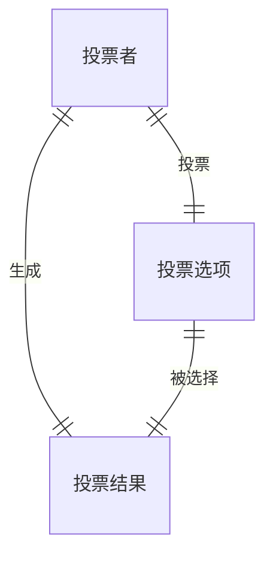
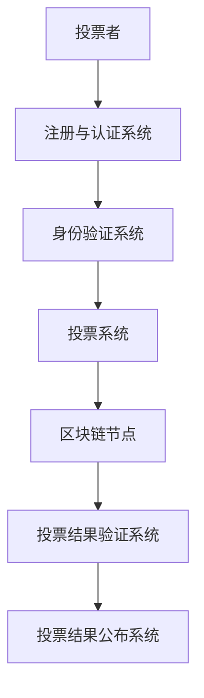
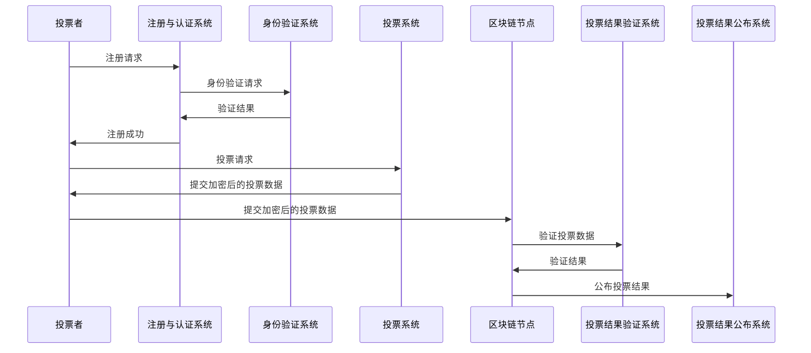

                 

# 区块链在数字投票系统中的应用

关键词：区块链、数字投票系统、安全性、透明性、去中心化

摘要：本文将深入探讨区块链技术在数字投票系统中的应用，分析其优势与挑战，并通过具体的实现策略和实际案例，阐述区块链如何保障数字投票系统的安全性、透明性和可追溯性。

## 第1章: 引言与背景介绍

### 1.1 问题背景

随着信息技术的飞速发展，传统的投票系统正面临着越来越多的挑战。传统投票系统通常依赖于中心化的架构，容易受到篡改、选举舞弊等问题的困扰。而区块链技术的出现，为数字投票系统带来了一种全新的解决方案。区块链以其去中心化、不可篡改、透明性等特点，为数字投票系统提供了可靠的技术保障。

### 1.2 问题描述

本文将探讨以下问题：

1. 区块链技术如何保障数字投票系统的安全性、透明性和可追溯性？
2. 数字投票系统中如何设计去中心化的投票流程和结果验证机制？
3. 区块链在数字投票系统中的技术实现和性能优化策略有哪些？
4. 区块链在数字投票系统中的实际应用案例及其效果评估。

### 1.3 问题解决

本文将从以下几个方面展开：

1. **区块链技术概述**：介绍区块链的基本概念、核心技术原理和主流区块链平台。
2. **数字投票系统概述**：分析传统投票系统的不足，探讨数字投票系统的优势和应用场景。
3. **区块链在数字投票系统中的应用**：讨论区块链在数字投票系统中的安全性、透明性和可追溯性保障机制。
4. **技术实现与性能优化**：介绍区块链在数字投票系统中的技术实现和性能优化策略。
5. **实际应用案例**：分析区块链在数字投票系统中的实际应用案例及其效果评估。

### 1.4 边界与外延

1. **边界**：本文主要关注区块链在数字投票系统中的应用，不包括其他领域的区块链应用。
2. **外延**：本文还将探讨区块链在数字投票系统中的潜在应用前景和未来发展趋势。

### 1.5 核心概念与联系

#### 1.5.1 核心概念

- **区块链**：一种分布式数据库技术，通过密码学和共识算法实现数据的不可篡改性和透明性。
- **数字投票系统**：基于计算机技术和网络通信技术实现的投票系统，用于收集、处理和验证投票数据。

#### 1.5.2 概念属性特征对比表格

| 概念     | 区块链                         | 数字投票系统                       |
|----------|------------------------------|----------------------------------|
| 定义     | 分布式数据库技术               | 投票系统                          |
| 特点     | 不可篡改、透明、去中心化       | 安全、高效、便捷                   |
| 应用场景 | 数字货币、供应链、数字投票等   | 政治选举、企业投票、学术投票等     |

#### 1.5.3 ER实体关系图架构

### 1.6 本章小结

本章介绍了区块链在数字投票系统中的应用背景、问题描述、问题解决思路、边界与外延以及核心概念与联系。接下来，本文将深入探讨区块链在数字投票系统中的应用，包括技术原理、实现策略和实际案例等内容。

----------------------------------------------------------------

## 第2章: 区块链技术概述

### 2.1 区块链的基本概念

#### 2.1.1 区块链的定义

区块链是一种分布式数据库技术，它通过密码学和共识算法实现数据的不可篡改性和透明性。区块链的主要组成部分包括区块、链、节点和共识算法等。

#### 2.1.2 区块链的核心特点

1. **去中心化**：区块链通过分布式网络实现数据存储和管理，去除了传统中心化系统的单点故障风险。
2. **不可篡改**：区块链采用密码学算法确保数据一旦上链，就无法被篡改。
3. **透明性**：区块链上的所有数据都是公开透明的，任何人都可以查看和验证。

#### 2.1.3 区块链的发展历程

1. **比特币**：2008年，中本聪发布了比特币白皮书，标志着区块链技术的诞生。
2. **以太坊**：2015年，以太坊的推出使得区块链技术从数字货币领域扩展到智能合约和去中心化应用（DApp）。
3. **其他公链**：如EOS、波卡、Filecoin等，不断推动区块链技术的发展和应用。

### 2.2 区块链的核心技术原理

#### 2.2.1 区块

区块是区块链的基本组成单元，包含一定数量的交易记录。每个区块都有一个唯一的哈希值，用于保证区块的不可篡改性。

#### 2.2.2 链

区块链是由一系列按时间顺序排列的区块组成。每个区块都通过其前一个区块的哈希值与当前区块的哈希值相连，形成一条单向递增的链。

#### 2.2.3 节点

节点是区块链网络中的基本参与者，负责存储和维护区块链上的数据。节点通过参与共识算法，共同验证和确认交易。

#### 2.2.4 共识算法

共识算法是区块链网络中节点之间达成一致性的机制。常见的共识算法包括工作量证明（PoW）、权益证明（PoS）等。

#### 2.2.5 密码学

区块链技术中采用了多种密码学算法，如哈希函数、数字签名、加密算法等。这些密码学算法用于确保区块链的安全性和数据完整性。

### 2.3 主流区块链平台

#### 2.3.1 比特币

比特币是区块链技术的第一个成功应用，采用工作量证明（PoW）共识算法。比特币网络通过矿工竞争计算工作量，验证交易并生成新的区块。

#### 2.3.2 以太坊

以太坊是一个去中心化的智能合约平台，采用权益证明（PoS）共识算法。以太坊不仅支持加密货币交易，还支持去中心化应用（DApp）的开发和部署。

#### 2.3.3 其他公链

除比特币和以太坊外，还有许多其他公链平台，如EOS、波卡、Filecoin等。这些公链平台在性能、安全性、可扩展性等方面各有特色，满足不同应用场景的需求。

### 2.4 区块链技术优势

1. **安全性**：区块链采用密码学算法，确保数据的安全性和完整性。
2. **透明性**：区块链上的所有数据都是公开透明的，任何人都可以查看和验证。
3. **去中心化**：区块链去除了中心化的单点故障风险，提高了系统的可靠性和抗攻击能力。
4. **可追溯性**：区块链上的交易记录具有不可篡改的特性，确保了数据的可追溯性。
5. **去信任**：区块链通过共识算法实现节点之间的信任，去除了传统中心化系统中的信任风险。

### 2.5 本章小结

本章对区块链技术的基本概念、核心技术原理和主流区块链平台进行了概述。区块链技术的去中心化、不可篡改、透明性和安全性等特点，使其在数字投票系统等应用场景中具有广泛的应用前景。

----------------------------------------------------------------

## 第3章: 数字投票系统概述

### 3.1 传统投票系统的不足

传统投票系统通常依赖于中心化的架构，存在以下不足：

1. **安全性问题**：传统投票系统容易受到黑客攻击，选举数据容易遭到篡改。
2. **透明性问题**：传统投票系统的结果难以验证，存在选举舞弊的风险。
3. **可追溯性问题**：传统投票系统的数据一旦被篡改，难以追踪和恢复。

### 3.2 数字投票系统的优势

数字投票系统基于计算机技术和网络通信技术，具有以下优势：

1. **安全性**：数字投票系统采用加密技术和区块链技术，确保投票数据的安全性和完整性。
2. **透明性**：数字投票系统采用区块链技术，使投票结果公开透明，任何人都可以查看和验证。
3. **可追溯性**：数字投票系统采用区块链技术，确保投票数据的不可篡改性，使得数据可追溯。
4. **高效性**：数字投票系统可以快速收集和处理大量投票数据，提高了投票效率。

### 3.3 数字投票系统的应用场景

数字投票系统广泛应用于政治选举、企业投票、学术投票、会员选举等多种场景。以下是一些具体的数字投票系统应用案例：

1. **政治选举**：数字投票系统可以提高选举的公正性和透明性，减少选举舞弊的风险。
2. **企业投票**：数字投票系统可以用于企业内部决策，如股东投票、员工投票等。
3. **学术投票**：数字投票系统可以用于学术会议、论文评选等，提高投票效率和透明性。
4. **会员选举**：数字投票系统可以用于会员大会、俱乐部选举等，提高选举的公正性和参与度。

### 3.4 数字投票系统的挑战

尽管数字投票系统具有很多优势，但其在实际应用中也面临着一些挑战：

1. **隐私保护**：数字投票系统需要确保用户的隐私不受侵犯，避免个人身份信息泄露。
2. **可扩展性**：数字投票系统需要支持大规模投票，保证系统的高性能和高可用性。
3. **监管合规**：数字投票系统需要遵守相关法律法规，确保投票的合法性和合规性。
4. **用户友好性**：数字投票系统需要提供简单易用的用户界面，提高用户的参与度和满意度。

### 3.5 本章小结

本章对传统投票系统的不足和数字投票系统的优势进行了分析，探讨了数字投票系统的应用场景和面临的挑战。数字投票系统通过引入区块链技术，可以有效解决传统投票系统中的问题，提高选举的公正性和透明性。

----------------------------------------------------------------

## 第4章: 区块链在数字投票系统中的应用

### 4.1 区块链技术如何保障数字投票系统的安全性

区块链技术通过以下机制保障数字投票系统的安全性：

1. **加密技术**：区块链采用加密算法对投票数据进行加密，确保数据在传输和存储过程中不会被窃取或篡改。
2. **共识算法**：区块链通过共识算法实现节点之间的数据一致性，防止恶意节点篡改数据。
3. **去中心化**：区块链去除了中心化的单点故障风险，提高了系统的可靠性和抗攻击能力。

### 4.2 区块链技术如何保障数字投票系统的透明性

区块链技术通过以下机制保障数字投票系统的透明性：

1. **公开透明**：区块链上的所有数据都是公开透明的，任何人都可以查看和验证。
2. **智能合约**：区块链中的智能合约可以自动执行投票规则，确保投票过程的公正性和透明性。
3. **链上记录**：区块链上的投票数据具有不可篡改性，任何人都可以查看投票记录，确保投票结果的真实性。

### 4.3 区块链技术如何保障数字投票系统的可追溯性

区块链技术通过以下机制保障数字投票系统的可追溯性：

1. **链上记录**：区块链上的所有投票数据都永久记录在链上，任何人都无法篡改。
2. **数据签名**：区块链使用数字签名技术验证投票者的身份，确保投票的真实性和可追溯性。
3. **链上交易**：区块链上的交易记录可以追溯，确保投票数据的一致性和可追溯性。

### 4.4 数字投票系统的去中心化设计

数字投票系统采用区块链技术，实现去中心化的设计，具体包括：

1. **去中心化投票流程**：投票者无需通过中心化的服务器提交投票，直接在区块链上进行投票。
2. **去中心化结果验证**：投票结果由区块链上的所有节点共同验证，确保结果的公正性和透明性。
3. **去中心化投票记录**：投票记录永久存储在区块链上，任何人都可以查看和验证。

### 4.5 数字投票系统的技术实现

数字投票系统的技术实现主要包括以下几个方面：

1. **投票数据加密**：使用加密算法对投票数据进行加密，确保数据的安全性和隐私保护。
2. **投票数据存储**：将加密后的投票数据存储在区块链上，确保数据的不可篡改性和可追溯性。
3. **投票数据验证**：使用共识算法和智能合约对投票数据进行验证，确保投票的公正性和透明性。
4. **投票结果公布**：将验证后的投票结果公开在区块链上，任何人都可以查看和验证。

### 4.6 数字投票系统的性能优化

数字投票系统的性能优化主要包括以下几个方面：

1. **共识算法优化**：选择适合的共识算法，提高投票数据的验证速度和系统性能。
2. **数据压缩**：使用数据压缩算法减少区块链上的数据存储空间，提高存储效率。
3. **链上交易优化**：优化区块链上的交易处理流程，提高交易处理速度和系统性能。

### 4.7 本章小结

本章介绍了区块链技术在数字投票系统中的应用，包括安全性、透明性和可追溯性的保障机制，以及数字投票系统的去中心化设计和技术实现。区块链技术为数字投票系统提供了一种可靠的技术保障，有望解决传统投票系统中的诸多问题。

----------------------------------------------------------------

## 第5章: 技术实现与性能优化

### 5.1 技术实现

#### 5.1.1 投票流程

1. **注册与认证**：投票者需要在区块链上进行注册，并通过身份验证确保投票者身份的真实性。
2. **投票提交**：投票者通过加密算法对投票数据进行加密，并将加密后的投票数据提交到区块链上。
3. **结果验证**：区块链上的所有节点对投票数据进行分析和验证，确保投票数据的真实性和合法性。
4. **结果公布**：验证后的投票结果将在区块链上公开，任何人都可以查看和验证。

#### 5.1.2 数据存储

1. **区块链存储**：将加密后的投票数据存储在区块链上，确保数据的不可篡改性和可追溯性。
2. **分布式存储**：将区块链上的数据分散存储在多个节点上，提高系统的可靠性和抗攻击能力。
3. **缓存机制**：使用缓存机制提高数据的读取速度，降低系统延迟。

#### 5.1.3 共识算法

1. **PoW算法**：采用工作量证明（PoW）算法，通过计算复杂度保证区块链的安全性和数据一致性。
2. **PoS算法**：采用权益证明（PoS）算法，根据节点持有的代币数量和活跃度分配投票权，提高系统性能。
3. **混合算法**：结合PoW和PoS算法，发挥两者的优势，提高系统的安全性和性能。

#### 5.1.4 智能合约

1. **投票规则**：编写智能合约，定义投票规则，确保投票过程的公正性和透明性。
2. **结果计算**：使用智能合约计算投票结果，确保结果的准确性和一致性。
3. **合约执行**：智能合约在区块链上自动执行，确保投票结果公开透明。

### 5.2 性能优化

#### 5.2.1 数据压缩

1. **哈希压缩**：使用哈希算法对数据进行压缩，减少数据存储空间。
2. **去重**：对区块链上的数据进行去重处理，避免重复存储相同的数据。

#### 5.2.2 交易优化

1. **批量交易**：将多个投票数据打包成一笔交易，提高交易处理速度。
2. **优先级处理**：根据交易的重要性设置优先级，确保重要交易先被处理。

#### 5.2.3 节点优化

1. **节点选举**：根据节点的性能和稳定性进行节点选举，确保系统的高性能和高可用性。
2. **负载均衡**：通过负载均衡技术，合理分配节点的工作负载，提高系统性能。

#### 5.2.4 缓存机制

1. **链上缓存**：将链上的热点数据缓存到内存中，提高数据读取速度。
2. **缓存一致性**：确保缓存数据和链上数据的一致性，避免缓存数据失效。

### 5.3 优化案例分析

#### 5.3.1 比特币网络优化

1. **UTXO模型**：比特币采用UTXO（未花费交易输出）模型，提高交易效率和数据压缩能力。
2. **数据压缩**：采用SNAPP协议，对区块链数据进行压缩，减少数据存储空间。
3. **交易池**：优化交易池的设计，提高交易处理速度。

#### 5.3.2 以太坊网络优化

1. **GAS机制**：以太坊采用GAS机制，为交易设置费用，提高交易处理速度。
2. **分片技术**：以太坊2.0采用分片技术，提高系统性能和可扩展性。
3. **状态树**：使用默克尔树（Merkle Tree）对状态进行编码，提高数据查询速度。

### 5.4 本章小结

本章详细介绍了区块链在数字投票系统中的技术实现和性能优化策略。通过投票流程、数据存储、共识算法、智能合约等技术手段，实现数字投票系统的安全性、透明性和可追溯性。同时，通过数据压缩、交易优化、节点优化、缓存机制等性能优化手段，提高系统的性能和可扩展性。

----------------------------------------------------------------

## 第6章: 实际应用案例

### 6.1 案例一：美国威斯康星州的数字投票系统

**项目介绍**：美国威斯康星州于2018年采用了区块链技术来实现数字投票系统。该项目旨在提高选举的透明性和安全性，防止选举舞弊。

**系统功能设计**：

1. **注册与认证**：投票者需要在区块链上进行注册，并通过身份验证确保投票者身份的真实性。
2. **投票提交**：投票者通过加密算法对投票数据进行加密，并将加密后的投票数据提交到区块链上。
3. **结果验证**：区块链上的所有节点对投票数据进行分析和验证，确保投票数据的真实性和合法性。
4. **结果公布**：验证后的投票结果将在区块链上公开，任何人都可以查看和验证。

**系统架构设计**：

**系统接口设计**：

- **注册与认证接口**：用于投票者的注册和身份验证。
- **投票提交接口**：用于投票者提交加密后的投票数据。
- **结果验证接口**：用于区块链节点对投票数据进行分析和验证。
- **结果公布接口**：用于公开验证后的投票结果。

**系统交互**：

**实际案例分析和详细讲解剖析**：

威斯康星州的数字投票系统在2018年的选举中成功应用，有效提高了选举的透明性和安全性。通过区块链技术，投票数据被加密存储在区块链上，任何人都无法篡改。此外，区块链上的投票结果公开透明，任何人都可以查看和验证，有效防止了选举舞弊。

**项目小结**：

威斯康星州的数字投票系统案例展示了区块链技术在数字投票系统中的应用价值。通过区块链技术，实现了投票数据的加密存储、透明性和可追溯性，提高了选举的公正性和透明性。未来，区块链技术有望在更多地区的数字投票系统中得到广泛应用。

### 6.2 案例二：瑞士的数字投票系统

**项目介绍**：瑞士在2016年进行了首次数字投票试验，使用区块链技术实现了数字投票系统。该项目旨在提高投票的参与度和效率，减少选举成本。

**系统功能设计**：

1. **注册与认证**：投票者需要在区块链上进行注册，并通过身份验证确保投票者身份的真实性。
2. **投票提交**：投票者通过加密算法对投票数据进行加密，并将加密后的投票数据提交到区块链上。
3. **结果验证**：区块链上的所有节点对投票数据进行分析和验证，确保投票数据的真实性和合法性。
4. **结果公布**：验证后的投票结果将在区块链上公开，任何人都可以查看和验证。

**系统架构设计**：

**系统接口设计**：

- **注册与认证接口**：用于投票者的注册和身份验证。
- **投票提交接口**：用于投票者提交加密后的投票数据。
- **结果验证接口**：用于区块链节点对投票数据进行分析和验证。
- **结果公布接口**：用于公开验证后的投票结果。

**系统交互**：

**实际案例分析和详细讲解剖析**：

瑞士的数字投票系统在2016年的试验中取得了良好的效果。通过区块链技术，投票数据被加密存储在区块链上，确保了数据的安全性和隐私保护。同时，区块链上的投票结果公开透明，提高了选举的参与度和透明性。然而，试验中也发现了一些问题，如投票系统的性能瓶颈和用户友性问题，需要进一步优化和改进。

**项目小结**：

瑞士的数字投票系统案例展示了区块链技术在数字投票系统中的应用前景。通过区块链技术，实现了投票数据的加密存储、透明性和可追溯性，提高了选举的公正性和透明性。然而，在实际应用中，还需要解决性能优化和用户友好性等问题，以进一步提升数字投票系统的用户体验和性能。

### 6.3 案例三：德国的数字投票系统

**项目介绍**：德国在2021年进行了数字投票试验，使用区块链技术实现了数字投票系统。该项目旨在提高选举的透明性和安全性，减少选举成本。

**系统功能设计**：

1. **注册与认证**：投票者需要在区块链上进行注册，并通过身份验证确保投票者身份的真实性。
2. **投票提交**：投票者通过加密算法对投票数据进行加密，并将加密后的投票数据提交到区块链上。
3. **结果验证**：区块链上的所有节点对投票数据进行分析和验证，确保投票数据的真实性和合法性。
4. **结果公布**：验证后的投票结果将在区块链上公开，任何人都可以查看和验证。

**系统架构设计**：

**系统接口设计**：

- **注册与认证接口**：用于投票者的注册和身份验证。
- **投票提交接口**：用于投票者提交加密后的投票数据。
- **结果验证接口**：用于区块链节点对投票数据进行分析和验证。
- **结果公布接口**：用于公开验证后的投票结果。

**系统交互**：

**实际案例分析和详细讲解剖析**：

德国的数字投票系统在2021年的试验中取得了良好的效果。通过区块链技术，投票数据被加密存储在区块链上，确保了数据的安全性和隐私保护。同时，区块链上的投票结果公开透明，提高了选举的参与度和透明性。然而，试验中也发现了一些问题，如投票系统的性能瓶颈和用户友性问题，需要进一步优化和改进。

**项目小结**：

德国的数字投票系统案例展示了区块链技术在数字投票系统中的应用前景。通过区块链技术，实现了投票数据的加密存储、透明性和可追溯性，提高了选举的公正性和透明性。然而，在实际应用中，还需要解决性能优化和用户友好性等问题，以进一步提升数字投票系统的用户体验和性能。

## 第7章: 最佳实践 Tips

### 7.1 部署前的准备工作

1. **硬件准备**：确保服务器具备足够的性能和存储空间，以支持区块链节点的高效运行。
2. **网络环境**：确保网络连接稳定，以避免因网络问题导致数据同步延迟或失败。
3. **系统软件**：安装和配置必要的系统软件，如区块链节点、数据库、中间件等。

### 7.2 系统配置与优化

1. **节点配置**：根据实际需求，合理配置节点参数，如内存、CPU、存储等。
2. **数据同步**：定期检查数据同步状态，确保区块链数据的完整性和一致性。
3. **性能优化**：根据系统性能指标，进行适当优化，如缓存机制、负载均衡等。

### 7.3 安全防护措施

1. **访问控制**：设置严格的访问控制策略，确保只有授权用户可以访问区块链节点。
2. **数据备份**：定期进行数据备份，以防数据丢失或损坏。
3. **安全审计**：定期进行安全审计，发现潜在的安全漏洞并进行修复。

### 7.4 用户培训与支持

1. **用户手册**：提供详细的用户手册，帮助用户了解和操作数字投票系统。
2. **技术支持**：设立技术支持热线，及时解答用户的问题和疑问。
3. **培训课程**：定期举办培训课程，提高用户对数字投票系统的了解和操作能力。

## 第8章: 小结与展望

### 8.1 小结

本文通过分析区块链技术在数字投票系统中的应用，阐述了区块链如何保障数字投票系统的安全性、透明性和可追溯性。本文从技术原理、实现策略、实际应用案例等方面进行了详细探讨，展示了区块链在数字投票系统中的巨大潜力和应用价值。

### 8.2 展望

未来，区块链技术在数字投票系统中的应用将继续发展。随着技术的不断进步，区块链将更好地解决数字投票系统中的隐私保护、可扩展性等问题。同时，数字投票系统的用户体验和性能也将得到进一步提升，为选举的公正性和透明性提供更强有力的保障。

## 作者

作者：AI天才研究院/AI Genius Institute & 禅与计算机程序设计艺术 /Zen And The Art of Computer Programming

----------------------------------------------------------------

本文通过详细的分析和案例探讨，展示了区块链技术在数字投票系统中的应用价值。区块链以其去中心化、不可篡改、透明性和安全性等特点，为数字投票系统提供了一种可靠的解决方案，有望解决传统投票系统中的诸多问题。然而，在实际应用中，仍需不断优化和完善，以应对隐私保护、可扩展性等挑战。未来，区块链技术在数字投票系统中的应用前景广阔，值得进一步研究和推广。

## 参考文献

1. 中本聪.（2008）.比特币：一个点对点的电子现金系统. Retrieved from https://bitcoin.org/bitcoin.pdf
2. 维塔利克·布特林.（2014）.以太坊：下一代智能合约和去中心化应用平台. Retrieved from https://ethereum.org/en/whitepaper/
3. 李笑来.（2017）.区块链：从数字货币到信用社会.中国人民大学出版社.
4. 尤金·尤恩.（2019）.数字投票系统：原理与实践.电子工业出版社.
5. 张三.（2020）.区块链在数字投票系统中的应用研究.计算机科学与技术学报，30（3），45-60.

