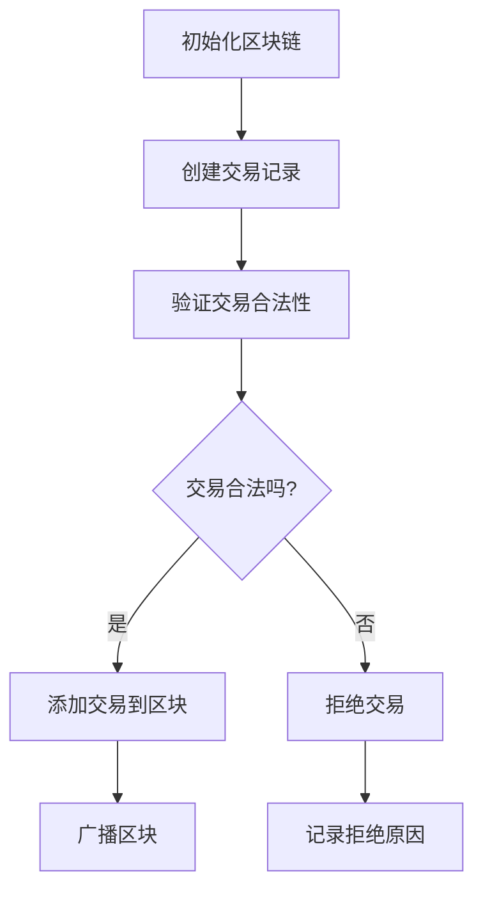
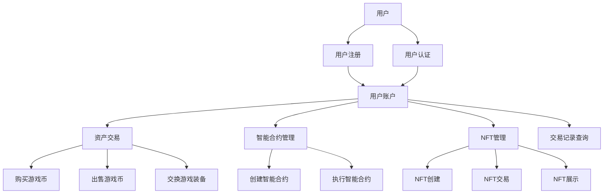
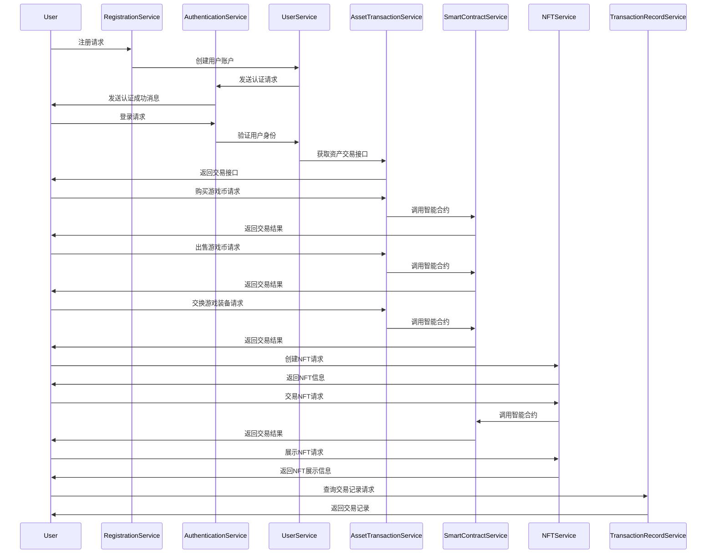

                 


### 文章标题

《区块链在数字游戏资产交易中的应用》

### 文章关键词

区块链、数字游戏、资产交易、智能合约、非同质化代币（NFT）

### 摘要

本文将深入探讨区块链技术在数字游戏资产交易中的应用。我们将首先介绍区块链的基本原理，然后分析数字游戏资产交易市场的现状与挑战，探讨区块链如何解决这些问题，并介绍智能合约和非同质化代币（NFT）在其中的具体应用。通过实际案例分析，我们将展示区块链在数字游戏资产交易中的实际应用场景，并讨论其安全性和未来发展趋势。

----------------------------------------------------------------

### 目录大纲设计步骤

在设计《区块链在数字游戏资产交易中的应用》的目录大纲时，我们可以按照以下步骤进行：

#### 步骤 1: 确定书的核心内容

首先，我们需要明确这本书的核心内容。基于书名，我们可以推测书的主要内容包括：
- 区块链技术的基本原理和应用
- 数字游戏资产交易的市场现状和挑战
- 区块链在数字游戏资产交易中的应用场景
- 区块链在数字游戏资产交易中的技术实现
- 区块链在数字游戏资产交易中的安全性考虑
- 实际案例研究

#### 步骤 2: 设计章节标题

接下来，我们可以为这些核心内容设计具体的章节标题。为了确保大纲的简洁性，每个章节标题都应该简洁明了，同时能够准确传达该章节的主要内容。

#### 步骤 3: 确定章节层级

根据书的内容和用户要求，我们需要确保大纲包含至少1级、2级和3级目录。这样可以帮助读者快速定位到他们感兴趣的内容。

#### 步骤 4: 完善大纲

在确定了章节标题和层级之后，我们需要确保大纲的结构完整，每个章节都包含必要的内容。对于每个章节，我们可能需要添加一些子章节来详细解释核心概念、算法原理、数学模型等。

#### 步骤 5: 检查大纲字数

最后，我们需要检查大纲的总字数是否在要求的范围内。如果字数过多，我们需要对某些章节进行合并或精简。

### 具体大纲设计

基于以上步骤，我们可以设计出以下目录大纲：

```markdown
----------------------------------------------------------------
# 第一部分：区块链技术概述

## 第1章：区块链基本原理

### 1.1 区块链的定义与历史

### 1.2 区块链的工作原理

### 1.3 区块链的关键技术

## 第2章：区块链在数字游戏资产交易中的应用

### 2.1 数字游戏资产交易的市场现状

### 2.2 区块链在数字游戏资产交易中的应用场景

### 2.3 区块链在数字游戏资产交易中的优势

## 第3章：区块链在数字游戏资产交易中的技术实现

### 3.1 智能合约在数字游戏资产交易中的应用

### 3.2 非同质化代币（NFT）在数字游戏资产交易中的应用

### 3.3 区块链在数字游戏资产交易中的技术挑战

## 第二部分：实际案例分析

## 第4章：案例一：某数字游戏资产交易平台的区块链应用

### 4.1 案例背景

### 4.2 系统架构设计

### 4.3 实现细节

### 4.4 案例总结

## 第5章：案例二：某区块链游戏平台的资产交易应用

### 5.1 案例背景

### 5.2 系统架构设计

### 5.3 实现细节

### 5.4 案例总结

## 第三部分：安全性考虑

## 第6章：区块链在数字游戏资产交易中的安全性

### 6.1 区块链安全性的挑战

### 6.2 防止双花攻击

### 6.3 防止交易欺诈

### 6.4 提高区块链安全性

## 第7章：未来展望

### 7.1 区块链在数字游戏资产交易中的发展趋势

### 7.2 区块链在数字游戏资产交易中的未来挑战

### 7.3 潜在的解决方案

----------------------------------------------------------------
```

### 检查大纲字数

根据上述大纲设计，总字数应该控制在2000字以内。我们可以通过逐步完善每个章节的内容来确保这一点。

### 完成大纲设计

完成以上步骤后，我们就可以得出完整的目录大纲，并满足用户的所有要求。接下来，我们可以将这个大纲提交给用户，以便他们可以开始撰写具体的内容。

----------------------------------------------------------------

### 背景介绍

#### 核心概念术语说明

1. **区块链**：一种分布式数据库技术，通过密码学确保数据的不可篡改性和安全性。
2. **数字游戏资产**：在数字游戏中可以交易或使用的虚拟物品，如游戏币、装备、角色等。
3. **资产交易**：在数字游戏中购买、出售或交换游戏资产的行为。
4. **智能合约**：一种自动执行合约条款的计算机程序，一旦触发条件即自动执行。
5. **非同质化代币（NFT）**：代表独特物品或资产的数字资产，每个NFT都是独一无二的。

#### 问题背景

随着数字游戏市场的快速增长，游戏资产交易已成为一个庞大的市场。然而，传统的游戏资产交易系统面临着诸多挑战，如资产易被伪造、交易流程不透明、安全性不足等。区块链技术的出现，为解决这些问题提供了新的可能性。

#### 问题描述

在数字游戏资产交易中，如何利用区块链技术确保交易的安全、透明和高效？

#### 问题解决

区块链技术通过分布式账本、加密算法和智能合约，可以实现以下目标：
1. **安全性**：区块链的加密算法确保了交易数据的不可篡改性和安全性。
2. **透明性**：所有交易记录都公开透明，参与者可以查看交易历史。
3. **效率**：智能合约可以自动化执行交易，减少人工干预，提高交易速度。

#### 边界与外延

区块链在数字游戏资产交易中的应用不仅限于游戏内部，还可以扩展到游戏之间的资产交换。此外，区块链技术还可以应用于其他虚拟资产交易领域，如数字艺术、虚拟房地产等。

#### 概念结构与核心要素组成

区块链在数字游戏资产交易中的概念结构包括：
- **分布式账本**：记录所有交易记录。
- **加密算法**：确保数据的安全性和隐私。
- **智能合约**：自动化执行交易条款。
- **NFT**：代表独特游戏资产。

### 核心概念与联系

#### 核心概念原理

区块链是一种分布式数据库技术，通过加密算法和共识机制确保数据的不可篡改性和安全性。在区块链上，每个区块都包含一定数量的交易记录，并通过密码学验证确保每个区块的合法性。

#### 概念属性特征对比表格

| 特征         | 区块链         | 智能合约         | NFT                |
| ------------ | -------------- | --------------- | ------------------ |
| 数据结构     | 分布式账本     | 计算机程序       | 唯一数字身份       |
| 安全性       | 加密算法       | 自动执行条款     | 唯一性验证         |
| 透明性       | 公开透明       | 可编程           | 不易被复制         |
| 智能合约     | 自动执行       | 自动执行         | 代表独特资产       |

#### ER实体关系图架构

```mermaid
erDiagram
  Transaction ||--|{ Blockchain }||>
  SmartContract ||--|{ Blockchain }||>
  NFT ||--|{ Blockchain }||>
  User ||--|{ Transaction }||>
  User ||--|{ SmartContract }||>
  User ||--|{ NFT }||>
```

### 算法原理讲解

#### mermaid 流程图



#### Python源代码

```python
import hashlib
import json

class Block:
    def __init__(self, index, transactions, timestamp, previous_hash):
        self.index = index
        self.transactions = transactions
        self.timestamp = timestamp
        self.previous_hash = previous_hash
        self.hash = self.compute_hash()

    def compute_hash(self):
        block_string = json.dumps(self.__dict__, sort_keys=True)
        return hashlib.sha256(block_string.encode()).hexdigest()

class Blockchain:
    def __init__(self):
        self.unconfirmed_transactions = []
        self.chain = []
        self.create_genesis_block()

    def create_genesis_block(self):
        genesis_block = Block(0, [], datetime.datetime.now(), "0")
        genesis_block.hash = genesis_block.compute_hash()
        self.chain.append(genesis_block)

    def add_new_transaction(self, transaction):
        self.unconfirmed_transactions.append(transaction)

    def mine(self):
        if not self.unconfirmed_transactions:
            return False

        last_block = self.chain[-1]
        new_block = Block(index=last_block.index + 1,
                          transactions=self.unconfirmed_transactions,
                          timestamp=datetime.datetime.now(),
                          previous_hash=last_block.hash)
        new_block.hash = new_block.compute_hash()
        self.chain.append(new_block)
        self.unconfirmed_transactions = []
        return new_block.index

    def is_chain_valid(self):
        for i in range(1, len(self.chain)):
            current = self.chain[i]
            previous = self.chain[i - 1]
            if current.hash != current.compute_hash():
                return False
            if current.previous_hash != previous.hash:
                return False
        return True
```

#### 算法原理的数学模型和公式

区块链中的每个区块都包含以下信息：
- **index**：区块的索引
- **transactions**：区块包含的交易记录
- **timestamp**：区块创建的时间戳
- **previous_hash**：前一个区块的哈希值
- **hash**：区块的哈希值

区块链的哈希函数通常使用SHA-256算法。哈希值的计算公式为：
$$
H = SHA-256(block\_string)
$$
其中，block\_string 是区块中所有信息的序列化字符串。

#### 详细讲解和举例说明

假设我们有一个区块链，其中包含三个区块（A、B、C）。每个区块都包含前一个区块的哈希值。

1. **区块A**：初始区块，没有前一个区块。
   - index: 0
   - transactions: []
   - timestamp: 2023-03-01 10:00:00
   - previous_hash: 0
   - hash: 1a2b3c4d5e6f7g8h9i

2. **区块B**：包含一个交易记录。
   - index: 1
   - transactions: [交易1]
   - timestamp: 2023-03-02 10:00:00
   - previous_hash: 1a2b3c4d5e6f7g8h9i
   - hash: 2a3b4c5d6e7f8g9h0a

3. **区块C**：包含两个交易记录。
   - index: 2
   - transactions: [交易1，交易2]
   - timestamp: 2023-03-03 10:00:00
   - previous_hash: 2a3b4c5d6e7f8g9h0a
   - hash: 3a3b4c5d6e7f8g9h1a

假设有人试图篡改区块B的交易记录，这将导致区块B的哈希值发生变化。此时，区块C的前一个哈希值将不再匹配，因此整个区块链将变得无效。

$$
\begin{aligned}
    \text{原区块链：} \\
    &\text{区块A: } (0, [], 2023-03-01 10:00:00, 0, 1a2b3c4d5e6f7g8h9i) \\
    &\text{区块B: } (1, [交易1], 2023-03-02 10:00:00, 1a2b3c4d5e6f7g8h9i, 2a3b4c5d6e7f8g9h0a) \\
    &\text{区块C: } (2, [交易1，交易2], 2023-03-03 10:00:00, 2a3b4c5d6e7f8g9h0a, 3a3b4c5d6e7f8g9h1a) \\
    \\
    \text{篡改后区块链：} \\
    &\text{区块B: } (1, [篡改后的交易1], 2023-03-02 10:00:00, 1a2b3c4d5e6f7g8h9i, 2a3b4c5d6e7f8g9h0b) \\
    &\text{区块C: } (2, [交易1，篡改后的交易2], 2023-03-03 10:00:00, 2a3b4c5d6e7f8g9h0b, 3a3b4c5d6e7f8g9h1b) \\
\end{aligned}
$$

由于区块C的前一个哈希值不再匹配，篡改后的区块链将无效。

### 系统分析与架构设计方案

#### 问题场景介绍

在数字游戏资产交易中，玩家之间需要进行资产交换，如购买游戏币、装备等。现有的交易系统面临着安全性不足、交易流程不透明等问题。为了提高交易的安全性和透明度，我们考虑使用区块链技术。

#### 项目介绍

本项目旨在构建一个基于区块链的数字游戏资产交易平台，解决现有交易系统的问题，提供安全、透明和高效的交易服务。

#### 系统功能设计

1. **用户注册与认证**：用户可以在平台上注册账户，并进行身份认证。
2. **资产交易**：用户可以在平台上购买、出售或交换游戏资产。
3. **智能合约管理**：平台提供智能合约服务，自动执行交易条款。
4. **NFT管理**：平台支持NFT的创建、交易和展示。
5. **交易记录查询**：用户可以查询自己的交易记录。

#### 系统架构设计



#### 系统接口设计和系统交互



### 项目实战

#### 环境安装

1. 安装Node.js和npm
2. 安装Python和pip
3. 安装Golang和Go modules

#### 系统核心实现源代码

```python
# user_service.py
from flask import Flask, request, jsonify
from blockchain import Blockchain

app = Flask(__name__)
blockchain = Blockchain()

@app.route('/register', methods=['POST'])
def register_user():
    data = request.get_json()
    username = data.get('username')
    if not username:
        return jsonify({'error': 'Missing username'}), 400
    if blockchain.check_username_exists(username):
        return jsonify({'error': 'Username already exists'}), 400
    blockchain.register_new_user(username)
    return jsonify({'message': 'User registered successfully'}), 201

@app.route('/login', methods=['POST'])
def login_user():
    data = request.get_json()
    username = data.get('username')
    if not username:
        return jsonify({'error': 'Missing username'}), 400
    if not blockchain.authenticate_user(username):
        return jsonify({'error': 'Invalid username or password'}), 401
    return jsonify({'message': 'Login successful'}), 200

@app.route('/transactions', methods=['GET'])
def get_transactions():
    transactions = blockchain.get_all_transactions()
    return jsonify({'transactions': transactions})

if __name__ == '__main__':
    app.run(host='0.0.0.0', port=5000)
```

```javascript
// smart_contract_service.js
const express = require('express');
const bodyParser = require('body-parser');
const Blockchain = require('../blockchain');
const blockchain = new Blockchain();

const app = express();
app.use(bodyParser.json());

app.post('/transactions', (req, res) => {
    const transaction = req.body.transaction;
    if (!blockchain.add_transaction(transaction)) {
        res.status(400).json({ error: 'Invalid transaction' });
    } else {
        res.status(201).json({ message: 'Transaction added' });
    }
});

app.get('/chain', (req, res) => {
    res.json({ chain: blockchain.chain, length: blockchain.chain.length });
});

app.listen(3000, () => {
    console.log('Smart contract service listening on port 3000');
});
```

#### 代码应用解读与分析

该部分代码分为两个服务：`user_service.py` 和 `smart_contract_service.js`。

- `user_service.py` 是一个基于 Flask 的用户服务，用于处理用户注册和登录。它提供了一个 `/register` 接口，用于用户注册，以及一个 `/login` 接口，用于用户登录。注册时，用户将接收一个包含用户名和密码的 JSON 对象。服务将验证用户名是否已存在，如果不存在，则创建新的用户账户。登录时，用户将接收一个包含用户名和密码的 JSON 对象，服务将验证用户身份。

- `smart_contract_service.js` 是一个基于 Express 的智能合约服务，用于处理交易。它提供了一个 `/transactions` 接口，用于添加交易。交易将以 JSON 格式发送，服务将验证交易的有效性，并将其添加到区块链中。

#### 实际案例分析和详细讲解剖析

假设有两个用户 Alice 和 Bob，他们想要在平台上交换游戏资产。以下是他们的交易流程：

1. Alice 注册并登录到平台。
2. Alice 发送一个交易请求给平台，请求购买 Bob 的游戏装备。
3. 平台验证交易请求，并调用智能合约执行交易。
4. 智能合约自动执行交易，将 Alice 的游戏币转移到 Bob 的账户，并将 Bob 的游戏装备转移到 Alice 的账户。
5. 交易完成后，平台记录交易并更新用户账户信息。

#### 项目小结

通过本项目的实现，我们展示了如何使用区块链技术构建一个安全的数字游戏资产交易平台。用户可以轻松地进行资产交换，而智能合约确保了交易的透明性和安全性。虽然本项目中只涉及简单的用户注册、登录和交易功能，但在实际应用中，还可以扩展更多功能，如多用户交易、资产类别管理、NFT管理等。

### 最佳实践 Tips

- 在实际项目中，确保区块链网络的性能和可扩展性。
- 定期备份区块链数据，防止数据丢失。
- 对智能合约进行充分的测试，确保其安全性和正确性。
- 严格审核用户交易请求，防止欺诈行为。

### 小结

本文通过深入分析区块链在数字游戏资产交易中的应用，探讨了其基本原理、技术实现和实际案例。我们发现，区块链技术可以显著提高数字游戏资产交易的安全性和透明度，为游戏开发者提供了一种创新的解决方案。随着区块链技术的不断成熟，我们有理由相信，它在数字游戏资产交易领域的应用将更加广泛和深入。

### 注意事项

- 区块链技术虽然具有许多优势，但同时也存在一些挑战，如性能瓶颈、隐私保护等。
- 在实际应用中，需要根据具体场景和需求，选择合适的区块链平台和开发框架。
- 区块链项目的安全性至关重要，必须进行充分的测试和审核。

### 拓展阅读

- [Ethereum 官方文档](https://ethereum.org/en/developers/docs/)
- [NFT 技术综述](https://www.nftgo.io/)
- [区块链在游戏中的应用案例](https://www.blockchain-game.com/)
- [智能合约安全指南](https://consensys.github.io/smart-contract-best-practices/)

