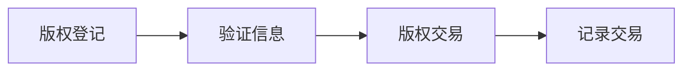
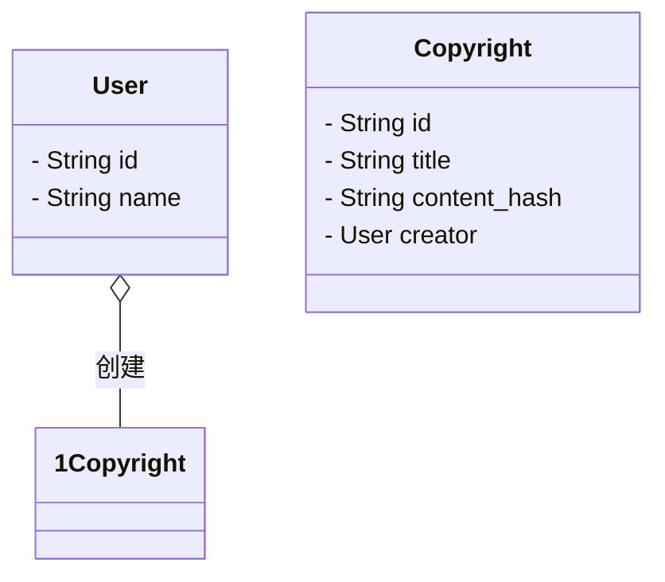
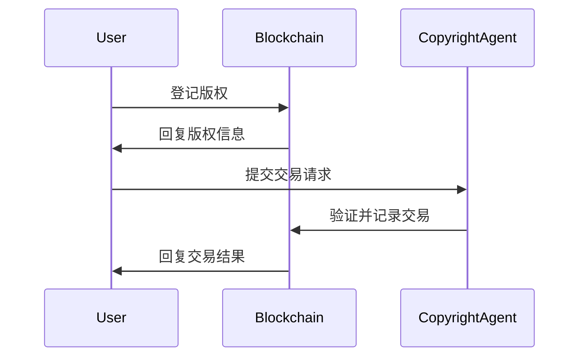
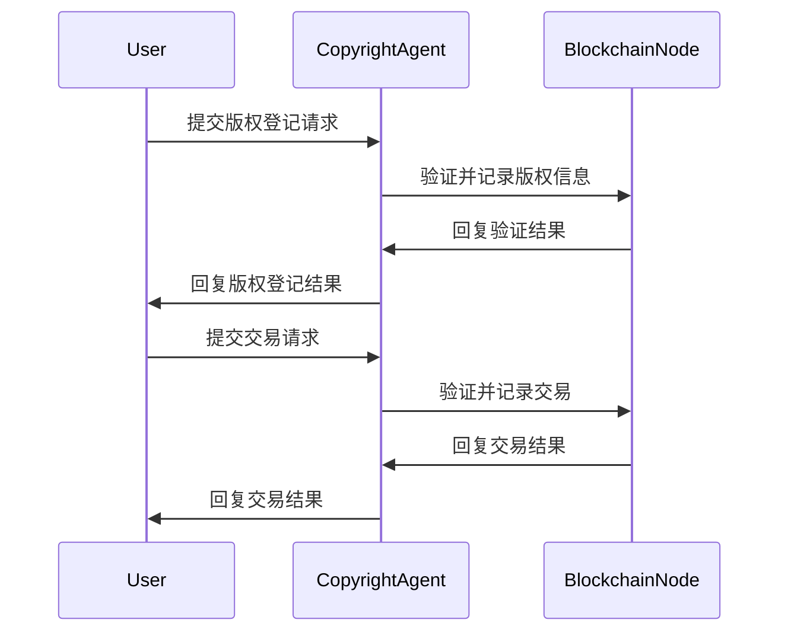

                 

### 文章标题：区块链在数字版权保护中的新模式

关键词：区块链、数字版权保护、智能合约、加密技术、透明性、不可篡改性

摘要：随着数字内容的迅速增长，数字版权保护的需求变得愈发迫切。区块链技术以其独特的特性为数字版权保护提供了新的解决方案。本文将深入探讨区块链在数字版权保护中的应用，从背景介绍、核心概念、算法原理到系统设计与实际应用，全面解析这一新兴模式。

### 第一部分：背景介绍

#### 第1章 问题背景

**1.1 数字版权保护的现状**

数字版权是指数字内容的创作者对其创作内容的法律权利。然而，在数字时代，数字版权面临诸多挑战。传统的数字版权保护方法如数字版权管理（DRM）技术虽然在一定程度上能够限制内容的复制和分发，但它们也存在一些缺陷，例如用户体验差、难以跨平台应用等。

**1.2 数字版权保护的需求**

随着互联网和移动设备的普及，数字内容创作和消费的门槛越来越低。这不仅促进了数字内容产业的繁荣，也带来了数字版权保护的新需求。创作者需要确保其作品的原创性和合法权益，用户则需要方便、合法地获取和分享数字内容。

**1.3 区块链技术概述**

区块链是一种分布式账本技术，具有去中心化、不可篡改、透明性等特性。区块链通过加密算法确保数据的安全性和完整性，使其在数字版权保护中具有巨大的应用潜力。

**1.4 区块链在数字版权保护中的应用潜力**

区块链技术能够为数字版权保护提供以下优势：
- **透明性**：区块链上的所有交易都是透明的，创作者和用户可以清晰地看到作品的版权信息。
- **不可篡改性**：一旦数据被记录在区块链上，就无法被篡改，这为数字版权的保护提供了强有力的保障。
- **去中心化**：去中心化的特性使得版权的登记和交易不再依赖于中心化的机构，降低了成本。

#### 第2章 核心概念

**2.1 数字版权与区块链的关系**

区块链技术通过以下方式解决数字版权问题：
- **版权登记**：创作者可以将版权信息登记在区块链上，确保其原创性和合法性。
- **版权交易**：区块链上的智能合约可以实现版权的自动化交易，提高交易的效率。

**2.2 概念属性特征对比表格**

| 特征         | 传统数字版权保护 | 区块链数字版权保护 |
| ------------ | ----------------- | ----------------- |
| 透明性       | 低               | 高                |
| 不可篡改性   | 低               | 高                |
| 去中心化     | 是               | 否                |
| 成本         | 高               | 低                |
| 用户体验     | 差               | 好                |

#### 第3章 ER实体关系图

**3.1 数字版权保护中的实体与关系**

在数字版权保护中，主要涉及以下实体：
- **著作权人**：拥有数字内容版权的个人或组织。
- **版权代理人**：代表著作权人进行版权交易的个体或机构。
- **用户**：获取和消费数字内容的个人或组织。

实体之间的关系包括：
- **著作权人与版权代理人**：代理关系。
- **版权代理人与用户**：交易关系。
- **著作权人与用户**：授权关系。

下面是数字版权保护中的ER实体关系图：

```mermaid
erDiagram
    著作权人 ||--|{ 版权代理人 }|
    版权代理人 ||--|{ 用户 }|
    著作权人 ||--|{ 用户 }||授权|
```

### 第二部分：核心概念与联系

#### 第4章 区块链在数字版权保护中的算法原理

**4.1 算法mermaid流程图**

区块链数字版权保护的流程包括：
1. 著作权人登记版权信息。
2. 版权代理人对版权信息进行验证。
3. 版权代理人与用户进行交易。
4. 交易记录被记录在区块链上。

下面是算法的mermaid流程图：



**4.2 Python源代码阐述**

下面是一个简单的Python代码示例，用于实现版权登记功能：

```python
import json
from blockchain import Blockchain

# 创建区块链实例
blockchain = Blockchain()

# 注册版权
def register	Copyrights(creator, title, content_hash):
    transaction = {
        "type": "register",
        "creator": creator,
        "title": title,
        "content_hash": content_hash
    }
    blockchain.add_transaction(transaction)

# 测试
register	Copyrights("Alice", "Book Title", "content_hash_value")
blockchain.printchain()
```

**4.3 数学模型和公式**

区块链数字版权保护中的关键数学模型包括：

- **数字签名**：用于确保数据的完整性和身份验证。
  - 公式：`signature = SIG(消息, 私钥)`
- **加密解密**：用于保护数据的隐私。
  - 公式：`加密文本 = ENC(明文, 密钥)`
  - 公式：`明文 = DEC(加密文本, 密钥)`

### 第三部分：系统分析与架构设计方案

#### 第5章 系统功能设计

**5.1 领域模型mermaid类图**

下面是数字版权保护系统的领域模型类图：



#### 第6章 系统架构设计

**6.1 mermaid架构图**

下面是数字版权保护系统的mermaid架构图：



#### 第7章 系统接口设计

系统接口设计包括：

- **版权登记接口**：用于著作权人登记版权信息。
- **版权交易接口**：用于版权代理人和用户进行版权交易。
- **版权查询接口**：用于用户查询版权信息。

#### 第8章 系统交互mermaid序列图

**8.1 系统交互序列图**

下面是用户、版权方、区块链节点之间的交互流程：



### 第四部分：项目实战

#### 第9章 环境安装与配置

**9.1 环境搭建**

在搭建区块链数字版权保护系统之前，需要安装以下软件和工具：

- **Go语言环境**：用于编写区块链节点代码。
- **Hyperledger Fabric**：用于实现区块链网络。
- **Docker**：用于容器化部署。

安装步骤如下：

1. 安装Go语言环境。
2. 安装Hyperledger Fabric。
3. 安装Docker。

#### 第10章 系统核心实现

**10.1 源代码分析**

下面是一个简单的版权登记功能的源代码示例：

```go
package main

import (
    "fmt"
    "github.com/hyperledger/fabric-sdk-go/pkg/client/resmgmt"
    "github.com/hyperledger/fabric-sdk-go/third_party/github.com/hyperledger/fabric/common/util"
)

func registerCopyright(creator, title, contentHash string) error {
    // 创建资源管理客户端
    client, err := resmgmt.New(c.Ctx(), c.Client(), c.User())
    if err != nil {
        return err
    }

    // 创建交易提案
    txProposal, err := client.ProposeSubmitTransaction(
        c.ChannelID(),
        util.QueryByChaincodeParameters{
            ChaincodeID: c.ChaincodeID(),
            Fnc:         "registerCopyright",
            Args:        [][]byte{[]byte(creator), []byte(title), []byte(contentHash)},
        },
    )
    if err != nil {
        return err
    }

    // 执行交易提案
    response, err := client.SubmitTransaction(txProposal)
    if err != nil {
        return err
    }

    fmt.Println("Register Copyright Response:", string(response))
    return nil
}
```

**10.2 应用解读与分析**

版权登记功能的实现主要分为以下步骤：

1. 创建资源管理客户端。
2. 创建交易提案。
3. 执行交易提案。

版权登记功能的实际应用分析如下：

- **优势**：通过区块链技术，版权登记信息具有高度的安全性和不可篡改性，保障了创作者的合法权益。
- **挑战**：需要确保区块链网络的稳定性和性能，以满足大规模版权交易的需求。

#### 第11章 实际案例

**11.1 案例介绍**

一个数字版权保护的实际案例是音乐版权的管理。在区块链技术的支持下，音乐创作者可以方便地登记其音乐作品的版权信息，并通过智能合约实现版权的自动交易。

**11.2 案例分析**

在音乐版权管理的案例中，区块链技术解决了以下问题：

- **版权登记**：创作者可以将音乐作品的版权信息登记在区块链上，确保其原创性和合法性。
- **版权交易**：通过智能合约，版权的交易过程可以自动化进行，提高了交易的效率。

### 第五部分：最佳实践与拓展

#### 第12章 最佳实践

**12.1 实践技巧**

在实施数字版权保护时，以下实践技巧值得注意：

- **版权登记**：确保创作者在登记版权信息时提供完整的作品信息，包括作品名称、作者、创作时间等。
- **智能合约设计**：设计智能合约时，要充分考虑版权交易的各个方面，确保合约的公平性和安全性。
- **节点部署**：部署区块链节点时，要确保节点的稳定性和性能，以满足大规模版权交易的需求。

**12.2 注意事项**

在实施数字版权保护时，需要注意以下事项：

- **数据隐私**：在区块链上登记版权信息时，要确保数据的隐私性，防止敏感信息泄露。
- **合规性**：遵循当地法律法规，确保数字版权保护系统符合相关法律法规的要求。

#### 第13章 小结与拓展阅读

**13.1 小结**

本文介绍了区块链在数字版权保护中的应用，包括背景介绍、核心概念、算法原理、系统设计、项目实战和最佳实践。通过本文的讲解，读者可以全面了解区块链数字版权保护的新模式。

**13.2 拓展阅读**

- **区块链技术基础**：了解区块链的基本原理和核心概念。
- **智能合约开发**：学习如何设计和实现智能合约。
- **数字版权保护法规**：了解数字版权保护相关的法律法规。

### 总结

区块链技术为数字版权保护提供了新的解决方案，通过其不可篡改性、透明性和去中心化特性，能够有效解决传统数字版权保护方法中的诸多问题。本文通过详细的讲解和分析，帮助读者理解区块链在数字版权保护中的应用及其新模式。

### 作者信息

作者：AI天才研究院/AI Genius Institute & 禅与计算机程序设计艺术 /Zen And The Art of Computer Programming

