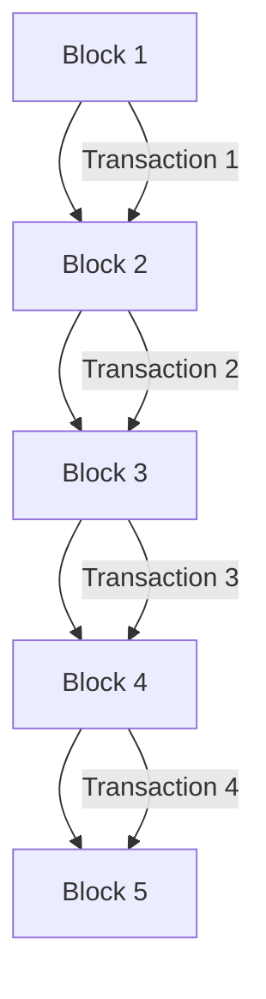

                 

**1. Introduction to Blockchain Technology**

Blockchain technology is a decentralized and distributed ledger system that enables secure, transparent, and immutable transactions. At its core, blockchain is a chain of blocks, where each block contains a list of transactions. These blocks are linked together using cryptographic hashes, creating a tamper-proof and chronological record of transactions.

### Core Concepts and Terminology

- **Block:** A block is a container that stores a list of transactions. Each block has a unique identifier called a hash.
- **Blockchain:** A blockchain is a chain of blocks, with each block linked to the previous one using a hash. This creates an immutable and chronological record of transactions.
- **Transaction:** A transaction is an exchange of value, such as digital currency, between two parties.
- **Hash:** A hash is a unique identifier generated by a cryptographic function that is used to ensure the integrity and security of the blockchain.

### Problem Background and Descriptions

**Problem Background:**

The traditional centralized systems used for financial transactions and record-keeping have been prone to fraud, censorship, and data manipulation. These systems rely on a central authority, such as a bank or government, to maintain the integrity of the transactions and records.

**Problem Descriptions:**

- **Fraud:** Centralized systems can be susceptible to fraudulent activities, as the central authority has complete control over the data and can manipulate it to their advantage.
- **Censorship:** Centralized systems can be used to censor transactions or information, as the central authority can block or remove certain transactions or records.
- **Data Manipulation:** Centralized systems can be vulnerable to data manipulation, as the central authority has the power to alter or delete data without detection.

### Solution and Discussion

**Solution:**

Blockchain technology addresses these problems by creating a decentralized and distributed ledger system that is immune to censorship and fraud. By distributing the transaction data across a network of computers, blockchain ensures that no single entity has control over the data, making it tamper-proof and transparent.

**Discussion:**

Blockchain's decentralization ensures that there is no central point of failure, making it highly resilient to attacks. Its distributed nature allows for transparent and verifiable transactions, as all participants in the network can view and verify the transactions. Additionally, blockchain's cryptographic security features ensure that transactions are secure and tamper-proof.

**Boundary and Extension:**

While blockchain technology has significant potential in various industries, it is important to note its limitations. Blockchain is not a silver bullet and may not be suitable for all use cases. However, its principles of decentralization, transparency, and security make it a powerful tool for solving problems in areas such as finance, supply chain management, and digital art.

---

**Summary:**

In summary, blockchain technology is a decentralized and distributed ledger system that provides secure, transparent, and immutable transactions. It addresses the problems of fraud, censorship, and data manipulation in centralized systems by creating a tamper-proof and transparent record of transactions. By understanding the core concepts and terminology of blockchain technology, we can better appreciate its potential and explore its applications in various industries, including digital art.

---

**Note:**

For a more detailed understanding of blockchain technology, readers are encouraged to explore the following resources:

- **Book:** "Blockchain Revolution" by Don and Alex Tapscott
- **Article:** "How Blockchain Works" by Investopedia
- **Website:** [Ethereum.org](https://ethereum.org/en/developers/docs/intro-to-ethereum/)

### Mermaid Flowchart of Blockchain Structure and Transactions

This Mermaid flowchart provides a visual representation of a simple blockchain structure, showing how blocks are linked together using cryptographic hashes and containing transactions. Each block contains a list of transactions, and each block references the hash of the previous block, creating a chain of blocks that is both secure and transparent.

