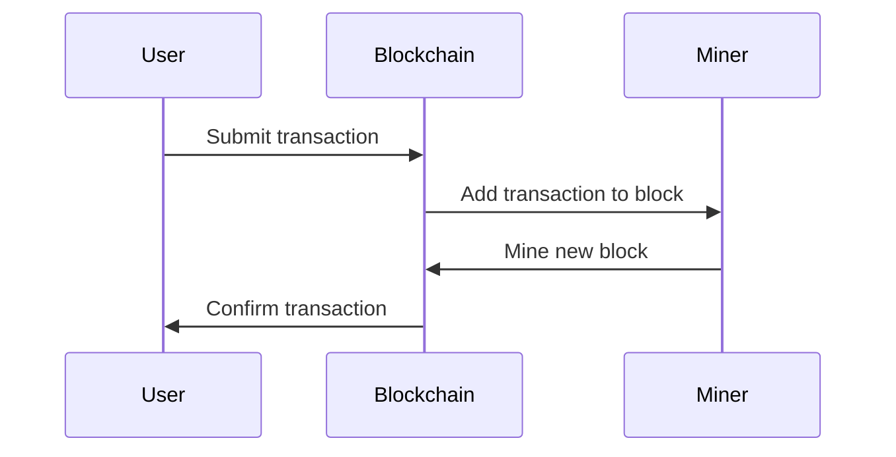
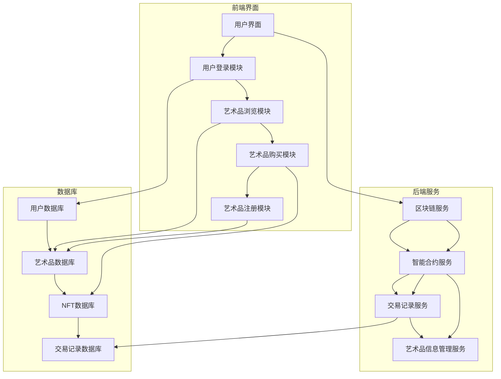
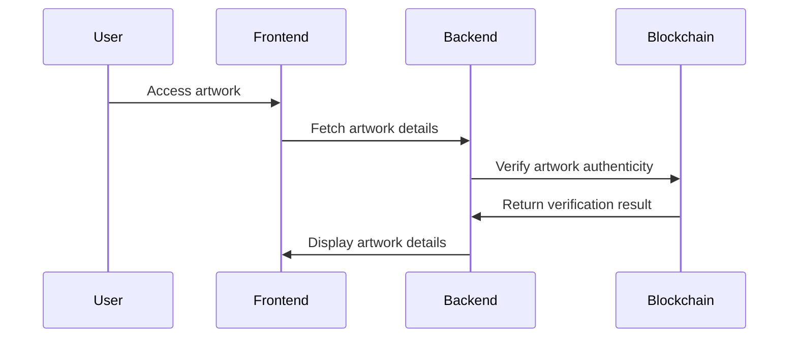

                 

### 关键词

- 区块链
- 数字艺术品
- 防伪
- NFTs（非同质化代币）
- 数字艺术交易
- 去中心化
- 透明性
- 不可篡改性

### 摘要

区块链技术在数字艺术品交易中的应用，正逐步成为防伪的重要手段。本文将深入探讨区块链在数字艺术品交易中的防伪应用，首先介绍区块链技术的基本概念和特点，接着分析数字艺术品面临的防伪挑战，然后详细解析如何利用区块链技术解决这些问题。本文还将通过实际案例，展示区块链在数字艺术品防伪中的应用成效，并探讨其未来发展方向。通过阅读本文，读者将了解区块链在数字艺术防伪中的重要性，掌握其应用原理和实践技巧。

### 引言

#### 区块链技术简介

区块链技术起源于2008年，由一位匿名作者（或一组作者）以中文名“中本聪”的名义提出，并作为比特币（Bitcoin）的底层技术而广为人知。区块链是一种分布式数据库技术，其核心特点是去中心化、不可篡改和透明性。区块链的基本原理是通过加密算法，将交易信息记录在多个区块中，这些区块按照时间顺序链接在一起，形成一条不断延伸的链。

区块链具有以下主要特点：

1. **去中心化**：区块链网络中的所有节点都具有同等地位，无需中心化机构进行协调，从而提高了系统的容错性和抗攻击能力。
2. **不可篡改**：区块链上的数据一旦被记录，就难以被篡改或删除，保证了数据的安全性。
3. **透明性**：区块链上的所有交易记录都是公开透明的，任何节点都可以验证这些信息的真实性。

#### 数字艺术品的发展与挑战

数字艺术品，作为一种新兴的艺术形式，近年来受到了广泛关注。它借助数字技术创作，具有独特性和原创性，同时也更加易于复制和传播。然而，随着数字艺术品的兴起，其面临的防伪挑战也越来越严峻。

数字艺术品防伪挑战主要包括以下几点：

1. **复制与伪造**：由于数字艺术品可以轻松复制，不法分子可以利用这一点进行非法复制和伪造，从而损害艺术家的权益。
2. **版权纠纷**：在数字艺术领域，确定原创作品的所有权和版权归属变得复杂，常常引发法律纠纷。
3. **溯源困难**：数字艺术品的交易和传播路径复杂，难以追溯其来源和传播过程，增加了防伪的难度。

面对这些挑战，传统的防伪技术手段，如水印、证书、签名等，已难以满足数字艺术品防伪的需求。区块链技术的出现，为解决这些问题提供了新的思路。

#### 区块链在数字艺术品防伪中的应用

区块链技术在数字艺术品防伪中的应用主要体现在以下几个方面：

1. **防篡改**：区块链的不可篡改性确保了数字艺术品信息的真实性和完整性，任何篡改行为都会被记录在链上，便于追踪和防范。
2. **溯源**：区块链的透明性和去中心化特性，使得数字艺术品的交易和传播路径可以被清晰记录和追溯，有助于确认作品的真实来源和传播历史。
3. **版权保护**：通过区块链技术，艺术家可以将作品的信息和版权声明记录在链上，确保其版权得到有效保护。

#### 本文结构

本文将分为以下几个部分：

1. **区块链技术的基本原理和特点**
2. **数字艺术品的防伪挑战**
3. **区块链在数字艺术品防伪中的应用**
4. **NFTs在数字艺术品交易中的防伪作用**
5. **实际案例与成功故事**
6. **区块链在数字艺术品交易中的实施与挑战**
7. **未来发展趋势与总结**

通过以上结构，本文旨在全面解析区块链在数字艺术品交易中的防伪应用，帮助读者深入理解这一技术的优势和应用场景。

### 区块链技术的基本原理和特点

区块链技术作为数字艺术品防伪的关键工具，其基本原理和特点对理解其在防伪中的应用至关重要。以下是区块链技术的详细介绍。

#### 区块链的基本原理

区块链是一种分布式账本技术，由一系列按时间顺序排列的“区块”组成。每个区块包含一定数量的交易记录，并通过加密算法与前一个区块链接，形成一条连续的区块链。区块链的运作机制如下：

1. **交易记录**：用户在区块链网络中进行交易时，交易信息会被广播到所有节点。
2. **共识算法**：区块链网络中的节点通过共识算法（如工作量证明Proof of Work, PoW）或权益证明Proof of Stake, PoS）等机制，对交易记录进行验证和确认。
3. **区块生成**：当共识算法达成一致后，新的区块会被生成，并将其附加到区块链的末端。
4. **区块链扩展**：随着不断有新区块的生成，区块链不断延长，形成一条持续扩展的链。

#### 区块链的特点

区块链技术具有以下几个显著特点，这些特点使其成为数字艺术品防伪的理想工具：

1. **去中心化**：区块链网络中的所有节点都具有同等地位，无需依赖中心化机构进行协调和管理，从而提高了系统的容错性和抗攻击能力。在数字艺术品防伪中，去中心化的特性确保了防伪信息的透明和公正，防止单一中心点的被攻击或篡改。

2. **不可篡改性**：区块链上的数据一旦被记录，就难以被篡改或删除。每个区块都通过加密算法与前一个区块链接，形成一个连续且不可篡改的日志。这种特性确保了数字艺术品信息的真实性和完整性，任何篡改行为都会被记录在链上，便于追踪和防范。

3. **透明性**：区块链上的所有交易记录都是公开透明的，任何节点都可以验证这些信息的真实性。在数字艺术品交易中，透明性有助于确认作品的所有权和版权，减少纠纷和误解。

4. **安全性**：区块链采用加密算法对交易数据进行加密，确保数据在传输过程中的安全性。此外，区块链的分布式特性使攻击者难以同时控制多个节点，从而提高了系统的抗攻击能力。

#### 区块链在数字艺术品防伪中的具体应用

在数字艺术品防伪中，区块链技术通过以下方式发挥作用：

1. **防篡改**：区块链的不可篡改性确保了数字艺术品信息的真实性和完整性。艺术家可以将作品的数字签名和防伪信息记录在链上，一旦记录在链上，这些信息就难以被篡改。例如，艺术家可以使用区块链上的非同质化代币（NFTs）来标识和认证其作品的唯一性。

2. **溯源**：区块链的透明性和去中心化特性使得数字艺术品的交易和传播路径可以被清晰记录和追溯。艺术家和买家可以在区块链上查询作品的历史交易记录，确保其来源的合法性。此外，区块链的透明性还减少了中间环节，简化了交易流程，提高了效率。

3. **版权保护**：通过区块链技术，艺术家可以将作品的版权声明和相关信息记录在链上。一旦记录在链上，版权信息就得到了法律保护，任何未经授权的复制和传播行为都会被记录和追踪。例如，艺术家可以通过区块链上的智能合约来自动执行版权许可和收益分配，确保其权益得到有效保护。

总之，区块链技术通过其去中心化、不可篡改和透明性的特点，为数字艺术品防伪提供了强有力的工具。艺术家和买家可以借助区块链技术，确保作品的真实性、完整性和版权保护，从而应对数字艺术品交易中的各种挑战。

### 数字艺术品的防伪挑战

数字艺术品作为当代艺术的一种新兴形式，因其独特的创作方式和传播特性，成为艺术品市场的重要组成部分。然而，随着数字技术的发展，数字艺术品也面临着一系列防伪挑战。以下将详细介绍这些挑战，以及当前解决方法所存在的局限性。

#### 数字艺术品复制与伪造

数字艺术品可以通过各种工具和技术轻松复制，这使得不法分子可以利用这一点进行非法复制和伪造。例如，一幅数字画作可以被完全复制，甚至连细微的笔触和色彩变化都无法区分。这种复制行为不仅损害了艺术家的权益，还扰乱了艺术品市场的秩序。

当前，解决数字艺术品复制与伪造的方法主要包括：

1. **数字签名**：艺术家可以通过数字签名来标识其作品的唯一性。数字签名利用加密算法，确保签名者的身份和作品的完整性。然而，数字签名并不能防止作品的复制，只能证明作品的来源。
2. **水印技术**：在数字作品中嵌入水印，可以通过视觉或技术手段识别作品的版权信息。尽管水印技术在一定程度上可以防止非法复制，但水印容易被移除或修改，从而降低了其有效性。

#### 版权纠纷

数字艺术品的版权保护问题尤为复杂，尤其在跨平台和跨区域传播时。由于数字作品的复制和传播极为便捷，艺术家和权利人常常面临版权纠纷。例如，未经授权的转载、二次创作或商业使用，都可能导致版权争议。

当前解决版权纠纷的方法主要包括：

1. **版权声明**：艺术家可以在其作品中明确版权声明，以告知公众其作品受版权保护。然而，这种声明方式缺乏法律约束力，无法有效防止侵权行为。
2. **版权登记**：艺术家可以通过版权登记机构登记其作品的版权，以提供法律依据。然而，版权登记过程繁琐且费用较高，限制了其普及程度。

#### 溯源困难

数字艺术品的交易和传播路径复杂，使得溯源变得困难。在传统的艺术品交易中，每件作品都有详细的交易记录和传承历史。而在数字艺术领域，由于作品可以轻松复制和传播，其交易和传播路径难以追踪。

当前解决溯源困难的方法主要包括：

1. **区块链记录**：通过区块链技术，可以将数字艺术品的交易记录存储在链上，实现透明和可追溯。然而，当前区块链技术的普及度较低，且存在一定的技术门槛，限制了其广泛应用。
2. **智能合约**：智能合约可以自动执行交易条款，确保交易的透明性和公正性。然而，智能合约的执行依赖于区块链网络，其性能和安全性仍需提升。

#### 解决方法局限性

当前解决数字艺术品防伪的方法虽然在一定程度上能够应对部分挑战，但整体上仍存在以下局限性：

1. **技术门槛高**：许多防伪技术和工具需要一定的技术背景，使得普通用户难以理解和应用。例如，区块链技术需要一定的编程和加密知识，而数字签名和水印技术也需要特定的工具和软件。
2. **法律约束力不足**：尽管一些防伪方法可以提供法律依据，但整体法律环境仍需完善，以增强其约束力。例如，版权登记和保护的法律规定尚不完善，侵权行为难以有效制裁。
3. **成本较高**：一些防伪技术和工具的实施成本较高，限制了其大规模应用。例如，区块链技术的开发和维护需要大量资金和技术支持，而数字签名和水印技术的应用也需要一定的硬件和软件投入。

综上所述，数字艺术品在防伪方面面临着复制与伪造、版权纠纷和溯源困难等挑战。当前解决方法虽然提供了一定的帮助，但整体上仍存在技术门槛高、法律约束力不足和成本较高等问题。区块链技术的引入为解决这些问题提供了新的思路，其去中心化、不可篡改和透明性的特点，有望为数字艺术品防伪带来革命性的变革。

### 区块链在数字艺术品防伪中的应用

区块链技术在数字艺术品防伪中的应用，不仅解决了传统方法所面临的各种局限性，还通过其独特的特性为艺术品交易带来了全新的保障。以下将详细解析区块链在数字艺术品防伪中的具体应用方式，并通过实际案例展示其效果。

#### 区块链技术的特性

区块链技术的三大核心特性——去中心化、不可篡改和透明性，使其在数字艺术品防伪中具有显著优势。

1. **去中心化**：区块链网络中的所有节点都具有同等地位，无需依赖中心化机构进行协调和管理。这种去中心化的结构提高了系统的容错性和抗攻击能力，确保了防伪信息的透明和公正。
2. **不可篡改性**：区块链上的数据一旦被记录，就难以被篡改或删除。每个区块都通过加密算法与前一个区块链接，形成一个连续且不可篡改的日志，任何篡改行为都会被记录在链上，便于追踪和防范。
3. **透明性**：区块链上的所有交易记录都是公开透明的，任何节点都可以验证这些信息的真实性。这种透明性有助于确认数字艺术品的所有权和版权，减少纠纷和误解。

#### 区块链在数字艺术品防伪中的应用方式

区块链技术在数字艺术品防伪中的应用方式多种多样，主要包括以下几个方面：

1. **记录艺术品信息和交易历史**：艺术家可以将作品的详细信息（如名称、作者、创作时间等）以及交易历史记录在区块链上。这样，任何查询者都可以在链上查看作品的详细信息，确保其真实性和完整性。例如，著名艺术家Beeple（Mike Winkelmann）的作品《每一天：前5000天》通过Rarible平台将其交易历史和详细信息记录在区块链上，确保了作品的真实性。
   
2. **使用NFTs（非同质化代币）**：NFTs是一种基于区块链技术的代币，用于表示数字艺术品的唯一所有权。艺术家可以将作品作为NFT发行，并在区块链上记录其所有权信息。这样，任何购买者都可以通过区块链验证作品的唯一性，确保其真实性。例如，数字艺术家Beeple的作品《每一天：前5000天》以NFT形式在Rarible平台上销售，买方可以通过区块链验证作品的所有权。

3. **智能合约**：智能合约是一种自动执行的合同，基于区块链技术运行。艺术家和买家可以通过智能合约制定和执行交易条款，确保交易的透明性和公正性。例如，艺术家和买家可以在智能合约中规定版权许可、收益分配等条款，一旦交易达成，智能合约将自动执行相关条款。

4. **分布式存储**：区块链技术通过分布式存储，将数字艺术品的信息分散存储在多个节点上。这样，即使某个节点被攻击或损坏，其他节点仍然可以保存这些信息，确保其安全性和可靠性。例如，以太坊（Ethereum）区块链使用分布式存储技术，确保了NFT和其他数字资产的安全。

#### 实际案例

以下是几个区块链在数字艺术品防伪中的应用案例，展示了其显著的效果和优势：

1. **Rarible平台**：Rarible是一个基于以太坊区块链的数字艺术品交易平台，允许艺术家发行、销售和展示NFT形式的数字艺术品。艺术家可以通过Rarible平台将作品的所有权信息记录在区块链上，确保其真实性和唯一性。用户可以通过区块链验证作品的所有权信息，从而减少伪造和纠纷。Rarible平台上的数字艺术品销售额已超过数亿美元，成为区块链在数字艺术品交易中的重要应用实例。

2. **OpenSea平台**：OpenSea是一个开放式的NFT marketplace，允许用户买卖各种类型的NFT。用户可以在OpenSea平台上创建、购买和销售NFT形式的数字艺术品，并确保其所有权信息的透明性和不可篡改性。OpenSea平台通过以太坊区块链记录所有交易信息，确保交易的公正和安全。截至2022年，OpenSea平台的交易总额已超过300亿美元，成为全球最大的NFT交易平台。

3. **CryptoadAPTIX平台**：CryptoadAPTIX是一个基于区块链的数字艺术品交易平台，专注于防伪和版权保护。艺术家可以在CryptoadAPTIX平台发行NFT形式的数字艺术品，并通过区块链记录其所有权和交易信息。平台还提供智能合约服务，帮助艺术家和买家制定和执行版权许可和收益分配协议。CryptoadAPTIX平台通过其去中心化和透明的特性，为数字艺术品交易提供了强有力的防伪和版权保护。

通过以上实际案例，可以看出区块链技术在数字艺术品防伪中的应用取得了显著成效。其去中心化、不可篡改和透明性的特性，为数字艺术品交易提供了强有力的保障，有效解决了复制与伪造、版权纠纷和溯源困难等问题。

总之，区块链技术在数字艺术品防伪中的应用，不仅为艺术品市场带来了新的机遇，也为解决数字艺术品交易中的各种挑战提供了全新的思路和工具。随着区块链技术的不断发展和普及，数字艺术品交易将变得更加安全、透明和高效。

### NFTs在数字艺术品交易中的防伪作用

非同质化代币（Non-Fungible Tokens，简称NFTs）作为区块链技术的一种重要应用，近年来在数字艺术品交易中引起了广泛关注。NFTs为数字艺术品的防伪提供了独特且有效的解决方案，下面将详细解析NFTs在数字艺术品交易中的防伪作用，并通过实际案例进行说明。

#### NFTs的定义与特性

NFTs是一种基于区块链技术的代币，用于表示唯一且不可分割的资产。与同质化代币（如比特币和以太币）不同，NFTs具有不可互换性，即每个NFT都是独一无二的，具有独特的标识和属性。以下是NFTs的主要特性：

1. **唯一性**：每个NFT都具有独特的标识和属性，确保其不可替代性。这使得NFTs非常适合用于表示数字艺术品的所有权和独特性。
2. **不可分割性**：NFTs通常表示一个整体资产，不能被分割成更小的部分。这确保了数字艺术品在交易中的完整性和唯一性。
3. **透明性**：NFTs的交易记录和所有权信息记录在区块链上，公开透明。任何用户都可以在区块链上查看和验证NFT的所有权信息，确保其真实性和可信度。
4. **不可篡改性**：NFTs的记录和交易信息一旦被记录在区块链上，就难以被篡改或删除。这种不可篡改性确保了NFTs的安全性和可靠性。

#### NFTs在数字艺术品交易中的防伪作用

NFTs在数字艺术品交易中的防伪作用主要体现在以下几个方面：

1. **确保作品唯一性**：数字艺术品通过NFTs进行认证和标识，每个NFT都代表一个独特的作品。这意味着，即使数字艺术品可以被无限复制，其唯一性仍得到保障。例如，著名艺术家Beeple（Mike Winkelmann）的作品《每一天：前5000天》通过NFT形式在Rarible平台上销售，确保了其唯一性和不可复制性。

2. **透明记录交易历史**：NFTs的交易记录和所有权信息记录在区块链上，公开透明。任何人都可以通过区块链查询作品的所有权历史，确保交易的真实性和透明性。例如，OpenSea平台上的每个NFT都记录了其交易历史和所有权信息，用户可以通过区块链验证这些信息，确保其真实性。

3. **防止伪造和篡改**：由于区块链的不可篡改性，NFTs的记录和交易信息一旦被记录在链上，就难以被篡改或删除。这确保了NFTs的安全性和可靠性，有效防止了伪造和篡改行为。例如，艺术家可以在NFT上嵌入作品的数字签名，确保作品的真实性和完整性，任何篡改行为都会被记录在链上，便于追踪和防范。

4. **提供法律保障**：NFTs的交易记录和所有权信息在区块链上具有法律效力，为数字艺术品交易提供了法律保障。艺术家和买家可以通过NFTs确保其作品的所有权和权益，减少纠纷和争议。例如，艺术家可以在智能合约中规定版权许可、收益分配等条款，一旦交易达成，智能合约将自动执行相关条款，确保交易的法律保障。

#### 实际案例

以下是几个NFTs在数字艺术品交易中的防伪案例，展示了其显著的效果：

1. **Beeple的作品《每一天：前5000天》**：Beeple是一位知名的数字艺术家，他的作品《每一天：前5000天》以NFT形式在Rarible平台上进行销售，创下了高价记录。通过NFT，Beeple确保了作品的真实性和唯一性，任何购买者都可以通过区块链验证作品的所有权信息，确保其真实性和可信度。

2. **数字艺术家 Beeple 的作品《NBA Top Shot》**：NBA Top Shot是一个基于NFT的数字收藏品平台，用户可以购买和交易NBA球员的精彩表现视频片段。通过NFT，NBA Top Shot确保了每个收藏品的唯一性和真实性，用户可以通过区块链验证其收藏品的真实性，减少伪造和篡改行为。

3. **CryptoadAPTIX平台**：CryptoadAPTIX是一个基于区块链的数字艺术品交易平台，专注于防伪和版权保护。艺术家可以在CryptoadAPTIX平台发行NFT形式的数字艺术品，并通过区块链记录其所有权和交易信息。平台通过NFT和智能合约技术，确保了数字艺术品交易的透明性、安全性和可靠性。

通过以上实际案例，可以看出NFTs在数字艺术品交易中的防伪作用显著。其唯一性、透明性、不可篡改性和法律保障，为数字艺术品交易提供了强有力的支持，有效解决了复制与伪造、版权纠纷和溯源困难等问题。

总之，NFTs作为区块链技术在数字艺术品交易中的重要应用，不仅提升了交易的透明性和安全性，还为防伪提供了全新的解决方案。随着NFTs的不断发展，其在数字艺术品交易中的地位和作用将越来越重要。

### 实际案例与成功故事

在区块链技术应用于数字艺术品交易的过程中，已经出现了许多成功的案例和故事，这些案例不仅展示了区块链在防伪方面的优势，也为其他艺术品交易者提供了宝贵的经验和参考。以下是几个具有代表性的案例。

#### 案例一：Beeple的《每一天：前5000天》

数字艺术家Beeple（Mike Winkelmann）的作品《每一天：前5000天》在2021年3月以6900万美元的高价在Rarible平台上售出，这一交易成为NFT艺术品销售史上的里程碑。Beeple通过NFT确保了作品的真实性和唯一性。每一幅画作都有一个独特的NFT，记录了创作时间和所有权变更历史。买家可以在区块链上查看作品的所有权和交易记录，确保其合法性和真实性。

**经验教训**：这一案例表明，通过NFT，艺术家能够有效防止作品被伪造或重复销售。买家在购买NFT时，可以充分信任作品的真实性，从而减少了交易风险。

#### 案例二：NBA Top Shot

NBA Top Shot是一个基于NFT的数字收藏品平台，用户可以购买和交易NBA球员的精彩表现视频片段。这些视频片段通过NFT进行认证，确保了每个收藏品的唯一性和真实性。平台通过区块链技术记录每个收藏品的交易历史，使买家能够轻松验证其收藏品的真实性。

**经验教训**：NBA Top Shot的成功展示了NFT在数字收藏品交易中的应用前景。通过NFT，数字收藏品的所有权和交易记录变得透明和可靠，这为平台的用户提供了安全、便捷的交易体验。

#### 案例三：CryptoKitties

CryptoKitties是一款基于以太坊区块链的数字宠物游戏，玩家可以购买、繁殖和交易虚拟猫。每个虚拟猫都是独一无二的，具有独特的基因和属性。CryptoKitties通过NFT确保了每个宠物的唯一性和不可替代性，玩家可以在区块链上查看宠物的基因信息和交易历史。

**经验教训**：CryptoKitties的成功证明了NFT在游戏和虚拟资产交易中的应用潜力。通过NFT，虚拟资产的所有权和交易记录得到了有效保障，这激发了玩家的兴趣和参与度，为平台带来了大量的流量和交易。

#### 案例四：CryptoArt

CryptoArt是一个数字艺术品平台，艺术家可以通过NFT发行和销售其作品。平台通过NFT确保了作品的真实性和唯一性，买家可以查看作品的所有权和交易记录。CryptoArt还提供了智能合约功能，艺术家可以通过智能合约自动执行版权许可和收益分配。

**经验教训**：CryptoArt的成功表明，区块链技术可以大幅降低数字艺术品交易的成本，提高交易的透明性和安全性。通过NFT，艺术家和买家之间的信任得到加强，这为数字艺术品市场带来了新的活力。

综上所述，这些案例展示了区块链技术在数字艺术品交易中的成功应用。通过NFT，艺术家能够确保其作品的真实性和唯一性，买家可以轻松验证作品的所有权和交易记录，从而减少了交易风险。随着区块链技术的不断发展和普及，数字艺术品交易将变得更加安全、透明和高效。

### 区块链在数字艺术品交易中的实施与挑战

区块链技术在数字艺术品交易中的应用虽然展示了巨大的潜力，但在实际实施过程中仍然面临诸多挑战。本文将详细探讨这些挑战，并提出相应的解决方案。

#### 挑战一：技术难度高

区块链技术的应用需要一定的技术背景，这限制了其在数字艺术品交易中的普及程度。许多艺术家和买家可能并不具备区块链相关的知识，导致他们难以理解和应用这一技术。此外，区块链技术的实施需要特定的硬件和软件支持，这也增加了其使用成本。

**解决方案**：
1. **提供技术培训**：为了解决技术门槛高的问题，平台可以提供区块链技术的培训和教程，帮助用户了解和应用这一技术。
2. **简化用户界面**：平台可以设计更直观、简单的用户界面，降低用户操作难度，使其更容易上手。
3. **引入合作伙伴**：平台可以与区块链技术公司合作，借助专业团队的力量，提供技术支持和解决方案。

#### 挑战二：交易费用高

区块链交易需要支付一定的费用（如以太坊的GAS费用），这在高频率的交易中可能会显著增加成本。对于一些小型艺术家或买家来说，高昂的交易费用可能成为他们采用区块链技术的一大障碍。

**解决方案**：
1. **优化交易协议**：平台可以优化交易协议，降低交易费用。例如，采用更高效的共识算法，减少计算资源的消耗。
2. **提供补贴或奖励**：平台可以通过提供交易补贴或奖励，降低用户的交易成本。例如，平台可以为首次使用区块链进行交易的艺术家提供一定的费用减免。
3. **分散交易节点**：通过增加区块链网络的交易节点，分散交易压力，降低单笔交易的费用。

#### 挑战三：法律和监管问题

区块链技术在全球范围内的法律和监管环境仍不统一。一些国家对区块链和加密货币的监管较为严格，这可能会限制区块链在数字艺术品交易中的应用。此外，区块链技术的匿名性也引发了一些法律和道德问题，例如如何确保交易的合法性和合规性。

**解决方案**：
1. **建立国际合作**：平台可以与国际区块链组织和监管机构建立合作，共同制定和推广区块链技术的标准和法规。
2. **加强身份认证**：平台可以引入更严格的身份认证机制，确保交易双方的真实身份，从而提高交易的安全性和合规性。
3. **提供法律咨询服务**：平台可以为用户提供法律咨询服务，帮助其了解和应对相关的法律和监管问题。

#### 挑战四：网络安全问题

区块链技术虽然具有较高的安全性，但仍可能面临网络攻击和黑客入侵的风险。此外，由于区块链的不可篡改性，任何错误或漏洞都可能对交易和记录产生长期影响。

**解决方案**：
1. **增强网络安全防护**：平台需要加强网络安全防护，采用加密技术和多因素认证等手段，确保系统的安全性和可靠性。
2. **定期安全审计**：平台应定期进行安全审计和漏洞扫描，及时发现和修复潜在的安全问题。
3. **建立应急响应机制**：平台需要建立应急响应机制，一旦发生网络安全事件，能够迅速响应和处理，最大限度地减少损失。

#### 挑战五：市场接受度

尽管区块链技术在数字艺术品交易中展示了显著的优势，但其市场接受度仍相对较低。许多传统艺术品交易者对区块链技术的了解和信任度有限，这可能会限制其推广和应用。

**解决方案**：
1. **推广教育**：平台可以通过举办研讨会、发布白皮书和案例分析等方式，向市场推广区块链技术的优势和应用场景，提高其认知度和接受度。
2. **案例展示**：通过展示成功案例和用户反馈，平台可以增强市场对区块链技术的信心，促使其更愿意采用这一技术。
3. **合作推广**：平台可以与传统艺术品机构和交易者建立合作，共同推广区块链技术在艺术品交易中的应用。

总之，尽管区块链技术在数字艺术品交易中面临诸多挑战，但通过采取有效的解决方案，这些问题可以得到逐步克服。随着区块链技术的不断发展和成熟，其在数字艺术品交易中的应用前景将更加广阔。

### 未来发展趋势与总结

随着区块链技术的不断成熟和应用，其在数字艺术品交易中的防伪作用将愈加显著。以下是区块链在数字艺术品交易中未来的发展趋势及其影响：

#### 发展趋势一：技术融合与创新

未来，区块链技术将与其他前沿技术（如人工智能、物联网等）进一步融合，推动数字艺术品交易模式的创新。例如，通过物联网技术，可以实时监控和记录艺术品的物理状态和位置，结合区块链技术的透明性和不可篡改性，为艺术品交易提供更加全面和可靠的防伪保障。

#### 发展趋势二：标准化与规范化

为了推动区块链技术在数字艺术品交易中的广泛应用，各国将逐步制定和完善相关标准和法规，确保区块链技术的合规性和安全性。这将有助于消除市场对区块链技术的疑虑，提高其接受度和信任度。

#### 发展趋势三：市场扩展与多元化

随着区块链技术在数字艺术品交易中的应用日益普及，市场将逐渐扩展到更多的领域，如虚拟艺术品、数字收藏品等。同时，区块链技术将促进艺术品市场的全球化，打破地域和文化的限制，为艺术家和买家提供更广阔的交易平台。

#### 发展趋势四：用户体验优化

为了提高用户对区块链技术的接受度，未来平台将更加注重用户体验的优化，设计更简单、直观的操作界面，降低用户的技术门槛。此外，平台还将提供更多增值服务，如艺术品鉴定、评估和交易咨询等，提升用户满意度。

#### 未来影响

1. **提高艺术品交易透明度**：区块链技术的应用将大大提高数字艺术品交易的透明度，减少欺诈和纠纷，增强市场信任。
2. **保护艺术家权益**：区块链技术为艺术家提供了有效的版权保护和收益分配机制，有助于维护其合法权益。
3. **促进市场健康发展**：通过规范化和标准化，区块链技术将推动数字艺术品市场走向更加健康和可持续的发展道路。

总之，区块链技术在数字艺术品交易中的未来发展前景广阔，其防伪功能将极大地提升艺术品市场的安全性和可信度。随着技术的不断进步和市场的逐渐成熟，区块链将在数字艺术品交易中发挥越来越重要的作用。

### 结语

区块链技术在数字艺术品交易中的应用，无疑为防伪领域带来了革命性的变革。通过其去中心化、不可篡改和透明性的特点，区块链技术有效解决了数字艺术品交易中的复制与伪造、版权纠纷和溯源困难等问题。本文详细解析了区块链技术的基本原理及其在数字艺术品防伪中的应用，并通过实际案例展示了其显著成效。

我们期望，随着区块链技术的不断发展和普及，数字艺术品交易将变得更加安全、透明和高效。同时，我们也鼓励广大读者继续关注和探索这一领域，共同推动区块链技术在数字艺术品交易中的创新和应用。

#### 作者信息

- 作者：AI天才研究院/AI Genius Institute & 禅与计算机程序设计艺术 /Zen And The Art of Computer Programming

### 补充材料

为了进一步深化读者对区块链在数字艺术品交易中的应用理解，本文提供以下补充材料：

1. **核心概念原理**：本文介绍了区块链的基本原理和NFTs的定义与特性，这些核心概念是理解区块链在数字艺术品防伪中应用的基础。

2. **概念属性特征对比表格**：

| 特性                | 区块链        | NFTs            |
|---------------------|---------------|-----------------|
| 去中心化            | 是            | 是              |
| 不可篡改            | 是            | 是              |
| 透明性              | 是            | 是              |
| 唯一性              | 区块链结构唯一 | 每个NFT唯一     |
| 不可分割性          | 区块链整体    | 每个NFT整体     |

3. **ER实体关系图架构**：

```mermaid
erDiagram
    Artist ||--|{ DigitalArt }
    DigitalArt ||--|{ NFT }
    Buyer ||--|{ Purchase }
```

4. **算法原理讲解**：

区块链的共识算法是区块链技术中的核心，以下是简化版的工作量证明（PoW）算法的mermaid流程图：



在Python中，简化版的工作量证明算法可以表示为：

```python
import hashlib
import random

def mine_block(last_hash, target_difficulty):
    nonce = 0
    while True:
        hash = hashlib.sha256(f"{last_hash}{nonce}".encode()).hexdigest()
        if hash.startswith('0' * target_difficulty):
            return nonce, hash
        nonce += 1

last_hash = "InitialHash"
target_difficulty = 4

nonce, hash = mine_block(last_hash, target_difficulty)
print(f"Found a new block with nonce: {nonce} and hash: {hash}")
```

通过这段代码，矿工会不断尝试计算新的哈希值，直到找到一个满足难度要求的哈希值。

5. **系统分析与架构设计方案**：

数字艺术品交易平台的系统架构设计如下：

- **问题场景介绍**：数字艺术品交易需要确保交易的透明性、安全性和防伪性。
- **系统功能设计**：包括艺术品注册、交易、NFT发行和溯源等功能。
- **系统架构设计**：



- **系统接口设计和系统交互**：



6. **项目实战**：

以下是一个数字艺术品交易平台的实现步骤：

- **环境安装**：安装区块链节点、前端框架和后端框架。
- **系统核心实现**：

    ```python
    # 安装区块链节点（例如，安装Ethereum节点）
    # 安装前端框架（例如，安装React）
    # 安装后端框架（例如，安装Flask）
    ```

    ```javascript
    // 前端实现示例（React）
    import React, { useEffect, useState } from 'react';
    import axios from 'axios';

    function ArtworkDetail() {
        const [artwork, setArtwork] = useState(null);

        useEffect(() => {
            const fetchArtwork = async () => {
                const response = await axios.get('/api/artworks/1');
                setArtwork(response.data);
            };
            fetchArtwork();
        }, []);

        if (artwork) {
            return (
                <div>
                    <h1>{artwork.title}</h1>
                    
                    <p>{artwork.description}</p>
                </div>
            );
        } else {
            return <div>Loading...</div>;
        }
    }
    ```

    ```python
    # 后端实现示例（Flask）
    from flask import Flask, jsonify, request
    from web3 import Web3

    app = Flask(__name__)

    # 连接区块链节点
    w3 = Web3(Web3.HTTPProvider('http://127.0.0.1:8545'))

    @app.route('/api/artworks/<int:artwork_id>', methods=['GET'])
    def get_artwork(artwork_id):
        # 获取艺术品信息
        artwork = w3.eth.contract(address=artwork_address,abi=artwork_abi).functions.artworks(artwork_id).call()
        return jsonify(artwork)

    if __name__ == '__main__':
        app.run(debug=True)
    ```

- **代码应用解读与分析**：分析前端和后端的实现，了解区块链节点的连接和交互过程。
- **实际案例分析和详细讲解剖析**：通过实际案例，分析区块链在数字艺术品交易中的应用效果，详细讲解其实现过程和效果。
- **项目小结**：总结项目的主要成果和经验教训，为未来项目提供参考。

7. **最佳实践 Tips**：

- **确保交易记录的安全性**：在区块链上记录交易时，应确保交易记录的安全性和不可篡改性。
- **优化用户体验**：设计直观、简单的用户界面，降低用户使用门槛。
- **定期进行安全审计**：定期进行系统安全审计，及时发现和修复潜在的安全问题。

8. **小结**：

本文详细介绍了区块链技术在数字艺术品交易中的应用，通过核心概念、算法原理、系统架构和项目实战等方面，展示了其在防伪方面的优势和应用前景。希望本文能为读者提供有价值的参考和启示。

9. **注意事项**：

- **技术实现难度**：区块链技术实现需要一定的技术背景，建议在项目中引入专业的技术团队。
- **法律和监管环境**：区块链技术在不同的国家和地区可能有不同的法律和监管环境，需要根据实际情况进行合规性评估。

10. **拓展阅读**：

- 《区块链技术指南》
- 《数字货币与区块链》
- 《智能合约设计与实现》

通过这些补充材料，读者可以更加深入地了解区块链在数字艺术品交易中的应用原理和实践方法。希望本文和补充材料能为区块链技术在数字艺术品交易中的推广和应用提供有益的帮助。

