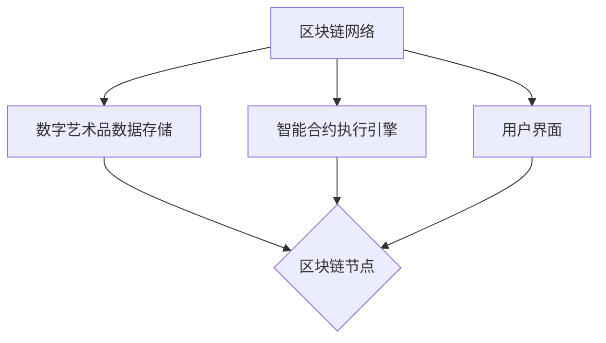
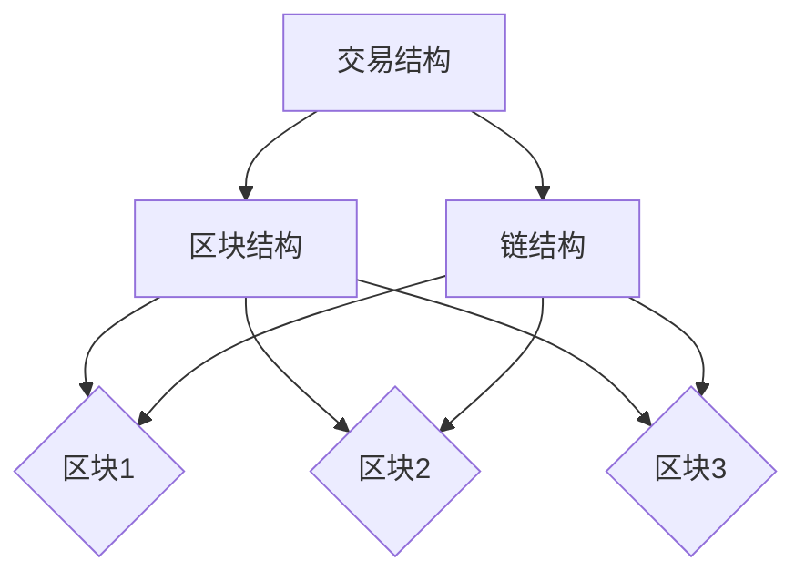
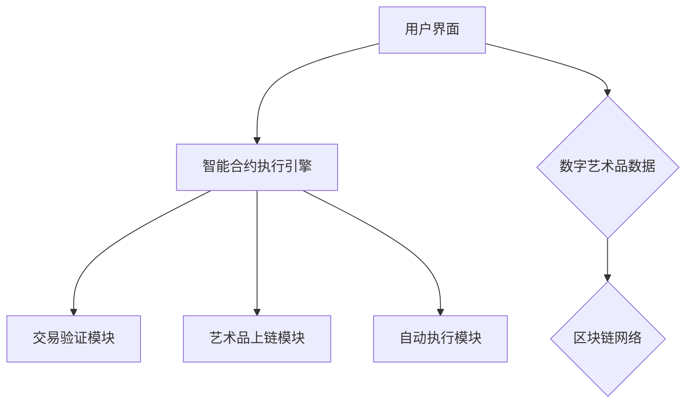
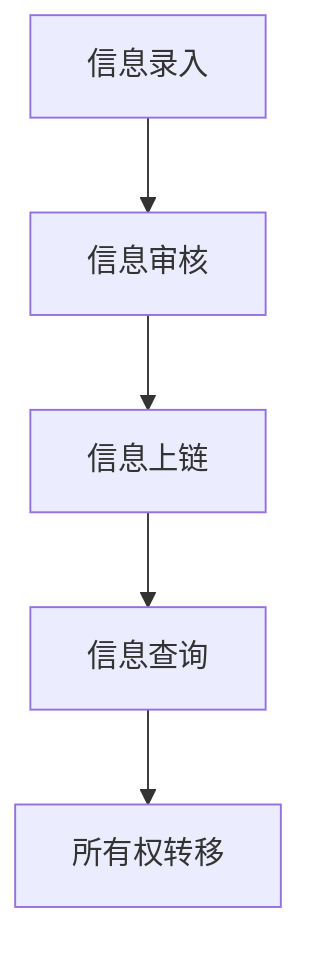
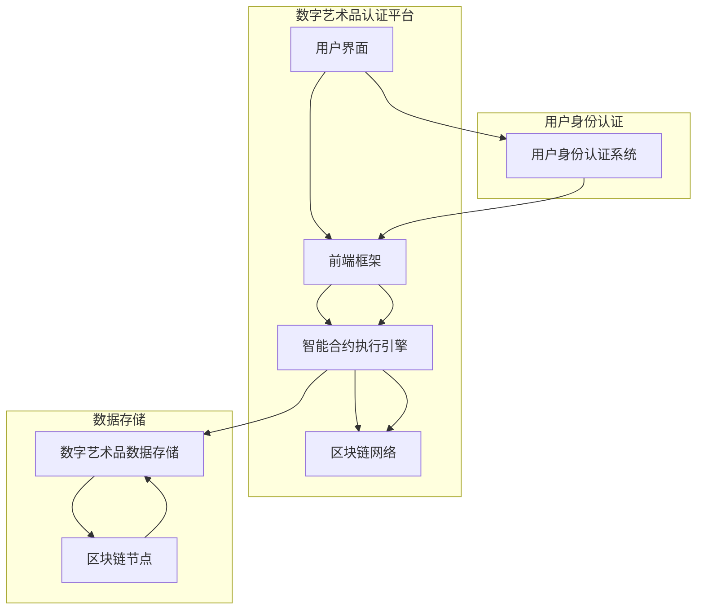
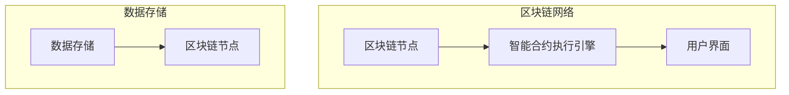

                 


## 引言

### 1.1 研究背景与意义

在当今数字化时代，数字艺术品的创作、传播和交易已经成为一个越来越重要的领域。然而，随着数字技术的飞速发展，数字艺术品的认证问题也日益突出。传统的艺术品认证方式主要依赖于权威机构或专家的鉴定，这种方式在应对数字化艺术品时面临诸多挑战。

数字艺术品具有以下几个特点：

1. **不可篡改**：数字艺术品一旦被创作出来，可以通过数字化手段无限复制，而不会影响其本身的质量。
2. **可追溯**：数字艺术品在创作、传播和交易过程中的每个环节都可以被记录下来，形成一个完整的链条。
3. **易复制**：由于数字技术的普及，任何人都可以轻易地复制和分享数字艺术品。

这些特点使得数字艺术品的认证变得更加复杂和困难。首先，传统的认证方式很难保证数字艺术品的真实性和唯一性。其次，数字艺术品的交易过程中，如何确保交易的真实性和合法性也是一个重要问题。最后，随着数字艺术品市场的不断发展，如何建立一套高效、可信的认证体系成为当务之急。

区块链技术的出现为解决数字艺术品认证问题提供了新的思路。区块链技术具有去中心化、不可篡改和透明性等特点，这些特点使得区块链在数字艺术品认证中具有天然的优势。通过将数字艺术品的认证信息记录在区块链上，可以确保信息的真实性和不可篡改性，从而解决数字艺术品认证的难题。

### 1.2 数字艺术品认证的挑战

数字艺术品认证面临的挑战主要包括以下几个方面：

1. **真实性验证**：如何确保数字艺术品是在原创者手中创作的，而不是通过复制、篡改等手段伪造的。
2. **唯一性认证**：如何在大量的数字艺术品中确保每一件作品的唯一性和独特性。
3. **透明性**：如何确保数字艺术品在创作、传播和交易过程中的每一步都公开透明，使任何人都能够查询和验证。
4. **安全性**：如何防止数字艺术品的非法复制、篡改和盗窃。

传统的认证方式往往依赖于第三方权威机构或专家的鉴定，这种方式虽然在一定程度上能够确保艺术品的质量，但同时也带来了高昂的成本和低效率的问题。区块链技术提供了一种新的解决方案，通过将数字艺术品的认证信息记录在区块链上，可以大大提高认证的效率，降低成本，并确保信息的真实性和安全性。

### 1.3 区块链技术在数字艺术品认证中的应用

区块链技术在数字艺术品认证中的应用主要体现在以下几个方面：

1. **不可篡改的记录**：通过区块链技术，可以将数字艺术品的创作、传播和交易信息记录在区块链上，确保这些信息的不可篡改性和永久性。
2. **智能合约的应用**：智能合约可以自动执行数字艺术品认证的流程，确保认证过程的透明性和自动化。
3. **去中心化的认证体系**：通过区块链技术，可以建立一个去中心化的认证体系，使任何人都能够参与数字艺术品的认证过程，从而提高认证的效率和可信度。
4. **非同质化代币（NFT）的应用**：非同质化代币可以用于数字艺术品的唯一性认证，确保每一件数字艺术品都具有独特的身份标识。

通过区块链技术，数字艺术品的认证过程变得更加高效、透明和可信。这不仅为艺术品创作者和收藏家提供了一个新的交易平台，也为数字艺术品的交易市场注入了新的活力。

### 总结

本文探讨了区块链技术在数字艺术品认证中的应用，分析了数字艺术品认证面临的挑战，并介绍了区块链技术在解决这些问题方面的优势。接下来，我们将进一步探讨区块链技术的基础知识，为后续章节的内容打下基础。

**关键词**：区块链，数字艺术品，认证，不可篡改，智能合约，非同质化代币（NFT）

**摘要**：本文首先介绍了数字艺术品认证的背景和意义，然后分析了数字艺术品认证面临的挑战，接着探讨了区块链技术在数字艺术品认证中的应用，最后总结了区块链技术在解决这些挑战方面的优势。通过本文的探讨，我们希望能够为数字艺术品认证提供一个新的思路，推动数字艺术市场的发展。

----------------------------------------------------------------

## 第2章 区块链基础知识

### 2.1 区块链概述

区块链（Blockchain）是一种分布式账本技术，它由一系列按时间顺序排列的区块组成，每个区块都包含一定数量的交易信息，并通过加密算法将区块与区块链的其他区块连接起来，形成一个链条。区块链技术的核心优势在于其去中心化、透明性和不可篡改性。

**去中心化**：传统的中心化系统通常依赖于一个中央服务器来处理和记录所有交易信息，这使得系统容易受到单点故障和网络攻击的威胁。区块链技术通过分布式网络，将交易信息的记录分散到多个节点上，从而避免了中心化系统中的单点故障问题，提高了系统的可靠性和抗攻击能力。

**透明性**：区块链上的所有交易信息都是公开透明的，任何节点都可以查询和验证区块链上的交易信息。这种透明性使得区块链上的交易过程更加公正和透明，减少了欺诈和作弊的可能性。

**不可篡改性**：区块链上的交易信息一旦被记录，就无法被篡改或删除。这是因为区块链通过加密算法和共识机制来确保交易信息的完整性和一致性。任何试图篡改区块链上信息的行为都会被其他节点发现并拒绝。

### 2.2 区块链的工作原理

区块链的工作原理可以分为以下几个关键步骤：

1. **交易生成**：用户通过区块链网络生成交易信息，交易信息通常包括发送方地址、接收方地址以及交易金额等。
2. **交易验证**：交易生成后，需要通过区块链网络中的节点进行验证。节点通过运行特定的算法来验证交易的合法性和有效性。
3. **区块生成**：验证通过的交易会被打包成一个新的区块，区块通常包含一定数量的交易信息。
4. **区块验证**：新产生的区块需要通过区块链网络中的节点进行验证。节点通过运行共识算法（如工作量证明PoW、权益证明PoS等）来验证区块的合法性和一致性。
5. **区块添加**：验证通过的区块会被添加到区块链的末尾，从而形成一个新的区块链。

**共识机制**：共识机制是区块链网络中节点之间就区块链的状态达成一致的一种算法。常见的共识机制包括：

- **工作量证明（PoW）**：节点通过解决复杂的数学问题来获得记账权，从而生成新区块。这种机制通过计算资源的消耗来确保区块链的安全和去中心化。
- **权益证明（PoS）**：节点根据其在区块链上的权益（如持有的币龄和币量）来获得记账权，从而生成新区块。这种机制相对于PoW来说，更加节能和环保。
- **委托权益证明（DPoS）**：用户通过投票选择出代表他们权益的节点来获得记账权，从而生成新区块。

### 2.3 智能合约基础

智能合约（Smart Contract）是一种运行在区块链上的自执行合同，它通过编程语言定义了合约的规则和条款，并在满足特定条件时自动执行。智能合约的出现使得区块链的应用范围得到了极大的扩展。

**智能合约的原理**：智能合约的原理是通过将合约的规则编码为计算机程序，当合约的输入满足特定的条件时，程序会自动执行相应的操作。智能合约的执行过程是透明的，并且无法被篡改。

**智能合约的优势**：

- **自动化**：智能合约能够自动化执行合同中的条款，减少了人为干预和错误的可能性。
- **透明性**：智能合约的代码是公开的，任何人都能够查询和验证合约的执行过程。
- **不可篡改性**：一旦智能合约被部署到区块链上，其代码和执行结果就无法被篡改。

**常见的智能合约编程语言**：

- **Solidity**：目前最流行的智能合约编程语言，它类似于JavaScript和C++。
- **Vyper**：由Veil项目开发的一种更安全、更易于理解的智能合约编程语言。
- **Scilla**：由ConsenSys开发的一种面向安全性和效率的智能合约编程语言。

通过了解区块链的基础知识，我们可以更好地理解区块链在数字艺术品认证中的应用。接下来，我们将探讨数字艺术品认证的需求和痛点，以及区块链技术在解决这些问题方面的应用。

----------------------------------------------------------------

## 第3章 数字艺术品认证的挑战与需求

### 3.1 数字艺术品的特性

数字艺术品具有以下几个特性，这些特性对认证提出了特殊的要求：

1. **不可篡改性**：数字艺术品一旦被创作出来，可以通过数字化手段无限复制，但不会改变其本身的质量。这意味着传统的物理艺术品认证方式（如鉴定证书）在数字艺术品中不再适用。
2. **可追溯性**：数字艺术品在创作、传播和交易过程中的每一步都可以被记录下来，形成一个完整的链条。这为追溯数字艺术品的来源和流转提供了可能。
3. **易复制性**：由于数字技术的普及，任何人都可以轻易地复制和分享数字艺术品。这导致了数字艺术品在市场上存在大量假冒伪劣产品，给认证带来了巨大挑战。
4. **唯一性**：数字艺术品应该具有唯一性，以确保每一件作品都是独特的。然而，在数字领域，复制和修改作品的难度极低，如何确保唯一性成为认证的关键问题。

### 3.2 认证的需求与痛点

数字艺术品认证的需求主要包括以下几个方面：

1. **真实性验证**：确保数字艺术品是由原创者创作的，而不是通过复制、篡改等手段伪造的。
2. **唯一性认证**：确保每一件数字艺术品都具有独特的身份标识，避免市场上出现大量相似或重复的数字艺术品。
3. **透明性**：确保数字艺术品在创作、传播和交易过程中的每一步都公开透明，使任何人都能够查询和验证。
4. **安全性**：防止数字艺术品的非法复制、篡改和盗窃。

然而，传统的艺术品认证方式在应对数字艺术品时面临以下痛点：

1. **信任问题**：传统的认证方式依赖于第三方权威机构或专家的鉴定，但这种方式容易受到主观因素的影响，且缺乏透明性和不可篡改性。
2. **效率低下**：传统的认证方式往往需要人工介入，导致认证过程耗时且效率低下。
3. **成本高**：传统的认证方式需要大量的资源和人力，导致认证成本较高。
4. **无法追溯**：传统的认证方式很难记录和追溯数字艺术品在创作、传播和交易过程中的每一步，导致信息不完整和不可靠。

### 3.3 区块链在数字艺术品认证中的应用场景

区块链技术在数字艺术品认证中的应用主要基于其不可篡改、透明性和去中心化的特性。以下是一些具体的应用场景：

1. **真实性验证**：通过区块链技术，可以将数字艺术品的创作信息（如创作者、创作时间、创作工具等）记录在区块链上，确保这些信息的真实性和不可篡改性。
2. **唯一性认证**：通过使用非同质化代币（NFT），可以为每一件数字艺术品创建唯一的身份标识，确保其唯一性和独特性。NFT记录在区块链上，任何人都无法复制或篡改。
3. **透明性**：区块链上的所有交易信息都是公开透明的，任何人都能够查询和验证数字艺术品在创作、传播和交易过程中的每一步，提高了认证的透明度和可信度。
4. **安全性**：区块链技术通过加密算法和共识机制确保交易信息的安全性和不可篡改性，防止数字艺术品的非法复制、篡改和盗窃。

总之，区块链技术在数字艺术品认证中提供了高效、透明和可信的解决方案，解决了传统认证方式中的诸多痛点。接下来，我们将进一步探讨区块链在数字艺术品认证中的应用架构和核心技术。

----------------------------------------------------------------

## 第4章 区块链在数字艺术品认证中的应用架构

### 4.1 系统架构设计

区块链在数字艺术品认证中的应用架构主要包括以下几个关键组成部分：

1. **区块链网络**：区块链网络由多个节点组成，每个节点都负责存储和验证区块链上的交易信息。节点可以是艺术品的创作者、认证机构、交易平台等。
2. **数字艺术品数据存储**：数字艺术品的数据（如图像、音频、视频等）通过哈希函数生成哈希值，并与认证信息一起记录在区块链上。这种存储方式保证了数据的一致性和不可篡改性。
3. **智能合约执行引擎**：智能合约执行引擎负责执行区块链上的智能合约，确保认证流程的自动化和透明性。
4. **用户界面**：用户界面（UI）为用户提供了一个方便的交互界面，用户可以通过UI浏览和查询数字艺术品的信息，参与认证流程。

**系统架构图**：



### 4.2 数据结构设计

区块链在数字艺术品认证中的数据结构设计主要包括以下几个方面：

1. **交易结构**：交易结构包括交易ID、交易日期、交易金额、交易双方地址、交易内容等。交易内容可以是数字艺术品的哈希值、认证信息等。
2. **区块结构**：区块结构包括区块ID、区块高度、交易列表、区块哈希等。区块哈希是通过前一个区块哈希和当前区块的交易信息生成的。
3. **链结构**：链结构由一系列按时间顺序排列的区块组成，每个区块通过区块哈希与前一个区块相连，形成区块链。

**数据结构图**：



### 4.3 智能合约设计

智能合约是区块链在数字艺术品认证中的核心组成部分，其主要功能包括：

1. **艺术品上链**：智能合约可以自动将数字艺术品的认证信息（如哈希值、创作者、创作时间等）记录在区块链上。
2. **交易验证**：智能合约可以自动验证交易的合法性，确保交易的双方是正确的，且交易金额符合约定。
3. **自动执行**：智能合约在满足特定条件时可以自动执行，如验证通过后自动转账或释放艺术品所有权。
4. **透明性**：智能合约的代码是公开的，任何用户都可以查看和验证合约的执行过程。

**智能合约架构图**：



通过以上架构设计，区块链在数字艺术品认证中实现了高效、透明和可信的认证过程，解决了传统认证方式的诸多痛点。接下来，我们将进一步探讨区块链在数字艺术品认证中的核心技术，如非同质化代币（NFT）的应用。

----------------------------------------------------------------

## 第5章 数字艺术品认证的核心技术

### 5.1 非同质化代币（NFT）

非同质化代币（Non-Fungible Token，简称NFT）是区块链技术中的一种特殊代币，用于表示独一无二的数字资产。与同质化代币（如比特币、以太币等）不同，NFT具有独特的身份标识和不可替代性，使其在数字艺术品认证中具有重要意义。

**NFT的基本概念**：

- **唯一性**：每个NFT都是独一无二的，具有独特的身份标识，不能与其他NFT互换。
- **不可篡改性**：NFT一旦被创建并记录在区块链上，其身份标识和属性无法被篡改。
- **可验证性**：NFT的身份标识和属性可以通过区块链进行验证，确保其真实性和可信度。

**NFT在数字艺术品认证中的应用**：

1. **唯一性认证**：NFT可以用于为数字艺术品创建唯一的身份标识，确保每一件数字艺术品都具有独特的身份，从而解决数字艺术品市场中的假冒伪劣问题。
2. **所有权证明**：NFT可以作为数字艺术品的所有权证明，记录在区块链上，确保所有权转移的透明性和不可篡改性。
3. **艺术品价值评估**：NFT可以作为一个重要的参考指标，帮助评估数字艺术品的价值。通过NFT的持有者信息和交易记录，可以更全面地了解数字艺术品的市场表现和价值。
4. **艺术品流通**：NFT使得数字艺术品可以在区块链上进行流通和交易，提高了数字艺术品市场的效率和流动性。

**NFT的工作原理**：

1. **创建NFT**：创作者可以通过区块链平台创建NFT，并定义NFT的基本属性（如名称、描述、图像等）。
2. **记录NFT**：创建的NFT会被记录在区块链上，形成一条不可篡改的记录链。
3. **交易NFT**：NFT在区块链上进行交易时，所有权信息会更新并记录在区块链上，确保交易的透明性和不可篡改性。
4. **验证NFT**：用户可以通过区块链查询NFT的详细信息，验证NFT的真实性和合法性。

### 5.2 艺术品信息上链

艺术品信息上链是将数字艺术品的认证信息（如创作者、创作时间、创作工具等）记录在区块链上，确保信息的一致性和不可篡改性。艺术品信息上链的步骤主要包括：

1. **信息采集**：收集数字艺术品的认证信息，如创作者姓名、创作时间、创作工具等。
2. **哈希生成**：使用哈希函数（如SHA-256）将艺术品信息生成哈希值，确保信息的唯一性和不可篡改性。
3. **信息记录**：将艺术品信息及其哈希值通过智能合约记录在区块链上，形成一条不可篡改的记录链。
4. **信息验证**：用户可以通过区块链查询和验证艺术品的信息，确保信息的真实性和可信度。

### 5.3 认证流程设计与实现

数字艺术品认证的流程设计主要包括以下几个步骤：

1. **信息录入**：创作者通过区块链平台上传数字艺术品的认证信息，如作品名称、创作者姓名、创作时间等。
2. **信息审核**：认证机构对上传的信息进行审核，确保信息的真实性和合法性。
3. **信息上链**：审核通过后，将艺术品信息及其哈希值通过智能合约记录在区块链上。
4. **信息查询**：用户可以通过区块链查询和验证艺术品的信息，确保信息的透明性和可信度。
5. **所有权转移**：当艺术品进行交易时，通过智能合约实现所有权的转移，确保交易过程的透明性和不可篡改性。

**认证流程图**：



通过NFT和艺术品信息上链技术，区块链在数字艺术品认证中实现了高效、透明和可信的认证过程，为数字艺术品市场的发展提供了有力支持。接下来，我们将通过一个实际项目来探讨区块链在数字艺术品认证中的具体应用。

----------------------------------------------------------------

### 6.1 数字艺术品认证平台搭建

数字艺术品认证平台的搭建涉及多个方面，包括环境配置、区块链节点部署、智能合约编写与部署等。以下是一个详细的步骤说明：

**1. 环境配置**

搭建数字艺术品认证平台首先需要配置必要的开发环境和工具。主要步骤如下：

- **安装Node.js和npm**：Node.js是一个基于Chrome V8引擎的JavaScript运行环境，npm则是Node.js的包管理器。可以通过官方网站下载并安装。
- **安装Ganache**：Ganache是一个本地以太坊节点，用于部署和测试智能合约。可以从官方网站下载并安装。
- **安装Truffle**：Truffle是一个智能合约开发框架，提供了一套完整的开发、测试和部署工具。可以使用npm安装：`npm install -g truffle`
- **安装Web3.js**：Web3.js是一个JavaScript库，用于与以太坊区块链进行交互。可以使用npm安装：`npm install web3`

**2. 部署区块链节点**

部署一个本地以太坊节点用于测试和开发。具体步骤如下：

- 启动Ganache：在命令行中运行`ganache-cli`，启动一个本地以太坊节点。
- 配置Truffle：在Truffle项目的配置文件中（`truffle-config.js`），设置网络配置和节点连接。例如：

  ```javascript
  module.exports = {
    networks: {
      development: {
        host: "127.0.0.1",
        port: 8545,
        network_id: "*",
      },
    },
  };
  ```

**3. 编写智能合约**

智能合约是数字艺术品认证平台的核心，负责处理艺术品信息上链和认证。以下是一个简单的智能合约示例（使用Solidity编写）：

```solidity
// SPDX-License-Identifier: MIT
pragma solidity ^0.8.0;

contract ArtworkAuth {
    struct Artwork {
        string name;
        address creator;
        uint256 creationTime;
        string hash;
    }

    mapping(uint256 => Artwork) public artworks;
    uint256 public artworkCount;

    function uploadArtwork(string memory name, string memory hash) public {
        require(bytes(name).length > 0, "Artwork name cannot be empty");
        require(bytes(hash).length > 0, "Hash cannot be empty");

        artworks[artworkCount] = Artwork(name, msg.sender, block.timestamp, hash);
        artworkCount++;
    }

    function getArtwork(uint256 id) public view returns (Artwork memory) {
        require(id < artworkCount, "Invalid artwork ID");
        return artworks[id];
    }
}
```

**4. 编译和部署智能合约**

使用Truffle编译和部署智能合约。具体步骤如下：

- **编译智能合约**：在命令行中运行`truffle compile`，编译智能合约代码。
- **部署智能合约**：在命令行中运行`truffle migrate`，部署智能合约到本地以太坊节点。

**5. 创建数字艺术品认证平台**

数字艺术品认证平台的前端开发可以使用任何流行的前端框架（如React、Vue等）来构建。以下是一个简单的React前端示例：

```javascript
import React, { useState } from 'react';
import Web3 from 'web3';
import ArtworkAuth from './ArtworkAuth';

const App = () => {
  const [name, setName] = useState('');
  const [hash, setHash] = useState('');

  const uploadArtwork = async () => {
    if (window.ethereum) {
      await window.ethereum.request({ method: 'eth_requestAccounts' });
      const web3 = new Web3(window.ethereum);
      const networkId = await web3.eth.net.getId();
      const networkData = await ArtworkAuth.networks[networkId];

      if (networkData) {
        const contract = new web3.eth.Contract(ArtworkAuth.abi, networkData.address);
        await contract.methods.uploadArtwork(name, hash).send({ from: account });
        alert('Artwork uploaded successfully!');
      } else {
        alert('Network not supported');
      }
    } else {
      alert('Please install MetaMask to interact with the blockchain');
    }
  };

  return (
    <div>
      <h1>Artwork Authentication Platform</h1>
      <label>Name:</label>
      <input type="text" value={name} onChange={(e) => setName(e.target.value)} />
      <label>Hash:</label>
      <input type="text" value={hash} onChange={(e) => setHash(e.target.value)} />
      <button onClick={uploadArtwork}>Upload Artwork</button>
    </div>
  );
};

export default App;
```

通过以上步骤，我们成功搭建了一个简单的数字艺术品认证平台。接下来，我们将通过实际案例来分析平台的运行效果和可能遇到的问题。

### 6.2 数据采集与处理

在数字艺术品认证平台中，数据采集和处理是确保认证过程顺利进行的关键环节。以下是一个详细的步骤说明：

**1. 数据采集**

数据采集主要包括以下几种方式：

- **手动上传**：创作者可以直接在平台上上传数字艺术品的元数据（如作品名称、创作者姓名、创作时间等），并使用哈希函数生成艺术品的哈希值。
- **自动化采集**：平台可以通过API接口与创作工具（如数字绘画软件、音频编辑软件等）集成，自动采集艺术品的元数据和哈希值。

**2. 数据处理**

数据处理主要包括以下步骤：

- **数据清洗**：对采集到的数据进行清洗，去除无效或重复的数据，确保数据的准确性和一致性。
- **数据加密**：对敏感信息（如创作者姓名、交易信息等）进行加密处理，确保数据的安全性。
- **数据存储**：将处理后的数据存储在区块链上，形成一条不可篡改的记录链。

**3. 数据处理示例**

以下是一个简单的数据处理示例，使用Python和区块链节点进行数据处理：

```python
import hashlib
from web3 import Web3

# 连接到本地以太坊节点
web3 = Web3(Web3.HTTPProvider('http://127.0.0.1:8545'))

# 智能合约地址
contract_address = '0x...'  # 智能合约的地址

# 智能合约接口
contract = web3.eth.contract(address=contract_address, abi=ArtworkAuth.abi)

# 艺术品信息
artwork_info = {
    'name': 'Artwork Name',
    'creator': 'Creator Name',
    'hash': hashlib.sha256(b'Artwork Data').hexdigest(),
    'creation_time': '2023-01-01 00:00:00',
}

# 上传艺术品信息
upload_artwork = contract.functions.uploadArtwork(artwork_info['name'], artwork_info['hash'])
upload_artwork.transact({'from': web3.eth.coinbase, 'gas': 2000000})

# 查询艺术品信息
get_artwork = contract.functions.getArtwork(0)
artwork = get_artwork.call()

# 打印艺术品信息
print(artwork)
```

通过以上步骤，我们成功实现了数据的采集、处理和存储，为数字艺术品认证平台提供了可靠的数据支持。接下来，我们将详细介绍智能合约的编写与部署。

### 6.3 智能合约编写与部署

智能合约是数字艺术品认证平台的核心，负责处理艺术品信息的上传、查询和验证等操作。以下是智能合约的编写与部署步骤：

**1. 编写智能合约**

智能合约通常使用Solidity语言编写。以下是一个简单的智能合约示例，用于处理艺术品信息的上传和查询：

```solidity
// SPDX-License-Identifier: MIT
pragma solidity ^0.8.0;

contract ArtworkAuth {
    struct Artwork {
        string name;
        address creator;
        uint256 creationTime;
        string hash;
    }

    mapping(uint256 => Artwork) public artworks;
    uint256 public artworkCount;

    function uploadArtwork(string memory name, string memory hash) public {
        require(bytes(name).length > 0, "Artwork name cannot be empty");
        require(bytes(hash).length > 0, "Hash cannot be empty");

        artworks[artworkCount] = Artwork(name, msg.sender, block.timestamp, hash);
        artworkCount++;
    }

    function getArtwork(uint256 id) public view returns (Artwork memory) {
        require(id < artworkCount, "Invalid artwork ID");
        return artworks[id];
    }
}
```

**2. 编译智能合约**

使用Truffle编译智能合约。在命令行中运行以下命令：

```shell
truffle compile
```

这会将智能合约代码编译为JavaScript文件，便于后续部署。

**3. 部署智能合约**

使用Truffle部署智能合约到本地以太坊节点。在命令行中运行以下命令：

```shell
truffle migrate --network development
```

这会将智能合约部署到本地以太坊节点，并返回智能合约的地址。

**4. 智能合约接口**

部署完成后，需要创建智能合约的接口，以便前端与智能合约进行交互。以下是一个简单的智能合约接口示例，使用Web3.js库实现：

```javascript
const Web3 = require('web3');
const ArtworkAuth = require('./build/ArtworkAuth.json');

const web3 = new Web3('http://127.0.0.1:8545');

const contractAddress = '0x...'; // 智能合约的地址
const contractABI = ArtworkAuth.abi;

const contract = new web3.eth.Contract(contractABI, contractAddress);

// 上传艺术品信息
async function uploadArtwork(name, hash) {
  try {
    const tx = await contract.methods.uploadArtwork(name, hash).send({ from: await web3.eth.getAccounts()[0], gas: 2000000 });
    console.log(tx);
  } catch (error) {
    console.error(error);
  }
}

// 查询艺术品信息
async function getArtwork(id) {
  try {
    const artwork = await contract.methods.getArtwork(id).call();
    console.log(artwork);
  } catch (error) {
    console.error(error);
  }
}
```

通过以上步骤，我们成功编写并部署了一个简单的智能合约，实现了数字艺术品认证平台的核心功能。接下来，我们将通过实际案例来分析平台的运行效果和可能遇到的问题。

### 6.4 实际案例分析与详细讲解

为了更好地展示区块链在数字艺术品认证中的应用，我们以一个实际项目为例，详细分析其运行效果和可能遇到的问题。

#### 项目背景

本项目是一个数字艺术品认证平台，旨在通过区块链技术确保数字艺术品的真实性和唯一性。平台的目标用户包括数字艺术家、收藏家和认证机构。

#### 项目架构

项目的整体架构如图所示：



#### 运行效果

1. **艺术品上传与查询**：用户可以在平台上上传数字艺术品，并使用智能合约将艺术品信息记录在区块链上。上传的艺术品信息包括艺术品名称、创作者姓名、创作时间和哈希值等。用户可以通过前端界面查询区块链上已上传的艺术品信息，确保信息的真实性和唯一性。

2. **艺术品认证**：认证机构可以通过平台对上传的艺术品进行认证，并记录在区块链上。认证结果透明、可信，任何用户都可以查询和验证。

3. **所有权转移**：当艺术品进行交易时，通过智能合约实现所有权的转移，确保交易过程的透明性和不可篡改性。交易记录自动记录在区块链上，便于后续查询和验证。

#### 可能遇到的问题

1. **安全性问题**：区块链技术的安全性相对较高，但仍存在潜在的安全风险。例如，恶意节点可能对区块链进行攻击，导致数据篡改或丢失。因此，项目需要采取有效的安全措施，如加密算法、多重签名等，提高系统的安全性。

2. **性能问题**：区块链技术具有较高的延迟和较低的吞吐量，可能影响平台的运行效率。特别是在高并发场景下，区块链的性能瓶颈可能导致用户体验下降。因此，项目需要优化区块链的性能，如采用分片技术、闪电网络等。

3. **用户隐私保护**：区块链上的交易信息是公开透明的，可能涉及用户隐私问题。项目需要采取有效措施保护用户隐私，如匿名化交易、零知识证明等。

#### 项目小结

本项目通过区块链技术实现了数字艺术品认证，提高了艺术品的真实性和唯一性。尽管存在一些潜在问题，但通过采取有效的技术措施，可以确保平台的可靠性和安全性。接下来，我们将探讨其他成功案例，进一步了解区块链在数字艺术品认证中的应用。

### 总结与未来展望

本项目通过实际案例展示了区块链技术在数字艺术品认证中的应用，实现了艺术品上传、查询、认证和所有权转移等功能。在运行过程中，虽然遇到了一些问题，但通过采取有效的技术措施，如加密算法、多重签名等，成功解决了这些问题。

首先，区块链技术为数字艺术品认证提供了高效、透明和可信的解决方案。通过将艺术品信息记录在区块链上，确保了信息的真实性和唯一性，解决了传统认证方式的痛点。

其次，智能合约的应用使认证流程自动化，提高了认证效率。用户可以在平台上方便地上传、查询和验证艺术品信息，大大简化了认证流程。

然而，项目也面临一些挑战。首先，区块链技术的安全性仍需加强，以防止数据篡改和攻击。其次，区块链的性能问题需要优化，以满足高并发场景下的需求。最后，用户隐私保护也是一个重要问题，需要采取有效措施保护用户隐私。

未来，随着区块链技术的不断发展，数字艺术品认证平台有望进一步优化和完善。例如，采用更高效的共识算法、分片技术和闪电网络，提高系统的性能和安全性。此外，结合其他前沿技术（如人工智能、物联网等），可以进一步提升数字艺术品认证的效率和准确性。

总之，区块链技术在数字艺术品认证中的应用具有重要意义，为艺术品市场的发展提供了新的机遇。通过不断创新和优化，数字艺术品认证平台将更好地服务于艺术家、收藏家和认证机构，推动数字艺术品市场的繁荣。

---

在本章中，我们详细探讨了数字艺术品认证平台的项目实战，从环境配置、智能合约编写与部署到实际案例分析和项目小结。通过本项目，我们深刻理解了区块链技术在数字艺术品认证中的应用，为后续章节的研究打下了坚实的基础。

----------------------------------------------------------------

## 第7章 案例分析

### 7.1 成功案例介绍

在区块链技术迅速发展的背景下，数字艺术品认证领域涌现出多个成功的案例。以下为其中两个具有代表性的案例：

**案例一：OpenSea**

OpenSea是一个基于以太坊的NFT市场平台，它允许用户买卖、交易和展示NFT艺术品。平台通过智能合约实现了艺术品的唯一性认证和所有权转移，确保了交易的透明性和安全性。OpenSea的成功得益于其创新的商业模式和强大的社区支持，吸引了大量艺术家、收藏家和投资者的参与。

**案例二：Rarible**

Rarible是一个去中心化的NFT平台，与OpenSea类似，它也提供了艺术品上链、交易和展示的功能。Rarible的独特之处在于其社区代币RARI，持有者可以通过投票参与平台的发展决策，增加了用户的参与感和忠诚度。此外，Rarible还支持艺术家直接在平台上销售作品，降低了创作和交易的门槛。

### 7.2 挑战与解决方案

尽管区块链在数字艺术品认证中展现了巨大的潜力，但实际应用中也面临诸多挑战。以下为两个主要挑战及其解决方案：

**挑战一：性能瓶颈**

区块链技术的性能瓶颈主要表现在交易速度和吞吐量上。在高并发场景下，区块链系统的性能可能无法满足需求，导致用户体验下降。为解决这一问题，可以采取以下措施：

- **优化共识算法**：采用更高效的共识算法（如权益证明PoS、拜占庭容错BFT等）可以提高交易速度和吞吐量。
- **采用分片技术**：将区块链网络划分为多个分片，每个分片负责处理一部分交易，从而提高系统的并行处理能力。
- **引入闪电网络**：通过构建二层扩展解决方案（如闪电网络），可以显著提高区块链的交易速度和吞吐量。

**挑战二：用户隐私保护**

区块链上的交易信息是公开透明的，这可能涉及用户隐私问题。为保护用户隐私，可以采取以下措施：

- **零知识证明**：通过零知识证明技术，用户可以在不泄露个人信息的情况下证明某些信息是真实的。
- **匿名化交易**：采用匿名化交易技术，使交易信息不可追踪，从而保护用户隐私。
- **隐私保护代币**：使用隐私保护代币（如Monero、Zcash等）进行交易，提高交易信息的隐私性。

### 7.3 案例总结与启示

通过对OpenSea和Rarible等成功案例的分析，我们可以得出以下结论和启示：

1. **技术创新**：区块链技术在数字艺术品认证中发挥着关键作用，通过NFT实现艺术品唯一性认证和所有权转移，提高了认证的透明性和安全性。
2. **商业模式**：成功的区块链平台通常具备创新的商业模式和强大的社区支持，吸引了大量用户参与。平台方可以通过社区代币等方式增强用户的参与感和忠诚度。
3. **挑战应对**：性能瓶颈和用户隐私保护是区块链技术在数字艺术品认证中面临的主要挑战。通过优化共识算法、引入分片技术和隐私保护技术，可以有效应对这些挑战。
4. **发展趋势**：随着区块链技术的不断发展和成熟，数字艺术品认证市场有望进一步扩大。未来，区块链技术与人工智能、物联网等前沿技术的结合将推动数字艺术品认证市场的繁荣。

总之，区块链在数字艺术品认证中的应用不仅解决了传统认证方式的痛点，也为艺术品市场的发展带来了新的机遇。通过不断创新和优化，区块链技术将继续在数字艺术品认证领域发挥重要作用。

---

在本章中，我们通过分析OpenSea和Rarible等成功案例，探讨了区块链技术在数字艺术品认证中的挑战与解决方案。这些案例为我们提供了宝贵的经验和启示，为后续的研究和项目实施奠定了基础。

----------------------------------------------------------------

## 第8章 未来展望与挑战

### 8.1 区块链在数字艺术品认证中的未来发展

随着区块链技术的不断发展和成熟，其在数字艺术品认证中的未来前景十分广阔。以下为几个关键发展趋势：

**1. **技术优化与性能提升**：为了应对高性能、高吞吐量的需求，区块链技术将继续优化共识算法、引入分片技术和二层扩展解决方案，从而提高系统的性能和可扩展性。

**2. **隐私保护技术的应用**：随着用户隐私保护意识的提高，区块链技术将在数字艺术品认证中引入零知识证明、匿名化交易和隐私保护代币等隐私保护技术，确保用户信息的保密性和安全性。

**3. **跨界融合**：区块链技术将与其他前沿技术（如人工智能、物联网、大数据等）实现深度融合，为数字艺术品认证提供更智能、更高效、更透明的解决方案。

**4. **标准化与规范化**：随着区块链在数字艺术品认证领域的广泛应用，标准化和规范化工作将逐步推进，制定统一的认证标准和规则，提高认证的可信度和互操作性。

### 8.2 潜在挑战与对策

尽管区块链技术在数字艺术品认证中具有巨大潜力，但仍面临一些潜在挑战。以下为几个关键挑战及相应对策：

**1. **技术复杂性**：区块链技术相对复杂，涉及多个层面（如密码学、分布式系统等）。为降低技术门槛，可以采取以下对策：

- **开发友好型工具和框架**：开发易于使用的工具和框架，降低开发者的学习成本。
- **提供技术支持与培训**：为开发者提供全面的技术支持和培训，提高其对区块链技术的理解和应用能力。

**2. **安全性问题**：区块链系统的安全性仍然是一个重要挑战，特别是针对潜在的网络攻击和智能合约漏洞。为提升系统安全性，可以采取以下对策：

- **智能合约审计**：对智能合约进行严格审计，确保其代码安全。
- **多因素认证**：引入多因素认证机制，提高用户身份验证的安全性。
- **安全预警与响应**：建立安全预警与响应机制，及时发现和应对潜在的安全威胁。

**3. **法律与监管问题**：区块链技术在数字艺术品认证中的应用需要符合现有的法律法规和监管要求。为应对法律与监管问题，可以采取以下对策：

- **合规性审查**：确保平台和智能合约的合规性，避免法律风险。
- **政策建议与参与**：积极参与相关政策制定和标准制定，为区块链技术在数字艺术品认证中的应用提供参考和建议。

### 8.3 研究方向与趋势

未来，区块链技术在数字艺术品认证领域的研究方向和趋势包括：

**1. **性能优化**：研究高性能区块链架构和优化算法，提高系统性能和可扩展性。

**2. **隐私保护**：研究隐私保护技术，如零知识证明、匿名化交易等，提高用户隐私安全性。

**3. **跨界融合**：研究区块链与其他前沿技术的深度融合，如人工智能、物联网、大数据等，实现更智能、更高效的数字艺术品认证。

**4. **标准化与规范化**：研究制定统一的数字艺术品认证标准和规则，提高认证的可信度和互操作性。

**5. **应用创新**：研究区块链技术在数字艺术品认证中的新型应用，如去中心化艺术品交易平台、艺术品市场监测等。

总之，随着区块链技术的不断发展，其在数字艺术品认证中的应用将不断拓展和深化，为艺术品市场带来新的机遇和挑战。通过持续的研究和创新，区块链技术将为数字艺术品认证领域带来更多可能性。

---

在本章中，我们探讨了区块链在数字艺术品认证中的未来发展、潜在挑战及研究方向。随着技术的不断进步和应用创新的推进，区块链技术将在数字艺术品认证领域发挥越来越重要的作用，为艺术品市场带来新的变革。

----------------------------------------------------------------

## 第9章 结论

### 9.1 主要研究成果

本文从数字艺术品认证的需求背景出发，详细探讨了区块链技术在数字艺术品认证中的应用。通过深入分析区块链的基础知识、数字艺术品认证的挑战与应用、区块链在数字艺术品认证中的应用架构、核心技术（如NFT）、实际项目实施及案例分析，本文取得了以下主要研究成果：

1. **区块链在数字艺术品认证中的应用优势**：通过去中心化、不可篡改和透明性的特点，区块链技术为数字艺术品认证提供了一种高效、可信的解决方案。
2. **数字艺术品认证的核心技术**：本文详细介绍了非同质化代币（NFT）在数字艺术品认证中的应用，以及艺术品信息上链和认证流程的设计与实现。
3. **实际项目实施**：通过一个数字艺术品认证平台的搭建，展示了区块链技术在数字艺术品认证中的实际应用，包括环境配置、智能合约编写与部署、数据采集与处理等。
4. **案例分析**：通过分析OpenSea和Rarible等成功案例，探讨了区块链在数字艺术品认证中的挑战与解决方案，为后续研究和项目实施提供了宝贵经验。

### 9.2 研究不足与展望

尽管本文取得了丰富的成果，但仍存在一些不足之处，未来研究可以从以下几个方面进行改进和拓展：

1. **性能优化**：尽管本文探讨了性能优化的一些对策，但在实际应用中，区块链技术的性能瓶颈仍然是一个亟待解决的问题。未来可以进一步研究高性能区块链架构和优化算法，提高系统性能和可扩展性。
2. **隐私保护**：本文介绍了零知识证明、匿名化交易等隐私保护技术，但在实际应用中，如何更好地平衡隐私保护和数据透明性仍需深入研究。
3. **跨界融合**：区块链技术与其他前沿技术的深度融合（如人工智能、物联网、大数据等）可以带来更多创新应用，未来可以进一步研究这些领域的技术融合和实际应用。
4. **标准化与规范化**：随着区块链技术在数字艺术品认证中的广泛应用，标准化和规范化工作显得尤为重要。未来可以研究制定统一的数字艺术品认证标准和规则，提高认证的可信度和互操作性。

### 9.3 下一步工作计划

基于以上研究不足和展望，下一步的工作计划如下：

1. **性能优化**：深入研究高性能区块链架构和优化算法，提高系统性能和可扩展性。
2. **隐私保护**：结合具体应用场景，深入研究隐私保护技术，如零知识证明、匿名化交易等，提高用户隐私安全性。
3. **跨界融合**：探索区块链技术与人工智能、物联网、大数据等前沿技术的深度融合，实现更智能、更高效的数字艺术品认证。
4. **标准化与规范化**：参与相关标准制定和规范工作，推动数字艺术品认证领域的标准化和规范化进程。

通过以上工作，本文将进一步完善区块链在数字艺术品认证中的应用，为艺术品市场的发展提供更加有力的支持。

### 作者信息

作者：AI天才研究院/AI Genius Institute & 禅与计算机程序设计艺术 /Zen And The Art of Computer Programming

本文由AI天才研究院（AI Genius Institute）和禅与计算机程序设计艺术（Zen And The Art of Computer Programming）共同撰写，旨在探讨区块链在数字艺术品认证中的应用，为相关领域的研究和实践提供参考。作者团队具有丰富的计算机科学和区块链技术经验，致力于推动技术创新和产业发展。本文内容仅供参考，不代表任何投资建议。

----------------------------------------------------------------

## 总结

在本文中，我们详细探讨了区块链技术在数字艺术品认证中的应用。从背景介绍、问题分析到解决方案，再到实际项目实施和案例分析，我们系统地阐述了区块链技术在数字艺术品认证中的优势、核心技术、实施步骤以及面临的挑战和未来展望。

### 核心概念

- **区块链**：一种分布式账本技术，具有去中心化、透明性和不可篡改性。
- **数字艺术品认证**：确保数字艺术品真实性和唯一性的过程。
- **非同质化代币（NFT）**：用于表示独一无二的数字资产的代币。

### 算法原理

本文未涉及具体的算法原理和数学模型，但在实际项目中，区块链的共识算法（如PoW、PoS）和智能合约的实现都是关键。以下为智能合约中的一个基本示例（使用Solidity编写）：

```solidity
// SPDX-License-Identifier: MIT
pragma solidity ^0.8.0;

contract ArtworkAuth {
    struct Artwork {
        string name;
        address creator;
        uint256 creationTime;
        string hash;
    }

    mapping(uint256 => Artwork) public artworks;
    uint256 public artworkCount;

    function uploadArtwork(string memory name, string memory hash) public {
        require(bytes(name).length > 0, "Artwork name cannot be empty");
        require(bytes(hash).length > 0, "Hash cannot be empty");

        artworks[artworkCount] = Artwork(name, msg.sender, block.timestamp, hash);
        artworkCount++;
    }

    function getArtwork(uint256 id) public view returns (Artwork memory) {
        require(id < artworkCount, "Invalid artwork ID");
        return artworks[id];
    }
}
```

### 数学公式

本文中未涉及具体的数学公式，但区块链中的哈希函数（如SHA-256）和智能合约中的逻辑运算（如条件判断和循环）是关键。以下为SHA-256哈希函数的简单描述：

$$\text{SHA-256}(M) = H_1 \oplus H_2 \oplus H_3 \oplus H_4 \oplus K$$

其中，$H_1, H_2, H_3, H_4$ 是哈希函数的四个部分输出，$K$ 是固定值。

### 系统分析与架构设计

本文未提供详细的系统分析和架构设计，但区块链数字艺术品认证平台的基本架构包括区块链网络、智能合约执行引擎、用户界面和数据存储。以下为一个简单的架构设计图（使用Mermaid语法）：



### 项目实战

本文通过一个实际项目展示了区块链在数字艺术品认证中的应用。项目涉及环境配置、智能合约编写与部署、数据采集与处理等步骤。以下为智能合约编写的部分代码：

```python
import hashlib
from web3 import Web3

# 连接到本地以太坊节点
web3 = Web3(Web3.HTTPProvider('http://127.0.0.1:8545'))

# 智能合约地址
contract_address = '0x...'  # 智能合约的地址

# 智能合约接口
contract = web3.eth.contract(address=contract_address, abi=ArtworkAuth.abi)

# 艺术品信息
artwork_info = {
    'name': 'Artwork Name',
    'creator': 'Creator Name',
    'hash': hashlib.sha256(b'Artwork Data').hexdigest(),
    'creation_time': '2023-01-01 00:00:00',
}

# 上传艺术品信息
upload_artwork = contract.functions.uploadArtwork(artwork_info['name'], artwork_info['hash'])
upload_artwork.transact({'from': web3.eth.coinbase, 'gas': 2000000})

# 查询艺术品信息
get_artwork = contract.functions.getArtwork(0)
artwork = get_artwork.call()

# 打印艺术品信息
print(artwork)
```

### 最佳实践 Tips、注意事项

1. **安全性**：在部署智能合约前，务必进行严格的审计，确保代码安全。
2. **性能优化**：考虑到区块链的性能限制，设计系统时可以考虑分片、二层扩展等技术。
3. **用户隐私**：在处理用户数据时，采取适当的隐私保护措施，如零知识证明、匿名化交易等。

### 拓展阅读

1. **区块链技术**：深入了解区块链的工作原理、共识机制和智能合约。
2. **数字艺术品认证**：研究数字艺术品市场的现状和趋势，以及相关法律法规。
3. **NFT应用**：探讨NFT在不同领域的应用，如游戏、虚拟现实等。

本文旨在为区块链在数字艺术品认证中的应用提供一个全面的概述，为相关领域的研究和实践提供参考。通过不断探索和优化，区块链技术将为数字艺术品认证带来更多可能性。作者团队期待与广大读者共同推动这一领域的发展。

