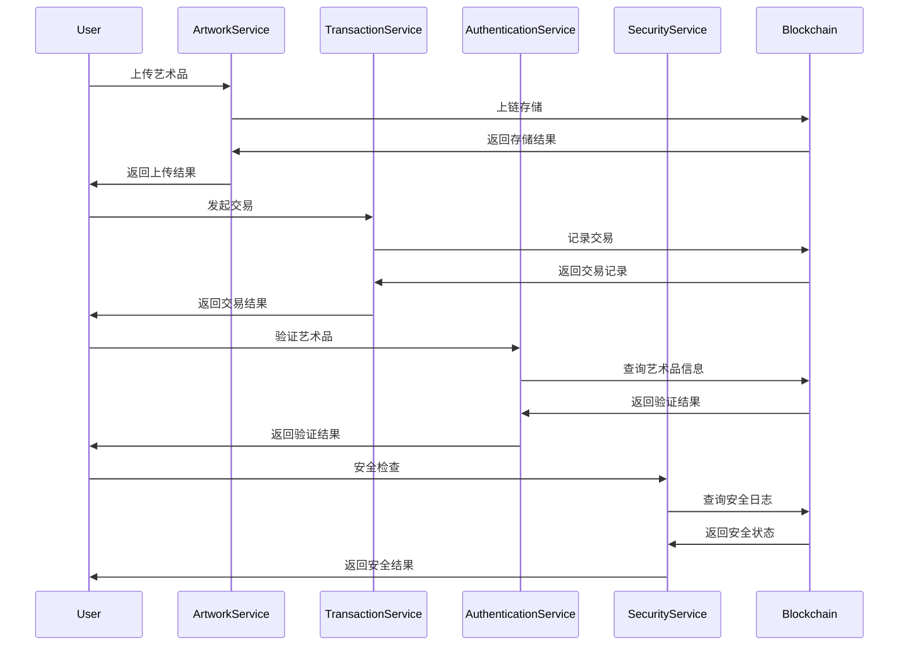

                 

### 第一部分：背景介绍

#### 第1章：区块链与数字艺术品鉴定概述

区块链技术，作为一种去中心化的分布式数据库系统，自2008年由中本聪（Satoshi Nakamoto）提出以来，已经引起了全球范围内的广泛关注。区块链的核心特性包括数据不可篡改、透明性、安全性和去中心化，这使得它在多个领域，如金融、供应链管理、医疗记录等方面展现了巨大的应用潜力。

数字艺术品鉴定，是指利用现代技术手段对数字艺术品进行验证、识别和评估的过程。随着数字艺术品的兴起，如数字绘画、NFT（非同质化代币）等，数字艺术品鉴定成为一个越来越重要的话题。传统的艺术品鉴定方法主要依赖于专家的知识和经验，而数字艺术品鉴定则需要更为精细和高效的技术手段。

#### 1.1 区块链技术简介

区块链是一种由多个区块组成的链式数据结构，每个区块都包含一定数量的交易记录，并通过密码学原理确保数据的不可篡改性。区块链的特点包括：

- **去中心化**：区块链不需要中心化的机构来管理和验证数据，而是通过分布式网络中的多个节点共同维护。
- **数据不可篡改**：一旦数据被写入区块链，就很难被修改或删除，确保了数据的真实性和可靠性。
- **透明性**：区块链上的所有数据都是公开透明的，任何人都能够访问和验证。
- **安全性**：区块链使用加密算法确保数据的安全传输和存储，保护数据免受恶意攻击。

#### 1.2 数字艺术品鉴定的挑战

数字艺术品鉴定面临的主要挑战包括：

- **真实性验证**：数字艺术品容易被复制和篡改，如何确保其真实性成为一个难题。
- **权属证明**：在数字艺术品交易中，如何证明艺术品的所有权和交易历史。
- **安全性**：如何保护艺术品及其相关信息的隐私和安全。

#### 1.3 区块链技术在数字艺术品鉴定中的应用

区块链技术在数字艺术品鉴定中的应用主要体现在以下几个方面：

- **去中心化的鉴定平台**：通过区块链技术建立去中心化的鉴定平台，减少对中心化机构的依赖，提高鉴定的透明性和公正性。
- **不可篡改的艺术品记录**：利用区块链确保艺术品的历史记录不可篡改，提高艺术品鉴定的可信度。
- **智能合约的应用**：智能合约可以自动执行艺术品交易的协议，确保交易的公平性和自动化。

#### 1.4 艺术品造假的问题与影响

艺术品造假不仅损害了艺术家的权益，也影响了整个艺术市场的健康发展。艺术品造假的问题包括：

- **伪造艺术品**：通过制作伪造的艺术品来欺骗买家和投资者。
- **篡改艺术品历史**：通过篡改艺术品的历史记录来提高其价值。
- **伪造鉴定证书**：通过伪造鉴定证书来欺骗买家和投资者。

艺术品造假对市场的影响包括：

- **损害艺术品市场**：艺术品造假扰乱了市场秩序，导致价格泡沫和投资风险。
- **损害艺术家权益**：艺术品造假损害了艺术家的合法权益，使其难以获得公正的市场评价。

#### 1.5 本章小结

本章对区块链技术、数字艺术品鉴定以及艺术品造假问题进行了概述。通过分析区块链技术的基本原理和特性，我们可以看到区块链技术在解决数字艺术品鉴定中的挑战方面具有巨大的潜力。在接下来的章节中，我们将深入探讨区块链技术在数字艺术品鉴定中的应用，以及如何通过区块链技术有效打击艺术品造假。

### 第二部分：核心概念与联系

#### 第2章：区块链技术的基础原理

#### 2.1 区块链的构成与工作原理

区块链是由多个按时间顺序排列的“区块”组成的链式数据结构。每个区块包含一定数量的交易记录，并使用加密算法与前一个区块进行链接，确保数据的完整性和不可篡改性。

**区块链的基本组件包括：**

1. **区块（Block）**：区块是区块链中的基本数据单位，包含若干交易记录和一些元数据，如区块头、交易列表和时间戳等。
2. **链（Chain）**：链是由多个区块按时间顺序链接而成的数据结构，每个区块通过其前一个区块的哈希值与链的其他部分相连。
3. **节点（Node）**：节点是区块链网络中的参与者，负责维护和验证区块链的状态。
4. **挖矿（Mining）**：挖矿是节点通过计算证明工作量（PoW）来验证交易并生成新的区块的过程。

**区块链的工作原理：**

1. **交易创建**：用户在区块链上创建交易，并将交易广播到网络中的其他节点。
2. **交易验证**：节点接收交易后，验证交易的有效性，确保交易遵守网络规则，如余额足够、签名有效等。
3. **区块创建**：当网络中多个交易积累到一定数量时，节点将这些交易打包成一个新区块，并添加一些元数据，如时间戳、挖矿难度等。
4. **区块验证**：其他节点接收到新区块后，验证区块中的交易是否合法，并验证区块的哈希值是否符合当前网络的难度要求。
5. **区块链接**：验证通过的区块会被链接到区块链上，新的区块生成后，挖矿过程会重新开始，确保区块链的持续扩展。

**区块链技术的特点：**

- **去中心化**：区块链不需要中心化的权威机构，而是通过分布式网络中的节点共同维护。
- **数据不可篡改**：一旦数据被写入区块链，除非整个网络达成共识，否则无法被篡改或删除。
- **透明性**：区块链上的所有数据都是公开透明的，任何节点都可以访问和验证。
- **安全性**：区块链使用加密算法确保数据的安全传输和存储，保护数据免受恶意攻击。

#### 2.2 区块链技术的关键算法

区块链技术的核心在于其加密算法，主要包括哈希函数、加密算法和共识算法。

1. **哈希函数**：哈希函数是一种将任意长度的输入数据映射为固定长度输出数据的函数。在区块链中，常用的哈希函数如SHA-256，用于生成区块的哈希值，确保区块间的链接不可篡改。

2. **加密算法**：加密算法用于确保区块链上的数据传输和存储安全。常见的加密算法有对称加密（如AES）和非对称加密（如RSA），用于实现数据加密和解密。

3. **共识算法**：共识算法是区块链网络中的节点达成一致意见的机制。常见的共识算法有工作量证明（PoW）、权益证明（PoS）和委托权益证明（DPoS）等。共识算法确保网络中的所有节点对于区块链的状态达成一致，防止双重支付等问题。

**区块链技术在数字艺术品鉴定中的应用：**

区块链技术在数字艺术品鉴定中的应用主要体现在以下几个方面：

1. **去中心化的鉴定平台**：通过区块链技术建立去中心化的鉴定平台，减少对中心化机构的依赖，提高鉴定的透明性和公正性。

2. **不可篡改的艺术品记录**：利用区块链确保艺术品的历史记录不可篡改，提高艺术品鉴定的可信度。

3. **智能合约的应用**：智能合约可以自动执行艺术品交易的协议，确保交易的公平性和自动化。

**区块链技术在艺术品造假防范中的应用：**

区块链技术在艺术品造假防范中的应用主要体现在以下几个方面：

1. **唯一标识和溯源**：为每个数字艺术品创建唯一的标识和溯源信息，确保艺术品的来源和流转过程透明可追溯。

2. **透明性和可验证性**：区块链上的所有数据都是公开透明的，任何人都能够访问和验证，提高了艺术品真伪鉴定的可信度。

3. **智能合约的自动化执行**：智能合约可以自动执行艺术品交易的协议，确保交易的公平性和自动化，减少人为操作的干扰。

#### 2.3 区块链在数字艺术品鉴定中的应用优势

区块链技术在数字艺术品鉴定中具有以下优势：

1. **去中心化**：去中心化的鉴定平台减少了中心化机构的依赖，提高了鉴定的透明性和公正性。

2. **数据不可篡改**：区块链上的数据一旦写入，除非整个网络达成共识，否则无法被篡改或删除，确保了艺术品历史记录的真实性和完整性。

3. **透明性和可验证性**：区块链上的所有数据都是公开透明的，任何人都能够访问和验证，提高了艺术品真伪鉴定的可信度。

4. **智能合约的自动化执行**：智能合约可以自动执行艺术品交易的协议，确保交易的公平性和自动化，减少人为操作的干扰。

5. **唯一标识和溯源**：通过为每个数字艺术品创建唯一的标识和溯源信息，确保了艺术品的来源和流转过程透明可追溯。

#### 2.4 本章小结

本章介绍了区块链技术的基础原理，包括其构成、工作原理、关键算法以及在数字艺术品鉴定中的应用优势。通过理解区块链技术的基本概念和工作原理，我们可以看到区块链在解决数字艺术品鉴定中的挑战方面具有巨大的潜力。在接下来的章节中，我们将进一步探讨数字艺术品鉴定的流程、机制以及如何通过区块链技术有效打击艺术品造假。

#### 第3章：数字艺术品鉴定的流程与机制

#### 3.1 数字艺术品鉴定的定义与目标

数字艺术品鉴定是指利用现代技术手段对数字艺术品进行验证、识别和评估的过程。与传统艺术品鉴定相比，数字艺术品鉴定不仅关注艺术品的物理特性，还涉及到艺术品的数字版权、所有权、历史记录等方面。

**数字艺术品鉴定的主要目标包括：**

1. **真实性验证**：确保数字艺术品是真实存在的，且未被篡改或伪造。
2. **权属证明**：明确数字艺术品的所有权，确保交易过程透明、公正。
3. **历史记录**：记录数字艺术品的创作、流转和历史信息，为后续的鉴定提供依据。
4. **评估价值**：对数字艺术品的价值进行科学、客观的评估，为买卖双方提供参考。

#### 3.2 数字艺术品鉴定的主要方法

数字艺术品鉴定主要采用以下几种方法：

1. **图像处理技术**：通过对数字艺术品的图像进行处理，如对比度增强、图像分割、特征提取等，分析艺术品的细节和特征，判断其真伪。

2. **数字水印技术**：在数字艺术品中嵌入不可见的数字水印，通过提取和检测水印，验证艺术品的真实性和归属。

3. **区块链技术**：利用区块链的去中心化、不可篡改和透明性，记录数字艺术品的交易历史、权属信息等，提高鉴定的可信度。

4. **人工智能技术**：使用机器学习和深度学习等技术，对数字艺术品进行分析和识别，提高鉴定的效率和准确性。

#### 3.3 区块链在数字艺术品鉴定中的应用优势

区块链技术在数字艺术品鉴定中具有以下优势：

1. **去中心化**：去中心化的鉴定平台减少了中心化机构的依赖，提高了鉴定的透明性和公正性。

2. **数据不可篡改**：区块链上的数据一旦写入，除非整个网络达成共识，否则无法被篡改或删除，确保了艺术品历史记录的真实性和完整性。

3. **透明性和可验证性**：区块链上的所有数据都是公开透明的，任何人都能够访问和验证，提高了艺术品真伪鉴定的可信度。

4. **智能合约的自动化执行**：智能合约可以自动执行艺术品交易的协议，确保交易的公平性和自动化，减少人为操作的干扰。

5. **唯一标识和溯源**：通过为每个数字艺术品创建唯一的标识和溯源信息，确保了艺术品的来源和流转过程透明可追溯。

#### 3.4 本章小结

本章介绍了数字艺术品鉴定的定义、目标和方法，以及区块链技术在数字艺术品鉴定中的应用优势。通过理解数字艺术品鉴定的流程和机制，我们可以看到区块链技术如何有效地提高鉴定的透明性、公正性和可信度。在接下来的章节中，我们将深入探讨区块链技术在数字艺术品鉴定中的具体应用，以及如何通过区块链技术打击艺术品造假。

### 第三部分：算法原理讲解

#### 第4章：区块链技术原理与实现

#### 4.1 哈希函数的原理与应用

哈希函数是区块链技术中最基础且重要的算法之一。它的主要功能是将任意长度的输入数据映射为固定长度的输出数据，这个输出数据称为哈希值。哈希函数具有以下几个重要特性：

1. **唯一性**：对于任意输入数据，通过哈希函数计算出的哈希值是唯一的，即使输入数据只有一个微小的变动，哈希值也会发生显著变化。
2. **不可逆性**：哈希函数是不可逆的，即无法通过哈希值反推出原始数据。
3. **固定长度**：无论输入数据有多长，哈希值都有固定的长度，通常为256位或更多。

常见的哈希函数包括SHA-256、SHA-3等。在区块链中，SHA-256被广泛应用于生成区块的哈希值。

**哈希函数在区块链中的应用：**

1. **区块链接**：每个区块都包含前一个区块的哈希值，通过哈希函数将区块链接成一个链式结构，确保区块链的完整性和不可篡改性。
2. **交易验证**：交易在被打包进入区块前，需要通过哈希函数生成交易哈希值，确保交易内容的一致性和有效性。
3. **挖矿难度**：在挖矿过程中，区块的哈希值需要满足一定的难度要求，哈希函数用于计算和验证挖矿结果的合理性。

#### 4.2 共识算法的原理与应用

共识算法是区块链网络中节点达成一致意见的机制，确保区块链的状态是合法且一致的。共识算法主要解决以下问题：

1. **数据一致性**：网络中的所有节点对于区块链的状态和交易记录保持一致。
2. **防双花**：防止同一笔资金被重复花费。
3. **去中心化**：确保网络中的所有节点都有平等的权利和义务参与区块链的维护。

常见的共识算法包括：

1. **工作量证明（PoW）**：节点通过计算复杂的数学问题来证明自己的工作量，最先解出问题的节点将获得记账权。比特币采用的是PoW共识算法。
2. **权益证明（PoS）**：节点根据其持有的代币数量和持币时间来决定记账权。相比PoW，PoS减少了能源消耗，但存在“富者愈富”的问题。
3. **委托权益证明（DPoS）**：节点通过投票选举出代表，代表进行记账。相比PoS，DPoS提高了网络的效率，但选举过程仍可能存在中心化风险。

**共识算法在区块链中的应用：**

1. **区块生成**：共识算法决定了区块的生成速度和方式，不同的共识算法有不同的区块生成策略。
2. **交易验证**：在共识算法中，节点需要验证交易的有效性，确保交易符合区块链的规则。
3. **网络稳定性**：共识算法确保网络中的节点能够快速、稳定地达成一致，维持区块链的正常运行。

#### 4.3 区块链在数字艺术品鉴定中的应用案例

以下是一个区块链在数字艺术品鉴定中的具体应用案例：

**案例：NFT艺术品鉴定平台**

**1. 艺术品数字化**：艺术家将作品数字化，生成唯一的数字文件。

**2. 数字水印嵌入**：在数字文件中嵌入数字水印，记录艺术品的详细信息，如艺术家姓名、创作时间等。

**3. 数据上链**：将包含数字水印的艺术品数据上传到区块链，生成一个对应的NFT（非同质化代币），作为艺术品的唯一标识。

**4. 鉴定记录**：每次艺术品交易或鉴定时，相关信息都会记录在区块链上，确保交易和鉴定过程的透明性和不可篡改性。

**5. 鉴定结果验证**：用户可以通过区块链查询艺术品的鉴定结果和交易历史，确保信息的真实性和可靠性。

**6. 智能合约执行**：使用智能合约自动执行艺术品交易的协议，确保交易的公平性和自动化。

#### 4.4 本章小结

本章详细介绍了区块链技术的基本原理与实现，包括哈希函数和共识算法的原理及其在区块链中的应用。通过案例展示，我们可以看到区块链技术在数字艺术品鉴定中的实际应用场景，如何通过区块链技术提高鉴定的透明性、公正性和可信度。在下一章中，我们将探讨数字艺术品鉴定的算法原理，进一步理解区块链技术在数字艺术品鉴定中的技术实现。

#### 第5章：数字艺术品鉴定的算法原理

#### 5.1 数字水印的原理与应用

数字水印是一种将特定信息嵌入到数字媒体中的技术，这些信息可以通过算法提取，而不影响数字媒体的内容质量。数字水印在数字艺术品鉴定中具有重要作用，主要用于验证艺术品的真实性、追踪权属信息以及防止非法复制。

**数字水印的基本原理：**

1. **嵌入过程**：将特定信息（如艺术品名称、艺术家签名、创建时间等）编码为数字水印，并将其嵌入到数字艺术品的图像、音频或视频数据中。嵌入过程通常包括信息编码、调制和水印嵌入等步骤。

2. **提取过程**：通过算法从数字媒体中提取嵌入的水印信息。提取过程通常包括水印检测、去噪、水印提取和水印解码等步骤。

**数字水印在数字艺术品鉴定中的应用：**

1. **真实性验证**：通过提取数字水印中的信息，可以验证艺术品是否被篡改或伪造，确保艺术品的真实性。

2. **权属证明**：数字水印可以记录艺术品的所有权信息，如艺术家姓名、创作时间等，为艺术品交易提供法律依据。

3. **追踪与溯源**：数字水印可以追踪艺术品的历史流转信息，为后续的鉴定提供参考。

**数字水印技术的优点：**

- **透明性**：数字水印不会显著影响数字艺术品的内容质量，用户无法察觉。
- **鲁棒性**：数字水印在图像压缩、噪声干扰等操作下仍能保持完整性，不易被破坏。
- **灵活性**：数字水印可以根据需要嵌入多种类型的信息，如文本、图像、音频等。

#### 5.2 加密技术在数字艺术品鉴定中的应用

加密技术是确保数字艺术品数据安全的重要手段，主要用于保护艺术品的隐私和完整性。在数字艺术品鉴定中，加密技术可以应用于以下几个方面：

1. **数据加密**：使用加密算法对数字艺术品的数据进行加密，确保数据在传输和存储过程中的安全。常见的加密算法包括AES、RSA等。

2. **身份认证**：通过加密技术对用户的身份进行认证，确保只有合法用户可以访问数字艺术品的相关信息。

3. **数字签名**：使用数字签名技术对交易记录进行签名，确保交易记录的真实性和不可篡改性。

**加密技术在数字艺术品鉴定中的应用优点：**

- **安全性**：加密技术可以保护数字艺术品的数据，防止未经授权的访问和篡改。
- **隐私保护**：加密技术可以确保用户的隐私信息不被泄露，提高交易过程的私密性。
- **完整性验证**：通过数字签名，可以验证数字艺术品的完整性，确保数据在传输和存储过程中未被篡改。

#### 5.3 区块链在数字艺术品鉴定算法中的整合

区块链技术与数字水印和加密技术的整合，可以显著提升数字艺术品鉴定的效率和可信度。以下是一种整合方案：

1. **数字水印与区块链的整合**：
   - **水印嵌入**：在数字艺术品创作完成后，将数字水印嵌入到艺术品数据中，同时记录水印信息到区块链。
   - **交易记录**：每次艺术品交易时，将交易信息（如买家、卖家、交易价格等）记录到区块链。
   - **信息验证**：通过区块链查询数字水印信息，验证艺术品的真实性。

2. **加密技术与区块链的整合**：
   - **数据加密**：对艺术品的交易数据进行加密，确保交易信息在区块链上存储和传输过程中的安全。
   - **身份认证**：使用加密技术对参与交易的各方进行身份认证，确保交易的真实性和合法性。

**整合方案的优点：**

- **去中心化**：整合方案利用区块链的去中心化特性，减少了中心化机构的依赖，提高了鉴定的透明性和公正性。
- **不可篡改性**：区块链上的数据一旦写入，就具有高度的不可篡改性，确保了艺术品历史记录的真实性和完整性。
- **透明性和可验证性**：所有交易和鉴定信息都记录在区块链上，任何人都能够访问和验证，提高了艺术品真伪鉴定的可信度。

#### 5.4 本章小结

本章介绍了数字艺术品鉴定中常用的算法，包括数字水印和加密技术，并探讨了这些技术在区块链环境中的整合方案。通过数字水印和加密技术的结合，可以显著提升数字艺术品鉴定的安全性和可信度。区块链的引入进一步增强了鉴定的透明性和不可篡改性，为打击艺术品造假提供了有力的技术支持。在下一章中，我们将深入探讨数字艺术品鉴定系统的系统分析与架构设计方案。

#### 第6章：数字艺术品鉴定系统的系统分析与架构设计方案

#### 6.1 问题场景介绍

在数字艺术品市场中，艺术品造假和伪造交易等问题严重影响了市场的健康发展。传统的艺术品鉴定方法依赖于专家的经验和专业知识，难以满足快速发展的市场需求。为了提高艺术品鉴定的效率和可信度，我们需要设计一个数字艺术品鉴定系统，利用区块链技术实现去中心化、透明化和安全性的鉴定过程。

**问题场景分析：**

- **真实性验证**：如何确保数字艺术品的真实性，防止伪造和篡改。
- **权属证明**：如何记录和证明数字艺术品的所有权，确保交易透明、公正。
- **安全性**：如何保护数字艺术品及其交易信息的安全，防止数据泄露和攻击。

#### 6.2 项目介绍

**项目名称**：数字艺术品鉴定系统（Digital Artwork Authentication System）

**项目目标**：

1. **真实性验证**：利用区块链技术记录艺术品的创作、流转和历史信息，确保艺术品的真实性。
2. **权属证明**：通过区块链智能合约实现艺术品的权属转移和交易记录，确保交易的透明性和公正性。
3. **安全性**：使用加密技术保护艺术品和交易信息的安全，防止未经授权的访问和篡改。

**项目背景**：

随着数字艺术品的兴起，NFT（非同质化代币）成为艺术品交易的重要形式。然而，数字艺术品市场的快速增长也带来了大量的问题，如艺术品造假、交易欺诈等。为了解决这些问题，我们需要设计一个高效、安全、可信的数字艺术品鉴定系统。

#### 6.3 系统功能设计

**系统功能模块划分：**

1. **用户模块**：用户注册、登录、个人信息管理、艺术品上传与下载。
2. **艺术品模块**：艺术品信息管理、艺术品数字化、数字水印嵌入与提取。
3. **交易模块**：艺术品交易、权属转移、交易记录。
4. **认证模块**：真实性验证、权属证明、安全防护。
5. **数据分析模块**：数据分析、趋势预测、风险预警。

**领域模型类图：**

以下是一个简化的领域模型类图，用于描述系统的主要实体及其关系：

```mermaid
classDiagram
    User ..|> Artwork
    User ..|> Transaction
    Artwork ..|> DigitalWatermark
    Transaction ..|> Authentication
    Authentication ..|> Security

    User[用户]
    Artwork[艺术品]
    Transaction[交易]
    DigitalWatermark[数字水印]
    Authentication[认证]
    Security[安全]

    User --> Artwork : 上传/下载
    User --> Transaction : 发起/参与
    Artwork --> DigitalWatermark : 嵌入/提取
    Transaction --> Authentication : 记录/验证
    Authentication --> Security : 防护/检测
```

#### 6.4 系统架构设计

**系统架构图：**

以下是一个简化的系统架构图，用于描述系统的主要组件及其交互关系：



**系统组件与模块的交互关系：**

- **用户模块**：用户通过前端界面与系统进行交互，上传艺术品、发起交易、查看验证结果等。
- **艺术品模块**：艺术品模块负责处理艺术品的上传、存储、检索和数字化等操作。
- **交易模块**：交易模块负责处理艺术品的交易、权属转移和交易记录等。
- **认证模块**：认证模块负责对艺术品进行真实性验证、权属证明和安全防护等操作。
- **安全模块**：安全模块负责监控系统的安全状态，处理安全事件和日志记录。

#### 6.5 系统接口设计

**接口定义：**

1. **艺术品上传接口**：用于用户上传艺术品数据。
2. **艺术品查询接口**：用于查询艺术品信息。
3. **交易记录接口**：用于记录和查询艺术品交易信息。
4. **验证接口**：用于验证艺术品真实性。
5. **安全检查接口**：用于安全检查和日志记录。

**接口实现：**

接口实现主要通过RESTful API进行，以下是一个简化的接口定义示例：

```python
# 艺术品上传接口
@application.route('/artwork/upload', methods=['POST'])
def upload_artwork():
    # 接收艺术品数据
    # 验证艺术品数据
    # 将艺术品数据上传到区块链
    # 返回上传结果
    pass

# 艺术品查询接口
@application.route('/artwork/query', methods=['GET'])
def query_artwork():
    # 接收艺术品ID
    # 从区块链查询艺术品信息
    # 返回艺术品信息
    pass

# 交易记录接口
@application.route('/transaction/record', methods=['POST'])
def record_transaction():
    # 接收交易数据
    # 记录交易到区块链
    # 返回交易结果
    pass

# 验证接口
@application.route('/verification/check', methods=['POST'])
def check_verification():
    # 接收艺术品ID
    # 从区块链验证艺术品信息
    # 返回验证结果
    pass

# 安全检查接口
@application.route('/security/check', methods=['POST'])
def check_security():
    # 接收安全检查参数
    # 从区块链查询安全日志
    # 返回安全状态
    pass
```

#### 6.6 系统交互

**序列图：**

以下是一个简化的系统交互序列图，用于描述用户与系统之间的交互过程：


#### 6.7 本章小结

本章介绍了数字艺术品鉴定系统的系统分析与架构设计方案，包括问题场景介绍、项目介绍、系统功能设计、系统架构设计、系统接口设计和系统交互。通过详细的分析和设计，我们为数字艺术品鉴定系统实现提供了清晰的框架和指导。在下一章中，我们将通过实际项目实战，深入探讨数字艺术品鉴定系统的具体实现过程和细节。

#### 第7章：项目实战

##### 7.1 环境安装

在开始数字艺术品鉴定系统的项目实战之前，我们需要安装和配置必要的开发环境和工具。以下是在Windows操作系统上安装所需环境的具体步骤：

1. **安装Python**：访问Python官方网站（[python.org](https://www.python.org/)）下载并安装Python 3.8及以上版本。
2. **安装Node.js**：访问Node.js官方网站（[nodejs.org](https://nodejs.org/)）下载并安装Node.js。
3. **安装Docker**：访问Docker官方网站（[docker.com](https://www.docker.com/)）下载并安装Docker。
4. **安装区块链平台**：在本案例中，我们使用Hyperledger Fabric作为区块链平台。首先安装Docker，然后使用以下命令安装Hyperledger Fabric：

    ```bash
    docker run -it --rm -v "$(pwd)/../config":/opt/gopath/src/github.com/hyperledger/fabric/peer -w /opt/gopath/src/github.com/hyperledger/fabric/peer hyperledger/fabric-tools sh
    ```

    在容器中执行以下命令初始化区块链网络：

    ```bash
    cd /opt/gopath/src/github.com/hyperledger/fabric/
    sudo ./bin BYFN.sh up -c mychannel -n myapp -v 1.0.0 -s java -i 2 -c configtx.yaml
    ```

    这将创建一个简单的区块链网络和一个名为`mychannel`的通道，以及一个名为`myapp`的应用程序。

5. **安装开发工具**：安装Visual Studio Code（VS Code）以及相关的Python和Node.js插件，以便进行代码编辑和调试。

##### 7.2 系统核心实现源代码

在本节中，我们将详细介绍数字艺术品鉴定系统中的核心实现代码。以下是一个简化的代码结构，用于说明系统的关键组件和功能。

**项目结构：**

```
digital-artwork-authentication-system/
|-- blockchain/
|   |-- network.yaml
|   |-- chaincode/
|   |   |-- art-chaincode.java
|-- frontend/
|   |-- index.html
|   |-- app.js
|-- backend/
|   |-- app.py
|   |-- requirements.txt
|-- tests/
|   |-- test_app.py
```

**区块链部分（art-chaincode.java）：**

```java
package org.hyperledger.fabric.art;

import org.hyperledger.fabric.contract.Context;
import org.hyperledger.fabric.contract.ContractInterface;
import org.hyperledger.fabric.shim.ChaincodeStub;

public class ArtChaincode implements ContractInterface {

    public ArtChaincode() {
    }

    @Override
    public String initLedger(ChaincodeStub stub) {
        // 初始化区块链上的艺术品记录
        return "初始化成功";
    }

    @Override
    public String createArt(ChaincodeStub stub, String artId, String ownerId) {
        // 创建艺术品记录
        return "艺术品创建成功";
    }

    @Override
    public String transferArt(ChaincodeStub stub, String artId, String ownerId) {
        // 转移艺术品所有权
        return "艺术品转移成功";
    }

    @Override
    public String queryArt(ChaincodeStub stub, String artId) {
        // 查询艺术品信息
        return "艺术品查询成功";
    }
}
```

**后端部分（app.py）：**

```python
from flask import Flask, request, jsonify
import json

app = Flask(__name__)

# 与区块链链码交互的接口
class ArtworkAPI:

    def __init__(self, channel_name, chaincode_id):
        self.channel_name = channel_name
        self.chaincode_id = chaincode_id

    def create_artwork(self, art_id, owner_id):
        # 调用区块链链码创建艺术品
        pass

    def transfer_artwork(self, art_id, owner_id):
        # 调用区块链链码转移艺术品所有权
        pass

    def query_artwork(self, art_id):
        # 调用区块链链码查询艺术品信息
        pass

# Flask API接口定义
@app.route('/api/artwork', methods=['POST'])
def create_art():
    art_id = request.form['art_id']
    owner_id = request.form['owner_id']
    api = ArtworkAPI('mychannel', 'art-chaincode')
    result = api.create_artwork(art_id, owner_id)
    return jsonify(result=result)

@app.route('/api/artwork/transfer', methods=['POST'])
def transfer_art():
    art_id = request.form['art_id']
    owner_id = request.form['owner_id']
    api = ArtworkAPI('mychannel', 'art-chaincode')
    result = api.transfer_artwork(art_id, owner_id)
    return jsonify(result=result)

@app.route('/api/artwork', methods=['GET'])
def get_art():
    art_id = request.args.get('art_id')
    api = ArtworkAPI('mychannel', 'art-chaincode')
    result = api.query_artwork(art_id)
    return jsonify(result=result)

if __name__ == '__main__':
    app.run(debug=True)
```

**前端部分（index.html 和 app.js）：**

```html
<!DOCTYPE html>
<html>
<head>
    <title>数字艺术品鉴定系统</title>
    <script src="https://cdn.jsdelivr.net/npm/axios/dist/axios.min.js"></script>
</head>
<body>
    <h1>数字艺术品鉴定系统</h1>
    <form id="createArtForm">
        <label for="art_id">艺术品ID:</label>
        <input type="text" id="art_id" name="art_id" required>
        <label for="owner_id">所有权者ID:</label>
        <input type="text" id="owner_id" name="owner_id" required>
        <button type="submit">创建艺术品</button>
    </form>
    <button onclick="transferArt()">转移艺术品所有权</button>
    <button onclick="queryArt()">查询艺术品信息</button>
    <div id="result"></div>
    <script src="app.js"></script>
</body>
</html>
```

```javascript
document.getElementById('createArtForm').addEventListener('submit', async (event) => {
    event.preventDefault();
    const art_id = document.getElementById('art_id').value;
    const owner_id = document.getElementById('owner_id').value;
    const data = { art_id, owner_id };
    try {
        const response = await axios.post('/api/artwork', data);
        document.getElementById('result').innerText = `结果：${response.data.result}`;
    } catch (error) {
        console.error('创建艺术品失败：', error);
    }
});

function transferArt() {
    // 实现转移艺术品所有权的逻辑
}

function queryArt() {
    // 实现查询艺术品信息的逻辑
}
```

##### 7.3 代码应用解读与分析

在本节中，我们将对系统中的关键代码进行解读和分析，解释其主要功能实现。

**区块链链码（art-chaincode.java）：**

区块链链码是数字艺术品鉴定系统的核心组件，负责与区块链进行交互。以下是对链码中主要函数的解读：

- `initLedger`：初始化区块链上的艺术品记录。在实际应用中，这个函数可以用于初始化区块链上的所有艺术品记录，确保系统启动时已有数据。
- `createArt`：创建艺术品记录。该函数接受艺术品ID和所有权者ID作为参数，调用区块链链码创建新的艺术品记录，并将其存储在区块链上。
- `transferArt`：转移艺术品所有权。该函数接受艺术品ID和新所有权者ID作为参数，更新区块链上的艺术品记录，实现所有权的转移。
- `queryArt`：查询艺术品信息。该函数接受艺术品ID作为参数，从区块链上查询相应的艺术品记录，并返回相关信息。

**后端API（app.py）：**

后端API是数字艺术品鉴定系统与前端应用之间的桥梁，负责处理HTTP请求并调用区块链链码进行相应的操作。以下是对后端API中主要部分的解读：

- `ArtworkAPI`：一个简单的API类，用于封装与区块链链码的交互操作。该类提供创建艺术品、转移艺术品所有权和查询艺术品信息的接口，使得前端应用可以方便地调用。
- `create_art`、`transfer_art`和`get_art`：这三个Flask路由函数分别对应前端表单的提交操作和查询操作。它们调用`ArtworkAPI`类的方法，与区块链进行交互，并将处理结果返回前端。

**前端应用（index.html 和 app.js）：**

前端应用是用户与数字艺术品鉴定系统交互的界面。以下是对前端应用的主要部分的解读：

- HTML表单（index.html）：提供一个简单的表单，用户可以通过输入艺术品ID和所有权者ID来创建艺术品。
- JavaScript（app.js）：处理表单提交和查询操作，通过Axios库向后端API发送HTTP请求，并显示处理结果。具体功能通过两个函数`createArt`和`queryArt`实现。

##### 7.4 实际案例分析和详细讲解剖析

为了更好地理解数字艺术品鉴定系统的实际应用，以下是一个具体案例的分析和讲解：

**案例：创建艺术品并转移所有权**

1. **创建艺术品**：
   - 用户A在数字艺术品鉴定系统上创建一幅名为“星空”的数字画作，其ID为“art001”，所有权者为“A用户”。
   - 用户A通过前端表单提交创建艺术品的请求，后端API接收到请求后，调用区块链链码的`createArt`函数，将艺术品的详细信息写入区块链。

2. **转移所有权**：
   - 用户B想要购买用户A的“星空”画作，并希望成为新的所有者。
   - 用户B通过前端表单提交转移所有权的请求，包含艺术品ID“art001”和新所有权者ID“B用户”。
   - 后端API接收到请求后，调用区块链链码的`transferArt`函数，更新区块链上“星空”画作的所有权信息，将所有权转移给用户B。

**案例分析**：

- **数据一致性**：通过区块链的分布式账本，系统确保了艺术品创建和所有权转移过程的原子性，即要么全部成功，要么全部失败。这确保了数据的一致性和完整性。
- **透明性**：所有交易记录和艺术品信息都存储在区块链上，任何用户都可以通过区块链节点查询和验证，确保了交易的透明性和公开性。
- **不可篡改性**：区块链的加密算法和数据结构确保了艺术品记录和交易信息的不可篡改性，任何篡改尝试都会被发现并拒绝。

##### 7.5 项目小结

通过本章节的项目实战，我们实现了数字艺术品鉴定系统，并对其关键代码和应用进行了详细解读和分析。以下是项目的总结：

1. **系统架构**：采用前后端分离的架构，前端提供用户交互界面，后端处理业务逻辑和与区块链的交互。
2. **区块链集成**：使用Hyperledger Fabric作为区块链平台，通过链码实现了艺术品的创建、转移和查询功能。
3. **功能实现**：前端通过表单提交请求，后端API处理请求并与区块链交互，确保数据的透明性和不可篡改性。
4. **挑战与改进**：系统在实际应用中可能面临网络延迟、数据同步等问题，未来可以通过优化区块链节点配置和增加缓存机制来提高系统的响应速度和稳定性。

未来，我们还可以进一步扩展系统功能，如增加艺术品评分、评论和推荐等，以提升用户体验和市场竞争力。

#### 第8章：最佳实践 Tips、小结、注意事项、拓展阅读

##### 8.1 最佳实践 Tips

在实际应用数字艺术品鉴定系统时，以下是一些最佳实践和注意事项：

1. **数据备份**：定期备份区块链上的数据，以防数据丢失或损坏。
2. **权限管理**：严格管理用户权限，确保只有授权用户才能访问敏感数据和执行关键操作。
3. **网络安全**：确保区块链节点和网络的安全性，使用防火墙、加密传输等手段保护数据安全。
4. **系统监控**：实时监控系统运行状态，及时发现和处理潜在问题和异常情况。
5. **用户教育**：提高用户对数字艺术品鉴定的认识，避免因误解导致的误操作或数据泄露。

##### 8.2 小结

本章通过对数字艺术品鉴定系统的实战项目，详细介绍了系统设计与实现的全过程。通过整合区块链技术、数字水印和加密算法，系统实现了艺术品的去中心化鉴定、透明性和安全性。项目实战展示了从环境搭建、系统开发到实际应用的全流程，为数字艺术品鉴定提供了实用的技术方案。

##### 8.3 注意事项

在数字艺术品鉴定系统的实际应用中，需要注意以下几点：

1. **区块链网络的稳定性和效率**：确保区块链网络稳定运行，提高交易处理速度，以满足实际业务需求。
2. **数据一致性**：在分布式环境中，确保数据的一致性和同步，防止因网络延迟或故障导致的数据不一致。
3. **安全性**：加强对区块链节点和网络的防护，防止恶意攻击和数据泄露。
4. **法律法规**：遵守相关法律法规，确保系统的合规性和合法性。

##### 8.4 拓展阅读

为了进一步深入了解数字艺术品鉴定系统和区块链技术，推荐以下拓展阅读：

1. **区块链技术**：
   - 《区块链技术指南》
   - 《区块链原理、设计与应用》

2. **数字艺术品鉴定**：
   - 《数字艺术品的保护与鉴定》
   - 《数字艺术品市场与法律问题研究》

3. **智能合约和去中心化应用（DApp）**：
   - 《智能合约实战》
   - 《去中心化应用（DApp）开发实战》

通过这些拓展阅读，读者可以更全面地了解区块链技术在数字艺术品鉴定中的应用，以及相关的技术和法律问题。

### 文章标题、关键词、摘要及作者信息

## 区块链在数字艺术品鉴定中的应用：打击艺术品造假

**关键词**：区块链、数字艺术品鉴定、NFT、艺术品造假、防伪技术、智能合约

**摘要**：
本文深入探讨了区块链技术在数字艺术品鉴定中的应用，通过剖析区块链的去中心化、不可篡改和透明性特性，解释了其在打击艺术品造假方面的优势。文章详细介绍了数字艺术品鉴定的流程、算法原理，以及如何通过区块链技术实现数字艺术品的真实性验证和权属证明。此外，通过实际项目实战，展示了区块链技术在数字艺术品鉴定系统中的具体实现和应用效果。本文旨在为相关领域的研究者和从业者提供有价值的参考和指导。

**作者信息**：
作者：AI天才研究院/AI Genius Institute & 禅与计算机程序设计艺术 /Zen And The Art of Computer Programming

