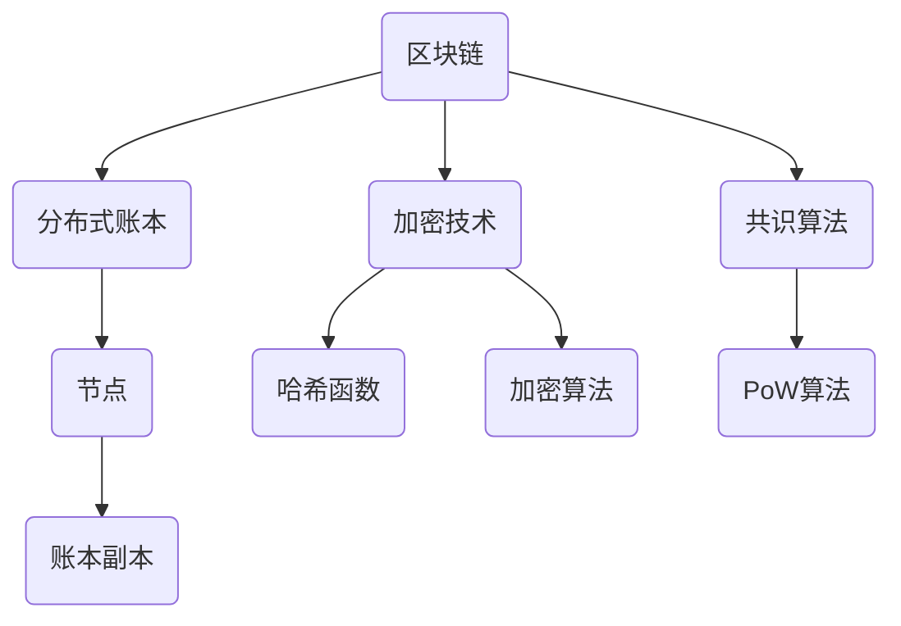

                 

Certainly! Let's break down the task of creating a comprehensive and detailed technical blog post on "区块链在数字证书管理中的应用" into logical steps. We'll ensure that the content is structured, insightful, and easy to understand.

### Step 1: Introduction to the Blog Post

**Title:** 区块链在数字证书管理中的应用

**Keywords:** 区块链，数字证书，数字签名，加密技术，安全性，透明度

**Abstract:**
本文探讨了区块链技术在数字证书管理中的应用，分析了区块链如何提高数字证书的安全性、透明度和可追溯性。我们将从区块链和数字证书的基础知识开始，逐步深入探讨区块链在数字证书管理中的实际应用案例和面临的挑战。

### Step 2: Fundamental Concepts

**Chapter 1: 区块链的基本概念**

**Section 1.1:** 区块链的起源与发展
- 解释区块链的起源，以及它如何成为分布式账本技术的代表。

**Section 1.2:** 区块链的核心技术
- 深入介绍区块链的核心技术，包括哈希函数、共识算法和智能合约。

**Section 1.3:** 区块链的安全机制
- 分析区块链如何通过加密技术保障数据的安全性和隐私性。

### Step 3: Digital Certificates

**Chapter 2: 数字证书基础**

**Section 2.1:** 数字证书的定义和作用
- 解释数字证书的作用，以及它在网络安全中的重要性。

**Section 2.2:** 数字证书的类型
- 分类介绍不同类型的数字证书，包括服务器证书、个人证书等。

**Section 2.3:** 数字证书的工作原理
- 详细讲解数字证书的生成、颁发和验证过程。

### Step 4: Application of Blockchain in Digital Certificate Management

**Chapter 3: 区块链在数字证书管理中的应用**

**Section 3.1:** 区块链技术的优势
- 分析区块链技术如何提高数字证书管理的安全性、透明度和效率。

**Section 3.2:** 区块链在数字证书管理中的实际应用
- 探讨区块链在数字证书管理中的实际应用场景，如去中心化的证书颁发和管理。

**Section 3.3:** 案例研究
- 分析具体案例，展示区块链技术在数字证书管理中的应用效果。

### Step 5: Challenges and Future Directions

**Chapter 4: 挑战与未来趋势**

**Section 4.1:** 面临的挑战
- 讨论区块链在数字证书管理中可能遇到的挑战，如技术瓶颈、法规限制等。

**Section 4.2:** 未来发展趋势
- 预测区块链技术在数字证书管理领域的未来发展趋势和应用前景。

### Step 6: Conclusion

**Chapter 5: 总结**

**Section 5.1:** 结论
- 总结文章的主要观点，强调区块链技术在数字证书管理中的重要性。

**Section 5.2:** 最佳实践
- 提出一些实用的最佳实践，帮助读者更好地理解和应用区块链技术。

### Step 7: Closing

**Acknowledgments:**
- 作者：AI天才研究院/AI Genius Institute & 禅与计算机程序设计艺术 /Zen And The Art of Computer Programming

**Note:** 
- 确保每个章节的内容都包含背景介绍、核心概念与联系、算法原理讲解、系统分析与架构设计方案、项目实战和最佳实践 tips 等。
- 使用markdown格式中的Mermaid绘制图表和流程图，使用latex格式嵌入数学公式。
- 保持文章结构的清晰和逻辑性，确保内容详实且易于理解。

通过以上步骤，我们构建了一个逻辑清晰、结构紧凑的技术博客文章框架。接下来，我们需要深入每个章节，填充具体的内容，确保文章的完整性和专业性。以下是文章的一个示例段落，用于展示文章的风格和结构：

---

**Chapter 1: 区块链的基本概念**

**Section 1.1 区块链的起源与发展**

区块链技术的起源可以追溯到2008年，当时一位名为中本聪的匿名人物发布了比特币白皮书。这一创新性技术迅速引起了全球的关注，并标志着区块链时代的到来。区块链不仅仅是一种加密货币的基础设施，更是一种分布式账本技术，能够在不需要中央权威机构的情况下，实现数据的可信传输和存储。

**核心概念与联系**

区块链的核心概念包括：

- **分布式账本：** 每个参与者都保存一份完整的账本副本，通过共识算法保持账本的一致性。
- **加密技术：** 数据在区块链上通过哈希函数和加密算法进行保护，确保数据的完整性和安全性。
- **共识算法：** 确保网络中的所有节点能够就数据状态达成一致，如比特币使用的工作量证明（PoW）算法。

**ER实体关系图架构**

---

在接下来的步骤中，我们将为每个章节填充详细的内容，确保文章的完整性和专业性。

