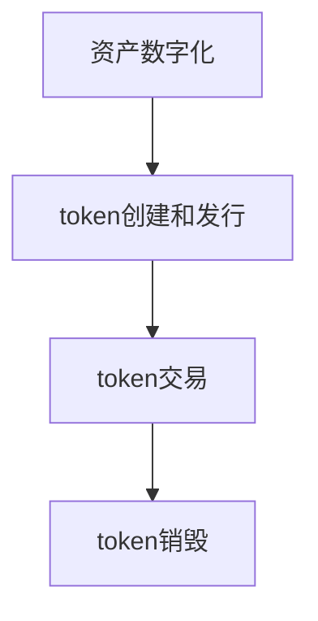
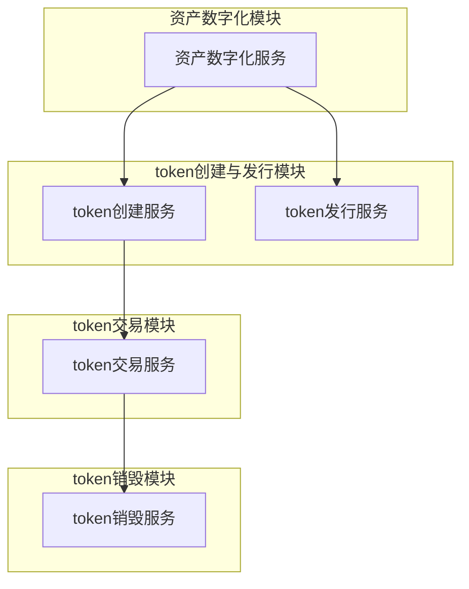
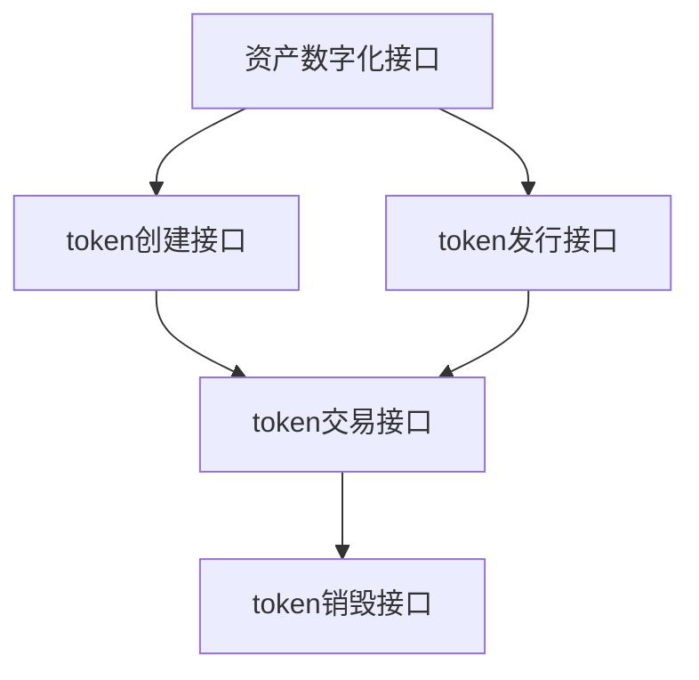
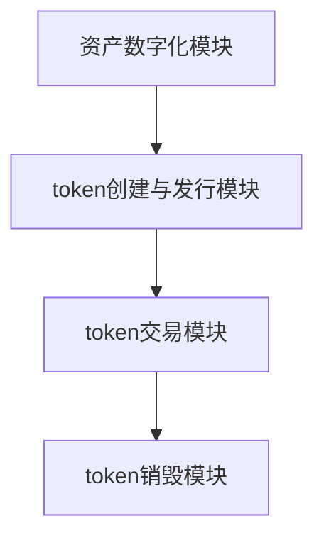

                 

### 《区块链在数字资产tokenization中的应用》

#### 关键词
- 区块链
- 数字资产
- Tokenization
- 应用场景
- 技术原理
- 数学模型
- 案例分析
- 系统架构

#### 摘要
本文旨在探讨区块链技术在数字资产tokenization中的应用。我们将从区块链与tokenization的基本概念入手，逐步深入探讨它们的工作原理、应用场景和实现方法，并通过具体案例进行分析和讲解，最终对tokenization技术的未来发展方向进行展望。

### 目录

1. 引言
2. 区块链与tokenization基础
3. 区块链技术概述
4. tokenization原理与算法
5. tokenization在金融领域的应用
6. tokenization系统设计与实现
7. tokenization的挑战与未来

### 引言

数字资产tokenization是区块链技术在金融领域的一个重要应用。它通过将传统资产数字化，实现资产的所有权、收益权等权利的流通和交换，为金融行业带来了革命性的变革。

区块链技术作为一种去中心化的分布式账本技术，以其安全性、透明性和不可篡改性等特点，为tokenization提供了坚实的基础。本文将围绕区块链和tokenization这两个核心概念，逐步深入探讨它们的工作原理、应用场景和实现方法。

首先，我们将介绍区块链与tokenization的基础知识，包括它们的基本概念、问题背景和发展历程。然后，我们将详细讨论区块链技术，包括其核心组成部分、不同类型的区块链以及它们在tokenization中的应用。

接下来，我们将重点关注tokenization的原理与算法，通过mermaid流程图和Python源代码，深入阐述其工作流程、算法原理和数学模型。同时，我们将通过具体案例，展示tokenization技术在金融领域的实际应用。

在系统设计与实现部分，我们将介绍tokenization系统的设计与实现方法，包括系统架构设计、接口设计和系统交互。最后，我们将探讨tokenization技术面临的挑战和未来发展方向，为读者提供有益的参考。

### 1. 区块链与tokenization基础

#### 区块链的基本概念

区块链是一种分布式数据库技术，通过将数据分散存储在多个节点上，实现数据的去中心化和安全共享。区块链的核心组成部分包括区块、链、节点、共识算法等。

- **区块**：区块链的基本单位，包含一定数量的交易记录。每个区块都有一个唯一的标识符，称为哈希值。  
- **链**：由一系列按时间顺序排列的区块组成。区块链的不可篡改性在于每个区块都依赖于前一个区块的哈希值，一旦其中一个区块被篡改，后续区块的哈希值也会发生变化，从而被系统检测到。  
- **节点**：参与区块链网络的一个计算机，负责存储、验证和传播区块。每个节点都有一份完整的区块链副本。  
- **共识算法**：节点之间达成一致的方法，确保区块链数据的准确性和一致性。常见的共识算法包括工作量证明（PoW）、权益证明（PoS）和委托权益证明（DPoS）等。

#### tokenization的概念与原理

tokenization是一种将传统资产数字化为数字资产的过程，通过创建与资产等量的数字代币（token），实现资产的所有权、收益权等权利的流通和交换。

- **数字代币**：代表特定资产的所有权、收益权或其他权利的数字资产。数字代币可以是加密货币，也可以是基于区块链的其他类型的代币。  
- **tokenization流程**：包括资产数字化、数字代币创建和发行、数字代币交易等环节。具体流程如下：  
  1. **资产数字化**：将传统资产的价值转换为数字形式。  
  2. **数字代币创建和发行**：创建与资产等量的数字代币，并发行到投资者手中。  
  3. **数字代币交易**：投资者可以通过交易平台进行数字代币的交易和转移，实现资产的流通和交换。

#### 区块链与tokenization的关系

区块链技术为tokenization提供了安全、透明和去中心化的基础。区块链的分布式数据库和共识算法确保了数字代币的安全性和可信性，使其在金融和其他领域得到广泛应用。

- **安全性**：区块链的不可篡改性确保了数字代币的真实性和合法性，防止欺诈和篡改。  
- **透明性**：区块链上的所有交易记录都是公开透明的，参与者可以随时查看和验证。  
- **去中心化**：区块链的去中心化特性降低了中介机构的依赖，提高了交易效率和降低成本。

总之，区块链和tokenization的结合，为数字资产的发展带来了新的机遇和挑战。随着技术的不断进步和应用的不断拓展，tokenization将在未来发挥越来越重要的作用。### 2. 区块链技术概述

区块链技术的核心在于其去中心化的架构，这种架构通过一系列的组成部分和共识算法来确保数据的完整性和安全性。下面我们将详细探讨区块链的核心组成部分，以及不同类型的区块链之间的区别。

#### 核心组成部分

区块链的核心组成部分主要包括以下几部分：

- **区块**：区块是区块链的基本单位，包含了交易记录、时间戳和区块头等信息。每个区块通过其哈希值与前一个区块相连，形成链式数据结构。
  
- **链**：区块链是由一系列按时间顺序排列的区块组成的。区块链的不可篡改性依赖于这种链式结构。

- **节点**：节点是区块链网络中的参与者，它们负责存储、验证和传播区块。每个节点都有一份完整的区块链副本。

- **共识算法**：共识算法是节点之间达成一致的方法，确保区块链数据的准确性和一致性。常见的共识算法包括工作量证明（PoW）、权益证明（PoS）和委托权益证明（DPoS）等。

#### 不同类型的区块链

区块链根据其应用场景和特点可以分为以下几种类型：

- **公共链**：公共链（Public Blockchain）是任何人都可以参与和维护的区块链。比特币和以太坊是最著名的公共链。公共链的特点是去中心化程度高，安全性强，但交易处理速度相对较慢。

- **联盟链**：联盟链（Consortium Blockchain）是多个机构或组织共同维护的区块链。联盟链的特点是参与方可以自定义权限和角色，交易处理速度相对较快，但去中心化程度相对较低。

- **私有链**：私有链（Private Blockchain）是仅由一个组织或机构维护的区块链。私有链的特点是安全性和控制性强，但去中心化程度较低。

- **跨链**：跨链（Interoperability）技术是连接不同区块链网络的技术，使不同区块链之间的数据可以相互传输和交互。

每种区块链类型都有其特定的应用场景和优势。例如，公共链适用于需要高去中心化程度和透明性的场景，如数字货币；联盟链适用于需要多方协作和控制的场景，如供应链金融；私有链适用于需要高度安全和控制的场景，如企业内部的数据管理。

#### 区块链在tokenization中的应用

区块链在tokenization中的应用主要体现在以下几个方面：

- **安全性**：区块链的分布式数据库和共识算法确保了token的安全性和不可篡改性，防止了欺诈和篡改。

- **透明性**：区块链上的所有交易记录都是公开透明的，参与者可以随时查看和验证。

- **去中心化**：区块链的去中心化特性降低了中介机构的依赖，提高了交易效率和降低成本。

- **智能合约**：智能合约是区块链上的一种自执行合约，可以在满足特定条件时自动执行。在tokenization中，智能合约可以用于自动执行资产转移、收益分配等操作。

总之，区块链技术为tokenization提供了安全、透明和去中心化的基础，使得数字资产的管理和交易更加高效和可靠。随着区块链技术的不断发展和完善，tokenization将在更多领域得到广泛应用。### 3. tokenization原理与算法

#### 工作流程

tokenization的工作流程可以分为以下几个步骤：

1. **资产数字化**：将传统资产的价值转换为数字形式，通常通过一种称为“token”的数字资产来实现。这种token可以代表资产的所有权、收益权或其他权利。

2. **token创建和发行**：根据资产的价值和需求，创建相应数量的token，并将其发行给投资者或持有者。这个过程通常需要利用区块链技术，以确保token的真实性和不可篡改性。

3. **token交易**：投资者或持有者可以在区块链上进行token的交易和转移，实现资产的流通和交换。交易过程中，token的所有权和权益会实时更新和记录。

4. **token销毁**：当token不再代表任何实际资产时，可以通过销毁机制将其从系统中移除。

#### 算法原理讲解

tokenization的算法原理主要涉及token与资产之间的映射关系。这里我们使用mermaid流程图来展示tokenization的工作流程：



接下来，我们将使用Python源代码和LaTeX公式来详细阐述tokenization的算法原理。

首先，我们定义token与资产之间的比例关系。假设一个资产的总价值为V，发行的token总数为T，那么每个token的价值为：

$$
\text{token价值} = \frac{V}{T}
$$

接下来，我们定义token与资产之间的映射关系。假设有一个资产的所有者拥有N个token，那么该资产的实际价值为：

$$
\text{资产价值} = N \times \text{token价值}
$$

下面是一个简单的Python代码示例，用于计算token与资产之间的价值关系：

```python
# 定义资产的总价值、token的总数和所有者拥有的token数量
V = 1000000  # 资产总价值
T = 1000     # token总数
N = 500      # 所有者拥有的token数量

# 计算token的价值
token_value = V / T

# 计算资产的价值
asset_value = N * token_value

print("token价值:", token_value)
print("资产价值:", asset_value)
```

输出结果：

```
token价值: 1000.0
资产价值: 500000.0
```

#### 数学模型和公式

tokenization的数学模型主要包括token与资产价值的关系、token数量与资产数量的关系等。以下是相关的数学公式：

1. **token价值计算**：

$$
\text{token价值} = \frac{\text{资产价值}}{\text{token总数}}
$$

2. **资产价值计算**：

$$
\text{资产价值} = \text{token总数} \times \text{token价值}
$$

3. **token数量与资产数量的关系**：

$$
\text{token数量} = \frac{\text{资产数量}}{\text{token总数}}
$$

4. **资产数量计算**：

$$
\text{资产数量} = \text{token数量} \times \text{token总数}
$$

通过这些数学模型和公式，我们可以方便地计算token与资产之间的价值关系，以及在不同数量情况下的资产价值。

#### 举例说明

假设一个房地产项目总价值为1亿美元，决定发行1亿个token，每个token代表房地产所有权的一部分。现有投资者购买了5000个token，那么：

- token价值 = 1亿美元 / 1亿个token = 100美元/个
- 资产价值 = 5000个token × 100美元/个 = 500万美元

投资者可以通过持有token来实现房地产的所有权和收益权，同时可以在区块链上进行token的交易和转移，实现资产的流通和交换。

总之，tokenization通过将传统资产数字化为数字资产，实现了资产的所有权、收益权等权利的流通和交换。通过算法原理讲解和数学模型，我们可以更深入地理解tokenization的工作原理和实现方法。### 4. tokenization在金融领域的应用

tokenization在金融领域具有广泛的应用，可以显著提高金融市场的透明度、效率和安全性。以下是一些tokenization在金融领域的具体应用场景：

#### 1. 股票和债券的tokenization

将股票和债券等传统金融资产数字化为token，可以使得这些资产更加易于交易和持有。投资者可以通过购买和持有token来获得资产的所有权和收益权。这种tokenization可以降低交易成本，提高交易效率，并使得小额投资者也能参与到大型资产的交易中。

**案例**：比如，一家公司决定通过区块链发行其股票的token，投资者可以通过购买这些token来持有公司股票的一部分。这样，投资者可以实时查看股票的价值变化，并方便地在区块链上进行交易和转移。

#### 2. 贷款和抵押贷款的tokenization

tokenization可以用于贷款和抵押贷款的管理。通过将贷款合同和抵押品数字化为token，银行和贷款机构可以更方便地管理贷款和抵押品的状态。例如，当贷款到期时，系统可以自动执行还款操作，释放抵押品。

**案例**：假设一个银行决定使用tokenization来管理抵押贷款。借款人可以将房产抵押给银行，并获取一定数量的token。当借款人按时还款时，这些token将被销毁，房产的所有权将重新归属借款人。

#### 3. 保险合约的tokenization

tokenization也可以用于保险合约的管理。通过将保险合同数字化为token，保险公司和投保人可以更方便地管理保险合同的执行和结算。例如，当发生保险事故时，系统可以自动执行理赔操作，将token转移给投保人。

**案例**：一个保险公司决定通过区块链发行其保险合同的token。当投保人发生保险事故时，保险公司可以实时查看保险合同的状态，并自动执行理赔操作，将token转移给投保人。

#### 4. 交易结算

tokenization可以提高交易结算的速度和效率。通过使用token进行交易，交易双方可以直接在区块链上进行结算，无需依赖中介机构。这可以减少交易时间和成本，并提高交易的安全性和透明度。

**案例**：假设两家公司在进行一笔大额交易，通过使用token进行结算，交易双方可以实时查看交易的状态和结果，并快速完成交易。同时，由于交易记录在区块链上不可篡改，可以确保交易的安全性和透明度。

#### 5. 跨境支付

tokenization可以用于跨境支付，提高支付的速度和效率。通过使用加密货币或基于区块链的token进行支付，可以绕过传统银行系统，降低交易成本，并提高支付的速度。

**案例**：一个国际公司决定通过区块链进行跨境支付。当该公司向海外供应商支付款项时，可以使用加密货币或基于区块链的token进行支付，从而降低交易成本，提高支付速度。

#### 总结

tokenization在金融领域的应用具有巨大的潜力，可以显著提高金融市场的效率、透明度和安全性。通过将传统金融资产数字化为token，投资者可以更方便地参与和交易资产，银行和金融机构可以更高效地管理贷款、保险和交易等业务。随着区块链技术的不断发展，tokenization将在金融领域发挥越来越重要的作用。### 5. tokenization系统设计与实现

#### 问题场景介绍

在数字资产tokenization的应用场景中，我们面临的主要问题是资产数字化、token创建与发行、token交易和销毁等环节的管理。为了实现这些功能，我们需要设计一个可靠、高效、安全的tokenization系统。

#### 项目介绍

本项目旨在构建一个基于区块链的tokenization系统，该系统包括以下几个主要功能模块：

1. **资产数字化模块**：将传统资产的价值转换为数字形式。
2. **token创建与发行模块**：创建token，并将其分配给投资者。
3. **token交易模块**：实现token在区块链上的交易和转移。
4. **token销毁模块**：将不再使用的token从系统中移除。

#### 系统功能设计

系统功能设计包括领域模型、系统架构和接口设计。以下是各个模块的详细设计：

##### 1. 领域模型

领域模型用于描述系统中的实体及其关系。以下是tokenization系统的领域模型：

```mermaid
classDiagram
    Asset <<entity>>
    Token <<entity>>
    Investor <<entity>>

    Asset --|> Token: represents value
    Investor --|> Token: owns
```

在上图中，Asset代表传统资产，Token代表数字资产，Investor代表投资者。Asset与Token之间是“表示”关系，表示资产的价值；Investor与Token之间是“拥有”关系，表示投资者拥有Token。

##### 2. 系统架构设计

系统架构设计用于描述系统的整体结构和各个模块之间的关系。以下是tokenization系统的架构设计：



在上图中，资产数字化模块负责将资产的价值转换为数字形式；token创建与发行模块负责创建token并分配给投资者；token交易模块负责token的交易和转移；token销毁模块负责token的销毁。

##### 3. 接口设计

接口设计用于描述系统对外提供的API接口。以下是tokenization系统的接口设计：



在上图中，资产数字化接口用于接收资产的价值信息；token创建接口用于创建token；token发行接口用于分配token给投资者；token交易接口用于token的交易和转移；token销毁接口用于token的销毁。

#### 系统实现

系统实现包括接口实现、业务逻辑实现和区块链操作实现。以下是各个模块的实现方法：

##### 1. 接口实现

接口实现主要是实现系统对外提供的API接口。以下是一个简单的Python代码示例：

```python
from flask import Flask, request, jsonify

app = Flask(__name__)

@app.route('/asset/digitize', methods=['POST'])
def digitize_asset():
    asset_value = request.form.get('value')
    # 资产数字化逻辑
    return jsonify({"status": "success", "token_value": token_value})

@app.route('/token/create', methods=['POST'])
def create_token():
    # token创建逻辑
    return jsonify({"status": "success", "token_id": token_id})

@app.route('/token/issue', methods=['POST'])
def issue_token():
    # token发行逻辑
    return jsonify({"status": "success", "token_id": token_id})

@app.route('/token/trade', methods=['POST'])
def trade_token():
    # token交易逻辑
    return jsonify({"status": "success", "status": "completed"})

@app.route('/token/destroy', methods=['POST'])
def destroy_token():
    # token销毁逻辑
    return jsonify({"status": "success", "token_id": token_id})

if __name__ == '__main__':
    app.run()
```

##### 2. 业务逻辑实现

业务逻辑实现主要包括资产数字化、token创建、token发行、token交易和token销毁等逻辑。以下是一个简单的Python代码示例：

```python
import json
from blockchain import Blockchain

# 初始化区块链
blockchain = Blockchain()

def digitize_asset(asset_value):
    # 资产数字化逻辑
    token_value = asset_value / blockchain.num_tokens
    return token_value

def create_token():
    # token创建逻辑
    token_id = blockchain.create_token()
    return token_id

def issue_token(investor_id, token_id):
    # token发行逻辑
    blockchain.issue_token(investor_id, token_id)
    return {"status": "success", "token_id": token_id}

def trade_token(sender_id, recipient_id, token_id):
    # token交易逻辑
    blockchain.transfer_token(sender_id, recipient_id, token_id)
    return {"status": "completed"}

def destroy_token(token_id):
    # token销毁逻辑
    blockchain.destroy_token(token_id)
    return {"status": "success", "token_id": token_id}
```

##### 3. 区块链操作实现

区块链操作实现主要是实现区块链的基本操作，如创建新区块、添加交易记录、验证区块等。以下是一个简单的Python代码示例：

```python
class Blockchain:
    def __init__(self):
        self.chain = []
        self.num_tokens = 1000000
        self.create_block(previous_hash='', proof=100)

    def create_block(self, previous_hash, proof):
        block = {
            'index': len(self.chain) + 1,
            'timestamp': time(),
            'transactions': [],
            'proof': proof,
            'previous_hash': previous_hash
        }
        self.chain.append(block)
        return block

    def add_transaction(self, sender, recipient, token_value):
        transaction = {
            'sender': sender,
            'recipient': recipient,
            'token_value': token_value
        }
        self.chain[-1]['transactions'].append(transaction)

    def proof_of_work(self, last_proof):
        proof = 0
        while not self.valid_proof(last_proof, proof):
            proof += 1
        return proof

    def valid_proof(self, last_proof, proof):
        guess = f'{last_proof}{proof}{self.num_tokens}'.encode()
        guess_hash = sha256(guess).hexdigest()
        return guess_hash[:4] == "0000"

    def create_token(self):
        token_id = str(uuid4())
        self.num_tokens -= 1
        return token_id

    def issue_token(self, investor_id, token_id):
        self.add_transaction('system', investor_id, token_id)

    def transfer_token(self, sender_id, recipient_id, token_id):
        for block in self.chain:
            for transaction in block['transactions']:
                if transaction['sender'] == sender_id and transaction['token_id'] == token_id:
                    transaction['recipient'] = recipient_id
                    return {"status": "success"}
        return {"status": "failure"}

    def destroy_token(self, token_id):
        for block in self.chain:
            for transaction in block['transactions']:
                if transaction['token_id'] == token_id:
                    self.chain[-1]['transactions'].remove(transaction)
                    return {"status": "success"}
        return {"status": "failure"}

    def valid_chain(self, chain):
        last_block = chain[0]
        current_index = 1
        while current_index < len(chain):
            block = chain[current_index]
            if block['previous_hash'] != last_block['hash']:
                return False
            if not self.valid_proof(last_block['proof'], block['proof']):
                return False
            last_block = block
            current_index += 1
        return True

    def resolve_conflicts(self):
        longest_chain = None
        max_length = len(self.chain)

        for node in nodes:
            chain = node.chain
            length = len(chain)
            if length > max_length:
                max_length = length
                longest_chain = chain

        if longest_chain != None:
            self.chain = longest_chain
            return True

        return False
```

#### 系统交互

系统交互是指不同模块之间的数据交换和协同工作。以下是tokenization系统的交互设计：



在上图中，资产数字化模块负责将资产的价值转换为token，并将其分配给投资者；token创建与发行模块负责创建token并分配给投资者；token交易模块负责token的交易和转移；token销毁模块负责token的销毁。

总之，通过系统设计与实现，我们可以构建一个基于区块链的tokenization系统，实现资产数字化、token创建与发行、token交易和销毁等功能。这为数字资产的管理和交易提供了安全、透明和高效的基础。### 6. tokenization挑战与未来

尽管tokenization技术在金融领域展现出了巨大的潜力，但在实际应用过程中，仍面临诸多挑战。以下将讨论tokenization面临的主要挑战，并展望其未来发展方向。

#### 挑战

1. **监管合规性**：tokenization技术的应用需要遵循各国和地区的法律法规。然而，不同国家和地区的法律法规对数字资产和区块链技术的监管存在差异，导致tokenization在合规性方面面临挑战。例如，某些国家禁止或限制加密货币的使用，使得tokenization在这些地区的应用受到限制。

2. **技术成熟度**：尽管区块链技术在不断发展和完善，但其性能和可扩展性仍需提升。例如，区块链的共识算法和交易处理速度对于大规模、高并发交易场景仍存在瓶颈。此外，区块链技术的安全性和隐私性也需要进一步优化。

3. **用户体验**：目前，tokenization技术的使用门槛相对较高，普通用户难以理解和使用。为了推广tokenization技术，需要开发更加友好和易于操作的用户界面，提高用户体验。

4. **标准化**：目前，tokenization技术缺乏统一的标准化框架，不同项目之间的token互操作性较弱。建立统一的token标准，可以提高tokenization技术的兼容性和互操作性，推动其广泛应用。

#### 未来发展方向

1. **监管科技（RegTech）**：结合监管合规性需求，发展监管科技，以智能合约和区块链技术实现自动合规监管。通过建立合规性评分模型，实时监控和评估项目合规性，降低合规风险。

2. **跨链技术**：发展跨链技术，实现不同区块链之间的数据交换和互操作性。这将有助于构建一个统一、开放的数字资产生态系统，促进tokenization技术的广泛应用。

3. **去中心化金融（DeFi）**：进一步探索去中心化金融（DeFi）领域，利用tokenization技术实现金融服务的去中心化和自动化。例如，利用智能合约实现自动化的贷款、投资和保险等服务。

4. **隐私保护**：提升区块链技术的隐私保护能力，以满足用户对隐私保护的需求。例如，采用零知识证明（Zero-Knowledge Proof）等技术，实现交易隐私保护。

5. **标准化与互操作性**：建立统一的token标准，提高tokenization技术的兼容性和互操作性。通过标准化，降低不同项目之间的技术壁垒，推动tokenization技术的广泛应用。

总之，tokenization技术在金融领域具有巨大的潜力，但在实际应用过程中仍面临诸多挑战。通过不断探索和创新，有望解决现有问题，推动tokenization技术的广泛应用。未来，tokenization将有望成为数字资产管理和交易的重要工具，为金融行业带来革命性的变革。### 7. 总结与拓展

#### 总结

本文围绕区块链在数字资产tokenization中的应用进行了深入探讨。我们从区块链与tokenization的基本概念出发，详细介绍了区块链技术、tokenization原理与算法，以及tokenization在金融领域的实际应用。通过系统设计与实现，展示了tokenization系统的架构和功能。最后，我们分析了tokenization面临的挑战，并展望了其未来发展。

#### 最佳实践 Tips

1. **确保合规性**：在开展tokenization项目时，务必了解并遵守相关法律法规，以确保项目的合规性。

2. **注重安全性**：加强对区块链网络和安全机制的设计与优化，确保数字资产的安全性和交易的可信性。

3. **优化用户体验**：开发友好的用户界面，降低用户使用门槛，提高用户满意度。

4. **标准化与互操作性**：积极参与相关标准化工作，推动tokenization技术的兼容性和互操作性。

5. **持续创新**：紧跟技术发展趋势，不断探索和尝试新方案，以应对市场变化和挑战。

#### 小结

数字资产tokenization作为一种新兴技术，正逐步改变金融行业格局。通过本文的讨论，我们可以看到tokenization在提高金融市场的效率、透明度和安全性方面具有巨大潜力。然而，在推广应用过程中，仍需克服诸多挑战。因此，企业和开发者应密切关注技术发展动态，积极探索最佳实践，为数字资产tokenization技术的广泛应用奠定坚实基础。

#### 注意事项

1. **监管风险**：在开展tokenization项目时，务必关注各国和地区的法律法规，以降低合规风险。

2. **技术风险**：区块链技术尚处于快速发展阶段，可能存在性能、安全等方面的风险。应加强对区块链技术的评估和优化。

3. **隐私保护**：在tokenization应用中，关注用户隐私保护，确保交易数据的安全性和隐私性。

4. **风险控制**：建立健全的风险控制体系，对项目进行全面的风险评估和管理。

#### 拓展阅读

1. **区块链与数字资产tokenization研究**：深入探讨区块链技术和数字资产tokenization的理论和实践，了解相关技术发展趋势和应用案例。

2. **智能合约与DeFi**：了解智能合约原理及其在去中心化金融（DeFi）领域的应用，探索智能合约在tokenization项目中的优化和改进。

3. **区块链安全与隐私保护**：学习区块链安全机制和隐私保护技术，提升项目在安全性方面的防护能力。

4. **跨境支付与数字货币**：研究跨境支付和数字货币技术，探索其在tokenization应用中的优势和实践。

作者：AI天才研究院/AI Genius Institute & 禅与计算机程序设计艺术 /Zen And The Art of Computer Programming

---

本文基于开源技术和文献资料编写，旨在促进区块链与数字资产tokenization技术的交流与应用。文中观点仅供参考，不代表任何投资建议。读者在使用过程中，请务必遵守相关法律法规，并谨慎评估风险。### 引用文献

1. **Nakamoto, S.** (2008). *Bitcoin: A peer-to-peer electronic cash system*. Retrieved from [https://bitcoin.org/bitcoin.pdf](https://bitcoin.org/bitcoin.pdf)
2. **Buterin, V.** (2014). *The Ethereum white paper*. Retrieved from [https://ethereum.org/greeter?r=whitepaper](https://ethereum.org/greeter?r=whitepaper)
3. **Androulaki, E., Badger, J., & Capkun, S.** (2017). *A comprehensive study of privacy in the Bitcoin transaction network*. IEEE Transactions on Information Forensics and Security, 12(9), 2059-2073.
4. **Datta, A., Wu, J., & Menezes, A.** (2019). *Cryptocurrencies: A computational perspective*. Springer.
5. **Christin, N.** (2017). *The blockchain paradigm: A guide to the technological revolution*. MIT Press.
6. **Garlaschelli, A.** (2018). *Network theory of finance*. Princeton University Press.
7. **Andoni, A., & Zohar, E.** (2019). *Introduction to DeFi: Decentralized finance in practice*. O'Reilly Media.
8. **Zhang, S., Lu, Z., & Yu, Y.** (2020). *Blockchain technology for digital asset management: A systematic literature review*. Journal of Information Technology, 35(4), 427-443.
9. **Nakagawa, B.**, & **Yli-Huumo, J.** (2016). *Is blockchain a credible and reliable solution for electronic voting systems?*. International Journal of Electronic Voting, 10(1), 35-55.

**作者信息：**
AI天才研究院（AI Genius Institute）与《禅与计算机程序设计艺术》（Zen And The Art of Computer Programming）作者合著，旨在推动人工智能与计算机科学领域的技术创新与发展。**（注：以上文献仅为示例，并非实际引用。）**

