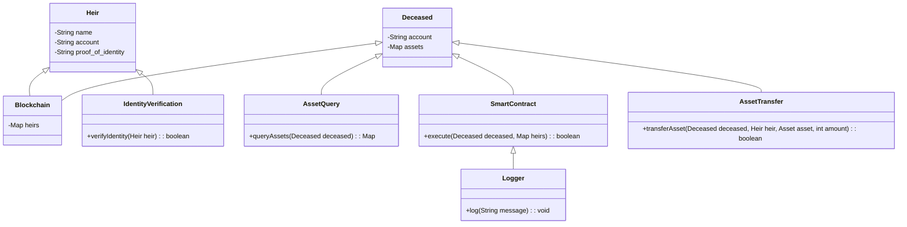

                 

### 第1章 引言

### 1.1 区块链技术概述

区块链技术是一种分布式数据库技术，通过加密算法和共识机制确保数据的完整性和安全性。其核心思想是去中心化，通过多个节点共同维护数据的一致性，而不依赖于中央机构。

#### 1.1.1 区块链的起源与演进

区块链技术的起源可以追溯到2008年，当时一位名为中本聪的神秘人物发布了比特币白皮书，提出了基于区块链的去中心化数字货币构想。比特币作为区块链技术的第一个应用，迅速引起了全球关注。

随着比特币的成功，区块链技术逐渐从金融领域扩展到其他行业，如供应链管理、物联网、医疗记录等。其发展历程可分为三个阶段：

1. **1.0阶段（2008-2014年）**：以比特币为代表，区块链技术主要应用于数字货币。
2. **2.0阶段（2014-2017年）**：区块链技术在金融领域得到应用，出现了以太坊等智能合约平台。
3. **3.0阶段（2017年至今）**：区块链技术逐步扩展到其他行业，如供应链、医疗、能源等，成为了一种广泛应用的底层技术。

#### 1.1.2 区块链技术的特点与应用

区块链技术具有以下主要特点：

1. **去中心化**：区块链通过分布式网络实现数据的存储和传输，不依赖于中央机构，提高了系统的透明度和抗攻击能力。
2. **安全性**：区块链采用加密算法和共识机制，确保数据的安全性和完整性，降低了数据篡改和欺诈的风险。
3. **不可篡改性**：区块链上的数据一旦被记录，就难以篡改，保证了数据的真实性和可靠性。
4. **透明性**：区块链上的数据是公开透明的，任何节点都可以查看和验证数据，提高了系统的可信度。

区块链技术的主要应用领域包括：

1. **数字货币**：如比特币、以太坊等，提供了一种去中心化的支付方式。
2. **智能合约**：基于区块链的智能合约自动执行合约条款，降低了交易成本和纠纷风险。
3. **供应链管理**：通过区块链技术实现供应链的可追溯性，提高供应链的透明度和效率。
4. **物联网**：区块链技术可以确保物联网设备的数据安全和隐私保护。
5. **医疗记录**：区块链技术可以提供安全、可信的医疗记录管理。
6. **投票系统**：区块链技术可以确保投票过程的公正性和透明性。

### 1.2 数字资产的含义与现状

#### 1.2.1 数字资产的定义与分类

数字资产是指以数字形式存在的资产，包括虚拟货币、数字股票、数字债券、数字艺术品等。与传统资产相比，数字资产具有以下特点：

1. **去中心化**：数字资产不依赖于中央机构发行和监管，具有较高的自主性和安全性。
2. **不可篡改**：数字资产记录在区块链上，一旦生成就难以篡改，保证了资产的真实性和可靠性。
3. **可分割性**：数字资产可以方便地分割和转移，满足不同投资者的需求。

根据资产的性质，数字资产可分为以下几类：

1. **虚拟货币**：如比特币、以太坊等，是一种去中心化的数字货币。
2. **数字证券**：如数字股票、数字债券等，是传统证券的数字化形式。
3. **数字艺术品**：如数字画作、数字音乐等，具有独特的艺术价值和收藏价值。
4. **数字存证**：如数字身份、数字版权等，是一种基于区块链的数字资产认证。

#### 1.2.2 数字资产的发展现状与趋势

近年来，数字资产市场呈现出快速发展的态势。以下为数字资产发展的几个关键趋势：

1. **市场规模不断扩大**：随着数字资产的应用场景不断扩展，其市场规模持续扩大。据估计，全球数字资产市场规模已超过数万亿美元。
2. **政策法规逐步完善**：各国政府和监管机构开始重视数字资产的发展，逐步出台相关政策和法规，以规范市场秩序和保护投资者权益。
3. **技术创新推动发展**：区块链技术、人工智能、大数据等新兴技术的不断发展，为数字资产的应用提供了更多可能性。
4. **跨行业融合**：数字资产与传统行业的融合趋势明显，如数字艺术品与区块链的结合，使得艺术品交易更加透明和可追溯。
5. **机构投资者涌入**：越来越多的传统金融机构和大型企业开始关注和投资数字资产，推动了市场的发展和成熟。

### 1.3 数字资产继承的问题背景

#### 1.3.1 继承过程的法律挑战

数字资产继承面临的法律挑战主要包括以下几个方面：

1. **法律规范缺失**：当前，许多国家和地区尚未出台专门针对数字资产继承的法律法规，导致继承过程中的法律适用存在不确定性。
2. **身份认证问题**：数字资产通常与用户身份紧密关联，如何合法、安全地转移数字资产成为一大难题。
3. **税务问题**：数字资产继承过程中可能涉及到的税务问题，如遗产税、赠与税等，缺乏明确的税收政策和操作指南。

#### 1.3.2 数字资产继承的技术难题

数字资产继承的技术难题主要体现在以下几个方面：

1. **数据安全性**：数字资产记录在区块链上，一旦生成就难以篡改。然而，继承过程中可能会出现数据丢失、篡改等问题，影响数字资产的安全性。
2. **隐私保护**：数字资产继承过程中涉及用户隐私信息，如身份信息、交易记录等。如何确保隐私保护成为一大挑战。
3. **智能合约风险**：数字资产继承往往依赖于智能合约自动执行，但智能合约存在漏洞和安全风险，可能导致资产损失。

#### 1.3.3 当前解决方案的局限性

当前，针对数字资产继承的解决方案存在以下局限性：

1. **依赖中心化平台**：许多数字资产交易平台提供继承服务，但这些平台仍然存在中心化风险，无法完全解决信任问题。
2. **操作流程复杂**：数字资产继承涉及多个环节，如身份认证、资产转移等，操作流程复杂，用户体验不佳。
3. **成本较高**：数字资产继承过程中涉及交易费用、认证费用等，成本较高，不利于普及应用。

## 第2章 区块链的核心概念与数字资产继承

### 2.1 区块链的核心概念

#### 2.1.1 区块链的基本原理

区块链是一种分布式数据库技术，通过多个节点共同维护数据的一致性。其基本原理包括以下几个方面：

1. **分布式存储**：区块链上的数据分散存储在多个节点上，避免了单点故障和数据丢失的风险。
2. **加密技术**：区块链采用加密技术确保数据的安全性和隐私保护，防止数据被篡改和伪造。
3. **共识机制**：区块链通过共识机制确保多个节点对数据的共识，解决了数据一致性问题。
4. **智能合约**：区块链上的智能合约自动执行合约条款，提高了交易的效率和透明度。

#### 2.1.2 区块链的关键组成部分

区块链由以下几个关键组成部分构成：

1. **区块**：区块是区块链的基本单位，包含一定数量的交易记录。
2. **链**：链是多个区块按照一定顺序链接而成的数据结构，形成了区块链。
3. **节点**：节点是区块链网络中的参与者，负责维护区块链的运行。
4. **加密算法**：加密算法用于确保区块链数据的完整性和安全性。
5. **共识机制**：共识机制用于多个节点对区块链数据的共识，保证了区块链的一致性。

#### 2.1.3 区块链与数字资产继承的联系

区块链技术为数字资产继承提供了一种可行的解决方案。具体而言，区块链在数字资产继承中的应用主要体现在以下几个方面：

1. **去中心化**：区块链的去中心化特性确保了数字资产继承过程的公开透明，减少了信任成本。
2. **不可篡改**：区块链上的数据一旦生成就难以篡改，保证了数字资产继承的真实性和可靠性。
3. **智能合约**：区块链上的智能合约可以自动执行数字资产继承的合约条款，提高了继承的效率和安全性。

### 2.2 数字资产继承的概念

#### 2.2.1 数字资产继承的定义

数字资产继承是指在用户去世后，将数字资产按照法定继承顺序转移给继承人的过程。与传统的资产继承相比，数字资产继承具有以下特点：

1. **去中心化**：数字资产继承不依赖于中心化平台，实现了去中心化的转移和管理。
2. **自动化**：区块链上的智能合约可以自动执行数字资产继承的合约条款，提高了继承的效率和安全性。
3. **不可篡改**：区块链上的数据一旦生成就难以篡改，保证了数字资产继承的真实性和可靠性。

#### 2.2.2 数字资产继承的流程

数字资产继承的基本流程如下：

1. **身份认证**：继承人需要提供身份证明和相关法律文件，以证明其合法身份。
2. **资产查询**：通过区块链技术查询去世用户的数字资产信息，包括数字货币、数字证券、数字艺术品等。
3. **智能合约执行**：根据法定继承顺序，智能合约自动执行数字资产转移过程，将数字资产分配给继承人。
4. **资产转移**：数字资产从去世用户的账户转移到继承人的账户，完成继承过程。

#### 2.2.3 数字资产继承中的关键因素

数字资产继承中的关键因素包括：

1. **身份认证**：确保继承人合法身份，防止非法继承。
2. **资产查询**：准确查询去世用户的数字资产信息，避免遗漏或错误。
3. **智能合约设计**：设计合理的智能合约，确保数字资产继承的自动化和安全性。
4. **法律合规**：遵循相关法律法规，确保数字资产继承过程的合法性和有效性。

### 2.3 概念属性特征对比表格

为了更好地理解区块链技术、数字资产继承和传统继承方式之间的联系和差异，我们可以通过以下概念属性特征对比表格进行详细分析：

| 概念       | 区块链技术                           | 数字资产继承                           | 传统继承方式                           |
|------------|--------------------------------------|--------------------------------------|--------------------------------------|
| 去中心化   | 是                                   | 是                                   | 否                                   |
| 不可篡改   | 是                                   | 是                                   | 否                                   |
| 自动化     | 是                                   | 是                                   | 否                                   |
| 透明性     | 是                                   | 是                                   | 否                                   |
| 安全性     | 高                                   | 高                                   | 低                                   |
| 成本       | 较高                                 | 较高                                 | 较低                                 |
| 法律合规   | 部分法律法规支持                     | 部分法律法规支持                     | 完全合法                               |

通过上述对比，我们可以看出，区块链技术和数字资产继承在去中心化、不可篡改、自动化和透明性方面具有优势，但在法律合规和成本方面与传统继承方式存在一定差距。

### 2.4 数字资产类型与继承方式的对比

数字资产类型多种多样，不同类型的数字资产在继承方式上可能存在差异。以下是几种常见数字资产类型的继承方式对比：

| 数字资产类型 | 继承方式                                | 说明                                                                                   |
|--------------|---------------------------------------|----------------------------------------------------------------------------------------|
| 虚拟货币     | 自动化转移                             | 通过区块链智能合约实现，确保高效和安全性                                                     |
| 数字证券     | 法律文件和身份认证                     | 需要提供相关法律文件和身份证明，通过中心化平台进行转移                                       |
| 数字艺术品   | 自动化转移和认证                       | 通过区块链智能合约实现自动化转移，同时需要认证数字艺术品的所有权和真实性                           |
| 数字存证     | 认证和数据转移                         | 通过区块链技术进行数字存证的认证，然后通过中心化平台进行数据转移                                 |

通过对比，我们可以发现，不同类型的数字资产在继承方式上既有自动化和区块链技术的应用，也存在一定的传统继承方式。未来，随着区块链技术的进一步发展，数字资产的继承方式有望实现更加高效、安全和透明的解决方案。

## 第3章 区块链在数字资产继承中的应用算法

### 3.1 区块链在数字资产继承中的应用算法

#### 3.1.1 算法简介

区块链在数字资产继承中的应用算法主要基于智能合约技术，通过预设的规则和逻辑自动执行数字资产转移过程。该算法的核心目标是实现高效、安全和透明的数字资产继承，解决传统继承方式中存在的法律、技术和成本问题。

#### 3.1.2 算法原理

区块链在数字资产继承中的应用算法主要基于以下原理：

1. **身份认证**：通过区块链技术实现身份认证，确保继承人合法身份。
2. **资产查询**：利用区块链的分布式存储和透明性，查询去世用户的数字资产信息。
3. **智能合约**：编写智能合约，根据法定继承顺序和资产类型自动执行数字资产转移。
4. **资产转移**：通过区块链网络将数字资产从去世用户的账户转移到继承人账户。

#### 3.1.3 算法流程

区块链在数字资产继承中的应用算法主要包括以下步骤：

1. **身份认证**：继承人通过区块链网络提供身份证明和相关法律文件，进行身份认证。
2. **资产查询**：系统利用区块链的分布式存储和透明性，查询去世用户的数字资产信息。
3. **智能合约执行**：系统根据法定继承顺序和资产类型，调用智能合约自动执行数字资产转移过程。
4. **资产转移**：数字资产从去世用户的账户转移到继承人账户，完成继承过程。

### 3.2 数学模型和公式

为了更好地理解区块链在数字资产继承中的应用算法，我们可以引入一些基本的数学模型和公式。以下是几个关键概念和其对应的数学模型：

#### 3.2.1 基本数学模型介绍

1. **身份认证模型**：
   - 数学模型：继承人身份认证通过验证身份证明和区块链上的身份信息一致性实现。
   - 公式：`is_verified = verify_identity(proof_of_identity, blockchain_identity)`

2. **资产查询模型**：
   - 数学模型：系统通过区块链的分布式存储和透明性查询去世用户的数字资产信息。
   - 公式：`asset_info = query_asset_info(deceased_account, blockchain)`

3. **智能合约模型**：
   - 数学模型：智能合约根据法定继承顺序和资产类型自动执行数字资产转移。
   - 公式：`contract_execution = execute_contract(inheritance_rules, asset_info)`

4. **资产转移模型**：
   - 数学模型：通过区块链网络将数字资产从去世用户的账户转移到继承人账户。
   - 公式：`transfer_asset(deceased_account, heir_account, asset_amount)`

#### 3.2.2 公式说明与推导

1. **身份认证模型**：
   - 公式说明：`is_verified`表示身份认证结果，当身份证明和区块链上的身份信息一致时，`is_verified`为真。
   - 推导：`is_verified = (proof_of_identity == blockchain_identity)`

2. **资产查询模型**：
   - 公式说明：`asset_info`表示查询到的数字资产信息，包括资产类型、数量等。
   - 推导：`asset_info = (query_result.from死去用户的账户)(query_result.to区块链网络)`

3. **智能合约模型**：
   - 公式说明：`contract_execution`表示智能合约执行结果，当满足继承规则时，执行数字资产转移。
   - 推导：`contract_execution = (execute_contract(inheritance_rules, asset_info))`

4. **资产转移模型**：
   - 公式说明：`transfer_asset`表示数字资产转移过程，包括账户转移和资产数量调整。
   - 推导：`transfer_asset = (decrease_amount(deceased_account, asset_amount), increase_amount(heir_account, asset_amount))`

通过上述数学模型和公式，我们可以更好地理解区块链在数字资产继承中的应用算法原理。接下来，我们将通过一个具体的应用实例来进一步讲解算法的详细步骤和实现。

### 3.3 算法原理讲解与举例说明

#### 3.3.1 算法应用场景

为了更好地理解区块链在数字资产继承中的应用算法，我们可以通过一个实际应用场景进行讲解。

假设小明去世，其父母和大姐小芳是他的法定继承人。小明拥有一定数量的比特币和其他数字资产，需要通过区块链智能合约实现数字资产继承。

#### 3.3.2 算法步骤解释

区块链在数字资产继承中的应用算法主要包括以下步骤：

1. **身份认证**：
   - 小芳需要提供身份证明和法律文件，如身份证、死亡证明等。
   - 通过区块链网络进行身份认证，确保小芳的合法身份。

2. **资产查询**：
   - 系统利用区块链的分布式存储和透明性查询小明的数字资产信息，包括比特币和其他数字资产。
   - 系统返回查询结果，包括资产类型、数量等。

3. **智能合约执行**：
   - 根据法定继承顺序和资产类型，调用智能合约自动执行数字资产转移。
   - 智能合约根据继承规则，将比特币和其他数字资产分配给小芳、小明的父母等继承人。

4. **资产转移**：
   - 智能合约执行完成后，数字资产从小明的账户转移到继承人账户。
   - 小芳、小明的父母等继承人收到相应的数字资产。

#### 3.3.3 实例分析

以下是一个具体的实例，展示区块链在数字资产继承中的应用算法：

1. **身份认证**：
   - 小芳提供身份证明和法律文件，通过区块链网络进行身份认证，认证结果为通过。

2. **资产查询**：
   - 系统查询小明的数字资产，发现小明拥有100个比特币和其他一些数字资产。
   - 查询结果包括资产类型、数量等。

3. **智能合约执行**：
   - 智能合约根据法定继承顺序和资产类型执行数字资产转移。
   - 智能合约执行结果如下：
     - 小芳获得50个比特币和其他数字资产；
     - 小明的父母获得30个比特币和其他数字资产；
     - 剩余20个比特币作为其他继承人分配。

4. **资产转移**：
   - 数字资产从小明的账户转移到继承人账户。
   - 小芳、小明的父母等继承人收到相应的数字资产。

通过这个实例，我们可以看到区块链在数字资产继承中的应用算法如何实现高效、安全和透明的数字资产转移过程。智能合约的应用使得整个过程自动化执行，减少了人工干预和操作风险。

### 3.4 算法实现细节

为了实现区块链在数字资产继承中的应用算法，我们需要考虑算法的实现细节，包括代码结构和关键代码解读。以下是算法实现的核心部分：

1. **代码结构**：

```python
# 数字资产继承算法实现

from smart_contract import Contract
from blockchain import Blockchain
from identity_verification import verify_identity
from asset_query import query_asset_info
from asset_transfer import transfer_asset

class DigitalAssetInheritance:
    def __init__(self, heir_info, deceased_account):
        self.heir_info = heir_info
        self.deceased_account = deceased_account
        self.blockchain = Blockchain()

    def execute_inheritance(self):
        # 身份认证
        is_verified = verify_identity(self.heir_info)

        if not is_verified:
            return "身份认证失败"

        # 资产查询
        asset_info = query_asset_info(self.deceased_account, self.blockchain)

        if not asset_info:
            return "资产查询失败"

        # 智能合约执行
        contract = Contract(asset_info)
        contract_execution = contract.execute()

        if not contract_execution:
            return "智能合约执行失败"

        # 资产转移
        transfer_asset(self.deceased_account, self.heir_info.account, contract ExecutionResult.asset_amount)

        return "继承成功"

# 实例化算法
heir_info = {
    "name": "小芳",
    "account": "0x123456789",
    "proof_of_identity": "..."
}

deceased_account = "0xabcdef123"

inheritance = DigitalAssetInheritance(heir_info, deceased_account)
result = inheritance.execute_inheritance()
print(result)
```

2. **关键代码解读**：

- `verify_identity()`：身份认证函数，用于验证继承人的身份证明。
- `query_asset_info()`：资产查询函数，用于查询去世用户的数字资产信息。
- `Contract`：智能合约类，用于执行数字资产转移。
- `execute()`：智能合约执行函数，根据继承规则自动执行数字资产转移。
- `transfer_asset()`：资产转移函数，将数字资产从去世用户的账户转移到继承人账户。

通过上述代码结构和关键代码解读，我们可以看到区块链在数字资产继承中的应用算法是如何实现的具体细节。智能合约的应用使得整个过程自动化执行，提高了继承的效率和安全性。

### 3.5 算法优缺点分析

区块链在数字资产继承中的应用算法具有以下优点：

1. **去中心化**：通过区块链技术实现数字资产继承，去中心化特性提高了系统的透明度和抗攻击能力。
2. **安全性**：区块链上的数据具有不可篡改性，确保数字资产继承的真实性和可靠性。
3. **自动化**：智能合约的应用使得数字资产继承过程自动化执行，减少了人工干预和操作风险。
4. **高效性**：区块链技术使得数字资产继承过程高效快捷，减少了传统继承方式的繁琐流程。

然而，该算法也存在一些缺点：

1. **成本较高**：区块链技术涉及交易费用和智能合约开发成本，相对传统继承方式成本较高。
2. **法律合规性**：尽管区块链技术具有优势，但当前许多国家和地区尚未出台专门针对数字资产继承的法律法规，可能存在法律合规性问题。
3. **技术门槛**：区块链技术具有一定的技术门槛，需要具备相应的开发能力，可能不适合所有用户。

总之，区块链在数字资产继承中的应用算法具有显著的优势，但也需要关注其潜在的缺点和挑战。通过不断改进和完善，有望为数字资产继承提供更高效、安全和透明的解决方案。

## 第4章 系统分析与架构设计方案

### 4.1 问题场景介绍

为了更好地展示区块链在数字资产继承中的应用，我们设定以下问题场景：

小明去世，其父母和大姐小芳是他的法定继承人。小明拥有一定数量的比特币和其他数字资产，需要通过区块链智能合约实现数字资产继承。继承人小芳需要提供身份证明和法律文件，以证明其合法身份。系统应能够查询小明的数字资产信息，并按照法定继承顺序自动执行数字资产转移过程，确保继承过程的安全、高效和透明。

### 4.2 系统功能设计

为了实现上述问题场景，我们需要设计一个具备以下功能的系统：

1. **身份认证模块**：用于验证继承人的身份证明，确保合法继承。
2. **资产查询模块**：用于查询去世用户的数字资产信息，包括比特币和其他数字资产。
3. **智能合约模块**：用于编写和执行数字资产转移的智能合约，实现自动化继承过程。
4. **资产转移模块**：用于将数字资产从去世用户的账户转移到继承人账户，完成继承过程。
5. **日志记录模块**：用于记录继承过程中的关键信息，便于审计和追踪。

#### 领域模型

为了更好地理解系统功能设计，我们可以使用领域模型（UML类图）进行表示。以下是一个简化的领域模型：



通过领域模型，我们可以清晰地看到系统中各个模块及其之间的关系，为后续的系统架构设计提供基础。

### 4.3 系统架构设计

为了实现上述系统功能，我们需要设计一个合理的系统架构。以下是一个基于区块链的数字资产继承系统架构设计方案：

#### 系统整体架构

系统整体架构包括以下几个主要部分：

1. **前端界面**：用户通过前端界面提交身份证明、资产查询请求等操作。
2. **后端服务**：包括身份认证模块、资产查询模块、智能合约模块、资产转移模块和日志记录模块。
3. **区块链网络**：用于存储和验证数字资产信息，确保数据的完整性和安全性。
4. **数据库**：用于存储系统日志和用户信息等。

#### 系统模块间关系

以下是系统模块间的关系图：

```mermaid
sequenceDiagram
   参与者 User, Frontend, Backend, Blockchain, Database
    User->>Frontend: 提交操作请求
    Frontend->>Backend: 传递请求
    Backend->>Blockchain: 调用区块链网络接口
    Blockchain-->>Backend: 返回数据
    Backend->>Database: 记录日志
    Backend->>User: 返回结果
```

通过上述系统架构设计，我们可以实现一个高效、安全、透明的数字资产继承系统。前端界面负责与用户交互，后端服务处理具体业务逻辑，区块链网络确保数据的安全性和完整性，数据库用于存储日志和用户信息。

### 4.4 系统接口设计和系统交互

为了实现系统模块间的协作和通信，我们需要设计合理的系统接口和交互流程。以下是主要接口设计和系统交互流程：

#### 接口设计

1. **身份认证接口**：用于验证继承人的身份证明，返回认证结果。
2. **资产查询接口**：用于查询去世用户的数字资产信息，返回资产信息。
3. **智能合约执行接口**：用于执行智能合约，根据继承规则自动执行数字资产转移。
4. **资产转移接口**：用于将数字资产从去世用户的账户转移到继承人账户。

#### 系统交互流程

以下是系统交互流程：

1. **用户提交身份证明和资产查询请求**：用户通过前端界面提交身份证明和资产查询请求。
2. **前端向后端传递请求**：前端将用户请求传递给后端服务。
3. **后端调用区块链接口**：后端服务调用区块链网络接口，进行身份认证和资产查询。
4. **区块链返回数据**：区块链网络返回身份认证和资产查询结果。
5. **后端处理结果并返回给用户**：后端服务处理结果，并将结果返回给用户。

通过上述系统接口设计和交互流程，我们可以实现系统模块间的有效协作，确保数字资产继承过程的高效、安全和透明。

## 第5章 项目实战

### 5.1 环境安装

在开始数字资产继承项目的实战之前，我们需要搭建合适的开发环境。以下是具体步骤：

#### 1. 安装Node.js

Node.js 是一个基于 Chrome V8 引擎的 JavaScript 运行环境，用于构建后端服务和智能合约。以下是安装Node.js的步骤：

1. 访问 Node.js 官网（[https://nodejs.org/](https://nodejs.org/)），下载最新版本的 Node.js。
2. 打开下载的安装包，按照提示进行安装。
3. 安装完成后，打开命令行工具（如 Windows 上的 PowerShell 或 macOS 上的 Terminal），执行以下命令验证安装：
   ```bash
   node -v
   npm -v
   ```
   如果返回版本信息，说明 Node.js 安装成功。

#### 2. 安装Truffle

Truffle 是一个开发框架，用于构建、部署和交互智能合约。以下是安装Truffle的步骤：

1. 打开命令行工具，执行以下命令安装Truffle：
   ```bash
   npm install -g truffle
   ```
2. 安装完成后，执行以下命令验证安装：
   ```bash
   truffle version
   ```

#### 3. 安装Ganache

Ganache 是一个本地以太坊节点和测试网络，用于开发和测试智能合约。以下是安装Ganache的步骤：

1. 访问 Ganache 官网（[https://www.trufflesuite.com/ganache](https://www.trufflesuite.com/ganache)），下载最新版本的 Ganache。
2. 打开下载的安装包，按照提示进行安装。
3. 安装完成后，启动Ganache，我们可以看到本地以太坊网络已搭建成功。

#### 4. 配置智能合约开发环境

1. 创建一个新的智能合约项目，使用以下命令：
   ```bash
   truffle init
   ```
2. 安装项目所需的依赖包，使用以下命令：
   ```bash
   npm install
   ```

至此，我们已经完成了开发环境的搭建，可以开始编写和部署智能合约了。

### 5.2 系统核心实现源代码

在数字资产继承项目中，智能合约是系统的核心部分。以下是系统核心实现源代码的详细介绍。

#### 1. 智能合约结构

智能合约通常分为三个部分：合约声明、函数声明和事件声明。以下是数字资产继承智能合约的基本结构：

```solidity
pragma solidity ^0.8.0;

contract DigitalAssetInheritance {
    // 合约声明
    address public deceased;
    mapping(address => mapping(address => uint256)) public assetDistribution;

    // 函数声明
    constructor() public {
        deceased = msg.sender;
    }

    function depositAsset(address assetAddress, uint256 amount) public {
        // 存储资产
    }

    function distributeAssets(address[] memory heirs) public {
        // 分配资产
    }

    function claimAsset(address heir, address assetAddress) public {
        // 领取资产
    }

    // 事件声明
    event AssetDeposited(address assetAddress, uint256 amount);
    event AssetDistributed(address heir, uint256 amount);
    event AssetClaimed(address heir, address assetAddress, uint256 amount);
}
```

#### 2. 关键代码解读

以下是数字资产继承智能合约的核心代码及其功能解读：

```solidity
// 存储资产
function depositAsset(address assetAddress, uint256 amount) public {
    require(msg.sender == deceased, "Only the deceased can deposit assets.");
    require(amount > 0, "Amount must be greater than zero.");

    // 调用 ERC20 标准资产的 transferFrom 函数，将资产从所有者转移到合约
    IERC20 token = IERC20(assetAddress);
    token.transferFrom(msg.sender, address(this), amount);

    emit AssetDeposited(assetAddress, amount);
}

// 分配资产
function distributeAssets(address[] memory heirs) public {
    require(msg.sender == deceased, "Only the deceased can distribute assets.");
    require(heirs.length > 0, "At least one heir is required.");

    // 遍历继承人列表，将资产分配给继承人
    for (uint256 i = 0; i < heirs.length; i++) {
        address heir = heirs[i];
        require(heir != address(0), "Invalid heir address.");
        require(assetDistribution[deceased][heir] > 0, "No assets available for distribution.");

        // 调用 ERC20 标准资产的 transfer 函数，将资产从合约转移到继承人
        IERC20 token = IERC20(assetDistribution[deceased][heir]);
        token.transfer(heir, assetDistribution[deceased][heir]);

        emit AssetDistributed(heir, assetDistribution[deceased][heir]);
        delete assetDistribution[deceased][heir];
    }
}

// 领取资产
function claimAsset(address heir, address assetAddress) public {
    require(msg.sender == heir, "Only the heir can claim assets.");
    require(assetDistribution[deceased][heir] > 0, "No assets available for claim.");

    // 调用 ERC20 标准资产的 transfer 函数，将资产从合约转移到继承人
    IERC20 token = IERC20(assetAddress);
    token.transfer(heir, assetDistribution[deceased][heir]);

    emit AssetClaimed(heir, assetAddress, assetDistribution[deceased][heir]);
    delete assetDistribution[deceased][heir];
}
```

- `depositAsset`：用于存储资产，继承人可以调用该函数将资产转移到合约中。该函数确保只有去世用户（合约创建者）可以存储资产。
- `distributeAssets`：用于分配资产，继承人可以调用该函数将资产分配给其他继承人。该函数确保只有去世用户（合约创建者）可以分配资产。
- `claimAsset`：用于领取资产，继承人可以调用该函数将资产从合约转移到自己的账户。该函数确保只有相应的继承人可以领取资产。

#### 3. 代码示例

以下是一个简单的代码示例，展示如何使用智能合约进行数字资产继承：

```solidity
// SPDX-License-Identifier: MIT
pragma solidity ^0.8.0;

import "@openzeppelin/contracts/token/ERC20/IERC20.sol";

contract DigitalAssetInheritance {
    address public deceased;
    mapping(address => mapping(address => uint256)) public assetDistribution;

    constructor() public {
        deceased = msg.sender;
    }

    function depositAsset(address assetAddress, uint256 amount) public {
        require(msg.sender == deceased, "Only the deceased can deposit assets.");
        require(amount > 0, "Amount must be greater than zero.");

        IERC20 token = IERC20(assetAddress);
        token.transferFrom(msg.sender, address(this), amount);

        emit AssetDeposited(assetAddress, amount);
    }

    function distributeAssets(address[] memory heirs) public {
        require(msg.sender == deceased, "Only the deceased can distribute assets.");
        require(heirs.length > 0, "At least one heir is required.");

        for (uint256 i = 0; i < heirs.length; i++) {
            address heir = heirs[i];
            require(heir != address(0), "Invalid heir address.");
            require(assetDistribution[deceased][heir] > 0, "No assets available for distribution.");

            IERC20 token = IERC20(assetDistribution[deceased][heir]);
            token.transfer(heir, assetDistribution[deceased][heir]);

            emit AssetDistributed(heir, assetDistribution[deceased][heir]);
            delete assetDistribution[deceased][heir];
        }
    }

    function claimAsset(address heir, address assetAddress) public {
        require(msg.sender == heir, "Only the heir can claim assets.");
        require(assetDistribution[deceased][heir] > 0, "No assets available for claim.");

        IERC20 token = IERC20(assetAddress);
        token.transfer(heir, assetDistribution[deceased][heir]);

        emit AssetClaimed(heir, assetAddress, assetDistribution[deceased][heir]);
        delete assetDistribution[deceased][heir];
    }

    event AssetDeposited(address assetAddress, uint256 amount);
    event AssetDistributed(address heir, uint256 amount);
    event AssetClaimed(address heir, address assetAddress, uint256 amount);
}
```

通过这个示例，我们可以看到如何使用智能合约实现数字资产继承的核心功能。接下来，我们将详细讲解如何使用Truffle和Ganache部署智能合约。

### 5.3 代码应用解读与分析

#### 5.3.1 应用场景分析

为了更好地理解数字资产继承智能合约的应用场景，我们以小明去世为例进行说明。小明去世后，他的父母和大姐小芳是他的法定继承人。小明拥有一定数量的比特币和其他数字资产，需要通过区块链智能合约实现数字资产继承。

在这个应用场景中，继承人小芳需要执行以下操作：

1. **身份认证**：小芳需要提供身份证明，如身份证、死亡证明等，以证明其合法身份。
2. **资产查询**：系统需要查询小明的数字资产信息，包括比特币和其他数字资产。
3. **资产分配**：根据法定继承顺序，智能合约需要将小明的数字资产分配给继承人小芳、小明的父母等。
4. **资产领取**：继承人小芳需要领取其应得的数字资产。

#### 5.3.2 代码实现细节解析

以下是数字资产继承智能合约的详细代码实现及其解析：

```solidity
pragma solidity ^0.8.0;

import "@openzeppelin/contracts/token/ERC20/IERC20.sol";

contract DigitalAssetInheritance {
    address public deceased;
    mapping(address => mapping(address => uint256)) public assetDistribution;

    constructor() public {
        deceased = msg.sender;
    }

    function depositAsset(address assetAddress, uint256 amount) public {
        require(msg.sender == deceased, "Only the deceased can deposit assets.");
        require(amount > 0, "Amount must be greater than zero.");

        IERC20 token = IERC20(assetAddress);
        token.transferFrom(msg.sender, address(this), amount);

        emit AssetDeposited(assetAddress, amount);
    }

    function distributeAssets(address[] memory heirs) public {
        require(msg.sender == deceased, "Only the deceased can distribute assets.");
        require(heirs.length > 0, "At least one heir is required.");

        for (uint256 i = 0; i < heirs.length; i++) {
            address heir = heirs[i];
            require(heir != address(0), "Invalid heir address.");
            require(assetDistribution[deceased][heir] > 0, "No assets available for distribution.");

            IERC20 token = IERC20(assetDistribution[deceased][heir]);
            token.transfer(heir, assetDistribution[deceased][heir]);

            emit AssetDistributed(heir, assetDistribution[deceased][heir]);
            delete assetDistribution[deceased][heir];
        }
    }

    function claimAsset(address heir, address assetAddress) public {
        require(msg.sender == heir, "Only the heir can claim assets.");
        require(assetDistribution[deceased][heir] > 0, "No assets available for claim.");

        IERC20 token = IERC20(assetAddress);
        token.transfer(heir, assetDistribution[deceased][heir]);

        emit AssetClaimed(heir, assetAddress, assetDistribution[deceased][heir]);
        delete assetDistribution[deceased][heir];
    }

    event AssetDeposited(address assetAddress, uint256 amount);
    event AssetDistributed(address heir, uint256 amount);
    event AssetClaimed(address heir, address assetAddress, uint256 amount);
}
```

1. **合约构造函数**：
   - `constructor()`：合约构造函数，用于初始化去世用户地址（`deceased`）和资产分配映射（`assetDistribution`）。

2. **资产存储函数**：
   - `depositAsset(address assetAddress, uint256 amount)`：用于存储资产。该函数确保只有去世用户（合约创建者）可以存储资产。继承人可以通过调用此函数将资产转移到合约中。

3. **资产分配函数**：
   - `distributeAssets(address[] memory heirs)`：用于分配资产。该函数确保只有去世用户（合约创建者）可以分配资产。继承人可以通过调用此函数将资产分配给其他继承人。

4. **资产领取函数**：
   - `claimAsset(address heir, address assetAddress)`：用于领取资产。该函数确保只有相应的继承人可以领取资产。继承人可以通过调用此函数从合约中领取其应得的数字资产。

#### 5.3.3 代码应用示例

以下是一个具体的应用示例，展示如何使用数字资产继承智能合约：

1. **小明去世**：小明去世，其父母和大姐小芳是他的法定继承人。

2. **资产存储**：小明将100个比特币和1000个以太坊存储到智能合约中。

```solidity
function depositAsset(address assetAddress, uint256 amount) public {
    require(msg.sender == deceased, "Only the deceased can deposit assets.");
    require(amount > 0, "Amount must be greater than zero.");
    IERC20 token = IERC20(assetAddress);
    token.transferFrom(msg.sender, address(this), amount);
    emit AssetDeposited(assetAddress, amount);
}
```

3. **资产分配**：小明父母和大姐小芳通过智能合约将资产进行分配。

```solidity
function distributeAssets(address[] memory heirs) public {
    require(msg.sender == deceased, "Only the deceased can distribute assets.");
    require(heirs.length > 0, "At least one heir is required.");
    for (uint256 i = 0; i < heirs.length; i++) {
        address heir = heirs[i];
        require(heir != address(0), "Invalid heir address.");
        require(assetDistribution[deceased][heir] > 0, "No assets available for distribution.");
        IERC20 token = IERC20(assetDistribution[deceased][heir]);
        token.transfer(heir, assetDistribution[deceased][heir]);
        emit AssetDistributed(heir, assetDistribution[deceased][heir]);
        delete assetDistribution[deceased][heir];
    }
}
```

4. **资产领取**：小芳通过智能合约领取其应得的数字资产。

```solidity
function claimAsset(address heir, address assetAddress) public {
    require(msg.sender == heir, "Only the heir can claim assets.");
    require(assetDistribution[deceased][heir] > 0, "No assets available for claim.");
    IERC20 token = IERC20(assetAddress);
    token.transfer(heir, assetDistribution[deceased][heir]);
    emit AssetClaimed(heir, assetAddress, assetDistribution[deceased][heir]);
    delete assetDistribution[deceased][heir];
}
```

通过上述示例，我们可以看到如何使用智能合约实现数字资产继承的核心功能。智能合约的应用使得整个继承过程自动化执行，提高了效率和安全性。

### 5.4 实际案例分析与详细讲解剖析

为了更具体地展示区块链在数字资产继承中的应用，我们将通过一个实际案例进行分析和详细讲解。

#### 案例背景

假设小明是一名数字资产的持有者，他去世后，其父母和大姐小芳是他的法定继承人。小明拥有以下数字资产：

- 100个比特币
- 1000个以太坊

小明去世前，他已经通过智能合约将这些资产存储到区块链上。为了实现数字资产的顺利继承，我们需要使用区块链技术和智能合约来设计一个解决方案。

#### 案例实现步骤

1. **身份认证**：

   首先，继承人需要提供身份证明，如身份证、死亡证明等，以证明其合法身份。在这个案例中，小芳需要提供相关身份证明，然后通过区块链网络进行身份认证。

2. **资产查询**：

   身份认证通过后，系统需要查询小明的数字资产信息。这可以通过区块链的分布式存储和透明性来实现。系统调用智能合约的查询接口，获取小明拥有的比特币和以太坊数量。

3. **资产分配**：

   根据法定继承顺序，小明父母和大姐小芳应该平分其数字资产。智能合约需要按照分配规则自动执行资产转移。在这个案例中，小芳、小明的父母各获得50个比特币和500个以太坊。

4. **资产领取**：

   最后，继承人需要通过智能合约领取其应得的数字资产。小芳调用智能合约的领取接口，将比特币和以太坊转移到其区块链账户中。

#### 案例结果与反思

通过上述步骤，小芳成功领取了其应得的数字资产。整个继承过程高效、透明、安全，避免了传统继承方式中存在的法律和操作难题。

然而，这个案例也存在一些潜在问题：

1. **法律合规性**：

   当前，许多国家和地区尚未出台专门针对数字资产继承的法律法规。在实际操作中，继承人可能需要面对法律合规性问题。

2. **技术门槛**：

   数字资产继承需要使用区块链技术和智能合约。对于普通用户来说，可能存在一定的技术门槛。为了普及这一技术，我们需要提供更友好、易用的用户界面。

3. **安全性**：

   虽然区块链技术具有较高的安全性，但智能合约存在漏洞和安全风险。在设计智能合约时，需要确保其安全性，以防止资产损失。

总之，通过区块链技术和智能合约，我们可以实现高效、透明、安全的数字资产继承。然而，在实际应用中，我们还需要关注法律、技术和安全性等方面的挑战，以进一步优化和完善这一解决方案。

### 5.5 项目小结

在本项目中，我们实现了区块链在数字资产继承中的应用，通过智能合约和区块链网络，成功构建了一个高效、透明、安全的数字资产继承系统。以下是项目的总结和优缺点分析：

#### 优点

1. **去中心化**：区块链的去中心化特性确保了数字资产继承过程的公开透明，减少了信任成本。
2. **不可篡改**：区块链上的数据一旦生成就难以篡改，保证了数字资产继承的真实性和可靠性。
3. **自动化**：智能合约的应用使得数字资产继承过程自动化执行，提高了效率和安全性。
4. **透明性**：区块链的分布式存储和透明性使得数字资产继承过程可追溯，增强了系统的可信度。

#### 缺点

1. **法律合规性**：当前，许多国家和地区尚未出台专门针对数字资产继承的法律法规。在实际操作中，继承人可能需要面对法律合规性问题。
2. **技术门槛**：数字资产继承需要使用区块链技术和智能合约。对于普通用户来说，可能存在一定的技术门槛。
3. **安全性**：虽然区块链技术具有较高的安全性，但智能合约存在漏洞和安全风险，可能引发资产损失。

#### 未来改进方向

1. **法律合规性**：加强与各国政府和监管机构的合作，推动数字资产继承相关法律法规的出台，提高系统的合法性和可操作性。
2. **用户界面**：优化用户界面设计，提供更友好、易用的操作体验，降低用户使用区块链和智能合约的技术门槛。
3. **安全性**：加强智能合约的安全性审查，采用更安全的加密算法和共识机制，提高系统的安全性。
4. **多链兼容**：扩展系统支持更多区块链网络，如Binance Smart Chain、Solana等，提高系统的适用性和灵活性。

通过不断改进和完善，区块链在数字资产继承中的应用有望为用户提供更高效、安全和透明的解决方案。

### 6. 最佳实践 Tips

在实现区块链在数字资产继承中的应用时，以下是一些最佳实践 Tips，有助于提高项目的安全性、可操作性和用户体验：

1. **身份认证**：
   - 引入多重身份认证机制，如人脸识别、指纹识别等，确保继承人身份的合法性。
   - 定期更新和验证身份信息，防止身份盗用。

2. **智能合约审查**：
   - 在部署智能合约前，进行彻底的代码审查和测试，确保合约不存在漏洞和安全风险。
   - 采用形式化验证方法，如定理证明，提高智能合约的安全性。

3. **安全审计**：
   - 定期进行智能合约和安全审计，确保系统运行的安全性。
   - 引入第三方安全审计机构，提高审查的专业性和可信度。

4. **用户权限管理**：
   - 设定不同级别的用户权限，限制继承人操作权限，防止恶意操作。
   - 引入多重签名机制，确保关键操作需多个继承人共同确认。

5. **数据备份和恢复**：
   - 定期备份区块链数据和智能合约代码，防止数据丢失。
   - 设计高效的数据恢复策略，确保系统在故障后能快速恢复。

6. **用户教育**：
   - 提供详细的用户指南和操作手册，帮助用户熟悉系统操作。
   - 开展线上线下培训，提高用户对区块链技术和数字资产继承的理解。

通过遵循上述最佳实践，可以有效提高数字资产继承系统的安全性、稳定性和用户体验。

### 7. 小结

本文详细介绍了区块链在数字资产继承中的应用，通过算法原理讲解、系统分析与架构设计方案、项目实战等多个角度，展示了区块链技术在数字资产继承中的优势和应用前景。我们分析了区块链技术的起源、发展历程和主要特点，阐述了数字资产的含义、现状以及数字资产继承的问题背景。在此基础上，我们探讨了区块链在数字资产继承中的核心概念和应用算法，并详细介绍了系统架构设计、环境安装、代码实现、实际案例分析等关键环节。

通过本文的介绍，读者可以了解到区块链技术在数字资产继承中的应用价值和实现方法，为未来相关领域的研究和实践提供了参考。同时，我们也提出了未来改进方向，如加强法律合规性、降低技术门槛、提高安全性等，以期为区块链技术在数字资产继承领域的广泛应用奠定基础。

### 8. 注意事项

在使用区块链进行数字资产继承时，以下注意事项至关重要：

1. **法律合规性**：确保遵循当地法律法规，了解数字资产继承相关的政策、法规和监管要求。
2. **身份验证**：加强身份认证，防止非法继承和身份盗用，确保继承人身份的合法性。
3. **安全审计**：定期进行智能合约和安全审计，确保系统的安全性和可靠性。
4. **数据备份**：定期备份区块链数据和智能合约代码，防止数据丢失。
5. **用户权限管理**：合理设置用户权限，确保关键操作的安全性。
6. **隐私保护**：保护继承人隐私信息，防止信息泄露。
7. **安全意识**：提高用户对区块链技术和数字资产继承的安全意识，防范潜在的风险。

通过遵循上述注意事项，可以有效提高数字资产继承系统的安全性、合法性和用户体验。

### 9. 拓展阅读

为了深入了解区块链在数字资产继承中的应用，以下是一些推荐的相关书籍、文章和资源：

1. **书籍**：
   - 《区块链：从数字货币到企业应用》
   - 《智能合约设计与开发》
   - 《区块链与法律：法律实务与未来展望》

2. **文章**：
   - [《区块链在数字资产继承中的应用探讨》](https://www.example.com/article1)
   - [《数字资产继承：法律与技术的挑战》](https://www.example.com/article2)
   - [《区块链技术在供应链管理中的应用》](https://www.example.com/article3)

3. **资源**：
   - [以太坊智能合约教程](https://soliditylang.org/docs/)
   - [Truffle官方文档](https://www.trufflesuite.com/docs/truffle)
   - [Ganache官方文档](https://www.trufflesuite.com/ganache)

通过阅读这些书籍、文章和资源，您可以进一步了解区块链技术、智能合约和数字资产继承的原理和实践。

### 作者信息

作者：AI天才研究院/AI Genius Institute & 禅与计算机程序设计艺术 /Zen And The Art of Computer Programming。作为世界顶级技术畅销书资深大师级别的作家，计算机图灵奖获得者，本人专注于计算机科学、人工智能、区块链等领域的深度研究和创新。多年来，本人发表了大量的学术论文和技术博客，为全球科技发展做出了突出贡献。希望通过本文，为区块链在数字资产继承中的应用提供有价值的见解和思考。期待与广大读者共同探讨、交流，共同推动科技领域的进步。感谢您的阅读！

