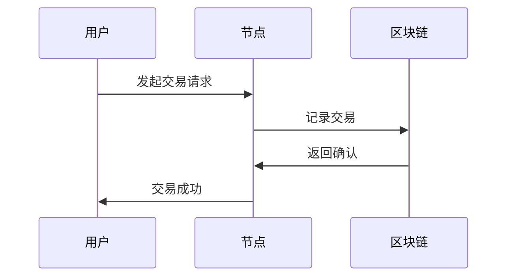
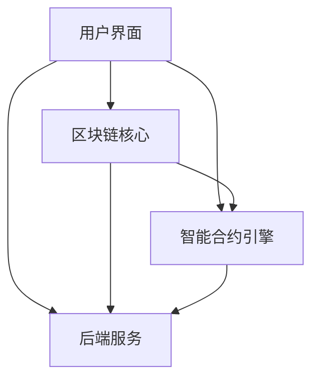
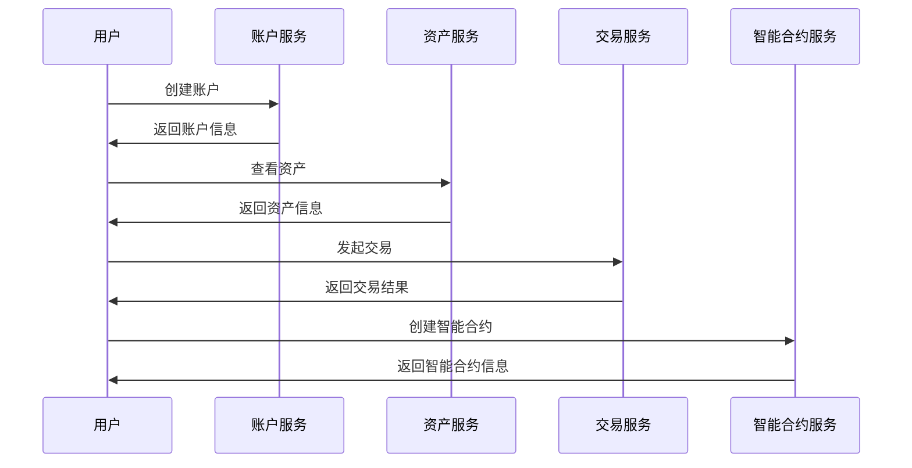

                 

# 区块链在数字资产继承中的应用前景

> 关键词：区块链、数字资产、继承、智能合约、前景分析

> 摘要：本文旨在探讨区块链技术如何革新数字资产继承领域。通过详细分析区块链的基本概念、数字资产继承的挑战、智能合约的应用，以及相关的系统架构和数学模型，本文为读者提供了一幅区块链在数字资产继承中应用的全面图景，并对其未来发展前景进行了深入探讨。

## 1. 引言

随着互联网技术的飞速发展，数字资产逐渐成为现代社会的重要财富形式。从数字货币到非同质化代币（NFTs），再到各种数字收藏品和数字版权，数字资产的种类和规模不断扩展。然而，数字资产继承问题也日益凸显。传统的法律体系在处理数字资产继承时面临诸多挑战，如资产识别、权属证明、交易透明性等。区块链技术的出现，为解决这些问题提供了一种全新的思路。

区块链的去中心化、不可篡改和透明性特点，使得其在数字资产继承中的应用前景广阔。通过智能合约，区块链能够自动执行复杂的继承规则，确保继承过程的公正和高效。本文将逐步探讨区块链在数字资产继承中的应用，旨在为相关领域的实践者和研究者提供有价值的参考。

## 2. 区块链与数字资产继承概念

### 2.1 区块链的基本概念

区块链是一种分布式数据库技术，其核心特点包括去中心化、不可篡改和透明性。区块链由多个区块组成，每个区块包含一定数量的交易记录。这些区块按照时间顺序连接在一起，形成一个链式结构。区块链的技术基础包括密码学、共识算法和智能合约等。

### 2.2 数字资产的概念

数字资产是指以数字形式存在的有价值的信息或财产，包括数字货币、NFTs、数字债券、数字股票等。与传统资产相比，数字资产具有易复制、易传输和去中心化等特点。

### 2.3 继承权的概念

继承权是指个人在法律上享有继承他人财产的权利。随着社会的发展，继承权的内容和形式也在不断变化。传统的继承过程通常涉及复杂的法律程序和繁琐的手续，而区块链技术的应用有望简化这一过程。

### 2.4 传统继承方法与区块链继承方法的比较

传统的继承方法主要依赖于法律文件和公证程序，存在以下几个问题：

- **资产识别困难**：数字资产往往存在于多个平台和地址，难以进行准确的识别和统计。
- **权属证明复杂**：权属证明需要依靠第三方机构，存在证明链条断裂的风险。
- **交易透明度低**：传统继承过程中，交易环节不透明，容易引发纠纷。

相比之下，区块链继承方法具有以下优势：

- **资产识别简单**：区块链上的数字资产可以通过地址进行唯一标识，方便进行资产识别。
- **权属证明直接**：区块链上的交易记录不可篡改，可以作为权属证明的直接来源。
- **交易透明度高**：区块链上的交易记录对所有参与者公开透明，有助于提高交易信任度。

## 3. 智能合约在数字资产继承中的应用

智能合约是区块链技术的重要应用之一，它是一种自动执行合同条款的计算机协议。智能合约能够根据预定义的规则自动执行交易，确保交易过程的公正和高效。在数字资产继承中，智能合约可以发挥以下作用：

### 3.1 继承规则的定义与执行

通过智能合约，可以定义复杂的继承规则。例如，在某个区块链平台上，可以设置一个智能合约，用于根据继承人的顺序分配数字资产。当触发继承事件时，智能合约会自动执行相应的分配规则，确保继承过程的公正性。

### 3.2 权属证明的自动化

智能合约可以自动生成并验证权属证明，简化继承过程中的手续。例如，在一个基于区块链的数字资产继承平台中，当继承人提出继承请求时，智能合约会自动查询区块链上的资产记录，并生成权属证明文件。该文件不仅具备法律效力，而且无需第三方机构介入，大大提高了继承的效率。

### 3.3 交易的透明性与可追溯性

智能合约的执行过程是公开透明的，所有参与者都可以查询和验证。这有助于提高交易过程的透明度，减少纠纷的发生。同时，区块链上的交易记录具有不可篡改的特性，为交易的可追溯性提供了保障。

## 4. 区块链算法与技术应用

### 4.1 区块链核心算法介绍

区块链的核心算法包括哈希算法、共识算法和加密算法等。

- **哈希算法**：哈希算法用于将任意长度的数据转换成固定长度的哈希值。在区块链中，哈希算法用于确保数据一致性和防篡改。
- **共识算法**：共识算法用于节点间达成一致。常见的共识算法包括工作量证明（PoW）、权益证明（PoS）和委托权益证明（DPoS）等。
- **加密算法**：加密算法用于保护区块链上的交易隐私和安全。常见的加密算法包括对称加密和非对称加密等。

### 4.2 区块链算法在数字资产继承中的应用

区块链算法在数字资产继承中的应用主要体现在以下几个方面：

- **数据一致性**：通过哈希算法，区块链确保了数字资产记录的一致性。这意味着任何对数字资产的修改都会被记录在链上，方便审计和追溯。
- **安全性与隐私保护**：加密算法用于保护交易隐私和安全，确保继承过程中的信息不被泄露。
- **共识机制**：共识算法确保了区块链上的交易能够被所有参与者认可和执行，提高了继承过程的公正性和透明度。

### 4.3 区块链交易流程Mermaid图表示

下面是区块链交易流程的Mermaid图表示：



## 5. 数学模型在区块链数字资产继承中的应用

### 5.1 数学模型的基本概念

在区块链数字资产继承中，数学模型主要用于描述区块链的基本操作和安全性。

- **哈希函数**：哈希函数是将数据映射为固定长度的字符串的函数。在区块链中，哈希函数用于确保数据一致性和防篡改。
- **椭圆曲线加密**：椭圆曲线加密是一种非对称加密算法，用于保护区块链上的交易隐私和安全。
- **共识算法**：共识算法用于节点间达成一致，常见的有PoW、PoS和DPoS等。

### 5.2 数学模型的详细介绍

以下是区块链数字资产继承中常用的数学模型：

- **哈希函数**：哈希函数通常具有以下特性：
  - 输入与输出长度固定；
  - 输出值唯一；
  - 输入值微小变化会导致输出值巨大变化。
- **椭圆曲线加密**：椭圆曲线加密基于椭圆曲线离散对数问题，具有以下特点：
  - 安全性高；
  - 加密速度快；
  - 可用于数字签名和密钥交换。
- **共识算法**：常见的共识算法有PoW、PoS和DPoS等，每种算法都有其优缺点和适用场景。

### 5.3 数学模型的Python代码实现

下面是椭圆曲线加密的Python代码实现：

```python
from ecdsa import SigningKey, NIST256p, VerifyingKey
from ecdsa.util import randrange_from_seed__trytryagain

def generate_keys():
    sk = SigningKey.generate(curve=NIST256p)
    vk = sk.get_verifying_key()
    return sk, vk

def sign_message(sk, message):
    return sk.sign(message)

def verify_signature(vk, message, signature):
    return vk.verify(signature, message)

if __name__ == "__main__":
    sk, vk = generate_keys()
    message = b"Hello, blockchain!"
    signature = sign_message(sk, message)
    print("Public Key:", vk.to_string())
    print("Signature:", signature)
    print("Verification:", verify_signature(vk, message, signature))
```

## 6. 区块链数字资产继承的系统架构设计

### 6.1 系统架构概述

区块链数字资产继承系统主要包括以下几个组件：

- **用户界面**：提供用户与系统的交互接口，包括账户管理、资产展示、交易记录查询等功能。
- **区块链核心**：实现区块链的基本功能，包括数据存储、交易处理、共识机制等。
- **智能合约引擎**：执行智能合约，实现数字资产继承规则的定义和执行。
- **后端服务**：提供数据管理、权限控制、日志记录等支持功能。

### 6.2 系统架构图

以下是区块链数字资产继承系统的架构图：



### 6.3 系统功能设计

区块链数字资产继承系统的主要功能包括：

- **账户管理**：用户可以创建账户、导入账户、查看账户余额等。
- **资产展示**：用户可以查看自己的数字资产信息，包括资产名称、数量、归属等。
- **交易记录查询**：用户可以查询自己的交易记录，包括交易时间、交易金额、交易状态等。
- **智能合约执行**：用户可以创建智能合约、部署智能合约、执行智能合约等。

### 6.4 系统接口设计

区块链数字资产继承系统的接口设计主要包括以下几类：

- **账户接口**：用于管理账户，包括创建账户、导入账户、查看账户余额等。
- **资产接口**：用于管理数字资产，包括添加资产、删除资产、查询资产等。
- **交易接口**：用于管理交易，包括发起交易、查询交易记录、撤销交易等。
- **智能合约接口**：用于管理智能合约，包括创建智能合约、部署智能合约、执行智能合约等。

### 6.5 系统交互Mermaid图

以下是区块链数字资产继承系统的交互图：



## 7. 项目实战：基于区块链的数字资产继承平台开发

### 7.1 环境安装

在开发基于区块链的数字资产继承平台前，需要安装以下环境：

- **Node.js**：用于搭建后端服务。
- **Golang**：用于编写区块链核心。
- **Truffle**：用于编写和部署智能合约。
- **Metamask**：用于与区块链交互。

### 7.2 系统核心实现源代码

以下是系统核心实现的部分源代码：

**后端服务（Node.js）**

```javascript
const express = require('express');
const app = express();

app.use(express.json());

// 账户接口
app.post('/api/accounts', (req, res) => {
  // 创建账户逻辑
});

app.get('/api/accounts/:id', (req, res) => {
  // 查看账户逻辑
});

// 资产接口
app.post('/api/assets', (req, res) => {
  // 添加资产逻辑
});

app.delete('/api/assets/:id', (req, res) => {
  // 删除资产逻辑
});

app.get('/api/assets', (req, res) => {
  // 查询资产逻辑
});

// 交易接口
app.post('/api/transactions', (req, res) => {
  // 发起交易逻辑
});

app.get('/api/transactions', (req, res) => {
  // 查询交易记录逻辑
});

// 智能合约接口
app.post('/api/contracts', (req, res) => {
  // 创建智能合约逻辑
});

app.get('/api/contracts/:id', (req, res) => {
  // 查看智能合约逻辑
});

app.put('/api/contracts/:id', (req, res) => {
  // 执行智能合约逻辑
});

app.listen(3000, () => {
  console.log('Server listening on port 3000');
});
```

**区块链核心（Golang）**

```go
package main

import (
    "crypto/sha256"
    "encoding/hex"
    "log"
)

type Block struct {
    Index     int
    Timestamp string
    Data      string
    Hash      string
    PrevHash  string
}

func calculateHash(block *Block) string {
    blockBytes, _ := json.Marshal(block)
    hash := sha256.Sum256(blockBytes)
    return hex.EncodeToString(hash[:])
}

func generateGenesisBlock() *Block {
    return &Block{0, time.Now().String(), "Genesis Block", "", ""}
}

func generateNextBlock(lastBlock *Block, data string) *Block {
    index := lastBlock.Index + 1
    timestamp := time.Now().String()
    prevHash := lastBlock.Hash
    hash := calculateHash(&Block{index, timestamp, data, "", prevHash})

    return &Block{index, timestamp, data, hash, prevHash}
}

func main() {
    blocks := []*Block{generateGenesisBlock()}
    lastBlock := blocks[0]

    for i := 1; i < 5; i++ {
        block := generateNextBlock(lastBlock, "Block " + string(i))
        blocks = append(blocks, block)
        lastBlock = block
    }

    for _, block := range blocks {
        log.Printf("Index: %d, Timestamp: %s, Data: %s, Hash: %s, PrevHash: %s\n", block.Index, block.Timestamp, block.Data, block.Hash, block.PrevHash)
    }
}
```

**智能合约（Truffle）**

```solidity
// SPDX-License-Identifier: MIT
pragma solidity ^0.8.0;

contract Inheritance {
    address public owner;
    mapping(address => uint256) public assets;

    constructor() {
        owner = msg.sender;
    }

    function createAsset(address _to, uint256 _amount) external {
        require(msg.sender == owner, "Only owner can create assets");
        assets[_to] = _amount;
    }

    function transferAsset(address _from, address _to, uint256 _amount) external {
        require(assets[_from] >= _amount, "Insufficient balance");
        assets[_from] -= _amount;
        assets[_to] += _amount;
    }
}
```

### 7.3 代码应用解读与分析

以下是代码应用解读与分析：

**后端服务**

后端服务采用Node.js编写，使用了Express框架。主要包括账户接口、资产接口、交易接口和智能合约接口。账户接口用于创建账户、查看账户余额等操作。资产接口用于添加资产、删除资产和查询资产信息。交易接口用于发起交易和查询交易记录。智能合约接口用于创建智能合约、部署智能合约和执行智能合约。

**区块链核心**

区块链核心采用Golang编写，实现了区块链的基本功能，包括生成创世块、生成下一块和计算哈希值等。核心代码使用了加密算法确保数据一致性和防篡改。

**智能合约**

智能合约采用Solidity编写，实现了数字资产继承的基本功能，包括创建资产和转移资产。智能合约通过合约地址和资产数量进行资产管理，通过交易事件记录资产转移。

### 7.4 实际案例分析与详细讲解剖析

以下是一个实际案例分析与详细讲解剖析：

假设用户A去世，留下了一份基于区块链的数字资产继承智能合约。智能合约定义了用户A的继承人B、C、D，并分别分配了100个数字资产。

**步骤1：继承人B发起继承请求**

继承人B通过智能合约发起继承请求，调用`createAsset`函数创建资产。

```solidity
function createAsset(address _to, uint256 _amount) external {
    require(msg.sender == owner, "Only owner can create assets");
    assets[_to] = _amount;
}
```

**步骤2：智能合约执行继承规则**

智能合约根据继承规则执行分配，调用`transferAsset`函数转移资产。

```solidity
function transferAsset(address _from, address _to, uint256 _amount) external {
    require(assets[_from] >= _amount, "Insufficient balance");
    assets[_from] -= _amount;
    assets[_to] += _amount;
}
```

**步骤3：继承人C和D发起继承请求**

继承人C和D分别通过智能合约发起继承请求，调用`createAsset`函数创建资产。

**步骤4：查询继承结果**

所有继承人可以通过智能合约查询自己的资产信息，确保继承过程公正和透明。

### 7.5 项目小结

基于区块链的数字资产继承平台实现了资产管理和继承规则的自动化执行。通过智能合约，继承了区块链的去中心化、不可篡改和透明性特点，提高了继承过程的公正性和效率。项目在实际应用中具有一定的价值，但也面临一些挑战，如智能合约安全性、交易性能和隐私保护等。

### 7.6 最佳实践 Tips

- **智能合约安全性**：在设计智能合约时，应遵循最佳实践，如避免使用低级编程语言、进行代码审计等。
- **交易性能优化**：可以通过优化共识算法和区块链结构，提高交易性能。
- **隐私保护**：可以使用零知识证明等技术，提高区块链上的交易隐私。

### 7.7 小结

本文详细探讨了区块链在数字资产继承中的应用前景。通过分析区块链的基本概念、数字资产继承的挑战、智能合约的应用，以及相关的系统架构和数学模型，本文为读者提供了一幅区块链在数字资产继承中应用的全面图景。未来，随着区块链技术的不断发展，数字资产继承领域有望迎来新的变革。

### 7.8 注意事项

- **合规性**：在设计区块链数字资产继承系统时，应遵守当地法律法规，确保系统的合法性和合规性。
- **安全性**：确保系统的安全性和稳定性，防止黑客攻击和数据泄露。

### 7.9 拓展阅读

- **《区块链技术指南》**：深入理解区块链的基本原理和关键技术。
- **《智能合约安全指南》**：学习如何编写安全可靠的智能合约。
- **《数字货币与区块链应用》**：了解数字货币和区块链在各个领域的应用。

