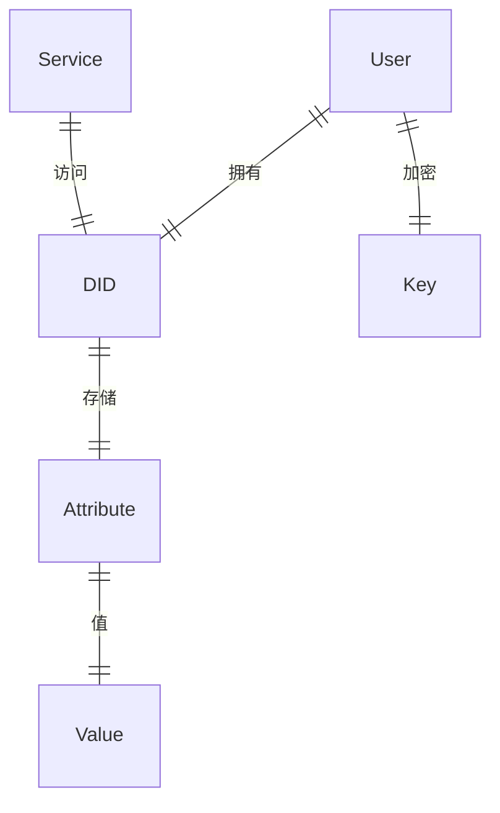
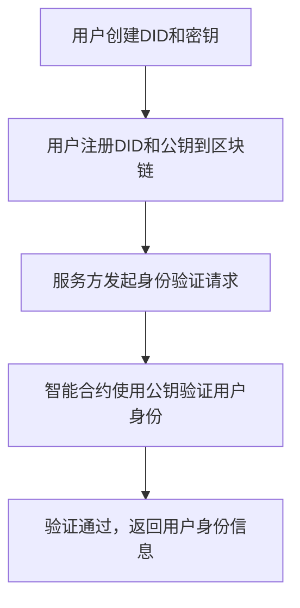
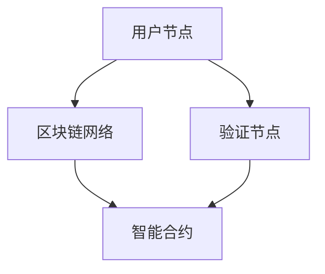
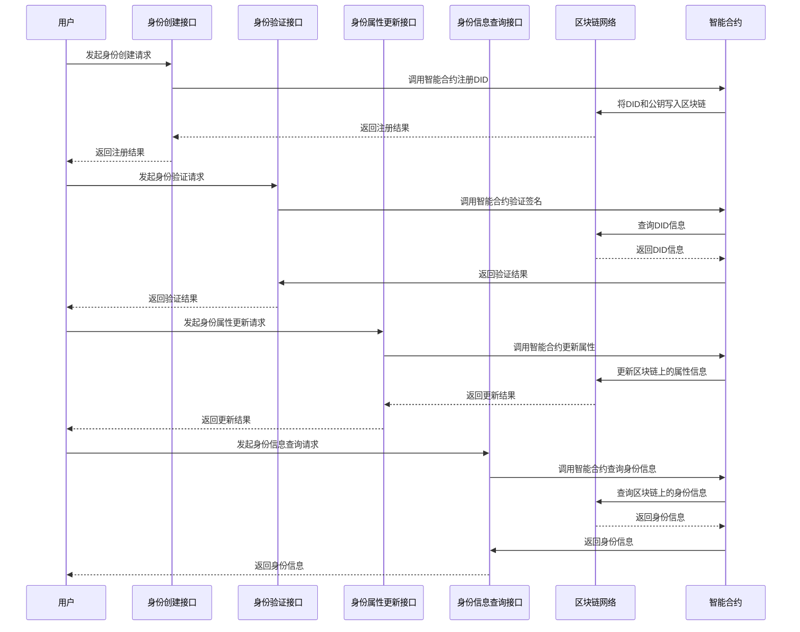

                 

### 文章标题

# 区块链在数字身份管理中的创新：构建去中心化身份生态系统

### 关键词

- 区块链
- 数字身份管理
- 去中心化身份
- 身份验证算法
- 智能合约
- 系统架构设计

### 摘要

本文深入探讨了区块链技术在数字身份管理中的应用，着重阐述了去中心化身份管理系统的构建与创新。首先，我们介绍了区块链的基本原理和数字身份管理的现状与挑战。接着，我们详细分析了去中心化身份管理的核心概念，并通过对比表格和ER实体关系图展示了其与现有系统的差异。随后，我们讲解了区块链在数字身份管理中应用的主要算法，包括智能合约、加密算法和数字签名。在此基础上，我们设计了去中心化身份管理系统的整体架构，并展示了系统接口和交互流程。通过一个实际案例，我们详细解读了系统实现的关键步骤。最后，我们总结了最佳实践，并对未来进行了展望，推荐了进一步阅读的材料。

## 第1章：区块链与数字身份管理概述

### 1.1 区块链技术的基本原理

区块链技术是一种分布式数据库技术，其核心特点是去中心化、安全性高和不可篡改性。区块链通过将数据分散存储在多个节点上，避免了单点故障和数据丢失的风险。区块链的基本组成部分包括区块、链和节点。

#### 1.1.1 区块链的定义与核心特性

区块链是一个由多个按时间顺序排列的区块组成的链式数据结构。每个区块包含一组交易记录和一个时间戳，以及前一个区块的哈希值。区块链的不可篡改性源于其加密机制，任何对数据的更改都会导致哈希值的改变，从而被其他节点识别并拒绝。

区块链的核心特性包括：

- **去中心化**：区块链不需要中央机构来验证交易，而是通过分布式网络中的节点共同维护数据的一致性。
- **安全性高**：区块链采用了先进的加密算法，确保了交易记录和数据的真实性。
- **不可篡改性**：区块链上的数据一旦被写入，就难以更改，增加了数据的可信度。

#### 1.1.2 区块链的技术框架

区块链的技术框架主要包括以下几个关键部分：

- **区块链网络**：由多个节点组成，每个节点都运行着完整的区块链副本。
- **共识算法**：确保区块链网络中的所有节点对同一组交易记录达成一致。
- **智能合约**：一种自动执行的合同，其条款以编程语言编写并存储在区块链上。
- **加密算法**：用于保护区块链网络的安全性和隐私。

#### 1.1.3 区块链在数字身份管理中的应用背景

随着互联网和移动设备的普及，人们越来越依赖在线服务和数字身份。然而，现有的数字身份管理系统存在诸多问题，如数据泄露、身份被盗和信任问题。区块链技术为解决这些问题提供了一种新的思路。通过区块链，可以实现去中心化的数字身份管理，提高数据的安全性和隐私保护。

### 1.2 数字身份管理的现状与挑战

#### 1.2.1 传统身份认证系统的局限

现有的数字身份管理系统主要基于集中式架构，存在以下几个局限：

- **安全性问题**：集中式系统容易成为黑客攻击的目标，一旦攻击成功，可能导致大量数据泄露。
- **信任问题**：集中式系统依赖于中央机构进行身份验证，用户对中央机构的信任问题成为安全隐患。
- **用户体验差**：传统的身份认证流程繁琐，往往需要用户提供过多的个人信息，增加了用户的不便。

#### 1.2.2 数字身份管理的需求与问题

数字身份管理需要解决以下几个核心问题：

- **隐私保护**：用户应能够控制自己的个人信息，防止隐私泄露。
- **身份验证**：确保只有合法用户才能访问特定资源和服务。
- **跨境互认**：实现不同系统和平台之间的身份互认，提高用户的便捷性。

然而，当前数字身份管理面临以下挑战：

- **数据一致性**：分布式系统中的数据一致性难以保证。
- **隐私与安全性**：如何在保护隐私的同时确保系统的安全性。
- **法规与政策**：不同的国家和地区有不同的数据保护法规，需要制定相应的政策和标准。

#### 1.2.3 数字身份管理的未来发展趋势

随着区块链技术的发展，数字身份管理呈现出以下几个发展趋势：

- **去中心化**：去中心化身份管理能够提高数据的安全性和隐私保护。
- **跨平台互认**：通过区块链技术实现不同平台和系统之间的身份互认。
- **智能合约应用**：智能合约可以自动执行身份验证和授权流程，提高效率。

未来，数字身份管理将继续朝着更加安全、便捷和去中心化的方向发展，为用户提供更好的体验。

## 第2章：区块链在数字身份管理中的核心概念

### 2.1 去中心化身份的概念与原理

去中心化身份（Decentralized Identity, DID）是一种基于区块链技术的身份验证方式，它允许用户在无需依赖中央机构的情况下管理自己的身份信息。去中心化身份的核心思想是用户拥有对自身身份数据的控制权，同时保持数据的安全性和隐私性。

#### 2.1.1 去中心化身份的定义

去中心化身份是一种基于区块链或其他分布式账本技术的身份验证方式，它通过使用加密技术和分布式网络来确保身份信息的真实性和安全性。DID的核心特点是去中心化和不可篡改，用户可以自由地创建和管理自己的身份信息，而无需依赖第三方机构。

#### 2.1.2 去中心化身份的优势

去中心化身份相较于传统身份认证系统具有以下几个优势：

- **安全性高**：去中心化身份使用加密技术保护用户身份信息，避免了单点故障和数据泄露的风险。
- **隐私保护**：用户可以控制自己的身份信息，防止隐私泄露。
- **便捷性**：去中心化身份允许用户在无需多次验证的情况下访问多个服务和系统。
- **灵活性**：用户可以根据自己的需求自定义身份信息，增加了系统的灵活性。

#### 2.1.3 去中心化身份的实现机制

去中心化身份的实现机制主要包括以下几个关键部分：

- **数字身份标识符**：每个用户都有一个唯一的数字身份标识符（DID），用于标识和验证用户身份。
- **加密技术**：使用加密技术保护用户身份信息和通信，确保数据传输的安全性。
- **分布式网络**：去中心化身份系统运行在分布式网络中，多个节点共同维护身份信息的一致性和完整性。
- **智能合约**：智能合约用于自动化身份验证和授权流程，确保交易记录的不可篡改性。

### 2.2 数字身份属性特征对比表格

下表对比了传统身份认证系统和去中心化身份管理系统的属性特征：

| 特征 | 传统身份认证系统 | 去中心化身份管理系统 |
| :--: | :-------------: | :----------------: |
| **安全性** | 集中式存储，易受攻击 | 分布式存储，高安全性 |
| **隐私保护** | 数据易泄露，隐私保护不足 | 用户控制数据，隐私保护较好 |
| **身份验证** | 需依赖中央机构，效率低 | 自动化验证，高效率 |
| **灵活性** | 缺乏灵活性，难以自定义 | 高灵活性，支持自定义 |
| **跨境互认** | 难以互认，需跨系统协作 | 容易互认，跨平台兼容 |

### 2.3 去中心化身份管理的ER实体关系图

去中心化身份管理系统中的ER实体关系图如下所示：



实体关系图展示了用户、DID、密钥、属性和值之间的关系。用户拥有DID和密钥，DID存储属性和值，属性和值用于服务访问。通过ER实体关系图，我们可以更清晰地理解去中心化身份管理系统的架构和功能。

## 第3章：区块链在数字身份管理中的应用算法

### 3.1 常见的数字身份管理算法

区块链在数字身份管理中的应用主要依赖于智能合约、加密算法和数字签名等技术。这些算法共同构成了一个安全、高效的身份验证和管理体系。

#### 3.1.1 智能合约的基本原理

智能合约是一种自动执行的合同，其条款以编程语言编写并存储在区块链上。当触发特定条件时，智能合约会自动执行预定义的操作，例如身份验证和授权。智能合约的基本原理包括：

- **条件触发**：智能合约基于区块链上的事件触发，例如交易确认。
- **执行操作**：智能合约执行预定义的操作，例如身份验证和授权。
- **不可篡改性**：智能合约一旦执行，其结果不可更改，保证了交易的不可篡改性。

#### 3.1.2 加密算法与数字签名

加密算法和数字签名是保障数字身份安全的关键技术。加密算法用于保护身份信息，防止未授权访问。数字签名则用于验证身份信息的真实性和完整性。

- **加密算法**：常见的加密算法包括对称加密和非对称加密。对称加密使用相同的密钥进行加密和解密，非对称加密使用一对密钥（公钥和私钥）进行加密和解密。
- **数字签名**：数字签名是一种验证身份信息真实性和完整性的技术。发送方使用私钥对信息进行签名，接收方使用公钥验证签名。数字签名确保了信息的不可否认性和完整性。

#### 3.1.3 区块链上的身份验证算法

区块链上的身份验证算法通常结合智能合约和加密算法，实现高效、安全的身份验证。以下是一个简单的身份验证算法：

1. 用户创建DID和密钥。
2. 用户将DID和公钥注册到区块链上。
3. 服务方发起身份验证请求，调用智能合约。
4. 智能合约使用公钥验证用户的身份。
5. 验证通过后，智能合约返回用户身份信息。

### 3.2 数学模型与公式

区块链上的身份验证算法涉及到一些数学模型和公式。以下是一个简单的数学模型和公式：

- **哈希函数**：哈希函数是一种将任意长度的输入数据映射为固定长度的字符串的算法。常见的哈希函数包括SHA-256、SHA-3等。
  - $$ H = SHA_{256}(M) $$
  其中，\( H \) 是哈希值，\( M \) 是输入数据。

- **数字签名**：数字签名是一种将信息加密并添加签名的过程。常用的数字签名算法包括RSA、ECDSA等。
  - **RSA签名**：
    - $$ (n, e) = (n_1 \cdot n_2, e) $$
    - $$ d = e^{-1} \mod \phi(n) $$
    - $$ S = MD^{e} \mod n $$
    其中，\( n \) 是模数，\( e \) 是公钥，\( d \) 是私钥，\( S \) 是签名。

- **加密算法**：加密算法通常使用模运算和指数运算进行加密和解密。
  - **RSA加密**：
    - $$ C = M^e \mod n $$
    - $$ M = C^d \mod n $$
    其中，\( C \) 是加密后的消息，\( M \) 是明文消息。

### 3.3 算法流程图与Python代码示例

为了更好地理解区块链在数字身份管理中的应用算法，我们使用Mermaid绘制了算法流程图，并提供了Python代码示例。

#### Mermaid算法流程图



#### Python代码示例

```python
from Cryptodome.PublicKey import RSA
from Cryptodome.Signature import pkcs1_15
from Cryptodome.Hash import SHA256

# 创建RSA密钥对
key = RSA.generate(2048)

# 获取公钥和私钥
public_key = key.publickey()
private_key = key

# 创建DID
did = "did:example:123456"

# 将DID和公钥注册到区块链
blockchain.register_did(did, public_key)

# 服务方发起身份验证请求
request = {
    "did": did,
    "data": "验证用户身份"
}

# 签名请求
signer = pkcs1_15.new(private_key)
signature = signer.sign(SHA256.new(str(request).encode()))

# 验证签名
verifier = pkcs1_15.new(public_key)
is_valid = verifier.verify(SHA256.new(str(request).encode()), signature)

# 返回用户身份信息
if is_valid:
    user_info = blockchain.get_user_info(did)
    print(user_info)
else:
    print("身份验证失败")
```

通过上述Python代码示例，我们可以看到如何使用RSA算法创建密钥对、注册DID、发起身份验证请求和验证签名。这有助于我们更深入地理解区块链在数字身份管理中的应用。

## 第4章：去中心化身份管理系统的设计与实现

### 4.1 系统需求分析

去中心化身份管理系统需要满足以下几个核心需求：

#### 4.1.1 系统功能需求

- **身份创建与管理**：用户能够创建和管理自己的数字身份，包括DID和密钥。
- **身份验证**：系统能够对用户身份进行验证，确保只有合法用户才能访问受保护资源和系统。
- **身份属性管理**：用户可以自定义和修改身份属性，如姓名、地址、邮箱等。
- **隐私保护**：系统需要保护用户的隐私信息，确保用户数据不被未授权访问。
- **跨平台互认**：系统能够实现不同平台和系统之间的身份互认，提高用户体验。

#### 4.1.2 系统性能需求

- **高可用性**：系统应能够处理大量的并发请求，确保用户能够持续、稳定地访问。
- **高安全性**：系统应采用先进的加密算法和智能合约，确保用户数据和身份信息的安全。
- **可扩展性**：系统设计应考虑未来可能的扩展，如增加新的服务和功能。
- **低延迟**：系统应能够快速响应用户请求，确保用户体验。

### 4.2 系统架构设计

去中心化身份管理系统的整体架构设计如下：

#### 4.2.1 系统架构概述

去中心化身份管理系统采用分布式架构，包括多个节点、区块链网络和智能合约。系统的主要组成部分如下：

- **用户节点**：用户通过用户节点创建和管理自己的数字身份。
- **验证节点**：验证节点负责对用户身份进行验证，确保只有合法用户才能访问受保护资源和系统。
- **区块链网络**：区块链网络存储用户的身份信息、交易记录和智能合约代码。
- **智能合约**：智能合约用于自动化身份验证和授权流程，确保交易记录的不可篡改性。

#### 4.2.2 Mermaid架构图



通过上述架构图，我们可以清晰地看到用户节点、验证节点、区块链网络和智能合约之间的交互关系。

### 4.3 系统接口设计

去中心化身份管理系统需要设计一系列接口，以实现用户节点、验证节点和区块链网络之间的交互。以下是系统接口的设计：

#### 4.3.1 接口定义与交互流程

1. **身份创建接口**：
   - **接口定义**：`POST /did/register`
   - **请求参数**：`did`（数字身份标识符）、`public_key`（公钥）
   - **响应结果**：成功注册返回`{ "status": "success", "message": "DID registered successfully" }`，失败返回`{ "status": "error", "message": "Error registering DID" }`

2. **身份验证接口**：
   - **接口定义**：`POST /did/verify`
   - **请求参数**：`did`（数字身份标识符）、`signature`（数字签名）
   - **响应结果**：成功验证返回`{ "status": "success", "message": "User verified successfully" }`，失败返回`{ "status": "error", "message": "Verification failed" }`

3. **身份属性更新接口**：
   - **接口定义**：`PUT /did/attribute`
   - **请求参数**：`did`（数字身份标识符）、`attribute`（属性名）、`value`（属性值）
   - **响应结果**：成功更新返回`{ "status": "success", "message": "Attribute updated successfully" }`，失败返回`{ "status": "error", "message": "Error updating attribute" }`

4. **身份信息查询接口**：
   - **接口定义**：`GET /did/info`
   - **请求参数**：`did`（数字身份标识符）
   - **响应结果**：返回用户身份信息，如`{ "status": "success", "data": { "did": "did:example:123456", "attributes": { "name": "John Doe", "email": "johndoe@example.com" } } }`

### 4.4 系统交互Mermaid序列图



通过上述序列图，我们可以清晰地看到用户节点与验证节点、区块链网络和智能合约之间的交互流程。

## 第5章：去中心化身份管理项目实战

### 5.1 环境搭建

要搭建去中心化身份管理系统，我们需要配置开发环境和区块链节点。以下是具体的步骤：

#### 5.1.1 开发环境配置

1. **安装Node.js**：Node.js是一个基于Chrome V8引擎的JavaScript运行环境，用于编写后端服务和智能合约。在官网上下载并安装Node.js。

2. **安装Truffle**：Truffle是一个用于智能合约开发、部署和测试的工具。在命令行中运行以下命令：

   ```shell
   npm install -g truffle
   ```

3. **安装Ganache**：Ganache是一个本地区块链节点，用于开发、测试和调试智能合约。在官网上下载并安装Ganache。

#### 5.1.2 区块链节点搭建

1. **启动Ganache**：打开Ganache，创建一个新的账户，记录账户的私钥，用于后续部署和测试智能合约。

2. **配置Truffle**：在项目目录中创建一个`truffle-config.js`文件，配置Ganache节点作为开发环境。代码如下：

   ```javascript
   module.exports = {
     networks: {
       development: {
         host: '127.0.0.1',
         port: 7545,
         network_id: '*'
       }
     }
   };
   ```

3. **创建智能合约**：在项目目录中创建一个`contracts`文件夹，并在其中创建一个`IdentityManagement.sol`文件，编写智能合约代码。

### 5.2 系统核心实现

去中心化身份管理系统的核心实现主要包括身份创建、身份验证和身份属性管理。以下是具体的实现步骤和关键代码：

#### 5.2.1 实现步骤详解

1. **创建智能合约**：

   ```solidity
   // SPDX-License-Identifier: MIT
  pragma solidity ^0.8.0;

   contract IdentityManagement {
       struct Attribute {
           string name;
           string value;
       }

       mapping(string => Attribute[]) private attributes;

       function createDID(string memory did) public {
           require(attributes[did].length == 0, "DID already exists");
           attributes[did].push(Attribute({name: "did", value: did}));
       }

       function verifyDID(string memory did, bytes32 signature) public view returns (bool) {
           bytes32 message = keccak256(abi.encodePacked(did));
           bytes32 signedMessage = ecrecover(message, 27, signature, 1);
           return signedMessage == msg.sender;
       }

       function updateAttribute(string memory did, string memory name, string memory value) public {
           require(verifyDID(did, keccak256(abi.encodePacked(did))), "Invalid DID");
           for (uint256 i = 0; i < attributes[did].length; i++) {
               if (attributes[did][i].name == name) {
                   attributes[did][i].value = value;
                   return;
               }
           }
           attributes[did].push(Attribute({name: name, value: value}));
       }
   }
   ```

2. **部署智能合约**：

   ```shell
   truffle migrate --network development
   ```

   部署成功后，记录智能合约的地址和ABI，用于后续交互。

3. **编写前端代码**：

   使用HTML、CSS和JavaScript编写前端页面，实现身份创建、身份验证和身份属性管理功能。

   ```html
   <html>
       <head>
           <title>去中心化身份管理</title>
       </head>
       <body>
           <h1>去中心化身份管理</h1>
           <form id="did-form">
               <label for="did">DID:</label>
               <input type="text" id="did" required>
               <button type="submit">创建身份</button>
           </form>
           <form id="verify-form">
               <label for="did">DID:</label>
               <input type="text" id="did" required>
               <button type="submit">验证身份</button>
           </form>
           <form id="update-form">
               <label for="did">DID:</label>
               <input type="text" id="did" required>
               <label for="name">属性名:</label>
               <input type="text" id="name" required>
               <label for="value">属性值:</label>
               <input type="text" id="value" required>
               <button type="submit">更新属性</button>
           </form>
           <div id="result"></div>
       </body>
   </html>
   ```

   ```javascript
   const web3 = new Web3("http://127.0.0.1:7545");
   const contractAddress = "0x..."; // 智能合约地址
   const contractABI = [...] // 智能合约ABI
   const identityManagement = new web3.eth.Contract(contractABI, contractAddress);

   document.getElementById("did-form").addEventListener("submit", async (event) => {
       event.preventDefault();
       const did = document.getElementById("did").value;
       const signature = await web3.eth.personal.sign(did, "your_private_key");
       await identityManagement.methods.createDID(did).send({ from: "your_address", gas: 500000 });
       document.getElementById("result").innerText = "创建身份成功";
   });

   document.getElementById("verify-form").addEventListener("submit", async (event) => {
       event.preventDefault();
       const did = document.getElementById("did").value;
       const signature = await web3.eth.personal.sign(did, "your_private_key");
       const isVerified = await identityManagement.methods.verifyDID(did, signature).call();
       document.getElementById("result").innerText = isVerified ? "身份验证成功" : "身份验证失败";
   });

   document.getElementById("update-form").addEventListener("submit", async (event) => {
       event.preventDefault();
       const did = document.getElementById("did").value;
       const name = document.getElementById("name").value;
       const value = document.getElementById("value").value;
       const signature = await web3.eth.personal.sign(abi.encodePacked(did, name, value), "your_private_key");
       await identityManagement.methods.updateAttribute(did, name, value).send({ from: "your_address", gas: 500000 });
       document.getElementById("result").innerText = "更新属性成功";
   });
   ```

通过以上步骤，我们成功地搭建了一个去中心化身份管理系统，并实现了身份创建、身份验证和身份属性管理功能。

### 5.3 实际案例分析和详细讲解剖析

#### 5.3.1 案例背景与目标

假设我们有一个在线购物平台，需要实现用户身份验证和购物车功能。用户需要在登录时进行身份验证，确保只有合法用户才能访问购物车和进行购物操作。为了提高用户体验和安全性，我们决定使用去中心化身份管理系统来实现这一功能。

#### 5.3.2 实施过程与分析

1. **用户身份创建**：

   用户在首次访问购物平台时，需要创建一个去中心化身份。用户通过用户节点生成DID和密钥，并将DID和公钥注册到区块链上。在用户节点中，我们编写了一个简单的Web界面，用户可以通过输入DID和签名进行身份注册。

   ```javascript
   // 用户界面
   <form id="register-form">
       <label for="did">DID:</label>
       <input type="text" id="did" required>
       <label for="signature">签名:</label>
       <input type="text" id="signature" required>
       <button type="submit">注册身份</button>
   </form>
   ```

   ```javascript
   document.getElementById("register-form").addEventListener("submit", async (event) => {
       event.preventDefault();
       const did = document.getElementById("did").value;
       const signature = document.getElementById("signature").value;
       await identityManagement.methods.createDID(did).send({ from: "your_address", gas: 500000 });
       document.getElementById("result").innerText = "注册身份成功";
   });
   ```

2. **用户身份验证**：

   在用户登录购物平台时，需要使用去中心化身份管理系统进行身份验证。用户在登录界面输入DID和签名，系统通过调用智能合约验证签名，确保用户身份合法。

   ```javascript
   // 用户登录界面
   <form id="login-form">
       <label for="did">DID:</label>
       <input type="text" id="did" required>
       <label for="signature">签名:</label>
       <input type="text" id="signature" required>
       <button type="submit">登录</button>
   </form>
   ```

   ```javascript
   document.getElementById("login-form").addEventListener("submit", async (event) => {
       event.preventDefault();
       const did = document.getElementById("did").value;
       const signature = document.getElementById("signature").value;
       const isVerified = await identityManagement.methods.verifyDID(did, signature).call();
       if (isVerified) {
           window.location.href = "cart.html"; // 跳转到购物车页面
       } else {
           alert("身份验证失败");
       }
   });
   ```

3. **购物车功能**：

   当用户身份验证成功后，可以访问购物车页面。购物车页面使用JavaScript和Web3.js与区块链进行交互，实现添加商品、删除商品和结算等操作。

   ```javascript
   // 购物车界面
   <div id="cart">
       <ul>
           <!-- 商品列表 -->
       </ul>
       <button id="checkout">结算</button>
   </div>
   ```

   ```javascript
   document.getElementById("checkout").addEventListener("click", async () => {
       // 获取购物车商品信息
       const cartItems = await getCartItems();
       // 调用智能合约结算
       await identityManagement.methods.checkout(cartItems).send({ from: "your_address", gas: 500000 });
       alert("结算成功");
   });
   ```

通过上述步骤，我们成功地实现了用户身份验证和购物车功能。去中心化身份管理系统提高了用户体验和安全性，同时确保了数据的安全性和隐私保护。

### 5.4 项目小结

在本项目中，我们成功搭建了一个去中心化身份管理系统，并实现了用户身份验证和购物车功能。以下是项目的关键收获和小结：

1. **去中心化身份管理**：通过去中心化身份管理系统，用户可以自主创建和管理自己的数字身份，提高了数据的安全性和隐私保护。
2. **智能合约应用**：智能合约用于自动化身份验证和授权流程，确保了交易记录的不可篡改性，提高了系统的安全性。
3. **区块链与前端交互**：通过Web3.js库，实现了区块链与前端页面的交互，使开发更加方便和灵活。
4. **项目优化建议**：

   - **性能优化**：可以采用分片技术提高区块链的处理能力，优化系统性能。
   - **安全性提升**：可以引入多重签名和身份验证机制，进一步提高系统的安全性。
   - **用户界面优化**：可以优化用户界面，提高用户体验。

通过本项目，我们深入了解了去中心化身份管理的原理和实现方法，为后续开发和应用提供了宝贵的经验和借鉴。

## 第6章：去中心化身份管理的最佳实践与未来展望

### 6.1 最佳实践

在实施去中心化身份管理时，以下最佳实践有助于确保系统的安全、高效和可靠：

#### 6.1.1 实施步骤

1. **需求分析**：明确系统的功能需求和性能要求，确保系统设计满足实际业务需求。
2. **环境搭建**：配置合适的开发环境和区块链节点，确保系统开发和测试的顺利进行。
3. **智能合约开发**：编写智能合约代码，确保代码的可读性、可维护性和安全性。
4. **前端开发**：实现用户界面和交互逻辑，确保用户体验良好。
5. **测试与部署**：对系统进行全面的测试，确保系统的稳定性和安全性，然后部署到生产环境。

#### 6.1.2 安全性措施

1. **身份验证**：采用多重身份验证机制，如密码、短信验证码、数字签名等，确保用户身份的合法性。
2. **加密技术**：使用强加密算法（如AES、RSA）保护用户身份信息，防止数据泄露。
3. **权限控制**：对用户访问权限进行严格管理，确保只有授权用户才能访问受保护资源。
4. **节点监控**：实时监控区块链节点运行状态，及时发现并处理异常情况。

### 6.2 小结

去中心化身份管理通过区块链技术实现了安全、隐私保护和高效率的身份验证和管理。与传统身份认证系统相比，去中心化身份管理具有以下优点：

- **去中心化**：去中心化架构避免了单点故障，提高了系统的可靠性和抗攻击能力。
- **安全性高**：加密技术和智能合约确保了用户数据和身份信息的安全。
- **隐私保护**：用户拥有对自身身份信息的控制权，防止隐私泄露。
- **灵活性**：支持自定义身份属性和灵活的身份验证流程。

然而，去中心化身份管理也面临一些挑战，如数据一致性、隐私与安全平衡和跨平台互认等。未来的发展需要进一步研究解决方案，如改进共识算法、引入多重签名机制和优化系统性能。

### 6.3 拓展阅读

为了深入了解去中心化身份管理的最新进展和应用，以下推荐一些相关阅读材料：

1. **《区块链技术指南》**：详细介绍了区块链的基本原理、应用场景和开发方法。
2. **《智能合约设计与开发》**：讲解了智能合约的核心概念、开发方法和安全性考虑。
3. **《区块链身份验证：去中心化身份管理》**：探讨了区块链在身份验证领域的应用和未来趋势。
4. **《Web3.js：区块链与前端交互指南》**：介绍了Web3.js库的使用方法，帮助开发者实现区块链与前端页面的交互。
5. **区块链社区和论坛**：参与区块链社区和论坛，了解最新的研究和开发动态，与行业专家交流。

通过以上推荐材料，读者可以进一步拓展对去中心化身份管理的理解和应用。

### 作者信息

作者：AI天才研究院/AI Genius Institute & 禅与计算机程序设计艺术 /Zen And The Art of Computer Programming

本文由AI天才研究院和禅与计算机程序设计艺术联合撰写，旨在深入探讨区块链在数字身份管理中的创新和应用。作者拥有丰富的区块链技术研究和实践经验，为读者提供了全面、系统的技术分析。感谢您的阅读！

