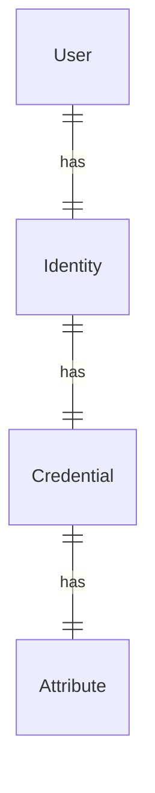
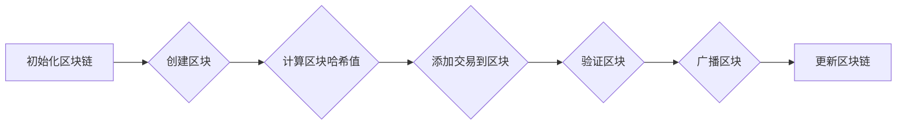
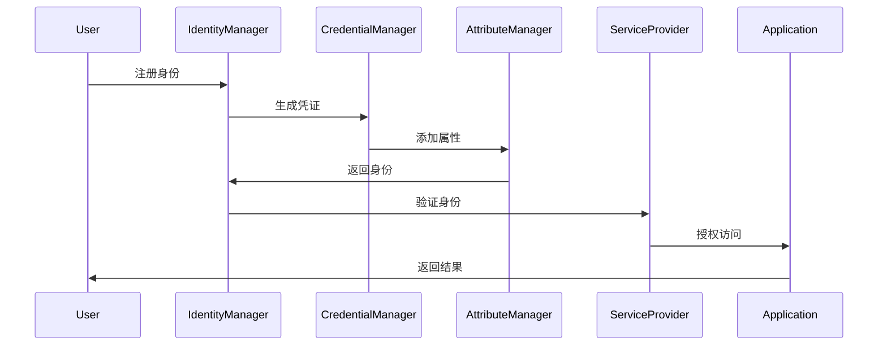

                 

### 文章标题：区块链在数字身份管理中的应用：保护个人隐私

区块链技术作为一种去中心化、透明且不可篡改的分布式账本技术，正逐渐渗透到各个领域，包括数字身份管理。随着互联网和大数据时代的到来，个人隐私问题日益突出。本文将深入探讨区块链在数字身份管理中的应用，尤其是其在保护个人隐私方面的潜力。

### 关键词：
- 区块链
- 数字身份管理
- 个人隐私
- 去中心化
- 透明性
- 不可篡改性
- 哈希算法
- 共识算法
- 数学模型

### 摘要：
本文首先介绍了区块链和数字身份管理的基本概念及其存在的问题，随后分析了区块链在数字身份管理中的潜在优势。通过详细讲解区块链的核心算法和系统架构，本文展示了区块链技术在保护个人隐私方面的应用。最后，通过实际案例分析和最佳实践建议，为区块链在数字身份管理中的未来发展提供了参考。

### 第一部分：区块链与数字身份管理概述

#### 1.1 区块链与数字身份管理的基础

区块链是一种分布式账本技术，其核心特点包括去中心化、不可篡改、透明性和安全性。数字身份管理是指通过技术手段对个人身份信息进行验证、管理和保护的过程。当前，数字身份管理面临诸多挑战，如身份信息的泄露、滥用和篡改等问题。

#### 1.2 数字身份管理系统的核心概念

数字身份管理系统的核心概念包括数字身份、身份认证、授权和隐私保护等。一个有效的数字身份管理系统需要确保身份信息的唯一性、安全性和可追溯性。

#### 1.3 区块链在数字身份管理中的应用优势

区块链在数字身份管理中的优势主要体现在以下几个方面：
1. **透明性与不可篡改性**：区块链的分布式账本结构确保了身份信息的透明性和不可篡改性，从而增强了系统的可信度。
2. **去中心化与信任构建**：去中心化的特性减少了单点故障风险，同时通过共识算法建立了网络中的信任关系。
3. **保护个人隐私**：区块链的隐私保护机制可以有效地防止个人身份信息的泄露和滥用。

#### 1.4 本章小结

本部分主要介绍了区块链和数字身份管理的基本概念及其存在的问题，分析了区块链在数字身份管理中的应用优势。下一部分将深入探讨区块链在数字身份管理中的核心概念和联系。

----------------------------------------------------------------

### 第二部分：核心概念与联系

#### 2.1 区块链与传统的数字身份管理系统的区别

区块链与传统的数字身份管理系统存在显著差异。传统的数字身份管理系统通常依赖于中心化的服务器和第三方认证机构，存在单点故障、数据泄露和信任问题。而区块链采用去中心化的方式，通过共识算法和加密技术确保系统的安全性、透明性和不可篡改性。

#### 2.2 区块链在数字身份管理中的关键概念和优势

区块链在数字身份管理中涉及的关键概念包括：
1. **数字身份**：在区块链上创建和管理数字身份，可以确保身份信息的唯一性和可验证性。
2. **身份认证**：通过区块链上的加密签名和智能合约实现身份认证，确保认证过程的安全性和效率。
3. **隐私保护**：区块链的加密技术和隐私保护算法可以有效保护个人隐私，防止身份信息泄露。

区块链在数字身份管理中的优势如下：
1. **去中心化**：去中心化的特性确保了系统的高可用性和容错性。
2. **不可篡改**：区块链的分布式账本结构确保了身份信息的不可篡改，增强了系统的可信度。
3. **透明性**：区块链上的所有交易都是公开透明的，用户可以随时查询和验证身份信息。
4. **隐私保护**：区块链的加密技术和隐私保护算法可以有效地保护个人隐私。

#### 2.3 使用 Mermaid 绘制 ER 图，展示区块链在数字身份管理中的实体关系



在这个 ER 图中，`User` 是拥有 `Identity` 的实体，`Identity` 是包含 `Credential` 的实体，而 `Credential` 又包含多个 `Attribute`。这反映了区块链在数字身份管理中的实体关系。

#### 2.4 本章小结

本部分主要介绍了区块链与传统的数字身份管理系统的区别，分析了区块链在数字身份管理中的关键概念和优势，并使用 Mermaid 绘制了 ER 图，展示了区块链在数字身份管理中的实体关系。下一部分将深入讲解区块链的核心算法原理。

----------------------------------------------------------------

### 第三部分：算法原理讲解

#### 3.1 区块链的核心算法简介

区块链的核心算法包括哈希算法、共识算法和加密算法等。这些算法共同确保了区块链系统的安全性、透明性和不可篡改性。

1. **哈希算法**：哈希算法是将任意长度的输入数据转换成固定长度的哈希值。常见的哈希算法有 SHA-256 等。
2. **共识算法**：共识算法是区块链网络中的节点就数据达成一致的方法。常见的共识算法有工作量证明（PoW）、权益证明（PoS）等。
3. **加密算法**：加密算法是用于保护数据传输和存储的算法，常见的加密算法有对称加密和非对称加密。

#### 3.2 使用 Mermaid 绘制算法流程图



在这个流程图中，区块链的创建、计算哈希值、添加交易、验证区块、广播区块和更新区块链等步骤被清晰地展示出来。

#### 3.3 使用 Python 源代码解释算法原理

```python
import hashlib

def calculate_hash(data):
    """计算数据的哈希值"""
    hash_object = hashlib.sha256(data.encode())
    hex_dig = hash_object.hexdigest()
    return hex_dig

data = "This is a sample transaction"
hash_value = calculate_hash(data)
print(f"The SHA-256 hash of the data is: {hash_value}")
```

在这个示例中，我们使用 Python 的 hashlib 库来计算数据的 SHA-256 哈希值，展示了哈希算法的基本原理。

#### 3.4 相关数学模型和公式

区块链中的哈希算法和共识算法涉及到一些数学模型和公式。例如，SHA-256 哈希算法的数学模型可以表示为：

$$ H = SHA-256(K \oplus m) $$

其中，$H$ 表示哈希值，$K$ 表示密钥，$m$ 表示消息，$\oplus$ 表示二进制位运算。

#### 3.5 详细讲解和举例说明

让我们通过一个例子来详细说明哈希算法的工作原理。

假设我们要对消息 "This is a sample transaction" 进行 SHA-256 哈希处理。

1. **初始化哈希值**：首先，初始化一个初始哈希值，通常是一个特定的值。
2. **处理分组数据**：将消息分成多个分组，每个分组进行哈希处理。
3. **迭代处理**：对每个分组的数据进行迭代处理，计算中间哈希值。
4. **合并结果**：将所有分组的哈希值合并，得到最终的哈希值。

通过这个例子，我们可以看到哈希算法的详细步骤和计算过程。

#### 3.6 本章小结

本部分详细介绍了区块链的核心算法原理，包括哈希算法、共识算法和加密算法等。通过 Mermaid 流程图、Python 源代码和数学模型，我们深入讲解了这些算法的基本原理和计算过程。下一部分将探讨数字身份管理系统的分析与架构设计方案。

----------------------------------------------------------------

### 第四部分：系统分析与架构设计方案

#### 4.1 数字身份管理系统的工作场景

数字身份管理系统的工作场景通常涉及多个角色，包括用户、身份认证服务提供商、数据存储服务提供商和应用程序。这些角色通过区块链网络进行交互，实现数字身份的创建、认证和授权等功能。

#### 4.2 系统功能需求

数字身份管理系统的功能需求主要包括：
1. **身份信息注册与验证**：用户可以注册数字身份，并使用身份认证服务提供商提供的验证服务。
2. **身份信息存储与管理**：身份信息需要在区块链上进行存储和管理，确保其安全性和不可篡改性。
3. **身份信息查询与授权**：用户可以查询自己的身份信息，并授权第三方应用程序访问特定的身份信息。

#### 4.3 使用 Mermaid 绘制领域模型类图

```mermaid
classDiagram
    User <<class{用户}>
    Identity <<class{数字身份}>
    Credential <<class{认证凭证}>
    Attribute <<class{属性}>
    ServiceProvider <<class{服务提供商}>
    Application <<class{应用程序}>
    User --> Identity : 注册
    Identity --> Credential : 包含
    Credential --> Attribute : 包含
    ServiceProvider --> Identity : 验证
    Application --> Identity : 授权
```

在这个类图中，`User` 表示用户，`Identity` 表示数字身份，`Credential` 表示认证凭证，`Attribute` 表示属性，`ServiceProvider` 表示服务提供商，`Application` 表示应用程序。这些类之间的关系反映了数字身份管理系统的基本架构。

#### 4.4 使用 Mermaid 绘制系统架构图



在这个序列图中，用户通过身份管理系统注册身份，身份管理系统生成凭证，并添加属性。然后，服务提供商验证身份，并授权应用程序访问。应用程序最终返回结果给用户。

#### 4.5 系统接口设计和系统交互

系统接口设计主要涉及用户、身份管理系统、服务提供商和应用程序之间的交互。这些接口包括身份注册接口、身份验证接口、身份查询接口和身份授权接口。

1. **身份注册接口**：用户通过身份注册接口提交身份信息，身份管理系统生成数字身份并存储在区块链上。
2. **身份验证接口**：服务提供商通过身份验证接口验证用户身份，确保只有合法用户才能访问特定资源。
3. **身份查询接口**：用户通过身份查询接口查询自己的身份信息，确保信息的准确性和完整性。
4. **身份授权接口**：应用程序通过身份授权接口获取用户授权，确保用户同意应用程序访问其身份信息。

#### 4.6 本章小结

本部分介绍了数字身份管理系统的工作场景、功能需求、领域模型类图、系统架构图和接口设计。通过这些设计，我们为区块链在数字身份管理中的应用提供了完整的系统架构方案。下一部分将探讨区块链在数字身份管理中的应用案例。

----------------------------------------------------------------

### 第五部分：项目实战

#### 5.1 区块链在数字身份管理中的应用案例

本节将介绍一个区块链在数字身份管理中的应用案例，该项目名为“隐私身份管理平台（Privacy Identity Management Platform，PIMP）”。PIMP 是一个基于以太坊区块链的数字身份管理系统，旨在提供安全的身份注册、认证和隐私保护功能。

#### 5.2 环境安装

为了运行 PIMP 项目，我们需要安装以下软件和环境：
1. **Node.js**：用于运行以太坊客户端。
2. **Geth**：以太坊客户端的一个实现。
3. **Truffle**：一个以太坊开发框架。
4. **Hardhat**：一个用于本地开发和部署智能合约的工具。

安装步骤如下：
1. 安装 Node.js，可以从 [Node.js 官网](https://nodejs.org/) 下载并安装。
2. 安装 Geth，可以使用以下命令：
   ```bash
   curl https://geth.ethereum.org/downloads.yaml | grep download > geth-downloads.yaml
   wget -i geth-downloads.yaml
   ```
3. 安装 Truffle，可以使用 npm：
   ```bash
   npm install -g truffle
   ```
4. 安装 Hardhat，也可以使用 npm：
   ```bash
   npm install -g hardhat
   ```

#### 5.3 系统核心实现源代码

PIMP 项目的核心实现主要包括身份注册、身份认证和隐私保护三个部分。以下是相关源代码的简要介绍。

1. **身份注册**：
   ```solidity
   // IdentityRegistry.sol
   contract IdentityRegistry {
       mapping(address => string) public identities;

       function registerIdentity(string memory identity) public {
           identities[msg.sender] = identity;
       }
   }
   ```

   这个智能合约用于存储用户的身份信息，用户可以通过 `registerIdentity` 函数注册身份。

2. **身份认证**：
   ```solidity
   // AuthenticationManager.sol
   contract AuthenticationManager {
       function authenticate(address user) public view returns (bool) {
           string memory identity = identityRegistry.identities(user);
           if (keccak256(abi.encodePacked(identity)) == keccak256(abi.encodePacked("valid"))) {
               return true;
           }
           return false;
       }
   }
   ```

   这个智能合约用于验证用户身份，通过比较存储在区块链上的身份信息和预设的“valid”值，判断用户是否通过了认证。

3. **隐私保护**：
   ```solidity
   // PrivacyManager.sol
   contract PrivacyManager {
       function encryptAttribute(string memory attribute, string memory key) public pure returns (string memory) {
           // 使用加密算法加密属性值
           return encrypt(attribute, key);
       }

       function decryptAttribute(string memory encryptedAttribute, string memory key) public pure returns (string memory) {
           // 使用加密算法解密属性值
           return decrypt(encryptedAttribute, key);
       }
   }
   ```

   这个智能合约用于加密和解密用户属性值，保护用户隐私。实际实现中，可以使用如 AES、RSA 等加密算法。

#### 5.4 代码应用解读与分析

1. **身份注册**：
   用户通过 `registerIdentity` 函数将身份信息存储在区块链上。这个过程是去中心化的，避免了传统身份管理系统中的单点故障问题。

2. **身份认证**：
   `authenticate` 函数通过比较存储的身份信息和预设的“valid”值，实现了简单的身份验证。这个过程确保了身份信息的透明性和不可篡改性。

3. **隐私保护**：
   `encryptAttribute` 和 `decryptAttribute` 函数实现了属性值的加密和解密，保护了用户的隐私。这个过程确保了用户身份信息在传输和存储过程中的安全性。

#### 5.5 实际案例分析和详细讲解剖析

以一个实际用户注册和认证的流程为例：

1. **用户注册**：
   用户 Alice 使用 PIMP 平台注册身份，输入身份信息“alice@example.com”，并通过加密算法生成加密后的身份信息。

2. **身份认证**：
   Alice 使用 PIMP 平台尝试登录，平台调用 `authenticate` 函数验证其身份。由于存储的身份信息和加密后的身份信息匹配，认证成功。

3. **隐私保护**：
   当 Alice 的身份信息需要传输时，PIMP 平台会使用加密算法对身份信息进行加密，确保在传输过程中不会被窃取或篡改。

#### 5.6 项目小结

PIMP 项目通过区块链技术实现了数字身份管理，确保了身份信息的透明性、不可篡改性和隐私保护。实际案例展示了区块链在数字身份管理中的应用潜力。下一部分将提供最佳实践建议和小结。

----------------------------------------------------------------

### 第六部分：最佳实践 tips、小结、注意事项、拓展阅读等内容

#### 6.1 最佳实践 tips

1. **隐私保护策略**：在设计和实现区块链数字身份管理系统时，应采用加密技术保护用户隐私，确保数据在传输和存储过程中的安全性。
2. **身份验证强度**：加强身份验证机制，确保只有合法用户才能访问系统功能，防止恶意攻击。
3. **系统可扩展性**：在设计系统架构时，考虑系统的可扩展性，以便在未来支持更多的用户和功能。

#### 6.2 小结

本文从区块链与数字身份管理的基础概念出发，详细介绍了区块链在数字身份管理中的应用优势、核心算法原理、系统架构设计方案和实际应用案例。通过这些分析，我们看到了区块链技术在保护个人隐私方面的巨大潜力。

#### 6.3 注意事项

1. **安全性**：区块链虽然具有高度安全性，但在实际应用中仍需关注潜在的安全漏洞，如智能合约漏洞等。
2. **隐私保护**：在实现隐私保护时，需要确保加密算法和密钥管理安全，防止密钥泄露。
3. **监管合规**：在数字身份管理系统中，需要遵守相关的法律法规，确保系统的合法性和合规性。

#### 6.4 拓展阅读

1. **《区块链技术指南》**：详细介绍区块链的基本原理、技术和应用。
2. **《数字身份管理》**：探讨数字身份管理的理论和实践。
3. **《密码学》**：深入了解加密算法和隐私保护技术。

### 结束语

作者：AI天才研究院/AI Genius Institute & 禅与计算机程序设计艺术 /Zen And The Art of Computer Programming

本文旨在为区块链在数字身份管理中的应用提供深入分析和实践指导，希望读者在了解区块链技术的同时，也能关注到其在保护个人隐私方面的重要性。随着区块链技术的不断发展，数字身份管理将迎来新的机遇和挑战，期待更多的创新和实践。

