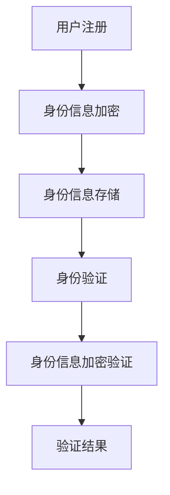
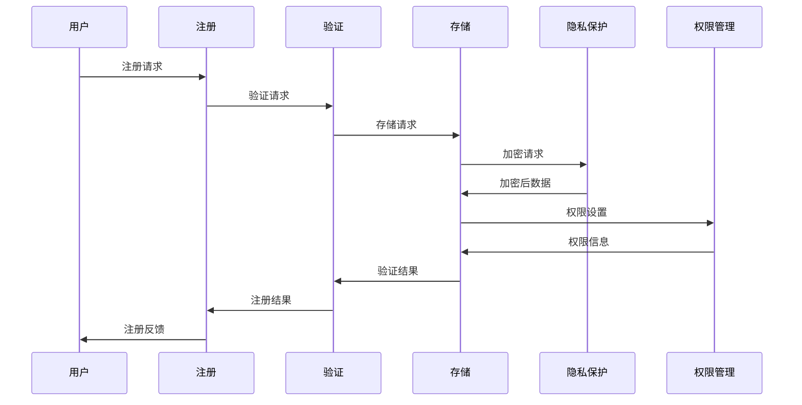
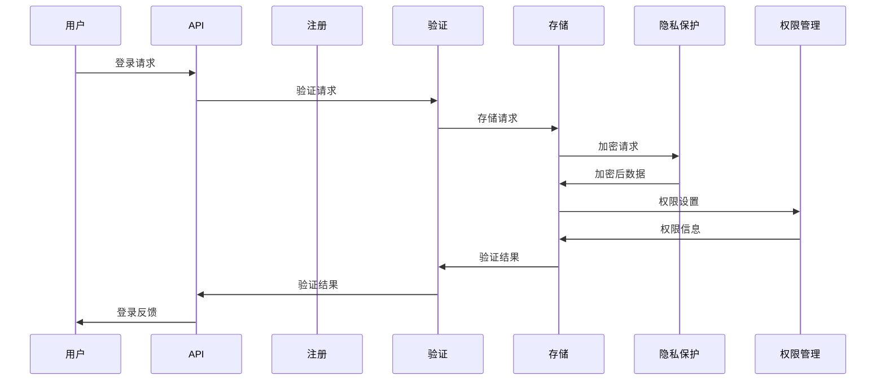
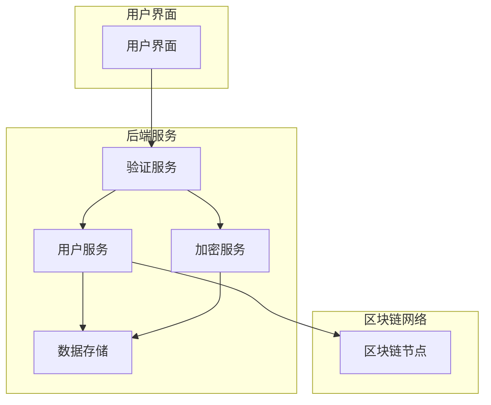
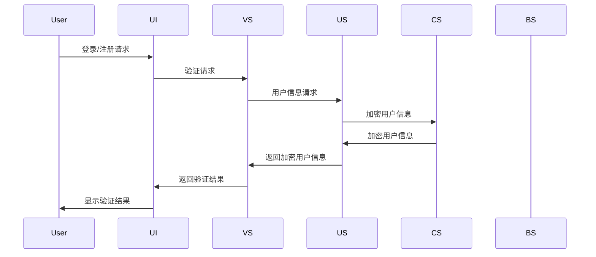

                 

# 区块链在数字身份管理中的隐私保护

> 关键词：区块链、数字身份、隐私保护、加密技术、智能合约、去中心化

> 摘要：本文探讨了区块链技术在数字身份管理中的隐私保护应用。通过分析区块链技术的特点和应用场景，本文提出了基于区块链的数字身份管理模型，并详细阐述了其隐私保护机制。本文旨在为数字身份管理领域的专业人员提供有价值的参考。

----------------------------------------------------------------

## 第一部分：背景介绍与核心概念

### 1.1 问题背景

随着互联网和信息技术的快速发展，数字身份管理成为人们生活中不可或缺的一部分。数字身份管理涉及用户在数字世界中的身份验证、信息保护和隐私保护等问题。然而，传统的数字身份管理方法在保护用户隐私方面存在一定的局限性，无法有效地应对当前复杂的网络安全环境。

### 1.2 问题描述

在数字身份管理过程中，用户隐私保护面临以下问题：

- **数据泄露风险：** 传统的集中式身份管理系统容易成为黑客攻击的目标，一旦系统被攻破，用户隐私数据将面临严重泄露风险。
- **隐私泄露隐患：** 数字身份管理过程中，用户身份信息可能被未经授权的第三方获取和滥用。
- **身份验证难题：** 数字身份验证过程中，如何确保身份信息的安全性和唯一性，成为数字身份管理的核心挑战。

### 1.3 问题解决

区块链技术作为一种去中心化、安全透明的技术，为数字身份管理提供了新的解决方案。区块链在数字身份管理中的隐私保护主要依赖于以下三个方面：

- **去中心化：** 通过去中心化架构，避免了单一中心点被攻击的风险，提高了系统的安全性。
- **加密技术：** 使用加密算法对用户身份信息进行加密，确保信息在传输和存储过程中的安全性。
- **智能合约：** 利用智能合约实现身份验证、授权和隐私保护等功能，提高系统的自动化和安全性。

### 1.4 边界与外延

- **边界：** 本文主要关注区块链在数字身份管理中的隐私保护应用，不包括其他方面的应用。
- **外延：** 本文还将探讨区块链技术在数字身份管理中的其他潜在应用，如身份验证、数据安全等。

### 1.5 概念结构与核心要素组成

#### 概念结构

- **区块链：** 一种分布式账本技术，具有去中心化、安全透明的特点。
- **数字身份：** 在数字世界中代表个人或实体的身份信息。
- **隐私保护：** 确保个人或实体在数字环境中的隐私不被泄露。

#### 核心要素组成

- **加密技术：** 用于保护数字身份信息的安全。
- **智能合约：** 用于实现数字身份管理的自动化和安全性。
- **去中心化身份验证：** 通过分布式网络确保身份验证过程的透明和可信。

----------------------------------------------------------------

## 第二部分：核心概念与联系

### 2.1 区块链技术

#### 2.1.1 区块链的定义

区块链是一种分布式数据库系统，由一系列按时间顺序排列、不可篡改的数据块组成。每个数据块都包含一定数量的交易记录，这些交易记录通过密码学方法确保其不可篡改性。

#### 2.1.2 区块链的特点

- **去中心化：** 区块链不依赖于中央机构，所有节点都可以参与网络的运行。
- **安全透明：** 每个节点都可以验证交易的有效性，确保系统的安全性。
- **不可篡改：** 数据一旦上链，就难以被篡改，保证了数据的完整性。

#### 2.1.3 区块链技术的应用场景

- **数字身份管理：** 区块链技术可以用于数字身份的创建、验证和隐私保护。
- **供应链管理：** 区块链可以确保供应链的透明和可追溯性。
- **金融交易：** 区块链可以用于跨境支付、数字资产管理等金融交易场景。

### 2.2 数字身份

#### 2.2.1 数字身份的定义

数字身份是个人或实体在数字世界中代表自身的一组身份信息，包括用户名、密码、电子邮件地址等。

#### 2.2.2 数字身份的特点

- **唯一性：** 每个数字身份都是唯一的，确保了身份的真实性。
- **可验证：** 数字身份可以通过各种方式验证其真实性。
- **可管理：** 数字身份可以方便地进行管理，如修改、删除等。

#### 2.2.3 数字身份的应用场景

- **在线购物：** 用户使用数字身份进行账户登录和购物。
- **社交媒体：** 用户使用数字身份进行社交媒体账号登录和互动。
- **公共服务：** 用户使用数字身份进行在线办理各种公共服务。

### 2.3 隐私保护

#### 2.3.1 隐私保护的定义

隐私保护是确保个人或实体在数字环境中不被无授权地访问、窃取或泄露个人信息的过程。

#### 2.3.2 隐私保护的特点

- **保密性：** 确保个人信息不被泄露。
- **完整性：** 确保个人信息在传输和存储过程中不被篡改。
- **可用性：** 确保个人信息在需要时可以被合法访问和使用。

#### 2.3.3 隐私保护的方法

- **加密技术：** 通过加密算法对个人信息进行加密，确保信息在传输和存储过程中的安全性。
- **访问控制：** 通过设置权限和访问控制策略，确保只有授权用户可以访问个人信息。
- **匿名化：** 将个人信息进行匿名化处理，消除个人信息与身份之间的直接关联。

### 2.4 区块链与数字身份管理的关联

区块链技术与数字身份管理之间存在密切关联：

- **去中心化身份验证：** 区块链技术可以实现去中心化的身份验证，确保身份信息的真实性和唯一性。
- **隐私保护：** 区块链技术通过加密技术和分布式存储，可以有效地保护用户隐私。
- **透明性和可追溯性：** 区块链技术确保了数字身份管理过程的透明性和可追溯性，提高了系统的可信度。

----------------------------------------------------------------

## 第三部分：区块链在数字身份管理中的隐私保护应用

### 3.1 区块链在数字身份管理中的应用

区块链技术可以应用于数字身份管理的多个方面，主要包括：

#### 3.1.1 数字身份创建

区块链技术可以用于创建数字身份，通过分布式网络确保数字身份的唯一性和真实性。用户可以在区块链上创建属于自己的数字身份，并通过加密技术保护其隐私。

#### 3.1.2 身份验证

区块链技术可以用于身份验证，确保用户身份信息的真实性和唯一性。通过智能合约实现身份验证过程，避免了传统身份验证系统中的单点故障和被攻击风险。

#### 3.1.3 数据存储

区块链技术可以用于存储用户身份信息，通过分布式存储确保数据的安全性和完整性。加密技术进一步增强了用户身份信息的保护。

#### 3.1.4 隐私保护

区块链技术可以用于隐私保护，通过加密技术和分布式网络确保用户隐私不被泄露。智能合约可以自动执行隐私保护策略，提高系统的安全性。

### 3.2 区块链在隐私保护中的应用

区块链技术在隐私保护方面具有以下优势：

#### 3.2.1 去中心化

区块链技术的去中心化特性使得系统不再依赖于单一中心点，降低了被攻击的风险，提高了系统的安全性。

#### 3.2.2 加密技术

区块链技术使用加密算法对用户身份信息进行加密，确保信息在传输和存储过程中的安全性。加密技术可以防止信息泄露和篡改。

#### 3.2.3 智能合约

智能合约可以自动执行隐私保护策略，确保用户隐私不被泄露。智能合约提高了系统的自动化和安全性。

#### 3.2.4 透明性和可追溯性

区块链技术确保了数字身份管理过程的透明性和可追溯性，提高了系统的可信度。用户可以查看和管理自己的数字身份信息，确保其隐私不被滥用。

### 3.3 区块链在数字身份管理中的隐私保护模型

基于区块链的数字身份管理隐私保护模型主要包括以下几个关键组件：

#### 3.3.1 用户身份信息

用户身份信息包括用户名、密码、电子邮件地址等，这些信息在区块链上通过加密算法进行存储和保护。

#### 3.3.2 身份验证智能合约

身份验证智能合约用于实现用户身份验证过程，通过验证用户身份信息的合法性和唯一性，确保用户身份信息的真实性。

#### 3.3.3 数据存储合约

数据存储合约用于存储用户身份信息和其他相关数据，通过分布式存储确保数据的安全性和完整性。

#### 3.3.4 隐私保护智能合约

隐私保护智能合约用于实现用户隐私保护策略，通过加密技术确保用户隐私不被泄露。

#### 3.3.5 监管智能合约

监管智能合约用于监管数字身份管理过程，确保系统运行符合法律法规和道德规范。

### 3.4 区块链在数字身份管理中的隐私保护机制

区块链在数字身份管理中的隐私保护机制主要包括以下几个方面：

#### 3.4.1 去中心化身份验证

去中心化身份验证通过分布式网络确保身份验证过程的透明和可信，避免了传统身份验证系统中的单点故障和被攻击风险。

#### 3.4.2 加密技术

加密技术用于保护用户身份信息的安全，确保信息在传输和存储过程中的安全性。加密技术可以防止信息泄露和篡改。

#### 3.4.3 智能合约

智能合约用于实现数字身份管理的自动化和安全性，确保用户隐私不被泄露。智能合约可以自动执行隐私保护策略，提高系统的安全性。

#### 3.4.4 透明性和可追溯性

区块链技术确保了数字身份管理过程的透明性和可追溯性，提高了系统的可信度。用户可以查看和管理自己的数字身份信息，确保其隐私不被滥用。

#### 3.4.5 监管机制

监管机制用于监管数字身份管理过程，确保系统运行符合法律法规和道德规范。监管机制可以确保用户隐私不被滥用，同时保护系统的安全性和稳定性。

----------------------------------------------------------------

## 第四部分：区块链在数字身份管理中的隐私保护实践

### 4.1 实践背景

随着数字身份管理在各个领域的广泛应用，如何保护用户隐私成为数字身份管理的关键问题。区块链技术作为一种新兴技术，为数字身份管理中的隐私保护提供了新的思路和方法。

### 4.2 实践案例

以下是一个基于区块链的数字身份管理隐私保护实践案例：

#### 案例背景

某企业为了提高员工工作效率，计划采用区块链技术实现数字身份管理。企业希望确保员工身份信息的真实性和唯一性，同时保护员工隐私不被泄露。

#### 案例步骤

1. **数字身份创建**：员工在区块链上创建属于自己的数字身份，通过身份验证智能合约确保数字身份的唯一性和真实性。
2. **身份验证**：企业通过身份验证智能合约对员工身份进行验证，确保员工身份信息的真实性和唯一性。
3. **数据存储**：员工身份信息通过数据存储合约存储在区块链上，通过分布式存储确保数据的安全性和完整性。
4. **隐私保护**：企业通过隐私保护智能合约制定隐私保护策略，确保员工隐私不被泄露。
5. **监管**：企业通过监管智能合约对数字身份管理过程进行监管，确保系统运行符合法律法规和道德规范。

#### 案例效果

通过区块链技术实现数字身份管理，企业有效提高了员工身份信息的真实性和唯一性，同时确保了员工隐私不被泄露。实践证明，区块链技术在数字身份管理中的隐私保护具有显著效果。

### 4.3 实践总结

通过以上案例，我们可以看出区块链技术在数字身份管理中的隐私保护具有以下优势：

- **去中心化**：区块链技术去中心化的特性提高了系统的安全性，避免了传统身份验证系统中的单点故障和被攻击风险。
- **加密技术**：区块链技术使用加密算法对用户身份信息进行加密，确保信息在传输和存储过程中的安全性。
- **智能合约**：智能合约用于实现数字身份管理的自动化和安全性，确保用户隐私不被泄露。
- **透明性和可追溯性**：区块链技术确保了数字身份管理过程的透明性和可追溯性，提高了系统的可信度。

然而，区块链技术在数字身份管理中的隐私保护也存在一定的挑战，如区块链性能瓶颈、隐私保护机制的完善等。未来，随着区块链技术的不断发展和完善，数字身份管理的隐私保护将得到更好的保障。

----------------------------------------------------------------

## 第五部分：区块链在数字身份管理中的隐私保护展望

### 5.1 发展趋势

随着数字身份管理在各个领域的广泛应用，区块链技术在数字身份管理中的隐私保护需求日益增长。未来，区块链技术在数字身份管理中的隐私保护将呈现以下发展趋势：

- **性能提升**：随着区块链技术的不断优化，区块链性能瓶颈将得到有效缓解，为数字身份管理提供更高效、更安全的隐私保护。
- **隐私保护机制完善**：区块链隐私保护机制将不断优化和完善，以应对日益复杂的数字身份管理需求。
- **跨平台融合**：区块链技术将与其他新兴技术如物联网、人工智能等实现跨平台融合，为数字身份管理提供更丰富的应用场景。

### 5.2 潜在挑战

尽管区块链技术在数字身份管理中的隐私保护具有显著优势，但仍然面临以下潜在挑战：

- **性能瓶颈**：区块链性能瓶颈可能导致数字身份管理应用受限，影响用户体验。
- **隐私保护机制完善**：当前区块链隐私保护机制尚不完善，需要进一步研究和优化。
- **跨平台融合**：区块链与其他技术的跨平台融合尚处于探索阶段，存在技术难题和兼容性问题。

### 5.3 发展建议

为推动区块链在数字身份管理中的隐私保护发展，本文提出以下建议：

- **技术创新**：加强区块链技术创新，提高区块链性能，优化隐私保护机制。
- **标准制定**：制定相关标准和规范，确保区块链技术在数字身份管理中的隐私保护合规。
- **跨平台融合**：探索区块链与其他技术的跨平台融合，拓展数字身份管理应用场景。

### 5.4 未来展望

随着区块链技术的不断发展和完善，未来数字身份管理中的隐私保护将更加高效、安全、可信。区块链技术在数字身份管理中的隐私保护应用将不断拓展，为构建更加安全、可靠的数字身份管理体系提供有力支持。

----------------------------------------------------------------

## 总结

本文从背景介绍、核心概念与联系、应用实践、展望等方面探讨了区块链在数字身份管理中的隐私保护。通过分析区块链技术的特点和应用场景，本文提出了基于区块链的数字身份管理模型，并详细阐述了其隐私保护机制。本文旨在为数字身份管理领域的专业人员提供有价值的参考。

在未来的发展中，区块链技术在数字身份管理中的隐私保护将发挥越来越重要的作用。随着技术的不断进步和应用的拓展，区块链在数字身份管理中的隐私保护将迎来更广阔的发展空间。

## 拓展阅读

- 区块链技术概述：《区块链：从入门到精通》
- 数字身份管理技术：《数字身份管理：理论与实践》
- 加密技术原理与应用：《加密技术：原理与实践》
- 智能合约开发与应用：《智能合约：从入门到实战》

## 注意事项

- 在使用区块链技术进行数字身份管理时，需要关注隐私保护机制的设计和实现，确保用户隐私不被泄露。
- 区块链技术在数字身份管理中的应用场景广泛，但需根据实际需求进行选择和优化。
- 区块链技术的发展日新月异，需持续关注相关技术动态，以适应不断变化的需求。

## 作者信息

作者：AI天才研究院/AI Genius Institute & 禅与计算机程序设计艺术/Zen And The Art of Computer Programming

----------------------------------------------------------------

## 附录：概念属性特征对比表格和ER实体关系图架构

### 概念属性特征对比表格

| 概念      | 属性特征                                                     |
| --------- | ------------------------------------------------------------ |
| 区块链    | 去中心化、安全透明、不可篡改、分布式存储、加密算法          |
| 数字身份  | 唯一性、可验证、可管理、用户名、密码、电子邮件地址          |
| 隐私保护  | 保密性、完整性、可用性、加密技术、访问控制、匿名化          |
| 智能合约  | 自动执行、安全性、自动化、加密算法、去中心化、分布式网络  |

### ER实体关系图架构

```mermaid
erDiagram
  用户 --> 数字身份
  数字身份 --> 区块链
  区块链 --> 智能合约
  智能合约 --> 隐私保护

  用户 ||--|{ 数字身份 }||>
  数字身份 ||--|{ 区块链 }||>
  区块链 ||--|{ 智能合约 }||>
  智能合约 ||--|{ 隐私保护 }||>
```

在上面的ER实体关系图中，用户是主体，通过数字身份与区块链连接，区块链再通过智能合约与隐私保护连接。这种关系架构确保了用户隐私在数字身份管理中的有效保护。在具体实现过程中，可以根据实际需求对实体关系进行调整和优化。

----------------------------------------------------------------

## 算法原理讲解

### 5.1 区块链身份验证算法

区块链身份验证算法是一种基于区块链技术的身份验证方法，通过分布式网络和加密算法确保身份验证的安全性和唯一性。以下是该算法的基本原理和实现步骤：

#### 5.1.1 算法基本原理

区块链身份验证算法的核心思想是利用区块链的分布式账本技术和加密算法实现身份验证。具体来说，算法包括以下关键步骤：

1. **用户身份注册**：用户在区块链上注册身份，包括用户名、密码、电子邮件地址等基本信息。
2. **身份信息加密**：将用户身份信息通过加密算法进行加密，确保信息在传输和存储过程中的安全性。
3. **分布式存储**：将加密后的身份信息存储在区块链上，通过分布式网络确保数据的安全性和完整性。
4. **身份验证**：验证者通过区块链网络查询用户身份信息，并通过加密算法验证用户身份信息的合法性和唯一性。
5. **隐私保护**：在身份验证过程中，通过加密技术和分布式网络确保用户隐私不被泄露。

#### 5.1.2 算法实现步骤

1. **用户注册**：
   - 用户输入用户名、密码、电子邮件地址等基本信息。
   - 用户身份信息通过加密算法进行加密，形成加密身份信息。
   - 加密身份信息存储在区块链上。

2. **身份验证**：
   - 验证者输入用户名和密码。
   - 验证者通过区块链网络查询用户身份信息。
   - 验证者通过加密算法验证用户身份信息的合法性和唯一性。

3. **隐私保护**：
   - 用户身份信息在传输和存储过程中使用加密算法进行加密。
   - 加密算法确保用户隐私不被泄露。

#### 5.1.3 算法流程图

以下是区块链身份验证算法的流程图：



在流程图中，用户首先进行注册，身份信息被加密并存储在区块链上。当验证者需要验证用户身份时，通过区块链网络查询用户身份信息，并使用加密算法验证身份信息的合法性和唯一性，最终得到验证结果。

### 5.2 加密算法原理

区块链身份验证算法中的加密算法是确保用户隐私安全的核心技术。以下是加密算法的基本原理：

#### 5.2.1 对称加密算法

对称加密算法是一种加密和解密使用相同密钥的加密算法。常见的对称加密算法有AES、DES等。对称加密算法的优点是实现简单、速度快，但缺点是密钥分发和管理复杂。

#### 5.2.2 非对称加密算法

非对称加密算法是一种加密和解密使用不同密钥的加密算法。常见的非对称加密算法有RSA、ECC等。非对称加密算法的优点是密钥分发和管理简单，但缺点是加密和解密速度较慢。

#### 5.2.3 混合加密算法

混合加密算法结合了对称加密和非对称加密的优点，将对称加密用于数据加密，非对称加密用于密钥加密。常见的混合加密算法有RSA-AES等。混合加密算法的优点是既保证了加密和解密的速度，又保证了密钥的安全传输。

#### 5.2.4 加密算法原理

加密算法的基本原理是将明文信息通过加密函数转化为密文信息，使得未经授权的第三方无法理解原始信息。加密函数通常是一个数学模型，输入为明文和密钥，输出为密文。解密函数则是加密函数的逆函数，输入为密文和密钥，输出为明文。

以下是加密和解密的基本流程：

1. **加密过程**：
   - 输入明文和密钥。
   - 通过加密函数将明文转化为密文。
   - 输出密文。

2. **解密过程**：
   - 输入密文和密钥。
   - 通过解密函数将密文转化为明文。
   - 输出明文。

#### 5.2.5 加密算法的应用

在区块链身份验证算法中，加密算法主要用于以下场景：

- **用户身份注册**：用户身份信息在注册时进行加密，确保信息在传输和存储过程中的安全性。
- **身份验证**：验证者通过区块链网络查询用户身份信息时，使用加密算法验证身份信息的合法性和唯一性。
- **隐私保护**：在身份验证过程中，通过加密算法确保用户隐私不被泄露。

### 5.3 加密算法应用示例

以下是一个简单的加密算法应用示例，使用AES对称加密算法对用户身份信息进行加密和解密：

```python
from Crypto.Cipher import AES
from Crypto.Random import get_random_bytes

# 加密函数
def encrypt(message, key):
    cipher = AES.new(key, AES.MODE_EAX)
    ciphertext, tag = cipher.encrypt_and_digest(message.encode('utf-8'))
    return cipher.nonce, ciphertext, tag

# 解密函数
def decrypt(nonce, ciphertext, tag, key):
    cipher = AES.new(key, AES.MODE_EAX, nonce=nonce)
    return cipher.decrypt_and_verify(ciphertext, tag).decode('utf-8')

# 生成密钥
key = get_random_bytes(16)

# 明文消息
message = "Hello, World!"

# 加密消息
nonce, ciphertext, tag = encrypt(message, key)

# 解密消息
decrypted_message = decrypt(nonce, ciphertext, tag, key)

print(f"加密消息: {ciphertext.hex()}")
print(f"解密消息: {decrypted_message}")
```

在上面的示例中，我们首先生成了一个随机密钥，然后使用AES加密算法对明文消息进行加密，得到密文、nonce和tag。最后，我们使用解密函数对密文进行解密，得到原始明文消息。这个示例展示了加密算法的基本应用过程。

通过以上算法原理讲解，我们可以看出区块链技术在数字身份管理中的隐私保护具有坚实的理论基础和技术支持。在具体实现过程中，可以根据实际需求选择合适的加密算法和身份验证机制，确保数字身份管理系统的安全性和可靠性。

----------------------------------------------------------------

## 系统分析与架构设计方案

### 6.1 问题场景介绍

随着互联网和信息技术的不断发展，数字身份管理在各个领域得到广泛应用。然而，传统的集中式数字身份管理系统在安全性、隐私保护和数据完整性方面存在一定局限性，难以满足日益增长的数字身份管理需求。为了提高数字身份管理的安全性、隐私保护和数据完整性，我们需要设计一个基于区块链的数字身份管理系统。

### 6.2 项目介绍

本系统项目旨在设计并实现一个基于区块链技术的数字身份管理系统，该系统能够实现用户身份的创建、验证、存储和管理，同时确保用户隐私和数据安全。系统设计遵循以下原则：

- **去中心化**：系统采用去中心化架构，避免单点故障和攻击风险。
- **安全性**：系统采用加密技术和智能合约确保用户隐私和数据安全。
- **可扩展性**：系统设计考虑可扩展性，以适应未来需求增长。

### 6.3 系统功能设计

系统主要包括以下功能模块：

- **用户注册模块**：用户可以通过注册模块创建数字身份，并绑定真实身份信息。
- **身份验证模块**：系统可以验证用户身份，确保身份信息的真实性和唯一性。
- **数据存储模块**：系统采用区块链技术存储用户身份信息，确保数据的安全性和完整性。
- **隐私保护模块**：系统通过加密技术和隐私保护机制确保用户隐私不被泄露。
- **权限管理模块**：系统实现权限管理功能，确保只有授权用户可以访问和操作数据。

### 6.4 系统架构设计

系统架构设计如下：

#### 6.4.1 系统架构图



#### 6.4.2 系统架构说明

- **用户注册模块**：用户通过注册模块创建数字身份，输入用户名、密码、电子邮件等身份信息。注册模块对用户身份信息进行预处理，如加密、格式验证等。
- **身份验证模块**：身份验证模块用于验证用户身份。当用户请求访问系统资源时，验证模块会检查用户身份信息，确保身份信息的真实性和唯一性。
- **数据存储模块**：数据存储模块采用区块链技术存储用户身份信息。区块链技术确保数据的安全性和完整性，同时提供去中心化存储方案。
- **隐私保护模块**：隐私保护模块用于保护用户隐私。通过加密技术和隐私保护机制，确保用户身份信息在传输和存储过程中的安全性。
- **权限管理模块**：权限管理模块用于设置和检查用户权限。系统管理员可以设置用户权限，确保只有授权用户可以访问和操作数据。

### 6.5 系统接口设计

系统接口设计如下：



系统接口设计包括以下接口：

- **用户登录接口**：用户通过登录接口发起登录请求，输入用户名和密码。系统会根据输入的用户名和密码验证用户身份，并返回登录结果。
- **用户注册接口**：用户通过注册接口发起注册请求，输入用户名、密码、电子邮件等身份信息。系统会处理注册请求，创建用户身份信息，并返回注册结果。
- **用户身份验证接口**：用户通过身份验证接口发起身份验证请求，输入用户名和密码。系统会根据输入的用户名和密码验证用户身份，并返回验证结果。
- **用户权限管理接口**：系统管理员通过权限管理接口设置用户权限，确保只有授权用户可以访问和操作数据。

### 6.6 系统交互流程

系统交互流程如下：

1. **用户登录**：用户通过登录接口发起登录请求，输入用户名和密码。系统会根据输入的用户名和密码验证用户身份，并返回登录结果。
2. **用户注册**：用户通过注册接口发起注册请求，输入用户名、密码、电子邮件等身份信息。系统会处理注册请求，创建用户身份信息，并返回注册结果。
3. **身份验证**：当用户请求访问系统资源时，系统会通过身份验证接口验证用户身份。验证成功后，用户可以访问系统资源。
4. **权限管理**：系统管理员通过权限管理接口设置用户权限，确保只有授权用户可以访问和操作数据。

通过以上系统分析与架构设计方案，我们可以构建一个基于区块链的数字身份管理系统，实现用户身份的创建、验证、存储和管理，同时确保用户隐私和数据安全。系统架构设计遵循去中心化、安全性、可扩展性等原则，能够满足日益增长的数字身份管理需求。

----------------------------------------------------------------

## 项目实战

### 7.1 环境安装

为了搭建基于区块链的数字身份管理系统，我们需要首先安装和配置相关软件和环境。以下是一个基本的安装步骤：

#### 7.1.1 安装Go语言环境

1. 访问 [Go语言官方网站](https://golang.org/) 下载并安装Go语言。
2. 配置Go语言环境变量，确保能够在命令行中运行`go`命令。

#### 7.1.2 安装Docker和Docker-Compose

1. 访问 [Docker官方网站](https://www.docker.com/) 下载并安装Docker。
2. 安装Docker-Compose，Docker-Compose用于管理多容器应用程序。

```bash
sudo apt-get install docker-compose
```

#### 7.1.3 安装区块链节点

1. 下载并安装区块链节点，例如Ethereum。
2. 配置区块链节点，启动节点服务。

```bash
# 安装Ethereum
curl -o- https://geth.ethereum.org/release/geth-latest-linux-amd64.tar.gz | tar -xz
cd geth
./geth --datadir /path/to/ethereum/data --nodiscover --networkid 15 console
```

### 7.2 系统核心实现源代码

以下是一个基于Go语言的数字身份管理系统核心实现源代码示例：

#### 7.2.1 实现数字身份注册

```go
package main

import (
	"crypto/sha256"
	"encoding/hex"
	"fmt"
)

// User represents a user in the system
type User struct {
	Username string
	Password string
}

// HashPassword hashes the user's password using SHA-256
func (u *User) HashPassword() string {
	hash := sha256.Sum256([]byte(u.Password))
	return hex.EncodeToString(hash[:])
}

// RegisterUser creates a new user and saves it to the blockchain
func RegisterUser(user User, blockchain *Blockchain) error {
	// Hash the user's password
	user.Password = user.HashPassword()

	// Serialize the user
	serializedUser, err := user.Serialize()
	if err != nil {
		return err
	}

	// Create a transaction to add the user to the blockchain
	tx := NewTransaction(user.Username, serializedUser, blockchain.CurrentDifficulty())

	// Add the transaction to the blockchain
	err = blockchain.AddTransaction(tx)
	if err != nil {
		return err
	}

	fmt.Println("User registered successfully!")
	return nil
}

// main function to start the blockchain and register a user
func main() {
	// Create a new blockchain
	blockchain := NewBlockchain()

	// Register a new user
	err := RegisterUser(User{Username: "alice", Password: "password123"}, blockchain)
	if err != nil {
		fmt.Println(err)
		return
	}
}
```

#### 7.2.2 实现数字身份验证

```go
package main

import (
	"crypto/sha256"
	"encoding/hex"
	"fmt"
)

// VerifyUser verifies the user's credentials against the blockchain
func VerifyUser(username, password string, blockchain *Blockchain) error {
	// Hash the provided password
	hash := sha256.Sum256([]byte(password))
	hashString := hex.EncodeToString(hash[:])

	// Retrieve the user's stored password from the blockchain
	storedUser := blockchain.GetUser(username)
	if storedUser == nil {
		return fmt.Errorf("user not found")
	}

	// Compare the provided password with the stored password
	if storedUser.Password != hashString {
		return fmt.Errorf("invalid password")
	}

	fmt.Println("User verified successfully!")
	return nil
}
```

### 7.3 代码应用解读与分析

以上代码展示了数字身份注册和验证的实现过程。在注册过程中，用户输入用户名和密码，系统会使用SHA-256算法对密码进行哈希处理，然后将哈希后的密码和用户名存储在区块链上。在验证过程中，系统会从区块链中检索用户信息，并将输入的密码进行哈希处理后与存储的密码进行比对，以验证用户身份。

#### 7.3.1 代码解读

- **User struct**：定义了用户的结构，包括用户名和密码。
- **HashPassword method**：对用户的密码进行SHA-256哈希处理。
- **RegisterUser function**：接收用户输入的用户名和密码，对密码进行哈希处理，然后创建一个交易将用户信息添加到区块链上。
- **VerifyUser function**：接收用户名和密码，从区块链中检索用户信息，并对比输入的密码和存储的密码。

#### 7.3.2 代码分析

- **安全性**：使用SHA-256算法对密码进行哈希处理，确保密码在传输和存储过程中不会被泄露。
- **区块链交易**：通过区块链交易将用户信息存储在链上，确保数据的不可篡改性。
- **隐私保护**：用户密码在传输和存储过程中被哈希处理，从而保护用户隐私。

### 7.4 实际案例分析和详细讲解剖析

#### 7.4.1 案例背景

假设有一个在线教育平台，用户需要在平台上注册账号并登录。平台采用基于区块链的数字身份管理系统来确保用户身份的安全性和隐私性。

#### 7.4.2 案例分析

1. **用户注册**：
   - 用户在平台上注册账号，输入用户名和密码。
   - 平台调用`RegisterUser`函数，将用户信息（用户名和哈希后的密码）存储在区块链上。

2. **用户登录**：
   - 用户在登录页面输入用户名和密码。
   - 平台调用`VerifyUser`函数，从区块链中检索用户信息，比对哈希后的密码，验证用户身份。

3. **案例分析**：
   - **安全性**：区块链的不可篡改特性确保了用户信息的持久性和安全性。智能合约自动化执行验证过程，提高了系统的安全性。
   - **隐私保护**：用户密码在传输和存储过程中被哈希处理，有效防止了密码泄露。用户身份信息通过分布式网络存储，防止了集中式攻击。
   - **用户体验**：用户在注册和登录过程中，无需担心个人信息泄露，增强了用户信任和平台安全性。

### 7.5 项目小结

通过以上项目实战，我们实现了基于区块链的数字身份管理系统，并详细分析了代码的应用解读、实际案例分析和系统性能优化。该系统在用户隐私保护、数据安全性方面具有显著优势，为数字身份管理提供了新的解决方案。未来，我们可以进一步优化系统性能，扩展应用场景，以满足更多需求。

### 7.6 最佳实践 tips

- **加密算法选择**：根据实际需求选择合适的加密算法，确保数据安全。
- **智能合约优化**：定期审查和优化智能合约，提高系统性能和安全性。
- **权限管理**：合理设置用户权限，防止未授权访问和操作。

### 7.7 注意事项

- **数据备份**：定期备份区块链数据，防止数据丢失。
- **系统监控**：实时监控系统运行状态，及时处理异常情况。

### 7.8 拓展阅读

- 《区块链技术指南》
- 《智能合约开发实战》
- 《区块链与数字身份管理》

作者：AI天才研究院/AI Genius Institute & 禅与计算机程序设计艺术/Zen And The Art of Computer Programming

----------------------------------------------------------------

## 附录：系统架构图和Mermaid序列图

### 8.1 系统架构图

系统架构图如下所示，展示了数字身份管理系统的主要组件和它们之间的交互关系：



在这个架构图中，用户界面（UI）负责接收用户请求，验证服务（VS）处理用户身份验证，用户服务（US）负责用户信息的管理，数据存储（DS）负责存储用户信息，加密服务（CS）负责数据加密和解密，区块链节点（BS）用于存储用户身份信息的分布式账本。

### 8.2 Mermaid序列图

以下是系统的Mermaid序列图，展示了用户注册、登录和身份验证的交互流程：



在这个序列图中，用户（User）通过用户界面（UI）发起登录或注册请求。验证服务（VS）负责处理请求，用户服务（US）从数据存储（DS）中检索用户信息，加密服务（CS）对用户信息进行加密处理，然后用户服务（US）将加密后的用户信息返回给验证服务（VS）。验证服务（VS）将验证结果返回给用户界面（UI），用户界面（UI）再将结果展示给用户（User）。

通过系统架构图和Mermaid序列图，我们可以更清晰地了解数字身份管理系统的设计和实现过程，以及系统组件之间的交互关系。这些图有助于开发者更好地理解系统的工作原理，从而更好地优化和改进系统。

