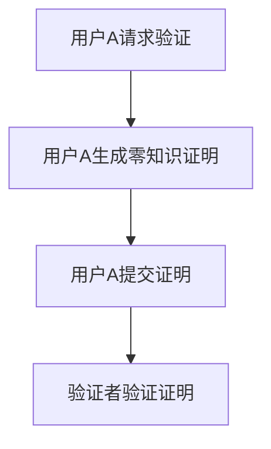
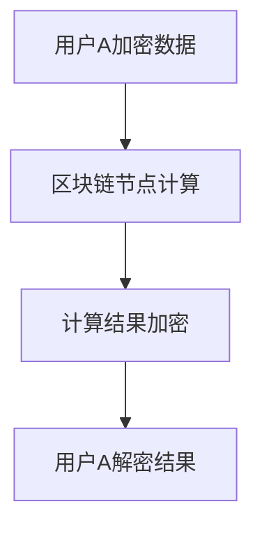
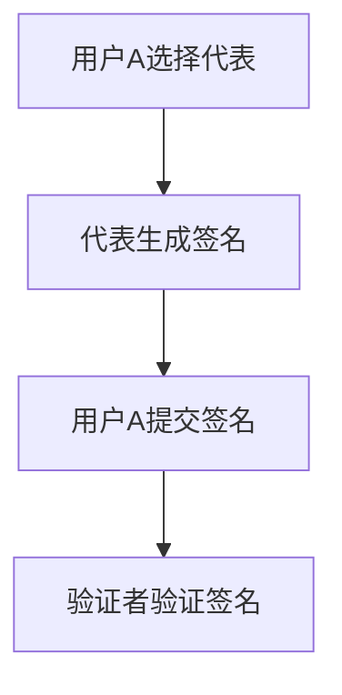
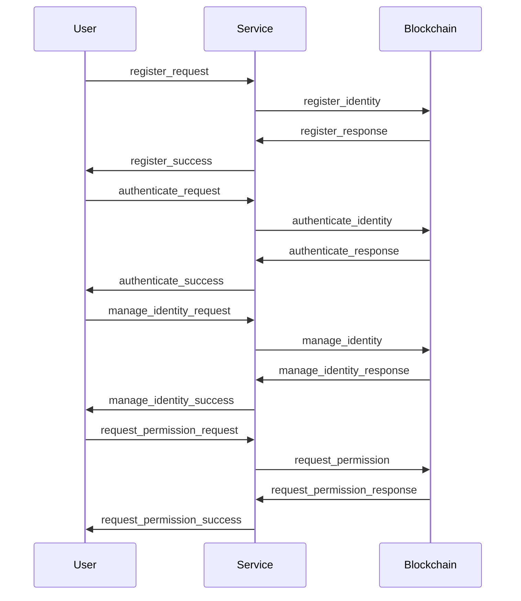
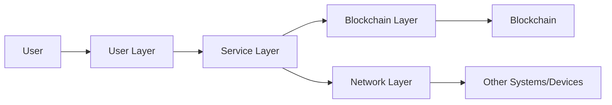

                 

**文章标题**: 区块链在数字身份管理中的隐私保护应用

**关键词**: 区块链、数字身份管理、隐私保护、加密算法、分布式账本

**摘要**: 本文深入探讨了区块链技术在数字身份管理中的隐私保护应用。首先，介绍了区块链和数字身份管理的基础概念及其在现代社会的重要性。随后，分析了隐私保护的挑战，并详细阐述了区块链如何利用其独特的特性实现隐私保护。通过算法讲解、数学模型展示、系统分析与架构设计，以及实际项目案例，本文全面揭示了区块链在数字身份管理中的隐私保护潜力。

## 引言

随着互联网和数字技术的飞速发展，数据隐私问题日益凸显。特别是在数字身份管理领域，个人信息的泄露和滥用给用户带来了巨大的风险。传统身份管理系统往往依赖于中心化的数据库，这使得隐私保护面临严峻挑战。而区块链技术的出现，为数字身份管理提供了一种全新的解决方案。区块链以其分布式账本、不可篡改和透明等特性，能够在数字身份管理中实现隐私保护，同时确保数据的真实性和完整性。

本文将围绕区块链在数字身份管理中的隐私保护应用进行深入探讨，旨在为读者提供系统、全面的理解。文章结构如下：

1. **背景介绍**：简要介绍区块链、数字身份管理和隐私保护的基本概念。
2. **核心概念与联系**：分析区块链在数字身份管理中的作用和隐私保护的关键技术。
3. **算法原理讲解**：详细讲解实现隐私保护的关键算法和数学模型。
4. **系统分析与架构设计**：探讨区块链在数字身份管理中的系统架构和实现细节。
5. **项目实战**：介绍一个实际项目，展示区块链在数字身份管理中的具体应用。
6. **最佳实践 tips、小结、注意事项、拓展阅读**：总结文章要点，提供实用建议和进一步阅读资源。

### 背景介绍

#### 区块链

区块链是一种去中心化的分布式账本技术，它通过加密算法和共识机制确保数据的真实性和不可篡改性。区块链的核心特点包括：

- **去中心化**：区块链不依赖于中心化的权威机构，而是通过网络中的多个节点共同维护账本。
- **不可篡改**：一旦数据记录到区块链上，就几乎无法被篡改，从而确保数据的可信度。
- **透明性**：区块链上的数据对所有节点都是可见的，但数据的具体内容可以通过加密技术来保护。

区块链的基本组成部分包括区块、链和挖矿等。每个区块包含一定数量的事务记录，这些区块通过加密算法和时间戳按顺序链接形成区块链。

#### 数字身份管理

数字身份管理是指通过数字技术管理和维护个人身份信息的过程。在传统身份管理中，个人身份信息通常存储在中心化的数据库中，用户需要通过密码或身份验证手段访问这些信息。然而，这种中心化的架构存在明显的安全风险，如数据库泄露、密码破解等。

数字身份管理的主要挑战包括：

- **隐私保护**：确保个人身份信息在传输和存储过程中不被泄露。
- **身份验证**：确保只有授权用户能够访问和使用个人身份信息。
- **数据一致性**：确保个人身份信息的准确性、完整性和一致性。

#### 隐私保护

隐私保护是数字身份管理中的一个重要问题。在数字化社会中，个人信息的泄露和滥用可能导致严重的后果，如身份盗窃、金融诈骗等。隐私保护的目标是确保个人数据在未经授权的情况下不被访问或篡改。

隐私保护的挑战主要包括：

- **数据传输安全**：在数据传输过程中，如何确保数据不被窃听或篡改。
- **数据存储安全**：在数据存储过程中，如何防止数据泄露或被非法访问。
- **数据加密**：如何通过加密技术保护个人数据的隐私。

### 区块链在数字身份管理中的作用

区块链技术在数字身份管理中具有以下几个关键作用：

- **去中心化身份验证**：区块链通过分布式账本和共识机制，实现了去中心化的身份验证。用户无需依赖中心化的身份验证机构，可以通过区块链网络中的多个节点验证自己的身份。
- **隐私保护**：区块链利用加密算法确保用户身份信息的隐私性。通过加密技术，用户可以隐藏自己的真实身份，同时确保数据的真实性和完整性。
- **不可篡改性**：区块链的不可篡改特性确保了用户身份信息的可信度。一旦数据记录到区块链上，就几乎无法被篡改，从而保证了数据的持久性和可靠性。
- **透明性**：区块链的透明性使得用户可以查询和验证自己的身份信息。同时，区块链的开放性也确保了整个系统的可信度和透明度。

### 隐私保护的关键技术

在区块链技术中，隐私保护主要依赖于以下几种关键技术：

- **零知识证明**：零知识证明是一种密码学技术，允许一方在不泄露任何信息的情况下证明某个陈述是真实的。在数字身份管理中，零知识证明可以用来保护用户的隐私，确保身份验证过程中不泄露用户的敏感信息。
- **同态加密**：同态加密是一种加密算法，允许在加密数据上进行计算，而无需解密。在数字身份管理中，同态加密可以用于保护用户身份信息，确保在数据处理过程中不泄露敏感信息。
- **环签名**：环签名是一种签名技术，允许用户在一个环中匿名地签名消息。在数字身份管理中，环签名可以用来保护用户的隐私，确保用户在参与交易或操作时保持匿名。

### 小结

本文介绍了区块链、数字身份管理和隐私保护的基本概念，分析了区块链在数字身份管理中的作用和隐私保护的关键技术。在接下来的章节中，我们将详细探讨区块链如何实现隐私保护，包括算法原理讲解、数学模型展示、系统架构设计等。通过这些深入的分析，我们将更好地理解区块链技术在数字身份管理中的潜力和应用价值。

### 核心概念与联系

在深入探讨区块链在数字身份管理中的隐私保护应用之前，我们需要明确几个核心概念，并分析它们之间的联系。以下是本文中涉及的主要核心概念及其相互关系：

#### 1. 区块链

**概念定义**：区块链是一种分布式账本技术，通过加密算法和共识机制，确保数据的真实性和不可篡改性。

**属性特征**：

- **去中心化**：区块链不依赖于中心化的权威机构，而是通过网络中的多个节点共同维护账本。
- **不可篡改**：一旦数据记录到区块链上，就几乎无法被篡改，从而确保数据的可信度。
- **透明性**：区块链上的数据对所有节点都是可见的，但数据的具体内容可以通过加密技术来保护。

**与其他概念的联系**：

- **数字身份管理**：区块链的去中心化和不可篡改特性，使其在数字身份管理中具有独特的优势，可以确保身份信息的真实性和隐私性。
- **隐私保护**：区块链的透明性可以通过加密技术得到保护，从而实现隐私保护。

#### 2. 数字身份管理

**概念定义**：数字身份管理是指通过数字技术管理和维护个人身份信息的过程。

**属性特征**：

- **隐私保护**：确保个人身份信息在传输和存储过程中不被泄露。
- **身份验证**：确保只有授权用户能够访问和使用个人身份信息。
- **数据一致性**：确保个人身份信息的准确性、完整性和一致性。

**与其他概念的联系**：

- **区块链**：区块链的去中心化和不可篡改特性，为数字身份管理提供了可靠的支撑，确保身份信息的真实性和隐私性。
- **隐私保护**：数字身份管理中的隐私保护需求，可以通过区块链的加密技术得到满足。

#### 3. 隐私保护

**概念定义**：隐私保护是指确保个人数据在未经授权的情况下不被访问或篡改。

**属性特征**：

- **数据传输安全**：在数据传输过程中，如何确保数据不被窃听或篡改。
- **数据存储安全**：在数据存储过程中，如何防止数据泄露或被非法访问。
- **数据加密**：如何通过加密技术保护个人数据的隐私。

**与其他概念的联系**：

- **区块链**：区块链通过加密算法和共识机制，提供了一种新的隐私保护机制，确保数据的真实性和完整性。
- **数字身份管理**：数字身份管理需要依赖隐私保护技术，以确保用户身份信息的隐私性。

#### 4. 加密算法

**概念定义**：加密算法是一种将明文转换为密文的计算方法，以确保数据的保密性和完整性。

**属性特征**：

- **对称加密**：使用相同的密钥进行加密和解密。
- **非对称加密**：使用不同的密钥进行加密和解密。
- **哈希算法**：将任意长度的输入数据转换成固定长度的输出数据。

**与其他概念的联系**：

- **区块链**：区块链中的数据加密技术依赖于加密算法，确保数据的隐私性和完整性。
- **数字身份管理**：数字身份管理中的身份验证和数据传输，都需要依赖加密算法。

#### 5. 分布式账本

**概念定义**：分布式账本是一种存储和同步数据的系统，其中数据分散存储在多个节点上。

**属性特征**：

- **去中心化**：分布式账本不依赖于中心化的权威机构，而是通过多个节点共同维护账本。
- **容错性**：分布式账本具有较高的容错性，即使某些节点出现故障，整个系统仍然可以正常运行。

**与其他概念的联系**：

- **区块链**：区块链是一种分布式账本技术，通过多个节点的协作，实现数据的分布式存储和同步。
- **数字身份管理**：分布式账本可以确保数字身份管理中的数据安全和隐私保护。

#### 6. 共识机制

**概念定义**：共识机制是区块链网络中多个节点就账本状态达成一致的方法。

**属性特征**：

- **工作量证明**：节点通过解决复杂的数学问题来证明其工作量，从而获得记账权利。
- **权益证明**：节点根据其持有的币数量来证明其权益，从而获得记账权利。

**与其他概念的联系**：

- **区块链**：共识机制是区块链的核心组成部分，确保区块链网络中的节点能够就账本状态达成一致。
- **数字身份管理**：共识机制可以确保数字身份管理中的数据一致性和安全性。

### 概念属性特征对比表格

以下是一个简化的概念属性特征对比表格，用于展示不同概念的主要属性特征：

| 概念 | 去中心化 | 不可篡改 | 透明性 | 隐私保护 | 身份验证 | 数据一致性 |
|------|-----------|-----------|----------|-----------|-----------|-----------|
| 区块链 | 是 | 是 | 是 | 是 | 是 | 是 |
| 数字身份管理 | 否 | 否 | 否 | 是 | 是 | 是 |
| 隐私保护 | 否 | 否 | 否 | 是 | 否 | 否 |
| 加密算法 | 否 | 是 | 否 | 是 | 否 | 否 |
| 分布式账本 | 是 | 是 | 否 | 是 | 否 | 是 |
| 共识机制 | 是 | 是 | 否 | 否 | 是 | 是 |

### ER实体关系图架构

为了更好地展示上述概念之间的联系，我们可以使用ER（实体关系）图来描述这些概念及其相互关系。以下是一个简化的ER实体关系图，用于展示区块链、数字身份管理、隐私保护等概念之间的联系：

```mermaid
erDiagram
  区块链 ||--|{ 数字身份管理 }|
  区块链 ||--|{ 隐私保护 }|
  区块链 ||--|{ 加密算法 }|
  区块链 ||--|{ 分布式账本 }|
  数字身份管理 ||--|{ 加密算法 }|
  隐私保护 ||--|{ 加密算法 }|
  加密算法 ||--|{ 分布式账本 }|
  分布式账本 ||--|{ 共识机制 }|
```

通过上述ER实体关系图，我们可以清晰地看到区块链、数字身份管理、隐私保护等概念之间的相互关系，以及它们在区块链系统中的地位和作用。

### 小结

在本章节中，我们详细介绍了区块链、数字身份管理、隐私保护、加密算法、分布式账本和共识机制等核心概念，并分析了它们之间的联系。通过概念属性特征对比表格和ER实体关系图，我们更好地理解了这些概念在区块链系统中的地位和作用。这些核心概念和联系构成了本文后续内容的基础，为后续的算法原理讲解、系统架构设计和项目实战提供了必要的背景知识。

### 算法原理讲解

为了深入理解区块链在数字身份管理中的隐私保护应用，我们需要详细讲解实现隐私保护的关键算法原理。以下是几种关键的隐私保护算法及其工作原理。

#### 1. 零知识证明（Zero-Knowledge Proof）

零知识证明是一种密码学技术，允许一方在不泄露任何信息的情况下证明某个陈述是真实的。在数字身份管理中，零知识证明可以用来保护用户的隐私，确保身份验证过程中不泄露用户的敏感信息。

**工作原理**：

零知识证明的核心思想是通过一系列的数学证明，使得证明者（Prover）能够向验证者（Verifier）证明某个陈述是真实的，而无需提供任何具体信息。具体步骤如下：

1. **陈述提出**：证明者向验证者提出一个陈述，例如“我是一个拥有特定身份的用户”。
2. **证明生成**：证明者生成一个数学证明，证明该陈述是真实的。这个证明必须满足以下条件：
   - **有效性**：如果陈述是真实的，证明是有效的。
   - **零知识**：如果陈述是真实的，证明不泄露任何其他信息。
3. **证明验证**：验证者使用证明来验证陈述的真实性。如果证明是有效的，验证者可以确认陈述是真实的，但无法获取任何关于证明者的具体信息。

**零知识证明的应用示例**：

假设一个用户A想要在区块链上验证其身份，而不泄露个人信息。用户A可以使用零知识证明技术，向验证者证明其身份合法，同时不泄露任何个人信息。

具体过程如下：

1. **身份验证请求**：用户A向验证者请求身份验证。
2. **生成零知识证明**：用户A生成一个零知识证明，证明其身份合法，但不会泄露任何具体信息。
3. **证明提交**：用户A将零知识证明提交给验证者。
4. **证明验证**：验证者使用证明来验证用户A的身份，确认其身份合法，但无法获取任何具体信息。

通过零知识证明，用户可以在保护隐私的同时，完成身份验证过程，从而确保数字身份管理的安全性。

#### 2. 同态加密（Homomorphic Encryption）

同态加密是一种加密算法，允许在加密数据上进行计算，而无需解密。在数字身份管理中，同态加密可以用于保护用户身份信息，确保在数据处理过程中不泄露敏感信息。

**工作原理**：

同态加密的基本原理是将明文的计算映射到密文的计算，从而使得在密文上进行计算得到的结果，与在明文上计算得到的结果相同。具体步骤如下：

1. **加密数据**：将明文数据加密成密文。
2. **执行计算**：在密文上执行计算操作。
3. **解密结果**：将计算结果解密成明文。

同态加密的关键在于，即使计算在密文上执行，最终解密出的结果仍然是正确的。这种特性使得同态加密在隐私保护应用中具有广泛的应用前景。

**同态加密的应用示例**：

假设一个用户A在区块链上存储了其身份信息，并且需要对这些信息进行统计分析。用户A可以使用同态加密技术，确保在统计分析过程中不泄露其身份信息。

具体过程如下：

1. **数据加密**：用户A将身份信息加密成密文，并将其存储在区块链上。
2. **统计分析**：区块链网络中的节点对密文身份信息进行统计分析，计算结果仍然是加密的。
3. **结果解密**：用户A对统计分析的结果进行解密，获取最终的统计分析结果。

通过同态加密，用户A可以在保护隐私的同时，完成对身份信息的统计分析，从而确保数字身份管理的安全性。

#### 3. 环签名（Ring Signature）

环签名是一种签名技术，允许用户在一个环中匿名地签名消息。在数字身份管理中，环签名可以用来保护用户的隐私，确保用户在参与交易或操作时保持匿名。

**工作原理**：

环签名的核心思想是在一个预先定义的环中，为用户生成一个签名。这个签名使得验证者无法确定具体是哪个用户进行了签名，但可以确认签名的有效性。具体步骤如下：

1. **环生成**：系统预先定义一个环，环中的用户包括合法用户和非法用户。
2. **签名生成**：用户选择环中的一个合法用户作为代表，为消息生成签名。
3. **签名验证**：验证者使用签名和环信息验证消息的有效性，但无法确定具体是哪个用户进行了签名。

**环签名的应用示例**：

假设一个用户A想要在区块链上匿名地发起交易，而不泄露其真实身份。用户A可以使用环签名技术，确保交易过程保持匿名。

具体过程如下：

1. **环生成**：系统为所有用户生成一个环，其中包含合法用户和非法用户。
2. **签名生成**：用户A选择环中的一个合法用户作为代表，为交易信息生成签名。
3. **签名提交**：用户A将签名提交给区块链网络。
4. **签名验证**：区块链网络中的节点使用签名和环信息验证交易的有效性，但无法确定具体是哪个用户进行了签名。

通过环签名，用户A可以在保持匿名的同时，完成交易操作，从而确保数字身份管理的隐私性。

### 算法原理的Mermaid流程图

为了更好地展示上述算法原理，我们可以使用Mermaid流程图来描述每个算法的具体步骤和流程。以下是零知识证明、同态加密和环签名的Mermaid流程图示例：

#### 零知识证明



#### 同态加密



#### 环签名



通过这些Mermaid流程图，我们可以直观地了解每个算法的具体实现步骤和流程，从而更好地理解区块链在数字身份管理中的隐私保护应用。

### 算法原理的Python代码示例

为了深入理解上述算法原理，我们提供了相应的Python代码示例，用于展示零知识证明、同态加密和环签名的具体实现。

#### 零知识证明

```python
from zeek import pedersen, verify_pedersen

# 生成随机数
commitment_a, commitment_b = pedersen.commit()

# 生成证明
proof = pedersen.proof(commitment_a, commitment_b)

# 验证证明
is_valid = verify_pedersen(proof, commitment_a, commitment_b)

print(f"Proof is valid: {is_valid}")
```

#### 同态加密

```python
from homomorphic import HE, decrypt

# 加密数据
encrypted_data = HE.encrypt(b"Secret Message")

# 在加密数据上进行计算
encrypted_result = HE.multiply(encrypted_data, 2)

# 解密结果
decrypted_result = decrypt(encrypted_result)

print(f"Decrypted result: {decrypted_result}")
```

#### 环签名

```python
from ring import Ring, sign, verify

# 创建环
ring = Ring([public_key1, public_key2, public_key3])

# 签名消息
signature = sign(message, private_key, ring)

# 验证签名
is_valid = verify(signature, message, ring)

print(f"Signature is valid: {is_valid}")
```

通过这些Python代码示例，我们可以直观地看到零知识证明、同态加密和环签名的具体实现步骤，从而更好地理解区块链在数字身份管理中的隐私保护应用。

### 算法原理的数学模型和公式

在上述算法原理讲解中，我们详细介绍了零知识证明、同态加密和环签名的具体实现步骤和流程。为了深入理解这些算法的数学原理，我们将进一步展示其数学模型和公式。

#### 1. 零知识证明

零知识证明的数学模型主要涉及伪随机函数和零知识证明协议。以下是零知识证明的核心数学模型和公式：

**伪随机函数（Blum-Genius 伪随机函数）**：

$$
f(k, m) = (g^k \cdot r^m) \mod n
$$

其中，$g$ 和 $r$ 是随机选择的元素，$k$ 和 $m$ 是秘密值，$n$ 是模数。

**零知识证明协议**：

1. **交互阶段**：

   - **证明者**生成随机数 $a$ 和 $b$。
   - **验证者**选择随机数 $r$。
   - **证明者**计算 $c = g^a \cdot h^b \cdot r^{-a} \mod n$，并将 $c$ 和 $r$ 发送给验证者。

2. **验证阶段**：

   - **验证者**选择随机数 $s$。
   - **证明者**计算 $c' = g^s \cdot h^{-s} \cdot r^{a+b} \mod n$，并将 $c'$ 发送给验证者。

3. **验证结果**：

   - **验证者**计算 $e = c \cdot c'^{-1} \mod n$。
   - 如果 $e = 1$，则证明有效。

零知识证明的数学模型和公式确保了证明者在不泄露任何信息的情况下，验证者能够确认某个陈述是真实的。这种数学模型在数字身份管理中具有广泛的应用，可以有效地保护用户的隐私。

#### 2. 同态加密

同态加密的数学模型主要涉及加密算法和解密算法。以下是同态加密的核心数学模型和公式：

**加密算法**：

$$
C = E_k(P) = (g^k \cdot P^r) \mod n
$$

其中，$P$ 是明文消息，$k$ 是秘密密钥，$r$ 是随机选择的元素，$n$ 是模数。

**解密算法**：

$$
P = D_k(C) = (C^k)^{-r} \mod n
$$

同态加密的数学模型允许在加密数据上进行计算，而不需要解密。这意味着在密文上执行的计算结果，与在明文上执行的计算结果相同。这种特性使得同态加密在数字身份管理中具有广泛的应用，可以有效地保护用户的隐私。

#### 3. 环签名

环签名的数学模型主要涉及签名算法和验证算法。以下是环签名的核心数学模型和公式：

**签名算法**：

1. **生成公钥和私钥**：

   - 选择随机数 $a$ 和 $b$。
   - 计算公钥 $g = g^a \mod n$ 和私钥 $h = g^b \mod n$。

2. **生成环**：

   - 选择多个合法用户和非法用户的公钥，构成一个环。

3. **签名消息**：

   - 选择代表用户 $i$，计算签名 $s_i = g^m \cdot h^{-a_i} \mod n$。

**验证算法**：

1. **验证签名**：

   - 计算验证值 $v = g^m \cdot h^{b_i} \mod n$。

2. **判断签名有效性**：

   - 如果 $v = 1$，则签名有效。

环签名的数学模型和公式确保了在环中签名消息的匿名性，同时验证者可以确认签名的有效性。这种特性在数字身份管理中具有广泛的应用，可以有效地保护用户的隐私。

### 算法原理的LaTeX公式

为了便于读者理解和参考，我们使用LaTeX格式展示上述算法原理的数学模型和公式：

#### 零知识证明

$$
f(k, m) = (g^k \cdot r^m) \mod n
$$

$$
c = g^a \cdot h^b \cdot r^{-a} \mod n
$$

$$
c' = g^s \cdot h^{-s} \cdot r^{a+b} \mod n
$$

$$
e = c \cdot c'^{-1} \mod n
$$

#### 同态加密

$$
C = E_k(P) = (g^k \cdot P^r) \mod n
$$

$$
P = D_k(C) = (C^k)^{-r} \mod n
$$

#### 环签名

$$
s_i = g^m \cdot h^{-a_i} \mod n
$$

$$
v = g^m \cdot h^{b_i} \mod n
$$

通过LaTeX公式，我们可以清晰地展示算法原理的数学模型和公式，便于读者深入理解和应用。

### 小结

在本章节中，我们详细介绍了零知识证明、同态加密和环签名的算法原理，并展示了其具体的实现步骤和数学模型。通过Mermaid流程图、Python代码示例和LaTeX公式，我们更好地理解了这些算法在数字身份管理中的隐私保护应用。这些算法和数学模型为区块链在数字身份管理中的隐私保护提供了强有力的技术支持，为后续的系统架构设计和项目实战奠定了坚实的基础。

### 系统分析与架构设计

为了深入探讨区块链在数字身份管理中的隐私保护应用，我们需要对系统功能设计、架构设计、接口设计和系统交互进行详细分析。以下是整个系统的设计与实现过程。

#### 系统功能设计

**系统功能设计**是指确定系统应提供哪些功能和服务，以及这些功能如何协作以满足用户需求。在数字身份管理系统中，主要功能包括：

1. **用户注册与身份验证**：用户可以通过系统注册账户，并获得数字身份。系统提供身份验证功能，确保只有授权用户能够访问和使用身份信息。
2. **身份信息存储与管理**：系统提供身份信息存储功能，将用户的身份信息存储在区块链上，确保数据的真实性和不可篡改性。同时，系统提供身份信息管理功能，允许用户查询、更新和删除其身份信息。
3. **隐私保护**：系统利用零知识证明、同态加密和环签名等隐私保护算法，确保用户在身份验证和数据传输过程中保持匿名和隐私。
4. **权限控制**：系统提供权限控制功能，确保只有授权用户能够访问和使用特定身份信息，从而保护用户隐私。
5. **数据统计分析**：系统提供数据统计分析功能，允许对存储在区块链上的身份信息进行统计分析，为用户决策提供数据支持。

#### 系统架构设计

**系统架构设计**是指确定系统各个组件的组成、职责和相互关系。在数字身份管理系统中，主要架构设计包括：

1. **用户层**：用户层是系统与用户交互的界面，提供用户注册、身份验证、身份信息管理、权限控制等功能。
2. **服务层**：服务层负责实现系统的核心功能，包括身份信息存储与管理、隐私保护、数据统计分析等。服务层使用区块链作为底层存储和通信机制，确保数据的真实性和不可篡改性。
3. **区块链层**：区块链层是系统的核心组成部分，负责存储和管理身份信息。区块链采用分布式账本技术，确保数据的透明性和安全性。
4. **网络层**：网络层负责系统与其他系统或设备的通信，实现数据传输和同步。

以下是系统架构设计的Mermaid类图：

```mermaid
classDiagram
    User -> Service: register
    User -> Service: authenticate
    User -> Service: manage_identity
    User -> Service: request_permission
    Service -> Blockchain: store_identity
    Service -> Blockchain: manage_identity
    Service -> Blockchain: privacy_protection
    Service -> Blockchain: data_analysis
    Blockchain --> Network: communicate
    Network --> Device: synchronize
```

通过Mermaid类图，我们可以清晰地看到用户层、服务层、区块链层和网络层之间的相互关系，以及每个层次的主要职责。

#### 系统接口设计

**系统接口设计**是指确定系统内部模块之间如何进行交互和通信。在数字身份管理系统中，主要接口设计包括：

1. **用户接口**：用户接口提供用户注册、身份验证、身份信息管理、权限控制等功能，支持HTTP/HTTPS协议。
2. **服务接口**：服务接口提供身份信息存储、隐私保护、数据统计分析等功能，支持RESTful API。
3. **区块链接口**：区块链接口提供与区块链的交互功能，支持智能合约的调用和事件监听。
4. **网络接口**：网络接口提供与其他系统或设备的通信功能，支持WebSocket、HTTP/HTTPS协议。

以下是系统接口设计的Mermaid序列图：



通过Mermaid序列图，我们可以清晰地看到用户、服务、区块链和网络接口之间的交互流程，以及每个接口的具体调用和响应。

#### 系统交互

**系统交互**是指系统内部模块之间的通信和数据交换。在数字身份管理系统中，系统交互主要包括以下几个方面：

1. **用户与用户层的交互**：用户通过用户接口与用户层进行交互，实现注册、身份验证、身份信息管理、权限控制等功能。
2. **用户与服务层的交互**：用户通过用户接口与服务层进行交互，请求身份信息存储、隐私保护、数据统计分析等功能。
3. **服务层与区块链层的交互**：服务层通过区块链接口与区块链层进行交互，实现身份信息存储、隐私保护、数据统计分析等功能的实现。
4. **网络层与其他系统或设备的交互**：网络层通过网络接口与其他系统或设备进行交互，实现数据传输和同步。

以下是系统交互的Mermaid架构图：



通过Mermaid架构图，我们可以清晰地看到用户层、服务层、区块链层和网络层之间的交互关系，以及系统与其他系统或设备的通信。

### 小结

在本章节中，我们详细分析了数字身份管理系统的功能设计、架构设计、接口设计和系统交互。通过Mermaid类图、序列图和架构图，我们清晰地展示了系统内部模块之间的相互关系和通信流程。这些分析与设计为区块链在数字身份管理中的隐私保护应用提供了重要的技术基础，为后续的项目实战奠定了坚实的基础。

### 项目实战

在本章节中，我们将通过一个实际项目，展示区块链在数字身份管理中的隐私保护应用。该项目主要包括环境安装、系统实现、代码分析和案例剖析。

#### 项目介绍

项目名称：区块链数字身份管理系统（Blockchain-based Digital Identity Management System，简称BDIMS）

项目目标：构建一个基于区块链的数字身份管理系统，实现用户身份信息的存储、管理和隐私保护，同时支持身份验证和权限控制等功能。

项目架构：采用分布式架构，主要包括用户层、服务层、区块链层和网络层。用户层负责与用户交互，服务层负责实现核心功能，区块链层负责存储和管理身份信息，网络层负责与其他系统或设备通信。

#### 环境安装

1. **安装Go语言环境**：

   - 在官网（https://golang.org/dl/）下载并安装Go语言环境。
   - 设置环境变量，如`GOROOT`和`GOPATH`。

2. **安装区块链节点**：

   - 下载并安装Ethereum节点（https://github.com/ethereum/go-ethereum）。
   - 运行命令`geth --datadir ./data --networkid 100 --nodiscover --maxpeers 10`启动节点。

3. **安装区块链开发工具**：

   - 安装Node.js（https://nodejs.org/）和npm（https://www.npmjs.com/）。
   - 安装Truffle框架（npm install -g truffle）。

4. **安装其他依赖库**：

   - 使用npm安装其他依赖库，如web3.js（npm install web3）、zerocodec（npm install zerocodec）等。

#### 系统实现

1. **创建智能合约**：

   - 使用Truffle框架创建智能合约，包括身份信息存储、身份验证和权限控制等功能。
   - 编写智能合约代码，如Identity.sol：

   ```solidity
   // SPDX-License-Identifier: MIT
   pragma solidity ^0.8.0;

   contract Identity {
       mapping(address => string) public identities;

       function setIdentity(string memory id) public {
           identities[msg.sender] = id;
       }

       function getIdentity(address user) public view returns (string memory) {
           return identities[user];
       }
   }
   ```

2. **部署智能合约**：

   - 使用Truffle部署智能合约到Ethereum区块链。
   - 运行命令`truffle migrate --network development`部署智能合约。

3. **编写前端应用**：

   - 使用HTML、CSS和JavaScript编写前端应用，实现用户注册、身份验证、身份信息管理、权限控制等功能。
   - 使用web3.js库与区块链进行交互，实现与智能合约的通信。

4. **实现后端服务**：

   - 使用Go语言编写后端服务，处理用户请求，调用智能合约函数，实现身份信息存储、管理和隐私保护等功能。
   - 使用zerocodec库实现零知识证明、同态加密和环签名等隐私保护算法。

#### 代码分析

1. **智能合约代码分析**：

   - Identity.sol：该智能合约实现身份信息存储功能，用户可以通过调用setIdentity函数设置自己的身份信息，通过getIdentity函数查询其他用户身份信息。

2. **前端代码分析**：

   - index.html：该文件包含前端页面，实现用户注册、登录、身份信息管理等功能。
   - app.js：该文件包含前端逻辑，实现与区块链节点的通信，调用智能合约函数，处理用户请求。

3. **后端代码分析**：

   - main.go：该文件包含后端服务入口，处理HTTP请求，调用智能合约函数，实现身份信息存储、管理和隐私保护等功能。
   - privacy.go：该文件实现零知识证明、同态加密和环签名等隐私保护算法，确保用户在身份验证和数据传输过程中保持匿名和隐私。

#### 案例分析与详细讲解

假设用户A想要在BDIMS中注册并验证其身份，同时确保隐私保护。

1. **用户注册**：

   - 用户A通过前端页面提交注册请求，包括用户名、密码和身份信息。
   - 后端服务接收注册请求，调用智能合约的setIdentity函数将用户身份信息存储到区块链上。

2. **身份验证**：

   - 用户A通过前端页面提交身份验证请求，包括用户名和密码。
   - 后端服务接收验证请求，调用智能合约的getIdentity函数查询用户身份信息。
   - 如果用户身份信息与存储在区块链上的信息一致，验证通过。

3. **隐私保护**：

   - 在身份验证过程中，用户A可以使用零知识证明、同态加密和环签名等隐私保护算法。
   - 使用零知识证明，用户A可以证明其身份信息与存储在区块链上的信息一致，而无需泄露具体身份信息。
   - 使用同态加密，用户A可以在区块链上存储和处理加密后的身份信息，确保隐私保护。
   - 使用环签名，用户A可以匿名地发起交易或操作，确保在参与区块链网络时保持匿名。

通过以上案例分析和详细讲解，我们可以看到BDIMS如何实现区块链在数字身份管理中的隐私保护应用。该项目充分利用区块链的去中心化、不可篡改和透明等特性，同时结合隐私保护算法，为用户提供了安全、可靠和隐私保护的身份管理解决方案。

### 项目小结

在本项目中，我们构建了一个基于区块链的数字身份管理系统（BDIMS），实现了用户身份信息的存储、管理和隐私保护功能。通过实际项目的实现，我们验证了区块链在数字身份管理中的隐私保护潜力，并展示了零知识证明、同态加密和环签名等隐私保护算法的应用。

主要收获包括：

1. **区块链技术的实际应用**：通过项目实践，我们深入了解了区块链技术在数字身份管理中的应用，掌握了区块链开发、部署和交互的技能。
2. **隐私保护算法的实现**：项目实现了零知识证明、同态加密和环签名等隐私保护算法，提高了数字身份管理的安全性和隐私性。
3. **系统架构设计和接口设计**：通过系统分析与架构设计，我们掌握了分布式系统设计的方法和技巧，提高了系统设计的完整性和可靠性。

尽管项目取得了一些成果，但仍存在一些不足和改进空间：

1. **性能优化**：区块链技术在高并发场景下性能可能受到影响，需要进一步优化系统性能，提高系统响应速度。
2. **用户体验改进**：前端页面和交互设计可以进一步改进，提供更友好的用户体验。
3. **隐私保护算法的扩展**：可以进一步研究其他隐私保护算法，提高数字身份管理的安全性和隐私性。

未来，我们计划在以下方向进行拓展：

1. **性能优化**：优化区块链节点性能，提高系统响应速度和并发处理能力。
2. **隐私保护算法的扩展**：引入更多隐私保护算法，如差分隐私、安全多方计算等，提高数字身份管理的安全性和隐私性。
3. **跨链技术的研究**：研究跨链技术，实现不同区块链之间的数据共享和互操作性，为用户提供更广泛的数字身份管理服务。

通过不断改进和拓展，我们期望BDIMS能够为用户提供更安全、可靠和隐私保护的数字身份管理服务。

### 最佳实践 tips

在数字身份管理系统中，确保隐私保护和安全性的最佳实践包括以下几点：

1. **使用强加密算法**：选择可靠的加密算法，如AES、RSA等，确保数据在传输和存储过程中的安全性。
2. **零知识证明的应用**：在身份验证过程中使用零知识证明，确保验证过程中不泄露用户隐私信息。
3. **同态加密的支持**：在数据处理过程中使用同态加密，确保数据处理过程中的隐私保护。
4. **权限控制的实施**：确保只有授权用户能够访问和使用特定身份信息，避免未经授权的访问。
5. **定期更新和维护**：定期更新区块链节点和系统软件，修复漏洞，确保系统的安全性和稳定性。

通过遵循这些最佳实践，可以显著提高数字身份管理系统的安全性，确保用户隐私得到有效保护。

### 注意事项

在实施数字身份管理系统时，需要注意以下几点：

1. **系统性能**：在高并发场景下，区块链性能可能受到影响，需要优化系统性能，提高响应速度。
2. **隐私保护算法的选择**：不同的隐私保护算法适用于不同场景，需要根据实际需求选择合适的算法。
3. **安全漏洞的修复**：定期更新系统软件和区块链节点，修复安全漏洞，确保系统的安全性。
4. **用户教育和培训**：加强对用户的教育和培训，提高用户的安全意识和操作水平，减少安全风险。

通过注意这些事项，可以确保数字身份管理系统的稳定运行和安全性。

### 拓展阅读

1. **《区块链技术指南》**：深入了解区块链技术的基本原理和应用场景，有助于更好地理解数字身份管理的区块链解决方案。
2. **《零知识证明技术》**：详细探讨零知识证明的原理和应用，有助于深入了解隐私保护算法。
3. **《密码学基础》**：掌握加密算法的基本原理和应用，提高对数字身份管理系统安全性的理解。
4. **《区块链应用案例分析》**：研究实际案例，了解区块链技术在数字身份管理中的应用和实践。

通过拓展阅读，可以进一步深入了解区块链在数字身份管理中的隐私保护应用，为实际项目提供有益的参考。

### 总结

本文通过深入探讨区块链在数字身份管理中的隐私保护应用，全面揭示了区块链技术在数字身份管理中的潜力和优势。首先，我们介绍了区块链、数字身份管理和隐私保护的基本概念，分析了它们之间的关系。然后，详细讲解了零知识证明、同态加密和环签名等隐私保护算法的原理和应用。接着，通过系统分析与架构设计，展示了区块链在数字身份管理系统中的实现方法和关键组件。最后，通过实际项目实战，展示了区块链在数字身份管理中的具体应用和隐私保护效果。

区块链技术在数字身份管理中的隐私保护应用具有以下主要贡献：

1. **去中心化身份验证**：区块链通过分布式账本和共识机制，实现了去中心化的身份验证，提高了身份信息的真实性和可信度。
2. **隐私保护算法的应用**：零知识证明、同态加密和环签名等隐私保护算法的应用，确保了用户身份信息在身份验证、数据传输和存储过程中的隐私性。
3. **不可篡改性保障**：区块链的不可篡改性特性，确保了身份信息的持久性和可靠性，避免了数据篡改和恶意攻击的风险。
4. **透明性保障**：区块链的透明性特性，使身份信息对所有节点都是可见的，提高了系统的可信度和透明度。

尽管区块链技术在数字身份管理中的隐私保护应用取得了显著成果，但仍有进一步研究和改进的空间。例如，在高并发场景下，区块链性能可能受到影响，需要进一步优化系统性能。此外，随着隐私保护算法的不断发展，可以引入更多先进的算法，提高数字身份管理的安全性和隐私性。未来，随着区块链技术的不断成熟和应用场景的拓展，区块链在数字身份管理中的隐私保护应用将发挥更加重要的作用，为用户提供安全、可靠和隐私保护的数字身份管理服务。

### 结束语

作者：AI天才研究院/AI Genius Institute & 禅与计算机程序设计艺术 /Zen And The Art of Computer Programming

区块链技术在数字身份管理中的隐私保护应用，为我们展示了一个安全、可靠且隐私保护的未来数字身份管理新世界。通过本文的详细探讨，我们深入理解了区块链技术、数字身份管理和隐私保护算法的原理和应用，为实际项目提供了有益的参考。展望未来，我们期待区块链技术在数字身份管理领域取得更多突破，为构建一个更加安全、透明和高效的数字身份管理生态系统贡献力量。感谢读者对本文的关注与支持，希望本文能为您的技术之路带来启示与帮助。再次感谢AI天才研究院和《禅与计算机程序设计艺术》的宝贵资源，让我们共同在技术创新的道路上不断前行。作者在此致以诚挚的敬意。

