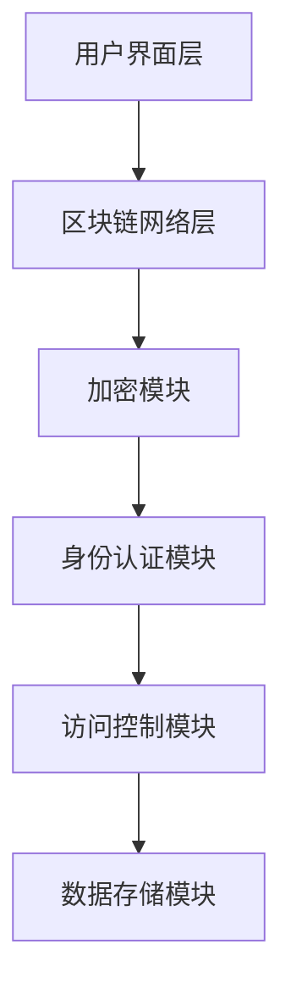

                 

## 引言

随着数字化时代的来临，我们的生活和工作中逐渐充满了各种各样的数字身份。这些数字身份，不仅体现在我们在线购物、社交互动和远程办公等日常活动中，还涉及金融交易、医疗记录、法律文件等重要场景。然而，传统的数字身份管理方式面临着诸多挑战，如数据泄露、隐私暴露、身份盗用等。如何解决这些问题，确保数字身份的安全和自主性，成为当今信息技术领域亟待解决的重要课题。区块链技术的兴起，为我们提供了一种全新的思路和解决方案。

区块链技术以其去中心化、不可篡改、透明性高等特性，在数字身份自主管理中展现出了巨大的潜力。通过区块链，用户可以拥有更加安全、可控的数字身份，同时也能够更好地保护个人隐私和数据安全。本文将详细探讨区块链在数字身份自主管理中的应用，包括其背景、重要性、基本原理以及具体实现策略。希望通过本文的深入分析，能够为广大读者提供一种全新的视角，助力数字身份自主管理的实践与发展。

## 关键词

- 区块链
- 数字身份
- 自主管理
- 去中心化
- 不可篡改性
- 隐私保护
- 身份认证
- 安全性
- 透明性

## 摘要

本文旨在探讨区块链技术在数字身份自主管理中的应用。首先，我们回顾了区块链和数字身份管理的背景与重要性，分析了传统数字身份管理面临的挑战。接着，我们介绍了区块链的基本概念和技术原理，以及数字身份管理的核心要素。随后，本文重点探讨了区块链在数字身份认证、去中心化身份管理、数字身份隐私保护等方面的应用，并提供了具体的实现策略和最佳实践案例。最后，本文总结了区块链在数字身份自主管理中的优势与挑战，并展望了其未来的发展方向。

## 第一部分：区块链与数字身份概述

### 第1章：区块链与数字身份的背景与重要性

#### 1.1.1 区块链技术的兴起与影响

区块链技术的兴起可以追溯到2008年，当时一位名为中本聪（Satoshi Nakamoto）的匿名人物发布了一篇名为《比特币：一种点对点的电子现金系统》的白皮书。这篇白皮书首次提出了区块链的概念，并以此为理论基础设计了一个去中心化的电子现金系统——比特币。比特币的诞生标志着区块链技术的首次亮相，随后其应用范围逐渐扩展到金融、物流、医疗等多个领域。

区块链技术的基本原理是通过分布式账本技术实现数据的存储和传输，具有去中心化、不可篡改、透明性高等特点。去中心化意味着区块链上的数据不再依赖于单一的中心服务器，而是由网络中的所有节点共同维护，从而提高了系统的可靠性和容错性。不可篡改则保证了数据的真实性和完整性，一旦数据被记录在区块链上，便无法被篡改或删除。透明性使得区块链上的所有操作都可以被全网节点查询和验证，从而增加了系统的透明度和信任度。

区块链技术的兴起对多个行业产生了深远的影响。在金融领域，区块链技术为去中心化金融（DeFi）提供了技术基础，使得金融交易更加高效、透明和安全。在物流领域，区块链技术可以确保供应链数据的真实性和透明性，提高物流效率。在医疗领域，区块链技术可以用于记录和验证患者数据，提高医疗服务的安全性和可信度。

#### 1.1.2 数字身份自主管理的需求

随着互联网的普及和数字化进程的加速，我们的日常生活和工作中越来越依赖于数字身份。数字身份不仅用于在线购物、社交互动和远程办公等日常活动，还在金融交易、医疗记录、法律文件等重要场景中发挥着关键作用。然而，传统的数字身份管理方式面临着诸多挑战，如数据泄露、隐私暴露、身份盗用等，这些问题严重影响了用户对数字身份的信任和依赖。

数字身份自主管理的需求主要源于以下几个方面：

1. **安全性需求**：传统的集中式数字身份管理系统容易成为黑客攻击的目标，导致用户数据泄露。通过区块链技术，可以实现去中心化的数字身份管理，提高系统的安全性和抗攻击能力。

2. **隐私保护需求**：在传统的数字身份管理系统中，用户数据通常被存储在中心化服务器上，容易受到数据泄露和滥用。通过区块链技术，可以实现用户数据的分散存储和加密传输，保护用户隐私。

3. **身份验证需求**：在许多场景中，数字身份的验证是确保交易和操作合法性的关键。通过区块链技术，可以实现基于密码学和智能合约的强身份验证机制，确保数字身份的真实性和唯一性。

4. **自主控制需求**：传统的数字身份管理系统通常由第三方机构控制，用户对自身数字身份的控制能力有限。通过区块链技术，用户可以拥有更加自主的数字身份管理权限，实现真正的自主控制。

#### 1.1.3 区块链在数字身份管理中的潜力

区块链技术在数字身份管理中展现出了巨大的潜力，主要体现在以下几个方面：

1. **去中心化的身份认证**：通过区块链技术，可以实现去中心化的身份认证系统，用户无需依赖第三方机构进行身份验证，从而减少了信任风险。

2. **不可篡改的数字身份记录**：区块链技术的不可篡改特性确保了数字身份记录的真实性和完整性，有效防止了身份信息的篡改和伪造。

3. **隐私保护的数字身份信息**：区块链技术的加密机制和去中心化特性为数字身份信息提供了强大的隐私保护，有效防止了用户数据的泄露和滥用。

4. **灵活的数字身份管理权限**：通过智能合约，用户可以灵活地配置和管理自己的数字身份信息，实现真正的自主控制。

总之，区块链技术在数字身份管理中的应用，不仅能够提高数字身份的安全性、隐私性和自主性，还能够解决传统数字身份管理中存在的诸多问题，为未来的数字世界提供了一种全新的解决方案。

### 第2章：区块链基础知识

#### 2.1.1 区块链的基本概念

区块链是一种分布式数据库技术，其核心特点是通过多个参与者共同维护一个不可篡改的分布式账本。区块链上的数据记录按照一定的时间间隔（称为区块）进行分组，每个区块都包含一定数量的交易记录，并通过密码学算法链接在一起，形成一条不可篡改的链式结构。

区块链的基本组成部分包括：

- **区块**：区块是区块链的基本单元，包含了一定数量的交易记录、区块头、区块体等组成部分。每个区块通过密码学算法与前一个区块链接，形成链式结构。
- **交易**：交易是区块链上的数据操作，表示数据的传递或变更。交易通常由用户发起，并包含输入和输出两部分，用于表示资金或信息的流动。
- **区块头**：区块头是区块的重要组成部分，包含了区块的元数据，如版本号、随机数、Merkle树根等，用于确保区块的完整性和链接性。
- **Merkle树**：Merkle树是一种二叉树结构，用于确保区块中交易数据的完整性。每个节点都包含了部分交易数据的哈希值，最终根节点包含了整个区块的交易数据的哈希值。
- **密码学算法**：区块链技术采用了多种密码学算法，如哈希算法、椭圆曲线加密算法等，用于确保数据的完整性、安全性和隐私性。

区块链的工作原理可以概括为以下步骤：

1. **交易生成**：用户在网络中发起交易，交易通常包含用户的公钥、私钥以及交易金额等信息。
2. **交易广播**：用户将交易广播到区块链网络中的其他节点，节点接收到交易后进行验证。
3. **区块组装**：矿工（或节点）将从网络中收集到的交易组装成一个新区块，新区块包含一定数量的交易记录。
4. **区块验证**：其他节点接收到新区块后，对区块进行验证，包括验证交易的有效性、区块头的正确性等。
5. **区块链接**：验证通过的区块将被链接到区块链上，成为区块链的一部分。
6. **共识机制**：区块链通过共识机制确保新区块被全网节点接受和认可。常见的共识机制包括工作量证明（PoW）、权益证明（PoS）等。

#### 2.1.2 区块链的工作原理

区块链的工作原理主要包括数据存储、数据传输和数据验证三个关键环节：

1. **数据存储**：区块链采用分布式数据库技术，将数据存储在多个节点上，每个节点都保存了一份完整的区块链数据副本。这种分布式存储方式提高了数据的可靠性和容错性，确保了区块链的持续运行。
2. **数据传输**：区块链上的数据通过广播机制在网络中传输。当用户发起交易时，交易会被广播到网络中的其他节点。节点接收到交易后，会进行验证，确保交易的有效性和安全性。
3. **数据验证**：区块链上的数据验证是通过共识机制实现的。矿工（或节点）从网络中收集到的交易组装成新区块，并通过密码学算法对区块进行验证。验证通过的区块将被链接到区块链上，成为区块链的一部分。

区块链的工作原理保障了数据的完整性、安全性和透明性，使其在数字身份管理等领域具有广泛的应用潜力。

#### 2.1.3 区块链的核心技术

区块链技术主要包括以下几个核心技术：

1. **密码学算法**：区块链技术采用了多种密码学算法，如哈希算法、椭圆曲线加密算法、数字签名等，用于确保数据的完整性和安全性。哈希算法用于生成数据的唯一标识，数字签名用于验证数据的真实性和完整性。
2. **分布式存储**：区块链采用分布式存储技术，将数据存储在多个节点上，每个节点都保存了一份完整的区块链数据副本。这种分布式存储方式提高了数据的可靠性和容错性。
3. **共识机制**：共识机制是区块链网络中的节点就数据的一致性达成共识的机制。常见的共识机制包括工作量证明（PoW）、权益证明（PoS）等。共识机制确保了新区块被全网节点接受和认可，从而保证了区块链的稳定性和安全性。
4. **智能合约**：智能合约是区块链上的自动化合约，通过编程语言实现。智能合约在满足特定条件时自动执行，用于实现复杂的业务逻辑和自动化交易。智能合约在数字身份管理中具有广泛的应用潜力。

通过上述核心技术的支持，区块链技术能够实现数据的分布式存储、安全传输和一致性验证，为数字身份自主管理提供了强有力的技术保障。

### 第3章：数字身份管理基础

#### 3.1.1 数字身份的概念

数字身份是指在网络环境中，通过数字方式代表和识别个体的一种身份标识。它通常由一组数据构成，包括用户名、密码、邮箱、电话号码、身份验证信息等。数字身份不仅用于个人用户，还广泛应用于企业、组织、设备等各种实体。

数字身份的主要目的是在互联网环境中实现个体识别、身份验证和数据保护。通过数字身份，用户可以在不同的在线平台上进行身份认证，完成各种业务操作，如在线购物、支付、社交互动等。同时，数字身份也用于保护用户的隐私和数据安全，防止未经授权的访问和滥用。

数字身份的组成部分通常包括：

- **标识符**：用于唯一标识用户的名称或标识，如用户名、账号等。
- **凭证**：用于验证用户身份的凭证，如密码、数字证书等。
- **属性**：描述用户特征的信息，如年龄、性别、职业等。
- **身份验证信息**：用于验证用户身份的其他信息，如生物特征（指纹、面部识别等）。

#### 3.1.2 数字身份的挑战与问题

尽管数字身份在互联网环境中具有重要意义，但传统的数字身份管理方式面临着诸多挑战和问题：

1. **数据泄露风险**：传统的集中式数字身份管理系统容易成为黑客攻击的目标，导致用户数据泄露。一旦用户数据泄露，可能导致用户身份被盗用，造成严重的经济损失和隐私泄露。
2. **隐私暴露**：在传统的数字身份管理系统中，用户数据通常被存储在中心化服务器上，容易受到数据泄露和滥用。用户在多个平台上使用相同的数字身份，导致隐私暴露的风险增加。
3. **身份盗用**：黑客可以通过各种手段获取用户的数字身份凭证，如密码、数字证书等，进而冒用用户身份进行非法操作。身份盗用可能导致用户的资金损失、信用受损等问题。
4. **身份验证不严格**：传统的身份验证方式，如用户名和密码，容易受到暴力破解、钓鱼攻击等攻击手段的威胁。身份验证不严格可能导致用户身份被冒用，影响系统的安全性和可信性。
5. **自主控制不足**：在传统的数字身份管理系统中，用户对自身数字身份的控制能力有限。用户数据通常由第三方机构管理，用户难以自主控制和管理自己的身份信息。

#### 3.1.3 数字身份自主管理的核心要素

数字身份自主管理是指用户拥有对自己数字身份的完全控制权，能够自主管理、保护和使用自己的数字身份信息。实现数字身份自主管理的关键要素包括：

1. **去中心化存储**：数字身份信息应分散存储在多个节点上，而不是集中存储在中心化服务器上。这样可以提高数据的安全性和隐私性，减少数据泄露的风险。
2. **多因素身份验证**：数字身份的验证应采用多因素身份验证机制，包括密码、生物特征、硬件设备等，提高身份验证的安全性和可靠性。
3. **加密技术**：数字身份信息在传输和存储过程中应采用加密技术，确保数据不被未经授权的第三方窃取或篡改。
4. **自主权限管理**：用户应能够自主配置和管理自己的数字身份信息，包括添加、删除、修改身份信息等操作。用户应拥有对自己数字身份信息的完全控制权。
5. **隐私保护**：数字身份自主管理应注重隐私保护，确保用户的个人信息不会被滥用或泄露。通过匿名化、数据加密、隐私计算等技术手段，保护用户隐私。

通过实现数字身份自主管理，用户可以更好地控制自己的数字身份信息，提高数字身份的安全性、隐私性和可靠性，从而为未来的数字世界提供一种更加安全和可靠的解决方案。

### 第二部分：区块链在数字身份自主管理中的应用

#### 第4章：区块链与数字身份认证

##### 4.1.1 区块链在身份认证中的应用

区块链技术以其去中心化、不可篡改和透明性的特性，为数字身份认证提供了一种全新的解决方案。在传统的身份认证系统中，用户通常需要依赖于中心化的认证机构，如银行、政府机构等，进行身份验证。然而，这种集中式的认证方式存在诸多问题，如信任风险、数据泄露、隐私暴露等。通过区块链技术，可以实现去中心化的身份认证，提高认证的安全性和可靠性。

在区块链中，身份认证通常基于以下几种机制：

1. **基于公钥密码学的认证**：公钥密码学是区块链技术中常用的一种加密机制，通过私钥和公钥的配对，实现身份认证和数据加密。用户在区块链上生成一对公私钥，私钥用于签名和验证，公钥则用于证明身份。在身份认证过程中，用户可以使用私钥对请求进行签名，然后发送给认证机构或服务提供商。认证机构或服务提供商使用用户的公钥进行验证，确认用户的身份。

2. **基于智能合约的认证**：智能合约是区块链上的自动化合约，通过编程语言实现。在身份认证过程中，可以编写智能合约来定义认证规则和流程。例如，当用户访问某个应用或服务时，智能合约可以根据用户的公钥和签名，自动验证用户的身份，并决定是否授权访问。智能合约确保了身份认证的自动化和安全性，减少了人为干预和操作风险。

3. **多因素身份认证**：传统的多因素身份认证通常包括密码、验证码、生物特征等，但在区块链中，多因素身份认证可以更加灵活和可靠。区块链上的多因素身份认证可以通过结合多种认证方式，如密码、智能合约、硬件设备等，提高认证的安全性和可靠性。例如，用户可以使用密码进行初步认证，然后通过智能合约验证硬件设备的存在，进一步确认用户的身份。

区块链在身份认证中的应用具有以下几个优势：

1. **去中心化的认证**：区块链的去中心化特性使得身份认证不再依赖于中心化的认证机构，减少了信任风险。用户可以直接在区块链上进行身份认证，无需依赖第三方机构。

2. **不可篡改的身份记录**：区块链的不可篡改特性确保了身份记录的真实性和完整性。一旦身份信息被记录在区块链上，便无法被篡改或删除，从而提高了身份认证的可靠性。

3. **透明性和可追溯性**：区块链上的所有操作都可以被全网节点查询和验证，增加了身份认证的透明性和可追溯性。用户可以随时查询自己的身份信息，了解身份认证的过程和结果。

4. **隐私保护**：区块链的加密机制和去中心化特性为身份信息提供了强大的隐私保护。用户身份信息被加密存储和传输，减少了隐私泄露的风险。

##### 4.1.2 不可篡改性在数字身份认证中的优势

区块链技术中的不可篡改性在数字身份认证中具有显著的优势。不可篡改意味着一旦数据被记录在区块链上，便无法被篡改或删除，从而保证了身份信息的真实性和完整性。以下是不可篡改性在数字身份认证中的几个重要优势：

1. **保证身份信息真实性**：传统的身份认证系统容易受到伪造和篡改的攻击。例如，黑客可以通过篡改用户身份信息，冒用用户身份进行非法操作。区块链的不可篡改性确保了身份信息的真实性，一旦身份信息被记录在区块链上，便无法被篡改或删除，从而提高了身份认证的可靠性。

2. **防止身份信息泄露**：在传统的身份认证系统中，身份信息通常存储在中心化的服务器上，容易成为黑客攻击的目标。一旦黑客成功入侵，用户身份信息可能被窃取和泄露。区块链的不可篡改特性确保了身份信息的保密性，即使数据被篡改，篡改痕迹也会被区块链记录，便于追踪和取证。

3. **提高身份认证的信任度**：区块链的透明性和不可篡改性增加了身份认证的信任度。用户可以随时查询自己的身份信息，了解身份认证的过程和结果。此外，区块链上的所有操作都可以被全网节点查询和验证，增加了身份认证的透明度和公信力。

4. **降低法律风险**：在传统的身份认证系统中，由于身份信息容易篡改和泄露，可能导致法律纠纷和责任归属问题。区块链的不可篡改性确保了身份信息的真实性和完整性，降低了法律风险和纠纷。

##### 4.1.3 区块链身份认证系统的实现

实现区块链身份认证系统需要考虑以下几个方面：

1. **身份信息管理**：身份信息包括用户名、密码、公钥、私钥等，需要通过区块链进行管理和存储。用户可以在区块链上创建自己的身份信息，并将其公钥发布到区块链上。

2. **身份认证协议**：区块链身份认证系统需要设计一套身份认证协议，用于定义身份认证的过程和规则。常见的身份认证协议包括基于公钥密码学的认证协议和基于智能合约的认证协议。

3. **隐私保护**：为了保护用户隐私，区块链身份认证系统需要采用加密技术对用户身份信息进行加密存储和传输。同时，可以结合零知识证明等技术，实现匿名身份认证。

4. **多因素身份认证**：区块链身份认证系统可以支持多因素身份认证，结合密码、智能合约、硬件设备等多种认证方式，提高身份认证的安全性和可靠性。

5. **安全性和可靠性**：区块链身份认证系统需要采用多种安全措施，如多重签名、访问控制等，确保系统的安全性和可靠性。同时，需要对系统进行定期审计和升级，以应对潜在的安全威胁。

通过以上几个方面的实现，区块链身份认证系统可以实现去中心化、不可篡改、透明性和隐私保护，为数字身份管理提供一种全新的解决方案。

### 第5章：去中心化身份管理

##### 5.1.1 去中心化身份管理的基本概念

去中心化身份管理（Decentralized Identity Management，简称DID）是一种基于区块链技术的身份管理方法，旨在实现用户对自身数字身份的自主控制。与传统的集中式身份管理不同，去中心化身份管理通过去中心化的架构和分布式账本，确保用户在无需依赖第三方机构的情况下，能够安全、透明地管理自己的数字身份信息。

去中心化身份管理的基本概念包括：

1. **去中心化的身份标识**：在去中心化身份管理中，用户的数字身份标识（DID）是由用户自己创建和管理的。DID是一个独一无二的标识符，与用户的实际身份无关，可以用于在区块链上进行身份验证和认证。

2. **分布式账本**：去中心化身份管理依赖于区块链技术，通过分布式账本实现身份信息的存储和验证。区块链上的每个节点都保存了一份完整的身份信息记录，确保了数据的完整性和不可篡改性。

3. **多因素身份验证**：去中心化身份管理支持多因素身份验证（Multi-Factor Authentication，MFA），用户可以通过密码、生物特征、硬件设备等多种认证方式，提高身份认证的安全性和可靠性。

4. **隐私保护**：去中心化身份管理注重用户隐私保护，通过加密技术和隐私计算，确保用户身份信息在存储和传输过程中的安全性和隐私性。

5. **自主控制和授权**：用户拥有对自己数字身份信息的完全控制权，可以自主管理、删除、修改身份信息。同时，用户可以授权第三方访问和验证自己的身份信息，实现灵活的授权机制。

##### 5.1.2 区块链在去中心化身份管理中的作用

区块链技术在去中心化身份管理中发挥着关键作用，主要体现在以下几个方面：

1. **去中心化存储**：区块链的分布式账本技术确保了身份信息在多个节点上分散存储，避免了集中式存储系统中可能面临的数据泄露和单点故障风险。用户可以在多个节点上创建和维护自己的身份信息，确保数据的安全性和可靠性。

2. **不可篡改**：区块链的不可篡改特性确保了身份信息的真实性和完整性。一旦身份信息被记录在区块链上，便无法被篡改或删除，从而提高了身份信息的可信度和可靠性。

3. **透明性和可追溯性**：区块链上的所有操作都可以被全网节点查询和验证，增加了去中心化身份管理的透明性和可追溯性。用户可以随时查询自己的身份信息记录，了解身份认证的过程和结果。

4. **安全性和隐私保护**：区块链的加密机制和分布式存储特性为身份信息提供了强大的安全性和隐私保护。通过加密存储和传输，确保了用户身份信息不被未经授权的第三方访问和窃取。

5. **自动化和智能合约**：区块链上的智能合约可以用于实现去中心化身份管理中的自动化流程，如身份认证、授权和交易等。智能合约确保了流程的自动化和安全性，减少了人为干预和操作风险。

##### 5.1.3 去中心化身份管理系统的设计

去中心化身份管理系统的设计需要考虑以下几个方面：

1. **身份信息结构**：设计身份信息的结构，包括DID、公钥、私钥、属性等，确保身份信息能够满足系统的需求。

2. **分布式账本架构**：设计分布式账本架构，包括区块链网络、节点、数据存储等，确保系统能够高效、可靠地运行。

3. **身份认证协议**：设计多因素身份认证协议，包括密码、生物特征、硬件设备等，确保身份认证的安全性和可靠性。

4. **隐私保护机制**：设计隐私保护机制，如加密存储、零知识证明等，确保用户身份信息在存储和传输过程中的安全性和隐私性。

5. **授权和管理机制**：设计授权和管理机制，包括权限控制、身份信息修改、删除等，确保用户能够自主管理自己的身份信息。

6. **自动化和智能合约**：设计自动化和智能合约机制，实现身份认证、授权和交易等流程的自动化和安全性。

通过以上设计，去中心化身份管理系统可以实现用户对数字身份的自主控制，提高系统的安全性、隐私性和可靠性，为未来的数字身份管理提供一种全新的解决方案。

### 第6章：数字身份隐私保护

##### 6.1.1 数字身份隐私保护的挑战

在数字身份管理中，隐私保护是一个重要的挑战。随着互联网的普及和数字化进程的加速，用户的数字身份信息被大量收集和存储，这些信息可能包括姓名、地址、电子邮件、电话号码、购买记录、社交互动等。然而，传统的数字身份管理方式往往存在以下隐私保护挑战：

1. **数据泄露风险**：传统集中式身份管理系统中，用户数据通常存储在中心化服务器上，这些服务器可能成为黑客攻击的目标。一旦数据泄露，用户的敏感信息可能被窃取或滥用，导致经济损失和隐私泄露。

2. **数据滥用风险**：用户在多个平台上使用相同的数字身份，导致其个人数据在不同平台间共享和传播。这不仅增加了数据泄露的风险，还可能导致数据被第三方机构滥用，用于广告推送、精准营销等。

3. **第三方依赖**：在传统身份管理系统中，用户往往依赖第三方机构进行身份验证和数据存储。这种依赖性增加了用户隐私泄露的风险，同时也降低了用户对自身数据的控制权。

4. **身份验证与隐私保护冲突**：传统的身份验证方法，如用户名和密码，在提高身份认证安全性的同时，也降低了用户隐私保护的强度。例如，单点登录（SSO）技术虽然方便用户登录，但也可能导致用户数据集中在一个地方，增加了数据泄露的风险。

##### 6.1.2 区块链技术在隐私保护中的应用

区块链技术为数字身份隐私保护提供了一种创新的解决方案。以下是区块链技术在不同隐私保护场景中的应用：

1. **去中心化身份验证**：通过区块链技术，可以实现去中心化的身份验证，用户无需依赖第三方机构进行身份验证。用户可以在区块链上生成自己的数字身份标识（DID），并通过多因素身份验证（MFA）机制，如密码、生物特征等，确保身份验证的安全性和隐私性。

2. **数据加密和去中心化存储**：区块链技术采用加密算法对用户身份信息进行加密，确保数据在传输和存储过程中的安全性和隐私性。同时，区块链的分布式存储特性确保数据分散存储在多个节点上，避免了集中式存储系统中可能面临的数据泄露和单点故障风险。

3. **零知识证明**：零知识证明（Zero-Knowledge Proof，ZKP）是一种密码学技术，用于在不泄露证明者隐私信息的前提下，证明某个陈述是真实的。在数字身份隐私保护中，零知识证明可以用于实现匿名身份认证，用户可以在不透露自身身份信息的情况下，证明自己的身份满足特定条件。

4. **差分隐私**：差分隐私（Differential Privacy，DP）是一种隐私保护技术，通过在数据集中添加随机噪声，防止数据泄露。在数字身份管理中，差分隐私可以用于对用户身份信息进行匿名化处理，确保用户隐私不被泄露。

##### 6.1.3 区块链隐私保护机制的实现

实现区块链隐私保护机制需要考虑以下几个方面：

1. **加密算法**：选择适合区块链环境的加密算法，如椭圆曲线密码学（ECC）和SHA-256等，对用户身份信息进行加密存储和传输。

2. **多因素身份验证**：设计多因素身份验证机制，结合密码、生物特征、硬件设备等多种认证方式，提高身份认证的安全性和隐私性。

3. **零知识证明**：开发零知识证明技术，实现匿名身份认证，确保用户在验证过程中不泄露隐私信息。

4. **隐私计算**：采用隐私计算技术，如联邦学习（Federal Learning）、可信执行环境（TEE）等，确保数据在处理过程中的隐私性和安全性。

5. **差分隐私**：在数据收集和处理过程中，采用差分隐私技术，对用户身份信息进行匿名化处理，确保隐私不被泄露。

6. **隐私保护协议**：设计隐私保护协议，确保用户身份信息在区块链上的存储、传输和处理过程中的隐私性。

通过以上机制的实施，区块链隐私保护机制可以实现数字身份的安全、可靠和隐私保护，为未来的数字身份管理提供一种全新的解决方案。

### 第7章：区块链在数字身份管理中的最佳实践

#### 7.1.1 区块链在数字身份管理中的成功案例

区块链技术在数字身份管理中已经取得了显著的应用成果，以下是一些成功的案例：

1. **Everest**：Everest是一个基于区块链的去中心化身份管理系统，旨在解决传统身份管理中的隐私泄露和数据滥用问题。Everest使用零知识证明和密码学技术，确保用户身份信息的安全和隐私。用户可以自主管理自己的数字身份，控制对其身份信息的访问权限。

2. **SelfKey**：SelfKey是一个去中心化身份平台，提供跨平台和多行业的数字身份管理解决方案。SelfKey利用区块链技术实现身份信息的分布式存储和验证，用户可以通过多种认证方式（如密码、生物特征、智能合约等）增强身份认证的安全性。

3. **uPort**：uPort是由以太坊基金会开发的去中心化身份解决方案，旨在为用户提供自主控制和管理数字身份的工具。uPort使用智能合约和加密技术，确保用户身份信息的隐私性和安全性，支持跨应用的身份验证。

4. **Agora**：Agora是一个基于区块链的去中心化身份认证平台，提供灵活的身份验证和授权机制。Agora使用零知识证明和加密签名技术，确保用户身份信息的匿名性和完整性，支持多种身份验证方式（如密码、生物特征、智能合约等）。

这些成功案例表明，区块链技术能够有效解决数字身份管理中的隐私保护和安全性问题，为用户提供了更加安全、自主和灵活的数字身份管理解决方案。

#### 7.1.2 数字身份自主管理的实施步骤

为了在数字身份管理中成功应用区块链技术，可以遵循以下实施步骤：

1. **需求分析**：首先，明确数字身份管理的需求，包括用户对隐私保护、安全性、自主控制等方面的要求。了解当前身份管理系统中存在的问题和瓶颈，为后续设计提供依据。

2. **技术选型**：选择适合项目需求的区块链平台和开发工具。常见的区块链平台包括以太坊、Hyperledger Fabric、Ethereum Classic等。根据项目需求，选择合适的加密算法、身份认证协议、智能合约开发工具等。

3. **架构设计**：设计数字身份管理系统的整体架构，包括身份信息结构、分布式存储、多因素身份验证、智能合约等。架构设计应考虑系统的安全性、可扩展性和易用性。

4. **身份信息生成与存储**：为用户生成数字身份标识（DID）和公私钥，并将身份信息存储在区块链上。身份信息应包括用户的基本信息、认证记录、访问权限等。

5. **身份认证与授权**：设计身份认证和授权机制，包括多因素身份验证、智能合约、访问控制等。确保用户能够在自主管理身份信息的同时，实现安全、可靠的认证和授权。

6. **测试与优化**：对数字身份管理系统进行全面的测试和优化，包括功能测试、性能测试、安全性测试等。确保系统在实际应用中的稳定性和可靠性。

7. **部署与运营**：将数字身份管理系统部署到生产环境，并进行持续运营和维护。关注用户反馈，及时修复漏洞和优化系统功能。

通过以上实施步骤，可以有效地构建和部署基于区块链的数字身份管理系统，为用户提供安全、自主、灵活的数字身份管理服务。

#### 7.1.3 数字身份管理中的注意事项与未来展望

在数字身份管理中，应用区块链技术需要关注以下几个关键点：

1. **隐私保护与安全性**：确保用户身份信息的安全和隐私是数字身份管理的核心要求。在应用区块链技术时，应采用先进的加密算法、零知识证明和智能合约等技术，确保数据在存储、传输和验证过程中的安全性。

2. **用户友好性**：数字身份管理系统应具备良好的用户体验，用户界面应简洁直观，操作流程应简便易懂。通过优化系统设计，提高用户对数字身份自主管理的接受度和使用率。

3. **可扩展性与互操作性**：数字身份管理系统应具备良好的可扩展性和互操作性，能够支持不同平台和应用场景的接入。通过开放接口和标准化协议，实现系统与其他系统的无缝集成。

4. **法律与合规**：在数字身份管理中，必须遵守相关法律法规和标准，确保系统的合法性和合规性。关注数据保护法、隐私保护法等法律法规的更新和变化，确保系统设计和运营符合法律规定。

5. **持续迭代与优化**：数字身份管理系统应具备持续迭代和优化的能力，不断改进系统功能、性能和安全性。通过用户反馈和数据分析，及时识别和解决系统潜在的问题和挑战。

未来，随着区块链技术的不断发展和完善，数字身份自主管理有望在更多领域得到广泛应用。以下是一些未来的发展趋势和展望：

1. **隐私增强技术**：随着隐私保护需求的不断提升，隐私增强技术（如差分隐私、联邦学习等）将在数字身份管理中得到更广泛的应用。这些技术将进一步提高用户身份信息的隐私性和安全性。

2. **跨链与互操作**：区块链技术的跨链和互操作性将得到进一步发展，不同区块链平台之间的数据交换和协作将变得更加便捷。这将为数字身份管理提供更广阔的应用场景和更多样化的解决方案。

3. **智能合约与自动化**：智能合约和自动化技术在数字身份管理中的应用将不断扩展，实现身份认证、授权和交易等流程的自动化和智能化。这将为用户提供更加便捷和高效的身份管理体验。

4. **生态系统建设**：数字身份管理的生态系统建设将逐渐完善，包括身份认证服务提供商、区块链平台、应用开发商等在内的各类参与者将共同推动数字身份自主管理的发展。

通过关注这些关键点和未来发展趋势，数字身份自主管理将迎来更加广阔的发展前景，为用户带来更加安全、自主和便捷的数字身份管理体验。

### 第8章：区块链在数字身份自主管理中的项目实践

#### 8.1.1 项目背景与目标

区块链技术在数字身份自主管理中的应用已经取得了一些成功案例，然而，如何在实际项目中实现并优化这一技术，仍然是一个具有挑战性的课题。本文将介绍一个基于区块链的数字身份自主管理项目，旨在解决传统身份管理系统中存在的隐私泄露、安全性不足等问题，为用户提供一个安全、自主、便捷的数字身份管理平台。

该项目背景主要源于以下几个需求：

1. **隐私保护需求**：随着互联网的普及，用户在多个平台上使用相同的数字身份，导致隐私泄露的风险增加。用户希望能够对自己的身份信息进行加密存储和传输，确保隐私不被泄露。

2. **安全性需求**：传统身份管理系统中，用户数据容易成为黑客攻击的目标，导致数据泄露和身份盗用。用户需要一种更加安全、可靠的数字身份管理解决方案。

3. **自主控制需求**：用户希望能够自主管理自己的数字身份信息，包括添加、删除、修改身份信息等操作，而不受第三方机构的限制。

4. **便捷性需求**：用户希望能够快速、方便地进行身份认证，无需复杂的注册和验证流程。

该项目目标是通过区块链技术，实现一个去中心化、安全、自主的数字身份管理平台，为用户提供以下功能：

1. **用户身份信息管理**：用户可以自主创建和管理自己的数字身份信息，包括姓名、地址、电话号码等。

2. **身份信息加密存储和传输**：用户身份信息在存储和传输过程中采用加密技术，确保隐私不被泄露。

3. **多因素身份认证**：支持多种身份认证方式，如密码、生物特征、硬件设备等，提高身份认证的安全性和可靠性。

4. **身份信息访问控制**：用户可以设置身份信息的访问权限，控制谁可以查看和验证自己的身份信息。

5. **身份信息查询和验证**：用户可以随时查询自己的身份信息，并能够轻松验证自己的身份。

#### 8.1.2 系统架构设计

为了实现项目目标，该项目的系统架构设计包括以下几个关键组成部分：

1. **用户界面层**：用户界面层是用户与系统交互的入口，提供身份信息管理、身份认证、身份信息查询等功能。

2. **区块链网络层**：区块链网络层负责身份信息的存储和传输。该网络采用去中心化的架构，确保系统的安全性和可靠性。常见的区块链平台包括以太坊、Hyperledger Fabric等。

3. **加密模块**：加密模块负责身份信息的加密和解密，确保数据在存储和传输过程中的安全性。常见的加密算法包括SHA-256、AES等。

4. **身份认证模块**：身份认证模块负责身份验证过程，包括多因素身份认证和智能合约。多因素身份认证可以提高身份认证的安全性和可靠性。

5. **访问控制模块**：访问控制模块负责控制身份信息的访问权限，确保用户可以设置和管理自己的访问权限。

6. **数据存储模块**：数据存储模块负责存储身份信息和其他相关数据。为了提高数据存储的效率和安全性，可以采用分布式存储技术。

系统架构设计如图1所示：

#### 8.1.3 核心功能实现

该项目的核心功能包括身份信息管理、身份认证、身份信息查询和验证等。以下是这些功能的详细实现：

1. **身份信息管理**：用户可以通过用户界面层创建和管理自己的数字身份信息。用户界面层与加密模块和区块链网络层进行交互，实现身份信息的加密存储和传输。用户界面层提供以下功能：

   - **用户注册**：用户可以通过用户界面层注册一个新的数字身份，输入基本身份信息，如姓名、地址、电话号码等。
   - **身份信息修改**：用户可以随时修改自己的数字身份信息，如更新联系方式、更改地址等。
   - **身份信息删除**：用户可以删除不再需要的数字身份信息，确保隐私不被泄露。

2. **身份认证**：用户在进行某些操作（如登录、交易等）时，需要进行身份认证。身份认证模块通过多因素身份认证和智能合约实现：

   - **密码认证**：用户输入密码进行身份认证，密码经过加密后与存储在区块链上的密码进行比对。
   - **生物特征认证**：用户可以通过指纹、面部识别等生物特征进行身份认证，生物特征数据经过加密后与存储在区块链上的数据比对。
   - **硬件设备认证**：用户可以通过硬件设备（如智能手表、手机等）进行身份认证，设备生成的签名与存储在区块链上的签名进行比对。

3. **身份信息查询和验证**：用户可以随时查询自己的数字身份信息，并能够轻松验证自己的身份。用户界面层与区块链网络层进行交互，实现以下功能：

   - **身份信息查询**：用户可以通过用户界面层查询自己的数字身份信息，如姓名、地址、电话号码等。
   - **身份信息验证**：用户可以通过用户界面层验证自己的身份，例如，在交易过程中，用户可以验证自己的身份以确认交易。

4. **访问控制**：用户可以设置和管理自己的访问权限，控制谁可以查看和验证自己的身份信息。访问控制模块通过智能合约实现以下功能：

   - **权限设置**：用户可以设置不同的访问权限，如公开、私有、授权等。
   - **权限验证**：在访问用户身份信息时，系统会根据设置的访问权限进行验证，确保用户只能访问自己有权查看的信息。

#### 8.1.4 项目总结与反思

该项目通过区块链技术实现了数字身份自主管理，为用户提供了安全、自主、便捷的身份管理平台。项目总结如下：

1. **隐私保护**：通过加密技术和分布式存储，用户身份信息在存储和传输过程中得到了有效保护，降低了隐私泄露的风险。

2. **安全性提升**：采用多因素身份认证和智能合约，提高了身份认证的安全性和可靠性，有效防止了身份盗用和数据篡改。

3. **自主控制**：用户可以自主管理自己的数字身份信息，包括添加、删除、修改身份信息等操作，提高了用户对身份信息的控制权。

4. **便捷性**：用户界面简洁直观，操作流程简便易懂，提高了用户对数字身份自主管理的接受度和使用率。

然而，在项目实施过程中，也遇到了一些问题和挑战：

1. **技术实现复杂度**：区块链技术的实现复杂度较高，涉及到多个模块和技术的协同工作，对开发团队的技术水平和协作能力提出了较高要求。

2. **用户教育成本**：用户对区块链技术和数字身份自主管理可能存在认知不足，需要投入一定的教育成本，提高用户的使用率和满意度。

3. **性能优化需求**：区块链技术在不同网络环境下的性能表现可能存在差异，需要不断优化系统性能，确保用户在不同场景下的使用体验。

在未来，项目团队将继续关注区块链技术的发展趋势，不断优化和升级系统，为用户提供更加安全、自主、便捷的数字身份管理服务。

### 第9章：数字身份自主管理解决方案

#### 9.1.1 数字身份自主管理的解决方案概述

数字身份自主管理是一种新型身份管理方法，旨在提高数字身份的安全性和自主性。通过将区块链技术应用于数字身份管理，用户可以拥有对其数字身份信息的完全控制权，实现隐私保护、安全认证和灵活授权。本文将介绍一种基于区块链的数字身份自主管理解决方案，该解决方案涵盖身份信息生成、存储、认证和授权等关键环节，适用于多种场景和应用。

#### 9.1.2 针对不同场景的解决方案设计

数字身份自主管理的解决方案需要根据不同场景和应用进行定制化设计，以满足各类用户的需求。以下针对几个典型场景的解决方案设计：

1. **金融交易场景**：在金融交易场景中，数字身份自主管理尤为重要，因为交易的安全性直接关系到用户的财产安全。解决方案设计应包括以下关键环节：

   - **身份信息生成**：用户在注册时生成唯一的数字身份标识（DID），并通过多因素身份验证（MFA）确保身份信息的真实性。
   - **身份信息存储**：用户身份信息存储在区块链上，采用加密技术进行保护，确保数据的安全性和隐私性。
   - **身份认证**：在交易过程中，用户需要进行身份认证，通过密码、生物特征（如指纹、面部识别）等认证方式确保交易的安全性。
   - **授权管理**：用户可以根据交易需求设置不同的授权权限，如支付额度、交易范围等，确保交易合法性和安全性。

2. **医疗健康场景**：在医疗健康场景中，数字身份自主管理可以确保患者数据的安全和隐私，同时方便医疗机构进行信息共享和协作。解决方案设计应包括以下关键环节：

   - **身份信息生成**：患者通过医疗系统生成DID，并与医疗记录绑定，确保身份信息的唯一性和准确性。
   - **身份信息存储**：患者健康数据存储在区块链上，采用加密技术和隐私保护机制，确保数据的安全性和隐私性。
   - **身份认证**：患者在就医过程中需要进行身份认证，通过密码、智能卡、生物特征等多种认证方式，确保就诊信息的真实性和完整性。
   - **数据共享**：医疗机构可以在确保患者隐私保护的前提下，实现数据共享和协作，提高医疗服务的效率和准确性。

3. **企业应用场景**：在企业应用场景中，数字身份自主管理可以提高员工对企业系统的访问控制，确保企业信息的安全性和合规性。解决方案设计应包括以下关键环节：

   - **身份信息生成**：员工在注册时生成DID，并与企业身份信息进行绑定，确保身份信息的唯一性和安全性。
   - **身份信息存储**：员工身份信息和企业系统数据存储在区块链上，采用加密技术进行保护，确保数据的安全性和隐私性。
   - **身份认证**：员工在访问企业系统时需要进行身份认证，通过密码、生物特征、智能卡等多种认证方式，确保访问的安全性。
   - **权限管理**：企业可以根据不同岗位和职责设置不同的访问权限，确保员工只能访问其有权操作的信息，防止数据泄露和滥用。

4. **在线服务场景**：在在线服务场景中，数字身份自主管理可以帮助平台运营商提高用户体验和服务安全性。解决方案设计应包括以下关键环节：

   - **身份信息生成**：用户在注册时生成DID，并通过多因素身份验证确保身份信息的真实性。
   - **身份信息存储**：用户数据存储在区块链上，采用加密技术进行保护，确保数据的安全性和隐私性。
   - **身份认证**：用户在登录、交易等过程中需要进行身份认证，通过密码、生物特征、智能卡等多种认证方式，确保操作的安全性。
   - **个性化服务**：根据用户身份信息和服务需求，平台可以为用户提供个性化的服务推荐和定制，提高用户满意度和忠诚度。

#### 9.1.3 实施案例与应用

以下是一个基于区块链的数字身份自主管理解决方案的实施案例：

**项目背景**：某大型电商平台希望通过引入数字身份自主管理技术，提高用户身份认证的安全性和用户体验。

**项目目标**：实现用户身份信息的加密存储、安全认证和自主管理，提高平台的安全性和用户满意度。

**解决方案**：

1. **身份信息生成**：用户在注册时生成DID，并通过多因素身份验证（MFA）确保身份信息的真实性。

2. **身份信息存储**：用户身份信息（如姓名、地址、联系方式等）存储在区块链上，采用加密技术进行保护。

3. **身份认证**：用户在登录、购物等过程中需要进行身份认证，通过密码、生物特征等多种认证方式，确保操作的安全性。

4. **授权管理**：用户可以根据购物需求设置不同的授权权限，如支付额度、购物范围等，确保交易的安全性和合法性。

**实施效果**：

1. **安全性提升**：通过区块链技术，用户身份信息得到了有效保护，降低了数据泄露和身份盗用的风险。

2. **用户体验优化**：用户可以通过多因素身份认证快速登录和完成购物，提高了平台的使用体验。

3. **业务效率提高**：平台运营商可以通过区块链技术实现用户数据的加密存储和共享，提高了业务处理效率和数据准确性。

4. **信任度提升**：用户对平台的信任度得到提升，平台用户黏性和忠诚度得到提高。

通过以上实施案例，可以看出基于区块链的数字身份自主管理解决方案在提高安全性、优化用户体验、提升业务效率等方面具有显著优势，为各类应用场景提供了可行的解决方案。

### 附录

#### A. 区块链与数字身份管理常用术语解释

1. **区块链（Blockchain）**：一种分布式数据库技术，通过密码学算法和共识机制确保数据的完整性和安全性。
2. **数字身份（Digital Identity）**：在网络环境中，通过数字方式代表和识别个体的一种身份标识。
3. **去中心化（Decentralization）**：将权力和资源分布到多个参与者中，而非依赖于单一的中心机构。
4. **加密（Encryption）**：通过数学算法将数据转换成密文，只有拥有正确密钥的人才能解密。
5. **智能合约（Smart Contract）**：在区块链上自动执行合同条款的计算机程序。
6. **公钥密码学（Public Key Cryptography）**：一种加密技术，使用公钥和私钥进行数据加密和解密。
7. **多因素身份认证（Multi-Factor Authentication, MFA）**：结合多种认证方式（如密码、生物特征、硬件设备等）提高身份认证的安全性。
8. **零知识证明（Zero-Knowledge Proof, ZKP）**：一种密码学技术，证明某个陈述是真实的，而不泄露任何额外信息。
9. **差分隐私（Differential Privacy, DP）**：一种隐私保护技术，通过在数据集中添加随机噪声，防止数据泄露。
10. **分布式账本（Distributed Ledger）**：一种数据库技术，数据存储在多个参与者（节点）的计算机上，而不是集中存储在单一位置。

#### B. 相关资源与拓展阅读

1. **《区块链革命》（Blockchain Revolution）**：作者唐·塔普斯科特和亚历克斯·塔普斯科特，深入介绍了区块链技术的原理和应用。
2. **《智能合约与区块链编程》（Smart Contracts: The Essential Guide）**：作者安德烈亚斯·M·安东诺普洛斯，详细讲解了智能合约的原理和开发方法。
3. **《数字身份管理》（Digital Identity Management）**：作者布鲁斯·施瓦茨，介绍了数字身份管理的概念、技术和应用。
4. **《区块链应用实践》（Blockchain Applications）**：作者斯蒂夫·乔治乌，提供了丰富的区块链应用案例和实践经验。
5. **《区块链技术与案例分析》（Blockchain Technology and Case Studies）**：作者理查德·布兰科，涵盖了区块链技术在不同领域的应用和案例分析。
6. **《隐私计算与数据安全》（Privacy Computing and Data Security）**：作者菲利普·格罗弗，探讨了隐私计算技术及其在数据安全中的应用。

通过阅读这些资源，读者可以更深入地了解区块链与数字身份管理的技术原理、应用场景和未来发展。作者：AI天才研究院/AI Genius Institute & 禅与计算机程序设计艺术 /Zen And The Art of Computer Programming

### 结语

通过本文的详细探讨，我们可以看到区块链技术在数字身份自主管理中具有巨大的应用潜力。从身份认证、去中心化身份管理、隐私保护到最佳实践，区块链技术为解决传统数字身份管理中的问题提供了全新的思路和解决方案。然而，区块链技术的应用仍面临诸多挑战，如技术实现复杂度、用户教育成本、性能优化需求等。在未来，随着技术的不断进步和应用的深入，数字身份自主管理有望在更多领域得到广泛应用，为用户带来更加安全、自主和便捷的数字生活体验。让我们期待区块链技术在数字身份管理领域的更多创新与发展。作者：AI天才研究院/AI Genius Institute & 禅与计算机程序设计艺术 /Zen And The Art of Computer Programming

