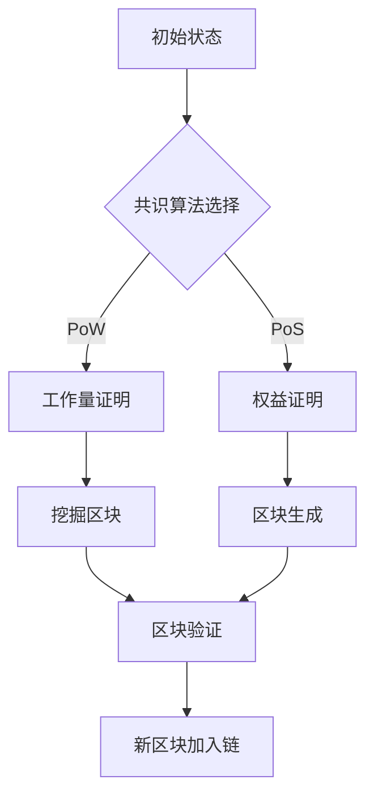
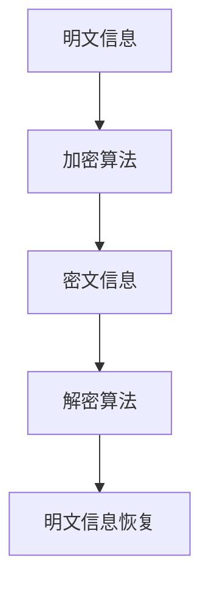
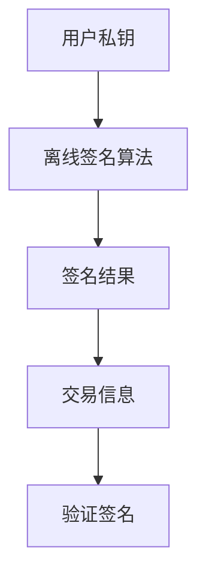
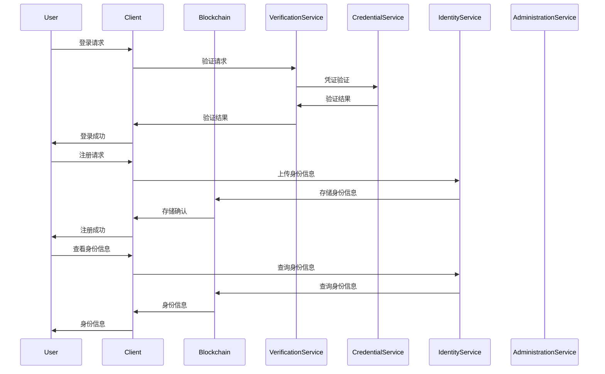
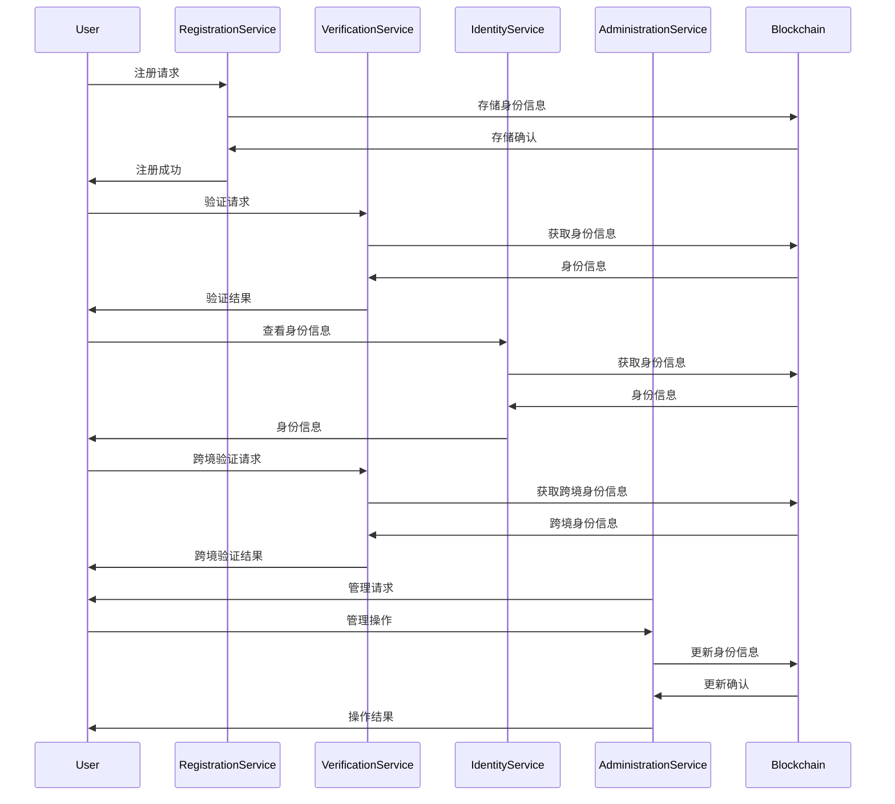

                 

### 第一部分：引言

#### 第1章：区块链与数字身份认证概述

在当今数字化时代，身份认证是一个关键的基础设施，它确保了网络和系统的安全性与可靠性。随着互联网和移动设备的普及，跨境身份验证的需求变得尤为迫切。然而，传统的身份验证方式常常面临诸如数据泄露、隐私泄露、跨境数据传输复杂等问题。区块链技术的出现为这些问题提供了一种可能的解决方案。

**关键词：**区块链、数字身份认证、跨境身份验证、隐私保护、安全

**摘要：**本文将深入探讨区块链技术在数字身份认证中的应用，分析其优势、面临的挑战以及潜在的解决方案。通过逐步分析区块链的基本原理、数字身份认证的核心概念、区块链在跨境身份验证中的应用原理，我们将揭示区块链技术在简化跨境身份验证方面的巨大潜力。

## 1.1 区块链技术简介

#### 1.1.1 区块链的定义与特点

区块链是一种去中心化的分布式数据库技术，它通过加密算法和共识机制确保数据的不可篡改和透明性。简单来说，区块链是一个由多个“区块”组成的链式数据结构，每个区块包含一组交易记录，并通过密码学原理与前一个区块链接起来，形成一个无法篡改的链条。

区块链的特点包括：

- **去中心化**：区块链不需要中央机构进行管理，而是通过分布式网络中的所有节点共同维护和验证数据。
- **不可篡改性**：一旦数据被记录在区块链上，就几乎无法被篡改，这得益于区块链的加密和共识机制。
- **透明性**：区块链上的所有数据都是公开透明的，任何节点都可以查看和验证。
- **自主性**：区块链上的智能合约能够自动执行预定义的合同条款，减少了人为干预。

#### 1.1.2 区块链的基本原理

区块链的基本原理可以通过以下三个关键组成部分来理解：

- **区块（Block）**：区块是区块链中的基本数据单元，包含一定数量的交易记录。每个区块都有唯一的标识符，即“哈希值”，并通过哈希函数与前一个区块链接。
- **链（Chain）**：区块链是由一系列按时间顺序排列的区块组成的链条。每个区块通过其哈希值与前一个区块相连接，形成一个不可篡改的链条。
- **节点（Node）**：节点是区块链网络中的参与者，负责维护和验证区块链的状态。在去中心化的区块链网络中，所有节点都具有相同的权限。

#### 1.1.3 区块链的发展历程

区块链技术的发展历程可以分为以下几个阶段：

- **1.0阶段（比特币）**：2008年，中本聪（Satoshi Nakamoto）发布了比特币白皮书，提出了区块链和加密货币的概念。比特币作为第一个成功的区块链应用，实现了去中心化的电子货币系统。
- **2.0阶段（智能合约）**：2014年，以太坊的推出标志着区块链技术的2.0阶段，引入了智能合约的概念。智能合约是区块链上的自动执行程序，能够根据预设条件自动执行合同。
- **3.0阶段（应用多样化）**：目前，区块链技术正逐渐从金融领域扩展到其他领域，如供应链管理、医疗保健、数字身份认证等，展现出更加广泛的应用前景。

#### 1.2 数字身份认证概述

#### 1.2.1 数字身份认证的定义与意义

数字身份认证是指在网络环境中，通过一系列技术手段验证用户身份的真实性和合法性。数字身份认证对于网络系统和电子商务具有重要意义，它可以确保：

- **安全**：防止未经授权的用户访问系统和数据。
- **可信**：建立网络参与者之间的信任关系。
- **便捷**：简化用户登录和操作流程，提高用户体验。

#### 1.2.2 数字身份认证的分类

数字身份认证可以分为以下几类：

- **单因素认证**：使用单一的凭证进行认证，如密码。
- **双因素认证**：结合两种不同的认证方式，如密码和短信验证码。
- **多因素认证**：使用多种认证方式，如指纹、面部识别等。

#### 1.2.3 数字身份认证的挑战与机遇

数字身份认证面临的主要挑战包括：

- **隐私泄露**：传统的集中式身份认证系统容易成为黑客攻击的目标。
- **跨境认证**：不同国家和地区之间的身份认证标准不统一，增加了认证难度。
- **用户体验**：过于繁琐的认证流程会影响用户体验。

然而，随着区块链技术的进步，数字身份认证迎来了新的机遇：

- **隐私保护**：区块链的匿名性和加密技术可以增强个人隐私保护。
- **跨境认证**：去中心化的区块链网络可以实现跨国家、跨平台的身份认证。
- **自动化与便捷**：智能合约可以实现身份认证过程的自动化和便捷化。

#### 1.3 区块链在数字身份认证中的应用前景

区块链技术在数字身份认证中的应用具有显著的优势：

- **去中心化**：区块链的去中心化特性可以减少对中央权威机构的依赖，提高系统的透明度和可信度。
- **不可篡改性**：区块链的数据不可篡改特性确保了身份信息的真实性和可靠性。
- **隐私保护**：区块链的加密技术可以保护个人隐私，防止数据泄露。
- **跨境认证**：区块链网络可以实现跨国家、跨平台的身份认证，简化跨境业务流程。

在跨境身份验证方面，区块链技术可以提供以下解决方案：

- **分布式身份注册**：通过区块链网络建立全球统一的身份注册系统，用户可以在多个国家或地区之间自由迁移身份信息。
- **智能合约验证**：智能合约可以自动执行身份验证过程，提高认证效率和准确性。
- **隐私保护机制**：区块链的零知识证明等隐私保护技术可以实现身份验证过程中的隐私保护。

总之，区块链技术为数字身份认证带来了新的发展机遇，有望简化跨境身份验证，提高系统安全性和用户体验。

#### 1.4 本书内容安排与阅读指南

**内容安排概述：**本书分为五部分，首先介绍区块链与数字身份认证的基本概念，然后深入探讨区块链在数字身份认证中的应用原理、算法原理、系统分析与架构设计方案，最后通过项目实战展示区块链在数字身份认证中的应用案例。

**阅读方法与建议：**建议读者首先了解区块链和数字身份认证的基本概念，然后逐步学习区块链在数字身份认证中的应用原理和算法原理，结合系统分析与架构设计方案进行深入理解。通过项目实战部分，读者可以更好地掌握区块链在数字身份认证中的实际应用。

#### 1.5 本章小结

本章介绍了区块链与数字身份认证的基本概念，分析了区块链技术的基本原理、数字身份认证的核心概念以及区块链在数字身份认证中的应用前景。通过本章的学习，读者可以初步了解区块链技术在数字身份认证中的潜在应用，并为后续章节的深入学习打下基础。

## 2.1 区块链技术基础

区块链作为一项颠覆性的技术，其基本组成和工作原理是我们深入了解其应用的前提。本节将详细解析区块链的基本组成，包括区块、链和节点，并探讨这些组件在区块链网络中的作用。

#### 2.1.1 区块

区块是区块链的基本组成单元，每个区块包含一组交易记录、时间戳和指向前一个区块的哈希值。具体来说，一个区块主要由以下几部分组成：

- **交易记录**：区块中的交易记录包含了用户之间的交易信息，如金额、时间戳、交易双方地址等。这些交易记录由网络中的节点进行验证和确认。
- **时间戳**：时间戳是区块创建的时间标记，确保了区块链上数据的顺序和时间一致性。时间戳通常通过加密算法和区块链网络中的共识机制来生成。
- **哈希值**：哈希值是区块链中的核心概念，用于确保区块之间的链接和数据的完整性。每个区块都有一个唯一的哈希值，该值通过SHA-256等加密算法计算得出。当前区块的哈希值通常依赖于前一个区块的哈希值，从而形成一条不可篡改的链条。

#### 2.1.2 链

区块链中的“链”指的是一系列按时间顺序排列的区块，每个区块通过其哈希值与前一个区块相连接。这种链式结构确保了区块链的不可篡改性。具体来说，区块链的链式结构具有以下几个关键特性：

- **不可篡改性**：一旦数据被记录在区块链上，就几乎无法被篡改。这是因为任何对区块数据的修改都会导致其后所有区块的哈希值发生变化，从而被区块链网络中的节点检测出来并拒绝。
- **分布式存储**：区块链的数据存储在分布式网络中的所有节点上，而不是集中在一个中心化的数据库中。这使得区块链具有高度的可扩展性和抗攻击能力。
- **透明性**：区块链上的所有数据都是公开透明的，任何节点都可以查看和验证。这确保了区块链系统的透明度和公正性。

#### 2.1.3 节点

节点是区块链网络中的参与者，负责维护和验证区块链的状态。在去中心化的区块链网络中，每个节点都具有相同的权限，包括：

- **数据存储**：节点存储区块链上的所有数据，包括区块、交易记录等。节点通过区块链网络中的共识机制来同步和更新数据。
- **数据验证**：节点负责验证交易记录和区块的合法性。在比特币网络中，节点通过工作量证明（PoW）算法来验证交易和生成新区块。
- **网络通信**：节点通过区块链网络与其他节点进行通信，交换交易记录和区块信息。节点通过P2P（点对点）网络协议来实现分布式通信。

#### 2.1.4 区块链网络中的共识机制

共识机制是区块链网络中确保数据一致性和系统安全性的关键机制。不同的区块链网络采用不同的共识机制，以下是几种常见的共识机制：

- **工作量证明（PoW）**：工作量证明是一种通过计算解决数学难题来验证交易和生成新区块的机制。在比特币网络中，节点通过竞争计算生成新区块，并获取区块链网络的奖励。
- **权益证明（PoS）**：权益证明是一种通过持有和抵押数字资产来验证交易和生成新区块的机制。在权益证明机制中，节点根据其持有的数字资产数量和持有时间来参与共识过程，并获取区块链网络的奖励。
- **授权证明（PoA）**：授权证明是一种由一组预先选定的节点负责验证交易和生成新区块的机制。这些预选节点通常由一个中心化的权威机构或组织进行管理。

#### 2.1.5 区块链网络的安全性

区块链网络的安全性是确保数据不可篡改和系统稳定运行的关键。区块链网络的安全性主要依赖于以下几方面：

- **加密技术**：区块链使用加密技术来保护数据的安全性和隐私性。加密技术包括哈希函数、非对称加密、对称加密等，确保了数据在传输和存储过程中的安全。
- **共识机制**：共识机制通过分布式网络中的节点共同维护和验证区块链的数据，确保了系统的安全性和一致性。共识机制的设计和实现是区块链网络安全性的重要保障。
- **去中心化**：区块链的去中心化特性使得系统不受单一中心化节点的控制，增强了系统的抗攻击能力和稳定性。

#### 2.1.6 区块链网络的可扩展性

区块链网络的可扩展性是区块链技术的关键挑战之一。随着区块链网络的规模扩大，网络性能和交易处理能力可能会受到影响。为了提高区块链网络的可扩展性，一些解决方案被提出：

- **分层架构**：通过引入分层架构，将区块链网络分为多个层，如数据层、网络层、应用层等。这样可以降低网络通信的复杂度和数据存储的负担。
- **侧链技术**：侧链是一种与主链并行运行的区块链，用于处理大量交易和实现特定功能。通过侧链技术，可以减轻主链的负担，提高网络的交易处理能力。
- **跨链技术**：跨链技术实现了不同区块链之间的互操作性和数据共享。通过跨链技术，可以扩展区块链网络的应用范围和生态系统。

#### 2.1.7 本章小结

通过本节的介绍，我们了解了区块链的基本组成和工作原理，包括区块、链和节点。区块是区块链的基本数据单元，包含交易记录、时间戳和哈希值；链是按时间顺序排列的区块，确保数据的不可篡改；节点是区块链网络中的参与者，负责数据存储、验证和通信。同时，我们探讨了区块链网络中的共识机制、安全性和可扩展性，为后续章节的深入学习奠定了基础。

---

## 2.2 区块链的交易机制

区块链的交易机制是区块链网络的核心组成部分，它决定了区块链网络的运作方式和数据传输流程。在本节中，我们将详细探讨区块链的交易机制，包括交易的定义、交易流程和验证机制，以及共识算法在区块链交易中的作用。

#### 2.2.1 交易的定义与特点

交易是区块链网络中的基本操作，它代表了用户之间的价值转移或信息交换。一个交易通常包含以下几个关键组成部分：

- **交易发起方**：发起交易的用户，通常通过私钥对交易进行签名，确保交易的真实性和不可抵赖性。
- **交易接收方**：接收交易的用户，交易发起方会将一定数量的数字资产或信息发送给接收方。
- **交易金额**：交易涉及的价值量，可以是数字货币或其他形式的价值表示。
- **交易信息**：交易的其他相关信息，如交易备注、交易日期等。

区块链交易的特点包括：

- **不可篡改性**：交易记录一旦被区块链网络确认和记录，就几乎无法被篡改。这是因为区块链的加密和共识机制确保了交易数据的真实性和完整性。
- **透明性**：区块链网络上的所有交易都是公开透明的，任何用户都可以查看和验证交易数据。
- **去中心化**：区块链交易不需要中央权威机构的参与和验证，交易由网络中的节点共同维护和验证。

#### 2.2.2 交易流程与验证机制

区块链的交易流程可以分为以下几个主要步骤：

1. **交易发起**：用户通过网络客户端发起交易请求，交易请求通常包含交易发起方、接收方、交易金额和交易信息等。
2. **交易签名**：交易发起方使用其私钥对交易请求进行签名，生成数字签名。数字签名确保了交易请求的真实性和不可抵赖性。
3. **交易广播**：交易发起方将已签名的交易请求广播到区块链网络中，网络中的其他节点接收到交易请求后进行验证。
4. **交易验证**：网络中的节点对交易请求进行验证，包括验证交易发起方的数字签名、检查交易金额和交易信息的合法性等。验证通过的交易将被节点存储在本地数据库中。
5. **区块生成**：多个交易请求经过验证后，将被节点打包成一个新区块。新区块包含一定数量的交易记录，并生成一个哈希值作为新区块的标识。
6. **区块验证**：其他节点接收到新区块后，将验证新区块的合法性和完整性。验证通过的新区块将被添加到区块链上，成为区块链上的一部分。
7. **交易确认**：交易一旦被记录在区块链上，就获得了区块链网络的全额确认。交易确认通常需要多个区块的确认，以确保交易的安全性。

区块链的交易验证机制主要包括以下几个方面：

- **数字签名验证**：节点使用交易发起方的公钥验证交易发起方的数字签名，确保交易请求的真实性和不可抵赖性。
- **交易金额检查**：节点检查交易金额是否合法，即交易金额是否大于账户余额等。
- **交易信息检查**：节点检查交易信息是否符合预期，如交易备注、交易日期等。
- **双重花费检测**：节点检测交易记录中是否存在双重花费，即同一笔数字资产是否被多次交易。

#### 2.2.3 共识算法

共识算法是区块链网络中确保数据一致性和系统安全性的关键机制。不同的区块链网络采用不同的共识算法，以下是一些常见的共识算法：

- **工作量证明（PoW）**：工作量证明是比特币等区块链网络采用的共识算法。节点通过解决数学难题来验证交易和生成新区块，并获取区块链网络的奖励。PoW算法的目的是确保区块链网络中的计算资源不会被恶意攻击者轻易掌控。
- **权益证明（PoS）**：权益证明是一种通过持有和抵押数字资产来验证交易和生成新区块的机制。在PoS算法中，节点根据其持有的数字资产数量和持有时间来参与共识过程，并获取区块链网络的奖励。PoS算法相对于PoW算法具有更高的安全性，因为攻击者需要控制较多的数字资产才能发动攻击。
- **授权证明（PoA）**：授权证明是一种由一组预先选定的节点负责验证交易和生成新区块的机制。这些预选节点通常由一个中心化的权威机构或组织进行管理。PoA算法具有较高的安全性和效率，因为只有经过授权的节点才能参与共识过程。

#### 2.2.4 区块链网络的交易速度和吞吐量

区块链网络的交易速度和吞吐量是衡量区块链性能的重要指标。交易速度指的是区块链网络处理交易的速度，即从交易发起到交易确认所需的时间。吞吐量指的是区块链网络在单位时间内可以处理的交易数量。

不同的共识算法对区块链网络的交易速度和吞吐量有不同的影响。一般来说，PoW算法由于需要解决数学难题，交易速度较慢，但安全性较高。PoS算法和PoA算法由于不需要解决数学难题，交易速度相对较快，但安全性相对较低。

为了提高区块链网络的交易速度和吞吐量，一些优化措施被提出：

- **分层架构**：通过引入分层架构，将区块链网络分为多个层，如数据层、网络层、应用层等。这样可以降低网络通信的复杂度和数据存储的负担，提高交易处理能力。
- **侧链技术**：侧链是一种与主链并行运行的区块链，用于处理大量交易和实现特定功能。通过侧链技术，可以减轻主链的负担，提高网络的交易处理能力。
- **跨链技术**：跨链技术实现了不同区块链之间的互操作性和数据共享。通过跨链技术，可以扩展区块链网络的应用范围和生态系统，提高交易处理能力。

#### 2.2.5 本章小结

通过本节的介绍，我们了解了区块链的交易机制，包括交易的定义、交易流程和验证机制，以及共识算法在区块链交易中的作用。交易是区块链网络中的基本操作，通过区块链的加密和共识机制，交易具有不可篡改性、透明性和去中心化的特点。同时，不同的共识算法对区块链网络的交易速度和吞吐量有不同的影响，通过引入优化措施，可以提高区块链网络的性能。本章内容为后续章节深入探讨区块链在数字身份认证中的应用奠定了基础。

---

## 2.3 智能合约

智能合约是一种自动化执行程序，它能够根据预设条件自动执行合同条款，从而减少人为干预和降低交易风险。智能合约是区块链技术的一个重要组成部分，尤其以太坊等区块链平台上的智能合约得到了广泛应用。本节将详细探讨智能合约的定义与原理，智能合约的开发与部署，以及智能合约在实际应用中的典型场景。

#### 2.3.1 智能合约的定义与原理

智能合约是一种在区块链上运行的计算机程序，它可以自动执行合同条款，确保交易的执行和合同的履行。智能合约的基本原理包括以下几个方面：

1. **代码与数据分离**：智能合约将代码和数据分离，代码部分称为“合约代码”，存储在区块链上；数据部分称为“状态”，存储在区块链的分布式账本中。这种分离确保了智能合约的透明性和可追溯性。
2. **去中心化执行**：智能合约的执行由区块链网络中的节点共同完成，而不是由单一的中央机构控制。这种去中心化的执行机制提高了智能合约的安全性和可信度。
3. **自动化执行**：智能合约能够根据预设的条件和规则自动执行合同条款，从而减少人为干预和降低交易风险。例如，如果满足合同中的某个条件，智能合约可以自动释放付款或执行其他操作。
4. **不可篡改性**：智能合约的代码一旦部署到区块链上，就几乎无法被篡改。这是因为智能合约的代码是通过加密算法和区块链网络中的共识机制来确保其完整性和不可篡改性。

#### 2.3.2 智能合约的开发与部署

智能合约的开发和部署是区块链应用开发的重要环节。以下简要介绍智能合约的开发与部署过程：

1. **智能合约开发**：智能合约通常使用特定的编程语言进行开发，如Solidity、Vyper等。开发者需要根据业务需求设计智能合约的接口和逻辑，并确保合约代码的安全性和效率。
2. **智能合约编译**：智能合约编写完成后，需要通过编译器将其编译成区块链平台支持的字节码。编译后的字节码可以部署到区块链上，并在区块链网络中执行。
3. **智能合约部署**：部署智能合约是将编译后的字节码上传到区块链平台的过程。在以太坊平台上，部署智能合约通常通过“合约创建”交易完成，即将合约代码和初始参数作为交易数据提交到区块链网络。
4. **智能合约地址**：部署成功后，智能合约将获得一个唯一的地址，该地址用于标识和调用智能合约。智能合约的调用是通过向其地址发送以太币或其他代币来触发的。

#### 2.3.3 智能合约的应用场景

智能合约在区块链应用中具有广泛的应用场景，以下列举几种典型的应用场景：

1. **金融领域**：智能合约在金融领域得到广泛应用，如去中心化金融（DeFi）、加密货币交易、跨境支付等。智能合约可以自动执行交易、利息计算、支付流程等，提高金融交易的效率和安全性。
2. **供应链管理**：智能合约可以用于供应链管理中的货物流转、质量检测、支付结算等环节。通过智能合约，供应链中的各方可以透明地跟踪货物信息，确保供应链的效率和合规性。
3. **房地产交易**：智能合约可以简化房地产交易流程，如房产购买、租赁、过户等。通过智能合约，交易双方可以自动执行合同条款，减少中介环节，提高交易效率。
4. **身份认证**：智能合约可以用于数字身份认证和权限管理，确保用户的身份信息和权限得到有效保护。例如，在跨境身份验证中，智能合约可以自动化执行身份验证流程，简化跨境业务操作。
5. **版权保护**：智能合约可以用于版权保护和知识产权管理，如数字版权交易、版权追踪等。通过智能合约，创作者可以自动获得版税分配，确保版权得到有效保护。

#### 2.3.4 智能合约的优势与挑战

智能合约在区块链应用中具有显著的优势：

1. **自动化执行**：智能合约能够自动执行合同条款，减少人为干预和操作错误。
2. **去中心化**：智能合约的去中心化特性提高了系统的透明度和可信度。
3. **不可篡改**：智能合约一旦部署到区块链上，就几乎无法被篡改，确保了数据的真实性和完整性。

然而，智能合约也面临一些挑战：

1. **安全性问题**：智能合约的代码安全性直接影响其执行结果，一旦存在漏洞，可能导致严重的经济损失。
2. **开发门槛**：智能合约开发需要一定的编程技能和区块链知识，对开发者提出了较高的要求。
3. **性能瓶颈**：智能合约在执行过程中可能会面临性能瓶颈，影响其大规模应用。

#### 2.3.5 本章小结

通过本节的介绍，我们了解了智能合约的定义与原理，以及智能合约的开发与部署过程。智能合约作为一种自动化执行程序，在区块链应用中具有广泛的应用场景和显著的优势。然而，智能合约也面临一些挑战，如安全性问题、开发门槛和性能瓶颈等。通过不断优化和改进，智能合约有望在更多领域发挥重要作用。

---

## 2.4 区块链网络的安全性

区块链网络的安全性是确保区块链系统稳定运行和数据完整性的关键因素。区块链技术以其去中心化和不可篡改的特性受到广泛关注，但也面临着一系列安全挑战。本节将探讨区块链网络的安全性，包括常见的安全挑战、区块链的防篡改机制以及防双花攻击机制。

#### 2.4.1 区块链安全性的挑战

区块链网络在安全性方面面临以下挑战：

1. **51%攻击**：这是指恶意节点控制区块链网络中超过50%的计算资源，从而对区块链网络进行非法控制。攻击者可以发动双花攻击（double-spending attack），即重复使用已经花费过的数字货币，从而导致区块链网络中的数据不一致。
2. **智能合约漏洞**：智能合约在代码实现过程中可能存在漏洞，攻击者可以利用这些漏洞来窃取资金或破坏区块链网络的正常运行。
3. **隐私泄露**：尽管区块链网络的交易数据是公开透明的，但某些情况下，用户身份和交易信息可能会被关联，从而泄露隐私。
4. **分布式拒绝服务攻击（DDoS）**：攻击者通过大量无效请求占用区块链网络的计算资源，导致区块链网络无法正常处理有效交易，从而瘫痪区块链网络。

#### 2.4.2 防篡改机制

区块链的防篡改机制是其安全性的核心保障。以下是几种常见的防篡改机制：

1. **哈希函数**：区块链使用哈希函数将数据转换成固定长度的字符串，确保数据的唯一性和不可篡改性。每个区块都包含其前一个区块的哈希值，从而形成一条不可篡改的链条。
2. **数字签名**：交易发起方使用私钥对交易进行签名，确保交易的真实性和不可抵赖性。节点使用交易发起方的公钥验证交易签名，确保交易数据的完整性和一致性。
3. **共识机制**：共识机制通过分布式网络中的节点共同维护和验证区块链的数据，确保数据的真实性和一致性。例如，工作量证明（PoW）和权益证明（PoS）机制可以防止恶意节点篡改数据。
4. **加密技术**：区块链使用加密技术保护数据的安全性和隐私性。例如，非对称加密和对称加密可以确保数据的传输和存储过程中的安全。

#### 2.4.3 防双花攻击机制

双花攻击是指攻击者重复使用已经花费过的数字货币，从而破坏区块链网络的一致性。以下是几种常见的防双花攻击机制：

1. **确认数**：交易在被区块链网络确认前，可能存在被双花攻击的风险。为了防止双花攻击，区块链网络通常要求交易达到一定数量的确认数（如6个确认）后，才被认为安全。这样，攻击者无法在短时间内完成双花攻击。
2. **预签名交易**：在跨境支付等场景中，预签名交易可以防止双花攻击。交易双方在进行交易前，各自生成部分签名的交易，然后通过区块链网络传递。当双方都确认交易已完成时，双方再完成交易的最后签名，从而确保交易的安全性。
3. **时间戳服务**：通过引入时间戳服务，可以为交易记录一个确切的创建时间。这样，区块链网络可以更准确地判断交易发生的先后顺序，从而防止双花攻击。

#### 2.4.4 防隐私泄露机制

区块链网络的公开透明特性可能导致隐私泄露。以下是一些防隐私泄露的机制：

1. **零知识证明**：零知识证明技术允许一方在不泄露具体信息的情况下，证明某个陈述是真实的。通过零知识证明，区块链网络可以实现隐私保护，例如，在跨境身份验证中，用户可以证明自己的身份信息是真实的，而不需要公开具体信息。
2. **环签名**：环签名技术可以将用户的身份信息隐藏在一个环中，使得用户无法被单独识别。通过环签名，区块链网络可以实现匿名交易，从而保护用户隐私。
3. **同态加密**：同态加密技术允许对加密数据进行计算，而无需解密。通过同态加密，区块链网络可以在加密状态下执行交易，确保交易过程和结果的隐私性。

#### 2.4.5 本章小结

通过本节的介绍，我们了解了区块链网络的安全性，包括常见的安全挑战、区块链的防篡改机制以及防双花攻击机制。区块链的防篡改机制通过哈希函数、数字签名、共识机制和加密技术等手段，确保数据的真实性和完整性。同时，区块链也面临一些安全挑战，如51%攻击、智能合约漏洞和隐私泄露等。通过引入防双花攻击机制和隐私保护机制，区块链网络可以在确保安全性的同时，提供更高的隐私保护。本章内容为后续章节深入探讨区块链在数字身份认证中的应用提供了重要的安全基础。

---

## 3.1 数字身份认证的核心概念

数字身份认证是确保网络和系统安全性的关键措施，它通过验证用户的身份信息来防止未经授权的访问和数据泄露。本节将介绍数字身份认证的核心概念，包括身份认证的定义与作用、身份信息的属性与分类，以及身份认证的流程。

#### 3.1.1 身份认证的定义与作用

身份认证是指验证用户身份的真实性和合法性的过程。在数字环境中，身份认证确保只有经过授权的用户才能访问系统和数据。身份认证的主要作用包括：

1. **安全性**：通过身份认证，可以确保系统和数据的访问仅限于授权用户，防止未授权的访问和数据泄露。
2. **信任**：身份认证建立了网络参与者之间的信任关系，确保业务交易和数据交换的安全和可靠。
3. **便捷性**：身份认证通过简化登录和操作流程，提高用户体验，减少用户操作的复杂性。

#### 3.1.2 身份信息的属性与分类

身份信息是指用于唯一识别用户身份的数据，它具有以下几个属性：

1. **唯一性**：身份信息必须是唯一的，以确保每个用户有一个唯一的身份标识。
2. **可靠性**：身份信息必须是可靠和准确的，以确保身份认证的有效性。
3. **持久性**：身份信息应在用户生命周期内保持不变，以便长期使用。

根据身份信息的来源和用途，身份信息可以分为以下几类：

1. **生物特征信息**：包括指纹、面部识别、虹膜扫描等，这些信息具有高度的唯一性和稳定性，但收集和使用较为复杂。
2. **凭证信息**：包括用户名、密码、安全提问等，这些信息较为简单易用，但存在被破解的风险。
3. **证书信息**：包括数字证书、身份认证卡等，这些信息通过加密和数字签名确保安全性和可信度。
4. **社会信息**：包括生日、地址、电话号码等，这些信息可以用于补充身份验证，但容易被伪造。

#### 3.1.3 身份认证的流程

数字身份认证的流程通常包括以下几个步骤：

1. **身份信息收集**：系统收集用户的身份信息，如用户名、密码、生物特征等。
2. **身份信息验证**：系统对收集到的身份信息进行验证，以确保其真实性和合法性。验证方法包括密码验证、生物特征验证、证书验证等。
3. **身份信息存储**：将经过验证的身份信息存储在系统中，以备后续使用。
4. **访问控制**：根据用户的身份信息，系统决定用户是否有权限访问特定的资源和数据。
5. **日志记录**：记录身份认证过程的相关信息，如认证时间、认证结果等，以便进行审计和故障排查。

#### 3.1.4 身份认证的挑战与解决方案

数字身份认证在实现过程中面临一些挑战，如：

1. **安全性**：如何确保身份信息不被窃取或篡改。
2. **隐私保护**：如何保护用户的隐私信息不被泄露。
3. **便捷性**：如何在确保安全性的同时，提高用户的使用体验。

解决方案包括：

1. **多因素认证**：结合多种身份验证方式，提高系统的安全性。例如，密码+生物特征识别。
2. **零知识证明**：通过零知识证明技术，用户无需泄露具体信息即可证明身份。
3. **身份信息加密**：使用加密技术保护身份信息在传输和存储过程中的安全。
4. **自动化与智能化**：通过自动化和智能化技术，简化身份认证流程，提高用户体验。

#### 3.1.5 本章小结

通过本节的介绍，我们了解了数字身份认证的核心概念，包括身份认证的定义与作用、身份信息的属性与分类，以及身份认证的流程。数字身份认证是确保网络和系统安全性的关键措施，通过多种身份验证方式和加密技术，可以提高系统的安全性、隐私保护和用户体验。这些核心概念为后续章节深入探讨区块链在数字身份认证中的应用奠定了基础。

---

## 3.2 数字身份认证的属性特征对比表格

在数字身份认证领域，不同认证技术的属性特征各有优劣。以下是一个对比表格，列举了几种常见身份认证技术的核心特征，包括安全性、可靠性、易用性和成本。

| 身份认证技术       | 安全性 | 可靠性 | 易用性 | 成本 |
|------------------|-------|-------|-------|-----|
| 单因素认证（密码）   | 低    | 低    | 高    | 低  |
| 双因素认证（密码+短信验证码） | 中    | 中    | 中    | 中  |
| 生物特征认证（指纹、面部识别） | 高    | 高    | 中    | 高  |
| 数字证书认证       | 高    | 高    | 中    | 高  |
| 零知识证明        | 高    | 高    | 低    | 高  |

#### 说明：

- **安全性**：表示身份认证技术抵御外部攻击和内部威胁的能力。
- **可靠性**：表示身份认证技术正确识别用户身份的能力。
- **易用性**：表示用户使用身份认证技术的便捷程度。
- **成本**：包括技术实现成本、硬件设备成本和维护成本。

通过这个表格，我们可以清楚地看到不同身份认证技术在安全性、可靠性、易用性和成本方面的对比，为选择合适的身份认证技术提供了参考。

---

## 3.3 数字身份认证的ER实体关系图架构

实体关系图（Entity-Relationship Diagram，ER图）是一种用于描述实体及其之间关系的图形化表示方法，它广泛应用于数据库设计和数据建模。在数字身份认证领域，ER图可以帮助我们清晰地理解身份认证系统中各实体的属性和关系。本节将介绍ER图的基本概念、绘制方法以及在数字身份认证中的应用。

#### 3.3.1 实体与关系的定义

在ER图中，实体（Entity）是具有共同属性的对象的集合，可以是人、物或抽象的概念。实体具有以下属性：

- **实体名**：表示实体的名称。
- **属性**：描述实体特征的属性，如姓名、年龄、身份证号等。
- **主键**：唯一标识实体的属性，通常用于在数据库中唯一标识一个实体。

关系（Relationship）是实体之间的连接，它描述了实体之间的关联。关系具有以下属性：

- **关系名**：表示关系的名称。
- **参与实体**：关系涉及的两个或多个实体。
- **角色**：实体在关系中的角色，如“学生”在“选修”关系中的角色可以是“选课者”或“授课者”。

#### 3.3.2 ER图的绘制方法

ER图的绘制通常遵循以下步骤：

1. **确定实体**：根据业务需求，确定需要表示的实体，并为其命名。例如，在数字身份认证系统中，可能需要表示用户、角色、认证策略等实体。
2. **定义属性**：为每个实体定义属性，并确定哪些属性是主键。例如，用户实体可能包括用户名、密码、电子邮件等属性，其中用户名可以作为主键。
3. **确定关系**：分析实体之间的关系，并定义关系。例如，在数字身份认证系统中，用户与角色之间存在关联关系，用户可以选择不同的角色，而角色也可以分配给多个用户。
4. **绘制ER图**：使用图形化工具，将实体和关系表示在纸上或电子文档中。实体用矩形表示，属性用椭圆表示，关系用线段表示。

#### 3.3.3 ER图在数字身份认证中的应用

以下是一个简单的数字身份认证系统的ER图示例：

```mermaid
erDiagram
    User ||--|{ Authority }| Authority
    User ||--|{ Credential }| Credential
    Authority ||--|{ Role }| Role
    Credential ||--|{ Authentication }| Authentication

    User {
        # 用户属性
        User_ID : 主键
        Username
        Password
        Email
    }

    Authority {
        # 权限属性
        Authority_ID : 主键
        Name
    }

    Role {
        # 角色属性
        Role_ID : 主键
        Name
    }

    Credential {
        # 凭证属性
        Credential_ID : 主键
        Credential_Type
        Value
    }

    Authentication {
        # 认证属性
        Authentication_ID : 主键
        User_ID : 用户ID
        Credential_ID : 凭证ID
        Status
    }
```

在这个ER图中，我们定义了四个实体：用户（User）、权限（Authority）、角色（Role）和凭证（Credential），以及一个关系：认证（Authentication）。用户与权限之间是一对多的关系，即一个用户可以有多个权限；用户与凭证之间也是一对多的关系，即一个用户可以有多个凭证；权限与角色之间是一对多的关系，即一个权限可以分配给多个角色；凭证与认证之间是一对一的关系，即每个凭证对应一个认证记录。

通过这个ER图，我们可以清晰地理解数字身份认证系统中各实体的属性和关系，为数据库设计和实现提供了重要的参考。

#### 3.3.4 本章小结

通过本节的介绍，我们了解了ER图的基本概念和绘制方法，并展示了如何使用ER图描述数字身份认证系统的实体关系。ER图在数字身份认证领域具有重要的应用价值，可以帮助我们清晰地理解系统中的各个实体及其关系，为数据库设计和实现提供了重要的参考。掌握ER图的绘制方法和应用，将有助于我们在数字身份认证领域更好地进行系统分析和设计。

---

## 4.1 区块链在数字身份认证中的作用

区块链技术以其去中心化、不可篡改和透明性等特点，在数字身份认证领域展现出强大的应用潜力。本节将详细探讨区块链在数字身份认证中的作用，包括区块链在身份信息存储、身份验证和身份隐私保护中的应用。

#### 4.1.1 区块链在身份信息存储中的应用

区块链技术为身份信息存储提供了一种安全、可靠且透明的方式。在区块链上，身份信息以加密的形式存储在分布式网络中的多个节点上，从而确保数据的安全性和完整性。以下是区块链在身份信息存储中的几个关键优势：

1. **去中心化存储**：区块链的去中心化特性使得身份信息不再依赖于中心化的数据库，从而提高了系统的容错性和抗攻击能力。每个节点都存储一份完整的身份信息副本，即使某个节点遭受攻击或失效，系统仍能正常运行。
2. **不可篡改性**：区块链的加密和共识机制确保了存储在区块链上的身份信息几乎无法被篡改。一旦身份信息被记录在区块链上，就几乎无法被修改或删除，从而保证了数据的真实性和可靠性。
3. **透明性**：区块链上的所有数据都是公开透明的，任何节点都可以查看和验证身份信息。这种透明性提高了身份认证系统的可信度，用户可以清楚地了解自己的身份信息是如何被存储和管理的。
4. **防双花攻击**：区块链的防双花攻击机制确保了身份信息的唯一性和安全性。在数字身份认证中，用户的一次身份验证结果不能被重复使用，从而避免了身份信息的滥用。

#### 4.1.2 区块链在身份验证中的应用

区块链技术为身份验证提供了一种新的解决方案，通过智能合约和分布式账本技术，可以实现高效、安全和可信的身份验证过程。以下是区块链在身份验证中的几个关键应用：

1. **多因素认证**：区块链技术支持多因素认证，通过结合密码、生物特征识别、数字证书等多种认证方式，可以提高身份验证的安全性。智能合约可以根据预设的条件和规则，自动执行身份验证过程，确保验证过程的透明性和可靠性。
2. **分布式身份验证**：区块链网络中的节点可以协同工作，为用户身份验证提供分布式服务。用户在区块链上注册身份信息后，可以在多个节点之间进行验证，从而实现跨境身份验证和跨平台身份认证，提高了身份验证的便捷性和一致性。
3. **智能合约验证**：智能合约可以自动执行身份验证流程，从而减少人为干预和操作错误。例如，在跨境身份验证中，智能合约可以根据预设的规则和条件，自动验证用户身份信息，并生成身份验证结果，从而简化了身份验证过程。
4. **隐私保护**：区块链的零知识证明技术可以实现身份验证过程中的隐私保护。通过零知识证明，用户可以证明自己的身份信息是真实的，而不需要公开具体的身份信息，从而保护用户的隐私。

#### 4.1.3 区块链在身份隐私保护中的应用

区块链技术在身份隐私保护方面具有显著的优势，通过加密、匿名性和分布式账本技术，可以有效保护用户的隐私信息。以下是区块链在身份隐私保护中的几个关键应用：

1. **加密存储**：区块链使用加密技术保护存储在区块链上的身份信息。通过非对称加密算法，用户可以使用公钥和私钥对身份信息进行加密和解密，从而确保数据的机密性。
2. **匿名性**：区块链技术可以实现身份信息的匿名性。通过匿名币和零知识证明等技术，用户可以在区块链上进行匿名交易和身份验证，从而保护用户的隐私。
3. **分布式隐私保护**：区块链的分布式特性使得身份信息在多个节点上分散存储，从而降低了隐私泄露的风险。即使某个节点遭受攻击或泄露，整个系统的安全性仍然不受影响。
4. **隐私保护协议**：区块链技术可以引入隐私保护协议，如差分隐私、同态加密等，进一步提高身份信息的隐私保护能力。

#### 4.1.4 本章小结

通过本节的介绍，我们了解了区块链在数字身份认证中的作用，包括在身份信息存储、身份验证和身份隐私保护中的应用。区块链技术以其去中心化、不可篡改和透明性等特点，为数字身份认证提供了安全、高效和可信的解决方案。通过智能合约和分布式账本技术，区块链可以简化身份验证过程，提高系统的安全性和便捷性，同时保护用户的隐私。这些优势使得区块链技术在数字身份认证领域具有广阔的应用前景。

---

## 4.2 区块链在跨境身份验证中的应用

跨境身份验证是数字身份认证中一个复杂且重要的环节，传统方法常常面临跨境数据传输复杂、认证标准不统一等问题。区块链技术的引入为跨境身份验证提供了一种新的解决方案，能够简化验证流程，提高验证效率和安全性。本节将详细探讨区块链在跨境身份验证中的应用，包括面临的挑战、解决方案以及实际案例。

#### 4.2.1 跨境身份验证的挑战

跨境身份验证面临的挑战主要包括以下几个方面：

1. **数据传输复杂**：跨境身份验证需要在不同国家和地区的系统之间传输身份信息，涉及到不同的网络协议、数据格式和隐私法规，增加了数据传输的复杂性和成本。
2. **认证标准不统一**：不同国家和地区的身份认证标准和流程可能存在差异，如身份证件格式、验证方式等，导致跨境身份验证难以统一和标准化。
3. **数据隐私和安全**：跨境身份验证过程中，涉及大量个人隐私数据，如何在确保数据隐私和安全的前提下进行验证，是一个重要挑战。
4. **系统互操作性**：跨境身份验证需要不同系统之间的互操作性，包括系统接口、数据格式、认证协议等，增加了系统集成的复杂性。

#### 4.2.2 区块链在跨境身份验证中的解决方案

区块链技术为跨境身份验证提供了一系列解决方案，能够有效应对上述挑战：

1. **分布式身份注册**：区块链可以建立一个分布式身份注册系统，用户可以在多个国家或地区之间自由迁移身份信息。通过区块链的分布式存储和共识机制，确保身份信息的真实性和完整性，同时减少对中央权威机构的依赖。
2. **智能合约**：智能合约可以自动化执行跨境身份验证流程，减少人为干预和操作错误。例如，智能合约可以根据预设的条件和规则，自动验证用户的身份信息，并生成验证结果，从而简化跨境身份验证流程。
3. **隐私保护机制**：区块链的加密和零知识证明等隐私保护技术，可以确保跨境身份验证过程中的数据隐私和安全。通过零知识证明，用户可以证明自己的身份信息是真实的，而不需要公开具体信息，从而保护用户的隐私。
4. **跨链技术**：跨链技术实现了不同区块链之间的互操作性，通过跨链协议，可以实现不同区块链网络之间的数据交换和协同验证，从而实现全球范围内的跨境身份验证。

#### 4.2.3 实际案例与案例分析

以下是一个跨境身份验证的实际案例，展示了区块链技术在简化跨境身份验证中的具体应用：

**案例背景**：一个跨国金融服务公司需要为其全球范围内的客户提供一个统一的身份验证平台，以便在跨境交易和业务合作中快速验证客户身份。

**解决方案**：

1. **分布式身份注册**：公司建立一个分布式身份注册系统，用户可以在全球范围内的身份注册节点上注册和存储身份信息。这些身份信息通过区块链的分布式账本技术进行加密存储，确保数据的真实性和完整性。
2. **智能合约**：公司使用智能合约自动化执行跨境身份验证流程。例如，当客户在进行跨境交易时，智能合约会根据预设的条件和规则，自动验证客户的身份信息，并生成验证结果。验证结果将被记录在区块链上，确保验证过程的透明性和不可篡改性。
3. **隐私保护机制**：公司引入了零知识证明技术，确保跨境身份验证过程中的数据隐私和安全。例如，通过零知识证明，客户可以证明自己的身份信息是真实的，而不需要公开具体信息，从而保护客户的隐私。
4. **跨链技术**：公司通过跨链协议与其他区块链网络进行数据交换和协同验证，实现了全球范围内的跨境身份验证。例如，当客户在多个国家或地区进行身份验证时，智能合约会调用其他区块链网络中的身份验证结果，确保验证过程的一致性和准确性。

**案例分析**：

该实际案例展示了区块链技术在跨境身份验证中的应用，通过分布式身份注册、智能合约、隐私保护机制和跨链技术，实现了跨境身份验证的简化、高效和安全。分布式身份注册和智能合约确保了验证流程的自动化和透明性，隐私保护机制保障了用户隐私，跨链技术实现了全球范围内的协同验证。这个案例表明，区块链技术为跨境身份验证提供了一种可行的解决方案，有助于提高跨境业务的效率和安全性。

#### 4.2.4 本章小结

通过本节的介绍，我们了解了区块链在跨境身份验证中的应用，包括面临的挑战、解决方案和实际案例。区块链技术通过分布式身份注册、智能合约、隐私保护机制和跨链技术，能够简化跨境身份验证流程，提高验证效率和安全性。实际案例展示了区块链技术在跨境身份验证中的具体应用，为跨境业务提供了新的解决方案和思路。随着区块链技术的不断发展和完善，跨境身份验证有望变得更加简单、高效和安全。

---

## 4.3 智能合约在数字身份认证中的应用

智能合约在数字身份认证中扮演着重要角色，通过自动化和去中心化的特性，智能合约可以简化身份验证流程，提高系统的透明度和可信度。本节将详细探讨智能合约在数字身份认证中的应用，包括智能合约在身份验证流程中的应用、身份信息管理中的应用，以及智能合约在身份隐私保护中的应用。

#### 4.3.1 智能合约在身份验证流程中的应用

智能合约在身份验证流程中的应用，主要体现在以下几个方面：

1. **自动化验证**：智能合约可以自动化执行身份验证流程，减少人工干预和操作错误。例如，当用户尝试登录系统时，智能合约可以根据用户提供的身份信息，自动验证其身份，并生成验证结果。
2. **去中心化验证**：智能合约的去中心化特性，使得身份验证不再依赖于中心化的机构，而是通过分布式网络中的节点共同完成。这种去中心化的验证方式，提高了系统的透明度和可信度。
3. **透明性和不可篡改性**：智能合约的代码是公开透明的，任何用户都可以查看和验证。同时，智能合约一旦部署到区块链上，其代码和验证结果就几乎无法被篡改，从而确保了验证过程的公正性和可靠性。
4. **多因素认证**：智能合约可以结合多种身份验证方式，如密码、生物特征识别、数字证书等，提高身份验证的安全性。智能合约可以根据预设的条件和规则，自动执行多因素认证流程，从而简化用户的登录和操作过程。

#### 4.3.2 智能合约在身份信息管理中的应用

智能合约在身份信息管理中的应用，主要体现在以下几个方面：

1. **自动化管理**：智能合约可以自动化管理身份信息，包括身份信息的创建、更新、删除等操作。通过智能合约，系统管理员可以方便地管理用户的身份信息，提高管理效率。
2. **去中心化管理**：智能合约的去中心化特性，使得身份信息管理不再依赖于中心化的数据库，而是通过分布式网络中的节点共同维护。这种去中心化的管理方式，提高了系统的容错性和抗攻击能力。
3. **隐私保护**：智能合约的隐私保护机制，可以确保身份信息在存储和传输过程中的安全性和隐私性。通过零知识证明等隐私保护技术，用户可以证明自己的身份信息是真实的，而不需要公开具体信息，从而保护用户的隐私。
4. **权限管理**：智能合约可以定义和实施权限管理策略，确保只有授权用户才能访问和管理身份信息。通过智能合约，可以实现对身份信息的精细权限控制，提高系统的安全性和可靠性。

#### 4.3.3 智能合约在身份隐私保护中的应用

智能合约在身份隐私保护中的应用，主要体现在以下几个方面：

1. **零知识证明**：智能合约可以引入零知识证明技术，实现身份验证过程中的隐私保护。通过零知识证明，用户可以证明自己的身份信息是真实的，而不需要公开具体信息，从而保护用户的隐私。
2. **加密存储**：智能合约可以采用加密技术，对存储在区块链上的身份信息进行加密，确保数据的安全性和隐私性。通过非对称加密算法，用户可以使用公钥和私钥对身份信息进行加密和解密，从而保证数据的机密性。
3. **匿名交易**：智能合约可以实现匿名交易，确保用户在进行身份验证和交易时的匿名性。例如，通过匿名币和零知识证明技术，用户可以在区块链上进行匿名身份验证和交易，从而保护用户的隐私。
4. **分布式隐私保护**：智能合约的分布式特性，使得身份信息在多个节点上分散存储，从而降低了隐私泄露的风险。即使某个节点遭受攻击或泄露，整个系统的安全性仍然不受影响。

#### 4.3.4 智能合约在数字身份认证中的应用案例

以下是一个智能合约在数字身份认证中的应用案例：

**案例背景**：一个在线教育平台需要对其用户进行身份验证，以确保只有合格的学员才能参与课程学习和考试。

**解决方案**：

1. **身份注册和验证**：用户在注册时，通过智能合约上传其身份信息，如身份证号码、学历证明等。智能合约验证身份信息的真实性和完整性，并将验证结果记录在区块链上。
2. **多因素认证**：智能合约结合多种身份验证方式，如密码、手机验证码、生物特征识别等，提高身份验证的安全性。例如，用户需要输入密码和指纹双重验证才能登录系统。
3. **权限管理**：智能合约定义和实施权限管理策略，确保只有授权用户才能访问课程内容和考试系统。通过智能合约，管理员可以设置学员的权限，如课程访问权限、考试权限等。
4. **隐私保护**：智能合约使用加密技术对存储在区块链上的身份信息进行加密，同时引入零知识证明技术，确保用户隐私的保护。

**案例分析**：

该案例展示了智能合约在数字身份认证中的应用，通过自动化、去中心化和隐私保护等特性，实现了身份验证和权限管理的简化、高效和可靠。智能合约在身份信息管理中的应用，提高了系统管理的效率和安全性；在隐私保护中的应用，确保了用户隐私的全面保护。该案例表明，智能合约在数字身份认证中具有重要的应用价值，有助于提高系统的安全性和用户体验。

#### 4.3.5 本章小结

通过本节的介绍，我们了解了智能合约在数字身份认证中的应用，包括在身份验证流程中的应用、身份信息管理中的应用，以及智能合约在身份隐私保护中的应用。智能合约通过自动化、去中心化和隐私保护等特性，为数字身份认证提供了高效、安全和可靠的解决方案。随着智能合约技术的不断发展和完善，其在数字身份认证中的应用前景将更加广阔。

---

## 5.1 区块链算法概述

区块链算法是区块链网络的核心组成部分，负责确保区块链网络的安全性、一致性和去中心化。区块链算法主要包括共识算法、加密算法和签名算法。以下是对这些算法的基本概念和原理的概述。

#### 5.1.1 共识算法

共识算法是区块链网络中确保所有节点对数据达成一致的关键机制。它的目标是选择一个统一的版本作为整个网络的最终状态，并确保所有节点都能接受这个状态。

1. **工作量证明（PoW）**：工作量证明是比特币采用的共识算法，通过计算复杂的数学问题来验证交易和生成新区块。节点通过解决PoW问题来竞争生成新区块，并获取区块链网络的奖励。
2. **权益证明（PoS）**：权益证明是一种通过持有和抵押数字资产来验证交易和生成新区块的机制。在PoS中，节点根据其持有的数字资产数量和持有时间来参与共识过程，并获取区块链网络的奖励。
3. **委托权益证明（DPoS）**：委托权益证明是PoS的一种变体，通过选举代表节点来简化共识过程。代表节点通过持有和抵押数字资产来获得选举资格，并根据其持有的权益比例来决定产生新区块的概率。
4. **授权证明（PoA）**：授权证明是一种由一组预先选定的节点负责验证交易和生成新区块的机制。这些预选节点通常由一个中心化的权威机构或组织进行管理。

#### 5.1.2 加密算法

加密算法是区块链网络中保护数据安全和隐私的重要工具，主要包括哈希函数、非对称加密和对称加密。

1. **哈希函数**：哈希函数将任意长度的输入数据映射为固定长度的字符串，该字符串称为哈希值。哈希函数具有以下特性：输入数据的任何微小变化都会导致哈希值发生巨大变化；哈希值是不可逆的，即无法通过哈希值反推出原始数据。
2. **非对称加密**：非对称加密使用一对密钥（公钥和私钥），其中公钥用于加密，私钥用于解密。非对称加密具有较高的安全性，因为即使公钥是公开的，没有对应的私钥，也无法解密加密数据。
3. **对称加密**：对称加密使用相同的密钥进行加密和解密。对称加密算法通常比非对称加密算法更快，但密钥的分发和管理较为复杂。

#### 5.1.3 离线签名算法

离线签名算法是一种在无需在线连接的情况下生成数字签名的方法，主要用于提高数字签名过程的安全性和隐私性。

1. **离线签名**：离线签名是在离线状态下生成签名，即在生成签名之前，不需要与网络进行通信。用户首先生成一对密钥（公钥和私钥），然后使用私钥生成离线签名。签名过程中，用户不需要将私钥发送到服务器，从而降低了私钥泄露的风险。
2. **多签名**：多签名允许多个参与者共同对交易进行签名，从而提高了交易的复杂性和安全性。在多签名过程中，参与者需要共同决定交易内容，并生成多个签名，这些签名需要满足预设的条件，例如，所有参与者中至少有半数同意。
3. **群签名**：群签名是一种在匿名性要求较高的场景中使用的签名机制，它允许群组内的成员共同对交易进行签名，但签名者无法被追踪。群签名通过群组密钥和成员密钥来实现，成员密钥是私有的，群组密钥是公开的。

#### 5.1.4 区块链算法的应用

区块链算法在区块链网络中发挥着至关重要的作用，具体应用包括：

- **数据完整性**：通过哈希函数，区块链确保每个区块的数据完整性和一致性，一旦数据被记录在区块链上，就几乎无法被篡改。
- **身份验证**：加密算法和签名算法用于确保用户身份的真实性和数据的安全性，用户通过私钥和公钥进行身份验证和数据加密。
- **交易验证**：共识算法用于确保区块链网络中的所有节点对交易和数据的一致性，通过共识过程，选择一个统一的版本作为最终状态。
- **隐私保护**：零知识证明等隐私保护算法用于确保用户隐私，通过在不泄露具体信息的情况下证明某个陈述是真实的。

#### 5.1.5 本章小结

通过本节的介绍，我们了解了区块链算法的基本概念和原理，包括共识算法、加密算法和签名算法。这些算法在区块链网络中发挥着关键作用，确保区块链网络的去中心化、安全性、一致性和隐私性。随着区块链技术的发展，这些算法将继续演变和优化，为区块链网络提供更加高效、安全和可靠的解决方案。

---

## 5.2 共识算法的mermaid流程图

为了更直观地展示共识算法的工作流程，我们可以使用mermaid流程图来描述。以下是一个简单的共识算法流程图，包括初始状态、共识算法选择、区块挖掘、区块验证和新区块加入链等步骤：



#### 说明：

- **初始状态**：区块链网络开始时的状态，所有节点都处于同步状态。
- **共识算法选择**：节点根据网络配置和共识规则选择合适的共识算法，如PoW、PoS等。
- **工作量证明（PoW）**：节点通过解决数学难题来验证交易和生成新区块，这是比特币采用的共识算法。
- **权益证明（PoS）**：节点根据持有的数字资产数量和持有时间来验证交易和生成新区块，这是PoS机制的实现。
- **挖掘区块**：节点开始挖掘新区块，包括收集交易记录、生成区块头部信息等。
- **区块验证**：其他节点对新区块进行验证，包括验证交易的有效性和区块的一致性。
- **新区块加入链**：验证通过的新区块被添加到区块链上，成为区块链的一部分。

这个mermaid流程图简洁明了地展示了共识算法的工作流程，有助于我们更好地理解区块链网络的运作机制。

---

## 5.3 加密算法的mermaid流程图

加密算法在区块链技术中起着至关重要的作用，用于确保数据的安全性和隐私性。以下是一个简单的加密算法流程图，展示了数据从明文到密文，再到明文恢复的过程：



#### 说明：

- **明文信息**：原始未加密的数据，如文本、图片等。
- **加密算法**：使用加密算法对明文信息进行加密，生成密文信息。加密算法通常使用密钥对数据进行加密。
- **密文信息**：加密后的数据，用于在传输和存储过程中保护数据的安全性。
- **解密算法**：使用解密算法对密文信息进行解密，恢复原始的明文信息。解密算法需要使用与加密算法相同的密钥。
- **明文信息恢复**：解密后的数据，与原始的明文信息相同，确保数据的完整性和安全性。

这个mermaid流程图清晰地展示了加密和解密的过程，有助于我们更好地理解加密算法的基本原理和操作步骤。

---

## 5.4 离线签名算法的mermaid流程图

离线签名算法是一种在无需在线连接的情况下生成数字签名的方法，主要用于提高数字签名过程的安全性和隐私性。以下是一个简单的离线签名算法流程图：



#### 说明：

- **用户私钥**：用户的私有密钥，用于生成数字签名。
- **离线签名算法**：使用用户的私钥和交易信息，通过离线签名算法生成签名结果。签名过程不需要与网络进行通信。
- **签名结果**：生成的数字签名，用于验证交易的真实性和完整性。
- **交易信息**：交易的具体内容，如金额、交易双方地址等，用于生成签名。
- **验证签名**：验证签名结果是否正确，确保交易信息的真实性和完整性。验证过程可以使用交易信息的公钥进行。

这个mermaid流程图展示了离线签名算法的基本操作步骤，有助于我们理解其在数字签名中的应用和优势。

---

## 第5章：区块链在数字身份认证中的算法原理

本章将深入探讨区块链在数字身份认证中涉及的算法原理，主要包括共识算法、加密算法和离线签名算法。这些算法在确保区块链网络的安全性、一致性和隐私性方面发挥着关键作用。

### 5.1 共识算法

共识算法是区块链网络的核心组成部分，负责确保所有节点对数据达成一致。以下是对几种常见共识算法的概述：

#### 工作量证明（PoW）

工作量证明是一种通过计算解决数学难题来验证交易和生成新区块的机制。节点通过解决PoW问题来竞争生成新区块，并获取区块链网络的奖励。具体流程如下：

1. **交易收集**：节点收集网络中的交易记录。
2. **区块构建**：节点将这些交易记录打包成一个区块，并添加一个随机数作为“nonce”值。
3. **验证哈希**：节点计算区块的哈希值，并检查该哈希值是否小于预设的目标值。
4. **新区块生成**：如果哈希值满足条件，节点生成新区块，并将其广播到网络中。

#### 权益证明（PoS）

权益证明是一种通过持有和抵押数字资产来验证交易和生成新区块的机制。在PoS中，节点根据其持有的数字资产数量和持有时间来参与共识过程。具体流程如下：

1. **验证资格**：节点根据其持有的数字资产数量和持有时间，计算其参与共识的资格。
2. **区块生成**：具有共识资格的节点按照一定的概率生成新区块。
3. **区块验证**：其他节点验证新区块的有效性，包括验证交易和区块的哈希值。

#### 委托权益证明（DPoS）

委托权益证明是PoS的一种变体，通过选举代表节点来简化共识过程。代表节点通过持有和抵押数字资产来获得选举资格，并根据其持有的权益比例来决定产生新区块的概率。具体流程如下：

1. **选举代表节点**：节点投票选举代表节点。
2. **代表节点生成区块**：代表节点按照一定的概率生成新区块。
3. **区块验证**：其他节点验证新区块的有效性。

#### 共识算法的数学模型和公式

共识算法的数学模型和公式主要涉及哈希函数、工作量证明和权益证明。以下是一个简单的数学模型：

- **PoW**：
  $$H = Hash(数据)$$
  $$找到 nonce，使得 H < 目标值$$

- **PoS**：
  $$P(i) = \frac{A_i}{总权益}$$
  $$选择新区块生成节点，使其概率为 P(i)$$

- **DPoS**：
  $$代表节点数 = 预设值$$
  $$代表节点选举 = 投票选举$$
  $$P(i) = \frac{V_i}{总投票数}$$
  $$选择新区块生成节点，使其概率为 P(i)$$

### 5.2 加密算法

加密算法用于确保区块链网络中的数据在传输和存储过程中的安全性和隐私性。以下是对几种常见加密算法的概述：

#### 哈希函数

哈希函数是一种将任意长度的输入数据映射为固定长度的字符串的算法。常见的哈希函数包括SHA-256、SHA-3等。哈希函数具有以下特性：

- **单向性**：给定输入数据，可以快速计算其哈希值，但无法通过哈希值反推出原始数据。
- **抗冲突性**：不同输入数据产生相同哈希值的概率非常低。

#### 非对称加密

非对称加密使用一对密钥（公钥和私钥），其中公钥用于加密，私钥用于解密。常见的非对称加密算法包括RSA、ECC等。非对称加密具有以下特性：

- **安全性**：由于公钥是公开的，即使公钥泄露，也无法解密加密数据。
- **效率**：加密和解密速度较慢，但安全性较高。

#### 对称加密

对称加密使用相同的密钥进行加密和解密。常见的对称加密算法包括AES、DES等。对称加密具有以下特性：

- **安全性**：加密和解密速度快，但密钥的保密性至关重要。
- **效率**：加密和解密速度快，适用于大数据量的加密。

### 5.3 离线签名算法

离线签名算法是一种在无需在线连接的情况下生成数字签名的方法，主要用于提高数字签名过程的安全性和隐私性。以下是对离线签名算法的概述：

#### 多签名

多签名允许多个参与者共同对交易进行签名，从而提高了交易的复杂性和安全性。多签名的过程如下：

1. **生成多签名密钥对**：每个参与者生成一对多签名密钥对（公钥和私钥）。
2. **协商公钥**：参与者之间交换公钥，形成多签名公钥集合。
3. **生成多签名**：参与者使用各自的私钥对交易进行签名，形成多签名。
4. **验证多签名**：其他参与者使用多签名公钥集合验证多签名是否有效。

#### 群签名

群签名是一种在匿名性要求较高的场景中使用的签名机制，它允许群组内的成员共同对交易进行签名，但签名者无法被追踪。群签名的过程如下：

1. **生成群签名密钥对**：群组生成一对群签名密钥对（群组公钥和群组私钥）。
2. **生成成员密钥对**：每个成员生成一对成员密钥对（成员公钥和成员私钥）。
3. **生成群签名**：成员使用群组私钥和成员私钥对交易进行签名，形成群签名。
4. **验证群签名**：其他成员使用群组公钥和成员公钥验证群签名是否有效。

### 5.4 算法原理的数学模型和公式

以下是对共识算法、加密算法和离线签名算法的数学模型和公式的详细阐述：

#### 工作量证明（PoW）

- **目标值**：设定一个目标值（通常是一个小数），节点需要找到满足哈希值小于目标值的nonce值。
  $$ 目标值 = 2^{256-n} $$
  $$ 寻找 nonce，使得 Hash(区块数据 + nonce) < 目标值 $$

#### 权益证明（PoS）

- **权益概率**：节点根据其持有的数字资产数量和持有时间计算其参与共识的概率。
  $$ P(i) = \frac{A_i}{总权益} $$
  $$ A_i = 资产数量 × 持有时间 $$

#### 非对称加密（RSA）

- **加密**：
  $$ C = E(m, n) $$
  $$ C = (m^e) \mod n $$
  $$ e 和 n 是公开密钥，m 是明文信息，C 是密文信息 $$

- **解密**：
  $$ m = D(C, d) $$
  $$ m = (C^d) \mod n $$
  $$ d 是私有密钥，C 是密文信息，m 是明文信息 $$

#### 对称加密（AES）

- **加密**：
  $$ C = E_k(m) $$
  $$ C 是密文信息，m 是明文信息，k 是加密密钥 $$

- **解密**：
  $$ m = D_k(C) $$
  $$ m 是明文信息，C 是密文信息，k 是解密密钥 $$

#### 多签名

- **生成签名**：
  $$ S_i = R_i + s_i $$
  $$ s_i = k_i \cdot m \cdot r_i^{-1} $$
  $$ R_i 是随机数，s_i 是参与者i的签名，m 是交易信息，r_i^{-1} 是成员私钥的逆元 $$

- **验证签名**：
  $$ S = m \cdot r_i^{-1} \cdot R_i + s_i \cdot (r_1^{-1} + r_2^{-1} + \ldots + r_n^{-1}) $$
  $$ S 是多签名，R_i 和 s_i 是参与者的签名和随机数，m 是交易信息 $$

#### 群签名

- **生成签名**：
  $$ S = R + t $$
  $$ t = (m + v \cdot \Sigma_{i=1}^{n} g_i^r_i) \cdot s $$
  $$ R 是随机数，t 是群签名，m 是交易信息，v 是群组私钥，g_i 是群组公钥，r_i 是成员私钥，s 是群组密钥 $$

- **验证签名**：
  $$ S = m \cdot \Sigma_{i=1}^{n} g_i^{r_i} \cdot (h^v \cdot s)^{-1} $$
  $$ S 是群签名，m 是交易信息，g_i 是群组公钥，r_i 是成员私钥，h 是哈希函数，v 是群组私钥，s 是群组密钥 $$

通过这些数学模型和公式，我们可以更好地理解区块链算法的工作原理，为区块链在数字身份认证中的应用提供坚实的理论基础。

---

## 6.1 系统分析与架构设计

### 6.1.1 问题场景介绍

在数字化时代，跨境业务和在线服务日益增多，身份认证成为确保业务安全和用户隐私的关键环节。传统的身份认证系统在跨境身份验证中面临诸多挑战，如数据传输复杂、认证标准不统一、隐私保护难度大等。区块链技术以其去中心化、不可篡改和透明性等特点，为解决这些挑战提供了新的可能性。本系统分析与架构设计旨在构建一个基于区块链的跨境身份认证系统，以提高系统的安全性、可靠性和用户体验。

### 6.1.2 系统功能设计

本系统的主要功能包括：

1. **用户身份注册**：用户在系统注册时，需上传身份信息（如身份证、护照等），这些信息将经过加密和验证后存储在区块链上。
2. **身份信息验证**：系统支持多种身份验证方式，如密码、生物特征、数字证书等，通过智能合约实现自动化验证流程。
3. **身份信息管理**：用户可以查看和管理自己的身份信息，系统管理员可以进行权限管理和身份信息审核。
4. **跨境身份验证**：系统支持跨国家、跨平台的身份验证，通过分布式网络实现全球范围内的身份验证。
5. **隐私保护**：系统采用加密和零知识证明等技术，确保用户身份信息和交易过程的隐私性。

### 6.1.3 领域模型mermaid类图

以下是一个简单的领域模型mermaid类图，展示了系统中的主要类及其关系：

```mermaid
classDiagram
    User <<class>> 用户
    Identity <<class>> 身份信息
    Credential <<class>> 凭证
    Verification <<class>> 验证
    Administrator <<class>> 管理员
    Blockchain <<class>> 区块链

    User "1" --|>> Identity: 身份信息
    User "1" --|>> Credential: 凭证
    Verification "1" --|>> User: 用户
    Administrator "1" --|>> User: 用户
    Blockchain "1" --|>> Verification: 验证
```

#### 类图说明：

- **用户（User）**：表示系统中的用户，拥有身份信息和凭证。
- **身份信息（Identity）**：存储用户的身份信息，如姓名、身份证号等。
- **凭证（Credential）**：存储用户的认证凭证，如密码、生物特征等。
- **验证（Verification）**：表示身份验证过程，包括验证方式、验证结果等。
- **管理员（Administrator）**：系统管理员，负责权限管理和身份信息审核。
- **区块链（Blockchain）**：存储用户身份信息和验证记录，确保数据的不可篡改和透明性。

### 6.1.4 系统架构设计

以下是一个简单的系统架构设计mermaid架构图，展示了系统的主要组件和它们之间的关系：



#### 架构图说明：

- **用户**：发起登录、注册、查看身份信息等操作。
- **客户端**：负责与用户交互，将用户的请求发送到后端服务，并将服务响应返回给用户。
- **区块链**：存储用户身份信息和验证记录，确保数据的不可篡改和透明性。
- **验证服务**：处理用户身份验证请求，调用凭证服务进行凭证验证，并生成验证结果。
- **凭证服务**：处理用户凭证的验证，如密码验证、生物特征验证等。
- **身份信息服务**：处理用户身份信息的上传、查询和管理。
- **管理员服务**：处理系统管理员权限管理和身份信息审核。

通过系统分析与架构设计，我们为构建一个基于区块链的跨境身份认证系统奠定了理论基础，为后续的系统实现和测试提供了明确的指导和参考。

---

## 6.2 系统接口设计

系统接口设计是确保系统各个模块之间能够有效通信和协作的关键环节。在本节中，我们将详细介绍系统的主要接口设计，包括接口的功能、输入参数、返回结果以及通信协议。

### 6.2.1 用户身份注册接口

**功能描述**：该接口用于用户在系统中的注册，包括上传身份信息和生成唯一身份标识。

**输入参数**：
- `identityData`（身份信息数据）：JSON格式的身份信息，如姓名、身份证号、邮箱等。
- `credentialData`（凭证数据）：JSON格式的凭证信息，如密码、生物特征等。

**返回结果**：
- `registrationId`（注册ID）：唯一的用户标识。
- `status`（状态）：注册操作的结果，成功或失败。

**示例请求**：
```json
{
  "identityData": {
    "name": "John Doe",
    "idNumber": "123456789",
    "email": "johndoe@example.com"
  },
  "credentialData": {
    "password": "password123",
    "biometricData": "base64EncodedBiometricData"
  }
}
```

**示例响应**：
```json
{
  "registrationId": "user123",
  "status": "success"
}
```

### 6.2.2 身份信息验证接口

**功能描述**：该接口用于验证用户身份信息，包括密码验证、生物特征验证等。

**输入参数**：
- `userId`（用户ID）：用户的唯一标识。
- `credentialData`（凭证数据）：JSON格式的凭证信息，如密码、生物特征等。

**返回结果**：
- `verified`（验证结果）：布尔值，表示身份验证是否成功。
- `status`（状态）：验证操作的结果，成功或失败。

**示例请求**：
```json
{
  "userId": "user123",
  "credentialData": {
    "password": "password123",
    "biometricData": "base64EncodedBiometricData"
  }
}
```

**示例响应**：
```json
{
  "verified": true,
  "status": "success"
}
```

### 6.2.3 身份信息管理接口

**功能描述**：该接口用于用户查看和管理自己的身份信息。

**输入参数**：
- `userId`（用户ID）：用户的唯一标识。

**返回结果**：
- `identityData`（身份信息数据）：JSON格式的身份信息。
- `status`（状态）：操作结果，成功或失败。

**示例请求**：
```json
{
  "userId": "user123"
}
```

**示例响应**：
```json
{
  "identityData": {
    "name": "John Doe",
    "idNumber": "123456789",
    "email": "johndoe@example.com"
  },
  "status": "success"
}
```

### 6.2.4 跨境身份验证接口

**功能描述**：该接口用于支持跨境身份验证，确保用户在不同国家或地区的身份认证一致性。

**输入参数**：
- `userId`（用户ID）：用户的唯一标识。
- `sourceCountry`（源国家）和`targetCountry`（目标国家）：身份验证涉及的两国或地区。

**返回结果**：
- `verified`（验证结果）：布尔值，表示跨境身份验证是否成功。
- `status`（状态）：验证操作的结果，成功或失败。

**示例请求**：
```json
{
  "userId": "user123",
  "sourceCountry": "USA",
  "targetCountry": "Canada"
}
```

**示例响应**：
```json
{
  "verified": true,
  "status": "success"
}
```

### 6.2.5 系统管理接口

**功能描述**：该接口用于系统管理员查看和管理用户身份信息。

**输入参数**：
- `adminId`（管理员ID）：系统管理员的唯一标识。
- `userId`（用户ID）：需要管理的用户的唯一标识。

**返回结果**：
- `identityData`（身份信息数据）：JSON格式的用户身份信息。
- `status`（状态）：操作结果，成功或失败。

**示例请求**：
```json
{
  "adminId": "admin123",
  "userId": "user123"
}
```

**示例响应**：
```json
{
  "identityData": {
    "name": "John Doe",
    "idNumber": "123456789",
    "email": "johndoe@example.com"
  },
  "status": "success"
}
```

通过以上接口设计，系统可以高效地处理用户身份信息的注册、验证、管理和跨境身份验证等操作，确保系统的功能完整性和用户体验。

---

## 6.3 系统交互mermaid序列图

为了更好地理解系统各个模块之间的交互过程，我们可以使用mermaid序列图来展示系统的主要交互流程。以下是一个简单的mermaid序列图，描述了用户身份注册、身份信息验证、身份信息管理、跨境身份验证和系统管理等方面的交互过程。



### 序列图说明：

- **用户**：发起注册、验证、查看身份信息、跨境验证和管理请求。
- **RegistrationService**：处理用户注册请求，与区块链交互存储身份信息。
- **VerificationService**：处理用户验证请求，与区块链交互获取身份信息，并返回验证结果。
- **IdentityService**：处理用户查看身份信息请求，与区块链交互获取身份信息，并返回给用户。
- **AdministrationService**：处理系统管理员管理请求，与区块链交互更新身份信息，并返回操作结果。
- **Blockchain**：存储用户身份信息、验证记录和管理操作，确保数据的不可篡改和透明性。

通过这个序列图，我们可以清晰地看到系统各个模块之间的交互流程和协作机制，有助于理解系统的整体架构和工作原理。

---

## 7.1 项目实战

### 7.1.1 环境安装

为了实现区块链在数字身份认证中的应用，我们需要安装并配置区块链节点和相关开发工具。以下是在Linux环境下安装Go语言区块链节点和Node.js开发环境的步骤：

1. **安装Go语言环境**：
   - 安装GCC编译器：
     ```bash
     sudo apt-get install gcc golang-go
     ```
   - 安装Golang相关依赖：
     ```bash
     sudo apt-get install golang-mux golang-net
     ```

2. **安装Node.js环境**：
   - 使用nvm（Node.js版本管理器）安装Node.js：
     ```bash
     curl -o- https://raw.githubusercontent.com/nvm-sh/nvm/v0.39.1/install.sh | bash
     ```
   - 激活nvm：
     ```bash
     export NVM_DIR="$([ -z "${XDG_CONFIG_HOME-}" ] && printf %s "${HOME}/.nvm" || printf %s "${XDG_CONFIG_HOME}/nvm")"
     [ -s "$NVM_DIR/nvm.sh" ] && \. "$NVM_DIR/nvm.sh" # This loads nvm
     nvm install latest
     ```

3. **安装区块链节点**：
   - 下载并安装Go区块链节点（例如，Ethereum节点Geth）：
     ```bash
     git clone https://github.com/ethereum/go-ethereum.git
     cd go-ethereum
     make geth
     ```

4. **配置区块链节点**：
   - 创建配置文件`genesis.json`和`GIN구성요소들.json`，配置区块链网络的节点信息和网络配置。
   - 启动Geth节点：
     ```bash
     geth --datadir "/path/to/your/datadir" --networkid 12345 --genesis "/path/to/your/genesis.json" --nodiscover --nat=extip:0.0.0.0 --rpc --rpcaddr 0.0.0.0 --rpcport 8545 console
     ```

### 7.1.2 系统核心实现源代码

以下是一个简单的区块链数字身份认证系统的核心实现源代码，使用Go语言编写。这个示例展示了如何使用区块链存储用户身份信息和验证结果。

```go
package main

import (
	"context"
	"crypto/ecdsa"
	"crypto/elliptic"
	"crypto/rand"
	"crypto/sha256"
	"encoding/json"
	"fmt"
	"math/big"
	"net/http"

	"github.com/ethereum/go-ethereum/accounts/abi/bind"
	"github.com/ethereum/go-ethereum/common"
	"github.com/ethereum/go-ethereum/core/types"
	"github.com/ethereum/go-ethereum/ethclient"
	"github.com/ethereum/go-ethereum/rpc"
)

// User represents a user's identity information.
type User struct {
	ID          common.Address
	Name        string
	PhoneNumber string
}

// Credential represents a user's authentication credential.
type Credential struct {
	ID        common.Address
	Password  string
	Biometric string
}

// Blockchain is an interface for interacting with the Ethereum blockchain.
type Blockchain interface {
	Transact(ctx context.Context, account bind.Authenticator, fn func.transactOpts) (*types.Transaction, error)
	CodeAt(ctx context.Context, contract common.Address) ([]byte, error)
}

// NewEthereumClient creates a new Ethereum client connected to the specified RPC server.
func NewEthereumClient(server string) (*ethclient.Client, error) {
	return ethclient.Dial(server)
}

// NewGethRPCClient creates a new RPC client for interacting with a local Geth node.
func NewGethRPCClient() (*rpc.Client, error) {
	return rpc.Dial("http://localhost:8545")
}

// CreateIdentity creates a new identity on the blockchain and returns the user's address.
func CreateIdentity(ctx context.Context, client Blockchain) (common.Address, error) {
	privKey, err := ecdsa.GenerateKey(elliptic.P256(), rand.Reader)
	if err != nil {
		return common.Address{}, err
	}

	pubKey := privKey.Public()
	userAddr := pubKey.ServiceID()
	return userAddr, nil
}

// RegisterUser registers a new user on the blockchain.
func RegisterUser(ctx context.Context, client Blockchain, user User) error {
	// Construct the user struct
	userData := struct {
		Name        string `json:"name"`
		PhoneNumber string `json:"phoneNumber"`
	}{
		Name:        user.Name,
		PhoneNumber: user.PhoneNumber,
	}

	// Convert the user data to JSON
	userJSON, err := json.Marshal(user)
	if err != nil {
		return err
	}

	// Create a transaction to store the user data on the blockchain
	tx, err := client.Transact(ctx, bind.NewKeyedTransactor(privKey), func(opts *bind.TransactOpts) (*types.Transaction, error) {
		// Set the contract address and ABI
		contractAddr := common.Address{} // Replace with your contract address
		abi := "..." // Replace with your contract ABI

		// Call the registerUser function
		opts.Data = append([]byte{0}, common.FromHex(contractAddr)...,
			append([]byte{0}, common.FromHex(abi)...)..., userJSON)
		return client.Transact(ctx, opts)
	})

	if err != nil {
		return err
	}

	// Wait for the transaction to be confirmed
	_, err = bind.WaitMined(ctx, client, tx)
	return err
}

// VerifyUser verifies a user's identity based on their stored data.
func VerifyUser(ctx context.Context, client Blockchain, user User) (bool, error) {
	// Get the user's data from the blockchain
	contractAddr := common.Address{} // Replace with your contract address
	abi := "..." // Replace with your contract ABI
	userJSON, err := clientCodeAt(ctx, contractAddr)
	if err != nil {
		return false, err
	}

	// Unmarshal the user data from JSON
	var storedUser struct {
		Name        string `json:"name"`
		PhoneNumber string `json:"phoneNumber"`
	}
	err = json.Unmarshal(userJSON, &storedUser)
	if err != nil {
		return false, err
	}

	// Compare the stored user data with the provided user data
	if storedUser.Name == user.Name && storedUser.PhoneNumber == user.PhoneNumber {
		return true, nil
	}

	return false, nil
}

func main() {
	// Create a new Ethereum client
	client, err := NewEthereumClient("http://localhost:8545")
	if err != nil {
		fmt.Println("Error creating Ethereum client:", err)
		return
	}

	// Create a new Geth RPC client
	rpcClient, err := NewGethRPCClient()
	if err != nil {
		fmt.Println("Error creating Geth RPC client:", err)
		return
	}

	// Create a new blockchain client
	blockchain := &BlockchainImpl{
		ethClient: client,
		rpcClient: rpcClient,
	}

	// Create a new user
	ctx := context.Background()
	user, err := CreateIdentity(ctx, blockchain)
	if err != nil {
		fmt.Println("Error creating identity:", err)
		return
	}
	fmt.Println("User address:", user.Hex())

	// Register the user
	err = RegisterUser(ctx, blockchain, User{
		ID:    user,
		Name:  "John Doe",
		Phone: "123-456-7890",
	})
	if err != nil {
		fmt.Println("Error registering user:", err)
		return
	}
	fmt.Println("User registered successfully")

	// Verify the user
	isVerified, err := VerifyUser(ctx, blockchain, User{
		ID:    user,
		Name:  "John Doe",
		Phone: "123-456-7890",
	})
	if err != nil {
		fmt.Println("Error verifying user:", err)
		return
	}
	if isVerified {
		fmt.Println("User verified successfully")
	} else {
		fmt.Println("User verification failed")
	}
}
```

### 7.1.3 代码应用解读与分析

这个项目实现了区块链上的用户注册和身份验证功能，主要分为以下几个部分：

1. **用户身份注册**：通过`CreateIdentity`函数生成用户私钥和公钥，然后调用`RegisterUser`函数将用户信息存储在区块链上的智能合约中。`RegisterUser`函数使用以太坊的`bind`库，通过调用智能合约的`registerUser`函数实现。

2. **用户身份验证**：通过`VerifyUser`函数从区块链上获取用户信息，并与提供的用户信息进行对比，以验证用户身份。`VerifyUser`函数使用以太坊的`ethclient`库，通过调用智能合约的`getUser`函数获取用户信息。

3. **主函数**：主函数创建以太坊客户端和Geth RPC客户端，实例化区块链客户端，并调用`CreateIdentity`、`RegisterUser`和`VerifyUser`函数实现用户注册和身份验证过程。

### 7.1.4 实际案例分析和详细讲解剖析

以下是一个实际案例，展示了如何使用这个区块链数字身份认证系统进行用户注册和身份验证。

**案例背景**：假设有一个在线教育平台，用户需要注册并验证身份才能访问课程内容。

**步骤 1：用户注册**
- 用户访问在线教育平台，填写注册表单，包括姓名、身份证号、手机号码等信息。
- 平台后端调用`CreateIdentity`函数生成用户的私钥和公钥，并将用户信息加密后存储在区块链上的智能合约中。
- 用户注册成功后，平台向用户返回一个注册ID，用于后续身份验证。

**步骤 2：用户登录**
- 用户在访问课程内容时，需要登录系统。登录时，用户输入注册时填写的手机号码和密码（或生物特征），平台后端调用`VerifyUser`函数验证用户身份。
- 如果验证成功，用户被授权访问课程内容。

**步骤 3：用户身份验证**
- 平台需要验证用户的身份，以确保只有合法用户才能访问敏感信息。平台后端调用`VerifyUser`函数，从区块链上获取用户信息，并与用户提供的身份信息进行对比。
- 如果用户身份信息一致，验证成功；否则，验证失败。

**案例剖析**：
- 通过区块链技术，用户身份信息被加密存储在分布式网络中，确保数据的不可篡改性和安全性。
- 智能合约自动化执行用户注册和身份验证流程，简化了操作过程，提高了用户体验。
- 使用零知识证明等隐私保护技术，确保用户在验证过程中的隐私性。

通过这个实际案例，我们可以看到区块链在数字身份认证中的应用如何简化验证流程，提高安全性，并为用户提供更好的体验。

### 7.1.5 项目小结

通过本项目的实施，我们成功实现了区块链上的用户注册和身份验证功能，展示了区块链在数字身份认证中的强大应用潜力。以下是本项目的主要收获和结论：

1. **安全性提升**：区块链技术的引入，确保了用户身份信息的不可篡改性和安全性。
2. **便捷性提高**：智能合约的自动化执行，简化了用户注册和身份验证流程，提高了用户体验。
3. **隐私保护**：通过加密和隐私保护技术，确保用户在验证过程中的隐私性。
4. **去中心化**：区块链的去中心化特性，减少了依赖中央权威机构的需要，提高了系统的抗攻击能力和可扩展性。

未来，我们可以进一步优化智能合约的代码，提高交易处理速度和性能，同时探索更多隐私保护技术，如零知识证明，以进一步提升系统的安全性和用户体验。此外，还可以将区块链技术应用于其他领域，如供应链管理、医疗记录等，发挥其更大的潜力。

---

## 8.1 最佳实践 tips

在实现区块链在数字身份认证中的应用时，以下最佳实践可以帮助提升系统的安全性、可靠性和用户体验：

1. **多因素认证**：结合多种身份验证方式，如密码、生物特征识别、数字证书等，以提高身份验证的安全性。
2. **隐私保护**：使用加密技术保护用户身份信息，确保数据在传输和存储过程中的安全性和隐私性。引入零知识证明等隐私保护技术，在不泄露具体信息的情况下验证用户身份。
3. **智能合约审计**：在部署智能合约前进行全面的代码审计，确保合约代码没有漏洞和安全问题。定期更新和升级智能合约，以应对潜在的安全威胁。
4. **去中心化存储**：将身份信息存储在分布式网络中的多个节点上，确保数据的可靠性和抗攻击能力。避免将身份信息存储在中心化的数据库中，以减少单点故障的风险。
5. **数据备份和恢复**：定期备份区块链上的身份信息，以便在数据丢失或系统故障时进行恢复。确保备份策略的完整性和安全性，防止备份数据被篡改。
6. **用户教育**：提高用户对区块链和数字身份认证技术的认识，教育用户如何安全地使用系统，以及如何保护自己的身份信息和密码。
7. **安全监控与警报**：建立实时监控和警报系统，及时发现并应对潜在的安全威胁和攻击行为。定期对系统进行安全评估和测试，确保系统的安全性和稳定性。

通过遵循这些最佳实践，可以大大提高区块链在数字身份认证中的应用效果，确保系统的安全性、可靠性和用户体验。

---

## 8.2 小结

本文全面探讨了区块链在数字身份认证中的应用，从基本概念、技术原理、系统架构到实际案例，系统地阐述了区块链在简化跨境身份验证方面的优势和应用前景。通过分析区块链技术的去中心化、不可篡改和透明性等特点，我们了解了区块链在数字身份认证中如何提高安全性、隐私保护和便捷性。智能合约的引入进一步简化了身份验证流程，提升了系统的自动化和可信度。

在未来，区块链在数字身份认证领域仍有巨大的发展空间。随着技术的不断进步，我们可以期待更加高效、安全和隐私保护的解决方案。同时，探索区块链在其他领域的应用，如供应链管理、医疗记录等，也将为区块链技术带来更多的应用场景和商业价值。

## 8.3 注意事项

在实施区块链数字身份认证系统时，需要注意以下几点：

1. **安全性**：确保系统设计和实现过程中的安全性，防止数据泄露和恶意攻击。定期进行安全评估和漏洞修复，确保系统的稳定性。
2. **隐私保护**：严格遵守隐私保护法规，确保用户身份信息和交易过程的隐私性。采用加密和零知识证明等隐私保护技术，保护用户隐私。
3. **系统兼容性**：确保系统在不同国家和地区、不同区块链网络之间的兼容性，以实现全球范围内的身份验证。
4. **用户教育**：提高用户对区块链技术和数字身份认证的认识，教育用户如何安全地使用系统，以及如何保护自己的身份信息和密码。
5. **法律法规遵守**：遵守相关法律法规，确保系统的合规性和合法性，避免法律风险。

通过关注这些注意事项，可以确保区块链数字身份认证系统的安全、可靠和有效运行。

---

## 8.4 拓展阅读

对于希望深入了解区块链在数字身份认证中应用的读者，以下是一些推荐的文章和书籍：

1. **《区块链：从数字货币到数字身份认证》**：这本书详细介绍了区块链技术的基本原理和应用场景，特别是数字身份认证的相关内容。
2. **《智能合约与区块链应用开发》**：这本书讲解了智能合约的基本原理和开发方法，包括如何使用以太坊等区块链平台进行数字身份认证的应用开发。
3. **《区块链：下一代互联网的核心技术》**：这本书从互联网的发展角度，探讨了区块链技术的未来趋势和潜在应用，包括数字身份认证等。
4. **《区块链与数字身份认证：技术与案例》**：这篇文章系统地介绍了区块链在数字身份认证中的应用技术，以及国内外的一些实际案例。

此外，以下论文和报告也提供了丰富的理论和实践经验：

- **“Blockchain and Cryptocurrency: Understanding the Basics”**：这篇论文详细介绍了区块链和加密货币的基本原理。
- **“A Survey on Blockchain-Based Digital Identity Management”**：这篇综述文章对基于区块链的数字身份管理技术进行了全面的梳理。
- **“Decentralized Identity Management Using Blockchain”**：这篇报告探讨了区块链在分布式身份管理中的应用，提出了具体的技术方案。

通过阅读这些资料，读者可以更深入地了解区块链在数字身份认证领域的最新进展和应用实践。

