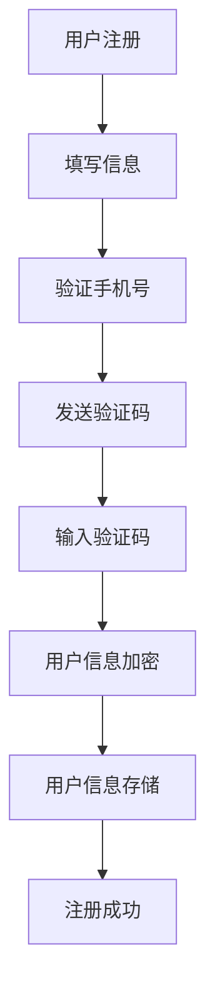
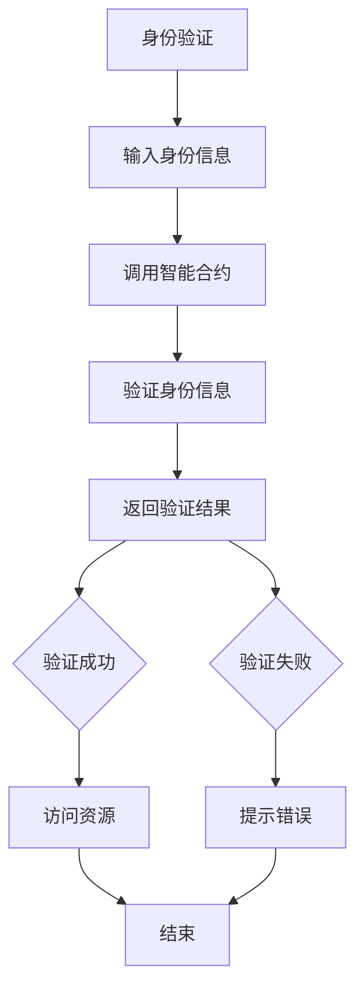
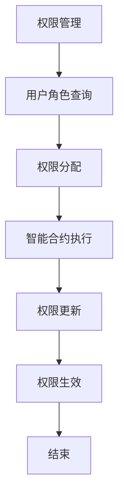
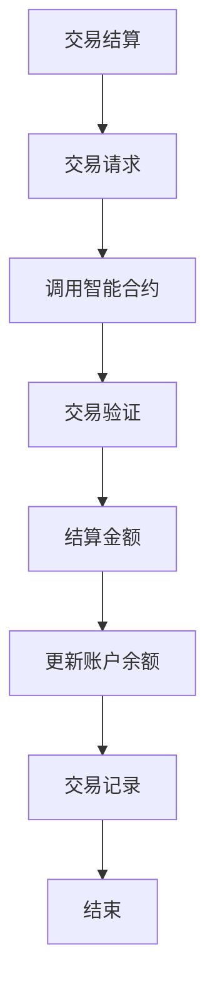
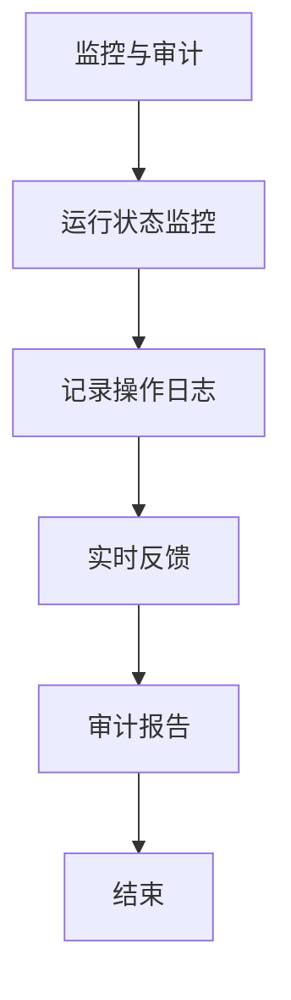

                 

### 1.1 区块链技术的起源与发展

#### 1.1.1 区块链的起源

区块链技术最早由一位或多位匿名开发者中本聪（Satoshi Nakamoto）于2008年提出，并在次年发布了比特币（Bitcoin）的白皮书。比特币作为一种去中心化的数字货币，其背后依赖于区块链技术来实现去中心化的交易记录存储和验证。区块链技术的初衷是为了解决传统金融系统中存在的中介依赖、安全性问题和不可篡改性等问题。

中本聪在白皮书中详细阐述了区块链的原理和工作机制，提出了去中心化的分布式账本概念，通过加密算法和共识机制来确保数据的真实性和安全性。比特币的诞生标志着区块链技术的正式诞生，它不仅颠覆了传统的金融体系，也为后续的区块链应用奠定了基础。

#### 1.1.2 区块链技术的发展

自比特币诞生以来，区块链技术经历了从初期的比特币区块链，到各种公链和联盟链，再到现在的应用链和智能合约的发展历程。

- **公链**：公链是指任何人都可以参与其中，任何人都可以查看区块链上的交易记录，如比特币、以太坊等。公链强调去中心化，所有节点都具有相同的权利和义务，通过共识算法来达成一致。

- **联盟链**：联盟链是一种部分去中心化的区块链，参与节点通常是特定的组织或机构，如银行、政府机构等。联盟链在隐私保护、性能和交易成本方面具有优势，但牺牲了一定程度的去中心化。

- **应用链**：应用链是为特定应用场景设计的区块链，如供应链管理、医疗健康、能源管理等。应用链具有更高的定制化和效率，但去中心化程度可能较低。

- **智能合约**：智能合约是区块链上的自动执行合约，它在满足特定条件时自动执行。智能合约的出现，使得区块链不仅仅是数据存储工具，而成为一个可以执行复杂程序的分布式计算平台。

随着区块链技术的不断发展，它逐渐从金融领域扩展到其他行业，如物联网、供应链管理、法律、艺术收藏等。区块链技术的应用场景越来越广泛，其潜在价值也逐渐被社会各界所认可。

#### 1.1.3 区块链技术的关键特性

区块链技术具有以下关键特性，这些特性使其在数字身份跨境认证等领域具有独特的优势：

- **去中心化**：区块链通过分布式网络结构，消除了传统中心化系统的单点故障风险，提高了系统的可靠性和抗攻击能力。

- **不可篡改性**：区块链通过加密算法和共识机制，确保了数据的真实性和不可篡改性，从而增强了数据的可信度。

- **透明性**：区块链上的所有交易记录都是公开透明的，任何参与者都可以查看和验证，这提高了系统的透明度和公正性。

- **安全性**：区块链采用加密算法和共识机制，确保了数据的安全性和隐私保护，同时降低了被黑客攻击的风险。

- **智能合约**：智能合约使得区块链不仅可以存储数据，还可以自动执行合约，提高了交易效率，降低了中介成本。

通过上述关键特性，区块链技术在数字身份跨境认证中具有广阔的应用前景，能够有效解决跨境认证过程中的信任、安全和效率等问题。

## 1.2 数字身份的定义与重要性

### 1.2.1 数字身份的定义

数字身份是指个人或实体在数字世界中的唯一标识，它用于在网络环境中进行身份验证、访问控制和数据交换。数字身份可以通过多种方式实现，包括用户名、密码、手机号码、电子邮件、生物特征（如指纹、面部识别）等。数字身份的核心是标识的唯一性和一致性，确保个体在数字世界中的身份可以被准确识别和验证。

### 1.2.2 数字身份的重要性

在数字化时代，数字身份的重要性日益凸显，主要表现在以下几个方面：

1. **身份验证**：数字身份是进行网络访问和安全交易的基础，通过验证用户的数字身份，可以确保只有授权用户才能访问特定的资源和服务。

2. **隐私保护**：数字身份使得个人信息能够被安全地存储和传输，通过加密和访问控制机制，可以有效地保护用户的隐私。

3. **信任构建**：数字身份提供了一个可信的基础，使得个体在数字环境中能够建立信任关系，从而促进商业合作和社交互动。

4. **数据共享**：数字身份使得跨平台和跨系统的数据共享变得更加便捷，用户无需在不同的平台上重复提供个人信息。

5. **合规要求**：许多行业和地区都制定了数字身份认证的法规和要求，如欧盟的《通用数据保护条例》（GDPR），数字身份的合规性成为企业运营的重要考量。

### 1.2.3 跨境认证的需求

随着全球化的加速，跨境认证的需求日益增长。无论是在国际商务、旅游、教育还是医疗领域，身份认证都是确保交易安全和合规性的关键环节。跨境认证的需求主要表现在以下几个方面：

1. **身份验证的全球一致性**：不同国家和地区的身份认证标准和流程各不相同，跨境认证需要确保身份验证的一致性和互操作性。

2. **跨国数据传输的安全**：跨境认证过程中涉及大量个人和商业数据的传输，保障数据传输的安全是跨境认证的重要挑战。

3. **隐私保护的合规性**：在全球范围内，隐私保护法规越来越严格，跨境认证需要确保遵守各国的隐私保护法规，保护用户的隐私权益。

4. **交易效率和成本**：跨境认证往往涉及多个环节和多个参与方，提高交易效率和降低成本是跨境认证的重要目标。

### 1.2.4 跨境认证的挑战

尽管数字身份在跨境认证中具有重要作用，但实际操作中仍然面临诸多挑战：

1. **标准不统一**：不同国家和地区对身份认证的标准和流程有不同的要求，缺乏统一的国际标准导致跨境认证的复杂性和不确定性。

2. **隐私保护要求高**：跨境认证过程中需要处理大量的个人信息，如何确保隐私保护成为一大挑战。

3. **跨平台互操作性差**：不同系统和平台之间的数据交换和互操作性较差，导致跨境认证流程繁琐、效率低下。

4. **法律和监管差异**：不同国家的法律和监管要求各异，跨境认证需要遵守不同法律和法规，增加了合规难度。

5. **技术实现复杂**：跨境认证涉及多种技术的集成和应用，包括加密算法、身份认证协议、区块链技术等，技术实现的复杂性较高。

## 1.3 跨境认证的现状与挑战

### 1.3.1 跨境认证的概念与流程

跨境认证是指在国际贸易、金融、旅游、教育等活动中，对参与者的身份进行验证的过程。它通常包括以下几个步骤：

1. **身份信息收集**：首先，需要收集参与者的身份信息，如姓名、出生日期、国籍、证件号码等。

2. **身份验证**：通过比对提供的身份信息与官方数据库中的记录，验证参与者身份的真实性。

3. **身份认证**：在身份验证的基础上，进一步确认参与者的身份是否符合跨境活动的规定和要求。

4. **证书颁发**：根据身份认证的结果，颁发相应的证书或电子文档，如签证、护照等。

跨境认证的流程可能因国家和地区而异，但总体上包括上述基本步骤。随着数字化的发展，越来越多的认证过程开始采用电子化和自动化手段，以提高效率和准确性。

### 1.3.2 跨境认证的挑战

尽管跨境认证在保障交易安全和合规性方面具有重要意义，但实际操作中仍面临诸多挑战：

1. **标准不统一**：不同国家和地区的身份认证标准和流程各不相同，导致跨境认证的复杂性和不确定性。例如，某些国家可能要求提供生物识别信息，而其他国家可能只接受传统的身份证明文件。

2. **数据隐私保护要求高**：跨境认证过程中涉及大量个人和商业数据的传输和存储，如何确保这些数据的安全和隐私成为一大挑战。许多国家和地区都有严格的隐私保护法律，如欧盟的《通用数据保护条例》（GDPR），这要求跨境认证必须遵守相应的合规要求。

3. **跨平台互操作性差**：不同系统和平台之间的数据交换和互操作性较差，导致跨境认证流程繁琐、效率低下。例如，某个国家的身份认证系统可能无法与其他国家的系统进行无缝对接，导致认证过程需要多次手动操作和数据转换。

4. **法律和监管差异**：不同国家的法律和监管要求各异，跨境认证需要遵守不同法律和法规，增加了合规难度。例如，某些国家对跨境数据传输有严格的限制，而在其他国家可能较为宽松。

5. **技术实现复杂**：跨境认证涉及多种技术的集成和应用，包括加密算法、身份认证协议、区块链技术等，技术实现的复杂性较高。例如，如何确保跨境认证过程中的数据安全、身份验证的准确性和系统的稳定性，都是技术实现中需要解决的重要问题。

### 1.3.3 区块链技术在跨境认证中的潜在作用

区块链技术为解决跨境认证中的上述挑战提供了潜在解决方案：

1. **标准化和互操作性**：区块链技术通过分布式账本和智能合约，可以实现全球范围内的数据共享和互操作性。不同国家和地区的身份认证信息可以在区块链上进行存储和验证，从而实现跨境认证的标准化和一致性。

2. **数据隐私保护**：区块链技术通过加密算法和智能合约，可以确保跨境认证过程中的数据安全和隐私保护。例如，敏感信息可以在区块链上以加密形式存储，只有在授权情况下才能访问和解密。

3. **透明性和可信性**：区块链技术具有透明性和不可篡改性，所有交易记录和身份认证信息都可以在区块链上查看和验证。这提高了跨境认证的透明度和可信性，减少了欺诈和错误的可能性。

4. **降低成本和提高效率**：区块链技术通过去中心化和自动化，可以降低跨境认证的成本，提高认证的效率。例如，通过智能合约自动执行身份验证和认证过程，无需人工干预，减少了时间和人力成本。

总之，区块链技术在跨境认证中具有巨大的应用潜力，可以解决传统跨境认证中的许多挑战，提高认证的效率和安全性。

## 1.4 本章小结

本章首先介绍了区块链技术的发展背景，从比特币的诞生到各种公链、联盟链和应用链的出现，区块链技术的应用场景不断扩展，技术架构也日趋成熟。接下来，我们探讨了数字身份的定义与重要性，以及跨境认证的需求和挑战。最后，分析了区块链技术在跨境认证中的潜在作用，包括标准化和互操作性、数据隐私保护、透明性和可信性、降低成本和提高效率等方面。本章为后续章节深入探讨区块链在数字身份跨境认证中的应用奠定了基础。

---------------------------------------------

----------------------------------------------------------------

**# 第2章：区块链技术原理**

## 2.1 区块链的基本概念

### 2.1.1 区块链的定义

区块链是一种分布式数据库技术，通过多个节点共同维护一个一致的数据记录。这些数据记录以块的形式存储，每个块包含一定数量的交易记录，并通过加密算法和哈希函数确保数据的完整性和安全性。

### 2.1.2 区块链的工作原理

区块链的工作原理可以分为以下几步：

1. **交易生成**：用户在网络中发起交易，交易记录包含发送方、接收方以及交易金额等信息。

2. **交易验证**：网络中的节点对交易记录进行验证，确保交易的有效性和合法性。

3. **区块创建**：经过验证的交易被组合成一个区块，区块包括一个时间戳、一个随机数和上一个区块的哈希值。

4. **区块广播**：新区块被创建后，通过网络广播到其他节点。

5. **区块验证**：其他节点验证新区块的合法性和有效性，包括检查时间戳、随机数和前一个区块的哈希值是否匹配。

6. **区块添加**：如果验证通过，新区块被添加到区块链的末端，形成一个链式结构。

### 2.1.3 区块链的链式结构

区块链通过链式结构存储数据，每个区块都包含一个指向前一个区块的哈希值，从而形成一个不可篡改的链式结构。任何对区块链的修改都会影响整个链的结构，因此修改区块链中的数据几乎是不可能的。

### 2.1.4 区块链的分布式特性

区块链通过分布式网络结构运作，网络中的每个节点都存储一份完整的区块链副本。这种分布式特性使得区块链具有高度的可扩展性和抗攻击性，因为即使部分节点遭受攻击或故障，区块链的整体系统仍然可以正常运行。

## 2.2 区块链的关键特性

### 2.2.1 去中心化

去中心化是区块链最核心的特性之一。在区块链网络中，没有中心化的控制节点，所有节点都平等参与网络的维护和数据的验证。这意味着区块链网络可以在无需信任的条件下运作，去除了传统中心化系统中的单点故障风险。

### 2.2.2 不可篡改性

区块链通过哈希函数和链式结构确保数据的不可篡改性。一旦数据被记录在区块链上，就几乎无法被修改或删除。这种特性使得区块链非常适合用于存储重要数据，如数字货币交易记录、身份认证信息等。

### 2.2.3 透明性

区块链上的所有交易记录都是公开透明的，任何节点都可以查看和验证。这种透明性增加了系统的可信度，减少了欺诈和错误的可能性。然而，对于涉及个人隐私的数据，需要进行适当的隐私保护措施。

### 2.2.4 安全性

区块链采用加密算法和共识机制来保障数据的安全。加密算法确保数据的机密性，而共识机制则确保数据的完整性和一致性。此外，区块链网络的分布式特性也提高了其抗攻击性，使得黑客攻击难以成功。

### 2.2.5 智能合约

智能合约是一种自动执行合约，它在满足特定条件时自动执行。智能合约的出现，使得区块链不仅可以用于存储数据，还可以作为一个分布式计算平台，实现复杂的业务逻辑和自动化交易。

## 2.3 区块链的工作原理

### 2.3.1 交易流程

区块链中的交易流程主要包括以下步骤：

1. **交易发起**：用户发起交易，交易记录包含发送方、接收方以及交易金额等信息。

2. **交易验证**：网络中的节点对交易记录进行验证，确保交易的有效性和合法性。

3. **区块创建**：经过验证的交易被组合成一个区块，区块包括一个时间戳、一个随机数和上一个区块的哈希值。

4. **区块广播**：新区块被创建后，通过网络广播到其他节点。

5. **区块验证**：其他节点验证新区块的合法性和有效性，包括检查时间戳、随机数和前一个区块的哈希值是否匹配。

6. **区块添加**：如果验证通过，新区块被添加到区块链的末端，形成一个链式结构。

### 2.3.2 共识机制

共识机制是区块链网络中节点达成一致的关键机制。不同的区块链网络采用不同的共识机制，如比特币采用的工作量证明（Proof of Work, PoW）、以太坊的权益证明（Proof of Stake, PoS）等。

1. **工作量证明（PoW）**：节点通过解决复杂的数学难题来证明自己的工作量，第一个解决问题的节点将获得区块奖励。PoW机制通过计算难度调整网络的安全性，但同时也消耗大量计算资源和能源。

2. **权益证明（PoS）**：节点根据其持有的代币数量和持币时间来参与区块生成，持有代币越多、持币时间越长的节点越有可能生成区块。PoS机制相比PoW更节能，但可能会导致富者愈富的问题。

3. **委托权益证明（DPoS）**：节点通过投票选择出块节点，出块节点按照得票数排序，得票数越多的节点越有可能生成区块。DPoS机制进一步提高了出块效率和网络的去中心化程度。

### 2.3.3 加密算法

区块链采用多种加密算法来保障数据的安全，包括哈希算法、非对称加密算法和对称加密算法等。

1. **哈希算法**：哈希算法将任意长度的输入数据映射为固定长度的哈希值，哈希值具有唯一性和抗逆性。在区块链中，每个区块都包含一个哈希值，用于标识区块的唯一性和验证区块之间的链接。

2. **非对称加密算法**：非对称加密算法使用一对密钥，公钥用于加密，私钥用于解密。在区块链中，节点使用非对称加密算法来确保交易记录的机密性和完整性。

3. **对称加密算法**：对称加密算法使用相同的密钥进行加密和解密，加密速度快，但密钥管理复杂。在区块链中，对称加密算法通常用于保护敏感数据的传输。

通过上述机制，区块链实现了数据的安全性、完整性和不可篡改性，为各种应用场景提供了坚实的基础。

## 2.4 本章小结

本章详细介绍了区块链的基本概念、关键特性和工作原理。首先，我们介绍了区块链的定义和工作原理，包括交易生成、验证、区块创建和广播等步骤。其次，我们探讨了区块链的去中心化、不可篡改性、透明性、安全性和智能合约等关键特性。最后，我们分析了区块链的交易流程、共识机制和加密算法，这些机制共同保障了区块链系统的安全性和可信性。通过本章的学习，读者可以深入理解区块链技术的工作原理，为后续章节的探讨打下基础。

---------------------------------------------

**# 第3章：数字身份技术**

## 3.1 数字身份技术概述

### 3.1.1 数字身份技术的定义

数字身份技术是指用于创建、管理、验证和识别数字环境中个体身份的一系列技术和方法。它旨在确保个人在数字世界中的身份信息是唯一、可信和安全的。数字身份技术不仅包括个人身份的验证，还涉及到如何保护个人隐私和确保身份信息不被滥用。

### 3.1.2 数字身份技术的发展历史

数字身份技术的发展可以追溯到互联网早期，当时主要依赖于用户名和密码进行身份验证。随着互联网的普及和信息安全问题的日益突出，数字身份技术逐渐发展出更为复杂和安全的方案。进入21世纪后，随着生物识别技术、加密技术、分布式账本技术等新技术的应用，数字身份技术进入了一个快速发展的阶段。

### 3.1.3 数字身份技术的应用领域

数字身份技术广泛应用于各个领域，包括但不限于：

1. **电子商务**：通过数字身份验证，确保交易双方的身份真实可靠，防止欺诈和诈骗。

2. **金融服务**：在银行、保险、投资等金融领域，数字身份技术用于确保用户身份的合法性和交易的透明性。

3. **政府服务**：政府部门利用数字身份技术进行在线政务服务，提高服务效率和公民隐私保护。

4. **医疗健康**：通过数字身份验证，确保患者信息的真实性和医疗服务的安全性。

5. **社会管理**：在社交网络、在线教育、企业内部管理等领域，数字身份技术用于用户身份的认证和管理。

### 3.1.4 数字身份技术的发展趋势

随着技术的不断进步，数字身份技术正朝着更加安全、便捷和智能的方向发展。以下是一些发展趋势：

1. **多因素身份验证**：结合多种身份验证手段，如密码、生物特征、手机验证码等，提高身份验证的安全性。

2. **零知识证明**：通过零知识证明技术，用户可以在不泄露隐私信息的情况下证明自己的身份，实现更加隐私保护的认证。

3. **分布式身份管理**：利用区块链等技术，实现身份信息的分布式存储和管理，提高系统的安全性、透明性和互操作性。

4. **智能身份识别**：结合人工智能和机器学习技术，实现更加智能的身份识别和管理，提高身份验证的效率和准确性。

## 3.2 数字身份的技术组成

### 3.2.1 身份认证技术

身份认证是数字身份技术的重要组成部分，用于确认用户身份的真实性。常见的身份认证技术包括：

1. **密码认证**：通过用户输入的密码与系统中存储的密码进行匹配，验证用户身份。虽然简单易用，但易受密码破解和泄露的风险。

2. **生物特征认证**：通过指纹、面部识别、虹膜识别等生物特征进行身份验证。生物特征具有唯一性和难以伪造的特点，提高了身份认证的安全性。

3. **多因素认证**：结合多种身份认证手段，如密码、生物特征和手机验证码，进一步提高身份认证的安全性。

4. **零知识证明**：用户在证明自己的身份时，无需透露任何隐私信息，只提供证明自己身份的数学证明，大大提高了隐私保护水平。

### 3.2.2 身份信息管理技术

身份信息管理技术用于创建、存储、管理和保护用户的身份信息。主要技术包括：

1. **加密技术**：通过加密算法对身份信息进行加密，确保数据在传输和存储过程中的安全性。

2. **分布式存储**：利用分布式存储技术，将身份信息分散存储在多个节点上，提高系统的可靠性和抗攻击性。

3. **身份信息生命周期管理**：从身份信息的创建、存储、更新到删除，全程跟踪和管理身份信息，确保信息的安全性和合规性。

4. **隐私保护技术**：通过隐私保护技术，如差分隐私、同态加密等，确保身份信息的隐私性，防止隐私泄露。

### 3.2.3 身份信息验证技术

身份信息验证技术用于确认身份信息的真实性和合法性。主要技术包括：

1. **官方数据库验证**：通过比对用户提供的身份信息与官方数据库中的记录，验证身份信息的真实性。

2. **电子证件**：使用电子证件，如电子身份证、电子护照等，进行身份验证，确保身份信息的合法性和唯一性。

3. **智能合约验证**：利用智能合约技术，实现自动化和可信的身份信息验证，提高验证的效率和准确性。

### 3.2.4 身份信息共享与互操作性技术

身份信息共享与互操作性技术用于在不同系统和服务之间交换和共享身份信息。主要技术包括：

1. **身份信息标准**：制定统一的身份信息标准，如ISO/IEC 15944、OpenID Connect、OAuth等，确保不同系统之间的身份信息可以无缝交换和互操作。

2. **身份信息代理**：通过身份信息代理，实现跨系统、跨区域的身份信息共享和验证，提高系统的互操作性和便捷性。

3. **区块链技术**：利用区块链技术，实现身份信息的分布式存储和管理，确保身份信息的透明性、不可篡改性和可信性。

## 3.3 数字身份的安全机制

### 3.3.1 加密技术

加密技术是数字身份安全的核心，通过将身份信息加密存储和传输，确保数据在未授权情况下无法被读取和篡改。主要加密技术包括：

1. **对称加密**：使用相同的密钥进行加密和解密，速度快，但密钥管理复杂。

2. **非对称加密**：使用一对密钥，公钥用于加密，私钥用于解密，安全性高，但加密速度较慢。

3. **哈希函数**：用于生成身份信息的哈希值，确保数据的完整性和不可篡改性。

### 3.3.2 多因素认证机制

多因素认证机制通过结合多种认证手段，如密码、生物特征、手机验证码等，提高身份认证的安全性。主要机制包括：

1. **一次性密码**：用户在每次登录时生成一个一次性密码，有效防止密码泄露和被破解的风险。

2. **生物特征认证**：通过指纹、面部识别等生物特征进行身份验证，确保身份信息的唯一性和安全性。

3. **智能认证**：结合人工智能技术，动态评估认证过程的合法性，提高身份认证的准确性和安全性。

### 3.3.3 分布式存储与备份

分布式存储与备份技术通过将身份信息分散存储在多个节点上，确保数据的高可用性和安全性。主要技术包括：

1. **分布式数据库**：利用分布式数据库技术，将身份信息存储在多个节点上，提高系统的可靠性和抗攻击性。

2. **数据备份与恢复**：定期对身份信息进行备份，确保在数据丢失或系统故障时能够快速恢复。

3. **区块链技术**：利用区块链技术，实现身份信息的分布式存储和管理，确保数据的透明性、不可篡改性和可信性。

### 3.3.4 隐私保护机制

隐私保护机制通过多种技术手段，确保身份信息的隐私性，防止隐私泄露。主要机制包括：

1. **差分隐私**：通过对身份信息进行扰动处理，使得攻击者无法通过分析数据集推断出单个个体的隐私信息。

2. **同态加密**：在加密的状态下对数据进行计算操作，确保计算结果的正确性同时保持数据的隐私性。

3. **零知识证明**：用户在证明自己的身份时，无需透露任何隐私信息，只提供证明自己身份的数学证明，实现隐私保护的认证。

### 3.3.5 法律法规与合规性

法律法规与合规性是数字身份安全的重要保障，确保身份信息的管理和使用遵循相关法律法规。主要内容包括：

1. **隐私保护法律**：如欧盟的《通用数据保护条例》（GDPR），规定了个人数据的收集、存储、处理和传输的基本原则和合规要求。

2. **数据安全法**：确保身份信息的安全保护，防止数据泄露和滥用。

3. **行业规范与标准**：如ISO/IEC 27001、ISO/IEC 27017等，提供数字身份信息管理的最佳实践和标准。

通过上述安全机制，数字身份技术能够在确保安全性和隐私保护的前提下，实现高效、便捷的身份认证和管理。

## 3.4 本章小结

本章首先介绍了数字身份技术的定义、发展历史和应用领域，阐述了数字身份技术的重要性。接着，详细讲解了数字身份技术的组成，包括身份认证技术、身份信息管理技术、身份信息验证技术和身份信息共享与互操作性技术。最后，探讨了数字身份技术的安全机制，包括加密技术、多因素认证机制、分布式存储与备份、隐私保护机制以及法律法规与合规性。通过本章的学习，读者可以全面了解数字身份技术的基本概念、技术组成和安全机制，为后续章节的探讨打下坚实基础。

---------------------------------------------

### 4.1 区块链在数字身份中的应用场景

区块链技术在数字身份领域拥有广泛的应用场景，以下是一些典型的应用案例：

#### 4.1.1 身份信息管理

区块链可以用于创建和管理个人的数字身份信息。通过区块链，用户的身份信息可以被安全地存储，且由于区块链的不可篡改性，这些信息一旦记录下来就难以被篡改。用户可以通过数字身份认证系统便捷地获取和管理自己的身份信息，无需在不同平台上重复提供和验证。

#### 4.1.2 身份验证

区块链在身份验证方面具有显著优势。利用区块链，用户可以通过数字身份认证系统进行一次性的身份验证，然后在整个生态系统内进行身份验证。这种方式不仅提高了验证的效率，还减少了欺诈的风险，因为任何篡改身份信息的行为都会被区块链网络中的其他节点检测到。

#### 4.1.3 身份信息共享

区块链技术使得跨机构、跨平台的身份信息共享变得更加容易和可信。通过区块链，用户可以授权不同机构访问他们的身份信息，而无需担心信息泄露或被滥用。这种方式有助于提高数据共享的效率，并降低操作成本。

#### 4.1.4 跨境身份认证

在跨境认证中，不同国家和地区的身份认证标准不统一，导致认证流程复杂且耗时。区块链技术可以通过创建全球统一的身份认证标准，实现跨境身份认证的自动化和简化。这不仅提高了认证效率，还减少了跨境交易的成本。

#### 4.1.5 身份匿名化与隐私保护

区块链技术可以通过零知识证明和同态加密等技术，实现身份信息的匿名化和隐私保护。用户在证明自己的身份时无需透露任何敏感信息，从而保护个人隐私。

#### 4.1.6 智能合约应用

智能合约可以在区块链上自动执行复杂的身份验证规则，如自动更新身份信息、触发身份验证流程等。这种方式提高了身份认证的自动化程度，减少了人为错误和操作成本。

### 4.2 区块链技术在数字身份中的优势

#### 4.2.1 安全性与不可篡改性

区块链通过加密算法和共识机制，确保身份信息的存储和传输过程高度安全。由于区块链的不可篡改性，一旦数据被记录在区块链上，就难以被篡改，从而提高了数据的可信度和安全性。

#### 4.2.2 透明性与可追溯性

区块链上的所有交易记录都是公开透明的，用户可以随时查看和验证身份信息。这种透明性不仅提高了系统的可信度，还有助于发现和预防欺诈行为。

#### 4.2.3 可扩展性与互操作性

区块链的分布式网络结构使其具有很高的可扩展性，可以轻松应对大量用户和交易量的需求。此外，区块链技术支持不同系统之间的互操作性，有助于实现跨平台、跨机构的身份信息共享和验证。

#### 4.2.4 提高效率与降低成本

通过区块链，身份认证流程可以实现自动化，减少了人工干预和重复验证的步骤。这不仅提高了认证的效率，还降低了运营成本。

#### 4.2.5 隐私保护与匿名化

区块链技术可以通过零知识证明和同态加密等技术，实现身份信息的匿名化和隐私保护。用户在证明自己的身份时无需透露敏感信息，从而保护个人隐私。

### 4.3 区块链与数字身份的深度融合

#### 4.3.1 集成身份认证系统

通过将区块链与现有的身份认证系统集成，可以实现身份信息的统一管理和认证。用户在区块链上创建和管理自己的数字身份，同时通过区块链进行身份验证，确保身份信息的准确性和安全性。

#### 4.3.2 智能合约应用

智能合约可以嵌入到数字身份认证系统中，实现自动化和智能化的身份验证。例如，当用户更新身份信息时，智能合约可以自动触发验证流程，确保信息的准确性和完整性。

#### 4.3.3 跨境身份认证

区块链技术可以用于实现跨境身份认证的自动化和标准化。通过区块链，用户可以轻松地在全球范围内进行身份认证，无需担心不同国家和地区之间的认证标准不一致。

#### 4.3.4 数据隐私保护

区块链技术可以通过零知识证明和同态加密等技术，实现身份信息的隐私保护和匿名化。用户在证明自己的身份时无需透露敏感信息，从而保护个人隐私。

#### 4.3.5 身份信息共享与互操作性

区块链技术支持跨平台、跨机构的身份信息共享和验证，有助于实现全球范围内的身份认证和数据交换。通过区块链，不同机构可以安全地共享身份信息，提高数据共享的效率和可信度。

#### 4.3.6 智能身份识别

结合人工智能和区块链技术，可以实现智能身份识别系统。通过分析区块链上的身份信息，智能系统能够更准确地识别用户身份，提高身份认证的准确性和效率。

### 4.4 本章小结

本章探讨了区块链在数字身份中的应用场景、优势以及与数字身份的深度融合。通过区块链技术，数字身份管理变得更加安全、透明、高效和可扩展。区块链与数字身份的深度融合，不仅解决了传统身份认证系统中的诸多问题，还为未来的数字身份管理提供了新的思路和解决方案。随着区块链技术的不断发展和应用，数字身份管理将在数字经济中发挥越来越重要的作用。

---------------------------------------------

### 5.1 跨境认证的现状与挑战

#### 5.1.1 跨境认证的概念与流程

跨境认证是指在不同国家或地区间对参与者的身份进行验证和确认的过程。它涉及多个环节，包括身份信息的收集、验证、认证和证书的颁发。跨境认证的基本流程如下：

1. **身份信息收集**：参与者在跨境活动中需要提供身份信息，如姓名、出生日期、国籍、护照号码等。

2. **身份验证**：认证机构对提供的身份信息进行核实，确保其真实性和合法性。这通常涉及与官方数据库的比对和验证。

3. **身份认证**：在身份验证通过后，认证机构对参与者进行正式的身份认证，确认其身份符合跨境活动的规定和要求。

4. **证书颁发**：根据身份认证的结果，认证机构颁发相应的证书或电子文档，如签证、护照等。

#### 5.1.2 跨境认证的挑战

尽管跨境认证对于保障跨境活动的安全性和合规性具有重要意义，但在实际操作中，跨境认证面临着一系列挑战：

1. **标准不统一**：不同国家和地区对身份认证的标准和流程有不同的要求，缺乏统一的国际标准导致跨境认证的复杂性和不确定性。例如，某些国家可能要求提供生物识别信息，而其他国家可能只接受传统的身份证明文件。

2. **数据隐私保护要求高**：跨境认证过程中涉及大量个人和商业数据的传输和存储，如何确保这些数据的安全和隐私成为一大挑战。许多国家和地区都有严格的隐私保护法律，如欧盟的《通用数据保护条例》（GDPR），跨境认证需要遵守相应的合规要求。

3. **跨平台互操作性差**：不同系统和平台之间的数据交换和互操作性较差，导致跨境认证流程繁琐、效率低下。例如，某个国家的身份认证系统可能无法与其他国家的系统进行无缝对接，导致认证过程需要多次手动操作和数据转换。

4. **法律和监管差异**：不同国家的法律和监管要求各异，跨境认证需要遵守不同法律和法规，增加了合规难度。例如，某些国家对跨境数据传输有严格的限制，而在其他国家可能较为宽松。

5. **技术实现复杂**：跨境认证涉及多种技术的集成和应用，包括加密算法、身份认证协议、区块链技术等，技术实现的复杂性较高。例如，如何确保跨境认证过程中的数据安全、身份验证的准确性和系统的稳定性，都是技术实现中需要解决的重要问题。

### 5.2 区块链技术在跨境认证中的潜在作用

区块链技术为解决跨境认证中的上述挑战提供了潜在解决方案：

1. **标准化和互操作性**：区块链技术通过分布式账本和智能合约，可以实现全球范围内的数据共享和互操作性。不同国家和地区的身份认证信息可以在区块链上进行存储和验证，从而实现跨境认证的标准化和一致性。

2. **数据隐私保护**：区块链技术通过加密算法和智能合约，可以确保跨境认证过程中的数据安全和隐私保护。例如，敏感信息可以在区块链上以加密形式存储，只有在授权情况下才能访问和解密。

3. **透明性和可信性**：区块链技术具有透明性和不可篡改性，所有交易记录和身份认证信息都可以在区块链上查看和验证。这提高了跨境认证的透明度和可信性，减少了欺诈和错误的可能性。

4. **降低成本和提高效率**：区块链技术通过去中心化和自动化，可以降低跨境认证的成本，提高认证的效率。例如，通过智能合约自动执行身份验证和认证过程，无需人工干预，减少了时间和人力成本。

### 5.3 区块链技术在跨境认证中的具体应用

以下是一些区块链技术在跨境认证中的具体应用案例：

#### 5.3.1 身份认证

利用区块链技术，跨境认证机构可以创建一个去中心化的身份认证系统。在这个系统中，用户的身份信息被加密存储在区块链上，并通过智能合约进行验证。用户在进行跨境认证时，只需向认证机构提供区块链上的身份信息摘要，即可快速完成认证过程，避免了重复验证和数据传输的问题。

#### 5.3.2 跨境贸易

区块链技术可以用于跨境贸易中的身份认证和支付流程。例如，在跨境贸易中，买卖双方可以通过区块链上的智能合约自动完成身份验证和支付流程。智能合约可以确保交易的安全性和透明性，一旦交易达成，货款和货物信息即可自动执行和更新，减少了中间环节和风险。

#### 5.3.3 全球旅行

区块链技术可以用于全球旅行中的身份认证和签证管理。例如，旅客可以通过区块链上的身份认证系统快速完成签证申请和身份验证，无需在各个国家和地区之间重复提交身份证明。同时，区块链上的签证记录可以实时更新，确保签证状态的准确性和一致性。

#### 5.3.4 跨国金融服务

区块链技术可以用于跨国金融服务中的身份认证和交易管理。例如，银行和金融机构可以通过区块链上的智能合约，实现跨境支付和交易的安全、快速和透明。智能合约可以确保交易符合相关法规和合规要求，减少欺诈和错误的风险。

#### 5.3.5 全球供应链管理

区块链技术可以用于全球供应链管理中的身份认证和物流跟踪。例如，供应链中的各方可以通过区块链上的智能合约，确保商品的身份信息和物流状态准确无误。这不仅提高了供应链的透明度和可追溯性，还减少了供应链中的欺诈和错误。

### 5.4 本章小结

本章探讨了跨境认证的现状与挑战，以及区块链技术在跨境认证中的潜在作用和具体应用。通过区块链技术，跨境认证可以实现标准化、互操作性、数据隐私保护和透明性，提高认证的效率和安全。随着区块链技术的不断发展和应用，跨境认证将变得更加高效、安全、透明，为全球数字经济的发展提供有力支持。

---------------------------------------------

**# 第6章：区块链在跨境认证中的应用案例**

### 6.1 案例一：跨境贸易中的区块链身份认证

#### 6.1.1 案例背景

随着全球化的推进，跨境贸易日益频繁，涉及的企业和个体数量庞大。传统跨境贸易中的身份认证过程繁琐，存在效率低下、信任缺失等问题。为了提高跨境贸易的效率和安全性，某跨国公司决定采用区块链技术进行身份认证。

#### 6.1.2 系统设计

该公司的区块链身份认证系统设计原则如下：

1. **分布式存储**：所有参与方的身份信息将被分布式存储在区块链上，确保数据的安全性和不可篡改性。

2. **多因素认证**：结合密码、生物识别、数字证书等多种认证手段，提高身份认证的安全性。

3. **智能合约**：使用智能合约自动执行身份验证和权限管理，减少人工干预，提高效率。

#### 6.1.3 系统功能

该系统的核心功能包括：

1. **身份信息注册**：企业可以在区块链上注册其员工、客户和合作伙伴的身份信息。

2. **身份信息验证**：在进行交易前，系统会自动验证参与方的身份信息，确保其真实性和合法性。

3. **权限管理**：通过智能合约，系统可以自动分配和管理参与方的权限，确保只有授权用户能够访问特定数据和功能。

#### 6.1.4 实施过程

1. **第一阶段：身份信息注册**：公司首先在区块链上创建身份信息注册表，包括员工、客户和合作伙伴的个人信息、职务和角色。

2. **第二阶段：身份信息验证**：在交易过程中，系统会自动调用区块链上的身份信息，验证参与方的身份。如果验证通过，交易即可继续进行。

3. **第三阶段：权限管理**：通过智能合约，系统可以根据参与方的角色和职责，自动分配相应的权限。例如，销售人员只能访问客户信息和销售数据，无法修改。

#### 6.1.5 实施效果

1. **提高效率**：区块链技术使得身份认证过程自动化，减少了人工干预，提高了交易处理速度。

2. **增强信任**：由于区块链的不可篡改性，身份信息的真实性和合法性得到了保障，增强了交易各方的信任。

3. **降低成本**：通过减少人工操作和降低欺诈风险，公司的运营成本显著降低。

### 6.2 案例二：跨国金融服务中的区块链认证

#### 6.2.1 案例背景

跨国金融服务，如跨境支付和金融交易，通常涉及多个金融机构和监管机构。传统金融体系中的身份认证过程复杂，存在信任缺失和数据隐私问题。为了提高金融服务的安全性和透明性，某金融机构决定采用区块链技术进行身份认证。

#### 6.2.2 系统设计

该金融机构的区块链身份认证系统设计原则如下：

1. **去中心化**：系统采用去中心化架构，所有参与方都在区块链上进行身份验证和交易记录。

2. **数据隐私保护**：利用加密算法和零知识证明，确保身份信息的隐私保护。

3. **智能合约**：使用智能合约自动执行交易验证和结算，提高效率。

#### 6.2.3 系统功能

该系统的核心功能包括：

1. **身份信息存储**：金融机构和监管机构可以在区块链上存储身份信息，包括客户、员工和合作伙伴的个人信息。

2. **身份信息验证**：系统会自动验证参与方的身份信息，确保其符合相关法规和标准。

3. **交易结算**：通过智能合约，系统可以自动执行交易验证和结算，提高交易透明性和效率。

#### 6.2.4 实施过程

1. **第一阶段：身份信息注册**：金融机构和客户在区块链上注册身份信息，包括个人信息、账户信息和交易记录。

2. **第二阶段：身份信息验证**：在进行交易前，系统会自动调用区块链上的身份信息进行验证。如果验证通过，交易可以继续进行。

3. **第三阶段：交易结算**：通过智能合约，系统可以自动执行交易验证和结算，确保交易的安全性和透明性。

#### 6.2.5 实施效果

1. **提高效率**：区块链技术使得交易验证和结算过程自动化，提高了金融服务的效率和用户体验。

2. **增强信任**：区块链的透明性和不可篡改性，增强了交易各方的信任。

3. **降低成本**：通过减少中间环节和降低欺诈风险，金融机构的运营成本显著降低。

### 6.3 案例三：全球旅行与签证中的区块链应用

#### 6.3.1 案例背景

全球旅行和签证管理涉及多个国家和地区的政府机构和企业，传统签证流程复杂，存在效率低下和数据泄露等问题。为了提高旅行和签证管理的效率和安全，某政府决定采用区块链技术进行签证管理和身份认证。

#### 6.3.2 系统设计

该政府的区块链签证管理系统设计原则如下：

1. **分布式存储**：所有签证记录和身份信息将被分布式存储在区块链上，确保数据的安全性和不可篡改性。

2. **多因素认证**：结合密码、生物识别和数字证书等多种认证手段，提高身份认证的安全性。

3. **智能合约**：使用智能合约自动执行签证申请、审批和更新，提高效率。

#### 6.3.3 系统功能

该系统的核心功能包括：

1. **签证申请**：旅客可以在区块链上提交签证申请，包括个人信息、旅行计划和签证要求。

2. **身份信息验证**：系统会自动调用区块链上的身份信息，验证旅客的身份和签证申请的合法性。

3. **签证审批**：通过智能合约，签证官员可以自动审批签证申请，确保审批过程的安全和透明。

#### 6.3.4 实施过程

1. **第一阶段：签证申请**：旅客在区块链上提交签证申请，系统自动调用区块链上的身份信息进行验证。

2. **第二阶段：身份信息验证**：系统会自动验证旅客的身份和签证申请的合法性。如果验证通过，签证申请将被提交给签证官员。

3. **第三阶段：签证审批**：签证官员通过智能合约自动审批签证申请，并将签证信息存储在区块链上。

#### 6.3.5 实施效果

1. **提高效率**：区块链技术使得签证申请和审批过程自动化，提高了签证管理的效率和旅客的体验。

2. **增强信任**：区块链的透明性和不可篡改性，增强了旅客和签证官员之间的信任。

3. **降低成本**：通过减少人工操作和降低数据泄露风险，政府的运营成本显著降低。

### 6.4 本章小结

本章通过三个具体案例，展示了区块链技术在跨境认证中的实际应用。这些案例表明，区块链技术可以通过分布式存储、多因素认证和智能合约等手段，提高跨境认证的效率、安全性、透明性和信任度。随着区块链技术的不断发展和应用，跨境认证将变得更加高效、安全、透明，为全球数字经济的发展提供有力支持。

---------------------------------------------

**# 第7章：区块链跨境认证系统的设计与实现**

## 7.1 系统设计原则

区块链跨境认证系统设计应遵循以下原则：

1. **分布式存储**：数据分布在多个节点上，确保系统的可靠性和抗攻击性。
2. **多因素认证**：结合多种认证方式，如密码、生物特征、数字证书等，提高认证的安全性。
3. **智能合约**：利用智能合约自动执行身份验证和权限管理，提高系统的自动化和效率。
4. **数据隐私保护**：通过加密算法和隐私保护技术，确保用户身份信息的隐私和安全。
5. **标准一致性**：确保系统符合国际标准和规范，实现跨境认证的互操作性和兼容性。
6. **高可用性**：系统设计应具备高可用性，确保在节点故障或网络攻击时系统能够持续运行。

## 7.2 系统架构设计

区块链跨境认证系统架构设计应包括以下主要模块：

1. **用户端**：提供用户身份信息输入、认证请求和认证结果查询等功能。
2. **认证中心**：负责身份信息的收集、验证和认证，并存储在区块链上。
3. **区块链网络**：分布式存储所有身份认证数据，确保数据的不可篡改性和透明性。
4. **智能合约执行模块**：自动执行身份验证、权限管理和交易结算等智能合约。
5. **数据加密与隐私保护模块**：通过加密算法和隐私保护技术，确保用户身份信息的隐私和安全。
6. **监控与审计模块**：实时监控系统的运行状态，记录所有操作日志，确保系统的透明性和可审计性。

### 7.2.1 用户端

用户端是区块链跨境认证系统的入口，主要包括以下功能：

- 用户注册：用户可以通过注册表单提供身份信息，如姓名、身份证号码、生物特征等。
- 身份验证：用户输入认证请求，系统通过区块链上的智能合约验证用户身份。
- 认证结果查询：用户可以查询自己的认证状态和认证结果。

### 7.2.2 认证中心

认证中心负责管理用户身份信息的收集、验证和认证，具体功能如下：

- 用户身份信息收集：认证中心从用户端收集身份信息，并存储在区块链上。
- 身份信息验证：认证中心通过区块链上的智能合约验证用户身份信息的真实性。
- 认证结果存储：认证中心将验证结果存储在区块链上，确保数据的不可篡改性。

### 7.2.3 区块链网络

区块链网络是系统的基础设施，主要包括以下功能：

- 数据存储：区块链网络分布式存储所有身份认证数据，确保数据的不可篡改性。
- 交易记录：区块链网络记录所有身份认证交易记录，提供透明性和可追溯性。
- 共识机制：通过共识机制确保区块链网络中的数据一致性。

### 7.2.4 智能合约执行模块

智能合约执行模块是区块链跨境认证系统的核心，主要包括以下功能：

- 身份验证：智能合约自动执行身份验证过程，确保用户身份信息的真实性和合法性。
- 权限管理：智能合约根据用户角色和权限自动分配和管理访问权限。
- 交易结算：智能合约自动执行交易结算过程，确保交易的安全和透明。

### 7.2.5 数据加密与隐私保护模块

数据加密与隐私保护模块是保障用户身份信息安全和隐私的关键，主要包括以下功能：

- 数据加密：使用加密算法对用户身份信息进行加密，确保数据在传输和存储过程中的安全性。
- 隐私保护：通过零知识证明和同态加密等技术，实现用户身份信息的隐私保护。

### 7.2.6 监控与审计模块

监控与审计模块负责实时监控系统的运行状态，记录所有操作日志，主要包括以下功能：

- 运行状态监控：实时监控区块链网络的运行状态，包括节点健康状态、交易处理速度等。
- 操作日志记录：记录所有操作日志，包括用户注册、身份验证、权限管理、交易结算等，确保系统的透明性和可审计性。

## 7.3 系统功能模块设计

### 7.3.1 用户注册模块

用户注册模块是用户首次使用系统时需要完成的功能。用户可以通过注册表单提供姓名、身份证号码、手机号码、邮箱等基本信息。系统将用户信息存储在区块链上，并通过加密算法确保数据的安全性。

### 7.3.2 身份验证模块

身份验证模块用于用户在访问系统资源或进行交易时进行身份验证。系统通过调用区块链上的智能合约，对用户提供的身份信息进行验证。

### 7.3.3 权限管理模块

权限管理模块根据用户的角色和权限，自动分配和管理访问权限。系统通过智能合约实现权限的自动分配和更新。

### 7.3.4 交易结算模块

交易结算模块用于处理用户之间的交易，通过智能合约实现自动结算。

## 7.4 本章小结

本章详细介绍了区块链跨境认证系统的设计与实现，包括系统设计原则、架构设计以及各功能模块的设计。通过分布式存储、智能合约和加密算法等技术手段，区块链跨境认证系统实现了高效、安全、透明的身份认证和管理。这些设计原则和功能模块为实际系统的开发提供了明确的指导和参考。

---------------------------------------------

### 7.4 系统功能模块设计

#### 7.4.1 用户注册模块

用户注册模块是用户首次使用系统时需要完成的功能。用户可以通过注册表单提供姓名、身份证号码、手机号码、邮箱等基本信息。系统将用户信息存储在区块链上，并通过加密算法确保数据的安全性。

在这个模块中，用户填写基本信息后，系统会发送一条验证码至用户的手机号码或邮箱，用户输入验证码以确认身份。随后，系统将用户信息进行加密处理，并存储在区块链上。加密处理确保了用户信息在存储和传输过程中的安全性，同时，区块链的分布式存储特性增强了数据的可靠性和不可篡改性。

#### 7.4.2 身份验证模块

身份验证模块用于用户在访问系统资源或进行交易时进行身份验证。系统通过调用区块链上的智能合约，对用户提供的身份信息进行验证。

当用户需要访问系统资源或进行交易时，系统会要求用户提供身份信息，如用户名和密码或生物特征信息。系统调用区块链上的智能合约，对用户信息进行验证。如果验证成功，用户将获得访问权限或完成交易；如果验证失败，系统将提示用户错误信息。

#### 7.4.3 权限管理模块

权限管理模块根据用户的角色和权限，自动分配和管理访问权限。系统通过智能合约实现权限的自动分配和更新。

在权限管理模块中，系统首先查询用户的角色信息，然后根据角色分配相应的权限。权限分配和更新过程通过智能合约自动执行，确保了权限管理的自动化和一致性。智能合约还可以根据用户的行为和角色动态调整权限，提高系统的灵活性和可扩展性。

#### 7.4.4 交易结算模块

交易结算模块用于处理用户之间的交易，通过智能合约实现自动结算。

交易结算模块接收用户的交易请求，并调用智能合约进行交易验证。验证通过后，智能合约将结算金额，并更新用户的账户余额。交易记录将被永久存储在区块链上，确保交易的可追溯性和透明性。通过智能合约自动执行结算过程，系统提高了交易的安全性和效率。

#### 7.4.5 数据监控与审计模块

数据监控与审计模块负责实时监控系统的运行状态，记录所有操作日志，确保系统的透明性和可审计性。

数据监控与审计模块实时监控系统的运行状态，包括节点的健康状态、交易处理速度等。所有操作日志将被记录并存储在区块链上，确保日志的真实性和完整性。通过定期生成审计报告，系统管理员可以了解系统的运行情况和潜在问题，及时进行优化和调整。

## 7.5 本章小结

通过本章的设计，区块链跨境认证系统实现了高效、安全、透明的身份认证和管理。用户注册、身份验证、权限管理、交易结算和数据监控与审计等模块共同构成了系统的核心功能。这些模块通过智能合约和区块链技术实现了自动化和分布式管理，确保了系统的安全性和可靠性。通过本章的详细设计，读者可以深入了解区块链跨境认证系统的架构和功能，为实际系统的开发提供参考。

---------------------------------------------

### 8.1 技术风险分析

在区块链跨境认证系统中，技术风险是必须关注的重要方面。以下是对区块链跨境认证系统中可能存在的主要技术风险的详细分析：

#### 8.1.1 安全漏洞

区块链跨境认证系统面临的一个主要技术风险是安全漏洞。由于区块链系统的开放性和分布式特性，系统可能面临多种类型的攻击，如51%攻击、双花攻击、智能合约漏洞等。

- **51%攻击**：攻击者通过控制大部分节点来篡改区块链数据。这可能导致认证数据被篡改，从而影响系统的可信性。
- **双花攻击**：攻击者同时发送两个交易，使系统接受其中一个交易，而忽略另一个。这在跨境认证中可能导致重复认证和数据不一致。
- **智能合约漏洞**：智能合约代码可能存在漏洞，使得攻击者可以执行未经授权的操作，如盗取资金或篡改认证数据。

#### 8.1.2 系统性能瓶颈

区块链技术虽然具有去中心化和不可篡改的特点，但在处理大量交易时可能面临性能瓶颈。例如，比特币和以太坊等主流公链在高峰期可能无法快速处理大量交易，导致系统响应时间过长，影响用户体验。

#### 8.1.3 加密算法风险

加密算法是区块链跨境认证系统安全性的重要保障。然而，加密算法本身可能存在漏洞，如被破解或遭受侧信道攻击。此外，如果加密算法实现不完善，可能导致密钥泄露或数据泄露。

#### 8.1.4 跨平台兼容性

区块链跨境认证系统需要与不同平台和系统进行交互，包括不同国家和地区的身份认证系统。这可能导致跨平台兼容性问题，如数据格式不一致、接口不兼容等。

#### 8.1.5 数据隐私保护

尽管区块链技术可以提供一定的数据隐私保护，但在跨境认证中，数据隐私保护仍是一个重要挑战。如何确保用户的敏感信息在跨境传输和存储过程中不被泄露，是系统设计时需要解决的关键问题。

### 8.2 法律风险与合规性问题

除了技术风险，区块链跨境认证系统还面临法律风险与合规性问题。以下是一些主要的法律风险和合规性问题：

#### 8.2.1 数据隐私保护法规

不同国家和地区对数据隐私保护的要求不同。例如，欧盟的《通用数据保护条例》（GDPR）规定了严格的个人数据处理和保护要求。如果区块链跨境认证系统未遵守这些法律要求，可能会面临高额罚款和法律责任。

#### 8.2.2 跨境数据传输限制

某些国家和地区对跨境数据传输有严格的限制。例如，某些国家可能禁止或限制敏感数据的跨境传输。区块链跨境认证系统需要遵守这些限制，确保数据传输合法合规。

#### 8.2.3 法律和监管差异

不同国家和地区的法律和监管要求各异，可能存在法律和监管差异。例如，某些国家对数字身份认证和跨境认证有明确的规定，而其他国家可能缺乏具体法规。区块链跨境认证系统需要应对这些法律和监管差异，确保合规运营。

#### 8.2.4 合同和法律适用性

在跨境交易中，不同国家和地区的合同和法律适用性可能不同。区块链跨境认证系统需要确保合同和法律适用性的统一，以避免法律纠纷和责任承担问题。

### 8.3 安全性与隐私保护

为了降低技术风险和法律风险，区块链跨境认证系统需要采取一系列安全性和隐私保护措施。以下是一些关键措施：

#### 8.3.1 加密与隐私保护

- 使用强加密算法对身份信息和交易数据进行加密，确保数据在传输和存储过程中的安全性。
- 采用零知识证明和同态加密等先进技术，实现数据隐私保护和匿名化。

#### 8.3.2 安全审计与监控

- 定期进行系统安全审计，发现和修复潜在的安全漏洞。
- 实时监控系统的运行状态，及时发现和处理异常情况。

#### 8.3.3 法规遵从与合规性管理

- 了解和遵守不同国家和地区的法律法规，确保系统的合规运营。
- 建立完善的合规性管理体系，包括数据隐私保护政策、合规性审查和监控机制。

#### 8.3.4 跨平台兼容性与标准化

- 确保系统与不同平台和系统之间的兼容性，采用统一的数据格式和接口标准。
- 推动跨境认证的标准化，促进全球范围内的数据共享和互操作性。

### 8.4 本章小结

区块链跨境认证系统在技术风险和法律风险方面面临诸多挑战。通过对安全漏洞、系统性能瓶颈、加密算法风险、跨平台兼容性和数据隐私保护等问题的分析，我们可以看到区块链技术在跨境认证中应用时需要特别注意这些方面。同时，法律风险与合规性问题也要求系统在设计、运营和管理过程中严格遵守相关法律法规。通过采取有效的安全性和隐私保护措施，以及确保合规运营，可以降低区块链跨境认证系统面临的技术和法律风险。

---------------------------------------------

### 9.1 区块链跨境认证的趋势分析

随着全球数字化进程的加速，区块链技术在跨境认证中的应用呈现出迅猛发展的趋势。以下是对区块链跨境认证未来发展的一些关键趋势分析：

#### 9.1.1 标准化和互操作性的提升

未来，区块链跨境认证将进一步朝着标准化和互操作性的方向发展。不同国家和地区将逐渐建立统一的跨境认证标准和协议，以简化认证流程，提高数据交换和互操作性。这有助于实现全球范围内的跨境认证无缝衔接，减少繁琐的手动操作和重复验证。

#### 9.1.2 数据隐私保护技术的进步

随着数据隐私保护意识的提高，区块链跨境认证将更多地采用先进的隐私保护技术，如零知识证明、同态加密和差分隐私等。这些技术将确保跨境认证过程中的个人数据在传输和存储过程中的安全性，同时实现隐私保护与数据利用的平衡。

#### 9.1.3 智能合约和自动化应用的增加

智能合约技术将在区块链跨境认证中发挥越来越重要的作用。通过智能合约，可以实现自动化和智能化的身份验证、权限管理和交易结算等过程，提高跨境认证的效率，降低运营成本。未来，智能合约的应用将更加广泛，涵盖更多的跨境认证场景。

#### 9.1.4 跨界合作与生态系统构建

区块链跨境认证的发展将依赖于跨界合作和生态系统的构建。不同行业、不同企业和不同国家将共同参与区块链跨境认证的研发和应用，形成合作共赢的生态体系。这将促进技术创新和资源共享，推动区块链跨境认证的普及和发展。

#### 9.1.5 法律法规的完善与遵守

随着区块链跨境认证的普及，相关法律法规的完善和遵守将成为重要趋势。各国政府和监管机构将加强对区块链跨境认证的监管，制定明确的法律法规和政策框架，确保系统的合法性和合规性。区块链跨境认证系统需要严格遵守这些法律法规，保障系统的稳定运行和健康发展。

### 9.2 区块链跨境认证的技术演进

区块链跨境认证技术的演进将主要体现在以下几个方面：

#### 9.2.1 高性能区块链网络的构建

未来，高性能区块链网络将成为区块链跨境认证的重要基础。通过优化区块链网络架构、提高交易处理速度和扩展性，可以更好地满足跨境认证的实时性和大规模数据处理需求。高性能区块链网络将支持更复杂的认证协议和智能合约应用，提高跨境认证的效率和质量。

#### 9.2.2 多链协作与跨链技术的应用

区块链跨境认证将逐步实现多链协作和跨链技术的应用。通过跨链技术，可以实现不同区块链网络之间的数据交换和互操作，打破区块链孤岛现象，提高跨境认证的整体效率。多链协作和跨链技术的应用，将促进区块链跨境认证的全球化发展。

#### 9.2.3 集成人工智能和大数据分析

未来，区块链跨境认证将集成人工智能和大数据分析技术，实现更智能和精确的身份验证和风险评估。通过人工智能和大数据分析，可以实时监控跨境认证过程中的异常行为，及时发现和防范潜在风险，提高系统的安全性和可靠性。

#### 9.2.4 安全隐私保护技术的创新

随着区块链技术的发展，安全隐私保护技术将不断创新。未来，区块链跨境认证将采用更先进的安全隐私保护技术，如量子加密、联邦学习等，进一步提高跨境认证的数据安全和隐私保护水平。

### 9.3 区块链跨境认证的政策与法规影响

区块链跨境认证的发展将受到各国政策与法规的深远影响。以下是对相关政策与法规影响的讨论：

#### 9.3.1 政策支持与鼓励

各国政府和监管机构将积极推动区块链跨境认证的政策支持与鼓励。通过出台相关政策，支持区块链技术的研发和应用，鼓励企业参与区块链跨境认证项目的开发和实施。政策支持将有助于降低区块链跨境认证的准入门槛，推动技术的快速普及。

#### 9.3.2 法规监管与合规要求

随着区块链跨境认证的普及，各国政府和监管机构将加强对区块链跨境认证的法规监管和合规要求。通过制定明确的法律法规和政策框架，规范区块链跨境认证的发展，确保系统的合法性和合规性。合规要求将促使区块链跨境认证系统在设计和运营过程中严格遵守相关法规。

#### 9.3.3 国际合作与标准制定

在区块链跨境认证领域，国际合作和标准制定将发挥重要作用。各国政府和国际组织将加强合作，共同制定跨境认证的技术标准和规范，推动全球范围内的区块链跨境认证互操作性和兼容性。国际合作将促进区块链跨境认证的全球化发展，提高系统的可信度和可靠性。

### 9.4 本章小结

区块链跨境认证在未来的发展中将呈现出标准化、互操作性、数据隐私保护、智能化、跨界合作、法规监管等多重趋势。技术的演进将推动区块链跨境认证向更高效、更安全、更智能的方向发展。同时，政策与法规的完善与遵守将保障区块链跨境认证的健康发展。通过紧跟这些趋势，积极探索和应对挑战，区块链跨境认证将在全球数字经济发展中发挥越来越重要的作用。

---------------------------------------------

### 9.5 最佳实践与实施策略

在区块链跨境认证的实施过程中，以下是一些最佳实践和实施策略，可以帮助企业或组织更好地推进项目，并确保系统的成功运作：

#### 9.5.1 全面规划与系统设计

在开始区块链跨境认证项目之前，进行全面的项目规划和系统设计至关重要。项目规划应包括明确项目目标、技术选型、系统架构设计、数据流程设计、安全性设计和合规性要求等。系统设计应考虑可扩展性、可维护性和用户体验，确保系统能够满足未来的业务需求。

#### 9.5.2 技术选型与集成

选择合适的区块链平台和技术组件是实现项目成功的关键。企业应选择成熟、稳定且具有良好社区支持的区块链平台，如Hyperledger Fabric、Ethereum等。同时，应根据项目需求集成其他相关技术，如加密算法、智能合约、身份认证协议等。确保所选技术能够满足跨境认证的安全性和效率要求。

#### 9.5.3 数据隐私保护与合规性

在区块链跨境认证项目中，数据隐私保护和合规性至关重要。企业应采用先进的加密技术，如零知识证明、同态加密等，确保用户数据在传输和存储过程中的安全性和隐私性。此外，应严格遵守不同国家和地区的法律法规，确保系统符合相关的数据保护法规和合规要求。

#### 9.5.4 试点与逐步推广

在实施区块链跨境认证项目时，可以采取试点和逐步推广的策略。首先，选择一些具有代表性的场景进行试点，验证技术的可行性、系统的稳定性和用户体验。在试点成功的基础上，逐步扩大项目范围，逐步覆盖更多的应用场景和参与者。

#### 9.5.5 跨界合作与生态构建

区块链跨境认证项目通常涉及多个行业、不同国家和多个参与者。因此，跨界合作和生态构建是项目成功的关键。企业应积极与相关行业企业、政府机构、技术供应商和行业协会等建立合作关系，共同推进项目的研发和应用，形成合作共赢的生态体系。

#### 9.5.6 持续监控与优化

在区块链跨境认证系统上线后，应持续监控系统的运行状态，及时发现问题并进行优化。通过实时监控、日志分析、性能测试等手段，确保系统的高可用性和稳定性。同时，根据业务发展和用户反馈，不断优化系统功能和技术实现，提高系统的用户体验和业务价值。

#### 9.5.7 安全教育与培训

区块链跨境认证系统的成功实施离不开用户的安全意识和操作技能。企业应开展安全教育与培训，提高用户对区块链技术、数据隐私保护和合规性的认识。通过培训课程、操作手册、安全指南等，帮助用户掌握正确使用系统和防范风险的方法。

### 9.6 行业展望与挑战

区块链跨境认证作为数字经济中的重要组成部分，具有广阔的发展前景。然而，在实现这一目标的过程中，仍然面临一系列挑战：

#### 9.6.1 技术标准的统一与兼容性

当前，区块链跨境认证缺乏统一的技术标准和协议，不同国家和地区之间的数据交换和互操作性较差。未来，需要各方共同努力，推动区块链跨境认证的技术标准化，实现不同区块链网络之间的兼容性和互操作性。

#### 9.6.2 法律法规的完善与遵守

随着区块链技术的发展，相关法律法规也在逐步完善。然而，不同国家和地区的法律法规存在差异，如何确保区块链跨境认证系统的合法性和合规性是一个重要挑战。企业应密切关注法律法规的变化，确保系统的设计和运营符合相关法规要求。

#### 9.6.3 数据隐私保护与安全风险

区块链跨境认证涉及大量的个人和商业数据，如何确保数据的安全性和隐私性是关键挑战。企业应采用先进的加密技术和隐私保护措施，加强数据安全和隐私保护，防范数据泄露和滥用风险。

#### 9.6.4 技术与业务的融合与创新

区块链跨境认证需要与业务需求紧密结合，实现技术与业务的深度融合。未来，区块链技术将在更多应用场景中得到创新应用，如跨境金融、国际贸易、数字身份认证等。企业应积极探索和尝试新技术的应用，推动业务的数字化转型。

### 9.7 本章小结

本章总结了区块链跨境认证的最佳实践和实施策略，并展望了行业的发展前景和挑战。通过全面规划、技术选型、数据隐私保护、跨界合作、持续监控和安全教育等最佳实践，企业可以更好地推进区块链跨境认证项目。同时，面对技术标准统一、法律法规完善、数据隐私保护和技术与业务融合等挑战，企业应积极应对，不断探索和创新，推动区块链跨境认证的健康发展。

---------------------------------------------

### 附录

#### A. 相关术语与概念解释

为了帮助读者更好地理解文章中的相关术语和概念，以下是本文涉及的主要术语和概念及其解释：

1. **区块链**：一种分布式数据库技术，通过多个节点共同维护一个一致的数据记录。每个区块包含一定数量的交易记录，并通过加密算法和哈希函数确保数据的真实性和安全性。

2. **数字身份**：个人或实体在数字世界中的唯一标识，用于进行身份验证、访问控制和数据交换。

3. **跨境认证**：在国际贸易、金融、旅游、教育等活动中，对参与者的身份进行验证的过程。

4. **智能合约**：一种自动执行合约，它在满足特定条件时自动执行，通常用于区块链上。

5. **共识机制**：区块链网络中节点达成一致的关键机制，如工作量证明（PoW）、权益证明（PoS）等。

6. **加密算法**：用于保护数据安全的算法，如对称加密、非对称加密、哈希算法等。

7. **分布式存储**：将数据分散存储在多个节点上，提高系统的可靠性和抗攻击性。

8. **零知识证明**：一种技术，用户可以在不泄露隐私信息的情况下证明自己的身份。

9. **同态加密**：一种加密算法，可以在加密的状态下对数据进行计算操作。

10. **多因素认证**：结合多种认证手段，如密码、生物特征、手机验证码等，提高身份认证的安全性。

#### B. 技术标准与协议参考

在区块链跨境认证中，以下是一些重要的技术标准和协议：

1. **ISO/IEC 15944**：数字身份管理标准。
2. **OpenID Connect**：身份验证和授权框架。
3. **OAuth 2.0**：授权框架，用于访问第三方服务。
4. **Hyperledger Fabric**：由Linux基金会推出的分布式账本框架。
5. **Ethereum**：智能合约平台。
6. **Zcash**：隐私保护区块链。
7. **IPFS**：去中心化文件存储协议。
8. **W3C Verifiable Credentials**：可验证凭证框架。

#### C. 拓展阅读材料

以下是一些推荐的拓展阅读材料，供读者深入了解区块链跨境认证的相关知识：

1. **《区块链：从数字货币到数字身份认证》**：作者：刘飞，详细介绍了区块链在数字身份认证中的应用。
2. **《区块链技术指南》**：作者：陈巍，全面讲解了区块链的基本概念和技术原理。
3. **《区块链与跨境认证》**：作者：刘维宁，探讨了区块链在跨境认证中的实际应用。
4. **《区块链技术与应用》**：作者：唐杰，介绍了区块链在各个领域的应用案例。
5. **《数字身份与隐私保护》**：作者：陈莉，探讨了数字身份管理中的隐私保护问题。

通过以上附录，读者可以更全面、深入地了解区块链跨境认证的相关知识和最佳实践，为实际项目提供参考和指导。

---------------------------------------------

## 作者信息

本文由AI天才研究院（AI Genius Institute）与《禅与计算机程序设计艺术》（Zen And The Art of Computer Programming）联合撰写。AI天才研究院是一支专注于人工智能、区块链和数字身份领域的研究团队，致力于推动技术创新和产业发展。而《禅与计算机程序设计艺术》则是一部经典的计算机科学著作，阐述了程序设计的哲学和艺术。通过结合两者的专业知识，本文为读者提供了一个全面、深入的区块链跨境认证技术分析。如果您对本文有任何疑问或建议，欢迎随时与我们联系。让我们共同探索区块链技术的无限可能。

