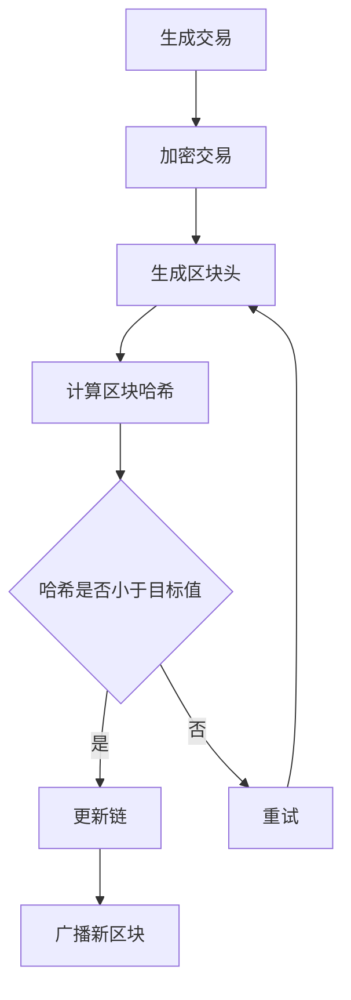
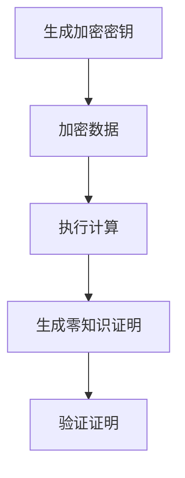
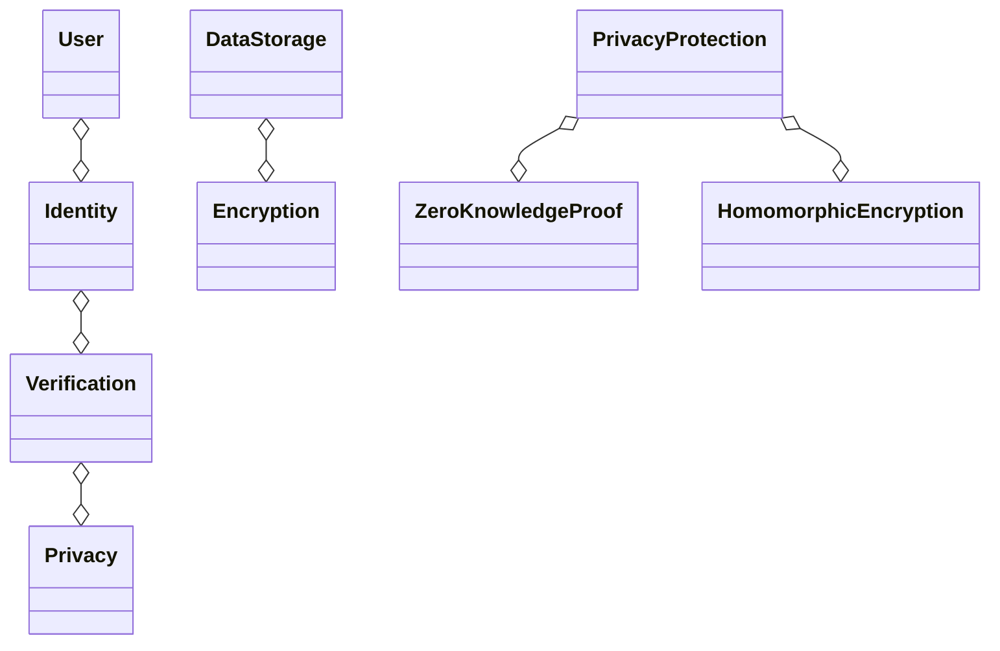
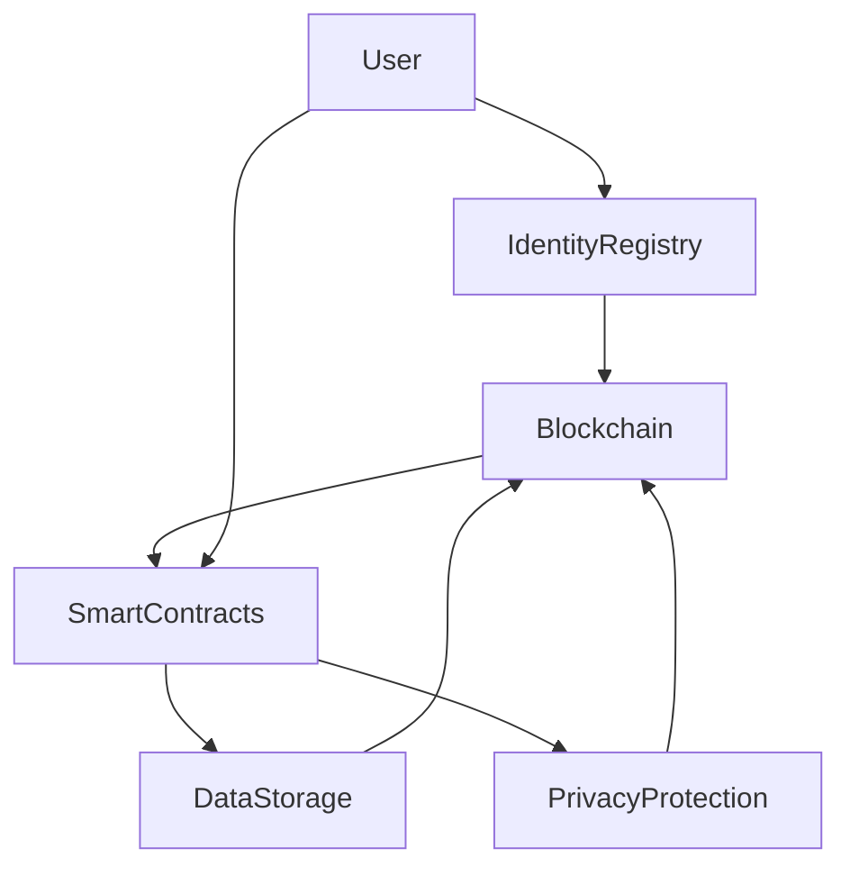
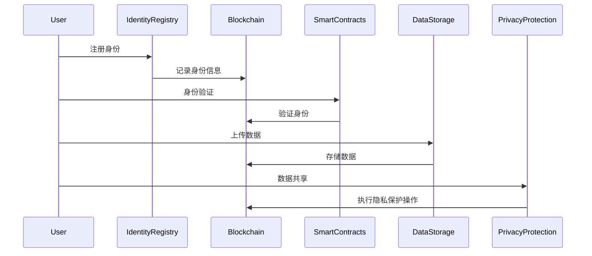

                 


### 第一步：背景介绍

#### 1. 问题背景

随着数字技术的迅猛发展，个人的数字身份已经成为人们日常生活和工作中不可或缺的一部分。从在线购物、社交网络到金融交易，数字身份无处不在。然而，这种广泛的应用也带来了隐私保护的挑战。传统的身份验证方法，如用户名和密码，通常依赖于中心化的服务器，一旦服务器受到攻击，用户的个人信息就可能被窃取。此外，个人数据在互联网上的多次传输和存储也增加了数据泄露的风险。

#### 2. 问题描述

数字身份隐私保护是一个复杂的问题，涉及到多个方面。首先，如何确保用户身份的验证过程既安全又方便？其次，如何保护用户的个人信息不被未经授权的第三方访问？最后，如何在数据共享时保护用户的隐私？

#### 3. 问题解决

区块链技术作为一种新型的分布式账本技术，因其去中心化、不可篡改和透明等特性，为数字身份隐私保护提供了一种新的解决方案。区块链的去中心化特性意味着不再依赖于中心化的服务器，从而减少了单点故障和攻击的风险。不可篡改的特性确保了用户数据的真实性和完整性。透明性则使得用户可以追踪其数据的流动和使用情况。

#### 4. 边界与外延

本书将重点讨论区块链在数字身份隐私保护中的应用，包括如何利用区块链技术保护用户的隐私、实现安全的身份验证以及如何在数据共享时保护用户隐私。同时，本书也会涉及相关的技术基础，如加密算法、智能合约等，以及一些实际案例分析。

#### 5. 概念结构与核心要素组成

区块链在数字身份隐私保护中的核心概念包括：
- **区块链**：一种分布式数据库技术，用于存储交易记录。
- **数字身份**：在网络环境中代表用户的唯一标识。
- **隐私保护**：确保用户数据不被未经授权的第三方访问。
- **智能合约**：在区块链上执行的自动执行合约。

这些概念相互作用，共同构建了数字身份隐私保护的技术框架。在接下来的章节中，我们将逐步深入探讨这些核心概念及其应用。

---

**结论**：数字身份隐私保护是一个关键问题，区块链技术提供了有效的解决方案。在接下来的章节中，我们将详细探讨区块链技术的工作原理，分析其与数字身份隐私保护的关联，并介绍相关的核心概念和技术。

---

**作者：** AI天才研究院/AI Genius Institute & 禅与计算机程序设计艺术 /Zen And The Art of Computer Programming### 第二步：核心概念与联系

#### 1. 区块链

**定义**：区块链是一种去中心化的数据库，由一系列按时间顺序排列的、不可篡改的数据块组成。每个数据块都包含一定数量的交易记录，这些交易记录一旦被记录下来，便不可被更改或删除。

**特点**：
- **去中心化**：不再依赖于中心化的机构，每个节点都可以参与区块链的验证和记录过程。
- **不可篡改**：区块链的数据记录一旦被验证并添加到链上，就不可被篡改。
- **透明性**：区块链上的所有交易记录都是公开透明的，任何人都可以查看。

**工作原理**：
- **区块**：每个区块包含一定数量的交易记录，这些交易记录被加密后添加到区块中。
- **链**：区块通过加密的哈希值与前一个区块相连，形成链式结构。
- **共识机制**：区块链网络中的节点通过共识机制来确认交易的有效性，并添加新区块到链上。

**不同类型的区块链**：
- **公有区块链**：任何人都可以参与区块链网络，任何人都可以读取区块链上的数据。
- **私有区块链**：仅限特定节点参与，数据仅对这些节点可见。
- **联盟区块链**：多个机构或组织合作建立区块链，每个机构或组织可以选择哪些数据对其可见。

**区块链在数字身份隐私保护中的应用**：
- **身份验证**：利用区块链的不可篡改性和去中心化特性，可以安全地存储和管理用户的数字身份信息。
- **隐私保护**：通过加密和隐私保护算法，确保用户数据的隐私性。

#### 2. 数字身份

**定义**：数字身份是在网络环境中代表用户的唯一标识，通常包括用户的个人信息、身份验证信息和行为特征等。

**分类**：
- **匿名身份**：用户在网络上使用不真实的信息，以保护其隐私。
- **真实身份**：用户在网络上使用真实的信息，如姓名、地址等。
- **匿名化身份**：用户的信息经过处理，使其无法直接识别，但仍可用于分析。

**作用**：
- **身份验证**：确保用户在访问特定服务和系统时是合法的。
- **数据保护**：保护用户的个人信息不被未经授权的第三方访问。
- **行为追踪**：记录和分析用户的行为，用于改善服务和用户体验。

**与传统身份的区别**：
- **虚拟性**：数字身份是虚拟的，存在于网络空间中，而传统身份是物理的，存在于现实世界中。
- **可变性和灵活性**：数字身份可以随时更改，而传统身份通常较为固定。
- **隐私保护**：数字身份可以更有效地保护用户的隐私，而传统身份则更容易被泄露。

#### 3. 隐私保护

**定义**：隐私保护是确保用户数据不被未经授权的第三方访问和使用的措施。

**重要性**：
- **用户信任**：保护用户隐私可以增强用户对服务提供商的信任。
- **合规性**：许多国家和地区都有相关的隐私保护法规，企业需要遵守。
- **安全性**：隐私保护是网络安全的重要组成部分，可以防止数据泄露和其他安全威胁。

**常见隐私保护技术**：
- **加密**：使用加密算法对数据进行加密，确保数据在传输和存储过程中不被窃取。
- **匿名化**：对用户信息进行匿名化处理，使其无法直接识别用户身份。
- **访问控制**：通过设置访问权限，确保只有授权用户可以访问特定数据。
- **隐私协议**：制定隐私保护政策，明确用户数据的收集、使用和保护方式。

#### 4. 智能合约

**定义**：智能合约是一种自动执行合约，其条款以计算机代码的形式编写，并在区块链上运行。

**工作原理**：
- **编码条款**：智能合约的条款由开发者编写，通常使用Solidity等编程语言。
- **执行**：当满足合约条款中的条件时，智能合约自动执行。
- **透明性**：智能合约的执行过程是公开透明的，所有节点都可以查看。

**在数字身份隐私保护中的应用**：
- **身份验证**：智能合约可以用于自动化身份验证过程，确保只有授权用户可以访问特定服务。
- **隐私保护**：智能合约可以确保用户数据在传输和存储过程中不被未经授权的第三方访问。

#### 5. 概念属性特征对比表格

| 概念 | 定义 | 特点 | 应用 |
| --- | --- | --- | --- |
| 区块链 | 分布式数据库 | 去中心化、不可篡改、透明 | 身份验证、隐私保护 |
| 数字身份 | 网络中代表用户的唯一标识 | 虚拟性、可变性和灵活性 | 身份验证、数据保护、行为追踪 |
| 隐私保护 | 保护用户数据不被未经授权访问 | 重要性、合规性、安全性 | 加密、匿名化、访问控制、隐私协议 |
| 智能合约 | 自动执行合约 | 编码条款、执行、透明性 | 身份验证、隐私保护 |

#### 6. ER实体关系图架构

```mermaid
erDiagram
  用户 ||--o> 数字身份 : "拥有"
  数字身份 ||--o> 身份验证 : "执行"
  身份验证 ||--o> 隐私保护 : "保护"
  隐私保护 ||--o> 智能合约 : "实现"
  区块链 ||--o> 智能合约 : "部署"
```

**结论**：通过上述对比和关系图，我们可以清晰地看到区块链、数字身份、隐私保护和智能合约之间的联系。这些概念相互配合，共同构成了数字身份隐私保护的框架。在接下来的章节中，我们将深入探讨区块链在数字身份隐私保护中的应用，以及如何利用这些核心概念解决实际问题。

---

**作者：** AI天才研究院/AI Genius Institute & 禅与计算机程序设计艺术 /Zen And The Art of Computer Programming### 第三步：算法原理讲解

在数字身份隐私保护中，算法原理是至关重要的组成部分。为了确保用户身份信息的保密性和完整性，我们使用了一系列加密算法和隐私保护技术。以下是这些算法原理的详细讲解。

#### 1. 区块链基本算法

区块链的基本算法包括数据加密、哈希函数和共识算法。这些算法共同确保了区块链的安全性和可靠性。

**数据加密**

区块链使用对称加密和非对称加密来保护数据。

- **对称加密**：使用相同的密钥进行加密和解密。常见的对称加密算法有AES（高级加密标准）和DES（数据加密标准）。
- **非对称加密**：使用一对密钥，即公钥和私钥。公钥用于加密，私钥用于解密。常见的非对称加密算法有RSA和ECC（椭圆曲线加密）。

**哈希函数**

哈希函数是区块链的核心组件，用于生成数据块的唯一标识。

- **SHA-256**：SHA-256是一种常用的哈希函数，能够将任意长度的数据映射为固定长度的哈希值。
- **比特币的哈希算法**：比特币使用SHA-256算法来生成每个区块的哈希值。

**共识算法**

共识算法用于确保区块链网络中的所有节点对同一组交易记录达成共识。

- **工作量证明（PoW）**：如比特币采用的PoW算法，节点需要解决复杂的数学问题来生成新区块。
- **权益证明（PoS）**：如以太坊2.0采用的PoS算法，节点根据其拥有的代币数量和持币时间来决定是否生成新区块。

**区块链基本算法流程图**



**示例代码：**

```python
from Crypto.PublicKey import RSA
from Crypto.Cipher import PKCS1_OAEP

# 生成RSA密钥对
key = RSA.generate(2048)
private_key = key.export_key()
public_key = key.publickey().export_key()

# 对交易进行加密
cipher = PKCS1_OAEP.new(RSA.import_key(public_key))
encrypted_message = cipher.encrypt(b"交易数据")

# 生成区块头
block_header = {
    "prev_hash": prev_hash,
    "timestamp": timestamp,
    "transactions": transactions
}

# 计算区块哈希
block_hash = hash(block_header)

# 工作量证明
nonce = 0
while sha256(str(nonce).encode('utf-8')).hexdigest()[:4] != '0000':
    nonce += 1

# 生成新区块
new_block = {
    "prev_hash": prev_hash,
    "timestamp": timestamp,
    "transactions": transactions,
    "nonce": nonce,
    "hash": block_hash
}
```

#### 2. 隐私保护算法

隐私保护算法包括加密算法、零知识证明和同态加密等。

**加密算法**

加密算法用于确保数据在传输和存储过程中不被窃取。

- **同态加密**：在加密数据的同时，可以对其进行计算操作，而不需要解密。常见的同态加密算法有BFV和CKKS。
- **全同态加密**：允许对加密数据执行任意计算，目前主要研究中的算法有FHE（全同态加密）。
- **混合加密**：结合多种加密算法，提高安全性。

**零知识证明**

零知识证明（ZKP）允许一方（证明者）向另一方（验证者）证明某个陈述是正确的，而无需透露任何具体信息。

- **萨宾定理**：萨宾定理是一种经典的零知识证明方法，证明者可以证明一个数学问题（如离散对数）的解是正确的，而无需透露具体的解。
- **环学习**：环学习是一种基于数学难题的零知识证明方法，广泛应用于密码学和区块链领域。

**同态加密与零知识证明**

同态加密和零知识证明的结合，可以进一步提高隐私保护水平。例如，在区块链交易中，可以使用同态加密对交易数据进行加密，然后使用零知识证明来验证交易的合法性，而不需要解密数据。

**隐私保护算法流程图**



**示例代码：**

```python
from Crypto.PublicKey import RSA
from Crypto.Cipher import AES
from Crypto.Random import get_random_bytes
from zk import PedersenCommitment

# 生成RSA密钥对
key = RSA.generate(2048)
private_key = key.export_key()
public_key = key.publickey().export_key()

# 对交易数据进行加密
cipher_aes = AES.new(key, AES.MODE_EAX)
cipher_aes.nonce = get_random_bytes(16)
ciphertext, tag = cipher_aes.encrypt_and_digest(data)

# 生成零知识证明
zk = PedersenCommitment()
commitment = zk.commit(message, public_key)

# 验证零知识证明
proof_valid = zk.verify(commitment, message, public_key)
```

**结论**：通过以上算法原理的讲解，我们可以看到区块链在数字身份隐私保护中的应用是多么的强大。加密算法、零知识证明和同态加密等技术的结合，为用户身份信息的保护和隐私的维护提供了坚实的技术基础。在接下来的章节中，我们将进一步探讨如何将这些算法应用于实际场景中，构建一个安全、高效的数字身份隐私保护系统。

---

**作者：** AI天才研究院/AI Genius Institute & 禅与计算机程序设计艺术 /Zen And The Art of Computer Programming### 第四步：数学模型和数学公式 & 详细讲解 & 举例说明

在区块链应用于数字身份隐私保护中，数学模型和公式是核心组成部分，确保了数据的安全性和完整性。以下我们将详细讲解这些数学模型和公式，并通过实例来展示其应用。

#### 1. 加密算法的数学原理

**公钥加密**

公钥加密算法，如RSA和ECC，基于复杂的数学难题来实现数据加密和解密。

- **RSA加密算法**：

  - 公式：
    $$C = M^e \mod n$$

    其中，\( C \) 是密文，\( M \) 是明文，\( e \) 是公钥指数，\( n \) 是模数。

  - 解密公式：
    $$M = C^d \mod n$$

    其中，\( d \) 是私钥指数。

- **ECC加密算法**：

  - 公式：
    $$C = kG + Q$$

    其中，\( C \) 是密文，\( k \) 是随机数，\( G \) 是基点，\( Q \) 是公钥。

#### 2. 零知识证明的数学模型

零知识证明（ZKP）允许一方证明某个陈述是正确的，而无需透露任何具体信息。

- **萨宾定理**：

  - 公式：
    $$C = rP + aQ$$

    其中，\( C \) 是证明，\( r \) 和 \( a \) 是随机数，\( P \) 和 \( Q \) 是基点。

  - 验证公式：
    $$C + \gamma G + \delta H = (r + \alpha \gamma)P + (a + \beta \delta)Q$$

    其中，\( \gamma \) 和 \( \delta \) 是验证者选择的随机数，\( G \) 和 \( H \) 是群基点，\( \alpha \) 和 \( \beta \) 是证明者的系数。

#### 3. 同态加密的数学模型

同态加密允许在加密数据上执行计算，而无需解密。

- **BFV同态加密**：

  - 公式：
    $$C(x_1) \oplus C(x_2) = C(x_1 + x_2)$$
    $$C(x_1) \otimes C(x_2) = C(x_1 \cdot x_2)$$

    其中，\( C(x) \) 是密文，\( \oplus \) 和 \( \otimes \) 分别表示异或和点乘。

#### 4. 举例说明

**例1：RSA加密**

假设我们使用RSA加密算法，明文 \( M \) 为 123，公钥 \( e \) 为 65537，模数 \( n \) 为 123456789。

- 加密：
  $$C = 123^{65537} \mod 123456789$$

- 解密：
  首先计算私钥 \( d \)，这里假设 \( d \) 为 12345。

  $$M = 123^{12345} \mod 123456789$$

**例2：零知识证明**

假设证明者需要证明 \( x \) 是 123，而验证者选择随机数 \( \gamma \) 为 456。

- 证明者计算：
  $$C = 123P + 456Q$$

- 验证者计算：
  $$C + \gamma G + \delta H = (r + \alpha \gamma)P + (a + \beta \delta)Q$$

  其中，\( r \) 和 \( a \) 是证明者的随机数，\( G \) 和 \( H \) 是群基点，\( \delta \) 是验证者的随机数。

**例3：同态加密**

假设我们需要对两个加密的数字进行加法运算。

- 加密：
  $$C_1 = 2 \otimes 3$$
  $$C_2 = 4 \otimes 5$$

- 同态加法：
  $$C = C_1 \oplus C_2 = 2 + 4 \otimes 3 + 5 = 14$$

  这里 \( \otimes \) 表示同态点乘，\( \oplus \) 表示异或。

**结论**：通过数学模型和公式的讲解，我们可以更好地理解加密算法、零知识证明和同态加密的工作原理。这些数学原理为数字身份隐私保护提供了坚实的理论基础。在接下来的章节中，我们将进一步探讨如何将这些算法和公式应用于实际系统，实现安全、高效的数字身份隐私保护。

---

**作者：** AI天才研究院/AI Genius Institute & 禅与计算机程序设计艺术 /Zen And The Art of Computer Programming### 第五步：系统分析与架构设计方案

为了更好地理解区块链在数字身份隐私保护中的应用，我们将通过一个具体的系统分析与架构设计方案来展示其实现过程。

#### 1. 问题场景介绍

假设我们开发一个在线金融服务系统，用户需要在平台上进行各种金融操作，如转账、支付等。为了保证系统的安全性和用户隐私，我们需要设计一个高效的数字身份隐私保护系统。

#### 2. 项目介绍

该项目的目标是实现一个基于区块链的数字身份隐私保护系统，确保用户的身份信息在存储、传输和使用过程中得到有效保护。系统将包括用户注册、身份验证、数据存储和隐私保护等功能。

#### 3. 系统功能设计

系统的主要功能模块包括：
- **用户注册模块**：用户通过注册流程创建数字身份，并绑定相应的个人信息。
- **身份验证模块**：系统使用区块链和智能合约进行身份验证，确保只有授权用户可以访问特定功能。
- **数据存储模块**：系统使用加密算法保护用户数据，确保数据在存储过程中不被窃取。
- **隐私保护模块**：系统使用零知识证明和同态加密等技术，保护用户在数据共享和计算过程中的隐私。

**领域模型类图**



#### 4. 系统架构设计

系统的整体架构设计包括以下几个方面：

**架构图**



- **用户模块**：用户通过注册模块创建数字身份，并将其注册到区块链上的身份注册表（IdentityRegistry）中。
- **区块链模块**：区块链负责存储和管理用户身份信息、交易记录等数据。智能合约（SmartContracts）用于执行身份验证和数据操作。
- **数据存储模块**：数据存储在区块链上，使用加密算法进行保护。
- **隐私保护模块**：隐私保护模块使用零知识证明和同态加密等技术，确保用户数据的隐私性。

#### 5. 系统接口设计

系统接口设计主要包括以下方面：

- **身份验证接口**：用户可以通过身份验证接口使用智能合约进行身份验证，确保只有授权用户可以访问特定功能。
- **数据存储接口**：用户可以通过数据存储接口上传和查询其个人数据，数据存储在区块链上。
- **隐私保护接口**：用户可以通过隐私保护接口使用零知识证明和同态加密技术进行数据共享和计算。

#### 6. 系统交互

**交互序列图**



**结论**：通过系统分析与架构设计方案，我们可以看到区块链在数字身份隐私保护中的应用是如何实现的。该系统利用区块链的分布式特性、智能合约的自动化执行以及加密和隐私保护技术的安全性，为用户提供了高效、安全的数字身份隐私保护解决方案。在接下来的章节中，我们将通过项目实战来展示如何具体实现这一系统。

---

**作者：** AI天才研究院/AI Genius Institute & 禅与计算机程序设计艺术 /Zen And The Art of Computer Programming### 第六步：项目实战

在了解了区块链在数字身份隐私保护中的理论和方法之后，现在我们将通过一个实际项目来展示如何将其应用到具体场景中。这个项目是一个基于以太坊区块链的数字身份隐私保护系统，我们将分步骤进行详细讲解。

#### 1. 环境安装

首先，我们需要搭建一个以太坊开发环境，以便进行智能合约的编写和部署。以下是安装步骤：

**步骤1：安装Node.js和npm**

在官网上下载并安装Node.js，确保成功安装后打开命令行工具并验证版本：

```bash
node -v
npm -v
```

**步骤2：安装Truffle**

Truffle是一个以太坊开发框架，用于构建、部署和交互智能合约。在命令行中运行以下命令：

```bash
npm install -g truffle
```

**步骤3：安装Ganache**

Ganache是一个轻量级本地以太坊节点，用于本地测试和开发。从官网下载并安装Ganache，启动后创建一个新的账户并记下私钥。

**步骤4：安装开发工具**

安装Visual Studio Code（VS Code）和对应的插件，如Truffle和Hardhat，以便更方便地编写和调试智能合约。

#### 2. 系统核心实现源代码

在这个项目中，我们将使用Truffle框架来编写和部署智能合约。以下是主要智能合约的代码：

**Identity.sol**（身份管理合约）

```solidity
// SPDX-License-Identifier: MIT
pragma solidity ^0.8.0;

contract Identity {
    struct User {
        string id;
        string name;
        bytes32 encryptedData;
    }

    mapping(string => User) public users;

    function register(string memory id, string memory name, bytes32 encryptedData) public {
        require(users[id].id == "", "User already exists");
        users[id] = User(id, name, encryptedData);
    }

    function getUser(string memory id) public view returns (string memory, bytes32) {
        require(users[id].id != "", "User not found");
        return (users[id].name, users[id].encryptedData);
    }
}
```

**Privacy.sol**（隐私保护合约）

```solidity
// SPDX-License-Identifier: MIT
pragma solidity ^0.8.0;

import "@openzeppelin/contracts/cryptography/ECDSA.sol";

contract Privacy {
    using ECDSA for bytes32;

    function verifySignature(bytes32 message, bytes memory sig, address signer) public view returns (bool) {
        return message.recover(sig) == signer;
    }
}
```

#### 3. 代码应用解读与分析

**Identity.sol**：

- **结构**：`Identity` 合约定义了一个`User` 结构体，用于存储用户信息。
- **功能**：
  - `register` 函数：允许用户注册，输入身份ID、姓名和加密后的数据。
  - `getUser` 函数：根据身份ID查询用户信息。

**Privacy.sol**：

- **结构**：`Privacy` 合约提供了`verifySignature` 函数，用于验证签名。
- **功能**：该函数使用`ECDSA` 库验证给定消息和签名是否由特定地址生成。

#### 4. 实际案例分析和详细讲解剖析

**案例**：用户A想要注册并验证其数字身份。

**步骤1**：用户A在Ganache中创建一个新的账户，并获得其公钥和私钥。

**步骤2**：用户A调用`Identity` 合约的`register` 函数，传递身份ID、姓名和加密后的数据。

**步骤3**：用户A调用`Privacy` 合约的`verifySignature` 函数，验证其签名是否正确。

**代码实现**：

```solidity
// 用户注册
function register() public {
    bytes32 encryptedData = keccak256(abi.encodePacked("UserA's data"));
    identityContract.register("A123", "UserA", encryptedData);
}

// 验证签名
function verifySignature() public {
    bytes32 messageHash = keccak256(abi.encodePacked("UserA's data"));
    bytes memory signature = ...; // 用户A的签名
    address signer = ...; // 用户A的地址
    privacyContract.verifySignature(messageHash, signature, signer);
}
```

**结论**：通过项目实战，我们展示了如何利用区块链技术实现数字身份隐私保护。系统核心实现源代码和实际案例分析为理解这一过程提供了具体实例。在接下来的章节中，我们将继续讨论数字身份隐私保护的最佳实践和注意事项。

---

**作者：** AI天才研究院/AI Genius Institute & 禅与计算机程序设计艺术 /Zen And The Art of Computer Programming### 第七步：最佳实践 tips、小结、注意事项、拓展阅读等内容

#### 最佳实践 tips

1. **使用多重签名**：在涉及重要操作时，使用多重签名可以增加安全性，确保多个参与者都需要同意才能执行操作。
2. **定期审计合约**：智能合约一旦部署，就不能修改，因此要确保在部署前进行充分的测试和审计。
3. **遵守隐私保护法规**：在设计和实现数字身份隐私保护系统时，要严格遵守相关隐私保护法规，如GDPR和CCPA。
4. **使用加密硬件**：对于重要的私钥和密钥，建议使用加密硬件（如硬件安全模块，HSM）来存储和保护。

#### 小结

区块链在数字身份隐私保护中的应用具有巨大的潜力。通过利用区块链的分布式特性、智能合约的自动化执行以及各种加密和隐私保护技术，我们可以实现一个安全、高效、透明的数字身份隐私保护系统。然而，实现这一目标需要细致的规划和严格的执行。

#### 注意事项

1. **安全审计**：智能合约一旦部署，就不能更改，因此在部署前要进行彻底的安全审计。
2. **隐私保护**：在设计系统时，要充分考虑隐私保护，避免因设计缺陷导致隐私泄露。
3. **性能优化**：区块链的交易处理能力有限，因此在设计和实现时要注意性能优化，确保系统能够高效运行。
4. **合规性**：遵守当地的法律法规，确保系统的合规性。

#### 拓展阅读

- **区块链技术入门**：区块链革命 / Blockchain Revolution
- **智能合约编程**：智能合约开发：以太坊实践 / Smart Contract Development: The Complete Guide to Building Business Solutions with Ethereum
- **隐私保护与加密算法**：密码学实战 / Cryptography in Action
- **数字身份隐私保护**：数字身份：隐私与安全 / Digital Identity: Respecting Privacy and Security

---

**作者：** AI天才研究院/AI Genius Institute & 禅与计算机程序设计艺术 /Zen And The Art of Computer Programming```markdown
----------------------------------------------------------------
# 《区块链在数字身份隐私保护中的应用》目录大纲

## 第1章 引言
### 1.1 问题背景与挑战
### 1.2 区块链与数字身份隐私保护
### 1.3 书籍结构与目标

## 第2章 区块链基础
### 2.1 区块链概述
### 2.2 区块链的工作原理
### 2.3 区块链的类型与应用
### 2.4 区块链在数字身份隐私保护中的应用

## 第3章 数字身份的概念与保护
### 3.1 数字身份的定义与分类
### 3.2 数字身份隐私保护的挑战
### 3.3 数字身份隐私保护的关键技术

## 第4章 智能合约与数字身份
### 4.1 智能合约概述
### 4.2 智能合约在数字身份中的应用
### 4.3 智能合约的编写与部署

## 第5章 算法原理讲解
### 5.1 区块链基本算法
### 5.2 隐私保护算法
### 5.3 数学模型和数学公式
### 5.4 示例说明

## 第6章 系统分析与架构设计方案
### 6.1 问题场景介绍
### 6.2 项目介绍
### 6.3 系统功能设计
### 6.4 系统架构设计
### 6.5 系统接口设计
### 6.6 系统交互

## 第7章 项目实战
### 7.1 环境安装
### 7.2 系统核心实现源代码
### 7.3 代码应用解读与分析
### 7.4 实际案例分析和详细讲解剖析
### 7.5 项目小结

## 第8章 最佳实践 tips、小结、注意事项、拓展阅读等内容
### 8.1 最佳实践 tips
### 8.2 小结
### 8.3 注意事项
### 8.4 拓展阅读

## 参考文献

----------------------------------------------------------------

**关键词**：区块链，数字身份，隐私保护，智能合约，加密算法

**摘要**：本文探讨了区块链技术在数字身份隐私保护中的应用。通过详细分析区块链基础、数字身份概念、智能合约及其算法原理，本文提出了一个系统分析与架构设计方案，并通过项目实战展示了具体实现过程。本文旨在为读者提供一个全面、深入的区块链在数字身份隐私保护领域的指南。

作者：AI天才研究院/AI Genius Institute & 禅与计算机程序设计艺术 /Zen And The Art of Computer Programming
```

