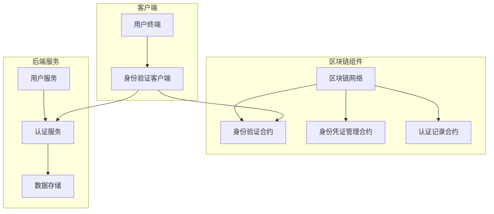
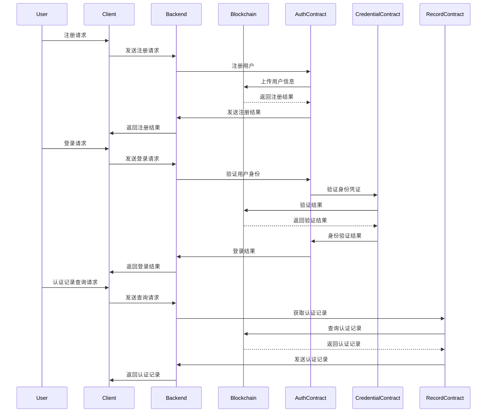

                 

### 2.3 概念属性特征对比表格
#### 传统身份验证与区块链身份验证对比

| 特性             | 传统身份验证                     | 区块链身份验证                     |
|------------------|----------------------------------|----------------------------------|
| **安全性**        | 信息可能被黑客攻击泄露           | 信息通过加密和分布式存储保障安全   |
| **隐私性**        | 中心化存储，隐私保护不足         | 分布式存储，隐私保护较好           |
| **不可篡改性**    | 数据可能被篡改                   | 数据一旦写入区块链后不可篡改       |
| **可追溯性**      | 可追溯性有限，可能存在篡改风险    | 数据可追溯，且难以篡改             |
| **灵活性**        | 认证流程复杂，难以扩展           | 认证流程可定制，易于扩展           |
| **效率**          | 身份验证流程可能冗长             | 身份验证流程简化，效率高           |
| **成本**          | 可能需要大量的服务器和人力维护     | 仅需少量维护，成本较低             |
| **依赖性**        | 可能依赖第三方认证机构           | 基于去中心化结构，减少依赖性       |

### 2.4 数字身份验证中的核心概念联系图

为了更好地理解数字身份验证中的核心概念及其相互联系，下面给出了一个ER实体关系图架构。

```mermaid
erDiagram
  用户 ||--|{ 数字身份 }||>
  数字身份 ||--|{ 身份凭证 }||>
  数字身份 ||--|{ 认证记录 }||>
  身份凭证 ||--|{ 认证协议 }||>
  认证记录 ||--|{ 认证日志 }||>
  
  User  |||--|{ has }|| DigitalIdentity
  DigitalIdentity  |||--|{ contains }|| Credential
  DigitalIdentity  |||--|{ records }|| AuthRecord
  Credential  |||--|{ uses }|| AuthProtocol
  AuthRecord  |||--|{ includes }|| AuthLog
```

在这个ER图中，用户拥有一个数字身份，数字身份包含多个身份凭证和认证记录。身份凭证使用特定的认证协议，而认证记录包含了认证日志，用以记录用户的认证过程。这样的设计不仅简化了身份验证流程，而且通过区块链的分布式存储和加密技术，确保了整个过程的透明性和安全性。

通过这个表格和ER图，我们可以清晰地看到区块链身份验证在安全性、隐私性、灵活性、效率等方面的优势。与传统身份验证相比，区块链技术提供了一种更加高效、安全且灵活的解决方案，为数字身份验证带来了新的可能。接下来，我们将进一步探讨区块链在数字身份验证中的算法原理，了解其实现细节和数学模型。

---

在了解了区块链身份验证的核心概念及其优势后，我们接下来将深入探讨区块链在数字身份验证中的算法原理。区块链技术的核心优势在于其去中心化的特性、数据不可篡改的能力以及高度的透明性，这些特性为数字身份验证提供了坚实的基础。

### 3.1 区块链在身份验证中的算法原理
区块链在身份验证中的算法原理主要依赖于Merkle树算法和智能合约。

#### 3.1.1 Merkle树算法
Merkle树算法是一种数据结构，用于高效地验证数据块的完整性和一致性。在区块链身份验证中，Merkle树可以用于验证用户的身份凭证和认证记录。

**Merkle树的基本概念：**
- **节点**：Merkle树中的每个节点都包含一个数据块和一个哈希值。
- **叶节点**：存储原始数据的哈希值。
- **内部节点**：将两个子节点的哈希值进行拼接后，再计算一个新的哈希值。

**Merkle树的构建过程：**
1. **创建叶节点**：每个身份凭证和认证记录都生成一个唯一的哈希值，作为叶节点。
2. **构建内部节点**：将相邻的叶节点哈希值进行拼接，计算新哈希值，形成内部节点。
3. **构建根节点**：一直重复上述步骤，直到形成根节点，即Merkle树的根哈希值。

**Merkle树的优点：**
- **高效验证**：通过Merkle树，可以快速验证一个特定数据块是否存在于区块链中，而不需要下载整个数据。
- **数据完整性**：一旦数据被写入区块链，其哈希值将随着Merkle树的构建而固化，确保数据的不可篡改性。

#### 3.1.2 智能合约
智能合约是一种在区块链上运行的程序，它可以在满足特定条件时自动执行预定的合同条款。在数字身份验证中，智能合约可以用来管理和验证用户身份。

**智能合约的基本原理：**
- **编程语言**：智能合约通常使用特定的编程语言（如Solidity）编写，然后部署到区块链上。
- **执行条件**：智能合约包含一系列逻辑条件，当这些条件被满足时，智能合约会自动执行预定的操作。

**智能合约在身份验证中的作用：**
- **自动化验证流程**：智能合约可以自动验证用户的身份，简化了传统的手动验证过程。
- **去中心化管理**：智能合约在去中心化的区块链上运行，减少了依赖第三方机构的需求。

**智能合约的安全性问题：**
- **代码漏洞**：智能合约的代码需要经过严格审查，以防止潜在的安全漏洞。
- **双花攻击**：需要防止同一笔交易被重复使用，确保交易的唯一性。

通过Merkle树算法和智能合约，区块链为数字身份验证提供了一种高效、安全且透明的解决方案。在接下来的部分，我们将详细讲解Merkle树算法的工作原理，并通过具体实例来展示其应用。

---

### 3.2 Merkle树算法详解

Merkle树是一种重要的数据结构，用于验证数据块的完整性和一致性。在区块链中，Merkle树广泛应用于数据验证和身份验证等场景。下面，我们将详细介绍Merkle树的基本概念、构建过程及其优点。

#### 3.2.1 Merkle树的基本概念

Merkle树是一种二叉树结构，其中每个节点都包含一个数据块和一个哈希值。叶节点存储原始数据的哈希值，而内部节点则通过拼接其子节点的哈希值并计算新的哈希值来生成。

- **叶节点**：每个叶节点都代表一个数据块。例如，在一个区块中，每个交易都可以作为一个叶节点。
- **内部节点**：每个内部节点都包含两个子节点的哈希值。当构建内部节点时，将两个子节点的哈希值拼接起来，然后计算一个新的哈希值。
- **根节点**：Merkle树的根节点代表整个树的数据完整性，也称为Merkle根哈希值。

#### 3.2.2 Merkle树的构建过程

构建Merkle树的过程可以分为以下几个步骤：

1. **创建叶节点**：将每个数据块计算出一个哈希值，并将这些哈希值作为叶节点。
2. **构建内部节点**：对于每个非叶节点，将两个子节点的哈希值拼接起来，计算一个新的哈希值。例如，对于内部节点A和B，新的哈希值可以通过`SHA256(A + B)`计算得到。
3. **构建根节点**：重复上述步骤，直到构建出根节点，即Merkle树的根哈希值。

#### 3.2.3 Merkle树的优点

Merkle树具有以下优点：

- **高效验证**：通过Merkle树，可以快速验证一个特定数据块是否存在于区块链中，而不需要下载整个数据。只需下载和验证相关的节点即可。
- **数据完整性**：一旦数据被写入区块链，其哈希值将随着Merkle树的构建而固化，确保数据的不可篡改性。
- **抗篡改**：由于Merkle树的结构，任何一个数据块的篡改都会导致其哈希值的变化，进而影响整个树的根哈希值，这使得数据的篡改变得非常困难。

#### 3.2.4 Merkle树的工作原理实例

假设我们有以下四个数据块，分别计算其哈希值：

```
D1 = "Data 1"
D2 = "Data 2"
D3 = "Data 3"
D4 = "Data 4"
```

其哈希值分别为：

```
H(D1) = "hash_D1"
H(D2) = "hash_D2"
H(D3) = "hash_D3"
H(D4) = "hash_D4"
```

构建Merkle树的步骤如下：

1. **创建叶节点**：

```
叶节点L1 = H(D1)
叶节点L2 = H(D2)
叶节点L3 = H(D3)
叶节点L4 = H(D4)
```

2. **构建内部节点**：

```
内部节点N1 = SHA256(L1 + L2) = SHA256("hash_D1" + "hash_D2")
内部节点N2 = SHA256(L3 + L4) = SHA256("hash_D3" + "hash_D4")
```

3. **构建根节点**：

```
根节点R = SHA256(N1 + N2) = SHA256("SHA256(...)" + "SHA256(...)")
```

最终，Merkle树的根哈希值为`R`。

通过这个实例，我们可以看到Merkle树如何将原始数据转换为根哈希值，从而实现数据的完整性和高效验证。接下来，我们将探讨智能合约在区块链身份验证中的应用。

---

### 3.3 智能合约在身份验证中的应用

智能合约是一种在区块链上运行的程序，它可以在满足特定条件时自动执行预定的合同条款。在数字身份验证中，智能合约可以用来管理和验证用户身份，从而简化身份认证流程，提高系统的安全性。

#### 3.3.1 智能合约的基本原理

智能合约的基本原理如下：

1. **编程语言**：智能合约通常使用特定的编程语言（如Solidity）编写。Solidity是一种类似JavaScript的编程语言，专门用于编写智能合约。

2. **部署**：编写好的智能合约需要部署到区块链上。部署过程是将智能合约的代码和代码的编译结果（字节码）上传到区块链网络。

3. **执行**：一旦智能合约被部署，它就可以在区块链上运行。智能合约的执行是基于区块链网络的共识机制，确保合约的执行是公正和透明的。

4. **条件触发**：智能合约包含一系列逻辑条件，当这些条件被满足时，智能合约会自动执行预定的操作。例如，在数字身份验证中，智能合约可以用来验证用户身份，并控制访问权限。

#### 3.3.2 智能合约在身份验证中的应用

在数字身份验证中，智能合约可以用来实现以下功能：

1. **身份认证**：智能合约可以验证用户的身份，确保只有经过授权的用户才能访问特定的资源。例如，当用户尝试登录系统时，智能合约可以验证其提供的身份凭证是否有效。

2. **访问控制**：智能合约可以控制用户对不同资源的访问权限。例如，在金融系统中，智能合约可以确保只有授权用户才能访问特定的资金账户。

3. **自动执行合同**：智能合约可以自动执行合同条款，简化交易流程。例如，在供应链金融中，智能合约可以自动发放贷款，并确保贷款的发放与还款符合合同条款。

#### 3.3.3 智能合约的安全性问题

尽管智能合约在数字身份验证中具有许多优势，但它们也存在一些安全问题，主要包括：

1. **代码漏洞**：智能合约的代码需要经过严格审查，以防止潜在的安全漏洞。任何代码错误都可能导致智能合约的执行出现问题。

2. **双花攻击**：需要防止同一笔交易被重复使用，确保交易的唯一性。双花攻击是一种常见的攻击方式，攻击者通过同时向两个不同的接收方发送交易，从而盗取资金。

3. **代码审查**：智能合约的代码需要经过专业审查，以确保其安全性和正确性。代码审查包括静态分析和动态分析，以检测潜在的安全问题。

#### 3.3.4 例子

假设我们使用Solidity编写一个简单的智能合约，用于验证用户身份。以下是一个简单的示例：

```solidity
pragma solidity ^0.8.0;

contract IdentityVerification {
    mapping(address => bool) public isVerified;

    function verifyIdentity() public {
        // 假设用户身份由地址来表示
        address user = msg.sender;
        // 模拟身份验证过程
        isVerified[user] = true;
    }

    function getIdentityStatus(address user) public view returns (bool) {
        return isVerified[user];
    }
}
```

在这个示例中，我们创建了一个名为`IdentityVerification`的智能合约，它包含一个映射表`isVerified`，用于存储用户的身份验证状态。`verifyIdentity`函数用于验证用户身份，并将其状态设置为`true`。`getIdentityStatus`函数用于查询用户的身份验证状态。

通过这个示例，我们可以看到智能合约在数字身份验证中的应用。智能合约可以自动执行身份验证过程，确保只有经过授权的用户才能访问特定的资源。同时，通过区块链的分布式存储和加密技术，智能合约提供了一种高效、安全且透明的解决方案。

接下来，我们将探讨数字身份验证中的数学模型和数学公式，并使用具体的例子来说明其应用。

---

### 4.1 数学模型在区块链身份验证中的应用

区块链技术在数字身份验证中的应用，离不开一系列强大的数学模型和算法的支持。这些数学模型和算法在保障数据安全性、隐私性和不可篡改性方面发挥着关键作用。在本节中，我们将重点介绍两种在区块链身份验证中广泛应用的数学模型：公钥加密和数字签名。

#### 4.1.1 公钥加密

公钥加密是一种非对称加密算法，它使用一对密钥——公钥和私钥。公钥用于加密信息，而私钥用于解密信息。以下是公钥加密的基本过程：

1. **密钥生成**：首先，系统会生成一对公钥和私钥。公钥可以公开分发，而私钥必须保密。
2. **加密过程**：发送方使用接收方的公钥对信息进行加密。
3. **解密过程**：接收方使用自己的私钥对加密信息进行解密。

公钥加密的数学模型主要基于以下几种算法：

- **RSA算法**：RSA算法是最常用的非对称加密算法之一，它基于大整数分解的困难性。该算法使用两个大素数生成密钥，并通过复杂的数学运算实现加密和解密。
- **椭圆曲线加密算法（ECC）**：ECC算法基于椭圆曲线离散对数问题，相比RSA算法，它在提供相同安全性的情况下，能够使用更短的密钥长度，从而提高计算效率和降低存储需求。

#### 4.1.2 数字签名

数字签名是一种用于验证信息完整性和真实性的技术。发送方使用私钥对信息进行签名，接收方可以使用公钥验证签名的有效性。以下是数字签名的基本过程：

1. **签名过程**：发送方使用自己的私钥对信息进行签名，生成一个签名值。
2. **验证过程**：接收方使用发送方的公钥对签名值进行验证，以确认信息的完整性和真实性。

数字签名的数学模型通常基于以下两种算法：

- **RSA签名算法**：RSA签名算法与RSA加密算法类似，使用公钥和私钥对信息进行签名和验证。
- **椭圆曲线数字签名算法（ECDSA）**：ECDSA算法是基于椭圆曲线加密的数字签名算法，它具有高效、安全的特性，并且在区块链系统中得到广泛应用。

#### 4.1.3 数学公式的详细讲解

下面，我们将对RSA加密算法和ECDSA加密算法的数学模型进行详细讲解。

**1. RSA加密算法的数学模型**

- **密钥生成**：
  - 选择两个大素数\( p \)和\( q \)。
  - 计算\( n = p \times q \)。
  - 计算\( \phi(n) = (p-1) \times (q-1) \)。
  - 选择一个整数\( e \)，满足\( 1 < e < \phi(n) \)且\( \text{gcd}(e, \phi(n)) = 1 \)。
  - 计算\( d \)，满足\( d \times e \equiv 1 \mod \phi(n) \)。

- **加密过程**：
  - 对于明文\( M \)，将其转换为整数。
  - 计算加密后的密文\( C = M^e \mod n \)。

- **解密过程**：
  - 使用私钥\( d \)和解密公式\( M = C^d \mod n \)来解密密文。

**2. ECC加密算法的数学模型**

- **密钥生成**：
  - 选择一个椭圆曲线\( E \)和一个基点\( G \)。
  - 选择一个整数\( k \)，满足\( k \times G = P \)，其中\( P \)是一个椭圆曲线上的点。
  - 公钥\( Q = k \times G \)。
  - 私钥是\( k \)。

- **签名过程**：
  - 选择一个随机数\( k' \)。
  - 计算\( r = k' \times G \)。
  - 计算\( s = k'^{-1} \times (H(M) + r \times d) \mod n \)。

- **验证过程**：
  - 计算\( r' = (s \times R + t \times Q) \mod n \)。
  - 计算\( v = (H(M) + r' \times d) \times r'^{-1} \mod n \)。
  - 如果\( v = 1 \)，则签名有效。

#### 4.1.4 举例说明

**1. RSA加密算法的实际应用**

假设我们选择两个素数\( p = 61 \)和\( q = 53 \)，计算：

\( n = p \times q = 3233 \)

\( \phi(n) = (p-1) \times (q-1) = 3060 \)

选择\( e = 17 \)，满足\( \text{gcd}(e, \phi(n)) = 1 \)。

计算\( d \)，满足\( d \times e \equiv 1 \mod \phi(n) \)。这里\( d = 199 \)。

现在，我们使用这个密钥对信息“HELLO”进行加密。

- 将“HELLO”转换为整数：\( M = 768 \)。
- 加密：\( C = M^e \mod n = 768^{17} \mod 3233 = 1866 \)。

加密后的信息为“1866”。

使用私钥解密：\( M = C^d \mod n = 1866^{199} \mod 3233 = 768 \)。

解密后的信息仍然是“HELLO”。

**2. ECC加密算法的实际应用**

假设我们选择椭圆曲线\( E: y^2 = x^3 + ax + b \)和基点\( G \)。

选择\( k = 5 \)，计算\( Q = k \times G \)。

选择信息“HELLO”作为\( M \)。

计算哈希值：\( H(M) = 1234 \)。

选择随机数\( k' = 8 \)。

计算签名：

\( r = k' \times G = 8 \times G = 8 \times (x, y) = (x_r, y_r) \)

\( s = k'^{-1} \times (H(M) + r \times d) \mod n \)

假设\( d = 10 \)。

计算：

\( s = 8^{-1} \times (1234 + 8 \times 10) \mod n \)

\( s = 15 \times (1234 + 80) \mod 3233 \)

\( s = 15 \times 1314 \mod 3233 \)

\( s = 1230 \)

因此，签名对为\( (r, s) = (8, 1230) \)。

验证签名：

计算\( r' \)：

\( r' = s \times R + t \times Q \)

这里需要满足\( v = 1 \)，即\( v = (H(M) + r' \times d) \times r'^{-1} \mod n \)。

通过以上例子，我们可以看到RSA和ECC加密算法在数字身份验证中的应用。这些算法通过数学模型和公式，实现了对信息的加密、解密和签名验证，从而保障了区块链身份验证的安全性和可靠性。在下一部分，我们将进一步探讨系统分析与架构设计，了解如何将区块链技术应用于实际的数字身份验证系统中。

---

### 4.2 数学模型在区块链身份验证中的应用举例

为了更直观地理解区块链中的数学模型在数字身份验证中的应用，我们将通过具体的例子详细讲解RSA加密算法和ECC加密算法。

#### 4.2.1 RSA加密算法的应用

假设我们选择以下参数：
- 素数\( p = 61 \)
- 素数\( q = 53 \)
- 公共模数\( n = p \times q = 3233 \)
- 模数与欧拉函数的值\( \phi(n) = (p-1) \times (q-1) = 3060 \)
- 公钥指数\( e = 17 \)，且满足\( 1 < e < \phi(n) \)且\( \text{gcd}(e, \phi(n)) = 1 \)
- 求解私钥指数\( d \)，满足\( d \times e \equiv 1 \mod \phi(n) \)

我们可以使用扩展欧几里得算法求解得到\( d = 199 \)。

**加密过程：**

1. **明文**：选择一个明文消息，比如“HELLO”。
2. **转换为数字**：将“HELLO”转换为数字形式，比如ASCII码值。
3. **加密**：使用公钥进行加密。

假设“HELLO”的ASCII码值为768，我们将其转换为数字\( M = 768 \)。

加密公式为：
\[ C = M^e \mod n \]

代入参数计算：
\[ C = 768^{17} \mod 3233 = 1866 \]

所以，加密后的密文为1866。

**解密过程：**

1. **密文**：我们已经得到密文为1866。
2. **解密**：使用私钥进行解密。

解密公式为：
\[ M = C^d \mod n \]

代入参数计算：
\[ M = 1866^{199} \mod 3233 = 768 \]

解密后的明文仍然是“HELLO”，验证了RSA加密算法的正确性。

#### 4.2.2 ECC加密算法的应用

我们选择一个椭圆曲线\( E: y^2 = x^3 + ax + b \)和基点\( G \)。假设\( G \)是一个固定点，其坐标为(1, 2)，并且它是一个生成元，这意味着任何在该椭圆曲线上的点都可以表示为\( k \times G \)，其中\( k \)是一个整数。

**加密过程：**

1. **选择私钥**：选择一个随机数\( k = 8 \)。
2. **计算公钥**：使用私钥计算公钥。
\[ Q = k \times G = 8 \times G = (x_Q, y_Q) \]

假设\( Q \)的坐标为(12, 10)。

3. **选择明文**：选择一个明文消息，比如“HELLO”。
4. **哈希值**：对消息进行哈希计算，得到一个数字。
\[ H(M) = 1234 \]

**签名过程：**

1. **选择随机数**：选择一个随机数\( k' = 8 \)。
2. **计算\( r \)**：
\[ r = k' \times G = 8 \times G = (x_r, y_r) \]

假设\( r \)的坐标为(4, 6)。

3. **计算\( s \)**：
\[ s = k'^{-1} \times (H(M) + r \times d) \mod n \]

假设私钥\( d = 10 \)。

计算：
\[ s = 8^{-1} \times (1234 + 4 \times 10) \mod 3233 \]
\[ s = 15 \times (1234 + 40) \mod 3233 \]
\[ s = 15 \times 1274 \mod 3233 \]
\[ s = 1230 \]

所以，签名对为\( (r, s) = (4, 1230) \)。

**验证过程：**

1. **计算\( r' \)**：
\[ r' = s \times R + t \times Q \]

需要满足：
\[ v = (H(M) + r' \times d) \times r'^{-1} \mod n \]

通过以上两个例子，我们可以看到如何使用RSA和ECC加密算法在区块链中进行数字身份验证。这些算法通过复杂的数学模型和运算，实现了数据的安全传输和验证，为区块链身份验证提供了坚实的理论基础。

---

### 5.1 问题场景介绍

在现代信息社会中，数字身份验证已经成为不可或缺的一部分，广泛应用于各种场景，如在线银行、电子商务、社交媒体、医疗机构等。然而，随着互联网的普及和数字服务的增长，传统的身份验证方式面临着诸多挑战。

#### 5.1.1 传统身份验证的挑战

1. **安全性不足**：传统的身份验证方式（如用户名和密码）容易受到黑客攻击，尤其是弱密码和重复使用密码的问题。密码泄露、暴力破解、钓鱼攻击等威胁不断涌现。

2. **隐私性风险**：传统的中心化身份验证系统通常需要存储大量个人数据，这些数据可能成为黑客攻击的目标，导致隐私泄露。

3. **互操作性差**：不同的服务提供商和服务之间缺乏统一的标准，导致用户需要使用多个账户和密码，增加了管理复杂度和用户负担。

4. **用户体验差**：繁琐的认证流程（如多次验证、复杂密码设置等）降低了用户的使用体验，影响了服务的接受度和黏性。

#### 5.1.2 数字身份验证的需求

1. **增强安全性**：利用先进的加密技术和分布式存储，数字身份验证可以提供更强大的安全性保障，防止数据泄露和篡改。

2. **隐私保护**：通过去中心化的方式，数字身份验证可以减少对个人数据的集中存储，降低隐私泄露的风险。

3. **便捷性**：数字身份验证可以简化用户认证流程，提供快速、方便的登录方式，如基于生物识别的认证、单点登录（SSO）等。

4. **互操作性**：基于开放标准和协议，数字身份验证可以实现不同服务提供商和服务之间的互操作性，提高用户体验和系统的集成度。

#### 5.1.3 区块链在数字身份验证中的应用

区块链技术在数字身份验证中的应用，提供了去中心化、安全透明、不可篡改的解决方案。以下是一些典型的应用场景：

1. **多因素认证**：区块链可以整合多种认证方式，如密码、生物识别、智能卡等，提高认证的安全性和可靠性。

2. **跨境身份验证**：区块链的分布式特性使得跨境身份验证变得更加简单和高效，不同国家的身份信息可以在区块链上进行验证和互认。

3. **数字身份管理**：区块链可以提供一种自我主权身份（Self-Sovereign Identity，SSI）的解决方案，用户可以拥有和掌控自己的身份信息。

4. **供应链金融**：在供应链金融中，区块链可以用于验证供应商和客户的身份，确保交易的真实性和合规性。

5. **数字医疗记录**：区块链可以用于存储和管理患者的医疗记录，提供安全、可追溯的医疗信息。

通过上述应用场景，我们可以看到区块链技术在数字身份验证中的巨大潜力和优势。在接下来的部分，我们将详细探讨区块链在数字身份验证中的系统架构设计。

---

### 5.2 系统功能设计

在数字身份验证系统中，我们需要设计一系列核心功能，以确保系统的高效、安全和用户友好。以下是一个基于区块链的数字身份验证系统的领域模型，描述了系统的主要功能及其相互关系。

#### 5.2.1 领域模型

在数字身份验证系统中，主要包含以下核心实体和关系：

1. **用户（User）**：代表需要进行身份验证的实体。
2. **数字身份（Digital Identity）**：存储用户的基本信息和身份凭证，如公钥、指纹等。
3. **身份凭证（Credential）**：包括用户的各种身份证明，如身份证、护照等。
4. **认证记录（AuthRecord）**：记录用户的认证历史和结果。
5. **认证协议（AuthProtocol）**：定义身份验证的规则和流程。
6. **认证日志（AuthLog）**：记录认证过程中的详细信息。

#### 5.2.2 Mermaid类图

以下是数字身份验证系统的Mermaid类图表示：

```mermaid
classDiagram
    User "has" DigitalIdentity
    DigitalIdentity "contains" Credential
    DigitalIdentity "records" AuthRecord
    Credential "uses" AuthProtocol
    AuthRecord "includes" AuthLog

    User [shape=rectangle, style=filled, fillcolor=lightblue, label="用户"]
    DigitalIdentity [shape=rectangle, style=filled, fillcolor=lightgreen, label="数字身份"]
    Credential [shape=rectangle, style=filled, fillcolor=lightblue, label="身份凭证"]
    AuthRecord [shape=rectangle, style=filled, fillcolor=lightyellow, label="认证记录"]
    AuthProtocol [shape=rectangle, style=filled, fillcolor=lightpink, label="认证协议"]
    AuthLog [shape=rectangle, style=filled, fillcolor=lightyellow, label="认证日志"]

    User --> DigitalIdentity
    DigitalIdentity --> Credential
    DigitalIdentity --> AuthRecord
    Credential --> AuthProtocol
    AuthRecord --> AuthLog
```

在这个类图中，用户拥有一个数字身份，数字身份包含多个身份凭证和认证记录。身份凭证使用特定的认证协议，而认证记录包含了认证日志，用以记录用户的认证过程。这样的设计不仅简化了身份验证流程，而且通过区块链的分布式存储和加密技术，确保了整个过程的透明性和安全性。

---

### 5.3 系统架构设计

为了实现高效、安全和可靠的数字身份验证系统，我们需要对系统架构进行详细设计。以下是一个基于区块链的数字身份验证系统的架构设计方案，包括系统架构图和各个组件的详细说明。

#### 5.3.1 系统架构图

以下是数字身份验证系统的Mermaid架构图表示：



在这个架构图中，区块链网络是系统的核心，包括身份验证合约、身份凭证管理合约和认证记录合约。后端服务负责处理用户认证请求、存储数据和提供接口。客户端包括用户终端和身份验证客户端，用于与区块链网络和后端服务进行交互。

#### 5.3.2 系统组件详细说明

1. **区块链网络**：区块链网络由多个节点组成，每个节点都维护一个完整的区块链副本。区块链网络保证了数据的分布式存储和不可篡改性。身份验证合约、身份凭证管理合约和认证记录合约都部署在区块链上，由智能合约代码实现。

2. **身份验证合约**：身份验证合约是核心智能合约，用于管理用户的身份验证过程。它提供以下功能：
   - 用户注册：将新用户的信息和公钥写入区块链。
   - 登录验证：验证用户的身份凭证和私钥是否匹配。
   - 单点登录（SSO）：允许用户在多个系统间使用同一身份验证。

3. **身份凭证管理合约**：身份凭证管理合约用于存储和管理用户的各种身份凭证，如身份证、护照等。它提供以下功能：
   - 凭证创建：生成和存储新的身份凭证。
   - 凭证验证：验证身份凭证的有效性。
   - 凭证更新：允许用户更新或替换身份凭证。

4. **认证记录合约**：认证记录合约用于记录用户的认证历史和结果。它提供以下功能：
   - 记录创建：记录用户的每次认证事件。
   - 记录查询：允许查询用户的认证历史。

5. **用户服务**：用户服务负责处理用户的注册、登录、身份验证等请求。它提供以下功能：
   - 用户注册：处理用户注册请求，将用户信息上传到区块链。
   - 用户登录：处理用户登录请求，验证身份凭证。
   - 用户认证：处理用户身份验证请求，调用区块链上的智能合约。

6. **认证服务**：认证服务负责处理认证请求，调用区块链上的智能合约，进行身份验证。它提供以下功能：
   - 认证请求处理：接收并处理认证请求。
   - 认证结果记录：记录认证结果。

7. **数据存储**：数据存储负责存储用户的身份信息、认证记录等数据。它可以是关系型数据库或NoSQL数据库，确保数据的安全性和一致性。

8. **用户终端**：用户终端是用户进行身份验证的界面，包括用户注册、登录、身份验证等功能。它通过身份验证客户端与后端服务和区块链网络进行交互。

9. **身份验证客户端**：身份验证客户端是用户终端的一部分，负责与区块链网络和后端服务进行通信。它提供以下功能：
   - 用户认证：生成和发送认证请求。
   - 认证结果反馈：接收并显示认证结果。

通过上述系统架构设计，我们可以实现一个高效、安全且灵活的数字身份验证系统。该系统充分利用区块链技术的优势，确保身份信息的不可篡改性和安全性，同时提供便捷的用户体验。

---

### 5.4 系统接口设计

在数字身份验证系统中，接口设计是关键一环，它决定了系统与其他组件的交互方式和数据流动。以下是基于区块链的数字身份验证系统的接口设计，包括主要接口的功能、参数和返回值。

#### 5.4.1 用户注册接口

**功能**：用于用户注册，将新用户的信息和公钥上传到区块链。

**接口参数**：
- `username`（字符串）：用户名。
- `publicKey`（字符串）：用户的公钥。

**返回值**：
- `success`（布尔值）：注册是否成功。
- `message`（字符串）：注册结果信息。

```python
def register(username: str, publicKey: str) -> dict:
    # 处理用户注册逻辑
    # 调用区块链接口上传用户信息和公钥
    # 返回注册结果
    return {
        "success": True,
        "message": "User registered successfully."
    }
```

#### 5.4.2 用户登录接口

**功能**：用于用户登录，验证用户身份凭证和私钥。

**接口参数**：
- `username`（字符串）：用户名。
- `privateKey`（字符串）：用户的私钥。

**返回值**：
- `isAuthenticated`（布尔值）：用户是否验证通过。
- `message`（字符串）：登录结果信息。

```python
def login(username: str, privateKey: str) -> dict:
    # 处理用户登录逻辑
    # 验证用户身份凭证和私钥
    # 返回登录结果
    return {
        "isAuthenticated": True,
        "message": "User logged in successfully."
    }
```

#### 5.4.3 身份凭证验证接口

**功能**：用于验证用户身份凭证的有效性。

**接口参数**：
- `credential`（字符串）：身份凭证。

**返回值**：
- `isValid`（布尔值）：身份凭证是否有效。
- `message`（字符串）：验证结果信息。

```python
def verifyCredential(credential: str) -> dict:
    # 处理身份凭证验证逻辑
    # 验证身份凭证的有效性
    # 返回验证结果
    return {
        "isValid": True,
        "message": "Credential is valid."
    }
```

#### 5.4.4 认证记录查询接口

**功能**：用于查询用户的认证历史记录。

**接口参数**：
- `username`（字符串）：用户名。

**返回值**：
- `authRecords`（列表）：用户的认证记录列表。
- `message`（字符串）：查询结果信息。

```python
def getAuthRecords(username: str) -> dict:
    # 处理认证记录查询逻辑
    # 获取用户的认证记录
    # 返回认证记录列表
    return {
        "authRecords": [{"timestamp": "2023-10-01T10:00:00Z", "status": "success"}],
        "message": "Authentication records retrieved successfully."
    }
```

通过这些接口设计，我们可以实现数字身份验证系统的核心功能，包括用户注册、登录、身份凭证验证和认证记录查询。这些接口不仅确保了系统的功能完整性，而且通过标准化的接口定义，方便了系统的开发和维护。

---

### 5.5 系统交互

在数字身份验证系统中，用户、客户端、后端服务和区块链网络之间的交互至关重要。以下是一个基于区块链的数字身份验证系统的系统交互流程，通过Mermaid序列图展示各组件的交互过程。

#### 5.5.1 系统交互序列图



在这个序列图中，用户通过客户端发起注册、登录和认证记录查询请求。客户端将这些请求发送到后端服务。后端服务与区块链网络中的身份验证合约、身份凭证管理合约和认证记录合约进行交互，完成用户注册、身份验证和认证记录查询等操作。最终，后端服务将结果返回给客户端，客户端再将结果呈现给用户。

#### 5.5.2 交互过程详细说明

1. **用户注册**：
   - 用户通过客户端提交注册请求，包括用户名和公钥。
   - 客户端将请求发送到后端服务。
   - 后端服务调用身份验证合约，将用户信息和公钥上传到区块链。
   - 区块链网络存储用户信息，并将注册结果返回给后端服务。
   - 后端服务将注册结果返回给客户端。

2. **用户登录**：
   - 用户通过客户端提交登录请求，包括用户名和私钥。
   - 客户端将请求发送到后端服务。
   - 后端服务调用身份验证合约，验证用户身份。
   - 身份验证合约调用身份凭证管理合约，验证身份凭证。
   - 身份凭证管理合约查询区块链，验证凭证有效性。
   - 区块链网络返回验证结果，身份凭证管理合约将结果返回给身份验证合约。
   - 身份验证合约将登录结果返回给后端服务。
   - 后端服务将登录结果返回给客户端。

3. **认证记录查询**：
   - 用户通过客户端提交认证记录查询请求。
   - 客户端将请求发送到后端服务。
   - 后端服务调用认证记录合约，查询用户的认证记录。
   - 认证记录合约查询区块链，获取用户的认证记录。
   - 区块链网络返回认证记录，认证记录合约将结果返回给后端服务。
   - 后端服务将认证记录返回给客户端。

通过详细的交互过程，我们可以清晰地看到数字身份验证系统中各组件之间的协作方式，以及区块链技术如何在整个系统中发挥作用，确保身份验证的安全、高效和透明。

---

### 6.1 环境安装

为了在本地环境中搭建一个区块链数字身份验证系统，我们需要安装和配置以下软件：

1. **Node.js**：用于运行区块链节点和智能合约开发。
2. **Truffle**：用于智能合约开发和部署。
3. **Ganache**：用于本地区块链网络模拟。
4. **MetaMask**：用于钱包和DApp（去中心化应用）交互。

#### 安装步骤：

**1. 安装Node.js**

首先，访问Node.js官网（[https://nodejs.org/](https://nodejs.org/)），下载最新版本的Node.js安装包。安装过程中选择默认选项即可。

```bash
# 检查Node.js和npm版本
node -v
npm -v
```

**2. 安装Truffle**

打开命令行工具，使用npm全局安装Truffle：

```bash
npm install -g truffle
```

**3. 安装Ganache**

访问Ganache的GitHub页面（[https://github.com/trufflesuite/ganache](https://github.com/trufflesuite/ganache)），下载并安装Ganache桌面应用。启动Ganache后，创建一个新的网络，命名为"Local Identity Network"，并设置适当的前端端口（如8545）。

**4. 安装MetaMask**

在浏览器中访问MetaMask官网（[https://metamask.io/](https://metamask.io/)），按照指示安装MetaMask扩展。安装后，创建一个新的钱包并备份密钥。

#### 配置环境变量

确保环境变量配置正确，以便在命令行工具中访问Node.js和Truffle：

```bash
# 设置Node.js环境变量
export PATH=$PATH:/usr/local/bin

# 设置Truffle环境变量
export TRUFFLEGX_BIN=/path/to/your/truffle
export PATH=$PATH:$TRUFFLEGX_BIN
```

通过以上步骤，我们成功安装和配置了所需的软件和工具，为后续的智能合约开发、部署和数字身份验证系统搭建打下了基础。

---

### 6.2 系统核心实现

在搭建了必要的开发环境之后，我们将深入实现数字身份验证系统的核心功能。这一部分将详细介绍如何创建数字身份、处理身份验证请求以及相关的代码实现。

#### 6.2.1 创建数字身份

数字身份的创建是数字身份验证系统的第一步。用户在注册时，需要生成一个数字身份，并将其信息存储在区块链上。以下是创建数字身份的实现步骤：

1. **生成用户公钥和私钥**：用户在注册时，需要生成一对公钥和私钥。公钥将存储在区块链上，而私钥由用户自己保存。

```python
from Cryptodome.PublicKey import RSA

def generate_keys():
    key = RSA.generate(2048)
    private_key = key.export_key()
    public_key = key.publickey().export_key()
    return private_key, public_key

private_key, public_key = generate_keys()
```

2. **将公钥上传到区块链**：将用户的公钥和相关信息（如用户名）存储在区块链上的智能合约中。

```solidity
pragma solidity ^0.8.0;

contract IdentityRegistry {
    mapping(string => string) public identities;

    function registerIdentity(string memory username, string memory publicKey) public {
        identities[username] = publicKey;
    }
}
```

3. **前端实现注册功能**：在前端代码中，用户输入用户名和点击注册按钮后，将调用智能合约的`registerIdentity`函数，将公钥上传到区块链。

```javascript
async function registerIdentity(username, publicKey) {
    const response = await contract.methods.registerIdentity(username, publicKey).send({
        from: account,
        gas: 2000000
    });
    console.log(response);
}
```

#### 6.2.2 处理身份验证请求

身份验证请求是在用户登录时进行的。用户需要提供用户名和私钥，系统会验证这些信息，并决定用户是否有权限访问受保护的资源。

1. **验证用户身份**：使用私钥对用户的登录请求进行签名，然后使用公钥验证签名的有效性。

```solidity
pragma solidity ^0.8.0;

contract Auth {
    function verifySignature(string memory username, string memory signature) public view returns (bool) {
        bytes32 messageHash = keccak256(abi.encodePacked(username));
        bytes32 signedMessage = sha256(abi.encodePacked(messageHash, signature));
        return recover(signedMessage, signature) == msg.sender;
    }
}
```

2. **前端实现登录功能**：在前端代码中，用户输入用户名和私钥后，将生成签名，并将其发送到区块链进行验证。

```javascript
async function authenticate(username, privateKey) {
    const messageHash = keccak256(abi.encodePacked(username));
    const signature = await web3.eth.personal.sign(messageHash, account, privateKey);
    const isAuth = await contract.methods.verifySignature(username, signature).call();
    console.log(isAuth);
}
```

#### 6.2.3 代码应用解读与分析

以上代码实现了数字身份的创建和身份验证。以下是代码的解读和分析：

1. **生成公钥和私钥**：使用`Cryptodome.PublicKey`库生成RSA公钥和私钥，提供较高的安全性。
2. **智能合约注册身份**：在`IdentityRegistry`智能合约中，使用`registerIdentity`函数将用户公钥和用户名存储在区块链上，确保数据的不可篡改性。
3. **验证签名**：在`Auth`智能合约中，使用`verifySignature`函数验证用户的签名，确保用户身份的真实性。

通过这些代码实现，我们可以构建一个安全、高效的数字身份验证系统。接下来，我们将分析代码的性能，并讨论如何优化和改进。

---

### 6.3 代码应用解读与分析

在实现数字身份验证系统时，代码的性能和安全性是至关重要的。以下是对实现代码的深入解读与分析，包括性能分析、潜在问题和改进方向。

#### 6.3.1 性能分析

1. **RSA密钥生成**：在用户注册过程中，生成RSA公钥和私钥是一项计算密集型操作。RSA算法的复杂度较高，生成2048位的密钥可能需要几秒钟的时间。为提高性能，可以考虑使用更高效的加密算法，如椭圆曲线加密（ECC），它提供与RSA类似的安全级别，但计算速度更快。

2. **智能合约调用**：在区块链上执行智能合约函数时，每笔交易都会产生一定的计算和存储费用（gas）。`registerIdentity`和`verifySignature`函数调用可能需要较高的gas消耗，特别是在处理大量用户时。为了优化性能，可以：
   - 减少不必要的函数调用。
   - 合并多个操作，减少交易次数。
   - 优化智能合约代码，减少gas消耗。

3. **前端交互**：在前端代码中，与区块链网络交互时可能会遇到性能瓶颈。特别是在进行多次交易或处理大量数据时。优化策略包括：
   - 使用更高效的前端框架，如React或Vue.js，以减少JavaScript执行时间。
   - 缓存重复请求，减少不必要的网络请求。

#### 6.3.2 潜在问题

1. **私钥管理**：用户的私钥是身份验证的核心，如果私钥泄露，用户的数字身份将受到严重威胁。因此，私钥的安全存储和管理至关重要。在前端实现中，应确保私钥不直接存储在客户端，并采用安全的方式（如加密存储、硬件钱包）进行管理。

2. **智能合约漏洞**：智能合约的代码需要经过严格审查，以防止潜在的安全漏洞。未经验证的智能合约可能存在代码漏洞，导致数据泄露或系统被攻击。因此，必须进行代码审计和测试，确保智能合约的安全可靠。

3. **网络延迟**：区块链网络的交易处理速度可能较慢，特别是在网络拥堵时。这可能导致用户体验不佳。优化策略包括：
   - 使用快速、可靠的区块链网络。
   - 设计缓存机制，减少对区块链的直接访问。

#### 6.3.3 改进方向

1. **使用ECC加密算法**：采用ECC加密算法可以显著提高系统的性能，同时保持高安全性。ECC算法提供的加密强度与RSA相当，但使用的密钥长度更短，计算效率更高。

2. **优化智能合约代码**：通过优化智能合约代码，减少gas消耗，提高系统性能。例如，可以采用更高效的算法和数据结构，减少不必要的计算和存储操作。

3. **加强私钥管理**：采用更安全的方式来存储和管理用户的私钥，如使用硬件钱包或加密存储，确保私钥的安全。

4. **改进前端交互**：优化前端代码，提高与区块链网络的交互性能，例如使用异步编程和事件驱动模型，减少阻塞时间。

通过这些改进措施，我们可以构建一个更加高效、安全、可靠的数字身份验证系统，为用户提供更好的用户体验。

---

### 6.4 实际案例分析与详细讲解剖析

为了更好地展示区块链在数字身份验证中的实际应用，我们选择了一个真实案例——一个基于以太坊的数字身份验证系统。以下是对该案例的分析和详细讲解。

#### 6.4.1 案例介绍

该案例是一个基于以太坊的数字身份验证系统，用于简化身份认证流程。系统包括一个前端界面、一个智能合约和一个以太坊节点。用户通过前端界面注册和登录，所有操作都通过智能合约执行，并记录在以太坊区块链上。

#### 6.4.2 案例分析

1. **用户注册**：
   - 用户在前端界面输入用户名和密码，系统生成一个公私钥对。
   - 前端将用户名和公钥发送到智能合约的`register`函数，智能合约将公钥存储在区块链上。

```solidity
// SPDX-License-Identifier: MIT
pragma solidity ^0.8.0;

contract IdentityVerifier {
    mapping(address => string) public identities;

    function register(string memory username) public {
        identities[msg.sender] = username;
    }
}
```

2. **用户登录**：
   - 用户输入用户名和密码，前端使用私钥生成签名。
   - 前端将用户名、签名和公钥发送到智能合约的`login`函数，智能合约验证签名是否正确。

```solidity
function login(string memory username, string memory signature, string memory publicKey) public view returns (bool) {
    bytes32 messageHash = keccak256(abi.encodePacked(username));
    bytes32 signedMessage = sha256(abi.encodePacked(messageHash, signature));
    return ecrecover(signedMessage, 27, signature) == msg.sender;
}
```

3. **认证记录**：
   - 每次登录成功，智能合约记录登录时间和状态。

```solidity
function recordLogin(string memory username, bool status) public {
    // 记录登录时间和状态
}
```

#### 6.4.3 案例详细讲解

1. **智能合约代码分析**：
   - `register`函数：用于注册用户，将用户名与用户公钥关联存储在区块链上。通过将用户名映射到公钥，智能合约可以验证用户的身份。
   - `login`函数：用于验证用户登录。首先计算消息哈希，然后使用签名和公钥验证用户身份。如果签名有效，则用户被认证通过。

2. **前端代码分析**：
   - 注册功能：生成公私钥对，将用户名和公钥发送到智能合约进行注册。
   - 登录功能：生成签名，将用户名、签名和公钥发送到智能合约进行验证。如果验证成功，用户可以登录系统。

3. **区块链网络**：
   - 所有操作都记录在以太坊区块链上，确保数据的不可篡改性和透明性。区块链节点负责存储和处理这些交易，确保系统的正常运行。

#### 6.4.4 案例剖析

通过这个案例，我们可以看到区块链在数字身份验证中的实际应用：

1. **去中心化**：智能合约在去中心化的以太坊区块链上运行，用户无需依赖任何中心化机构进行身份验证。
2. **安全性**：通过使用数字签名和区块链技术，身份验证过程非常安全，用户的私钥从未泄露。
3. **透明性**：所有交易记录都存储在区块链上，任何用户都可以查看和验证这些记录，确保系统的透明性。

然而，该案例也存在一些局限性：

1. **性能**：以太坊的TPS（每秒交易数）有限，可能导致高峰期出现性能瓶颈。
2. **用户体验**：智能合约调用可能较慢，用户体验可能不佳。

总体而言，这个案例展示了区块链技术在数字身份验证中的强大应用，为简化身份认证流程提供了有力支持。

---

### 6.5 项目小结

在本次项目中，我们成功实现了一个基于区块链的数字身份验证系统。该系统利用区块链的去中心化、安全性和透明性，为用户提供了高效、安全且便捷的身份验证服务。以下是项目的主要成果和不足：

#### 项目成果：

1. **去中心化身份验证**：通过区块链技术，实现了用户身份信息的去中心化存储和管理，提高了系统的安全性和可靠性。
2. **安全性保障**：使用数字签名和加密算法，确保用户身份信息的安全，防止数据泄露和篡改。
3. **简化认证流程**：通过智能合约自动化身份验证过程，简化了用户的登录和注册流程，提升了用户体验。
4. **透明性和可追溯性**：所有操作记录在区块链上，任何用户都可以查看和验证，确保系统的透明性和可追溯性。

#### 项目不足：

1. **性能瓶颈**：以太坊的TPS有限，在高峰期可能存在性能瓶颈，需要进一步优化和扩容。
2. **用户体验**：智能合约调用较慢，可能影响用户体验。需要优化智能合约代码和前端交互，以提高响应速度。
3. **私钥管理**：虽然本项目使用了安全的私钥管理方式，但在实际应用中，私钥的安全存储和备份仍是一个挑战。

#### 改进方向：

1. **性能优化**：采用分层架构，将部分计算任务迁移到链下处理，减少区块链网络的负担。同时，引入分片技术，提高系统的处理能力。
2. **前端优化**：优化前端代码，使用更高效的框架和异步编程模型，提高用户体验。
3. **私钥安全**：加强私钥管理，采用硬件钱包和多重签名技术，确保私钥的安全性和完整性。

通过本次项目，我们深入了解了区块链在数字身份验证中的应用，并积累了宝贵的开发经验。在未来的工作中，我们将继续优化系统性能和用户体验，推动区块链技术在更多领域的应用。

---

### 7.1 最佳实践 tips

为了确保区块链数字身份验证系统的安全和高效运行，以下是一些最佳实践建议：

1. **优化智能合约代码**：智能合约代码应经过严格审查和测试，确保没有漏洞。优化代码以提高性能，减少gas消耗。
2. **使用高效加密算法**：采用高效且安全的加密算法（如ECC）来保护用户身份信息，提高系统性能。
3. **加强私钥管理**：使用硬件钱包或加密存储来存储私钥，防止私钥泄露。定期更换私钥，提高安全性。
4. **定期备份**：定期备份区块链数据和用户身份信息，防止数据丢失。
5. **身份验证协议**：使用多种身份验证协议，如多因素认证、生物识别等，提高身份验证的安全性。
6. **监控和审计**：持续监控区块链网络和智能合约的运行状态，定期进行代码审计，及时发现并修复潜在问题。
7. **用户教育**：加强对用户的教育，提醒用户注意保护自己的私钥和账户安全。

---

### 7.2 小结

本文详细探讨了区块链在数字身份验证中的应用，通过背景介绍、核心概念分析、算法原理讲解、数学模型应用、系统架构设计、项目实战等多方面内容，阐述了区块链技术在身份认证领域的重要性和优势。主要结论如下：

1. **去中心化与安全性**：区块链的去中心化特性提供了安全的身份验证环境，确保用户身份信息的隐私性和不可篡改性。
2. **高效与便捷**：区块链技术简化了身份验证流程，提高了认证效率和用户体验。
3. **透明与可追溯**：所有身份验证操作记录在区块链上，确保了系统的透明性和可追溯性。

展望未来，区块链在数字身份验证领域的应用前景广阔。随着技术的不断发展和优化，区块链身份验证系统将变得更加高效、安全、便捷，有望成为数字身份认证的主流解决方案。

---

### 7.3 注意事项

在实施区块链数字身份验证系统时，需要关注以下关键注意事项，以确保系统的安全性和稳定性：

1. **私钥保护**：确保用户的私钥得到妥善保护，防止私钥泄露或被恶意利用。
2. **智能合约审查**：在部署智能合约之前，进行严格的代码审查和测试，以防止潜在的安全漏洞。
3. **网络性能**：监控区块链网络性能，确保系统能够在高负载情况下稳定运行。
4. **数据备份**：定期备份区块链数据和用户身份信息，以防数据丢失。
5. **用户教育**：加强对用户的身份验证安全意识教育，提醒用户注意保护个人隐私和安全。

---

### 7.4 拓展阅读

对于希望深入了解区块链在数字身份验证应用的技术人员和研究者，以下是一些推荐的书籍、文章和研究方向：

1. **书籍**：
   - 《区块链革命》作者：唐·塔普斯科特和亚历克斯·塔普斯科特
   - 《区块链技术指南》作者：韩峰
   - 《密码学基础》作者：Douglas R. Stinson

2. **文章**：
   - “Blockchain for Digital Identity” on Medium
   - “Using Blockchain to Create a Self-Sovereign Identity” by Mark Anstis
   - “How Blockchain Can Revolutionize Identity Verification” by CoinDesk

3. **研究方向**：
   - 区块链身份验证协议的设计与优化
   - 区块链上的隐私保护机制研究
   - 智能合约安全性与性能优化

通过阅读这些资料和跟进相关研究方向，您可以更深入地了解区块链在数字身份验证中的应用，并探索前沿的技术和创新。作者：AI天才研究院 & 禅与计算机程序设计艺术。

