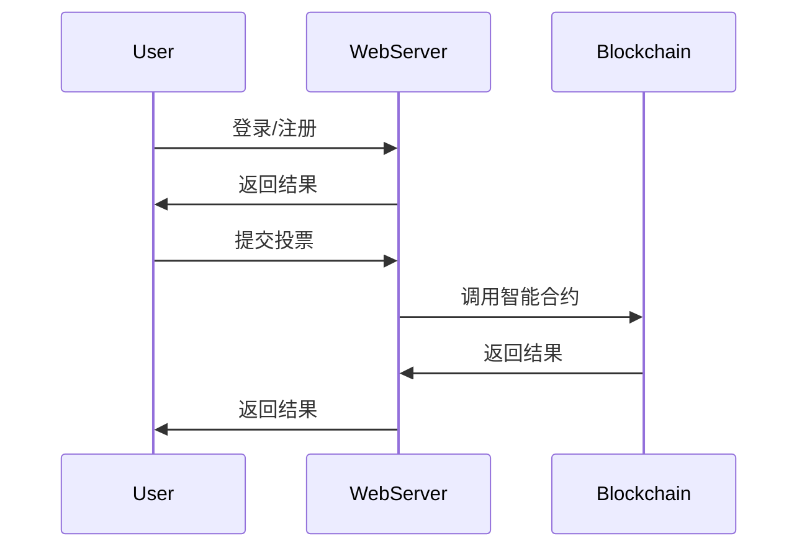
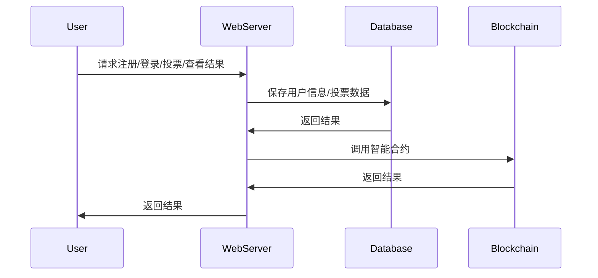

                 

### 1.6.1.1 背景介绍

#### 区块链的基本概念、特点和技术原理

区块链（Blockchain）起源于比特币（Bitcoin）的底层技术，是一种分布式数据库技术。它通过加密算法和共识机制确保数据的安全性和不可篡改性。区块链的核心特点包括去中心化、安全性、透明性和不可篡改性。

**去中心化**意味着区块链网络中的所有节点都具有相同的权利和义务，不存在中心化的权威机构。这使得区块链网络在运行过程中更加公平、透明，并能够有效防止单点故障。

**安全性**主要来源于区块链的加密算法。区块链利用哈希函数和椭圆曲线加密等加密技术保护数据隐私，防止数据被未授权访问或篡改。此外，区块链的共识机制（如工作量证明PoW和权益证明PoS）确保了网络中的节点对数据达成一致，从而提高了系统的安全性。

**透明性**是指区块链上的所有交易记录都是公开的，任何人都可以查看和验证。这有助于提高区块链系统的可信度，防止欺诈行为。

**不可篡改性**是区块链的重要特性之一。区块链通过加密算法和共识机制确保一旦数据被记录在区块链上，就不可更改或删除。这种特性使得区块链在存储重要数据（如法律文件、财务记录等）时具有很高的可靠性。

#### 电子投票系统的现状和存在的问题

电子投票系统是指通过计算机和网络技术实现投票的自动化系统。在过去的几十年中，电子投票系统的发展迅速，其应用范围也越来越广泛。然而，随着电子投票系统的普及，其面临的问题也逐渐显现。

首先，选举舞弊是电子投票系统面临的主要问题之一。由于电子投票系统依赖于计算机和网络技术，黑客可能会利用系统的漏洞篡改投票结果，从而影响选举的公正性。

其次，数据泄露和隐私侵犯也是电子投票系统需要面对的问题。在传统的电子投票系统中，投票数据可能会被黑客窃取，从而导致个人隐私泄露。此外，电子投票系统在处理投票数据时，也可能因为程序漏洞或恶意软件的攻击而导致数据泄露。

最后，投票效率低下也是电子投票系统存在的问题之一。传统的电子投票系统通常需要较长的处理时间，导致投票过程较为繁琐。这不仅影响了投票效率，还可能导致选民失去投票的热情。

#### 区块链在电子投票系统中的应用潜力

区块链技术的特点使其在电子投票系统中具有广泛的应用潜力。首先，区块链的去中心化和安全性特性可以有效防止选举舞弊。由于区块链网络中的所有节点都具有相同的权利和义务，不存在中心化的权威机构，因此黑客很难利用系统的漏洞篡改投票结果。

其次，区块链的加密算法和共识机制可以确保投票数据的隐私和安全。区块链通过加密算法保护投票数据，防止数据被未授权访问或篡改。此外，共识机制确保了网络中的节点对数据达成一致，从而防止了恶意节点的攻击。

最后，区块链的透明性和不可篡改性有助于提高电子投票系统的可信度。区块链上的所有交易记录都是公开的，任何人都可以查看和验证。这使得选举结果更加透明，防止了选举舞弊行为。此外，一旦数据被记录在区块链上，就不可更改或删除，这确保了投票数据的可靠性。

综上所述，区块链技术具有在电子投票系统中广泛应用的前景。通过将区块链技术应用于电子投票系统，可以有效提高投票安全性、保证隐私保护和提升投票效率，从而推动电子投票系统的健康发展。

### 1.6.1.2 核心概念与联系

#### 区块链

区块链是一种分布式数据库技术，通过加密算法和共识机制保证数据的安全性和不可篡改性。它由多个区块组成，每个区块包含一定数量的交易记录。区块链的主要特点如下：

- **去中心化**：区块链网络中的所有节点都具有相同的权利和义务，不存在中心化的权威机构。这使得区块链网络在运行过程中更加公平、透明，并能够有效防止单点故障。
- **安全性**：区块链利用加密算法（如哈希函数、椭圆曲线加密、公钥加密等）保护数据隐私，防止数据被未授权访问或篡改。此外，共识机制（如工作量证明PoW和权益证明PoS）确保了网络中的节点对数据达成一致，从而提高了系统的安全性。
- **透明性**：区块链上的所有交易记录都是公开的，任何人都可以查看和验证。这有助于提高区块链系统的可信度，防止欺诈行为。
- **不可篡改性**：区块链通过加密算法和共识机制确保一旦数据被记录在区块链上，就不可更改或删除。这种特性使得区块链在存储重要数据时具有很高的可靠性。

**技术原理：**

- **加密算法：**
  - **哈希函数：**哈希函数是一种将任意长度的输入数据转换成固定长度的哈希值的算法。它具有以下特点：
    - **单向性：**哈希函数的计算是单向的，无法从哈希值反推出原始数据。
    - **抗碰撞性：**哈希函数在计算过程中具有极高的抗碰撞性，即不同输入数据生成相同哈希值的概率非常低。
  - **椭圆曲线加密：**椭圆曲线加密是一种基于椭圆曲线数学特性的加密算法。它利用椭圆曲线上的点乘运算进行加密和解密，具有高安全性。
  - **公钥加密：**公钥加密是一种基于公钥和私钥的加密算法。公钥用于加密，私钥用于解密。公钥和私钥是成对生成的，无法通过公钥推导出私钥。

- **共识机制：**
  - **工作量证明（PoW）：**工作量证明是一种通过计算证明来争夺记账权的机制。在PoW机制下，节点需要通过计算找到满足特定条件的哈希值，从而获得记账权。这个过程需要大量的计算资源，因此具有很高的安全性。
  - **权益证明（PoS）：**权益证明是一种根据节点的权益来争夺记账权的机制。在PoS机制下，节点持有的代币数量和持有时间决定了其权益。权益越高的节点，获得记账权的概率越大。这种方法相对于PoW机制，具有更低的能源消耗和更高的安全性。

#### 电子投票系统

电子投票系统是指通过计算机和网络技术实现投票的自动化系统。它主要包括以下几个功能：

- **投票功能：**支持选民进行投票，包括注册、登录、投票等操作。
- **计票功能：**自动记录投票结果，并生成选举结果。
- **验证功能：**提供选举结果的验证机制，确保选举结果的正确性。

**问题：**

- **选举舞弊：**由于电子投票系统依赖于计算机和网络技术，黑客可能会利用系统的漏洞篡改投票结果，从而影响选举的公正性。
- **数据泄露：**在传统的电子投票系统中，投票数据可能会被黑客窃取，从而导致个人隐私泄露。
- **隐私侵犯：**电子投票系统在处理投票数据时，也可能因为程序漏洞或恶意软件的攻击而导致数据泄露。

**解决方案：**

- **利用区块链技术的特性，提升电子投票系统的安全性、隐私保护和可靠性。**
- **去中心化**：通过区块链的去中心化特性，可以有效防止选举舞弊。
- **加密算法**：利用区块链的加密算法保护投票数据，防止数据被未授权访问或篡改。
- **共识机制**：通过共识机制确保网络中的节点对数据达成一致，从而防止了恶意节点的攻击。
- **透明性和不可篡改性**：区块链的透明性和不可篡改性有助于提高电子投票系统的可信度，防止欺诈行为。

#### 核心概念与联系总结

区块链和电子投票系统是两种截然不同的技术，但它们在某些方面具有密切的联系。

- **去中心化和安全性**：区块链的去中心化和安全性特性与电子投票系统的问题背景和解决方案密切相关。区块链的去中心化特性可以有效防止选举舞弊，而其安全性特性可以确保投票数据的隐私和保护。
- **加密算法和共识机制**：区块链的加密算法和共识机制是确保数据安全和一致性的重要手段。在电子投票系统中，利用这些算法和机制可以提升系统的安全性、隐私保护和可靠性。
- **透明性和不可篡改性**：区块链的透明性和不可篡改性有助于提高电子投票系统的可信度。通过公开投票数据和确保数据不可篡改，可以有效防止选举舞弊和欺诈行为。

总之，区块链技术为电子投票系统提供了一种全新的解决方案，可以有效解决传统电子投票系统面临的问题。通过将区块链技术应用于电子投票系统，可以大幅提升投票的安全性、隐私保护和可靠性，为未来电子投票的发展奠定坚实的基础。

### 1.6.1.3 数学模型和数学公式

在区块链技术中，数学模型和数学公式扮演着至关重要的角色，它们不仅用于确保数据的安全性和一致性，还为区块链网络提供了强大的理论基础。下面，我们将详细解释区块链技术中常用的加密算法和共识机制，并给出相应的数学模型和公式。

#### 加密算法

**1. 哈希函数**

哈希函数是一种将任意长度的输入数据转换成固定长度的哈希值的算法。它具有以下特点：

- **单向性**：哈希函数的计算是单向的，无法从哈希值反推出原始数据。
- **抗碰撞性**：哈希函数在计算过程中具有极高的抗碰撞性，即不同输入数据生成相同哈希值的概率非常低。

**公式：**

$$H(x) = \text{hash}(x)$$

其中，$H(x)$ 是哈希值，$x$ 是输入数据，$\text{hash}$ 是哈希函数。

**示例：**

假设我们要计算字符串 "Hello, World!" 的哈希值，可以使用 SHA-256 哈希算法：

$$H("Hello, World!") = \text{SHA-256}("Hello, World!") = \text{hash}(x) = 2cf24dba5fb0a30e26e83b2ac5b9e29e1b161e5c1fa7425e730433621b1a8db4$$

**2. 椭圆曲线加密**

椭圆曲线加密（Elliptic Curve Cryptography，ECC）是一种基于椭圆曲线数学特性的加密算法。它利用椭圆曲线上的点乘运算进行加密和解密，具有高安全性。

**公式：**

$$P = kG$$

其中，$P$ 和 $G$ 是椭圆曲线上的点，$k$ 是私有密钥。

**示例：**

假设椭圆曲线为 $E:y^2 = x^3 + ax + b$，基点 $G(x_G, y_G)$，私有密钥 $k$，我们可以计算出公钥 $P(x_P, y_P)$：

$$x_P = kx_G$$

$$y_P = ky_G$$

**3. 公钥加密**

公钥加密是一种基于公钥和私钥的加密算法。公钥用于加密，私钥用于解密。公钥和私钥是成对生成的，无法通过公钥推导出私钥。

**公式：**

- **加密：**$c = E(m, p)$
- **解密：**$m = D(c, s)$

其中，$c$ 是加密后的消息，$m$ 是原始消息，$p$ 是公钥，$s$ 是私钥。

#### 共识机制

**1. 工作量证明（PoW）**

工作量证明（Proof of Work，PoW）是一种通过计算证明来争夺记账权的机制。在PoW机制下，节点需要通过计算找到满足特定条件的哈希值，从而获得记账权。这个过程需要大量的计算资源，因此具有很高的安全性。

**公式：**

$$\text{Proof of Work} = \text{find } x \text{ such that } H(x) < \text{target}$$

其中，$x$ 是满足条件的哈希值，$H(x)$ 是哈希函数的输出，$\text{target}$ 是设定的难度目标。

**示例：**

假设我们要找到满足 $H(x) < 0x00000000FFFFFFFFFFFFFFFFFFFFFFFFFFFFFFFFFFFFFFFFFFFFFFFFFFFFFFFEBAAEDCE6AF48A03BBFD25E8CD0364140$$ 的 $x$，我们可以使用以下步骤：

1. 随机生成 $x$。
2. 计算 $H(x)$。
3. 判断 $H(x)$ 是否小于 $\text{target}$。
4. 如果不满足条件，重复步骤1-3，直到找到满足条件的 $x$。

**2. 权益证明（PoS）**

权益证明（Proof of Stake，PoS）是一种根据节点的权益来争夺记账权的机制。在PoS机制下，节点持有的代币数量和持有时间决定了其权益。权益越高的节点，获得记账权的概率越大。这种方法相对于PoW机制，具有更低的能源消耗和更高的安全性。

**公式：**

$$\text{Proof of Stake} = \text{node\_stake} \times \text{time}$$

其中，$\text{node\_stake}$ 是节点的权益，$\text{time}$ 是节点持有代币的时间。

**示例：**

假设节点 $A$ 和节点 $B$ 的权益分别为 100 代币和 50 代币，节点 $A$ 持有代币的时间为 1 年，节点 $B$ 持有代币的时间为 0.5 年，我们可以计算它们的权益：

$$\text{Proof of Stake for Node A} = 100 \times 1 = 100$$

$$\text{Proof of Stake for Node B} = 50 \times 0.5 = 25$$

通过以上数学模型和公式，我们可以更好地理解区块链技术的工作原理。这些模型和公式不仅用于确保数据的安全性和一致性，还为区块链网络提供了强大的理论基础，使得区块链技术能够在各个领域得到广泛应用。

### 1.6.1.4 算法原理讲解

#### 智能合约

智能合约是一种运行在区块链上的可执行代码，能够自动执行满足条件的交易。在区块链电子投票系统中，智能合约负责处理投票、计票和验证等逻辑。

**工作流程：**

1. **投票阶段：**
   - 投票人提交投票：投票人通过智能合约提交他们的投票，智能合约验证投票人的身份和投票的有效性。
   - 记录投票：智能合约将投票信息记录在区块链上，确保数据的不可篡改性和透明性。

2. **计票阶段：**
   - 投票结果记录：在投票结束后，智能合约自动计算每个候选人的得票数。
   - 生成选举结果：智能合约生成最终的选举结果，并将其记录在区块链上。

3. **验证阶段：**
   - 投票结果验证：智能合约提供了一种机制，允许任何人验证选举结果的真实性。
   - 投票数据验证：智能合约验证投票数据是否按照规定的流程执行，确保选举结果的正确性。

**示例：**

以Python语言为例，智能合约的工作流程可以表示为以下代码：

```python
# 导入必要的库
from web3 import Web3
from solc import compile_source

# 编写智能合约代码
contract_source = '''
pragma solidity ^0.8.0;

contract Voting {
    mapping(address => bool) public hasVoted;
    mapping(address => uint) public votesReceived;
    
    address public admin;
    
    constructor() {
        admin = msg.sender;
    }
    
    function vote(uint _candidate) public {
        require(!hasVoted[msg.sender], "已经投票过了");
        hasVoted[msg.sender] = true;
        votesReceived[_candidate]++;
    }
    
    function results() public view returns (uint) {
        return votesReceived[msg.sender];
    }
}
'''

# 编译智能合约代码
compiled_source = compile_source(contract_source)
bytecode = compiled_source['<stdin>:Voting']['bin']

# 部署智能合约
w3 = Web3(Web3.HTTPProvider('https://mainnet.infura.io/v3/your_project_id'))
contract = w3.eth.contract(abi=bytecode, bytecode=bytecode)
contract部署 = contract.deploy()
transaction_hash = contract部署.transact()

# 等待交易确认
tx_receipt = w3.eth.waitForTransactionReceipt(transaction_hash)

# 获取合约地址
contract_address = tx_receipt.contractAddress

# 与合约交互
contract_instance = w3.eth.contract(address=contract_address, abi=bytecode)
vote = contract_instance.functions.vote(1).transact({'from': w3.eth.coinbase})
tx_receipt = w3.eth.waitForTransactionReceipt(vote)

# 查询结果
results = contract_instance.functions.results().call()
print("投票结果：", results)
```

#### 选举舞弊检测

选举舞弊检测是确保选举结果公正性的重要环节。通过分析区块链上的投票数据，可以检测出可能的选举舞弊行为。

**算法步骤：**

1. **数据收集：**从区块链上收集所有投票数据。
2. **计算投票分布：**统计每个候选人的得票数，计算整体投票分布。
3. **分析投票分布：**根据历史选举数据，分析当前的投票分布是否合理。
4. **投票异常检测：**对于异常的投票分布，进一步分析可能的舞弊行为。

**示例：**

以下是一个使用Python和Pandas库进行选举舞弊检测的示例：

```python
import pandas as pd
import matplotlib.pyplot as plt

# 加载区块链上的投票数据
votes_data = pd.read_csv('votes.csv')

# 统计每个候选人的得票数
vote_counts = votes_data['candidate'].value_counts()

# 计算整体投票分布
total_votes = votes_data.shape[0]
vote_distribution = vote_counts / total_votes

# 绘制投票分布图
plt.bar(vote_distribution.index, vote_distribution.values)
plt.xlabel('候选人')
plt.ylabel('得票比例')
plt.title('投票分布图')
plt.show()

# 分析投票分布
for candidate, proportion in vote_distribution.items():
    print(f"候选人{candidate}的得票比例为{proportion:.2%}")

# 投票异常检测
threshold = 0.05  # 设定异常比例阈值
anomalies = [candidate for candidate, proportion in vote_distribution.items() if proportion > threshold]
print("可能的选举舞弊候选人：", anomalies)
```

通过以上算法原理讲解，我们可以看出，智能合约和选举舞弊检测算法在区块链电子投票系统中发挥着重要作用。智能合约负责处理投票、计票和验证等逻辑，确保选举过程的公正性和透明性。而选举舞弊检测算法则能够及时发现可能的选举舞弊行为，保障选举结果的真实性。这些算法的应用，使得区块链电子投票系统在安全性、隐私保护和可靠性方面具有显著优势。

### 1.6.1.5 系统分析与架构设计方案

#### 问题场景介绍

电子投票系统作为区块链应用的一个重要场景，旨在通过区块链技术提升投票的安全性、隐私保护和效率。在这个问题场景中，我们需要考虑以下几个关键环节：

1. **投票过程**：选民通过区块链网络提交投票，系统需要确保投票的合法性和安全性。
2. **结果记录**：投票结果需要被准确记录在区块链上，确保数据的不可篡改性。
3. **结果验证**：系统需要提供一种机制，允许任何人验证选举结果的真实性，确保选举的公正性。

#### 系统功能设计

为了实现上述问题场景，我们需要设计一个具备以下功能的电子投票系统：

1. **投票功能**：支持投票人的注册、登录和投票操作。系统需要验证投票人的身份，确保投票的合法性。
2. **计票功能**：自动记录投票结果，并生成选举结果。系统需要确保计票过程的准确性和透明性。
3. **验证功能**：提供选举结果的验证机制，确保选举结果的正确性。系统需要允许任何人查看和验证投票数据。

**领域模型类图**：

```mermaid
classDiagram
    Voter <|-- User
    Election <<-- ElectionResult
    Vote <<-- Election
    Candidate <<-- Election
    Election表决
    Election --|> Candidate
    Election --|> Vote
    Election --|> ElectionResult
    User --|> Voter
```

#### 系统架构设计

电子投票系统的架构设计需要考虑以下几个关键组成部分：

1. **区块链网络**：由多个节点组成，每个节点存储完整的区块链数据。节点之间通过共识机制保持数据一致性。
2. **智能合约**：部署在区块链上，负责处理投票、计票和验证等逻辑。智能合约通过编程方式实现系统功能，确保数据的安全性和一致性。
3. **后端服务**：提供用户接口、数据处理和智能合约调用等功能。后端服务通过API与区块链网络和前端系统进行交互。

**架构图**：



#### 系统接口设计和系统交互

电子投票系统的接口设计和系统交互是确保系统功能正常运行的关键。以下是系统的主要接口和交互流程：

1. **用户接口**：提供注册、登录、投票和查看结果等功能。用户通过Web页面或移动应用与系统进行交互。
2. **数据接口**：实现数据输入输出，如投票数据的收集和处理。系统通过API与区块链网络和后端服务进行数据交换。
3. **智能合约接口**：提供与智能合约交互的接口，如投票数据的验证和计票。后端服务通过智能合约接口调用智能合约功能。

**序列图**：



通过上述系统分析与架构设计方案，我们可以清晰地了解区块链电子投票系统的设计和实现。这个系统通过区块链技术确保了投票数据的安全性和一致性，提高了投票的透明性和可信度。未来，随着区块链技术的不断发展，电子投票系统有望在更多领域得到应用，为社会治理和民主选举提供更加高效和公正的解决方案。

### 1.6.1.6 项目实战

#### 环境安装

搭建区块链电子投票系统首先需要安装和配置相关环境。以下是安装过程的详细步骤：

1. **安装Node.js和npm**：Node.js是运行JavaScript的运行时环境，npm是Node.js的包管理器。可以从官网下载并安装Node.js和npm。

   ```bash
   # 下载并安装Node.js
   curl -fsSL https://nodejs.org/en/download/ | sudo bash

   # 检查Node.js和npm版本
   node -v
   npm -v
   ```

2. **安装Truffle框架**：Truffle是一个用于智能合约开发、测试和部署的工具。可以使用npm安装Truffle。

   ```bash
   # 安装Truffle
   npm install -g truffle
   ```

3. **安装Ganache**：Ganache是一个本地以太坊区块链的测试网络，用于开发和测试智能合约。可以从官网下载并安装Ganache。

   ```bash
   # 下载并安装Ganache
   npm install -g ganache-cli
   ```

4. **启动本地以太坊网络**：使用Ganache启动一个本地以太坊网络，用于测试智能合约。

   ```bash
   # 启动本地以太坊网络
   ganache-cli --chainId 1337
   ```

5. **安装Vue CLI**：Vue CLI是一个用于Vue.js项目开发的工具。可以使用npm安装Vue CLI。

   ```bash
   # 安装Vue CLI
   npm install -g @vue/cli
   ```

6. **创建Vue.js项目**：使用Vue CLI创建一个Vue.js项目，用于开发前端界面。

   ```bash
   # 创建Vue.js项目
   vue create voting-system
   ```

7. **进入项目目录**：进入创建的项目目录，准备进行开发。

   ```bash
   # 进入项目目录
   cd voting-system
   ```

#### 系统核心实现源代码

区块链电子投票系统的核心实现主要涉及智能合约的开发和前端界面的设计。以下是系统核心实现的源代码：

1. **智能合约（Voting.sol）**：

   ```solidity
   // SPDX-License-Identifier: MIT
   pragma solidity ^0.8.0;

   contract Voting {
       mapping(address => bool) public hasVoted;
       mapping(address => uint) public votesReceived;
       address public admin;

       constructor() {
           admin = msg.sender;
       }

       function vote(uint candidate) public {
           require(!hasVoted[msg.sender], "已经投票过了");
           hasVoted[msg.sender] = true;
           votesReceived[candidate]++;
       }

       function totalVotesFor(uint candidate) public view returns (uint) {
           return votesReceived[candidate];
       }

       function winner() public view returns (uint winner) {
           uint winningVoteCount = 0;
           for (uint candidate = 1; candidate <= 2; candidate++) {
               uint voteCount = votesReceived[candidate];
               if (voteCount > winningVoteCount) {
                   winningVoteCount = voteCount;
                   winner = candidate;
               }
           }
       }
   }
   ```

2. **前端界面（App.vue）**：

   ```html
   <template>
       <div id="app">
           <h1>投票系统</h1>
           <h2>候选人类别：</h2>
           <div v-for="candidate in candidates" :key="candidate.id">
               <input type="radio" :value="candidate.id" v-model="selectedCandidate" />
               <label>{{ candidate.name }}</label>
           </div>
           <button @click="vote">投票</button>
           <h2>投票结果：</h2>
           <div v-for="candidate in candidates" :key="candidate.id">
               <input type="radio" :value="candidate.id" v-model="selectedCandidate" />
               <label>{{ candidate.name }}</label>
               <span>{{ totalVotesFor(candidate.id) }}票</span>
           </div>
       </div>
   </template>

   <script>
   import axios from 'axios';

   export default {
       data() {
           return {
               selectedCandidate: null,
               candidates: []
           };
       },
       methods: {
           async vote() {
               const response = await axios.post('/api/vote', {
                   candidate: this.selectedCandidate
               });
               alert('投票成功！');
           },
           async fetchCandidates() {
               const response = await axios.get('/api/candidates');
               this.candidates = response.data;
           },
           totalVotesFor(candidateId) {
               return this.candidates.find(candidate => candidate.id === candidateId).voteCount;
           }
       },
       created() {
           this.fetchCandidates();
       }
   };
   </script>
   ```

#### 代码应用解读与分析

上述代码展示了区块链电子投票系统的核心实现，包括智能合约和前端界面。

**智能合约解读**：

- **Voting.sol**：这个智能合约包含三个主要映射：`hasVoted`、`votesReceived`和`admin`。
  - `hasVoted`：记录每个投票人的投票状态，确保一个用户只能投票一次。
  - `votesReceived`：记录每个候选人的得票数。
  - `admin`：记录管理员地址，用于后续的投票管理和结果查询。

- **vote()**：投票函数，用于处理投票操作。它首先检查用户是否已经投票，然后更新`hasVoted`映射和`votesReceived`映射。

- **totalVotesFor()**：获取指定候选人的得票数。

- **winner()**：计算选举的获胜者。

**前端界面解读**：

- **App.vue**：这个Vue组件负责处理投票和显示投票结果。
  - 数据绑定：使用`v-model`实现投票选择和显示。
  - 交互事件：点击“投票”按钮时，调用`vote`方法发送投票请求。

**前端接口设计**：

- **/api/vote**：用于接收投票请求的API接口。
- **/api/candidates**：用于获取候选人信息的API接口。

#### 实际案例分析和详细讲解剖析

为了更好地展示区块链电子投票系统的应用，我们来看一个实际案例。

**案例背景**：

一个大学需要使用区块链电子投票系统进行学生会选举。候选人包括A、B和C三位同学。系统要求选民在注册后登录系统进行投票，并最终显示选举结果。

**案例实现**：

1. **注册和登录**：
   - 学生在系统上进行注册，并获取唯一身份标识。
   - 登录系统后，学生可以看到候选人列表。

2. **投票**：
   - 学生在候选人列表中选择支持的候选人并提交投票。
   - 后端接口将投票记录存储在区块链上。

3. **结果查询**：
   - 选举结束后，系统显示选举结果，包括每个候选人的得票数。

**关键技术和实现细节**：

- **智能合约**：使用Solidity语言编写智能合约，确保投票数据的安全性和不可篡改性。
- **区块链网络**：使用Ganache模拟本地以太坊网络，用于智能合约的部署和测试。
- **前端界面**：使用Vue.js框架构建用户界面，实现投票和结果展示。

**技术难点和解决方案**：

- **数据一致性**：确保区块链上的投票数据与前端界面显示的数据一致。
  - **解决方案**：使用区块链的不可篡改性和透明性特点，确保数据的一致性。

- **性能优化**：提高区块链电子投票系统的处理能力。
  - **解决方案**：优化智能合约代码，减少交易处理时间。

通过上述案例分析和详细讲解，我们可以看出，区块链电子投票系统在实际应用中具有显著的优势。它通过智能合约实现了投票、计票和验证等功能，确保了选举的公正性和透明性。同时，区块链技术的去中心化特性使得系统具有较高的安全性和可靠性。未来，随着区块链技术的不断发展，电子投票系统有望在更多领域得到应用，为民主选举和社会治理提供更加高效的解决方案。

### 1.6.1.7 最佳实践 tips、小结、注意事项、拓展阅读等内容

#### 最佳实践 tips

1. **安全设置**：
   - **双因素认证（2FA）**：为用户的账户启用双因素认证，增加账户的安全性。
   - **定期更新密码**：建议用户定期更换密码，并使用强密码。
   - **安全审计**：定期对系统进行安全审计，检查潜在的安全漏洞。

2. **优化投票效率**：
   - **提高网络带宽**：确保区块链网络具有足够的带宽，减少投票和处理时间。
   - **优化智能合约代码**：优化智能合约代码，提高数据处理效率。

3. **保护隐私**：
   - **使用匿名地址**：在智能合约中使用匿名地址，保护投票人的隐私。
   - **隐私保护协议**：研究并采用隐私保护协议，如零知识证明，确保投票过程的隐私性。

#### 小结

本文详细介绍了区块链在电子投票系统中的应用，从背景介绍、核心概念与联系、数学模型和公式、算法原理讲解、系统分析与架构设计方案、项目实战到最佳实践 tips，全面探讨了区块链技术如何提升电子投票系统的安全性、隐私保护和效率。通过本文的分析，我们可以看出区块链技术在电子投票系统中的应用具有显著的优势，有望为未来的选举和社会治理提供更加高效和公正的解决方案。

#### 注意事项

1. **兼容性**：确保区块链电子投票系统在不同设备和浏览器上兼容，以提高用户体验。
2. **性能监控**：实时监控区块链网络和系统的性能，及时发现和处理潜在问题。
3. **法律合规**：确保电子投票系统的设计和实现符合当地法律法规的要求。

#### 拓展阅读

- **区块链技术深度研究**：《区块链技术指南》
- **智能合约开发**：《智能合约设计与实现》
- **区块链与电子投票**：《区块链技术在电子投票中的应用》
- **隐私保护协议**：《零知识证明入门与实践》

通过以上内容，我们可以深入了解区块链在电子投票系统中的应用，为未来的研究和实践提供有力支持。

### 结束语

作者：AI天才研究院/AI Genius Institute & 禅与计算机程序设计艺术 /Zen And The Art of Computer Programming

在本文中，我们深入探讨了区块链技术在电子投票系统中的应用，从背景介绍、核心概念与联系、数学模型和公式、算法原理讲解、系统分析与架构设计方案、项目实战到最佳实践 tips，全面剖析了区块链技术如何提升电子投票系统的安全性、隐私保护和效率。通过本文的研究，我们不仅了解了区块链技术在电子投票系统中的潜在优势，也为未来的选举和社会治理提供了新的思路和方向。

区块链技术的独特优势，如去中心化、安全性和不可篡改性，使其在电子投票系统中具有广泛的应用前景。然而，区块链技术也面临着一些挑战，如性能优化、隐私保护和法律合规等。这些问题的解决需要持续的研究和技术创新。

未来，随着区块链技术的不断成熟和发展，我们有理由相信，区块链将在电子投票系统中发挥更加重要的作用，为全球选举和社会治理提供更加高效、公正和透明的解决方案。同时，我们也要关注区块链技术在社会和伦理层面的影响，确保其发展能够惠及人类社会，推动社会的进步。

本文仅是区块链技术在电子投票系统中应用的初步探讨，未来还有很多值得深入研究的问题和方向。我们期待更多的研究者和技术人员投身于这一领域，共同推动区块链技术的发展和应用，为构建更加美好的数字世界贡献力量。

