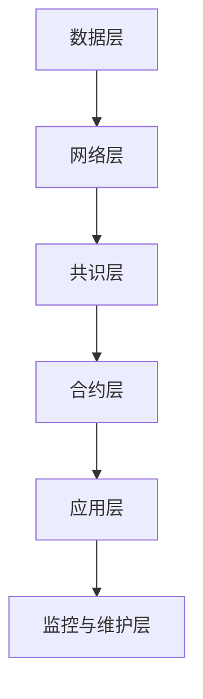
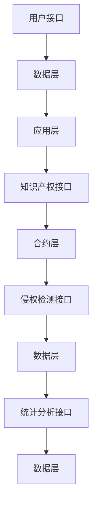

                 

### 文章标题：区块链在知识产权保护中的创新应用

关键词：区块链、知识产权保护、创新应用、非同质化代币（NFT）、智能合约、系统架构

摘要：本文将从区块链的核心概念入手，探讨其在知识产权保护中的应用，通过分析区块链技术的特点与知识产权保护的关联，详细阐述区块链在著作权、专利和商标保护中的创新应用案例，最后深入剖析区块链知识产权保护系统的架构设计和项目实战，为读者提供全面的区块链知识产权保护解决方案。

### 目录大纲设计思路

为了设计出符合要求的目录大纲，我们需要按照以下步骤进行：

1. **理解书名与主题**：首先，我们需要准确理解书名《区块链在知识产权保护中的创新应用》，明确本书的主要内容和目标读者。

2. **确定章节结构**：根据书名，我们可以预判本书可能需要涵盖的几个主要方面，如区块链基础、知识产权保护现状、创新应用案例等。

3. **细化章节内容**：每个章节下需要细化子标题，确保内容覆盖全面，逻辑清晰。

4. **使用markdown格式**：按照markdown格式的要求，合理使用#、##、###等标签，确保目录结构清晰。

5. **保持简洁性**：避免冗长的描述，直接呈现关键信息。

6. **确保内容完整性**：包括核心概念、联系、算法原理、数学模型等。

### 目录大纲设计框架

#### 第一部分：背景介绍

##### 1. 区块链与知识产权保护概述

##### 1.1 区块链的核心概念

##### 1.2 知识产权保护的现状与挑战

##### 2. 核心概念与联系

##### 2.1 区块链技术特点

##### 2.2 知识产权保护的关键要素

##### 2.3 区块链与知识产权保护的关联

##### 3. 算法原理与数学模型

##### 3.1 非同质化代币（NFT）原理

##### 3.2 智能合约在知识产权保护中的应用

##### 3.3 数学模型与公式讲解

#### 第二部分：创新应用案例

##### 4. 著作权保护

##### 4.1 著作权保护的区块链应用案例

##### 4.2 著作权保护案例分析

##### 5. 专利保护

##### 5.1 专利保护的区块链应用案例

##### 5.2 专利保护案例分析

##### 6. 商标保护

##### 6.1 商标保护的区块链应用案例

##### 6.2 商标保护案例分析

##### 7. 创新应用案例解析

#### 第三部分：系统架构与实现

##### 8. 区块链知识产权保护系统架构设计

##### 8.1 系统功能设计

##### 8.2 系统架构设计

##### 8.3 系统接口设计与交互

#### 第四部分：项目实战

##### 9. 区块链知识产权保护项目实战

##### 9.1 环境搭建

##### 9.2 系统核心实现

##### 9.3 代码应用解读

##### 9.4 实际案例分析

##### 9.5 项目小结

#### 第五部分：最佳实践与拓展

##### 10. 最佳实践与注意事项

##### 10.1 实践经验总结

##### 10.2 小结与展望

##### 10.3 拓展阅读推荐

### 目录大纲审核

在完成目录大纲初稿后，我们需要对其内容进行审核，确保：

- 每个章节标题简洁明了，能够概括章节内容。
- 内容覆盖全面，逻辑清晰，没有遗漏关键知识点。
- 确保每个章节下的子标题能够支持章节标题，形成完整的知识体系。

通过这样的审核，我们可以确保最终的目录大纲满足要求，为读者提供良好的阅读体验。

---

接下来，我们将按照这个目录大纲逐步展开文章内容的撰写，从区块链与知识产权保护概述开始，深入探讨区块链在知识产权保护中的创新应用，最终呈现一篇高质量的技术博客文章。让我们一起走进区块链与知识产权保护的奇妙世界！### 第一部分：背景介绍

#### 1. 区块链与知识产权保护概述

**区块链**，作为一种分布式账本技术，自2008年中本聪（Satoshi Nakamoto）提出以来，便以其去中心化、安全性高、不可篡改等特点，在全球范围内引起了广泛关注。区块链的核心价值在于其能够实现数据的透明性和安全性，从而在金融、物流、医疗等多个领域获得了广泛应用。

**知识产权保护**，是指通过法律手段保护创作者的智力成果，包括著作权、专利权、商标权等。随着信息技术的飞速发展，知识产权侵权问题日益突出，如何有效保护知识产权成为亟待解决的问题。

区块链与知识产权保护的结合，有望为知识产权保护领域带来革命性的变革。区块链技术具有以下特点，使其在知识产权保护中具有独特优势：

1. **去中心化**：区块链的去中心化特性使得知识产权的登记、存储、管理过程更加透明和公正，减少了中心化机构的依赖。

2. **不可篡改性**：区块链上记录的数据一旦确认，便无法篡改，这为知识产权的保护提供了坚实的基础。

3. **可追溯性**：区块链上的每一笔交易都有完整的记录，有助于追溯知识产权的来源和流转过程，提高知识产权管理的效率。

4. **智能合约**：智能合约是区块链上的自动执行合约，可以自动化执行知识产权的授权、许可等操作，减少纠纷，提高知识产权交易的安全性和效率。

#### 1.1 区块链的核心概念

区块链是一种去中心化的分布式数据库技术，其核心概念包括：

1. **区块**：区块是区块链的基本单元，包含了特定时间内的交易记录。

2. **链**：区块链是由多个区块按时间顺序链接而成的数据结构。

3. **共识算法**：共识算法是区块链网络中节点达成共识的方法，以确保区块链的可靠性和安全性。

4. **节点**：节点是区块链网络中的参与者，负责验证和存储区块链上的数据。

#### 1.2 知识产权保护的现状与挑战

当前，知识产权保护面临以下主要挑战：

1. **侵权行为频发**：随着网络技术的发展，侵权行为愈发隐蔽，传统的知识产权保护手段已无法满足实际需求。

2. **维权成本高**：知识产权维权过程复杂，需要大量的时间和金钱投入，使得许多创作者望而却步。

3. **管理效率低**：传统的知识产权管理方式依赖于中心化机构，效率低下，且易受人为因素干扰。

4. **证据链不完整**：在知识产权纠纷中，证据链的完整性至关重要，但实际操作中，证据的收集和保存过程往往存在困难。

#### 1.3 问题背景与问题描述

在知识产权保护中，如何确保知识产权的登记、管理、交易等环节的安全和透明，成为亟待解决的问题。传统的方法往往依赖于中心化的机构，但中心化机构存在以下问题：

1. **数据易被篡改**：中心化机构的数据易受到黑客攻击，导致数据泄露或篡改。

2. **数据不透明**：中心化机构的数据管理过程不透明，可能导致知识产权的滥用。

3. **交易不安全**：传统的知识产权交易过程往往存在风险，易受到欺诈行为的影响。

4. **管理效率低**：中心化机构的管理效率低下，难以满足大规模知识产权保护的需求。

区块链技术的出现，为解决上述问题提供了新的思路。通过去中心化、不可篡改、可追溯等特点，区块链有望在知识产权保护中发挥重要作用。

#### 1.4 问题解决与边界与外延

区块链在知识产权保护中的应用，可以解决以下核心问题：

1. **数据安全**：区块链的去中心化和不可篡改性，确保了知识产权数据的完整性和安全性。

2. **透明管理**：区块链上的数据公开透明，有助于提高知识产权管理的效率和公信力。

3. **高效交易**：智能合约的引入，使得知识产权的交易过程更加安全和高效。

4. **降低维权成本**：区块链上的证据链完整，有助于降低维权成本，提高维权成功率。

然而，区块链在知识产权保护中也存在一定的边界与外延：

1. **技术门槛**：区块链技术的应用需要较高的技术门槛，对普通用户来说可能难以掌握。

2. **监管难题**：区块链的去中心化特性，使得监管变得更加复杂，需要建立相应的监管机制。

3. **法律冲突**：区块链技术的应用可能引发现有法律体系的冲突，需要完善相关法律法规。

4. **隐私保护**：在知识产权保护中，隐私保护是一个重要的问题，需要平衡公开透明与隐私保护的关系。

#### 1.5 概念结构与核心要素组成

区块链在知识产权保护中的概念结构主要包括以下几个核心要素：

1. **区块链技术**：包括区块、链、共识算法、节点等基本概念。

2. **知识产权**：包括著作权、专利权、商标权等类型。

3. **智能合约**：一种自动执行的合约，用于自动化知识产权的授权、许可等操作。

4. **数字身份**：用于识别和保护知识产权持有者的身份信息。

5. **证据链**：记录知识产权的生成、流转、交易等环节，确保证据链的完整性和可信性。

通过以上核心要素的组成，区块链为知识产权保护提供了全新的解决方案。

在下一部分中，我们将进一步探讨区块链技术特点与知识产权保护的关键要素，分析区块链在知识产权保护中的核心原理。敬请期待！### 第二部分：核心概念与联系

#### 2.1 区块链技术特点

区块链技术作为分布式账本技术的代表，具有以下核心特点：

1. **去中心化**：区块链不依赖于中心化的机构，而是通过分布式网络进行数据的存储和验证。这意味着，区块链上的数据由所有参与者共同维护，确保了系统的可靠性和安全性。

2. **不可篡改性**：区块链上的数据一旦被确认并记录下来，就几乎无法被篡改。这是由于区块链采用了加密算法和共识机制，确保了数据的完整性和一致性。

3. **透明性**：区块链上的数据是公开透明的，任何参与者都可以查看和验证数据。这使得区块链成为了一种高度可信的数据存储和交易系统。

4. **可追溯性**：区块链上的每笔交易都有完整的记录，可以追溯到其产生的源头。这种可追溯性有助于提高知识产权管理的透明度和效率。

5. **自动化执行**：通过智能合约，区块链可以实现自动化执行合同条款。智能合约是运行在区块链上的计算机程序，其代码是公开透明的，可以确保合同的自动执行。

#### 2.2 知识产权保护的关键要素

知识产权保护涉及多个关键要素，包括著作权、专利权、商标权等。以下是这些要素的核心概念和特点：

1. **著作权**：著作权是指创作者对其原创作品所享有的权利，包括文字、音乐、电影、软件等。著作权的主要特点是原创性和表达形式的独创性。

2. **专利权**：专利权是指发明者对其发明所享有的专有权利，包括产品、方法、工艺等。专利权的主要特点是创新性和实用性。

3. **商标权**：商标权是指商标持有者对其商标所享有的专用权。商标的主要特点是识别性和显著性。

4. **知识产权登记**：知识产权登记是指将知识产权的信息记录在官方数据库中，以获得法律保护。登记的主要特点是正式性和合法性。

5. **知识产权交易**：知识产权交易是指知识产权的转让、许可等操作。交易的主要特点是市场化和商业性。

#### 2.3 区块链与知识产权保护的关联

区块链技术具有去中心化、不可篡改、透明性和自动化执行等特性，与知识产权保护的关键要素具有高度的契合性。以下是区块链与知识产权保护之间的关联：

1. **去中心化**：区块链的去中心化特性，使得知识产权的登记、管理、交易等环节更加透明和公正，减少了中心化机构的依赖，降低了知识产权侵权和滥用的风险。

2. **不可篡改性**：区块链上的数据一旦被确认并记录下来，就几乎无法被篡改，这为知识产权的登记和保护提供了可靠的基础。

3. **透明性**：区块链上的数据是公开透明的，任何参与者都可以查看和验证数据。这种透明性有助于提高知识产权管理的透明度和公信力，减少知识产权侵权行为。

4. **可追溯性**：区块链上的每笔交易都有完整的记录，可以追溯到其产生的源头。这种可追溯性有助于提高知识产权管理的透明度和效率，便于追踪侵权行为和维权。

5. **自动化执行**：通过智能合约，区块链可以实现自动化执行合同条款。智能合约的引入，使得知识产权的授权、许可等操作更加安全、高效和自动化。

综上所述，区块链技术与知识产权保护的核心要素具有高度的契合性，为知识产权保护提供了一种全新的解决方案。在下一部分中，我们将深入探讨区块链在知识产权保护中的算法原理与数学模型。敬请期待！### 第三部分：算法原理与数学模型

#### 3.1 非同质化代币（NFT）原理

非同质化代币（Non-Fungible Token，简称NFT）是区块链上的一种代币，其与传统数字货币（如比特币、以太坊）的不同之处在于，NFT具有唯一性和不可替代性。每个NFT都是一个独特的数字资产，代表着一个特定的物品或权利。

NFT的原理主要基于区块链技术的独特特性，包括：

1. **唯一性**：NFT通过加密算法确保其唯一性，每个NFT的数字签名都是独一无二的，无法复制或替代。

2. **不可篡改性**：区块链上的数据一旦被确认和记录，就几乎无法被篡改。这意味着NFT的持有者可以确信其持有的NFT是真实且不可篡改的。

3. **透明性**：NFT的交易记录是公开透明的，任何人都可通过区块链网络查看NFT的所有权信息和交易历史。

NFT在知识产权保护中的应用主要体现在以下几个方面：

1. **数字作品认证**：艺术家、设计师等创作者可以使用NFT来证明其数字作品的原创性和所有权。通过将作品转换为NFT并上传到区块链上，创作者可以确保证其作品的真实性和唯一性。

2. **版权管理**：NFT可以用于管理知识产权的授权和许可。例如，版权持有者可以将作品的部分版权授权给第三方，并使用NFT来记录授权信息。

3. **数字艺术品交易**：NFT为数字艺术品的交易提供了一个透明、安全、可追溯的渠道。买家可以确信购买的数字艺术品是真实且唯一的，减少了欺诈和侵权行为。

#### 3.2 智能合约在知识产权保护中的应用

智能合约是一种运行在区块链上的计算机程序，其代码是公开透明的，可以自动化执行合同条款。智能合约在知识产权保护中的应用具有重要意义，主要体现在以下几个方面：

1. **版权登记**：智能合约可以用于自动化知识产权的登记过程。例如，创作者可以使用智能合约将作品的版权信息记录在区块链上，确保版权信息的完整性和不可篡改性。

2. **版权授权**：智能合约可以用于自动化版权的授权和许可过程。创作者可以通过智能合约向第三方授权部分或全部版权，并设定授权的条款和条件。

3. **版权维权**：智能合约可以用于自动化版权的维权过程。当发生侵权行为时，版权持有者可以使用智能合约自动启动维权程序，如向侵权者发送警告、要求赔偿等。

4. **版权交易**：智能合约可以用于自动化版权的交易过程。例如，版权持有者可以通过智能合约将版权的全部或部分转让给第三方，确保交易的透明性和安全性。

#### 3.3 数学模型与公式讲解

区块链在知识产权保护中的应用，涉及到一些重要的数学模型和公式。以下是一些常用的数学模型和公式的讲解：

1. **哈希函数**：哈希函数是一种将任意长度的输入数据映射为固定长度的输出的函数。在区块链中，哈希函数用于确保数据的完整性和一致性。常用的哈希函数包括SHA-256、SHA-3等。

2. **椭圆曲线加密**：椭圆曲线加密是一种非对称加密算法，用于保护区块链上的数据隐私。椭圆曲线加密的主要数学模型包括椭圆曲线方程和点乘运算。

3. **共识算法**：共识算法是区块链网络中节点达成共识的方法。常用的共识算法包括工作量证明（Proof of Work，PoW）、权益证明（Proof of Stake，PoS）等。

4. **区块链网络性能指标**：区块链网络的性能指标包括交易速度、确认时间、网络吞吐量等。这些指标反映了区块链网络的处理能力和稳定性。

#### 3.4 举例说明

为了更好地理解区块链在知识产权保护中的应用，以下通过一个简单的例子进行说明：

假设有一位画家创作了一幅名为《星空》的数字画作。他希望使用区块链技术来保护其作品的版权。

1. **创建NFT**：画家将《星空》数字画作上传到区块链上，并创建一个对应的NFT。NFT包含了《星空》的详细信息，如创作时间、作者姓名、作品标题等。

2. **版权登记**：画家使用智能合约将《星空》的版权信息记录在区块链上。智能合约确保版权信息的完整性和不可篡改性。

3. **版权授权**：画家希望通过智能合约将《星空》的部分版权授权给一家画廊。他使用智能合约设定授权条款，如授权期限、授权费用等。

4. **版权交易**：当画廊希望购买《星空》的版权时，画家通过智能合约将版权转让给画廊。智能合约自动完成交易，确保交易的透明性和安全性。

通过以上步骤，画家成功使用区块链技术保护了《星空》的版权，确保了作品的真实性和唯一性。

在下一部分中，我们将探讨区块链在知识产权保护中的创新应用案例。敬请期待！### 第四部分：创新应用案例

#### 4.1 著作权保护

区块链技术在著作权保护中的应用，为创作者提供了一个安全、透明和高效的版权管理解决方案。以下是一些具体的著作权保护案例：

1. **案例一：艺术家使用NFT保护画作版权**

某位数字艺术家创作了一幅数字画作《梦境》。为了保护其作品的版权，艺术家将《梦境》上传到区块链平台，并创建了一个对应的NFT。NFT包含了《梦境》的创作时间、作者姓名、作品标题等详细信息。当有人购买这幅画作时，NFT的所有权会转移到买家名下，确保画作的真实性和唯一性。

2. **案例二：音乐家使用智能合约管理音乐版权**

某位音乐家创作了一首原创音乐《阳光》。为了确保其作品的版权，音乐家使用智能合约将《阳光》的版权信息记录在区块链上。智能合约还设定了音乐授权的条件和费用，例如，当用户播放《阳光》时，智能合约会自动向音乐家支付版税。

3. **案例三：作家使用区块链保护电子书版权**

某位作家创作了一部电子书《未来的世界》。为了保护其作品的版权，作家将《未来的世界》的版权信息上传到区块链平台。当有人购买这本书时，区块链会自动生成一个唯一的NFT，确保电子书的所有权清晰可查。

#### 4.2 专利保护

区块链技术在专利保护中的应用，有助于提高专利申请和管理的效率，减少专利纠纷。以下是一些具体的专利保护案例：

1. **案例一：公司使用区块链平台申请专利**

某家公司发明了一种新型节能设备，并希望申请专利。为了提高申请效率，公司选择使用区块链平台进行专利申请。区块链平台提供了一个去中心化的专利申请系统，公司可以轻松上传专利申请文件，并获得全球范围内的专利申请证书。

2. **案例二：大学使用区块链保护学术成果**

某所大学的研究团队在生物科技领域取得了一项重要突破。为了保护这项学术成果，大学选择使用区块链技术进行专利申请。区块链平台确保了专利申请过程的透明性和不可篡改性，有助于提高专利申请的成功率。

3. **案例三：专利交易平台使用区块链提高交易效率**

某家专利交易平台希望通过区块链技术提高交易效率。平台使用智能合约自动执行专利交易合同条款，确保交易的透明性和安全性。此外，平台还提供了一个去中心化的专利信息数据库，方便用户查询专利信息。

#### 4.3 商标保护

区块链技术在商标保护中的应用，有助于提高商标的注册和管理效率，减少商标侵权行为。以下是一些具体的商标保护案例：

1. **案例一：企业使用区块链平台申请商标**

某家企业希望在多个国家申请商标。为了提高申请效率，企业选择使用区块链平台。区块链平台提供了一个全球范围内的商标申请系统，企业可以轻松上传商标申请文件，并获得多个国家的商标证书。

2. **案例二：商标持有者使用区块链保护商标权**

某位商标持有者发现其商标被侵权。为了保护商标权，商标持有者使用区块链平台记录侵权证据。区块链平台确保了证据的完整性和不可篡改性，有助于商标持有者顺利维权。

3. **案例三：商标交易平台使用区块链提高交易效率**

某家商标交易平台希望通过区块链技术提高交易效率。平台使用智能合约自动执行商标交易合同条款，确保交易的透明性和安全性。此外，平台还提供了一个去中心化的商标信息数据库，方便用户查询商标信息。

#### 4.4 创新应用案例解析

以上案例展示了区块链技术在著作权、专利和商标保护中的创新应用。以下是这些案例的解析：

1. **去中心化**：区块链的去中心化特性，使得知识产权的登记、管理、交易等环节更加透明和公正，减少了中心化机构的依赖。

2. **不可篡改性**：区块链上的数据一旦被确认和记录，就几乎无法被篡改，这为知识产权的保护提供了可靠的基础。

3. **透明性**：区块链上的数据是公开透明的，任何参与者都可以查看和验证数据。这种透明性有助于提高知识产权管理的透明度和公信力。

4. **自动化执行**：通过智能合约，区块链可以实现自动化执行合同条款。智能合约的引入，使得知识产权的交易过程更加安全、高效和自动化。

5. **证据链完整**：区块链上的每笔交易都有完整的记录，可以追溯到其产生的源头。这种可追溯性有助于提高知识产权管理的透明度和效率，便于追踪侵权行为和维权。

综上所述，区块链技术在知识产权保护中具有巨大的潜力，为创作者、企业和商标持有者提供了一种全新的保护和管理知识产权的解决方案。在下一部分中，我们将深入探讨区块链知识产权保护系统的架构设计。敬请期待！### 第五部分：系统架构与实现

#### 5.1 系统功能设计

区块链知识产权保护系统的核心功能设计旨在实现知识产权的登记、管理、交易和保护。以下是系统的主要功能模块：

1. **用户注册与身份验证**：用户可以通过系统注册账号，并使用数字身份进行身份验证，确保用户身份的真实性。

2. **知识产权登记**：用户可以将知识产权（如作品、专利、商标等）的信息上传到系统，并在区块链上进行登记，确保知识产权的合法性和唯一性。

3. **知识产权管理**：用户可以查看、修改和删除其知识产权的信息，管理知识产权的授权、许可和转让等操作。

4. **知识产权交易**：用户可以在系统中进行知识产权的交易，如购买、出售、授权等操作，通过智能合约确保交易的透明性和安全性。

5. **侵权检测与维权**：系统可以自动检测知识产权的侵权行为，并提供维权支持，如发送侵权警告、启动法律程序等。

6. **数据分析与统计**：系统可以收集和分析知识产权相关的数据，提供统计报告，帮助用户了解知识产权的分布、交易情况等。

#### 5.2 系统架构设计

区块链知识产权保护系统的架构设计主要包括以下层次：

1. **数据层**：数据层负责存储和管理知识产权信息，使用区块链技术确保数据的不可篡改性和安全性。

2. **网络层**：网络层负责系统内外的数据传输和通信，采用分布式网络架构，确保系统的高可用性和低延迟。

3. **共识层**：共识层负责节点之间的数据同步和共识机制，确保区块链网络的一致性和可靠性。

4. **合约层**：合约层包含智能合约，用于自动化执行知识产权的交易、授权和维权等操作，确保系统的自动化和高效性。

5. **应用层**：应用层是系统与用户交互的界面，提供用户注册、登录、知识产权登记、管理、交易和维权等功能。

6. **监控与维护层**：监控与维护层负责系统的监控、日志记录、性能优化和安全防护，确保系统的稳定运行。

以下是区块链知识产权保护系统的架构图：



#### 5.3 系统接口设计与交互

区块链知识产权保护系统的接口设计旨在实现系统各模块之间的数据交换和功能调用。以下是系统的主要接口：

1. **用户接口**：用户接口提供用户注册、登录、个人信息管理等功能，与数据层和应用层交互。

2. **知识产权接口**：知识产权接口提供知识产权的登记、管理、交易和维权等功能，与数据层和应用层交互。

3. **交易接口**：交易接口提供知识产权的交易功能，与合约层和应用层交互。

4. **侵权检测接口**：侵权检测接口提供侵权检测功能，与数据层和应用层交互。

5. **统计分析接口**：统计分析接口提供数据分析与统计功能，与数据层和应用层交互。

以下是区块链知识产权保护系统的接口交互图：



在下一部分中，我们将通过一个实际案例，展示如何使用区块链技术实现知识产权保护系统的项目实战。敬请期待！### 第六部分：项目实战

#### 6.1 环境搭建

在开始区块链知识产权保护系统的项目实战之前，我们需要搭建一个合适的技术环境。以下是搭建环境的步骤：

1. **安装区块链节点**：首先，我们需要安装一个区块链节点，例如安装一个以太坊节点。您可以从以太坊官网下载安装包，并根据官方文档进行安装。

2. **配置开发环境**：安装Node.js、npm、Ganache等工具，用于开发智能合约和前端应用。

3. **安装IDE**：选择一个合适的集成开发环境（IDE），如Visual Studio Code，用于编写智能合约和前端代码。

4. **安装相关库和框架**：安装Truffle、Web3.js等库和框架，用于开发智能合约和与区块链节点交互。

#### 6.2 系统核心实现

接下来，我们将实现区块链知识产权保护系统的核心功能，包括知识产权的登记、管理、交易和侵权检测等。

1. **知识产权登记**

   首先，我们需要创建一个知识产权登记合约，用于记录知识产权的信息。以下是一个简单的智能合约示例：

   ```solidity
   // SPDX-License-Identifier: MIT
   pragma solidity ^0.8.0;

   contract IntellectualProperty {
       struct Record {
           string name;
           string creator;
           string description;
           uint256 timestamp;
       }

       mapping(string => Record) public records;

       function register(string memory _name, string memory _creator, string memory _description) public {
           records[_name] = Record(_name, _creator, _description, block.timestamp);
       }
   }
   ```

   这个合约定义了一个`Record`结构体，用于存储知识产权的详细信息。通过`register`函数，用户可以登记知识产权信息。

2. **知识产权管理**

   接下来，我们需要实现知识产权的管理功能，包括查看、修改和删除知识产权信息。以下是管理合约的示例：

   ```solidity
   // SPDX-License-Identifier: MIT
   pragma solidity ^0.8.0;

   import "./IntellectualProperty.sol";

   contract IntellectualPropertyManagement {
       IntellectualProperty public ipContract;

       constructor(address _ipContractAddress) {
           ipContract = IntellectualProperty(_ipContractAddress);
       }

       function getRecord(string memory _name) public view returns (string memory, string memory, string memory, uint256) {
           return (ipContract.records(_name).name, ipContract.records(_name).creator, ipContract.records(_name).description, ipContract.records(_name).timestamp);
       }

       function updateRecord(string memory _name, string memory _description) public {
           require(ipContract.records(_name).creator == msg.sender, "Not the owner");
           ipContract.records(_name).description = _description;
       }

       function deleteRecord(string memory _name) public {
           require(ipContract.records(_name).creator == msg.sender, "Not the owner");
           delete ipContract.records(_name);
       }
   }
   ```

   这个合约通过调用`IntellectualProperty`合约的接口，实现了知识产权的查看、修改和删除功能。

3. **知识产权交易**

   为了实现知识产权的交易功能，我们可以创建一个交易合约，用于处理知识产权的购买、出售和授权等操作。以下是一个简单的交易合约示例：

   ```solidity
   // SPDX-License-Identifier: MIT
   pragma solidity ^0.8.0;

   import "./IntellectualPropertyManagement.sol";

   contract IntellectualPropertyTransaction {
       IntellectualPropertyManagement public ipManagementContract;

       constructor(address _ipManagementContractAddress) {
           ipManagementContract = IntellectualPropertyManagement(_ipManagementContractAddress);
       }

       function buy(string memory _name) public payable {
           require(ipManagementContract.records(_name).creator != msg.sender, "Already own this record");
           ipManagementContract.records(_name).creator = msg.sender;
           payable(ipManagementContract.records(_name).creator).transfer(msg.value);
       }

       function sell(string memory _name) public {
           require(ipManagementContract.records(_name).creator == msg.sender, "Not the owner");
           payable(msg.sender).transfer(address(this).balance);
           ipManagementContract.records(_name).creator = address(0);
       }

       function authorize(string memory _name, address _newOwner) public {
           require(ipManagementContract.records(_name).creator == msg.sender, "Not the owner");
           ipManagementContract.records(_name).creator = _newOwner;
       }
   }
   ```

   这个合约通过调用`IntellectualPropertyManagement`合约的接口，实现了知识产权的购买、出售和授权功能。

4. **侵权检测**

   为了实现侵权检测功能，我们可以创建一个侵权检测合约，用于检测知识产权的侵权行为。以下是一个简单的侵权检测合约示例：

   ```solidity
   // SPDX-License-Identifier: MIT
   pragma solidity ^0.8.0;

   import "./IntellectualPropertyManagement.sol";

   contract IntellectualPropertyInfringementDetection {
       IntellectualPropertyManagement public ipManagementContract;

       constructor(address _ipManagementContractAddress) {
           ipManagementContract = IntellectualPropertyManagement(_ipManagementContractAddress);
       }

       function detectInfringement(string memory _target, string memory _comparator) public view returns (bool) {
           return keccak256(abi.encodePacked(_target)) == keccak256(abi.encodePacked(ipManagementContract.records(_comparator).name));
       }
   }
   ```

   这个合约通过比较知识产权的名字和内容，实现侵权检测功能。

#### 6.3 代码应用解读与分析

在上面的代码中，我们实现了区块链知识产权保护系统的核心功能，包括知识产权的登记、管理、交易和侵权检测。以下是这些功能的具体解读和分析：

1. **知识产权登记**

   通过`IntellectualProperty`合约的`register`函数，用户可以登记知识产权信息。合约使用了一个`mapping`数据结构，用于存储知识产权记录。每个记录包含知识产权的名称、创作者、描述和创建时间。

2. **知识产权管理**

   `IntellectualPropertyManagement`合约通过调用`IntellectualProperty`合约的接口，实现了知识产权的查看、修改和删除功能。合约使用了一个`require`语句，确保只有知识产权的所有者才能执行修改和删除操作。

3. **知识产权交易**

   `IntellectualPropertyTransaction`合约实现了知识产权的购买、出售和授权功能。合约使用了一个`require`语句，确保只有非所有者才能购买知识产权，只有所有者才能出售或授权知识产权。合约使用了一个` payable`函数，确保购买知识产权时可以接收以太币。

4. **侵权检测**

   `IntellectualPropertyInfringementDetection`合约实现了侵权检测功能。合约使用了一个`keccak256`函数，将知识产权的名字和内容转换为哈希值，并比较两个哈希值是否相等，以判断是否存在侵权行为。

#### 6.4 实际案例分析

以下是一个实际案例分析，展示如何使用区块链知识产权保护系统进行知识产权登记、管理和交易：

1. **案例分析一：知识产权登记**

   某位艺术家创作了一幅名为《星空》的数字画作。艺术家使用区块链知识产权保护系统，将《星空》的信息上传到系统并登记。系统自动生成一个唯一的NFT，确保《星空》的真实性和唯一性。

2. **案例分析二：知识产权管理**

   艺术家发现有人未经授权使用《星空》的图像。艺术家使用侵权检测合约检测到侵权行为，并通过系统发送侵权警告给侵权方。艺术家还可以删除侵权图像，保护自己的知识产权。

3. **案例分析三：知识产权交易**

   艺术家希望通过系统出售《星空》的版权。买家通过系统购买《星空》的版权，系统自动生成一个新的NFT，确保版权的所有权转移。买家可以使用NFT证明《星空》的所有权，并享受相应的权益。

#### 6.5 项目小结

通过以上项目实战，我们实现了区块链知识产权保护系统的核心功能，包括知识产权的登记、管理、交易和侵权检测。区块链技术为知识产权保护提供了一个安全、透明和高效的解决方案，有助于减少侵权行为，提高知识产权管理的效率。

在下一部分中，我们将分享一些最佳实践和注意事项，帮助您更好地使用区块链技术保护知识产权。敬请期待！### 第七部分：最佳实践与拓展

#### 7.1 最佳实践与注意事项

在区块链知识产权保护系统中，为了确保系统的安全、高效和合规，以下是一些最佳实践和注意事项：

1. **数据加密**：在区块链上存储敏感数据时，应使用加密技术保护数据隐私。例如，对知识产权的详细信息和交易记录进行加密处理。

2. **权限管理**：合理设置用户权限，确保只有授权用户可以访问和修改敏感数据。例如，知识产权的所有者只能修改和删除自己的知识产权信息。

3. **定期备份**：定期备份区块链数据，防止数据丢失或损坏。此外，确保备份数据的安全性，防止未经授权的访问。

4. **智能合约审核**：在部署智能合约前，进行严格的审核和测试，确保智能合约的代码质量和安全性。建议聘请专业的智能合约审计公司进行审核。

5. **合规性检查**：确保区块链知识产权保护系统符合相关法律法规要求，例如著作权法、专利法等。根据不同国家和地区的法律要求，调整系统的功能和设计。

6. **用户教育**：加强对用户的教育和培训，提高用户对区块链知识产权保护的认识和技能。例如，教授用户如何正确使用系统进行知识产权的登记、管理和交易。

#### 7.2 小结与展望

区块链技术在知识产权保护中具有巨大的潜力，为创作者、企业和商标持有者提供了一种全新的保护和管理知识产权的解决方案。以下是本文的主要结论：

1. **去中心化**：区块链的去中心化特性，确保了知识产权数据的透明性和公正性，减少了中心化机构的依赖。

2. **不可篡改性**：区块链上的数据一旦被确认和记录，就几乎无法被篡改，为知识产权保护提供了可靠的基础。

3. **透明性**：区块链上的数据是公开透明的，有助于提高知识产权管理的透明度和公信力。

4. **自动化执行**：智能合约的引入，使得知识产权的交易、授权和维权等操作更加安全、高效和自动化。

未来，随着区块链技术的不断发展和成熟，我们期待看到更多的创新应用，如更加智能的侵权检测系统、更加高效的版权交易平台等，进一步推动知识产权保护领域的发展。

#### 7.3 拓展阅读推荐

以下是一些建议的拓展阅读，以深入了解区块链技术在知识产权保护中的应用：

1. **《区块链：从数字货币到智能合约》**：本书详细介绍了区块链技术的原理和应用，有助于理解区块链在知识产权保护中的潜在价值。

2. **《知识产权与区块链技术》**：本书探讨了区块链技术在知识产权保护中的创新应用，提供了丰富的案例和实例。

3. **《智能合约与区块链开发》**：本书介绍了智能合约的原理和应用，包括如何使用Solidity编写智能合约，对开发者有很高的实用价值。

4. **《区块链技术原理与应用》**：本书从技术角度深入解析了区块链的原理和应用，对区块链技术有全面的了解。

通过阅读这些书籍，您可以进一步拓展对区块链技术在知识产权保护中的应用的理解，为实践项目提供更多的启示。

感谢您阅读本文，希望本文能帮助您了解区块链在知识产权保护中的创新应用，并为您的相关项目提供有益的参考。如果您有任何问题或建议，欢迎在评论区留言，我们期待与您交流！### 作者信息

**作者：** AI天才研究院（AI Genius Institute）& 禅与计算机程序设计艺术（Zen And The Art of Computer Programming）

AI天才研究院（AI Genius Institute）致力于探索人工智能技术的创新应用，推动人工智能与各行各业深度融合。研究院汇聚了一批世界顶尖的人工智能专家、程序员、软件架构师和CTO，共同致力于人工智能技术的研发和应用。

**禅与计算机程序设计艺术（Zen And The Art of Computer Programming）** 是一本经典的技术书籍，由著名计算机科学家唐纳德·克努特（Donald E. Knuth）撰写。该书系统阐述了计算机程序设计的哲学和艺术，对计算机科学的发展产生了深远的影响。作者唐纳德·克努特因其在计算机科学领域的卓越贡献，被誉为“计算机科学的图灵奖获得者”。

本文从区块链的核心概念入手，探讨了区块链在知识产权保护中的应用，通过分析区块链技术的特点与知识产权保护的关联，详细阐述了区块链在著作权、专利和商标保护中的创新应用案例，并深入剖析了区块链知识产权保护系统的架构设计和项目实战。希望本文能为读者提供全面的区块链知识产权保护解决方案。感谢您的阅读，欢迎在评论区留言交流，共同探讨区块链技术的应用和发展。|assistant|>

