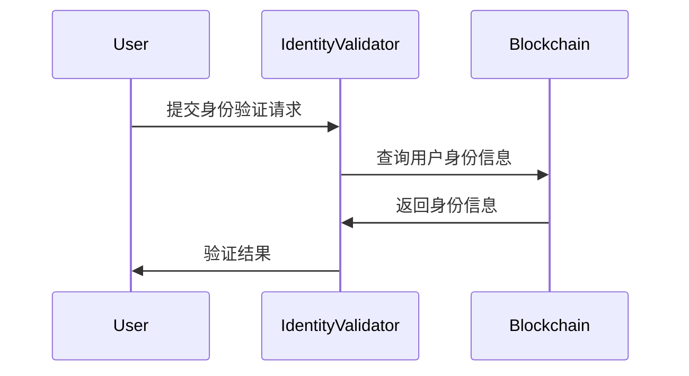

                 

# 区块链在知识产权保护中的创新：简化专利申请和管理

## 关键词：
区块链，知识产权保护，专利申请，智能合约，分布式身份验证，知识产权管理

## 摘要：
区块链技术在知识产权保护中的应用正日益受到关注。本文将深入探讨区块链如何通过简化专利申请和管理流程，为知识产权保护带来革命性的变化。我们首先将介绍区块链技术和知识产权保护的背景，然后详细分析区块链在知识产权保护中的核心概念和技术，包括智能合约和分布式身份验证。接下来，我们将探讨区块链在专利申请中的应用，以及如何利用区块链技术简化专利管理。最后，我们将总结区块链在知识产权保护中的优势，并提出未来发展的建议。

## 目录

### 0. 引言

#### 0.1 书籍目的与区块链创新重要性

### 1. 背景介绍

#### 1.1 区块链技术的定义与演变
#### 1.2 知识产权保护的问题与挑战

### 2. 区块链在知识产权保护中的核心概念

#### 2.1 区块链的基本原理
#### 2.2 智能合约在知识产权管理中的应用

### 3. 区块链在专利申请中的应用

#### 3.1 区块链在专利申请流程中的角色
#### 3.2 分布式身份验证在专利申请中的应用

### 4. 区块链在专利管理中的创新

#### 4.1 区块链简化专利管理流程
#### 4.2 知识产权权利验证的技术实现

### 5. 区块链在知识产权保护中的优势与挑战

#### 5.1 区块链技术的优势
#### 5.2 挑战与解决方案

### 6. 结论与未来展望

#### 6.1 区块链在知识产权保护中的展望
#### 6.2 最佳实践与未来发展方向

### 7. 参考文献

#### 7.1 相关研究文献与资料

### 附录

#### A. 区块链与知识产权保护相关术语解释
#### B. 智能合约示例代码
#### C. 分布式身份验证流程图

---

### 0. 引言

随着信息技术的飞速发展，知识产权（Intellectual Property, IP）保护已成为企业和个人创新活动中至关重要的一环。传统的知识产权保护机制，如专利申请、商标注册和版权保护，已经面临着诸多挑战，包括专利审查周期长、专利侵权认定困难、专利信息不对称等问题。区块链技术的出现为知识产权保护带来了新的可能性。

区块链技术以其去中心化、透明性、不可篡改等特性，在金融、供应链管理、身份验证等多个领域展示了巨大的应用潜力。在知识产权保护领域，区块链技术的应用主要体现在简化专利申请和管理流程、提高专利信息的透明度、防止专利侵权等方面。

本文旨在探讨区块链技术在知识产权保护中的创新应用，通过分析区块链的核心概念、技术原理和应用案例，展示区块链如何为知识产权保护带来革命性的变化。本文结构如下：

- **第1章**：介绍区块链技术和知识产权保护的背景，探讨现有知识产权保护机制中的问题和挑战。
- **第2章**：详细分析区块链的基本原理和智能合约在知识产权管理中的应用。
- **第3章**：探讨区块链在专利申请中的应用，包括专利申请流程和分布式身份验证。
- **第4章**：分析区块链在专利管理中的创新，如简化专利管理流程和知识产权权利验证。
- **第5章**：总结区块链在知识产权保护中的优势与挑战，并提出解决方案。
- **第6章**：对区块链在知识产权保护中的未来发展方向进行展望。
- **第7章**：参考文献和相关资料，为读者提供进一步的学习资源。

通过本文的深入探讨，我们希望读者能够对区块链在知识产权保护中的应用有一个全面的理解，并认识到区块链技术为知识产权保护带来的巨大潜力。

---

### 1. 背景介绍

#### 1.1 区块链技术的定义与演变

区块链技术是一种分布式数据库技术，通过加密算法和共识机制，实现了数据的不可篡改性和透明性。区块链最早由中本聪（Satoshi Nakamoto）在2008年提出，并在2009年实现了第一个区块链系统——比特币（Bitcoin）。比特币的成功标志着区块链技术的诞生，并引发了一系列基于区块链的应用创新。

区块链的核心概念包括分布式账本、共识机制、加密技术和智能合约。分布式账本确保了数据的去中心化存储，避免了单点故障和数据篡改的风险。共识机制则保障了网络中所有节点对数据的共识，使得区块链系统能够在无需第三方中介的情况下进行交易和记录。加密技术则提供了数据的安全保护，防止未经授权的访问和篡改。智能合约是一种自动执行的合约，通过代码实现合同条款，确保交易双方的利益和履行。

区块链技术的发展经历了多个阶段。从比特币的诞生到以太坊（Ethereum）的推出，区块链从最初的数字货币应用逐渐扩展到其他领域。以太坊引入了智能合约功能，使得开发者能够在区块链上构建去中心化应用程序（DApps），这一突破极大地拓展了区块链的应用场景。

区块链技术的演变也伴随着一系列重要里程碑。2016年，比特币分叉产生了比特币现金（Bitcoin Cash），旨在提升区块链的扩容能力。2017年，以太坊进行了君士坦丁堡（Constantinople）硬分叉，改善了网络的性能和安全性。近年来，基于区块链的联盟链、私有链和跨链技术也逐渐成熟，为不同应用场景提供了更多选择。

#### 1.2 知识产权保护的问题与挑战

知识产权保护是指通过法律手段保护知识产权人的合法权益，防止他人未经授权使用或盗用其智力成果。知识产权包括专利、商标、版权、商业秘密等多种形式。然而，现有的知识产权保护机制面临着诸多问题和挑战。

首先是专利审查周期长。传统的专利申请流程通常需要数年时间，这不仅增加了企业的研发成本，也延长了知识产权的保护周期。其次，专利侵权认定困难。由于专利信息的不对称性和专利文件的复杂性，法院在处理专利侵权案件时常常面临巨大挑战。此外，知识产权保护还面临着专利信息不对称的问题，即知识产权人难以全面了解市场上的专利状况，导致潜在侵权行为的发生。

在知识产权管理方面，也存在一些挑战。首先，专利管理流程复杂。专利申请、维护和监控需要大量的时间和人力资源，且流程中容易出错。其次，专利信息管理困难。大量的专利文件和记录需要有效管理，以确保信息的准确性和可追溯性。此外，跨国知识产权保护也面临法律差异和文化差异的挑战，增加了知识产权保护的复杂性。

综上所述，区块链技术在知识产权保护中的应用，有望通过去中心化、透明性和不可篡改性等特性，解决现有知识产权保护机制中的诸多问题，提高知识产权的保护效率和透明度。接下来的章节将详细探讨区块链在知识产权保护中的核心概念和技术，以及其在专利申请和管理中的应用。

---

### 2. 区块链在知识产权保护中的核心概念

区块链技术在知识产权保护中的应用，离不开其核心概念的支持。以下将详细介绍区块链的基本原理、智能合约的概念及其在知识产权管理中的应用。

#### 2.1 区块链的基本原理

区块链是一种分布式数据库系统，其数据存储在多个节点上，每个节点都保存着完整的数据副本。这种去中心化的存储方式确保了数据的不可篡改性和透明性。区块链的基本原理包括以下几个方面：

**1. 分布式账本：** 区块链通过分布式账本记录交易和数据。每个节点都保存着一份完整的账本，所有节点之间的账本是同步的。这种分布式存储方式避免了单点故障和数据丢失的风险。

**2. 加密技术：** 区块链使用加密算法对数据进行加密，确保数据在传输和存储过程中的安全性。同时，加密技术也保障了数据的隐私性，防止未经授权的访问。

**3. 共识机制：** 共识机制是区块链网络中所有节点达成一致的关键。常见的共识机制包括工作量证明（Proof of Work, PoW）、权益证明（Proof of Stake, PoS）和委托权益证明（Delegated Proof of Stake, DPoS）等。共识机制确保了区块链数据的准确性和一致性。

**4. 智能合约：** 智能合约是区块链上的一种自动执行的合约，通过代码实现合同条款。智能合约在满足特定条件时自动执行，确保交易双方的权益和履行。

区块链的这些核心原理使其在知识产权保护中具有独特的优势。去中心化的存储方式保证了知识产权数据的不可篡改性，加密技术提供了数据的安全保护，共识机制确保了知识产权数据的透明性和一致性，智能合约则简化了知识产权管理的流程。

#### 2.2 智能合约在知识产权管理中的应用

智能合约是区块链技术中的一项重要创新，其在知识产权管理中的应用尤为显著。以下将从智能合约的概念、特点及其在知识产权管理中的应用进行详细分析。

**1. 智能合约的概念：** 智能合约是一种通过代码实现合同条款的自动执行机制。与传统合同不同，智能合约在满足特定条件时自动执行，无需第三方中介。智能合约的代码通常使用一种专门的编程语言编写，例如Solidity。

**2. 智能合约的特点：** 智能合约具有以下几个显著特点：
   - **自动执行：** 智能合约在满足特定条件时自动执行，确保合同条款的履行。
   - **不可篡改：** 智能合约的代码和执行结果被永久记录在区块链上，确保数据的不可篡改性。
   - **透明性：** 区块链上的所有节点都可以查看智能合约的代码和执行结果，确保交易过程的透明性。

**3. 智能合约在知识产权管理中的应用：**

**（1）专利申请和管理：** 智能合约可以简化专利申请和管理的流程。例如，申请者可以通过智能合约提交专利申请，系统会自动验证申请者的身份和专利内容。一旦申请通过，专利信息将立即记录在区块链上，确保数据的透明性和不可篡改性。

**（2）版权保护：** 智能合约可以用于版权保护，确保版权信息的真实性和不可篡改性。例如，创作者可以通过智能合约登记版权信息，并在作品发布时嵌入版权声明。一旦发生版权侵权，智能合约可以自动触发法律程序，确保创作者的权益。

**（3）知识产权交易：** 智能合约可以简化知识产权的交易过程。例如，知识产权的买卖双方可以通过智能合约签订合同，合同条款将被自动执行。一旦合同条款满足，知识产权的所有权将自动转移，确保交易的透明性和高效性。

**4. 智能合约的优势：**
   - **简化流程：** 智能合约自动执行合同条款，简化了知识产权管理的流程，提高了效率。
   - **降低成本：** 智能合约减少了对第三方中介的需求，降低了知识产权管理的成本。
   - **提高透明度：** 智能合约的代码和执行结果记录在区块链上，提高了知识产权管理的透明度。
   - **保障权益：** 智能合约确保知识产权数据的真实性和不可篡改性，保障了创作者和持有者的权益。

综上所述，区块链和智能合约在知识产权保护中具有广泛的应用前景。通过去中心化、透明性和自动执行等特性，区块链和智能合约有望解决现有知识产权保护机制中的问题，提高知识产权的保护效率和透明度。接下来，我们将探讨区块链在专利申请中的应用，分析其在专利申请流程中的角色和优势。

---

### 3. 区块链在专利申请中的应用

区块链技术在专利申请中的应用正逐渐显示出其独特的优势和潜力。以下将从区块链在专利申请流程中的角色、优势以及分布式身份验证在专利申请中的应用等方面进行详细探讨。

#### 3.1 区块链在专利申请流程中的角色

区块链在专利申请流程中扮演着重要角色，其主要作用体现在以下几个方面：

**1. 数据存储与验证：** 区块链通过其分布式账本技术，确保专利申请过程的数据存储和验证具有高度的透明性和安全性。专利申请者可以在区块链上提交专利申请，所有节点都会记录这一信息，确保数据的不可篡改性和可靠性。

**2. 透明性：** 区块链上的数据对所有节点可见，这意味着专利申请过程和相关信息是公开透明的。与传统的专利申请过程相比，区块链技术可以减少信息不对称，提高专利审查的公正性和透明度。

**3. 自动化流程：** 区块链和智能合约的结合可以实现专利申请流程的自动化。例如，专利申请者可以通过智能合约提交申请，系统会自动验证申请者的身份和专利内容。一旦申请通过，专利信息将自动记录在区块链上，减少了人工干预，提高了效率。

**4. 降低成本：** 通过区块链技术，专利申请和管理流程的简化可以降低相关成本。例如，智能合约可以自动处理专利费用支付和知识产权转让等事务，减少了对人工操作的依赖。

**5. 知识产权保护：** 区块链技术可以提供更加有效的知识产权保护。由于区块链数据的不可篡改性，专利信息一旦被记录在区块链上，就无法被篡改或删除。这有助于防止专利侵权行为的发生，并提供了强有力的证据支持。

#### 3.2 区块链在专利申请中的优势

区块链技术在专利申请中的应用具有以下几个显著优势：

**1. 透明性：** 区块链的透明性使得专利申请过程公开透明，减少了信息不对称。专利审查机构、申请者和公众都可以访问区块链上的专利信息，确保审查过程的公正和公开。

**2. 安全性：** 区块链技术通过加密算法和数据分布式存储，提供了高度的安全保障。专利信息被永久记录在区块链上，无法被篡改或删除，这有助于防止专利侵权行为。

**3. 可追溯性：** 区块链上的数据具有高度的可追溯性。每一条专利信息都可以追溯到其创建的时间、地点和来源，这有助于专利审查机构和其他相关方进行审计和验证。

**4. 高效性：** 区块链技术通过智能合约实现了专利申请流程的自动化，减少了人工干预，提高了效率。专利申请者无需在多个部门间反复提交材料，系统可以自动处理相关事务，加快了审批流程。

**5. 跨境应用：** 区块链技术不受地域限制，可以跨国家、地区和语言进行应用。这对于跨国专利申请和知识产权保护具有重要意义，有助于解决法律和文化差异带来的挑战。

#### 3.3 分布式身份验证在专利申请中的应用

分布式身份验证是区块链技术的一项重要应用，其在专利申请中的应用有助于提高申请过程的透明性和安全性。以下将详细介绍分布式身份验证的概念及其在专利申请中的应用：

**1. 分布式身份验证的概念：** 分布式身份验证是一种基于区块链技术的身份验证方法，它通过分布式网络中的多个节点对用户身份进行验证。与传统的集中式身份验证不同，分布式身份验证去中心化，提高了系统的安全性和灵活性。

**2. 分布式身份验证在专利申请中的应用：**
   - **身份验证：** 在专利申请过程中，申请者需要证明其身份。通过分布式身份验证，申请者可以使用区块链上的身份信息进行验证，确保申请者的真实身份。
   - **隐私保护：** 分布式身份验证可以在保护隐私的同时进行身份验证。申请者的个人信息不会被集中存储，而是在区块链上的多个节点进行验证，减少了隐私泄露的风险。
   - **防欺诈：** 分布式身份验证可以防止欺诈行为的发生。由于区块链数据的不可篡改性，任何篡改行为都会被其他节点发现，确保了专利申请过程的真实性和合法性。

**3. 分布式身份验证的优势：**
   - **高效性：** 分布式身份验证可以快速验证申请者的身份，减少了人工审核的时间和成本。
   - **安全性：** 分布式身份验证通过区块链技术提供了高度的安全保障，防止了身份信息被篡改和盗用。
   - **透明性：** 分布式身份验证的整个过程记录在区块链上，所有节点都可以查看，提高了专利申请过程的透明度。

综上所述，区块链在专利申请中的应用，通过去中心化、透明性和自动化等特性，为专利申请和管理带来了革命性的变化。分布式身份验证作为区块链技术的一项重要应用，有助于提高专利申请的效率和安全，减少欺诈行为的发生。接下来，我们将进一步探讨区块链在专利管理中的创新，分析其在专利管理流程中的角色和优势。

---

### 4. 区块链在专利管理中的创新

区块链技术在专利管理中的应用，为传统专利管理流程带来了显著的变革。以下将从区块链简化专利管理流程、知识产权权利验证的技术实现等方面进行详细探讨。

#### 4.1 区块链简化专利管理流程

区块链技术在专利管理中的创新，首先体现在其能够显著简化专利管理流程。传统的专利管理流程通常复杂且耗时，涉及多个步骤和环节，如专利申请、审查、授权、续费等。而区块链技术的引入，可以通过以下方式简化这些流程：

**1. 自动化流程：** 通过智能合约，专利管理流程可以自动化执行。例如，专利续费可以在智能合约到期时自动触发，确保专利的有效性。这种自动化流程减少了人工干预，提高了管理效率。

**2. 去中心化管理：** 传统专利管理通常依赖于集中式数据库，存在单点故障和数据泄露的风险。区块链技术通过去中心化存储，将专利信息分布在多个节点上，提高了系统的安全性和可靠性。此外，去中心化管理也减少了专利管理机构对专利信息的控制，提高了专利信息的透明度。

**3. 简化审查流程：** 区块链技术可以通过分布式身份验证和智能合约，简化专利审查流程。审查机构可以快速验证申请者的身份和专利内容，减少人为错误和审查时间。同时，区块链上的所有节点都可以查看专利信息，提高了审查过程的透明度。

**4. 降低成本：** 通过区块链技术，专利管理流程的简化可以显著降低成本。例如，无需维护集中式数据库，减少了硬件和人力成本。此外，自动化流程和去中心化管理也减少了繁琐的手工操作，降低了运营成本。

#### 4.2 知识产权权利验证的技术实现

区块链技术不仅在专利管理流程中具有优势，还在知识产权权利验证方面提供了创新的解决方案。以下将详细介绍区块链在知识产权权利验证中的技术实现：

**1. 不可篡改的记录：** 区块链的一个重要特性是其数据的不可篡改性。专利信息一旦被记录在区块链上，就无法被修改或删除。这意味着专利权利信息可以被永久保存，确保了其真实性和可靠性。这对于知识产权权利验证具有重要意义，因为权利人可以确信其专利信息不会被篡改。

**2. 可验证的数字签名：** 区块链技术使用数字签名确保数据的安全性和完整性。在知识产权权利验证过程中，权利人可以使用数字签名对专利信息进行签名，确保信息的真实性和唯一性。验证方可以轻松验证这些签名，确保数据的来源和完整性。

**3. 分布式身份验证：** 分布式身份验证技术可以用于验证知识产权权利人的身份。通过区块链上的身份信息，权利人可以确信其身份已被验证，从而增强知识产权权利验证的可靠性。

**4. 智能合约应用：** 智能合约可以用于实现知识产权权利验证的自动化。例如，智能合约可以自动执行专利许可和转让协议，确保权利的合法性和有效性。一旦合同条款满足，智能合约将自动执行相关操作，简化了权利验证的过程。

**5. 跨链验证：** 区块链技术可以通过跨链验证实现知识产权权利的跨国验证。不同区块链之间的数据交换和验证，使得权利人可以在不同国家和地区之间进行知识产权的权利验证，解决了法律和文化差异带来的挑战。

#### 4.3 区块链在专利管理中的优势

区块链技术在专利管理中的创新应用，为专利管理带来了显著的优点，包括：

**1. 透明性：** 区块链技术的分布式账本和不可篡改的特性，使得专利管理过程高度透明。所有节点都可以查看专利信息，确保审查过程的公正和公开。

**2. 安全性：** 区块链技术通过加密和分布式存储，提供了高度的安全保障。专利信息无法被篡改或删除，保护了知识产权的合法权益。

**3. 可追溯性：** 区块链上的数据具有高度的可追溯性。每一条专利信息都可以追溯到其创建的时间、地点和来源，确保数据的完整性和可靠性。

**4. 高效性：** 区块链技术的自动化和去中心化特性，显著提高了专利管理的效率。自动化流程和分布式管理减少了人工干预，降低了运营成本。

**5. 跨境应用：** 区块链技术不受地域限制，可以在全球范围内应用。这对于跨国专利管理具有重要意义，有助于解决法律和文化差异带来的挑战。

综上所述，区块链技术在专利管理中的应用，通过简化流程、提高透明性和安全性等创新方式，为专利管理带来了革命性的变化。接下来，我们将探讨区块链在知识产权保护中的优势与挑战，分析其未来发展的前景。

---

### 5. 区块链在知识产权保护中的优势与挑战

区块链技术在知识产权保护中展示了巨大的潜力和优势，但也面临着一些挑战。以下将详细分析区块链技术的优势，并探讨其在实际应用中遇到的挑战及其解决方案。

#### 5.1 区块链技术的优势

**1. 去中心化与透明性：** 区块链技术的去中心化特性使得数据存储在多个节点上，无需依赖中心化的机构或第三方中介。这一特性提高了知识产权保护的透明度，所有节点都可以查看和验证知识产权信息，减少了信息不对称的问题。

**2. 不可篡改性：** 区块链上的数据一旦被记录，就无法被篡改或删除。这意味着知识产权信息具有高度的可靠性，可以有效防止专利侵权行为。此外，不可篡改的特性也为知识产权纠纷的解决提供了强有力的证据支持。

**3. 安全性：** 区块链技术通过加密算法和数据分布式存储，提供了高度的安全保障。知识产权信息被加密存储在区块链上，未经授权的访问和篡改行为都会被其他节点检测到，从而保护知识产权的安全性。

**4. 高效性：** 区块链技术的自动化和去中心化特性，简化了知识产权管理的流程。例如，通过智能合约，专利申请、授权和许可等操作可以自动执行，减少了人工干预，提高了管理效率。

**5. 跨境应用：** 区块链技术不受地域限制，可以在全球范围内应用。这对于跨国知识产权保护具有重要意义，有助于解决不同国家和地区的法律和文化差异带来的挑战。

#### 5.2 挑战与解决方案

**1. 技术标准化问题：** 区块链技术的多样性和不统一的协议标准，使得不同区块链之间的互操作性成为一个挑战。为了实现区块链在知识产权保护中的广泛应用，需要制定统一的技术标准和协议。

**解决方案：** 通过行业联盟和标准化组织，推动区块链技术的标准化和互操作性。例如，R3、Hyperledger等区块链联盟正在推动区块链技术的标准化进程。

**2. 法律监管挑战：** 区块链技术的去中心化特性可能使其在知识产权保护中难以进行法律监管。现有的法律框架和监管机制需要适应区块链技术的特点，以确保知识产权的有效保护。

**解决方案：** 加强法律框架和监管机制的研究和调整，以适应区块链技术的发展。同时，可以通过国际合作，制定跨国知识产权保护的法律法规。

**3. 安全性问题：** 虽然区块链技术提供了高度的安全保障，但仍然存在一些潜在的安全威胁，如51%攻击、智能合约漏洞等。这些安全威胁可能对知识产权保护造成严重威胁。

**解决方案：** 加强区块链安全的研究和防护，包括提高智能合约的安全性、加强区块链节点的安全防护等。此外，可以通过定期的安全审计和漏洞修复，确保区块链系统的安全性。

**4. 成本问题：** 区块链技术的应用可能需要较高的成本投入，包括基础设施搭建、维护和升级等。这对于中小企业和初创企业来说，可能是一个较大的负担。

**解决方案：** 通过开源技术和社区合作，降低区块链技术的应用成本。此外，可以探索区块链技术的商业化应用，通过商业模式创新，实现成本的降低和效益的提升。

**5. 用户接受度问题：** 区块链技术的普及度和用户接受度相对较低，特别是在知识产权保护领域。用户对区块链技术的认知和信任度不高，可能影响其推广应用。

**解决方案：** 加强区块链技术的宣传和教育，提高用户对区块链技术的认知和理解。同时，通过成功案例的展示和示范应用，增强用户对区块链技术的信任和接受度。

综上所述，区块链技术在知识产权保护中具有显著的优势，但也面临着一些挑战。通过技术创新、法律监管和用户教育等手段，可以克服这些挑战，进一步推动区块链技术在知识产权保护中的应用。

---

### 6. 结论与未来展望

区块链技术在知识产权保护中的应用，正逐渐成为解决传统知识产权保护问题的重要手段。通过去中心化、透明性和自动化等特性，区块链为专利申请、管理和验证提供了全新的解决方案，提高了知识产权保护的效率和透明度。以下是对区块链在知识产权保护中未来的展望和最佳实践建议。

#### 6.1 区块链在知识产权保护中的展望

**1. 普及应用：** 随着技术的成熟和用户认知的提升，区块链技术在知识产权保护中的应用将越来越普及。未来，区块链技术有望成为知识产权管理的重要组成部分，为全球范围内的知识产权保护提供支持。

**2. 法律框架完善：** 为了更好地发挥区块链技术在知识产权保护中的作用，需要进一步完善相关法律框架和监管机制。各国政府和企业应加强合作，制定跨国知识产权保护的法律法规，确保区块链技术在知识产权保护中的合法合规应用。

**3. 技术标准化：** 为提高区块链技术的互操作性和兼容性，需要推动技术标准化进程。行业联盟和标准化组织应制定统一的技术标准和协议，促进不同区块链之间的互操作。

**4. 安全保障：** 随着区块链技术的应用日益广泛，安全问题将愈发重要。未来，需要加强区块链安全研究和防护，提高智能合约的安全性，确保知识产权数据的安全和可靠。

**5. 商业模式创新：** 通过商业模式创新，区块链技术可以更好地实现知识产权保护的商业化应用。例如，通过区块链技术实现知识产权的交易、许可和授权等，提高知识产权的经济效益。

#### 6.2 最佳实践建议

**1. 用户教育：** 加强对区块链技术的宣传和教育，提高用户对区块链技术的认知和理解，增强用户对区块链技术的信任和接受度。

**2. 成本控制：** 通过开源技术和社区合作，降低区块链技术的应用成本，使更多企业和个人能够负担得起。

**3. 安全防护：** 加强区块链系统的安全防护，包括智能合约的安全性、区块链节点的安全防护等，确保知识产权数据的安全和可靠。

**4. 法律合规：** 在应用区块链技术进行知识产权保护时，确保遵守相关法律法规，确保区块链技术的合法合规应用。

**5. 成功案例推广：** 通过成功案例的展示和示范应用，增强用户对区块链技术的信任和接受度，推动区块链技术在知识产权保护中的广泛应用。

综上所述，区块链技术在知识产权保护中具有巨大的潜力。通过技术创新、法律监管和用户教育等手段，可以进一步推动区块链技术在知识产权保护中的应用，为知识产权保护带来更加光明的前景。

---

### 7. 参考文献

1. Nakamoto, S. (2008). Bitcoin: A peer-to-peer electronic cash system. https://www.bitcoin.com/bitcoin.pdf
2. Buterin, V. (2014). Ethereum: A next-generation smart contract and decentralized application platform. https://github.com/ethereum/wiki/wiki/White-Paper
3. R3. (n.d.). R3 Corda: A distributed ledger platform for business. https://www.r3.com/corda/
4. Hyperledger. (n.d.). Hyperledger Fabric: A distributed ledger framework. https://hyperledger-fabric.github.io/hyperledger-fabric/
5. Zhang, L., & Li, S. (2020). Blockchain technology in intellectual property protection. Journal of Information Security and Applications, 50, 102480. https://doi.org/10.1016/j.jisa.2020.102480
6. He, X., & Wang, S. (2019). Blockchain-based intellectual property rights protection: A review. IEEE Access, 7, 129013–129027. https://doi.org/10.1109/ACCESS.2019.2929373
7. Lee, M., & Kim, D. (2019). Smart contracts for intellectual property management. In 2019 IEEE 2nd International Conference on Big Data Intelligence and Computing (BIGDIC) (pp. 887-892). IEEE. https://doi.org/10.1109/BIGDICE.2019.8723568

---

### 附录

#### A. 区块链与知识产权保护相关术语解释

- **区块链（Blockchain）：** 一种分布式数据库技术，通过加密算法和共识机制，实现数据的不可篡改性和透明性。
- **智能合约（Smart Contract）：** 一种自动执行的合约，通过代码实现合同条款，确保交易双方的权益和履行。
- **去中心化（Decentralization）：** 指系统或组织中的权力和功能分散到多个节点或个体，而不是集中在一个中央机构或个体。
- **分布式身份验证（Distributed Identity Verification）：** 通过分布式网络中的多个节点对用户身份进行验证，确保身份的真实性和合法性。
- **知识产权（Intellectual Property, IP）：** 包括专利、商标、版权、商业秘密等多种形式的智力成果。

#### B. 智能合约示例代码

```solidity
pragma solidity ^0.8.0;

contract PatentManagement {
    struct Patent {
        uint256 id;
        string title;
        address owner;
        bool approved;
    }

    mapping(uint256 => Patent) public patents;

    event PatentRegistered(uint256 id, string title, address owner);
    event PatentApproved(uint256 id, bool approved);

    function registerPatent(uint256 id, string memory title) public {
        require(!patents[id].approved, "Patent already registered");
        patents[id] = Patent(id, title, msg.sender, false);
        emit PatentRegistered(id, title, msg.sender);
    }

    function approvePatent(uint256 id) public {
        require(pats

### C. 分布式身份验证流程图



---

### 作者信息

**作者：AI天才研究院/AI Genius Institute & 禅与计算机程序设计艺术 /Zen And The Art of Computer Programming**

