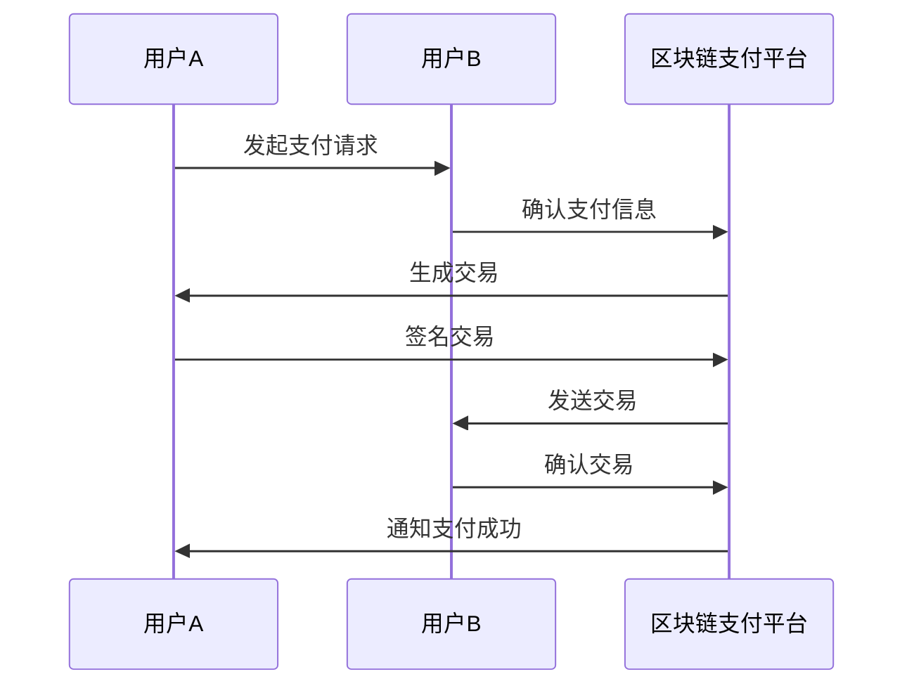
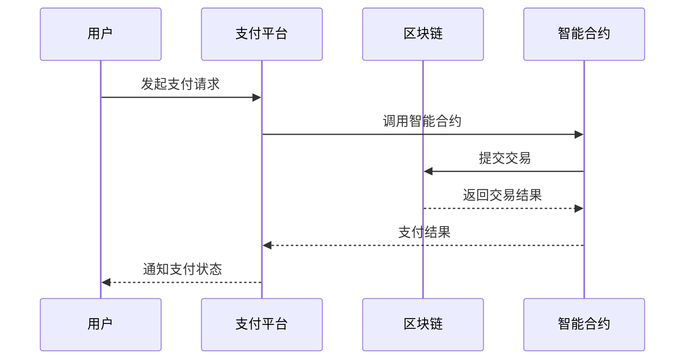

                 

# 区块链在跨境支付中的去中心化应用

## 关键词

- 区块链
- 跨境支付
- 去中心化
- 数字货币
- 智能合约

## 摘要

本文将探讨区块链技术在跨境支付中的应用，特别是其去中心化的特性如何改变传统支付系统的运作方式。首先，我们将简要介绍区块链、去中心化系统和跨境支付的相关概念，然后深入分析区块链在跨境支付中的优势、技术原理和实际应用。通过实际案例的分析，我们将展示区块链如何实现高效、安全的跨境支付，并讨论其在当前金融体系中的挑战和未来发展趋势。

## 背景介绍

### 核心概念术语说明

- **区块链（Blockchain）**：一种分布式账本技术，通过加密算法确保数据的不可篡改性和透明性。
- **去中心化（Decentralization）**：权力和信息分布在一个网络中，而不是集中在单一的实体或中心服务器上。
- **跨境支付（Cross-Border Payments）**：涉及不同国家或地区之间的货币转移过程。
- **数字货币（Cryptocurrency）**：一种基于区块链技术的数字资产，如比特币和以太币。

### 问题背景

随着全球化的加深，跨境支付的需求日益增长。然而，传统的跨境支付系统存在多个问题：

- **高昂的费用**：传统跨境支付通常涉及多个中介机构，导致交易成本较高。
- **缓慢的处理速度**：跨境支付往往需要数天时间才能完成，影响用户体验。
- **低透明度**：由于涉及多个中介机构，交易过程不透明，难以追踪。

### 问题描述

传统跨境支付系统的低效率和高成本主要源于其集中化和中介化的特点。这些问题导致了用户体验差，同时也为犯罪活动提供了可乘之机。去中心化的区块链技术提供了一种潜在的解决方案。

### 问题解决

区块链技术通过以下方式解决跨境支付中的问题：

- **去中心化**：通过消除中介机构，降低交易成本。
- **透明度**：所有交易信息都记录在区块链上，提高了交易的透明度和可追溯性。
- **安全性**：区块链的加密算法确保了交易数据的安全。

### 边界与范围

本文将主要探讨区块链在跨境支付中的应用，涵盖数字货币和智能合约的使用，但不涉及区块链在其他领域的应用。

### 概念框架和关键组成部分

- **区块链网络**：由多个节点组成，共同维护账本的一致性。
- **加密算法**：确保数据的安全性和隐私性。
- **智能合约**：自动化执行合同条款的计算机程序。
- **数字货币**：用于跨境支付的价值转移媒介。

## 核心概念和关系

### 区块链基础

区块链是一种分布式数据库，其特点是去中心化、不可篡改和透明。区块链由一系列按时间顺序排列的数据块组成，每个数据块都包含一定数量的交易记录。

| 特性         | 描述                                       |
| ------------ | ------------------------------------------ |
| 去中心化     | 数据存储在分布式网络中，没有中央控制节点。 |
| 不可篡改     | 数据一旦被写入区块链，就无法更改。         |
| 透明性       | 所有交易信息都公开可查。                   |

### 去中心化系统

去中心化系统通过分布式网络来实现任务的自动化，不依赖单一中心控制节点。去中心化系统的优点包括：

- **抗审查性**：无法通过关闭单一节点来停止系统运作。
- **透明性**：所有参与者都可以查看和验证系统状态。
- **可靠性**：系统的健壮性取决于整个网络的参与度。

### 跨境支付

跨境支付是指在不同国家和地区之间转移资金的过程。传统跨境支付系统涉及多个中介机构，如银行和支付服务提供商。这些中介机构的存在导致了交易成本高、处理速度慢的问题。

### 关系和互联

区块链技术在跨境支付中的应用，主要是通过数字货币和智能合约来实现去中心化的支付。数字货币作为价值转移的媒介，可以绕过传统金融系统，实现快速、低成本的跨境支付。智能合约则用于自动化执行支付合同条款，确保交易的透明性和安全性。

## 技术和应用程序

### 区块链在跨境支付中的应用

区块链技术为跨境支付提供了一种去中心化的解决方案，通过以下方式实现：

- **去中心化交易**：通过区块链网络中的节点，实现交易的去中介化。
- **加密货币支付**：使用加密货币，如比特币或以太币，进行跨境支付。
- **智能合约**：用于自动化执行支付合同条款。

### 去中心化金融（DeFi）

去中心化金融（DeFi）是指利用区块链技术构建的金融应用，实现金融服务的去中心化。DeFi应用包括借贷、交易、支付等多种金融服务，无需依赖传统金融中介机构。

### 智能合约

智能合约是区块链上的计算机程序，用于自动化执行合同条款。智能合约确保了交易的透明性和不可篡改性，提高了跨境支付的安全性和效率。

### 共识机制

共识机制是区块链网络中用于达成一致性的算法。在跨境支付中，常用的共识机制包括工作量证明（PoW）和权益证明（PoS）等。共识机制确保了区块链网络的稳定运行和数据一致性。

## 算法和模型

### 算法原则

区块链在跨境支付中的应用主要通过以下算法实现：

1. **哈希函数**：用于确保数据的安全性和不可篡改性。
2. **加密算法**：用于保护交易数据的隐私。
3. **共识算法**：如PoW和PoS，用于达成区块链网络中的共识。

### Mermaid流程图

以下是一个简单的区块链支付流程的Mermaid流程图：



### 数学模型和公式

区块链支付系统的数学模型主要涉及以下方面：

- **交易费用**：$$f = a \times n + b$$，其中a和b为常数，n为交易包含的数据量。
- **确认时间**：$$t_c = T \times n$$，其中T为每个区块的生成时间，n为待确认的交易数量。

### 例子说明

假设一个区块链支付系统每10分钟生成一个新区块，交易费用为每次交易0.01美元，且数据量不影响费用。用户A向用户B支付10美元，需要多少时间才能得到确认？

- **确认时间**：$$t_c = 10 \times 10 = 100$$ 分钟，即1.67小时。

## 系统分析与设计

### 系统概述和项目描述

本系统是一个基于区块链技术的跨境支付平台，旨在提供快速、低成本、安全可靠的跨境支付服务。系统设计包括用户界面、区块链网络、智能合约和后端服务器等组成部分。

### 功能设计（Mermaid类图）

以下是一个简单的Mermaid类图，描述了系统的主要功能组件：

```mermaid
classDiagram
    User <<类>> User
    PaymentPlatform <<类>> PaymentPlatform
    Blockchain <<类>> Blockchain
    SmartContract <<类>> SmartContract
    Server <<类>> Server
    
    User o-- PaymentPlatform
    PaymentPlatform o-- Blockchain
    PaymentPlatform o-- SmartContract
    PaymentPlatform o-- Server
    Blockchain o-- SmartContract
    Server o-- Blockchain
```

### 系统架构设计（Mermaid架构图）

以下是一个简单的Mermaid架构图，描述了系统的整体架构：


### 系统接口设计和系统交互（Mermaid序列图）

以下是一个简单的Mermaid序列图，描述了用户与支付平台之间的交互过程：



## 案例研究与实践应用

### 案例研究1

#### 项目简介

案例研究1是基于区块链技术的跨境支付平台，旨在为跨境电商提供高效、安全的支付解决方案。平台支持多种加密货币，如比特币和以太币，实现了快速、低成本的跨境支付。

#### 系统核心实现

系统核心实现包括以下部分：

1. **用户界面**：提供支付请求、交易查询等功能。
2. **区块链网络**：采用以太坊区块链，支持智能合约。
3. **智能合约**：实现支付请求的处理和交易确认。
4. **后端服务器**：处理用户请求，与区块链网络交互。

#### 代码应用解读与分析

以下是一个简单的智能合约示例，用于处理支付请求：

```python
pragma solidity ^0.8.0;

contract Payment {
    mapping(address => uint256) public balance;

    function sendPayment(address receiver, uint256 amount) public {
        require(balance[msg.sender] >= amount, "Insufficient balance");
        balance[msg.sender] -= amount;
        balance[receiver] += amount;
        emit PaymentSent(msg.sender, receiver, amount);
    }

    event PaymentSent(address sender, address receiver, uint256 amount);
}
```

该智能合约的核心功能是处理支付请求，包括检查发送方的余额、扣除余额并增加接收方的余额。该示例使用了以太坊的Solidity编程语言。

#### 实际案例分析和详细讲解剖析

案例研究1展示了区块链技术在跨境支付中的应用，通过去中心化的方式实现了快速、低成本的支付。然而，该案例也存在一些挑战，如加密货币的价格波动对支付稳定性的影响。未来，随着区块链技术的成熟，这些问题有望得到解决。

### 案例研究2

#### 项目简介

案例研究2是基于Ripple区块链的跨境支付平台，旨在为银行和金融机构提供高效、安全的支付解决方案。平台支持实时跨境支付，并实现了跨币种的直接兑换。

#### 系统核心实现

系统核心实现包括以下部分：

1. **区块链网络**：采用Ripple的共识算法，支持跨行交易。
2. **支付网关**：连接银行和区块链网络，处理支付请求。
3. **智能合约**：实现支付请求的处理和交易确认。
4. **后端服务器**：处理用户请求，与区块链网络交互。

#### 代码应用解读与分析

以下是一个简单的Ripple智能合约示例，用于处理支付请求：

```python
pragma solidity ^0.8.0;

contract RipplePayment {
    mapping(address => uint256) public balance;

    function sendPayment(address receiver, uint256 amount) public {
        require(balance[msg.sender] >= amount, "Insufficient balance");
        balance[msg.sender] -= amount;
        balance[receiver] += amount;
        emit PaymentSent(msg.sender, receiver, amount);
    }

    event PaymentSent(address sender, address receiver, uint256 amount);
}
```

该智能合约与案例研究1的智能合约类似，但采用了Ripple的编程语言。

#### 实际案例分析和详细讲解剖析

案例研究2展示了区块链技术在跨境支付中的另一应用场景，通过Ripple区块链实现了实时跨境支付和跨币种兑换。该案例的优点是支付速度快、成本低，但缺点是依赖于特定区块链网络的稳定性。未来，随着Ripple区块链的发展，这些问题有望得到解决。

## 最佳实践、总结和结论

### 最佳实践

- **选择合适的区块链平台**：根据业务需求和区块链特性选择合适的平台，如以太坊、Ripple等。
- **优化智能合约**：确保智能合约的效率和安全性，减少潜在的风险。
- **遵守法律法规**：在跨境支付中遵守相关国家和地区的法律法规。
- **提高用户教育**：提高用户对区块链和数字货币的认知，增强用户信任。

### 总结

本文探讨了区块链技术在跨境支付中的应用，特别是其去中心化的特性如何改变传统支付系统的运作方式。通过实际案例的分析，我们展示了区块链如何实现高效、安全的跨境支付。尽管存在一些挑战，但区块链技术在跨境支付中的应用前景广阔。

### 结论

区块链技术为跨境支付提供了一种新的解决方案，通过去中心化的方式提高了支付的效率和安全。未来，随着区块链技术的不断发展和完善，跨境支付将变得更加高效、便捷和安全。

## 作者信息

作者：AI天才研究院/AI Genius Institute & 禅与计算机程序设计艺术 /Zen And The Art of Computer Programming

## 拓展阅读

- **《区块链技术指南》**：深入介绍区块链的基础知识、技术和应用。
- **《智能合约开发实战》**：学习如何使用智能合约构建去中心化应用。
- **《Ripple技术与实战》**：探讨Ripple区块链在跨境支付中的应用。

