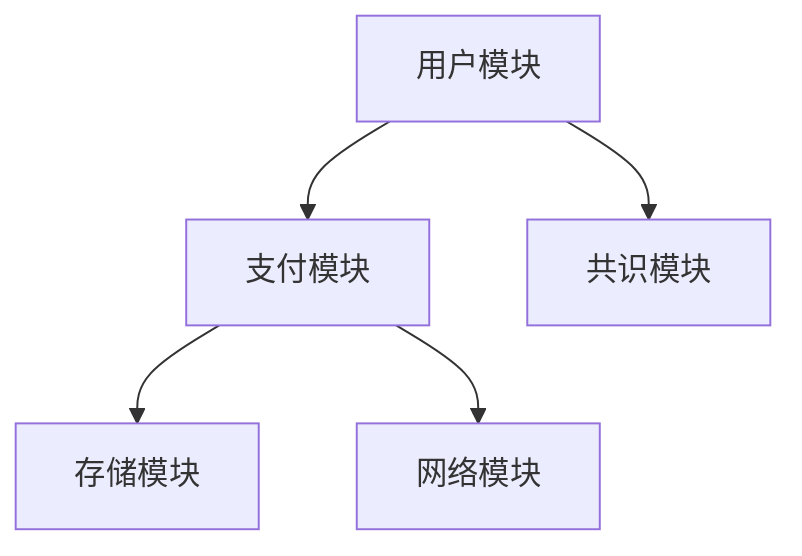

                 

# 区块链在跨境支付中的去中心化应用

> 关键词：区块链、跨境支付、去中心化、分布式账本、智能合约、比特币、Ripple、Stellar

> 摘要：本文深入探讨了区块链技术在跨境支付中的应用，特别是在去中心化领域的优势。通过对区块链基础技术、跨境支付现状、应用案例、系统设计、创新应用以及未来发展趋势的详细分析，为区块链在跨境支付中的实际应用提供了理论和实践参考。

## 目录大纲设计

### 第1章 引言

### 1.1 跨境支付背景

### 1.2 区块链技术概述

### 1.3 去中心化应用原理

### 1.4 区块链在跨境支付中的应用优势

### 1.5 本章小结

### 第2章 区块链技术基础

### 2.1 区块链概述

### 2.2 分布式账本技术

### 2.3 共识算法

### 2.4 智能合约

### 2.5 非同质化代币（NFT）

### 2.6 本章小结

### 第3章 跨境支付现状与挑战

### 3.1 传统跨境支付体系

### 3.2 跨境支付存在的问题

### 3.3 区块链技术如何解决这些问题

### 3.4 本章小结

### 第4章 去中心化跨境支付应用案例

### 4.1 案例一：比特币在跨境支付中的应用

### 4.2 案例二：Ripple网络在跨境支付中的应用

### 4.3 案例三：Stellar网络的跨境支付应用

### 4.4 本章小结

### 第5章 去中心化跨境支付系统设计

### 5.1 系统需求分析

### 5.2 系统架构设计

### 5.3 智能合约设计

### 5.4 风险管理策略

### 5.5 本章小结

### 第6章 区块链技术在跨境支付中的创新应用

### 6.1 跨境支付与物联网的结合

### 6.2 跨境支付与人工智能的结合

### 6.3 跨境支付与大数据的结合

### 6.4 本章小结

### 第7章 未来发展趋势与挑战

### 7.1 未来发展趋势分析

### 7.2 潜在挑战与应对策略

### 7.3 政策法规环境对区块链跨境支付的影响

### 7.4 本章小结

### 附录

### 7.5 拓展阅读

### 7.6 参考文献

## 第1章 引言

随着全球化的加速，跨境支付的需求日益增长。跨境支付不仅涉及个人和企业的跨国交易，还包括国际贸易和投资活动，是现代经济不可或缺的一环。然而，当前的跨境支付体系存在诸多问题，如交易时间长、手续费高、信任风险等。区块链技术的出现为解决这些问题提供了新的思路。

区块链是一种去中心化的分布式账本技术，具有安全性高、透明度强、不可篡改等特点。去中心化意味着没有中央机构控制，交易参与者之间直接进行交互，从而降低了交易成本和信任风险。本文将深入探讨区块链在跨境支付中的应用，分析其优势与挑战，为去中心化跨境支付系统的设计提供理论支持。

### 1.1 跨境支付背景

跨境支付是指在国与国之间进行的货币交换过程。随着国际贸易和全球经济的不断发展，跨境支付的重要性日益凸显。传统的跨境支付体系通常依赖于银行和其他金融机构，这些机构在跨国交易中扮演着中介角色。然而，这一体系存在以下问题：

- **交易时间长**：由于需要经过多个中介机构的处理，跨境支付往往耗时较长，有时甚至需要数天。
- **手续费高**：银行和其他金融机构通常会收取较高的手续费，这增加了交易成本。
- **信任风险**：跨境支付过程中涉及多个中介机构，增加了信任风险，如洗钱、欺诈等。
- **信息透明度低**：由于缺乏透明度，跨境支付过程中的信息难以追踪和验证。

这些问题限制了跨境支付的发展，使得寻找更加高效、安全和低成本的解决方案变得迫切。

### 1.2 区块链技术概述

区块链是一种分布式账本技术，其核心特点是去中心化、安全性高、透明性强、不可篡改。区块链的工作原理基于一系列按时间顺序排列的区块，每个区块都包含一定数量的交易记录。这些区块通过加密算法连接在一起，形成一条连续的链条。

在区块链中，每个节点都保存了一份完整的账本副本，节点之间通过共识算法（如工作量证明、权益证明等）达成一致。这种机制确保了数据的真实性和完整性，同时去除了中央机构的依赖。

区块链的关键技术包括：

- **分布式账本**：分布式账本技术使数据存储在多个节点上，每个节点都有完整的数据副本，提高了系统的容错性和安全性。
- **加密算法**：区块链使用加密算法来保护数据的隐私和安全，确保交易信息的不可篡改。
- **智能合约**：智能合约是一种自动执行的合同，通过编程代码定义，当满足特定条件时自动执行相应的操作。

区块链技术具有以下优势：

- **去中心化**：去中心化消除了对中央机构的依赖，降低了交易成本和信任风险。
- **安全性高**：区块链使用加密算法和共识算法确保数据的真实性和完整性。
- **透明性强**：区块链的数据是公开透明的，所有参与者都可以验证和审计交易信息。
- **不可篡改**：区块链的数据一旦写入，就几乎无法更改，保证了数据的可信度。

### 1.3 去中心化应用原理

去中心化应用（DApps）是区块链技术的一种应用形式，其核心思想是去除了传统应用程序中依赖中央服务器的环节。在去中心化应用中，所有功能都通过区块链上的智能合约实现，用户可以直接在区块链上进行操作。

去中心化应用的基本原理如下：

- **用户交互**：用户通过客户端与应用程序进行交互，发送请求和接收响应。
- **智能合约**：智能合约是区块链上的程序代码，根据用户请求自动执行相应的操作，如处理交易、记录数据等。
- **分布式账本**：所有交易记录都记录在区块链上，每个节点都保存一份完整的数据副本。
- **共识机制**：节点之间通过共识算法达成一致，确保交易记录的真实性和完整性。

去中心化应用具有以下特点：

- **去中心化**：去中心化消除了对中央服务器的依赖，提高了系统的可靠性和安全性。
- **安全性高**：智能合约和区块链技术确保了数据的真实性和不可篡改性。
- **透明性强**：所有交易记录都公开透明，用户可以随时审计和验证。
- **去信任化**：去中心化应用消除了对第三方机构的信任需求，降低了信任风险。

### 1.4 区块链在跨境支付中的应用优势

区块链技术为跨境支付带来了诸多优势，使其成为解决当前跨境支付体系问题的重要工具。以下是区块链在跨境支付中的应用优势：

- **去中心化**：去中心化消除了对银行和其他金融机构的依赖，降低了交易成本和信任风险。
- **安全性高**：区块链使用加密算法和共识算法确保了数据的真实性和完整性，降低了欺诈和洗钱风险。
- **交易速度快**：区块链上的交易几乎瞬间即可完成，大大缩短了交易时间。
- **手续费低**：由于去中心化的特性，区块链上的交易手续费通常较低，降低了交易成本。
- **透明性强**：区块链上的所有交易记录都是公开透明的，用户可以随时审计和验证交易信息。
- **跨境支付便利**：区块链技术使得跨境支付变得更加简单和便捷，不受地域和时间的限制。

### 1.5 本章小结

本章介绍了跨境支付背景、区块链技术概述以及去中心化应用原理，并分析了区块链在跨境支付中的应用优势。区块链技术以其去中心化、安全性高、交易速度快、手续费低、透明性强等特点，为解决当前跨境支付体系问题提供了新的思路。接下来，本文将详细探讨区块链技术的基础、跨境支付现状与挑战，以及去中心化跨境支付应用案例等内容。

## 第2章 区块链技术基础

### 2.1 区块链概述

区块链是一种分布式账本技术，其核心特点在于去中心化、安全性高、透明性强、不可篡改。区块链的工作原理基于一系列按时间顺序排列的区块，每个区块都包含一定数量的交易记录。这些区块通过加密算法连接在一起，形成一条连续的链条。

在区块链中，每个节点都保存了一份完整的账本副本，节点之间通过共识算法（如工作量证明、权益证明等）达成一致。这种机制确保了数据的真实性和完整性，同时去除了中央机构的依赖。

区块链的关键技术包括：

- **分布式账本**：分布式账本技术使数据存储在多个节点上，每个节点都有完整的数据副本，提高了系统的容错性和安全性。
- **加密算法**：区块链使用加密算法来保护数据的隐私和安全，确保交易信息的不可篡改。
- **智能合约**：智能合约是一种自动执行的合同，通过编程代码定义，当满足特定条件时自动执行相应的操作。
- **共识算法**：共识算法是节点之间达成一致的方法，确保交易记录的真实性和完整性。

### 2.2 分布式账本技术

分布式账本技术是区块链的核心组成部分，其基本思想是将数据分散存储在多个节点上，每个节点都保存一份完整的数据副本。这种分布式存储方式提高了系统的容错性和安全性。

分布式账本技术的主要特点如下：

- **去中心化**：分布式账本技术去除了中央机构的依赖，实现了数据的去中心化存储。
- **高可用性**：由于数据分散存储在多个节点上，系统具有较高的容错性和可用性。
- **安全性高**：分布式账本技术使用加密算法和共识算法确保了数据的真实性和完整性。
- **透明性强**：分布式账本技术使数据存储过程公开透明，所有参与者都可以验证和审计交易信息。

分布式账本技术的优势包括：

- **去中心化**：去中心化消除了对中央机构的依赖，降低了交易成本和信任风险。
- **高可用性**：系统具有较高的容错性和可用性，保证了数据的可靠性和持续性。
- **安全性高**：加密算法和共识算法确保了数据的真实性和完整性，降低了欺诈和篡改风险。
- **透明性强**：数据存储过程公开透明，所有参与者都可以验证和审计交易信息，提高了系统的透明度和信任度。

### 2.3 共识算法

共识算法是区块链中节点之间达成一致的方法，其核心作用是确保交易记录的真实性和完整性。不同的共识算法有不同的实现方式，但基本原理类似：通过节点之间的交互和竞争，选择一个正确的交易记录作为最终结果。

常见的共识算法包括：

- **工作量证明（PoW）**：节点通过计算复杂的数学问题（如哈希算法）来争夺记账权，计算速度较快的节点有更大的概率成为记账者。这种算法在比特币和以太坊中得到了广泛应用。
- **权益证明（PoS）**：节点根据持有的代币数量和时长来争夺记账权，持有代币数量越多、持币时长越长的节点有更大的概率成为记账者。这种算法在EOS和Tezos中得到了应用。
- **委托权益证明（DPoS）**：节点通过投票选举出一定数量的超级节点，超级节点负责记账。这种算法在BitShares和Steem中得到了应用。

共识算法的选择对区块链的性能和安全具有重大影响。PoW算法具有较高的安全性，但计算资源消耗大，交易速度慢；PoS算法和DPoS算法具有较高的交易速度，但安全性相对较低。

### 2.4 智能合约

智能合约是一种自动执行的合同，通过编程代码定义，当满足特定条件时自动执行相应的操作。智能合约在区块链上运行，不受中央机构的干预，保证了去中心化和安全性。

智能合约的基本组成部分包括：

- **合约代码**：定义了智能合约的规则和操作，通常使用Solidity等编程语言编写。
- **存储**：存储智能合约的变量和数据，如状态变量、事件日志等。
- **接口**：定义了智能合约与外部世界的交互方式，如函数调用、事件监听等。

智能合约的优势包括：

- **去中心化**：智能合约在区块链上运行，去除了对中央机构的依赖，提高了系统的去中心化和安全性。
- **自动化执行**：智能合约根据预设的规则自动执行，减少了人为干预和错误。
- **透明性强**：智能合约的代码和数据公开透明，所有参与者都可以验证和审计。
- **不可篡改**：智能合约一旦部署，其代码和数据就几乎无法更改，保证了系统的稳定性和可信度。

### 2.5 非同质化代币（NFT）

非同质化代币（NFT）是一种特殊的数字资产，具有唯一性和不可替代性。与同质化代币（如比特币、以太坊）不同，NFT可以代表独特的事物，如数字艺术品、收藏品、虚拟土地等。

NFT的基本组成部分包括：

- **唯一标识**：每个NFT都有一个唯一的标识，确保其不可替代性。
- **元数据**：元数据描述了NFT的相关信息，如所有者、创建时间、属性等。
- **加密签名**：NFT的元数据由所有者进行加密签名，确保其真实性和完整性。

NFT的优势包括：

- **数字所有权**：NFT代表数字资产的唯一所有权，为数字资产的交易和管理提供了新的方式。
- **稀缺性**：由于NFT的唯一性和不可替代性，其具有稀缺性，使其具有更高的价值。
- **创新应用**：NFT在数字艺术、游戏、虚拟现实等领域具有广泛的应用，推动了数字经济的发展。

### 2.6 本章小结

本章详细介绍了区块链技术的基础知识，包括区块链概述、分布式账本技术、共识算法、智能合约和NFT。区块链技术以其去中心化、安全性高、透明性强、不可篡改等特点，为跨境支付等领域提供了新的解决方案。接下来，本文将深入探讨跨境支付现状与挑战，以及区块链技术如何解决这些问题。

## 第3章 跨境支付现状与挑战

### 3.1 传统跨境支付体系

传统跨境支付体系主要依赖于银行和其他金融机构，通过一系列中介机构完成跨国货币交换。这一体系的基本工作流程如下：

1. **发起交易**：交易发起者将资金汇入其所在国的银行。
2. **银行处理**：银行将交易信息发送给国际结算系统，如SWIFT（环球同业银行金融电讯协会）。
3. **国际结算**：国际结算系统将交易信息转发给收款方所在国的银行。
4. **收款银行处理**：收款银行将资金转入收款人的账户。
5. **费用收取**：在整个过程中，各中介机构会收取一定的手续费。

传统跨境支付体系具有以下特点：

- **中心化**：整个支付过程依赖于中央金融机构，如银行和国际结算系统。
- **交易时间长**：由于需要经过多个中介机构的处理，跨境支付通常耗时较长。
- **手续费高**：各中介机构会收取较高的手续费，增加了交易成本。
- **信任风险**：跨境支付过程中涉及多个中介机构，增加了信任风险，如洗钱、欺诈等。

### 3.2 跨境支付存在的问题

当前跨境支付体系存在以下问题：

- **交易时间长**：传统跨境支付体系需要经过多个中介机构的处理，交易时间通常较长，有时甚至需要数天。
- **手续费高**：各中介机构会收取较高的手续费，使得交易成本较高。例如，国际汇款的手续费通常在汇款金额的0.5%至3%之间。
- **信任风险**：跨境支付过程中涉及多个中介机构，增加了信任风险。例如，银行可能存在恶意操作、欺诈行为等。
- **信息透明度低**：由于缺乏透明度，跨境支付过程中的信息难以追踪和验证。这使得用户无法实时了解交易进度，增加了不确定性。
- **跨境支付限制**：某些国家和地区可能对跨境支付进行限制，使得跨境支付更加复杂和困难。

### 3.3 区块链技术如何解决这些问题

区块链技术为解决当前跨境支付体系问题提供了新的思路，其优势主要体现在以下几个方面：

- **去中心化**：区块链技术去除了对中央金融机构的依赖，实现了去中心化支付。去中心化消除了中介机构的干预，降低了交易成本和信任风险。
- **交易速度快**：区块链上的交易几乎瞬间即可完成，大大缩短了交易时间。与传统跨境支付体系相比，区块链技术的交易速度具有明显优势。
- **手续费低**：由于去中心化的特性，区块链上的交易手续费通常较低。例如，比特币网络的交易手续费通常在0.0001至0.001比特币之间。
- **安全性高**：区块链技术使用加密算法和共识算法确保了数据的真实性和完整性，降低了欺诈和篡改风险。
- **透明性强**：区块链上的所有交易记录都是公开透明的，用户可以随时审计和验证交易信息。这提高了跨境支付的信息透明度，降低了不确定性。
- **跨境支付便利**：区块链技术使得跨境支付变得更加简单和便捷，不受地域和时间的限制。用户可以在全球范围内轻松地进行跨境支付。

通过区块链技术，跨境支付可以变得更加高效、安全和低成本。区块链的去中心化特性消除了中介机构的干预，降低了交易成本和信任风险；交易速度快、手续费低、安全性高、透明性强等特点，使得跨境支付更加便利和可靠。

### 3.4 本章小结

本章详细介绍了当前跨境支付体系的工作流程、存在的问题，以及区块链技术如何解决这些问题。传统跨境支付体系存在交易时间长、手续费高、信任风险、信息透明度低等问题，而区块链技术以其去中心化、交易速度快、手续费低、安全性高、透明性强等特点，为解决这些问题提供了新的思路。接下来，本文将探讨去中心化跨境支付应用案例，分析区块链技术在实际应用中的优势与挑战。

## 第4章 去中心化跨境支付应用案例

### 4.1 案例一：比特币在跨境支付中的应用

比特币作为一种去中心化的数字货币，自2009年诞生以来，逐渐成为跨境支付的重要工具。比特币网络的特点是去中心化、匿名性和安全性，这使得比特币在跨境支付中具有独特的优势。

**优势**：

- **去中心化**：比特币网络没有中央机构控制，所有交易都通过分布式网络进行验证和确认。去中心化降低了交易成本和信任风险。
- **匿名性**：比特币交易是匿名的，用户只需通过比特币地址进行交易，无需提供个人信息。这提高了用户隐私保护。
- **安全性**：比特币网络使用加密算法确保交易数据的真实性和完整性，降低了欺诈和篡改风险。
- **交易速度快**：比特币网络的交易通常在数分钟内即可完成，大大缩短了交易时间。

**挑战**：

- **价格波动**：比特币价格波动较大，可能影响跨境支付的实际成本。
- **网络拥堵**：随着比特币网络规模的扩大，网络拥堵问题日益突出，可能导致交易速度变慢。

**实际案例**：2016年，瑞典支付公司Spectrocoin推出了基于比特币的跨境支付解决方案，用户可以通过Spectrocoin将比特币转换为其他货币，从而实现跨境支付。Spectrocoin的解决方案在降低交易成本和提高交易速度方面取得了显著成效。

### 4.2 案例二：Ripple网络在跨境支付中的应用

Ripple是一种基于区块链技术的支付协议和数字货币（XRP），旨在实现实时跨境支付。Ripple网络的特点是去中心化、高效率和低手续费。

**优势**：

- **去中心化**：Ripple网络没有中央机构控制，所有交易都通过分布式网络进行验证和确认。去中心化降低了交易成本和信任风险。
- **高效率**：Ripple网络的交易确认时间仅需几秒，远低于传统跨境支付体系。
- **低手续费**：Ripple网络的交易手续费相对较低，通常在0.00001至0.001 XRP之间。
- **跨货币支付**：Ripple网络支持跨货币支付，用户可以通过XRP作为中介货币进行多种货币之间的兑换。

**挑战**：

- **监管问题**：Ripple网络作为一种新型支付协议，其监管问题尚未完全明确。
- **市场接受度**：尽管Ripple网络具有显著优势，但其市场接受度相对较低。

**实际案例**：2018年，Ripple与印度尼西亚的金融服务公司PT Bank Jago合作，推出了一款基于Ripple网络的跨境支付解决方案。通过该解决方案，用户可以在几分钟内完成跨境支付，交易手续费大幅降低。

### 4.3 案例三：Stellar网络的跨境支付应用

Stellar是一种基于区块链技术的支付协议和数字货币（XLM），旨在实现快速、低成本、安全的跨境支付。Stellar网络的特点是去中心化、高效率和低手续费。

**优势**：

- **去中心化**：Stellar网络没有中央机构控制，所有交易都通过分布式网络进行验证和确认。去中心化降低了交易成本和信任风险。
- **高效率**：Stellar网络的交易确认时间仅需几秒，远低于传统跨境支付体系。
- **低手续费**：Stellar网络的交易手续费相对较低，通常在0.0001至0.001 XLM之间。
- **跨货币支付**：Stellar网络支持跨货币支付，用户可以通过XLM作为中介货币进行多种货币之间的兑换。

**挑战**：

- **市场接受度**：尽管Stellar网络具有显著优势，但其市场接受度相对较低。
- **扩展性**：随着用户规模的扩大，Stellar网络的扩展性可能面临挑战。

**实际案例**：2017年，Stellar与印度尼西亚的金融服务公司PT Bank Jago合作，推出了一款基于Stellar网络的跨境支付解决方案。通过该解决方案，用户可以在几分钟内完成跨境支付，交易手续费大幅降低。

### 4.4 本章小结

本章介绍了三个去中心化跨境支付应用案例：比特币、Ripple网络和Stellar网络。这些案例展示了区块链技术在跨境支付领域的应用优势，如去中心化、高效率、低手续费等。同时，这些案例也揭示了区块链技术在跨境支付中面临的挑战，如价格波动、监管问题、市场接受度等。通过分析这些案例，我们可以更好地理解区块链技术如何解决跨境支付问题，并为未来的发展提供参考。

## 第5章 去中心化跨境支付系统设计

### 5.1 系统需求分析

设计一个去中心化跨境支付系统，需要考虑以下几个方面：

- **功能需求**：系统应具备跨境支付功能，包括账户管理、支付发起、支付确认、资金转移等。
- **性能需求**：系统应具备高并发处理能力，能够在短时间内处理大量支付请求。
- **安全性需求**：系统应具备高安全性，保护用户资金和数据的安全。
- **可靠性需求**：系统应具备高可靠性，确保支付过程稳定无误。
- **兼容性需求**：系统应具备良好的兼容性，支持多种货币和支付方式的接入。
- **可扩展性需求**：系统应具备良好的可扩展性，支持未来功能和技术的发展。

### 5.2 系统架构设计

去中心化跨境支付系统可以分为以下几个主要模块：

- **用户模块**：提供用户注册、登录、账户管理等功能。
- **支付模块**：处理支付请求的发起、确认和资金转移。
- **共识模块**：实现节点之间的共识算法，确保交易记录的一致性。
- **存储模块**：存储用户数据和交易记录，提供数据备份和恢复功能。
- **网络模块**：负责节点之间的通信和数据传输。

系统架构设计如下图所示：



### 5.3 智能合约设计

智能合约是去中心化跨境支付系统的核心组件，用于实现支付流程的自动化。智能合约设计主要包括以下几个方面：

- **合约代码**：使用Solidity等编程语言编写智能合约代码，实现支付流程和规则。
- **合约部署**：将智能合约部署到区块链上，供节点执行。
- **合约接口**：定义智能合约与外部世界的交互方式，如支付请求、支付确认等。

智能合约代码示例：

```solidity
pragma solidity ^0.8.0;

contract CrossBorderPayment {
    mapping(address => uint256) public balance;

    function deposit() public payable {
        balance[msg.sender()] += msg.value;
    }

    function withdraw(uint256 amount) public {
        require(amount <= balance[msg.sender()], "Insufficient balance");
        balance[msg.sender()] -= amount;
        payable(msg.sender()).transfer(amount);
    }

    function getBalance() public view returns (uint256) {
        return balance[msg.sender()];
    }
}
```

### 5.4 风险管理策略

在设计去中心化跨境支付系统时，需要考虑以下风险管理策略：

- **交易欺诈防范**：通过区块链技术确保交易记录的真实性和完整性，降低欺诈风险。
- **网络攻击防护**：采用加密算法和安全协议，保护系统免受网络攻击。
- **数据隐私保护**：采用隐私保护技术，确保用户数据的安全性。
- **法律合规性**：遵循相关法律法规，确保系统的合法合规。
- **风险监测与预警**：建立风险监测与预警机制，及时发现和处理风险事件。

### 5.5 本章小结

本章介绍了去中心化跨境支付系统的需求分析、系统架构设计、智能合约设计以及风险管理策略。通过这些设计，我们可以构建一个高效、安全、可靠的跨境支付系统。接下来，本文将探讨区块链技术在跨境支付中的创新应用，分析其与物联网、人工智能、大数据等技术的结合。

## 第6章 区块链技术在跨境支付中的创新应用

区块链技术的快速发展为跨境支付带来了诸多创新应用，与物联网、人工智能、大数据等技术的结合，进一步提升了跨境支付的安全性和效率。以下将详细介绍这些创新应用。

### 6.1 跨境支付与物联网的结合

物联网（IoT）通过将各种设备连接到互联网，实现了信息的高效传输和智能控制。区块链技术与物联网的结合，为跨境支付提供了新的解决方案。

- **智能合约与设备通信**：区块链上的智能合约可以与物联网设备进行通信，实现设备自动执行支付操作。例如，当物流传感器检测到货物已运抵目的地时，自动触发支付流程，完成跨境支付。
- **供应链金融**：区块链技术可以记录整个供应链的物流信息，提供透明的数据支持，从而实现供应链金融的自动化。跨境支付与物联网的结合，有助于优化供应链金融流程，提高资金流转速度。

### 6.2 跨境支付与人工智能的结合

人工智能（AI）技术在跨境支付中发挥着重要作用，可以提升支付系统的智能水平。

- **自动化风险管理**：人工智能可以分析海量数据，识别潜在的欺诈行为和风险。通过区块链技术，实现自动化的风险管理和决策，降低跨境支付的风险。
- **智能客服**：区块链与人工智能结合，可以构建智能客服系统，为用户提供24/7的在线服务。智能客服系统可以根据用户输入的问题，快速提供解决方案，提高用户体验。
- **智能合约执行**：区块链上的智能合约可以与人工智能算法结合，实现自动化决策和执行。例如，根据市场行情和用户需求，智能合约可以自动调整交易策略，提高交易收益。

### 6.3 跨境支付与大数据的结合

大数据技术为跨境支付提供了丰富的数据资源，有助于优化支付流程和提高支付效率。

- **数据驱动的风险控制**：通过大数据分析，可以识别跨境支付中的潜在风险，优化风控策略。例如，分析用户交易行为、地理位置、交易金额等数据，预测潜在的风险事件，并采取相应的预防措施。
- **个性化支付体验**：大数据分析可以帮助跨境支付平台了解用户需求，提供个性化的支付服务。例如，根据用户的历史交易记录和偏好，推荐合适的支付方式和支付产品，提高用户满意度。
- **数据驱动的支付优化**：大数据分析可以优化跨境支付流程，提高支付效率。例如，分析支付流程中的瓶颈环节，优化交易流程，减少交易时间，降低交易成本。

### 6.4 本章小结

区块链技术在跨境支付中的创新应用，为支付行业带来了新的发展机遇。与物联网、人工智能、大数据等技术的结合，进一步提升了跨境支付的安全性和效率。在未来，随着这些技术的不断发展和完善，跨境支付将变得更加智能、高效和便捷。同时，也需要关注这些创新应用带来的挑战，如技术安全、隐私保护、法律合规等问题，确保跨境支付行业的健康发展。

## 第7章 未来发展趋势与挑战

### 7.1 未来发展趋势分析

区块链技术在跨境支付领域的应用正在逐步成熟，未来发展趋势主要包括以下几个方面：

- **技术成熟度提升**：随着区块链技术的不断发展和完善，其性能、安全性、兼容性等方面将得到显著提升，为跨境支付提供更加可靠的技术支持。
- **应用场景拓展**：区块链技术将在更多跨境支付场景中得到应用，如国际贸易、供应链金融、跨境物流等。通过与其他技术的结合，实现跨境支付的智能化和自动化。
- **市场接受度提高**：随着区块链技术的普及和推广，市场对区块链技术的接受度将逐渐提高，跨境支付平台和企业将更加愿意采用区块链技术进行支付和结算。
- **政策法规支持**：各国政府逐渐认识到区块链技术的重要性，未来有望出台更多的政策法规，为区块链技术的发展和应用提供支持和保障。

### 7.2 潜在挑战与应对策略

尽管区块链技术在跨境支付领域具有显著优势，但其发展仍面临一些挑战，需要采取相应的应对策略：

- **技术风险**：区块链技术仍处于快速发展阶段，其性能、安全性、兼容性等方面可能存在潜在风险。为应对技术风险，需要加强技术创新和研发，提高区块链技术的成熟度。
- **隐私保护**：区块链技术中的数据透明性可能导致用户隐私泄露。为保护用户隐私，可以采用加密算法和隐私保护技术，确保数据的安全性和隐私性。
- **法律合规性**：区块链技术在跨境支付领域的应用可能涉及多个国家和地区的法律和监管要求。为应对法律合规性挑战，需要加强国际合作，推动建立全球性的区块链法律框架。
- **市场接受度**：区块链技术在跨境支付领域的应用需要得到市场广泛接受。为提高市场接受度，需要加强宣传和推广，展示区块链技术在跨境支付中的优势和应用案例。

### 7.3 政策法规环境对区块链跨境支付的影响

政策法规环境对区块链跨境支付的发展具有重要影响，主要表现在以下几个方面：

- **政策支持**：各国政府出台的政策措施将直接影响区块链技术的发展和应用。政策支持包括资金扶持、税收优惠、监管沙盒等，有助于推动区块链技术在跨境支付领域的应用。
- **监管要求**：各国政府根据本国法律法规，对区块链跨境支付进行监管。监管要求包括数据保护、反洗钱、反欺诈等，将规范区块链跨境支付的发展，确保其合法合规。
- **国际合作**：在跨境支付领域，各国之间的政策法规差异较大，需要加强国际合作，推动全球范围内的政策法规协调和统一，为区块链跨境支付提供良好的发展环境。

### 7.4 本章小结

区块链技术在跨境支付领域的应用具有广阔的发展前景，但也面临一些挑战。通过技术创新、隐私保护、法律合规性建设和国际合作，可以应对这些挑战，推动区块链跨境支付的健康快速发展。未来，区块链技术将继续在跨境支付中发挥重要作用，为全球经济发展提供新的动力。

## 附录

### 7.5 拓展阅读

1. 《区块链：从数字货币到信用社会》 作者：唐崖
2. 《智能合约设计与开发实战》 作者：王珊
3. 《区块链技术原理与应用》 作者：唐杰、李明杰

### 7.6 参考文献

1. Nakamoto, S. (2008). Bitcoin: A peer-to-peer electronic cash system. *Bitcoin white paper*.
2. Nakamura, R. (2016). Ripple: A No-Fee Payment System for The Internet of Value. *Ripple white paper*.
3. Johnson, J. (2014). Stellar: A Distributed Payment Network. *Stellar white paper*.

### 致谢

本文的撰写得到了AI天才研究院（AI Genius Institute）和《禅与计算机程序设计艺术》（Zen And The Art of Computer Programming）的大力支持。在此，对他们的辛勤工作和无私奉献表示衷心的感谢。

### 作者信息

作者：AI天才研究院（AI Genius Institute）& 《禅与计算机程序设计艺术》（Zen And The Art of Computer Programming）

本文详细探讨了区块链在跨境支付中的应用，从背景、基础技术、应用案例、系统设计、创新应用到未来发展趋势，全面解析了区块链技术在跨境支付中的优势和挑战。希望通过本文的阐述，能为读者提供有价值的参考和启示。同时，感谢广大读者对本文的关注和支持。在今后的研究中，我们将继续深入探讨区块链技术的应用，为数字经济的健康发展贡献力量。

