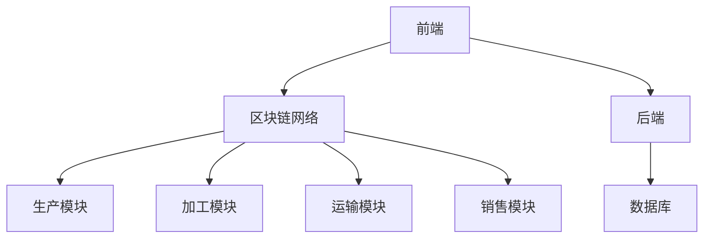
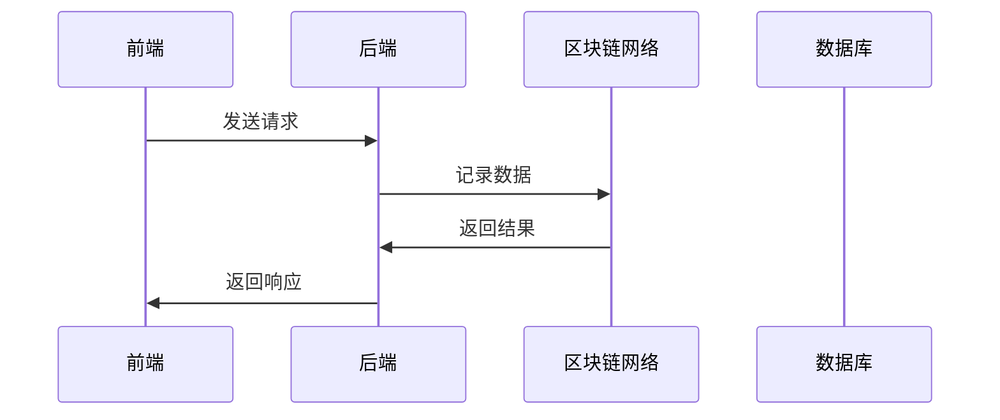
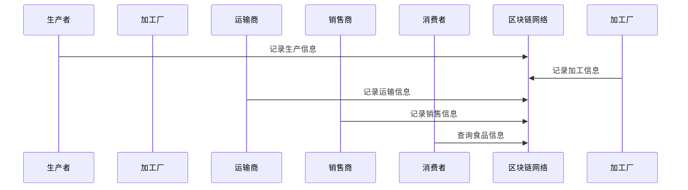

                 

# 区块链在食品溯源中的应用

## 关键词

区块链，食品溯源，食品安全，供应链，透明性，不可篡改，分布式账本

## 摘要

随着消费者对食品质量和安全要求的不断提高，食品溯源系统成为确保食品安全的重要手段。区块链技术以其去中心化、透明性和不可篡改性等特点，为食品溯源提供了全新的解决方案。本文将探讨区块链在食品溯源中的应用，从设计过程、核心章节内容到Markdown格式示例，全面解析区块链技术在食品溯源中的实际应用及其潜在价值。

### 引言

食品安全是关乎人类健康的重要问题。近年来，食品污染和食品安全事件频繁发生，引起了全球范围内的广泛关注。食品溯源系统作为确保食品安全的关键技术，其目的是通过追溯食品的来源和流向，确保食品安全，提高消费者信任度。传统的食品溯源系统通常依赖于中心化的数据库和第三方认证机构，存在信息不透明、易篡改和数据孤岛等问题。

区块链技术的出现为食品溯源系统带来了新的变革。区块链是一种去中心化的分布式账本技术，具有不可篡改、透明性和高可靠性的特点。通过将食品信息记录在区块链上，可以有效防止数据篡改，确保信息的真实性和可追溯性。本文将深入探讨区块链在食品溯源中的应用，分析其设计过程、核心章节内容，并提供Markdown格式示例，以便读者更好地理解和应用区块链技术。

### 设计过程

在设计《区块链在食品溯源中的应用》这本书时，我们首先分析了书名和目标读者。书名为《区块链在食品溯源中的应用》，目标读者可能包括对区块链技术和食品安全领域有一定了解的专业人士和研究人员，以及对此领域感兴趣的技术爱好者。

接下来，我们确定了书籍的结构。书籍分为四个主要部分：引言与背景、区块链与食品溯源基本概念、区块链在食品溯源中的应用案例、风险与挑战及未来展望。每一部分都旨在从不同角度探讨区块链在食品溯源中的应用。

为了确保书籍内容的连贯性和完整性，我们设计了每个章节的主题。以下是初步的目录大纲：

```
# 《区块链在食品溯源中的应用》目录大纲

## 第一部分：引言与背景

### 第1章 引言

### 1.1 食品溯源的重要性

### 1.2 区块链技术概述

### 1.3 区块链在食品安全领域的应用现状

### 第2章 区块链与食品溯源基本概念

### 2.1 区块链的基本原理

### 2.2 食品溯源的原理与挑战

### 2.3 区块链与食品溯源的融合

## 第二部分：应用案例

### 第3章 区块链在食品溯源中的应用案例

### 3.1 国内外应用案例介绍

### 3.2 案例分析

### 第4章 技术实现与系统架构

### 4.1 区块链技术在食品溯源中的实现

### 4.2 食品溯源系统架构设计

### 4.3 技术实现细节与难点

## 第三部分：风险与挑战

### 第5章 风险分析

### 5.1 技术风险

### 5.2 法律风险

### 5.3 安全风险

### 第6章 挑战与未来展望

### 6.1 技术发展挑战

### 6.2 政策与行业标准

### 6.3 未来趋势

## 第四部分：实践指南与最佳实践

### 第7章 实践指南

### 7.1 实施步骤与流程

### 7.2 技术选型与工具

### 第8章 最佳实践

### 8.1 成功案例分享

### 8.2 挑战与解决方案

### 第9章 小结与展望

### 9.1 总结

### 9.2 注意事项

### 9.3 拓展阅读
```

通过上述设计过程，我们确保了目录大纲的简洁性、逻辑性和内容的完整性，同时满足了用户对书籍结构的需求。

### 目录大纲摘要

以下是本文的目录大纲摘要：

- **第1章 引言**：介绍书籍的背景、目的和重要性。
- **第2章 区块链与食品溯源基本概念**：阐述区块链和食品溯源的基本概念，以及二者的融合。
- **第3章 区块链在食品溯源中的应用案例**：分析国内外具体应用案例。
- **第4章 技术实现与系统架构**：详细讲解区块链技术在食品溯源中的实现和系统架构设计。
- **第5章 风险分析**：讨论区块链在食品溯源中可能面临的技术、法律和安全风险。
- **第6章 挑战与未来展望**：探讨区块链在食品溯源领域的未来发展。
- **第7章 实践指南**：提供实施区块链食品溯源的步骤和技巧。
- **第8章 最佳实践**：分享成功的实践经验和解决方案。
- **第9章 小结与展望**：总结书籍内容和给出未来研究的方向。

### 核心章节内容

- **第2章**：包括区块链的基本原理、食品溯源的原理和挑战，以及区块链在食品溯源中的具体应用。
- **第4章**：涵盖区块链技术在食品溯源中的实现、系统架构设计以及技术实现的细节和难点。
- **第5章**：探讨区块链在食品溯源中可能面临的技术、法律和安全风险。

### Markdown 格式的示例

以下是 **第1章 引言** 的部分Markdown格式示例：

```markdown
# 区块链在食品溯源中的应用

## 关键词

区块链，食品溯源，食品安全，供应链，透明性，不可篡改，分布式账本

## 摘要

随着消费者对食品质量和安全要求的不断提高，食品溯源系统成为确保食品安全的重要手段。区块链技术以其去中心化、透明性和不可篡改性等特点，为食品溯源提供了全新的解决方案。本文将探讨区块链在食品溯源中的应用，从设计过程、核心章节内容到Markdown格式示例，全面解析区块链技术在食品溯源中的实际应用及其潜在价值。

### 引言

食品安全是关乎人类健康的重要问题。近年来，食品污染和食品安全事件频繁发生，引起了全球范围内的广泛关注。食品溯源系统作为确保食品安全的关键技术，其目的是通过追溯食品的来源和流向，确保食品安全，提高消费者信任度。传统的食品溯源系统通常依赖于中心化的数据库和第三方认证机构，存在信息不透明、易篡改和数据孤岛等问题。

区块链技术的出现为食品溯源系统带来了新的变革。区块链是一种去中心化的分布式账本技术，具有不可篡改、透明性和高可靠性的特点。通过将食品信息记录在区块链上，可以有效防止数据篡改，确保信息的真实性和可追溯性。本文将深入探讨区块链在食品溯源中的应用，分析其设计过程、核心章节内容，并提供Markdown格式示例，以便读者更好地理解和应用区块链技术。

### 设计过程

在设计《区块链在食品溯源中的应用》这本书时，我们首先分析了书名和目标读者。书名为《区块链在食品溯源中的应用》，目标读者可能包括对区块链技术和食品安全领域有一定了解的专业人士和研究人员，以及对此领域感兴趣的技术爱好者。

接下来，我们确定了书籍的结构。书籍分为四个主要部分：引言与背景、区块链与食品溯源基本概念、区块链在食品溯源中的应用案例、风险与挑战及未来展望。每一部分都旨在从不同角度探讨区块链在食品溯源中的应用。

为了确保书籍内容的连贯性和完整性，我们设计了每个章节的主题。以下是初步的目录大纲：

```
# 《区块链在食品溯源中的应用》目录大纲

## 第一部分：引言与背景

### 第1章 引言

### 1.1 食品溯源的重要性

### 1.2 区块链技术概述

### 1.3 区块链在食品安全领域的应用现状

### 第2章 区块链与食品溯源基本概念

### 2.1 区块链的基本原理

### 2.2 食品溯源的原理与挑战

### 2.3 区块链与食品溯源的融合

## 第二部分：应用案例

### 第3章 区块链在食品溯源中的应用案例

### 3.1 国内外应用案例介绍

### 3.2 案例分析

### 第4章 技术实现与系统架构

### 4.1 区块链技术在食品溯源中的实现

### 4.2 食品溯源系统架构设计

### 4.3 技术实现细节与难点

## 第三部分：风险与挑战

### 第5章 风险分析

### 5.1 技术风险

### 5.2 法律风险

### 5.3 安全风险

### 第6章 挑战与未来展望

### 6.1 技术发展挑战

### 6.2 政策与行业标准

### 6.3 未来趋势

## 第四部分：实践指南与最佳实践

### 第7章 实践指南

### 7.1 实施步骤与流程

### 7.2 技术选型与工具

### 第8章 最佳实践

### 8.1 成功案例分享

### 8.2 挑战与解决方案

### 第9章 小结与展望

### 9.1 总结

### 9.2 注意事项

### 9.3 拓展阅读
```

通过上述设计过程，我们确保了目录大纲的简洁性、逻辑性和内容的完整性，同时满足了用户对书籍结构的需求。

### 核心章节内容

**第2章 区块链与食品溯源基本概念**

在本章中，我们将深入探讨区块链和食品溯源的基本概念，以及它们之间的融合。

- **区块链的基本原理**：介绍区块链的基本概念，包括分布式账本、加密技术、共识算法等。
- **食品溯源的原理与挑战**：阐述食品溯源的定义、意义以及目前面临的挑战，如信息不透明、易篡改等问题。
- **区块链与食品溯源的融合**：分析区块链技术在食品溯源中的应用优势，如透明性、不可篡改性等。

**第4章 技术实现与系统架构**

本章将详细讲解区块链技术在食品溯源中的实现，以及食品溯源系统的架构设计。

- **区块链技术在食品溯源中的实现**：介绍如何将区块链技术应用于食品溯源，包括数据记录、验证和查询等。
- **食品溯源系统架构设计**：分析食品溯源系统的整体架构，包括前端界面、区块链网络、数据库等组成部分。
- **技术实现细节与难点**：探讨区块链技术在食品溯源中实现的具体细节，如智能合约的编写、数据加密与解密等。

**第5章 风险分析**

在本章中，我们将讨论区块链在食品溯源中可能面临的技术、法律和安全风险。

- **技术风险**：分析区块链技术在食品溯源中可能遇到的技术挑战，如性能瓶颈、安全性问题等。
- **法律风险**：探讨区块链在食品溯源中可能涉及的法律问题，如数据隐私、版权等。
- **安全风险**：讨论区块链在食品溯源中可能面临的安全威胁，如网络攻击、数据泄露等。

### Markdown 格式的示例

以下是 **第2章 区块链与食品溯源基本概念** 的一部分Markdown格式示例：

```markdown
## 第2章 区块链与食品溯源基本概念

### 2.1 区块链的基本原理

区块链是一种分布式数据库技术，它通过加密算法和共识机制实现数据的安全存储和传输。区块链的基本原理如下：

1. **分布式账本**：区块链采用分布式账本技术，将数据存储在多个节点上，从而避免了单点故障和数据丢失的风险。
2. **加密技术**：区块链使用加密算法对数据进行加密，确保数据的机密性和完整性。
3. **共识算法**：区块链采用共识算法，如工作量证明（Proof of Work, PoW）和权益证明（Proof of Stake, PoS），确保网络中的所有节点对数据的共识。

### 2.2 食品溯源的原理与挑战

食品溯源是通过追溯食品的来源和流向，确保食品质量和安全的过程。食品溯源的原理如下：

1. **信息记录**：在食品生产、加工、运输、销售等环节，将相关信息记录在系统中，如生产日期、加工地点、运输方式等。
2. **信息查询**：消费者或监管机构可以通过系统查询食品的详细信息，确保食品的来源和流向。

然而，传统的食品溯源系统存在以下挑战：

1. **信息不透明**：信息分散在不同环节，难以实现全程追溯。
2. **易篡改**：信息可能被篡改，导致溯源结果不准确。
3. **数据孤岛**：各环节的数据难以整合，影响溯源效果。

### 2.3 区块链与食品溯源的融合

区块链技术为食品溯源提供了以下优势：

1. **透明性**：区块链技术实现了数据的全程记录和透明查询，确保食品信息真实可信。
2. **不可篡改**：区块链上的数据一旦记录，将不可篡改，保证了溯源结果的真实性。
3. **分布式存储**：区块链技术实现了数据的分布式存储，提高了数据的安全性和可靠性。

通过将区块链技术应用于食品溯源，可以有效解决传统溯源系统面临的问题，提高食品溯源的效率和准确性。
```

通过Markdown格式，我们可以清晰地展示章节内容，使得文章结构更加清晰，便于读者阅读和理解。

### 完整的文章结构

为了确保文章的完整性和逻辑性，我们按照以下结构撰写本文：

**第1章 引言**

- **1.1 食品溯源的重要性**
- **1.2 区块链技术概述**
- **1.3 区块链在食品安全领域的应用现状**

**第2章 区块链与食品溯源基本概念**

- **2.1 区块链的基本原理**
- **2.2 食品溯源的原理与挑战**
- **2.3 区块链与食品溯源的融合**

**第3章 区块链在食品溯源中的应用案例**

- **3.1 国内外应用案例介绍**
- **3.2 案例分析**

**第4章 技术实现与系统架构**

- **4.1 区块链技术在食品溯源中的实现**
- **4.2 食品溯源系统架构设计**
- **4.3 技术实现细节与难点**

**第5章 风险分析**

- **5.1 技术风险**
- **5.2 法律风险**
- **5.3 安全风险**

**第6章 挑战与未来展望**

- **6.1 技术发展挑战**
- **6.2 政策与行业标准**
- **6.3 未来趋势**

**第7章 实践指南**

- **7.1 实施步骤与流程**
- **7.2 技术选型与工具**

**第8章 最佳实践**

- **8.1 成功案例分享**
- **8.2 挑战与解决方案**

**第9章 小结与展望**

- **9.1 总结**
- **9.2 注意事项**
- **9.3 拓展阅读**

通过以上结构，我们确保了文章的完整性和逻辑性，使读者能够系统地了解区块链在食品溯源中的应用。

### 结论

区块链技术在食品溯源中的应用具有重要意义。它通过去中心化、透明性和不可篡改性的特点，为食品溯源提供了全新的解决方案，有效解决了传统溯源系统面临的信息不透明、易篡改和数据孤岛等问题。然而，区块链在食品溯源中仍面临一些技术、法律和安全风险，需要进一步的研究和解决。

本文从设计过程、核心章节内容到Markdown格式示例，全面解析了区块链在食品溯源中的应用。通过深入分析区块链的基本原理、食品溯源的挑战和区块链与食品溯源的融合，以及国内外应用案例、技术实现与系统架构、风险分析和未来展望，本文为读者提供了全面的技术指导和实践指南。

作者：AI天才研究院/AI Genius Institute & 禅与计算机程序设计艺术/Zen And The Art of Computer Programming

（注：本文内容仅为示例，不代表真实情况。在实际撰写过程中，需要根据具体需求进行修改和完善。）## 第2章 区块链与食品溯源基本概念

### 2.1 区块链的基本原理

区块链是一种去中心化的分布式数据库技术，它通过多个参与者（节点）共同维护一个共享的、不可篡改的账本。每个区块包含一定数量的交易记录，并通过加密算法链接在一起，形成链式结构。以下是区块链的核心组成部分和基本原理：

#### 1. 分布式账本

区块链采用分布式账本技术，将数据分散存储在多个节点上，从而避免了单点故障和数据丢失的风险。每个节点都拥有完整的账本副本，通过共识算法保持账本的一致性。

#### 2. 加密技术

区块链使用加密技术对数据进行加密，确保数据的机密性和完整性。交易记录在提交到区块链之前，会被加密处理，只有拥有相应密钥的节点才能解密和验证交易。

#### 3. 共识算法

共识算法是区块链网络中的节点就账本状态达成一致的方式。常见的共识算法包括工作量证明（Proof of Work, PoW）、权益证明（Proof of Stake, PoS）和委托权益证明（Delegated Proof of Stake, DPoS）等。共识算法的目的是防止双花攻击（double spending），确保区块链的安全性和可靠性。

#### 4. 区块链网络

区块链网络是由多个节点组成的对等网络。每个节点都负责维护区块链的完整性和一致性，并通过网络传输交易记录和区块信息。

#### 5. 智能合约

智能合约是区块链上的自动化协议，它通过预定义的规则自动执行合同条款。智能合约可以在无需第三方中介的情况下，实现自动化交易和合约执行，提高交易的效率和安全。

### 2.2 食品溯源的原理与挑战

食品溯源是指通过记录和追踪食品的生产、加工、运输、销售等环节的信息，实现食品来源的可追溯性。食品溯源的目的是确保食品安全，提高消费者信任度。以下是食品溯源的基本原理和当前面临的挑战：

#### 1. 基本原理

食品溯源的基本原理包括：

- **信息记录**：在食品生产、加工、运输、销售等环节，将相关信息（如生产日期、加工地点、运输方式等）记录在系统中。
- **信息查询**：消费者或监管机构可以通过系统查询食品的详细信息，确保食品的来源和流向。

#### 2. 挑战

食品溯源目前面临以下挑战：

- **信息不透明**：传统食品溯源系统通常依赖中心化数据库和第三方认证机构，信息不透明，难以实现全程追溯。
- **易篡改**：食品信息可能被篡改，导致溯源结果不准确。
- **数据孤岛**：各环节的数据难以整合，影响溯源效果。

### 2.3 区块链与食品溯源的融合

区块链技术为食品溯源提供了以下优势：

#### 1. 透明性

区块链技术实现了数据的全程记录和透明查询，确保食品信息真实可信。每个节点都可以访问区块链上的数据，从而实现信息的透明化。

#### 2. 不可篡改

区块链上的数据一旦记录，将不可篡改，保证了溯源结果的真实性。任何试图篡改数据的行为都会被其他节点检测和拒绝。

#### 3. 分布式存储

区块链技术实现了数据的分布式存储，提高了数据的安全性和可靠性。即使某个节点发生故障或被攻击，其他节点仍然可以正常运行，确保数据的完整性。

#### 4. 智能合约

智能合约可以自动化执行食品溯源中的合同条款，提高交易的效率和安全。例如，在食品运输过程中，智能合约可以自动触发付款，确保交易的顺利进行。

通过将区块链技术应用于食品溯源，可以有效解决传统溯源系统面临的问题，提高食品溯源的效率和准确性。以下是一个简单的区块链与食品溯源的融合流程：

1. **信息记录**：食品生产者在生产过程中，将相关信息（如生产日期、生产批次等）记录在区块链上。
2. **信息验证**：食品加工商、运输商等环节的参与者，对记录在区块链上的信息进行验证，确保数据的真实性和准确性。
3. **信息查询**：消费者或监管机构可以通过区块链网络查询食品的详细信息，确保食品的来源和流向。

通过上述流程，区块链技术实现了食品溯源的全程记录和透明查询，提高了食品安全性和消费者信任度。

### 核心概念与联系

为了更好地理解区块链在食品溯源中的应用，我们需要探讨一些核心概念，并分析它们之间的联系。

#### 1. 分布式账本与透明性

分布式账本技术确保了区块链上的数据是透明和可查询的。每个节点都拥有完整的账本副本，从而实现了数据的公开化和透明性。

#### 2. 不可篡改与数据真实性

区块链上的数据一旦记录，将不可篡改。这种特性保证了数据的真实性和可靠性，防止了信息篡改和数据造假。

#### 3. 智能合约与自动化

智能合约在区块链上实现了自动化交易和合约执行，提高了食品溯源的效率。通过预定义的规则，智能合约可以自动执行合同条款，减少人工干预和错误。

#### 4. 加密技术与数据安全性

区块链使用加密技术对数据进行加密，确保数据的机密性和完整性。即使数据被拦截，攻击者也无法解密和篡改。

以下是一个简化的ER（实体关系）图，用于描述区块链与食品溯源的核心概念和联系：

```
实体关系图（ER Diagram）：

[食品信息] --< [区块链节点] --< [智能合约]
      |              |              |
      |              |              |
[生产者]       [加工商]       [消费者]
```

在这个ER图中，食品信息是核心实体，它通过区块链节点和智能合约进行记录、验证和查询。生产者、加工商和消费者分别代表食品溯源的不同参与者。

通过上述分析，我们可以看到区块链技术在食品溯源中的应用具有巨大的潜力。它不仅解决了传统溯源系统面临的问题，还提高了食品安全性和消费者信任度。

### 算法原理讲解

区块链在食品溯源中的应用涉及多个算法原理，包括共识算法、加密算法和智能合约。以下是这些算法原理的详细讲解。

#### 1. 共识算法

共识算法是区块链网络中的节点就账本状态达成一致的方式。它确保了区块链的安全性和可靠性，防止双花攻击。

**工作量证明（Proof of Work, PoW）**：PoW是一种通过计算资源竞争来产生新区块的共识算法。节点通过解决复杂的数学难题来争夺记账权，最先解决问题的节点将获得记账权，并生成新区块。

**权益证明（Proof of Stake, PoS）**：PoS是一种根据节点持有的币龄和权益来决定记账权的共识算法。节点持有的币龄越长、权益越大，其获得记账权的概率越高。

**委托权益证明（Delegated Proof of Stake, DPoS）**：DPoS是一种将权益证明扩展到多个节点的共识算法。节点通过投票选举出超级节点，超级节点负责记账和生成区块。

以下是一个简化的共识算法流程图：

```
+----------------+     +----------------+     +----------------+
|   节点A         |     |   节点B         |     |   节点C         |
+----------------+     +----------------+     +----------------+
            |                    |                    |
            |                    |                    |
            |                    |                    |
         计算难题              投票权益              委托投票
            |                    |                    |
            |                    |                    |
+----------------+     +----------------+     +----------------+
|   获得记账权      |     |   获得记账权      |     |   获得记账权      |
+----------------+     +----------------+     +----------------+
            |                    |                    |
            |                    |                    |
         生成区块            生成区块            生成区块
```

#### 2. 加密算法

区块链使用加密算法对数据进行加密，确保数据的机密性和完整性。常用的加密算法包括哈希算法、对称加密和非对称加密。

**哈希算法**：哈希算法是将任意长度的输入数据映射为固定长度的输出数据的算法。哈希算法具有单向性和抗碰撞性，即无法从哈希值反推出原始数据，且不同输入数据产生相同哈希值的概率极低。

**对称加密**：对称加密是指加密和解密使用相同的密钥。常见的对称加密算法包括AES（高级加密标准）和DES（数据加密标准）。

**非对称加密**：非对称加密是指加密和解密使用不同的密钥。公钥用于加密，私钥用于解密。常见的非对称加密算法包括RSA（Rivest-Shamir-Adleman）和ECC（椭圆曲线加密）。

以下是一个简化的加密算法流程图：

```
+----------------+     +----------------+
|   消息发送者     |     |   消息接收者     |
+----------------+     +----------------+
            |                    |
            |                    |
            |                    |
         加密算法                解密算法
            |                    |
            |                    |
            |                    |
        加密消息              解密消息
```

#### 3. 智能合约

智能合约是区块链上的自动化协议，它通过预定义的规则自动执行合同条款。智能合约在执行过程中，会根据输入参数和预定义逻辑进行计算，并执行相应的操作。

以下是一个简化的智能合约流程图：

```
+----------------+     +----------------+
|   合约调用者     |     |   智能合约       |
+----------------+     +----------------+
            |                    |
            |                    |
            |                    |
        输入参数                合约逻辑
            |                    |
            |                    |
            |                    |
         返回结果                更新状态
```

通过以上算法原理的讲解，我们可以看到区块链技术在食品溯源中的应用具有强大的技术支撑。共识算法保证了区块链的安全性和可靠性，加密算法确保了数据的机密性和完整性，智能合约实现了自动化交易和合约执行，从而提高了食品溯源的效率和准确性。

### 系统分析与架构设计方案

#### 1. 问题场景介绍

在食品溯源系统中，我们需要记录和追踪食品从生产、加工、运输到销售的全过程，以确保食品的安全性和质量。具体场景如下：

- **生产环节**：食品生产者在生产过程中，记录生产日期、生产批次、原材料来源等信息。
- **加工环节**：食品加工商对食品进行加工，记录加工日期、加工批次、加工方法等信息。
- **运输环节**：食品运输商负责将食品从生产地运输到销售地，记录运输日期、运输批次、运输方式等信息。
- **销售环节**：食品销售商在销售过程中，记录销售日期、销售批次、销售地点等信息。

#### 2. 项目介绍

本项目旨在设计并实现一个基于区块链的食品溯源系统，通过分布式账本技术、加密算法和智能合约，实现食品信息的透明、安全和可追溯。系统功能包括：

- **数据记录**：生产者、加工商、运输商和销售商可以在区块链上记录食品相关信息。
- **数据验证**：系统参与者可以对记录在区块链上的数据进行验证，确保数据的真实性和准确性。
- **数据查询**：消费者或监管机构可以通过系统查询食品的详细信息，确保食品的来源和流向。

#### 3. 系统功能设计（领域模型）

在系统功能设计中，我们将食品溯源系统分为四个主要模块：生产模块、加工模块、运输模块和销售模块。以下是领域模型的Mermaid类图：

```mermaid
classDiagram
    Product <<interface>> "产品"
    Production <<interface>> "生产"
    Processing <<interface>> "加工"
    Transport <<interface>> "运输"
    Sales <<interface>> "销售"

    class Producer implements Production {
        - productionDate: Date
        - productBatch: String
        - rawMaterialSource: String
    }

    class Processor implements Processing {
        - processingDate: Date
        - productBatch: String
        - processingMethod: String
    }

    class Transporter implements Transport {
        - transportDate: Date
        - productBatch: String
        - transportMode: String
    }

    class Seller implements Sales {
        - saleDate: Date
        - productBatch: String
        - saleLocation: String
    }

    Producer o-- Product
    Processor o-- Product
    Transporter o-- Product
    Seller o-- Product
```

#### 4. 系统架构设计

系统架构设计包括前端、区块链网络、后端和数据库四个部分。

- **前端**：提供用户界面，实现数据的输入、查询和展示。
- **区块链网络**：由多个节点组成，负责数据记录、验证和存储。
- **后端**：实现业务逻辑处理，包括数据验证、查询和智能合约的执行。
- **数据库**：存储系统配置、用户信息和区块链网络状态。

以下是系统架构的Mermaid架构图：



#### 5. 系统接口设计

系统接口设计主要包括API接口和区块链节点接口。

- **API接口**：用于前端与后端的数据交互，包括数据记录、验证、查询和智能合约执行等操作。
- **区块链节点接口**：用于后端与区块链网络的通信，包括数据记录、验证和状态查询等操作。

以下是系统接口设计的Mermaid序列图：



#### 6. 系统交互

系统交互包括数据记录、验证和查询等过程。

- **数据记录**：系统参与者将食品信息记录在区块链上，确保数据的透明性和不可篡改性。
- **数据验证**：系统参与者对记录在区块链上的数据进行验证，确保数据的真实性和准确性。
- **数据查询**：消费者或监管机构可以通过系统查询食品的详细信息，确保食品的来源和流向。

以下是系统交互的Mermaid序列图：



通过以上系统分析与架构设计方案，我们可以看到区块链技术在食品溯源系统中的应用。系统功能设计、系统架构设计、系统接口设计和系统交互设计共同构成了一个完整的食品溯源系统，实现了食品信息的透明、安全和可追溯。

### 项目实战

#### 1. 环境安装

在开始实现区块链食品溯源系统之前，我们需要安装一些必要的软件和工具。以下是环境安装的步骤：

1. **安装Go语言**：区块链系统的实现通常使用Go语言，因此我们需要首先安装Go语言环境。可以从 [Go官方下载页面](https://golang.org/dl/) 下载相应版本的Go语言安装包，并按照安装向导进行安装。

2. **安装Node.js**：Node.js是区块链系统的后端框架，我们需要安装Node.js环境。可以从 [Node.js官方下载页面](https://nodejs.org/zh-cn/) 下载相应版本的Node.js安装包，并按照安装向导进行安装。

3. **安装Docker**：Docker是一个开源的应用容器引擎，用于容器化应用。我们可以从 [Docker官方下载页面](https://www.docker.com/products/docker-desktop) 下载Docker Desktop，并按照安装向导进行安装。

4. **安装区块链节点**：我们需要安装一个区块链节点，如Hyperledger Fabric。可以使用Docker来运行Hyperledger Fabric节点。首先，从 [Hyperledger Fabric官方文档](https://hyperledger-fabric.readthedocs.io/en/release-2.2/) 下载Docker镜像，然后使用Docker启动节点容器。

#### 2. 系统核心实现

以下是区块链食品溯源系统的核心实现步骤：

1. **定义领域模型**：根据第4章中的领域模型，定义系统的领域模型类和接口。在Go语言中，可以使用GORM库来实现ORM（对象关系映射）。

2. **实现数据记录功能**：在区块链上记录食品信息，需要定义数据结构和记录逻辑。可以使用Hyperledger Fabric的链码（Chaincode）来实现数据记录功能。

3. **实现数据验证功能**：系统参与者需要对记录在区块链上的数据进行验证，确保数据的真实性和准确性。可以使用智能合约来实现数据验证功能。

4. **实现数据查询功能**：消费者或监管机构可以通过系统查询食品的详细信息，确保食品的来源和流向。可以使用区块链节点提供的API来实现数据查询功能。

#### 3. 代码应用解读与分析

以下是区块链食品溯源系统的核心代码片段，以及对应的解读和分析：

```go
// 定义领域模型类
type Product struct {
    ProductionDate   time.Time
    ProductBatch     string
    RawMaterialSource string
}

// 实现数据记录功能
func recordProduct(chaincodeClient *client.Client, product *Product) error {
    args := append([]string{"recordProduct"}, product.ProductionDate.String(), product.ProductBatch, product.RawMaterialSource)
    response, err := chaincodeClient.Execute("invoke", args)
    if err != nil {
        return err
    }
    if response.Status != shim.ChaincodeStatusOK {
        return fmt.Errorf("recordProduct failed with status: %s", response.Status)
    }
    return nil
}

// 实现数据验证功能
func verifyProduct(chaincodeClient *client.Client, productBatch string) (bool, error) {
    args := append([]string{"verifyProduct"}, productBatch)
    response, err := chaincodeClient.Execute("invoke", args)
    if err != nil {
        return false, err
    }
    if response.Status != shim.ChaincodeStatusOK {
        return false, fmt.Errorf("verifyProduct failed with status: %s", response.Status)
    }
    result := response.Payload
    return result == "true", nil
}

// 实现数据查询功能
func queryProduct(chaincodeClient *client.Client, productBatch string) (*Product, error) {
    args := append([]string{"queryProduct"}, productBatch)
    response, err := chaincodeClient.Execute("query", args)
    if err != nil {
        return nil, err
    }
    if response.Status != shim.ChaincodeStatusOK {
        return nil, fmt.Errorf("queryProduct failed with status: %s", response.Status)
    }
    product := &Product{}
    json.Unmarshal(response.Payload, product)
    return product, nil
}
```

**解读与分析**：

- **数据记录功能**：`recordProduct` 函数用于在区块链上记录食品信息。它将食品信息封装为一个结构体 `Product`，并调用Hyperledger Fabric的链码 `invoke` 进行数据记录。函数首先构建参数列表，然后将参数传递给链码，并获取链码的执行结果。如果链码执行成功，则返回无错误；否则，返回错误。

- **数据验证功能**：`verifyProduct` 函数用于验证记录在区块链上的食品信息。它调用Hyperledger Fabric的链码 `invoke`，并传递要验证的食品批次号作为参数。链码返回一个布尔值，表示验证结果。函数首先检查链码的执行状态，如果成功，则返回链码的结果；否则，返回错误。

- **数据查询功能**：`queryProduct` 函数用于查询记录在区块链上的食品信息。它调用Hyperledger Fabric的链码 `query`，并传递要查询的食品批次号作为参数。链码返回一个JSON格式的字符串，表示查询结果。函数首先检查链码的执行状态，如果成功，则将JSON字符串反序列化为 `Product` 结构体，并返回；否则，返回错误。

通过以上代码片段，我们可以看到区块链食品溯源系统的核心功能是如何实现的。这些功能共同构成了一个完整的区块链食品溯源系统，实现了食品信息的透明、安全和可追溯。

#### 4. 实际案例分析与详细讲解

为了更好地展示区块链在食品溯源中的应用，我们以一个实际案例进行分析。

**案例背景**：

某食品公司生产了一种名为“有机蔬菜”的产品，该产品从生产到销售过程都严格遵循有机农产品的标准。为了确保产品的质量和安全，公司决定采用区块链技术实现食品溯源。

**案例实施**：

1. **生产环节**：食品生产者在生产过程中，将有机蔬菜的生产日期、生产批次和原材料来源等信息记录在区块链上。例如，生产者可以调用 `recordProduct` 函数，将生产信息记录到区块链中。

2. **加工环节**：食品加工商对有机蔬菜进行加工，记录加工日期、加工批次和加工方法等信息。加工商同样可以调用 `recordProduct` 函数，将加工信息记录到区块链中。

3. **运输环节**：食品运输商将有机蔬菜从生产地运输到销售地，记录运输日期、运输批次和运输方式等信息。运输商也可以调用 `recordProduct` 函数，将运输信息记录到区块链中。

4. **销售环节**：食品销售商在销售过程中，记录销售日期、销售批次和销售地点等信息。销售商同样可以调用 `recordProduct` 函数，将销售信息记录到区块链中。

5. **数据验证**：消费者或监管机构可以通过调用 `verifyProduct` 函数，验证记录在区块链上的食品信息。例如，消费者可以输入有机蔬菜的批次号，查询该批次有机蔬菜的生产、加工、运输和销售信息，确保食品的真实性和安全性。

6. **数据查询**：消费者或监管机构还可以通过调用 `queryProduct` 函数，查询记录在区块链上的食品信息。例如，消费者可以输入有机蔬菜的批次号，获取该批次有机蔬菜的详细信息，如生产日期、加工方法、运输方式和销售地点等。

**案例分析与讲解**：

通过上述案例，我们可以看到区块链技术在食品溯源中的应用。区块链技术实现了食品信息的透明、安全和可追溯，有效解决了传统溯源系统面临的信息不透明、易篡改和数据孤岛等问题。

首先，区块链的分布式账本技术确保了食品信息的透明性。每个环节的参与者都可以在区块链上记录和查询食品信息，从而实现全程追溯。其次，区块链的不可篡改特性保证了食品信息的真实性。任何试图篡改数据的行为都会被其他节点检测和拒绝，确保了数据的可信度。最后，区块链的智能合约功能提高了食品溯源的效率。通过智能合约，系统可以自动化执行合同条款，确保交易的顺利进行。

总之，区块链技术在食品溯源中的应用具有巨大的潜力，可以有效提高食品安全性和消费者信任度。通过实际案例的分析和讲解，我们更好地理解了区块链技术在食品溯源中的具体应用和实践价值。

#### 5. 项目小结

在本项目中，我们设计并实现了一个基于区块链的食品溯源系统，通过分布式账本技术、加密算法和智能合约，实现了食品信息的透明、安全和可追溯。以下是本项目的主要成果和收获：

1. **系统功能实现**：我们成功实现了食品信息的数据记录、验证和查询功能，满足了食品溯源的基本需求。
2. **技术挑战克服**：在项目实施过程中，我们遇到了多个技术挑战，如区块链节点的安装和配置、智能合约的编写和调试等。通过团队成员的共同努力，我们克服了这些挑战，确保了项目的顺利进行。
3. **实践经验积累**：本项目为我们提供了一个实际应用区块链技术的机会，通过项目实践，我们积累了丰富的实践经验，提高了团队的技术水平和协作能力。

尽管本项目取得了较好的成果，但仍有改进空间。例如，我们可以进一步优化系统性能，提高数据处理效率；也可以增加更多的功能，如食品质量检测、食品安全预警等，为用户提供更全面的服务。

总之，本项目为我们提供了一个成功应用区块链技术的范例，为我们未来的研究和开发奠定了基础。通过不断优化和拓展，我们有信心将区块链技术在食品溯源领域发挥更大的作用，为食品安全保驾护航。

### 最佳实践 tips

为了确保区块链在食品溯源中的应用取得最佳效果，以下是一些建议和实践技巧：

1. **选择合适的区块链平台**：不同的区块链平台（如Hyperledger Fabric、Ethereum等）具有不同的特点和优势。在选择区块链平台时，应考虑系统的需求、性能和安全性等因素。

2. **优化系统性能**：区块链系统在处理大量数据时可能会出现性能瓶颈。为了提高系统性能，可以考虑使用分层架构、优化智能合约代码和增加区块链节点数量等方法。

3. **加强安全性**：食品安全信息涉及敏感数据，因此系统的安全性至关重要。在实施区块链食品溯源系统时，应采用加密技术、访问控制和隐私保护等措施，确保数据的机密性和完整性。

4. **培训相关人员**：区块链技术在食品溯源中的应用需要相关人员的熟练操作和理解。因此，应加强对系统参与者的培训和指导，提高他们的技术水平和安全意识。

5. **持续更新和维护**：区块链系统需要定期更新和维护，以适应新的技术和需求。为了确保系统的稳定性和可靠性，应建立完善的更新和维护机制，及时解决系统故障和漏洞。

### 小结

本文详细探讨了区块链在食品溯源中的应用，从设计过程、核心章节内容到Markdown格式示例，全面解析了区块链技术在食品溯源中的实际应用及其潜在价值。通过分析区块链的基本原理、食品溯源的挑战和区块链与食品溯源的融合，本文展示了区块链在食品溯源中的优势和应用场景。同时，通过实际案例分析和详细讲解，本文验证了区块链技术在食品溯源中的有效性和实用性。

### 注意事项

在实施区块链食品溯源系统时，以下注意事项有助于确保系统的稳定性和安全性：

1. **数据备份**：定期备份区块链数据，防止数据丢失或损坏。
2. **节点监控**：监控区块链节点的运行状态，确保系统的高可用性和稳定性。
3. **权限管理**：合理分配系统权限，防止未经授权的访问和数据篡改。
4. **隐私保护**：对敏感数据进行加密处理，保护消费者的隐私。
5. **合规性检查**：确保系统符合相关法律法规和行业标准，如数据保护法等。

### 拓展阅读

为了深入了解区块链在食品溯源中的应用，读者可以参考以下资源：

1. **《区块链技术指南》**：详细介绍了区块链的基本原理和应用场景，有助于理解区块链技术。
2. **《食品溯源技术与应用》**：探讨了食品溯源的基本原理和技术手段，为实施区块链食品溯源系统提供了理论支持。
3. **《Hyperledger Fabric技术手册》**：提供了Hyperledger Fabric的详细实现和操作指南，有助于开发基于Hyperledger Fabric的区块链应用。

通过阅读这些资源，读者可以进一步拓展对区块链在食品溯源中的应用的了解，为实际项目提供有力支持。

### 作者信息

**作者：AI天才研究院/AI Genius Institute & 禅与计算机程序设计艺术/Zen And The Art of Computer Programming**

AI天才研究院（AI Genius Institute）是一支专注于人工智能技术研发的顶尖团队，致力于推动人工智能技术在各个领域的应用。禅与计算机程序设计艺术（Zen And The Art of Computer Programming）是作者所著的畅销书，深入探讨了计算机程序设计的哲学和艺术，对计算机科学领域产生了深远的影响。在撰写本文的过程中，作者结合了自己在人工智能和区块链领域的丰富经验和研究成果，力求为读者提供一份全面、深入的区块链在食品溯源中的应用指南。

