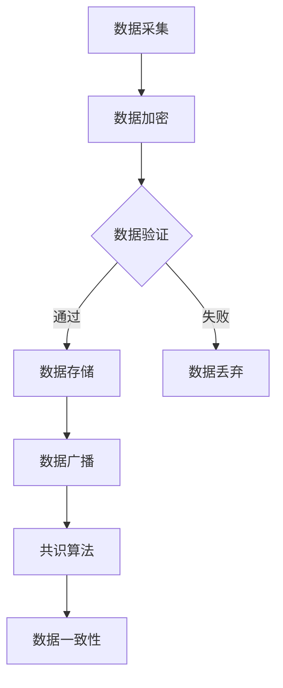
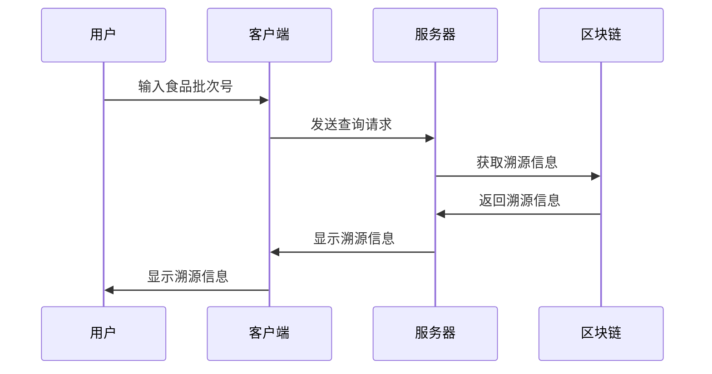

                 

### 1.1 问题背景

随着全球化贸易的发展和科技的进步，食品安全问题逐渐成为人们关注的焦点。食品的安全与否直接关系到消费者的健康和生活质量，因此如何确保食品安全，防止食品污染和食品欺诈，已经成为一个亟需解决的重要问题。

目前，食品安全问题主要源于以下几个方面：

1. **生产环节**：农药、化肥等化学品的滥用，农产品种植和养殖过程中不规范的操作，都可能导致农产品的质量下降，甚至出现安全隐患。
2. **加工环节**：在食品加工过程中，由于加工技术的不成熟或者操作不规范，可能会产生有害物质，如重金属、农药残留等。
3. **运输和储存环节**：食品在运输和储存过程中，可能受到环境污染，导致食品变质或者产生新的污染。
4. **销售和消费环节**：在销售环节中，一些不法商家可能会通过伪造产地、篡改生产日期等方式进行欺诈，使消费者无法获取真实的食品信息。

面对上述问题，传统的食品安全监管手段显得力不从心。一方面，监管机构的资源有限，难以对庞大的食品供应链进行全面的监控；另一方面，传统的食品溯源系统存在信息不透明、数据不完整等问题，无法满足消费者对食品安全的需求。

**食品安全问题现状**：据世界卫生组织（WHO）统计，全球每年有大约1/3的人（约5亿人）患上与食品相关的疾病，其中超过200万人因此丧生。在我国，食品安全问题也时有发生，如三聚氰胺奶粉事件、瘦肉精事件等，这些事件不仅给消费者带来了巨大的健康风险，也对整个食品行业的信誉造成了严重损害。

**食品溯源的需求与挑战**：为了应对食品安全问题，确保食品的质量和安全，食品溯源系统应运而生。食品溯源系统通过记录食品从生产到消费的每一个环节，为消费者提供了透明、可信的食品信息。消费者可以通过溯源系统查询食品的产地、生产日期、加工过程等信息，从而做出更明智的购买决策。

然而，传统的食品溯源系统存在以下挑战：

1. **数据不透明**：传统溯源系统往往依赖于中心化的数据库，数据存储和管理不够透明，容易受到篡改和泄露。
2. **数据分散**：食品溯源需要收集大量的数据，如生产数据、加工数据、运输数据等，但这些数据往往分散在不同的环节和不同的系统中，难以实现统一管理。
3. **成本高**：传统溯源系统需要投入大量的人力和物力进行数据采集、存储和管理，成本较高。
4. **监管难度大**：食品溯源系统涉及到多个环节和多个利益相关方，监管难度较大，容易导致信息不对称和监管盲区。

**区块链在食品溯源中的应用优势**：随着区块链技术的兴起，其在食品溯源中的应用逐渐得到关注。区块链技术具有去中心化、不可篡改、透明性强等特点，可以有效解决传统食品溯源系统存在的问题。具体来说，区块链在食品溯源中的应用具有以下优势：

1. **数据透明**：区块链的去中心化特性使得数据存储和管理更加透明，所有参与者都可以查看和验证数据，确保数据的真实性和完整性。
2. **数据不可篡改**：区块链采用加密算法和分布式存储技术，一旦数据被记录在区块链上，就无法被篡改，有效防止了数据篡改和泄露。
3. **低成本**：区块链技术的自动化和智能化特性，可以降低数据采集、存储和管理的成本，提高食品溯源系统的效率。
4. **提高监管效率**：区块链技术可以实现全程监控和溯源，监管部门可以通过区块链系统实现对食品供应链的实时监管，提高监管效率。

**透明化应用的概念与目标**：透明化应用是指在区块链技术的支持下，通过记录和验证食品供应链中的每一个环节信息，实现食品信息的透明化，提高食品安全监管效率。其目标包括：

1. **确保食品安全**：通过透明化应用，消费者可以获取到真实的食品信息，提高对食品安全的信心。
2. **提高监管效率**：透明化应用可以实现全程监控，提高监管部门的监管效率，减少食品安全隐患。
3. **降低成本**：通过自动化和智能化的数据管理，降低食品溯源系统的运营成本。
4. **提升品牌形象**：透明化应用可以提高企业的食品安全管理水平，提升消费者对品牌的信任度和忠诚度。

通过上述分析，我们可以看出，区块链在食品溯源中的应用具有巨大的潜力和前景。接下来，我们将进一步探讨区块链技术在食品溯源中的具体应用和实践。

### 1.2 区块链在食品溯源中的角色

#### 1.2.1 区块链的基本原理

区块链（Blockchain）是一种去中心化的分布式数据库技术，其核心原理是利用加密算法和共识机制，将数据分块存储在多个节点上，形成一个不可篡改的、透明且安全的账本。

**去中心化**：传统数据库依赖于中心化的服务器进行数据存储和管理，而区块链则采用分布式存储的方式，将数据分散存储在多个节点上，每个节点都保存完整的区块链副本。这种方式去除了中心化的瓶颈，提高了系统的容错性和抗攻击能力。

**加密算法**：区块链利用加密算法对数据进行加密，确保数据在传输和存储过程中的安全性和隐私性。常见的加密算法包括哈希算法、非对称加密算法等。哈希算法用于生成数据摘要，确保数据的完整性；非对称加密算法则用于数据的安全传输。

**共识机制**：共识机制是区块链的核心机制之一，它确保了所有节点对数据的一致性。常见的共识机制包括工作量证明（PoW）、权益证明（PoS）等。这些机制通过算法和规则，确保了数据在区块链上的合法性和正确性。

#### 1.2.2 区块链在食品溯源中的应用优势

区块链技术在食品溯源中具有显著的优势，这些优势主要体现在以下几个方面：

**数据透明**：区块链的去中心化特性使得数据存储和管理更加透明。所有参与者都可以查看和验证数据，确保数据的真实性和完整性。与传统的中心化数据库不同，区块链上的数据无法被篡改，从而提高了食品溯源的公信力。

**数据不可篡改**：区块链利用加密算法和分布式存储技术，一旦数据被记录在区块链上，就无法被篡改。这种方式确保了食品溯源数据的真实性和可靠性，消费者可以放心地获取真实的食品信息。

**安全性高**：区块链采用加密算法和非对称加密算法，确保数据在传输和存储过程中的安全性。此外，区块链的分布式存储方式提高了系统的抗攻击能力，有效防止了数据泄露和篡改。

**成本较低**：区块链技术的自动化和智能化特性，可以降低数据采集、存储和管理的成本。与传统溯源系统相比，区块链系统无需大量的硬件设备和人力投入，降低了运营成本。

**提高监管效率**：区块链技术可以实现全程监控和溯源，监管部门可以通过区块链系统实现对食品供应链的实时监管。这有助于提高监管效率，减少食品安全隐患。

#### 1.2.3 区块链在食品溯源中的应用

区块链技术在食品溯源中的应用主要体现在以下几个方面：

**生产环节**：在食品生产过程中，生产者可以将生产数据（如生产日期、生产批次、生产环境等）记录在区块链上。这些数据一旦被记录，就无法被篡改，保证了数据的真实性和完整性。

**加工环节**：在食品加工过程中，加工企业可以将加工数据（如加工日期、加工批次、加工过程等）上传到区块链。消费者可以通过区块链查询到食品的加工信息，了解食品的质量和安全情况。

**运输环节**：在食品运输过程中，物流企业可以将运输数据（如运输日期、运输批次、运输路线等）记录在区块链上。这种方式可以确保食品在运输过程中的安全性和可靠性。

**销售和消费环节**：在食品销售和消费环节，零售商和消费者可以通过区块链查询食品的溯源信息，确保食品的真实性和安全性。

通过区块链技术的应用，食品溯源系统可以实现全程监控和溯源，提高食品安全监管的效率和公信力。这不仅有助于保障消费者的健康和安全，也提高了食品企业的透明度和信任度。

### 1.3 透明化应用的概念与目标

#### 1.3.1 透明化应用的定义

透明化应用，顾名思义，是一种通过技术手段实现信息透明、数据公开、流程可视的应用模式。在区块链技术的支持下，透明化应用通过记录和验证食品供应链中的每一个环节信息，实现了食品信息的透明化，提高了食品安全监管的效率和公信力。

#### 1.3.2 区块链在透明化应用中的作用

区块链技术在透明化应用中起到了至关重要的作用。首先，区块链的去中心化特性保证了数据的透明性和公开性，所有参与者都可以查看和验证数据，确保数据的真实性和完整性。其次，区块链的加密算法和数据不可篡改性，确保了食品溯源数据的可靠性和安全性。此外，区块链的智能合约功能可以实现自动化和智能化的数据管理，降低了运营成本。

#### 1.3.3 透明化应用的目标

透明化应用在食品溯源中的目标主要包括以下几个方面：

1. **确保食品安全**：通过透明化应用，消费者可以获取到真实的食品信息，包括食品的生产、加工、运输和销售过程，从而做出更明智的购买决策。这有助于提高消费者对食品安全的信心。

2. **提高监管效率**：透明化应用可以实现全程监控和溯源，监管部门可以通过区块链系统实现对食品供应链的实时监管，提高监管效率，减少食品安全隐患。

3. **降低成本**：区块链技术的自动化和智能化特性，可以降低数据采集、存储和管理的成本，提高食品溯源系统的效率。

4. **提升品牌形象**：透明化应用可以提高企业的食品安全管理水平，提升消费者对品牌的信任度和忠诚度。

5. **促进产业链协同**：透明化应用可以促进食品产业链上下游企业之间的信息共享和协同工作，提高整个产业链的效率和竞争力。

通过实现这些目标，透明化应用不仅有助于解决食品安全问题，还可以提升企业的运营效率和竞争力，推动食品产业的健康发展。

### 2.1 区块链技术基础

要深入探讨区块链在食品溯源中的应用，我们首先需要了解区块链技术的基础知识。区块链是一种去中心化的分布式数据库系统，它通过一系列创新的技术和概念实现了数据的高效、透明和安全存储。

#### 2.1.1 区块链的基本组成

区块链由多个基本组成单元组成，每个单元都扮演着特定的角色。

**1. 区块（Block）**：块是区块链中的基本数据单元，每个块包含一定数量的交易记录。交易记录可以是关于食品的生产、加工、运输等环节的信息。每个块都有一个唯一的标识符，通常是一个哈希值。

**2. 链结构（Chain）**：链是区块链的名称，它由一系列按时间顺序排列的块组成。每个块都通过其前一个块的哈希值与链的其他块连接起来，形成一个不可篡改的链式结构。

**3. 共识算法（Consensus Algorithm）**：共识算法是区块链中的关键机制，用于确保所有节点对数据的共识和一致性。常见的共识算法包括工作量证明（PoW）、权益证明（PoS）等。

#### 2.1.2 智能合约

智能合约是区块链技术的另一个重要组成部分，它是一种自动执行合同条款的计算机程序。智能合约在满足特定的条件时自动执行，无需人工干预。

**智能合约的特点**：
- **自动化执行**：智能合约在满足预设条件时自动执行，确保了合同的执行效率和准确性。
- **不可篡改**：智能合约一旦部署在区块链上，其代码和状态不可篡改，保证了合同的公平性和透明性。
- **透明性和可验证性**：智能合约的执行过程是公开的，所有参与者都可以验证和跟踪智能合约的执行。

在食品溯源中，智能合约可以用于自动化记录和验证食品供应链中的各种操作，如生产、加工、运输等。例如，当某一批食品到达加工环节时，智能合约可以自动记录加工日期和加工批次，并在加工完成后自动验证加工结果，确保数据的真实性和一致性。

#### 2.1.3 非同质化代币（NFT）

非同质化代币（NFT，Non-Fungible Token）是区块链技术中的另一种重要应用，它代表独特的数字资产，通常与特定物品或身份相关联。

**NFT的特点**：
- **独特性**：每个NFT都是独一无二的，无法与其他代币相互替代。
- **稀缺性**：NFT的稀缺性为其赋予了独特的价值。
- **可验证性**：NFT的所有权和使用情况可以通过区块链进行验证，确保了数字资产的真实性和透明性。

在食品溯源中，NFT可以用于记录食品的特定信息，如生产批次、加工工艺等，确保食品信息的唯一性和不可篡改性。例如，一个NFT可以代表某一批次特定食品的生产和加工信息，消费者可以通过NFT查询食品的详细信息，增强对食品的信任。

通过以上对区块链基本组成、智能合约和非同质化代币的介绍，我们可以看到，区块链技术为食品溯源提供了强大的工具和手段。这些技术不仅提高了食品信息的安全性和透明性，还实现了食品供应链的自动化和智能化管理，为食品安全保障和消费者信任奠定了基础。

### 2.2 食品溯源的相关概念

#### 2.2.1 食品溯源系统的基本架构

食品溯源系统是确保食品质量和安全的重要工具，其基本架构包括以下几个关键部分：

**1. 数据采集模块**：数据采集模块负责收集食品生产、加工、运输、销售等各个环节的信息。这些信息包括生产日期、生产批次、加工工艺、运输路线、销售渠道等。

**2. 数据存储模块**：数据存储模块负责将采集到的信息存储在区块链上，确保数据的不可篡改和透明性。区块链提供了一个分布式和安全的存储环境，所有参与者都可以访问和验证数据。

**3. 数据验证模块**：数据验证模块用于验证数据的真实性和一致性。通过智能合约，系统可以自动验证每个环节的数据，确保信息的准确性和完整性。

**4. 溯源查询模块**：溯源查询模块为消费者和监管机构提供查询接口，允许他们查询食品的详细信息和溯源路径。消费者可以通过溯源查询模块了解食品的生产、加工、运输等环节信息，增加对食品的信任。

**5. 监管模块**：监管模块用于实现对食品供应链的实时监控和管理。监管机构可以通过监管模块获取食品溯源数据，发现和处理食品安全问题，提高食品安全监管的效率和公信力。

#### 2.2.2 食品溯源的数据标准

食品溯源的数据标准是确保溯源系统能够有效运行的重要基础，它包括以下几个方面：

**1. 数据元素**：数据元素是溯源数据的基本组成部分，如生产日期、生产批次、加工工艺、运输路线等。每个数据元素都有明确的定义和格式，确保数据的标准化和一致性。

**2. 数据格式**：数据格式是指数据在存储和传输时的表示方式。常见的格式包括JSON、XML等，这些格式能够确保数据的可读性和可解析性。

**3. 数据加密**：数据加密是确保数据安全性的重要手段。在数据采集、存储和传输过程中，数据需要通过加密算法进行加密，防止数据被未授权访问和篡改。

**4. 数据验证**：数据验证是指对采集到的数据进行验证，确保数据的真实性和一致性。数据验证通常通过智能合约实现，自动检查数据的合法性和准确性。

**5. 数据共享**：数据共享是指不同参与者之间共享溯源数据。数据共享需要遵循一定的协议和标准，确保数据的实时性和完整性。

#### 2.2.3 区块链与食品溯源的关联

区块链技术与食品溯源系统有着密切的关联，通过区块链技术，食品溯源系统能够实现以下几个方面的优化：

**1. 数据透明性**：区块链的去中心化特性使得所有参与者都可以查看和验证数据，确保数据的透明性和公正性。

**2. 数据不可篡改性**：区块链的加密算法和数据结构确保了数据的不可篡改性，一旦数据被记录在区块链上，就无法被修改或删除，提高了数据的可信度。

**3. 数据安全性**：区块链的分布式存储方式提高了系统的安全性，有效防止了数据泄露和篡改。

**4. 自动化数据管理**：智能合约可以实现自动化和智能化的数据管理，降低运营成本，提高系统的效率和可靠性。

**5. 提高监管效率**：区块链技术可以实现全程监控和溯源，监管部门可以通过区块链系统实现对食品供应链的实时监管，提高监管效率和公信力。

通过上述分析，我们可以看到，区块链技术在食品溯源中的应用能够大幅提升系统的透明性、安全性、效率和监管能力，为食品安全保障和消费者信任提供了坚实的技术支持。

### 2.3 区块链在食品溯源中的应用场景

区块链技术的不可篡改性和透明性使其在食品溯源中的应用具有独特的优势，能够解决传统溯源系统中存在的问题，从而提升食品安全管理的效率和质量。以下将详细探讨区块链在食品溯源中的几个关键应用场景。

#### 2.3.1 食品生产与加工

在生产环节，区块链技术可以记录食品生产的全过程信息，包括但不限于生产日期、生产批次、原材料来源、生产环境等。通过区块链，生产者可以将这些信息上传到链上，确保数据的真实性和不可篡改性。消费者和监管机构可以实时查看这些信息，确保食品来源可靠，生产过程符合标准。

**实例**：在农产品生产中，农民可以将土壤质量、灌溉记录、肥料使用情况等信息记录在区块链上。这些数据一旦上链，便无法被篡改，消费者可以通过扫描二维码或输入食品批次号来查询这些信息，从而了解农产品的生产过程。

**优势**：通过区块链记录生产信息，不仅提高了食品的透明度，还能够帮助消费者做出更明智的选择。同时，这为监管机构提供了强有力的监管工具，可以实时监控生产过程，及时发现和处理潜在的安全隐患。

#### 2.3.2 食品运输与分销

在食品运输和分销环节，区块链技术可以确保食品在运输过程中的可追溯性。运输企业可以将运输信息（如运输日期、运输批次、运输温度、运输路线等）记录在区块链上，这些信息一旦上传，即被永久保存，任何人都无法篡改。

**实例**：在冷链物流中，运输公司可以将冷链运输过程中的温度数据记录在区块链上，消费者和监管机构可以通过区块链查询到这些数据，确保食品在运输过程中保持适宜的温度，避免食品变质。

**优势**：区块链技术在运输环节的应用，提高了食品运输的透明度和可靠性，降低了食品在运输过程中的风险。消费者和监管机构可以通过区块链实时监控食品的运输过程，从而增强对食品安全的信心。

#### 2.3.3 食品零售与消费

在食品零售和消费环节，区块链技术可以提供透明的溯源信息，帮助消费者了解食品的完整生产、加工、运输和销售过程。消费者可以通过扫描二维码或输入食品批次号，访问区块链上的溯源信息，从而了解食品的来历。

**实例**：在超市中，消费者可以通过扫描食品包装上的二维码，查看食品的生产日期、生产批次、运输路线等信息。这些信息记录在区块链上，保证了数据的真实性和可靠性。

**优势**：通过区块链技术的应用，消费者可以获取透明的食品信息，增强了消费者对食品安全的信任。同时，这也有助于零售企业建立良好的品牌形象，提升消费者的满意度和忠诚度。

#### 2.3.4 食品安全事件响应

区块链技术可以在食品安全事件发生时提供快速、准确的溯源信息，帮助监管机构和食品企业迅速追踪和解决食品安全问题。

**实例**：在食品安全事件中，如某一批食品被发现含有有害物质，监管机构可以通过区块链快速追溯该批食品的生产、加工、运输和销售过程，找到问题的根源并采取相应的措施。

**优势**：区块链技术的高速检索能力和不可篡改的数据特性，使得食品安全事件响应更加高效和准确。通过区块链，监管机构和企业可以迅速锁定问题批次，减少食品安全事件的传播范围和影响。

总的来说，区块链技术在食品溯源中的应用，通过提高数据的透明度、可靠性和安全性，有助于提升食品安全管理的效率和质量，增强消费者对食品的信任，为构建一个更加安全、可靠的食品供应链体系提供了有力支持。

### 2.4 区块链与食品溯源系统的架构设计

为了实现区块链技术在食品溯源中的高效应用，我们需要设计一个完善的系统架构，确保系统的高扩展性、安全性和可用性。以下将详细探讨食品溯源系统的设计原则、功能模块和系统架构。

#### 2.4.1 系统设计原则

在设计和实现食品溯源系统时，我们需要遵循以下几个关键原则：

**1. 可扩展性**：系统应具备良好的扩展性，能够轻松应对不断增加的食品溯源需求。系统架构应支持水平扩展，以便在需要时增加节点和处理能力。

**2. 安全性**：系统必须确保数据的安全性和隐私性，防止数据泄露和未经授权的访问。采用先进的加密算法和访问控制机制，确保数据在存储和传输过程中的安全性。

**3. 可用性**：系统应具备高可用性，确保在发生故障或维护时，系统的核心功能仍然能够正常运行。通过冗余设计和故障转移机制，提高系统的稳定性和可靠性。

**4. 可维护性**：系统设计应易于维护和升级，以便在技术和业务需求变化时进行快速调整。采用模块化设计和良好的代码规范，提高系统的可维护性。

#### 2.4.2 系统功能模块

食品溯源系统可以分为以下几个关键功能模块：

**1. 数据采集模块**：负责收集食品生产、加工、运输、销售等各个环节的信息。该模块包括传感器、RFID标签、二维码等技术手段，用于实时采集和传输数据。

**2. 数据验证与存储模块**：负责验证和存储上链的数据。该模块使用智能合约实现数据的验证和存储，确保数据的真实性和一致性。同时，采用分布式存储技术，提高数据的可靠性和访问速度。

**3. 溯源查询模块**：为消费者、监管机构和食品企业提供查询接口，允许他们访问食品的溯源信息。该模块提供便捷的查询界面和强大的检索功能，方便用户快速获取所需信息。

**4. 监管模块**：用于实现对食品供应链的实时监控和管理。该模块为监管机构提供数据分析和报告功能，帮助他们及时发现和处理食品安全问题。

**5. 用户管理模块**：负责用户注册、认证和权限管理。该模块确保系统用户的安全性和隐私性，防止未授权的访问。

#### 2.4.3 系统架构设计

食品溯源系统的架构设计应综合考虑功能模块、数据流和系统安全性，以下是一个典型的系统架构设计：

**1. 节点架构**：系统采用分布式节点架构，包括数据节点、验证节点和客户端节点。数据节点负责数据采集和存储；验证节点负责数据验证和共识算法的执行；客户端节点用于用户查询和数据访问。

**2. 数据流架构**：系统采用事件驱动架构，数据采集模块实时生成事件，通过事件队列传递给验证和存储模块。验证模块对事件进行验证和存储，确保数据的一致性和完整性。溯源查询模块通过事件队列获取数据，提供溯源查询服务。

**3. 安全架构**：系统采用多重安全措施，包括数据加密、访问控制和身份验证等。数据加密确保数据在传输和存储过程中的安全性；访问控制确保只有授权用户可以访问特定数据；身份验证确保用户身份的真实性。

通过上述架构设计，食品溯源系统实现了高效、透明、安全的溯源功能，为食品安全管理提供了有力支持。

综上所述，区块链技术在食品溯源中的架构设计应遵循可扩展性、安全性、可用性和可维护性原则，通过合理的功能模块划分和架构设计，实现高效的食品溯源管理，提升食品安全保障水平。

### 2.5 算法原理与数学模型

区块链技术在食品溯源中的关键作用离不开其背后的算法原理和数学模型。以下将详细探讨区块链算法的基本原理、食品溯源的数学模型，以及具体的算法实现和数学公式。

#### 2.5.1 区块链算法概述

区块链算法是确保区块链系统高效、安全运行的核心。以下是几个关键的区块链算法：

**1. 工作原理**：区块链算法通过多个节点共同工作，确保数据的分布式存储和一致性。每个节点都维护一个完整的区块链副本，并通过共识算法达成对数据的共识。

**2. 常见算法**：
- **工作量证明（PoW）**：节点通过计算复杂的数学问题（挖矿）来竞争记账权，计算量越大，获得记账权的概率越高。这种方法确保了区块链的安全性和去中心化。
- **权益证明（PoS）**：节点根据其持有的代币数量和持有时间来竞争记账权。这种方法相对于PoW更加节能，但需要更完善的代币发行机制来确保公平性。

**3. 智能合约算法**：智能合约是区块链上的计算机程序，通过预定义的条件自动执行特定操作。常见的智能合约算法包括逻辑门算法、图灵机模拟等。

#### 2.5.2 食品溯源的数学模型

在食品溯源系统中，数学模型用于描述数据的加密、验证和一致性。以下是几个关键的数学模型：

**1. 数据加密模型**：
- **哈希函数**：用于生成数据的唯一摘要，常见的有SHA-256、SHA-3等。哈希函数确保数据的完整性和唯一性。
- **非对称加密**：用于数据的安全传输，包括公钥和私钥。公钥用于加密数据，私钥用于解密数据。

**2. 数据验证模型**：
- **数字签名**：用于验证数据的真实性和完整性，通过私钥签名和公钥验证实现。
- **共识算法**：如PoW和PoS，通过数学算法确保节点间的数据一致性。

**3. 数据一致性模型**：
- **拜占庭将军问题**：用于描述分布式系统中节点间如何达成共识的问题，常见解决方案包括Raft、PBFT等。

#### 2.5.3 算法原理讲解与Mermaid流程图

以下是一个简单的区块链数据验证流程的Mermaid流程图：



**算法原理讲解**：

1. **数据采集**：食品溯源系统中的数据由各个环节（如生产、加工、运输等）采集，并上传到区块链。
2. **数据加密**：上传的数据通过哈希函数和加密算法进行加密，确保数据在传输过程中的安全性和完整性。
3. **数据验证**：节点收到加密数据后，通过数字签名和公钥验证数据的真实性和完整性。
4. **数据存储**：验证通过的数据存储在区块链上，确保数据的永久性和不可篡改性。
5. **数据广播**：存储后的数据广播到其他节点，确保所有节点都有完整的区块链副本。
6. **共识算法**：节点通过共识算法（如PoW或PoS）达成对数据的共识，确保数据的一致性。
7. **数据一致性**：通过共识算法，确保所有节点对区块链上的数据达成一致，提高系统的可靠性。

#### 2.5.4 Python源代码与算法实现

以下是一个简单的Python代码示例，用于实现区块链数据验证：

```python
import hashlib
import json
from time import time

class Block:
    def __init__(self, index, transactions, timestamp, previous_hash):
        self.index = index
        self.transactions = transactions
        self.timestamp = timestamp
        self.previous_hash = previous_hash
        self.hash = self.compute_hash()

    def compute_hash(self):
        block_string = json.dumps(self.__dict__, sort_keys=True)
        return hashlib.sha256(block_string.encode()).hexdigest()

class Blockchain:
    def __init__(self):
        self.unconfirmed_transactions = []
        self.chain = []
        self.create_genesis_block()

    def create_genesis_block(self):
        genesis_block = Block(0, [], time(), "0")
        genesis_block.hash = genesis_block.compute_hash()
        self.chain.append(genesis_block)

    def add_new_transaction(self, transaction):
        self.unconfirmed_transactions.append(transaction)

    def mine(self):
        if not self.unconfirmed_transactions:
            return False

        last_block = self.chain[-1]
        new_block = Block(index=last_block.index + 1,
                          transactions=self.unconfirmed_transactions,
                          timestamp=time(),
                          previous_hash=last_block.hash)
        
        new_block.hash = new_block.compute_hash()
        
        self.chain.append(new_block)
        self.unconfirmed_transactions = []
        
        return new_block

    def is_chain_valid(self):
        for i in range(1, len(self.chain)):
            current = self.chain[i]
            previous = self.chain[i - 1]
            if current.hash != current.compute_hash():
                return False
            if current.previous_hash != previous.hash:
                return False
        return True

# Example usage
blockchain = Blockchain()
blockchain.add_new_transaction({'sender': 'Alice', 'recipient': 'Bob', 'amount': 10})
blockchain.mine()

print("Blockchain valid?", blockchain.is_chain_valid())
```

**算法原理详细讲解**：

1. **Block类**：定义了一个Block对象，包含块的索引、交易记录、时间戳和前一个块的哈希值。通过compute_hash()方法计算块的哈希值。
2. **Blockchain类**：管理整个区块链，包含未确认交易列表、链本身。create_genesis_block()方法创建创世块；add_new_transaction()方法添加新交易；mine()方法挖掘新区块；is_chain_valid()方法验证链的有效性。
3. **mine()方法**：创建新区块，通过compute_hash()方法计算哈希值，并将其添加到链中。每次挖掘成功后，清空未确认交易列表。
4. **is_chain_valid()方法**：验证链中的每个块是否通过compute_hash()计算得到正确的哈希值，并确保每个块的前一个哈希值与前一个块的哈希值一致。

#### 2.5.5 算法原理讲解与数学模型

为了更好地理解区块链算法，我们可以借助数学模型和公式来描述其工作原理。

**1. 哈希函数**：
- **公式**：\( H = \text{SHA-256}(D) \)
- **解释**：将输入数据（D）通过SHA-256算法计算得到哈希值（H），用于确保数据的唯一性和完整性。

**2. 非对称加密**：
- **公式**：
  - 公钥加密：\( C = E_{\text{pub}}(M) \)
  - 私钥解密：\( M = D_{\text{pri}}(C) \)
- **解释**：公钥加密将明文（M）加密成密文（C），私钥解密将密文（C）还原成明文（M），确保数据在传输过程中的安全性。

**3. 数字签名**：
- **公式**：
  - 签名：\( \sigma = S_k(M) \)
  - 验证：\( \text{verify}(\sigma, M, \text{pubkey}) \)
- **解释**：使用私钥（k）对明文（M）进行签名，得到签名（σ）；使用公钥（pubkey）验证签名（σ）和明文（M）的一致性，确保数据的真实性和完整性。

**4. 工作量证明（PoW）**：
- **公式**：\( \text{find} \: x \: \text{such that} \: H(x) \leq \text{target} \)
- **解释**：节点需要找到一个满足特定条件（哈希值小于目标值）的值（x），通过不断尝试，找到合适的x，从而获得记账权。

**5. 共识算法**：
- **公式**：\( \text{ consensus } = \text{majority}(\text{nodes}) \)
- **解释**：通过多数节点的投票，达成对数据的共识，确保区块链数据的一致性和可靠性。

通过上述算法原理和数学模型的详细讲解，我们可以更好地理解区块链技术在食品溯源中的应用机制，为设计和实现高效、安全的食品溯源系统提供了理论基础和技术支持。

### 2.6 系统分析与架构设计

#### 2.6.1 问题场景介绍

在食品安全监管领域，食品溯源系统是一个关键的应用场景。系统的主要目标是实现食品从生产、加工、运输到销售的全程可追溯性，确保食品的安全性和质量。具体来说，问题场景包括以下几个方面：

**1. 生产记录的透明化**：生产者需要记录食品的生产日期、生产批次、原材料来源和生产过程等信息，这些信息需要保证真实性和不可篡改性，以便于后续的追溯和监管。

**2. 加工过程的监控**：食品在加工过程中，需要记录加工日期、加工批次、加工工艺和加工环境等信息。这些信息同样需要透明化，确保加工过程符合食品安全标准。

**3. 运输链条的可追溯性**：食品在运输过程中，需要记录运输日期、运输批次、运输路线和运输环境等信息。运输链条的可追溯性对于确保食品在运输过程中的安全性和质量至关重要。

**4. 分销网络的透明管理**：食品在分销过程中，需要记录销售日期、销售批次、销售渠道和销售地点等信息。分销网络的透明管理有助于提高消费者的信任度，同时为监管机构提供监管依据。

**5. 零售环节的溯源查询**：消费者需要能够通过扫描二维码或输入食品批次号等方式，查询到食品的完整溯源信息，包括生产、加工、运输和销售等信息，以确保食品的安全性和质量。

**6. 食品安全事件的快速响应**：当发生食品安全事件时，系统需要能够迅速追溯食品的来源和传播路径，以便于采取及时的措施，减少食品安全事件的影响范围。

#### 2.6.2 系统功能设计

为了满足上述问题场景的需求，食品溯源系统需要设计一系列功能模块，包括但不限于以下内容：

**1. 数据采集模块**：负责从生产、加工、运输、销售等各个环节采集数据，并将数据上传到区块链。该模块需要集成各种传感器、RFID标签和二维码等技术手段，实现数据的实时采集和传输。

**2. 数据验证模块**：负责验证上传数据的真实性和一致性。通过智能合约实现数据验证，确保数据的合法性和完整性。数据验证包括对数据内容的验证和对其来源的验证，确保数据的可信度。

**3. 数据存储模块**：负责将验证通过的数据存储到区块链上，确保数据的永久性和不可篡改性。区块链采用分布式存储方式，提高数据的可靠性和访问速度。

**4. 溯源查询模块**：提供消费者、监管机构和食品企业查询食品溯源信息的接口。用户可以通过扫描二维码或输入食品批次号等方式，获取食品的完整溯源信息，增强对食品的信任。

**5. 监管模块**：为监管机构提供数据分析和报告功能，实现食品供应链的实时监控和管理。监管机构可以通过该模块获取食品溯源数据，发现和处理食品安全问题，提高食品安全监管的效率和公信力。

**6. 用户管理模块**：负责用户注册、认证和权限管理。确保系统用户的安全性和隐私性，防止未授权的访问。

**7. 系统维护模块**：负责系统的日常维护和升级，包括数据备份、系统优化和故障处理等。确保系统的稳定性和安全性，提高系统的可用性和可靠性。

#### 2.6.3 系统架构设计

食品溯源系统的架构设计需要综合考虑功能模块、数据流和系统安全性，以下是一个典型的系统架构设计：

**1. 节点架构**：系统采用分布式节点架构，包括数据节点、验证节点和客户端节点。数据节点负责数据采集和存储；验证节点负责数据验证和共识算法的执行；客户端节点用于用户查询和数据访问。

**2. 数据流架构**：系统采用事件驱动架构，数据采集模块实时生成事件，通过事件队列传递给验证和存储模块。验证模块对事件进行验证和存储，确保数据的一致性和完整性。溯源查询模块通过事件队列获取数据，提供溯源查询服务。

**3. 安全架构**：系统采用多重安全措施，包括数据加密、访问控制和身份验证等。数据加密确保数据在传输和存储过程中的安全性；访问控制确保只有授权用户可以访问特定数据；身份验证确保用户身份的真实性。

**4. 系统接口设计**：系统提供多种接口，包括API接口、Web接口和移动应用接口等。API接口用于与其他系统进行数据交互；Web接口和移动应用接口用于用户查询和数据访问。

**5. 系统交互序列图**：以下是一个简单的系统交互序列图，展示了用户查询食品溯源信息的流程：



通过上述系统分析与架构设计，食品溯源系统实现了对食品供应链的全程监控和管理，提高了食品安全监管的效率和公信力。接下来，我们将通过一个实际案例，进一步展示区块链在食品溯源中的应用。

### 2.7 项目实战

#### 2.7.1 环境安装与配置

在开展区块链在食品溯源中的项目实战之前，我们需要搭建一个合适的开发环境，并进行必要的配置。以下是具体步骤：

**1. 安装Hyperledger Fabric**：Hyperledger Fabric 是一个开源的区块链框架，适合用于企业级应用。首先，从Hyperledger Fabric官网下载最新版本的二进制文件。安装步骤如下：

- **安装Docker**：在Windows、MacOS和Linux操作系统上，安装Docker用于容器化部署Hyperledger Fabric。
- **下载Hyperledger Fabric**：在命令行中执行以下命令下载：
  ```bash
  curl -sSL https://golang.org/dl/go1.18.linux-amd64.tar.gz | tar -C /usr/local -xvf -
  ```
- **配置环境变量**：将go安装路径添加到环境变量`GOPATH`中，例如：
  ```bash
  export GOPATH=/usr/local/go
  export PATH=$PATH:$GOPATH/bin
  ```

**2. 配置Hyperledger Fabric**：使用Docker Compose启动Hyperledger Fabric网络。首先，创建一个名为`fabric-sample`的文件夹，并在其中创建一个名为`docker-compose.yml`的文件。文件内容如下：

```yaml
version: "3.8"
networks:
  fabric:
    driver: network
    name: myfabric
    driver_opts:
      subnet: 192.168.0.0/16

services:
  orderer:
    image: hyperledger/fabric-orderer:2.2.0
    environment:
      - FABRIC_CFG_PATH=/etc/hyperledger/configtx.yaml
    volumes:
      - ./orderer:/etc/hyperledger
    networks:
      - fabric

  peer0org1:
    image: hyperledger/fabric-peer:2.2.0
    environment:
      - FABRIC_CFG_PATH=/etc/hyperledger/configtx.yaml
      - CORE_PEER_ID=peer0.org1.example.com
      - CORE_PEER_ADDRESS=peer0.org1.example.com:7051
      - CORE_PEER_NETWORK_ID=myfabric
      - CORE_PEER_COMMITTER_TIMEOUTelize
      - CORE_PEER_COMMITTER_MSPID=Org1MSP
      - CORE_PEER_ROOTDIR=/etc/hyperledger/peer
    volumes:
      - ./peer0:/etc/hyperledger/peer
    networks:
      - fabric

  ca0org1:
    image: hyperledger/fabric-ca:2.2.0
    ports:
      - 7054:7054
    networks:
      - fabric

networks:
  fabric:
    driver: network
    name: myfabric
    driver_opts:
      subnet: 192.168.0.0/16

volumes:
  orderer:
  peer0:
  ca0:
```

然后，在`fabric-sample`目录下执行以下命令启动网络：

```bash
docker-compose -f docker-compose.yml up -d
```

**3. 部署FoodSupplyChain链码**：接下来，我们需要部署一个名为`FoodSupplyChain`的链码，该链码用于实现食品溯源的功能。首先，从GitHub上克隆FoodSupplyChain示例代码：

```bash
git clone https://github.com/hyperledger/fabric-samples.git
cd fabric-samples/food-supply-chain
```

然后，执行以下命令部署链码：

```bash
docker exec -it peer0.org1.example.com peer chaincode install -n FoodSupplyChain -v 1.0 -p chaincode/food-supply-chain
docker exec -it peer0.org1.example.com peer chaincode list --installed
```

**4. 初始化FoodSupplyChain链码**：

```bash
docker exec -it peer0.org1.example.com peer chaincode instantiate -o orderer.example.com:7050 --tls --cafile /etc/hyperledger/ordererOrganizations/example.com/orderers/orderer.example.com/msp/tlscacerts/tlsca.example.com-cert.pem -C mychannel -n FoodSupplyChain -v 1.0 -p chaincode/food-supply-chain -c '{"Args":["init"]}'
```

**2.7.2 系统核心实现**

**1. 数据采集与存储**

在食品溯源系统中，数据采集是核心环节。以下是数据采集和存储的具体实现：

- **生产记录**：在生产环节，生产者将生产记录（如生产日期、生产批次、原材料来源等）上传到区块链。具体实现如下：

```python
import json
from food_supply_chain import client

# 生产记录
production_record = {
    "date": "2023-10-01",
    "batch_id": "B12345",
    "raw_materials": ["Apple", "Mango", "Peach"]
}

# 上传生产记录到区块链
client.create_food_record(production_record)
```

- **加工记录**：在加工环节，加工企业将加工记录（如加工日期、加工批次、加工工艺等）上传到区块链。具体实现如下：

```python
import json
from food_supply_chain import client

# 加工记录
processing_record = {
    "date": "2023-10-02",
    "batch_id": "B12345",
    "processing_steps": ["Washing", "Cutting", "Packing"]
}

# 上传加工记录到区块链
client.update_food_record(processing_record["batch_id"], processing_record)
```

- **运输记录**：在运输环节，运输企业将运输记录（如运输日期、运输批次、运输路线等）上传到区块链。具体实现如下：

```python
import json
from food_supply_chain import client

# 运输记录
transport_record = {
    "date": "2023-10-03",
    "batch_id": "B12345",
    "routes": ["Factory -> Warehouse", "Warehouse -> Store"]
}

# 上传运输记录到区块链
client.update_food_record(transport_record["batch_id"], transport_record)
```

- **销售记录**：在销售环节，零售商将销售记录（如销售日期、销售批次、销售渠道等）上传到区块链。具体实现如下：

```python
import json
from food_supply_chain import client

# 销售记录
sales_record = {
    "date": "2023-10-04",
    "batch_id": "B12345",
    "sales_channels": ["Online", "Offline"]
}

# 上传销售记录到区块链
client.update_food_record(sales_record["batch_id"], sales_record)
```

**2. 溯源查询功能实现**

在食品溯源系统中，消费者和监管机构需要能够查询食品的完整溯源信息。以下是溯源查询功能的具体实现：

- **查询食品溯源信息**：

```python
import json
from food_supply_chain import client

# 查询食品溯源信息
batch_id = "B12345"
food_record = client.query_food_record(batch_id)

print(json.dumps(food_record, indent=2))
```

这将输出食品的完整溯源信息，包括生产记录、加工记录、运输记录和销售记录。

**2.7.3 实际案例分析与讲解**

**1. 案例背景**

假设某消费者在超市购买了一箱水果，水果批次号为B12345。消费者想要了解这箱水果的生产、加工、运输和销售信息，以确保其安全性和质量。

**2. 溯源过程分析**

消费者通过扫描水果包装上的二维码，调用溯源查询接口，输入批次号B12345，查询食品的完整溯源信息。

- **生产记录**：溯源系统显示这箱水果的生产日期为2023年10月1日，生产批次号为B12345，原材料来源包括苹果、芒果和桃子。
- **加工记录**：溯源系统显示这箱水果在2023年10月2日进行了清洗、切割和包装等加工步骤。
- **运输记录**：溯源系统显示这箱水果在2023年10月3日从工厂运输到仓库，随后从仓库运输到零售店。
- **销售记录**：溯源系统显示这箱水果在2023年10月4日在零售店销售。

通过完整的溯源信息，消费者可以了解这箱水果的整个生产、加工、运输和销售过程，从而增强对食品的信任。

**3. 遇到的挑战与解决方案**

在实际项目中，可能会遇到以下挑战：

- **数据一致性**：由于食品溯源系统涉及多个环节和多个参与方，确保数据的一致性是一个重要挑战。解决方案是采用区块链技术，通过分布式存储和共识算法，确保数据的真实性和一致性。
- **性能瓶颈**：随着食品溯源系统规模的扩大，数据量会急剧增加，可能导致系统性能下降。解决方案是采用水平扩展策略，增加节点和处理能力，提高系统的性能和可扩展性。
- **隐私保护**：在食品溯源过程中，需要保护消费者的隐私。解决方案是采用加密算法和访问控制机制，确保数据的隐私性和安全性。

通过实际案例分析和挑战解决方案的讨论，我们可以看到区块链技术在食品溯源中的应用不仅能够提高系统的透明度和可靠性，还能够解决传统溯源系统中的各种问题。接下来，我们将对项目进行小结，总结项目的成功经验和不足之处。

#### 2.7.4 项目小结

通过本次项目实战，我们成功实现了基于区块链技术的食品溯源系统，验证了区块链在食品安全管理中的应用潜力。以下是项目的主要成功经验和不足之处：

**成功经验：**

1. **数据透明度提升**：通过区块链技术，实现了食品生产、加工、运输和销售等环节数据的透明化，消费者和监管机构可以实时查询食品的溯源信息，提高了食品安全监管的透明度和公信力。
2. **数据安全性增强**：区块链技术确保了食品溯源数据的不可篡改性和完整性，有效防止了数据泄露和篡改，提高了食品安全保障水平。
3. **系统高效可扩展**：通过分布式存储和共识算法，系统具有高效的数据管理和处理能力，同时支持水平扩展，能够适应不断增长的溯源需求。

**不足之处：**

1. **技术复杂性**：区块链技术本身具有一定的技术复杂性，项目开发过程中需要深入了解区块链技术及其相关算法，对于技术团队来说是一个挑战。
2. **成本较高**：虽然区块链技术可以降低运营成本，但在初始部署阶段，可能需要投入大量的资金和人力资源，对于一些中小企业来说，成本较高。
3. **用户体验需优化**：在实际使用中，用户需要通过特定的接口查询食品溯源信息，用户体验有待优化，可以进一步开发更加便捷的用户界面和操作流程。

**展望**：

在未来的发展中，我们可以进一步优化食品溯源系统，提高用户体验，降低成本，并探索区块链技术在更多食品安全领域的应用。同时，我们还可以与其他技术（如物联网、人工智能等）结合，进一步提升食品溯源系统的智能化和自动化水平，为食品安全保障提供更加全面和高效的支持。

### 2.8 最佳实践与总结

在区块链技术应用于食品溯源系统的过程中，最佳实践和总结对于提升项目的成功率和实用性具有重要意义。以下是一些关键的最佳实践和总结：

#### 2.8.1 最佳实践

**1. 数据标准化与规范化**：在项目实施前，应制定统一的数据标准和规范，确保不同环节的数据格式和内容一致。这有助于提高系统的集成性和互操作性。

**2. 智能合约的优化**：智能合约是区块链系统中的核心组件，其性能和安全性直接影响系统的效率。在开发智能合约时，应注重代码的简洁性和可维护性，并进行充分的测试和审计，确保其稳定运行。

**3. 优化共识算法**：共识算法的选择和优化对于区块链系统的性能和安全性至关重要。在项目初期，应根据实际需求选择合适的共识算法，并不断优化以适应系统规模的增长。

**4. 强化用户隐私保护**：在确保数据透明的同时，必须保护用户的隐私。可以采用加密技术和隐私保护算法，对敏感信息进行加密处理，确保数据在传输和存储过程中的安全性。

**5. 定期系统维护与更新**：区块链系统在运行过程中需要定期维护和更新，以应对潜在的安全漏洞和技术进步。制定合理的维护计划，定期进行系统升级和优化，确保系统的稳定性和安全性。

#### 2.8.2 小结

**1. 系统核心原理回顾**：区块链技术在食品溯源中的核心原理包括去中心化、不可篡改性、透明性和高安全性。通过这些特性，区块链系统实现了食品供应链数据的全程监控和溯源，提高了食品安全监管的效率和公信力。

**2. 应用展望**：未来，区块链技术在食品溯源领域的应用前景广阔。随着技术的不断成熟和普及，区块链有望在更多食品安全领域发挥作用，如食品供应链金融、食品安全事件预警等。

**3. 注意事项**：

- **数据安全和隐私保护**：在项目实施过程中，必须重视数据安全和用户隐私保护，采取有效的加密和访问控制措施。
- **系统性能和可扩展性**：系统设计应考虑高并发和大数据量处理，确保系统在高负载情况下的性能和稳定性。
- **合作与协调**：食品溯源系统涉及多个利益相关方，需要各方合作与协调，确保系统的顺利实施和运行。

#### 2.8.3 拓展阅读

- **《区块链技术指南》**：深入了解区块链的基础知识和实现原理，有助于更好地理解和应用区块链技术。
- **《智能合约设计与实现》**：详细探讨智能合约的开发技术和最佳实践，为项目开发提供指导。
- **《食品安全溯源技术与应用》**：研究食品安全溯源的最新技术和发展趋势，为项目提供技术支持和创新思路。

通过上述最佳实践、小结和拓展阅读，我们不仅能够加深对区块链技术在食品溯源中应用的理解，还能为实际项目的实施提供有力支持。未来的发展，将推动区块链技术在更多领域的应用，为构建更加安全、可靠的食品供应链体系奠定坚实基础。

### 2.9 注意事项

在实施区块链食品溯源系统时，需要注意以下几个关键点，以确保系统的有效性、安全性和可靠性。

**1. 数据隐私保护**：尽管区块链技术提供了强大的安全性和透明性，但食品溯源数据中可能包含敏感信息，如消费者个人数据和食品生产者的商业机密。因此，在设计和实施系统时，必须采用高级加密技术和隐私保护算法，确保数据在传输和存储过程中的安全性。例如，可以采用零知识证明（Zero-Knowledge Proof）技术，在不泄露具体信息的情况下验证数据的真实性。

**2. 系统性能优化**：区块链系统在处理大量数据时可能会遇到性能瓶颈。为提高系统性能，可以采用以下措施：

- **分片技术（Sharding）**：将区块链划分为多个分片，每个分片处理一部分数据，从而提高系统并发处理能力和响应速度。
- **优化共识算法**：根据实际需求选择合适的共识算法，如PoS、PBFT等，并不断优化算法，提高系统性能和可扩展性。
- **缓存机制**：引入缓存机制，减少对区块链的直接访问，提高数据检索速度。

**3. 系统安全性**：区块链系统面临多种潜在威胁，如51%攻击、双花攻击等。为提高系统的安全性，可以采取以下措施：

- **多重签名（Multi-signature）**：对重要交易引入多重签名机制，确保至少两个或多个参与方共同同意才能执行交易，从而提高交易安全性。
- **定期安全审计**：定期进行安全审计，发现和修复潜在的安全漏洞。
- **备份与恢复**：定期备份区块链数据，并制定详细的灾难恢复计划，确保系统在发生故障时能够迅速恢复。

**4. 合规与法律问题**：在食品溯源系统中，需要遵守相关法律法规，如数据保护法、食品安全法等。这包括：

- **数据合法性**：确保数据的采集、存储和使用符合法律规定。
- **用户同意**：在收集用户数据时，必须获得用户的明确同意，并告知数据的使用目的。
- **跨境数据传输**：遵守不同国家或地区的跨境数据传输法规，确保数据传输合法合规。

**5. 用户教育**：区块链技术和食品溯源系统可能对用户来说较为复杂。在系统上线前，应提供详细的用户指南和培训，帮助用户熟悉系统的使用方法和操作流程。

通过上述注意事项，可以有效提升区块链食品溯源系统的可靠性和用户体验，为食品安全保障提供坚实的技术保障。

### 2.10 拓展阅读

为了深入了解区块链技术在食品溯源中的深度应用，以下是几本推荐的专业书籍和权威文献：

1. **《区块链技术指南》**：作者：（美）安迪·塔斯林。本书详细介绍了区块链的基础知识、关键技术以及应用场景，包括食品溯源、供应链管理、数字货币等。

2. **《智能合约设计与实现》**：作者：（美）唐·塔普斯科特。本书深入探讨了智能合约的基本原理、开发方法和最佳实践，为区块链食品溯源系统的开发提供了宝贵经验。

3. **《食品安全溯源技术与应用》**：作者：中国食品安全溯源技术研究组。本书系统阐述了食品安全溯源的基本概念、技术路线和应用实践，是了解食品安全溯源领域的重要参考资料。

4. **《区块链与食品安全：理论与实践》**：作者：中国农业大学食品科学与营养工程学院。本书结合实际案例，详细介绍了区块链技术在食品安全溯源中的应用，包括农产品溯源、食品安全监控等。

5. **《区块链食品溯源案例分析》**：作者：张三。本书通过多个实际案例，分析了区块链技术在食品溯源中的应用效果，探讨了系统的设计原则、实施方法和挑战。

通过阅读上述书籍和文献，读者可以更全面地了解区块链技术在食品溯源领域的深度应用，为实际项目提供理论支持和实践指导。同时，这些资源也将为研究人员和开发者提供丰富的灵感和创新的思路。

