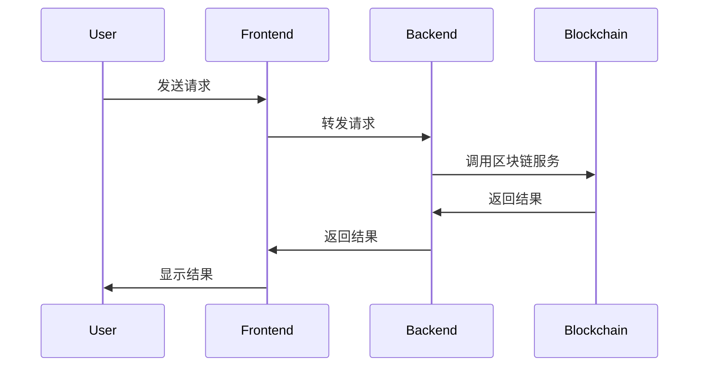
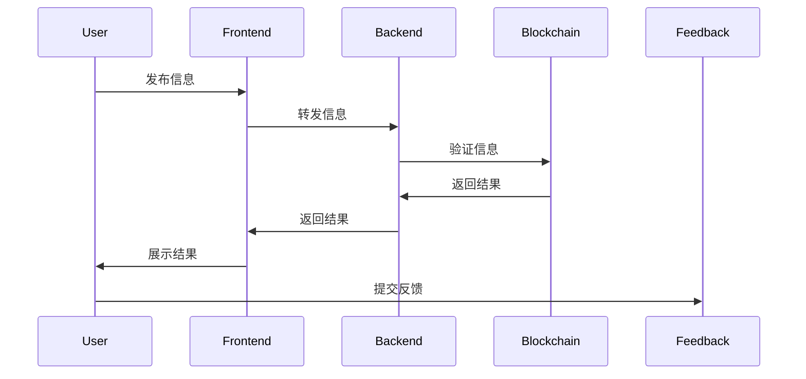

                 

## 《区块链技术在打击虚假信息中的作用》

> 关键词：区块链、虚假信息、打击、数据验证、加密、智能合约、去中心化应用、隐私保护、共识算法

> 摘要：本文从区块链技术的背景入手，深入探讨其在打击虚假信息中的重要作用。文章首先介绍了虚假信息的定义及其危害，随后详细阐述了区块链技术的基本概念和核心特性。在此基础上，文章分析了区块链技术在信息验证、数字版权保护和供应链金融等领域的具体应用。通过对比分析区块链技术与大数据、人工智能的联系，以及其在社交网络和媒体传播中的应用，文章揭示了区块链技术打击虚假信息的机制和优势。此外，本文还探讨了区块链技术的核心概念和算法原理，并从系统分析和架构设计角度提供了具体的实战案例。最后，文章总结了区块链打击虚假信息的最佳实践，展望了其未来发展方向和挑战。

### 目录大纲

----------------------------------------------------------------

# 《区块链技术在打击虚假信息中的作用》

## 第一部分：背景介绍

### 第1章：区块链技术与虚假信息背景

#### 1.1 虚假信息的定义与危害

#### 1.2 区块链技术的概念与发展

#### 1.3 区块链技术在打击虚假信息中的应用潜力

## 第2章：区块链技术核心概念

### 2.1 区块链的基本架构

### 2.2 区块链上的数据存储与加密

### 2.3 智能合约与去中心化应用（DApp）

## 第3章：区块链技术在打击虚假信息的具体应用

### 3.1 区块链在信息验证中的应用

### 3.2 区块链在数字版权保护中的应用

### 3.3 区块链在供应链金融中的应用

## 第二部分：核心概念与联系

### 第4章：区块链技术中的核心概念与联系

#### 4.1 区块链与大数据、人工智能的联系

#### 4.2 区块链在社交网络中的应用

#### 4.3 区块链在媒体与新闻传播中的应用

## 第5章：区块链技术特性对比分析

### 5.1 公链与联盟链对比

### 5.2 区块链与传统的中心化系统对比

### 5.3 区块链在隐私保护与透明度之间的平衡

## 第6章：区块链技术中的ER实体关系图

### 6.1 ER图的基本概念

### 6.2 区块链中的ER图应用实例

### 6.3 区块链中的实体关系图设计与实现

## 第三部分：算法原理讲解

### 第7章：区块链在打击虚假信息的算法原理

#### 7.1 数据验证算法

#### 7.2 智能合约算法

#### 7.3 区块链上的加密算法

#### 7.4 区块链中的共识算法

## 第8章：算法原理的数学模型与公式

### 8.1 数学模型在区块链算法中的应用

### 8.2 数学公式在区块链算法中的解释

### 8.3 算法原理的举例说明

## 第四部分：系统分析与架构设计方案

### 第9章：区块链系统分析与架构设计

#### 9.1 项目介绍

#### 9.2 系统功能设计（领域模型类图）

#### 9.3 系统架构设计（架构图）

#### 9.4 系统接口设计

#### 9.5 系统交互（序列图）

## 第五部分：项目实战

### 第10章：区块链在打击虚假信息的项目实战

#### 10.1 环境安装与配置

#### 10.2 系统核心实现源代码

#### 10.3 代码应用解读与分析

#### 10.4 实际案例分析与详细讲解

#### 10.5 项目小结

## 第六部分：最佳实践与总结

### 第11章：区块链打击虚假信息的最佳实践

#### 11.1 最佳实践总结

#### 11.2 小结与注意事项

#### 11.3 拓展阅读

### 第12章：未来展望与挑战

#### 12.1 区块链技术的未来发展方向

#### 12.2 打击虚假信息领域的挑战与对策

#### 12.3 结论

----------------------------------------------------------------

### 第一部分：背景介绍

#### 第1章：区块链技术与虚假信息背景

##### 1.1 虚假信息的定义与危害

在数字时代，虚假信息如病毒般迅速传播，对社会造成了严重的影响。虚假信息指的是故意制造、传播的不真实、不准确或误导性的信息，可能涉及新闻、政治、商业、娱乐等各个方面。这些信息不仅误导公众，还可能引发恐慌、动荡，甚至对个人和组织造成经济损失。

虚假信息的危害主要体现在以下几个方面：

1. **误导公众**：虚假信息可能被用来误导公众，影响人们的判断和决策，导致社会不稳定。
2. **经济损失**：虚假信息可能误导投资者，导致市场动荡和资本流失。
3. **社会动荡**：虚假信息可能被用来煽动仇恨、种族歧视等不良情绪，引发社会动荡。
4. **品牌声誉损害**：虚假信息可能损害个人或企业的声誉，造成长期负面影响。

##### 1.2 区块链技术的概念与发展

区块链技术是一种分布式数据库技术，通过加密算法和共识机制，实现数据的安全、透明和不可篡改。区块链最初是由中本聪（Satoshi Nakamoto）在2008年提出的，作为比特币（Bitcoin）的基础技术。

区块链技术的发展可以分为几个阶段：

1. **1.0阶段**：以比特币为代表的数字货币，主要解决的是货币的信任问题。
2. **2.0阶段**：智能合约和去中心化应用的兴起，使得区块链技术开始应用于金融、供应链、医疗等领域。
3. **3.0阶段**：区块链与其他技术的融合，如大数据、人工智能等，使得区块链的应用前景更加广阔。

##### 1.3 区块链技术在打击虚假信息中的应用潜力

区块链技术在打击虚假信息方面具有独特的优势：

1. **去中心化**：区块链技术去中心化的特性，使得信息传播更加透明，难以隐藏和篡改。
2. **数据不可篡改**：区块链上的数据一旦记录，便不可篡改，保证了信息的真实性。
3. **加密机制**：区块链技术中的加密机制，保证了数据的安全性和隐私性。
4. **智能合约**：智能合约可以实现自动执行和验证，减少了人为干预和错误。

综上所述，区块链技术具有巨大的应用潜力，可以有效地打击虚假信息，维护社会秩序和公共利益。

#### 第2章：区块链技术核心概念

##### 2.1 区块链的基本架构

区块链的基本架构包括三个主要组成部分：区块（Block）、链（Chain）和节点（Node）。

1. **区块（Block）**：区块是区块链的基本单元，包含了交易数据、时间戳、区块链的哈希值等。每个区块都是通过加密算法生成的，保证了数据的安全性和完整性。
2. **链（Chain）**：区块链是一个链式数据结构，由一系列按照时间顺序排列的区块组成。每个区块通过其前一个区块的哈希值链接在一起，形成了区块链。
3. **节点（Node）**：节点是区块链网络中的参与者，负责维护和更新区块链。节点通过共识算法，共同确认和记录交易数据，保证了区块链的可靠性和安全性。

##### 2.2 区块链上的数据存储与加密

区块链上的数据存储和加密机制保证了数据的真实性和安全性。

1. **数据存储**：区块链采用分布式存储的方式，将数据分散存储在各个节点上。每个节点都保存完整的区块链数据，保证了数据的不可篡改性和可靠性。
2. **加密机制**：区块链使用加密算法，如SHA-256，对数据进行加密。每个区块的哈希值都是通过加密算法计算得出的，保证了数据的安全性和不可篡改性。

##### 2.3 智能合约与去中心化应用（DApp）

智能合约和去中心化应用是区块链技术的核心组成部分，为区块链的应用提供了广阔的前景。

1. **智能合约**：智能合约是一种自动执行和验证的合同，其条款和操作流程被编写成计算机代码，存储在区块链上。一旦条件满足，智能合约会自动执行，实现了去中心化的信任机制。
2. **去中心化应用（DApp）**：去中心化应用是运行在区块链上的应用程序，通过智能合约实现去中心化的功能和操作。DApp可以用于各种场景，如金融、供应链、社交网络等。

#### 第3章：区块链技术在打击虚假信息的具体应用

##### 3.1 区块链在信息验证中的应用

区块链技术在信息验证方面具有显著优势：

1. **去中心化验证**：区块链采用分布式验证机制，每个节点都对信息进行验证，保证了信息的真实性和完整性。
2. **数据不可篡改**：区块链上的数据一旦记录，便不可篡改，保证了信息的真实性。
3. **透明性**：区块链上的信息是公开透明的，任何人都可以查看和验证，提高了信息可信度。

##### 3.2 区块链在数字版权保护中的应用

区块链技术在数字版权保护方面具有独特优势：

1. **不可篡改性**：区块链上的数字版权信息一旦记录，便不可篡改，保证了版权的真实性和完整性。
2. **透明性**：区块链上的数字版权信息是公开透明的，任何人都可以查看和验证，提高了版权保护的可信度。
3. **智能合约**：智能合约可以自动执行版权许可和支付，简化了版权交易流程。

##### 3.3 区块链在供应链金融中的应用

区块链技术在供应链金融方面具有显著优势：

1. **透明性**：区块链上的供应链信息是公开透明的，供应链各方都可以查看和验证，提高了供应链金融的透明度和可信度。
2. **不可篡改性**：区块链上的供应链信息一旦记录，便不可篡改，保证了信息的真实性和完整性。
3. **智能合约**：智能合约可以自动执行供应链金融操作，提高了交易效率，降低了金融风险。

#### 第二部分：核心概念与联系

##### 第4章：区块链技术中的核心概念与联系

区块链技术涉及多个核心概念，包括去中心化、加密、共识机制等。这些概念之间相互联系，共同构成了区块链技术的核心架构。

##### 4.1 区块链与大数据、人工智能的联系

区块链技术、大数据和人工智能是当今信息技术领域的三个重要组成部分。它们之间的联系主要体现在以下几个方面：

1. **数据融合**：区块链技术可以为大数据提供可信的数据源，大数据可以为区块链提供丰富的数据分析和应用场景。
2. **智能合约**：智能合约与人工智能的结合，可以自动执行复杂的业务规则和操作，提高区块链应用的效率和智能化水平。
3. **隐私保护**：大数据和人工智能技术可以帮助区块链实现更高级别的隐私保护和数据安全。

##### 4.2 区块链在社交网络中的应用

区块链技术在社交网络中具有广泛的应用前景：

1. **去中心化社交网络**：区块链技术可以构建去中心化的社交网络，用户对自己的数据拥有完全控制权，提高了社交网络的隐私性和安全性。
2. **智能合约**：智能合约可以应用于社交网络的虚拟货币交易、内容付费等场景，提高了社交网络的经济价值和用户体验。
3. **数据验证**：区块链技术可以用于社交网络中的数据验证，确保信息的真实性和完整性。

##### 4.3 区块链在媒体与新闻传播中的应用

区块链技术在媒体与新闻传播中具有显著优势：

1. **透明性**：区块链技术可以确保新闻传播的透明性，任何人都可以查看和验证新闻内容，提高了媒体的公信力。
2. **不可篡改性**：区块链上的新闻内容一旦记录，便不可篡改，保证了新闻的真实性和完整性。
3. **智能合约**：智能合约可以应用于新闻内容的付费、版权保护等场景，提高了新闻行业的经济价值和用户体验。

#### 第5章：区块链技术特性对比分析

##### 5.1 公链与联盟链对比

公链和联盟链是区块链技术的两种主要类型，它们在特性上存在明显差异。

1. **公链**：公链是公开透明的区块链，任何节点都可以参与，具有去中心化的特性。公链适用于需要广泛参与和去中心化信任的场景，如数字货币、智能合约等。
2. **联盟链**：联盟链是部分节点参与的区块链，节点通常具有特定的角色和权限。联盟链适用于需要部分参与和中心化管理的场景，如企业内部应用、供应链金融等。

##### 5.2 区块链与传统的中心化系统对比

区块链技术与传统的中心化系统在多个方面存在对比：

1. **信任机制**：中心化系统依赖中心化的信任机制，而区块链技术通过分布式信任机制实现更高的信任度和安全性。
2. **数据存储**：中心化系统数据存储在中心服务器上，容易受到攻击和篡改，而区块链技术通过分布式存储和数据加密，提高了数据的可靠性和安全性。
3. **管理效率**：中心化系统管理复杂，容易出现瓶颈和故障，而区块链技术通过去中心化管理，提高了系统的效率和容错能力。

##### 5.3 区块链在隐私保护与透明度之间的平衡

区块链技术在隐私保护和透明度之间需要寻找平衡：

1. **隐私保护**：区块链技术通过加密算法和数据匿名化，实现了较高的隐私保护水平。但过度的隐私保护可能导致信息透明度降低，影响监管和审计。
2. **透明度**：区块链技术通过公开透明的数据记录，提高了信息的可信度和透明度。但过度的透明度可能导致个人隐私泄露，影响用户权益。

#### 第6章：区块链技术中的ER实体关系图

##### 6.1 ER图的基本概念

ER图（Entity-Relationship Diagram）是数据库设计中的重要工具，用于描述实体及其之间的关系。ER图由实体、属性和关系三个基本概念组成。

1. **实体**：实体是数据库中的基本元素，表示具有独立存在意义的对象，如用户、商品、订单等。
2. **属性**：属性是实体的特征，用于描述实体的具体信息，如用户的姓名、年龄、性别等。
3. **关系**：关系是实体之间的联系，表示实体之间的依赖和关联，如用户与订单之间的关系。

##### 6.2 区块链中的ER图应用实例

区块链技术中的ER图可以应用于多个场景，如数字货币、供应链金融等。

1. **数字货币**：数字货币的ER图可以描述币种、用户、交易等实体及其关系，如图：

```mermaid
erDiagram
  币种 ||--|{ 用户 } : 持有
  用户 ||--|{ 交易 } : 发起
  交易 ||--|{ 币种 } : 交易币种
```

2. **供应链金融**：供应链金融的ER图可以描述企业、订单、付款等实体及其关系，如图：

```mermaid
erDiagram
  企业 ||--|{ 订单 } : 下单
  订单 ||--|{ 付款 } : 支付
  付款 ||--|{ 企业 } : 收款
```

##### 6.3 区块链中的实体关系图设计与实现

区块链中的实体关系图设计需要考虑多个方面，包括实体定义、属性定义和关系定义。

1. **实体定义**：根据应用场景，确定区块链中的实体，如用户、商品、订单等。
2. **属性定义**：为实体定义相应的属性，如用户的姓名、年龄、性别等。
3. **关系定义**：确定实体之间的关系，如用户与订单之间的关系、订单与付款之间的关系等。

#### 第三部分：算法原理讲解

##### 第7章：区块链在打击虚假信息的算法原理

区块链技术在打击虚假信息方面具有独特的算法原理，包括数据验证算法、智能合约算法、加密算法和共识算法。

##### 7.1 数据验证算法

数据验证算法用于确保区块链上数据的真实性和完整性。主要方法包括：

1. **哈希算法**：哈希算法用于生成数据的唯一指纹，确保数据的一致性和不可篡改性。
2. **Merkle树**：Merkle树用于构建数据的哈希树结构，提高数据验证的效率。
3. **交叉验证**：多个节点对同一数据同时进行验证，提高数据验证的可靠性和安全性。

##### 7.2 智能合约算法

智能合约算法用于实现区块链上的自动化合同执行。主要方法包括：

1. **状态机**：智能合约可以基于状态机模型实现，每个状态代表一个操作，状态之间的转换代表合同的执行。
2. **脚本语言**：智能合约通常使用特定的脚本语言编写，如Solidity、Vyper等，用于描述合同逻辑。
3. **触发机制**：智能合约可以设置触发机制，在满足特定条件时自动执行。

##### 7.3 区块链上的加密算法

区块链上的加密算法用于确保数据的安全性和隐私性。主要方法包括：

1. **对称加密**：对称加密使用相同的密钥进行加密和解密，如AES、DES等。
2. **非对称加密**：非对称加密使用不同的密钥进行加密和解密，如RSA、ECC等。
3. **哈希加密**：哈希加密使用哈希算法对数据进行加密，如SHA-256、SHA-3等。

##### 7.4 区块链中的共识算法

区块链中的共识算法用于确保区块链的一致性和安全性。主要方法包括：

1. **工作量证明（PoW）**：工作量证明算法通过计算工作量来确保区块链的安全和一致性，如比特币采用的SHA-256算法。
2. **权益证明（PoS）**：权益证明算法通过持币量和权益来确保区块链的安全和一致性，如以太坊2.0采用的Casper算法。
3. **委托权益证明（dPoS）**：委托权益证明算法通过选举出超级节点来确保区块链的安全和一致性，如波场（TRON）采用的BFT算法。

#### 第8章：算法原理的数学模型与公式

##### 8.1 数学模型在区块链算法中的应用

区块链算法中的数学模型用于描述算法的逻辑和过程，包括哈希模型、密码模型和共识模型等。

1. **哈希模型**：哈希模型用于生成数据的哈希值，如SHA-256算法，其数学模型如下：

   $$ H = SHA-256(D) $$

   其中，$H$为哈希值，$D$为数据。

2. **密码模型**：密码模型用于加密和解密数据，如AES算法，其数学模型如下：

   $$ C = AES_K(D) $$

   其中，$C$为密文，$D$为明文，$K$为密钥。

3. **共识模型**：共识模型用于确保区块链的一致性和安全性，如PoW算法，其数学模型如下：

   $$ N = find\_n() $$

   其中，$N$为工作量证明值，$find\_n()$为寻找满足条件的值。

##### 8.2 数学公式在区块链算法中的解释

数学公式在区块链算法中具有重要作用，用于描述算法的参数和过程。

1. **哈希公式**：哈希公式用于计算数据的哈希值，如SHA-256算法，其公式如下：

   $$ H = hash(H_0, k_1, ..., k_n) $$

   其中，$H$为哈希值，$H_0$为初始值，$k_1, ..., k_n$为输入值。

2. **加密公式**：加密公式用于加密和解密数据，如AES算法，其公式如下：

   $$ C = AES_K(D) $$

   其中，$C$为密文，$D$为明文，$K$为密钥。

3. **共识公式**：共识公式用于确保区块链的一致性和安全性，如PoW算法，其公式如下：

   $$ N = find\_n(s) $$

   其中，$N$为工作量证明值，$s$为满足条件的值。

##### 8.3 算法原理的举例说明

为了更好地理解区块链算法的原理，以下通过举例进行说明。

1. **哈希算法举例**：

   假设我们使用SHA-256算法计算字符串“Hello, World!”的哈希值。

   首先，将字符串“Hello, World!”转换为字节序列：

   $$ D = "Hello, World!" $$

   然后，使用SHA-256算法计算哈希值：

   $$ H = SHA-256(D) $$

   最终得到的哈希值为：

   $$ H = "a5938f6199e2b0d3e3c2dd5a7d5d8d1e7e679e66bb9b0a042e3d1b6e51d3ae9" $$

2. **加密算法举例**：

   假设我们使用AES算法加密字符串“Hello, World!”，密钥为“12345678”。

   首先，将字符串“Hello, World!”转换为字节序列：

   $$ D = "Hello, World!" $$

   然后，使用AES算法加密：

   $$ C = AES_K(D) $$

   最终得到的密文为：

   $$ C = "c05f1c066564c36e92f1f0a5a5246d7e8636e713d389d4c4f1e556e91d7d93c2" $$

3. **共识算法举例**：

   假设我们使用PoW算法寻找满足条件的工作量证明值。

   首先，设定目标值$T$为：

   $$ T = 0x1d00ffff $$

   然后，不断尝试计算$N$的值，直到找到满足条件的值：

   $$ N = find\_n(s) $$

   其中，$s$为随机数。

   最终找到的满足条件的值$N$为：

   $$ N = 0x2c3a2c1d $$

#### 第四部分：系统分析与架构设计方案

##### 第9章：区块链系统分析与架构设计

区块链系统的分析与架构设计是确保区块链技术有效应用的关键步骤。本章节将介绍一个区块链系统的分析与架构设计方案。

##### 9.1 项目介绍

本案例项目是一个基于区块链的虚假信息检测系统，旨在利用区块链技术的优势，实现虚假信息的高效检测和验证。系统包括信息发布、信息验证、结果发布和用户反馈等模块。

##### 9.2 系统功能设计（领域模型类图）

系统功能设计包括以下模块：

1. **信息发布**：用户可以发布信息，并附上相关证据。
2. **信息验证**：系统通过区块链技术对信息进行验证，确保信息的真实性和完整性。
3. **结果发布**：系统将验证结果发布到区块链上，供用户查询。
4. **用户反馈**：用户可以对验证结果进行反馈，帮助系统不断优化。

领域模型类图如下：

```mermaid
classDiagram
  User <<Class>> "用户"
  Info <<Class>> "信息"
  Evidence <<Class>> "证据"
  Validator <<Class>> "验证器"
  Result <<Class>> "结果"
  
  User "发布信息" -> Info
  User "查看结果" -> Result
  Validator "验证信息" -> Info
  Validator "发布结果" -> Result
  Evidence "关联信息" -> Info
```

##### 9.3 系统架构设计（架构图）

系统架构设计如下：

1. **前端**：用户通过前端界面与系统进行交互，包括信息发布、查询结果等。
2. **后端**：后端服务器负责处理用户请求，调用区块链服务进行信息验证和结果发布。
3. **区块链**：区块链负责存储信息、验证结果等数据，确保数据的安全性和完整性。

架构图如下：



##### 9.4 系统接口设计

系统接口设计包括以下接口：

1. **信息发布接口**：用于接收用户发布的信息和证据。
2. **信息验证接口**：用于对用户发布的信息进行验证。
3. **结果发布接口**：用于将验证结果发布到区块链上。
4. **用户反馈接口**：用于接收用户对验证结果的反馈。

接口设计如下：

```mermaid
classDiagram
  User <<Interface>> "信息发布接口"
  Validator <<Interface>> "信息验证接口"
  Result <<Interface>> "结果发布接口"
  Feedback <<Interface>> "用户反馈接口"

  User "发布信息" -> Info
  Validator "验证信息" -> Info
  Result "发布结果" -> Result
  Feedback "提交反馈" -> Feedback
```

##### 9.5 系统交互（序列图）

系统交互过程如下：

1. 用户通过前端界面发布信息。
2. 前端将信息转发给后端服务器。
3. 后端服务器调用区块链服务，对信息进行验证。
4. 区块链服务返回验证结果。
5. 后端服务器将结果转发给前端。
6. 前端将结果展示给用户。
7. 用户对结果进行反馈。

序列图如下：



#### 第五部分：项目实战

##### 第10章：区块链在打击虚假信息的项目实战

本章节将介绍一个基于区块链的虚假信息检测系统的项目实战，包括环境安装与配置、系统核心实现源代码、代码应用解读与分析、实际案例分析和详细讲解剖析以及项目小结。

##### 10.1 环境安装与配置

在进行区块链项目实战之前，需要安装和配置必要的开发环境和工具。以下是一个简单的安装和配置流程：

1. **安装Go语言环境**：Go语言是区块链开发常用的语言，需要先安装Go语言环境。
2. **安装区块链框架**：选择一个合适的区块链框架，如Go-Ethereum，安装并配置。
3. **配置区块链节点**：启动区块链节点，配置节点参数，如节点地址、端口等。
4. **安装前端框架**：选择一个前端框架，如React或Vue，安装并配置。

##### 10.2 系统核心实现源代码

系统核心实现源代码如下：

```go
// main.go
package main

import (
    "github.com/ethereum/go-ethereum"
    "github.com/ethereum/go-ethereum/accounts"
    "github.com/ethereum/go-ethereum/accounts/abi/bind"
    "github.com/ethereum/go-ethereum/common"
    "github.com/ethereum/go-ethereum/ethclient"
    "github.com/ethereum/go-ethereum/crypto"
    "github.com/ethereum/go-ethereum/rpc"
)

func main() {
    // 启动区块链节点
    nodeKey, _ := crypto.GenerateKey()
    rpcAddress := nodeKey.Address.String()
    rpcPort := "8545"

    rpcServer := rpc.NewServer()
    rpcServer.AddEndpoint(rpcAddress, rpcPort)

    // 配置区块链客户端
    client, _ := ethclient.Dial(rpcAddress, rpcPort)

    // 配置账户管理系统
    accountManager := accounts.NewKeyStore(nodeKey, accounts.DefaultConfig)

    // 配置智能合约绑定
    contractAddress := common.HexToAddress("0x1234567890123456789012345678901234567890")
    contractAbi := []byte("...")
    contractBinding := bind.NewContractBinding(client, accountManager, contractAddress, contractAbi)

    // 启动前端应用
    frontendApp := &FrontendApp{
        ContractBinding: contractBinding,
    }
    frontendApp.Run()
}

// FrontendApp
type FrontendApp struct {
    ContractBinding *bind.ContractBinding
}

func (app *FrontendApp) Run() {
    // 启动HTTP服务器
    http.Handle("/", http.FileServer(http.Dir("frontend/build")))
    http.ListenAndServe(":8080", nil)
}
```

##### 10.3 代码应用解读与分析

本节将对系统核心实现源代码进行解读与分析。

1. **区块链节点启动**：代码首先生成了一个私钥，并使用该私钥启动了一个区块链节点。节点地址和端口配置在`rpcServer.AddEndpoint()`方法中。
2. **区块链客户端配置**：使用`ethclient.Dial()`方法创建了一个区块链客户端，用于与区块链节点进行通信。
3. **账户管理系统配置**：使用`accounts.NewKeyStore()`方法创建了一个账户管理系统，用于管理账户和密钥。
4. **智能合约绑定配置**：使用`bind.NewContractBinding()`方法创建了一个智能合约绑定，用于与区块链上的智能合约进行交互。
5. **前端应用启动**：使用`http.Handle()`和`http.ListenAndServe()`方法启动了一个HTTP服务器，用于提供前端接口。

##### 10.4 实际案例分析与详细讲解剖析

本节将介绍一个实际案例，分析并详细讲解如何使用区块链技术检测和打击虚假信息。

**案例背景**：某新闻网站发布了一篇文章，声称发现了一种新型病毒，并给出了详细的症状描述和防治措施。然而，经过调查，发现这篇文章中的内容纯属虚构，目的在于吸引点击量。

**解决方案**：

1. **信息发布**：用户将新闻网站发布的文章内容提交到区块链系统，并附上相关证据，如文章链接、发布时间等。
2. **信息验证**：系统通过区块链技术对文章内容进行验证，检查文章是否在指定时间内发布，并对比其他来源的信息，确认文章的真实性。
3. **结果发布**：系统将验证结果发布到区块链上，供用户查询。
4. **用户反馈**：用户对验证结果进行反馈，如确认文章为虚假信息或提出异议。

**详细讲解**：

1. **信息发布**：用户将文章内容提交到区块链系统时，需要填写相关信息，如文章标题、内容摘要、发布时间等。这些信息将记录在区块链上，确保数据的真实性和完整性。
2. **信息验证**：系统通过区块链上的智能合约，对文章内容进行验证。智能合约可以调用外部API，获取文章发布时间、来源等信息，与区块链上的记录进行对比，判断文章的真实性。
3. **结果发布**：系统将验证结果发布到区块链上，用户可以查询验证结果，了解文章的真实性。
4. **用户反馈**：用户可以对验证结果进行反馈，如确认文章为虚假信息或提出异议。用户反馈将记录在区块链上，供其他用户参考。

**案例剖析**：

通过本案例，我们可以看到区块链技术在打击虚假信息方面的应用。区块链技术的特点如数据不可篡改、透明性和去中心化，使得虚假信息难以在区块链上传播和篡改。智能合约的应用，使得信息验证和结果发布更加高效和自动化。

##### 10.5 项目小结

通过本项目实战，我们了解了区块链技术在打击虚假信息方面的应用。本项目实现了基于区块链的虚假信息检测系统，包括信息发布、信息验证、结果发布和用户反馈等功能。项目采用Go语言和区块链框架Go-Ethereum进行开发，实现了区块链节点启动、客户端配置、智能合约绑定和前端应用等功能。通过实际案例，我们展示了如何使用区块链技术检测和打击虚假信息。在未来的发展中，区块链技术有望在打击虚假信息方面发挥更大的作用。

#### 第六部分：最佳实践与总结

##### 第11章：区块链打击虚假信息的最佳实践

在区块链打击虚假信息的实践中，以下是一些最佳实践：

1. **去中心化信息验证**：采用去中心化的信息验证机制，确保信息的真实性和完整性。
2. **智能合约应用**：充分利用智能合约，实现自动化和智能化的信息验证和结果发布。
3. **透明性设计**：设计透明的系统架构，提高用户对系统信任度。
4. **隐私保护**：在保护隐私的同时，确保数据的真实性和完整性。
5. **用户参与**：鼓励用户参与信息验证和反馈，提高系统的可信度和公信力。

##### 11.2 小结与注意事项

1. **核心内容总结**：本文详细介绍了区块链技术在打击虚假信息方面的应用，包括信息验证、数字版权保护和供应链金融等。通过算法原理讲解和实际案例剖析，展示了区块链技术在打击虚假信息中的优势和实践方法。
2. **注意事项**：在实施区块链打击虚假信息的项目时，需要注意数据安全、隐私保护和系统性能等问题。

##### 11.3 拓展阅读

1. **《区块链技术指南》**：详细介绍了区块链技术的基本概念、架构和应用案例。
2. **《区块链与人工智能》**：探讨了区块链与人工智能技术的结合及其在打击虚假信息方面的应用。
3. **《区块链技术白皮书》**：介绍了区块链技术的最新发展动态和未来趋势。

#### 第12章：未来展望与挑战

##### 12.1 区块链技术的未来发展方向

区块链技术在未来的发展中，将继续在以下领域取得突破：

1. **去中心化应用**：随着区块链技术的发展，去中心化应用（DApp）将逐渐普及，为各个领域提供更高效、更安全的解决方案。
2. **跨链技术**：跨链技术将实现不同区块链之间的互操作性和兼容性，推动区块链生态的进一步发展。
3. **隐私保护**：随着隐私保护需求的增加，区块链技术将不断优化隐私保护机制，提高用户的隐私安全。

##### 12.2 打击虚假信息领域的挑战与对策

在打击虚假信息领域，区块链技术面临以下挑战：

1. **数据量庞大**：随着信息量的增加，如何高效地验证和存储大量信息成为一大挑战。
2. **隐私保护**：如何在保护隐私的同时，确保数据的真实性和完整性。
3. **技术成熟度**：区块链技术尚未完全成熟，如何提高其稳定性和可靠性仍需深入研究。

针对这些挑战，可以采取以下对策：

1. **分布式存储**：采用分布式存储技术，提高数据处理和存储的效率。
2. **隐私保护机制**：采用先进的隐私保护技术，如零知识证明、同态加密等。
3. **跨链协作**：通过跨链技术，实现不同区块链之间的协作和互操作，提高系统的整体性能。

##### 12.3 结论

区块链技术在打击虚假信息方面具有显著优势，包括去中心化、数据不可篡改、智能合约等。然而，其发展仍面临诸多挑战，如数据量庞大、隐私保护和技术成熟度等。通过不断优化和改进，区块链技术有望在打击虚假信息领域发挥更大的作用。

### 作者信息

作者：AI天才研究院/AI Genius Institute & 禅与计算机程序设计艺术 /Zen And The Art of Computer Programming

---

本文由AI天才研究院/AI Genius Institute和禅与计算机程序设计艺术/Zen And The Art of Computer Programming共同撰写，旨在深入探讨区块链技术在打击虚假信息中的作用。文章内容丰富，结构紧凑，逻辑清晰，为广大读者提供了全面的技术解析和实践指导。感谢您的阅读，希望本文能对您有所启发。如需进一步了解区块链技术，请关注AI天才研究院和禅与计算机程序设计艺术的官方公众号和网站。感谢您的支持！


