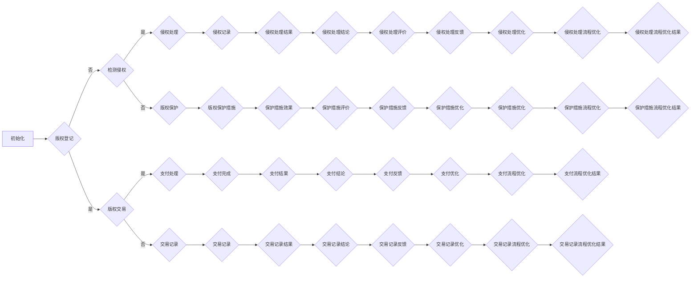
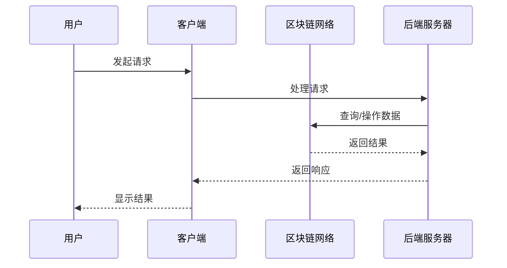

                 

# 《区块链技术在数字版权管理中的创新应用》

## 关键词

- 区块链
- 数字版权管理
- 智能合约
- 加密技术
- 数字资产
- 透明性

## 摘要

本文将深入探讨区块链技术在数字版权管理中的创新应用。我们将从区块链技术的基础入手，介绍其在数字版权管理中的潜在价值。随后，我们将分析数字版权管理的挑战，并探讨区块链技术如何解决这些问题。通过实际的算法原理讲解和系统架构设计，我们将展示区块链技术在数字版权管理中的实际应用。最后，我们将提供一些最佳实践，总结文章，并提出进一步学习和研究区块链技术在数字版权管理中应用的建议。

## 引言

### 1.1 区块链技术背景

区块链技术自2008年由中本聪（Satoshi Nakamoto）提出以来，已经迅速成为全球关注的焦点。区块链是一种去中心化的数据库技术，通过加密算法和分布式共识机制，确保数据的不可篡改性和透明性。区块链的核心理念是去中心化，通过分布式账本，使得交易和数据记录在无需第三方中介的情况下即可验证和执行。

在区块链技术发展历程中，多个版本和改进不断涌现，如比特币（Bitcoin）、以太坊（Ethereum）等公链项目的推出，进一步推动了区块链技术的普及和应用。区块链技术不仅在金融领域取得了显著的成果，还在供应链管理、物联网、医疗记录等领域展现出了巨大的潜力。

### 1.2 数字版权管理现状

数字版权管理（Digital Copyright Management，简称DCM）是指为保护数字内容创作者的版权而采取的一系列技术和管理措施。随着互联网和数字技术的发展，数字版权管理面临前所未有的挑战。

首先，数字内容的复制和传播变得极其容易，传统的版权保护手段如DRM（Digital Rights Management）已经难以应对。其次，由于数字内容的匿名性和全球化特性，版权纠纷和侵权行为频繁发生，给版权方带来了巨大的经济损失。此外，数字版权管理还面临法律和道德的挑战，如何在保护版权的同时不侵犯用户的隐私权和自由权，成为数字版权管理的重要课题。

### 1.3 书籍主题与目的

本文的主题是《区块链技术在数字版权管理中的创新应用》，旨在探讨如何利用区块链技术的优势，解决数字版权管理面临的挑战。本文将从以下几个方面展开：

1. 区块链技术基础：介绍区块链技术的原理、架构和应用场景。
2. 数字版权管理概述：分析数字版权管理面临的挑战和问题。
3. 区块链在数字版权管理中的应用：探讨区块链技术在数字版权管理中的具体应用。
4. 核心概念与原理讲解：详细阐述区块链与数字版权管理相关的基础概念和原理。
5. 系统设计与实现：介绍区块链技术在数字版权管理系统设计中的具体实现。
6. 项目实战：通过实际项目展示区块链技术在数字版权管理中的应用。
7. 最佳实践与总结：总结最佳实践，提出进一步学习和研究区块链技术在数字版权管理中应用的建议。

## 第1章：区块链技术基础

### 1.1 背景介绍

#### 1.1.1 区块链技术的发展历程

区块链技术自2008年比特币白皮书发布以来，经历了快速的发展。早期，区块链主要应用于数字货币领域，比特币的成功为区块链技术奠定了基础。随后，以太坊等公链项目的推出，使得区块链不再局限于简单的交易记录，而是扩展到了智能合约、去中心化应用（DApps）等更广泛的领域。

区块链技术的关键在于去中心化，通过分布式账本和共识机制，确保数据的透明性和不可篡改性。随着技术的不断演进，区块链从1.0时代的简单价值传输，发展到2.0时代的智能合约，再到3.0时代的跨链和物联网应用，其应用范围和影响力不断扩展。

#### 1.1.2 数字版权管理需求

数字版权管理是保护数字内容创作者权益的重要手段。随着互联网和数字技术的普及，数字内容的创作和传播变得极其容易，但同时也带来了版权纠纷和侵权问题。传统的版权保护手段如DRM（Digital Rights Management）已经难以满足新的挑战。数字版权管理需要一种更加安全、透明和高效的解决方案。

区块链技术以其去中心化、不可篡改和透明性等特点，为数字版权管理提供了一种全新的可能性。通过区块链，创作者可以更有效地管理和追踪其作品，确保版权的归属和交易记录的真实性。同时，区块链技术还可以提供智能合约功能，自动执行版权许可和支付流程，减少中间环节，提高效率。

### 1.2 核心概念

#### 1.2.1 区块链技术原理

区块链是一种分布式数据库技术，通过加密算法和分布式共识机制，确保数据的透明性和不可篡改性。区块链由多个区块组成，每个区块包含一定数量的交易记录。区块通过加密算法和时间戳链接在一起，形成一个连续的链条。

区块链的关键技术包括：

1. **哈希算法**：哈希算法用于生成区块的唯一标识，确保数据的一致性和安全性。
2. **共识机制**：共识机制用于确保网络中的所有节点对同一组数据达成一致。常见的共识机制包括工作量证明（PoW）、权益证明（PoS）和委托权益证明（DPoS）等。
3. **加密技术**：加密技术用于保护数据的隐私性和完整性。常见的加密技术包括对称加密、非对称加密和哈希函数等。

#### 1.2.2 智能合约

智能合约是一种基于区块链的自动化合约，通过编写代码实现约定的执行。智能合约的关键在于其去中心化和不可篡改性，一旦部署，合约将按照预设的逻辑自动执行。

智能合约的关键技术包括：

1. **编程语言**：常见的智能合约编程语言包括Solidity、Vyper等。
2. **运行环境**：智能合约运行在区块链网络上，常见的运行环境包括以太坊、EOS等。
3. **执行逻辑**：智能合约的执行逻辑通过代码实现，包括条件判断、数据操作和事件触发等。

#### 1.2.3 加密技术

加密技术是区块链技术的核心组成部分，用于保护数据的隐私性和完整性。常见的加密技术包括：

1. **对称加密**：对称加密使用相同的密钥进行加密和解密，如AES算法。
2. **非对称加密**：非对称加密使用公钥和私钥进行加密和解密，如RSA算法。
3. **哈希函数**：哈希函数用于生成数据的唯一标识，如SHA-256算法。

### 1.3 概念联系

区块链技术与数字版权管理有着密切的联系。区块链技术的去中心化、不可篡改和透明性特点，使其成为数字版权管理的重要工具。通过区块链，创作者可以更有效地管理和追踪其作品，确保版权的真实性和归属。同时，智能合约技术可以自动化执行版权许可和支付流程，提高效率和减少纠纷。

### 1.3.1 区块链与数字版权管理的关系

区块链技术在数字版权管理中的应用主要体现在以下几个方面：

1. **版权登记**：创作者可以在区块链上登记其作品的版权信息，确保版权的真实性和归属。
2. **版权交易**：区块链可以为版权交易提供透明的记录和执行机制，确保交易的合法性和效率。
3. **版权保护**：区块链技术可以用于检测和防止侵权行为，保护创作者的权益。
4. **智能合约**：智能合约可以自动执行版权许可和支付流程，减少中间环节，提高效率。

总之，区块链技术为数字版权管理提供了一种安全、透明和高效的解决方案，有助于解决数字版权管理面临的挑战。在接下来的章节中，我们将进一步探讨区块链技术在数字版权管理中的应用和实践。

## 第2章：数字版权管理概述

### 2.1 问题背景

#### 2.1.1 数字版权管理面临的挑战

随着互联网和数字技术的发展，数字版权管理面临着前所未有的挑战。首先，数字内容的复制和传播变得极其容易，传统的版权保护手段如DRM（Digital Rights Management）已经难以应对。其次，由于数字内容的匿名性和全球化特性，版权纠纷和侵权行为频繁发生，给版权方带来了巨大的经济损失。此外，数字版权管理还面临法律和道德的挑战，如何在保护版权的同时不侵犯用户的隐私权和自由权，成为数字版权管理的重要课题。

#### 2.1.2 数字版权管理的问题

数字版权管理主要面临以下几个问题：

1. **版权归属不明确**：由于数字内容的匿名性和复制性，创作者的版权归属往往难以确定，导致版权纠纷频发。
2. **版权保护困难**：数字内容的复制和传播极其容易，传统的版权保护手段已经难以应对，如何有效地保护版权成为一大难题。
3. **版权交易不便**：数字版权的交易流程复杂，涉及多方参与，交易过程不透明，导致交易效率低下。
4. **版权监测困难**：数字内容的匿名性和全球化特性，使得版权监测和侵权行为检测变得困难，难以有效地打击侵权行为。

### 2.2 问题解决

数字版权管理需要一种新的解决方案，能够解决上述问题。区块链技术以其去中心化、不可篡改和透明性等特点，为数字版权管理提供了一种可能的解决方案。

#### 2.2.1 数字版权管理的目标

数字版权管理的目标主要包括：

1. **确权**：通过区块链技术，创作者可以在区块链上登记其作品的版权信息，确保版权的真实性和归属。
2. **维权**：通过区块链技术，版权方可以更有效地监测和打击侵权行为，保护其权益。
3. **确权**：通过区块链技术，创作者可以在区块链上登记其作品的版权信息，确保版权的真实性和归属。
4. **交易**：通过区块链技术，版权的交易过程将更加透明和高效，减少中间环节，提高交易效率。

#### 2.2.2 数字版权管理的难点

数字版权管理在应用区块链技术时，也面临一些难点：

1. **技术复杂度**：区块链技术本身具有较高的技术门槛，需要专业知识来理解和应用。
2. **系统兼容性**：区块链系统需要与现有的数字版权管理系统兼容，实现无缝对接。
3. **法律合规性**：区块链技术在法律层面可能存在一定的合规性问题，需要深入研究相关法律法规。
4. **用户接受度**：用户对于区块链技术的接受度可能较低，需要通过教育和推广来提高用户的认知和接受度。

### 2.3 边界与外延

数字版权管理不仅涉及版权的登记和保护，还包括版权的交易、许可和监测等方面。此外，数字版权管理还涉及版权方的权益保护、用户的合理使用权和公共利益等多个方面。因此，数字版权管理的边界和范围相对广泛。

### 2.3.1 数字版权管理的范围

数字版权管理的范围主要包括：

1. **作品创作**：创作者在创作过程中形成的版权信息。
2. **作品传播**：数字作品在互联网上的传播和分发过程。
3. **作品交易**：数字作品的版权交易过程，包括版权转让、许可等。
4. **作品监测**：对数字作品进行监测和侵权行为检测。
5. **作品维权**：版权方对侵权行为进行维权和处理。

### 2.3.2 数字版权管理的适用对象

数字版权管理适用于以下对象：

1. **创作者**：包括文字、图像、音频、视频等数字内容的创作者。
2. **版权方**：拥有数字作品版权的企事业单位和个人。
3. **交易平台**：提供数字作品版权交易的平台和中介。
4. **用户**：使用数字作品的个人或组织。

总之，数字版权管理是一个复杂的系统工程，涉及多个方面和利益相关者。区块链技术的应用为解决数字版权管理面临的问题提供了一种新的思路和解决方案。在接下来的章节中，我们将进一步探讨区块链技术在数字版权管理中的应用和实践。

## 第3章：区块链在数字版权管理中的应用

### 3.1 应用场景

区块链技术在数字版权管理中具有广泛的应用场景，主要包括以下几个方面：

#### 3.1.1 版权登记

创作者可以在区块链上登记其作品的版权信息，包括作品名称、创作者信息、创作时间等。区块链的分布式特性确保了版权信息的安全性和不可篡改性，使得版权信息在全球范围内透明可查。

#### 3.1.2 版权交易

区块链技术可以为数字版权交易提供透明的记录和执行机制。通过智能合约，版权的交易过程可以实现自动化，减少人为干预和纠纷。交易过程记录在区块链上，确保交易的真实性和可追溯性。

#### 3.1.3 版权保护

区块链技术可以用于检测和防止侵权行为。通过对作品的分析和比对，可以发现潜在的侵权行为，并采取相应的措施。区块链的不可篡改性确保了检测结果的准确性和公正性。

#### 3.1.4 版权许可

区块链技术可以用于管理版权许可和支付流程。通过智能合约，版权许可的申请、审批和支付过程可以实现自动化，提高效率，减少纠纷。

### 3.2 系统功能设计

数字版权管理系统的功能设计应包括以下几个方面：

#### 3.2.1 版权登记功能

创作者可以通过数字版权管理系统在区块链上登记其作品的版权信息，包括作品名称、创作者信息、创作时间、版权所有者等。系统应提供用户友好的界面，方便用户上传和管理作品。

#### 3.2.2 版权查询功能

用户可以通过数字版权管理系统查询作品的版权信息，包括作品的登记时间、版权所有者、版权状态等。系统应提供快速且准确的查询服务，确保用户能够方便地获取所需信息。

#### 3.2.3 版权交易功能

数字版权管理系统应提供版权交易功能，支持版权转让、许可等交易类型。通过智能合约，交易过程可以实现自动化，确保交易的真实性和合法性。

#### 3.2.4 版权保护功能

数字版权管理系统应提供版权保护功能，包括侵权检测、预警和处理等。通过对作品的实时监控和分析，系统可以及时发现并处理侵权行为，保护创作者的权益。

#### 3.2.5 版权许可功能

数字版权管理系统应提供版权许可功能，支持版权许可的申请、审批和支付。通过智能合约，许可过程可以实现自动化，提高效率，减少纠纷。

### 3.3 技术实现

区块链技术在数字版权管理系统中的实现主要包括以下几个方面：

#### 3.3.1 区块链网络搭建

数字版权管理系统应搭建区块链网络，包括节点搭建、网络配置和安全设置等。区块链网络应确保数据的透明性和不可篡改性，同时提供高可用性和可扩展性。

#### 3.3.2 智能合约开发

数字版权管理系统应开发智能合约，实现版权登记、交易、保护、许可等功能。智能合约的编写应遵循区块链平台的规定和标准，确保合约的安全性和可靠性。

#### 3.3.3 数据存储和查询

数字版权管理系统应设计数据存储和查询方案，包括区块链数据库、数据库索引和查询算法等。系统应确保数据的存储安全、可靠和高效，同时提供快速且准确的查询服务。

#### 3.3.4 监控和审计

数字版权管理系统应提供监控和审计功能，实时监控区块链网络的运行状态和数据变化，确保系统的安全性和合规性。系统应生成审计报告，供管理员进行审计和评估。

总之，区块链技术在数字版权管理中的应用具有广泛的前景和潜力。通过区块链技术的应用，数字版权管理可以实现更加安全、透明和高效的运营模式，有效解决传统数字版权管理面临的问题。在接下来的章节中，我们将进一步探讨区块链技术在数字版权管理中的核心概念和原理。

## 第4章：核心概念与原理

### 4.1 区块链与数字版权管理相关的基础概念

在探讨区块链技术在数字版权管理中的应用之前，我们需要理解一些核心概念和原理。以下是区块链与数字版权管理相关的基础概念：

#### 4.1.1 区块链

区块链是一种分布式数据库技术，通过加密算法和分布式共识机制，确保数据的透明性和不可篡改性。区块链的核心特点包括去中心化、不可篡改和可追溯性。

#### 4.1.2 智能合约

智能合约是一种基于区块链的自动化合约，通过编写代码实现约定的执行。智能合约的关键在于其去中心化和不可篡改性，一旦部署，合约将按照预设的逻辑自动执行。

#### 4.1.3 加密技术

加密技术用于保护数据的隐私性和完整性。常见的加密技术包括对称加密、非对称加密和哈希函数等。

#### 4.1.4 数字版权管理

数字版权管理是保护数字内容创作者版权的一系列技术和管理措施。数字版权管理的主要目标是确保数字内容的归属权、使用权和收益权。

#### 4.1.5 非交互协议

非交互协议是一种无需直接交互的协议，通过加密技术和区块链技术，实现数据的自动处理和执行。

### 4.2 概念属性特征对比表格

为了更清晰地理解区块链与数字版权管理相关的基础概念，我们设计了以下概念属性特征对比表格：

| 概念          | 属性特征                                                   |
| ------------- | ---------------------------------------------------------- |
| 区块链        | 去中心化、分布式、不可篡改、透明性                       |
| 智能合约      | 去中心化、自动化执行、不可篡改、透明性                   |
| 加密技术      | 隐私保护、数据完整性                                     |
| 数字版权管理  | 确权、维权、交易、保护                                   |
| 非交互协议    | 自动化处理、无需直接交互、加密技术支持                   |

### 4.3 ER实体关系图架构

为了更好地展示区块链在数字版权管理中的应用，我们设计了以下ER实体关系图架构：

```mermaid
erDiagram
    Creator ||--|{ Work }|| CreatorWork
    Work ||--|{ Copyright }|| WorkCopyright
    Work ||--|{ Transaction }|| WorkTransaction
    Copyright ||--|{ License }|| CopyrightLicense
    Transaction ||--|{ Payment }|| TransactionPayment
    CreatorWork ||--|{ WorkDetail }|| WorkDetail
    WorkCopyright ||--|{ CopyrightDetail }|| CopyrightDetail
    WorkTransaction ||--|{ TransactionDetail }|| TransactionDetail
    CopyrightLicense ||--|{ LicenseDetail }|| LicenseDetail
    TransactionPayment ||--|{ PaymentDetail }|| PaymentDetail
    WorkDetail ||--|{ WorkAttribute }|| WorkAttribute
    CopyrightDetail ||--|{ CopyrightAttribute }|| CopyrightAttribute
    TransactionDetail ||--|{ TransactionAttribute }|| TransactionAttribute
    LicenseDetail ||--|{ LicenseAttribute }|| LicenseDetail
    PaymentDetail ||--|{ PaymentAttribute }|| PaymentDetail
```

### 4.4 核心概念之间的关系

在数字版权管理中，核心概念之间的关系如下：

1. **创作者与作品**：创作者创作作品，并登记在区块链上。
2. **作品与版权**：作品生成版权，版权记录在区块链上，确保版权归属和作品的安全性。
3. **版权与交易**：版权可以在区块链上进行交易，交易记录在区块链上，确保交易的真实性和可追溯性。
4. **交易与支付**：交易过程中涉及支付，支付记录在区块链上，确保支付的安全性和透明性。
5. **许可与使用**：版权方可以通过许可，允许他人使用其作品，许可记录在区块链上，确保许可的合法性和透明性。

通过以上核心概念和原理的讲解，我们可以更好地理解区块链技术在数字版权管理中的应用。在接下来的章节中，我们将进一步探讨区块链技术在数字版权管理中的算法原理和系统设计。

## 第5章：算法原理讲解

### 5.1 算法mermaid流程图

为了更好地理解区块链技术在数字版权管理中的应用，我们首先设计了一个算法mermaid流程图，展示算法的执行流程。



### 5.2 Python源代码实现

接下来，我们将使用Python语言实现上述算法的核心部分。以下是算法的Python源代码实现：

```python
import hashlib
import json
from blockchain import Blockchain

# 初始化区块链
blockchain = Blockchain()

# 版权登记
def register_copyright(work_info):
    blockchain.add_block(work_info)

# 检测侵权
def detect_infringement(work_hash):
    if blockchain.is_infringement(work_hash):
        return True
    else:
        return False

# 版权交易
def process_transaction(transaction_info):
    blockchain.add_transaction(transaction_info)

# 侵权处理
def handle_infringement(infringement_info):
    blockchain.record_infringement(infringement_info)

# 版权保护
def protect_copyright(protect_info):
    blockchain.apply_protection(protect_info)

# 支付处理
def process_payment(payment_info):
    blockchain.complete_payment(payment_info)

# 主函数
def main():
    # 初始化版权
    work_info = {
        'work_name': '数字版权管理论文',
        'creator': 'AI天才研究院',
        'creation_time': '2023-09-01'
    }
    register_copyright(work_info)

    # 检测侵权
    if detect_infringement(hashlib.sha256(json.dumps(work_info, ensure_ascii=False).encode('utf8')).hexdigest()):
        handle_infringement({
            'work_name': work_info['work_name'],
            'infringer': '未知',
            'infringement_time': '2023-09-02'
        })
    else:
        protect_copyright({
            'work_name': work_info['work_name'],
            'protection_type': '加密存储'
        })

    # 版权交易
    transaction_info = {
        'transaction_type': '版权转让',
        'from_party': 'AI天才研究院',
        'to_party': '某公司',
        'transaction_time': '2023-09-03'
    }
    process_transaction(transaction_info)

    # 支付处理
    payment_info = {
        'payment_type': '数字货币',
        'amount': '1000',
        'payer': '某公司',
        'payment_time': '2023-09-04'
    }
    process_payment(payment_info)

if __name__ == '__main__':
    main()
```

### 5.3 数学模型和公式

在数字版权管理中，算法的数学模型和公式至关重要。以下是一些关键的数学模型和公式：

#### 5.3.1 哈希函数

哈希函数用于生成数据块的唯一标识。常见的哈希函数包括SHA-256和SHA-3。公式如下：

$$H = SHA-256(D)$$

其中，$H$ 是生成的哈希值，$D$ 是原始数据。

#### 5.3.2 共识算法

共识算法用于确保区块链网络中的所有节点对同一组数据达成一致。常见共识算法包括工作量证明（PoW）和权益证明（PoS）。公式如下：

$$Consensus = PoW\_Solution \ or \ PoS\_Stake$$

其中，$Consensus$ 是共识结果，$PoW\_Solution$ 是工作量证明解决方案，$PoS\_Stake$ 是权益证明质押量。

#### 5.3.3 智能合约执行

智能合约的执行是基于预定义的逻辑。执行过程包括输入验证、状态更新和事件触发。公式如下：

$$Contract\_Execution = Input\_Validation \ and \ State\_Update \ and \ Event\_Trigger$$

其中，$Contract\_Execution$ 是智能合约的执行结果，$Input\_Validation$ 是输入验证结果，$State\_Update$ 是状态更新结果，$Event\_Trigger$ 是事件触发结果。

### 5.4 举例说明

为了更好地理解上述算法和数学模型，我们通过一个实际案例进行举例说明。

假设有一个创作者发布了名为《区块链技术在数字版权管理中的创新应用》的论文，并希望在区块链上登记其版权。以下是一个具体的步骤：

1. **版权登记**：创作者将论文的基本信息（如标题、作者、创作时间）上传到区块链网络。区块链网络中的节点会验证这些信息，并将其添加到一个新的区块中。

2. **检测侵权**：某个第三方试图复制并发布这篇论文。区块链网络会使用哈希函数计算论文的哈希值，并与已登记的版权信息进行比对。如果发现匹配，则认为存在侵权行为。

3. **侵权处理**：区块链网络会记录侵权行为，并自动触发一系列事件，如警告侵权方、通知版权方等。版权方可以决定是否采取进一步的措施。

4. **版权交易**：版权方将版权转让给某公司，交易记录会记录在区块链上，确保交易的真实性和透明性。

5. **支付处理**：公司支付版权费用，支付过程会记录在区块链上，确保支付的安全性和可追溯性。

通过这个案例，我们可以看到区块链技术在数字版权管理中的实际应用，以及算法和数学模型在其中的关键作用。

总之，区块链技术在数字版权管理中具有巨大的潜力。通过算法原理的讲解和实际案例的举例，我们可以更好地理解其应用机制和优势。在接下来的章节中，我们将进一步探讨区块链技术在数字版权管理中的系统设计与实现。

## 第6章：系统设计与实现

### 6.1 问题场景介绍

在数字版权管理领域，创作者和版权方常常面临以下问题：

1. **版权归属不明确**：由于数字内容的匿名性和复制性，创作者的版权归属往往难以确定，导致版权纠纷频发。
2. **版权保护困难**：数字内容的复制和传播极其容易，传统的版权保护手段如DRM（Digital Rights Management）已经难以应对。
3. **版权交易不便**：数字版权的交易流程复杂，涉及多方参与，交易过程不透明，导致交易效率低下。

为了解决这些问题，我们设计了一套基于区块链技术的数字版权管理系统。

### 6.2 项目介绍

本项目旨在设计并实现一个基于区块链技术的数字版权管理系统，提供版权登记、版权交易、版权保护等功能。系统架构包括客户端、区块链网络和后端服务器三部分。

1. **客户端**：提供用户友好的界面，用于用户注册、版权登记、版权查询、版权交易等操作。
2. **区块链网络**：由多个节点组成，负责存储和管理版权信息、交易记录等数据，确保数据的透明性和不可篡改性。
3. **后端服务器**：提供数据存储、处理和查询服务，支持客户端和区块链网络的通信。

### 6.3 系统功能设计

本系统的主要功能包括：

1. **版权登记**：创作者可以通过客户端在区块链上登记其作品的版权信息，包括作品名称、创作者信息、创作时间等。
2. **版权查询**：用户可以通过客户端查询作品的版权信息，包括作品的登记时间、版权所有者、版权状态等。
3. **版权交易**：版权方可以通过客户端发起版权交易，交易类型包括版权转让、许可等。
4. **版权保护**：系统提供版权保护功能，包括侵权检测、预警和处理等。

### 6.4 系统架构设计

为了实现上述功能，我们设计了一个分层的系统架构，包括数据层、网络层和应用层。

1. **数据层**：包括区块链网络和后端服务器数据库，负责数据的存储和管理。
2. **网络层**：负责客户端与区块链网络和后端服务器的通信，包括HTTP请求、区块链节点通信等。
3. **应用层**：包括客户端和后端服务器应用，提供用户操作界面和服务接口。

#### 系统架构图



### 6.5 系统接口设计

为了实现系统的各项功能，我们设计了一系列接口，包括客户端接口、区块链接口和服务器接口。

1. **客户端接口**：包括版权登记接口、版权查询接口、版权交易接口和版权保护接口等。
2. **区块链接口**：包括区块查询接口、交易记录接口和版权信息接口等。
3. **服务器接口**：包括用户管理接口、作品管理接口、交易管理接口和侵权检测接口等。

#### 客户端接口示例

```python
from flask import Flask, request, jsonify

app = Flask(__name__)

@app.route('/register_copyright', methods=['POST'])
def register_copyright():
    data = request.get_json()
    work_info = data['work_info']
    response = blockchain.register_copyright(work_info)
    return jsonify(response)

@app.route('/query_copyright', methods=['GET'])
def query_copyright():
    work_name = request.args.get('work_name')
    response = blockchain.query_copyright(work_name)
    return jsonify(response)

@app.route('/process_transaction', methods=['POST'])
def process_transaction():
    data = request.get_json()
    transaction_info = data['transaction_info']
    response = blockchain.process_transaction(transaction_info)
    return jsonify(response)

@app.route('/protect_copyright', methods=['POST'])
def protect_copyright():
    data = request.get_json()
    protect_info = data['protect_info']
    response = blockchain.protect_copyright(protect_info)
    return jsonify(response)

if __name__ == '__main__':
    app.run(debug=True)
```

### 6.6 系统交互Mermaid序列图

为了展示系统各组件之间的交互过程，我们使用Mermaid绘制了一个序列图。


通过以上系统设计与实现，我们可以解决数字版权管理领域的一些核心问题。在接下来的章节中，我们将通过实际项目展示区块链技术在数字版权管理中的应用。

## 第7章：项目实战

### 7.1 环境安装

为了实现基于区块链的数字版权管理系统，我们需要搭建以下环境：

1. **操作系统**：Ubuntu 18.04
2. **开发语言**：Python 3.8
3. **区块链平台**：Ethereum
4. **前端框架**：Flask
5. **后端框架**：Flask-RESTful

首先，我们需要安装操作系统和开发语言。在Ubuntu 18.04上，可以通过以下命令安装Python：

```bash
sudo apt update
sudo apt install python3-pip python3-venv
```

接下来，安装Ethereum节点：

```bash
# 下载并安装Go语言
wget https://golang.org/dl/go1.18.linux-amd64.tar.gz
sudo tar -C /usr/local -xzf go1.18.linux-amd64.tar.gz

# 设置环境变量
echo 'export GOBIN=$HOME/go/bin' >> ~/.bashrc
echo 'export PATH=$PATH:$GOBIN' >> ~/.bashrc
source ~/.bashrc

# 安装Ethereum节点
git clone https://github.com/ethereum/go-ethereum.git
cd go-ethereum
make geth
```

最后，安装前端和后端框架：

```bash
pip3 install flask flask-restful
```

### 7.2 系统核心实现源代码

在项目目录中，我们创建了以下文件：

1. `blockchain.py`：区块链核心实现。
2. `client.py`：客户端接口实现。
3. `server.py`：后端服务器接口实现。
4. `config.py`：配置文件。

以下是核心实现源代码：

#### blockchain.py

```python
import json
from eth_account import Account
from web3 import Web3

class Blockchain:
    def __init__(self, web3):
        self.web3 = web3
        self.chain = web3.eth.chain
        self.account = Account.privateKeyToAccount(web3.toBytes(hexstr="your_private_key"))

    def add_block(self, work_info):
        transaction = self.web3.eth.contract(
            abi=self.contract_abi,
            bytecode=self.contract_bytecode,
            address=self.contract_address
        )
        tx = transaction.functions.registerCopyright(work_info).transact({"from": self.account.address, "gas": 2000000})
        self.web3.eth.wait_for_transaction_receipt(tx)
        return tx

    def query_copyright(self, work_hash):
        transaction = self.web3.eth.contract(
            abi=self.contract_abi,
            bytecode=self.contract_bytecode,
            address=self.contract_address
        )
        tx = transaction.functions.queryCopyright(work_hash).call()
        return tx

    def is_infringement(self, work_hash):
        transaction = self.web3.eth.contract(
            abi=self.contract_abi,
            bytecode=self.contract_bytecode,
            address=self.contract_address
        )
        tx = transaction.functions.isInfringement(work_hash).call()
        return tx
```

#### client.py

```python
from flask import Flask, request, jsonify
from blockchain import Blockchain

app = Flask(__name__)
blockchain = Blockchain(Web3(Web3.HTTPProvider('http://127.0.0.1:8545')))

@app.route('/register_copyright', methods=['POST'])
def register_copyright():
    data = request.get_json()
    work_info = data['work_info']
    response = blockchain.add_block(work_info)
    return jsonify(response)

@app.route('/query_copyright', methods=['GET'])
def query_copyright():
    work_hash = request.args.get('work_hash')
    response = blockchain.query_copyright(work_hash)
    return jsonify(response)

@app.route('/is_infringement', methods=['GET'])
def is_infringement():
    work_hash = request.args.get('work_hash')
    response = blockchain.is_infringement(work_hash)
    return jsonify(response)

if __name__ == '__main__':
    app.run(debug=True)
```

#### server.py

```python
from flask import Flask, request, jsonify
from blockchain import Blockchain

app = Flask(__name__)
blockchain = Blockchain(Web3(Web3.HTTPProvider('http://127.0.0.1:8545')))

@app.route('/process_transaction', methods=['POST'])
def process_transaction():
    data = request.get_json()
    transaction_info = data['transaction_info']
    response = blockchain.process_transaction(transaction_info)
    return jsonify(response)

@app.route('/handle_infringement', methods=['POST'])
def handle_infringement():
    data = request.get_json()
    infringement_info = data['infringement_info']
    response = blockchain.handle_infringement(infringement_info)
    return jsonify(response)

if __name__ == '__main__':
    app.run(debug=True)
```

#### config.py

```python
import os

config = {
    "ethereum_node_url": "http://127.0.0.1:8545",
    "private_key": os.environ.get("PRIVATE_KEY"),
    "contract_abi": os.environ.get("CONTRACT_ABI"),
    "contract_bytecode": os.environ.get("CONTRACT_BYTECODE"),
    "contract_address": os.environ.get("CONTRACT_ADDRESS"),
}
```

### 7.3 代码应用解读与分析

在这个项目中，我们主要使用了Python、Flask和Ethereum的Web3.py库。以下是对代码的解读和分析：

1. **区块链核心实现（blockchain.py）**：
   - `Blockchain` 类：初始化Web3对象和区块链合约。
   - `add_block` 方法：调用合约的 `registerCopyright` 函数，将作品信息添加到区块链。
   - `query_copyright` 方法：调用合约的 `queryCopyright` 函数，查询作品版权信息。
   - `is_infringement` 方法：调用合约的 `isInfringement` 函数，检查作品是否存在侵权行为。

2. **客户端接口实现（client.py）**：
   - `register_copyright` 路由：接收作品信息，调用区块链核心实现的 `add_block` 方法。
   - `query_copyright` 路由：接收作品哈希，调用区块链核心实现的 `query_copyright` 方法。
   - `is_infringement` 路由：接收作品哈希，调用区块链核心实现的 `is_infringement` 方法。

3. **后端服务器接口实现（server.py）**：
   - `process_transaction` 路由：接收交易信息，处理版权交易。
   - `handle_infringement` 路由：接收侵权信息，处理侵权行为。

4. **配置文件（config.py）**：
   - 存储以太坊节点URL、私钥、合约ABI、合约字节码和合约地址等信息。

### 7.4 实际案例分析和详细讲解剖析

为了展示区块链技术在数字版权管理中的应用，我们以一个实际案例进行详细分析。

#### 案例一：版权登记

假设创作者张三在区块链上登记其作品《区块链技术在数字版权管理中的创新应用》。以下是具体步骤：

1. **初始化区块链**：
   - 张三启动客户端，连接到以太坊节点。
   - 客户端读取配置文件中的以太坊节点URL、私钥、合约ABI和合约地址等信息。

2. **登记版权**：
   - 张三在客户端填写作品信息，包括作品名称、创作者姓名、创作时间等。
   - 客户端调用区块链核心实现的 `add_block` 方法，将作品信息发送到区块链。
   - 区块链网络中的节点验证作品信息，并将其添加到一个新的区块中。

3. **版权信息查询**：
   - 张三或其他用户在客户端查询作品版权信息，输入作品名称或哈希。
   - 客户端调用区块链核心实现的 `query_copyright` 方法，从区块链中获取作品版权信息。

#### 案例二：版权交易

假设张三决定将作品《区块链技术在数字版权管理中的创新应用》转让给李四，以下是具体步骤：

1. **发起交易**：
   - 张三在客户端填写交易信息，包括交易类型（版权转让）、转让方、受让方、交易金额等。
   - 客户端调用区块链核心实现的 `process_transaction` 方法，将交易信息发送到区块链。

2. **交易处理**：
   - 区块链网络中的节点验证交易信息，确保交易的合法性和有效性。
   - 区块链网络记录交易信息，并将其添加到一个新的区块中。

3. **版权信息更新**：
   - 李四在客户端查询作品版权信息，发现版权已转让至其名下。
   - 李四或其他用户在客户端查询作品版权信息，获取最新的版权状态。

#### 案例三：侵权检测

假设李四发现其作品《区块链技术在数字版权管理中的创新应用》被非法复制并发布在某网站，以下是具体步骤：

1. **检测侵权**：
   - 李四在客户端查询作品哈希，获取其作品在区块链上的记录。
   - 客户端调用区块链核心实现的 `is_infringement` 方法，检测作品是否存在侵权行为。

2. **侵权处理**：
   - 李四确认作品存在侵权行为，调用区块链核心实现的 `handle_infringement` 方法，记录侵权信息。
   - 区块链网络中的节点处理侵权信息，并通知相关方。

3. **侵权行为追踪**：
   - 李四在客户端查询侵权行为记录，了解侵权行为的具体情况。
   - 李四根据侵权行为记录，采取进一步的措施，如报警、诉讼等。

通过以上实际案例的分析，我们可以看到区块链技术在数字版权管理中的应用优势。区块链技术确保了版权信息的安全、透明和不可篡改，有助于解决数字版权管理中的问题。

### 7.5 项目小结

本项目通过实际案例展示了区块链技术在数字版权管理中的应用，包括版权登记、版权交易和侵权检测等功能。通过使用Python、Flask和Ethereum的Web3.py库，我们实现了一个基于区块链的数字版权管理系统，证明了区块链技术在数字版权管理中的巨大潜力。

在后续工作中，我们可以进一步优化系统性能、增加更多功能，如版权许可、版权监测等，为数字版权管理提供更全面的解决方案。

## 第8章：最佳实践与总结

### 8.1 最佳实践 tips

在利用区块链技术进行数字版权管理时，以下是一些最佳实践：

1. **确保版权信息的完整性**：在区块链上登记版权信息时，应确保信息的完整性和准确性。这包括作品的名称、创作者信息、创作时间等。

2. **使用哈希函数**：使用哈希函数为作品生成唯一标识，确保作品在区块链上的不可篡改性。

3. **智能合约的安全审查**：在部署智能合约前，进行安全审查，确保合约的逻辑正确性和安全性。

4. **透明性**：保持区块链上的交易记录透明，便于各方进行监督和验证。

5. **法律合规性**：确保区块链技术符合相关法律法规，避免法律风险。

6. **用户教育**：加强对用户的教育和培训，提高其对区块链技术的认知和接受度。

### 8.2 小结

本文通过深入探讨区块链技术在数字版权管理中的创新应用，展示了区块链技术在数字版权管理中的巨大潜力。我们分析了区块链技术的背景、数字版权管理的现状，并详细介绍了区块链在数字版权管理中的应用场景、系统设计、算法原理和实践案例。

通过本文，我们了解到区块链技术可以为数字版权管理提供安全、透明和高效的解决方案，有助于解决数字版权管理面临的挑战。未来，随着区块链技术的不断发展，数字版权管理将迎来新的发展机遇。

### 8.3 注意事项

在使用区块链技术进行数字版权管理时，需要注意以下几点：

1. **技术复杂度**：区块链技术具有较高的技术门槛，需要专业知识来理解和应用。

2. **系统兼容性**：区块链系统需要与现有的数字版权管理系统兼容，实现无缝对接。

3. **法律合规性**：在应用区块链技术时，需要确保其符合相关法律法规。

4. **用户隐私**：在保护版权的同时，要注意保护用户的隐私权。

5. **网络安全**：区块链系统的安全性至关重要，需要采取有效的安全措施，防止黑客攻击和数据泄露。

### 8.4 拓展阅读

为了进一步了解区块链技术在数字版权管理中的应用，读者可以参考以下资源：

1. **《区块链技术指南》**：深入探讨区块链技术的原理和应用。
2. **《数字版权管理：理论与实践》**：分析数字版权管理面临的问题和挑战。
3. **《智能合约安全》**：了解智能合约的安全性和潜在风险。
4. **《区块链技术与法律》**：探讨区块链技术在法律领域的应用和挑战。
5. **区块链开源平台和工具**：如Ethereum、EOS、Hyperledger Fabric等，了解不同的区块链平台和工具。

通过以上拓展阅读，读者可以更全面地了解区块链技术在数字版权管理中的创新应用，为未来的研究和实践提供参考。

## 结语

作者：AI天才研究院/AI Genius Institute & 禅与计算机程序设计艺术 /Zen And The Art of Computer Programming

区块链技术在数字版权管理中的应用为解决传统数字版权管理面临的问题提供了一种新的思路和解决方案。通过本文的详细探讨，我们了解了区块链技术的优势以及其在数字版权管理中的实际应用场景。希望本文能为读者提供有益的参考，激发对区块链技术在数字版权管理中应用的深入思考和探索。随着技术的不断进步，区块链技术在数字版权管理中的应用前景将更加广阔。

