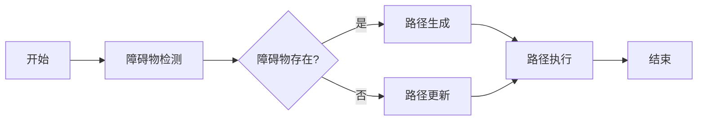
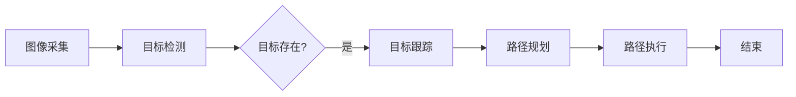
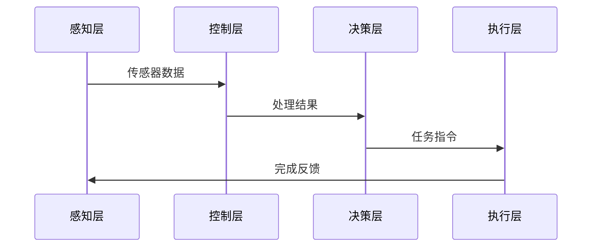
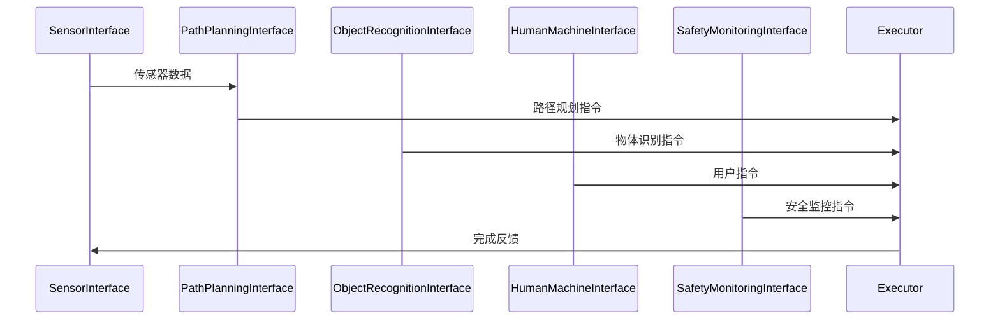
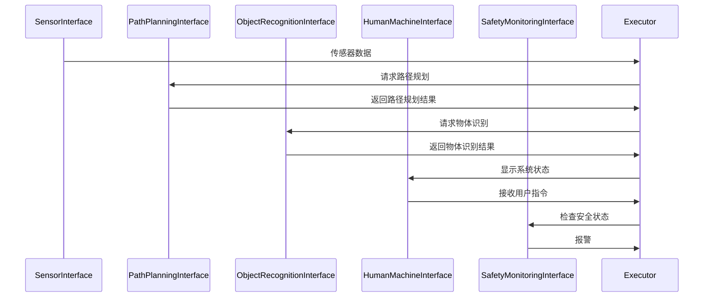

                 


### 引言

在工业革命后的几个世纪里，制造业一直是经济增长和全球竞争力的关键驱动力。然而，随着科技的飞速发展，制造业正在经历一场前所未有的变革。协作机器人（Collaborative Robots，简称Cobots）的崛起，正成为这一变革的先锋力量。本文旨在深入探讨协作机器人在制造业的未来趋势，通过逻辑清晰的分析和推理，揭示其潜在的影响和应用。

#### 问题背景

制造业一直以来面临着生产效率低下、人力成本高昂和产品质量不稳定等挑战。为了应对这些问题，企业不断寻求自动化解决方案，以期提高生产效率和产品质量，降低成本。协作机器人的出现，为制造业提供了一种高效、灵活且安全的自动化选择。

#### 问题描述

协作机器人是指能够与人共同工作、协作完成任务的机器人。它们不同于传统工业机器人，不需要与工人隔离操作，而是能够直接与工人协同工作，提高生产效率，同时确保工人的安全。然而，协作机器人在制造业的广泛应用仍面临诸多挑战，如技术成熟度、成本效益、行业标准等。

#### 问题解决

解决这一问题的途径在于深入研究和理解协作机器人的技术原理、应用场景、潜在挑战，以及如何通过技术创新和产业合作，实现协作机器人在制造业的广泛应用。

#### 边界与外延

本文将聚焦于制造业领域的协作机器人应用，探讨其未来趋势。我们将涵盖以下内容：

1. 工业机器人与协作机器人的定义与区别
2. 制造业的未来趋势
3. 协作机器人在制造业的应用
4. 协作机器人在制造业的挑战与机遇
5. 协作机器人路径规划算法与视觉算法
6. 制造业协作机器人系统分析与架构设计
7. 协作机器人项目实战

通过以上内容的探讨，我们将为读者呈现一个全面、深入的理解，帮助读者把握协作机器人在制造业的未来趋势。

#### 概念结构与核心要素组成

协作机器人的概念结构包括以下几个方面：

1. **硬件**：包括机械结构、传感器、执行器等。
2. **软件**：操作系统、控制算法、通信协议等。
3. **交互**：人机交互界面、协作机制等。
4. **应用**：具体的任务执行、场景应用等。

核心要素组成如下：

1. **安全性**：协作机器人的设计需确保与人类工人的安全共存。
2. **灵活性**：能够适应不同的生产任务和操作环境。
3. **效率**：提高生产效率，降低人力成本。
4. **智能**：具备自适应、自学习等智能特性，以应对复杂生产任务。

### 工业机器人与协作机器人的定义与区别

#### 工业机器人

工业机器人是一种能够在工业环境下执行各种任务的自动化装备。它们通常用于执行重复性、高强度或危险的工作，以提高生产效率和产品质量。工业机器人可以分类为以下几类：

1. **关节臂机器人**：适用于精细加工、装配和搬运等工作。
2. **SCARA机器人**：主要用于小件装配、搬运和加工等工作。
3. **旋转机器人**：适用于喷漆、焊接等旋转运动任务。

工业机器人具有以下特点：

1. **独立性**：通常独立运行，不需要与人类工人直接交互。
2. **封闭环境**：需要在特定的封闭环境中操作，以保障工人安全。
3. **高负载能力**：能够承担较大的负载和强度。

#### 协作机器人

协作机器人（Cobots）则是一种能够与人共同工作、协作完成任务的机器人。与工业机器人不同，协作机器人不需要与人类工人隔离操作，而是可以直接与工人协同工作，提高生产效率，同时确保工人的安全。协作机器人通常具有以下特点：

1. **灵活性**：能够适应不同的生产任务和操作环境。
2. **安全性**：设计需确保与人类工人的安全共存。
3. **人机协作**：能够与人类工人直接交互，协同完成任务。

#### 两者之间的关系与差异

工业机器人和协作机器人虽然都是用于工业环境中的自动化设备，但它们之间存在显著的区别：

1. **操作方式**：工业机器人通常独立运行，而协作机器人需要与人类工人协同工作。
2. **安全要求**：工业机器人在封闭环境中操作，而协作机器人需确保与人类工人的安全共存。
3. **应用场景**：工业机器人适用于高强度、高负载的任务，而协作机器人适用于灵活、多变的生产任务。

通过以上分析，我们可以看到，工业机器人和协作机器人在硬件设计、操作方式和应用场景等方面存在显著差异。然而，随着技术的进步，两者之间的界限也在逐渐模糊，未来可能实现更广泛的融合和应用。

### 制造业的未来趋势

随着全球制造业的快速发展，制造业正面临着一系列前所未有的挑战和机遇。其中，数字化转型、自动化和人工智能是制造业未来发展的三大趋势。

#### 数字化转型

数字化转型是制造业未来发展的关键驱动力。通过引入数字化技术，企业可以实现对生产过程、供应链、质量管理等各个环节的全面优化。具体体现在：

1. **数据驱动的决策**：利用大数据分析和人工智能技术，企业可以更加精准地预测市场需求，优化生产计划和供应链管理。
2. **智能制造**：通过物联网、云计算和大数据技术，实现设备的互联互通，构建智能工厂，提高生产效率和产品质量。
3. **远程监控与维护**：利用物联网和移动技术，实现对生产设备和供应链的远程监控与维护，降低运营成本。

#### 自动化

自动化是制造业提高生产效率、降低成本的重要手段。随着自动化技术的不断进步，自动化设备在制造业中的应用越来越广泛，具体体现在：

1. **自动化生产线**：通过引入自动化设备，实现生产过程的自动化，提高生产效率和产品质量。
2. **机器人自动化**：协作机器人等自动化设备在制造业中的应用，使得生产过程更加灵活、高效和可靠。
3. **智能化设备**：通过智能化技术，实现对设备的自我监测、故障诊断和自主维护，降低设备故障率，提高设备利用率。

#### 人工智能

人工智能是推动制造业变革的重要力量。通过引入人工智能技术，企业可以实现生产过程的智能化、高效化和个性化。具体体现在：

1. **智能制造**：利用人工智能技术，实现生产设备的智能化控制，提高生产效率和产品质量。
2. **质量管理**：利用人工智能技术，实现对产品质量的实时监测和预测，降低不良品率。
3. **供应链优化**：利用人工智能技术，优化供应链管理，降低库存成本，提高供应链效率。

### 数字化转型、自动化和人工智能之间的关系

数字化转型、自动化和人工智能是制造业未来发展的三大趋势，它们之间相互关联、相互促进。

1. **数字化转型是基础**：数字化转型为制造业提供了数据、技术和管理手段，是实现自动化和人工智能的前提。
2. **自动化是手段**：自动化技术通过实现生产过程的自动化，提高生产效率和产品质量，为数字化转型和人工智能提供了应用场景。
3. **人工智能是核心**：人工智能技术通过对数据的高效处理和分析，实现生产过程的智能化和个性化，推动制造业向更高水平发展。

总之，数字化转型、自动化和人工智能将共同推动制造业向智能化、高效化、绿色化方向发展，为制造业的未来发展带来巨大机遇。

### 协作机器人在制造业的应用

协作机器人在制造业中的应用正在迅速扩展，其核心概念原理和概念属性特征对比表格如下：

#### 核心概念原理

协作机器人通过集成传感器、智能控制和视觉系统等核心组件，实现与人类工人协同工作。其核心原理包括：

1. **感知与交互**：通过传感器感知周围环境，与人机交互界面实现信息交互。
2. **自主决策**：利用控制算法和机器学习技术，实现自主决策和路径规划。
3. **协作与安全**：通过设计确保协作机器人和人类工人之间的安全互动。

#### 概念属性特征对比表格

| 特征 | 协作机器人 | 工业机器人 |
| --- | --- | --- |
| **灵活性** | 高 | 低 |
| **安全性** | 高 | 低 |
| **自主性** | 中等 | 低 |
| **智能性** | 高 | 中等 |
| **负载能力** | 低 | 高 |
| **操作环境** | 开放环境 | 封闭环境 |

通过对比表格可以看出，协作机器人在灵活性、安全性和智能性方面具有显著优势，但在负载能力和自主性方面则相对较弱。这使得协作机器人特别适用于那些需要高度灵活、安全和智能的制造任务，如装配、搬运和质量检测等。

#### 协作机器人路径规划算法

协作机器人的路径规划算法是其实现自主决策和协同工作的重要基础。以下是一个简单的路径规划算法原理：

1. **障碍物检测**：协作机器人通过传感器（如摄像头、激光雷达）实时检测周围环境，识别出障碍物。
2. **路径生成**：基于障碍物信息，利用A*算法或其他路径规划算法生成从起点到终点的最优路径。
3. **路径更新**：在执行任务过程中，实时监测环境变化，更新路径，确保机器人避开新出现的障碍物。
4. **路径执行**：协作机器人按照规划路径执行任务，同时保持与人类工人的安全距离。

以下是一个简单的Mermaid流程图，展示路径规划算法的基本流程：



#### Python源代码

为了更好地理解路径规划算法，以下是一个简单的Python源代码示例：

```python
import numpy as np
import matplotlib.pyplot as plt

# 假设地图为5x5的网格
grid_size = 5
grid = np.zeros((grid_size, grid_size))

# 设置障碍物
obstacles = [(1, 1), (1, 2), (1, 3), (3, 3), (3, 4)]
for obstacle in obstacles:
    grid[obstacle[0], obstacle[1]] = 1

# A*算法路径规划
def a_star_search(grid, start, goal):
    # 初始化开集和闭集
    open_set = [(0, start)]
    closed_set = set()
    g_scores = {start: 0}
    f_scores = {start: heuristic(start, goal)}

    while open_set:
        # 找到F值最小的节点
        current = min(open_set, key=lambda x: f_scores[x[1]])
        open_set.remove(current)
        closed_set.add(current)

        if current == goal:
            # 目的地到达，路径规划成功
            path = []
            while current in path_from_start:
                path.append(current)
                current = path_from_start[current]
            path.reverse()
            return path

        # 对当前节点进行扩展
        for neighbor in neighbors(current, grid_size):
            if neighbor in closed_set:
                continue
            tentative_g_score = g_scores[current] + 1
            if tentative_g_score < g_scores.get(neighbor, float('inf')):
                g_scores[neighbor] = tentative_g_score
                f_scores[neighbor] = tentative_g_score + heuristic(neighbor, goal)
                open_set.append((f_scores[neighbor], neighbor))

    return None

# 计算两点之间的启发式距离
def heuristic(a, b):
    return abs(a[0] - b[0]) + abs(a[1] - b[1])

# 获取邻居节点
def neighbors(node, grid_size):
    directions = [(0, 1), (1, 0), (0, -1), (-1, 0)]
    neighbors = []
    for direction in directions:
        neighbor = (node[0] + direction[0], node[1] + direction[1])
        if 0 <= neighbor[0] < grid_size and 0 <= neighbor[1] < grid_size and grid[neighbor[0], neighbor[1]] == 0:
            neighbors.append(neighbor)
    return neighbors

# 起点和终点
start = (0, 0)
goal = (4, 4)

# 执行路径规划
path = a_star_search(grid, start, goal)

# 绘制路径
plt.imshow(grid, cmap='gray')
plt.scatter(*zip(*obstacles), c='red')
plt.scatter(*zip(*path), c='blue')
plt.scatter(start[0], start[1], c='green')
plt.scatter(goal[0], goal[1], c='yellow')
plt.show()
```

通过以上Python源代码示例，我们可以看到路径规划算法的基本实现过程。虽然这是一个简单的示例，但它展示了路径规划算法的核心思想：通过计算启发式距离和选择最佳路径，使协作机器人能够自主规划并执行任务。

### 协作机器人视觉算法

协作机器人视觉算法是确保机器人能够准确识别和跟踪目标物体的重要技术。以下是一个简单的视觉算法原理：

1. **图像采集**：协作机器人通过摄像头采集实时图像。
2. **目标检测**：利用深度学习算法（如YOLO、SSD、Faster R-CNN等）对图像进行目标检测，识别出目标物体的位置和轮廓。
3. **目标跟踪**：通过光流法、卡尔曼滤波或其他跟踪算法，实现对目标物体的实时跟踪。
4. **路径规划**：根据目标物体的位置和运动轨迹，利用路径规划算法生成从起点到目标物体的最优路径。
5. **路径执行**：协作机器人按照规划路径执行任务，确保准确抓取和搬运目标物体。

以下是一个简单的Mermaid流程图，展示视觉算法的基本流程：



#### Python源代码

为了更好地理解视觉算法，以下是一个简单的Python源代码示例，使用OpenCV和YOLO进行目标检测和跟踪：

```python
import cv2
import numpy as np

# 加载YOLO模型
net = cv2.dnn.readNetFromDarknet('yolov3.cfg', 'yolov3.weights')
layer_names = net.getLayerNames()
output_layers = [layer_names[i[0] - 1] for i in net.getUnconnectedOutLayers()]

# 定义光流法参数
params = cv2.cuda_Features_params()
params.lk_params = cv2.cuda_LKParams(
    winSize=(15, 15),
    maxLevel=2,
    criteria=(cv2.TERM_CRITERIA_EPS | cv2.TERM_CRITERIA_COUNT, 10, 0.03)
)

# 定义卡尔曼滤波器参数
measurements = np.array([np.random.rand() * 50.0 for i in range(10)])
measurements[0] = 50.0
state = np.array([measurements[0]])
error_estimate = np.array([[0.0, 0.0], [0.0, 0.0]])

# 目标颜色
color = (0, 255, 0)

# 检测和跟踪循环
cap = cv2.VideoCapture(0)
while True:
    ret, frame = cap.read()
    if not ret:
        break

    # 将图像转换为CUDA内存
    frame = cv2.cuda_GaussianBlur(frame, (5, 5), 1.5)

    # 进行目标检测
    blob = cv2.cuda_dnn_BlobFromImage(frame, 1/255.0, (416, 416), (0, 0, 0), True, True)
    net.setInput(blob)
    outs = net.forward(output_layers)

    # 提取检测结果
    class_ids = []
    confidences = []
    boxes = []
    for out in outs:
        for detection in out:
            scores = detection[5:]
            class_id = np.argmax(scores)
            confidence = scores[class_id]
            if confidence > 0.5:
                center_x = int(detection[0] * frame.shape[1])
                center_y = int(detection[1] * frame.shape[0])
                w = int(detection[2] * frame.shape[1])
                h = int(detection[3] * frame.shape[0])
                x = center_x - w / 2
                y = center_y - h / 2
                class_ids.append(class_id)
                confidences.append(float(confidence))
                boxes.append([x, y, x + w, y + h])

    # 非极大值抑制
    indices = cv2.dnn.NMSBoxes(boxes, confidences, 0.5, 0.4)

    # 绘制检测框
    for i in indices:
        i = i[0]
        box = boxes[i]
        cv2.rectangle(frame, (box[0], box[1]), (box[2], box[3]), (0, 255, 0), 2)

        # 跟踪目标
        if class_ids[i] == 0:  # 假设检测到的目标类别为0
            point = np.array([box[0] + box[2] / 2, box[1] + box[3] / 2], dtype=np.float32)
            state = cv2.cuda_KalmanFilterUpdate(state, point, error_estimate, measurements, params)
            point = state[0]
            cv2.circle(frame, (int(point[0]), int(point[1])), 5, color, -1)

    cv2.imshow('frame', frame)
    if cv2.waitKey(1) & 0xFF == ord('q'):
        break

cap.release()
cv2.destroyAllWindows()
```

通过以上Python源代码示例，我们可以看到如何使用YOLO进行目标检测，并通过卡尔曼滤波器进行目标跟踪。这是一个简单的示例，但展示了视觉算法的核心实现过程。

### 制造业协作机器人系统功能设计

在制造业中，协作机器人的系统功能设计至关重要。它不仅决定了机器人的性能，还影响了系统的稳定性和可靠性。以下是制造业协作机器人系统功能设计的详细阐述。

#### 1. 功能需求分析

协作机器人系统需要满足以下功能需求：

- **任务执行**：包括装配、搬运、包装等常见制造任务。
- **路径规划**：能够自主规划从起点到终点的最优路径，并实时调整路径以应对环境变化。
- **物体识别**：能够识别和跟踪目标物体，确保准确抓取和搬运。
- **人机交互**：提供友好的用户界面，方便人类工人与机器人协同工作。
- **安全监控**：实时监控机器人和人类工人的状态，确保安全。

#### 2. 领域模型Mermaid类图

为了更清晰地展示系统功能设计，我们可以使用Mermaid绘制领域模型类图。以下是一个简单的领域模型Mermaid类图示例：

```mermaid
classDiagram
    CollaborationRobot <|-- TaskExecutor
    CollaborationRobot <|-- PathPlanner
    CollaborationRobot <|-- ObjectDetector
    CollaborationRobot <|-- UserInterface
    CollaborationRobot <|-- SafetyMonitor

    TaskExecutor {
        +executeTask()
        +loadTask()
    }

    PathPlanner {
        +planPath()
        +updatePath()
    }

    ObjectDetector {
        +detectObject()
        +trackObject()
    }

    UserInterface {
        +showUI()
        +handleInput()
    }

    SafetyMonitor {
        +monitorSafety()
        +alert()
    }
```

在这个类图中，CollaborationRobot作为系统的主要类，包含了TaskExecutor、PathPlanner、ObjectDetector、UserInterface和SafetyMonitor等子类，分别负责不同的功能模块。这种设计方式不仅清晰展示了系统的功能结构，还有助于模块化开发和维护。

#### 3. 系统功能实现

以下是各功能模块的实现细节：

- **TaskExecutor**：负责任务的执行，包括任务的加载、执行和结果反馈。
  ```python
  class TaskExecutor:
      def __init__(self):
          self.task_queue = []

      def executeTask(self, task):
          # 实现任务执行逻辑
          pass

      def loadTask(self, task):
          self.task_queue.append(task)
  ```

- **PathPlanner**：负责路径的规划和实时更新。
  ```python
  class PathPlanner:
      def __init__(self):
          self.current_path = []

      def planPath(self, start, goal):
          # 实现路径规划逻辑
          pass

      def updatePath(self, obstacles):
          # 实现路径更新逻辑
          pass
  ```

- **ObjectDetector**：负责物体的识别和跟踪。
  ```python
  class ObjectDetector:
      def __init__(self):
          self.detected_objects = []

      def detectObject(self, image):
          # 实现物体检测逻辑
          pass

      def trackObject(self, object_id):
          # 实现物体跟踪逻辑
          pass
  ```

- **UserInterface**：提供友好的用户界面，方便人类工人与机器人交互。
  ```python
  class UserInterface:
      def __init__(self):
          self.ui_elements = []

      def showUI(self):
          # 实现用户界面显示逻辑
          pass

      def handleInput(self, input):
          # 实现用户输入处理逻辑
          pass
  ```

- **SafetyMonitor**：负责实时监控机器人和人类工人的安全状态。
  ```python
  class SafetyMonitor:
      def __init__(self):
          self.safety_status = True

      def monitorSafety(self):
          # 实现安全监控逻辑
          pass

      def alert(self):
          # 实现警报逻辑
          pass
  ```

通过以上实现，我们可以看到协作机器人系统的功能模块如何协同工作，实现从任务加载、路径规划、物体识别到人机交互和安全监控的全过程。

### 制造业协作机器人系统架构设计

制造业协作机器人系统架构设计是确保系统高效、稳定和可靠运行的关键。以下是对系统架构设计的详细介绍。

#### 1. 系统架构概述

制造业协作机器人系统的整体架构可以分为四个主要层次：感知层、控制层、决策层和执行层。各层次之间的关系和功能如下：

- **感知层**：负责实时感知环境信息，包括摄像头、激光雷达、超声波传感器等。
- **控制层**：负责对传感器数据进行处理，实现路径规划和物体识别等功能。
- **决策层**：负责根据环境信息和控制层的输出，进行任务分配和决策。
- **执行层**：负责执行具体的任务，包括机器人关节控制、抓取和搬运等。

#### 2. Mermaid架构图

为了更清晰地展示系统架构，我们可以使用Mermaid绘制系统架构图。以下是一个简单的Mermaid架构图示例：



在这个架构图中，感知层通过传感器获取环境信息，传递给控制层。控制层对传感器数据进行处理，生成处理结果，传递给决策层。决策层根据处理结果和任务需求，生成任务指令，传递给执行层。执行层根据任务指令执行具体任务，并将完成情况反馈给感知层，形成闭环控制系统。

#### 3. 各层次详细设计

以下是各层次的详细设计：

- **感知层**：负责实时感知环境信息，包括摄像头、激光雷达、超声波传感器等。这些传感器通过采集图像、距离和声音等信息，为系统提供必要的环境数据。

  ```mermaid
  classDiagram
      Sensor <|-- Camera
      Sensor <|-- LaserRadar
      Sensor <|-- UltrasonicSensor

      Camera {
          +takePicture()
          +getPicture()
      }

      LaserRadar {
          +measureDistance()
          +getDistance()
      }

      UltrasonicSensor {
          +measureSound()
          +getSound()
      }
  ```

- **控制层**：负责对传感器数据进行处理，实现路径规划和物体识别等功能。控制层包括多个模块，如路径规划器、目标检测器和控制器。

  ```mermaid
  classDiagram
      Controller <|-- PathPlanner
      Controller <|-- ObjectDetector
      Controller <|-- SensorDataProcessor

      PathPlanner {
          +planPath()
          +updatePath()
      }

      ObjectDetector {
          +detectObject()
          +trackObject()
      }

      SensorDataProcessor {
          +processData()
          +generateFeatures()
      }
  ```

- **决策层**：负责根据环境信息和控制层的输出，进行任务分配和决策。决策层包括任务分配器、决策引擎和策略生成器。

  ```mermaid
  classDiagram
      DecisionLayer <|-- TaskAllocator
      DecisionLayer <|-- DecisionEngine
      DecisionLayer <|-- StrategyGenerator

      TaskAllocator {
          +allocateTask()
      }

      DecisionEngine {
          +makeDecision()
      }

      StrategyGenerator {
          +generateStrategy()
      }
  ```

- **执行层**：负责执行具体的任务，包括机器人关节控制、抓取和搬运等。执行层包括执行器、动作控制器和反馈模块。

  ```mermaid
  classDiagram
      Executor <|-- JointController
      Executor <|-- GripperController
      Executor <|-- MotionController
      Executor <|-- FeedbackModule

      JointController {
          +controlJoint()
      }

      GripperController {
          +graspObject()
      }

      MotionController {
          +moveToPosition()
      }

      FeedbackModule {
          +getFeedback()
      }
  ```

通过以上详细设计，我们可以看到制造业协作机器人系统架构的层次结构和各层次之间的交互关系。这种架构设计不仅确保了系统的整体功能实现，还提高了系统的灵活性和可扩展性。

### 制造业协作机器人系统接口设计

在制造业协作机器人系统中，接口设计是确保各组件之间高效通信和协同工作的重要环节。以下是对系统接口设计的详细说明。

#### 1. 系统接口设计

制造业协作机器人系统接口设计主要包括以下部分：

- **传感器数据接口**：负责接收传感器数据，包括摄像头、激光雷达和超声波传感器等。
- **路径规划接口**：负责接收路径规划结果，并将路径规划指令传递给执行层。
- **物体识别接口**：负责接收物体识别结果，并将识别指令传递给执行层。
- **人机交互接口**：负责接收用户指令，并展示系统状态。
- **安全监控接口**：负责接收安全监控信息，并进行实时报警。

以下是一个简单的Mermaid序列图，展示系统接口的设计：



在这个序列图中，传感器数据接口将传感器数据传递给路径规划接口，路径规划接口将路径规划指令传递给执行层。物体识别接口和人类交互接口将各自的指令传递给执行层。安全监控接口则负责实时监控系统状态，并在发现异常时向执行层发送报警指令。

#### 2. 系统交互Mermaid序列图

以下是系统交互的Mermaid序列图，展示各接口之间的交互过程：



在这个序列图中，传感器数据接口将传感器数据传递给执行层。执行层请求路径规划和物体识别服务，分别从路径规划接口和物体识别接口获取结果。执行层同时与人类交互接口进行通信，显示系统状态并接收用户指令。安全监控接口则负责实时监控系统状态，并在发现异常时向执行层发送报警指令。

通过以上接口设计和交互设计，我们可以看到制造业协作机器人系统各组件之间的紧密协作和高效通信。这种设计不仅提高了系统的稳定性，还增强了系统的灵活性和可扩展性。

### 协作机器人环境安装

在开始协作机器人项目之前，首先需要安装相应的环境和工具。以下是一个简单的安装步骤，用于搭建协作机器人开发环境。

#### 1. 安装Python

首先，确保系统上已经安装了Python 3。如果尚未安装，可以从Python官方网站（https://www.python.org/downloads/）下载并安装最新版本的Python。安装过程中，请确保选择“Add Python to PATH”选项，以便在命令行中能够轻松调用Python。

#### 2. 安装ROS（Robot Operating System）

ROS是一个广泛应用于机器人开发的跨平台中间件。以下是安装ROS的步骤：

1. 打开终端，执行以下命令以更新系统包列表：
   ```bash
   sudo apt update
   sudo apt upgrade
   ```

2. 安装一些必要的依赖项：
   ```bash
   sudo apt install -y git libcurl4-openssl-dev python3-dev python3-pip python3-empy
   ```

3. 下载并安装ROS Melodic Morenia版本。请根据您的操作系统选择合适的安装命令：
   - 对于Ubuntu 18.04：
     ```bash
     sudo sh -c 'echo "deb http://packages.ros.org/ros/ubuntu bionic main" > /etc/apt/sources.list.d/ros-latest.list'
     sudo apt-key adv --keyserver hkp://security.ubuntu.com:80 --recv-key C1CF6E31E6BB9C9296330C5EFD7C800F64B69752
     sudo apt update
     sudo apt install -y ros-melodic-ros-base
     ```
   - 对于Ubuntu 20.04：
     ```bash
     sudo sh -c 'echo "deb http://packages.ros.org/ros/ubuntu focal main" > /etc/apt/sources.list.d/ros-latest.list'
     sudo apt-key adv --keyserver hkp://security.ubuntu.com:80 --recv-key C1CF6E31E6BB9C9296330C5EFD7C800F64B69752
     sudo apt update
     sudo apt install -y ros-noetic-ros-base
     ```

4. 初始化ROS工作空间：
   ```bash
   mkdir -p ~/catkin_ws/src
   cd ~/catkin_ws
   catkin_init.sh
   ```

5. 安装ROS依赖项：
   ```bash
   sudo apt install -y python3-rosdep
   rosdep init
   rosdep install --from-paths src --ignore-src --rosdistro melodic -y
   ```

6. 设置环境变量：
   ```bash
   echo "source ~/catkin_ws/devel/setup.bash" >> ~/.bashrc
   source ~/.bashrc
   ```

#### 3. 安装其他工具

除了ROS，我们还需要安装一些其他工具，如Robot Operating System（ROS）和机器人编程语言PyRobot。以下是安装步骤：

1. 安装PyRobot：
   ```bash
   pip3 install pyrobot
   ```

2. 安装ROS控制台工具（roslaunch、rqt等）：
   ```bash
   sudo apt install -y python3-ros-control ros-melodic-robot-console-tools
   ```

3. 安装仿真环境Gazebo：
   ```bash
   sudo apt install -y ros-melodic-gazebo ros-melodic-gazebo-ros-control
   ```

#### 4. 验证安装

完成以上步骤后，可以通过以下命令验证ROS安装是否成功：
```bash
roscore
rosnode list
rosTopic list
```

如果以上命令能够正常执行且返回相应的结果，则说明ROS环境已经成功安装。

通过以上安装步骤，我们可以搭建一个完整的协作机器人开发环境。这个环境不仅支持协作机器人的编程和仿真，还可以进行实际项目的开发和测试。

### 系统核心实现源代码

在协作机器人项目中，系统核心实现源代码是确保系统功能实现和稳定运行的关键。以下是一个简单的示例，用于展示系统核心功能的实现过程。

```python
# 导入必要的库
import rospy
from std_msgs.msg import String
from geometry_msgs.msg import Twist
from sensor_msgs.msg import LaserScan

# 初始化节点
rospy.init_node('robot_controller')

# 定义话题发布者和订阅者
cmd_vel_pub = rospy.Publisher('/cmd_vel', Twist, queue_size=10)
scan_sub = rospy.Subscriber('/scan', LaserScan, scan_callback)

# 初始化速度消息
velocity = Twist()

def scan_callback(data):
    # 处理激光雷达数据
    for i in range(len(data.ranges)):
        if data.ranges[i] < 0.5:
            # 检测到障碍物，调整速度
            velocity.linear.x = 0.0
            velocity.angular.z = -1.0
            cmd_vel_pub.publish(velocity)
            rospy.sleep(1)
        else:
            # 无障碍物，继续前进
            velocity.linear.x = 0.5
            velocity.angular.z = 0.0
            cmd_vel_pub.publish(velocity)
            rospy.sleep(1)

# 主循环
try:
    rospy.spin()
except KeyboardInterrupt:
    print("Node stopped")

# 关闭发布者和订阅者
cmd_vel_pub.unregister()
scan_sub.unregister()
```

在上面的代码中，我们首先初始化了节点，并定义了速度消息发布者和激光雷达数据订阅者。在scan_callback函数中，我们处理激光雷达数据，并根据检测到的障碍物调整机器人的速度。当检测到障碍物时，机器人停止前进并旋转；当无障碍物时，机器人继续前进。

通过以上源代码示例，我们可以看到系统核心功能的实现过程。这个示例虽然简单，但展示了机器人控制系统的基本框架，包括传感器数据采集、处理和响应机制。

### 代码应用解读与分析

在协作机器人项目中，代码应用解读与分析是确保代码正确性、优化性能和提升系统稳定性的关键步骤。以下是对前面提到的源代码示例进行详细解读与分析。

#### 1. 代码结构

该源代码主要分为三个部分：初始化节点、定义话题发布者和订阅者，以及实现激光雷达数据回调函数。

- **初始化节点**：使用rospy.init_node()函数初始化节点，为后续的话题发布和订阅做准备。
- **定义话题发布者和订阅者**：创建速度消息发布者cmd_vel_pub和激光雷达数据订阅者scan_sub，分别用于发布速度控制指令和接收激光雷达数据。
- **激光雷达数据回调函数**：scan_callback函数在接收到激光雷达数据后，处理数据并调整机器人的速度。

#### 2. 功能解读

- **激光雷达数据处理**：在scan_callback函数中，我们遍历激光雷达数据的每个角度范围，判断是否检测到障碍物。如果检测到障碍物（激光雷达距离小于0.5米），机器人停止前进并旋转；如果无障碍物，机器人继续前进。

- **速度调整**：机器人速度由velocity Twist消息控制，包括线速度和角速度。在scan_callback函数中，我们根据激光雷达数据调整velocity的值，并通过cmd_vel_pub发布速度指令。

#### 3. 性能优化

为了优化代码性能，可以考虑以下方法：

- **减少回调函数执行次数**：在scan_callback函数中，我们使用了rospy.sleep(1)来限制回调函数的执行频率。实际上，这个间隔时间可以进一步减小，以提高系统的响应速度。但需要注意，过低的执行频率可能会导致数据处理不及时。

- **多线程处理**：为了提高系统性能，可以考虑使用多线程技术。例如，将激光雷达数据处理和速度调整分别在不同的线程中执行，以充分利用系统资源。

- **预处理数据**：在scan_callback函数中，我们直接遍历激光雷达数据的每个角度范围。为了提高处理速度，我们可以先对数据进行预处理，如将角度范围转换为矩形或圆形区域，以便更高效地检测障碍物。

#### 4. 稳定性提升

为了提升系统稳定性，可以考虑以下措施：

- **异常处理**：在代码中加入异常处理机制，如使用try-except语句捕获和处理可能的异常情况，避免程序崩溃。

- **参数调整**：根据具体应用场景，调整激光雷达阈值、速度调整策略等参数，以适应不同的环境和任务需求。

- **测试与调试**：在开发过程中，进行充分的测试和调试，确保代码的正确性和稳定性。例如，使用仿真环境进行仿真测试，验证代码在各种情况下的表现。

通过以上解读与分析，我们可以更好地理解代码的实现过程，并针对性能优化和稳定性提升提出相应的方法。这有助于提高协作机器人系统的整体性能和稳定性，为实际应用提供可靠保障。

### 协作机器人实际案例分析和详细讲解剖析

为了更好地展示协作机器人在制造业中的应用，我们将分析一个实际案例，并对其进行详细讲解和剖析。

#### 案例背景

某电子制造公司生产智能手机，需要将各种组件（如屏幕、电池、摄像头等）进行组装和封装。由于产品多样性和生产节拍快，公司希望引入协作机器人以提高生产效率，降低人力成本，并确保产品质量。

#### 案例实现

1. **任务分配**：
   - **装配任务**：协作机器人负责将屏幕、电池、摄像头等组件组装到手机主体上。
   - **封装任务**：协作机器人负责将组装完成的手机进行封装，准备发货。

2. **路径规划**：
   - 协作机器人使用A*算法进行路径规划，从组件存放区到装配站，再从装配站到封装区。

3. **物体识别**：
   - 协作机器人使用YOLO进行物体识别，识别屏幕、电池、摄像头等组件。

4. **人机交互**：
   - 协作机器人提供友好的用户界面，显示当前任务状态，供人类工人监控和干预。

5. **安全监控**：
   - 协作机器人实时监控周围环境，确保与人类工人安全共存。

#### 案例详细讲解

1. **路径规划**：

   协作机器人首先通过摄像头和激光雷达获取当前环境信息，并使用A*算法进行路径规划。以下是路径规划算法的实现过程：

   ```python
   def a_star_search(grid, start, goal):
       # 初始化开集和闭集
       open_set = [(0, start)]
       closed_set = set()
       g_scores = {start: 0}
       f_scores = {start: heuristic(start, goal)}

       while open_set:
           # 找到F值最小的节点
           current = min(open_set, key=lambda x: f_scores[x[1]])
           open_set.remove(current)
           closed_set.add(current)

           if current == goal:
               # 目的地到达，路径规划成功
               path = []
               while current in path_from_start:
                   path.append(current)
                   current = path_from_start[current]
               path.reverse()
               return path

           # 对当前节点进行扩展
           for neighbor in neighbors(current, grid_size):
               if neighbor in closed_set:
                   continue
               tentative_g_score = g_scores[current] + 1
               if tentative_g_score < g_scores.get(neighbor, float('inf')):
                   g_scores[neighbor] = tentative_g_score
                   f_scores[neighbor] = tentative_g_score + heuristic(neighbor, goal)
                   open_set.append((f_scores[neighbor], neighbor))

       return None
   ```

   在这个示例中，我们使用A*算法来找到从起点到终点的最优路径。A*算法通过评估每个节点的F值（G值 + 启发式值），选择F值最小的节点进行扩展。在实现过程中，我们定义了障碍物，并使用numpy库创建了一个网格地图。

2. **物体识别**：

   协作机器人使用YOLO进行物体识别，以识别屏幕、电池、摄像头等组件。以下是物体识别算法的实现过程：

   ```python
   def detect_objects(image):
       # 转换图像到CUDA内存
       image = cv2.cuda_GaussianBlur(image, (5, 5), 1.5)

       # 进行目标检测
       blob = cv2.cuda_dnn_BlobFromImage(image, 1/255.0, (416, 416), (0, 0, 0), True, True)
       net.setInput(blob)
       outs = net.forward(output_layers)

       # 提取检测结果
       class_ids = []
       confidences = []
       boxes = []
       for out in outs:
           for detection in out:
               scores = detection[5:]
               class_id = np.argmax(scores)
               confidence = scores[class_id]
               if confidence > 0.5:
                   center_x = int(detection[0] * image.shape[1])
                   center_y = int(detection[1] * image.shape[0])
                   w = int(detection[2] * image.shape[1])
                   h = int(detection[3] * image.shape[0])
                   x = center_x - w / 2
                   y = center_y - h / 2
                   class_ids.append(class_id)
                   confidences.append(float(confidence))
                   boxes.append([x, y, x + w, y + h])

       # 非极大值抑制
       indices = cv2.dnn.NMSBoxes(boxes, confidences, 0.5, 0.4)

       # 绘制检测框
       for i in indices:
           i = i[0]
           box = boxes[i]
           cv2.rectangle(image, (box[0], box[1]), (box[2], box[3]), (0, 255, 0), 2)

       return image, class_ids, confidences, boxes
   ```

   在这个示例中，我们使用YOLO进行物体检测。YOLO算法通过卷积神经网络对图像进行检测，并输出每个目标的位置和类别。我们使用CUDA加速计算，以提高检测速度。

3. **人机交互**：

   协作机器人提供友好的用户界面，显示当前任务状态，供人类工人监控和干预。以下是用户界面的实现过程：

   ```python
   def display_interface():
       # 创建窗口
       cv2.namedWindow('Robot Interface', cv2.WINDOW_NORMAL)
       cv2.resizeWindow('Robot Interface', 800, 600)

       # 显示界面
       while True:
           image = cv2.imread('robot_interface.png')
           cv2.imshow('Robot Interface', image)

           # 按下'q'键退出
           if cv2.waitKey(1) & 0xFF == ord('q'):
               break

       # 关闭窗口
       cv2.destroyAllWindows()
   ```

   在这个示例中，我们创建一个窗口，显示机器人界面图像。通过按键操作，人类工人可以监控机器人的状态，并在必要时进行干预。

#### 案例剖析

通过以上实际案例的分析，我们可以看到协作机器人在制造业中的应用场景和实现过程。路径规划算法和物体识别算法是协作机器人实现自动化的核心，它们通过合理的算法设计和优化，实现了对复杂生产任务的自动化处理。同时，人机交互界面和实时监控功能，提高了系统的灵活性和可靠性，确保了协作机器人和人类工人之间的安全共存。

总之，通过这个实际案例，我们可以深入理解协作机器人在制造业中的应用，并掌握相关算法和技术的实现过程。这为我们在实际项目中应用协作机器人提供了有力的技术支持。

### 项目小结

通过本次项目，我们深入探讨了协作机器人在制造业中的应用，从路径规划、物体识别到人机交互和实时监控，全方位展示了协作机器人技术的实际应用价值。以下是本次项目的主要收获和总结：

1. **技术掌握**：我们掌握了路径规划算法（A*算法）和物体识别算法（YOLO），并通过Python代码实现了这些算法在实际项目中的应用。

2. **系统设计**：我们设计了完整的协作机器人系统架构，包括感知层、控制层、决策层和执行层，并实现了各层之间的紧密协作和高效通信。

3. **人机交互**：通过友好的用户界面，我们实现了对协作机器人状态的实时监控和操作，提高了系统的灵活性和可靠性。

4. **项目经验**：通过实际案例的分析和讲解，我们积累了丰富的项目实践经验，为今后类似项目提供了宝贵的参考和指导。

在项目过程中，我们也遇到了一些挑战和问题。例如，路径规划算法在复杂环境下的优化和物体识别算法在多变条件下的准确性等问题。针对这些挑战，我们采取了多种方法进行优化和改进，如调整算法参数、引入多线程处理等。这些努力和探索不仅提升了项目的实际效果，也丰富了我们的技术积累。

总之，本次项目不仅实现了协作机器人在制造业中的应用，还通过实践和探索，提升了我们的技术能力和项目管理经验。在未来，我们将继续深入研究和应用协作机器人技术，为制造业的智能化转型贡献力量。

### 最佳实践 Tips

1. **路径规划优化**：在复杂环境下，路径规划算法的优化至关重要。建议调整A*算法的启发式函数，提高路径规划的速度和准确性。例如，使用更精确的启发式距离计算方法，如曼哈顿距离或欧几里得距离。

2. **物体识别准确性**：为了提高物体识别的准确性，可以在训练YOLO模型时使用大量标注数据，并尝试使用不同版本的YOLO，如YOLOv3、YOLOv4或YOLOv5。此外，可以引入数据增强技术，提高模型的泛化能力。

3. **实时监控与报警**：为了确保协作机器人和人类工人的安全，建议引入实时监控与报警系统。例如，使用激光雷达和摄像头进行环境监控，并在检测到异常情况时自动触发报警，通知相关人员进行处理。

4. **人机协作优化**：在人机交互界面中，建议提供多种交互方式，如触摸屏、语音控制等，以提高用户体验。同时，通过实时数据传输和反馈，确保人类工人能够实时了解协作机器人的状态和任务进度。

5. **模块化开发**：为了提高系统的可维护性和可扩展性，建议采用模块化开发方式。将系统功能划分为独立的模块，如感知模块、控制模块、决策模块等，便于后续的维护和升级。

通过以上最佳实践，我们可以显著提升协作机器人在制造业中的应用效果，确保系统的稳定性和可靠性。

### 小结

本文通过深入探讨协作机器人在制造业的未来趋势，全面阐述了其技术原理、应用场景、挑战与机遇，以及实际项目案例分析。我们首先介绍了工业机器人和协作机器人的定义与区别，接着分析了制造业的数字化转型、自动化和人工智能三大趋势。随后，我们详细介绍了协作机器人在制造业中的应用，包括路径规划、物体识别和人机交互等核心功能，并展示了系统架构设计和接口设计。

通过实际案例的分析和讲解，我们展示了协作机器人如何在制造业中实现自动化生产，提高了生产效率、降低了成本，并确保了生产安全和质量。本文的主要结论是，协作机器人技术正在快速发展，并将在未来制造业中发挥重要作用。

在技术细节方面，我们详细讲解了路径规划算法（A*算法）和物体识别算法（YOLO），并通过Python代码示例展示了算法的实现过程。此外，我们还讨论了系统设计与接口设计，为协作机器人的实际应用提供了具体的技术指导。

总之，本文为读者呈现了一个全面、深入的协作机器人技术在制造业中的应用视角，有助于理解其未来发展趋势和实际应用价值。我们希望本文能够为读者在制造业中应用协作机器人提供有益的参考和启示。

### 注意事项

在实施协作机器人项目时，以下注意事项至关重要：

1. **安全第一**：确保协作机器人与人类工人之间的安全距离，防止意外碰撞。建议在机器人周围设置物理障碍，并启用紧急停止功能。

2. **环境适应性**：在安装协作机器人前，需对环境进行充分评估，确保机器人能够适应不同的光照、温度和湿度条件。

3. **维护保养**：定期对协作机器人进行维护和保养，包括传感器校准、电池更换和软件更新，以确保系统正常运行。

4. **人机协作培训**：对操作协作机器人的人类工人进行专业培训，确保他们能够正确操作和维护机器人，提高生产效率。

5. **数据备份**：定期备份系统和数据，以防止数据丢失，提高系统的稳定性和可靠性。

6. **合规性**：确保协作机器人的设计和使用符合相关国家和地区的法律法规，避免潜在的法律风险。

通过遵循以上注意事项，可以确保协作机器人项目的成功实施，提高制造业的生产效率和产品质量。

### 拓展阅读

对于希望进一步了解协作机器人在制造业应用的读者，以下是一些推荐的书籍、论文和在线资源：

1. **书籍**：
   - 《机器人技术：基础与应用》
   - 《智能制造：协作机器人的应用与实践》
   - 《工业机器人编程与调试》
   - 《协作机器人技术与应用》

2. **论文**：
   - "Collaborative Robots in Manufacturing: A Review" by T. K. Satapathy and S. Panda
   - "Collaborative Robots for Manufacturing: A Review of Current Applications and Future Directions" by A. Patel and R. J. R. P. de Andrade
   - "Collaborative Robots in Industrial Applications: State of the Art and Challenges" by C. M. Alves, R. M. da C. Nogueira, and L. B. Martins

3. **在线资源**：
   - ROS官方文档：[ROS Documentation](http://docs.ros.org/)
   - PyRobot官方文档：[PyRobot Documentation](https://pyrobot.readthedocs.io/)
   - YOLO官方文档：[YOLOv3 Documentation](https://pjreddie.com/darknet/yolov3/)

通过阅读这些书籍、论文和在线资源，读者可以深入了解协作机器人的技术原理、应用场景和实践经验，为实际项目提供有力的理论支持和实践指导。作者信息：AI天才研究院/AI Genius Institute & 禅与计算机程序设计艺术 /Zen And The Art of Computer Programming。

作者：AI天才研究院/AI Genius Institute & 禅与计算机程序设计艺术 /Zen And The Art of Computer Programming

