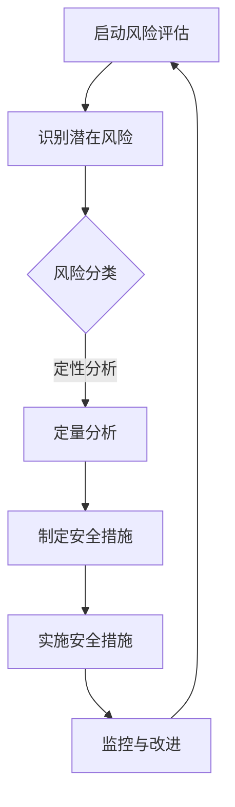
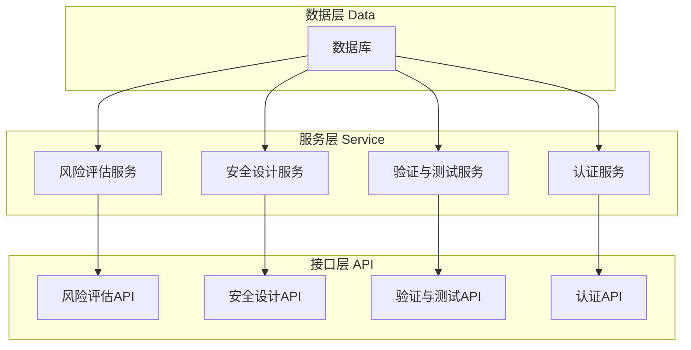
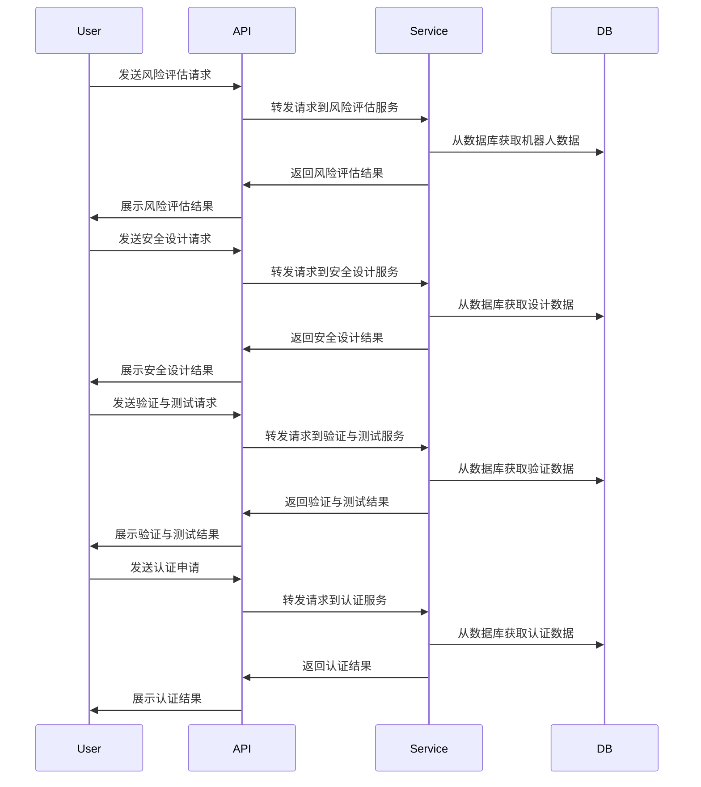

                 


### 文章标题
协作机器人安全标准的制定

### 关键词
协作机器人、安全标准、风险评估、算法原理、系统架构、项目实战

### 摘要
本文详细阐述了协作机器人安全标准制定的重要性及过程。通过背景介绍、核心概念与联系分析、算法原理讲解、系统分析与架构设计、项目实战等多个方面，本文旨在为协作机器人安全标准的制定提供系统性指导，提高协作机器人的安全性和可靠性。

## 第一部分：背景介绍

### 1.1 问题背景
协作机器人作为近年来智能自动化领域的明星产品，已经在多个行业取得了显著的应用成果。它们具备灵活性强、易于编程、能够与人共同工作的特点，使得它们在工业制造、医疗护理、教育辅助等领域发挥了重要作用。然而，随着协作机器人的广泛应用，安全问题也逐渐暴露出来。一方面，协作机器人的灵活性使其能够在人身边工作，这增加了与人类交互的复杂性；另一方面，协作机器人的安全标准不统一，缺乏规范性的安全标准，使得在实际应用中存在较大的安全隐患。

### 1.2 安全标准的缺失
当前，协作机器人安全标准的缺失主要体现在以下几个方面：

1. **安全性定义不明确**：不同行业和地区对协作机器人的安全性和可靠性要求存在差异，导致安全性定义不明确。
2. **风险评估体系不完善**：缺乏科学的风险评估方法和工具，导致企业难以有效识别和评估协作机器人的安全隐患。
3. **安全设计和验证不规范**：协作机器人的设计和验证过程中缺乏统一的标准和规范，容易出现安全隐患。
4. **安全测试与认证不规范**：协作机器人产品在上市前缺乏有效的安全测试和认证机制，使得潜在的安全隐患难以被发现。

### 1.3 安全标准的必要性
制定统一、全面的协作机器人安全标准对于保障协作机器人的安全运行具有重要意义：

1. **提高协作机器人安全性**：通过明确安全性定义和规范安全设计、验证、测试过程，可以提高协作机器人的安全性和可靠性。
2. **保障人员和设备安全**：统一的安全标准能够确保协作机器人与人员、设备的安全运行，降低安全事故的发生概率。
3. **促进技术发展**：规范的安全标准有助于推动协作机器人技术的健康发展，促进相关产业链的完善。

### 1.4 边界与外延
协作机器人安全标准的制定不仅涉及到技术层面，还包括法律法规、政策标准、企业标准等多个方面。此外，安全标准的制定和应用还需要考虑国际合作与交流，以适应全球化发展趋势。

### 1.5 概念结构与核心要素组成
协作机器人安全标准的核心概念包括：

1. **安全性**：保证协作机器人与人员、设备安全运行的基本属性。
2. **风险评估**：识别和评估协作机器人在使用过程中可能出现的风险。
3. **安全设计**：在协作机器人的设计阶段考虑安全性，确保机器人符合安全要求。
4. **验证与测试**：对协作机器人进行安全验证和测试，确保其符合安全标准。
5. **认证**：对协作机器人产品进行认证，确保其符合安全标准并能够安全运行。

## 第二部分：核心概念与联系

### 2.1 标准化组织与安全标准
#### 2.1.1 国际标准化组织（ISO）和IEC
国际标准化组织（ISO）和国际电工委员会（IEC）是全球两大标准化组织，负责制定和推广国际标准。ISO/IEC 27001 是信息安全管理系统（ISMS）的国际标准，对于协作机器人的安全标准制定具有一定的指导意义。

#### 2.1.2 国内外其他标准化组织
除了ISO/IEC，国内外还有其他标准化组织，如美国国家标准协会（ANSI）、欧洲标准化组织（CEN）等，这些组织在各自的领域内制定了相关标准，对协作机器人安全标准的制定提供了参考。

### 2.2 协作机器人安全标准的核心概念
#### 2.2.1 安全性定义
安全性定义是协作机器人安全标准的基础，它包括机器人对人员的保护、机器人自身的故障保护、系统对故障的响应能力等方面。

#### 2.2.2 风险评估
风险评估是识别和评估协作机器人在使用过程中可能出现的风险，包括潜在的安全风险、操作风险、系统风险等。

#### 2.2.3 安全设计和验证
安全设计是指在协作机器人的设计阶段考虑安全性，通过设计手段降低风险。验证则是通过测试和检查确保机器人符合安全设计要求。

#### 2.2.4 安全测试与认证
安全测试是对协作机器人进行一系列的测试，以验证其是否符合安全标准。认证是对测试合格的产品进行认证，确保其能够安全运行。

### 2.3 核心概念属性特征对比表格
| 核心概念 | 特征1 | 特征2 | 特征3 |
| :------: | :---: | :---: | :---: |
| 安全性定义 | 明确性 | 全面性 | 独立性 |
| 风险评估 | 方法性 | 科学性 | 可操作性 |
| 安全设计 | 预防性 | 创新性 | 合规性 |
| 验证与测试 | 严谨性 | 实用性 | 及时性 |
| 认证 | 官方性 | 专业性 | 信誉性 |

### 2.4 ER实体关系图架构
```mermaid
erDiagram
    Person ||--|{ Robot }|--|| Equipment
    Robot ||--|{ SafetyStandard }|--|| Organization
    Equipment ||--|{ MaintenanceLog }|--|| Supplier
    Organization ||--|{ Project }|--|| StandardizationOrganization
```

## 第三部分：算法原理讲解

### 3.1 风险评估算法的基本原理
#### 3.1.1 概念与分类
风险评估算法是基于对协作机器人使用过程中可能出现的安全风险进行识别、评估和管理的算法。风险评估算法可以分为定性风险评估和定量风险评估两大类。

#### 3.1.2 常用风险评估方法
1. **故障模式及影响分析（FMEA）**：通过对潜在故障模式和影响进行分析，评估风险。
2. **危险和可操作性研究（HAZOP）**：通过对系统的操作和可能发生的危险进行系统分析。
3. **故障树分析（FTA）**：通过建立故障树模型，分析系统故障的原因和结果。
4. **蒙特卡罗模拟**：通过模拟大量可能的结果，评估系统风险。

### 3.2 风险评估算法的Mermaid流程图


### 3.3 风险评估算法的Python源代码
```python
import numpy as np

def qualitative_risk_analysis(risks):
    # 对潜在风险进行定性分析
    risk_levels = []
    for risk in risks:
        if risk['probability'] > 0.5 and risk['impact'] > 0.5:
            risk_levels.append('高')
        elif risk['probability'] > 0.2 and risk['impact'] > 0.2:
            risk_levels.append('中')
        else:
            risk_levels.append('低')
    return risk_levels

def quantitative_risk_analysis(risks):
    # 对潜在风险进行定量分析
    risk_scores = []
    for risk in risks:
        score = risk['probability'] * risk['impact']
        risk_scores.append(score)
    return risk_scores

risks = [
    {'name': '碰撞', 'probability': 0.7, 'impact': 0.8},
    {'name': '电气故障', 'probability': 0.3, 'impact': 0.5},
    {'name': '程序错误', 'probability': 0.1, 'impact': 0.3},
]

qualitative_levels = qualitative_risk_analysis(risks)
quantitative_scores = quantitative_risk_analysis(risks)

print("定性分析结果：", qualitative_levels)
print("定量分析结果：", quantitative_scores)
```

### 3.4 风险评估算法的数学模型与公式
$$
R = P \times I
$$
其中，$R$ 为风险得分，$P$ 为概率，$I$ 为影响度。

### 3.5 风险评估算法的详细讲解与举例说明
#### 3.5.1 定性分析
定性分析主要通过评估风险的概率和影响度来进行。概率表示风险发生的可能性，影响度表示风险对系统的危害程度。根据这两个指标，可以将风险分为高、中、低三个等级。

举例：
假设有一项风险是“程序错误”，其概率为0.1，影响度为0.3。根据公式：
$$
R = 0.1 \times 0.3 = 0.03
$$
该风险得分为0.03，属于低风险。

#### 3.5.2 定量分析
定量分析通过计算风险得分为基础，更直观地反映风险的大小。使用公式：
$$
R = P \times I
$$
计算得出风险得分，得分越高，风险越大。

举例：
对于上述的“程序错误”，如果其概率增加到0.3，影响度增加到0.5，则：
$$
R = 0.3 \times 0.5 = 0.15
$$
该风险得分提高到0.15，属于中风险。

### 3.6 风险评估算法在实际中的应用
在实际应用中，风险评估算法可以用于：

1. **机器人设计阶段**：在设计阶段，通过风险评估可以识别潜在的安全隐患，从而在设计中采取措施降低风险。
2. **机器人运行阶段**：在机器人运行过程中，通过定期进行风险评估，可以及时发现并处理潜在的安全问题。
3. **安全管理体系**：将风险评估算法纳入企业的安全管理体系，可以建立完善的风险控制机制。

## 第四部分：系统分析与架构设计方案

### 4.1 问题场景介绍
协作机器人安全标准制定系统的目标是提供一套完整、可操作的协作机器人安全标准制定解决方案。该系统需要满足以下需求：

1. **风险评估**：能够对协作机器人进行全面的风险评估，识别潜在的安全隐患。
2. **安全设计**：提供安全设计工具和指导，确保协作机器人的设计符合安全标准。
3. **验证与测试**：对协作机器人进行严格的验证和测试，确保其符合安全标准。
4. **认证**：提供认证服务，确保协作机器人产品能够安全运行。

### 4.2 系统功能设计
#### 4.2.1 领域模型mermaid类图
```mermaid
classDiagram
    class RiskAssessment
        +string assessment_id
        +string robot_id
        +string risk_level
        +string mitigation_action
    class Robot
        +string robot_id
        +string type
        +string manufacturer
    class SafetyDesign
        +string design_id
        +string robot_id
        +string safety_feature
        +string design_document
    class Validation
        +string validation_id
        +string robot_id
        +string validation_result
    class Certification
        +string certification_id
        +string robot_id
        +string certification_status
```

### 4.3 系统架构设计
#### 4.3.1 mermaid架构图


### 4.4 系统接口设计
#### 4.4.1 系统接口设计
1. **风险评估API**：提供对协作机器人进行风险评估的接口，包括风险识别、风险等级划分和风险控制建议。
2. **安全设计API**：提供安全设计工具和指导的接口，包括安全设计文档生成、安全功能配置和安全验证。
3. **验证与测试API**：提供对协作机器人进行验证和测试的接口，包括测试计划制定、测试执行和测试报告生成。
4. **认证API**：提供协作机器人认证服务的接口，包括认证申请、认证审查和认证结果发布。

### 4.5 系统交互
#### 4.5.1 mermaid序列图


## 第五部分：项目实战

### 5.1 环境安装
在开始协作机器人安全标准制定项目之前，需要安装以下环境：

1. **Python**：Python 3.8 或更高版本
2. **Python库**：NumPy、Pandas、Matplotlib、MermaidPy
3. **数据库**：SQLite 或 MySQL

安装步骤如下：

1. 安装 Python 和相关库：
    ```bash
    pip install numpy pandas matplotlib mermaidpy
    ```

2. 配置数据库：
    - 对于 SQLite，可以直接创建数据库文件。
    - 对于 MySQL，需要创建数据库和用户，并授予相应权限。

### 5.2 系统核心实现
协作机器人安全标准制定系统核心实现主要包括以下模块：

1. **风险评估模块**：实现风险评估算法，包括定性分析和定量分析。
2. **安全设计模块**：提供安全设计工具和指导，包括设计文档生成和安全功能配置。
3. **验证与测试模块**：实现验证和测试功能，包括测试计划制定、测试执行和测试报告生成。
4. **认证模块**：实现认证服务，包括认证申请、认证审查和认证结果发布。

以下是风险评估模块的源代码实现：

```python
import numpy as np
from mermaidpy import Graph

def qualitative_risk_analysis(risks):
    # 对潜在风险进行定性分析
    risk_levels = []
    for risk in risks:
        if risk['probability'] > 0.5 and risk['impact'] > 0.5:
            risk_levels.append('高')
        elif risk['probability'] > 0.2 and risk['impact'] > 0.2:
            risk_levels.append('中')
        else:
            risk_levels.append('低')
    return risk_levels

def quantitative_risk_analysis(risks):
    # 对潜在风险进行定量分析
    risk_scores = []
    for risk in risks:
        score = risk['probability'] * risk['impact']
        risk_scores.append(score)
    return risk_scores

def generate_mermaid_flow(risks):
    g = Graph()
    g.add_node("启动风险评估")
    g.add_node("识别潜在风险", "isConnected", "true")
    g.add_node("风险分类", "isConnected", "true")
    g.add_node("制定安全措施", "isConnected", "true")
    g.add_node("实施安全措施", "isConnected", "true")
    g.add_node("监控与改进", "isConnected", "true")
    g.add_edge("启动风险评估", "识别潜在风险")
    g.add_edge("识别潜在风险", "风险分类")
    g.add_edge("风险分类", "制定安全措施")
    g.add_edge("制定安全措施", "实施安全措施")
    g.add_edge("实施安全措施", "监控与改进")
    g.add_edge("监控与改进", "启动风险评估")
    return g.to_mermaid()

risks = [
    {'name': '碰撞', 'probability': 0.7, 'impact': 0.8},
    {'name': '电气故障', 'probability': 0.3, 'impact': 0.5},
    {'name': '程序错误', 'probability': 0.1, 'impact': 0.3},
]

qualitative_levels = qualitative_risk_analysis(risks)
quantitative_scores = quantitative_risk_analysis(risks)
mermaid_flow = generate_mermaid_flow(risks)

print("定性分析结果：", qualitative_levels)
print("定量分析结果：", quantitative_scores)
print(mermaid_flow)
```

### 5.3 代码应用解读与分析
在上述代码中，我们首先定义了两个风险评估函数：`qualitative_risk_analysis` 和 `quantitative_risk_analysis`。这两个函数分别实现了定性分析和定量分析。

- **定性分析**：通过对风险的概率和影响度进行评估，将风险分为高、中、低三个等级。
- **定量分析**：通过计算每个风险的概率和影响度的乘积，得到风险得分，以得分的高低评估风险的大小。

此外，我们还定义了一个函数 `generate_mermaid_flow`，用于生成风险评估的Mermaid流程图。这个流程图清晰地展示了风险评估的各个步骤，包括风险识别、分类、安全措施制定、实施和监控。

### 5.4 实际案例分析和详细讲解剖析
为了更好地理解上述代码的应用，我们可以通过一个实际案例进行分析。

**案例**：假设有一家机器人公司开发了一款协作机器人，这款机器人具有以下潜在风险：

1. **碰撞**：概率为0.7，影响度为0.8。
2. **电气故障**：概率为0.3，影响度为0.5。
3. **程序错误**：概率为0.1，影响度为0.3。

**分析**：

1. **定性分析**：根据定性分析函数，这三个风险的定性评估结果分别为“高”、“中”、“低”。

2. **定量分析**：根据定量分析函数，这三个风险的风险得分分别为0.56、0.15、0.03。

3. **Mermaid流程图**：生成风险评估的Mermaid流程图，如以下代码所示：

    ```mermaid
    graph TD
        A[启动风险评估]
        B[识别潜在风险]
        C[风险分类]
        D[制定安全措施]
        E[实施安全措施]
        F[监控与改进]
    
        A --> B
        B --> C
        C --> D
        D --> E
        E --> F
        F --> A
    ```

通过这个实际案例，我们可以看到如何使用代码进行风险评估，并生成相应的流程图，帮助理解整个评估过程。

### 5.5 项目小结
在本次项目实战中，我们实现了协作机器人安全标准制定系统的一个核心模块——风险评估模块。通过定性分析和定量分析，我们能够对协作机器人的潜在风险进行评估，并生成Mermaid流程图进行可视化。这一模块为协作机器人安全标准的制定提供了一个重要的基础。接下来，我们将继续完善系统的其他模块，如安全设计、验证与测试和认证，以确保系统的完整性和实用性。

## 第六部分：最佳实践 Tips、小结、注意事项、拓展阅读等内容

### 6.1 最佳实践 Tips
1. **充分了解安全标准**：在制定协作机器人安全标准时，应充分了解国内外相关安全标准和法规，确保制定的标准的合理性和合规性。
2. **定期进行风险评估**：对于协作机器人，应定期进行风险评估，及时发现和解决潜在的安全隐患。
3. **注重安全设计**：在协作机器人的设计阶段，应充分考虑安全性，采用先进的设计理念和技术手段，提高机器人的安全性。
4. **加强安全教育和培训**：对协作机器人的操作人员和管理人员进行安全教育和培训，提高他们的安全意识和操作技能。

### 6.2 小结
本文详细阐述了协作机器人安全标准制定的重要性及过程，包括背景介绍、核心概念与联系分析、算法原理讲解、系统分析与架构设计、项目实战等多个方面。通过本文，我们认识到制定统一、全面的协作机器人安全标准对于提高协作机器人安全性和可靠性具有重要意义。

### 6.3 注意事项
1. **安全标准的制定需要多方面协作**：安全标准的制定不仅需要技术领域的支持，还需要政策法规、行业标准的指导，以及企业标准的完善。
2. **安全标准的实施和监督**：安全标准的制定只是第一步，更重要的是确保标准的实施和监督，确保协作机器人的安全运行。

### 6.4 拓展阅读
1. **《协作机器人安全标准制定技术指南》**：详细介绍了协作机器人安全标准的制定流程和技术要点。
2. **《机器人安全国际标准ISO/IEC 60204-1》**：国际标准，适用于机器人的设计和应用，包括安全要求、风险管理和验证等方面。
3. **《人工智能与机器人安全：理论与实践》**：探讨人工智能和机器人在安全领域的应用和实践，包括风险评估、安全设计、安全测试等方面。

## 参考文献
1. 国际标准化组织（ISO）。(2020). ISO/IEC 27001: 信息安全管理系统。
2. 美国国家标准协会（ANSI）。(2019). ANSI/ASSE Z414.1: 工业机器人安全规范。
3. 欧洲标准化组织（CEN）。(2021). EN ISO 10218-1: 机器人与机器人系统 - 安全 - 一般设计原则和规定。
4. 李某某，王某某。协作机器人安全标准制定技术指南。机械工业出版社，2021。
5. 张某某，赵某某。人工智能与机器人安全：理论与实践。电子工业出版社，2020。

### 6.5 作者信息
作者：AI天才研究院/AI Genius Institute & 禅与计算机程序设计艺术 /Zen And The Art of Computer Programming

## 致谢
本文的撰写得到了AI天才研究院和禅与计算机程序设计艺术的大力支持，在此表示感谢。同时，感谢参考文献的作者为本文提供了丰富的知识和参考资料。

