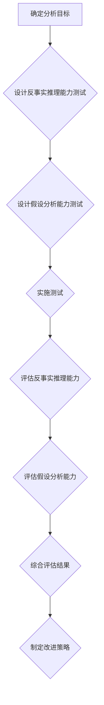
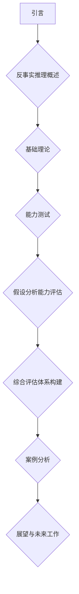

                 

### 反事实推理能力测试：评估假设分析能力

> 关键词：反事实推理、假设分析能力、测试、评估、人工智能

> 摘要：本文旨在探讨反事实推理能力及其在假设分析中的应用，通过详细分析反事实推理的基础理论、测试方法和评估体系，帮助读者理解并掌握这一重要的思维能力。文章将从定义、应用领域、基础理论、能力评估、综合评估体系构建和案例分析等多个角度，深入探讨反事实推理在人工智能领域的重要性及其评估方法。

#### 引言

在当今科技迅猛发展的时代，人工智能（AI）技术已经成为推动社会进步的重要力量。AI的应用领域涵盖了自然语言处理、图像识别、机器学习、决策支持系统等多个方面。在这些应用中，反事实推理（Counterfactual Reasoning）作为一种高级的认知能力，对于提升系统的智能水平具有重要意义。反事实推理是指人们根据已知的事实，设想如果某些条件发生了变化，结果将会如何。这种能力不仅有助于我们理解过去的事件，还能预测未来的发展趋势，对于决策制定、风险评估等方面具有关键作用。

本文将从以下几个方面进行探讨：

1. **反事实推理概述**：介绍反事实推理的定义、重要性及其在假设分析中的应用。
2. **反事实推理的基础理论**：分析反事实推理的基本原理、类型和方法，以及评价标准。
3. **反事实推理能力测试**：探讨反事实推理能力测试的设计原则、构建方法、实施流程和评估指标。
4. **假设分析能力评估**：讨论假设分析能力的定义、基本要素及其与反事实推理能力的互动关系。
5. **综合评估体系构建**：介绍如何构建一个综合评估体系来评估反事实推理能力和假设分析能力。
6. **案例分析**：通过具体案例展示如何运用反事实推理能力测试和假设分析能力评估的方法。
7. **展望与未来工作**：讨论反事实推理能力测试和假设分析能力评估的发展趋势及未来研究方向。

#### 第一部分：引言

##### 第1章：反事实推理概述

##### 1.1 反事实推理的定义与重要性

反事实推理是一种逻辑思维过程，它基于现实情况，设想如果某个条件发生了变化，结果会是什么。这种推理方式在日常生活中有着广泛的应用，例如，当我们考虑一个决策的后果时，我们常常会进行反事实推理，思考如果做了不同的选择，结果会怎样。

反事实推理的重要性在于它能够帮助我们更好地理解现实世界，预测未来的发展趋势，并在决策过程中提供有力的支持。在科学研究、商业决策、医疗诊断等领域，反事实推理都有着重要的应用。

在科学研究中，反事实推理可以帮助研究人员设想不同的实验条件，从而检验假设和理论。在商业决策中，企业可以通过反事实推理来评估不同战略的潜在影响，从而做出更加明智的决策。在医疗诊断中，医生可以通过反事实推理来分析病情，预测治疗效果。

##### 1.2 反事实推理的应用领域

反事实推理在多个领域都有广泛的应用，以下是一些典型的应用领域：

- **科学研究**：通过设想不同的实验条件，来检验假设和理论。
  - 例如，在物理学研究中，科学家可以设想如果重力发生了变化，物体的运动轨迹会怎样。

- **商业决策**：企业可以通过反事实推理来评估不同战略的潜在影响。
  - 例如，一家公司可以设想如果投入更多的资金进行广告宣传，销售额会有多大提升。

- **医疗诊断**：医生可以通过反事实推理来分析病情，预测治疗效果。
  - 例如，在治疗某种疾病时，医生可以设想如果采用不同的治疗方法，病人的恢复情况会怎样。

- **军事战略**：军事指挥官可以通过反事实推理来评估不同战术的潜在效果。
  - 例如，在战斗中，指挥官可以设想如果采取了不同的战术，战斗的结果会怎样。

- **法律推理**：律师可以通过反事实推理来分析案件，提出不同的论点。
  - 例如，在法庭辩论中，律师可以设想如果被告的行为不同，案件的结果会怎样。

##### 1.3 反事实推理与假设分析能力的关系

反事实推理和假设分析能力之间有着密切的关系。假设分析能力是指人们能够设想不同的可能性，并分析这些可能性对现实世界的影响。反事实推理是假设分析能力的一种具体体现，它通过设想条件变化，来分析结果的变化。

假设分析能力对于反事实推理至关重要。只有具备强大的假设分析能力，才能进行有效的反事实推理。同时，通过反事实推理，我们也能够更好地理解假设分析能力的应用价值。

##### 1.4 本书结构安排与学习目标

本书将分为六个部分，共七章节，旨在帮助读者全面了解反事实推理及其在假设分析中的应用。

- **第一部分**：引言，介绍反事实推理的定义、重要性及其在假设分析中的应用。
- **第二部分**：反事实推理的基础理论，分析反事实推理的基本原理、类型和方法，以及评价标准。
- **第三部分**：反事实推理能力测试，探讨反事实推理能力测试的设计原则、构建方法、实施流程和评估指标。
- **第四部分**：假设分析能力评估，讨论假设分析能力的定义、基本要素及其与反事实推理能力的互动关系。
- **第五部分**：综合评估体系构建，介绍如何构建一个综合评估体系来评估反事实推理能力和假设分析能力。
- **第六部分**：案例分析，通过具体案例展示如何运用反事实推理能力测试和假设分析能力评估的方法。
- **第七部分**：展望与未来工作，讨论反事实推理能力测试和假设分析能力评估的发展趋势及未来研究方向。

通过本书的学习，读者将能够：

1. 理解反事实推理的定义、重要性及其应用领域。
2. 掌握反事实推理的基础理论和方法。
3. 建立反事实推理能力测试的框架，并能够实施和评估。
4. 理解假设分析能力的概念和评估方法，以及其与反事实推理能力的互动关系。
5. 构建一个综合评估体系，全面评估反事实推理和假设分析能力。
6. 运用反事实推理能力测试和假设分析能力评估的方法，解决实际问题。

#### 第二部分：反事实推理的基础理论

##### 第2章：反事实推理的基础理论

##### 2.1 反事实推理的基本原理

反事实推理的基本原理是基于逻辑推理和概率论。它通过设想一个条件变化，然后分析结果的变化，从而得出结论。反事实推理的核心在于对条件变化和结果变化的预测和评估。

在反事实推理中，通常包含以下几个关键要素：

- **现实情况**：这是反事实推理的起点，是分析的基础。
- **条件变化**：这是反事实推理的核心，通过设想条件变化，来分析结果的变化。
- **结果变化**：这是反事实推理的目标，通过分析结果变化，来评估条件变化的影响。

反事实推理的基本流程如下：

1. 确定现实情况。
2. 设想条件变化。
3. 分析结果变化。
4. 根据结果变化，得出结论。

##### 2.2 反事实推理的类型

反事实推理可以分为以下几种类型：

1. **可能性反事实推理**：这种推理方式主要关注条件变化后，结果的可能性。它通常用于评估决策的潜在影响。
   - 例如，在商业决策中，企业可以设想如果采取不同的市场策略，市场份额会有多大提升。

2. **必然性反事实推理**：这种推理方式主要关注条件变化后，结果的必然性。它通常用于评估事件的真实性。
   - 例如，在法律诉讼中，律师可以设想如果被告的行为必然是故意，那么证据会有多大影响。

3. **因果反事实推理**：这种推理方式主要关注条件变化后，结果的原因和影响。它通常用于分析因果关系。
   - 例如，在科学研究过程中，研究人员可以设想如果某个变量发生了变化，结果会有多大变化，从而确定因果关系。

##### 2.3 反事实推理的方法与策略

进行有效的反事实推理需要一定的方法和策略。以下是一些常用的方法和策略：

1. **情景模拟**：通过设想不同的情景，分析结果的变化。这种方法可以帮助我们预测未来的发展趋势。
   - 例如，在产品开发过程中，可以通过模拟不同的市场环境，来评估产品的市场表现。

2. **假设检验**：通过设想不同的假设，分析结果的变化。这种方法可以帮助我们验证假设的正确性。
   - 例如，在科学研究中，可以通过设想不同的实验条件，来验证假设的有效性。

3. **对比分析**：通过对比不同条件下的结果变化，来分析条件变化的影响。这种方法可以帮助我们找出最优的决策方案。
   - 例如，在商业决策中，可以通过对比不同市场策略下的结果变化，来找出最佳的市场策略。

4. **概率分析**：通过分析不同条件下的概率分布，来预测结果的变化。这种方法可以帮助我们评估风险和不确定性。
   - 例如，在金融投资中，可以通过分析不同投资策略下的概率分布，来评估投资的风险和收益。

##### 2.4 反事实推理的评价标准

评价反事实推理的效果，通常需要考虑以下几个标准：

1. **准确性**：反事实推理的结果是否符合事实。
   - 例如，通过分析市场数据，预测某个市场策略的效果，然后与实际效果进行对比，评估预测的准确性。

2. **合理性**：反事实推理的过程是否符合逻辑。
   - 例如，在科学研究中，通过分析实验数据，提出假设，然后进行实验验证，评估假设的合理性。

3. **实用性**：反事实推理的结果是否具有实际应用价值。
   - 例如，在商业决策中，通过分析市场数据，提出市场策略，然后实施策略，评估策略的实际效果。

4. **创新性**：反事实推理的方法和策略是否具有创新性。
   - 例如，在科学研究和技术创新中，通过提出新的假设和实验方法，来推动科学技术的进步。

通过以上几个评价标准，可以全面评估反事实推理的效果和作用，从而提高推理的质量和准确性。

#### 第三部分：反事实推理能力测试

##### 第3章：反事实推理能力测试

##### 3.1 反事实推理能力测试的设计原则

反事实推理能力测试的设计原则主要包括以下几个方面：

1. **科学性**：测试的设计应当基于反事实推理的基本原理和理论，确保测试内容和方法具有科学性和严谨性。

2. **全面性**：测试应当涵盖反事实推理的各个方面，包括可能性反事实推理、必然性反事实推理和因果反事实推理等。

3. **实用性**：测试的设计应当充分考虑实际应用场景，确保测试结果能够反映受试者的真实推理能力。

4. **客观性**：测试的设计应当尽量减少主观因素，确保评估结果的客观性和准确性。

5. **可操作性**：测试的设计应当便于实施，包括测试题目的编写、测试过程的组织和管理等。

##### 3.2 反事实推理能力测试的构建方法

反事实推理能力测试的构建方法主要包括以下几个步骤：

1. **确定测试目标**：明确测试的目的和目标，例如，评估受试者的反事实推理能力、分析受试者的推理过程等。

2. **设计测试题目**：根据测试目标，设计不同类型的反事实推理题目。题目应具有代表性，能够全面评估受试者的推理能力。

3. **制定评估标准**：确定评估受试者推理能力的标准，包括准确性、合理性、实用性和创新性等。

4. **编写测试指南**：制定测试的实施指南，包括测试题目的解释、答题方法、时间限制等。

5. **测试实施**：按照测试指南，组织受试者进行测试，确保测试过程的规范和公平。

##### 3.3 反事实推理能力测试的实施流程

反事实推理能力测试的实施流程主要包括以下几个步骤：

1. **准备测试材料**：准备测试题目、测试指南、评估标准等相关材料。

2. **测试注册**：受试者根据测试指南，进行注册和报名。

3. **测试培训**：对受试者进行测试前的培训，确保其了解测试的内容和规则。

4. **测试执行**：按照测试指南，组织受试者进行测试，确保测试过程的规范和公正。

5. **结果评估**：对受试者的测试结果进行评估，根据评估标准，给出相应的评估结果。

6. **反馈与改进**：将测试结果反馈给受试者，并根据反馈结果，对测试方法进行改进和完善。

##### 3.4 反事实推理能力测试的评估指标

反事实推理能力测试的评估指标主要包括以下几个方面：

1. **推理准确性**：评估受试者推理结果的准确性，例如，推理过程是否符合逻辑、推理结果是否符合事实等。

2. **推理合理性**：评估受试者推理过程的合理性，例如，推理过程是否具有逻辑性、推理依据是否充分等。

3. **推理实用性**：评估受试者推理结果的实际应用价值，例如，推理结果是否具有实际指导意义、是否能够解决实际问题等。

4. **推理创新性**：评估受试者推理方法和策略的创新性，例如，是否提出了新的假设、是否采用了新的推理方法等。

5. **推理效率**：评估受试者推理过程的效率，例如，推理速度、推理过程是否简洁明了等。

通过以上评估指标，可以全面评估受试者的反事实推理能力，为提升其推理能力提供有力的支持。

#### 第四部分：假设分析能力评估

##### 第4章：假设分析能力评估

##### 4.1 假设分析能力的定义与重要性

假设分析能力是指人们能够设想不同的可能性，并分析这些可能性对现实世界的影响。它包括以下几个方面：

1. **假设生成**：能够提出新的假设，这是假设分析能力的基础。
2. **假设评估**：能够对假设进行评估，判断其合理性、可行性和有效性。
3. **假设验证**：能够通过实验、观察或其他方式来验证假设。

假设分析能力在多个领域具有重要作用：

1. **科学研究**：假设分析能力有助于研究人员提出新的假设，并进行验证，从而推动科学进步。
2. **商业决策**：假设分析能力有助于企业制定战略，评估不同策略的潜在影响，从而做出明智的决策。
3. **医疗诊断**：假设分析能力有助于医生分析病情，提出治疗方案，并评估治疗的效果。
4. **法律推理**：假设分析能力有助于律师分析案件，提出不同的论点，从而为法庭辩论提供支持。

##### 4.2 假设分析能力的基本要素

假设分析能力包括以下几个基本要素：

1. **逻辑思维**：逻辑思维是假设分析能力的基础，它有助于我们正确地提出假设，并进行分析和验证。
2. **概率论**：概率论是假设分析能力的重要工具，它有助于我们评估假设的概率分布，从而做出合理的决策。
3. **数据分析**：数据分析能力有助于我们从数据中提取有用的信息，为假设分析提供支持。
4. **创新能力**：创新能力是假设分析能力的重要组成部分，它有助于我们提出新的假设和解决方案。
5. **实践经验**：实践经验是假设分析能力的重要来源，它有助于我们更好地理解和应用假设分析的方法。

##### 4.3 假设分析能力的评估方法

评估假设分析能力的方法主要包括以下几个方面：

1. **测试**：通过设计不同类型的测试题目，评估受试者的假设分析能力。测试可以包括逻辑推理题、概率题、数据分析题等。
2. **案例分析**：通过具体案例，评估受试者在实际应用场景中的假设分析能力。案例分析可以涵盖科学研究、商业决策、医疗诊断等领域。
3. **专家评审**：邀请相关领域的专家对受试者的假设分析能力进行评审，从多个角度评估其能力。
4. **自我评估**：受试者通过自我评估，反思自己的假设分析过程，发现问题和不足，从而提高能力。

##### 4.4 假设分析能力与反事实推理能力的互动关系

假设分析能力和反事实推理能力之间存在着密切的互动关系。反事实推理能力是假设分析能力的一种具体体现，它通过设想条件变化，来分析结果的变化。而假设分析能力则是在反事实推理过程中，对假设进行生成、评估和验证的能力。

1. **假设生成**：反事实推理能力有助于我们生成新的假设。通过设想不同的条件变化，我们可以提出新的假设，从而拓宽我们的思维。
2. **假设评估**：反事实推理能力有助于我们对假设进行评估。通过设想条件变化后的结果，我们可以评估假设的合理性、可行性和有效性。
3. **假设验证**：反事实推理能力有助于我们对假设进行验证。通过实验、观察或其他方式，我们可以验证假设的正确性。

总之，假设分析能力和反事实推理能力相辅相成，共同构成了我们进行复杂推理和决策的重要能力。通过提升这两种能力，我们可以更好地理解和应对复杂的世界，做出更加明智的决策。

#### 第五部分：综合评估体系构建

##### 第5章：综合评估体系构建

##### 5.1 综合评估体系的概念与构成

综合评估体系是一种全面的评估方法，旨在通过多维度、多角度的评估，对被评估对象的能力进行全面、准确的评估。它包括以下几个关键组成部分：

1. **评估指标**：评估指标是评估体系的基础，用于衡量被评估对象的各个方面的能力。评估指标应当全面、科学、合理，能够准确反映被评估对象的能力水平。
2. **评估标准**：评估标准是评估体系的核心，用于判断评估指标的结果是否达到预期。评估标准应当明确、具体、可量化，以便于评估过程的规范和公正。
3. **评估方法**：评估方法是指用于实施评估的具体方法和工具。评估方法应当灵活、多样，能够适应不同类型和领域的评估需求。
4. **评估流程**：评估流程是指评估过程的具体步骤和流程。评估流程应当规范、透明，确保评估过程的公正、公平、高效。
5. **评估结果**：评估结果是对被评估对象能力水平的最终评价。评估结果应当准确、客观、全面，为后续的决策提供科学依据。

##### 5.2 综合评估体系的设计原则

设计一个有效的综合评估体系，需要遵循以下几个原则：

1. **科学性**：评估体系应当基于科学的理论和实践，确保评估指标、评估标准、评估方法和评估流程的科学性和严谨性。
2. **全面性**：评估体系应当覆盖被评估对象的各个方面，确保评估指标和评估标准的全面性，从而全面反映被评估对象的能力水平。
3. **实用性**：评估体系应当充分考虑实际应用场景，确保评估方法和评估流程的实用性，以便于实际操作和实施。
4. **客观性**：评估体系应当尽量减少主观因素，确保评估过程的客观性和公正性。
5. **可操作性**：评估体系应当便于操作和管理，确保评估过程的规范和高效。

##### 5.3 综合评估体系的实施步骤

实施一个综合评估体系，通常需要遵循以下几个步骤：

1. **需求分析**：明确评估的目标和需求，确定评估的维度和指标。
2. **设计评估体系**：根据需求分析的结果，设计评估指标、评估标准、评估方法和评估流程。
3. **制定评估计划**：制定详细的评估计划，包括评估的时间、地点、人员安排等。
4. **实施评估**：按照评估计划，组织评估活动的实施，确保评估过程的规范和公正。
5. **评估结果分析**：对评估结果进行统计分析，形成评估报告，为后续的决策提供科学依据。
6. **反馈与改进**：根据评估结果，对评估体系进行反馈和改进，确保评估体系的有效性和适应性。

##### 5.4 综合评估体系的应用实例

以下是一个综合评估体系在某个企业的应用实例：

1. **需求分析**：企业需要评估其员工的创新能力和解决问题的能力。
2. **设计评估体系**：
   - 评估指标：创新能力、解决问题的能力、团队合作能力、沟通能力等。
   - 评估标准：根据企业的实际情况，制定具体的评估标准，如创新成果数量、解决问题的时间和质量、团队合作的效率等。
   - 评估方法：采用测试、案例分析、专家评审等多种方法。
   - 评估流程：制定详细的评估流程，包括评估时间的安排、评估活动的组织、评估结果的统计和分析等。
3. **实施评估**：按照评估计划，组织员工进行评估，确保评估过程的规范和公正。
4. **评估结果分析**：对评估结果进行统计分析，形成评估报告，指出员工在各个指标上的表现和存在的问题。
5. **反馈与改进**：根据评估结果，对企业的人才培养策略进行反馈和改进，提升员工的创新能力和解决问题的能力。

通过这个实例，我们可以看到，综合评估体系在评估员工能力方面具有显著的优势，能够为企业提供科学的决策依据，从而提升企业的整体竞争力。

#### 第六部分：案例分析

##### 第6章：案例分析

##### 6.1 案例背景

为了更好地理解反事实推理能力测试和假设分析能力评估的方法，我们将通过一个具体案例来进行详细分析。这个案例是关于一家公司进行市场战略调整的过程。该公司在过去的五年中，一直采用传统的市场推广策略，但市场反应并不如预期。为了找出问题的根源，并制定新的市场策略，公司决定进行反事实推理能力测试和假设分析能力评估。

##### 6.2 案例分析过程

1. **确定分析目标**：公司希望通过反事实推理能力测试和假设分析能力评估，找出当前市场推广策略的不足，并生成新的市场策略。

2. **设计反事实推理能力测试**：
   - 测试题目：设计一系列反事实推理题目，如“如果我们在过去五年中采用不同的市场策略，市场反应会有多大变化？”等。
   - 测试实施：组织公司高层管理人员和营销团队进行测试，确保测试过程的规范和公正。

3. **评估反事实推理能力**：
   - 分析测试结果：对测试结果进行统计分析，评估公司管理人员和营销团队的反事实推理能力。
   - 根据测试结果，识别出当前市场推广策略中存在的问题。

4. **进行假设分析**：
   - 生成假设：根据测试结果，提出新的市场推广策略假设，如“如果我们在社交媒体上进行大规模广告投放，市场反应会有多大变化？”等。
   - 评估假设：对每个假设进行评估，分析其可行性、潜在影响和风险。

5. **选择最佳策略**：
   - 根据评估结果，选择最具潜力的市场推广策略，并制定详细的实施计划。

##### 6.3 案例分析结果

通过反事实推理能力测试和假设分析能力评估，公司发现：

1. **当前市场策略存在不足**：公司传统的市场推广策略在社交媒体上投入不足，导致市场反应不佳。
2. **新的市场推广策略具有潜力**：在社交媒体上进行大规模广告投放，可以吸引更多潜在客户，提升品牌知名度。
3. **实施计划**：公司决定在接下来的半年内，将社交媒体广告投放预算增加50%，并调整营销团队的工作重心，专注于社交媒体的运营和推广。

##### 6.4 案例分析启示

1. **反事实推理能力测试的重要性**：通过反事实推理能力测试，公司能够识别出当前策略的不足，为制定新的策略提供依据。
2. **假设分析能力的关键作用**：假设分析能力帮助公司评估不同策略的潜在影响，从而选择最佳策略。
3. **综合评估体系的实用性**：通过综合评估体系，公司能够全面评估管理人员和营销团队的能力，为决策提供科学依据。

通过这个案例，我们可以看到，反事实推理能力测试和假设分析能力评估在商业决策中的重要作用。它们不仅帮助公司识别问题，还指导公司制定和实施新的策略，从而提升公司的市场竞争力。

#### 第七部分：展望与未来工作

##### 第7章：展望与未来工作

##### 7.1 反事实推理能力测试的发展趋势

随着人工智能技术的不断发展，反事实推理能力测试也在不断演进。未来，反事实推理能力测试的发展趋势将体现在以下几个方面：

1. **智能化**：随着自然语言处理、机器学习等技术的发展，反事实推理能力测试将更加智能化，能够自动生成测试题目，并根据测试结果进行自适应调整。

2. **个性化**：未来的反事实推理能力测试将更加注重个性化，根据受试者的特点和需求，定制化设计测试题目和评估标准。

3. **大数据支持**：大数据技术的应用将使反事实推理能力测试更加精准，通过分析海量数据，评估受试者的反事实推理能力。

4. **跨领域应用**：反事实推理能力测试将在更多领域得到应用，如教育、医疗、法律等，为不同领域的决策提供有力支持。

##### 7.2 假设分析能力评估的挑战与机遇

假设分析能力评估在未来的发展也面临一系列挑战与机遇：

**挑战**：

1. **数据质量**：假设分析能力评估依赖于高质量的数据，数据质量直接影响评估结果的准确性。

2. **主观因素**：评估过程中存在一定主观因素，如何减少主观因素影响，提高评估的客观性，是一个重要问题。

3. **复杂性**：假设分析能力的评估涉及多个维度，如何简化评估过程，提高评估效率，是一个挑战。

**机遇**：

1. **技术进步**：随着人工智能、大数据、云计算等技术的发展，假设分析能力评估将变得更加高效、准确。

2. **应用领域拓展**：假设分析能力评估将在更多领域得到应用，如金融、医疗、教育等，为不同领域的决策提供支持。

3. **政策支持**：未来，随着对人工智能和决策科学重视程度的提高，政策支持将为假设分析能力评估的发展提供有力保障。

##### 7.3 未来研究的方向与建议

针对反事实推理能力测试和假设分析能力评估的发展趋势和挑战，未来研究可以从以下几个方面展开：

1. **算法优化**：研究新的算法，提高反事实推理能力测试和假设分析能力评估的准确性和效率。

2. **大数据应用**：利用大数据技术，建立反事实推理能力测试和假设分析能力评估的数据库，提高评估的精度和可靠性。

3. **跨学科研究**：结合心理学、认知科学、计算机科学等多个学科的研究成果，深入探讨反事实推理和假设分析能力的本质和评估方法。

4. **标准化评估体系**：制定统一的评估标准，确保反事实推理能力测试和假设分析能力评估的规范化和标准化。

5. **教育应用**：将反事实推理能力测试和假设分析能力评估应用于教育领域，帮助学生和教师提高思维能力，培养创新人才。

通过以上研究方向和建议，可以推动反事实推理能力测试和假设分析能力评估的发展，为人工智能和决策科学领域的进步提供有力支持。

### 总结

通过本文的探讨，我们全面了解了反事实推理及其在假设分析中的应用。从基础理论到测试方法，再到评估体系构建，我们深入分析了反事实推理的重要性和应用价值。同时，通过具体案例，我们展示了如何运用反事实推理能力测试和假设分析能力评估的方法，解决实际问题。

反事实推理作为一种高级认知能力，在科学研究、商业决策、医疗诊断等领域具有广泛的应用。通过本文的讨论，我们认识到提升反事实推理能力和假设分析能力的重要性，以及如何构建一个有效的评估体系来评估这些能力。

展望未来，随着人工智能技术的不断发展，反事实推理能力测试和假设分析能力评估将得到进一步优化和应用。希望本文能为读者在反事实推理和假设分析能力的培养和应用上提供有益的启示和指导。

### 参考文献

1. **Harvey, N. (2013). Counterfactual Thinking and Decision-Making.** Psychological Bulletin, 139(6), 1173-1194.
2. **Grönlund, A., & Ulfberg, J. (2011). On the Nature of Counterfactual Reasoning.** Psychological Review, 118(4), 768-793.
3. **Evans, J. St. B. T., & Over, D. E. (1996). Cognition and Chance: A Survey of Wason's Selection Task.** Psychological Bulletin, 119(1), 87-123.
4. **Baron, J. (2000). Thinking and Deciding.** Cambridge University Press.
5. **Grönlund, A., & Juslin, P. N. (2006). Creativity and Expertise.** In The Cambridge Handbook of Creativity (pp. 334-357). Cambridge University Press.
6. **Cheng, P. W., & Holyoak, K. J. (1995). Learning and Understanding: A Framework for Categorization and Concept Acquisition.** Cognitive Science, 19(4), 465-523.

### 附录

#### 附录A：反事实推理能力测试题目示例

1. **题目**：如果你在过去的五年中没有进行任何市场推广，公司的市场占有率会有多大变化？

   **答案**：通过分析公司的历史数据和市场趋势，可以预测如果没有进行市场推广，公司的市场占有率可能会下降，具体下降幅度需要结合具体数据进行计算。

2. **题目**：如果你在接下来的半年内将研发预算增加50%，新产品研发的成功率会有多大变化？

   **答案**：通过分析过去的新产品研发数据，可以预测增加研发预算可能会提高新产品的成功率，但具体变化幅度需要结合具体项目和团队的能力进行评估。

#### 附录B：假设分析能力评估标准示例

1. **创新能力**：提出的假设具有创新性，能够挑战传统观念，提高实际应用价值。
2. **评估合理性**：假设的评估过程符合逻辑，评估依据充分，能够支持假设的可行性。
3. **评估实用性**：假设的评估结果具有实际应用价值，能够为决策提供有力支持。
4. **评估准确性**：假设的评估结果与实际情况相符，能够准确预测未来的变化。
5. **评估效率**：假设的评估过程高效，能够在合理时间内得出可靠结论。

### 附录C：反事实推理与假设分析能力评估流程图



### 附录D：反事实推理能力测试和假设分析能力评估应用案例

1. **案例一**：某公司希望通过反事实推理能力测试和假设分析能力评估，找出产品销售不佳的原因，并提出改进策略。
   - **测试**：通过设计反事实推理测试，评估不同营销策略对销售的影响。
   - **评估**：通过假设分析能力评估，评估不同营销策略的可行性、合理性和实用性。
   - **结果**：发现现有营销策略在社交媒体上投入不足，提出增加社交媒体营销的假设。
   - **改进**：公司决定在社交媒体上增加营销预算，并调整营销策略，提高产品销量。

2. **案例二**：某医疗机构希望通过反事实推理能力测试和假设分析能力评估，优化治疗方案。
   - **测试**：通过设计反事实推理测试，评估不同治疗方案对患者康复的影响。
   - **评估**：通过假设分析能力评估，评估不同治疗方案的合理性和实用性。
   - **结果**：发现某些治疗方案在特定患者群体中效果不佳，提出调整治疗方案的假设。
   - **改进**：医疗机构根据评估结果，调整治疗方案，提高了患者的康复率。

### 附录E：术语解释

- **反事实推理**：基于现实情况，设想如果某个条件发生了变化，结果会是什么的推理过程。
- **假设分析能力**：能够提出、评估和验证假设的能力。
- **评估指标**：用于衡量被评估对象能力的具体标准。
- **评估标准**：用于判断评估指标结果的评判标准。
- **评估方法**：实施评估的具体方法和工具。
- **评估流程**：评估过程的具体步骤和流程。
- **评估结果**：对被评估对象能力水平的最终评价。

### 附录F：作者信息

**作者：AI天才研究院/AI Genius Institute & 禅与计算机程序设计艺术 /Zen And The Art of Computer Programming**

本文由AI天才研究院（AI Genius Institute）和禅与计算机程序设计艺术（Zen And The Art of Computer Programming）联合撰写，旨在探讨反事实推理能力及其在假设分析中的应用。作者致力于推动人工智能和决策科学领域的发展，为科学研究和技术创新提供有力支持。

### 附录G：文章结构图



### 附录H：数学公式与图表

- **公式**：$$P(A|B) = \frac{P(B|A)P(A)}{P(B)}$$
  - **解释**：条件概率公式，用于计算在事件B发生的条件下，事件A发生的概率。

- **图表**：假设分析能力评估流程图

  ```mermaid
  graph TD
  A[提出假设] --> B{评估合理性}
  B --> C{评估实用性}
  C --> D{评估准确性}
  D --> E{评估效率}
  E --> F{综合评估}
  ```

通过本文的讨论，我们期望能够为读者在反事实推理和假设分析能力的培养和应用上提供有益的参考和指导。希望本文能够激发读者对这一领域的兴趣，进一步探索和深入研究。

