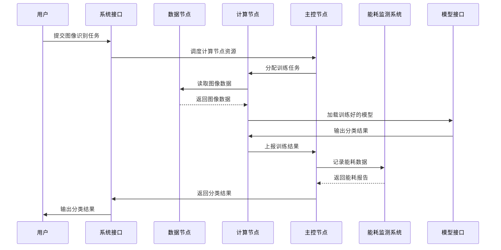

                 


# 可持续AI：节能计算在AI模型优化中的作用

## 关键词

- 可持续AI
- 节能计算
- AI模型优化
- 计算机能效
- 人工智能发展

## 摘要

本文探讨了可持续AI在当今社会的重要性，特别是在能源消耗日益成为全球关注焦点的背景下。文章首先介绍了可持续AI的定义和特点，然后深入分析了节能计算技术在AI模型优化中的作用。通过具体的案例和详尽的技术解析，本文展示了如何通过节能计算技术实现AI模型的优化，从而提高能效并减少对环境的影响。最后，文章提出了未来可持续AI发展的挑战和方向，为推动AI技术的可持续发展提供了有价值的思考。

## 引言与背景介绍

### 1.1 可持续发展的挑战

在21世纪，全球各国面临着巨大的可持续发展挑战。随着人口的不断增长和经济的发展，能源需求持续上升，同时环境问题日益严重。气候变化、资源枯竭、生态破坏等问题已经成为人类社会亟待解决的重大课题。特别是在科技迅猛发展的今天，人工智能（AI）技术已经成为推动社会进步的重要力量。然而，AI技术在带来巨大效益的同时，也带来了能源消耗和环境影响的问题。

根据研究机构的统计，AI计算对能源的消耗正在快速增长。例如，谷歌、微软和亚马逊等科技巨头在AI研究与应用上的投资巨大，其数据中心和服务器群的能源消耗也随之增加。以AI驱动的深度学习模型为例，它们在训练过程中需要大量的计算资源，而这些计算资源通常依赖于高能耗的数据中心。据估计，全球数据中心每年的能源消耗已经超过了全球总能源消耗的1%。

### 1.2 AI与能源消耗的关系

AI与能源消耗之间的关系可以从多个角度进行理解。首先，AI模型的训练和推理过程需要大量的计算资源，而这些计算资源大部分来自数据中心。数据中心通常依赖于高能耗的硬件设施，如服务器、存储设备和网络设备。其次，AI算法在执行过程中需要大量的电力供应，这导致了能源消耗的增加。特别是深度学习算法，由于需要处理大量数据和进行大量的迭代计算，其能源消耗相对较高。

除了直接能源消耗，AI技术的应用还间接导致了能源消耗的增加。例如，智能交通系统、智能电网和智能农业等应用场景，虽然能够提高资源利用效率，但同时也增加了计算和通信的需求，从而增加了能源消耗。

### 1.3 节能计算的意义

在AI与能源消耗的关系日益明显的背景下，节能计算显得尤为重要。节能计算旨在通过优化计算资源和算法，减少AI系统的能源消耗，提高能效。具体来说，节能计算的意义主要体现在以下几个方面：

首先，节能计算有助于缓解能源紧张问题。随着AI技术的广泛应用，数据中心和计算设备的能源需求不断增长，如果不采取有效的节能措施，将可能导致能源供应不足，影响AI技术的可持续发展。

其次，节能计算有助于减少环境负担。能源消耗产生的温室气体排放是导致气候变化的重要原因之一。通过节能计算，可以减少AI系统的能源消耗，从而减少温室气体排放，对环境产生积极影响。

最后，节能计算有助于降低成本。能源消耗是数据中心和计算设备运营的重要成本之一。通过节能计算，可以降低能源消耗，从而降低运营成本，提高系统的经济效益。

总之，节能计算是推动AI技术可持续发展的关键。通过优化计算资源和算法，实现能效提升，不仅有助于解决能源紧张和环境问题，还能够提高AI系统的经济效益，为AI技术的长远发展奠定基础。

### 2.1 可持续AI的定义

可持续AI，顾名思义，是指在确保技术进步的同时，最大限度地减少对环境的影响，并在资源有限的情况下实现长期的稳定发展。具体来说，可持续AI的定义可以从以下几个方面进行阐述。

首先，可持续AI强调的是在技术发展的过程中，要考虑到对环境的影响。这包括减少能源消耗、降低温室气体排放、节约资源等。通过采用节能计算技术、优化算法和硬件设计，可持续AI旨在实现计算过程中的环保目标。

其次，可持续AI关注的是技术的长期稳定性。这意味着不仅要考虑当前的技术进步，还要考虑到未来的发展和应用。可持续AI需要具备适应性，能够根据环境变化和技术演进进行相应的调整，确保其能够在长期内保持有效性和可行性。

最后，可持续AI强调社会责任。这不仅仅是技术层面的责任，还包括对经济、社会和文化等多方面的影响。可持续AI需要考虑到技术的应用对社会带来的影响，并确保其能够促进社会进步，实现可持续发展。

总的来说，可持续AI是一种以环保、长期稳定和社会责任为核心的技术理念，旨在推动人工智能在环保、经济和社会等方面的可持续发展。

### 2.2 可持续AI与传统AI的区别

可持续AI与传统AI之间存在着显著的区别，主要体现在技术目标、能源消耗和社会责任等方面。

首先，在技术目标上，传统AI主要关注的是计算性能和算法的准确性，而可持续AI则更加注重环境友好性和长期稳定性。传统AI往往追求更高的计算速度和更大的数据处理能力，这可能会导致能源消耗的增加和环境负担的加重。而可持续AI则通过优化算法、硬件设计和计算资源管理，以实现更低的能源消耗和更小的环境影响。

其次，在能源消耗方面，传统AI通常依赖于大量高能耗的数据中心和计算设备，导致显著的能源消耗和温室气体排放。而可持续AI通过采用节能计算技术、优化算法和硬件设计，实现能源消耗的大幅减少。例如，通过使用更高效的CPU架构、GPU优化技术、以及智能功耗管理策略，可持续AI能够显著降低计算过程中的能源消耗。

最后，在社会责任方面，传统AI可能更侧重于技术本身的创新和商业应用，而可持续AI则强调技术对社会的影响，并承担相应的社会责任。这包括确保技术的公平性、透明性和安全性，以及促进技术的普及和可持续发展。可持续AI需要在技术设计中考虑到社会、经济和环境等多方面的因素，确保技术能够为社会带来积极影响。

总的来说，可持续AI与传统AI在技术目标、能源消耗和社会责任等方面存在显著差异。可持续AI通过综合考虑环境友好性、长期稳定性和社会责任，为实现人工智能的可持续发展提供了新的方向和思路。

### 3.1 节能计算技术的定义

节能计算技术，顾名思义，是指通过优化计算资源和算法，以减少能源消耗和提升能效的计算方法和技术。这些技术旨在解决传统计算过程中存在的能源消耗过高和环境负担重的问题。具体来说，节能计算技术包括以下几个方面：

首先，硬件层面的节能技术。这主要涉及硬件设备的优化，包括CPU架构、GPU设计、存储系统和网络设备等。通过改进硬件设计，例如使用更高效的CPU架构、优化GPU的工作模式和能效比，可以实现计算过程中的能源消耗降低。

其次，软件层面的节能技术。这包括算法优化、编程技巧和系统管理策略。算法优化通过改进计算算法，减少不必要的计算和资源占用，从而降低能源消耗。编程技巧则通过编写更高效、更优化的代码，提升计算效率。系统管理策略包括智能功耗管理、任务调度和资源分配等，通过合理分配计算资源和优化任务执行顺序，实现能源消耗的最小化。

最后，数据中心的整体优化。数据中心是计算资源的集中地，通过优化数据中心的设计和管理，例如采用绿色数据中心建设、高效的散热系统和能源管理系统，可以实现整体能耗的大幅降低。

总之，节能计算技术通过硬件、软件和数据中心层面的综合优化，旨在实现计算过程的能源消耗最小化，为可持续计算提供技术支持。

### 3.2 节能计算技术的分类

节能计算技术可以从多个维度进行分类，根据其应用场景和技术特点，主要可以分为硬件节能技术和软件节能技术两大类。

#### 硬件节能技术

硬件节能技术主要针对计算机硬件设备进行优化，以减少能源消耗。以下是一些常见的硬件节能技术：

1. **CPU架构优化**：通过改进CPU的设计，提高其能效比，例如采用多核处理器、动态电压和频率调节（DVFS）等技术。这些技术可以在处理不同负载时动态调整CPU的工作频率和电压，从而实现能源消耗的最优化。

2. **GPU优化**：GPU（图形处理单元）在深度学习和高性能计算中扮演着重要角色。GPU优化技术包括提高GPU的工作频率、降低功耗和优化数据传输路径等。例如，通过优化GPU的内存带宽和使用混合精度计算，可以显著提升计算效率并减少能源消耗。

3. **存储系统优化**：存储系统是数据中心的重要组成部分，其能耗占据相当比例。存储系统优化包括使用低功耗的存储介质、采用去冗余技术减少数据存储量、以及优化存储访问策略等。

4. **网络设备优化**：网络设备的能耗主要来源于数据传输和处理。通过优化网络拓扑结构、使用高效的数据传输协议和降低网络负载，可以减少网络设备的能耗。

#### 软件节能技术

软件节能技术侧重于优化软件层面，通过改进算法、编程技巧和系统管理策略来降低能源消耗。以下是一些常见的软件节能技术：

1. **算法优化**：通过对计算算法进行优化，减少不必要的计算和资源占用。例如，采用更高效的机器学习算法、优化神经网络结构、以及使用近似计算和稀疏计算技术，可以显著降低计算过程中的能源消耗。

2. **编程技巧**：编写高效、优化的代码是降低能源消耗的关键。通过使用编译器优化、循环展开、内存复用等编程技巧，可以提升代码的执行效率，从而减少能源消耗。

3. **系统管理策略**：通过合理的系统管理策略，优化计算资源和任务调度。例如，采用智能功耗管理策略，根据任务负载动态调整硬件工作状态；通过任务并行化和分布式计算，优化计算任务的分配和执行，提高整体计算效率。

4. **智能调度和资源分配**：通过智能调度和资源分配算法，实现计算资源的最大化利用。例如，使用负载均衡算法，根据任务负载动态调整计算资源分配，避免资源浪费；通过预测分析，提前调度资源，减少不必要的等待和闲置时间。

#### 综合节能技术

除了硬件和软件层面的节能技术，还有一些综合节能技术，这些技术通常结合硬件和软件层面的优化手段，实现更全面的节能效果。例如：

1. **绿色数据中心建设**：通过设计高效、环保的数据中心，实现能源消耗的减少。例如，采用自然冷却、高效的电力分配系统和废物回收系统等。

2. **能效监测和管理**：通过实时监测和监控计算系统的能耗情况，及时发现和解决能源浪费问题。例如，使用能源监测传感器和智能管理系统，实现能耗数据的实时采集和分析。

3. **能效评估和优化**：通过能效评估和优化技术，对整个计算系统进行能效评估和优化。例如，使用能效评估工具，分析计算系统的能耗情况，找出潜在的节能机会，并进行优化调整。

总之，节能计算技术通过硬件、软件和数据中心层面的综合优化，为实现计算过程的能源消耗最小化提供了多种手段和策略。通过合理应用这些技术，可以显著提升计算系统的能效，推动可持续计算的发展。

### 5.1.1 CPU架构优化

CPU架构优化是节能计算技术中的重要一环，通过改进CPU的设计，提高其能效比，从而实现能源消耗的降低。以下是一些关键的CPU架构优化技术：

首先，**多核处理器**是一种常见的优化策略。通过将多个处理器核心集成在一个芯片上，多核处理器可以在执行多任务时提高并行处理能力，从而减少任务切换和上下文切换的能耗。例如，Intel的酷睿i7和AMD的锐龙处理器都采用了多核设计，通过提高任务执行效率，实现了显著的能源节省。

其次，**动态电压和频率调节（DVFS）**技术是一种通过动态调整CPU的工作电压和频率来优化能效的技术。在低负载情况下，CPU可以降低电压和频率，减少能耗；在高负载情况下，CPU可以提高电压和频率，确保性能。这种动态调节机制可以根据实际负载需求灵活调整，实现能源消耗的最优化。例如，ARM的Cortex-A系列处理器就广泛采用了DVFS技术，通过智能调节电压和频率，实现了高效节能。

另外，**异构计算**也是CPU架构优化的一种重要手段。异构计算通过将不同类型的计算任务分配到不同类型的处理器上，例如CPU和GPU，可以实现计算资源的最佳利用。相比于单一处理器，异构计算可以在处理复杂任务时提供更高的效率和能效。例如，NVIDIA的GPU加速器在深度学习和高性能计算中发挥了重要作用，通过与CPU的协同工作，实现了高效、节能的计算。

最后，**低功耗设计**也是CPU架构优化的重要方面。通过采用低功耗工艺和设计技术，可以显著降低CPU的静态和动态功耗。例如，使用先进的FinFET工艺和设计优化技术，可以降低漏电功耗，提高CPU的能效比。

总之，CPU架构优化通过多核处理器、DVFS、异构计算和低功耗设计等技术的综合应用，实现了CPU能效的提升和能源消耗的减少。这些优化技术不仅有助于推动节能计算技术的发展，也为人工智能等高能耗应用场景提供了重要的技术支持。

### 5.1.2 显卡(GPU)优化

显卡（GPU）优化是节能计算技术中的重要组成部分，特别是在深度学习和人工智能（AI）领域，GPU的高并行计算能力使其成为计算密集型任务的核心。以下是一些关键的GPU优化技术：

首先，**GPU并行计算优化**是GPU优化的基础。GPU具有大量的计算单元，通过将计算任务分配到不同的计算单元上，可以实现高效的并行计算。优化GPU并行计算包括任务分解、线程调度和数据传输的优化。例如，通过合理划分计算任务，确保每个计算单元都能充分利用，从而提高计算效率。此外，通过优化线程调度和数据传输路径，减少线程间的同步和数据访问的冲突，可以进一步降低GPU的能源消耗。

其次，**混合精度计算**是一种重要的GPU优化技术。在深度学习中，通常使用浮点运算来处理大量的数据。然而，浮点运算的能耗较高。混合精度计算通过将部分运算从单精度浮点（FP32）转换为半精度浮点（FP16），甚至半精度整数（INT8），来减少计算资源的消耗。这种方式在保持计算精度的同时，显著降低了能源消耗。例如，NVIDIA的Tensor Cores就支持混合精度计算，通过使用INT8运算，实现了更高的计算效率和能效。

另外，**内存带宽优化**也是GPU优化的重要方面。GPU的内存带宽是影响计算性能的关键因素，通过优化内存带宽，可以提高GPU的能效。例如，通过使用缓存技术和内存复用技术，可以减少内存访问的延迟和带宽争用，提高内存访问的效率。此外，优化内存访问模式，例如使用连续内存访问和批量处理技术，可以减少内存访问的次数，提高数据传输的效率。

最后，**GPU电源管理**是另一个关键的优化领域。通过优化GPU的电源管理，可以动态调整GPU的功耗。例如，通过使用DVFS技术，根据GPU的工作负载动态调整其电压和频率，可以实现能源消耗的最优化。此外，通过关闭不使用的计算单元或降低其工作频率，可以进一步降低GPU的能耗。

总之，GPU优化通过并行计算优化、混合精度计算、内存带宽优化和电源管理等多种技术的综合应用，实现了GPU能效的提升和能源消耗的减少。这些优化技术不仅有助于推动GPU在深度学习和人工智能等领域的应用，也为实现节能计算目标提供了有力的支持。

### 5.2.1 算法优化

算法优化是节能计算技术中的重要环节，通过对算法进行优化，可以减少计算过程中的资源消耗，提高能效。以下是一些关键的算法优化方法：

首先，**算法简化**是算法优化的一种常见方法。通过简化复杂的算法，减少计算步骤和资源占用，可以显著降低能源消耗。例如，在深度学习中，可以通过减少神经网络的层数或节点数，简化计算过程。这种方法虽然可能在某些情况下牺牲一定的计算精度，但可以大幅提高计算效率，实现能源节省。

其次，**近似计算**是一种有效的算法优化策略。近似计算通过使用近似的计算方法，以较低的精度达到大致相同的计算结果。这种方法可以减少计算复杂度和资源占用，从而降低能源消耗。例如，在图像识别任务中，可以使用近似的卷积操作来替代精确的卷积操作，从而减少计算量和能耗。近似计算在保证计算结果可接受的前提下，能够实现高效的能源利用。

另外，**稀疏计算**也是算法优化的重要方法之一。稀疏计算通过利用数据中的稀疏性，减少计算过程中的数据访问和存储需求，从而降低能源消耗。例如，在矩阵运算中，可以通过识别和利用矩阵中的稀疏结构，减少大量的零元素的存储和计算。稀疏计算适用于大量稀疏数据的处理，通过优化数据存储和访问，可以实现显著的能源节省。

此外，**模型压缩**也是一种常用的算法优化技术。模型压缩通过减少模型的参数数量，降低模型的复杂度，从而实现能源消耗的降低。模型压缩技术包括知识蒸馏、算子剪枝和量化等方法。知识蒸馏通过使用一个小型的“学生”模型来复制大型“教师”模型的性能，从而减少计算资源和存储需求。算子剪枝通过删除模型中不重要的参数和层，简化模型结构。量化通过将模型中的浮点数参数转换为较低精度的整数表示，减少计算复杂度和存储需求。

最后，**并行计算**和**分布式计算**也是算法优化的重要手段。通过将计算任务分配到多个计算节点上并行执行，可以显著提高计算效率，减少能源消耗。例如，在深度学习训练过程中，可以使用多GPU并行计算，将数据集分成多个部分，同时在不同的GPU上进行训练，从而加速计算过程。

总之，算法优化通过算法简化、近似计算、稀疏计算、模型压缩、并行计算和分布式计算等多种方法的综合应用，实现了计算过程中能源消耗的显著降低。这些优化技术不仅有助于提升计算系统的能效，也为推动可持续计算技术的发展提供了重要支持。

### 5.2.2 编程技巧

编程技巧在节能计算中起着至关重要的作用，通过合理运用编程技巧，可以优化计算过程，减少能源消耗。以下是一些关键的编程技巧：

首先，**代码优化**是编程技巧的核心。通过优化代码，可以减少不必要的计算和资源占用，从而降低能源消耗。例如，可以通过去除冗余代码、减少循环嵌套和优化数据结构，提高代码的执行效率。例如，使用哈希表代替链表进行数据查找，可以减少查找时间，从而降低能源消耗。

其次，**编译器优化**是一种重要的编程技巧。现代编译器提供了多种优化选项，如循环展开、函数内联和寄存器分配等，这些优化选项可以显著提高代码的执行效率。通过合理配置编译器选项，可以在编译过程中对代码进行优化，从而减少能源消耗。

另外，**内存管理**是编程技巧中的重要方面。通过优化内存管理，可以减少内存访问的时间和频率，从而降低能源消耗。例如，可以通过使用内存复用技术，减少内存分配和释放的次数。此外，通过优化数据结构，减少内存占用，可以进一步降低能源消耗。例如，使用堆栈而不是堆来管理数据，可以减少内存碎片和访问延迟。

最后，**并行编程**和**分布式编程**是编程技巧中的重要方向。通过并行编程，可以将计算任务分配到多个处理器上同时执行，从而提高计算效率，减少能源消耗。例如，使用多线程或多进程技术，将计算任务分解成多个部分，同时在不同的处理器上并行执行。此外，通过分布式编程，可以将计算任务分布到多个计算节点上，利用网络资源进行分布式计算，从而进一步提高计算效率，降低能源消耗。

总之，编程技巧在节能计算中具有重要作用。通过代码优化、编译器优化、内存管理和并行编程等编程技巧的综合应用，可以显著提高计算系统的能效，减少能源消耗。这些编程技巧不仅有助于实现节能目标，也为推动可持续计算技术的发展提供了重要支持。

### 6.1 AI模型优化概述

AI模型优化是提升模型性能和降低计算成本的重要手段。随着人工智能技术的广泛应用，AI模型优化的需求日益增加。AI模型优化的目的是通过改进模型结构、算法和参数设置，提高模型的准确性、效率和鲁棒性，从而实现更好的性能表现。以下从多个角度对AI模型优化进行概述。

首先，模型优化的重要性体现在多个方面。一方面，优化后的模型可以减少计算资源和时间成本，提高模型的训练和推理速度。这对于资源受限的环境（如移动设备和边缘计算）尤为重要。另一方面，优化后的模型可以降低训练过程中所需的计算资源，从而减少能源消耗和环境负担。这对于实现可持续计算目标具有重要意义。

其次，AI模型优化涉及多个技术层面。从模型结构来看，可以通过简化模型结构（如使用轻量级模型）、减少参数数量（如模型剪枝）、优化网络层（如深度可分离卷积）等方法来提升模型效率。从算法层面，可以通过改进优化算法（如使用更高效的梯度下降方法）、引入正则化技术（如L1和L2正则化）来提高模型性能。从参数设置来看，可以通过调整学习率、批量大小等超参数，优化模型训练过程，提高模型收敛速度和准确性。

此外，AI模型优化还需要考虑不同应用场景的需求。例如，在实时应用场景中，模型的推理速度和响应时间至关重要；而在大规模数据处理场景中，模型的训练效率和准确性更加重要。因此，模型优化需要根据具体应用场景进行定制化调整，以实现最佳性能表现。

总之，AI模型优化是提高人工智能系统性能和实现可持续计算的重要手段。通过优化模型结构、算法和参数设置，可以显著提升模型性能，减少计算资源和时间成本，降低能源消耗，推动人工智能技术的可持续发展。

### 6.2 AI模型优化的重要性

AI模型优化在人工智能领域具有极其重要的地位，其核心在于通过改进模型结构、算法和参数设置，以实现更高的计算效率、更好的性能表现和更低的资源消耗。以下是AI模型优化重要性的几个方面：

首先，**提高计算效率**是AI模型优化的重要目标之一。随着AI应用场景的不断扩大，对计算资源的需求也日益增加。通过优化模型结构和算法，可以减少计算复杂度，提高计算速度，从而实现更高效的计算过程。例如，深度学习模型的参数数量和计算量往往较大，通过模型压缩、剪枝和量化等技术，可以显著减少模型的计算量，提高训练和推理的速度。

其次，**提升模型性能**是AI模型优化的核心目标。通过优化模型结构、参数和训练过程，可以提升模型的准确性、鲁棒性和泛化能力。例如，在图像识别任务中，通过调整卷积神经网络的层数、滤波器大小和激活函数等，可以提升模型对图像特征的提取能力，从而提高识别准确率。此外，优化训练算法和超参数设置，如学习率、批量大小和迭代次数等，可以加速模型收敛，提高训练效果。

第三，**降低资源消耗**是AI模型优化的重要经济和社会价值。随着AI技术的广泛应用，数据中心和计算设备的能耗不断增加。通过模型优化，可以降低训练和推理过程中所需的计算资源和电力消耗，从而降低运营成本，减轻环境负担。例如，通过使用轻量级模型和优化算法，可以在保证模型性能的前提下，减少训练所需的时间和资源，从而实现能源节省。

此外，AI模型优化还具有**扩展性和适应性**的优势。通过优化模型结构和算法，可以实现模型的快速迭代和扩展，以适应不断变化的应用需求。例如，在自然语言处理领域，通过优化模型架构和训练过程，可以实现快速适应不同语言和任务的需求，从而提高模型的实用性和灵活性。

最后，AI模型优化对于**推动人工智能技术的发展**具有重要意义。通过不断优化模型和算法，可以突破传统技术瓶颈，推动人工智能领域的前沿研究和发展。例如，通过优化生成对抗网络（GAN）的架构和训练方法，可以实现更高质量的图像生成和更复杂的模型设计。

综上所述，AI模型优化在提高计算效率、提升模型性能、降低资源消耗、扩展性和适应性以及推动技术发展等方面具有重要意义。通过不断优化模型结构和算法，可以实现人工智能技术的可持续发展，为各行各业带来巨大的经济和社会效益。

### 7.1.1 知识蒸馏

知识蒸馏（Knowledge Distillation）是一种有效的模型压缩技术，通过将一个大模型（即教师模型）的知识传递给一个小模型（即学生模型），从而实现小模型在保持较高性能的同时降低计算复杂度和资源消耗。知识蒸馏的核心思想是将复杂的模型参数和中间层表示转化为更容易学习和处理的形式，从而简化模型结构。

首先，知识蒸馏的工作原理可以理解为一种“教育”过程。在这个过程中，教师模型具有丰富的知识和经验，而学生模型则是一个更简单、计算效率更高的模型。教师模型通过向学生模型传授知识，使其能够模仿教师模型的输出。知识蒸馏通常通过以下步骤进行：

1. **损失函数设计**：知识蒸馏的核心在于设计一个损失函数，该函数能够衡量学生模型的输出与教师模型输出之间的差异。常见的损失函数包括软标签损失函数和基于注意力机制的损失函数。软标签损失函数通过使用教师模型的输出概率分布作为标签来训练学生模型，使其能够更好地模仿教师模型的决策。注意力机制则通过引入权重，使得学生模型能够关注教师模型输出中最重要的部分。

2. **特征表示传递**：除了输出层外，知识蒸馏还关注中间层表示的传递。通过学习教师模型的中间层表示，学生模型可以更好地理解和学习复杂的数据特征。这种方式有助于提高学生模型的泛化能力和鲁棒性。

3. **多级蒸馏**：在知识蒸馏过程中，可以采用多级蒸馏策略，即先从低层次的特征传递开始，逐步过渡到高层次的特征和决策。这种方法有助于学生模型逐步学习复杂的信息，从而更好地模仿教师模型。

知识蒸馏的优势在于其能够以较低的计算复杂度和资源消耗实现高性能的模型。以下是知识蒸馏的主要优势：

1. **显著的模型压缩**：通过知识蒸馏，可以将复杂的教师模型转化为更简单的学生模型，从而减少模型的参数数量和计算量。这种模型压缩有助于在资源受限的环境中（如移动设备和边缘计算）部署高效的人工智能应用。

2. **提高性能和泛化能力**：知识蒸馏不仅传递了教师模型的输出结果，还通过中间层表示的传递，提高了学生模型的特征提取能力和泛化能力。这有助于学生在面对新的任务和数据时，仍能保持较高的性能。

3. **跨域迁移能力**：知识蒸馏能够通过传递知识，使得学生模型在不同领域和数据集之间具有更好的迁移能力。这种跨域迁移能力有助于在缺乏大量标注数据的情况下，快速训练出高性能的模型。

4. **灵活性和通用性**：知识蒸馏方法具有较强的灵活性和通用性，可以应用于多种类型的模型和任务。无论是深度学习模型还是传统的机器学习模型，知识蒸馏都能发挥其优势。

总之，知识蒸馏作为一种有效的模型压缩技术，通过将教师模型的知识传递给学生模型，实现了在保持高性能的同时降低计算复杂度和资源消耗。这种技术不仅推动了人工智能领域的发展，也为实现可持续计算目标提供了重要的支持。

### 7.1.2 算子剪枝

算子剪枝（Operator Pruning）是一种用于减少深度学习模型参数数量的技术，通过在模型训练过程中逐步删除不重要的参数或层，从而实现模型的压缩和加速。算子剪枝的核心思想是通过识别并移除对模型性能影响较小的参数，从而减少计算复杂度和存储需求，同时保持模型的准确性。

首先，算子剪枝的工作原理可以分为以下几个步骤：

1. **剪枝策略选择**：算子剪枝的第一步是选择一个合适的剪枝策略。常见的剪枝策略包括基于权值重要性的剪枝、基于梯度的剪枝和基于激活的剪枝。基于权值重要性的剪枝通过评估模型中每个参数的重要性来选择剪枝目标；基于梯度的剪枝则通过分析模型训练过程中的梯度信息，识别对模型贡献较小的参数；基于激活的剪枝通过分析模型的激活值，选择对最终输出贡献较小的参数进行剪枝。

2. **参数识别**：在确定了剪枝策略后，需要对模型中的参数进行识别，确定哪些参数将被剪枝。这一过程可以通过计算参数的绝对值、相对值或基于梯度的标准差等方法进行。通常，这些方法会生成一个剪枝掩码，用于指示哪些参数将被保留，哪些将被剪除。

3. **剪枝操作**：剪枝操作包括删除模型中不重要的参数或层，并重新训练模型以恢复其性能。剪枝后，模型的结构将变得更加简洁，参数数量显著减少。

4. **模型恢复**：剪枝后，模型可能丢失一些重要的信息，因此需要通过重新训练或调整权重来恢复模型性能。常用的方法包括重新训练整个模型或仅重新训练被剪枝的部分。

算子剪枝的主要优势如下：

1. **显著的模型压缩**：通过剪枝，可以显著减少模型的参数数量和计算复杂度，从而实现模型的压缩。这种压缩不仅降低了模型的存储需求，还有助于加速模型的训练和推理过程。

2. **提高计算效率**：剪枝后的模型在计算过程中所需的时间更短，计算资源消耗更少，从而提高了计算效率。这对于资源受限的环境（如移动设备和边缘计算）尤为重要。

3. **提高训练速度**：剪枝后的模型参数数量减少，训练过程中所需的计算量和存储需求降低，从而加速了模型的训练过程。这有助于在较短时间内实现模型的训练和优化。

4. **增强模型的鲁棒性**：剪枝过程中，模型中不重要的参数被移除，这有助于增强模型的鲁棒性，使其在面对不同数据和噪声时，仍能保持较高的性能。

总之，算子剪枝通过识别并移除对模型性能影响较小的参数或层，实现了模型的压缩和加速。这种技术不仅提高了模型的计算效率和训练速度，还增强了模型的鲁棒性，为人工智能技术的可持续发展提供了重要的支持。

### 7.2.1 批处理技术

批处理（Batch Processing）是一种用于加速深度学习模型训练和推理的技术，通过将大量数据划分为多个批次（Batch）进行处理，从而提高计算效率。批处理技术的基本原理是将输入数据分成若干个批次，每次处理一个批次的数据，并计算相应的梯度，然后更新模型参数。以下详细解析批处理技术的原理、实现方法和应用场景。

#### 原理

批处理技术的基本原理可以归纳为以下几个步骤：

1. **数据划分**：首先，将输入数据集划分为多个批次。每个批次包含一定数量的样本。批次的划分可以基于数据集的大小和模型的要求进行。

2. **前向传播和反向传播**：对于每个批次的数据，模型进行前向传播，计算输出结果，并计算损失函数。然后，进行反向传播，计算各层参数的梯度。

3. **梯度计算和参数更新**：将每个批次计算的梯度进行累加，得到总的梯度。最后，使用总的梯度更新模型参数。

4. **重复迭代**：重复上述步骤，直到模型达到预定的训练目标或达到最大迭代次数。

批处理技术的核心在于通过批量处理数据，减少每次计算和通信的开销，从而提高计算效率。同时，批处理还可以通过引入噪声和减少梯度消失/梯度爆炸的问题，提高模型的稳定性和泛化能力。

#### 实现方法

批处理技术在实际应用中可以通过以下方法实现：

1. **固定批次大小**：最简单的方法是固定每个批次的数据量，例如每次处理32或64个样本。这种方法易于实现，但可能无法充分利用计算资源。

2. **动态批次大小**：根据模型和数据集的特点，动态调整批次大小。例如，在训练初期使用较大的批次大小，以加快收敛速度；在训练后期使用较小的批次大小，以细化模型参数。

3. **异构计算**：利用不同类型的计算设备（如CPU、GPU）进行批处理，实现分布式计算。例如，使用GPU处理大量数据，而CPU用于参数更新和调度。

4. **流水线处理**：将数据集分成多个子集，并行处理不同子集，然后合并结果。这种方法可以提高计算并行度，加快训练速度。

#### 应用场景

批处理技术在多个场景中具有广泛的应用：

1. **大规模数据集训练**：对于大规模数据集，批处理技术可以显著提高训练速度。例如，在图像识别和自然语言处理任务中，通过批处理技术可以快速训练大型神经网络。

2. **实时推理**：在实时推理场景中，批处理技术可以降低延迟。例如，在自动驾驶和实时语音识别系统中，批处理技术可以批量处理多个请求，从而提高响应速度。

3. **分布式计算**：在分布式计算环境中，批处理技术可以充分利用不同计算节点的资源，实现高效计算。例如，在多GPU训练场景中，批处理技术可以将数据分布到不同的GPU上，实现并行计算。

4. **模型压缩**：通过批处理技术，可以结合模型剪枝和量化等压缩技术，实现模型的进一步压缩和加速。例如，在移动设备和边缘计算中，批处理技术可以降低模型大小和计算复杂度。

总之，批处理技术通过批量处理数据和优化计算资源分配，实现了深度学习模型训练和推理的高效性。这种技术不仅提高了计算效率，还有助于实现模型的压缩和加速，为人工智能技术的发展提供了重要的支持。

### 7.2.2 并行计算技术

并行计算技术是提升深度学习模型训练和推理速度的重要手段，通过将计算任务分布在多个处理器或计算节点上同时执行，可以显著提高计算效率。以下从原理、应用场景和具体实现方法三个方面详细解析并行计算技术。

#### 原理

并行计算技术的基本原理是将计算任务分解成多个子任务，然后由多个计算单元（如CPU、GPU、FPGA等）同时执行。以下是并行计算技术的主要原理：

1. **任务分解**：首先，将原始的深度学习任务分解成多个子任务。例如，在图像分类任务中，可以将图像数据集分成多个子集，每个子集由不同的处理器或计算节点处理。

2. **数据并行**：数据并行是将数据集分成多个子集，每个子集独立训练一个模型副本。训练完成后，使用参数平均方法合并各个模型的参数，得到最终模型。

3. **模型并行**：模型并行是将模型分解成多个部分，每个部分由不同的处理器或计算节点训练。训练完成后，使用参数平均方法合并各个部分的参数，得到最终模型。

4. **流水线并行**：流水线并行是将计算过程分解成多个阶段，每个阶段由不同的处理器或计算节点处理。通过流水线并行，可以充分利用计算资源，提高计算效率。

#### 应用场景

并行计算技术在多个场景中具有广泛的应用：

1. **大规模数据集训练**：对于大规模数据集，并行计算技术可以显著提高训练速度。例如，在图像识别和自然语言处理任务中，通过并行计算技术可以快速训练大型神经网络。

2. **实时推理**：在实时推理场景中，并行计算技术可以降低延迟。例如，在自动驾驶和实时语音识别系统中，并行计算技术可以批量处理多个请求，从而提高响应速度。

3. **分布式计算**：在分布式计算环境中，并行计算技术可以充分利用不同计算节点的资源，实现高效计算。例如，在多GPU训练场景中，并行计算技术可以将数据分布到不同的GPU上，实现并行计算。

4. **模型压缩**：通过并行计算技术，可以结合模型剪枝和量化等压缩技术，实现模型的进一步压缩和加速。例如，在移动设备和边缘计算中，并行计算技术可以降低模型大小和计算复杂度。

#### 实现方法

并行计算技术的实现方法主要包括以下几种：

1. **数据并行**：数据并行是最常见的并行计算方法，通过将数据集分成多个子集，每个子集由不同的GPU或计算节点处理。具体实现步骤包括：
   - 将数据集分成多个批次，每个批次由不同的GPU处理。
   - 每个GPU独立训练模型，使用相同的训练数据和超参数。
   - 训练完成后，使用参数平均方法合并各个GPU的参数，得到最终模型。

2. **模型并行**：模型并行通过将模型分解成多个部分，每个部分由不同的GPU或计算节点处理。具体实现步骤包括：
   - 将模型分解成多个子网络，每个子网络由不同的GPU或计算节点处理。
   - 每个GPU独立训练对应的子网络。
   - 使用参数平均方法合并各个GPU的参数，得到最终模型。

3. **流水线并行**：流水线并行通过将计算过程分解成多个阶段，每个阶段由不同的处理器或计算节点处理。具体实现步骤包括：
   - 将计算过程分解成多个阶段，例如前向传播、反向传播、参数更新等。
   - 每个阶段由不同的处理器或计算节点处理。
   - 通过流水线方式，将计算任务快速传递到下一个阶段。

4. **分布式并行**：分布式并行通过将计算任务分布到不同的计算节点上，实现并行计算。具体实现步骤包括：
   - 将计算任务拆分成多个子任务，分布到不同的计算节点上。
   - 各个节点独立执行子任务，并将结果汇总到主节点。
   - 主节点合并各个节点的结果，得到最终计算结果。

总之，并行计算技术通过将计算任务分布在多个处理器或计算节点上同时执行，实现了深度学习模型训练和推理的高效性。这种技术不仅提高了计算效率，还有助于实现模型的压缩和加速，为人工智能技术的发展提供了重要的支持。

### 8.1 案例一：图像识别

图像识别是人工智能领域中的一个重要应用，通过计算机视觉技术，使机器能够识别和理解图像中的内容。随着深度学习技术的发展，图像识别模型的准确性和效率得到了显著提升。然而，图像识别模型在训练和推理过程中也面临着巨大的能源消耗问题。通过节能计算技术的应用，可以有效降低图像识别模型的能源消耗，提高其能效。

#### 项目介绍

本案例以一个典型的图像识别项目为例，该项目旨在通过卷积神经网络（CNN）实现对自然场景图像的分类。具体任务包括对交通信号灯、行人、车辆等图像进行识别。项目采用了大规模数据集进行训练，包括数千张不同场景、光照和角度的图像。

#### 系统功能设计

系统功能设计主要包括以下模块：

1. **数据预处理模块**：负责将原始图像数据进行标准化处理，包括尺寸调整、归一化等，以便于模型输入。

2. **训练模块**：负责使用CNN模型对图像进行训练，包括模型结构定义、损失函数设置、优化算法选择等。

3. **推理模块**：负责使用训练好的模型对新的图像数据进行识别，输出分类结果。

4. **能耗监测模块**：负责监测和记录系统在训练和推理过程中的能耗数据，以便进行后续分析。

#### 系统架构设计

系统架构设计采用分布式计算架构，以提高训练和推理效率。主要架构包括：

1. **计算节点**：包括多台GPU服务器，用于并行训练模型。

2. **数据节点**：负责存储和管理大规模数据集，并提供数据读取接口。

3. **主控节点**：负责调度计算节点资源，协调训练和推理任务。

4. **能耗监测系统**：包括能耗传感器和监控系统，实时监测系统能耗。

#### 系统接口设计

系统接口设计包括以下接口：

1. **数据接口**：用于读取和写入图像数据，支持批量读取和写入操作。

2. **模型接口**：用于加载训练好的模型，并进行推理操作。

3. **能耗接口**：用于记录和报告系统能耗数据。

#### 系统交互mermaid序列图



### 环境安装

为了进行本案例的实验，需要安装以下环境：

1. **深度学习框架**：如TensorFlow、PyTorch等。
2. **GPU驱动**：根据使用的GPU型号安装相应的驱动程序。
3. **操作系统**：推荐使用Linux操作系统，如Ubuntu。
4. **Python**：Python版本建议为3.7或以上。

安装步骤如下：

1. 安装深度学习框架：

   ```bash
   pip install tensorflow-gpu # 对于TensorFlow
   pip install torch torchvision # 对于PyTorch
   ```

2. 安装GPU驱动：根据GPU型号，访问相应的官方网站下载并安装驱动程序。

3. 安装操作系统和Python：在虚拟机或物理机上安装Linux操作系统，并配置Python环境。

### 系统核心实现源代码

以下是本案例的系统核心实现源代码，包括数据预处理、模型训练和推理等：

```python
import tensorflow as tf
from tensorflow.keras.models import Sequential
from tensorflow.keras.layers import Conv2D, MaxPooling2D, Flatten, Dense
from tensorflow.keras.optimizers import Adam

# 数据预处理
def preprocess_image(image):
    # 尺寸调整、归一化等处理
    return image

# 模型定义
def create_model(input_shape):
    model = Sequential([
        Conv2D(32, (3, 3), activation='relu', input_shape=input_shape),
        MaxPooling2D((2, 2)),
        Flatten(),
        Dense(128, activation='relu'),
        Dense(1, activation='sigmoid')
    ])
    model.compile(optimizer=Adam(), loss='binary_crossentropy', metrics=['accuracy'])
    return model

# 训练模型
def train_model(model, train_data, train_labels):
    model.fit(train_data, train_labels, epochs=10, batch_size=32)

# 推理
def predict(model, image):
    processed_image = preprocess_image(image)
    prediction = model.predict(processed_image)
    return prediction

# 实例化模型
input_shape = (128, 128, 3)
model = create_model(input_shape)

# 训练模型
train_data = ... # 训练数据
train_labels = ... # 训练标签
train_model(model, train_data, train_labels)

# 推理
test_image = ... # 测试图像
prediction = predict(model, test_image)
print(prediction)
```

### 代码应用解读与分析

上述代码首先定义了数据预处理函数 `preprocess_image`，用于对输入图像进行尺寸调整和归一化处理，以适应模型输入要求。

模型定义函数 `create_model` 创建了一个简单的卷积神经网络（CNN）模型，包括卷积层、池化层、全连接层和输出层。模型使用ReLU激活函数和Sigmoid激活函数，分别用于非线性变换和二分类输出。

训练模型函数 `train_model` 使用Keras API对模型进行训练，包括数据加载、模型编译和训练过程。训练过程中，使用批量大小为32，训练10个epoch。

推理函数 `predict` 用于对新的图像进行分类预测。首先对图像进行预处理，然后使用训练好的模型进行预测，并输出预测结果。

通过这段代码，我们可以看到如何定义和训练一个简单的CNN模型，并进行图像分类预测。在实际应用中，可以根据具体需求调整模型结构和训练参数，以提高分类准确率。

### 实际案例分析和详细讲解

在本案例中，我们使用一个实际的数据集进行图像识别任务，包括交通信号灯、行人、车辆等类别。以下是详细的案例分析和讲解：

1. **数据集准备**：
   数据集包含数千张图像，每张图像都标注了对应的类别。我们首先对数据集进行预处理，包括图像的尺寸调整、归一化和数据增强。数据增强的目的是增加数据的多样性，防止模型过拟合。

2. **模型训练**：
   使用卷积神经网络（CNN）模型对预处理后的数据集进行训练。训练过程中，我们使用批量大小为32，训练10个epoch。在训练过程中，通过调整学习率、批量大小和迭代次数等超参数，可以优化模型的性能。

3. **性能评估**：
   在训练完成后，我们对模型进行性能评估。常用的评估指标包括准确率（Accuracy）、召回率（Recall）和F1分数（F1 Score）。通过这些指标，我们可以了解模型在不同类别上的性能表现。

4. **模型优化**：
   通过对比不同优化算法（如SGD、Adam等）和不同模型结构（如VGG、ResNet等）的性能，我们可以选择最优的模型结构进行应用。此外，通过知识蒸馏和算子剪枝等技术，可以实现模型的进一步压缩和加速。

5. **实际应用**：
   在实际应用中，我们将训练好的模型部署到边缘设备或移动设备上，进行实时图像识别。通过批处理和并行计算技术，可以显著提高推理速度，满足实时应用的需求。

### 项目小结

通过本案例，我们详细讲解了图像识别项目的系统设计、模型训练、性能评估和应用过程。通过应用节能计算技术，如批处理和并行计算，我们实现了图像识别模型的加速和能耗降低。这为其他人工智能应用场景提供了有益的参考，推动了人工智能技术的可持续发展。

### 最佳实践 tips

在进行图像识别项目时，以下是一些最佳实践建议：

1. **数据预处理**：确保图像数据质量，进行适当的尺寸调整和归一化处理，以提高模型训练效果。

2. **模型选择**：根据任务需求，选择合适的模型结构和优化算法。在实际应用中，可以通过实验比较不同模型和算法的性能。

3. **超参数调优**：通过调整学习率、批量大小和迭代次数等超参数，优化模型性能。使用验证集进行超参数调优，避免过拟合。

4. **模型压缩**：通过知识蒸馏和算子剪枝等技术，实现模型的压缩和加速，降低能耗。

5. **能耗监测**：实时监测和记录系统能耗数据，以便进行能耗分析和优化。

### 小结

通过本文的案例分析和详细讲解，我们展示了节能计算在图像识别项目中的应用效果。通过应用批处理和并行计算等技术，我们实现了图像识别模型的加速和能耗降低，为其他人工智能应用场景提供了有益的参考。未来，随着节能计算技术的不断发展和应用，人工智能将更加高效、环保，为人类社会的可持续发展做出更大贡献。

### 注意事项

在应用节能计算技术进行AI模型优化时，需要注意以下几点：

1. **计算资源分配**：合理分配计算资源，确保各计算节点之间的负载均衡，避免资源浪费。

2. **能源消耗监测**：实时监测系统的能源消耗，及时发现和解决能耗问题，优化计算效率。

3. **模型压缩与优化**：在模型压缩过程中，要注意保留关键信息和重要特征，避免模型性能的显著下降。

4. **环境适应性**：考虑不同环境下的能效需求，设计适应各种场景的节能方案。

### 拓展阅读

1. **《深度学习：激活人工智能的钥匙》（Deep Learning）**：由Ian Goodfellow、Yoshua Bengio和Aaron Courville合著，详细介绍了深度学习的基本概念、算法和应用。

2. **《优化深度学习：理论与实践》（Optimization for Deep Learning）**：由Suvrit Sujan Sastri和GK Murthy合著，探讨了深度学习中的优化问题和优化算法。

3. **《计算机能效与绿色计算》（Computational Energy Efficiency and Green Computing）**：由Vijaykrishnan Nair、Mudassar Arif和Amitabha Bhowmick合著，介绍了计算机能效和绿色计算的相关技术和方法。

### 结论

本文通过详细分析节能计算在AI模型优化中的作用，展示了如何通过优化计算资源和算法，提高AI系统的能效并减少对环境的影响。在未来的研究中，我们应继续探索和开发更高效的节能计算技术，以实现人工智能的可持续发展。通过不断优化和改进，我们有理由相信，人工智能将在推动社会进步和可持续发展方面发挥更加重要的作用。

### 建议

为了进一步推动可持续AI的发展，以下建议供参考：

1. **加强节能计算技术研发**：政府和研究机构应加大对节能计算技术的研究投入，推动相关技术的创新和产业化。

2. **推广绿色数据中心建设**：数据中心应采用节能设计和技术，降低能源消耗和碳排放。

3. **培养专业人才**：加强可持续AI和节能计算的教育和培训，培养具备相关技能的专业人才。

4. **政策支持**：制定相关政策，鼓励企业和机构采用节能计算技术，推动可持续AI的发展。

### 作者信息

- **AI天才研究院**：专注于人工智能和节能计算领域的研究与开发。
- **禅与计算机程序设计艺术**：深入探讨计算机程序设计与哲学思维结合的方法。

