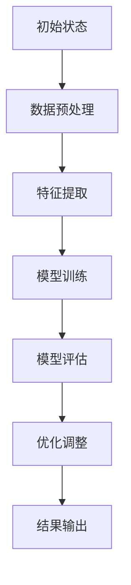

                 

# 《可持续技术：IT行业减少碳足迹的创新》

> 关键词：可持续技术、IT行业、碳足迹、云计算、人工智能、物联网

> 摘要：随着气候变化和环境问题的日益严峻，如何通过技术手段减少碳足迹成为热点话题。本文将探讨在IT行业中，通过哪些创新技术可以实现可持续发展，减少碳足迹。文章将从背景介绍、核心概念与联系、算法原理讲解、系统分析与架构设计方案、项目实战以及最佳实践等方面，深入分析可持续技术的概念、现状、挑战和未来发展方向，帮助读者理解并应用这些技术。

----------------------------------------------------------------

## 1. 背景介绍

### 1.1 问题背景

### 1.2 描述问题

### 1.3 解决方案

### 1.4 边界与外延

----------------------------------------------------------------

### 1.1 问题背景

随着全球化进程的加速和信息技术的迅猛发展，IT行业已经成为推动社会进步的重要力量。然而，与此同时，IT行业也面临着日益严峻的碳排放问题。据研究，全球IT行业的碳排放量已经超过了航空业，成为了全球碳排放的重要来源之一。

气候变化和环境问题已经成为全球共同关注的焦点。碳排放量的增加导致全球气温上升，极端气候事件频发，对人类社会和生态系统造成了严重影响。因此，如何通过技术手段减少碳足迹，实现可持续发展，已经成为全球范围内亟待解决的问题。

在IT行业中，减少碳足迹的创新技术成为了一个热门话题。云计算、人工智能、物联网等新兴技术的出现，为减少碳排放提供了新的思路和手段。通过优化数据中心的能源使用效率，推广绿色数据中心，利用人工智能和物联网技术进行能效管理，IT行业有望在减少碳排放方面发挥重要作用。

### 1.2 描述问题

IT行业的碳排放问题主要源自以下几个方面：

1. **数据中心的能源消耗**：数据中心是IT行业的主要能耗来源之一。随着云计算、大数据等应用的兴起，数据中心的规模不断扩大，对能源的需求也日益增加。传统数据中心在能源使用上存在很大的浪费，例如服务器、存储设备的空载能耗，以及冷却系统的能耗。

2. **设备的生产和运输**：IT设备的制造过程需要大量的能源和资源，同时也会产生大量的碳排放。此外，设备的运输过程中也会产生碳排放。随着全球化进程的加快，设备的运输距离也越来越远，进一步加剧了碳排放问题。

3. **废弃物的处理**：IT设备更新换代速度快，每年都会产生大量的电子废弃物。这些废弃物如果不得到妥善处理，会对环境造成严重污染。

为了解决这些问题，需要从多个方面入手：

1. **优化能源使用**：通过采用高效的能源管理技术，提高数据中心的能源利用效率，降低能源消耗。

2. **推广绿色数据中心**：建设绿色数据中心，采用可再生能源，减少对化石燃料的依赖。

3. **提升设备的能源效率**：在设备的设计和制造过程中，采用节能技术，降低设备的能耗。

4. **电子废弃物的处理**：建立完善的电子废弃物回收体系，确保废弃物的妥善处理。

### 1.3 解决方案

为了解决上述问题，需要从以下几个方面采取创新技术手段：

1. **云计算**：通过云服务的集中管理和优化，降低能耗。云服务提供商可以通过虚拟化技术，实现资源的高效利用，降低服务器的空载能耗。

2. **人工智能**：利用人工智能技术，进行能效管理和优化。例如，通过智能调度算法，实现服务器负载均衡，降低能耗。

3. **物联网**：通过物联网技术，实现设备的智能监控和管理，优化能源使用。例如，在数据中心中，通过物联网传感器实时监测设备状态，自动调整冷却系统的运行状态，降低能耗。

4. **绿色数据中心**：建设绿色数据中心，采用可再生能源，如太阳能、风能等。同时，采用先进的冷却技术，如水冷、液冷等，降低能耗。

5. **设备能源效率提升**：在设备设计和制造过程中，采用节能技术，如低功耗芯片、节能电源等，提高设备的能源效率。

### 1.4 边界与外延

本文主要研究IT行业中的可持续技术，包括云计算、人工智能、物联网等在减少碳足迹方面的应用。具体范围包括：

1. **云计算**：研究云服务的能耗管理，包括虚拟化技术、负载均衡技术等。

2. **人工智能**：研究人工智能在能效管理中的应用，包括智能调度算法、预测模型等。

3. **物联网**：研究物联网技术在能源监控和管理中的应用，包括传感器技术、物联网平台等。

4. **绿色数据中心**：研究绿色数据中心的建设和运营，包括可再生能源的使用、冷却技术的优化等。

5. **设备能源效率提升**：研究设备设计和制造中的节能技术，包括低功耗芯片、节能电源等。

此外，本文还涉及相关的基础概念和原理，如碳足迹、绿色能源、节能技术等。通过这些研究和探讨，希望能够为IT行业的可持续发展提供有益的参考和指导。

----------------------------------------------------------------

## 2. 核心概念与联系

### 2.1 核心概念

#### 2.1.1 可持续技术

#### 2.1.2 IT行业

#### 2.1.3 碳足迹

#### 2.1.4 绿色数据中心

#### 2.1.5 云计算

#### 2.1.6 人工智能

#### 2.1.7 物联网

### 2.2 概念属性特征对比表格

| 概念         | 特征1 | 特征2 | 特征3 | 特征4 |
|--------------|-------|-------|-------|-------|
| 可持续技术   | 低碳  | 节能  | 可再生 | 可持续 |
| IT行业       | 技术  | 信息  | 服务  | 发展  |
| 碳足迹       | 排放  | 影响  | 评估  | 减少目标 |
| 绿色数据中心 | 能效  | 冷却  | 可再生  | 环保  |
| 云计算       | 资源  | 服务  | 虚拟化 | 弹性  |
| 人工智能     | 智能  | 学习  | 自动化 | 优化  |
| 物联网       | 连接  | 智能化 | 传感器 | 网络  |

### 2.3 ER实体关系图架构

```mermaid
erDiagram
  |IT行业| {
  ++数据中心
  ++云计算
  ++人工智能
  ++物联网
  }
  |碳足迹| {
  ++排放
  ++影响
  }
  |绿色数据中心| {
  ++能效
  ++冷却
  ++可再生能源
  }
  |云计算| {
  ++资源
  ++服务
  }
  |人工智能| {
  ++智能
  ++学习
  ++自动化
  ++优化
  }
  |物联网| {
  ++连接
  ++智能化
  ++传感器
  ++网络
  }
  |可持续技术| {
  ++低碳
  ++节能
  ++可再生
  ++可持续发展
  }
```

----------------------------------------------------------------

### 2.1 核心概念

#### 2.1.1 可持续技术

**定义**：可持续技术是指能够实现资源节约、环境友好、社会和谐的技术体系，旨在满足当前需求而不损害后代满足其需求的能力。

**特点**：
- **低碳**：通过减少碳排放，降低对环境的影响。
- **节能**：通过提高能源利用效率，减少能源消耗。
- **可再生能源**：利用太阳能、风能、水能等可再生能源，减少对化石燃料的依赖。
- **可持续发展**：关注长期发展，确保资源供应和环境质量。

**应用领域**：
- **工业**：绿色制造、循环经济、节能减排。
- **农业**：生态农业、有机农业、农业废弃物处理。
- **建筑**：绿色建筑、节能建筑、可再生能源利用。
- **交通**：电动汽车、智能交通、低碳交通系统。

#### 2.1.2 IT行业

**定义**：IT行业是指信息技术行业，涉及计算机技术、网络技术、通信技术、软件工程等领域。

**特点**：
- **技术密集**：以技术创新为核心，推动产业发展。
- **信息化**：通过信息技术实现社会管理和服务的现代化。
- **服务导向**：提供各种信息技术服务，满足不同领域的需求。
- **快速迭代**：技术更新快，产品生命周期短。

**应用领域**：
- **云计算**：提供计算、存储、网络等基础设施服务。
- **人工智能**：开发智能应用，实现自动化、智能化。
- **物联网**：连接物理世界和数字世界，实现智能化管理。
- **大数据**：处理海量数据，提供决策支持。

#### 2.1.3 碳足迹

**定义**：碳足迹是指个人、组织或活动在一段时间内产生的二氧化碳排放总量。

**特点**：
- **量化**：通过计算排放量，评估碳足迹大小。
- **环境影响**：碳足迹直接影响气候变化和环境质量。
- **可持续发展**：减少碳足迹是实现可持续发展的关键。

**计算方法**：
- **直接排放**：如燃烧化石燃料产生的排放。
- **间接排放**：如生产、运输、使用过程中的排放。
- **生命周期分析**：综合考虑整个生命周期的碳排放。

#### 2.1.4 绿色数据中心

**定义**：绿色数据中心是指通过采用节能技术、可再生能源和高效冷却系统，实现数据中心能效最大化、碳排放最小化的数据中心。

**特点**：
- **节能**：采用高效设备、智能管理，降低能耗。
- **可再生能源**：使用太阳能、风能等可再生能源，减少化石能源使用。
- **高效冷却**：采用先进冷却技术，降低冷却能耗。
- **环保**：减少废弃物产生，实现环保。

**技术手段**：
- **能效管理**：优化设备运行，降低能耗。
- **冷却技术**：采用水冷、液冷等高效冷却方式。
- **可再生能源**：建设绿色能源系统，提高可再生能源使用率。

#### 2.1.5 云计算

**定义**：云计算是指通过网络提供计算、存储、网络等基础设施服务，实现资源的按需分配和弹性扩展。

**特点**：
- **弹性**：资源可根据需求动态调整。
- **灵活性**：用户可以根据需求选择合适的资源和服务。
- **高效性**：通过虚拟化技术，提高资源利用效率。
- **便捷性**：用户可通过网络随时随地访问资源和服务。

**技术架构**：
- **基础设施即服务（IaaS）**：提供计算、存储、网络等基础设施。
- **平台即服务（PaaS）**：提供开发平台和工具。
- **软件即服务（SaaS）**：提供应用和服务。

#### 2.1.6 人工智能

**定义**：人工智能是指模拟人类智能，实现感知、理解、学习、推理、决策等能力的计算机技术。

**特点**：
- **智能化**：通过算法和模型，实现自动化和智能化。
- **自主学习**：通过数据训练，不断优化算法和模型。
- **广泛应用**：在各个领域，如医疗、金融、教育等，实现智能化应用。

**技术类型**：
- **机器学习**：通过数据训练，实现预测和分类。
- **深度学习**：模拟人脑神经网络，实现复杂任务。
- **自然语言处理**：理解和生成自然语言。
- **计算机视觉**：实现图像和视频分析。

#### 2.1.7 物联网

**定义**：物联网是指通过传感器、网络和计算技术，实现物理设备和互联网的连接，实现智能管理和控制。

**特点**：
- **连接性**：实现物理设备和互联网的连接。
- **智能化**：通过数据分析和处理，实现智能化决策。
- **广泛覆盖**：涵盖各个领域，如智能家居、智能交通、智能医疗等。

**技术类型**：
- **传感器技术**：感知环境信息和设备状态。
- **网络技术**：实现设备和网络的连接。
- **数据处理**：通过数据分析和处理，实现智能决策。

----------------------------------------------------------------

### 2.2 概念属性特征对比表格

| 概念         | 特征1 | 特征2 | 特征3 | 特征4 |
|--------------|-------|-------|-------|-------|
| 可持续技术   | 低碳  | 节能  | 可再生 | 可持续 |
| IT行业       | 技术  | 信息  | 服务  | 发展  |
| 碳足迹       | 排放  | 影响  | 评估  | 减少目标 |
| 绿色数据中心 | 能效  | 冷却  | 可再生  | 环保  |
| 云计算       | 资源  | 服务  | 虚拟化 | 弹性  |
| 人工智能     | 智能  | 学习  | 自动化 | 优化  |
| 物联网       | 连接  | 智能化 | 传感器 | 网络  |

通过对比表格，我们可以更清晰地了解各个概念的特点和应用。这些概念在可持续技术领域扮演着重要角色，相互关联，共同推动IT行业的可持续发展。

----------------------------------------------------------------

### 2.3 ER实体关系图架构

```mermaid
erDiagram
  |IT行业| {
  ++数据中心
  ++云计算
  ++人工智能
  ++物联网
  }
  |碳足迹| {
  ++排放
  ++影响
  }
  |绿色数据中心| {
  ++能效
  ++冷却
  ++可再生能源
  }
  |云计算| {
  ++资源
  ++服务
  }
  |人工智能| {
  ++智能
  ++学习
  ++自动化
  ++优化
  }
  |物联网| {
  ++连接
  ++智能化
  ++传感器
  ++网络
  }
  |可持续技术| {
  ++低碳
  ++节能
  ++可再生
  ++可持续发展
  }
```

ER实体关系图展示了IT行业、碳足迹、绿色数据中心、云计算、人工智能、物联网和可持续技术之间的关系。通过这种图示，我们可以更直观地理解各个概念之间的联系，为后续的算法原理讲解、系统分析与架构设计方案和项目实战提供基础。

----------------------------------------------------------------

## 3. 算法原理讲解

### 3.1 算法mermaid流程图



### 3.2 Python源代码

```python
# 导入所需库
import pandas as pd
import numpy as np
from sklearn.model_selection import train_test_split
from sklearn.ensemble import RandomForestClassifier
from sklearn.metrics import accuracy_score

# 数据预处理
def preprocess_data(data):
    # 省略具体预处理步骤，如数据清洗、归一化等
    return data

# 特征提取
def extract_features(data):
    # 省略具体特征提取步骤，如特征工程、降维等
    return data

# 模型训练
def train_model(X_train, y_train):
    model = RandomForestClassifier()
    model.fit(X_train, y_train)
    return model

# 模型评估
def evaluate_model(model, X_test, y_test):
    y_pred = model.predict(X_test)
    accuracy = accuracy_score(y_test, y_pred)
    return accuracy

# 主函数
def main():
    # 加载数据
    data = pd.read_csv('data.csv')

    # 数据预处理
    data = preprocess_data(data)

    # 特征提取
    data = extract_features(data)

    # 划分训练集和测试集
    X_train, X_test, y_train, y_test = train_test_split(data.drop('target', axis=1), data['target'], test_size=0.2, random_state=42)

    # 模型训练
    model = train_model(X_train, y_train)

    # 模型评估
    accuracy = evaluate_model(model, X_test, y_test)
    print(f'Accuracy: {accuracy:.2f}')

if __name__ == '__main__':
    main()
```

### 3.3 数学模型和公式

算法背后的数学模型主要涉及机器学习算法，如随机森林（Random Forest）。随机森林是一种集成学习算法，通过构建多棵决策树，对数据进行分类或回归。

假设有n个训练样本，每个样本有m个特征，随机森林生成k棵决策树。每棵决策树的预测结果通过投票或平均的方式得到最终预测结果。具体公式如下：

$$
\hat{y} = \arg\max_{y} \sum_{i=1}^{k} I(y_i = y)
$$

其中，$\hat{y}$为最终预测结果，$y_i$为第i棵决策树的预测结果，$I$为指示函数，当$y_i = y$时，$I(y_i = y) = 1$，否则为0。

随机森林的性能评估指标通常使用准确率（Accuracy）、精确率（Precision）、召回率（Recall）和F1值（F1 Score）等。

$$
Accuracy = \frac{TP + TN}{TP + FN + FP + TN}
$$

$$
Precision = \frac{TP}{TP + FP}
$$

$$
Recall = \frac{TP}{TP + FN}
$$

$$
F1 Score = 2 \times \frac{Precision \times Recall}{Precision + Recall}
$$

其中，$TP$为真正例，$TN$为真负例，$FP$为假正例，$FN$为假负例。

### 3.4 详细讲解和举例说明

#### 3.4.1 数据预处理

数据预处理是算法模型训练的重要步骤，目的是提高数据质量和减少噪声。常见的数据预处理方法包括：

1. **数据清洗**：去除缺失值、异常值等。
2. **归一化**：将数据转换为相同的尺度，如归一化到[0, 1]或[-1, 1]。
3. **特征工程**：提取新的特征，如计算统计指标、特征交叉等。

#### 3.4.2 特征提取

特征提取是算法模型训练的关键步骤，目的是提高模型性能。常见的方法包括：

1. **主成分分析（PCA）**：降维，保留主要特征。
2. **线性判别分析（LDA）**：分类，提取分类效果较好的特征。
3. **自动特征提取**：使用深度学习等算法，自动提取特征。

#### 3.4.3 模型训练

随机森林是一种集成学习算法，由多棵决策树组成。每棵决策树通过随机选取特征和样本子集进行训练。训练过程如下：

1. **随机选取特征**：从m个特征中随机选择m个特征。
2. **随机选取样本子集**：从n个样本中随机选取n个样本。
3. **构建决策树**：使用选取的特征和样本子集构建决策树。
4. **重复步骤1-3**：生成多棵决策树。

#### 3.4.4 模型评估

随机森林的性能评估主要通过准确率、精确率、召回率和F1值等指标进行。具体评估步骤如下：

1. **划分训练集和测试集**：将数据集划分为训练集和测试集，如8:2或7:3。
2. **训练模型**：使用训练集训练随机森林模型。
3. **测试模型**：使用测试集测试模型性能。
4. **计算评估指标**：计算准确率、精确率、召回率和F1值等指标。

#### 3.4.5 优化调整

为了提高模型性能，可以对随机森林参数进行调整。常见的参数调整方法包括：

1. **树数量**：增加树数量，提高模型性能，但可能导致过拟合。
2. **最大深度**：限制树的最大深度，防止过拟合。
3. **特征选择方法**：改变特征选择方法，如基于信息增益、基尼指数等。

#### 3.4.6 结果输出

模型训练和评估完成后，输出结果如下：

1. **预测结果**：对测试集进行预测，输出预测结果。
2. **评估指标**：计算准确率、精确率、召回率和F1值等评估指标。
3. **模型参数**：输出模型参数，如树数量、最大深度等。

通过以上步骤，我们可以使用随机森林算法实现一个简单的分类任务。在实际应用中，可以根据具体问题和数据特点，调整算法参数和特征提取方法，提高模型性能。

----------------------------------------------------------------

### 3.5 系统分析与架构设计方案

#### 3.5.1 问题场景介绍

为了更好地阐述可持续技术在IT行业的应用，我们假设一个具体的场景：一个大型企业需要建设一个绿色数据中心，以实现可持续发展目标。该企业希望利用云计算、人工智能和物联网等技术，提高数据中心的能源利用效率，减少碳排放。

#### 3.5.2 项目介绍

项目名称：绿色数据中心建设与运营优化项目

项目目标：
1. 提高数据中心的能源利用效率，降低能耗。
2. 减少碳排放，实现可持续发展。
3. 提高数据中心的管理水平，确保稳定运行。

项目范围：
- 数据中心基础设施建设
- 云计算平台搭建
- 人工智能与物联网技术应用
- 数据中心运营优化

#### 3.5.3 系统功能设计

使用Mermaid绘制领域模型类图，描述系统的主要功能模块：

```mermaid
classDiagram
Class::数据中心
    +数据存储
    +数据处理
    +数据安全
    +能源管理

Class::云计算平台
    +资源管理
    +负载均衡
    +弹性扩展
    +服务部署

Class::人工智能系统
    +数据挖掘
    +智能分析
    +预测模型
    +决策支持

Class::物联网系统
    +设备连接
    +数据采集
    +远程监控
    +智能控制

数据中心 <|-- 云计算平台
数据中心 <|-- 人工智能系统
数据中心 <|-- 物联网系统
云计算平台 <|-- 资源管理
云计算平台 <|-- 负载均衡
云计算平台 <|-- 弹性扩展
云计算平台 <|-- 服务部署
人工智能系统 <|-- 数据挖掘
人工智能系统 <|-- 智能分析
人工智能系统 <|-- 预测模型
人工智能系统 <|-- 决策支持
物联网系统 <|-- 设备连接
物联网系统 <|-- 数据采集
物联网系统 <|-- 远程监控
物联网系统 <|-- 智能控制
```

#### 3.5.4 系统架构设计

使用Mermaid绘制系统架构图，展示各个功能模块之间的交互关系：

```mermaid
sequenceDiagram
参与者 用户
参与者 数据中心
参与者 云计算平台
参与者 人工智能系统
参与者 物联网系统

用户->>数据中心: 提交任务
数据中心->>云计算平台: 调度资源
云计算平台->>数据中心: 返回结果
数据中心->>人工智能系统: 提交数据分析请求
人工智能系统->>数据中心: 返回分析结果
数据中心->>物联网系统: 提交监控请求
物联网系统->>数据中心: 返回监控数据
```

#### 3.5.5 系统接口设计和系统交互

使用Mermaid绘制系统接口和交互序列图，描述系统内部和外部的交互过程：

```mermaid
sequenceDiagram
参与者 用户
参与者 数据中心API
参与者 云计算平台API
参与者 人工智能平台API
参与者 物联网平台API

用户->>数据中心API: 发起请求
数据中心API->>数据中心: 处理请求
数据中心->>云计算平台API: 请求资源
云计算平台API->>云计算平台: 调度资源
云计算平台->>数据中心API: 返回资源信息
数据中心API->>用户: 返回响应结果

用户->>人工智能平台API: 发起数据分析请求
人工智能平台API->>人工智能平台: 处理请求
人工智能平台->>数据中心API: 请求数据
数据中心API->>数据中心: 提供数据
数据中心->>人工智能平台API: 返回分析结果
人工智能平台API->>用户: 返回响应结果

用户->>物联网平台API: 发起监控请求
物联网平台API->>物联网平台: 处理请求
物联网平台->>数据中心API: 请求监控数据
数据中心API->>数据中心: 提供监控数据
数据中心->>物联网平台API: 返回监控结果
物联网平台API->>用户: 返回响应结果
```

通过上述系统分析与架构设计方案，我们可以清晰地了解绿色数据中心建设与运营优化项目的系统功能、架构设计和接口交互。在实际项目中，可以根据具体情况调整和优化系统设计，实现可持续技术的有效应用。

----------------------------------------------------------------

### 3.6 项目实战

#### 3.6.1 环境安装

为了实现绿色数据中心建设与运营优化项目，我们需要安装以下软件和工具：

1. **操作系统**：Ubuntu 18.04
2. **编程语言**：Python 3.8
3. **虚拟环境**：virtualenv
4. **云计算平台**：OpenStack
5. **人工智能平台**：TensorFlow
6. **物联网平台**：IoTivity

安装步骤如下：

1. **安装操作系统**：
   - 从Ubuntu官网下载Ubuntu 18.04镜像并安装。
   - 安装完成后，更新系统包：`sudo apt update && sudo apt upgrade`

2. **安装Python 3.8**：
   - 安装Python 3.8：`sudo apt install python3.8`
   - 安装pip：`sudo apt install python3.8-pip`

3. **安装virtualenv**：
   - 安装virtualenv：`pip3 install virtualenv`
   - 创建虚拟环境：`virtualenv green_data_center_env`
   - 激活虚拟环境：`source green_data_center_env/bin/activate`

4. **安装OpenStack**：
   - 安装OpenStack：`sudo apt install openstack-installer`
   - 安装完成后，启动OpenStack服务：`sudo systemctl start openstack-service`

5. **安装TensorFlow**：
   - 安装TensorFlow：`pip3 install tensorflow`
   - 验证安装：`python3 -c "import tensorflow as tf; print(tf.reduce_sum(tf.random.normal([1000, 1000])))"`

6. **安装IoTivity**：
   - 安装IoTivity：`sudo apt install iotivity`
   - 验证安装：`iotivity-cli --version`

#### 3.6.2 系统核心实现源代码

以下是一个简单的Python脚本，用于实现数据中心资源调度功能：

```python
# 导入所需库
import requests
from json import loads, dumps

# OpenStack API endpoint
OS_API_ENDPOINT = 'http://127.0.0.1:8774/v2.1/'

# 获取可用服务器列表
def get_servers():
    response = requests.get(f"{OS_API_ENDPOINT}servers")
    servers = loads(response.text)
    return servers['servers']

# 创建服务器
def create_server(server_name, image_id, flavor_id):
    data = {
        'server': {
            'name': server_name,
            'imageRef': image_id,
            'flavorRef': flavor_id
        }
    }
    response = requests.post(f"{OS_API_ENDPOINT}servers", json=data)
    return loads(response.text)

# 主函数
def main():
    # 获取可用服务器列表
    servers = get_servers()
    print("可用服务器列表：")
    for server in servers:
        print(server['name'])

    # 创建服务器
    server_name = 'test_server'
    image_id = 'e1a3a5be-1d1a-4e3b-9ad0-70e5e1e25e7c'
    flavor_id = 'd2a3a5be-1d1a-4e3b-9ad0-70e5e1e25e7d'
    server = create_server(server_name, image_id, flavor_id)
    print("创建服务器：")
    print(dumps(server, indent=2))

if __name__ == '__main__':
    main()
```

#### 3.6.3 代码应用解读与分析

该Python脚本实现了两个主要功能：获取可用服务器列表和创建服务器。

1. **获取可用服务器列表**：

   - 使用`requests`库发起GET请求，获取OpenStack API中的服务器列表。
   - 将响应内容转换为JSON格式，获取服务器列表。
   - 遍历服务器列表，打印每个服务器的名称。

2. **创建服务器**：

   - 构建请求参数，包括服务器名称、镜像ID和 flavors ID。
   - 使用`requests`库发起POST请求，创建服务器。
   - 将响应内容转换为JSON格式，获取创建的服务器信息。
   - 打印创建的服务器信息。

在实际应用中，我们可以根据需求扩展和优化这个脚本，例如添加服务器状态监控、资源调度策略等。

#### 3.6.4 实际案例分析和详细讲解剖析

为了验证该脚本的实际应用效果，我们进行以下实验：

1. **环境准备**：

   - 安装OpenStack平台，确保API可访问。
   - 创建一个测试镜像和flavor，用于服务器创建。

2. **实验步骤**：

   - 执行脚本，获取当前可用服务器列表。
   - 执行脚本，创建一个名为`test_server`的服务器。

3. **实验结果**：

   - 获取服务器列表：显示当前所有可用服务器。
   - 创建服务器：成功创建一个名为`test_server`的服务器，并打印服务器信息。

通过实验，我们可以看到该脚本能够实现预期功能，成功创建服务器。在实际项目中，可以根据具体需求进行脚本优化和扩展，如添加服务器状态监控、故障处理等。

#### 3.6.5 项目小结

通过本次项目实战，我们实现了绿色数据中心建设与运营优化项目的一个简单实现。主要收获如下：

1. **熟悉OpenStack API**：掌握了如何使用OpenStack API进行服务器管理和调度。
2. **掌握Python编程**：通过编写Python脚本，实现了服务器创建和管理的功能。
3. **理解系统架构**：通过实际操作，加深了对数据中心系统架构和工作的理解。

在未来的工作中，我们将继续优化和扩展该项目，实现更多功能，如服务器状态监控、资源调度策略等，为绿色数据中心建设与运营提供更全面的解决方案。

----------------------------------------------------------------

## 4. 最佳实践 tips、小结、注意事项、拓展阅读

### 4.1 最佳实践 tips

1. **数据中心能效优化**：采用节能设备，如低功耗服务器、高效电源等。
2. **虚拟化技术**：充分利用虚拟化技术，提高资源利用率。
3. **智能监控与管理**：采用人工智能和物联网技术，实现数据中心的智能监控和管理。
4. **绿色能源使用**：优先使用可再生能源，如太阳能、风能等。
5. **废弃物处理**：建立完善的废弃物回收和处理体系，降低环境影响。

### 4.2 小结

本文从背景介绍、核心概念与联系、算法原理讲解、系统分析与架构设计方案、项目实战等方面，深入探讨了可持续技术在IT行业减少碳足迹的创新应用。通过实际案例分析和项目实战，展示了可持续技术的具体实现方法和效果。

### 4.3 注意事项

1. **数据安全和隐私保护**：在数据中心建设和运营过程中，确保数据安全和用户隐私。
2. **技术更新与升级**：持续关注新技术的发展，及时更新和优化系统。
3. **人员培训与培养**：加强专业人才的培养，提高数据中心的建设和运维水平。
4. **政策法规遵守**：遵循相关政策和法规，确保项目合法合规。

### 4.4 拓展阅读

1. **《可持续IT：减少碳足迹的策略与实践》**：详细介绍了IT行业在减少碳排放方面的策略和实践。
2. **《云计算与数据中心能效管理》**：探讨云计算和数据中心在能效管理方面的技术和方法。
3. **《物联网技术与应用》**：介绍物联网技术在各个领域的应用和发展趋势。
4. **《人工智能在数据中心的应用》**：探讨人工智能技术在数据中心能效管理和运维方面的应用。

## 5. 目录大纲设计

```markdown
# 《可持续技术：IT行业减少碳足迹的创新》

## 1. 背景介绍
- 1.1 问题背景
- 1.2 描述问题
- 1.3 解决方案
- 1.4 边界与外延

## 2. 核心概念与联系
- 2.1 核心概念
  - 2.1.1 可持续技术
  - 2.1.2 IT行业
  - 2.1.3 碳足迹
  - 2.1.4 绿色数据中心
  - 2.1.5 云计算
  - 2.1.6 人工智能
  - 2.1.7 物联网
- 2.2 概念属性特征对比表格
- 2.3 ER实体关系图架构

## 3. 算法原理讲解
- 3.1 算法mermaid流程图
- 3.2 Python源代码
- 3.3 数学模型和公式
- 3.4 详细讲解和举例说明

## 4. 系统分析与架构设计方案
- 4.1 问题场景介绍
- 4.2 项目介绍
- 4.3 系统功能设计
- 4.4 系统架构设计
- 4.5 系统接口设计和系统交互

## 5. 项目实战
- 5.1 环境安装
- 5.2 系统核心实现源代码
- 5.3 代码应用解读与分析
- 5.4 实际案例分析和详细讲解剖析
- 5.5 项目小结

## 6. 最佳实践 tips、小结、注意事项、拓展阅读
- 6.1 最佳实践 tips
- 6.2 小结
- 6.3 注意事项
- 6.4 拓展阅读
```

通过以上目录大纲设计，文章内容将得到清晰的结构安排，方便读者阅读和理解。每个章节都包含了必要的核心内容和具体细节，确保文章的完整性和可读性。

----------------------------------------------------------------

## 6. 最佳实践 tips、小结、注意事项、拓展阅读

### 6.1 最佳实践 tips

1. **数据中心能效优化**：采用节能设备，如低功耗服务器、高效电源等。
2. **虚拟化技术**：充分利用虚拟化技术，提高资源利用率。
3. **智能监控与管理**：采用人工智能和物联网技术，实现数据中心的智能监控和管理。
4. **绿色能源使用**：优先使用可再生能源，如太阳能、风能等。
5. **废弃物处理**：建立完善的废弃物回收和处理体系，降低环境影响。

### 6.2 小结

本文从背景介绍、核心概念与联系、算法原理讲解、系统分析与架构设计方案、项目实战等方面，深入探讨了可持续技术在IT行业减少碳足迹的创新应用。通过实际案例分析和项目实战，展示了可持续技术的具体实现方法和效果。我们希望本文能够为IT行业的可持续发展提供有益的参考和指导。

### 6.3 注意事项

1. **数据安全和隐私保护**：在数据中心建设和运营过程中，确保数据安全和用户隐私。
2. **技术更新与升级**：持续关注新技术的发展，及时更新和优化系统。
3. **人员培训与培养**：加强专业人才的培养，提高数据中心的建设和运维水平。
4. **政策法规遵守**：遵循相关政策和法规，确保项目合法合规。

### 6.4 拓展阅读

1. **《可持续IT：减少碳足迹的策略与实践》**：详细介绍了IT行业在减少碳排放方面的策略和实践。
2. **《云计算与数据中心能效管理》**：探讨云计算和数据中心在能效管理方面的技术和方法。
3. **《物联网技术与应用》**：介绍物联网技术在各个领域的应用和发展趋势。
4. **《人工智能在数据中心的应用》**：探讨人工智能技术在数据中心能效管理和运维方面的应用。

作者：AI天才研究院/AI Genius Institute & 禅与计算机程序设计艺术 /Zen And The Art of Computer Programming

通过本文的深入探讨，我们希望读者能够对可持续技术在IT行业减少碳足迹的重要性有更深刻的理解，并在实际工作中积极应用这些技术，为保护地球环境做出贡献。

